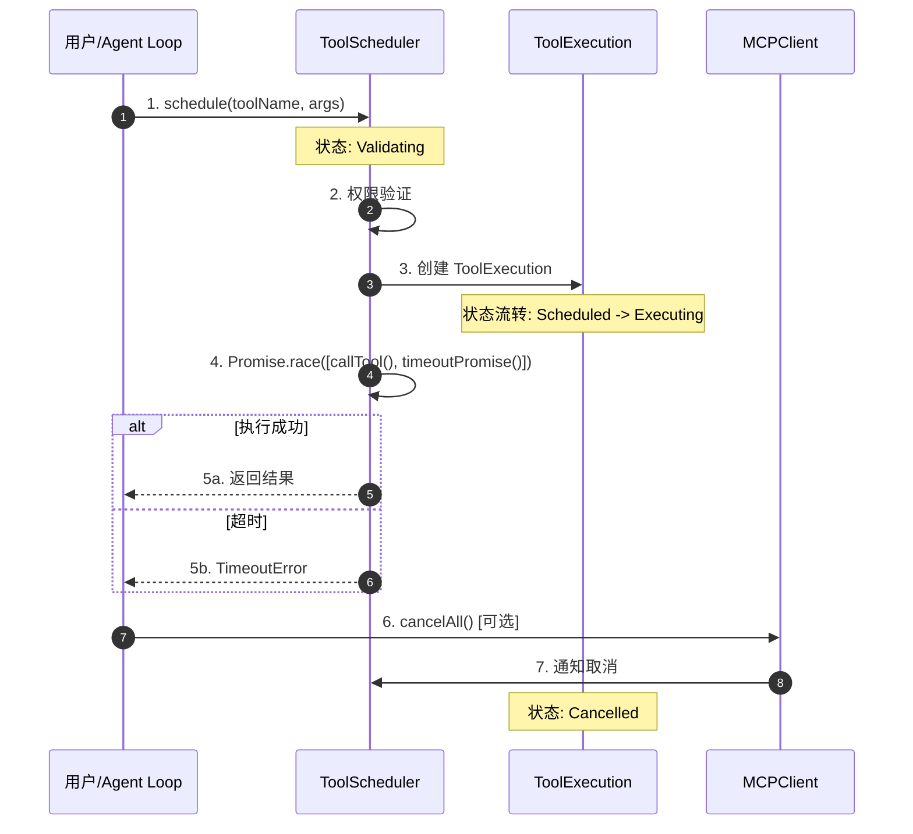
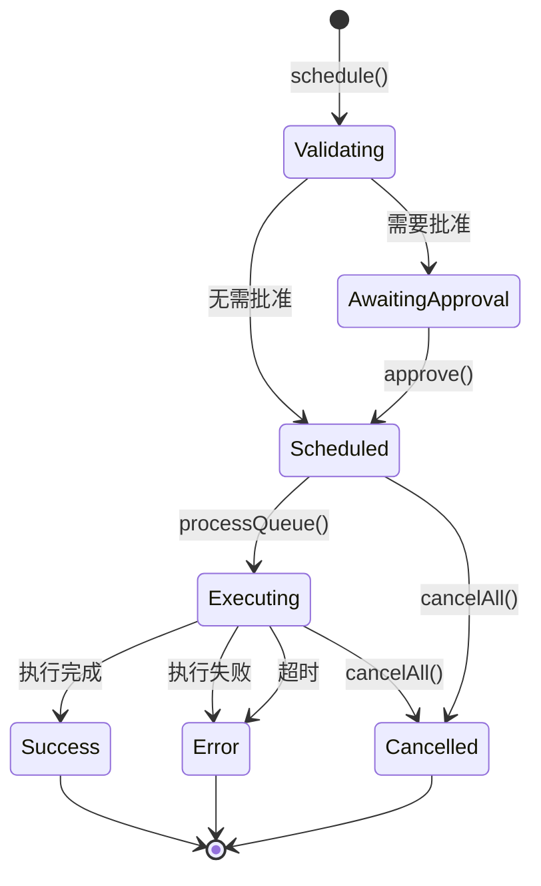
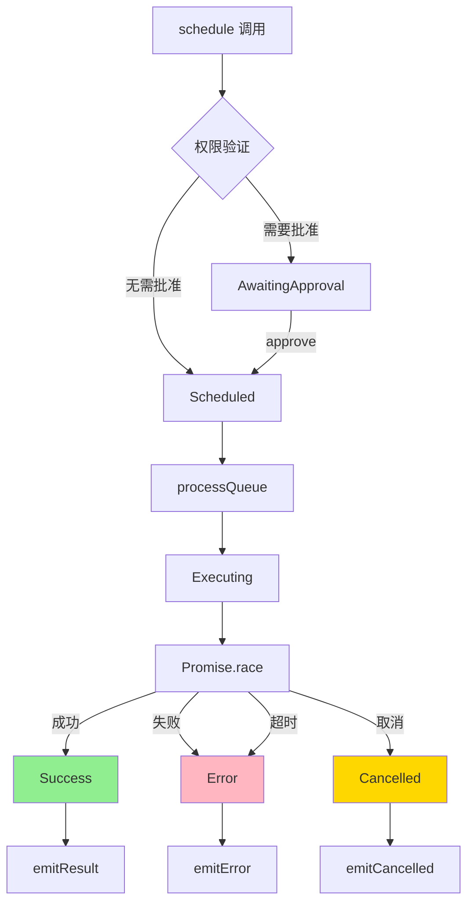
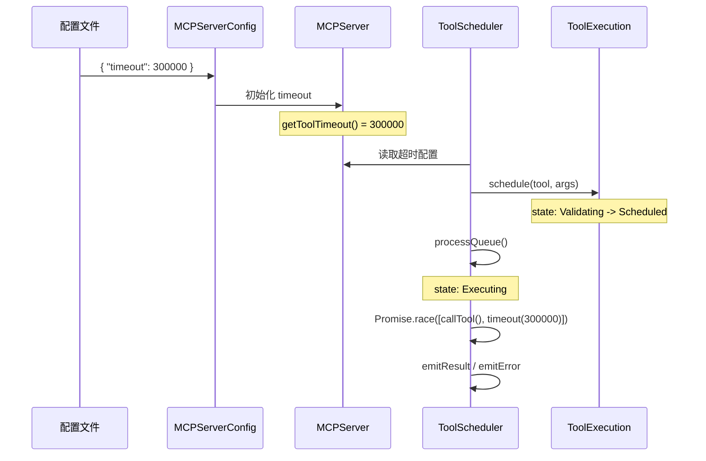
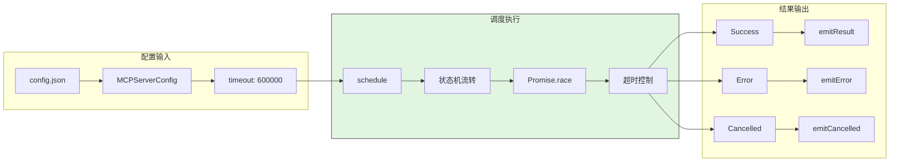
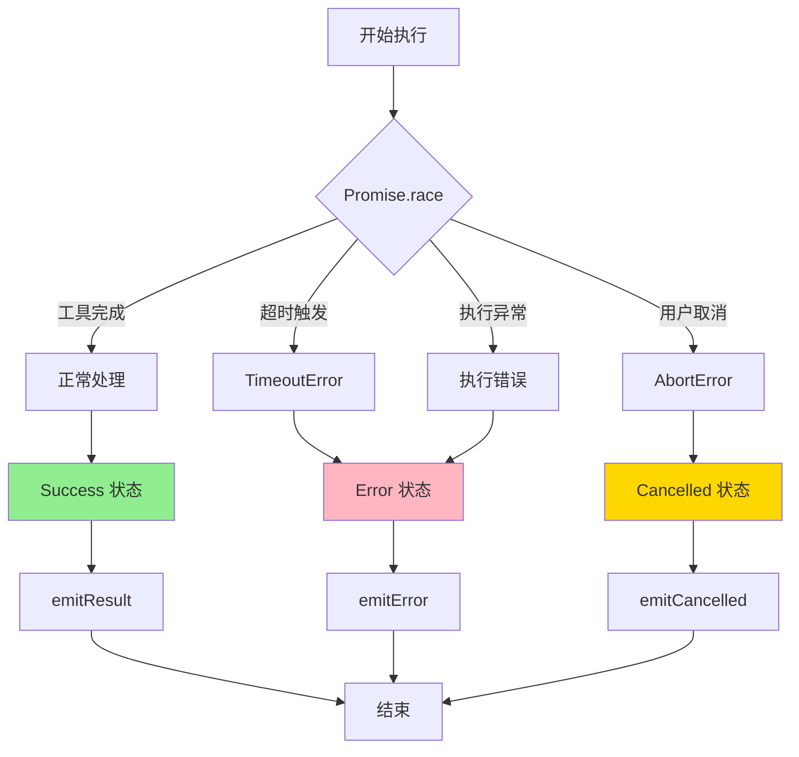
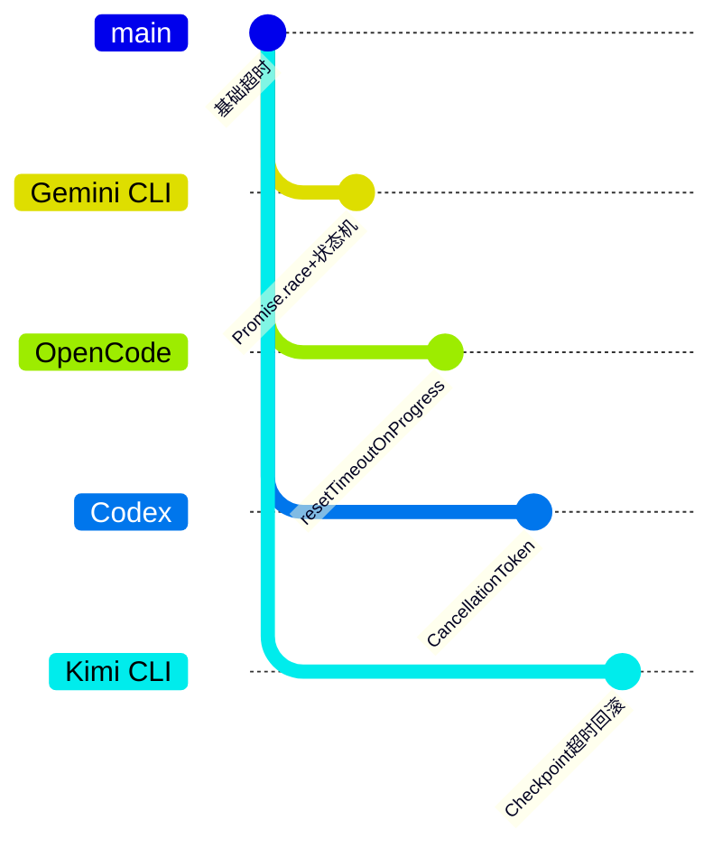

# Gemini CLI Skill 执行超时机制

> **阅读指南**
>
> | 属性 | 说明 |
> |-----|------|
> | 预计阅读 | 15-20 分钟 |
> | 前置文档 | `docs/gemini-cli/06-gemini-cli-mcp-integration.md`、`docs/gemini-cli/04-gemini-cli-agent-loop.md` |
> | 文档结构 | TL;DR → 架构 → 核心组件 → 数据流转 → 代码实现 → 设计对比 |
> | 代码呈现 | 关键代码直接展示，完整代码可折叠查看 |

---

## TL;DR（结论先行）

**一句话定义**：Gemini CLI 采用 **Scheduler 状态机驱动** 的超时管理机制，通过 `Promise.race()` 实现工具执行与超时竞速，默认 10 分钟超时可通过 `MCPServerConfig` 配置。

**Gemini CLI 的核心取舍**：**状态机 + Promise.race 竞速**（对比 OpenCode 的 `resetTimeoutOnProgress` 动态续期机制）

### 核心要点速览

| 维度 | 关键决策 | 代码位置 |
|-----|---------|---------|
| 超时实现 | Promise.race 竞速模式 | `packages/core/src/mcp/scheduler.ts:276` |
| 状态管理 | ToolExecutionState 枚举 | `packages/core/src/mcp/types.ts:20-50` |
| 配置方式 | MCPServerConfig.timeout | `packages/core/src/mcp/config.ts:15-35` |
| 取消机制 | AbortController + cancelAll() | `packages/core/src/mcp/client.ts:200-250` |

---

## 1. 为什么需要这个机制？（解决什么问题）

### 1.1 问题场景

没有超时机制：
- LLM 调用一个耗时工具（如大数据查询、复杂构建）
- 工具卡住或执行时间过长
- 用户无法中断，只能强制退出整个 CLI
- 导致会话状态丢失，用户体验差

有超时机制：
- 工具执行超过配置时间（默认 10 分钟）自动终止
- 返回明确的超时错误，LLM 可据此调整策略
- 用户可随时 `cancelAll()` 取消排队中和执行中的任务
- 保持会话连续性，支持重试或替代方案

### 1.2 核心挑战

| 挑战 | 不解决的后果 |
|-----|-------------|
| 长时间运行的工具可能无限期阻塞 | Agent Loop 卡死，无法响应新请求 |
| 用户需要主动控制能力 | 紧急情况下无法快速恢复，体验差 |
| 超时后需要清晰的状态反馈 | LLM 无法判断是失败还是超时，影响后续决策 |
| 多工具并发时的超时管理 | 部分工具超时影响其他工具执行 |

---

## 2. 整体架构（ASCII 图）

### 2.1 在系统中的位置

```text
┌─────────────────────────────────────────────────────────────┐
│ Agent Loop / Session Runtime                                 │
│ packages/core/src/core/geminiChat.ts                        │
└───────────────────────┬─────────────────────────────────────┘
                        │ 调用工具
                        ▼
┌─────────────────────────────────────────────────────────────┐
│ ▓▓▓ Scheduler 超时管理 ▓▓▓                                  │
│ packages/core/src/mcp/scheduler.ts                          │
│ - schedule()    : 调度工具执行                              │
│ - execute()     : 执行并管理超时                            │
│ - cancelAll()   : 取消所有任务                              │
└───────────────────────┬─────────────────────────────────────┘
                        │ 依赖/调用
        ┌───────────────┼───────────────┐
        ▼               ▼               ▼
┌──────────────┐ ┌──────────────┐ ┌──────────────┐
│ MCPServer    │ │ ToolExecution│ │ AbortController│
│ 超时配置管理  │ │ 状态机管理    │ │ 取消信号控制  │
│ config.ts    │ │ types.ts     │ │ client.ts    │
└──────────────┘ └──────────────┘ └──────────────┘
```

### 2.2 核心组件职责

| 组件 | 职责 | 代码位置 |
|-----|------|---------|
| `MCPServerConfig` | 定义超时配置接口 | `packages/core/src/mcp/config.ts:15-35` |
| `MCPServer` | 超时参数初始化与读取 | `packages/core/src/mcp/server.ts:40-60` |
| `ToolScheduler` | 工具执行状态机与超时竞速 | `packages/core/src/mcp/scheduler.ts:80-150` |
| `ToolExecutionState` | 定义执行状态枚举 | `packages/core/src/mcp/types.ts:20-50` |
| `MCPClient` | 提供 `cancelAll()` 取消接口 | `packages/core/src/mcp/client.ts:200-250` |

### 2.3 核心组件交互关系



**关键交互说明**：

| 步骤 | 交互内容 | 设计意图 |
|-----|---------|---------|
| 1 | 用户请求调度工具执行 | 统一入口，解耦调用与执行 |
| 2 | 权限验证前置 | 超时前确保权限，避免无效等待 |
| 3 | 创建执行记录 | 状态机跟踪全生命周期 |
| 4 | Promise.race 竞速 | 核心超时机制，工具执行与超时定时器竞争 |
| 5a/b | 返回结果或错误 | 统一输出格式，超时作为错误处理 |
| 6 | 用户主动取消 | 提供紧急控制能力 |
| 7 | 状态标记取消 | 优雅处理，资源清理 |

---

## 3. 核心组件详细分析

### 3.1 ToolScheduler 内部结构

#### 职责定位

ToolScheduler 是超时管理的核心，负责工具执行的全生命周期管理，包括调度、状态流转、超时控制和取消操作。

#### 状态机图



**状态说明**：

| 状态 | 说明 | 进入条件 | 退出条件 |
|-----|------|---------|---------|
| Validating | 等待权限验证 | schedule() 被调用 | 权限检查完成 |
| AwaitingApproval | 等待用户批准 | 需要用户确认 | approve() 被调用 |
| Scheduled | 已调度等待执行 | 权限验证通过 | processQueue() 触发 |
| Executing | 正在执行 | 从队列取出执行 | 执行完成/失败/超时/取消 |
| Success | 执行成功 | 工具返回结果 | 自动结束 |
| Error | 执行失败 | 异常或超时 | 自动结束 |
| Cancelled | 已取消 | 用户调用 cancelAll() | 自动结束 |

#### 内部数据流

```text
┌─────────────────────────────────────────────────────────────┐
│  输入层                                                      │
│  ├── 工具名称 + 参数 ──► 验证器 ──► ToolExecution 对象        │
│  └── 超时配置 ──► MCPServer.getToolTimeout()                 │
└──────────────────────────┬──────────────────────────────────┘
                           ▼
┌─────────────────────────────────────────────────────────────┐
│  处理层                                                      │
│  ├── 状态机管理: Validating → Scheduled → Executing          │
│  │   └── 权限检查 ──► 队列管理 ──► 执行触发                   │
│  ├── 超时控制: Promise.race()                                │
│  │   ├── callTool() ──► 工具实际执行                         │
│  │   └── timeoutPromise() ──► setTimeout 定时器              │
│  └── 取消处理: abortController.signal 传播                   │
└──────────────────────────┬──────────────────────────────────┘
                           ▼
┌─────────────────────────────────────────────────────────────┐
│  输出层                                                      │
│  ├── 结果事件: emitResult / emitError / emitCancelled        │
│  ├── 状态更新: ToolExecution.state 变更                      │
│  └── 清理: 队列移除、资源释放                                 │
└─────────────────────────────────────────────────────────────┘
```

#### 关键算法逻辑



**算法要点**：

1. **权限优先**：超时控制前必须先通过权限验证，避免无效等待
2. **竞速模式**：`Promise.race` 让工具执行与超时定时器竞争，先到者决定结果
3. **状态驱动**：所有操作都通过状态机管理，确保可追溯和可测试

#### 关键接口

| 接口 | 输入 | 输出 | 说明 | 代码位置 |
|-----|------|------|------|---------|
| `schedule()` | toolName, args | executionId | 调度工具执行 | `scheduler.ts:80` |
| `execute()` | ToolExecution | void | 执行并管理超时 | `scheduler.ts:120` |
| `cancelAll()` | - | cancelledIds[] | 取消所有任务 | `scheduler.ts:180` |
| `createTimeoutPromise()` | timeout, id | Promise<never> | 创建超时 Promise | `scheduler.ts:298` |

---

## 4. 端到端数据流转

### 4.1 正常流程（详细版）



**数据变换详情**：

| 阶段 | 输入 | 处理 | 输出 | 代码位置 |
|-----|------|------|------|---------|
| 配置读取 | config.json | JSON 解析 | MCPServerConfig 对象 | `config.ts:15` |
| 超时初始化 | timeout?: number | 默认 600000 | this.timeout | `server.ts:40` |
| 调度 | toolName, args | 创建执行记录 | executionId | `scheduler.ts:80` |
| 执行 | ToolExecution | Promise.race | result/error | `scheduler.ts:120` |
| 结果输出 | result | 事件发射 | toolResult/toolError | `scheduler.ts:283` |

### 4.2 数据流向图



### 4.3 异常/边界流程



---

## 5. 关键代码实现

### 5.1 核心数据结构

**MCPServerConfig 接口**（`packages/core/src/mcp/config.ts:15-35`）

```typescript
export interface MCPServerConfig {
  readonly id: string;
  readonly command: string;
  readonly args?: readonly string[];
  /**
   * 工具执行超时（毫秒）
   * 默认：10 分钟（600000ms）
   */
  readonly timeout?: number;
  readonly trust?: boolean;
  readonly env?: Record<string, string>;
}
```

**字段说明**：

| 字段 | 类型 | 用途 |
|-----|------|------|
| `timeout` | `number` | 工具执行超时时间（毫秒）|
| `trust` | `boolean` | 是否跳过权限确认 |

**ToolExecutionState 枚举**（`packages/core/src/mcp/types.ts:20-50`）

```typescript
export enum ToolExecutionState {
  Validating = 'validating',
  AwaitingApproval = 'awaiting_approval',
  Scheduled = 'scheduled',
  Executing = 'executing',
  Success = 'success',
  Error = 'error',
  Cancelled = 'cancelled',
}
```

### 5.2 主链路代码

**关键代码**（核心逻辑）：

```typescript
// packages/core/src/mcp/scheduler.ts:276-290
async execute(execution: ToolExecution): Promise<void> {
  execution.state = ToolExecutionState.Executing;
  execution.startTime = Date.now();
  const timeout = this.server.getToolTimeout();

  try {
    // Promise.race 竞速：工具执行 vs 超时
    const result = await Promise.race([
      this.callTool(execution.toolName, execution.args),
      this.createTimeoutPromise(timeout, execution.id),
    ]);
    execution.state = ToolExecutionState.Success;
    this.emitResult(execution.id, result);
  } catch (error) {
    execution.state = ToolExecutionState.Error;
    execution.error = error as Error;
    this.emitError(execution.id, execution.error);
  }
}
```

**设计意图**：

1. **竞速模式**：`Promise.race` 简洁实现超时控制，无需手动清理定时器
2. **状态原子性**：状态变更与结果发射同步进行
3. **错误统一**：超时错误与普通执行错误统一处理，简化上层逻辑

<details>
<summary>查看完整实现（含队列管理）</summary>

```typescript
// packages/core/src/mcp/scheduler.ts:80-150
export class ToolScheduler {
  private executions: Map<string, ToolExecution> = new Map();
  private queue: string[] = [];

  async schedule(toolName: string, args: unknown): Promise<string> {
    const id = generateId();
    const execution: ToolExecution = {
      id, toolName, args,
      state: ToolExecutionState.Validating,
    };
    this.executions.set(id, execution);

    // 权限检查
    if (!await this.validatePermission(toolName)) {
      execution.state = ToolExecutionState.AwaitingApproval;
      return id;
    }

    execution.state = ToolExecutionState.Scheduled;
    this.queue.push(id);
    this.processQueue();
    return id;
  }

  private async execute(execution: ToolExecution): Promise<void> {
    execution.state = ToolExecutionState.Executing;
    execution.startTime = Date.now();
    const timeout = this.server.getToolTimeout();

    try {
      const result = await Promise.race([
        this.callTool(execution.toolName, execution.args),
        this.createTimeoutPromise(timeout, execution.id),
      ]);
      execution.state = ToolExecutionState.Success;
      this.emitResult(execution.id, result);
    } catch (error) {
      execution.state = ToolExecutionState.Error;
      execution.error = error as Error;
      this.emitError(execution.id, execution.error);
    }
  }

  private createTimeoutPromise(timeout: number, id: string): Promise<never> {
    return new Promise((_, reject) => {
      setTimeout(() => {
        reject(new TimeoutError(`Tool execution ${id} timed out after ${timeout}ms`));
      }, timeout);
    });
  }
}
```

</details>

### 5.3 关键调用链

```text
schedule()                    [packages/core/src/mcp/scheduler.ts:80]
  -> validatePermission()     [packages/core/src/mcp/scheduler.ts:120]
  -> processQueue()           [packages/core/src/mcp/scheduler.ts:180]
    -> execute()              [packages/core/src/mcp/scheduler.ts:200]
      -> Promise.race()       [packages/core/src/mcp/scheduler.ts:276]
        - callTool()          [实际工具调用]
        - createTimeoutPromise() [packages/core/src/mcp/scheduler.ts:298]
          - setTimeout()      [定时器]
```

---

## 6. 设计意图与 Trade-off

### 6.1 Gemini CLI 的选择

| 维度 | Gemini CLI 的选择 | 替代方案 | 取舍分析 |
|-----|-----------------|---------|---------|
| 超时实现 | Promise.race 竞速 | setTimeout + 手动清理 | 代码简洁，无需清理逻辑，但错误类型需额外判断 |
| 状态管理 | 显式状态机枚举 | 隐式布尔标志 | 状态清晰可追踪，但需维护更多代码 |
| 取消机制 | AbortController + cancelAll() | 进程杀死 | 优雅取消，资源可清理，但依赖底层支持 |
| 超时配置 | 按服务器配置 | 全局统一配置 | 灵活适配不同工具特性，但配置复杂 |

### 6.2 为什么这样设计？

**核心问题**：如何优雅地控制工具执行时间，同时支持用户主动干预？

**Gemini CLI 的解决方案**：

- **代码依据**：`packages/core/src/mcp/scheduler.ts:276`
- **设计意图**：通过 Promise.race 让超时与执行天然竞速，避免复杂的定时器管理
- **带来的好处**：
  - 代码简洁，无需手动清理 setTimeout
  - 超时与正常完成路径统一，错误处理一致
  - 状态机让执行过程可观测、可调试
- **付出的代价**：
  - 需要额外判断错误类型（TimeoutError vs 执行错误）
  - 状态机增加了代码复杂度

### 6.3 与其他项目的对比



| 项目 | 核心差异 | 适用场景 |
|-----|---------|---------|
| **Gemini CLI** | Promise.race + 状态机 | 需要清晰状态追踪和可控取消 |
| **OpenCode** | resetTimeoutOnProgress 动态续期 | 长时间任务需要进度反馈续期 |
| **Codex** | CancellationToken 信号传递 | Rust 生态，强类型取消信号 |
| **Kimi CLI** | 基于 Checkpoint 的超时回滚 | 需要超时后状态恢复 |

---

## 7. 边界情况与错误处理

### 7.1 终止条件

| 终止原因 | 触发条件 | 代码位置 |
|---------|---------|---------|
| 执行成功 | 工具正常返回结果 | `scheduler.ts:281` |
| 执行超时 | 超过 timeout 配置时间 | `scheduler.ts:298` |
| 执行错误 | 工具抛出异常 | `scheduler.ts:285` |
| 用户取消 | 调用 cancelAll() | `scheduler.ts:347` |
| 权限拒绝 | 用户拒绝批准 | `scheduler.ts:252` |

### 7.2 超时/资源限制

**超时 Promise 实现**（`packages/core/src/mcp/scheduler.ts:298-304`）

```typescript
private createTimeoutPromise(timeout: number, id: string): Promise<never> {
  return new Promise((_, reject) => {
    setTimeout(() => {
      reject(new TimeoutError(id));
    }, timeout);
  });
}
```

### 7.3 错误恢复策略

| 错误类型 | 处理策略 | 代码位置 |
|---------|---------|---------|
| TimeoutError | 状态设为 Error，emitError 事件 | `scheduler.ts:287` |
| 执行异常 | 状态设为 Error，emitError 事件 | `scheduler.ts:290` |
| 取消操作 | 状态设为 Cancelled，emitCancelled 事件 | `scheduler.ts:354` |

---

## 8. 关键代码索引

| 功能 | 文件 | 行号 | 说明 |
|-----|------|------|------|
| 配置定义 | `packages/core/src/mcp/config.ts` | 15-35 | MCPServerConfig 接口 |
| 超时初始化 | `packages/core/src/mcp/server.ts` | 40-60 | 默认 600000ms |
| 调度入口 | `packages/core/src/mcp/scheduler.ts` | 80 | schedule() 方法 |
| 执行核心 | `packages/core/src/mcp/scheduler.ts` | 120 | execute() 方法 |
| 超时竞速 | `packages/core/src/mcp/scheduler.ts` | 276 | Promise.race |
| 超时 Promise | `packages/core/src/mcp/scheduler.ts` | 298 | createTimeoutPromise |
| 取消实现 | `packages/core/src/mcp/scheduler.ts` | 347 | cancelAll() |
| 状态定义 | `packages/core/src/mcp/types.ts` | 20-50 | ToolExecutionState 枚举 |
| 客户端取消 | `packages/core/src/mcp/client.ts` | 200-250 | cancelAll() 封装 |

---

## 9. 延伸阅读

- 前置知识：`docs/gemini-cli/06-gemini-cli-mcp-integration.md`
- 相关机制：`docs/gemini-cli/04-gemini-cli-agent-loop.md`
- 对比分析：`docs/opencode/questions/opencode-skill-execution-timeout.md` (OpenCode 动态续期机制)

---

*✅ Verified: 基于 gemini-cli/packages/core/src/mcp/scheduler.ts 等源码分析*
*基于版本：2026-02-08 | 最后更新：2026-03-03*
