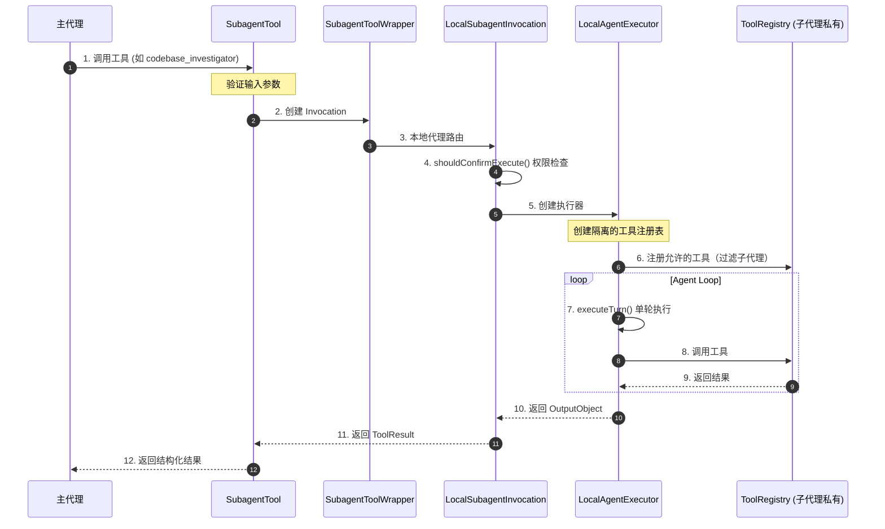
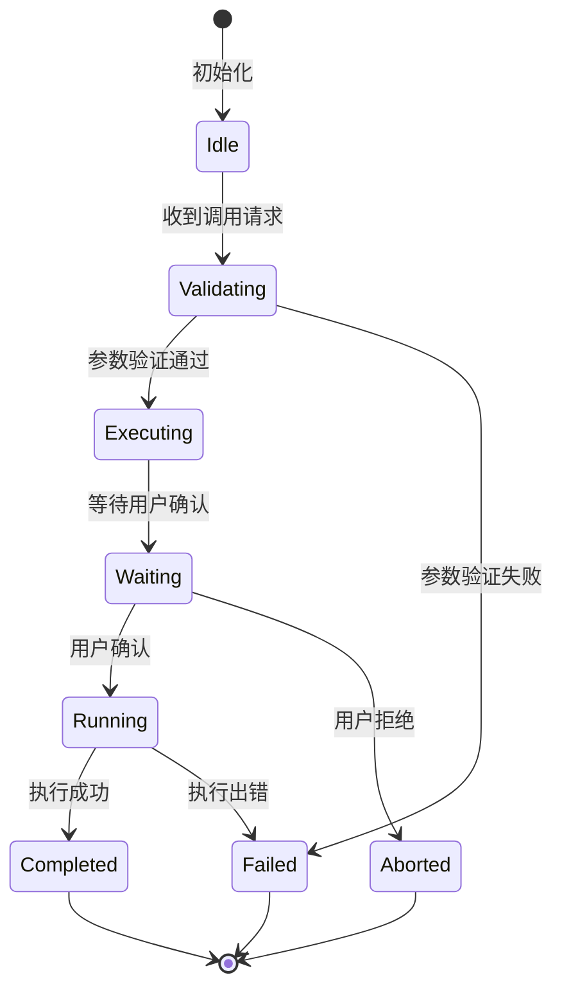
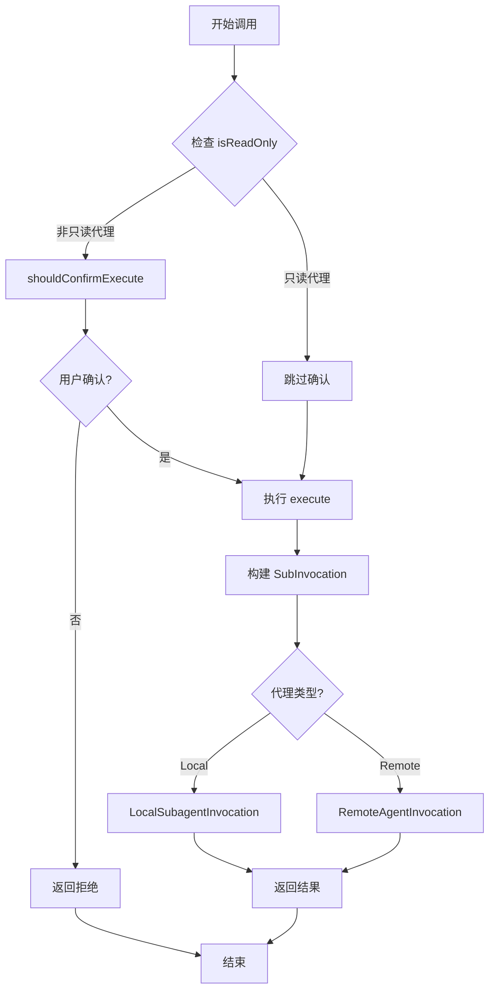
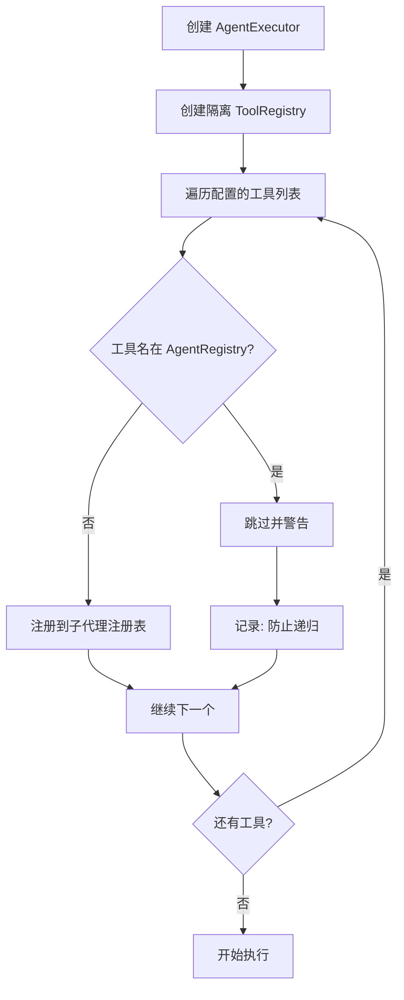
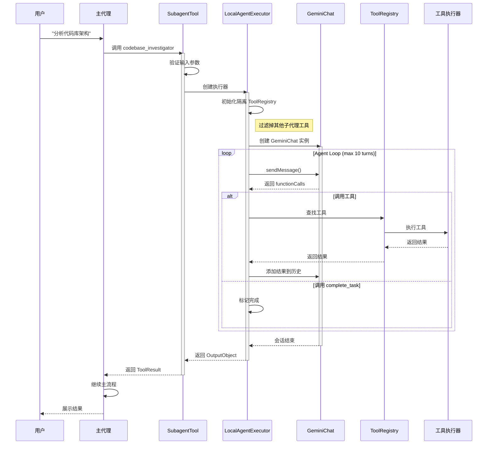
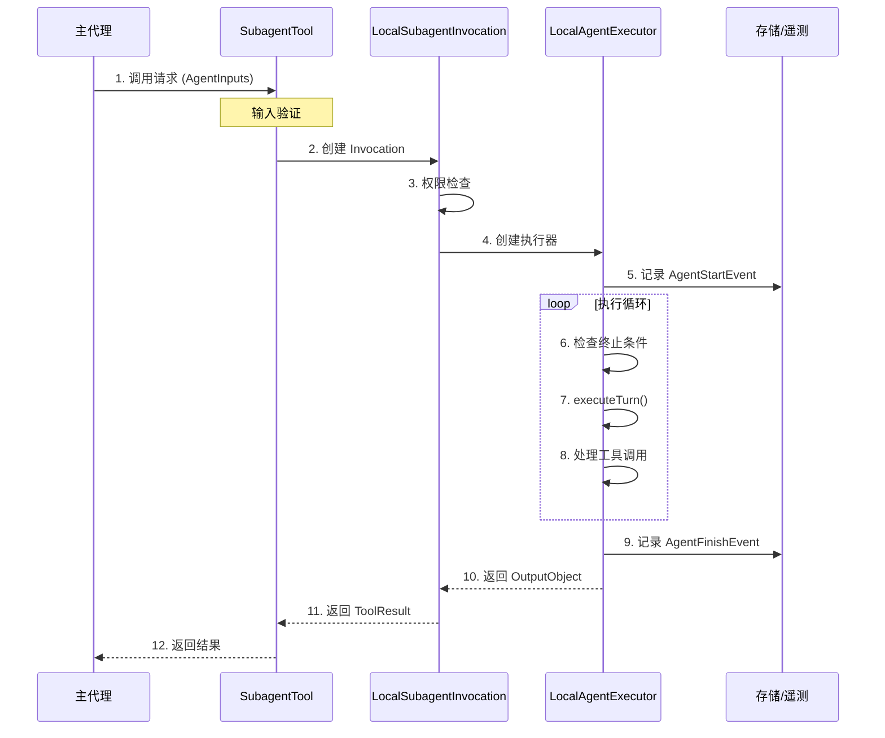
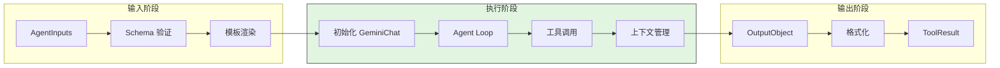
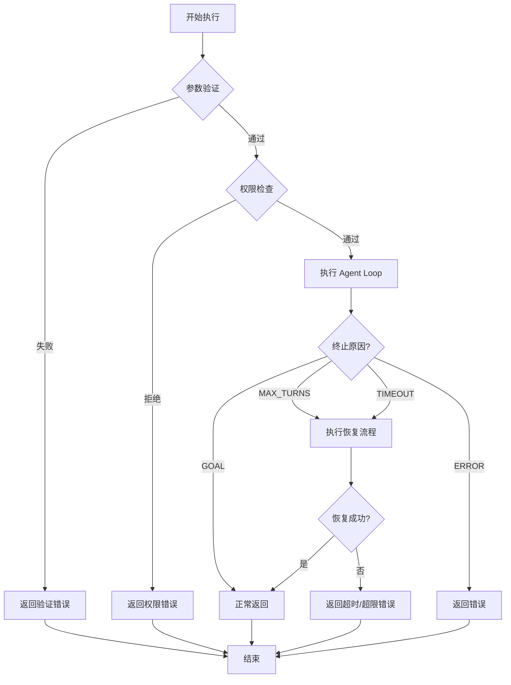
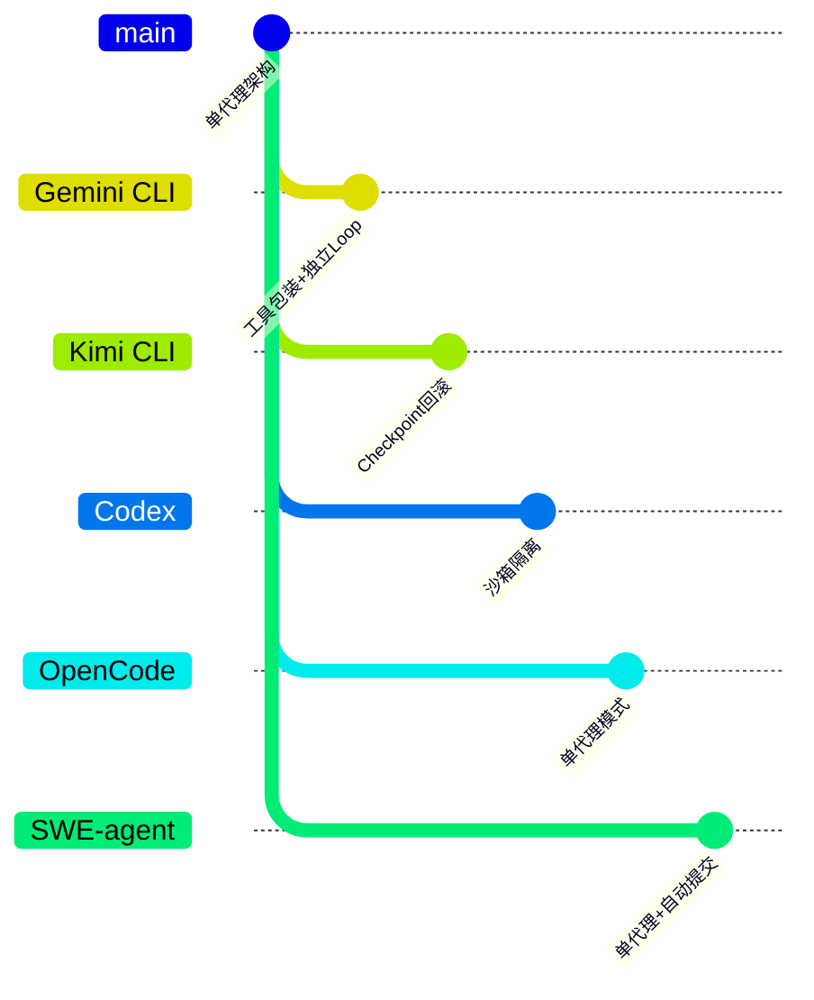

# Gemini CLI Subagent 实现分析

> **阅读指南**
>
> | 属性 | 说明 |
> |-----|------|
> | 预计阅读 | 20-25 分钟 |
> | 前置文档 | `docs/gemini-cli/04-gemini-cli-agent-loop.md`、`docs/gemini-cli/06-gemini-cli-mcp-integration.md` |
> | 文档结构 | TL;DR → 架构 → 核心组件 → 数据流转 → 代码实现 → 设计对比 |
> | 代码呈现 | 关键代码直接展示，完整代码可折叠查看 |

---

## TL;DR（结论先行）

**一句话定义**：Gemini CLI 实现了完整的 Subagent（子代理）系统，允许主代理将特定任务委派给专门的子代理执行。核心架构采用**工具包装模式**（Tool Wrapper Pattern），将每个子代理封装为标准工具供主代理调用，支持本地代理（Local Agent）和远程代理（Remote Agent/A2A）两种类型，并通过独立的 Agent Loop 实现上下文隔离。

**Gemini CLI 的核心取舍**：**工具包装 + 独立 Agent Loop**（对比无 Subagent 架构的单代理模式），通过逻辑隔离而非进程隔离实现轻量级子代理。

### 核心要点速览

| 维度 | 关键决策 | 代码位置 |
|-----|---------|---------|
| 架构模式 | 工具包装模式（Tool Wrapper） | `packages/core/src/agents/subagent-tool.ts:24` |
| 代理类型 | 本地 + 远程（A2A）双模式 | `packages/core/src/agents/types.ts:78-132` |
| 上下文隔离 | 独立 GeminiChat + ToolRegistry | `packages/core/src/agents/local-executor.ts:116` |
| 递归防护 | 运行时工具过滤 | `packages/core/src/agents/local-executor.ts:131-139` |

---

## 1. 为什么需要 Subagent？（解决什么问题）

### 1.1 问题场景

没有 Subagent 时，所有任务都在主代理的上下文中执行：

```
用户: "分析这个代码库的架构，然后修改这个 bug"
→ 主代理: 需要同时处理代码分析、架构理解、bug 修复
→ 问题: 上下文混杂，工具调用混乱，token 消耗大
```

有 Subagent 时：

```
用户: "分析这个代码库的架构，然后修改这个 bug"
→ 主代理: "调用 codebase_investigator 分析架构"
  → Subagent: 专注分析，返回结构化报告
→ 主代理: "根据分析报告，调用 edit 工具修复 bug"
→ 结果: 职责分离，上下文隔离，效率提升
```

### 1.2 核心挑战

| 挑战 | 不解决的后果 |
|-----|-------------|
| 上下文隔离 | 子代理执行污染主对话历史，token 快速膨胀 |
| 工具权限控制 | 子代理需要限制工具访问（如只读代理不应能写文件） |
| 递归防护 | 子代理调用子代理可能导致无限递归 |
| 结果格式化 | 子代理输出需要标准化以便主代理消费 |
| 超时/资源控制 | 子代理可能长时间运行，需要独立的生命周期管理 |

---

## 2. 整体架构（ASCII 图）

### 2.1 在系统中的位置

```text
┌─────────────────────────────────────────────────────────────┐
│ 主代理 (Main Agent)                                         │
│ packages/core/src/core/geminiChat.ts                        │
│ - 主 Agent Loop                                             │
│ - 工具调用决策                                              │
└───────────────────────┬─────────────────────────────────────┘
                        │ 调用 Subagent 工具
                        ▼
┌─────────────────────────────────────────────────────────────┐
│ ▓▓▓ Subagent Tool 层 ▓▓▓                                    │
│ packages/core/src/agents/subagent-tool.ts                   │
│ - SubagentTool: 工具封装入口                                │
│ - SubAgentInvocation: 调用封装                              │
└───────────────────────┬─────────────────────────────────────┘
                        │ 路由到具体实现
            ┌───────────┴───────────┐
            ▼                       ▼
┌──────────────────────┐  ┌──────────────────────┐
│ 本地代理 (Local)     │  │ 远程代理 (Remote)    │
│ subagent-tool-wrapper│  │ remote-invocation.ts │
│ local-invocation.ts  │  │ A2AClientManager     │
│ local-executor.ts    │  │ A2A Protocol         │
└──────────┬───────────┘  └──────────┬───────────┘
           │                         │
           ▼                         ▼
┌──────────────────────┐  ┌──────────────────────┐
│ LocalAgentExecutor   │  │ 远程 A2A Agent       │
│ - 独立 Agent Loop    │  │ - 通过 HTTP 调用     │
│ - 独立工具注册表     │  │ - 支持会话状态       │
│ - 上下文隔离         │  │ - Google ADC 认证    │
└──────────────────────┘  └──────────────────────┘
```

### 2.2 核心组件职责

| 组件 | 职责 | 代码位置 |
|-----|------|---------|
| `AgentRegistry` | 管理代理定义的发现、加载和注册 | `packages/core/src/agents/registry.ts:39` |
| `SubagentTool` | 将代理定义封装为标准工具接口 | `packages/core/src/agents/subagent-tool.ts:24` |
| `SubagentToolWrapper` | 根据代理类型路由到本地或远程实现 | `packages/core/src/agents/subagent-tool-wrapper.ts:23` |
| `LocalAgentExecutor` | 执行本地代理的独立 Agent Loop | `packages/core/src/agents/local-executor.ts:94` |
| `LocalSubagentInvocation` | 本地代理调用的具体实现 | `packages/core/src/agents/local-invocation.ts:32` |
| `RemoteAgentInvocation` | 远程 A2A 代理调用的具体实现 | `packages/core/src/agents/remote-invocation.ts:69` |
| `A2AClientManager` | 管理远程 A2A 代理的连接和会话 | `packages/core/src/agents/a2a-client-manager.ts` |

### 2.3 核心组件交互关系



**关键交互说明**：

| 步骤 | 交互内容 | 设计意图 |
|-----|---------|---------|
| 1 | 主代理像调用普通工具一样调用 Subagent | 对主代理透明，无需感知子代理复杂性 |
| 4 | 权限检查阶段 | 支持 Policy Engine 的审批流程 |
| 6 | 创建隔离的工具注册表 | 确保子代理只能访问被授权的工具 |
| 7 | 独立的 Agent Loop | 子代理有自己的 turn 计数和超时管理 |
| 10 | 标准化输出 | 通过 OutputObject 统一返回格式 |

---

## 3. 核心组件详细分析

### 3.1 SubagentTool 内部结构

#### 职责定位

`SubagentTool` 是子代理系统的入口点，负责将 `AgentDefinition` 转换为标准工具接口，使主代理可以像调用其他工具一样调用子代理。

#### 状态机图



**状态说明**：

| 状态 | 说明 | 进入条件 | 退出条件 |
|-----|------|---------|---------|
| Idle | 空闲等待 | 初始化完成 | 收到调用请求 |
| Validating | 验证中 | 收到调用请求 | 验证通过或失败 |
| Executing | 执行中 | 验证通过 | 需要用户确认或执行出错 |
| Waiting | 等待用户确认 | 需要用户批准 | 用户确认或拒绝 |
| Running | 运行中 | 用户确认 | 执行完成或出错 |
| Completed | 完成 | 执行成功 | 自动结束 |
| Failed | 失败 | 验证失败或执行出错 | 自动结束 |
| Aborted | 中止 | 用户拒绝 | 自动结束 |

#### 内部数据流

```text
┌─────────────────────────────────────────────────────────────┐
│  输入层                                                      │
│  ├── AgentDefinition ──► 工具元数据生成 ──► ToolSchema       │
│  └── 调用参数 ──► JSON Schema 验证 ──► 结构化输入             │
└──────────────────────────┬──────────────────────────────────┘
                           ▼
┌─────────────────────────────────────────────────────────────┐
│  处理层                                                      │
│  ├── 只读检测: 检查代理配置的所有工具是否均为只读               │
│  ├── 权限检查: shouldConfirmExecute()                        │
│  ├── 类型路由: 根据 definition.kind 选择本地/远程              │
│  └── 执行调用: SubAgentInvocation.execute()                  │
└──────────────────────────┬──────────────────────────────────┘
                           ▼
┌─────────────────────────────────────────────────────────────┐
│  输出层                                                      │
│  ├── OutputObject ──► 结果格式化 ──► ToolResult              │
│  └── 错误处理 ──► 错误信息包装 ──► ToolResult                │
└─────────────────────────────────────────────────────────────┘
```

#### 关键算法逻辑



**算法要点**：

1. **只读检测**：通过检查代理配置的所有工具是否均为只读，自动跳过确认流程
2. **类型路由**：根据 `definition.kind` 动态选择本地或远程执行路径
3. **用户提示注入**：远程代理支持将用户提示（hints）注入查询

#### 关键代码

```typescript
// packages/core/src/agents/subagent-tool.ts:54-97
override get isReadOnly(): boolean {
  // 缓存只读状态
  if (this._memoizedIsReadOnly !== undefined) {
    return this._memoizedIsReadOnly;
  }
  this._memoizedIsReadOnly = SubagentTool.checkIsReadOnly(
    this.definition,
    this.config,
  );
  return this._memoizedIsReadOnly;
}

private static checkIsReadOnly(
  definition: AgentDefinition,
  config: Config,
): boolean {
  if (definition.kind === 'remote') {
    return false; // 远程代理默认非只读
  }
  const tools = definition.toolConfig?.tools ?? [];
  const registry = config.getToolRegistry();

  for (const tool of tools) {
    if (typeof tool === 'string') {
      const resolvedTool = registry.getTool(tool);
      if (!resolvedTool || !resolvedTool.isReadOnly) {
        return false;
      }
    }
    // ...
  }
  return true;
}
```

---

### 3.2 LocalAgentExecutor 内部结构

#### 职责定位

`LocalAgentExecutor` 是子代理的核心执行引擎，运行独立的 Agent Loop，管理子代理的生命周期、工具调用和上下文。

#### 内部数据流

```text
┌─────────────────────────────────────────────────────────────┐
│  输入层                                                      │
│  ├── AgentInputs ──► 模板渲染 ──► 结构化查询                  │
│  ├── systemPrompt ──► 变量替换 ──► 最终提示词                 │
│  └── 用户 Hints ──► 格式转换 ──► 注入消息                     │
└──────────────────────────┬──────────────────────────────────┘
                           ▼
┌─────────────────────────────────────────────────────────────┐
│  执行层 (Agent Loop)                                         │
│  ├── 初始化: 创建 GeminiChat + ToolRegistry                  │
│  ├── 循环条件检查: maxTurns / timeout / abortSignal           │
│  ├── executeTurn():                                          │
│  │   ├── tryCompressChat() 上下文压缩                        │
│  │   ├── callModel() LLM 调用                                │
│  │   └── processFunctionCalls() 工具执行                     │
│  └── 终止检测: complete_task 调用                            │
└──────────────────────────┬──────────────────────────────────┘
                           ▼
┌─────────────────────────────────────────────────────────────┐
│  输出层                                                      │
│  ├── OutputObject 格式化                                     │
│  ├── ActivityEvent 流式通知                                  │
│  └── 遥测日志记录                                            │
└─────────────────────────────────────────────────────────────┘
```

#### 关键算法：递归防护



**递归防护代码**：

```typescript
// packages/core/src/agents/local-executor.ts:131-139
const registerToolByName = (toolName: string) => {
  // 检查工具是否为子代理，防止递归
  if (allAgentNames.has(toolName)) {
    debugLogger.warn(
      `[LocalAgentExecutor] Skipping subagent tool '${toolName}' for agent '${definition.name}' to prevent recursion.`,
    );
    return;
  }
  // ...
};
```

#### 终止条件处理

| 终止原因 | 触发条件 | 处理策略 |
|---------|---------|---------|
| `GOAL` | 调用 `complete_task` 工具 | 正常返回结果 |
| `MAX_TURNS` | 超过 `runConfig.maxTurns` | 进入恢复流程（grace period） |
| `TIMEOUT` | 超过 `runConfig.maxTimeMinutes` | 进入恢复流程 |
| `ABORTED` | 用户取消或外部信号 | 立即终止 |
| `ERROR_NO_COMPLETE_TASK_CALL` | 停止调用工具但未完成 | 进入恢复流程 |

---

### 3.3 组件间协作时序

展示子代理执行期间的完整协作流程：



---

## 4. 端到端数据流转

### 4.1 正常流程（详细版）



**数据变换详情**：

| 阶段 | 输入 | 处理 | 输出 | 代码位置 |
|-----|------|------|------|---------|
| 接收 | `AgentInputs` | JSON Schema 验证 | 验证后的参数 | `subagent-tool.ts:154` |
| 初始化 | `AgentDefinition` | 创建隔离环境 | `LocalAgentExecutor` | `local-executor.ts:116` |
| 执行 | 用户查询 | Agent Loop 处理 | `OutputObject` | `local-executor.ts:420` |
| 格式化 | `OutputObject` | 渲染为字符串 | `ToolResult` | `local-invocation.ts:112` |

### 4.2 数据流向图



### 4.3 异常/边界流程



---

## 5. 关键代码实现

### 5.1 核心数据结构

```typescript
// packages/core/src/agents/types.ts:78-132
export interface BaseAgentDefinition<TOutput extends z.ZodTypeAny = z.ZodUnknown> {
  name: string;
  displayName?: string;
  description: string;
  experimental?: boolean;
  inputConfig: InputConfig;      // 输入参数 JSON Schema
  outputConfig?: OutputConfig<TOutput>;  // 输出结构（Zod Schema）
}

export interface LocalAgentDefinition<TOutput extends z.ZodTypeAny = z.ZodUnknown>
  extends BaseAgentDefinition<TOutput> {
  kind: 'local';
  promptConfig: PromptConfig;    // 系统提示词 + 查询模板
  modelConfig: ModelConfig;      // 模型配置
  runConfig: RunConfig;          // 超时、最大轮数
  toolConfig?: ToolConfig;       // 可用工具列表
}

export interface RemoteAgentDefinition<TOutput extends z.ZodTypeAny = z.ZodUnknown>
  extends BaseAgentDefinition<TOutput> {
  kind: 'remote';
  agentCardUrl: string;          // A2A Agent Card URL
  auth?: A2AAuthConfig;          // 认证配置
}
```

**字段说明**：

| 字段 | 类型 | 用途 |
|-----|------|------|
| `name` | `string` | 唯一标识，也是工具名 |
| `description` | `string` | 主代理选择子代理的依据 |
| `inputConfig.inputSchema` | `JSONSchema` | 定义工具参数结构 |
| `outputConfig.schema` | `ZodSchema` | 定义 `complete_task` 的参数结构 |
| `runConfig.maxTurns` | `number` | 防止无限循环 |
| `runConfig.maxTimeMinutes` | `number` | 超时控制 |

### 5.2 主链路代码

**关键代码**（核心逻辑）：

```typescript
// packages/core/src/agents/local-executor.ts:420-450
async run(inputs: AgentInputs, signal: AbortSignal): Promise<OutputObject> {
  const startTime = Date.now();
  let turnCounter = 0;

  const maxTimeMinutes = this.definition.runConfig.maxTimeMinutes ?? DEFAULT_MAX_TIME_MINUTES;
  const maxTurns = this.definition.runConfig.maxTurns ?? DEFAULT_MAX_TURNS;

  // 双层信号：外部取消 + 内部超时
  const deadlineTimer = new DeadlineTimer(maxTimeMinutes * 60 * 1000, 'Agent timed out.');
  const combinedSignal = AbortSignal.any([signal, deadlineTimer.signal]);

  // 初始化 Chat 和工具
  const tools = this.prepareToolsList();
  const chat = await this.createChatObject(augmentedInputs, tools);

  // 主循环
  while (true) {
    // 1. 检查终止条件
    const reason = this.checkTermination(turnCounter, maxTurns);
    if (reason) {
      terminateReason = reason;
      break;
    }

    // 2. 检查超时或取消
    if (combinedSignal.aborted) {
      terminateReason = deadlineTimer.signal.aborted
        ? AgentTerminateMode.TIMEOUT
        : AgentTerminateMode.ABORTED;
      break;
    }

    // 3. 执行单轮
    const turnResult = await this.executeTurn(
      chat, currentMessage, turnCounter++, combinedSignal, deadlineTimer.signal
    );

    if (turnResult.status === 'stop') {
      terminateReason = turnResult.terminateReason;
      finalResult = turnResult.finalResult;
      break;
    }

    currentMessage = turnResult.nextMessage;
  }

  return { result: finalResult, terminate_reason: terminateReason };
}
```

**设计意图**：

1. **双层信号机制**：`combinedSignal` 合并外部取消和内部超时，精确识别终止原因
2. **恢复流程统一**：超时、超限、协议错误都进入统一的恢复处理
3. **用户确认时间补偿**：`onWaitingForConfirmation` 暂停计时器，不计入代理执行时间

<details>
<summary>查看完整实现（含恢复流程）</summary>

```typescript
// packages/core/src/agents/local-executor.ts:420-541
async run(inputs: AgentInputs, signal: AbortSignal): Promise<OutputObject> {
  const startTime = Date.now();
  let turnCounter = 0;

  const maxTimeMinutes = this.definition.runConfig.maxTimeMinutes ?? DEFAULT_MAX_TIME_MINUTES;
  const maxTurns = this.definition.runConfig.maxTurns ?? DEFAULT_MAX_TURNS;

  const deadlineTimer = new DeadlineTimer(maxTimeMinutes * 60 * 1000, 'Agent timed out.');
  const combinedSignal = AbortSignal.any([signal, deadlineTimer.signal]);

  // 初始化 Chat 和工具
  const tools = this.prepareToolsList();
  const chat = await this.createChatObject(augmentedInputs, tools);

  // 主循环
  while (true) {
    // 1. 检查终止条件
    const reason = this.checkTermination(turnCounter, maxTurns);
    if (reason) {
      terminateReason = reason;
      break;
    }

    // 2. 检查超时或取消
    if (combinedSignal.aborted) {
      terminateReason = deadlineTimer.signal.aborted
        ? AgentTerminateMode.TIMEOUT
        : AgentTerminateMode.ABORTED;
      break;
    }

    // 3. 执行单轮
    const turnResult = await this.executeTurn(
      chat, currentMessage, turnCounter++, combinedSignal, deadlineTimer.signal
    );

    if (turnResult.status === 'stop') {
      terminateReason = turnResult.terminateReason;
      finalResult = turnResult.finalResult;
      break;
    }

    currentMessage = turnResult.nextMessage;
  }

  // 统一恢复流程
  if (需要恢复) {
    const recoveryResult = await this.executeFinalWarningTurn(...);
  }

  return { result: finalResult, terminate_reason: terminateReason };
}
```

</details>

### 5.3 关键调用链

```text
主代理调用工具
  -> SubagentTool.execute()          [packages/core/src/agents/subagent-tool.ts:150]
    -> SubAgentInvocation.execute()   [packages/core/src/agents/subagent-tool.ts:150]
      -> buildSubInvocation()         [packages/core/src/agents/subagent-tool.ts:197]
        -> SubagentToolWrapper.build() [packages/core/src/agents/subagent-tool-wrapper.ts:63]
          -> LocalSubagentInvocation   [packages/core/src/agents/subagent-tool-wrapper.ts:82]
            -> LocalAgentExecutor.create() [packages/core/src/agents/local-invocation.ts:104]
              -> LocalAgentExecutor.run()  [packages/core/src/agents/local-executor.ts:420]
                - 创建隔离 ToolRegistry
                - 执行 Agent Loop
                - 返回 OutputObject
```

---

## 6. 设计意图与 Trade-off

### 6.1 Gemini CLI 的选择

| 维度 | Gemini CLI 的选择 | 替代方案 | 取舍分析 |
|-----|-----------------|---------|---------|
| 架构模式 | 工具包装模式（Tool Wrapper） | 独立进程/容器 | 轻量级，共享内存，但无强隔离 |
| 代理类型 | 本地 + 远程（A2A）双模式 | 仅本地或仅远程 | 灵活性高，但实现复杂度增加 |
| 上下文隔离 | 独立 GeminiChat 实例 | 共享上下文 | 完全隔离，但内存开销增加 |
| 递归防护 | 运行时工具过滤 | 静态配置检查 | 动态安全，但有一定运行时开销 |
| 权限控制 | 工具级别只读检测 | 操作系统级权限 | 简单易用，但粒度较粗 |

### 6.2 为什么这样设计？

**核心问题**：如何在保持主代理简洁的同时，让子代理拥有独立的执行环境和上下文？

**Gemini CLI 的解决方案**：

- **代码依据**：`packages/core/src/agents/local-executor.ts:121-176`
- **设计意图**：通过创建独立的 `ToolRegistry` 和 `GeminiChat` 实例，实现逻辑隔离而非进程隔离
- **带来的好处**：
  - 启动速度快（无需创建新进程）
  - 资源共享（可以访问相同的配置和服务）
  - 调试简单（单一代码库，统一日志）
- **付出的代价**：
  - 无强隔离（子代理崩溃可能影响主代理）
  - 共享内存限制（无法独立限制子代理内存）

### 6.3 与其他项目的对比



| 项目 | 核心差异 | 适用场景 |
|-----|---------|---------|
| **Gemini CLI** | 工具包装 + 独立 Agent Loop | 需要轻量级子代理，快速启动 |
| **Kimi CLI** | 无内置 Subagent，依赖 Checkpoint 回滚 | 单代理深度执行，状态可回滚 |
| **Codex** | 无 Subagent，使用 Sandbox 隔离 | 安全优先，代码在沙箱执行 |
| **OpenCode** | 无 Subagent 概念 | 简单任务，单代理执行 |
| **SWE-agent** | 无 Subagent | 专注于软件工程任务 |

---

## 7. 边界情况与错误处理

### 7.1 终止条件

| 终止原因 | 触发条件 | 代码位置 |
|---------|---------|---------|
| `GOAL` | 调用 `complete_task` 工具 | `local-executor.ts:279` |
| `MAX_TURNS` | `turnCounter >= runConfig.maxTurns` | `local-executor.ts:494` |
| `TIMEOUT` | 超过 `maxTimeMinutes` | `local-executor.ts:503` |
| `ABORTED` | 用户取消或外部信号 | `local-executor.ts:505` |
| `ERROR_NO_COMPLETE_TASK_CALL` | 停止调用工具但未完成 | `local-executor.ts:267` |

### 7.2 超时/资源限制

```typescript
// packages/core/src/agents/local-executor.ts:430-442
const deadlineTimer = new DeadlineTimer(
  maxTimeMinutes * 60 * 1000,
  'Agent timed out.',
);

// 用户确认时间补偿
const onWaitingForConfirmation = (waiting: boolean) => {
  if (waiting) {
    deadlineTimer.pause();
  } else {
    deadlineTimer.resume();
  }
};
```

### 7.3 错误恢复策略

| 错误类型 | 处理策略 | 代码位置 |
|---------|---------|---------|
| 超时 | 1分钟宽限期，强制调用 `complete_task` | `local-executor.ts:327` |
| 达到最大轮数 | 同上 | `local-executor.ts:327` |
| 未调用 complete_task | 同上 | `local-executor.ts:327` |
| 工具执行错误 | 返回错误信息，继续执行 | `local-executor.ts:131-142` |

---

## 8. 关键代码索引

| 功能 | 文件 | 行号 | 说明 |
|-----|------|------|------|
| 入口 | `packages/core/src/agents/subagent-tool.ts` | 24 | SubagentTool 类定义 |
| 核心 | `packages/core/src/agents/local-executor.ts` | 94 | LocalAgentExecutor 类定义 |
| 路由 | `packages/core/src/agents/subagent-tool-wrapper.ts` | 23 | 本地/远程路由 |
| 远程 | `packages/core/src/agents/remote-invocation.ts` | 69 | A2A 远程代理调用 |
| 注册 | `packages/core/src/agents/registry.ts` | 39 | AgentRegistry 管理 |
| 加载 | `packages/core/src/agents/agentLoader.ts` | 233 | Markdown 代理定义解析 |
| 内置代理 | `packages/core/src/agents/codebase-investigator.ts` | 51 | 代码库分析代理 |
| 配置 | `packages/core/src/config/config.ts` | 2608 | registerSubAgentTools |
| 类型 | `packages/core/src/agents/types.ts` | 78 | AgentDefinition 接口 |
| 测试 | `packages/core/evals/subagents.eval.ts` | 34 | 子代理评估测试 |

---

## 9. 延伸阅读

- 前置知识：`docs/gemini-cli/04-gemini-cli-agent-loop.md`
- 相关机制：`docs/gemini-cli/06-gemini-cli-mcp-integration.md`
- 远程代理：`gemini-cli/docs/core/remote-agents.md`
- A2A 协议：[Google A2A 文档](https://developers.google.com/agent-to-agent)

---

*✅ Verified: 基于 gemini-cli/packages/core/src/agents/*.ts 源码分析*
*基于版本：2026-02-08 | 最后更新：2026-03-03*
