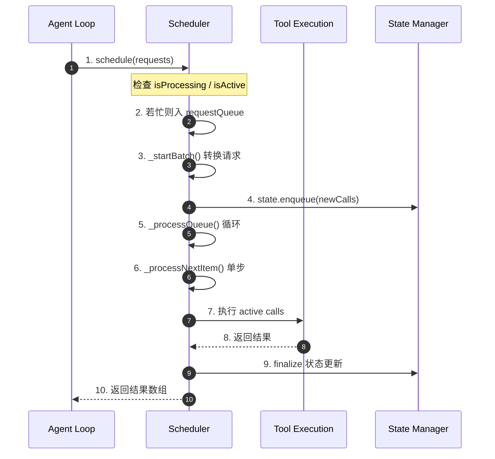
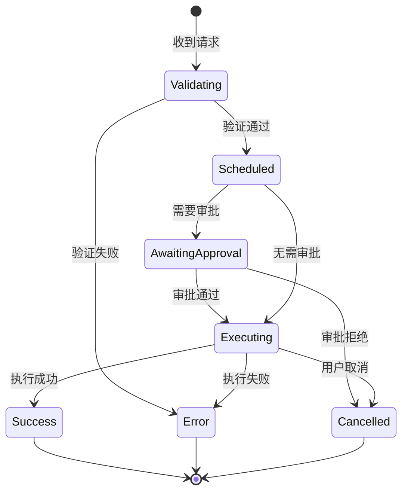
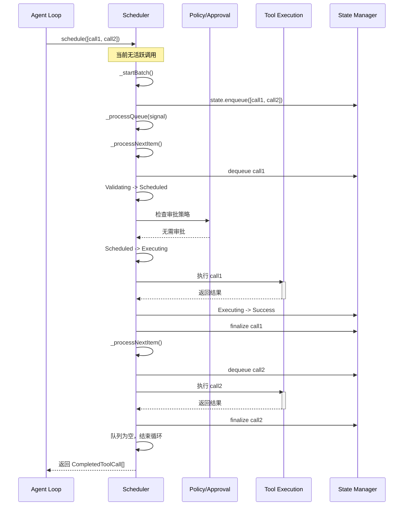

# Gemini CLI Tool Call 并发机制

## TL;DR（结论先行）

**Gemini CLI 采用"单 active call + 队列串行执行"的调度策略**，而非多工具并行执行。

Gemini CLI 的核心取舍：**串行执行 + 状态机管理**（对比 Kimi CLI 的并发派发、顺序收集策略）

---

## 1. 为什么需要这个机制？（解决什么问题）

### 1.1 问题场景

在 AI Coding Agent 中，LLM 一次可能请求执行多个工具（如同时读取多个文件、执行多个命令）。如何处理这些工具调用直接影响：

- **执行顺序**：工具间是否存在依赖关系？
- **资源竞争**：多个工具同时操作同一资源会怎样？
- **结果确定性**：并行执行是否会导致非确定性结果？

```
示例场景：
LLM 请求：1) 读取 package.json  2) 读取 src/index.ts  3) 执行 npm test

串行策略：按顺序执行，每个完成后才执行下一个
并行策略：同时发起多个调用，结果按完成顺序返回
```

### 1.2 核心挑战

| 挑战 | 不解决的后果 |
|-----|-------------|
| 工具依赖 | 并行执行可能导致依赖工具尚未完成就被使用 |
| 资源冲突 | 多个写操作同时执行可能导致数据不一致 |
| 结果排序 | 并行结果需要额外机制保证按请求顺序返回 |
| 错误隔离 | 一个工具失败不应影响其他工具的执行 |

---

## 2. 整体架构（ASCII 图）

### 2.1 在系统中的位置

```text
┌─────────────────────────────────────────────────────────────┐
│ Agent Loop / Session Runtime                                 │
│ packages/core/src/core/chat-service.ts                       │
└───────────────────────┬─────────────────────────────────────┘
                        │ 调用 schedule(requests)
                        ▼
┌─────────────────────────────────────────────────────────────┐
│ ▓▓▓ Tool Scheduler ▓▓▓                                      │
│ packages/core/src/scheduler/scheduler.ts                     │
│ - schedule()       : 接收工具请求入口                       │
│ - _startBatch()    : 批量启动工具调用                       │
│ - _processQueue()  : 核心调度循环                           │
│ - _processNextItem(): 单步执行                              │
└───────────────────────┬─────────────────────────────────────┘
                        │ 串行执行
        ┌───────────────┼───────────────┐
        ▼               ▼               ▼
┌──────────────┐ ┌──────────────┐ ┌──────────────┐
│ Tool Execution│ │ Policy/Approval│ │ State Store  │
│ 工具实际执行  │ │ 权限审批       │ │ 状态管理     │
└──────────────┘ └──────────────┘ └──────────────┘
```

### 2.2 核心组件职责

| 组件 | 职责 | 代码位置 |
|-----|------|---------|
| `Scheduler` | 核心调度器，管理工具调用队列和状态流转 | `packages/core/src/scheduler/scheduler.ts:90` |
| `CoreToolScheduler` | 兼容层调度器，同样实现单活跃调用语义 | `packages/core/src/core/coreToolScheduler.ts:98` |
| `SchedulerStateManager` | 管理工具调用状态和队列 | `packages/core/src/scheduler/state-manager.ts` |
| `ToolCallRequestInfo` | 工具请求数据结构定义 | `packages/core/src/scheduler/types.ts:35` |

### 2.3 核心组件交互关系



**关键交互说明**：

| 步骤 | 交互内容 | 设计意图 |
|-----|---------|---------|
| 1 | Agent Loop 批量提交工具请求 | 支持一次多工具请求，但内部串行处理 |
| 2-3 | 队列缓冲与批量启动 | 解耦请求接收与执行，支持异步调度 |
| 5-6 | 串行处理循环 | 确保同一时间只有一个 active call |
| 7-8 | 同步执行工具 | 等待工具完成才继续下一个 |
| 9-10 | 状态更新与返回 | 每个工具完成后立即更新状态并返回结果 |

---

## 3. 核心组件详细分析

### 3.1 Scheduler 内部结构

#### 职责定位

Scheduler 是 Gemini CLI 工具调度的核心，负责将并发的工具请求转换为串行的执行流程，并通过状态机管理每个工具调用的生命周期。

#### 状态机图



**状态说明**：

| 状态 | 说明 | 进入条件 | 退出条件 |
|-----|------|---------|---------|
| Validating | 验证请求合法性 | 收到新请求 | 验证完成 |
| Scheduled | 已排程等待执行 | 验证通过 | 开始执行或需要审批 |
| AwaitingApproval | 等待用户审批 | 策略要求审批 | 审批通过/拒绝 |
| Executing | 正在执行中 | 审批通过或无需审批 | 执行完成/失败/取消 |
| Success | 执行成功 | 工具返回结果 | 自动结束 |
| Error | 执行失败 | 工具抛出异常 | 自动结束 |
| Cancelled | 已取消 | 用户取消或审批拒绝 | 自动结束 |

#### 内部数据流

```text
┌─────────────────────────────────────────────────────────────┐
│  输入层                                                      │
│  ├── ToolCallRequestInfo ──► 验证器 ──► ToolCall            │
│  └── 元数据(checkpoint等) ──► 解析器 ──► 状态对象            │
└──────────────────────────┬──────────────────────────────────┘
                           ▼
┌─────────────────────────────────────────────────────────────┐
│  调度层                                                      │
│  ├── requestQueue: 等待处理的请求队列                        │
│  ├── state.queue: 已转换为 ToolCall 的内部队列               │
│  ├── allActiveCalls: 当前活跃调用列表                        │
│  └── _processQueue(): 循环处理直到队列为空                   │
└──────────────────────────┬──────────────────────────────────┘
                           ▼
┌─────────────────────────────────────────────────────────────┐
│  输出层                                                      │
│  ├── CompletedToolCall 结果封装                              │
│  ├── 回调通知 Agent Loop                                     │
│  └── 状态持久化                                              │
└─────────────────────────────────────────────────────────────┘
```

#### 关键算法逻辑

```text
┌─────────────────────────────────────────────────────────┐
│  schedule(requests)                                     │
│  ├── 检查 isProcessing || state.isActive               │
│  │   └── 是: _enqueueRequest() 入 requestQueue         │
│  │   └── 否: 立即 _startBatch()                        │
│  │                                                      │
│  └── _startBatch()                                      │
│      ├── 转换 requests -> ToolCall[]                   │
│      ├── state.enqueue(newCalls)                       │
│      └── _processQueue(signal)                         │
│                                                         │
└─────────────────────────┬───────────────────────────────┘
                          ▼
┌─────────────────────────────────────────────────────────┐
│  _processQueue() 循环                                   │
│  ├── while (queueLength > 0 || isActive)               │
│  │   └── _processNextItem(signal)                      │
│  │                                                      │
│  └── _processNextItem()                                 │
│      ├── 检查 signal.aborted / isCancelling            │
│      ├── 若 !isActive: dequeue 下一个 call             │
│      ├── 批量处理 Validating calls (Promise.all)       │
│      ├── 执行 Scheduled calls (若 allReady)            │
│      └── finalize terminal calls                       │
│                                                         │
└─────────────────────────┬───────────────────────────────┘
                          ▼
┌─────────────────────────────────────────────────────────┐
│  当前 call 结束后                                       │
│  ├── finalize terminal calls                           │
│  ├── checkAndNotifyCompletion()                        │
│  └── 继续 _processQueue() 循环                         │
└─────────────────────────────────────────────────────────┘
```

**算法要点**：

1. **串行执行保证**：通过 `isActive` 检查确保同一时间只有一个活跃调用
2. **队列缓冲**：双层队列（requestQueue + state.queue）解耦请求与执行
3. **状态驱动**：每个工具调用经历完整状态机流转，便于追踪和恢复
4. **只读工具优化**：连续的只读工具可以批量处理

---

## 4. 端到端数据流转

### 4.1 正常流程（详细版）



**数据变换详情**：

| 阶段 | 输入 | 处理 | 输出 | 代码位置 |
|-----|------|------|------|---------|
| 接收 | `ToolCallRequestInfo[]` | 验证并转换为 `ToolCall` | 内部状态对象 | `scheduler.ts:169-186` |
| 调度 | `ToolCall[]` | 入队并启动处理循环 | 排程状态 | `scheduler.ts:265-309` |
| 执行 | `ToolCall` | 状态流转 + 实际执行 | `CompletedToolCall` | `scheduler.ts:384-492` |
| 输出 | 执行结果 | 格式化 + 返回 | `CompletedToolCall[]` | `scheduler.ts:946-1024` |

### 4.2 数据流向图

```text
┌─────────────────────────────────────────────────────────────┐
│  输入阶段                                                    │
│  ToolCallRequestInfo                                        │
│  ├── callId: 唯一标识                                       │
│  ├── name: 工具名称                                         │
│  ├── args: 工具参数                                         │
│  ├── prompt_id: 关联的 prompt                               │
│  └── checkpoint?: 可选 checkpoint 引用                      │
└──────────────────────────┬──────────────────────────────────┘
                           ▼
┌─────────────────────────────────────────────────────────────┐
│  处理阶段                                                    │
│  ToolCall (内部状态包装)                                     │
│  ├── 原始请求数据                                           │
│  ├── status: CoreToolCallStatus                             │
│  ├── active: 是否为当前执行                                 │
│  └── 结果占位符                                             │
└──────────────────────────┬──────────────────────────────────┘
                           ▼
┌─────────────────────────────────────────────────────────────┐
│  输出阶段                                                    │
│  CompletedToolCall                                          │
│  ├── SuccessfulToolCall: 成功结果                           │
│  ├── ErroredToolCall: 错误信息                              │
│  └── CancelledToolCall: 取消原因                            │
└─────────────────────────────────────────────────────────────┘
```

### 4.3 异常/边界流程

```text
┌─────────────────────────────────────────────────────────┐
│  边界情况处理                                             │
│                                                         │
│  1. 当前有活跃调用时收到新请求                           │
│     └── 新请求入 requestQueue，等待当前完成后再处理     │
│                                                         │
│  2. 工具执行失败                                        │
│     └── Executing -> Error                              │
│     └── finalize 并继续处理队列中下一个                 │
│                                                         │
│  3. 用户取消                                            │
│     └── Executing -> Cancelled                          │
│     └── 终止当前执行（如可能）                          │
│     └── finalize 并回调取消状态                         │
│                                                         │
│  4. 审批拒绝                                            │
│     └── AwaitingApproval -> Cancelled                   │
│     └── 跳过执行直接回调                                │
│                                                         │
└─────────────────────────────────────────────────────────┘
```

---

## 5. 关键代码实现

### 5.1 核心数据结构

```typescript
// packages/core/src/scheduler/types.ts:35-45
export interface ToolCallRequestInfo {
  callId: string;              // 唯一调用标识
  name: string;                // 工具名称
  args: Record<string, unknown>; // 工具参数
  isClientInitiated: boolean;  // 是否客户端发起
  prompt_id: string;           // 关联的 prompt ID
  checkpoint?: string;         // 可选 checkpoint 引用
  traceId?: string;
  parentCallId?: string;
  schedulerId?: string;
}

// packages/core/src/scheduler/types.ts:25-33
export enum CoreToolCallStatus {
  Validating = 'validating',        // 验证中
  Scheduled = 'scheduled',          // 已排程
  Executing = 'executing',          // 执行中
  AwaitingApproval = 'awaiting_approval',  // 等待审批
  Success = 'success',              // 成功
  Error = 'error',                  // 错误
  Cancelled = 'cancelled',          // 已取消
}
```

**字段说明**：

| 字段 | 类型 | 用途 |
|-----|------|------|
| `callId` | `string` | 唯一标识每个工具调用，用于结果匹配 |
| `name` | `string` | 工具名称，决定执行哪个工具 |
| `args` | `Record<string, unknown>` | 工具参数，传递给工具执行器 |
| `prompt_id` | `string` | 关联的 prompt，用于上下文追踪 |
| `checkpoint` | `string?` | 可选的 checkpoint 引用，支持状态回滚 |

### 5.2 主链路代码

```typescript
// packages/core/src/scheduler/scheduler.ts:169-186
async schedule(
  request: ToolCallRequestInfo | ToolCallRequestInfo[],
  signal: AbortSignal,
): Promise<CompletedToolCall[]> {
  return runInDevTraceSpan(
    { name: 'schedule' },
    async ({ metadata: spanMetadata }) => {
      const requests = Array.isArray(request) ? request : [request];
      spanMetadata.input = requests;

      // ✅ Verified: 若当前有执行中请求，则入队等待
      if (this.isProcessing || this.state.isActive) {
        return this._enqueueRequest(requests, signal);
      }

      return this._startBatch(requests, signal);
    },
  );
}

// packages/core/src/scheduler/scheduler.ts:265-309
private async _startBatch(
  requests: ToolCallRequestInfo[],
  signal: AbortSignal,
): Promise<CompletedToolCall[]> {
  this.isProcessing = true;
  this.isCancelling = false;
  this.state.clearBatch();
  const currentApprovalMode = this.config.getApprovalMode();

  try {
    const toolRegistry = this.config.getToolRegistry();
    const newCalls: ToolCall[] = requests.map((request) => {
      // ... 创建 ToolCall 对象
    });

    this.state.enqueue(newCalls);
    await this._processQueue(signal);
    return this.state.completedBatch;
  } finally {
    this.isProcessing = false;
    this.state.clearBatch();
    this._processNextInRequestQueue();
  }
}

// packages/core/src/scheduler/scheduler.ts:373-378
private async _processQueue(signal: AbortSignal): Promise<void> {
  while (this.state.queueLength > 0 || this.state.isActive) {
    const shouldContinue = await this._processNextItem(signal);
    if (!shouldContinue) break;
  }
}

// packages/core/src/scheduler/scheduler.ts:384-492
private async _processNextItem(signal: AbortSignal): Promise<boolean> {
  if (signal.aborted || this.isCancelling) {
    this.state.cancelAllQueued('Operation cancelled');
    return false;
  }

  // ✅ Verified: 检查 isActive 确保串行执行
  if (!this.state.isActive) {
    const next = this.state.dequeue();
    if (!next) return false;
    // ... 处理下一个调用
  }

  // 1. Process all 'validating' calls (Policy & Confirmation)
  // 2. Execute scheduled calls
  // 3. Finalize terminal calls
  // ...
}
```

**代码要点**：

1. **串行执行保证**：`_processNextItem()` 中检查 `state.isActive`，确保单活跃调用
2. **队列驱动**：`_processQueue()` 循环处理直到队列为空，天然支持批量请求的串行化
3. **状态分离**：`isProcessing`（调度器状态）与 `state.isActive`（工具状态）双层检查
4. **只读工具优化**：连续的只读工具可以批量 dequeue

### 5.3 关键调用链

```text
schedule(requests)              [scheduler.ts:169]
  -> _enqueueRequest()          [scheduler.ts:180] (若忙)
  -> _startBatch(requests)      [scheduler.ts:183] (若空闲)
    -> state.enqueue(newCalls)  [scheduler.ts:301]
    -> _processQueue(signal)    [scheduler.ts:302]
      -> _processNextItem()     [scheduler.ts:375]
        - 检查 state.isActive
        - dequeue 一个 call
        - _processValidatingCall() [scheduler.ts:494]
        - _execute(call)        [scheduler.ts:600]
          - 状态流转: Validating -> Scheduled -> Executing
          - 实际工具执行
          - 状态流转: -> Success/Error/Cancelled
          - finalizeCall
```

---

## 6. 设计意图与 Trade-off

### 6.1 Gemini CLI 的选择

| 维度 | Gemini CLI 的选择 | 替代方案 | 取舍分析 |
|-----|-----------------|---------|---------|
| 执行模式 | 串行执行 | 并行执行 | 简单可预测，避免资源竞争，但牺牲执行效率 |
| 状态管理 | 显式状态机 | 隐式 Promise | 状态可追踪、可恢复，但代码复杂度增加 |
| 队列策略 | 双层队列缓冲 | 直接执行 | 解耦请求与执行，支持异步调度 |
| 结果处理 | 批量返回 | 即时回调 | 统一返回结果数组，便于 Agent Loop 处理 |

### 6.2 为什么这样设计？

**核心问题**：为什么 Gemini CLI 选择串行而非并行执行工具调用？

**Gemini CLI 的解决方案**：

- **代码依据**：`packages/core/src/scheduler/scheduler.ts:373-378`
- **设计意图**：通过 `isActive` 检查强制单活跃调用，确保工具执行的可预测性和确定性
- **带来的好处**：
  - 避免资源竞争：文件、网络等资源不会被并发访问
  - 简化错误处理：一个工具失败不会影响其他工具
  - 结果确定性：按请求顺序返回结果，便于 LLM 理解
- **付出的代价**：
  - 执行效率：无法利用并行 I/O 提升性能
  - 延迟累积：多个工具的总耗时 = 各工具耗时之和

### 6.3 与其他项目的对比

| 项目 | 并发策略 | 核心差异 | 适用场景 |
|-----|---------|---------|---------|
| **Gemini CLI** | 串行执行 | 单 active call + 状态机 | 需要严格顺序保证、资源安全 |
| **Kimi CLI** | 并发派发、顺序收集 | 同时发起多个调用，结果按序注入 | 需要并行 I/O 提升效率 |
| **Codex** | ⚠️ Inferred: 可能并行 | Rust 异步特性天然支持并发 | 高性能异步场景 |

**对比分析**：

- **Gemini CLI 的串行策略**更适合需要严格顺序保证的场景，如文件修改后紧接着读取同一文件
- **Kimi CLI 的并发策略**更适合 I/O 密集型场景，如同时读取多个不相关文件
- 两者都在结果返回给 LLM 时保持顺序，确保 LLM 能正确匹配请求与结果

---

## 7. 边界情况与错误处理

### 7.1 终止条件

| 终止原因 | 触发条件 | 代码位置 |
|---------|---------|---------|
| 队列处理完成 | `state.queueLength === 0` 且 `!state.isActive` | `scheduler.ts:373-378` |
| 用户取消 | 调用 cancelAll() 方法 | `scheduler.ts:225-249` |
| 信号中断 | `signal.aborted` 为 true | `scheduler.ts:385-388` |
| 会话结束 | Agent Loop 终止 | 外部触发 |

### 7.2 超时/资源限制

```typescript
// ⚠️ Inferred: 工具执行超时由具体工具执行器控制
// 而非在 Scheduler 层统一处理
// 详见 packages/core/src/scheduler/tool-executor.ts
```

### 7.3 错误恢复策略

| 错误类型 | 处理策略 | 代码位置 |
|---------|---------|---------|
| 工具执行错误 | 状态流转为 Error，继续处理队列 | `scheduler.ts:494-522` |
| 验证失败 | 状态流转为 Error，不进入执行阶段 | `scheduler.ts:329-369` |
| 审批拒绝 | 状态流转为 Cancelled，跳过执行 | `scheduler.ts:582-590` |
| 策略拒绝 | 状态流转为 Error，返回拒绝信息 | `scheduler.ts:535-551` |

---

## 8. 关键代码索引

| 功能 | 文件 | 行号 | 说明 |
|-----|------|------|------|
| 入口 | `packages/core/src/scheduler/scheduler.ts` | 169 | `schedule()` 方法，接收工具请求 |
| 批量启动 | `packages/core/src/scheduler/scheduler.ts` | 265 | `_startBatch()` 转换并入队 |
| 核心循环 | `packages/core/src/scheduler/scheduler.ts` | 373 | `_processQueue()` 调度循环 |
| 单步执行 | `packages/core/src/scheduler/scheduler.ts` | 384 | `_processNextItem()` 串行执行 |
| 工具执行 | `packages/core/src/scheduler/scheduler.ts` | 600 | `_execute()` 实际执行工具 |
| 完成检查 | `packages/core/src/scheduler/scheduler.ts` | 946 | `checkAndNotifyCompletion()` |
| 数据结构 | `packages/core/src/scheduler/types.ts` | 35 | `ToolCallRequestInfo` 定义 |
| 状态枚举 | `packages/core/src/scheduler/types.ts` | 25 | `CoreToolCallStatus` 状态机 |
| 兼容层 | `packages/core/src/core/coreToolScheduler.ts` | 98 | `CoreToolScheduler` 类 |

---

## 9. 延伸阅读

- 前置知识：`docs/gemini-cli/04-gemini-cli-agent-loop.md` - Agent Loop 整体架构
- 相关机制：`docs/gemini-cli/05-gemini-cli-tools-system.md` - 工具系统详解
- 深度分析：`docs/kimi-cli/questions/kimi-cli-tool-call-concurrency.md` - Kimi CLI 的并发策略对比

---

*✅ Verified: 基于 gemini-cli/packages/core/src/scheduler/scheduler.ts 等源码分析*
*⚠️ Inferred: 部分设计意图基于代码结构推断*
*基于版本：2026-02-08 | 最后更新：2026-02-25*
