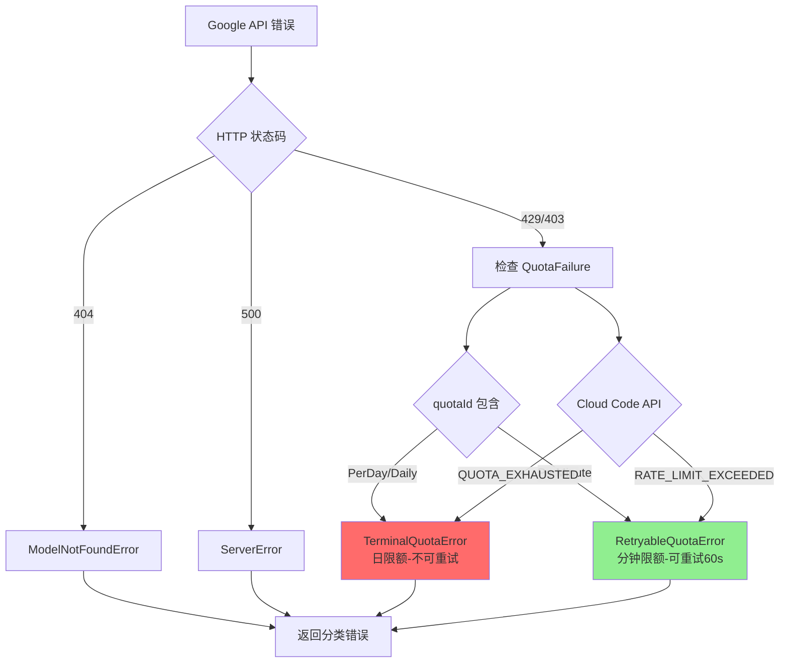
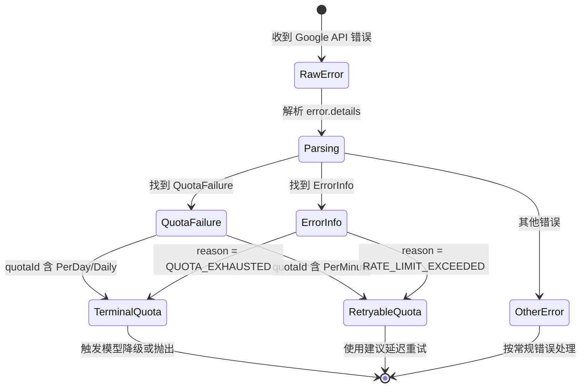
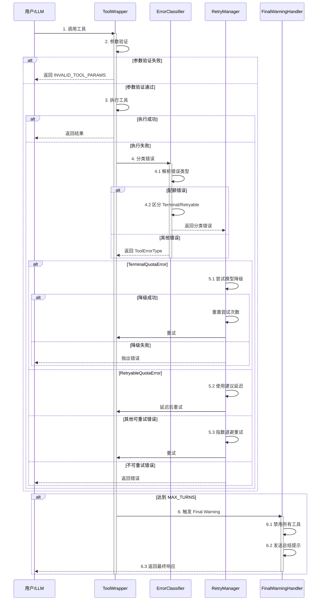
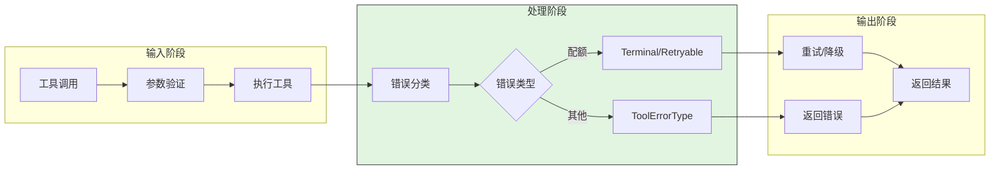
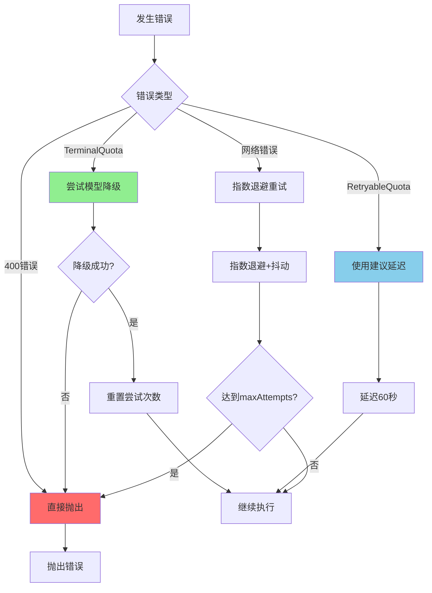
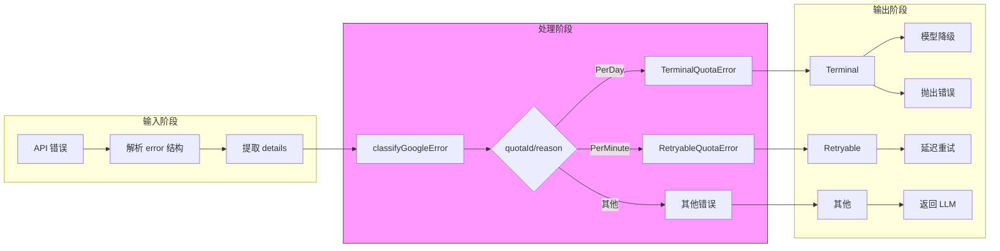
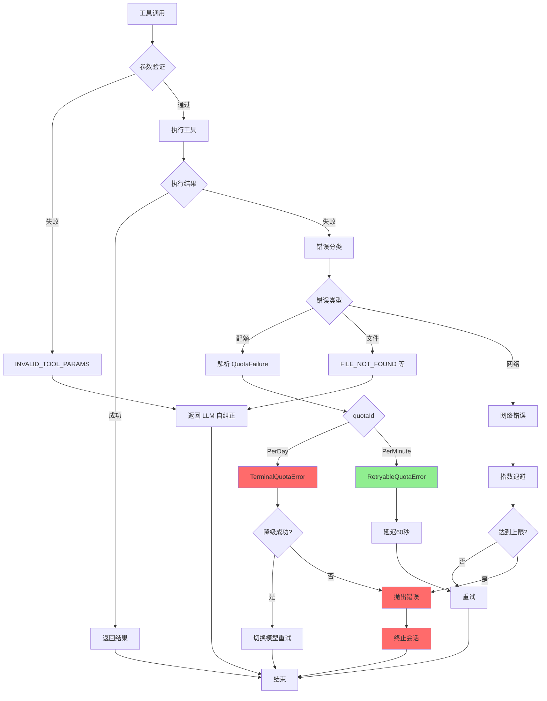
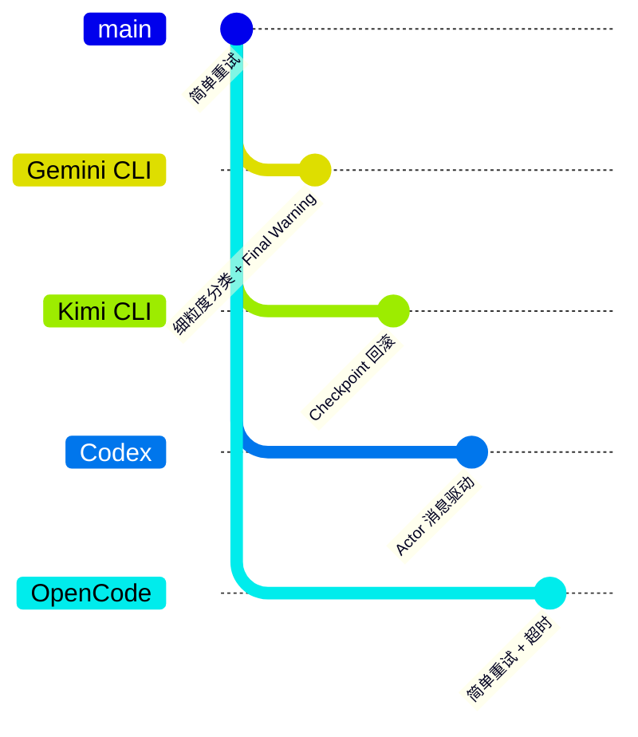

# Gemini CLI 工具调用错误处理机制

> **阅读指南**
>
> | 属性 | 说明 |
> |-----|------|
> | 预计阅读 | 20-25 分钟 |
> | 前置文档 | `docs/gemini-cli/04-gemini-cli-agent-loop.md`、`docs/gemini-cli/05-gemini-cli-tools-system.md` |
> | 文档结构 | 结论先行 → 架构位置 → 核心组件 → 数据流转 → 关键代码 → 设计对比 |
> | 代码呈现 | 关键代码直接展示，完整代码可折叠查看 |

---

## TL;DR（结论先行）

一句话定义：Gemini CLI 采用 **Scheduler 状态机 + Final Warning Turn** 的优雅恢复架构，通过 `ToolErrorType` 枚举定义 15+ 种错误类型，并创新性地将配额错误细分为 `TerminalQuotaError`(日限额) 与 `RetryableQuotaError`(分钟限额)，实现了智能的错误分类与恢复策略。

Gemini CLI 的核心取舍：**细粒度错误分类 + 优雅降级**（对比其他项目的简单重试或直接报错）

### 核心要点速览

| 维度 | 关键决策 | 代码位置 |
|-----|---------|---------|
| 错误分类 | 15+ 种细粒度 `ToolErrorType` 枚举 | `packages/core/src/tools/tool-error.ts:15` |
| 配额处理 | Terminal/Retryable 双类区分 | `packages/core/src/utils/googleQuotaErrors.ts:20` |
| 重试策略 | 指数退避 + 抖动 + 智能延迟 | `packages/core/src/utils/retry.ts:45` |
| 终止处理 | Final Warning Turn 优雅结束 | `packages/core/src/core/client.ts:315` |

---

## 1. 为什么需要这个机制？

### 1.1 问题场景

没有完善的错误处理机制时：
- 用户问"修复这个 bug" → LLM 尝试读取文件 → 文件不存在 → 直接报错退出
- 用户问"分析代码" → 达到 API 配额 → 无意义地重试直到超时
- 用户问"运行测试" → 工具调用陷入循环 → 无限循环消耗资源

有了完善的错误处理：
- 文件不存在 → 返回错误给 LLM → LLM 自纠正（询问正确路径）
- 达到配额 → 智能区分日限额/分钟限额 → 日限额切换模型，分钟限额延迟重试
- 循环检测 → 检测到重复模式 → 主动终止并提示用户

### 1.2 核心挑战

| 挑战 | 不解决的后果 |
|-----|-------------|
| 错误类型繁杂 | 无法针对性恢复，一刀切处理导致用户体验差 |
| 配额限制复杂 | 无意义重试浪费资源，或直接放弃可用机会 |
| 工具调用循环 | 无限循环消耗 token 和 API 配额 |
| 上下文溢出 | 长对话导致 token 超限，会话被迫中断 |

---

## 2. 整体架构

### 2.1 在系统中的位置

```text
┌─────────────────────────────────────────────────────────────┐
│ Agent Loop / Scheduler                                       │
│ packages/core/src/core/client.ts                             │
└───────────────────────┬─────────────────────────────────────┘
                        │ 工具调用请求
                        ▼
┌─────────────────────────────────────────────────────────────┐
│ ▓▓▓ 工具错误处理系统 ▓▓▓                                      │
│                                                              │
│ ┌─────────────────┐  ┌─────────────────┐  ┌───────────────┐ │
│ │ ToolErrorType   │  │ 配额错误分类     │  │ 重试机制      │ │
│ │ 15+ 错误类型    │  │ Terminal/       │  │ 指数退避      │ │
│ │ 定义            │  │ Retryable       │  │ + 抖动        │ │
│ └────────┬────────┘  └────────┬────────┘  └───────┬───────┘ │
│          │                    │                    │         │
│          └────────────────────┼────────────────────┘         │
│                               ▼                              │
│                    ┌─────────────────────┐                   │
│                    │   错误恢复策略       │                   │
│                    │ - Final Warning Turn│                   │
│                    │ - 上下文压缩        │                   │
│                    │ - 循环检测          │                   │
│                    └─────────────────────┘                   │
└─────────────────────────────────────────────────────────────┘
```

### 2.2 核心组件职责

| 组件 | 职责 | 代码位置 |
|-----|------|---------|
| `ToolErrorType` | 定义 15+ 种工具错误类型枚举 | `packages/core/src/tools/tool-error.ts` |
| `isFatalToolError()` | 判定错误是否为致命错误（仅磁盘空间不足） | `packages/core/src/tools/tool-error.ts` |
| `TerminalQuotaError` | 日限额等不可重试配额错误 | `packages/core/src/utils/googleQuotaErrors.ts` |
| `RetryableQuotaError` | 分钟限额等可重试配额错误 | `packages/core/src/utils/googleQuotaErrors.ts` |
| `classifyGoogleError()` | 智能分类 Google API 错误 | `packages/core/src/utils/googleQuotaErrors.ts` |
| `retryWithBackoff()` | 带指数退避和抖动的重试逻辑 | `packages/core/src/utils/retry.ts` |
| `handleFinalWarningTurn()` | 最大轮次限制时的优雅恢复 | `packages/core/src/core/client.ts` |

### 2.3 配额错误分类流程



**关键交互说明**：

| 步骤 | 交互内容 | 设计意图 |
|-----|---------|---------|
| 1 | 接收 Google API 错误 | 统一错误入口，便于集中处理 |
| 2 | 解析 HTTP 状态码 | 快速分流，404/500 直接处理 |
| 3 | 检查 QuotaFailure 详情 | 细粒度分析配额错误类型 |
| 4 | 区分日限额/分钟限额 | 日限额不可重试，分钟限额可延迟重试 |
| 5 | 返回分类后的错误对象 | 上层根据错误类型选择恢复策略 |

---

## 3. 核心组件详细分析

### 3.1 ToolErrorType 错误类型体系

#### 职责定位

定义工具执行过程中可能遇到的所有错误类型，为错误处理和恢复提供类型基础。

#### 内部数据流

```text
┌─────────────────────────────────────────────────────────────┐
│  输入层 - 工具执行错误                                       │
│  ├── 文件系统错误 (FILE_NOT_FOUND, PERMISSION_DENIED 等)    │
│  ├── 参数错误 (INVALID_TOOL_PARAMS)                         │
│  ├── 执行错误 (EXECUTION_FAILED, SHELL_EXECUTE_ERROR)       │
│  └── 策略错误 (POLICY_VIOLATION)                            │
└──────────────────────────┬──────────────────────────────────┘
                           ▼
┌─────────────────────────────────────────────────────────────┐
│  处理层 - 错误分类                                           │
│  ├── ToolErrorType 枚举匹配                                  │
│  ├── isFatalToolError() 致命判定                             │
│  └── 错误消息格式化                                          │
└──────────────────────────┬──────────────────────────────────┘
                           ▼
┌─────────────────────────────────────────────────────────────┐
│  输出层 - 恢复策略                                           │
│  ├── 返回 LLM 自纠正                                         │
│  ├── 触发重试机制                                            │
│  └── 终止会话 (仅 NO_SPACE_LEFT)                             │
└─────────────────────────────────────────────────────────────┘
```

#### 关键接口

| 接口 | 输入 | 输出 | 说明 | 代码位置 |
|-----|------|------|------|---------|
| `ToolErrorType` | - | 枚举值 | 15+ 种错误类型定义 | `packages/core/src/tools/tool-error.ts:15` |
| `isFatalToolError()` | `string?` | `boolean` | 判定是否为致命错误 | `packages/core/src/tools/tool-error.ts:50` |

---

### 3.2 配额错误智能分类系统

#### 职责定位

将 Google API 的配额错误智能分类为可重试和不可重试两类，指导上层选择合适的恢复策略。

#### 状态机图



**状态说明**：

| 状态 | 说明 | 进入条件 | 退出条件 |
|-----|------|---------|---------|
| RawError | 原始错误 | API 返回错误 | 开始解析 |
| Parsing | 解析中 | 提取 error 结构 | 识别错误类型 |
| QuotaFailure | 配额失败详情 | 找到 QuotaFailure 字段 | 分析 quotaId |
| TerminalQuota | 不可重试配额 | 日限额耗尽 | 降级或终止 |
| RetryableQuota | 可重试配额 | 分钟限额 | 延迟重试 |

---

### 3.3 重试机制

#### 职责定位

提供带指数退避和抖动的重试逻辑，支持根据错误类型动态调整重试策略。

#### 内部数据流

```text
┌─────────────────────────────────────────────────────────────┐
│  输入层 - 重试请求                                           │
│  ├── 待执行函数 fn                                           │
│  ├── RetryOptions 配置                                       │
│  └── AbortSignal 取消信号                                    │
└──────────────────────────┬──────────────────────────────────┘
                           ▼
┌─────────────────────────────────────────────────────────────┐
│  处理层 - 重试循环                                           │
│  ├── attempt 计数检查                                        │
│  ├── 执行 fn()                                               │
│  ├── classifyGoogleError() 分类                              │
│  ├── TerminalQuotaError 处理                                 │
│  ├── RetryableQuotaError 延迟                                │
│  └── 指数退避 + 抖动计算                                     │
└──────────────────────────┬──────────────────────────────────┘
                           ▼
┌─────────────────────────────────────────────────────────────┐
│  输出层 - 结果                                               │
│  ├── 成功: 返回结果                                          │
│  └── 失败: 抛出错误                                          │
└─────────────────────────────────────────────────────────────┘
```

---

### 3.4 组件间协作时序



**协作要点**：

1. **ToolWrapper 与 ErrorClassifier**：工具执行失败时，统一交由错误分类器处理
2. **ErrorClassifier 与 RetryManager**：根据错误类型决定重试策略
3. **RetryManager 与 FinalWarningHandler**：达到最大轮次时触发优雅终止

---

### 3.5 关键数据路径

#### 主路径（正常流程）



#### 异常路径（错误恢复）



---

## 4. 端到端数据流转

### 4.1 工具错误处理完整流程


**数据变换详情**：

| 阶段 | 输入 | 处理 | 输出 | 代码位置 |
|-----|------|------|------|---------|
| 参数验证 | 原始参数 | Schema 验证 | 验证结果/参数错误 | `packages/core/src/tools/tool-error.ts` |
| 错误分类 | 原始错误 | 解析 quotaId/reason | Terminal/Retryable/其他 | `packages/core/src/utils/googleQuotaErrors.ts` |
| 重试决策 | 分类错误 | 检查重试条件 | 重试/降级/抛出 | `packages/core/src/utils/retry.ts` |
| 终止处理 | 达到 MAX_TURNS | 禁用工具+总结提示 | 最终响应 | `packages/core/src/core/client.ts` |

### 4.2 数据流向图



### 4.3 异常/边界流程



---

## 5. 关键代码实现

### 5.1 核心数据结构

```typescript
// packages/core/src/tools/tool-error.ts
export enum ToolErrorType {
  POLICY_VIOLATION = 'policy_violation',
  INVALID_TOOL_PARAMS = 'invalid_tool_params',
  UNKNOWN = 'unknown',
  UNHANDLED_EXCEPTION = 'unhandled_exception',
  TOOL_NOT_REGISTERED = 'tool_not_registered',
  EXECUTION_FAILED = 'execution_failed',
  FILE_NOT_FOUND = 'file_not_found',
  FILE_WRITE_FAILURE = 'file_write_failure',
  READ_CONTENT_FAILURE = 'read_content_failure',
  PERMISSION_DENIED = 'permission_denied',
  NO_SPACE_LEFT = 'no_space_left',
  PATH_NOT_IN_WORKSPACE = 'path_not_in_workspace',
  FILE_TOO_LARGE = 'file_too_large',
  SHELL_EXECUTE_ERROR = 'shell_execute_error',
  MCP_TOOL_ERROR = 'mcp_tool_error',
  STOP_EXECUTION = 'stop_execution',
}
```

**字段说明**：

| 字段 | 类型 | 用途 |
|-----|------|------|
| `NO_SPACE_LEFT` | `string` | 唯一致命错误，触发立即终止 |
| `INVALID_TOOL_PARAMS` | `string` | 参数验证失败，返回给 LLM 自纠正 |
| `POLICY_VIOLATION` | `string` | 内容策略违规 |

### 5.2 配额错误分类代码

**关键代码**（核心逻辑）：

```typescript
// packages/core/src/utils/googleQuotaErrors.ts:45-85
export function classifyGoogleError(error: unknown): unknown {
  const googleApiError = parseGoogleApiError(error);
  const status = googleApiError?.code ?? getErrorStatus(error);

  // 404 错误 → ModelNotFoundError
  if (status === 404) {
    return new ModelNotFoundError(message, status);
  }

  // 检查 QuotaFailure 中的日限额
  const quotaFailure = googleApiError.details.find(
    (d): d is QuotaFailure =>
      d['@type'] === 'type.googleapis.com/google.rpc.QuotaFailure',
  );

  if (quotaFailure) {
    for (const violation of quotaFailure.violations) {
      const quotaId = violation.quotaId ?? '';
      // 日限额 = 终端错误
      if (quotaId.includes('PerDay') || quotaId.includes('Daily')) {
        return new TerminalQuotaError(
          `You have exhausted your daily quota on this model.`,
          googleApiError,
        );
      }
    }
  }

  // 分钟限额 = 可重试
  if (quotaId.includes('PerMinute')) {
    return new RetryableQuotaError(
      `${googleApiError.message}\nSuggested retry after 60s.`,
      googleApiError,
      60,
    );
  }
}
```

**设计意图**：
1. **quotaId 模式匹配**：通过 `PerDay`/`Daily` 识别日限额，`PerMinute` 识别分钟限额
2. **错误对象包装**：将原始错误包装为具有明确语义的类型化错误
3. **建议延迟传递**：分钟限额附带 60 秒建议延迟

<details>
<summary>查看完整实现</summary>

```typescript
// packages/core/src/utils/googleQuotaErrors.ts
export class TerminalQuotaError extends Error {
  retryDelayMs?: number;
  constructor(
    message: string,
    override readonly cause: GoogleApiError,
    retryDelaySeconds?: number,
  ) {
    super(message);
    this.name = 'TerminalQuotaError';
    this.retryDelayMs = retryDelaySeconds ? retryDelaySeconds * 1000 : undefined;
  }
}

export class RetryableQuotaError extends Error {
  retryDelayMs?: number;
  constructor(
    message: string,
    override readonly cause: GoogleApiError,
    retryDelaySeconds?: number,
  ) {
    super(message);
    this.name = 'RetryableQuotaError';
    this.retryDelayMs = retryDelaySeconds ? retryDelaySeconds * 1000 : undefined;
  }
}
```

</details>

### 5.3 重试机制代码

```typescript
// packages/core/src/utils/retry.ts:45-100
export async function retryWithBackoff<T>(
  fn: () => Promise<T>,
  options?: Partial<RetryOptions>,
): Promise<T> {
  let attempt = 0;
  let currentDelay = initialDelayMs;

  while (attempt < maxAttempts) {
    attempt++;
    try {
      const result = await fn();
      return result;
    } catch (error) {
      const classifiedError = classifyGoogleError(error);

      // TerminalQuotaError 触发模型降级
      if (classifiedError instanceof TerminalQuotaError) {
        if (onPersistent429) {
          const fallbackModel = await onPersistent429(authType, classifiedError);
          if (fallbackModel) {
            attempt = 0;  // 重置尝试次数
            currentDelay = initialDelayMs;
            continue;
          }
        }
        throw classifiedError;
      }

      // RetryableQuotaError 使用建议延迟
      if (classifiedError instanceof RetryableQuotaError) {
        if (classifiedError.retryDelayMs !== undefined) {
          await delay(classifiedError.retryDelayMs, signal);
          continue;
        }
      }

      // 指数退避 + 抖动
      const jitter = currentDelay * 0.3 * (Math.random() * 2 - 1);
      const delayWithJitter = Math.max(0, currentDelay + jitter);
      await delay(delayWithJitter, signal);
      currentDelay = Math.min(maxDelayMs, currentDelay * 2);
    }
  }
}
```

### 5.4 关键调用链

```text
retryWithBackoff()          [packages/core/src/utils/retry.ts:45]
  -> classifyGoogleError()  [packages/core/src/utils/googleQuotaErrors.ts:45]
    -> parseGoogleApiError() [packages/core/src/utils/googleQuotaErrors.ts:20]
      - 解析 error.details
      - 提取 QuotaFailure
      - 遍历 violations

handleFinalWarningTurn()    [packages/core/src/core/client.ts:315]
  -> disableAllTools()      [packages/core/src/core/client.ts:310]
  -> sendMessageStream()    [packages/core/src/core/client.ts:150]
    - 发送总结提示
    - 返回最终响应
```

---

## 6. 设计意图与 Trade-off

### 6.1 Gemini CLI 的选择

| 维度 | Gemini CLI 的选择 | 替代方案 | 取舍分析 |
|-----|-----------------|---------|---------|
| 错误分类 | 15+ 种细粒度 ToolErrorType | 简单成功/失败二分 | 精准错误报告，但维护成本较高 |
| 配额处理 | Terminal/Retryable 双类 | 统一重试或不重试 | 智能恢复策略，但需解析 quotaId |
| 终止处理 | Final Warning Turn | 直接抛出异常 | 优雅结束，但消耗额外轮次 |
| 重试策略 | 指数退避 + 抖动 | 固定延迟 | 避免惊群，但延迟不确定 |

### 6.2 为什么这样设计？

**核心问题**：如何在复杂的工具调用场景中实现优雅的错误恢复？

**Gemini CLI 的解决方案**：
- **代码依据**：`packages/core/src/utils/googleQuotaErrors.ts:45`
- **设计意图**：通过细粒度错误分类指导恢复策略，避免一刀切
- **带来的好处**：
  - 日限额立即切换模型，不浪费重试次数
  - 分钟限额延迟后自动恢复，无需用户干预
  - 其他错误返回给 LLM，支持自纠正
- **付出的代价**：
  - 需维护 quotaId 模式列表
  - 错误分类逻辑与 Google API 紧密耦合

### 6.3 与其他项目的对比



| 项目 | 核心差异 | 错误处理策略 | 适用场景 |
|-----|---------|-------------|---------|
| **Gemini CLI** | 细粒度错误分类 + Final Warning Turn | Terminal/Retryable 配额分类，优雅降级 | 需要优雅降级和复杂恢复策略 |
| **Kimi CLI** | Checkpoint 回滚机制 | 状态回滚到之前 checkpoint | 需要状态回滚的对话场景 |
| **Codex** | Actor 消息驱动 | 基于消息的错误隔离 | 高并发、需要严格隔离 |
| **OpenCode** | 简单重试 + 超时控制 | resetTimeoutOnProgress | 轻量级、长时间任务 |
| **SWE-agent** | forward_with_handling | 错误恢复优先 | 自动化修复场景 |

---

## 7. 边界情况与错误处理

### 7.1 终止条件

| 终止原因 | 触发条件 | 代码位置 |
|---------|---------|---------|
| 达到 MAX_TURNS | `sessionTurnCount >= 100` | `packages/core/src/core/client.ts:298` |
| 致命工具错误 | `errorType === NO_SPACE_LEFT` | `packages/core/src/tools/tool-error.ts:55` |
| TerminalQuotaError 且降级失败 | 日限额且无可用的备用模型 | `packages/core/src/utils/retry.ts:120` |

### 7.2 超时/资源限制

```typescript
// packages/core/src/utils/retry.ts:15-20
const DEFAULT_RETRY_OPTIONS: RetryOptions = {
  maxAttempts: 3,
  initialDelayMs: 5000,    // 5秒初始延迟
  maxDelayMs: 30000,       // 最大30秒
};
```

### 7.3 错误恢复策略

| 错误类型 | 处理策略 | 代码位置 |
|---------|---------|---------|
| TerminalQuotaError | 模型降级或抛出 | `packages/core/src/utils/retry.ts:110-125` |
| RetryableQuotaError | 使用建议延迟重试 | `packages/core/src/utils/retry.ts:126-135` |
| 网络错误 | 指数退避重试 | `packages/core/src/utils/retry.ts:136-145` |
| 400 Bad Request | 不重试直接抛出 | `packages/core/src/utils/retry.ts:85` |

---

## 8. 关键代码索引

| 功能 | 文件 | 行号 | 说明 |
|-----|------|------|------|
| 错误类型定义 | `packages/core/src/tools/tool-error.ts` | 15-30 | ToolErrorType 枚举 |
| 致命错误判定 | `packages/core/src/tools/tool-error.ts` | 50-55 | isFatalToolError() |
| 配额错误分类 | `packages/core/src/utils/googleQuotaErrors.ts` | 45-85 | classifyGoogleError() |
| TerminalQuotaError | `packages/core/src/utils/googleQuotaErrors.ts` | 20-35 | 日限额错误类 |
| RetryableQuotaError | `packages/core/src/utils/googleQuotaErrors.ts` | 38-50 | 分钟限额错误类 |
| 重试逻辑 | `packages/core/src/utils/retry.ts` | 45-100 | retryWithBackoff() |
| 可重试判定 | `packages/core/src/utils/retry.ts` | 75-90 | isRetryableError() |
| 最大轮次限制 | `packages/core/src/core/client.ts` | 295-300 | MAX_TURNS 常量 |
| Final Warning | `packages/core/src/core/client.ts` | 315-335 | handleFinalWarningTurn() |

---

## 9. 延伸阅读

- 前置知识：`docs/gemini-cli/04-gemini-cli-agent-loop.md` - Agent Loop 整体架构
- 相关机制：`docs/gemini-cli/05-gemini-cli-tools-system.md` - 工具系统详解
- 深度分析：`docs/gemini-cli/06-gemini-cli-mcp-integration.md` - MCP 集成错误处理

---

*✅ Verified: 基于 gemini-cli/packages/core/src/tools/tool-error.ts、googleQuotaErrors.ts 等源码分析*
*基于版本：gemini-cli (baseline 2026-02-08) | 最后更新：2026-03-03*
