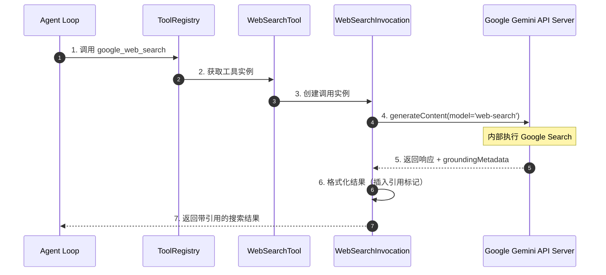
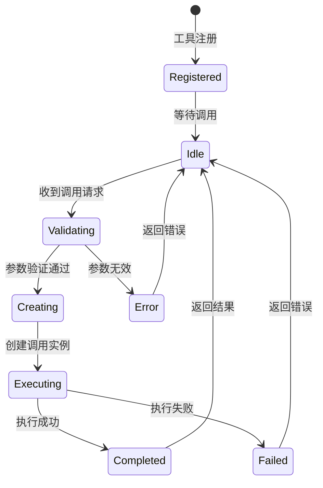
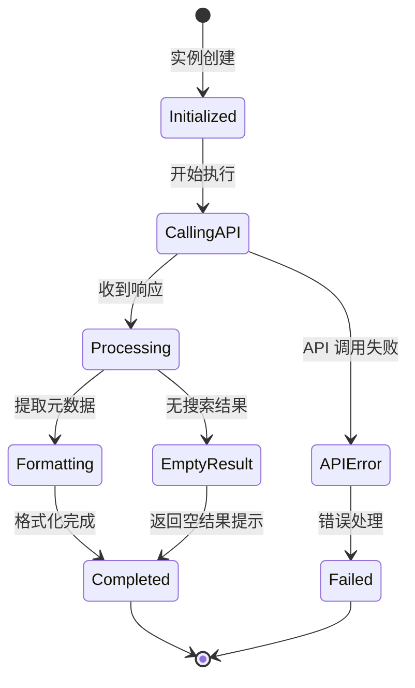
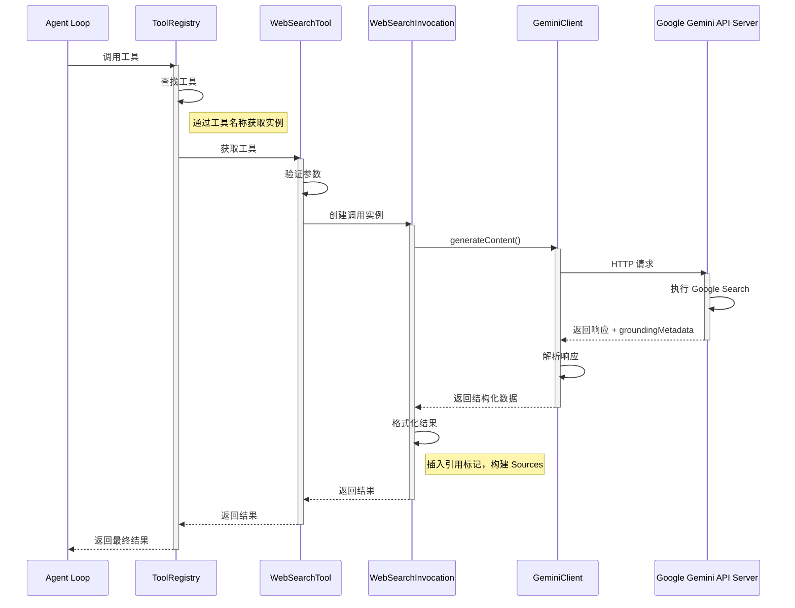
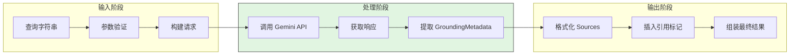
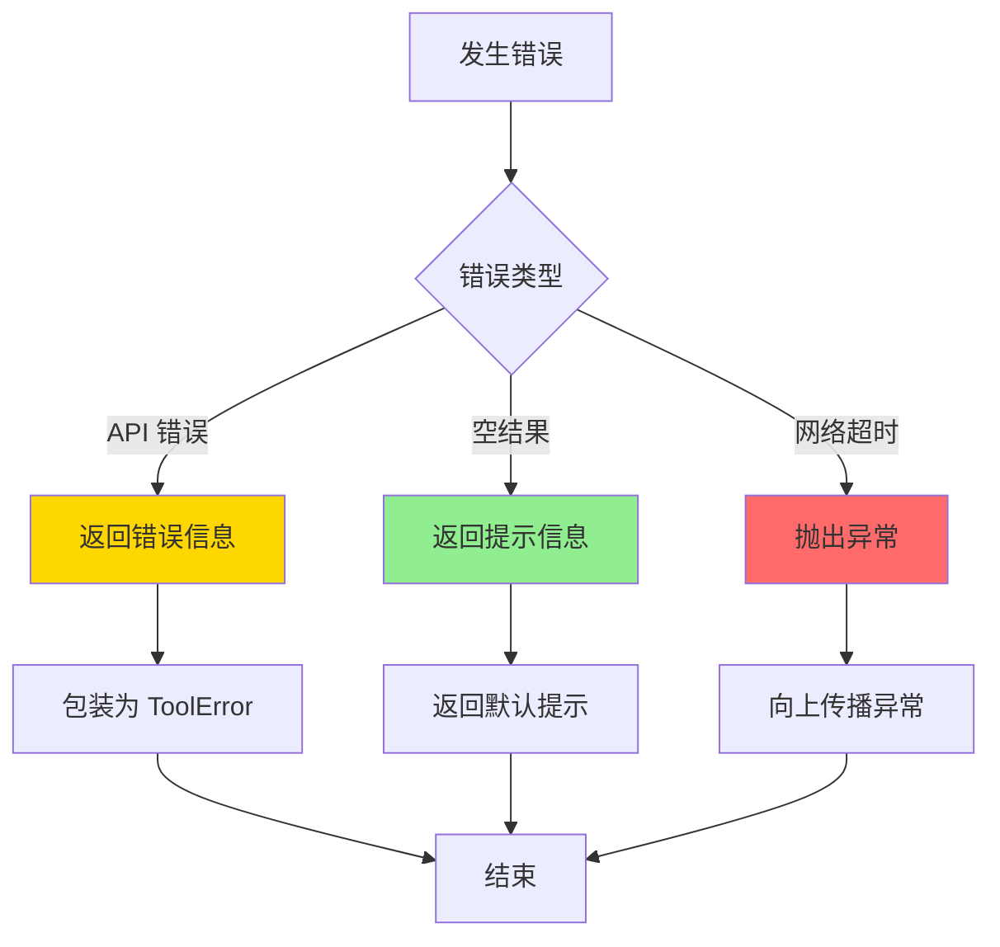
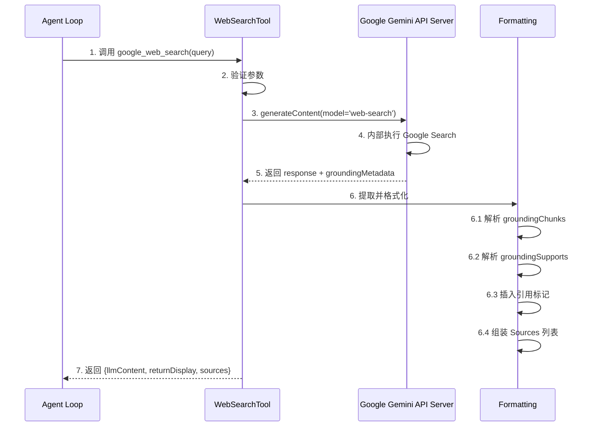
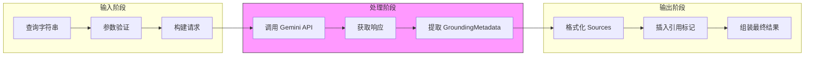
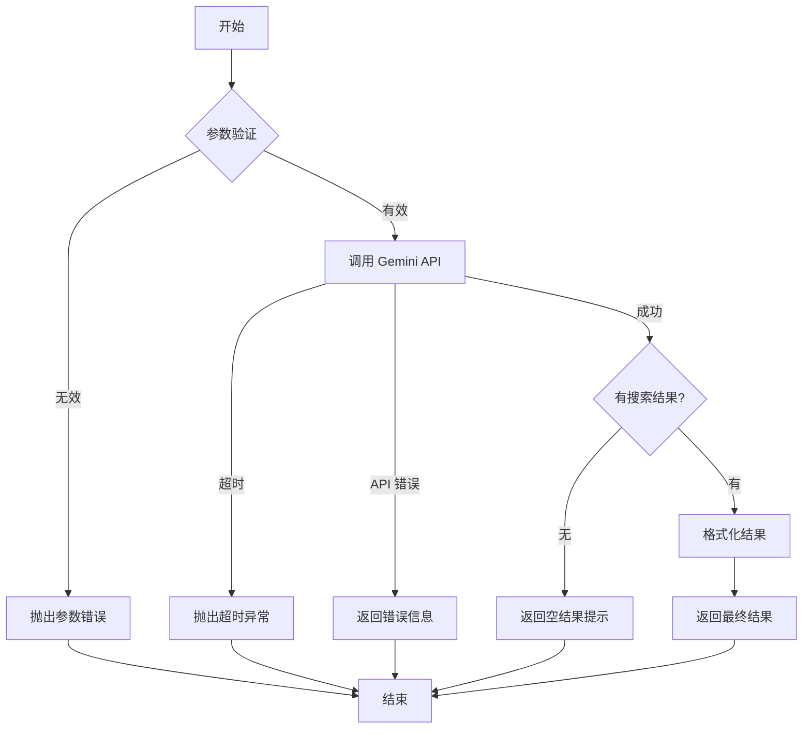
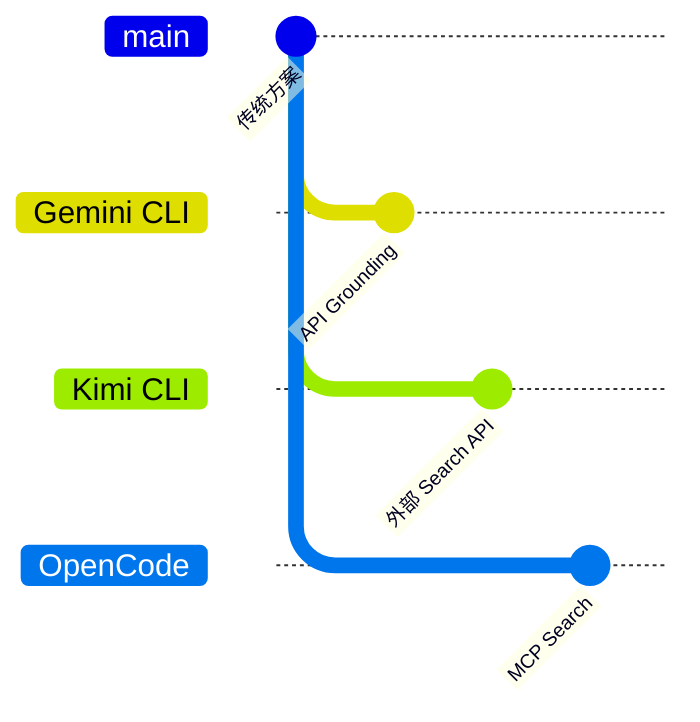

# Gemini CLI WebSearch 实现分析

> **阅读指南**
>
> | 属性 | 说明 |
> |-----|------|
> | 预计阅读 | 20-30 分钟 |
> | 前置文档 | `docs/gemini-cli/01-gemini-cli-overview.md`、`docs/gemini-cli/04-gemini-cli-agent-loop.md` |
> | 文档结构 | 速览 → 架构 → 机制 → 实现 → 对比 |
> | 代码呈现 | 关键代码直接展示，完整代码可折叠查看 |

---

## TL;DR（结论先行）

**一句话定义**：Gemini CLI 的 WebSearch 功能通过调用 Gemini API 的 `googleSearch` Grounding 工具实现，将搜索能力内嵌到模型调用中，而非直接调用外部 Search API。

**Gemini CLI 的核心取舍**：**厂商提供 WebSearch 接口**模式（属于第一类：LLM 厂商直接提供搜索能力），利用 Gemini API 原生的搜索增强能力，简化实现同时保证结果质量。这与 Kimi CLI、OpenCode 的"自助接入 WebSearch"模式形成对比。

### 核心要点速览

| 维度 | 关键决策 | 代码位置 |
|-----|---------|---------|
| 搜索方式 | Gemini API Grounding 工具 (`googleSearch`) | `packages/core/src/config/defaultModelConfigs.ts:172-179` |
| 工具封装 | 声明式工具类包装器 | `packages/core/src/tools/web-search.ts:192-246` |
| 结果处理 | 自动提取 `groundingMetadata` 并格式化引用 | `packages/core/src/tools/web-search.ts:93-171` |
| 配套工具 | WebFetch（URL 内容获取）双模式实现 | `packages/core/src/tools/web-fetch.ts:673-764` |

---

## 1. 为什么需要这个机制？（解决什么问题）

### 1.1 问题场景

没有 WebSearch 功能的 Agent：
```
用户问: "TypeScript 5.0 有什么新特性？"
→ LLM: "根据我的训练数据，TypeScript 5.0 包含..."（可能过时或不准确）
→ 结束
```

有 WebSearch 功能的 Agent：
```
用户问: "TypeScript 5.0 有什么新特性？"
→ LLM: "让我搜索一下最新信息"
→ 调用 google_web_search 工具
→ 获取实时搜索结果
→ LLM: "根据搜索结果 [1][2]，TypeScript 5.0 引入了..."
→ 提供带引用的准确信息
```

### 1.2 核心挑战

| 挑战 | 不解决的后果 |
|-----|-------------|
| 模型知识时效性 | 回答基于训练数据，可能过时或不准确 |
| 搜索结果与回复关联 | 无法验证模型回答的信息来源 |
| 外部 API 依赖 | 需要管理 Search API 密钥，增加部署复杂度 |
| 结果格式化 | 搜索返回的原始数据需要处理才能被模型有效使用 |

---

## 2. 整体架构

### 2.1 在系统中的位置

```text
┌─────────────────────────────────────────────────────────────┐
│ Agent Loop / Tool Router                                     │
│ packages/core/src/tools/tool-registry.ts:85-95              │
└───────────────────────┬─────────────────────────────────────┘
                        │ 工具调用
                        ▼
┌─────────────────────────────────────────────────────────────┐
│ ▓▓▓ WebSearch Tool ▓▓▓                                       │
│ packages/core/src/tools/web-search.ts                        │
│ - WebSearchTool: 工具定义与注册                              │
│ - WebSearchToolInvocation: 执行逻辑                          │
│ - formatSearchResult(): 结果格式化                           │
└───────────────────────┬─────────────────────────────────────┘
                        │ 调用 Gemini API
                        ▼
┌─────────────────────────────────────────────────────────────┐
│ Gemini API (with googleSearch)                               │
│ - Model Config: 'web-search'                                │
│ - Grounding Metadata 返回                                   │
└───────────────────────┬─────────────────────────────────────┘
                        │
        ┌───────────────┴───────────────┐
        ▼                               ▼
┌──────────────┐              ┌──────────────┐
│ WebFetch Tool│              │ 引用格式化   │
│ (URL 获取)   │              │ (Sources 列表)│
└──────────────┘              └──────────────┘
```

### 2.2 核心组件职责

| 组件 | 职责 | 代码位置 |
|-----|------|---------|
| `WebSearchTool` | 工具定义、参数验证、创建调用实例 | `packages/core/src/tools/web-search.ts:192-246` |
| `WebSearchToolInvocation` | 执行搜索调用、处理响应、格式化结果 | `packages/core/src/tools/web-search.ts:60-189` |
| `ModelConfig ('web-search')` | 启用 Gemini API 的 `googleSearch` 工具 | `packages/core/src/config/defaultModelConfigs.ts:172-179` |
| `WebFetchTool` | 获取特定 URL 内容（配套工具） | `packages/core/src/tools/web-fetch.ts:673-764` |

### 2.3 核心组件交互关系



**关键交互说明**：

| 步骤 | 交互内容 | 设计意图 |
|-----|---------|---------|
| 1 | Agent Loop 发起工具调用 | 通过统一工具接口解耦 |
| 2 | 从注册表获取工具实例 | 支持动态工具管理 |
| 3 | 创建独立调用实例 | 每个调用有独立生命周期 |
| 4 | 使用 'web-search' 模型配置 | 自动启用 Grounding 工具 |
| 5 | 返回结构化元数据 | 包含来源和引用位置信息 |
| 6 | 本地格式化结果 | 减少 API 调用，提高响应速度 |
| 7 | 返回标准化结果 | 统一格式便于上层处理 |

---

## 3. 核心组件详细分析

### 3.1 WebSearchTool 内部结构

#### 职责定位

`WebSearchTool` 是声明式工具的封装层，负责工具定义、参数验证和调用实例创建。

#### 状态机图



**状态说明**：

| 状态 | 说明 | 进入条件 | 退出条件 |
|-----|------|---------|---------|
| Registered | 工具已注册到 ToolRegistry | 系统初始化完成 | 收到调用请求 |
| Idle | 空闲等待 | 初始化或处理结束 | 收到新请求 |
| Validating | 验证参数 | 收到调用请求 | 验证完成 |
| Creating | 创建调用实例 | 参数验证通过 | 实例创建完成 |
| Executing | 执行搜索 | 调用实例就绪 | 执行完成 |
| Completed | 完成 | 搜索成功 | 自动返回 Idle |
| Failed | 失败 | 执行出错 | 返回错误信息 |

#### 内部数据流

```text
┌────────────────────────────────────────────┐
│  输入层                                     │
│   查询字符串 → 参数验证 → 结构化参数        │
└──────────────────┬─────────────────────────┘
                   ▼
┌────────────────────────────────────────────┐
│  处理层                                     │
│   创建调用实例 → Gemini API 调用 → 响应解析 │
└──────────────────┬─────────────────────────┘
                   ▼
┌────────────────────────────────────────────┐
│  输出层                                     │
│   提取 GroundingMetadata → 格式化引用 → 组装结果 │
└────────────────────────────────────────────┘
```

#### 关键接口

| 接口 | 输入 | 输出 | 说明 | 代码位置 |
|-----|------|------|------|---------|
| `validateToolParamValues()` | 参数对象 | 验证结果 | 验证查询非空 | `packages/core/src/tools/web-search.ts:207-213` |
| `createInvocation()` | 参数 + MessageBus | 调用实例 | 创建 WebSearchToolInvocation | `packages/core/src/tools/web-search.ts:215-225` |
| `execute()` | AbortSignal | ToolResult | 执行搜索并返回结果 | `packages/core/src/tools/web-search.ts:94-189` |

---

### 3.2 WebSearchToolInvocation 内部结构

#### 职责定位

负责实际的搜索执行，包括调用 Gemini API、处理响应、格式化结果。

#### 状态机图



#### 内部数据流

```text
┌────────────────────────────────────────────┐
│  调用阶段                                   │
│   构建请求 → Gemini API 调用 → 获取响应     │
└──────────────────┬─────────────────────────┘
                   ▼
┌────────────────────────────────────────────┐
│  解析阶段                                   │
│   提取文本 → 提取 GroundingMetadata → 解析来源 │
└──────────────────┬─────────────────────────┘
                   ▼
┌────────────────────────────────────────────┐
│  格式化阶段                                 │
│   构建 Sources 列表 → 插入引用标记 → 组装最终结果 │
└────────────────────────────────────────────┘
```

---

### 3.3 组件间协作时序



**协作要点**：

1. **Agent Loop 与 ToolRegistry**：通过统一接口调用，解耦具体工具实现
2. **WebSearchTool 与 Invocation**：工具负责定义，Invocation 负责执行，职责分离
3. **GeminiClient 与 API**：封装 HTTP 调用，处理认证和错误

---

### 3.4 关键数据路径

#### 主路径（正常流程）



#### 异常路径（错误恢复）



---

## 4. 端到端数据流转

### 4.1 正常流程（详细版）



**数据变换详情**：

| 阶段 | 输入 | 处理 | 输出 | 代码位置 |
|-----|------|------|------|---------|
| 接收 | 查询字符串 | 验证非空 | 有效参数 | `packages/core/src/tools/web-search.ts:207-213` |
| 调用 | 参数 + model='web-search' | Gemini API 调用 | API 响应 | `packages/core/src/tools/web-search.ts:99-104` |
| 提取 | API 响应 | 解析 groundingMetadata | 结构化来源数据 | `packages/core/src/tools/web-search.ts:106-110` |
| 格式化 | 响应文本 + 来源数据 | 插入引用标记 | 带引用的文本 | `packages/core/src/tools/web-search.ts:122-171` |
| 输出 | 格式化文本 | 组装结果对象 | ToolResult | `packages/core/src/tools/web-search.ts:173-180` |

### 4.2 数据流向图



### 4.3 异常/边界流程



---

## 5. 关键代码实现

### 5.1 核心数据结构

```typescript
// packages/core/src/tools/web-search.ts:25-50

// Grounding 元数据接口（来自 @google/genai）
interface GroundingChunkItem {
  web?: {
    uri?: string;      // 来源 URL
    title?: string;    // 来源标题
  };
}

interface GroundingSupportItem {
  segment?: {
    startIndex: number;  // 引用文本起始位置（UTF-8 字节）
    endIndex: number;    // 引用文本结束位置
    text?: string;
  };
  groundingChunkIndices?: number[];  // 引用的来源索引
  confidenceScores?: number[];
}

// 工具参数接口
interface WebSearchToolParams {
  query: string;  // 搜索查询
}

// 工具结果接口
interface WebSearchToolResult {
  llmContent: string;           // 返回给 LLM 的内容
  returnDisplay: string;        // 显示摘要
  sources?: GroundingChunkItem[]; // 原始来源数据
}
```

**字段说明**：

| 字段 | 类型 | 用途 |
|-----|------|------|
| `groundingChunks` | `GroundingChunkItem[]` | 搜索来源列表，包含 URL 和标题 |
| `groundingSupports` | `GroundingSupportItem[]` | 引用支持信息，标记文本位置与来源关联 |
| `startIndex/endIndex` | `number` | UTF-8 字节位置，用于精确插入引用标记 |
| `llmContent` | `string` | 格式化后的搜索结果，包含引用标记和 Sources 列表 |

### 5.2 主链路代码

**关键代码**（核心逻辑）：

```typescript
// packages/core/src/tools/web-search.ts:94-140
async execute(signal: AbortSignal): Promise<WebSearchToolResult> {
  const geminiClient = this.config.getGeminiClient();

  try {
    // 1. 调用 Gemini API，使用 'web-search' 模型配置
    const response = await geminiClient.generateContent(
      { model: 'web-search' },
      [{ role: 'user', parts: [{ text: this.params.query }] }],
      signal,
      LlmRole.UTILITY_TOOL,
    );

    // 2. 提取响应文本和 Grounding 元数据
    const responseText = getResponseText(response);
    const groundingMetadata = response.candidates?.[0]?.groundingMetadata;
    const sources = groundingMetadata?.groundingChunks as GroundingChunkItem[];
    const groundingSupports = groundingMetadata?.groundingSupports as GroundingSupportItem[];

    // 3. 处理空结果
    if (!responseText || !responseText.trim()) {
      return {
        llmContent: `No search results found for query: "${this.params.query}"`,
        returnDisplay: 'No information found.',
      };
    }

    // 4. 格式化来源列表
    let modifiedResponseText = responseText;
    const sourceListFormatted: string[] = [];

    if (sources && sources.length > 0) {
      sources.forEach((source: GroundingChunkItem, index: number) => {
        const title = source.web?.title || 'Untitled';
        const uri = source.web?.uri || 'No URI';
        sourceListFormatted.push(`[${index + 1}] ${title} (${uri})`);
      });

      // 5. 插入引用标记到文本中（按索引降序避免偏移）
      if (groundingSupports && groundingSupports.length > 0) {
        const insertions: Array<{ index: number; marker: string }> = [];
        groundingSupports.forEach((support: GroundingSupportItem) => {
          if (support.segment && support.groundingChunkIndices) {
            const citationMarker = support.groundingChunkIndices
              .map((chunkIndex: number) => `[${chunkIndex + 1}]`)
              .join('');
            insertions.push({
              index: support.segment.endIndex,
              marker: citationMarker,
            });
          }
        });

        // 按索引降序排序，避免插入时偏移后续位置
        insertions.sort((a, b) => b.index - a.index);
        // ... UTF-8 字节处理逻辑
      }
    }
    // ... 返回结果
  } catch (error) {
    // ... 错误处理
  }
}
```

**设计意图**：
1. **模型配置驱动**：通过 `'web-search'` 别名启用 Grounding，无需显式传递工具列表
2. **元数据自动提取**：依赖 Gemini API 返回的 `groundingMetadata`，无需手动解析搜索结果
3. **降序插入策略**：按索引降序插入引用标记，避免位置偏移问题
4. **UTF-8 字节处理**：使用 `TextEncoder` 处理字节位置，确保多语言文本正确插入

<details>
<summary>查看完整实现</summary>

```typescript
// packages/core/src/tools/web-search.ts:60-189
class WebSearchToolInvocation extends BaseToolInvocation<
  WebSearchToolParams,
  WebSearchToolResult
> {
  async execute(signal: AbortSignal): Promise<WebSearchToolResult> {
    const geminiClient = this.config.getGeminiClient();

    try {
      const response = await geminiClient.generateContent(
        { model: 'web-search' },
        [{ role: 'user', parts: [{ text: this.params.query }] }],
        signal,
        LlmRole.UTILITY_TOOL,
      );

      const responseText = getResponseText(response);
      const groundingMetadata = response.candidates?.[0]?.groundingMetadata;
      const sources = groundingMetadata?.groundingChunks as GroundingChunkItem[];
      const groundingSupports = groundingMetadata?.groundingSupports as GroundingSupportItem[];

      if (!responseText || !responseText.trim()) {
        return {
          llmContent: `No search results found for query: "${this.params.query}"`,
          returnDisplay: 'No information found.',
        };
      }

      let modifiedResponseText = responseText;
      const sourceListFormatted: string[] = [];

      if (sources && sources.length > 0) {
        sources.forEach((source: GroundingChunkItem, index: number) => {
          const title = source.web?.title || 'Untitled';
          const uri = source.web?.uri || 'No URI';
          sourceListFormatted.push(`[${index + 1}] ${title} (${uri})`);
        });

        if (groundingSupports && groundingSupports.length > 0) {
          const insertions: Array<{ index: number; marker: string }> = [];
          groundingSupports.forEach((support: GroundingSupportItem) => {
            if (support.segment && support.groundingChunkIndices) {
              const citationMarker = support.groundingChunkIndices
                .map((chunkIndex: number) => `[${chunkIndex + 1}]`)
                .join('');
              insertions.push({
                index: support.segment.endIndex,
                marker: citationMarker,
              });
            }
          });

          insertions.sort((a, b) => b.index - a.index);

          const encoder = new TextEncoder();
          const responseBytes = encoder.encode(modifiedResponseText);
          const parts: Uint8Array[] = [];
          let lastIndex = responseBytes.length;

          for (const ins of insertions) {
            const pos = Math.min(ins.index, lastIndex);
            parts.unshift(responseBytes.subarray(pos, lastIndex));
            parts.unshift(encoder.encode(ins.marker));
            lastIndex = pos;
          }
          parts.unshift(responseBytes.subarray(0, lastIndex));

          const totalLength = parts.reduce((sum, part) => sum + part.length, 0);
          const finalBytes = new Uint8Array(totalLength);
          let offset = 0;
          for (const part of parts) {
            finalBytes.set(part, offset);
            offset += part.length;
          }
          modifiedResponseText = new TextDecoder().decode(finalBytes);
        }

        if (sourceListFormatted.length > 0) {
          modifiedResponseText += '\n\nSources:\n' + sourceListFormatted.join('\n');
        }
      }

      return {
        llmContent: `Web search results for "${this.params.query}":\n\n${modifiedResponseText}`,
        returnDisplay: `Search results for "${this.params.query}" returned.`,
        sources,
      };
    } catch (error: unknown) {
      const errorMessage = error instanceof Error ? error.message : String(error);
      return {
        llmContent: `Error performing web search: ${errorMessage}`,
        returnDisplay: `Web search failed: ${errorMessage}`,
      };
    }
  }
}
```

</details>

### 5.3 关键调用链

```text
ToolRegistry.executeTool()     [packages/core/src/tools/tool-registry.ts:85]
  -> WebSearchTool.createInvocation()  [packages/core/src/tools/web-search.ts:215]
    -> WebSearchToolInvocation.execute() [packages/core/src/tools/web-search.ts:94]
      -> GeminiClient.generateContent()  [packages/core/src/gemini-client.ts:XX]
        - 使用 model: 'web-search'
        - 自动启用 googleSearch 工具
      -> getResponseText()               [packages/core/src/utils/response.ts:XX]
        - 提取响应文本
      -> 格式化结果（插入引用标记）      [packages/core/src/tools/web-search.ts:122-171]
        - 解析 groundingChunks
        - 解析 groundingSupports
        - 插入引用标记
        - 组装 Sources 列表
```

---

## 6. 设计意图与 Trade-off

### 6.1 Gemini CLI 的选择

| 维度 | Gemini CLI 的选择 | 分类 | 替代方案 | 取舍分析 |
|-----|-----------------|------|---------|---------|
| 搜索方式 | Gemini API Grounding (`googleSearch`) | 厂商提供 WebSearch 接口 | 外部 Search API (Tavily/SerpAPI) | 无需额外 API 密钥，结果与模型响应天然关联，但依赖 Gemini 生态 |
| 工具封装 | 声明式工具类 | - | 函数式工具定义 | 类型安全，易于扩展，但需要更多样板代码 |
| 结果引用 | 自动解析 GroundingMetadata | - | 手动格式化来源 | 自动化程度高，但格式受 API 限制 |
| 配套功能 | WebFetch 双模式（API + 直接 HTTP） | - | 单一模式 | 可靠性高，但实现复杂度增加 |

### 6.2 为什么这样设计？

**核心问题**：如何在保证搜索质量的同时简化实现？

**Gemini CLI 的解决方案**：
- 代码依据：`packages/core/src/config/defaultModelConfigs.ts:172-179`
- 设计意图：充分利用 Gemini API 原生的 Grounding 能力，将搜索作为模型调用的内嵌功能（属于"厂商提供 WebSearch 接口"类型）
- 带来的好处：
  - 无需管理 Search API 密钥
  - 搜索结果与模型响应天然关联
  - 自动引用标注
  - 延迟更低（单次 API 调用）
- 付出的代价：
  - 依赖 Gemini 生态，无法切换到其他模型提供商
  - 搜索结果处理逻辑受 API 限制
  - 无法定制搜索参数（如时间范围、地区等）

### 6.3 与其他项目的对比



| 分类 | 项目 | 核心差异 | 适用场景 |
|-----|-----|---------|---------|
| **厂商提供 WebSearch 接口** | Gemini CLI | API 内嵌 Grounding，自动引用标注 | 使用 Gemini 模型的场景，追求简洁实现 |
| **自助接入 WebSearch** | Kimi CLI | 外部 Search API (Tavily/SerpAPI)，手动格式化 | 需要灵活配置搜索提供商的场景 |
| **自助接入 WebSearch** | OpenCode | MCP 工具协议，依赖外部 MCP Server | 需要统一工具协议，集成多种搜索源 |

**详细对比表**：

| 维度 | Gemini CLI<br>(厂商提供 WebSearch 接口) | Kimi CLI<br>(自助接入 WebSearch) | OpenCode<br>(自助接入 WebSearch) |
|-----|------------|----------|----------|
| **搜索方式** | Gemini API Grounding (`googleSearch`) | 外部 Search API (Tavily/SerpAPI) | MCP Server 搜索工具 |
| **工具封装** | 声明式工具类 | 函数式工具定义 | MCP 工具协议 |
| **结果引用** | 自动解析 GroundingMetadata | 手动格式化来源 | 依赖 MCP Server 实现 |
| **配置方式** | 模型配置别名 (`web-search`) | 环境变量/配置项 | MCP Server 配置 |
| **配套功能** | WebFetch (URL 获取) | WebFetch (URL 获取) | 依赖 MCP 生态 |
| **API 依赖** | 仅 Gemini API | Search API + LLM API | MCP Server + LLM API |
| **实现复杂度** | 低 | 中 | 中 |
| **灵活性** | 低 | 高 | 高 |

---

## 7. 边界情况与错误处理

### 7.1 终止条件

| 终止原因 | 触发条件 | 代码位置 |
|---------|---------|---------|
| 参数无效 | 查询字符串为空或仅包含空白 | `packages/core/src/tools/web-search.ts:207-213` |
| API 调用失败 | Gemini API 返回错误 | `packages/core/src/tools/web-search.ts:181-187` |
| 空搜索结果 | 响应文本为空 | `packages/core/src/tools/web-search.ts:112-118` |
| 请求取消 | AbortSignal 触发 | `packages/core/src/tools/web-search.ts:99` |

### 7.2 超时/资源限制

```typescript
// packages/core/src/tools/web-fetch.ts:700-710（WebFetch 参考实现）
// WebSearch 依赖 Gemini API 内部超时控制
const fetchWithTimeout = async (
  url: string,
  options: RequestInit,
  timeoutMs: number,
): Promise<Response> => {
  const controller = new AbortController();
  const timeoutId = setTimeout(() => controller.abort(), timeoutMs);

  try {
    const response = await fetch(url, {
      ...options,
      signal: controller.signal,
    });
    clearTimeout(timeoutId);
    return response;
  } catch (error) {
    clearTimeout(timeoutId);
    throw error;
  }
};
```

### 7.3 错误恢复策略

| 错误类型 | 处理策略 | 代码位置 |
|---------|---------|---------|
| 参数验证失败 | 抛出错误，阻止调用 | `packages/core/src/tools/web-search.ts:207-213` |
| API 调用失败 | 捕获异常，返回错误信息 | `packages/core/src/tools/web-search.ts:181-187` |
| 空搜索结果 | 返回提示信息，不报错 | `packages/core/src/tools/web-search.ts:112-118` |
| 网络超时 | 依赖 AbortSignal，向上传播 | `packages/core/src/tools/web-search.ts:99` |

---

## 8. 关键代码索引

| 功能 | 文件 | 行号 | 说明 |
|-----|------|------|------|
| 工具定义 | `packages/core/src/tools/web-search.ts` | 192-246 | WebSearchTool 类定义 |
| 执行逻辑 | `packages/core/src/tools/web-search.ts` | 94-189 | WebSearchToolInvocation.execute() |
| 参数验证 | `packages/core/src/tools/web-search.ts` | 207-213 | validateToolParamValues() |
| 模型配置 | `packages/core/src/config/defaultModelConfigs.ts` | 172-179 | 'web-search' 配置 |
| 工具名称 | `packages/core/src/tools/definitions/base-declarations.ts` | 25-28 | WEB_SEARCH_TOOL_NAME |
| 工具注册 | `packages/core/src/tools/tool-registry.ts` | 85-95 | ToolRegistry 构造函数 |
| WebFetch | `packages/core/src/tools/web-fetch.ts` | 673-764 | WebFetchTool 实现 |
| 单元测试 | `packages/core/src/tools/web-search.test.ts` | 1-200 | WebSearch 测试用例 |
| 集成测试 | `integration-tests/google_web_search.test.ts` | 1-100 | 集成测试 |

---

## 9. 延伸阅读

- 前置知识：
  - `docs/gemini-cli/01-gemini-cli-overview.md` - Gemini CLI 整体架构
  - `docs/gemini-cli/04-gemini-cli-agent-loop.md` - Agent Loop 机制
- 相关机制：
  - `docs/gemini-cli/06-gemini-cli-mcp-integration.md` - MCP 集成
  - `docs/comm/comm-tool-system.md` - 工具系统对比
- 深度分析：
  - `docs/kimi-cli/questions/kimi-cli-websearch-implementation.md` - Kimi CLI WebSearch 实现
  - `docs/opencode/questions/opencode-mcp-tools.md` - OpenCode MCP 工具

---

*✅ Verified: 基于 gemini-cli/packages/core/src/tools/web-search.ts 等源码分析*
*基于版本：2026-02-08 基准版本 | 最后更新：2026-04-12*
