# Kimi CLI 开发者入门（面向第一次做 Code Agent）

## TL;DR（结论先行）

一句话定义：Kimi CLI 是一个基于 Python 实现的 AI Code Agent，通过**命令式 while 循环 + Checkpoint 回滚机制**驱动多轮 LLM 调用，实现从"一次性回答"到"多轮工具执行"的转变。

Kimi CLI 的核心取舍：**显式状态管理 + 文件持久化 Checkpoint**（对比 Gemini CLI 的递归 continuation、Codex 的 Actor 消息驱动）

---

## 1. 为什么需要这个机制？（解决什么问题）

### 1.1 问题场景

没有 Agent Loop 时，用户问"修复这个 bug"：

```
用户: 修复这个 bug
LLM: 好的，你需要修改第 42 行...
（结束，没有实际执行任何操作）
```

有了 Agent Loop 后：

```
用户: 修复这个 bug
  → LLM: "先读文件了解问题" → 执行读文件工具 → 得到文件内容
  → LLM: "再跑测试复现问题" → 执行测试命令 → 得到错误输出
  → LLM: "修改第 42 行" → 执行写文件工具 → 成功
  → LLM: "验证修复" → 再次运行测试 → 通过
（任务完成，有实际产出）
```

### 1.2 核心挑战

| 挑战 | 不解决的后果 |
|-----|-------------|
| 多轮执行协调 | LLM 只能一次性回答，无法分步执行复杂任务 |
| 状态持久化 | 进程崩溃后对话历史丢失，无法恢复上下文 |
| 风险控制 | 自动执行危险操作（如 `rm -rf`）可能导致数据丢失 |
| Token 限制 | 长对话超出 LLM 上下文窗口，需要智能压缩 |

---

## 2. 整体架构（ASCII 图）

### 2.1 在系统中的位置

```text
┌─────────────────────────────────────────────────────────────┐
│ CLI 入口 (Typer)                                            │
│ kimi-cli/src/kimi_cli/cli/__init__.py:54                    │
│ - 参数解析、模式选择、Session 管理                            │
└───────────────────────┬─────────────────────────────────────┘
                        │ 用户输入 + Session
                        ▼
┌─────────────────────────────────────────────────────────────┐
│ KimiCLI.create()                                            │
│ kimi-cli/src/kimi_cli/app.py:55                             │
│ - 读配置、建 LLM、建 Runtime、加载 Agent/Tool               │
└───────────────────────┬─────────────────────────────────────┘
                        │
                        ▼
┌─────────────────────────────────────────────────────────────┐
│ ▓▓▓ KimiSoul (核心 Agent Loop) ▓▓▓                          │
│ kimi-cli/src/kimi_cli/soul/kimisoul.py                      │
│ - run()       : Turn 入口                                   │
│ - _turn()     : Checkpoint + 用户消息处理                   │
│ - _agent_loop(): 核心循环（step 计数、compaction）          │
│ - _step()     : 单次 LLM 调用 + 工具执行                    │
└───────────────────────┬─────────────────────────────────────┘
                        │
        ┌───────────────┼───────────────┐
        ▼               ▼               ▼
┌──────────────┐ ┌──────────────┐ ┌──────────────┐
│ LLM API      │ │ Tool System  │ │ Context      │
│ (kosong)     │ │ 工具执行     │ │ 状态管理     │
│              │ │ + 审批       │ │ + Checkpoint │
└──────────────┘ └──────────────┘ └──────────────┘
```

### 2.2 核心组件职责

| 组件 | 职责 | 代码位置 |
|-----|------|---------|
| `KimiSoul` | 核心 Agent 循环，协调 LLM 调用与工具执行 | `kimi-cli/src/kimi_cli/soul/kimisoul.py:89` |
| `Context` | 对话历史管理、Checkpoint 持久化 | `kimi-cli/src/kimi_cli/soul/context.py:16` |
| `Approval` | 工具执行前的用户审批 | `kimi-cli/src/kimi_cli/soul/approval.py:34` |
| `Wire` | Soul 与 UI 之间的消息通道 | `kimi-cli/src/kimi_cli/wire/__init__.py:18` |
| `Runtime` | LLM、工具集、配置的聚合 | `kimi-cli/src/kimi_cli/soul/agent.py:79` |

### 2.3 核心组件交互关系

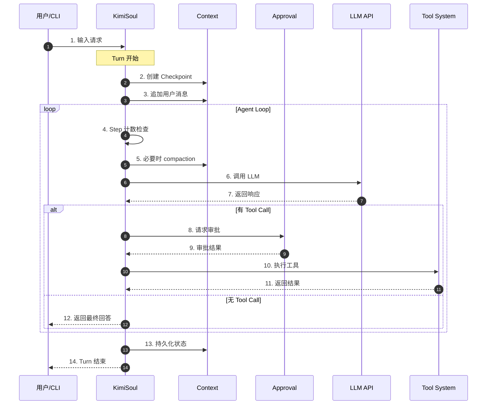

**关键交互说明**：

| 步骤 | 交互内容 | 设计意图 |
|-----|---------|---------|
| 2 | Checkpoint 创建 | 支持对话回滚，D-Mail 工具可触发回退 |
| 5 | Context compaction | Token 超限前自动压缩，避免 LLM 调用失败 |
| 8-9 | 审批流程 | 危险操作需用户确认，支持 YOLO 模式自动放行 |
| 10-11 | 工具执行 | 并发派发、顺序收集结果，保持确定性 |

---

## 3. 核心组件详细分析

### 3.1 KimiSoul 内部结构

#### 职责定位

KimiSoul 是 Agent 的核心控制器，负责协调 LLM 调用、工具执行、审批流程和状态管理。

#### 状态机图

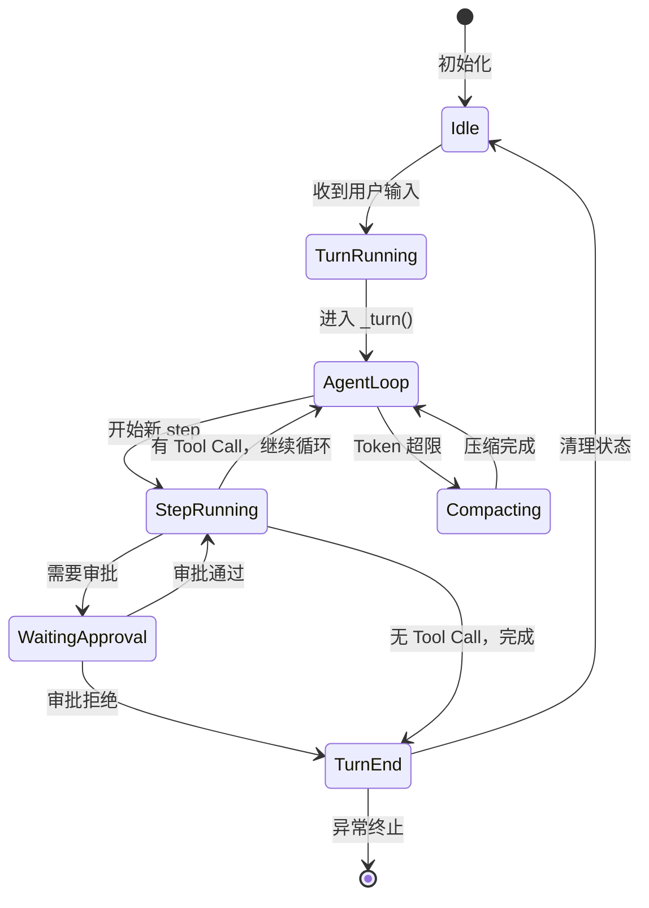

**状态说明**：

| 状态 | 说明 | 进入条件 | 退出条件 |
|-----|------|---------|---------|
| Idle | 空闲等待 | 初始化完成或 Turn 结束 | 收到用户输入 |
| TurnRunning | Turn 执行中 | 开始处理用户请求 | 进入 Agent Loop |
| AgentLoop | 核心循环 | 开始多轮执行 | Step 完成或无 Tool Call |
| StepRunning | Step 执行中 | 开始单次 LLM 调用 | LLM 返回响应 |
| WaitingApproval | 等待审批 | 工具需要用户确认 | 用户响应 |
| Compacting | 压缩上下文 | Token 接近上限 | 压缩完成 |
| TurnEnd | Turn 结束 | 完成或异常 | 返回 Idle 或终止 |

#### 内部数据流

```text
┌─────────────────────────────────────────────────────────────┐
│  输入层                                                      │
│  ├── 用户输入 ──► 解析 Slash 命令 ──► 普通消息/技能调用       │
│  └── Skill 文件 ──► 读取内容 ──► 转为 User Message           │
└──────────────────────────┬──────────────────────────────────┘
                           ▼
┌─────────────────────────────────────────────────────────────┐
│  处理层                                                      │
│  ├── _turn(): Checkpoint + 消息追加                         │
│  ├── _agent_loop():                                         │
│  │   ├── Step 计数检查                                      │
│  │   ├── Compaction 检查                                    │
│  │   ├── _checkpoint()                                      │
│  │   ├── _step(): LLM 调用 + 工具执行                       │
│  │   └── 结果处理                                           │
│  └── 异常处理: BackToTheFuture (D-Mail 回滚)                │
└──────────────────────────┬──────────────────────────────────┘
                           ▼
┌─────────────────────────────────────────────────────────────┐
│  输出层                                                      │
│  ├── Wire 事件发送 (TurnBegin/StepBegin/ToolResult...)      │
│  ├── Context 持久化 (context.jsonl)                         │
│  └── 最终响应返回                                            │
└─────────────────────────────────────────────────────────────┘
```

#### 关键算法逻辑

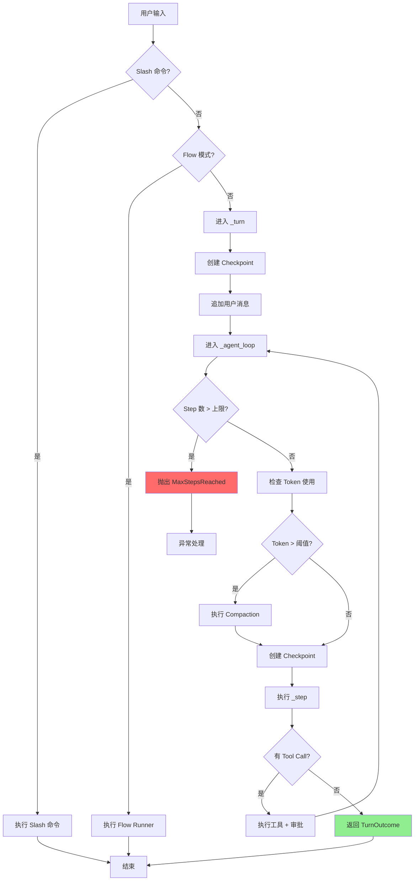

**算法要点**：

1. **双层循环设计**：外层 `_turn` 管理单次对话周期，内层 `_agent_loop` 管理多轮工具执行
2. **显式 Step 计数**：防止无限循环，可配置上限（默认 100）
3. **Compaction 前置**：在 LLM 调用前检查 Token 使用，避免超限错误
4. **Checkpoint 回滚支持**：通过 `BackToTheFuture` 异常实现 D-Mail 回退

#### 关键接口

| 接口 | 输入 | 输出 | 说明 | 代码位置 |
|-----|------|------|------|---------|
| `run()` | 用户输入 | None | Turn 入口 | `kimi-cli/src/kimi_cli/soul/kimisoul.py:182` |
| `_turn()` | Message | TurnOutcome | Checkpoint + 用户消息处理 | `kimi-cli/src/kimi_cli/soul/kimisoul.py:210` |
| `_agent_loop()` | None | TurnOutcome | 核心循环 | `kimi-cli/src/kimi_cli/soul/kimisoul.py:302` |
| `_step()` | None | StepOutcome | 单次 LLM 调用 + 工具执行 | `kimi-cli/src/kimi_cli/soul/kimisoul.py:382` |

---

### 3.2 Context 内部结构

#### 职责定位

Context 负责对话历史的内存管理和文件持久化，支持 Checkpoint 创建和回滚。

#### 状态机图

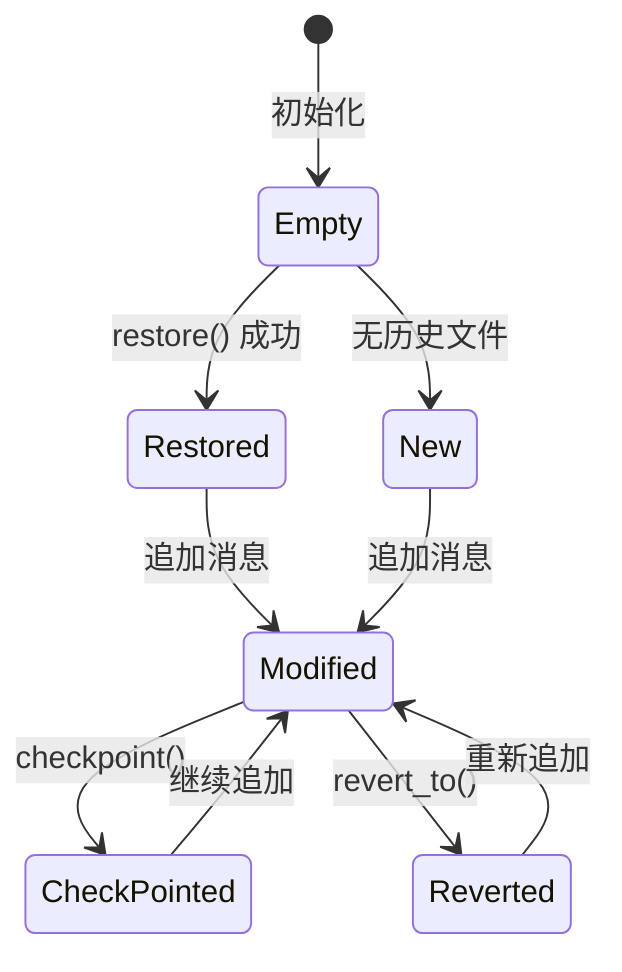

#### 关键数据结构

```python
# kimi-cli/src/kimi_cli/soul/context.py:16-23
class Context:
    def __init__(self, file_backend: Path):
        self._file_backend = file_backend    # 持久化文件路径
        self._history: list[Message] = []     # 内存中的对话历史
        self._token_count: int = 0            # 当前 Token 计数
        self._next_checkpoint_id: int = 0     # 下一个 Checkpoint ID
```

**字段说明**：

| 字段 | 类型 | 用途 |
|-----|------|------|
| `_file_backend` | `Path` | context.jsonl 文件路径 |
| `_history` | `list[Message]` | 内存中的对话消息列表 |
| `_token_count` | `int` | 当前上下文 Token 数量 |
| `_next_checkpoint_id` | `int` | 递增的 Checkpoint 标识符 |

---

### 3.3 组件间协作时序

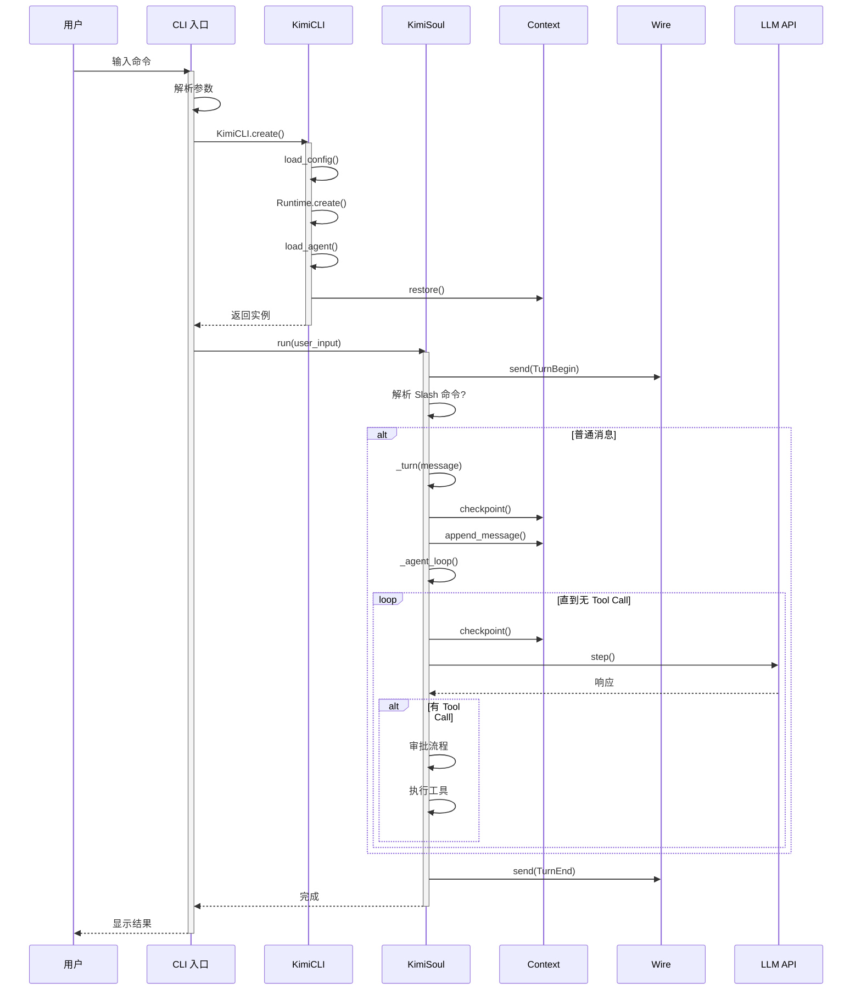

**协作要点**：

1. **CLI 与 App**：CLI 负责参数解析，App 负责组件组装
2. **Soul 与 Context**：Soul 通过 Context 管理状态，Context 负责持久化
3. **Soul 与 Wire**：Soul 发送事件，UI 通过 Wire 接收并展示
4. **Soul 与 LLM**：通过 kosong 库调用，支持重试和错误处理

---

### 3.4 关键数据路径

#### 主路径（正常流程）

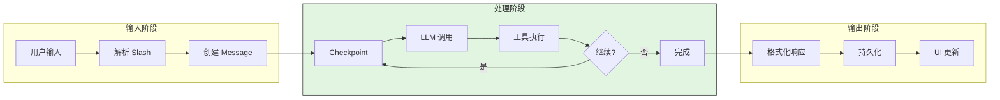

#### 异常路径（Checkpoint 回滚）

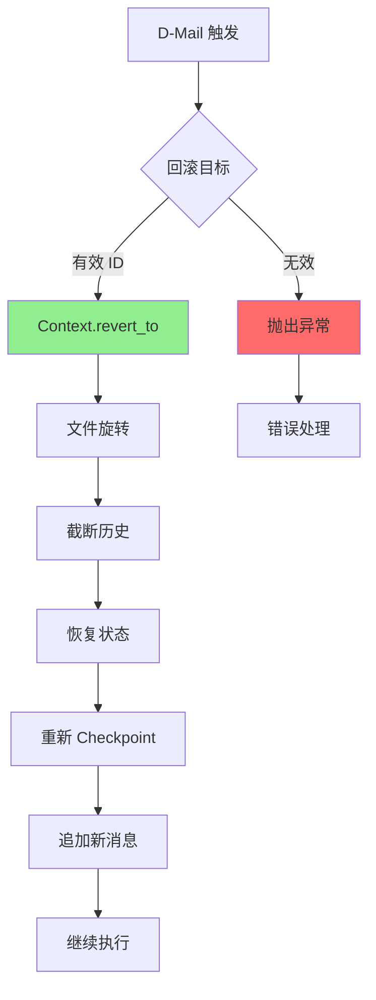

---

## 4. 端到端数据流转

### 4.1 正常流程（详细版）

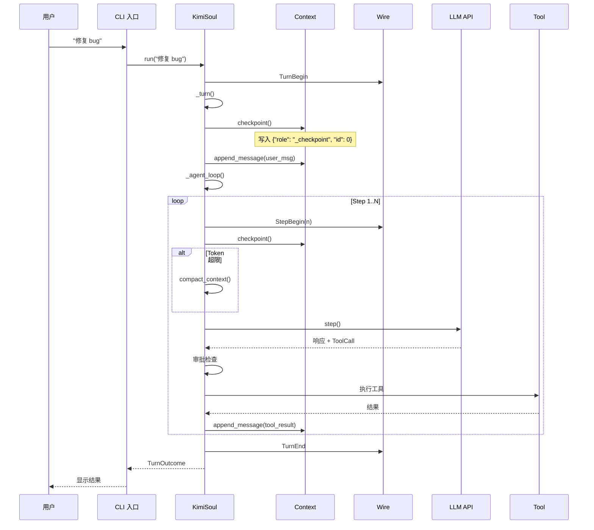

**数据变换详情**：

| 阶段 | 输入 | 处理 | 输出 | 代码位置 |
|-----|------|------|------|---------|
| 接收 | 用户输入字符串 | 解析 Slash 命令 | Message 对象 | `kimi-cli/src/kimi_cli/soul/kimisoul.py:190` |
| Checkpoint | Checkpoint ID | 写入文件 | 持久化标记 | `kimi-cli/src/kimi_cli/soul/context.py:68` |
| LLM 调用 | Message 列表 | kosong.step() | StepResult | `kimi-cli/src/kimi_cli/soul/kimisoul.py:397` |
| 工具执行 | ToolCall | 审批 + 执行 | ToolResult | `kimi-cli/src/kimi_cli/soul/kimisoul.py:420` |
| 持久化 | ToolResult | 追加到 history | context.jsonl | `kimi-cli/src/kimi_cli/soul/context.py:110` |

### 4.2 数据流向图

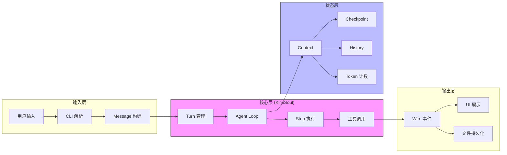

### 4.3 异常/边界流程

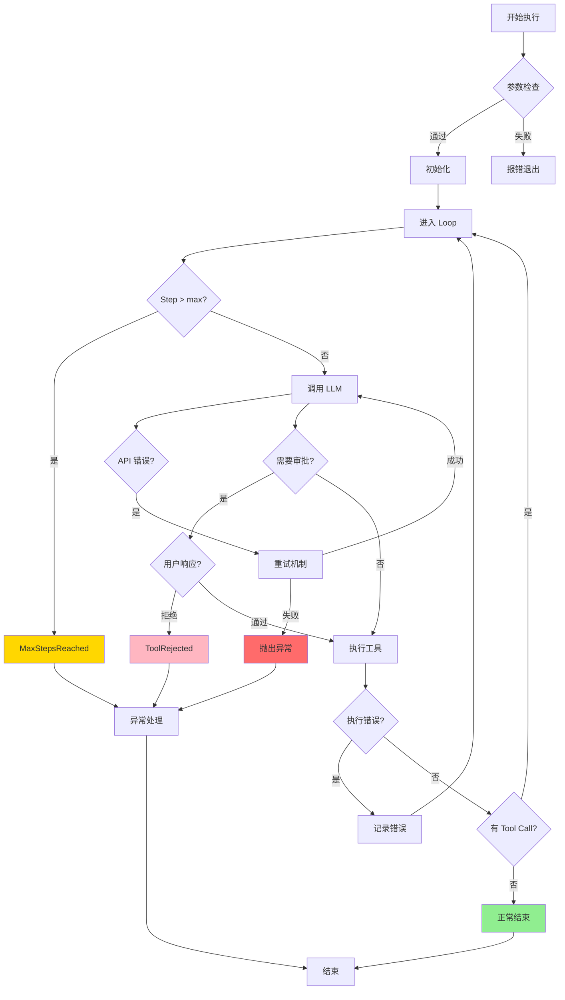

---

## 5. 关键代码实现

### 5.1 核心数据结构

```python
# kimi-cli/src/kimi_cli/soul/kimisoul.py:73-87
@dataclass(frozen=True, slots=True)
class StepOutcome:
    stop_reason: StepStopReason
    assistant_message: Message

@dataclass(frozen=True, slots=True)
class TurnOutcome:
    stop_reason: TurnStopReason
    final_message: Message | None
    step_count: int
```

**字段说明**：

| 字段 | 类型 | 用途 |
|-----|------|------|
| `stop_reason` | `StepStopReason` | 停止原因：no_tool_calls / tool_rejected |
| `assistant_message` | `Message` | LLM 的响应消息 |
| `final_message` | `Message | None` | Turn 的最终消息 |
| `step_count` | `int` | 实际执行的 step 数量 |

### 5.2 主链路代码

```python
# kimi-cli/src/kimi_cli/soul/kimisoul.py:302-380
async def _agent_loop(self) -> TurnOutcome:
    """The main agent loop for one run."""
    assert self._runtime.llm is not None

    step_no = 0
    while True:
        step_no += 1
        if step_no > self._loop_control.max_steps_per_turn:
            raise MaxStepsReached(self._loop_control.max_steps_per_turn)

        wire_send(StepBegin(n=step_no))

        try:
            # compact the context if needed
            reserved = self._loop_control.reserved_context_size
            if self._context.token_count + reserved >= self._runtime.llm.max_context_size:
                logger.info("Context too long, compacting...")
                await self.compact_context()

            logger.debug("Beginning step {step_no}", step_no=step_no)
            await self._checkpoint()
            step_outcome = await self._step()
        except BackToTheFuture as e:
            await self._context.revert_to(e.checkpoint_id)
            await self._checkpoint()
            await self._context.append_message(e.messages)
            continue

        if step_outcome is not None:
            final_message = (
                step_outcome.assistant_message
                if step_outcome.stop_reason == "no_tool_calls"
                else None
            )
            return TurnOutcome(
                stop_reason=step_outcome.stop_reason,
                final_message=final_message,
                step_count=step_no,
            )
```

**代码要点**：

1. **显式 Step 计数**：`step_no` 从 1 开始递增，超过 `max_steps_per_turn` 抛出异常
2. **Token 检查前置**：在 LLM 调用前检查 Token 使用，预留空间避免超限
3. **Checkpoint 回滚支持**：通过 `BackToTheFuture` 异常捕获 D-Mail 触发，执行回滚
4. **Outcome 驱动**：根据 `_step()` 返回的 `StepOutcome` 决定是否继续循环

### 5.3 关键调用链

```text
CLI 入口 (kimi callback)
  └── kimi-cli/src/kimi_cli/cli/__init__.py:54
      └── _run()
          └── kimi-cli/src/kimi_cli/cli/__init__.py:457
              └── KimiCLI.create()
                  └── kimi-cli/src/kimi_cli/app.py:55
                      └── Runtime.create()
                          └── kimi-cli/src/kimi_cli/soul/agent.py:79
                      └── load_agent()
                          └── kimi-cli/src/kimi_cli/soul/agent.py:189
                      └── Context.restore()
                          └── kimi-cli/src/kimi_cli/soul/context.py:24
              └── run_soul()
                  └── kimi-cli/src/kimi_cli/soul/__init__.py:121
                      └── KimiSoul.run()
                          └── kimi-cli/src/kimi_cli/soul/kimisoul.py:182
                              └── _turn()
                                  └── kimi-cli/src/kimi_cli/soul/kimisoul.py:210
                                      └── _checkpoint()
                                      └── _agent_loop()
                                          └── kimi-cli/src/kimi_cli/soul/kimisoul.py:302
                                              └── _step()
                                                  └── kimi-cli/src/kimi_cli/soul/kimisoul.py:382
                                                      └── kosong.step()
```

---

## 6. 设计意图与 Trade-off

### 6.1 Kimi CLI 的选择

| 维度 | Kimi CLI 的选择 | 替代方案 | 取舍分析 |
|-----|----------------|---------|---------|
| 循环结构 | while 迭代 | Gemini 的递归 continuation | 简单直观易于调试，但状态管理需手动处理 |
| 状态回滚 | Checkpoint 文件 | 无回滚（Codex）/ 内存快照 | 支持对话回滚，但文件副作用不自动回滚 |
| 并发执行 | 并发派发、顺序收集 | 完全并行 | 工具触发可以并发，但结果按序注入保持确定性 |
| 审批机制 | 工具层审批 | 全局策略 / 静态分析 | 可解释、可交互，但粒度偏动作级 |
| UI 架构 | Wire 中间层 | 直接耦合 | 支持多种 UI 模式，但增加复杂度 |

### 6.2 为什么这样设计？

#### 6.2.1 Checkpoint 机制

**核心问题**：如何支持对话状态回退（如 D-Mail 工具）？

**Kimi CLI 的解决方案**：
- 代码依据：`kimi-cli/src/kimi_cli/soul/context.py:68`
- 设计意图：在 context.jsonl 中写入特殊标记行 `{"role": "_checkpoint", "id": N}`
- 带来的好处：
  - 实现简单，不依赖数据库或复杂状态管理
  - 支持任意点回滚，只需截断文件到指定 Checkpoint
  - 文件格式人类可读，便于调试
- 付出的代价：
  - 文件 I/O 开销
  - 只回滚对话状态，不自动回滚文件系统副作用

#### 6.2.2 Wire 中间层

**核心问题**：如何解耦 Agent 核心与 UI 展示？

**Kimi CLI 的解决方案**：
- 代码依据：`kimi-cli/src/kimi_cli/wire/__init__.py:18`
- 设计意图：通过广播队列实现 Soul 与 UI 的异步通信
- 带来的好处：
  - Shell/Print/Wire/Web 多种 UI 可复用同一 Soul
  - 支持消息合并优化（merge buffer）
  - 可持久化到 wire.jsonl 用于回放
- 付出的代价：
  - 消息模型更复杂
  - 排障需要理解 Wire 层

#### 6.2.3 审批放在工具层

**核心问题**：如何控制危险操作的风险？

**Kimi CLI 的解决方案**：
- 代码依据：`kimi-cli/src/kimi_cli/soul/approval.py:34`
- 设计意图：把风险控制绑定到"具体动作"
- 带来的好处：
  - 可解释、可交互
  - 支持会话级自动放行（YOLO 模式）
  - 支持按动作类型自动批准
- 付出的代价：
  - 需要维护动作命名规范
  - 策略粒度偏动作级，不是语义级静态分析

### 6.3 与其他项目的对比

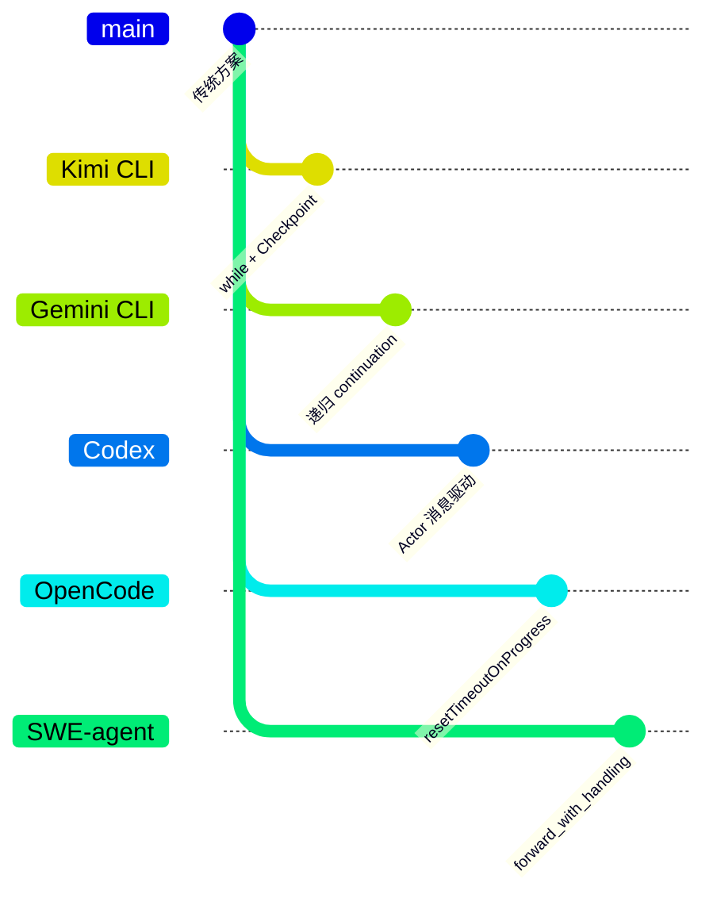

| 项目 | 核心差异 | 适用场景 |
|-----|---------|---------|
| **Kimi CLI** | while 循环 + Checkpoint 文件回滚 | 需要状态回退的复杂多轮任务 |
| **Gemini CLI** | 递归 continuation + 状态机 | 需要精细状态管理的场景 |
| **Codex** | Actor 模型 + CancellationToken | 需要强取消支持的企业环境 |
| **OpenCode** | resetTimeoutOnProgress + 流式 | 长运行任务，需要保持连接 |
| **SWE-agent** | forward_with_handling + autosubmit | 自动化代码修复，错误恢复 |

**详细对比分析**：

| 维度 | Kimi CLI | Gemini CLI | Codex | OpenCode | SWE-agent |
|-----|----------|-----------|-------|----------|-----------|
| **循环模式** | while 迭代 | 递归 continuation | Actor 消息 | 事件驱动 | 命令处理 |
| **状态持久化** | Checkpoint 文件 | 内存状态机 | 无 | 内存 | 无 |
| **取消机制** | asyncio.CancelledError | 状态转换 | CancellationToken | resetTimeoutOnProgress | 异常处理 |
| **工具执行** | 并发派发、顺序收集 | 顺序执行 | 异步执行 | 异步执行 | 顺序执行 |
| **错误恢复** | Checkpoint 回滚 | 状态重置 | 重试 | 重试 | forward_with_handling |
| **适用场景** | 对话回退 | 状态管理 | 企业安全 | 长任务 | 自动化修复 |

---

## 7. 边界情况与错误处理

### 7.1 终止条件

| 终止原因 | 触发条件 | 代码位置 |
|---------|---------|---------|
| MaxStepsReached | step_no > max_steps_per_turn | `kimi-cli/src/kimi_cli/soul/kimisoul.py:332` |
| ToolRejected | 用户拒绝审批 | `kimi-cli/src/kimi_cli/soul/kimisoul.py:369` |
| NoToolCalls | LLM 响应无 Tool Call | `kimi-cli/src/kimi_cli/soul/kimisoul.py:366` |
| 异常中断 | 未捕获的异常 | `kimi-cli/src/kimi_cli/soul/kimisoul.py:352` |

### 7.2 超时/资源限制

```python
# kimi-cli/src/kimi_cli/soul/kimisoul.py:388-394
@tenacity.retry(
    retry=retry_if_exception(self._is_retryable_error),
    before_sleep=partial(self._retry_log, "step"),
    wait=wait_exponential_jitter(initial=0.3, max=5, jitter=0.5),
    stop=stop_after_attempt(self._loop_control.max_retries_per_step),
    reraise=True,
)
```

**资源限制说明**：

| 限制项 | 默认值 | 配置位置 |
|-------|-------|---------|
| max_steps_per_turn | 100 | `kimi-cli/src/kimi_cli/config.py:68` |
| max_retries_per_step | 3 | `kimi-cli/src/kimi_cli/config.py:69` |
| reserved_context_size | 8192 | `kimi-cli/src/kimi_cli/config.py:70` |
| 重试退避 | 指数退避 0.3s-5s | `kimi-cli/src/kimi_cli/soul/kimisoul.py:391` |

### 7.3 错误恢复策略

| 错误类型 | 处理策略 | 代码位置 |
|---------|---------|---------|
| API 错误 | 指数退避重试 | `kimi-cli/src/kimi_cli/soul/kimisoul.py:388` |
| Token 超限 | Context compaction | `kimi-cli/src/kimi_cli/soul/kimisoul.py:341` |
| D-Mail 回滚 | BackToTheFuture 异常 | `kimi-cli/src/kimi_cli/soul/kimisoul.py:350` |
| 审批拒绝 | 终止当前 Turn | `kimi-cli/src/kimi_cli/soul/kimisoul.py:369` |

---

## 8. 关键代码索引

| 功能 | 文件 | 行号 | 说明 |
|-----|------|------|------|
| CLI 入口 | `kimi-cli/src/kimi_cli/cli/__init__.py` | 54 | Typer callback |
| CLI 执行 | `kimi-cli/src/kimi_cli/cli/__init__.py` | 457 | `_run()` 主函数 |
| App 创建 | `kimi-cli/src/kimi_cli/app.py` | 55 | `KimiCLI.create()` |
| Runtime 创建 | `kimi-cli/src/kimi_cli/soul/agent.py` | 79 | `Runtime.create()` |
| Agent 加载 | `kimi-cli/src/kimi_cli/soul/agent.py` | 189 | `load_agent()` |
| Soul 入口 | `kimi-cli/src/kimi_cli/soul/kimisoul.py` | 182 | `run()` |
| Turn 处理 | `kimi-cli/src/kimi_cli/soul/kimisoul.py` | 210 | `_turn()` |
| Agent Loop | `kimi-cli/src/kimi_cli/soul/kimisoul.py` | 302 | `_agent_loop()` |
| Step 执行 | `kimi-cli/src/kimi_cli/soul/kimisoul.py` | 382 | `_step()` |
| Context 恢复 | `kimi-cli/src/kimi_cli/soul/context.py` | 24 | `restore()` |
| Context Checkpoint | `kimi-cli/src/kimi_cli/soul/context.py` | 68 | `checkpoint()` |
| Context 回滚 | `kimi-cli/src/kimi_cli/soul/context.py` | 80 | `revert_to()` |
| Approval 状态 | `kimi-cli/src/kimi_cli/soul/approval.py` | 34 | `Approval` 类 |
| Wire 实现 | `kimi-cli/src/kimi_cli/wire/__init__.py` | 18 | `Wire` 类 |
| Session 管理 | `kimi-cli/src/kimi_cli/session.py` | 86 | `Session.create()` |
| 配置定义 | `kimi-cli/src/kimi_cli/config.py` | 68 | `LoopControlConfig` |

---

## 9. 延伸阅读

### 前置知识

- [01-kimi-cli-overview.md](./01-kimi-cli-overview.md) - 完整架构分层与模块边界
- [Agent Loop 通用概念](../comm/comm-agent-loop.md) - Agent Loop 的跨项目对比

### 相关机制

- [03-kimi-cli-session-runtime.md](./03-kimi-cli-session-runtime.md) - Session 生命周期与运行时
- [04-kimi-cli-agent-loop.md](./04-kimi-cli-agent-loop.md) - Agent Loop 详细分析
- [05-kimi-cli-tool-system.md](./05-kimi-cli-tool-system.md) - 工具系统实现
- [06-kimi-cli-mcp-integration.md](./06-kimi-cli-mcp-integration.md) - MCP 集成
- [07-kimi-cli-context-compaction.md](./07-kimi-cli-context-compaction.md) - 上下文压缩策略

### 深度分析

- [questions/kimi-cli-checkpoint-implementation.md](./questions/kimi-cli-checkpoint-implementation.md) - Checkpoint 实现细节
- [questions/kimi-cli-approval-flow.md](./questions/kimi-cli-approval-flow.md) - 审批流程详解

### 其他项目对比

- [../codex/04-codex-agent-loop.md](../codex/04-codex-agent-loop.md) - Codex Agent Loop
- [../gemini-cli/04-gemini-cli-agent-loop.md](../gemini-cli/04-gemini-cli-agent-loop.md) - Gemini CLI Agent Loop
- [../opencode/04-opencode-agent-loop.md](../opencode/04-opencode-agent-loop.md) - OpenCode Agent Loop
- [../swe-agent/04-swe-agent-agent-loop.md](../swe-agent/04-swe-agent-agent-loop.md) - SWE-agent Agent Loop

---

## 10. 推荐阅读顺序（新手路径）

1. `00-kimi-cli-onboarding.md`（本文）：先建立全局心智模型
2. `01-kimi-cli-overview.md`：看完整架构分层与模块边界
3. `03-kimi-cli-session-runtime.md` + `04-kimi-cli-agent-loop.md`：理解一次 turn 如何被执行与持久化
4. `05/06/07`：工具系统、MCP、上下文策略
5. `08/09`：UI 协议层与 Web 多进程执行层
6. `10/11/12`：安全、prompt、日志（偏工程治理）

---

## 11. 快速心智模型（给新手的一句话）

Kimi CLI 本质是：

**"一个带状态（Session/Context）的 LLM 循环器 + 一个工具执行与审批系统 + 一个可替换的 UI/Wire 外壳。"**

你只要先掌握这三块，后续无论扩展工具、改策略还是接 Web/IDE，都会有稳定抓手。

---

*✅ Verified: 基于 kimi-cli/src/kimi_cli/soul/kimisoul.py:182 等源码分析*

*基于版本：kimi-cli (commit: 2026-02-08) | 最后更新：2026-02-24*
