# kimi-cli 概述

## TL;DR（结论先行）

一句话定义：kimi-cli 是 Moonshot AI 推出的 Python CLI Agent，采用分层架构设计，支持多模态交互、MCP 扩展和状态回滚。

Kimi CLI 的核心取舍：**命令式 while 循环 + Checkpoint 文件回滚 + D-Mail 跨代理通信**
（对比 Gemini CLI 的递归 continuation、Codex 的 Actor 消息驱动、OpenCode 的 Promise 链）

---

## 1. 为什么需要这个架构？（解决什么问题）

### 1.1 问题场景

没有分层架构的 CLI Agent：
- 用户输入直接调用 LLM，代码耦合严重
- 工具调用与业务逻辑混杂，难以扩展
- 状态管理混乱，无法恢复对话
- 多模态支持需要大量条件判断

有分层架构：
- CLI 层专注参数解析和模式分发
- Soul 层专注 Agent 循环和状态管理
- Tools 层专注工具执行和 MCP 集成
- Context 层专注会话持久化

### 1.2 核心挑战

| 挑战 | 不解决的后果 |
|-----|-------------|
| 多运行模式支持 | 交互式、非交互式、服务器模式代码混杂，难以维护 |
| 状态持久化 | 进程崩溃后对话历史丢失，用户体验差 |
| 工具扩展性 | 新增工具需要修改核心代码，违反开闭原则 |
| Token 超限 | 长对话导致上下文溢出，无法继续 |
| 多代理协作 | 子代理无法与主代理通信，任务分解困难 |

---

## 2. 整体架构（ASCII 图）

### 2.1 在系统中的位置

```text
┌─────────────────────────────────────────────────────────────┐
│ 用户输入层                                                   │
│ CLI: src/kimi_cli/cli/__init__.py:54 (kimi 函数)            │
│ Shell: src/kimi_cli/ui/shell/__init__.py:51 (Shell.run)     │
└───────────────────────┬─────────────────────────────────────┘
                        │ 用户输入 / 命令
                        ▼
┌─────────────────────────────────────────────────────────────┐
│ ▓▓▓ Agent 核心 (KimiSoul) ▓▓▓                               │
│ src/kimi_cli/soul/kimisoul.py:89 (KimiSoul 类)              │
│ - run(): 182       - 单次 Turn 入口                         │
│ - _turn(): 210     - Checkpoint + 用户消息处理              │
│ - _agent_loop(): 302 - 核心循环（step 计数、compaction）    │
│ - _step(): 382     - 单次 LLM 调用 + 工具执行               │
└───────────────────────┬─────────────────────────────────────┘
                        │ 依赖/调用
        ┌───────────────┼───────────────┐
        ▼               ▼               ▼
┌──────────────┐ ┌──────────────┐ ┌──────────────┐
│ LLM 层       │ │ Tools 层     │ │ Context 层   │
│ src/kimi_cli │ │ src/kimi_cli │ │ src/kimi_cli │
│ /llm.py:106  │ │ /soul/toolset│ │ /soul/context│
│ (create_llm) │ │ .py:71       │ │ .py:16       │
│              │ │ (KimiToolset)│ │ (Context)    │
└──────────────┘ └──────────────┘ └──────────────┘
        │               │               │
        ▼               ▼               ▼
┌──────────────┐ ┌──────────────┐ ┌──────────────┐
│ kosong SDK   │ │ MCP 服务器   │ │ 文件系统     │
│ ChatProvider │ │ fastmcp      │ │ checkpoint   │
│              │ │ Client       │ │ 持久化       │
└──────────────┘ └──────────────┘ └──────────────┘
```

### 2.2 核心组件职责

| 组件 | 职责 | 代码位置 |
|-----|------|---------|
| `KimiSoul` | Agent 核心，管理主循环和状态流转 | `src/kimi_cli/soul/kimisoul.py:89` |
| `KimiToolset` | 工具注册、执行、MCP 集成 | `src/kimi_cli/soul/toolset.py:71` |
| `Context` | 会话上下文、Checkpoint、历史管理 | `src/kimi_cli/soul/context.py:16` |
| `Agent` | 代理定义、运行时管理 | `src/kimi_cli/soul/agent.py:158` |
| `Runtime` | 运行时上下文、配置、OAuth | `src/kimi_cli/soul/agent.py:64` |
| `LLM` | 模型封装、能力检测 | `src/kimi_cli/llm.py:36` |
| `Shell` | 交互式界面、REPL 循环 | `src/kimi_cli/ui/shell/__init__.py:35` |

### 2.3 核心组件交互关系

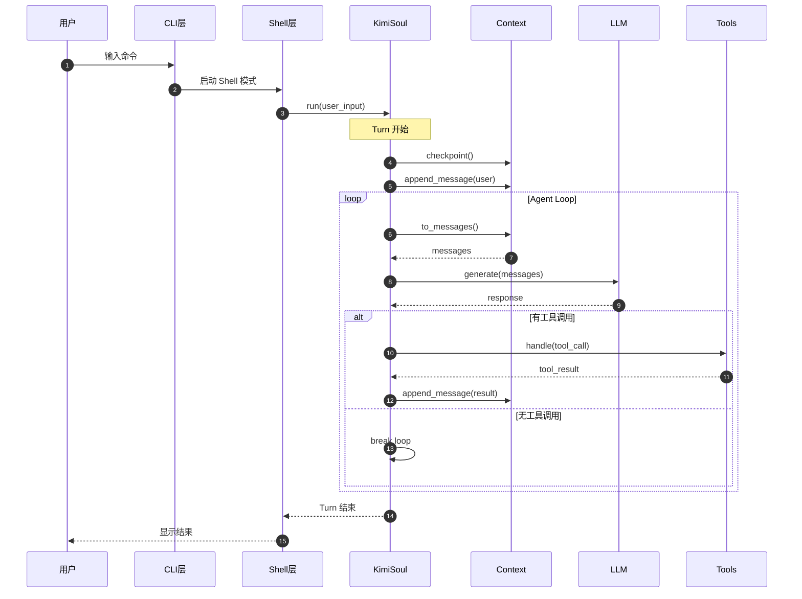

**关键交互说明**：

| 步骤 | 交互内容 | 设计意图 |
|-----|---------|---------|
| 1 | 用户输入命令 | 支持多种输入方式（交互式、管道、参数） |
| 2-3 | CLI 分发到 Shell | 模式分离，Shell 专注交互体验 |
| 4 | Checkpoint 保存 | 每轮开始前保存状态，支持回滚 |
| 5-6 | 消息追加到 Context | 统一消息管理，支持持久化 |
| 7-8 | 获取消息历史 | 构建 LLM 输入上下文 |
| 9-10 | LLM 生成响应 | 流式处理，支持思考模式 |
| 11-13 | 工具调用链 | 异步执行，结果注入上下文 |
| 14 | 循环终止 | 无工具调用时结束本轮 |

---

## 3. 核心组件详细分析

### 3.1 KimiSoul 内部结构

#### 职责定位

KimiSoul 是 Agent 的核心控制器，负责管理对话生命周期、执行 Agent 循环、协调工具和状态管理。

#### 状态机图

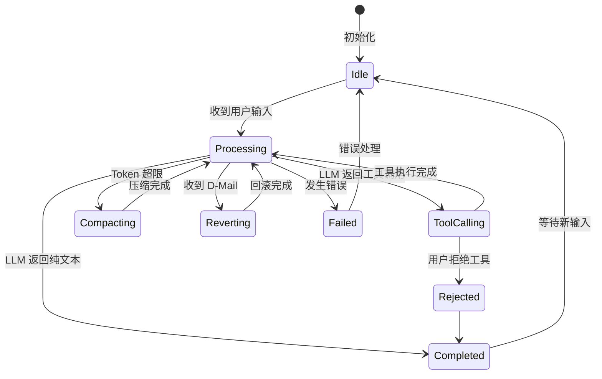

**状态说明**：

| 状态 | 说明 | 进入条件 | 退出条件 |
|-----|------|---------|---------|
| Idle | 空闲等待 | Shell 启动完成 | 收到用户输入 |
| Processing | 处理中 | 开始 _agent_loop | LLM 响应完成 |
| ToolCalling | 执行工具 | 检测到 tool_calls | 所有工具执行完成 |
| Compacting | 压缩上下文 | token_count > threshold | 压缩完成 |
| Reverting | 回滚状态 | 收到 BackToTheFuture | 回滚到指定 checkpoint |
| Completed | 本轮完成 | 无工具调用或拒绝 | 返回 Idle |
| Failed | 错误状态 | 异常发生 | 错误处理完成 |

#### 内部数据流

```text
┌─────────────────────────────────────────────────────────────┐
│  输入层                                                      │
│  ├── 用户输入 ──► 解析 Slash 命令 ──► 结构化请求             │
│  └── 消息内容 ──► 验证多模态能力 ──► Message 对象            │
└──────────────────────────┬──────────────────────────────────┘
                           ▼
┌─────────────────────────────────────────────────────────────┐
│  处理层                                                      │
│  ├── 主循环: _agent_loop()                                   │
│  │   ├── Step 计数检查 ──► 超限则抛出 MaxStepsReached        │
│  │   ├── Token 检查 ──► 超限则触发 compaction                │
│  │   ├── Checkpoint 创建 ──► 持久化状态                     │
│  │   └── _step() 执行 ──► LLM 调用 + 工具处理               │
│  ├── 异常处理: BackToTheFuture                               │
│  │   └── D-Mail 触发 ──► revert_to() ──► 状态回滚           │
│  └── 重试机制: tenacity 指数退避                             │
└──────────────────────────┬──────────────────────────────────┘
                           ▼
┌─────────────────────────────────────────────────────────────┐
│  输出层                                                      │
│  ├── Wire 事件发送 (TurnBegin/StepBegin/TurnEnd)            │
│  ├── 状态更新 (StatusUpdate: token_usage, context_usage)    │
│  └── 工具结果注入 Context                                    │
└─────────────────────────────────────────────────────────────┘
```

#### 关键算法逻辑

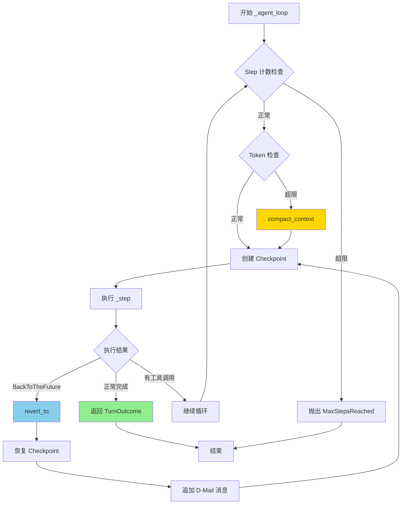

**算法要点**：

1. **双层循环设计**：外层 `_turn` 管对话周期，内层 `_agent_loop` 管单次任务多步执行
2. **显式 Step 计数**：防止无限循环，可配置上限（默认 100）
3. **Compaction 前置**：在调用 LLM 前压缩上下文，避免 token 超限
4. **D-Mail 回滚机制**：通过异常机制实现状态回滚，支持跨代理通信

#### 关键接口

| 接口 | 输入 | 输出 | 说明 | 代码位置 |
|-----|------|------|------|---------|
| `run()` | user_input: str \| list[ContentPart] | None | Turn 入口 | `kimisoul.py:182` |
| `_turn()` | user_message: Message | TurnOutcome | 单回合处理 | `kimisoul.py:210` |
| `_agent_loop()` | - | TurnOutcome | 核心循环 | `kimisoul.py:302` |
| `_step()` | - | StepOutcome \| None | 单步执行 | `kimisoul.py:382` |
| `compact_context()` | - | None | 上下文压缩 | `kimisoul.py:480` |

---

### 3.2 Context 内部结构

#### 职责定位

Context 负责会话状态的持久化管理，包括消息历史、Token 计数和 Checkpoint 机制。

#### 状态机图

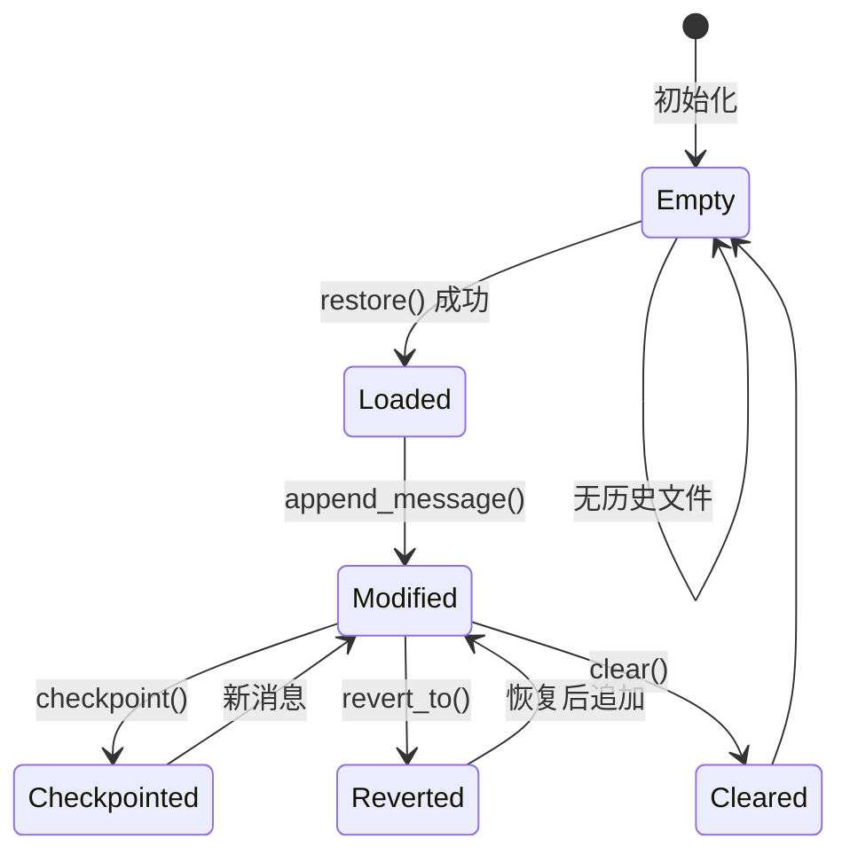

#### 关键数据结构

```python
# src/kimi_cli/soul/context.py:16-22
class Context:
    def __init__(self, file_backend: Path):
        self._file_backend = file_backend  # 持久化文件路径
        self._history: list[Message] = []   # 消息历史
        self._token_count: int = 0          # 当前 Token 数
        self._next_checkpoint_id: int = 0   # 下一个 Checkpoint ID
```

**字段说明**：

| 字段 | 类型 | 用途 |
|-----|------|------|
| `_file_backend` | `Path` | 持久化文件路径，JSONL 格式 |
| `_history` | `list[Message]` | 内存中的消息历史 |
| `_token_count` | `int` | 当前上下文 Token 数 |
| `_next_checkpoint_id` | `int` | 单调递增的 Checkpoint ID |

#### Checkpoint 机制

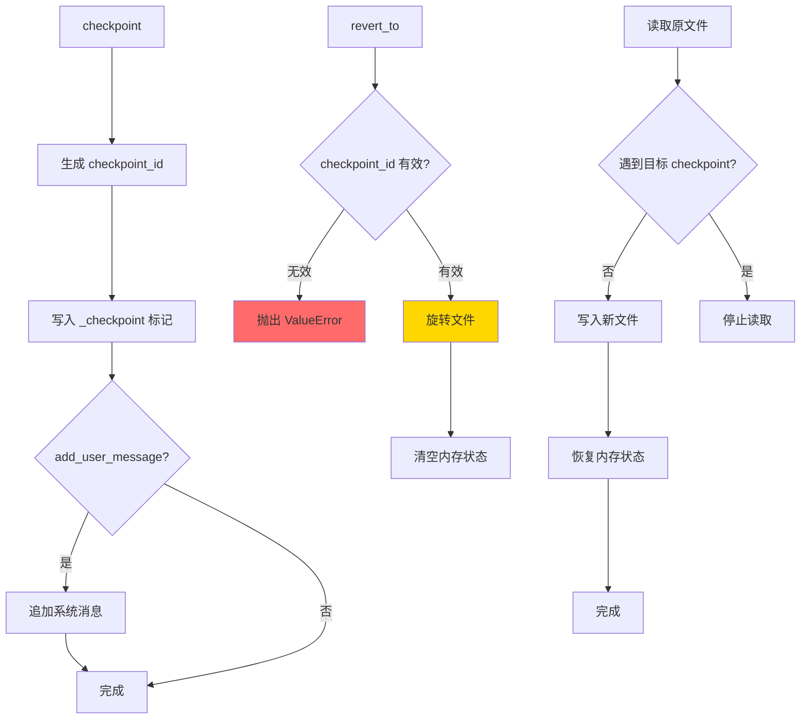

---

### 3.3 组件间协作时序

展示 KimiSoul、Context、LLM、Tools 如何协作完成一次完整对话。

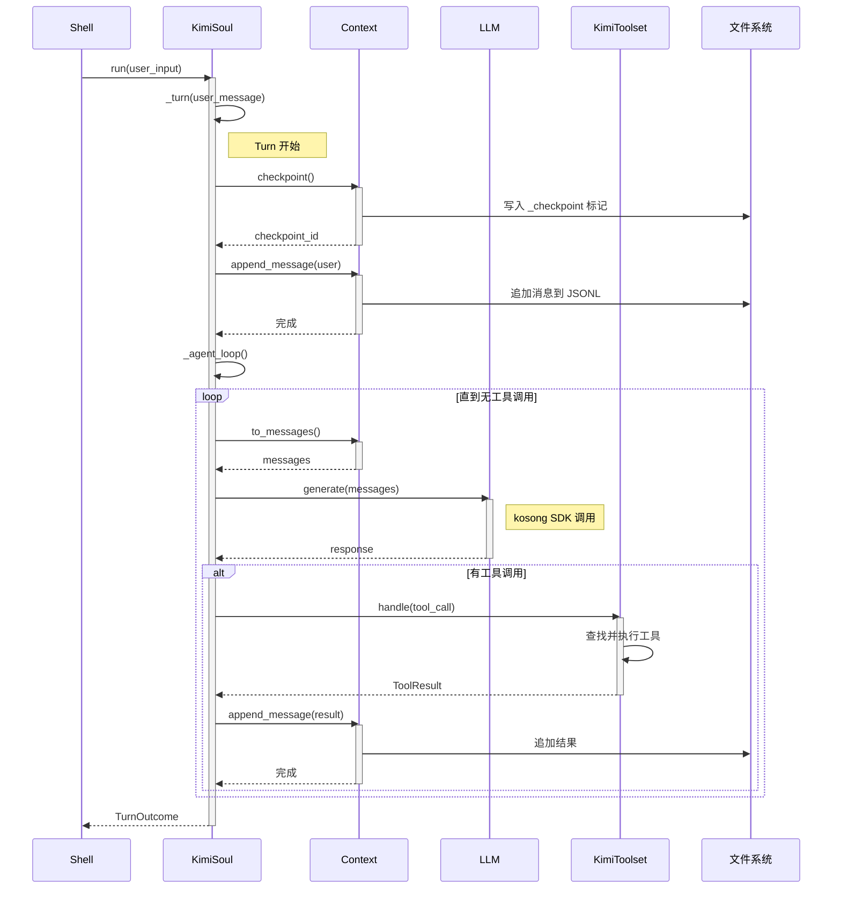

**协作要点**：

1. **Shell 与 Soul**：Shell 负责交互体验，Soul 负责业务逻辑，通过 Wire 协议通信
2. **Soul 与 Context**：所有状态变更都通过 Context，确保持久化一致性
3. **Tools 异步执行**：工具调用返回 asyncio.Task，支持并发执行
4. **文件旋转**：revert_to 时使用文件旋转保证数据安全

---

### 3.4 关键数据路径

#### 主路径（正常流程）

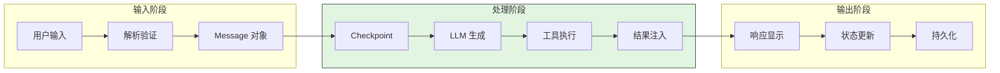

#### 异常路径（D-Mail 回滚）

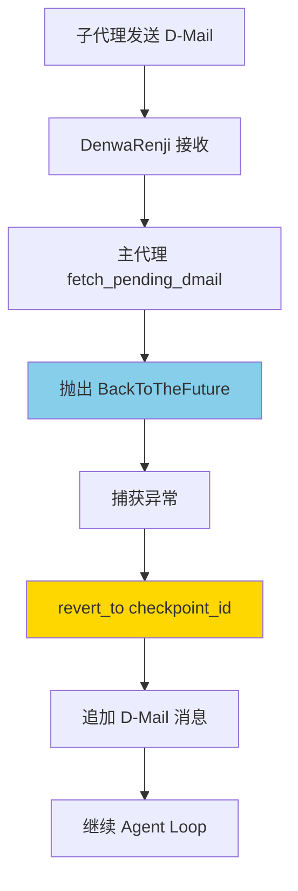

---

## 4. 端到端数据流转

### 4.1 正常流程（详细版）

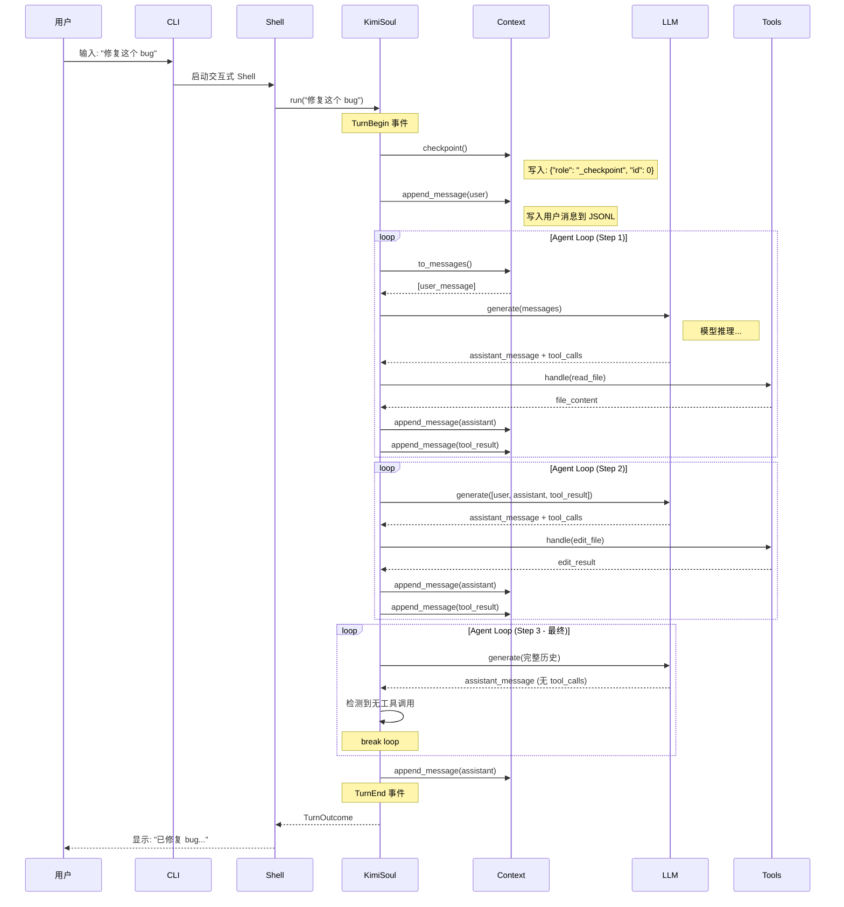

**数据变换详情**：

| 阶段 | 输入 | 处理 | 输出 | 代码位置 |
|-----|------|------|------|---------|
| 接收 | 用户输入字符串 | 解析 Slash 命令、验证 | Message 对象 | `kimisoul.py:186-206` |
| Checkpoint | - | 生成 ID、写入标记 | checkpoint_id | `context.py:68-78` |
| LLM 调用 | messages 列表 | kosong.step 封装 | StepResult | `kimisoul.py:395-406` |
| 工具执行 | ToolCall | 查找、执行、包装 | ToolResult | `toolset.py:97-124` |
| 上下文更新 | StepResult | 解析、追加消息 | 更新后的 history | `kimisoul.py:457-477` |

### 4.2 数据流向图

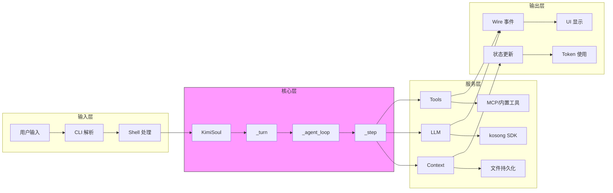

### 4.3 异常/边界流程

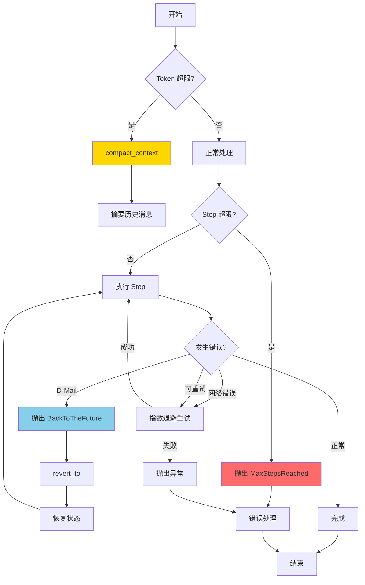

---

## 5. 关键代码实现

### 5.1 核心数据结构

```python
# src/kimi_cli/soul/kimisoul.py:73-87
@dataclass(frozen=True, slots=True)
class StepOutcome:
    stop_reason: StepStopReason
    assistant_message: Message

@dataclass(frozen=True, slots=True)
class TurnOutcome:
    stop_reason: TurnStopReason
    final_message: Message | None
    step_count: int
```

**字段说明**：

| 字段 | 类型 | 用途 |
|-----|------|------|
| `stop_reason` | `Literal["no_tool_calls", "tool_rejected"]` | 停止原因 |
| `assistant_message` | `Message` | 助手响应消息 |
| `final_message` | `Message \| None` | 最终输出消息 |
| `step_count` | `int` | 本回合执行步数 |

### 5.2 主链路代码

```python
# src/kimi_cli/soul/kimisoul.py:302-381
async def _agent_loop(self) -> TurnOutcome:
    """The main agent loop for one run."""
    assert self._runtime.llm is not None
    if isinstance(self._agent.toolset, KimiToolset):
        await self._agent.toolset.wait_for_mcp_tools()

    step_no = 0
    while True:
        step_no += 1
        if step_no > self._loop_control.max_steps_per_turn:
            raise MaxStepsReached(self._loop_control.max_steps_per_turn)

        wire_send(StepBegin(n=step_no))
        # ... approval task setup ...

        try:
            # compact the context if needed
            reserved = self._loop_control.reserved_context_size
            if self._context.token_count + reserved >= self._runtime.llm.max_context_size:
                logger.info("Context too long, compacting...")
                await self.compact_context()

            await self._checkpoint()
            step_outcome = await self._step()
        except BackToTheFuture as e:
            await self._context.revert_to(e.checkpoint_id)
            await self._checkpoint()
            await self._context.append_message(e.messages)
            continue

        if step_outcome is not None:
            return TurnOutcome(...)
```

**代码要点**：

1. **显式 Step 计数**：`step_no` 从 0 开始递增，超过 `max_steps_per_turn` 抛出异常
2. **Token 预检查**：在调用 LLM 前检查上下文长度，提前触发 compaction
3. **Checkpoint 每步保存**：确保每步都可回滚，支持 D-Mail 机制
4. **异常驱动回滚**：`BackToTheFuture` 异常用于处理 D-Mail 状态回滚

### 5.3 关键调用链

```text
Shell.run()               [src/kimi_cli/ui/shell/__init__.py:51]
  -> run_soul_command()   [src/kimi_cli/ui/shell/__init__.py:214]
    -> run_soul()         [src/kimi_cli/soul/__init__.py:121]
      -> KimiSoul.run()   [src/kimi_cli/soul/kimisoul.py:182]
        -> _turn()        [src/kimi_cli/soul/kimisoul.py:210]
          -> _checkpoint() [src/kimi_cli/soul/kimisoul.py:175]
          -> _agent_loop() [src/kimi_cli/soul/kimisoul.py:302]
            - Step 计数检查
            - Token 检查与 compaction
            - _step() 执行
            - BackToTheFuture 处理
```

---

## 6. 设计意图与 Trade-off

### 6.1 Kimi CLI 的选择

| 维度 | Kimi CLI 的选择 | 替代方案 | 取舍分析 |
|-----|----------------|---------|---------|
| 循环结构 | while 迭代 + 异常驱动 | 递归 continuation (Gemini) | 简单直观易于调试，但状态回滚需手动处理 |
| 状态回滚 | Checkpoint 文件 + D-Mail | 内存快照 (Codex) / 无回滚 | 支持跨会话恢复，但文件副作用不自动回滚 |
| 并发执行 | 并发派发、顺序收集 | 完全并行 | 工具触发可并发，但结果按序注入保持确定性 |
| 持久化格式 | JSONL 行式存储 | SQLite / 二进制 | 人类可读、易于调试，但查询效率低 |
| 多代理通信 | D-Mail (类 Actor 消息) | 共享内存 / RPC | 松耦合、支持跨进程，但延迟较高 |
| MCP 集成 | fastmcp 客户端 | 自研协议 | 标准兼容、生态丰富，但依赖外部库 |

### 6.2 为什么这样设计？

**核心问题**：如何在 Python 中实现可回滚、可扩展、支持多代理的 Agent 架构？

**Kimi CLI 的解决方案**：

- **代码依据**：`src/kimi_cli/soul/kimisoul.py:302-381`
- **设计意图**：
  - 使用 `while True` 循环保持代码可读性
  - 通过 `BackToTheFuture` 异常实现非局部跳转，简化回滚逻辑
  - Checkpoint 文件使用 JSONL 格式，支持追加写入和增量恢复
- **带来的好处**：
  - 代码路径清晰，易于理解和调试
  - 状态持久化与业务逻辑解耦
  - D-Mail 机制天然支持子代理与主代理通信
- **付出的代价**：
  - 异常驱动控制流可能隐藏逻辑分支
  - 文件 I/O 成为性能瓶颈（高频 Checkpoint）
  - 回滚仅恢复对话状态，不恢复文件系统状态

### 6.3 与其他项目的对比

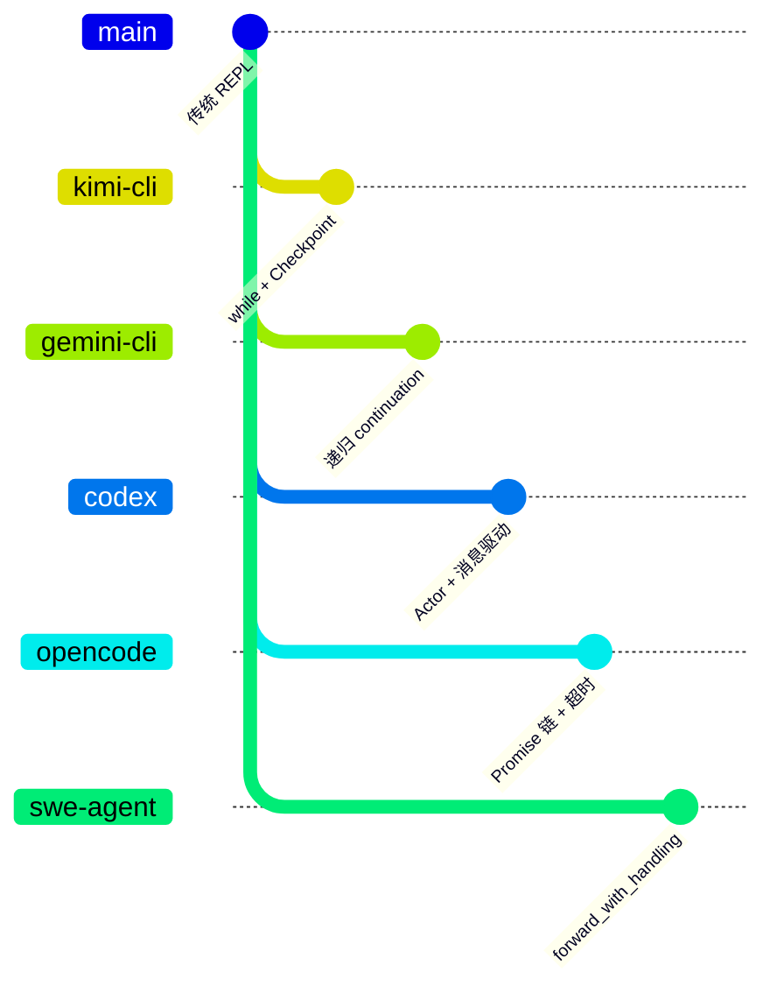

| 项目 | 核心差异 | 适用场景 |
|-----|---------|---------|
| **kimi-cli** | while 循环 + Checkpoint 文件 + D-Mail | 需要状态回滚、多代理协作的场景 |
| **Gemini CLI** | 递归 continuation + 分层内存 | 复杂对话流程、需要精细控制状态 |
| **Codex** | Actor 模型 + 消息驱动 + 原生沙箱 | 企业安全、高并发场景 |
| **OpenCode** | Promise 链 + resetTimeoutOnProgress | 长运行任务、需要进度反馈 |
| **SWE-agent** | forward_with_handling() + autosubmit | 自动化任务、错误恢复 |

**详细对比**：

| 特性 | kimi-cli | Gemini CLI | Codex | OpenCode | SWE-agent |
|-----|----------|-----------|-------|----------|-----------|
| 循环机制 | while 迭代 | 递归 continuation | Actor 消息循环 | Promise 链 | 函数调用链 |
| 状态持久化 | JSONL 文件 | 内存 + 可选持久化 | 内存快照 | 内存 | 内存 |
| 状态回滚 | Checkpoint + D-Mail | 无 | 无 | 无 | 无 |
| 多代理支持 | D-Mail 通信 | 内置 subagent | 无 | 无 | 无 |
| MCP 支持 | fastmcp | 内置 MCP | 内置 MCP | 内置 MCP | 无 |
| 沙箱机制 | 无（依赖系统权限） | 无 | 原生 sandbox | 无 | 可选 Docker |
| 超时控制 | 每步超时 | 无 | 有 | resetTimeoutOnProgress | 有 |

---

## 7. 边界情况与错误处理

### 7.1 终止条件

| 终止原因 | 触发条件 | 代码位置 |
|---------|---------|---------|
| 无工具调用 | LLM 返回纯文本，无 tool_calls | `kimisoul.py:453-455` |
| 工具被拒绝 | 用户拒绝工具执行（非 yolo 模式） | `kimisoul.py:422-425` |
| 达到最大步数 | step_no > max_steps_per_turn | `kimisoul.py:332-333` |
| 网络错误 | APIConnectionError, APITimeoutError | `kimisoul.py:508-517` |
| 用户取消 | SIGINT 触发 cancel_event | `shell/__init__.py:223-227` |

### 7.2 超时/资源限制

```python
# src/kimi_cli/soul/kimisoul.py:388-394
@tenacity.retry(
    retry=retry_if_exception(self._is_retryable_error),
    before_sleep=partial(self._retry_log, "step"),
    wait=wait_exponential_jitter(initial=0.3, max=5, jitter=0.5),
    stop=stop_after_attempt(self._loop_control.max_retries_per_step),
    reraise=True,
)
```

**资源限制配置**：

| 配置项 | 默认值 | 说明 | 代码位置 |
|-------|-------|------|---------|
| max_steps_per_turn | 100 | 每回合最大步数 | `config.py:71` |
| max_retries_per_step | 3 | 每步最大重试次数 | `config.py:77` |
| reserved_context_size | 4096 | 预留上下文空间 | `config.py:81` |
| mcp.client.tool_call_timeout_ms | 60000 | MCP 工具调用超时 | `config.py:132` |

### 7.3 错误恢复策略

| 错误类型 | 处理策略 | 代码位置 |
|---------|---------|---------|
| 可重试网络错误 | 指数退避重试 (tenacity) | `kimisoul.py:388-394` |
| 429/500/502/503 | 指数退避重试 | `kimisoul.py:512-517` |
| 401 未授权 | 提示用户重新登录 | `shell/__init__.py:254-255` |
| 402 会员过期 | 提示续费 | `shell/__init__.py:256-257` |
| 403 配额超限 | 提示升级或重试 | `shell/__init__.py:258-259` |
| ToolRejectedError | 结束当前回合 | `kimisoul.py:422-425` |
| BackToTheFuture | 回滚到指定 Checkpoint | `kimisoul.py:377-380` |

---

## 8. 关键代码索引

### 8.1 核心文件

| 功能 | 文件 | 行号 | 说明 |
|-----|------|------|------|
| CLI 入口 | `src/kimi_cli/cli/__init__.py` | 54 | kimi() 主函数，参数解析 |
| Shell 主循环 | `src/kimi_cli/ui/shell/__init__.py` | 51 | Shell.run() 交互式 REPL |
| KimiSoul | `src/kimi_cli/soul/kimisoul.py` | 89 | Agent 核心类 |
| run() | `src/kimi_cli/soul/kimisoul.py` | 182 | Turn 入口 |
| _turn() | `src/kimi_cli/soul/kimisoul.py` | 210 | 单回合处理 |
| _agent_loop() | `src/kimi_cli/soul/kimisoul.py` | 302 | 核心 Agent 循环 |
| _step() | `src/kimi_cli/soul/kimisoul.py` | 382 | 单步执行 |
| compact_context() | `src/kimi_cli/soul/kimisoul.py` | 480 | 上下文压缩 |
| KimiToolset | `src/kimi_cli/soul/toolset.py` | 71 | 工具注册表 |
| handle() | `src/kimi_cli/soul/toolset.py` | 97 | 工具调用处理 |
| Context | `src/kimi_cli/soul/context.py` | 16 | 会话上下文 |
| checkpoint() | `src/kimi_cli/soul/context.py` | 68 | 创建 Checkpoint |
| revert_to() | `src/kimi_cli/soul/context.py` | 80 | 回滚到 Checkpoint |
| Agent | `src/kimi_cli/soul/agent.py` | 158 | 代理定义 |
| Runtime | `src/kimi_cli/soul/agent.py` | 64 | 运行时上下文 |
| LLM | `src/kimi_cli/llm.py` | 36 | 模型封装 |
| create_llm() | `src/kimi_cli/llm.py` | 106 | LLM 工厂函数 |

### 8.2 工具实现

| 工具 | 文件路径 | 说明 |
|------|----------|------|
| Shell | `src/kimi_cli/tools/shell/__init__.py` | Shell 命令执行 |
| File Read | `src/kimi_cli/tools/file/read.py` | 文件读取 |
| File Write | `src/kimi_cli/tools/file/write.py` | 文件写入 |
| File Replace | `src/kimi_cli/tools/file/replace.py` | 文本替换 |
| Web Search | `src/kimi_cli/tools/web/search.py` | 网络搜索 |
| Web Fetch | `src/kimi_cli/tools/web/fetch.py` | 网页抓取 |
| D-Mail | `src/kimi_cli/tools/dmail/__init__.py` | 跨代理通信 |
| Think | `src/kimi_cli/tools/think/__init__.py` | 思考工具 |
| Todo | `src/kimi_cli/tools/todo/__init__.py` | 任务列表 |
| Multiagent | `src/kimi_cli/tools/multiagent/` | 子代理任务与创建 |

### 8.3 配置类

| 配置 | 文件路径 | 说明 |
|------|----------|------|
| Config | `src/kimi_cli/config.py` | 全局配置 |
| LLMModel | `src/kimi_cli/config.py` | 模型配置 |
| LLMProvider | `src/kimi_cli/config.py` | 提供商配置 |
| LoopControl | `src/kimi_cli/config.py` | 循环控制配置 |

### 8.4 Wire 协议

| 组件 | 文件路径 | 说明 |
|------|----------|------|
| Wire types | `src/kimi_cli/wire/types.py` | 类型定义 |
| Wire file | `src/kimi_cli/wire/file.py` | Wire 日志落盘 |

---

## 9. 延伸阅读

- **前置知识**：
  - [Agent Loop 机制](04-kimi-cli-agent-loop.md)
  - [MCP 集成](06-kimi-cli-mcp-integration.md)
  - [Checkpoint 深度分析](questions/kimi-cli-checkpoint-implementation.md)

- **相关机制**：
  - [Context Compaction](questions/kimi-cli-context-compaction.md)
  - [D-Mail 通信机制](questions/kimi-cli-dmail.md)
  - [工具系统设计](questions/kimi-cli-tool-system.md)

- **跨项目对比**：
  - [Codex 概述](../codex/01-codex-overview.md)
  - [Gemini CLI 概述](../gemini-cli/01-gemini-cli-overview.md)
  - [OpenCode 概述](../opencode/01-opencode-overview.md)
  - [SWE-agent 概述](../swe-agent/01-swe-agent-overview.md)

---

*✅ Verified: 基于 kimi-cli/src/kimi_cli/soul/kimisoul.py、context.py、toolset.py、agent.py、llm.py 等源码分析*

*基于版本：kimi-cli main 分支 (2026-02-08) | 最后更新：2026-02-24*
