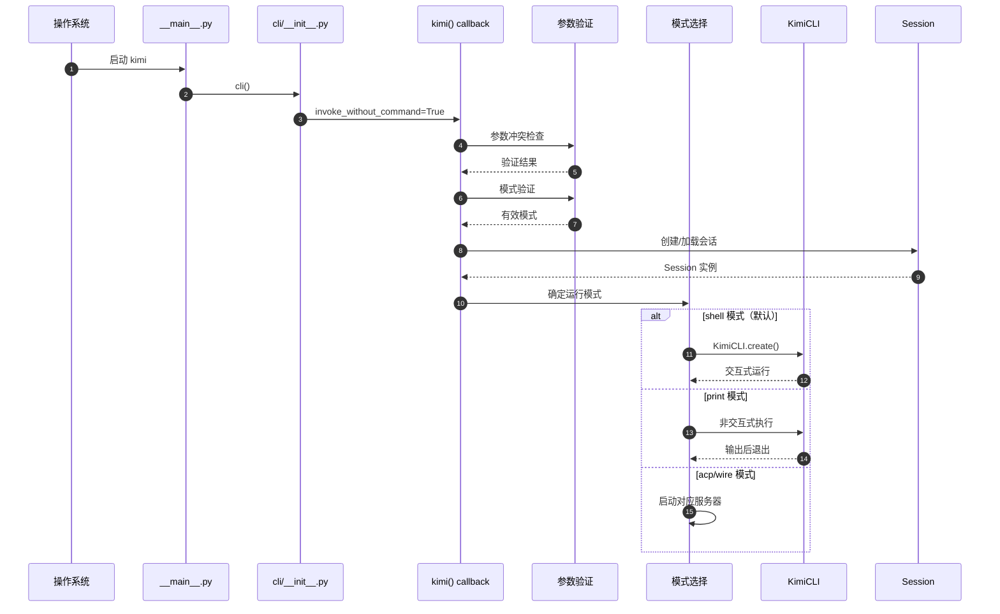
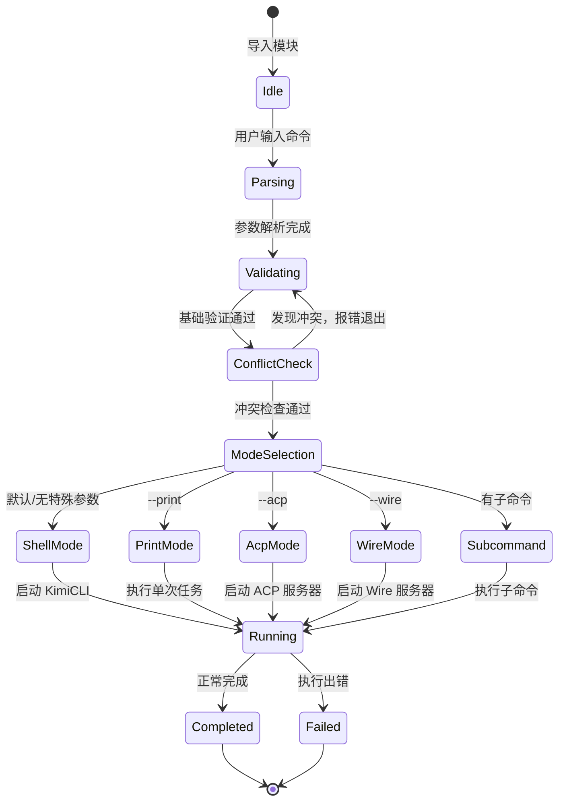
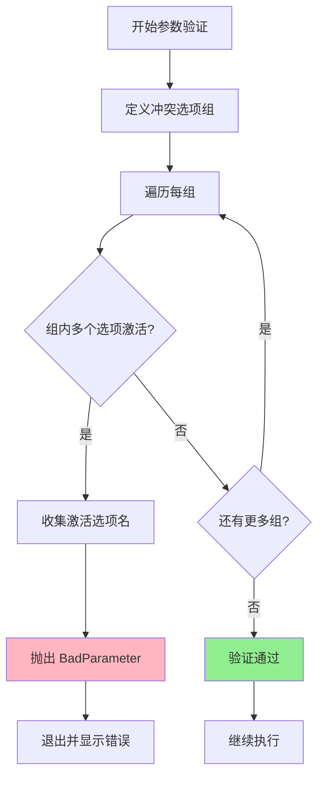
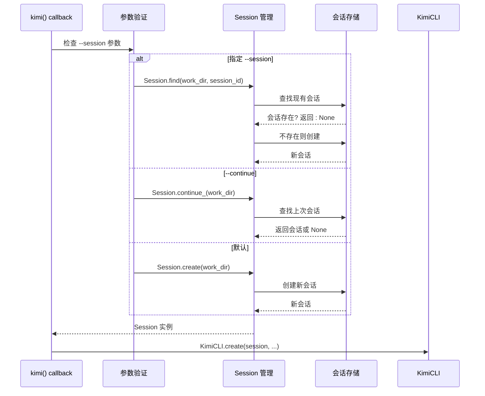
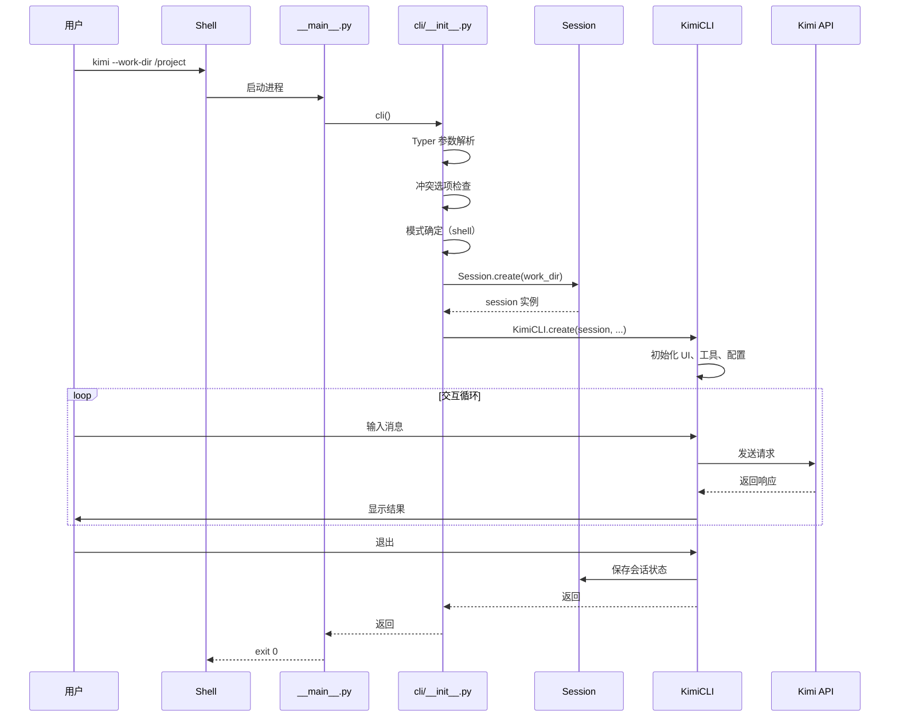
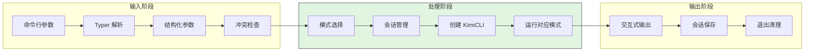
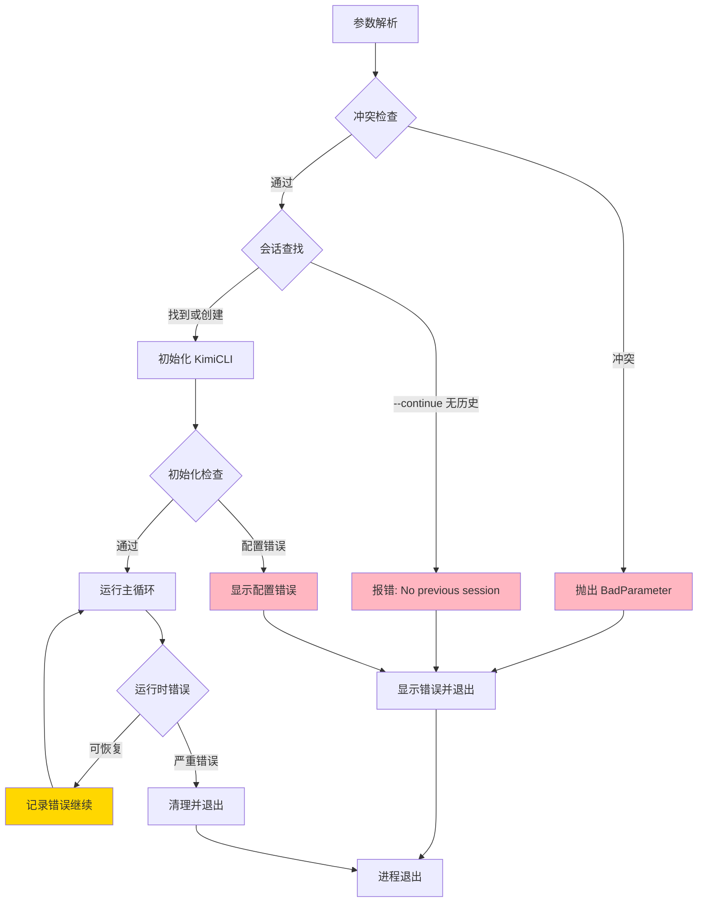
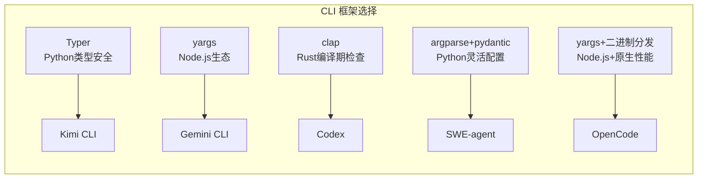

# CLI Entry（kimi-cli）

> **阅读指南**
>
> | 属性 | 说明 |
> |-----|------|
> | 预计阅读 | 15-20 分钟 |
> | 前置文档 | `01-kimi-cli-overview.md` |
> | 文档结构 | 速览 → 架构 → 组件 → 数据流 → 实现 → 对比 |
> | 代码呈现 | 关键代码直接展示，完整代码可折叠查看 |

---

## TL;DR（结论先行）

一句话定义：Kimi CLI Entry 是 `kimi` 命令的总入口与分发层，采用「**Typer 框架 + 多模式架构**」设计，支持 shell/print/acp/wire 四种运行模式，集成会话管理和 MCP 服务器配置。

核心取舍：**Typer 类型安全参数解析 + 显式模式区分 + 运行时冲突检查**（对比 Gemini CLI 的 yargs 自动检测、Codex 的 clap 编译期检查）

### 核心要点速览

| 维度 | 关键决策 | 代码位置 |
|-----|---------|---------|
| CLI 框架 | Typer 实现类型安全参数解析 | `kimi-cli/src/kimi_cli/cli/__init__.py:34` |
| 模式区分 | 显式 --print/--acp/--wire 标志 | `kimi-cli/src/kimi_cli/cli/__init__.py:357` |
| 参数验证 | 运行时显式冲突检查 | `kimi-cli/src/kimi_cli/cli/__init__.py:357` |
| 会话管理 | Session 创建/查找/继续 | `kimi-cli/src/kimi_cli/cli/__init__.py:457` |
| 子命令组织 | Typer add_typer() 模块化 | `kimi-cli/src/kimi_cli/cli/__init__.py:623` |

---

## 1. 为什么需要这个机制？

### 1.1 问题场景

```text
场景：同一个 kimi 命令既要支持日常交互式开发，也要支持 CI/CD 自动化调用，还要作为服务器运行

如果没有显式分发：
  kimi 在 CI 中可能意外进入交互式 shell -> 卡住等待用户输入
  多个模式参数同时传递 -> 行为不确定

Kimi CLI 的做法：
  顶层 callback 只做参数解析与模式分发
  - 无特殊参数 -> 进入交互式 shell 模式（默认）
  - --print 模式 -> 非交互式执行后退出
  - --acp 模式 -> 启动 ACP 协议服务器
  - --wire 模式 -> 启动 Wire 协议服务器（实验性）
  - 子命令（mcp/web/info/...）-> 对应命令处理
```

### 1.2 核心挑战

| 挑战 | 不解决的后果 |
|-----|-------------|
| 模式区分 | 交互模式与自动化模式互相干扰，CI 环境挂起 |
| 参数冲突 | 多个互斥选项同时传递导致行为不确定 |
| 配置合并 | 不同来源配置冲突导致行为不一致 |
| 会话管理 | 用户无法恢复之前的对话上下文 |
| 前置检查 | 每个子命令重复实现权限/配置验证逻辑 |

---

## 2. 整体架构

### 2.1 在系统中的位置

```text
┌─────────────────────────────────────────────────────────────┐
│ 操作系统 / Shell                                             │
│ 用户输入: kimi [OPTIONS] [COMMAND]                           │
└───────────────────────┬─────────────────────────────────────┘
                        │ 启动进程
                        ▼
┌─────────────────────────────────────────────────────────────┐
│ ▓▓▓ Entry Point ▓▓▓                                         │
│ src/kimi_cli/cli/__main__.py                                 │
│ - cli() 入口包装器                                           │
└───────────────────────┬─────────────────────────────────────┘
                        │
                        ▼
┌─────────────────────────────────────────────────────────────┐
│ ▓▓▓ Top-level CLI ▓▓▓                                       │
│ src/kimi_cli/cli/__init__.py                                 │
│ - typer.Typer() 实例创建                                     │
│ - @cli.callback() 主命令回调                                 │
│ - 参数解析与验证                                             │
│ - 模式分发（shell/print/acp/wire）                          │
└───────────────────────┬─────────────────────────────────────┘
                        │
        ┌───────────────┼───────────────┬──────────────────┐
        ▼               ▼               ▼                  ▼
┌──────────────┐ ┌──────────────┐ ┌──────────────┐ ┌──────────────┐
│ Shell 模式   │ │ Print 模式   │ │ ACP 模式     │ │ Wire 模式    │
│ (交互式)     │ │ (非交互式)   │ │ (服务器)     │ │ (实验性)     │
│              │ │              │ │              │ │              │
│ KimiCLI      │ │ 单次执行     │ │ ACP 服务器   │ │ Wire 服务器  │
│ 会话管理     │ │ 输出后退出   │ │ 协议处理     │ │ 协议处理     │
└──────────────┘ └──────────────┘ └──────────────┘ └──────────────┘
        │               │               │                  │
        └───────────────┴───────────────┴──────────────────┘
                                │
                                ▼
┌─────────────────────────────────────────────────────────────┐
│ 子命令组                                                     │
│ ├── kimi mcp (MCP 服务器管理)                               │
│ ├── kimi web (Web 服务器)                                   │
│ ├── kimi info (系统信息)                                    │
│ ├── kimi login/logout (认证)                                │
│ └── kimi term/acp (TUI/ACP)                                 │
└─────────────────────────────────────────────────────────────┘
```

### 2.2 核心组件职责

| 组件 | 职责 | 代码位置 |
|-----|------|---------|
| `cli` | Typer 实例，主 CLI 定义 | `src/kimi_cli/cli/__init__.py:34` |
| `kimi()` | 主命令回调，参数解析与模式分发 | `src/kimi_cli/cli/__init__.py:54` |
| `__main__.py` | 入口包装器 | `src/kimi_cli/cli/__main__.py:1` |
| `KimiCLI` | 交互式 shell 实现 | `src/kimi_cli/cli/kimi_cli.py:1` |
| `Session` | 会话管理 | `src/kimi_cli/session.py:1` |
| `mcp_cli` | MCP 子命令组 | `src/kimi_cli/cli/mcp.py:1` |
| `web_cli` | Web 子命令组 | `src/kimi_cli/cli/web.py:1` |
| `info_cli` | Info 子命令组 | `src/kimi_cli/cli/info.py:1` |

### 2.3 组件交互时序



**关键交互说明**：

| 步骤 | 交互内容 | 设计意图 |
|-----|---------|---------|
| 1 | 通过 __main__.py 进入 | 标准 Python 包入口 |
| 2-3 | Typer 解析并调用 callback | 利用 Typer 的类型安全特性 |
| 4-5 | 参数冲突检查 | 显式防止互斥选项同时传递 |
| 6 | 会话管理 | 支持对话上下文恢复 |
| 7-8 | 模式分发 | 清晰分离不同运行场景 |

---

## 3. 核心组件详细分析

### 3.1 Typer CLI 配置

#### 职责定位

Typer 实例是 CLI 的核心定义，负责命令结构、参数解析和子命令注册。

#### 状态机图



**状态说明**：

| 状态 | 说明 | 进入条件 | 退出条件 |
|-----|------|---------|---------|
| Idle | 模块加载完成 | 导入 cli 模块 | 收到用户输入 |
| Parsing | Typer 解析参数 | 调用 cli() | 解析完成或出错 |
| Validating | 验证参数合法性 | 解析成功 | 验证完成 |
| ConflictCheck | 检查互斥选项 | 基础验证通过 | 无冲突 |
| ModeSelection | 确定运行模式 | 冲突检查通过 | 模式确定 |
| Running | 执行对应逻辑 | 模式确定 | 执行完成 |

#### 关键接口

| 接口 | 输入 | 输出 | 说明 | 代码位置 |
|-----|------|------|------|---------|
| `cli()` | 命令行参数 | 执行结果 | Typer 实例入口 | `__init__.py:34` |
| `kimi()` | typer.Context, 各种选项 | None | 主命令回调 | `__init__.py:54` |
| `add_typer()` | 子命令组 | None | 注册子命令 | `__init__.py:623` |

---

### 3.2 参数冲突检查机制

#### 职责定位

显式检查互斥选项，防止用户同时传递冲突参数。

#### 内部数据流

```text
┌─────────────────────────────────────────────────────────────┐
│  输入层                                                      │
│  ├── 原始命令行参数 ──► Typer 解析 ──► 结构化参数             │
│  └── 选项值: print_mode, acp_mode, wire_mode, ...           │
└──────────────────────────┬──────────────────────────────────┘
                           ▼
┌─────────────────────────────────────────────────────────────┐
│  冲突检查层                                                  │
│  ├── 定义冲突选项组                                          │
│  │   ├── 组1: --print, --acp, --wire                        │
│  │   ├── 组2: --agent, --agent-file                         │
│  │   ├── 组3: --continue, --session                         │
│  │   └── 组4: --config, --config-file                       │
│  ├── 遍历每组检查                                            │
│  │   └── 统计激活选项数量                                    │
│  └── 发现冲突 → 抛出 BadParameter                           │
└──────────────────────────┬──────────────────────────────────┘
                           ▼
┌─────────────────────────────────────────────────────────────┐
│  输出层                                                      │
│  ├── 无冲突 → 继续执行                                       │
│  └── 有冲突 → 友好错误提示并退出                             │
└─────────────────────────────────────────────────────────────┘
```

#### 关键算法逻辑



**算法要点**：

1. **分组检查**：将互斥选项分组，每组独立检查
2. **友好错误**：显示具体冲突的选项名
3. **提前终止**：发现冲突立即退出，不执行后续逻辑

#### 代码实现

```python
# src/kimi_cli/cli/__init__.py:357-382
conflict_option_sets = [
    {
        "--print": print_mode,
        "--acp": acp_mode,
        "--wire": wire_mode,
    },
    {
        "--agent": agent is not None,
        "--agent-file": agent_file is not None,
    },
    {
        "--continue": continue_,
        "--session": session_id is not None,
    },
    {
        "--config": config_string is not None,
        "--config-file": config_file is not None,
    },
]
for option_set in conflict_option_sets:
    active_options = [flag for flag, active in option_set.items() if active]
    if len(active_options) > 1:
        raise typer.BadParameter(
            f"Cannot combine {', '.join(active_options)}.",
            param_hint=active_options[0],
        )
```

---

### 3.3 会话管理集成

#### 职责定位

管理对话会话的生命周期：创建、加载、恢复、清理。

#### 组件间协作时序



**协作要点**：

1. **三种会话获取方式**：指定 ID、继续上次、创建新会话
2. **延迟加载**：会话数据按需从存储加载
3. **自动清理**：空会话在退出时自动删除

---

### 3.4 子命令系统

#### 职责定位

使用 Typer 的 `add_typer()` 组织子命令，每个子命令组独立定义。

#### 子命令结构

```text
src/kimi_cli/cli/
├── __init__.py       # 主 CLI 定义，子命令注册
├── mcp.py            # MCP 服务器管理
│   ├── mcp add       # 添加服务器
│   ├── mcp remove    # 移除服务器
│   ├── mcp list      # 列出服务器
│   ├── mcp auth      # OAuth 授权
│   └── mcp test      # 测试连接
├── web.py            # Web 服务器
│   ├── web (启动)    # 默认启动
│   └── 参数: --host, --port, --network
├── info.py           # 系统信息
│   └── info          # 显示版本和配置
└── toad.py           # Toad TUI 实现
```

#### 关键代码

```python
# src/kimi_cli/cli/__init__.py:623-761
# 添加子命令组
cli.add_typer(info_cli, name="info")
cli.add_typer(mcp_cli, name="mcp")
cli.add_typer(web_cli, name="web")

# 独立子命令
@cli.command()
def login(json: bool = typer.Option(False, "--json", ...)) -> None:
    """Login to your Kimi account."""
    ...

@cli.command()
def logout(...) -> None:
    """Logout from your Kimi account."""
    ...

@cli.command()
def term(ctx: typer.Context) -> None:
    """Run Toad TUI backed by Kimi Code CLI ACP server."""
    ...

@cli.command()
def acp() -> None:
    """Run Kimi Code CLI ACP server."""
    ...
```

---

## 4. 端到端数据流转

### 4.1 正常流程（详细版）



**数据变换详情**：

| 阶段 | 输入 | 处理 | 输出 | 代码位置 |
|-----|------|------|------|---------|
| 接收 | 命令行参数 | Typer 解析验证 | 结构化参数对象 | `__init__.py:54` |
| 验证 | 参数对象 | 冲突检查、模式验证 | 验证后的参数 | `__init__.py:357` |
| 会话 | work_dir, session_id | 查找或创建会话 | Session 实例 | `__init__.py:457` |
| 初始化 | Session, config | 创建 KimiCLI | KimiCLI 实例 | `__init__.py:528` |
| 执行 | 用户输入 | Agent Loop 处理 | 响应输出 | `kimi_cli.py:1` |
| 清理 | 会话状态 | 保存或删除 | 持久化状态 | `__init__.py:528` |

### 4.2 数据流向图



### 4.3 异常/边界流程



---

## 5. 关键代码实现

### 5.1 核心数据结构

```python
# src/kimi_cli/cli/__init__.py:34-41
cli = typer.Typer(
    epilog="""\
Documentation:        https://moonshotai.github.io/kimi-cli/\n
LLM friendly version: https://moonshotai.github.io/kimi-cli/llms.txt""",
    add_completion=False,
    context_settings={"help_option_names": ["-h", "--help"]},
    help="Kimi, your next CLI agent.",
)
```

**字段说明**：

| 字段 | 类型 | 用途 |
|-----|------|------|
| `epilog` | `str` | 帮助信息底部显示的文档链接 |
| `add_completion` | `bool` | 禁用自动补全生成（手动处理） |
| `context_settings` | `dict` | 自定义帮助选项名称 |

### 5.2 主链路代码

```python
# src/kimi_cli/cli/__init__.py:54-303
@cli.callback(invoke_without_command=True)
def kimi(
    ctx: typer.Context,
    # Meta 选项
    version: Annotated[bool, typer.Option("--version", "-V", ...)] = False,
    verbose: Annotated[bool, typer.Option("--verbose", ...)] = False,
    debug: Annotated[bool, typer.Option("--debug", ...)] = False,

    # 基本配置
    local_work_dir: Annotated[Path | None, typer.Option("--work-dir", "-w", ...)] = None,
    session_id: Annotated[str | None, typer.Option("--session", "-S", ...)] = None,
    continue_: Annotated[bool, typer.Option("--continue", "-C", ...)] = False,

    # 运行模式
    print_mode: Annotated[bool, typer.Option("--print", ...)] = False,
    acp_mode: Annotated[bool, typer.Option("--acp", ...)] = False,
    wire_mode: Annotated[bool, typer.Option("--wire", ...)] = False,

    # 提示与自动化
    prompt: Annotated[str | None, typer.Option("--prompt", "-p", ...)] = None,
    yolo: Annotated[bool, typer.Option("--yolo", "-y", "--yes", ...)] = False,

    # 自定义
    agent: Annotated[Literal["default", "okabe"] | None, typer.Option("--agent", ...)] = None,
    agent_file: Annotated[Path | None, typer.Option("--agent-file", ...)] = None,
    mcp_config_file: Annotated[list[Path] | None, typer.Option("--mcp-config-file", ...)] = None,

    # 循环控制
    max_steps_per_turn: Annotated[int | None, typer.Option("--max-steps-per-turn", ...)] = None,
    max_retries_per_step: Annotated[int | None, typer.Option("--max-retries-per-step", ...)] = None,
    ...
):
    """Kimi, your next CLI agent."""
    if ctx.invoked_subcommand is not None:
        return  # 有子命令时跳过

    # 参数验证与处理...
    # UI 模式确定...
    # 会话管理...
    # 启动对应模式...
```

**代码要点**：

1. **类型安全**：使用 `Annotated` 和类型提示，Typer 自动生成参数解析
2. **模式标志**：`print_mode`, `acp_mode`, `wire_mode` 互斥，通过后续检查确保
3. **子命令处理**：`ctx.invoked_subcommand` 判断是否处理子命令
4. **回调设计**：`invoke_without_command=True` 允许无子命令时执行主逻辑

### 5.3 关键调用链

```text
cli()                              [__main__.py:1]
  -> typer.Typer() 实例化           [__init__.py:34]
    -> @cli.callback()              [__init__.py:54]
      -> 参数冲突检查                [__init__.py:357]
        - 检查 print/acp/wire 互斥
        - 检查 agent/agent-file 互斥
        - 检查 continue/session 互斥
        - 检查 config/config-file 互斥
      -> _run()                     [__init__.py:457]
        -> Session.find/create/continue_ [session.py:1]
        -> KimiCLI.create()         [kimi_cli.py:1]
          - 初始化配置
          - 初始化工具
          - 启动交互循环
      -> _post_run()                [__init__.py:528]
        -> 会话保存或清理
```

---

## 6. 设计意图与 Trade-off

### 6.1 Kimi CLI 的选择

| 维度 | Kimi CLI 的选择 | 替代方案 | 取舍分析 |
|-----|----------------|---------|---------|
| CLI 框架 | Typer (Python) | yargs (Node.js)、clap (Rust) | 类型安全、自动生成帮助，但依赖 Python 运行时 |
| 模式区分 | 显式参数标志（--print/--acp/--wire） | 自动检测 TTY | 可预测性高，但命令行接口更复杂 |
| 参数验证 | 运行时显式冲突检查 | 依赖框架验证 | 灵活可控，但需手动维护检查逻辑 |
| 会话管理 | 内置 Session 类 | 外部存储 | 集成度高，但增加代码复杂度 |
| 子命令组织 | Typer add_typer() | 单一文件处理 | 模块清晰，但文件分散 |

### 6.2 为什么这样设计？

**核心问题**：如何在 Python 生态中实现类型安全、易维护的 CLI 入口？

**Kimi CLI 的解决方案**：
- **代码依据**：`src/kimi_cli/cli/__init__.py:34-54`
- **设计意图**：利用 Typer 的类型安全特性，减少样板代码
- **带来的好处**：
  - 类型提示即文档，IDE 友好
  - 自动生成帮助信息和参数验证
  - 子命令模块化，易于扩展
- **付出的代价**：
  - 运行时依赖 Python 类型系统
  - 复杂验证逻辑需手动实现（如冲突检查）

### 6.3 与其他项目的对比



| 项目 | CLI 框架 | 模式区分 | 参数验证 | 适用场景 |
|-----|---------|---------|---------|---------|
| **Kimi CLI** | Typer | 显式参数标志（--print/--acp/--wire） | 运行时显式冲突检查 | Python 类型安全，快速开发 |
| **Gemini CLI** | yargs | 自动检测（--prompt/管道输入） | yargs 内置验证 + defer() 包装 | Node.js 生态，React TUI |
| **Codex** | clap | 子命令枚举显式区分 | 编译期类型检查 | Rust 性能与安全 |
| **SWE-agent** | argparse + pydantic-settings | 命令选择 + 嵌套参数 | pydantic 类型验证 | 科研/实验，灵活配置 |
| **OpenCode** | yargs + 二进制分发 | 默认命令 + 子命令 | yargs 验证 + 平台检测 | 跨平台二进制分发 |

**关键差异**：

1. **框架选择**：
   - **Kimi CLI** 选择 Typer，利用 Python 类型提示实现声明式参数定义
   - **Gemini CLI** 选择 yargs，利用 Node.js 生态和丰富的中间件机制
   - **Codex** 选择 clap，利用 Rust 编译期检查保证参数安全
   - **SWE-agent** 选择 argparse + pydantic-settings，实现灵活的层级配置
   - **OpenCode** 选择 yargs + 平台二进制分发，兼顾开发效率和运行时性能

2. **模式区分策略**：
   - **Kimi CLI**：显式 `--print`/`--acp`/`--wire` 标志，强制互斥检查
   - **Gemini CLI**：自动检测 `--prompt` 或管道输入，无子命令时进入 TUI
   - **Codex**：子命令枚举（Exec/Review/...）显式分离，无子命令时进入 TUI
   - **SWE-agent**：命令选择器（run/run-batch/inspect/...），每个命令独立配置
   - **OpenCode**：默认命令（run）+ 丰富子命令集，支持 attach 附加会话

3. **验证机制**：
   - **Kimi CLI**：运行时显式冲突检查，代码清晰但需手动维护
   - **Gemini CLI**：yargs 内置验证 + `defer()` 高阶函数做前置检查
   - **Codex**：clap 编译期检查 + 运行时配置验证
   - **SWE-agent**：pydantic 运行时类型验证，友好的错误提示
   - **OpenCode**：yargs 验证 + 全局中间件统一初始化

---

## 7. 边界情况与错误处理

### 7.1 终止条件

| 终止原因 | 触发条件 | 代码位置 |
|---------|---------|---------|
| 正常退出 | 用户退出 shell 或任务完成 | `kimi_cli.py:1` |
| 参数冲突 | 同时传递互斥选项 | `__init__.py:357` |
| 会话不存在 | `--continue` 但无历史会话 | `__init__.py:457` |
| 配置错误 | 配置文件格式非法 | `config.py:1` |
| MCP 错误 | 服务器配置或连接失败 | `mcp.py:1` |

### 7.2 超时/资源限制

```python
# src/kimi_cli/cli/__init__.py:210-211
max_steps_per_turn: Annotated[int | None, typer.Option("--max-steps-per-turn", ...)] = None,
max_retries_per_step: Annotated[int | None, typer.Option("--max-retries-per-step", ...)] = None,
```

### 7.3 错误恢复策略

| 错误类型 | 处理策略 | 代码位置 |
|---------|---------|---------|
| 参数冲突 | 抛出 BadParameter，显示冲突选项 | `__init__.py:357` |
| 会话不存在 | 提示用户先创建会话 | `__init__.py:457` |
| 配置加载失败 | 显示配置错误详情 | `config.py:1` |
| 运行时错误 | 记录日志，尝试继续 | `kimi_cli.py:1` |

---

## 8. 关键代码索引

| 功能 | 文件 | 行号 | 说明 |
|-----|------|------|------|
| 入口 | `src/kimi_cli/cli/__main__.py` | 1 | 入口包装器 |
| 主 CLI | `src/kimi_cli/cli/__init__.py` | 34 | Typer 实例定义 |
| 主回调 | `src/kimi_cli/cli/__init__.py` | 54 | 参数解析与模式分发 |
| 冲突检查 | `src/kimi_cli/cli/__init__.py` | 357 | 互斥选项验证 |
| 会话管理 | `src/kimi_cli/cli/__init__.py` | 457 | 会话创建/加载 |
| 退出清理 | `src/kimi_cli/cli/__init__.py` | 528 | 会话保存/删除 |
| MCP 命令 | `src/kimi_cli/cli/mcp.py` | 1 | MCP 子命令组 |
| Web 命令 | `src/kimi_cli/cli/web.py` | 1 | Web 服务器子命令 |
| Info 命令 | `src/kimi_cli/cli/info.py` | 1 | 系统信息子命令 |
| Toad TUI | `src/kimi_cli/cli/toad.py` | 1 | Toad TUI 实现 |
| 会话类 | `src/kimi_cli/session.py` | 1 | 会话管理实现 |
| 配置类 | `src/kimi_cli/config.py` | 1 | 配置加载实现 |
| KimiCLI | `src/kimi_cli/cli/kimi_cli.py` | 1 | 交互式 shell 实现 |
| 入口点 | `pyproject.toml` | - | `kimi = "kimi_cli.cli:cli"` |

---

## 9. 延伸阅读

- 概览：`01-kimi-cli-overview.md`
- Agent Loop：`04-kimi-cli-agent-loop.md`
- MCP Integration：`06-kimi-cli-mcp-integration.md`
- Checkpoint：`07-kimi-cli-memory-context.md`
- 对比参考：
  - Codex CLI Entry：`docs/codex/02-codex-cli-entry.md`
  - Gemini CLI Entry：`docs/gemini-cli/02-gemini-cli-cli-entry.md`
  - OpenCode CLI Entry：`docs/opencode/02-opencode-cli-entry.md`
  - SWE-agent CLI Entry：`docs/swe-agent/02-swe-agent-cli-entry.md`

---

*✅ Verified: 基于 kimi-cli/src/kimi_cli/cli/ 源码分析*
*基于版本：2026-02-08 | 最后更新：2026-02-24*
