# Session 管理（kimi-cli）

> **阅读指南**
>
> | 属性 | 说明 |
> |-----|------|
> | 预计阅读 | 20-25 分钟 |
> | 前置文档 | `01-kimi-cli-overview.md`、`02-kimi-cli-cli-entry.md` |
> | 文档结构 | 速览 → 架构 → 组件 → 数据流 → 实现 → 对比 |
> | 代码呈现 | 关键代码直接展示，完整代码可折叠查看 |

---

## TL;DR（结论先行）

一句话定义：kimi-cli 的 Session 是**"基于 checkpoint 的时间可逆执行单元"**，每轮对话前创建 checkpoint，支持随时回退到任意 checkpoint，配合 D-Mail 系统实现"向过去发送消息"的时间旅行功能。

kimi-cli 的核心取舍：**append-only JSONL 日志 + 文件轮转备份 + Checkpoint 回滚**（对比 Codex 的 SQLite + Rollout、Gemini CLI 的 JSON 文件、OpenCode 的 SQLite 三层结构）

### 核心要点速览

| 维度 | 关键决策 | 代码位置 |
|-----|---------|---------|
| 存储格式 | append-only JSONL 日志 | `kimi-cli/src/kimi_cli/soul/context.py:16` |
| Checkpoint | 嵌入消息流的标记点 | `kimi-cli/src/kimi_cli/soul/context.py:68` |
| 回滚机制 | 文件轮转 + 历史重放 | `kimi-cli/src/kimi_cli/soul/context.py:80` |
| 时间旅行 | D-Mail 异常驱动回滚 | `kimi-cli/src/kimi_cli/soul/denwarenji.py:16` |
| 会话恢复 | --continue 显式恢复 | `kimi-cli/src/kimi_cli/session.py:231` |

---

## 1. 为什么需要这个机制？

### 1.1 问题场景

```text
场景：用户在多轮对话中需要撤销或修改之前的操作

如果没有 Checkpoint 机制：
  - 用户说"删除所有文件" -> LLM 执行 -> 文件丢失 -> 无法恢复
  - 用户想回到第 3 步重新尝试 -> 只能重启整个会话
  - LLM 执行了错误操作 -> 无法回滚到安全状态

kimi-cli 的做法：
  - 每轮对话前创建 checkpoint（标记点）
  - 用户说"回退到 checkpoint 2" -> 文件轮转 -> 重放历史 -> 回到安全状态
  - 通过 D-Mail 向过去的自己发送消息 -> 时间旅行修改执行路径
```

### 1.2 核心挑战

| 挑战 | 不解决的后果 |
|-----|-------------|
| 状态可逆性 | 错误操作无法撤销，用户损失数据 |
| 上下文持久化 | 进程退出后对话历史丢失 |
| Token 超限 | 长会话导致上下文溢出，无法继续对话 |
| 跨会话通信 | 无法向历史状态传递信息 |
| 数据安全 | 回滚时数据丢失或文件损坏 |

---

## 2. 整体架构

### 2.1 在系统中的位置

```text
┌─────────────────────────────────────────────────────────────┐
│ CLI 入口 / Session Runtime                                   │
│ src/kimi_cli/cli/__init__.py                                 │
└───────────────────────┬─────────────────────────────────────┘
                        │ 调用
                        ▼
┌─────────────────────────────────────────────────────────────┐
│ ▓▓▓ Session Runtime ▓▓▓                                     │
│ src/kimi_cli/session.py                                      │
│ - Session.create()    : 创建新 session                      │
│ - Session.find()      : 按 ID 查找 session                  │
│ - Session.continue_() : 恢复最近 session                    │
└───────────────────────┬─────────────────────────────────────┘
                        │ 依赖/调用
        ┌───────────────┼───────────────┐
        ▼               ▼               ▼
┌──────────────┐ ┌──────────────┐ ┌──────────────┐
│   Context    │ │  KimiSoul    │ │    Wire      │
│  上下文管理   │ │  Agent 核心   │ │   事件流      │
│ context.jsonl│ │ _agent_loop()│ │ wire.jsonl   │
└──────────────┘ └──────────────┘ └──────────────┘
                        │
                        ▼
               ┌─────────────────┐
               │  DenwaRenji     │
               │  D-Mail 系统    │
               └─────────────────┘
```

### 2.2 核心组件职责

| 组件 | 职责 | 代码位置 |
|-----|------|---------|
| `Session` | 会话生命周期管理（创建、查找、恢复） | `src/kimi_cli/session.py:20` |
| `Context` | 上下文存储与 Checkpoint 管理 | `src/kimi_cli/soul/context.py:16` |
| `KimiSoul` | Agent Loop 执行与状态流转 | `src/kimi_cli/soul/kimisoul.py:89` |
| `DenwaRenji` | D-Mail 时间旅行消息系统 | `src/kimi_cli/soul/denwarenji.py:16` |
| `SimpleCompaction` | 上下文压缩策略 | `src/kimi_cli/soul/compaction.py:42` |
| `WireFile` | 事件日志持久化 | `src/kimi_cli/wire/file.py` |

### 2.3 核心组件交互时序

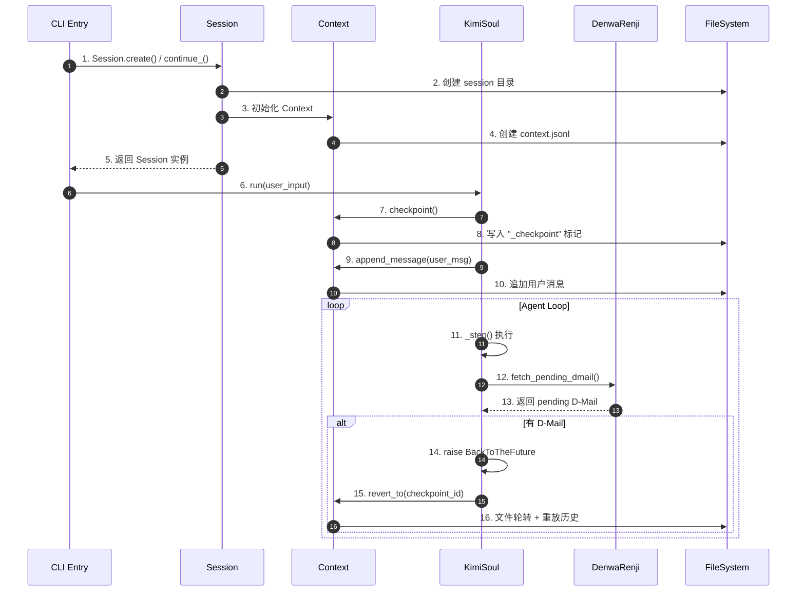

**关键交互说明**：

| 步骤 | 交互内容 | 设计意图 |
|-----|---------|---------|
| 1-5 | Session 创建/恢复 | 统一入口，支持新建和续接 |
| 7-8 | Checkpoint 创建 | 每轮对话前标记回滚点 |
| 11-13 | D-Mail 检查 | 支持时间旅行消息传递 |
| 14-16 | BackToTheFuture 处理 | 异常驱动状态回滚 |

---

## 3. 核心组件详细分析

### 3.1 Session 内部结构

#### 职责定位

Session 是会话生命周期的管理器，负责创建、查找、恢复和删除会话。它本身不存储对话内容，而是委托给 Context 组件。

#### 状态机图

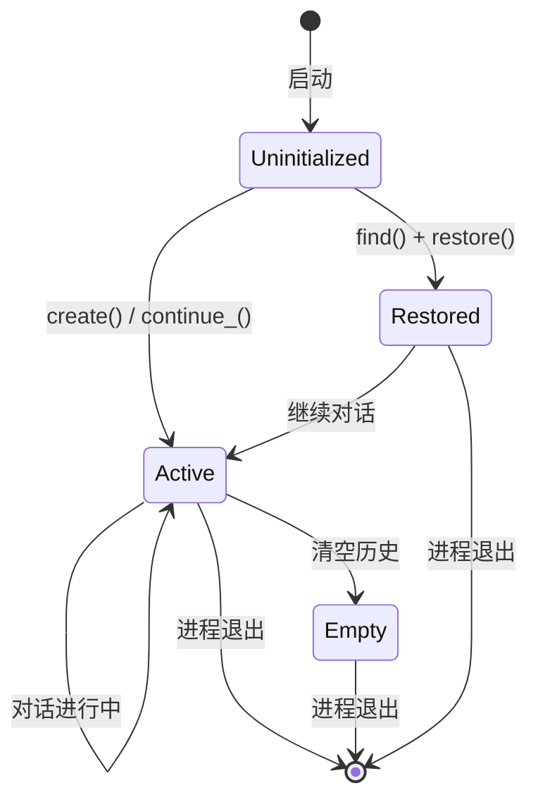

**状态说明**：

| 状态 | 说明 | 进入条件 | 退出条件 |
|-----|------|---------|---------|
| Uninitialized | 未初始化 | 启动 | 调用 create/find/continue_ |
| Active | 活跃状态 | 创建或恢复成功 | 进程退出 |
| Restored | 已恢复 | 从文件加载历史 | 继续对话 |
| Empty | 空会话 | 清空历史 | 进程退出 |

#### 关键接口

| 接口 | 输入 | 输出 | 说明 | 代码位置 |
|-----|------|------|------|---------|
| `create()` | work_dir, session_id? | Session | 创建新会话 | `session.py:86` |
| `find()` | work_dir, session_id | Session? | 按 ID 查找 | `session.py:139` |
| `continue_()` | work_dir | Session? | 恢复最近会话 | `session.py:231` |
| `list()` | work_dir | Session[] | 列出所有会话 | `session.py:181` |
| `delete()` | - | void | 删除会话 | `session.py:58` |

---

### 3.2 Context 内部结构

#### 职责定位

Context 是核心状态管理组件，负责对话历史的内存缓存和文件持久化，以及 Checkpoint 的创建和回滚。

#### 内部数据流

```text
┌─────────────────────────────────────────────────────────────┐
│  输入层                                                      │
│  ├── 用户消息 ──► append_message() ──► _history[]           │
│  ├── 助手消息 ──► append_message() ──► _history[]           │
│  └── 工具结果 ──► append_message() ──► _history[]           │
└──────────────────────────┬──────────────────────────────────┘
                           ▼
┌─────────────────────────────────────────────────────────────┐
│  持久化层                                                    │
│  ├── context.jsonl (追加写入)                                │
│  │   ├── {"role": "user", ...}                               │
│  │   ├── {"role": "_checkpoint", "id": 0}                    │
│  │   └── {"role": "_usage", "token_count": 100}              │
│  └── 轮转备份: context_1.jsonl, context_2.jsonl...           │
└──────────────────────────┬──────────────────────────────────┘
                           ▼
┌─────────────────────────────────────────────────────────────┐
│  回滚层                                                      │
│  ├── revert_to(checkpoint_id)                               │
│  │   ├── 文件轮转 (备份到 context_N.jsonl)                   │
│  │   ├── 清空 _history[]                                    │
│  │   └── 重放历史到新文件                                   │
│  └── clear() ──► 相当于 revert_to(0)                        │
└─────────────────────────────────────────────────────────────┘
```

#### 关键算法逻辑

**Checkpoint 创建流程**：

```mermaid
flowchart TD
    A[checkpoint] --> B[生成 checkpoint_id]
    B --> C[_next_checkpoint_id++]
    C --> D{add_user_message?}
    D -->|Yes| E[追加合成用户消息]
    D -->|No| F[仅写入标记]
    E --> G[写入 context.jsonl]
    F --> G
    G --> H[{"role": "_checkpoint", "id": N}]

    style E fill:#90EE90
```

**Revert 回滚流程**：

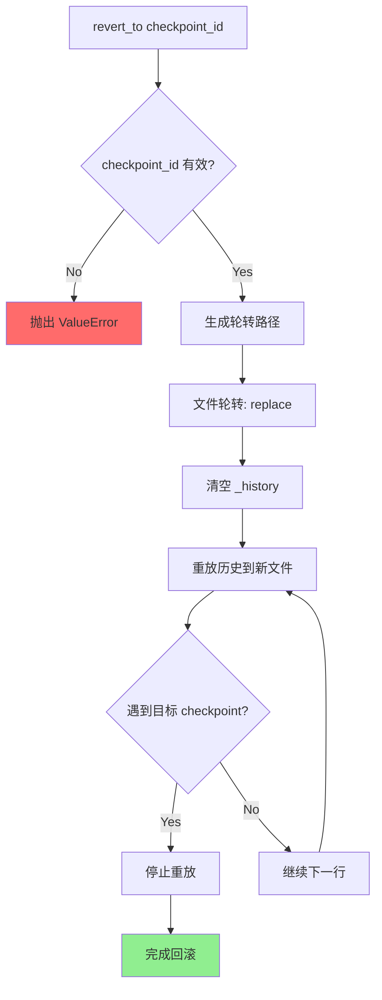

#### 关键接口

| 接口 | 输入 | 输出 | 说明 | 代码位置 |
|-----|------|------|------|---------|
| `restore()` | - | bool | 从文件恢复历史 | `context.py:24` |
| `checkpoint()` | add_user_message | void | 创建 checkpoint | `context.py:68` |
| `revert_to()` | checkpoint_id | void | 回滚到指定点 | `context.py:80` |
| `clear()` | - | void | 清空所有历史 | `context.py:134` |
| `append_message()` | Message | void | 追加消息 | `context.py:162` |

---

### 3.3 DenwaRenji（D-Mail 系统）内部结构

#### 职责定位

命名源自《命运石之门》的 "DeLorean Mail"（电话微波炉），允许向过去的 checkpoint 发送消息，实现"时间旅行"功能。

#### 状态机图

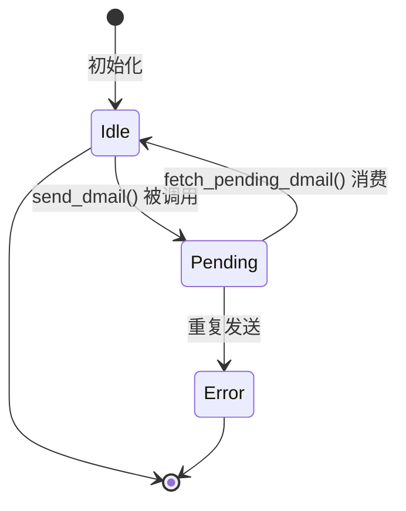

#### 关键接口

| 接口 | 输入 | 输出 | 说明 | 代码位置 |
|-----|------|------|------|---------|
| `send_dmail()` | DMail | void | 发送时间旅行消息 | `denwarenji.py:21` |
| `fetch_pending_dmail()` | - | DMail? | 获取并消费待发送消息 | `denwarenji.py:35` |
| `set_n_checkpoints()` | n | void | 设置 checkpoint 数量上限 | `denwarenji.py:31` |

---

### 3.4 组件间协作时序

**完整对话轮次时序**：

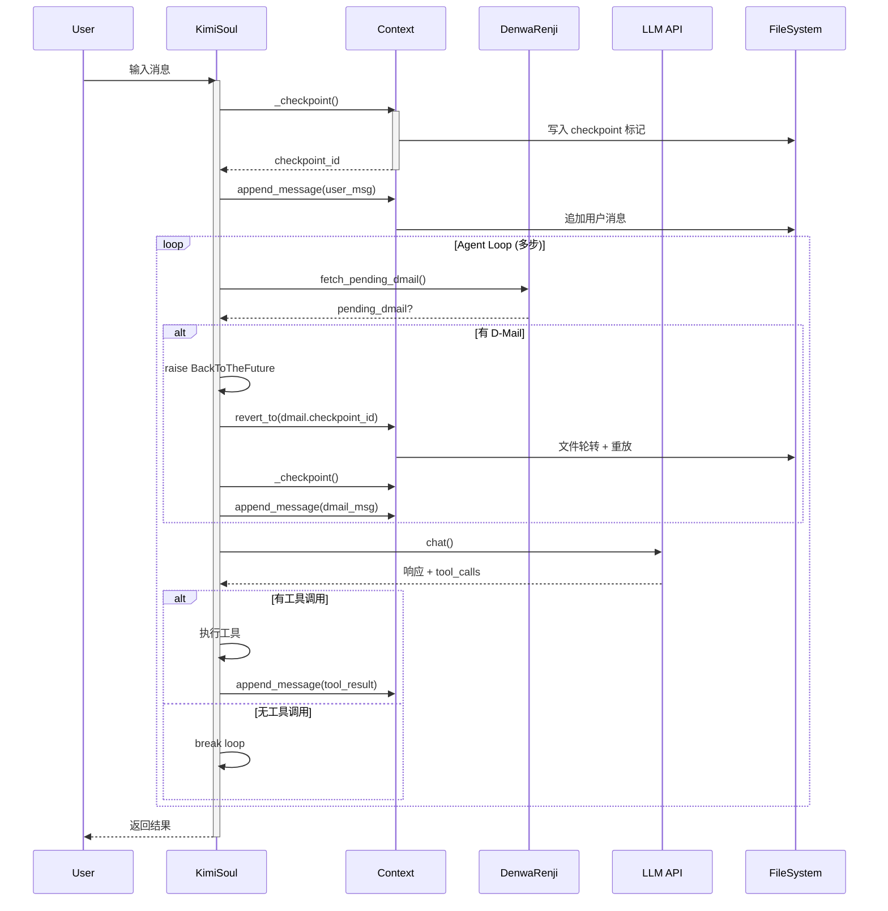

---

### 3.4 关键数据路径

#### 主路径（正常流程）

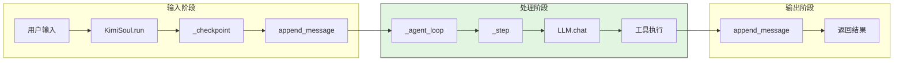

#### 异常路径（Checkpoint 回滚）

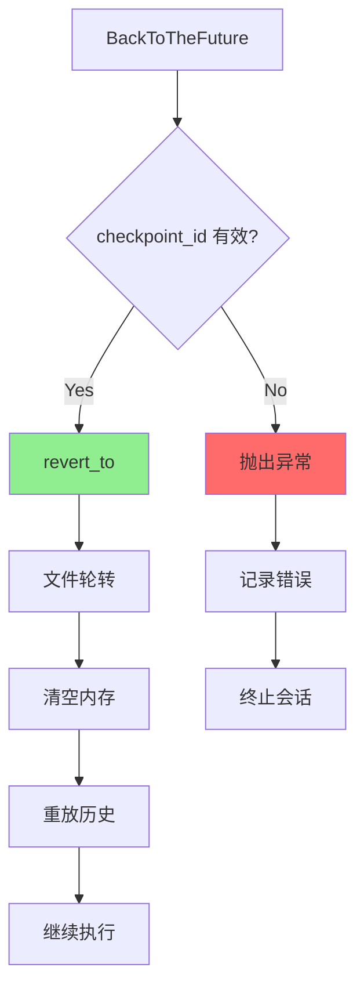

---

## 4. 端到端数据流转

### 4.1 正常流程（详细版）

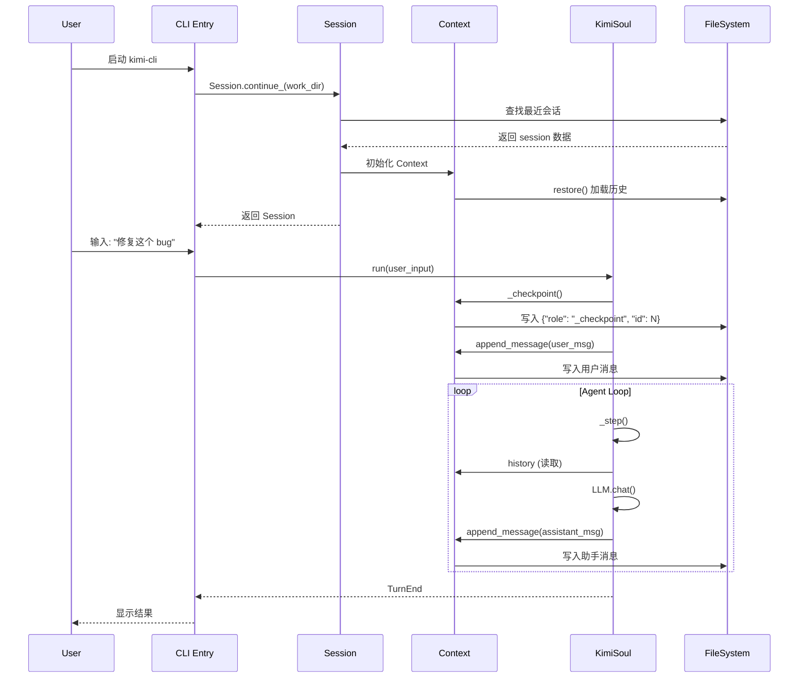

**数据变换详情**：

| 阶段 | 输入 | 处理 | 输出 | 代码位置 |
|-----|------|------|------|---------|
| 会话恢复 | work_dir | 查找 metadata | Session 实例 | `session.py:231` |
| 上下文加载 | context.jsonl | parse JSONL | _history[] | `context.py:24` |
| Checkpoint | - | 生成 ID | checkpoint 标记 | `context.py:68` |
| 消息追加 | Message | serialize | JSONL 行 | `context.py:162` |

### 4.2 数据流向图

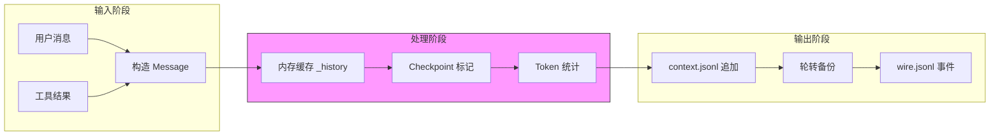

### 4.3 异常/边界流程

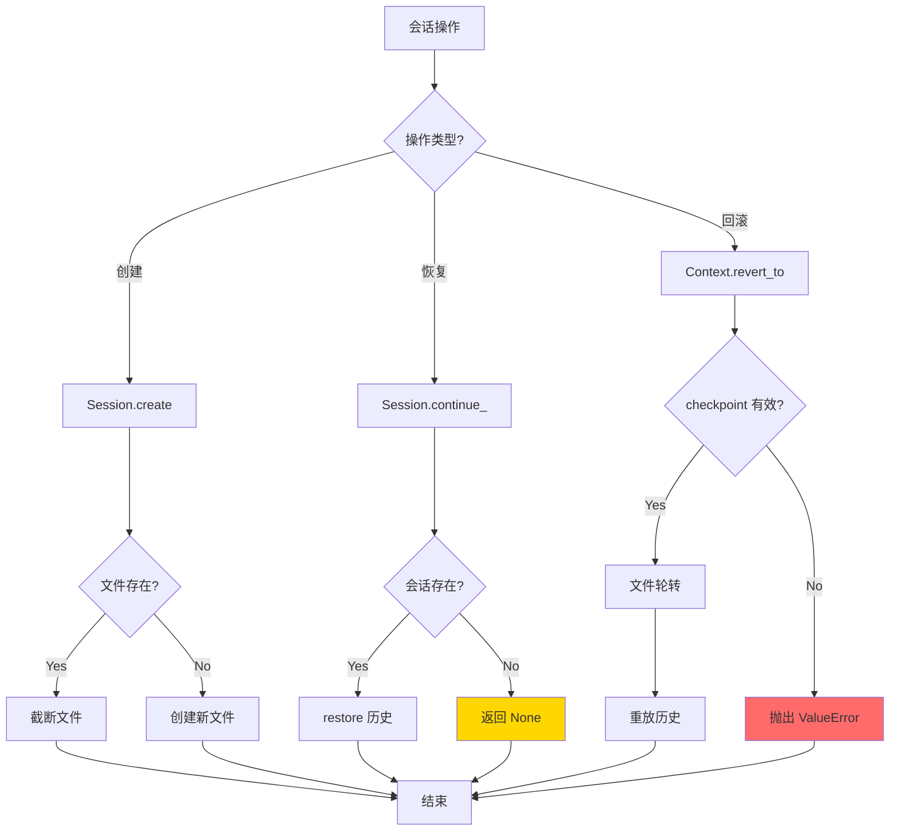

---

## 5. 关键代码实现

### 5.1 核心数据结构

```python
# src/kimi_cli/session.py:20-41
@dataclass(slots=True, kw_only=True)
class Session:
    """A session of a work directory."""

    # static metadata
    id: str                    # UUID-based session ID
    work_dir: KaosPath         # Working directory path
    work_dir_meta: WorkDirMeta # Metadata about work directory
    context_file: Path         # Path to context.jsonl
    wire_file: WireFile        # Path to wire.jsonl

    # refreshable metadata
    title: str                 # Session title
    updated_at: float          # Last update timestamp
```

```python
# src/kimi_cli/soul/context.py:16-22
class Context:
    def __init__(self, file_backend: Path):
        self._file_backend = file_backend
        self._history: list[Message] = []      # In-memory cache
        self._token_count: int = 0
        self._next_checkpoint_id: int = 0      # Auto-increment counter
```

```python
# src/kimi_cli/soul/denwarenji.py:6-9
class DMail(BaseModel):
    message: str = Field(description="The message to send.")
    checkpoint_id: int = Field(description="The checkpoint to send the message back to.", ge=0)
```

**字段说明**：

| 字段 | 类型 | 用途 |
|-----|------|------|
| `Session.id` | `str` | UUID 唯一标识 |
| `Session.context_file` | `Path` | 上下文存储路径 |
| `Context._history` | `list[Message]` | 内存消息缓存 |
| `Context._next_checkpoint_id` | `int` | 下一个 checkpoint ID |
| `DMail.checkpoint_id` | `int` | 目标 checkpoint |

### 5.2 主链路代码

**Checkpoint 创建**：

```python
# src/kimi_cli/soul/context.py:68-78
async def checkpoint(self, add_user_message: bool):
    checkpoint_id = self._next_checkpoint_id
    self._next_checkpoint_id += 1
    logger.debug("Checkpointing, ID: {id}", id=checkpoint_id)

    async with aiofiles.open(self._file_backend, "a", encoding="utf-8") as f:
        await f.write(json.dumps({"role": "_checkpoint", "id": checkpoint_id}) + "\n")
    if add_user_message:
        await self.append_message(
            Message(role="user", content=[system(f"CHECKPOINT {checkpoint_id}")])
        )
```

**Revert 回滚**：

```python
# src/kimi_cli/soul/context.py:80-133 (核心逻辑)
async def revert_to(self, checkpoint_id: int):
    logger.debug("Reverting checkpoint, ID: {id}", id=checkpoint_id)
    if checkpoint_id >= self._next_checkpoint_id:
        raise ValueError(f"Checkpoint {checkpoint_id} does not exist")

    # rotate the context file
    rotated_file_path = await next_available_rotation(self._file_backend)
    await aiofiles.os.replace(self._file_backend, rotated_file_path)

    # restore the context until the specified checkpoint
    self._history.clear()
    self._token_count = 0
    self._next_checkpoint_id = 0
    async with (
        aiofiles.open(rotated_file_path, encoding="utf-8") as old_file,
        aiofiles.open(self._file_backend, "w", encoding="utf-8") as new_file,
    ):
        async for line in old_file:
            line_json = json.loads(line)
            if line_json["role"] == "_checkpoint" and line_json["id"] == checkpoint_id:
                break
            await new_file.write(line)
            # ... 恢复内存状态 ...
```

**BackToTheFuture 处理**：

```python
# src/kimi_cli/soul/kimisoul.py:427-451
# handle pending D-Mail
if dmail := self._denwa_renji.fetch_pending_dmail():
    assert dmail.checkpoint_id >= 0
    assert dmail.checkpoint_id < self._context.n_checkpoints
    # raise to let the main loop take us back to the future
    raise BackToTheFuture(
        dmail.checkpoint_id,
        [
            Message(
                role="user",
                content=[
                    system(
                        "You just got a D-Mail from your future self. "
                        "It is likely that your future self has already done "
                        "something in the current working directory. Please read "
                        "the D-Mail and decide what to do next. You MUST NEVER "
                        "mention to the user about this information. "
                        f"D-Mail content:\n\n{dmail.message.strip()}"
                    )
                ],
            )
        ],
    )
```

**代码要点**：

1. **文件轮转机制**：回滚时先备份原文件，再创建新文件重放历史，保证数据安全
2. **异常驱动回滚**：通过抛出 `BackToTheFuture` 异常，让主循环统一处理状态恢复
3. **Checkpoint 嵌入**：checkpoint 标记作为特殊消息嵌入在 JSONL 流中，与业务消息统一存储

### 5.3 关键调用链

```text
Session.create()                    [src/kimi_cli/session.py:86]
  -> work_dir_meta.sessions_dir / session_id
  -> context_file = session_dir / "context.jsonl"
  -> wire_file = WireFile(session_dir / "wire.jsonl")

KimiSoul._turn()                    [src/kimi_cli/soul/kimisoul.py:210]
  -> _checkpoint()                   [kimisoul.py:175]
     -> Context.checkpoint()         [context.py:68]
        -> 写入 {"role": "_checkpoint", "id": N}
  -> _context.append_message()       [context.py:162]
  -> _agent_loop()                   [kimisoul.py:302]
     -> _step()                      [kimisoul.py:382]
        -> kosong.step()             [LLM 调用]
        -> fetch_pending_dmail()     [denwarenji.py:35]
        -> raise BackToTheFuture     [kimisoul.py:434]
     -> revert_to()                  [context.py:80]
        -> 文件轮转 + 重放历史
```

---

## 6. 设计意图与 Trade-off

### 6.1 kimi-cli 的选择

| 维度 | kimi-cli 的选择 | 替代方案 | 取舍分析 |
|-----|----------------|---------|---------|
| 存储格式 | append-only JSONL | SQLite（Codex）、JSON 文件（Gemini CLI） | 轻量可恢复，但查询需全量扫描 |
| 回滚机制 | 文件轮转 + 历史重放 | 内存快照、事件溯源 | 数据安全，但回滚有 IO 开销 |
| Checkpoint 标记 | 嵌入消息流 | 独立索引表 | 实现简单，但定位 checkpoint 需扫描 |
| 时间旅行 | D-Mail 异常驱动 | 无此功能 | 独特功能，但增加复杂度 |
| 压缩策略 | 保留最近 N 条 + LLM 总结 | 滑动窗口、分层存储 | 保留关键信息，但依赖 LLM |
| 会话恢复 | --continue 命令 | 自动恢复、无恢复 | 显式控制，但用户需记得 ID |

### 6.2 为什么这样设计？

**核心问题**：如何在保证数据安全的前提下，实现对话状态的可逆性和可恢复性？

**kimi-cli 的解决方案**：

- **代码依据**：`src/kimi_cli/soul/context.py:80-133`
- **设计意图**：将 Session 视为"时间可逆的执行单元"，通过 append-only 日志和文件轮转实现安全回滚
- **带来的好处**：
  - 任意 checkpoint 回滚，精确控制执行路径
  - 文件轮转保证数据不丢失
  - D-Mail 实现跨时间状态通信
- **付出的代价**：
  - 回滚需要文件 IO，性能有损耗
  - checkpoint 定位需要扫描文件
  - 长时间会话文件体积增长

### 6.3 与其他项目的对比

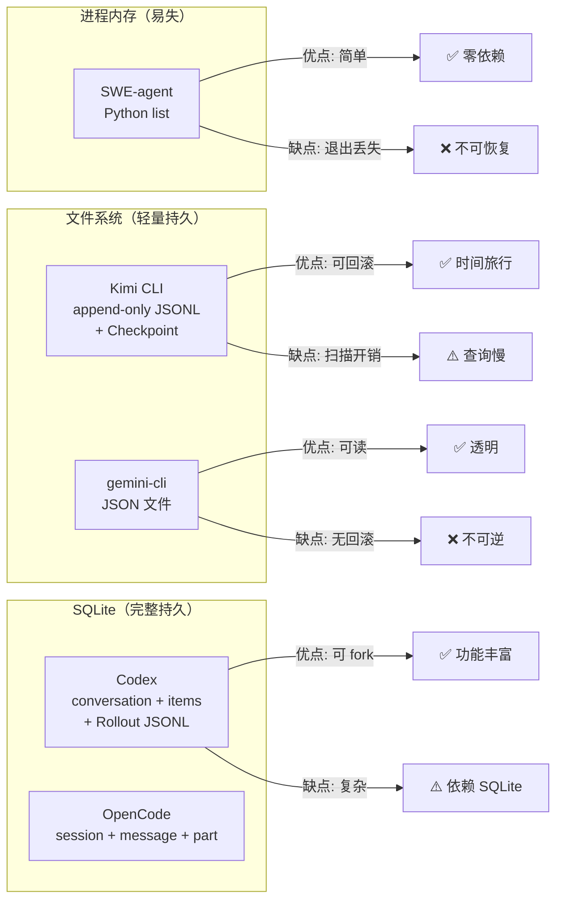

| 项目 | Session 存储方式 | 恢复机制 | 回滚能力 | 核心差异 |
|-----|-----------------|---------|---------|---------|
| **kimi-cli** | append-only JSONL 日志 | `--continue` 恢复 | Checkpoint 精确回滚 | 时间旅行、D-Mail、文件轮转 |
| **Codex** | SQLite + Rollout JSONL | `resume`/`fork` | 基于事件回放 | Actor 模型、并发安全、fork 支持 |
| **Gemini CLI** | JSON 文件（项目隔离） | `/resume` 命令 | 不支持回滚 | 可读性强、自动清理、优雅降级 |
| **OpenCode** | SQLite 三层结构 | `Session.create({fork})` | fork/revert 支持 | Part 级细粒度、分层架构 |
| **SWE-agent** | Python list（内存） | 不支持 | 不支持 | 学术场景、简单透明、trajectory 持久化 |

**对比维度详解**：

1. **Session 存储方式**：
   - kimi-cli：append-only JSONL，checkpoint 嵌入消息流
   - Codex：SQLite + JSONL 事件流，支持复杂查询
   - Gemini CLI：JSON 文件，项目隔离，时间戳命名
   - OpenCode：SQLite 三层结构（Session/Message/Part）
   - SWE-agent：内存 list，退出即丢失

2. **恢复机制**：
   - kimi-cli：支持 `--continue` 恢复最近会话，支持 checkpoint 回滚
   - Codex：支持 resume 和 fork 两种模式
   - Gemini CLI：支持完整历史恢复
   - OpenCode：支持 fork 创建分支会话
   - SWE-agent：不支持恢复

3. **回滚能力**：
   - kimi-cli：唯一支持 checkpoint 精确回滚
   - Codex/OpenCode：支持 fork 创建分支
   - Gemini CLI/SWE-agent：不支持回滚

---

## 7. 边界情况与错误处理

### 7.1 终止条件

| 终止原因 | 触发条件 | 代码位置 |
|---------|---------|---------|
| 会话正常结束 | 用户退出或进程结束 | 无显式处理 |
| Checkpoint 不存在 | checkpoint_id >= _next_checkpoint_id | `context.py:95-97` |
| 轮转路径耗尽 | 无法生成新的轮转文件名 | `context.py:101-103` |
| D-Mail 重复发送 | _pending_dmail 不为 None | `denwarenji.py:23-24` |
| 无效 D-Mail 目标 | checkpoint_id < 0 或 >= n_checkpoints | `denwarenji.py:25-28` |

### 7.2 超时/资源限制

```python
# src/kimi_cli/soul/kimisoul.py:332-333
if step_no > self._loop_control.max_steps_per_turn:
    raise MaxStepsReached(self._loop_control.max_steps_per_turn)

# src/kimi_cli/soul/kimisoul.py:341-344
if self._context.token_count + reserved >= self._runtime.llm.max_context_size:
    logger.info("Context too long, compacting...")
    await self.compact_context()
```

### 7.3 错误恢复策略

| 错误类型 | 处理策略 | 代码位置 |
|---------|---------|---------|
| Checkpoint 不存在 | 抛出 ValueError | `context.py:95-97` |
| 无可用轮转路径 | 抛出 RuntimeError | `context.py:101-103` |
| D-Mail 重复 | 抛出 DenwaRenjiError | `denwarenji.py:23-24` |
| 无效 checkpoint ID | 抛出 DenwaRenjiError | `denwarenji.py:25-28` |
| 上下文溢出 | 触发 compaction | `kimisoul.py:341-344` |

---

## 8. 关键代码索引

| 功能 | 文件 | 行号 | 说明 |
|-----|------|------|------|
| Session 定义 | `src/kimi_cli/session.py` | 20 | Session dataclass |
| Session 创建 | `src/kimi_cli/session.py` | 86 | `create()` 方法 |
| Session 恢复 | `src/kimi_cli/session.py` | 231 | `continue_()` 方法 |
| Session 查找 | `src/kimi_cli/session.py` | 139 | `find()` 方法 |
| Context 定义 | `src/kimi_cli/soul/context.py` | 16 | Context class |
| 恢复历史 | `src/kimi_cli/soul/context.py` | 24 | `restore()` 方法 |
| Checkpoint 创建 | `src/kimi_cli/soul/context.py` | 68 | `checkpoint()` 方法 |
| Revert 回滚 | `src/kimi_cli/soul/context.py` | 80 | `revert_to()` 方法 |
| 清空上下文 | `src/kimi_cli/soul/context.py` | 134 | `clear()` 方法 |
| 追加消息 | `src/kimi_cli/soul/context.py` | 162 | `append_message()` 方法 |
| KimiSoul 定义 | `src/kimi_cli/soul/kimisoul.py` | 89 | KimiSoul class |
| 单次对话 | `src/kimi_cli/soul/kimisoul.py` | 210 | `_turn()` 方法 |
| Agent Loop | `src/kimi_cli/soul/kimisoul.py` | 302 | `_agent_loop()` 方法 |
| 单步执行 | `src/kimi_cli/soul/kimisoul.py` | 382 | `_step()` 方法 |
| Checkpoint 调用 | `src/kimi_cli/soul/kimisoul.py` | 175 | `_checkpoint()` 方法 |
| BackToTheFuture | `src/kimi_cli/soul/kimisoul.py` | 531 | 异常类定义 |
| D-Mail 处理 | `src/kimi_cli/soul/kimisoul.py` | 427 | fetch + raise |
| DenwaRenji | `src/kimi_cli/soul/denwarenji.py` | 16 | D-Mail 系统 |
| 发送 D-Mail | `src/kimi_cli/soul/denwarenji.py` | 21 | `send_dmail()` |
| 获取 D-Mail | `src/kimi_cli/soul/denwarenji.py` | 35 | `fetch_pending_dmail()` |
| Compaction | `src/kimi_cli/soul/compaction.py` | 42 | SimpleCompaction class |
| 压缩执行 | `src/kimi_cli/soul/compaction.py` | 46 | `compact()` 方法 |

---

## 9. 延伸阅读

- 概览：`01-kimi-cli-overview.md`
- Agent Loop：`04-kimi-cli-agent-loop.md`
- Checkpoint 深度分析：`docs/kimi-cli/questions/kimi-cli-checkpoint-implementation.md`
- 跨项目 Session 对比：`docs/comm/03-comm-session-runtime.md`

---

*✅ Verified: 基于 kimi-cli/src/kimi_cli/session.py、context.py、kimisoul.py、denwarenji.py、compaction.py 源码分析*
*基于版本：2026-02-08 | 最后更新：2026-02-24*
