# Session Runtime（kimi-cli）

## TL;DR（结论先行）

一句话定义：Kimi CLI 的 Session Runtime 采用**"目录隔离 + 双文件日志 + 轻量 Metadata 索引"**模型，以 append-only JSONL 形式持久化对话历史，支持 Checkpoint 回滚和会话恢复。

Kimi CLI 的核心取舍：**文件系统持久化 + Checkpoint 回滚能力**（对比 Codex 的 SQLite + Actor 模型、Gemini CLI 的 JSON 整文件重写、SWE-agent 的纯内存存储）

---

## 1. 为什么需要这个机制？

### 1.1 问题场景

```text
场景：用户需要跨会话恢复对话历史，并在多工作目录间隔离数据

如果没有 Session 管理：
  - 进程退出后对话历史丢失
  - 多个工作目录的会话混杂在一起
  - 用户想撤销到某一步时无法回滚
  - 空会话堆积占用空间

Kimi CLI 的做法：
  - 每个工作目录独立存储空间（md5 哈希隔离）
  - append-only JSONL 日志，支持崩溃恢复
  - Checkpoint 机制支持回滚到任意步骤
  - 空会话自动清理
```

### 1.2 核心挑战

| 挑战 | 不解决的后果 |
|-----|-------------|
| 数据隔离 | 多工作目录会话混杂，难以管理和恢复 |
| 持久化可靠性 | 进程崩溃或退出导致数据丢失 |
| 状态回滚 | 用户无法撤销到之前的对话状态 |
| 存储管理 | 空会话或旧会话堆积，占用磁盘空间 |
| 会话恢复 | 无法基于历史上下文继续对话 |

---

## 2. 整体架构

### 2.1 在系统中的位置

```text
┌─────────────────────────────────────────────────────────────┐
│ CLI 入口 / Command Handler                                   │
│ kimi-cli/src/kimi_cli/cli/__init__.py:457                   │
│ - _run(): 创建/加载会话                                      │
│ - _post_run(): 收尾处理                                      │
└───────────────────────┬─────────────────────────────────────┘
                        │ 调用
                        ▼
┌─────────────────────────────────────────────────────────────┐
│ ▓▓▓ Session Runtime ▓▓▓                                     │
│ Session + Context + WireFile                                 │
│ kimi-cli/src/kimi_cli/session.py:20                         │
│ - create(): 创建新会话                                       │
│ - find(): 查找已有会话                                       │
│ - continue_(): 继续上次会话                                  │
└───────────────────────┬─────────────────────────────────────┘
                        │ 依赖/调用
        ┌───────────────┼───────────────┐
        ▼               ▼               ▼
┌──────────────┐ ┌──────────────┐ ┌──────────────┐
│ Context      │ │ WireFile     │ │ Metadata     │
│ 对话历史存储  │ │ 事件流记录    │ │ 轻量索引     │
│ context.jsonl│ │ wire.jsonl   │ │ kim.json     │
└──────────────┘ └──────────────┘ └──────────────┘
```

### 2.2 核心组件职责

| 组件 | 职责 | 代码位置 |
|-----|------|---------|
| `Session` | 会话生命周期管理、创建/查找/继续会话 | `kimi-cli/src/kimi_cli/session.py:20` |
| `Context` | 对话历史存储、Checkpoint 管理、恢复 | `kimi-cli/src/kimi_cli/soul/context.py:16` |
| `WireFile` | 事件流持久化、协议版本管理 | `kimi-cli/src/kimi_cli/wire/file.py:59` |
| `Metadata` | 工作目录索引、last_session_id 管理 | `kimi-cli/src/kimi_cli/metadata.py:42` |
| `WorkDirMeta` | 单个工作目录的元数据、会话目录定位 | `kimi-cli/src/kimi_cli/metadata.py:20` |

### 2.3 核心组件交互时序

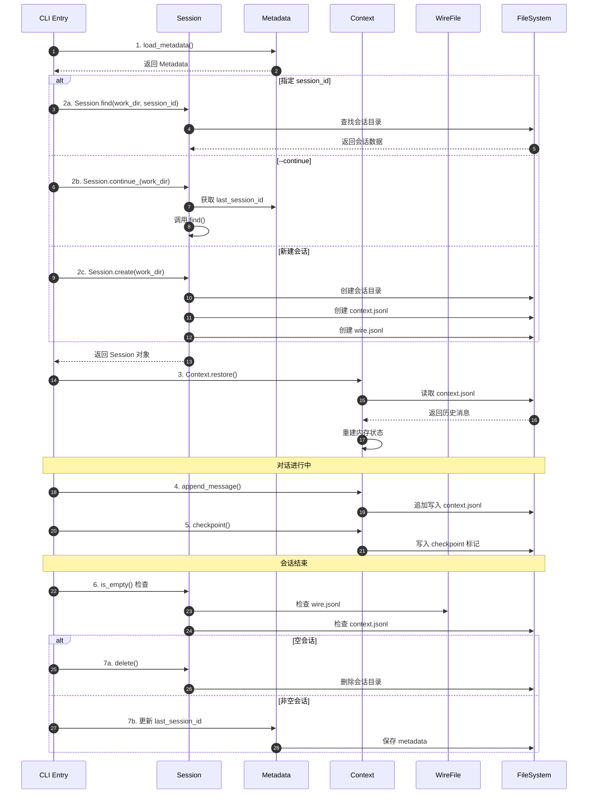

**关键交互说明**：

| 步骤 | 交互内容 | 设计意图 |
|-----|---------|---------|
| 1 | 加载全局 Metadata | 获取工作目录索引，定位会话存储位置 |
| 2a/2b/2c | 三种会话获取模式 | 支持指定恢复、继续上次、新建三种场景 |
| 3 | Context 恢复 | 从文件重建内存状态，支持崩溃恢复 |
| 4-5 | 运行时持久化 | append-only 写入，保证数据安全 |
| 6-7 | 收尾处理 | 空会话自动清理，非空会话更新索引 |

---

## 3. 核心组件详细分析

### 3.1 Session 内部结构

#### 职责定位

Session 是会话管理的入口组件，负责会话的创建、查找、继续和删除。它不直接存储对话内容，而是协调 Context 和 WireFile 完成持久化。

#### 状态机图

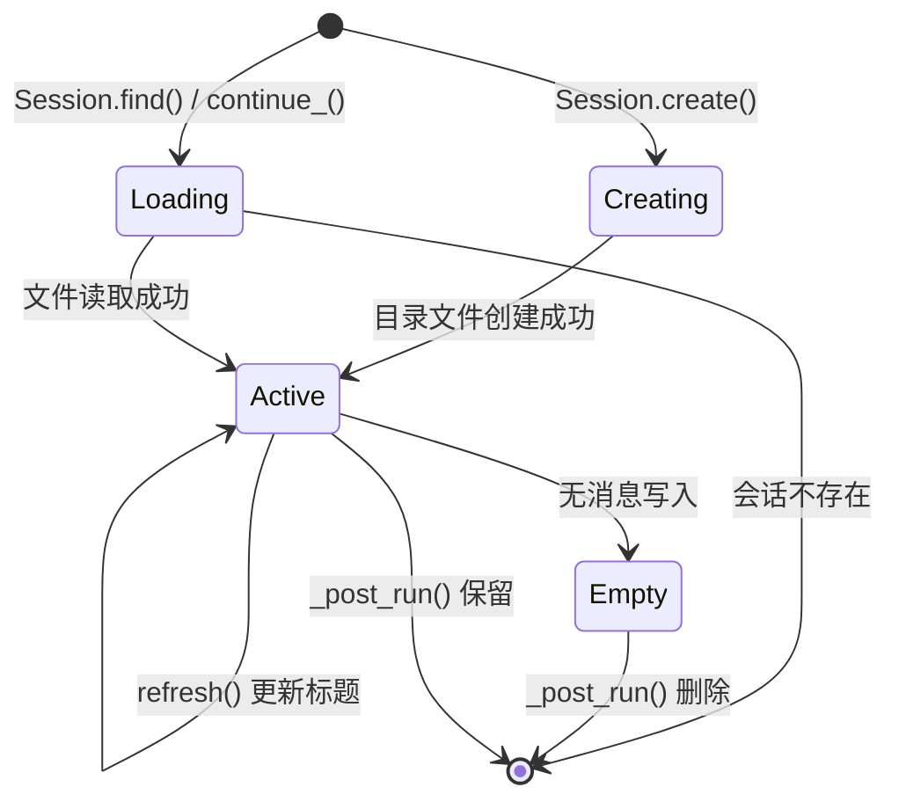

**状态说明**：

| 状态 | 说明 | 进入条件 | 退出条件 |
|-----|------|---------|---------|
| Creating | 正在创建 | 调用 create() | 目录文件创建完成 |
| Loading | 正在加载 | 调用 find() / continue_() | 加载成功或失败 |
| Active | 正常运行 | 加载成功且有消息 | 会话结束 |
| Empty | 空会话 | 创建后无消息写入 | 被删除 |

#### 会话存储布局

```text
~/.kimi/
└── sessions/
    └── <workdir_hash>/                    # 工作目录哈希隔离
        └── <session_id>/                  # 会话目录
            ├── context.jsonl              # 对话历史（Context）
            └── wire.jsonl                 # 事件流（WireFile）

~/.kimi/kimi.json                          # 全局 Metadata
{
  "work_dirs": [
    {
      "path": "/path/to/project",
      "kaos": "local",
      "last_session_id": "uuid..."
    }
  ]
}
```

#### 关键接口

| 接口 | 输入 | 输出 | 说明 | 代码位置 |
|-----|------|------|------|---------|
| `create()` | work_dir, session_id? | Session | 创建新会话 | `session.py:86` |
| `find()` | work_dir, session_id | Session/None | 查找已有会话 | `session.py:139` |
| `continue_()` | work_dir | Session/None | 继续上次会话 | `session.py:231` |
| `list()` | work_dir | Session[] | 列出所有会话 | `session.py:181` |
| `is_empty()` | - | bool | 检查是否空会话 | `session.py:49` |
| `delete()` | - | void | 删除会话目录 | `session.py:58` |
| `refresh()` | - | void | 刷新标题和时间戳 | `session.py:65` |

---

### 3.2 Context 内部结构

#### 职责定位

Context 是对话历史的核心存储组件，使用内存缓存 + append-only 文件日志的双层架构，支持 Checkpoint 回滚机制。

#### 内部数据流

```text
┌─────────────────────────────────────────────────────────────┐
│  内存层（运行时）                                              │
│  ├── _history: list[Message]        # 消息历史缓存            │
│  ├── _token_count: int              # Token 计数              │
│  └── _next_checkpoint_id: int       # 下一个 Checkpoint ID    │
└──────────────────────────┬──────────────────────────────────┘
                           │ 持久化
                           ▼
┌─────────────────────────────────────────────────────────────┐
│  文件层（持久化）                                              │
│  context.jsonl                                               │
│  ├── {"role": "user", "content": [...]}                      │
│  ├── {"role": "assistant", "content": [...]}                 │
│  ├── {"role": "_checkpoint", "id": 0}                        │
│  ├── {"role": "_usage", "token_count": 1234}                 │
│  └── ...                                                     │
└─────────────────────────────────────────────────────────────┘
```

#### Checkpoint 机制

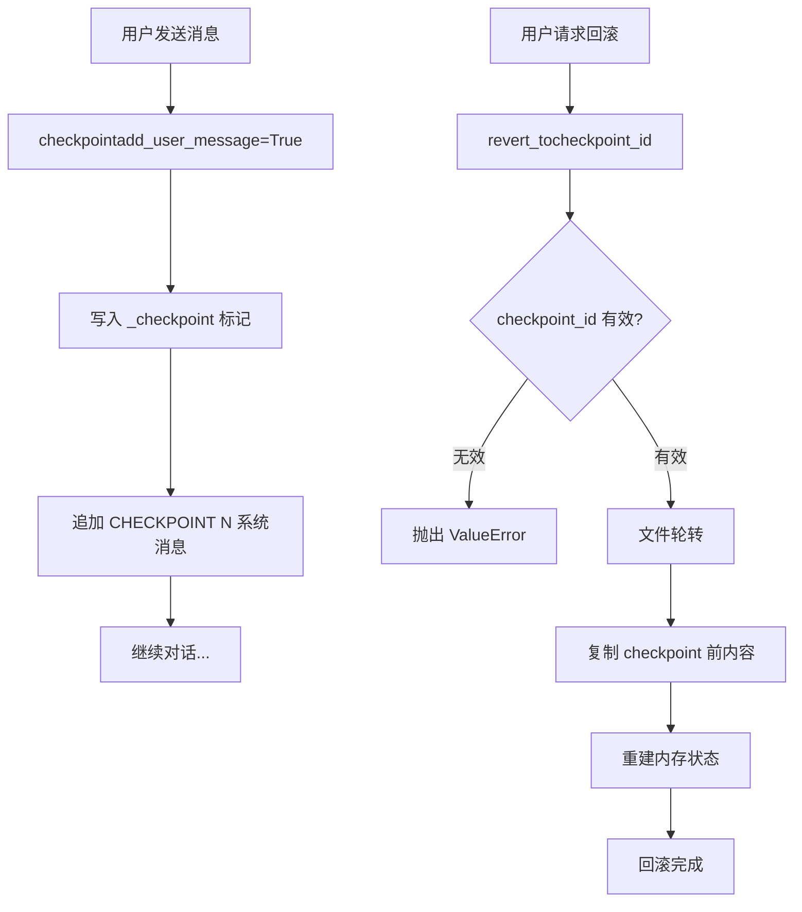

**算法要点**：

1. **Checkpoint 标记**：使用特殊 role `_checkpoint` 标记回滚点
2. **文件轮转**：回滚时先将原文件重命名（保留历史），再创建新文件
3. **全量重建**：恢复时逐行解析，重建内存状态

#### 关键接口

| 接口 | 输入 | 输出 | 说明 | 代码位置 |
|-----|------|------|------|---------|
| `restore()` | - | bool | 从文件恢复历史 | `context.py:24` |
| `checkpoint()` | add_user_message | void | 创建 Checkpoint | `context.py:68` |
| `revert_to()` | checkpoint_id | void | 回滚到指定点 | `context.py:80` |
| `append_message()` | Message | void | 追加消息 | `context.py:162` |
| `update_token_count()` | token_count | void | 更新 Token 计数 | `context.py:171` |
| `clear()` | - | void | 清空历史 | `context.py:134` |

---

### 3.3 WireFile 内部结构

#### 职责定位

WireFile 负责事件流的持久化，记录更详细的运行时事件（如 TurnBegin、ToolCall 等），用于会话标题推导和调试。

#### 关键特性

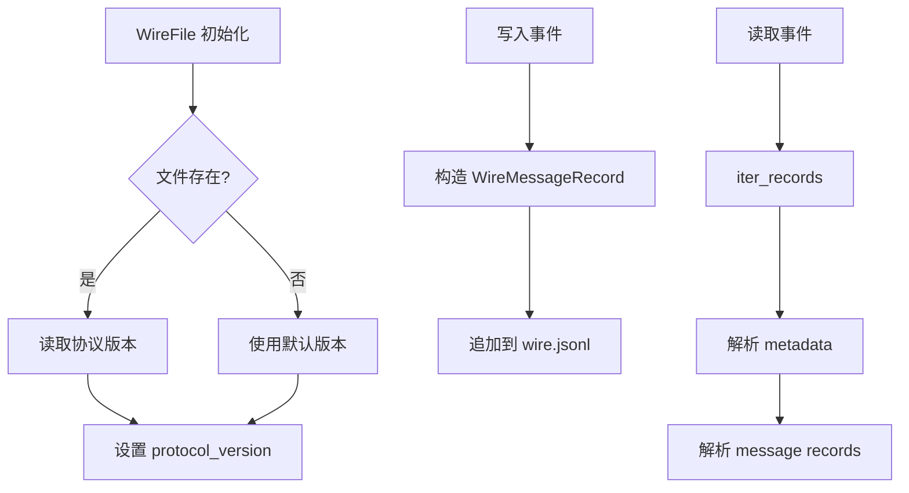

**字段说明**：

| 字段 | 类型 | 用途 |
|-----|------|------|
| `timestamp` | float | 事件时间戳 |
| `message` | WireMessageEnvelope | 事件内容包装 |

---

### 3.4 组件间协作时序（会话恢复）

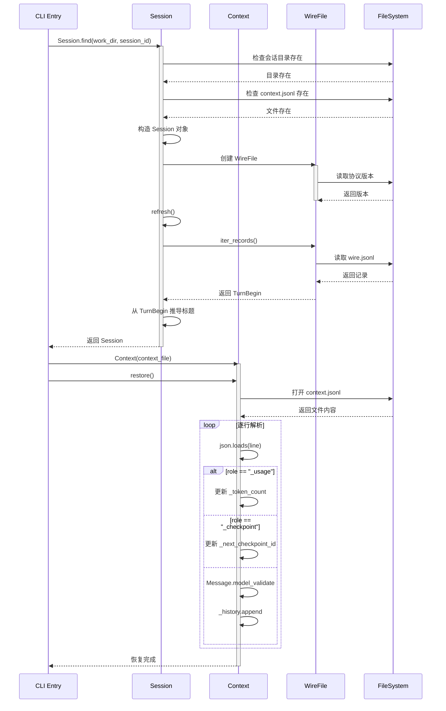

**协作要点**：

1. **Session 与 Context 分离**：Session 管理目录和元数据，Context 管理对话内容
2. **WireFile 协议版本**：支持多版本协议兼容
3. **标题推导**：从 WireFile 的第一条 TurnBegin 消息提取用户输入作为标题

---

### 3.5 关键数据路径

#### 主路径（正常流程）

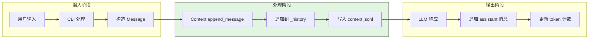

#### 异常路径（回滚恢复）

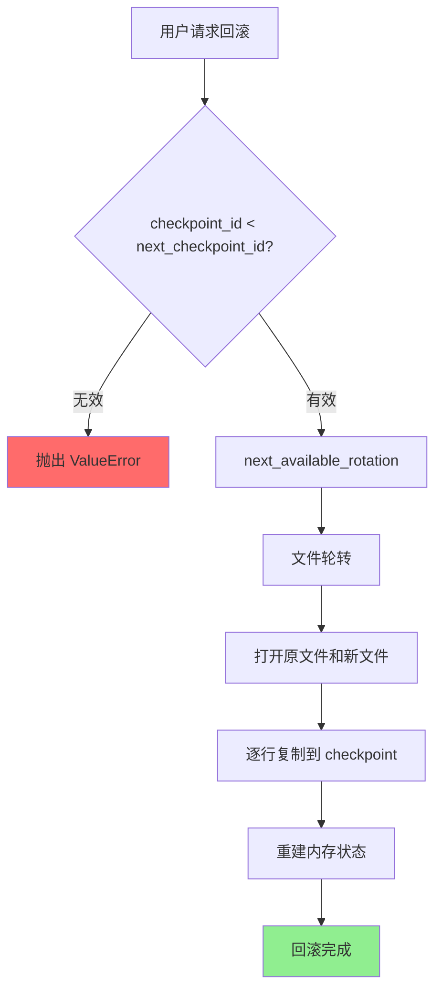

---

## 4. 端到端数据流转

### 4.1 正常流程（详细版）

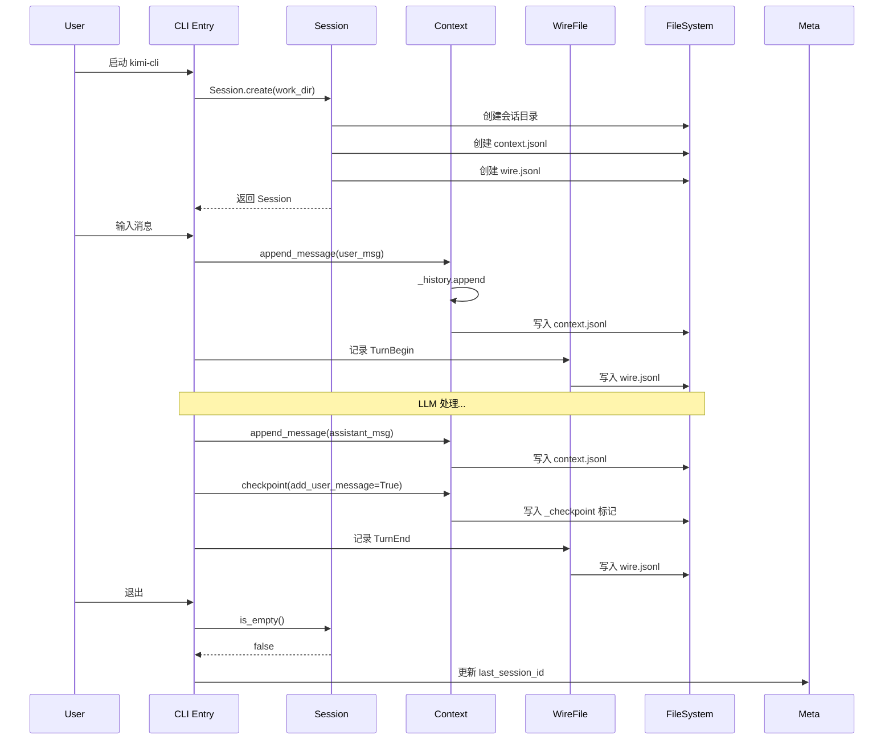

**数据变换详情**：

| 阶段 | 输入 | 处理 | 输出 | 代码位置 |
|-----|------|------|------|---------|
| 接收 | 用户输入 | 构造 Message 对象 | 结构化消息 | `context.py:162` |
| 持久化 | Message | JSON 序列化 | 追加到 context.jsonl | `context.py:167` |
| 事件记录 | 运行时事件 | 构造 WireMessageRecord | 追加到 wire.jsonl | `wire/file.py:95` |
| Checkpoint | 用户请求 | 写入标记 + 系统消息 | 回滚点记录 | `context.py:68` |

### 4.2 数据流向图

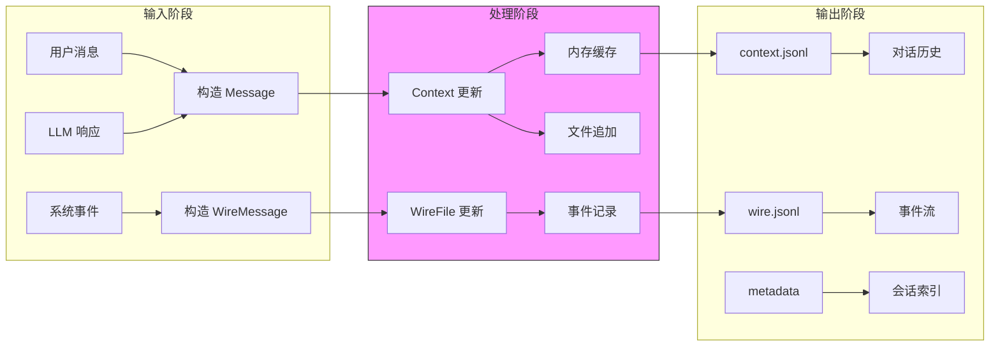

### 4.3 异常/边界流程

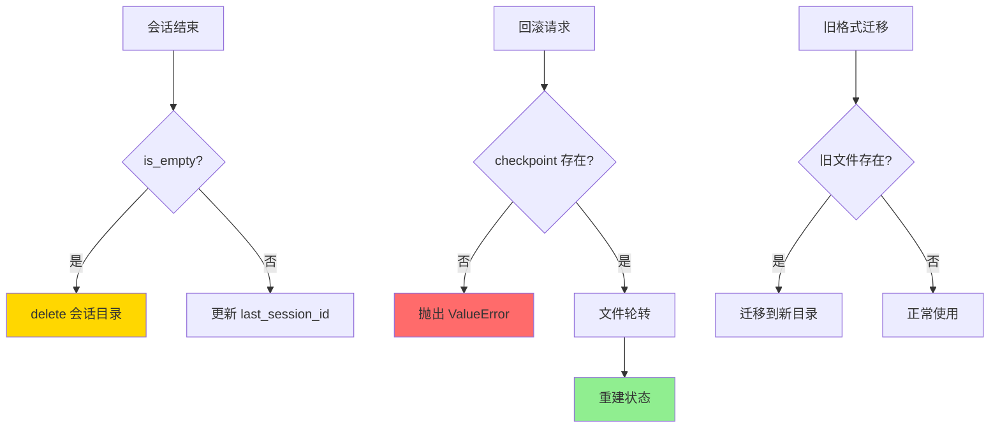

---

## 5. 关键代码实现

### 5.1 核心数据结构

```python
# kimi-cli/src/kimi_cli/session.py:20-41
@dataclass(slots=True, kw_only=True)
class Session:
    """A session of a work directory."""

    # static metadata
    id: str
    """The session ID."""
    work_dir: KaosPath
    """The absolute path of the work directory."""
    work_dir_meta: WorkDirMeta
    """The metadata of the work directory."""
    context_file: Path
    """The absolute path to the file storing the message history."""
    wire_file: WireFile
    """The wire message log file wrapper."""

    # refreshable metadata
    title: str
    """The title of the session."""
    updated_at: float
    """The timestamp of the last update to the session."""
```

```python
# kimi-cli/src/kimi_cli/soul/context.py:16-22
class Context:
    def __init__(self, file_backend: Path):
        self._file_backend = file_backend
        self._history: list[Message] = []
        self._token_count: int = 0
        self._next_checkpoint_id: int = 0
        """The ID of the next checkpoint, starting from 0."""
```

```python
# kimi-cli/src/kimi_cli/metadata.py:20-39
class WorkDirMeta(BaseModel):
    """Metadata for a work directory."""

    path: str
    """The full path of the work directory."""

    kaos: str = local_kaos.name
    """The name of the KAOS where the work directory is located."""

    last_session_id: str | None = None
    """Last session ID of this work directory."""

    @property
    def sessions_dir(self) -> Path:
        """The directory to store sessions for this work directory."""
        path_md5 = md5(self.path.encode(encoding="utf-8")).hexdigest()
        dir_basename = path_md5 if self.kaos == local_kaos.name else f"{self.kaos}_{path_md5}"
        session_dir = get_share_dir() / "sessions" / dir_basename
        session_dir.mkdir(parents=True, exist_ok=True)
        return session_dir
```

**字段说明**：

| 字段 | 类型 | 用途 |
|-----|------|------|
| `Session.id` | `str` | 唯一会话标识（UUID） |
| `Session.context_file` | `Path` | 对话历史文件路径 |
| `Session.wire_file` | `WireFile` | 事件流文件包装器 |
| `Context._history` | `list[Message]` | 内存中的消息历史 |
| `Context._next_checkpoint_id` | `int` | 下一个 Checkpoint ID |
| `WorkDirMeta.last_session_id` | `str/None` | 上次会话 ID 索引 |
| `WorkDirMeta.sessions_dir` | `Path` | 会话存储目录（md5 哈希隔离） |

### 5.2 主链路代码

```python
# kimi-cli/src/kimi_cli/cli/__init__.py:457-527
async def _run(session_id: str | None) -> tuple[Session, bool]:
    """
    Create/load session and run the CLI instance.
    """
    if session_id is not None:
        session = await Session.find(work_dir, session_id)
        if session is None:
            logger.info(
                "Session {session_id} not found, creating new session",
                session_id=session_id
            )
            session = await Session.create(work_dir, session_id)
        logger.info("Switching to session: {session_id}", session_id=session.id)
    elif continue_:
        session = await Session.continue_(work_dir)
        if session is None:
            raise typer.BadParameter(
                "No previous session found for the working directory",
                param_hint="--continue",
            )
        logger.info("Continuing previous session: {session_id}", session_id=session.id)
    else:
        session = await Session.create(work_dir)
        logger.info("Created new session: {session_id}", session_id=session.id)

    instance = await KimiCLI.create(session, ...)
    # ... 运行逻辑 ...
    return session, succeeded
```

```python
# kimi-cli/src/kimi_cli/soul/context.py:24-50
async def restore(self) -> bool:
    """Restore context from file."""
    logger.debug("Restoring context from file: {file_backend}", file_backend=self._file_backend)
    if self._history:
        logger.error("The context storage is already modified")
        raise RuntimeError("The context storage is already modified")
    if not self._file_backend.exists():
        logger.debug("No context file found, skipping restoration")
        return False
    if self._file_backend.stat().st_size == 0:
        logger.debug("Empty context file, skipping restoration")
        return False

    async with aiofiles.open(self._file_backend, encoding="utf-8") as f:
        async for line in f:
            if not line.strip():
                continue
            line_json = json.loads(line)
            if line_json["role"] == "_usage":
                self._token_count = line_json["token_count"]
                continue
            if line_json["role"] == "_checkpoint":
                self._next_checkpoint_id = line_json["id"] + 1
                continue
            message = Message.model_validate(line_json)
            self._history.append(message)

    return True
```

**代码要点**：

1. **三种会话获取模式**：指定 session_id、--continue、新建会话
2. **防御性编程**：restore() 检查历史是否已存在，防止重复加载
3. **特殊角色处理**：`_usage` 和 `_checkpoint` 作为元数据标记

### 5.3 关键调用链

```text
_run()                              [kimi_cli/cli/__init__.py:457]
  -> Session.find() / create()       [kimi_cli/session.py:139/86]
    -> load_metadata()               [kimi_cli/metadata.py:64]
    -> WorkDirMeta.sessions_dir      [kimi_cli/metadata.py:33]
  -> KimiCLI.create()                [kimi_cli/cli/__init__.py:484]
    -> Context.restore()             [kimi_cli/soul/context.py:24]
      -> 逐行解析 context.jsonl

Agent Loop 运行时
  -> Context.checkpoint()            [kimi_cli/soul/context.py:68]
    -> 写入 {"role": "_checkpoint", "id": N}
  -> Context.append_message()        [kimi_cli/soul/context.py:162]
    -> _history.extend() + 文件追加

_post_run()                         [kimi_cli/cli/__init__.py:528]
  -> Session.is_empty()              [kimi_cli/session.py:49]
    -> 检查 wire.jsonl + context.jsonl
  -> Session.delete() / 更新 metadata
```

---

## 6. 设计意图与 Trade-off

### 6.1 Kimi CLI 的选择

| 维度 | Kimi CLI 的选择 | 替代方案 | 取舍分析 |
|-----|-----------------|---------|---------|
| 存储格式 | append-only JSONL | SQLite（Codex）、JSON 整文件（Gemini CLI） | 写入快、可恢复，但查询需全量扫描 |
| 隔离策略 | work_dir md5 哈希目录隔离 | 单文件多项目（OpenCode） | 目录隔离清晰，便于批量管理 |
| 索引方式 | 轻量 Metadata（last_session_id） | 完整数据库索引 | 实现简单，但功能有限 |
| 回滚机制 | Checkpoint 文件轮转 | 无回滚（Gemini CLI）、内存快照 | 支持任意步骤回滚，但实现复杂 |
| 空会话处理 | 自动删除 | 保留（Codex） | 列表干净，但丢失调试现场 |
| 协议兼容 | WireFile 版本号 | 无版本控制 | 支持演进，但需维护兼容逻辑 |

### 6.2 为什么这样设计？

**核心问题**：如何在保证数据可靠性的同时，支持会话恢复和状态回滚？

**Kimi CLI 的解决方案**：

- **代码依据**：`kimi_cli/soul/context.py:68-78`（Checkpoint）、`kimi_cli/soul/context.py:80-133`（revert_to）
- **设计意图**：将 Session 视为"可回滚的对话单元"，通过 append-only 日志保证数据安全，通过 Checkpoint 支持用户撤销
- **带来的好处**：
  - 进程崩溃后可通过 restore() 恢复
  - 用户可回滚到任意 Checkpoint
  - 文件格式简单，便于调试和手动修复
- **付出的代价**：
  - 回滚需要文件轮转和全量重建
  - 查询历史需要全量扫描
  - 大文件性能下降

### 6.3 与其他项目的对比

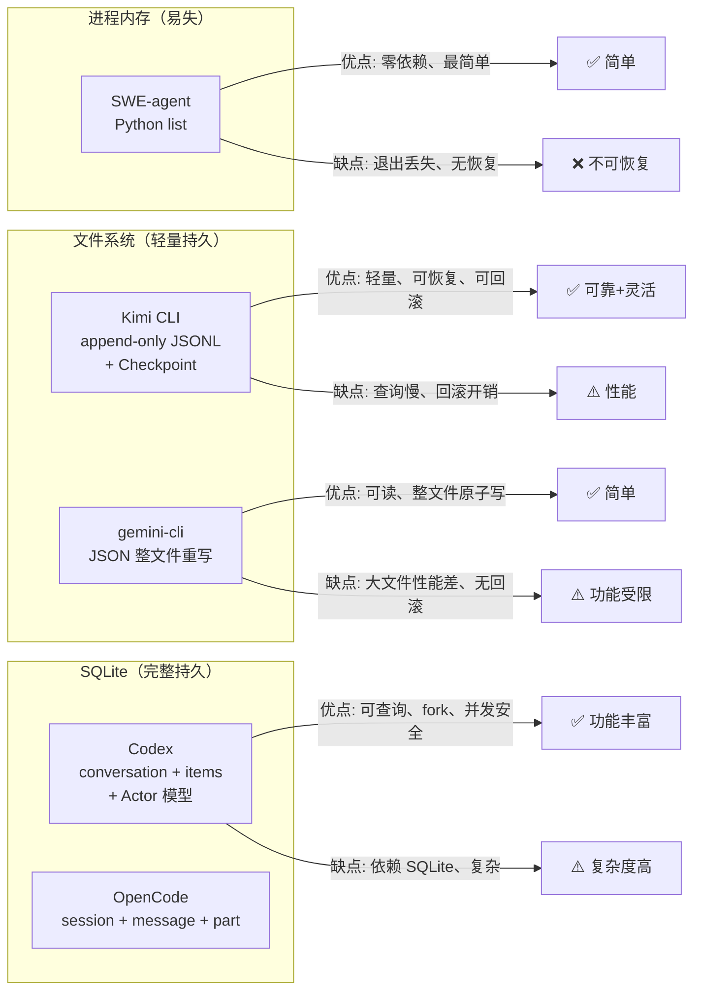

| 项目 | Session 存储方式 | 恢复机制 | 回滚能力 | 核心差异 |
|-----|-----------------|---------|---------|---------|
| **Kimi CLI** | append-only JSONL（目录隔离） | `--continue` 恢复 | Checkpoint 回滚 | 支持回滚、metadata 轻量索引 |
| **Gemini CLI** | JSON 文件（项目隔离） | `/resume` 命令 | 不支持 | 整文件重写、时间戳命名 |
| **Codex** | SQLite + Rollout JSONL | `resume`/`fork` | 基于事件回放 | Actor 模型、事件溯源 |
| **OpenCode** | SQLite 三层结构 | `Session.create({fork})` | fork 分支 | Part 级细粒度 |
| **SWE-agent** | Python list（内存） | 不支持 | 不支持 | 学术场景、简单透明 |

**对比维度详解**：

1. **Session 存储方式**：
   - Kimi CLI：append-only JSONL，支持 Checkpoint 元数据
   - Gemini CLI：JSON 整文件，读取-修改-写入模式
   - Codex：SQLite + JSONL 事件流，Actor 模型并发安全
   - OpenCode：SQLite 三层结构（Session/Message/Part）
   - SWE-agent：内存 list，无持久化

2. **恢复机制**：
   - Kimi CLI：基于文件重建内存状态，支持 Checkpoint 回滚
   - Gemini CLI：完整历史恢复，支持工作区目录恢复
   - Codex：支持 resume 和 fork 两种模式
   - OpenCode：支持 fork 创建分支会话
   - SWE-agent：不支持

3. **回滚能力**：
   - Kimi CLI：Checkpoint 机制，可回滚到任意步骤
   - 其他项目：Gemini CLI 和 Codex 不支持中间状态回滚

---

## 7. 边界情况与错误处理

### 7.1 终止条件

| 终止原因 | 触发条件 | 代码位置 |
|---------|---------|---------|
| 会话正常结束 | 用户退出或任务完成 | `_post_run()` 处理 |
| 空会话删除 | `is_empty()` 返回 True | `session.py:49`、`cli/__init__.py:544` |
| 会话查找失败 | 目录或文件不存在 | `session.py:157-166` |
| Checkpoint 无效 | checkpoint_id >= next_checkpoint_id | `context.py:95-97` |
| 文件轮转失败 | 无可用路径 | `context.py:100-103` |

### 7.2 资源限制

```python
# kimi-cli/src/kimi_cli/soul/context.py:99-104
rotated_file_path = await next_available_rotation(self._file_backend)
if rotated_file_path is None:
    logger.error("No available rotation path found")
    raise RuntimeError("No available rotation path found")
```

### 7.3 错误恢复策略

| 错误类型 | 处理策略 | 代码位置 |
|---------|---------|---------|
| 会话不存在 | 创建新会话（指定 ID 时） | `cli/__init__.py:466-470` |
| 无上次会话 | 抛出 BadParameter | `cli/__init__.py:474-478` |
| Checkpoint 不存在 | 抛出 ValueError | `context.py:95-97` |
| 文件轮转失败 | 抛出 RuntimeError | `context.py:100-103` |
| 旧格式迁移 | 自动迁移到新目录 | `session.py:252-262` |

### 7.4 旧格式兼容

```python
# kimi-cli/src/kimi_cli/session.py:252-262
def _migrate_session_context_file(work_dir_meta: WorkDirMeta, session_id: str) -> None:
    old_context_file = work_dir_meta.sessions_dir / f"{session_id}.jsonl"
    new_context_file = work_dir_meta.sessions_dir / session_id / "context.jsonl"
    if old_context_file.exists() and not new_context_file.exists():
        new_context_file.parent.mkdir(parents=True, exist_ok=True)
        old_context_file.rename(new_context_file)
        logger.info(
            "Migrated session context file from {old} to {new}",
            old=old_context_file,
            new=new_context_file,
        )
```

---

## 8. 关键代码索引

| 功能 | 文件 | 行号 | 说明 |
|-----|------|------|------|
| Session 定义 | `kimi-cli/src/kimi_cli/session.py` | 20 | Session dataclass |
| Session 创建 | `kimi-cli/src/kimi_cli/session.py` | 86 | `create()` 方法 |
| Session 查找 | `kimi-cli/src/kimi_cli/session.py` | 139 | `find()` 方法 |
| 继续上次会话 | `kimi-cli/src/kimi_cli/session.py` | 231 | `continue_()` 方法 |
| 空会话检查 | `kimi-cli/src/kimi_cli/session.py` | 49 | `is_empty()` 方法 |
| 会话删除 | `kimi-cli/src/kimi_cli/session.py` | 58 | `delete()` 方法 |
| 标题刷新 | `kimi-cli/src/kimi_cli/session.py` | 65 | `refresh()` 方法 |
| 旧格式迁移 | `kimi-cli/src/kimi_cli/session.py` | 252 | `_migrate_session_context_file()` |
| Context 定义 | `kimi-cli/src/kimi_cli/soul/context.py` | 16 | Context 类 |
| Context 恢复 | `kimi-cli/src/kimi_cli/soul/context.py` | 24 | `restore()` 方法 |
| Checkpoint 创建 | `kimi-cli/src/kimi_cli/soul/context.py` | 68 | `checkpoint()` 方法 |
| Checkpoint 回滚 | `kimi-cli/src/kimi_cli/soul/context.py` | 80 | `revert_to()` 方法 |
| 消息追加 | `kimi-cli/src/kimi_cli/soul/context.py` | 162 | `append_message()` 方法 |
| Token 更新 | `kimi-cli/src/kimi_cli/soul/context.py` | 171 | `update_token_count()` 方法 |
| WireFile 定义 | `kimi-cli/src/kimi_cli/wire/file.py` | 59 | WireFile 类 |
| WireFile 读取 | `kimi-cli/src/kimi_cli/wire/file.py` | 95 | `iter_records()` 方法 |
| Metadata 定义 | `kimi-cli/src/kimi_cli/metadata.py` | 42 | Metadata 类 |
| WorkDirMeta 定义 | `kimi-cli/src/kimi_cli/metadata.py` | 20 | WorkDirMeta 类 |
| sessions_dir | `kimi-cli/src/kimi_cli/metadata.py` | 33 | 会话目录定位 |
| CLI 入口 | `kimi-cli/src/kimi_cli/cli/__init__.py` | 457 | `_run()` 函数 |
| 收尾处理 | `kimi-cli/src/kimi_cli/cli/__init__.py` | 528 | `_post_run()` 函数 |

---

## 9. 延伸阅读

- 概览：`01-kimi-cli-overview.md`
- CLI Entry：`02-kimi-cli-cli-entry.md`
- Agent Loop：`04-kimi-cli-agent-loop.md`
- Checkpoint 深度分析：`docs/kimi-cli/questions/kimi-cli-checkpoint-implementation.md`
- 跨项目对比：`docs/comm/03-comm-session-runtime.md`

---

*✅ Verified: 基于 kimi-cli/src/kimi_cli/session.py、kimi-cli/src/kimi_cli/soul/context.py 等源码分析*
*基于版本：2026-02-08 | 最后更新：2026-02-24*
