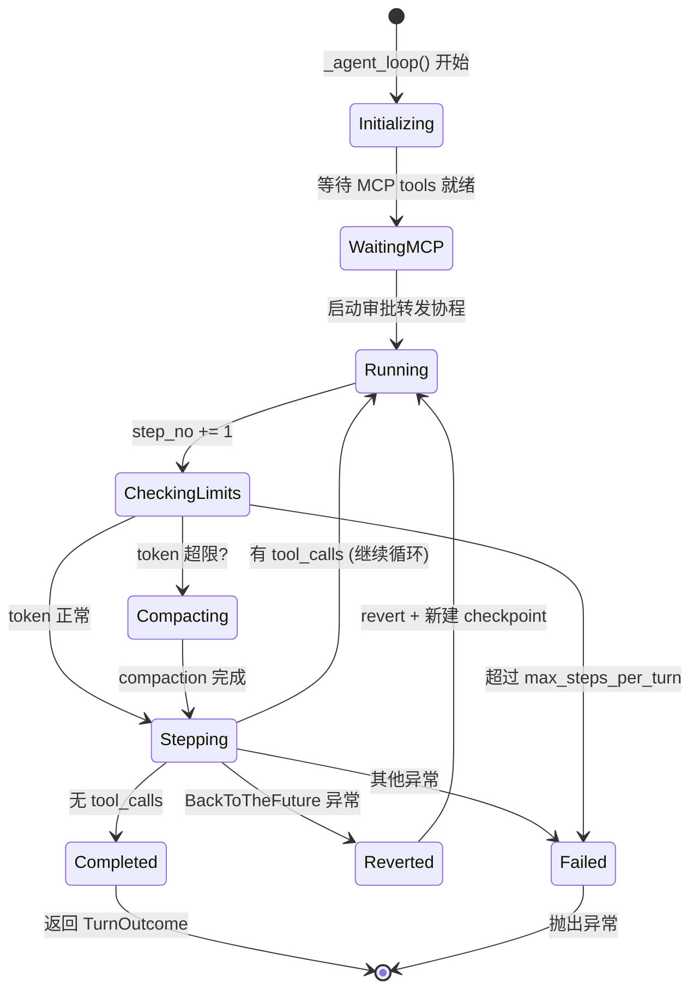
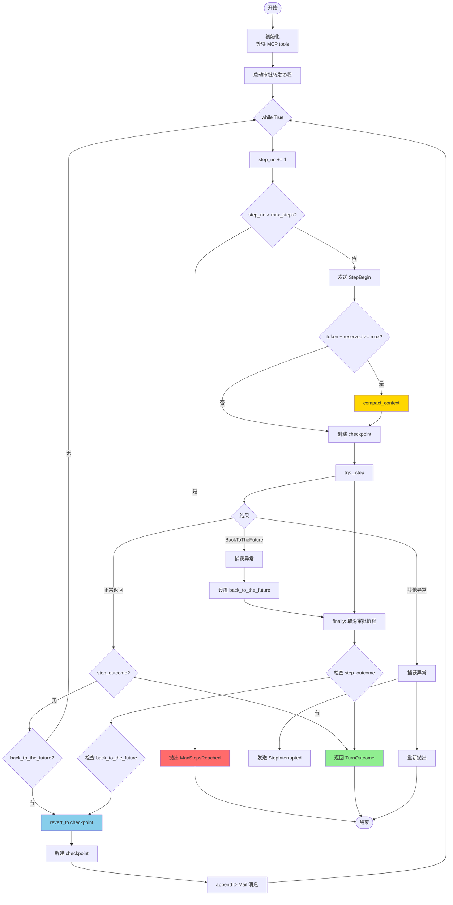
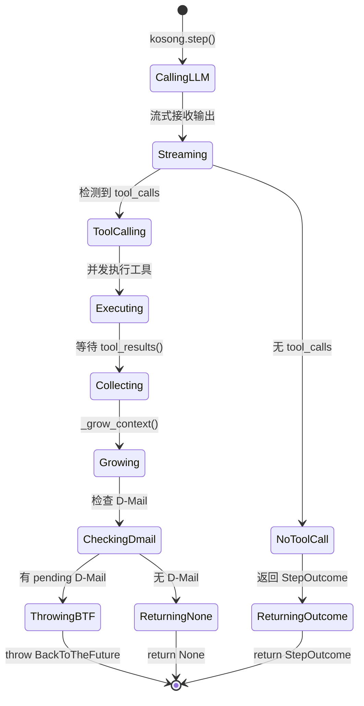
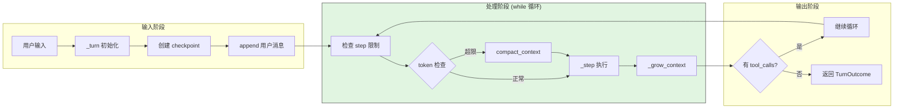
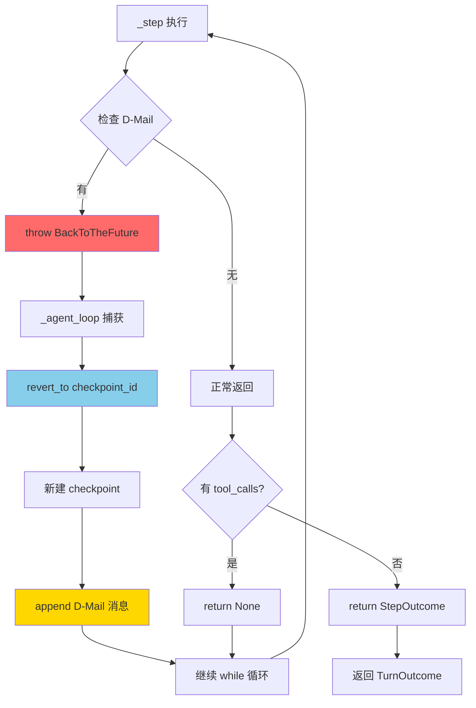
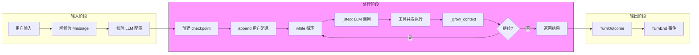
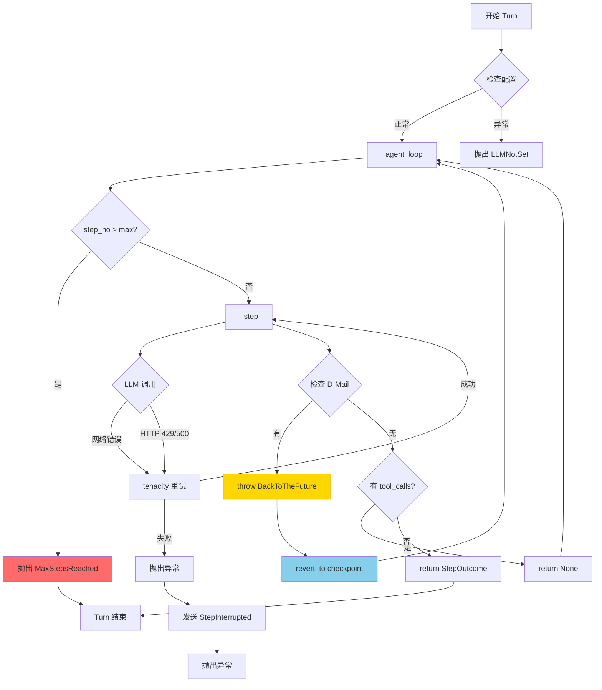
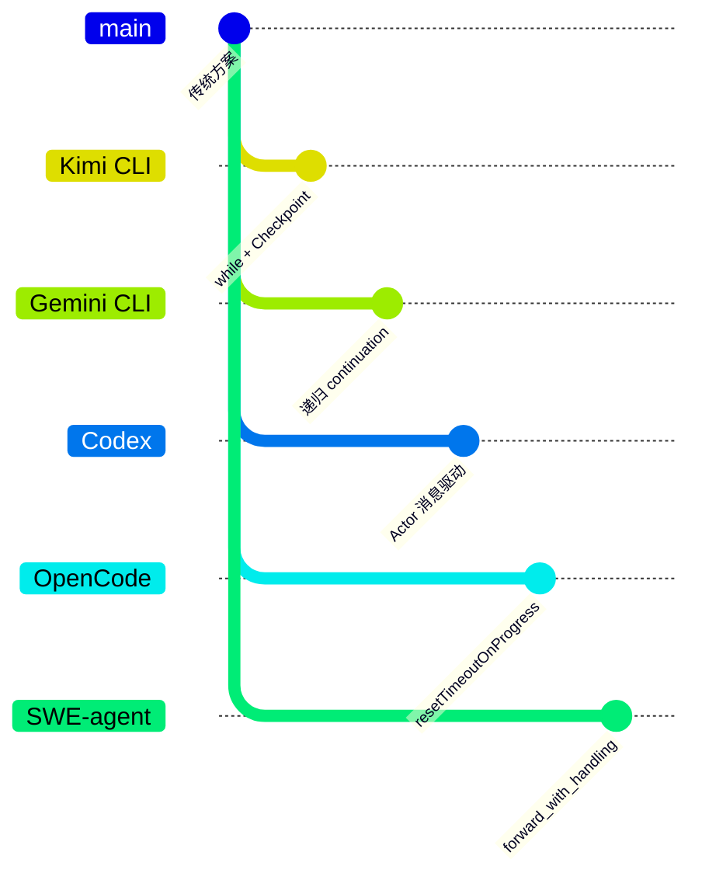

# Agent Loop（Kimi CLI）

## TL;DR（结论先行）

一句话定义：Agent Loop 是驱动多轮 LLM 调用与工具执行的循环控制机制，让模型从"一次性回答"变成"多轮迭代执行"。

Kimi CLI 的核心取舍：**命令式 while 循环 + Checkpoint 回滚机制**（对比 Gemini CLI 的递归 continuation、Codex 的 Actor 消息驱动）

---

## 1. 为什么需要这个机制？（解决什么问题）

### 1.1 问题场景

没有 Agent Loop：用户问"修复这个 bug" → LLM 一次回答 → 结束（可能根本没看文件）

有 Agent Loop：
- LLM: "先读文件" → 执行 `read_file` → 得到文件内容
- LLM: "再跑测试" → 执行 `run_test` → 得到测试结果
- LLM: "修改第 42 行" → 执行 `write_file` → 成功

### 1.2 核心挑战

| 挑战 | 不解决的后果 |
|-----|-------------|
| 循环驱动 | 无法自动继续下一轮推理 |
| 工具执行编排 | 多个工具并发/串行执行混乱 |
| 状态管理 | 工具执行状态丢失或冲突 |
| 终止条件 | 无限循环导致资源耗尽 |
| 上下文回滚 | 错误决策无法撤销，导致连锁错误 |

---

## 2. 整体架构

### 2.1 在系统中的位置

```text
┌─────────────────────────────────────────────────────────────┐
│ CLI 入口 / Session Runtime                                   │
│ src/kimi_cli/cli/__init__.py:457                             │
└───────────────────────┬─────────────────────────────────────┘
                        │ 用户输入
                        ▼
┌─────────────────────────────────────────────────────────────┐
│ ▓▓▓ Agent Loop ▓▓▓                                          │
│ src/kimi_cli/soul/kimisoul.py                                │
│ - run()      : 单次 Turn 入口                               │
│ - _turn()    : Checkpoint + 用户消息处理                     │
│ - _agent_loop(): 核心 while 循环（step 计数、compaction）    │
│ - _step()    : 单次 LLM 调用 + 工具执行                      │
└───────────────────────┬─────────────────────────────────────┘
                        │
        ┌───────────────┼───────────────┐
        ▼               ▼               ▼
┌──────────────┐ ┌──────────────┐ ┌──────────────┐
│ LLM API      │ │ Tool System  │ │ Context      │
│ kosong       │ │ 工具执行     │ │ 状态管理     │
│              │ │              │ │ (Checkpoint) │
└──────────────┘ └──────────────┘ └──────────────┘
```

### 2.2 核心组件职责

| 组件 | 职责 | 代码位置 |
|-----|------|---------|
| `KimiSoul` | Agent Loop 主控器，管理 Turn 生命周期 | `src/kimi_cli/soul/kimisoul.py:158` |
| `run()` | 用户输入入口，分发到标准 Turn 或 Ralph 模式 | `src/kimi_cli/soul/kimisoul.py:182` |
| `_turn()` | 单次 Turn 初始化，创建 Checkpoint | `src/kimi_cli/soul/kimisoul.py:210` |
| `_agent_loop()` | 核心 while 循环，控制 step 执行 | `src/kimi_cli/soul/kimisoul.py:302` |
| `_step()` | 单次 LLM 调用 + 工具执行 | `src/kimi_cli/soul/kimisoul.py:382` |
| `_grow_context()` | 上下文增长，受 shield 保护 | `src/kimi_cli/soul/kimisoul.py:457` |
| `FlowRunner` | Ralph 自动循环模式 | `src/kimi_cli/soul/kimisoul.py:542` |

### 2.3 核心组件交互关系

```mermaid
sequenceDiagram
    autonumber
    participant UI as UI (Wire)
    participant Run as KimiSoul.run()
    participant Turn as _turn()
    participant Loop as _agent_loop()
    participant Step as _step()
    participant LLM as kosong (LLM)
    participant Tool as Tool System

    UI->>Run: 1. 用户输入
    Run->>Run: 2. 刷新 OAuth token
    Run->>UI: 3. TurnBegin 事件

    alt Ralph 模式
        Run->>Run: 4a. FlowRunner.ralph_loop()
    else 标准模式
        Run->>Turn: 4b. _turn(user_message)
        Turn->>Turn: 5. 创建 checkpoint
        Turn->>Turn: 6. append 用户消息
        Turn->>Loop: 7. _agent_loop()

        Loop->>Loop: 8. 启动审批转发协程
        Loop->>Loop: 9. step_no += 1
        Loop->>Loop: 10. 检查 max_steps_per_turn
        Loop->>UI: 11. StepBegin 事件

        alt 需要 compaction
            Loop->>Loop: 12a. compact_context()
        end

        Loop->>Step: 13. _step()
        Step->>LLM: 14. kosong.step()
        LLM-->>Step: 15. StepResult (流式)
        Step->>Tool: 16. 并发执行工具
        Tool-->>Step: 17. ToolResult[]
        Step->>Step: 18. _grow_context()

        alt 有 D-Mail
            Step-->>Loop: 19a. throw BackToTheFuture
            Loop->>Loop: 20a. revert_to(checkpoint_id)
        else 无 tool_calls
            Step-->>Loop: 19b. StepOutcome
            Loop-->>Turn: 20b. TurnOutcome
        else 有 tool_calls
            Step-->>Loop: 19c. None (继续循环)
        end
    end

    Turn-->>Run: 21. Turn 完成
    Run->>UI: 22. TurnEnd 事件
```

**关键交互说明**：

| 步骤 | 交互内容 | 设计意图 |
|-----|---------|---------|
| 1 | 用户输入触发 | 支持字符串或 ContentPart 列表 |
| 4a/4b | 模式分支 | Ralph 模式用于自动迭代，标准模式用于单轮对话 |
| 5 | Checkpoint 创建 | 提供可回滚的状态快照 |
| 8 | 审批转发协程 | 解耦工具审批与 UI 展示，支持异步审批 |
| 12a | Context Compaction | 自动压缩上下文防止 token 超限 |
| 19a | BackToTheFuture 异常 | 通过异常机制实现上下文回滚 |
| 18 | shield 保护 | 即使外层中断，上下文增长也能完成 |

---

## 3. 核心组件详细分析

### 3.1 `_agent_loop()` 内部结构

#### 职责定位

`_agent_loop()` 是 Kimi CLI Agent Loop 的核心，负责在一个 Turn 内循环执行多个 Step，直到满足终止条件。

#### 状态机图



**状态说明**：

| 状态 | 说明 | 进入条件 | 退出条件 |
|-----|------|---------|---------|
| Initializing | 初始化阶段 | _agent_loop() 被调用 | MCP tools 就绪 |
| WaitingMCP | 等待 MCP | 使用 KimiToolset | tools 就绪 |
| Running | 主循环运行 | 初始化完成 | step 完成或异常 |
| CheckingLimits | 检查限制 | 每次循环开始 | 通过检查 |
| Compacting | 上下文压缩 | token 接近上限 | 压缩完成 |
| Stepping | 执行 step | 通过前置检查 | step 完成 |
| Reverted | 回滚状态 | 捕获 BackToTheFuture | 重建 checkpoint |
| Completed | 完成 | 无 tool_calls | 返回结果 |
| Failed | 失败 | 异常发生 | 抛出异常 |

#### 内部数据流

```text
┌─────────────────────────────────────────────────────────────┐
│  输入层                                                      │
│  ├── 前置条件检查 ──► MCP 就绪检查                           │
│  └── 配置参数   ──► max_steps, reserved_context             │
└──────────────────────────┬──────────────────────────────────┘
                           ▼
┌─────────────────────────────────────────────────────────────┐
│  处理层 (while 循环)                                         │
│  ├── 步骤计数器: step_no += 1                                │
│  ├── 限制检查:  max_steps_per_turn                           │
│  ├── 事件通知:  StepBegin                                    │
│  ├── Token 检查: context.token_count + reserved              │
│  ├── Compaction: 必要时压缩上下文                            │
│  ├── Checkpoint: 保存当前状态                                │
│  └── Step 执行: _step()                                      │
│      ├── 正常返回 ──► 判断继续/结束                          │
│      ├── BackToTheFuture ──► 回滚处理                        │
│      └── 其他异常 ──► 中断处理                               │
└──────────────────────────┬──────────────────────────────────┘
                           ▼
┌─────────────────────────────────────────────────────────────┐
│  输出层                                                      │
│  ├── 成功: TurnOutcome (stop_reason, step_count)            │
│  ├── 回滚: 重建 checkpoint + 注入消息                        │
│  └── 失败: 异常上抛 + StepInterrupted 事件                   │
└─────────────────────────────────────────────────────────────┘
```

#### 关键算法逻辑



**算法要点**：

1. **双层循环结构**：外层 `_turn()` 管理对话周期，内层 `_agent_loop()` 管理单次任务的多个 step
2. **显式 step 计数**：防止无限循环，可配置上限（默认 100）
3. **Compaction 前置检查**：在调用 LLM 前压缩上下文，避免 token 超限
4. **异常驱动回滚**：使用 BackToTheFuture 异常实现非局部控制流转移

#### 关键接口

| 接口 | 输入 | 输出 | 说明 | 代码位置 |
|-----|------|------|------|---------|
| `_agent_loop()` | - | `TurnOutcome` | 核心循环方法 | `kimisoul.py:302` |
| `wait_for_mcp_tools()` | - | - | 等待 MCP 就绪 | `kimisoul.py:306` |
| `_pipe_approval_to_wire()` | - | - | 审批转发协程 | `kimisoul.py:308` |
| `compact_context()` | - | - | 上下文压缩 | `kimisoul.py:480` |
| `_checkpoint()` | - | `checkpoint_id` | 创建检查点 | `kimisoul.py:347` |

---

### 3.2 `_step()` 内部结构

#### 职责定位

`_step()` 负责执行单次 LLM 调用，处理流式输出，并发执行工具调用，并更新上下文。

#### 状态机图



#### 关键调用链

```text
_agent_loop()                    [kimisoul.py:302]
  -> _step()                     [kimisoul.py:382]
    -> _kosong_step_with_retry() [kimisoul.py:395]
      -> kosong.step()           [kosong 库]
        - 调用 LLM API
        - 流式处理输出
        - 触发工具调用
    -> result.tool_results()     [kimisoul.py:416]
      - 等待所有工具完成
    -> _grow_context()           [kimisoul.py:420]
      - append assistant message
      - append tool messages
      - 更新 token count
    -> _denwa_renji.fetch_pending_dmail() [kimisoul.py:428]
      - 检查是否有 D-Mail
    -> raise BackToTheFuture     [kimisoul.py:434]
      - 触发上下文回滚
```

---

### 3.3 组件间协作时序

展示 `_agent_loop()` 与 `_step()`、Context、Tool System 如何协作完成一个完整操作。

```mermaid
sequenceDiagram
    participant Loop as _agent_loop()
    participant Context as Context (Checkpoint)
    participant Step as _step()
    participant LLM as kosong (LLM)
    participant Tool as Tool System
    participant Denwa as DenwaRenji

    Loop->>Loop: step_no += 1
    Loop->>Loop: 检查 max_steps_per_turn

    alt token 超限
        Loop->>Context: clear()
        Loop->>Context: _checkpoint()
        Loop->>Context: append_message(compacted)
    end

    Loop->>Context: _checkpoint()
    Context-->>Loop: checkpoint_id

    Loop->>Step: _step()
    activate Step

    Step->>LLM: kosong.step()
    activate LLM
    LLM-->>Step: 流式 message parts
    LLM-->>Step: StepResult
    deactivate LLM

    Step->>Tool: result.tool_results()
    activate Tool
    Tool-->>Step: List[ToolResult]
    deactivate Tool

    Step->>Context: _grow_context()
    activate Context
    Context->>Context: append_message(result.message)
    Context->>Context: update_token_count()
    Context->>Context: append_message(tool_messages)
    deactivate Context

    Step->>Denwa: fetch_pending_dmail()
    Denwa-->>Step: D-Mail | None

    alt 有 D-Mail
        Step-->>Loop: throw BackToTheFuture
        Loop->>Context: revert_to(checkpoint_id)
        Loop->>Context: _checkpoint()
        Loop->>Context: append_message(D-Mail)
    else 无 tool_calls
        Step-->>Loop: return StepOutcome
    else 有 tool_calls
        Step-->>Loop: return None
    end

    deactivate Step
```

**协作要点**：

1. **Loop 与 Context**：Loop 负责决策何时 checkpoint，Context 负责实际状态管理
2. **Step 与 Tool**：工具并发执行，结果统一收集
3. **Step 与 DenwaRenji**：D-Mail 检查是 step 的最后一步，决定是否回滚
4. **异常控制流**：BackToTheFuture 异常跨越正常返回路径，实现非局部跳转

---

### 3.4 关键数据路径

#### 主路径（正常流程）



#### 异常路径（D-Mail 回滚）



---

## 4. 端到端数据流转

### 4.1 正常流程（详细版）

```mermaid
sequenceDiagram
    participant U as 用户
    participant Run as KimiSoul.run()
    participant Turn as _turn()
    participant Loop as _agent_loop()
    participant Step as _step()
    participant LLM as kosong
    participant Tool as Tool System
    participant Context as Context

    U->>Run: 输入: "修复这个 bug"
    Run->>Run: 刷新 OAuth token
    Run->>U: TurnBegin 事件

    Run->>Turn: _turn(user_message)
    Turn->>Turn: 校验 LLM 配置
    Turn->>Context: _checkpoint() → checkpoint 0
    Turn->>Context: append_message(user_message)
    Turn->>Loop: _agent_loop()

    Note over Loop: Step 1
    Loop->>Loop: step_no = 1
    Loop->>U: StepBegin(n=1)
    Loop->>Step: _step()

    Step->>LLM: kosong.step()
    LLM-->>Step: "让我先查看文件"
    LLM-->>Step: tool_call: read_file
    Step->>Tool: 执行 read_file
    Tool-->>Step: 文件内容
    Step->>Context: _grow_context()
    Step-->>Loop: return None (有 tool_calls)

    Note over Loop: Step 2
    Loop->>Loop: step_no = 2
    Loop->>U: StepBegin(n=2)
    Loop->>Step: _step()

    Step->>LLM: kosong.step()
    LLM-->>Step: "找到问题了，让我修复"
    LLM-->>Step: tool_call: write_file
    Step->>Tool: 执行 write_file
    Tool-->>Step: 成功
    Step->>Context: _grow_context()
    Step-->>Loop: return None (有 tool_calls)

    Note over Loop: Step 3
    Loop->>Loop: step_no = 3
    Loop->>U: StepBegin(n=3)
    Loop->>Step: _step()

    Step->>LLM: kosong.step()
    LLM-->>Step: "已修复，请验证"
    Step->>Context: _grow_context()
    Step-->>Loop: return StepOutcome(no_tool_calls)

    Loop-->>Turn: return TurnOutcome
    Turn-->>Run: Turn 完成
    Run->>U: TurnEnd 事件
```

**数据变换详情**：

| 阶段 | 输入 | 处理 | 输出 | 代码位置 |
|-----|------|------|------|---------|
| 接收 | 用户输入字符串 | 解析为 Message | `Message(role="user")` | `kimisoul.py:187` |
| Turn 初始化 | 用户 Message | 校验 + checkpoint | checkpoint 0 | `kimisoul.py:210-218` |
| Step 执行 | context.history | LLM 推理 | `StepResult` | `kimisoul.py:397` |
| 工具执行 | tool_calls | 并发执行 | `List[ToolResult]` | `kimisoul.py:416` |
| 上下文增长 | StepResult + ToolResults | append messages | 更新后的 context | `kimisoul.py:420` |
| Turn 结束 | StepOutcome | 组装结果 | `TurnOutcome` | `kimisoul.py:371` |

### 4.2 数据流向图



### 4.3 异常/边界流程



---

## 5. 关键代码实现

### 5.1 核心数据结构

```python
# src/kimi_cli/config.py:68-84
class LoopControl(BaseModel):
    """Agent loop control configuration."""

    max_steps_per_turn: int = Field(
        default=100,
        ge=1,
        validation_alias=AliasChoices("max_steps_per_turn", "max_steps_per_run"),
    )
    """Maximum number of steps in one turn"""
    max_retries_per_step: int = Field(default=3, ge=1)
    """Maximum number of retries in one step"""
    max_ralph_iterations: int = Field(default=0, ge=-1)
    """Extra iterations after the first turn in Ralph mode. Use -1 for unlimited."""
    reserved_context_size: int = Field(default=50_000, ge=1000)
    """Reserved token count for LLM response generation."""
```

**字段说明**：

| 字段 | 类型 | 用途 |
|-----|------|------|
| `max_steps_per_turn` | `int` | 单个 turn 的 step 上限，防止失控循环（默认 100） |
| `max_retries_per_step` | `int` | step 内部 LLM 调用重试次数（默认 3） |
| `max_ralph_iterations` | `int` | Ralph 自动循环迭代次数（0 禁用，-1 无限） |
| `reserved_context_size` | `int` | 预留 token 空间，触发 compaction 的阈值缓冲（默认 50k） |

### 5.2 主链路代码

```python
# src/kimi_cli/soul/kimisoul.py:302-381
async def _agent_loop(self) -> TurnOutcome:
    """The main agent loop for one run."""
    assert self._runtime.llm is not None
    if isinstance(self._agent.toolset, KimiToolset):
        await self._agent.toolset.wait_for_mcp_tools()

    async def _pipe_approval_to_wire():
        while True:
            request = await self._approval.fetch_request()
            wire_request = ApprovalRequest(...)
            wire_send(wire_request)
            resp = await wire_request.wait()
            self._approval.resolve_request(request.id, resp)
            wire_send(ApprovalResponse(request_id=request.id, response=resp))

    step_no = 0
    while True:
        step_no += 1
        if step_no > self._loop_control.max_steps_per_turn:
            raise MaxStepsReached(self._loop_control.max_steps_per_turn)

        wire_send(StepBegin(n=step_no))
        approval_task = asyncio.create_task(_pipe_approval_to_wire())
        back_to_the_future: BackToTheFuture | None = None
        step_outcome: StepOutcome | None = None
        try:
            # compact the context if needed
            reserved = self._loop_control.reserved_context_size
            if self._context.token_count + reserved >= self._runtime.llm.max_context_size:
                logger.info("Context too long, compacting...")
                await self.compact_context()

            logger.debug("Beginning step {step_no}", step_no=step_no)
            await self._checkpoint()
            self._denwa_renji.set_n_checkpoints(self._context.n_checkpoints)
            step_outcome = await self._step()
        except BackToTheFuture as e:
            back_to_the_future = e
        except Exception:
            wire_send(StepInterrupted())
            raise
        finally:
            approval_task.cancel()
            with suppress(asyncio.CancelledError):
                try:
                    await approval_task
                except Exception:
                    logger.exception("Approval piping task failed")

        if step_outcome is not None:
            final_message = (
                step_outcome.assistant_message
                if step_outcome.stop_reason == "no_tool_calls"
                else None
            )
            return TurnOutcome(
                stop_reason=step_outcome.stop_reason,
                final_message=final_message,
                step_count=step_no,
            )

        if back_to_the_future is not None:
            await self._context.revert_to(back_to_the_future.checkpoint_id)
            await self._checkpoint()
            await self._context.append_message(back_to_the_future.messages)
```

**代码要点**：

1. **双层循环设计**：外层 `_turn()` 管对话周期，内层 `_agent_loop()` 管单次任务的多个 step
2. **显式 step 计数**：防止无限循环，可配置上限
3. **compaction 前置检查**：在调用 LLM 前压缩上下文，避免 token 超限
4. **shield 保护上下文增长**：`asyncio.shield(self._grow_context(...))` 确保即使外层中断，上下文也能正确更新
5. **异常驱动回滚**：BackToTheFuture 异常机制实现非局部控制流转移

### 5.3 关键调用链

```text
KimiSoul.run()                      [kimisoul.py:182]
  -> _turn()                        [kimisoul.py:210]
    -> _checkpoint()                [kimisoul.py:217]
    -> _context.append_message()    [kimisoul.py:218]
    -> _agent_loop()                [kimisoul.py:220]
      - step_no += 1                [kimisoul.py:331]
      - 检查 max_steps_per_turn     [kimisoul.py:332]
      - compact_context() (如需要)  [kimisoul.py:344]
      - _checkpoint()               [kimisoul.py:347]
      - _step()                     [kimisoul.py:349]
        -> kosong.step()            [kimisoul.py:397]
        -> result.tool_results()    [kimisoul.py:416]
        -> _grow_context()          [kimisoul.py:420]
          - append assistant msg    [kimisoul.py:470]
          - append tool msgs        [kimisoul.py:477]
        -> fetch_pending_dmail()    [kimisoul.py:428]
        -> raise BackToTheFuture    [kimisoul.py:434] (如有 D-Mail)
      - revert_to() (如捕获 BTF)    [kimisoul.py:378]
```

---

## 6. 设计意图与 Trade-off

### 6.1 Kimi CLI 的选择

| 维度 | Kimi CLI 的选择 | 替代方案 | 取舍分析 |
|-----|----------------|---------|---------|
| 循环结构 | while 迭代 | 递归 continuation | 简单直观易于调试，但状态管理需手动处理 |
| 状态回滚 | Checkpoint 文件 + revert | 无回滚（Codex）/ 内存快照 | 支持对话回滚，但文件副作用不自动回滚 |
| 并发执行 | 并发派发、顺序收集 | 完全并行 | 工具触发可以并发，但结果按序注入保持确定性 |
| 流式处理 | 回调式 (on_message_part) | 生成器/迭代器 | 与 kosong 库深度集成，但耦合度较高 |
| 审批机制 | 独立协程转发 | 同步阻塞等待 | 非阻塞设计，支持异步 UI 交互 |
| 错误恢复 | tenacity 指数退避重试 | 立即失败/固定间隔重试 | 自适应退避，但增加整体延迟 |

### 6.2 为什么这样设计？

**核心问题**：如何在保证执行可控性的同时，支持复杂的对话回滚和自动化任务？

**Kimi CLI 的解决方案**：

- **代码依据**：`kimisoul.py:302-381`
- **设计意图**：
  1. **Checkpoint 机制**：通过显式的 checkpoint 创建和 revert 操作，实现对话状态的精确回滚
  2. **D-Mail 机制**：通过异常驱动的"时间旅行"，让模型能够"看到未来"并改变决策
  3. **Ralph 模式**：通过 FlowRunner 动态构造流程图，实现自动化的多轮迭代

- **带来的好处**：
  - 可以撤销错误的决策路径，避免连锁错误
  - 支持复杂的自动化工作流（Ralph 模式）
  - 上下文压缩保证长对话不中断
  - 工具审批与执行解耦，支持异步交互

- **付出的代价**：
  - Checkpoint 只回滚对话状态，不回滚文件系统副作用
  - while 循环结构在极端复杂场景下可能难以追踪状态
  - D-Mail 机制依赖异常，控制流不够直观

### 6.3 与其他项目的对比



| 项目 | 核心差异 | 适用场景 |
|-----|---------|---------|
| **Kimi CLI** | while 循环 + Checkpoint 回滚 + D-Mail 时间旅行 | 需要对话回滚、复杂自动化任务 |
| **Gemini CLI** | 递归 continuation + Scheduler 状态机 | 复杂工具编排、需要精细状态管理 |
| **Codex** | Actor 消息驱动 + Task 生命周期管理 | 企业级安全、需要中断/取消支持 |
| **OpenCode** | resetTimeoutOnProgress + 流式处理 | 长运行任务、需要超时保护 |
| **SWE-agent** | forward_with_handling + autosubmit | 错误恢复、自动提交工作流 |

**详细对比分析**：

| 对比维度 | Kimi CLI | Gemini CLI | Codex | SWE-agent |
|---------|----------|-----------|-------|-----------|
| **循环模式** | while 迭代 | 递归 continuation | Actor 消息循环 | 函数式循环 |
| **状态持久化** | Checkpoint 文件 | 内存状态 | Task 状态机 | 内存 + 日志 |
| **回滚机制** | D-Mail + revert | 无 | 无 | 无 |
| **工具并发** | 并发派发、顺序收集 | Scheduler 状态机 | 并发执行 | 顺序执行 |
| **流式处理** | 回调式 | 事件驱动 | 流式事件 | 阻塞式 |
| **错误恢复** | tenacity 重试 | 递归重试 | 指数退避 | forward_with_handling |
| **自动化模式** | Ralph 自动循环 | 手动 continuation | 无 | autosubmit |

---

## 7. 边界情况与错误处理

### 7.1 终止条件

| 终止原因 | 触发条件 | 代码位置 |
|---------|---------|---------|
| 无 tool_calls | LLM 响应不包含工具调用 | `kimisoul.py:453-455` |
| tool_rejected | 工具审批被拒绝 | `kimisoul.py:422-425` |
| 达到 max_steps | step_no > max_steps_per_turn | `kimisoul.py:332-333` |
| BackToTheFuture | D-Mail 触发回滚（继续执行） | `kimisoul.py:377-380` |
| 异常中断 | 网络错误、LLM 错误等 | `kimisoul.py:352-356` |

### 7.2 超时/资源限制

```python
# src/kimi_cli/config.py:71-83
max_steps_per_turn: int = Field(default=100, ge=1)
max_retries_per_step: int = Field(default=3, ge=1)
reserved_context_size: int = Field(default=50_000, ge=1000)
```

```python
# src/kimi_cli/soul/kimisoul.py:388-394
@tenacity.retry(
    retry=retry_if_exception(self._is_retryable_error),
    before_sleep=partial(self._retry_log, "step"),
    wait=wait_exponential_jitter(initial=0.3, max=5, jitter=0.5),
    stop=stop_after_attempt(self._loop_control.max_retries_per_step),
    reraise=True,
)
```

### 7.3 错误恢复策略

| 错误类型 | 处理策略 | 代码位置 |
|---------|---------|---------|
| 网络/超时/空响应 | tenacity 指数退避重试 | `kimisoul.py:510-511` |
| HTTP 429/500/502/503 | tenacity 指数退避重试 | `kimisoul.py:512-517` |
| LLM 配置错误 | 立即抛出 LLMNotSet | `kimisoul.py:211-212` |
| 模型不支持 | 抛出 LLMNotSupported | `kimisoul.py:214-215` |
| step 异常 | 发送 StepInterrupted 后抛出 | `kimisoul.py:354-356` |

---

## 8. 关键代码索引

| 功能 | 文件 | 行号 | 说明 |
|-----|------|------|------|
| 入口 | `src/kimi_cli/soul/kimisoul.py` | 182 | `run()` 方法，用户输入入口 |
| 核心 | `src/kimi_cli/soul/kimisoul.py` | 302 | `_agent_loop()` 核心 while 循环 |
| Step | `src/kimi_cli/soul/kimisoul.py` | 382 | `_step()` 单次 LLM 调用 |
| Turn | `src/kimi_cli/soul/kimisoul.py` | 210 | `_turn()` Turn 初始化 |
| 上下文增长 | `src/kimi_cli/soul/kimisoul.py` | 457 | `_grow_context()` 更新上下文 |
| Compaction | `src/kimi_cli/soul/kimisoul.py` | 480 | `compact_context()` 压缩上下文 |
| Ralph 模式 | `src/kimi_cli/soul/kimisoul.py` | 555 | `ralph_loop()` 自动循环 |
| Flow 执行 | `src/kimi_cli/soul/kimisoul.py` | 594 | `FlowRunner.run()` 流程执行 |
| 配置 | `src/kimi_cli/config.py` | 68 | `LoopControl` 循环控制配置 |
| BackToTheFuture | `src/kimi_cli/soul/kimisoul.py` | 531 | 异常类定义 |
| 重试逻辑 | `src/kimi_cli/soul/kimisoul.py` | 388 | tenacity 重试装饰器 |
| 可重试错误 | `src/kimi_cli/soul/kimisoul.py` | 509 | `_is_retryable_error()` |

---

## 9. 延伸阅读

- 前置知识：`docs/kimi-cli/01-kimi-cli-overview.md`
- 相关机制：
  - Checkpoint 机制：`docs/kimi-cli/questions/kimi-cli-checkpoint-implementation.md`
  - Context Compaction：`docs/kimi-cli/07-kimi-cli-memory-context.md`
  - Tool System：`docs/kimi-cli/06-kimi-cli-mcp-integration.md`
- 跨项目对比：
  - Codex Agent Loop：`docs/codex/04-codex-agent-loop.md`
  - Gemini CLI Agent Loop：`docs/gemini-cli/04-gemini-cli-agent-loop.md`

---

*✅ Verified: 基于 kimi-cli/src/kimi_cli/soul/kimisoul.py:182-540 等源码分析*

*基于版本：kimi-cli (2026-02-08) | 最后更新：2026-02-24*
