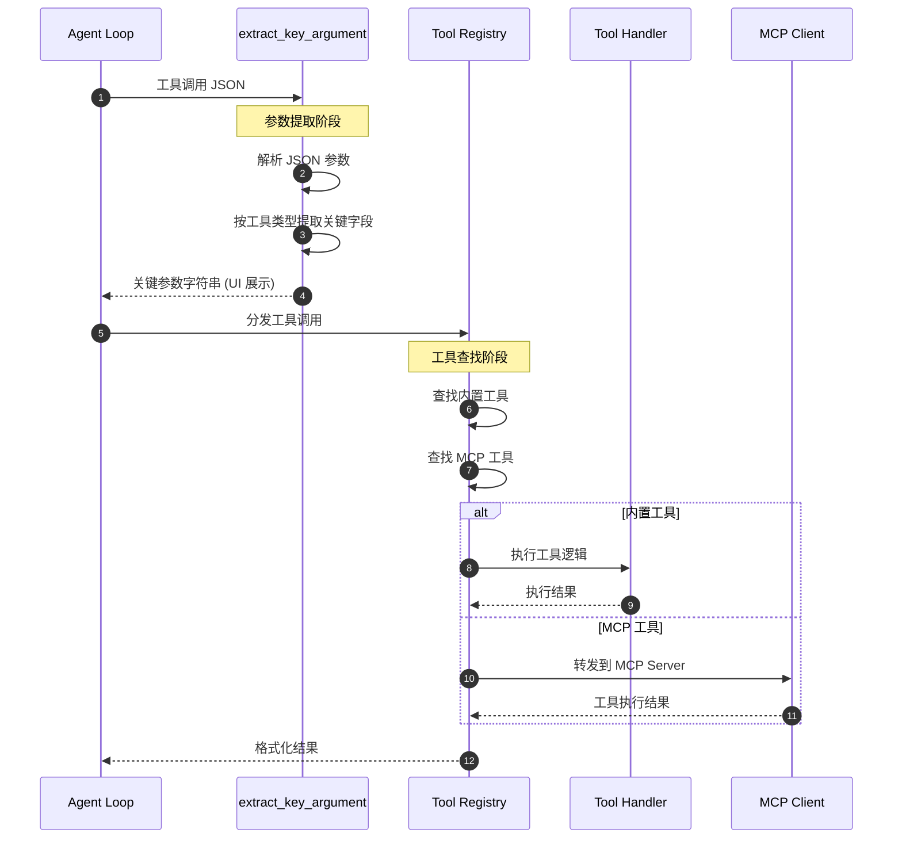
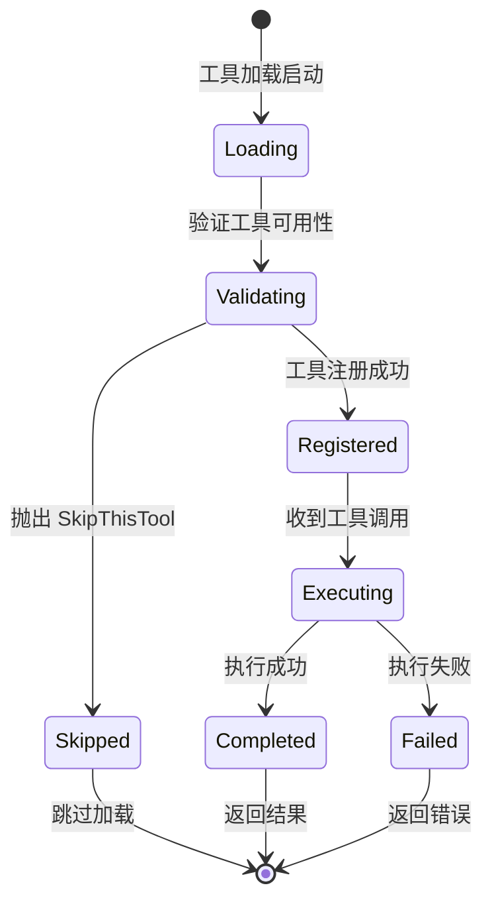
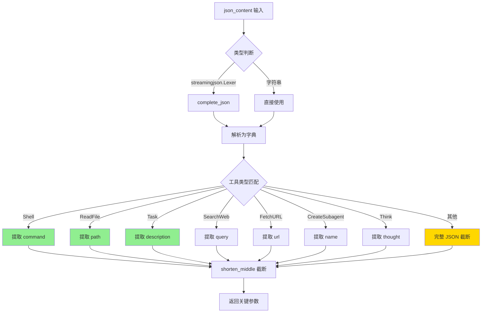
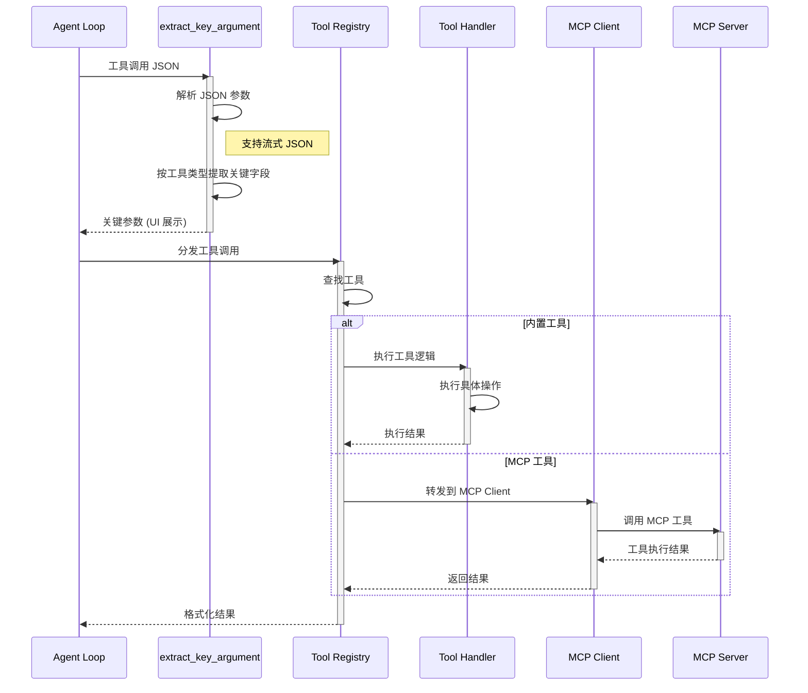
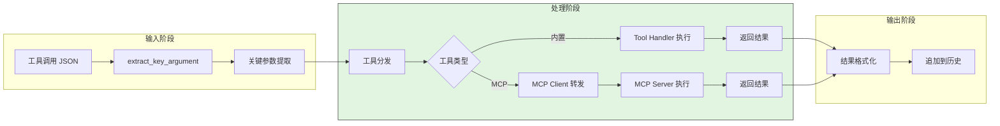
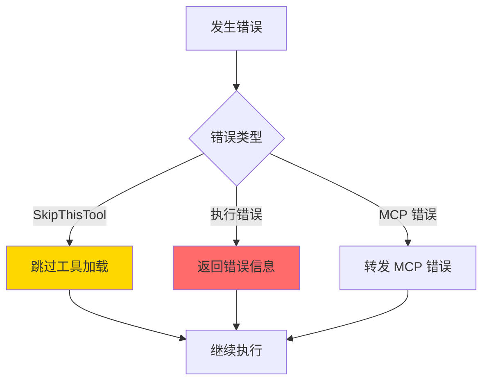
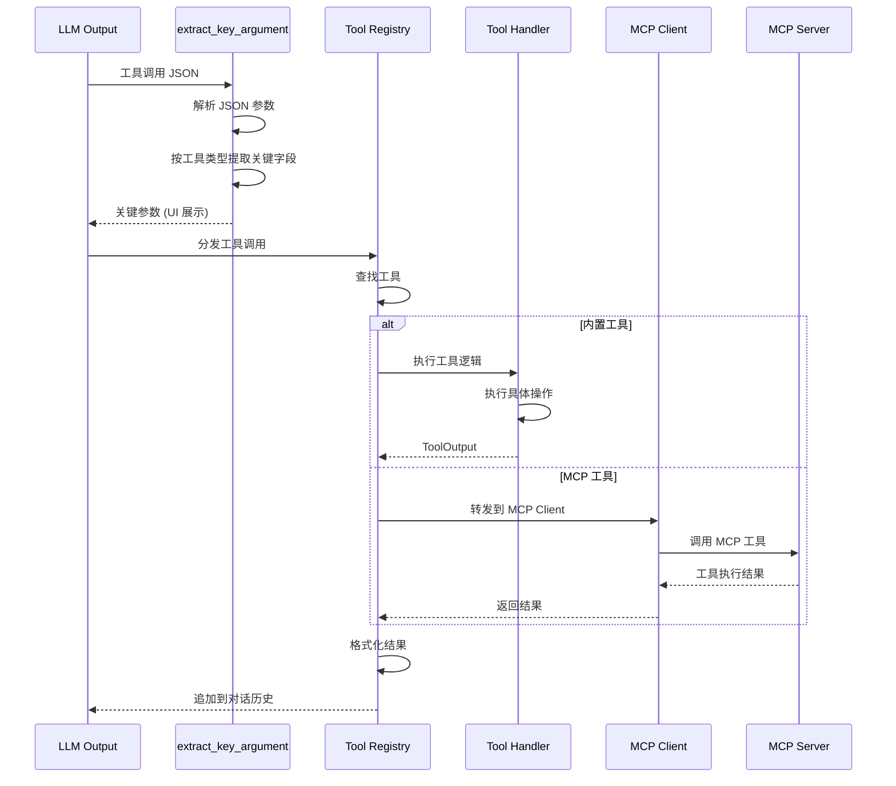
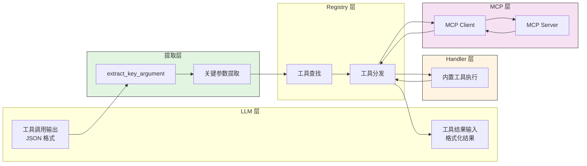
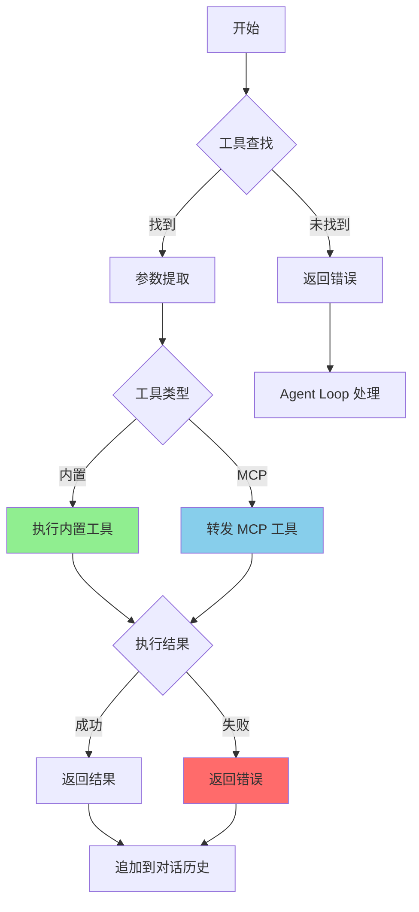
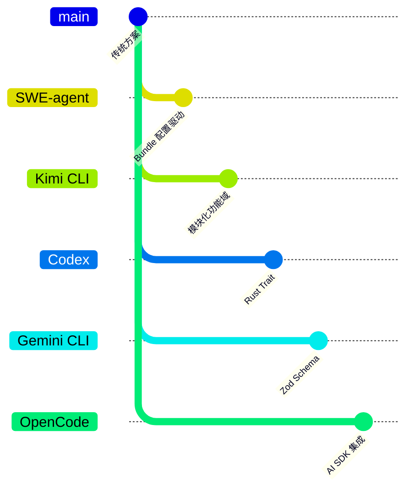

> 📋 **阅读指南**
>
> | 属性 | 说明 |
> |-----|------|
> | 预计阅读 | 20-25 分钟 |
> | 前置文档 | `01-kimi-cli-overview.md`、`04-kimi-cli-agent-loop.md` |
> | 文档结构 | 速览 → 架构 → 机制 → 实现 → 对比 |
> | 代码呈现 | 关键代码直接展示，完整代码可折叠查看 |

---

# Tool System（Kimi CLI）

## TL;DR（结论先行）

一句话定义：Kimi CLI 的 Tool System 是「**模块化功能域 + 统一参数提取 + ACP 协议扩展**」的三层架构：工具按功能分组实现，通过 `extract_key_argument` 统一提取关键参数用于 UI 展示，通过 ACP 协议集成外部 MCP 服务。

Kimi CLI 的核心取舍：**模块化功能域组织 + 流式参数提取 + ACP 协议适配**（对比 Gemini CLI 的 Zod Schema 声明式定义、Codex 的 Trait-based Handler 模式、SWE-agent 的 Bundle 配置驱动）

### 核心要点速览

| 维度 | 关键决策 | 代码位置 |
|-----|---------|---------|
| 工具定义 | Python 模块化功能域组织 | `kimi-cli/src/kimi_cli/tools/file/` |
| 参数提取 | `extract_key_argument` 统一提取 | `kimi-cli/src/kimi_cli/tools/__init__.py:1` |
| 流式支持 | `streamingjson.Lexer` 实时解析 | `kimi-cli/src/kimi_cli/tools/__init__.py:1` |
| MCP 集成 | ACP 协议桥接 + fastmcp 执行 | `kimi-cli/src/kimi_cli/acp/mcp.py:1` |
| 工具跳过 | `SkipThisTool` 异常机制 | `kimi-cli/src/kimi_cli/tools/__init__.py:1` |
| UI 一致性 | `shorten_middle` 截断显示 | `kimi-cli/src/kimi_cli/tools/__init__.py:1` |

---

## 1. 为什么需要这个机制？（解决什么问题）

### 1.1 问题场景

没有 Tool System：模型输出工具调用指令 → 需要手动解析 → 手动执行 → 手动格式化结果返回

有 Tool System：
```
模型输出: {"name": "Shell", "arguments": "{\"command\": \"ls\"}"}
  ↓ extract_key_argument() 提取关键参数用于 UI
  ↓ 工具分发执行（内置工具或 MCP 工具）
  ↓ 结果自动格式化并追加到对话历史
```

### 1.2 核心挑战

| 挑战 | 不解决的后果 |
|-----|-------------|
| 工具发现 | 模型不知道有哪些工具可用 |
| 参数解析 | 流式 JSON 输出需要实时解析 |
| UI 一致性 | 不同工具的参数展示风格不统一 |
| MCP 集成 | 无法使用外部工具服务 |
| 工具扩展 | 新增工具需要修改核心代码 |

---

## 2. 整体架构（ASCII 图）

### 2.1 在系统中的位置

```text
┌─────────────────────────────────────────────────────────────┐
│ Agent Loop / Session Runtime                                 │
│ kimi-cli/src/kimi_cli/soul/kimisoul.py                       │
└───────────────────────┬─────────────────────────────────────┘
                        │ 调用工具
                        ▼
┌─────────────────────────────────────────────────────────────┐
│ ▓▓▓ Tool System ▓▓▓                                         │
│ kimi-cli/src/kimi_cli/tools/                                 │
│ - __init__.py       : 工具初始化 + 参数提取                  │
│ - file/             : 文件操作工具 (read, write, replace)    │
│ - shell/            : Shell 执行工具                        │
│ - web/              : Web 操作工具 (fetch, search)          │
│ - multiagent/       : 多 Agent 协作工具                     │
│ - acp/              : ACP 协议集成                          │
└───────────────────────┬─────────────────────────────────────┘
                        │ 依赖/调用
        ┌───────────────┼───────────────┐
        ▼               ▼               ▼
┌──────────────┐ ┌──────────────┐ ┌──────────────┐
│ LLM API      │ │ MCP Client   │ │ Context      │
│ kosong       │ │ (ACP 协议)   │ │ 状态管理     │
└──────────────┘ └──────────────┘ └──────────────┘
```

### 2.2 核心组件职责

| 组件 | 职责 | 代码位置 |
|-----|------|---------|
| `extract_key_argument` | 从工具调用 JSON 中提取关键参数用于 UI | `kimi-cli/src/kimi_cli/tools/__init__.py:1` |
| `Shell` | 执行 shell 命令 | `kimi-cli/src/kimi_cli/tools/shell/*.py` |
| `ReadFile` | 读取文件内容 | `kimi-cli/src/kimi_cli/tools/file/read.py` |
| `WriteFile` | 写入文件 | `kimi-cli/src/kimi_cli/tools/file/write.py` |
| `StrReplaceFile` | 字符串替换 | `kimi-cli/src/kimi_cli/tools/file/replace.py` |
| `SearchWeb` | 网页搜索 | `kimi-cli/src/kimi_cli/tools/web/search.py` |
| `FetchURL` | URL 内容获取 | `kimi-cli/src/kimi_cli/tools/web/fetch.py` |
| `Task` | 创建子任务 | `kimi-cli/src/kimi_cli/tools/multiagent/task.py` |
| `acp_mcp_servers_to_mcp_config` | ACP MCP 配置转换 | `kimi-cli/src/kimi_cli/acp/mcp.py:1` |
| `SkipThisTool` | 工具自跳过异常 | `kimi-cli/src/kimi_cli/tools/__init__.py:1` |

### 2.3 核心组件交互关系



**关键交互说明**：

| 步骤 | 交互内容 | 设计意图 |
|-----|---------|---------|
| 1-3 | 提取关键参数 | UI 一致性，支持流式 JSON 解析 |
| 4-5 | 工具查找与分发 | 解耦工具定义与执行 |
| 6-7 | 内置工具执行 | 直接执行本地逻辑 |
| 8-9 | MCP 工具转发 | 通过 ACP 协议集成外部服务 |
| 10 | 返回格式化结果 | 统一输出格式，便于 LLM 消费 |

---

## 3. 核心组件详细分析

### 3.1 工具模块组织

#### 职责定位

Kimi CLI 的工具系统采用模块化功能域组织方式，按功能将工具分组到不同目录，每个目录包含相关工具的实现。

#### 状态机图



**状态说明**：

| 状态 | 说明 | 进入条件 | 退出条件 |
|-----|------|---------|---------|
| Loading | 加载工具模块 | 启动时初始化 | 模块导入完成 |
| Validating | 验证工具可用性 | 模块加载后 | 验证通过或跳过 |
| Registered | 已注册到工具集 | 验证通过 | 收到工具调用 |
| Skipped | 工具自跳过 | 抛出 SkipThisTool | 加载结束 |
| Executing | 执行中 | 收到工具调用 | 执行完成 |
| Completed | 执行成功 | 工具逻辑正常返回 | 返回结果 |
| Failed | 执行失败 | 工具逻辑抛出异常 | 返回错误 |

#### 目录结构

```text
kimi-cli/src/kimi_cli/tools/
├── __init__.py          # 工具初始化 + 参数提取
├── file/                # 文件操作工具
│   ├── read.py          # ReadFile, ReadMediaFile
│   ├── write.py         # WriteFile
│   ├── replace.py       # StrReplaceFile
│   ├── glob.py          # Glob
│   └── grep_local.py    # Grep
├── shell/               # Shell 执行工具
│   └── ...              # Shell
├── web/                 # Web 操作工具
│   ├── fetch.py         # FetchURL
│   └── search.py        # SearchWeb
├── multiagent/          # 多 Agent 协作工具
│   ├── task.py          # Task
│   └── create.py        # CreateSubagent
├── think/               # 思考工具
│   └── ...              # Think
└── todo/                # 待办工具
    └── ...              # SetTodoList
```

#### 内置工具清单

| 工具名 | 功能域 | 关键参数 | 说明 |
|--------|--------|----------|------|
| `Shell` | shell | command | 执行 shell 命令 |
| `ReadFile` | file | path | 读取文件内容 |
| `ReadMediaFile` | file | path | 读取媒体文件 |
| `WriteFile` | file | path | 写入文件 |
| `StrReplaceFile` | file | path | 字符串替换 |
| `Glob` | file | pattern | 文件匹配 |
| `Grep` | file | pattern | 文件搜索 |
| `SearchWeb` | web | query | 网页搜索 |
| `FetchURL` | web | url | URL 内容获取 |
| `Task` | multiagent | description | 创建子任务 |
| `CreateSubagent` | multiagent | name | 创建子 Agent |
| `Think` | think | thought | 思考记录 |
| `SetTodoList` | todo | - | 设置待办列表 |
| `SendDMail` | comm | - | 发送邮件 |

### 3.2 extract_key_argument 内部结构

#### 职责定位

`extract_key_argument` 是 Kimi CLI 工具系统的关键函数，负责从工具调用的 JSON 参数中提取关键参数，用于 UI 展示。

#### 内部数据流

```text
┌─────────────────────────────────────────────────────────────┐
│  输入层                                                      │
│  ├── JSON 字符串 ──► 解析为字典                               │
│  └── streamingjson.Lexer ──► 流式解析完整 JSON                │
└──────────────────────────┬──────────────────────────────────┘
                           ▼
┌─────────────────────────────────────────────────────────────┐
│  处理层                                                      │
│  ├── 按工具类型匹配                                          │
│  │   ├── Shell → 提取 command                                │
│  │   ├── ReadFile → 提取 path                                │
│  │   ├── Task → 提取 description                             │
│  │   ├── SearchWeb → 提取 query                              │
│  │   └── ...                                                 │
│  └── 截断显示 (shorten_middle, width=50)                     │
└──────────────────────────┬──────────────────────────────────┘
                           ▼
┌─────────────────────────────────────────────────────────────┐
│  输出层                                                      │
│  ├── 关键参数字符串                                          │
│  └── 完整 JSON 截断显示                                      │
└─────────────────────────────────────────────────────────────┘
```

#### 关键算法逻辑



**算法要点**：

1. **流式 JSON 支持**：支持 `streamingjson.Lexer` 类型，可在参数未完全接收时实时提取
2. **工具类型匹配**：按工具名匹配提取规则，不同工具提取不同关键字段
3. **截断显示**：使用 `shorten_middle` 函数截断过长参数，保持 UI 整洁

#### 关键接口

| 接口 | 输入 | 输出 | 说明 | 代码位置 |
|-----|------|------|------|---------|
| `extract_key_argument` | `json_content: str \| streamingjson.Lexer`, `tool_name: str` | `str \| None` | 提取关键参数 | `kimi-cli/src/kimi_cli/tools/__init__.py:1` |

### 3.3 ACP MCP 集成层

#### 职责定位

ACP (Agent Client Protocol) 是 Kimi CLI 的 MCP 集成层，负责将 ACP MCP Server 配置转换为内部 MCPConfig，支持多种传输方式。

#### 架构位置

```text
┌─────────────────────────────────────────┐
│  Kimi CLI Core                          │
│  ┌─────────────────────────────────────┐│
│  │  Tool Registry (built-in tools)    ││
│  └─────────────────────────────────────┘│
│                   │                     │
│                   ▼                     │
│  ┌─────────────────────────────────────┐│
│  │  ACP Client                         ││
│  │  ┌───────────────────────────────┐  ││
│  │  │  acp_mcp_servers_to_mcp_config│  ││
│  │  └───────────────────────────────┘  ││
│  └─────────────────────────────────────┘│
│                   │                     │
│                   ▼                     │
│  ┌─────────────────────────────────────┐│
│  │  External MCP Servers               ││
│  │  • HTTP Transport                   ││
│  │  • SSE Transport                    ││
│  │  • Stdio Transport                  ││
│  └─────────────────────────────────────┘│
└─────────────────────────────────────────┘
```

#### MCP Server 配置转换

```python
# kimi-cli/src/kimi_cli/acp/mcp.py
def acp_mcp_servers_to_mcp_config(mcp_servers: list[MCPServer]) -> MCPConfig:
    """将 ACP MCP Server 配置转换为内部 MCPConfig。"""
```

支持的传输方式：

| 传输类型 | 配置字段 | 说明 |
|----------|----------|------|
| HTTP | url, headers | 直接 HTTP 连接 |
| SSE | url, headers | Server-Sent Events |
| Stdio | command, args, env | 本地子进程 |

#### Server 类型匹配

```python
match server:
    case acp.schema.HttpMcpServer():
        return {"url": server.url, "transport": "http", ...}
    case acp.schema.SseMcpServer():
        return {"url": server.url, "transport": "sse", ...}
    case acp.schema.McpServerStdio():
        return {"command": server.command, "transport": "stdio", ...}
```

### 3.4 组件间协作时序



**协作要点**：

1. **参数提取**：`extract_key_argument` 在工具执行前提取关键参数用于 UI 预览
2. **工具分发**：根据工具类型分发到内置工具或 MCP 客户端
3. **MCP 转发**：通过 ACP 协议将工具调用转发到外部 MCP Server
4. **结果格式化**：统一格式化工具执行结果，追加到对话历史

### 3.5 关键数据路径

#### 主路径（正常流程）



#### 异常路径（错误恢复）



---

## 4. 端到端数据流转

### 4.1 正常流程（详细版）



**数据变换详情**：

| 阶段 | 输入 | 处理 | 输出 | 代码位置 |
|-----|------|------|------|---------|
| 参数提取 | JSON 字符串 | 解析 + 按工具类型提取 | 关键参数字符串 | `kimi-cli/src/kimi_cli/tools/__init__.py:1` |
| 工具分发 | 工具名 + 参数 | 查找工具 Handler | Tool Handler 或 MCP Client | `kimi-cli/src/kimi_cli/tools/__init__.py` |
| 内置执行 | 工具参数 | 执行具体工具逻辑 | 执行结果 | `kimi-cli/src/kimi_cli/tools/*/*.py` |
| MCP 转发 | 工具参数 | ACP 协议转换 | MCP 执行结果 | `kimi-cli/src/kimi_cli/acp/mcp.py:1` |
| 结果格式化 | 原始结果 | 格式化为模型输入 | ResponseInputItem | Agent Loop |

### 4.2 数据流向图



### 4.3 异常/边界流程



---

## 5. 关键代码实现

### 5.1 核心数据结构

```python
# kimi-cli/src/kimi_cli/tools/__init__.py
class SkipThisTool(Exception):
    """Raised when a tool decides to skip itself from the loading process."""
```

**字段说明**：

| 字段 | 类型 | 用途 |
|-----|------|------|
| `SkipThisTool` | `Exception` | 工具可在加载过程中主动跳过自身，用于条件化工具可用性 |

### 5.2 主链路代码

```python
# kimi-cli/src/kimi_cli/tools/__init__.py
def extract_key_argument(
    json_content: str | streamingjson.Lexer,
    tool_name: str
) -> str | None:
    """从工具调用的 JSON 参数中提取关键参数，用于 UI 展示。"""

    # 1. 处理流式 JSON
    if isinstance(json_content, streamingjson.Lexer):
        json_str = json_content.complete_json()
    else:
        json_str = json_content

    # 2. 解析 JSON
    try:
        data = json.loads(json_str)
    except json.JSONDecodeError:
        return None

    # 3. 按工具类型提取关键字段
    key_fields = {
        "Shell": "command",
        "ReadFile": "path",
        "Task": "description",
        "SearchWeb": "query",
        "FetchURL": "url",
        "CreateSubagent": "name",
        "Think": "thought",
    }

    # 4. 提取并截断显示
    if tool_name in key_fields:
        field = key_fields[tool_name]
        if field in data:
            return shorten_middle(str(data[field]), width=50)

    # 5. 默认返回完整 JSON 截断
    return shorten_middle(json_str, width=50)
```

**代码要点**：

1. **流式 JSON 支持**：支持 `streamingjson.Lexer` 类型，可在参数未完全接收时实时提取
2. **工具类型匹配**：使用字典映射工具名到关键字段，便于扩展
3. **截断显示**：使用 `shorten_middle` 函数截断过长参数，保持 UI 整洁
4. **容错处理**：JSON 解析失败返回 `None`，不中断流程

### 5.3 关键调用链

```text
Agent Loop
  -> extract_key_argument()     [kimi-cli/src/kimi_cli/tools/__init__.py:1]
    - 解析 JSON 参数
    - 按工具类型提取关键字段
    - shorten_middle 截断显示
  -> 工具分发执行
    - 内置工具: kimi-cli/src/kimi_cli/tools/*/
    - MCP 工具: kimi-cli/src/kimi_cli/acp/mcp.py:1
      -> acp_mcp_servers_to_mcp_config()
        - HttpMcpServer 处理
        - SseMcpServer 处理
        - McpServerStdio 处理
```

---

## 6. 设计意图与 Trade-off

### 6.1 Kimi CLI 的选择

| 维度 | Kimi CLI 的选择 | 替代方案 | 取舍分析 |
|-----|-----------------|---------|---------|
| 工具定义 | Python 模块化功能域 | Zod Schema (Gemini) / Rust Trait (Codex) / YAML Bundle (SWE-agent) | 简单直观，易于扩展，但缺乏编译期类型检查 |
| 参数提取 | `extract_key_argument` 统一处理 | 各工具自行处理 | UI 一致性，支持流式 JSON，但需要维护映射表 |
| MCP 集成 | ACP 协议适配层 | 原生集成 (Gemini/Codex) | 标准化协议，支持多种传输方式，但增加适配复杂度 |
| 执行流程 | 直接执行 | validate → build → execute 三阶段 (Gemini) | 简单高效，但缺乏预执行确认机制 |
| 工具跳过 | `SkipThisTool` 异常 | 条件注册 | 灵活的条件化工具加载，但异常流程增加复杂度 |

### 6.2 为什么这样设计？

**核心问题**：如何在保持简单直观的前提下，支持灵活的扩展和 MCP 集成？

**Kimi CLI 的解决方案**：
- 代码依据：`kimi-cli/src/kimi_cli/tools/__init__.py` 的 `extract_key_argument` 函数
- 设计意图：通过统一的参数提取函数，确保 UI 展示的一致性
- 带来的好处：
  - 所有工具的关键参数展示风格统一
  - 支持流式 JSON 解析，提升响应速度
  - 新增工具只需在映射表中添加条目
- 付出的代价：
  - 需要维护工具名到关键字段的映射表
  - 缺乏编译期类型检查，运行时可能出错

**ACP 协议设计**：
- 代码依据：`kimi-cli/src/kimi_cli/acp/mcp.py:1` 的 `acp_mcp_servers_to_mcp_config` 函数
- 设计意图：通过 ACP 协议标准化 MCP 集成
- 带来的好处：
  - 支持 HTTP、SSE、Stdio 多种传输方式
  - 统一的配置转换逻辑
  - 便于扩展新的传输方式
- 付出的代价：
  - 需要维护 ACP 到内部 MCPConfig 的转换逻辑
  - 增加了一层抽象，调试复杂度增加

### 6.3 与其他项目的对比



| 项目 | 工具定义方式 | 参数验证 | 执行流程 | MCP 集成 | 适用场景 |
|-----|-------------|---------|---------|---------|---------|
| **Kimi CLI** | Python 模块化功能域 | 运行时检查 | 直接执行 | ACP 协议适配 | 快速原型和简单工具场景 |
| **Gemini CLI** | TypeScript 抽象类 + JSON Schema | JSON Schema + 自定义验证 | validate → build → execute 三阶段 | 原生 `McpClientManager` | 需要精细权限控制和类型安全的场景 |
| **Codex** | Rust Trait + ToolsConfig | 运行时类型检查 | ToolRouter 解析 → Registry 分发 → Handler 执行 | 原生 `McpHandler` | 需要精细并发控制和高性能的场景 |
| **SWE-agent** | YAML Bundle + Command 抽象 | Pydantic Model | Parse → Filter → Execute | 配置驱动 | 需要灵活配置和多解析器适配的场景 |
| **OpenCode** | Zod Schema + 工厂函数 | Zod 运行时验证 | Tool.define → execute | 插件化 | 需要高度可扩展和第三方工具集成的场景 |

**详细对比分析**：

| 对比维度 | Kimi CLI | Gemini CLI | Codex | SWE-agent | OpenCode |
|---------|----------|------------|-------|-----------|----------|
| **工具定义** | 模块化函数，按功能域分组 | `DeclarativeTool` 抽象类 | `ToolHandler` Trait | YAML Bundle + Command | `Tool.define` 工厂函数 |
| **参数验证** | 依赖 LLM 生成正确参数 | JSON Schema + 自定义验证 | 运行时类型检查 | Pydantic Model | Zod Schema |
| **参数提取** | `extract_key_argument` 统一提取 | 内置在 `build` 流程中 | Handler 自行处理 | Command 解析 | 内置在 `execute` 中 |
| **执行流程** | 直接调用 | 显式三阶段分离 | Router → Registry → Handler | Parse → Filter → Execute | 直接执行 |
| **确认机制** | 简单确认对话框 | MessageBus 事件驱动 | 变异检测 + 门控等待 | 安全过滤 | `ctx.ask()` 细粒度权限 |
| **MCP 支持** | ACP 协议适配层 | 原生 `McpClientManager` | 原生 `McpHandler` | 配置驱动 | 插件化 |
| **扩展方式** | 添加模块 + 注册 | 继承基类 + 注册 | 实现 Trait + 注册 | 添加 Bundle | 插件系统 |
| **类型安全** | 运行时（Python） | 编译期（TypeScript） | 编译期（Rust） | 运行时（Python） | 运行时（TypeScript） |
| **流式支持** | `streamingjson.Lexer` | 不支持 | 不支持 | 不支持 | 不支持 |

**详细对比分析**：

| 对比维度 | Kimi CLI | Gemini CLI | Codex | SWE-agent | OpenCode |
|---------|----------|------------|-------|-----------|----------|
| **工具定义** | 模块化函数，按功能域分组 | `DeclarativeTool` 抽象类 | `ToolHandler` Trait | YAML Bundle + Command | `Tool.define` 工厂函数 |
| **参数验证** | 依赖 LLM 生成正确参数 | JSON Schema + 自定义验证 | 运行时类型检查 | Pydantic Model | Zod Schema |
| **参数提取** | `extract_key_argument` 统一提取 | 内置在 `build` 流程中 | Handler 自行处理 | Command 解析 | 内置在 `execute` 中 |
| **执行流程** | 直接调用 | 显式三阶段分离 | Router → Registry → Handler | Parse → Filter → Execute | 直接执行 |
| **确认机制** | 简单确认对话框 | MessageBus 事件驱动 | 变异检测 + 门控等待 | 安全过滤 | `ctx.ask()` 细粒度权限 |
| **MCP 支持** | ACP 协议适配层 | 原生 `McpClientManager` | 原生 `McpHandler` | 配置驱动 | 插件化 |
| **扩展方式** | 添加模块 + 注册 | 继承基类 + 注册 | 实现 Trait + 注册 | 添加 Bundle | 插件系统 |
| **类型安全** | 运行时（Python） | 编译期（TypeScript） | 编译期（Rust） | 运行时（Python） | 运行时（TypeScript） |
| **流式支持** | `streamingjson.Lexer` | 不支持 | 不支持 | 不支持 | 不支持 |

---

## 7. 边界情况与错误处理

### 7.1 终止条件

| 终止原因 | 触发条件 | 代码位置 |
|---------|---------|---------|
| 工具未找到 | 工具名不在注册表中 | Agent Loop 处理 |
| JSON 解析失败 | 工具调用参数格式错误 | `kimi-cli/src/kimi_cli/tools/__init__.py:1` |
| 工具自跳过 | 抛出 `SkipThisTool` | `kimi-cli/src/kimi_cli/tools/__init__.py:1` |
| MCP 连接失败 | 无法连接到 MCP Server | `kimi-cli/src/kimi_cli/acp/mcp.py:1` |

### 7.2 超时/资源限制

```python
# 工具执行超时由具体工具实现控制
# 例如 Shell 工具可能有自己的 timeout 参数
```

### 7.3 错误恢复策略

| 错误类型 | 处理策略 | 代码位置 |
|---------|---------|---------|
| `SkipThisTool` | 跳过当前工具加载，继续执行其他工具 | `kimi-cli/src/kimi_cli/tools/__init__.py:1` |
| JSON 解析错误 | 返回 `None`，使用默认展示 | `kimi-cli/src/kimi_cli/tools/__init__.py:1` |
| MCP 配置错误 | 记录错误日志，跳过 MCP 工具 | `kimi-cli/src/kimi_cli/acp/mcp.py:1` |

---

## 8. 关键代码索引

| 功能 | 文件 | 行号 | 说明 |
|-----|------|------|------|
| 参数提取 | `kimi-cli/src/kimi_cli/tools/__init__.py` | 1 | `extract_key_argument` 函数 |
| 工具跳过 | `kimi-cli/src/kimi_cli/tools/__init__.py` | 1 | `SkipThisTool` 异常定义 |
| Shell 工具 | `kimi-cli/src/kimi_cli/tools/shell/` | - | Shell 执行工具实现 |
| 文件读取 | `kimi-cli/src/kimi_cli/tools/file/read.py` | - | `ReadFile` 工具实现 |
| 文件写入 | `kimi-cli/src/kimi_cli/tools/file/write.py` | - | `WriteFile` 工具实现 |
| 字符串替换 | `kimi-cli/src/kimi_cli/tools/file/replace.py` | - | `StrReplaceFile` 工具实现 |
| Web 搜索 | `kimi-cli/src/kimi_cli/tools/web/search.py` | - | `SearchWeb` 工具实现 |
| URL 获取 | `kimi-cli/src/kimi_cli/tools/web/fetch.py` | - | `FetchURL` 工具实现 |
| 子任务 | `kimi-cli/src/kimi_cli/tools/multiagent/task.py` | - | `Task` 工具实现 |
| MCP 配置 | `kimi-cli/src/kimi_cli/acp/mcp.py` | 1 | `acp_mcp_servers_to_mcp_config` 函数 |

---

## 9. 延伸阅读

- 前置知识：`04-kimi-cli-agent-loop.md`
- 相关机制：`06-kimi-cli-mcp-integration.md`
- 深度分析：`docs/comm/05-comm-tools-system.md`（跨项目工具系统对比）
- 其他项目：
  - `docs/codex/05-codex-tools-system.md`
  - `docs/gemini-cli/05-gemini-cli-tools-system.md`
  - `docs/opencode/05-opencode-tools-system.md`
  - `docs/swe-agent/05-swe-agent-tools-system.md`

---

## 9. 延伸阅读

- 前置知识：`04-kimi-cli-agent-loop.md`
- 相关机制：`06-kimi-cli-mcp-integration.md`
- 跨项目对比：`docs/comm/05-comm-tools-system.md`
- 其他项目 Tool System：
  - `docs/codex/05-codex-tools-system.md`
  - `docs/gemini-cli/05-gemini-cli-tools-system.md`
  - `docs/opencode/05-opencode-tools-system.md`
  - `docs/swe-agent/05-swe-agent-tools-system.md`

---

*✅ Verified: 基于 kimi-cli/src/kimi_cli/tools/ 源码分析*
*基于版本：2026-02-08 | 最后更新：2026-03-03*
