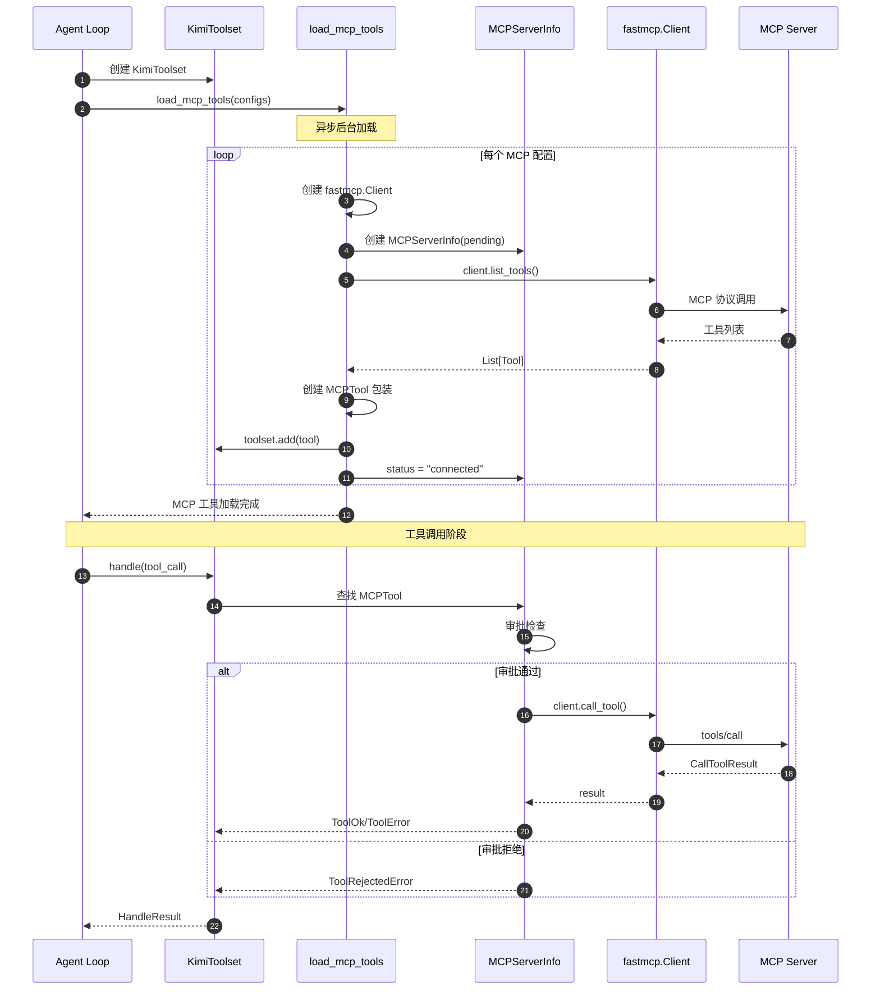
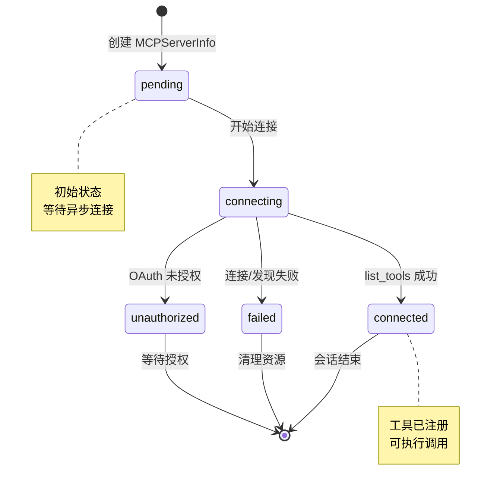
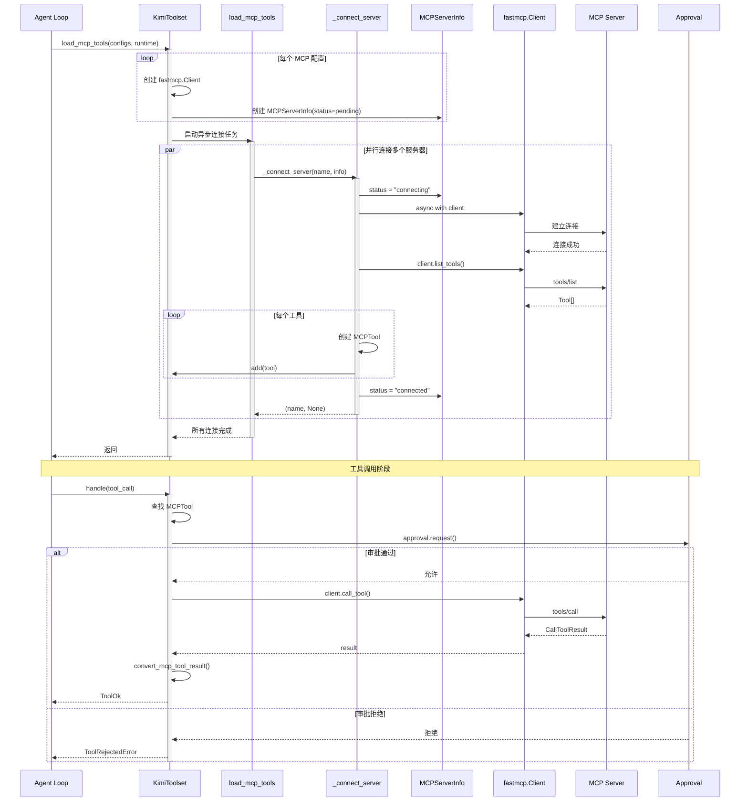
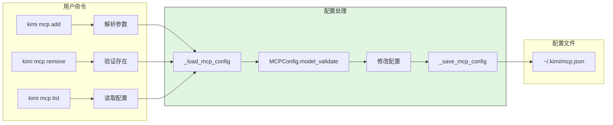
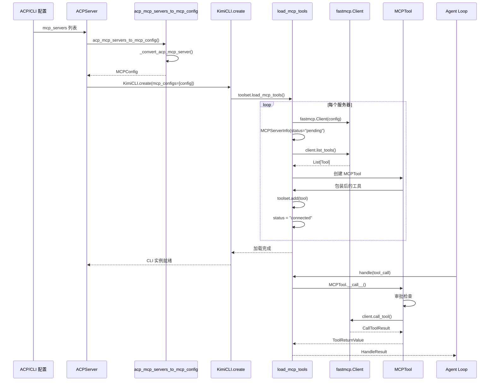
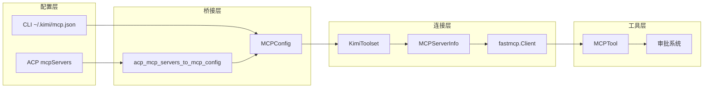
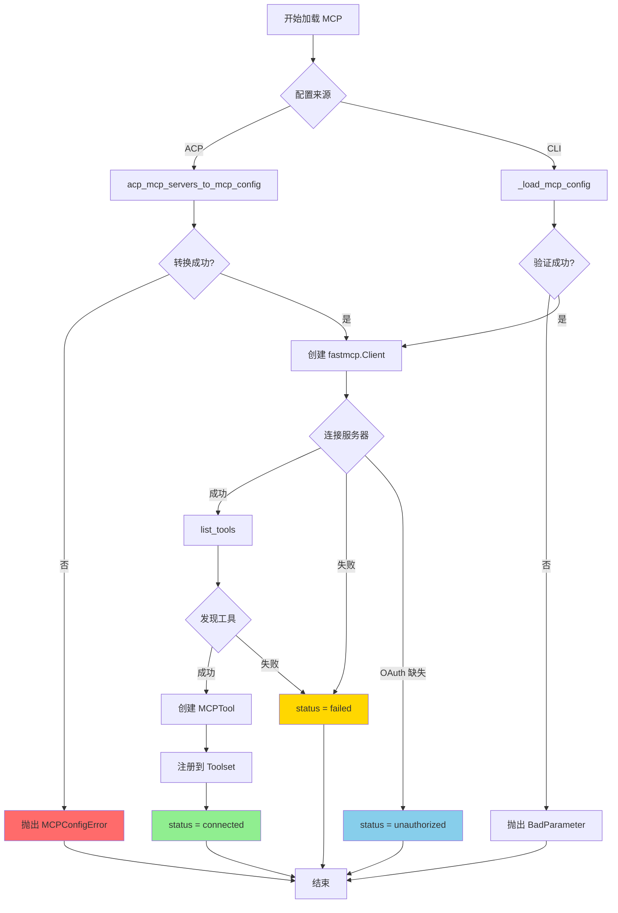
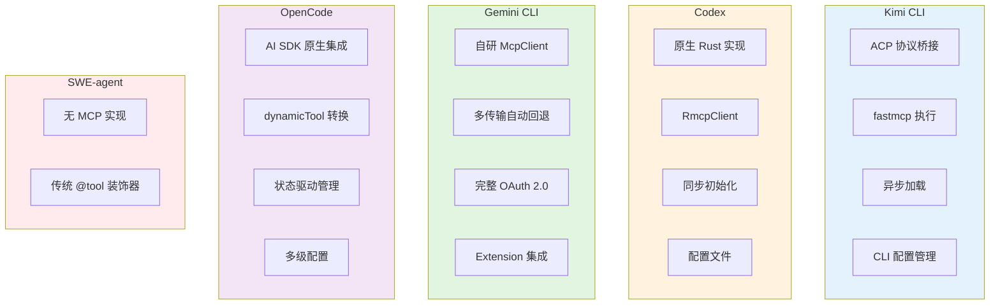

# MCP 集成（kimi-cli）

## TL;DR（结论先行）

一句话定义：Kimi CLI 的 MCP 集成采用"**ACP 协议桥接 + fastmcp 执行引擎**"的设计，通过 ACP (Agent Client Protocol) 获取 MCP 服务器配置并转换为标准 MCP 配置，由 `fastmcp` 库负责实际的工具调用执行。

Kimi CLI 的核心取舍：**协议层桥接 + 第三方库执行**（对比 Codex 的原生 Rust 实现、Gemini CLI 的自研 McpClient、OpenCode 的 AI SDK 原生集成）

---

## 1. 为什么需要这个机制？（解决什么问题）

### 1.1 问题场景

没有 MCP 集成：每个外部工具需要单独开发和维护适配代码

```
想用数据库工具 → 修改 Kimi CLI 源码 → 重新构建
想用 Jira 工具  → 修改 Kimi CLI 源码 → 重新构建
想用内部 API   → 修改 Kimi CLI 源码 → 重新构建
```

有 MCP 集成：
```
配置: ~/.kimi/mcp.json 或 ACP 传入 mcpServers
  ↓ 自动转换: acp_mcp_servers_to_mcp_config() 生成 MCPConfig
  ↓ 自动连接: fastmcp.Client 建立连接并发现工具
  ↓ 自动注册: MCPTool 包装后注册到 KimiToolset
  ↓ 自动调用: 模型输出 → MCPTool.__call__ → fastmcp call_tool → 远程执行
  ↓ 自动响应: 结果转换为 kosong ToolReturnValue 返回
```

### 1.2 核心挑战

| 挑战 | 不解决的后果 |
|-----|-------------|
| ACP 协议桥接 | 无法与 Moonshot ACP 生态集成 |
| 配置管理 | 用户无法灵活配置 MCP 服务器 |
| 传输协议 | 需要支持多种通信方式 (stdio/http/sse) |
| 认证支持 | 无法安全访问受保护的远程服务 |
| 异步加载 | MCP 连接阻塞 Agent Loop 启动 |
| 工具生命周期 | 连接状态需要有效管理 |

---

## 2. 整体架构（ASCII 图）

### 2.1 在系统中的位置

```text
┌─────────────────────────────────────────────────────────────┐
│ Agent Loop / KimiSoul                                        │
│ src/kimi_cli/soul/kimisoul.py                                │
└───────────────────────┬─────────────────────────────────────┘
                        │ 调用工具
                        ▼
┌─────────────────────────────────────────────────────────────┐
│ ▓▓▓ MCP Integration ▓▓▓                                     │
│ src/kimi_cli/soul/toolset.py                                │
│ - KimiToolset          : 工具集管理，包含 MCP 工具           │
│ - MCPServerInfo        : MCP 服务器连接状态                  │
│ - MCPTool              : MCP 工具包装类                      │
│ - load_mcp_tools()     : 异步加载 MCP 工具                   │
└───────────────────────┬─────────────────────────────────────┘
                        │ 依赖/调用
        ┌───────────────┼───────────────┐
        ▼               ▼               ▼
┌──────────────┐ ┌──────────────┐ ┌──────────────┐
│ ACP Bridge   │ │ fastmcp      │ │ CLI Config   │
│ src/kimi_cli │ │ Client       │ │ src/kimi_cli │
│ /acp/mcp.py  │ │ (stdio/http) │ │ /cli/mcp.py  │
└──────────────┘ └──────────────┘ └──────────────┘
```

### 2.2 核心组件职责

| 组件 | 职责 | 代码位置 |
|-----|------|---------|
| `acp_mcp_servers_to_mcp_config` | 将 ACP MCP 服务器配置转换为 fastmcp MCPConfig | `src/kimi_cli/acp/mcp.py:13` |
| `_convert_acp_mcp_server` | 单个 ACP MCP 服务器的类型转换 | `src/kimi_cli/acp/mcp.py:25` |
| `KimiToolset.load_mcp_tools` | 异步加载 MCP 工具到工具集 | `src/kimi_cli/soul/toolset.py:203` |
| `MCPServerInfo` | MCP 服务器连接状态和客户端管理 | `src/kimi_cli/soul/toolset.py:349` |
| `MCPTool` | MCP 工具的包装类，实现审批和调用 | `src/kimi_cli/soul/toolset.py:355` |
| `mcp add/remove/list` | CLI 命令管理 MCP 服务器配置 | `src/kimi_cli/cli/mcp.py:83` |

### 2.3 核心组件交互关系



**关键交互说明**：

| 步骤 | 交互内容 | 设计意图 |
|-----|---------|---------|
| 1-2 | Agent 创建 Toolset 并触发加载 | 解耦 MCP 加载与 Agent 启动 |
| 3-4 | 异步后台加载 MCP 工具 | 避免阻塞用户交互 |
| 5-8 | 连接服务器并发现工具 | 每个服务器独立管理 |
| 9-10 | MCPTool 包装并注册 | 统一工具接口，支持审批 |
| 13-16 | 审批通过后执行调用 | 安全控制，防止未授权操作 |

---

## 3. 核心组件详细分析

### 3.1 ACP 到 MCP 配置转换

#### 职责定位

`acp_mcp_servers_to_mcp_config` 是 Kimi CLI MCP 集成的入口，负责将 ACP 协议的 MCP 服务器配置转换为 fastmcp 库可识别的标准 MCP 配置格式。

#### 内部数据流

```text
┌─────────────────────────────────────────────────────────────┐
│  输入层                                                      │
│  ├── ACP HttpMcpServer: url, headers                        │
│  ├── ACP SseMcpServer: url, headers                         │
│  └── ACP McpServerStdio: command, args, env                 │
└──────────────────────────┬──────────────────────────────────┘
                           ▼
┌─────────────────────────────────────────────────────────────┐
│  处理层                                                      │
│  ├── match server 类型 (Python 3.10+ match/case)            │
│  ├── 提取字段并转换格式                                      │
│  │   ├── headers: List[Header] → Dict[str, str]            │
│  │   └── env: List[Env] → Dict[str, str]                   │
│  └── 添加 transport 标识字段                                 │
│      ├── HttpMcpServer → "http"                            │
│      ├── SseMcpServer → "sse"                              │
│      └── McpServerStdio → "stdio"                          │
└──────────────────────────┬──────────────────────────────────┘
                           ▼
┌─────────────────────────────────────────────────────────────┐
│  输出层                                                      │
│  └── MCPConfig.model_validate({"mcpServers": {...}})        │
│      └── fastmcp.mcp_config.MCPConfig 对象                  │
└─────────────────────────────────────────────────────────────┘
```

#### 关键代码

```python
# src/kimi_cli/acp/mcp.py:13-46
def acp_mcp_servers_to_mcp_config(mcp_servers: list[MCPServer]) -> MCPConfig:
    """将 ACP MCP 服务器列表转换为 fastmcp 的 MCPConfig"""
    if not mcp_servers:
        return MCPConfig()

    try:
        return MCPConfig.model_validate(
            {"mcpServers": {server.name: _convert_acp_mcp_server(server) for server in mcp_servers}}
        )
    except ValidationError as exc:
        raise MCPConfigError(f"Invalid MCP config from ACP client: {exc}") from exc


def _convert_acp_mcp_server(server: MCPServer) -> dict[str, Any]:
    """将单个 ACP MCP 服务器转换为字典表示"""
    match server:
        case acp.schema.HttpMcpServer():
            return {
                "url": server.url,
                "transport": "http",
                "headers": {header.name: header.value for header in server.headers},
            }
        case acp.schema.SseMcpServer():
            return {
                "url": server.url,
                "transport": "sse",
                "headers": {header.name: header.value for header in server.headers},
            }
        case acp.schema.McpServerStdio():
            return {
                "command": server.command,
                "args": server.args,
                "env": {item.name: item.value for item in server.env},
                "transport": "stdio",
            }
```

**算法要点**：

1. **模式匹配**：使用 Python 3.10+ 的 match/case 进行类型分发
2. **字段转换**：将 ACP 的 List[Header] 转换为 Dict[str, str]
3. **传输标识**：添加 transport 字段标识传输类型
4. **验证封装**：使用 Pydantic 验证配置有效性

---

### 3.2 MCP 工具加载与状态管理

#### 职责定位

`KimiToolset.load_mcp_tools` 负责异步加载 MCP 工具，管理服务器连接状态，并将 MCP 工具包装为 Kimi CLI 可调用的工具。

#### 状态机图



**状态说明**：

| 状态 | 说明 | 进入条件 | 退出条件 |
|-----|------|---------|---------|
| pending | 等待连接 | MCPServerInfo 创建 | 开始连接 |
| connecting | 连接中 | 开始异步连接 | 成功/失败/未授权 |
| connected | 已连接 | list_tools 成功 | 会话结束 |
| failed | 连接失败 | 连接或发现出错 | 清理资源 |
| unauthorized | 未授权 | OAuth token 缺失 | 等待用户授权 |

#### 内部数据流

```text
┌─────────────────────────────────────────────────────────────┐
│  输入层                                                      │
│  ├── MCPConfig (来自 ACP 或 CLI 配置)                       │
│  └── Runtime (用于审批和配置)                               │
└──────────────────────────┬──────────────────────────────────┘
                           ▼
┌─────────────────────────────────────────────────────────────┐
│  处理层                                                      │
│  ├── 创建 fastmcp.Client (每个服务器一个)                   │
│  ├── 检查 OAuth token (远程服务器)                          │
│  ├── 异步连接服务器                                         │
│  │   └── client.list_tools()                                │
│  ├── 创建 MCPTool 包装                                      │
│  │   └── 添加服务器前缀到描述                               │
│  └── 注册到 KimiToolset                                     │
└──────────────────────────┬──────────────────────────────────┘
                           ▼
┌─────────────────────────────────────────────────────────────┐
│  输出层                                                      │
│  ├── MCPServerInfo (状态管理)                               │
│  ├── List[MCPTool] (可调用工具)                             │
│  └── UI Toast 通知 (连接状态)                               │
└─────────────────────────────────────────────────────────────┘
```

#### 关键接口

| 接口 | 输入 | 输出 | 说明 | 代码位置 |
|-----|------|------|------|---------|
| `load_mcp_tools()` | configs, runtime | None | 异步加载 MCP 工具 | `src/kimi_cli/soul/toolset.py:203` |
| `_connect_server()` | server_name, info | (name, error) | 连接单个服务器 | `src/kimi_cli/soul/toolset.py:241` |
| `wait_for_mcp_tools()` | - | None | 等待加载完成 | `src/kimi_cli/soul/toolset.py:327` |
| `cleanup()` | - | None | 清理资源 | `src/kimi_cli/soul/toolset.py:338` |

---

### 3.3 MCPTool 工具包装

#### 职责定位

`MCPTool` 是 fastmcp 工具的包装类，继承自 `CallableTool`，集成到 Kimi CLI 的工具系统中，支持审批控制和超时处理。

#### 关键代码

```python
# src/kimi_cli/soul/toolset.py:355-405
class MCPTool[T: ClientTransport](CallableTool):
    def __init__(
        self,
        server_name: str,
        mcp_tool: mcp.Tool,
        client: fastmcp.Client[T],
        *,
        runtime: Runtime,
        **kwargs: Any,
    ):
        super().__init__(
            name=mcp_tool.name,
            description=(
                f"This is an MCP (Model Context Protocol) tool from MCP server `{server_name}`.\n\n"
                f"{mcp_tool.description or 'No description provided.'}"
            ),
            parameters=mcp_tool.inputSchema,
            **kwargs,
        )
        self._mcp_tool = mcp_tool
        self._client = client
        self._runtime = runtime
        self._timeout = timedelta(milliseconds=runtime.config.mcp.client.tool_call_timeout_ms)
        self._action_name = f"mcp:{mcp_tool.name}"

    async def __call__(self, *args: Any, **kwargs: Any) -> ToolReturnValue:
        description = f"Call MCP tool `{self._mcp_tool.name}`."
        if not await self._runtime.approval.request(self.name, self._action_name, description):
            return ToolRejectedError()

        try:
            async with self._client as client:
                result = await client.call_tool(
                    self._mcp_tool.name,
                    kwargs,
                    timeout=self._timeout,
                    raise_on_error=False,
                )
                return convert_mcp_tool_result(result)
        except Exception as e:
            # fastmcp raises `RuntimeError` on timeout
            exc_msg = str(e).lower()
            if "timeout" in exc_msg or "timed out" in exc_msg:
                return ToolError(
                    message=(
                        f"Timeout while calling MCP tool `{self._mcp_tool.name}`. "
                        "You may explain to the user that the timeout config is set too low."
                    ),
                    brief="Timeout",
                )
            raise
```

**代码要点**：

1. **审批集成**：调用前通过 `runtime.approval.request` 进行权限检查
2. **超时处理**：从 runtime config 读取超时配置
3. **错误识别**：通过字符串匹配识别 fastmcp 的超时错误
4. **结果转换**：使用 `convert_mcp_content` 转换 MCP 结果为 kosong 格式

---

### 3.4 组件间协作时序



**协作要点**：

1. **异步加载**：MCP 工具在后台异步加载，不阻塞 Agent Loop 启动
2. **并行连接**：多个 MCP 服务器并行连接，提高效率
3. **状态管理**：MCPServerInfo 跟踪每个服务器的连接状态
4. **审批集成**：MCPTool 调用前必须经过审批系统

---

### 3.5 CLI 配置管理

#### 职责定位

`src/kimi_cli/cli/mcp.py` 提供 CLI 命令管理本地 MCP 服务器配置，支持 add/remove/list/auth 等操作。

#### 关键数据路径



---

## 4. 端到端数据流转

### 4.1 正常流程（详细版）



**数据变换详情**：

| 阶段 | 输入 | 处理 | 输出 | 代码位置 |
|-----|------|------|------|---------|
| ACP 转换 | List[MCPServer] | acp_mcp_servers_to_mcp_config | MCPConfig | `src/kimi_cli/acp/mcp.py:13` |
| 类型转换 | HttpMcpServer/SseMcpServer/McpServerStdio | _convert_acp_mcp_server | Dict[str, Any] | `src/kimi_cli/acp/mcp.py:25` |
| 工具发现 | MCPConfig | client.list_tools() | List[Tool] | `src/kimi_cli/soul/toolset.py:250` |
| 工具包装 | Tool, client, runtime | MCPTool.__init__ | MCPTool | `src/kimi_cli/soul/toolset.py:355` |
| 工具调用 | name, args | client.call_tool() | CallToolResult | `src/kimi_cli/soul/toolset.py:387` |
| 结果转换 | CallToolResult | convert_mcp_tool_result | ToolOk/ToolError | `src/kimi_cli/soul/toolset.py:450` |

### 4.2 数据流向图



### 4.3 异常/边界流程



---

## 5. 关键代码实现

### 5.1 核心数据结构

```python
# src/kimi_cli/soul/toolset.py:349-352
@dataclass(slots=True)
class MCPServerInfo:
    status: Literal["pending", "connecting", "connected", "failed", "unauthorized"]
    client: fastmcp.Client[Any]
    tools: list[MCPTool[Any]]
```

**字段说明**：

| 字段 | 类型 | 用途 |
|-----|------|------|
| `status` | Literal | 连接状态：pending/connecting/connected/failed/unauthorized |
| `client` | fastmcp.Client | fastmcp 客户端实例 |
| `tools` | List[MCPTool] | 该服务器提供的工具列表 |

### 5.2 主链路代码

```python
# src/kimi_cli/soul/toolset.py:203-325
async def load_mcp_tools(
    self, mcp_configs: list[MCPConfig], runtime: Runtime, in_background: bool = True
) -> None:
    """Load MCP tools from specified MCP configs."""
    import fastmcp
    from fastmcp.mcp_config import MCPConfig, RemoteMCPServer

    async def _check_oauth_tokens(server_url: str) -> bool:
        """Check if OAuth tokens exist for the server."""
        try:
            from fastmcp.client.auth.oauth import FileTokenStorage
            storage = FileTokenStorage(server_url=server_url)
            tokens = await storage.get_tokens()
            return tokens is not None
        except Exception:
            return False

    async def _connect_server(
        server_name: str, server_info: MCPServerInfo
    ) -> tuple[str, Exception | None]:
        if server_info.status != "pending":
            return server_name, None

        server_info.status = "connecting"
        try:
            async with server_info.client as client:
                for tool in await client.list_tools():
                    server_info.tools.append(
                        MCPTool(server_name, tool, client, runtime=runtime)
                    )

            for tool in server_info.tools:
                self.add(tool)

            server_info.status = "connected"
            return server_name, None
        except Exception as e:
            server_info.status = "failed"
            return server_name, e

    # 创建客户端和 ServerInfo
    for mcp_config in mcp_configs:
        for server_name, server_config in mcp_config.mcpServers.items():
            if isinstance(server_config, RemoteMCPServer) and server_config.auth == "oauth":
                oauth_servers[server_name] = server_config.url

            client = fastmcp.Client(MCPConfig(mcpServers={server_name: server_config}))
            self._mcp_servers[server_name] = MCPServerInfo(
                status="pending", client=client, tools=[]
            )

    # 异步连接
    if in_background:
        self._mcp_loading_task = asyncio.create_task(_connect())
    else:
        await _connect()
```

**代码要点**：

1. **OAuth 预检查**：远程服务器提前检查 token 是否存在
2. **状态驱动**：每个服务器独立维护连接状态
3. **异步加载**：支持后台加载，不阻塞主流程
4. **错误隔离**：单个服务器失败不影响其他服务器

### 5.3 关键调用链

```text
ACPServer.new_session()              [src/kimi_cli/acp/server.py:108]
  -> acp_mcp_servers_to_mcp_config() [src/kimi_cli/acp/mcp.py:13]
    -> _convert_acp_mcp_server()     [src/kimi_cli/acp/mcp.py:25]
      - HttpMcpServer → http config
      - SseMcpServer → sse config
      - McpServerStdio → stdio config
  -> KimiCLI.create()                [src/kimi_cli/app.py]
    -> KimiToolset.load_mcp_tools()  [src/kimi_cli/soul/toolset.py:203]
      - 创建 fastmcp.Client
      - 创建 MCPServerInfo
      -> _connect_server()           [src/kimi_cli/soul/toolset.py:241]
        -> client.list_tools()
        -> 创建 MCPTool              [src/kimi_cli/soul/toolset.py:355]
          -> 审批检查
          -> client.call_tool()
```

---

## 6. 设计意图与 Trade-off

### 6.1 Kimi CLI 的选择

| 维度 | Kimi CLI 的选择 | 替代方案 | 取舍分析 |
|-----|----------------|---------|---------|
| 协议桥接 | ACP → MCP 转换 | 直接 MCP 配置 | 兼容 Moonshot ACP 生态，但增加转换层 |
| 执行引擎 | fastmcp (第三方库) | 自研实现 (Codex/Gemini) | 快速实现，但依赖外部库 |
| 加载策略 | 异步后台加载 | 同步阻塞加载 | 启动速度快，但工具延迟可用 |
| 状态管理 | MCPServerInfo 显式状态 | 隐式状态 | 状态可见，但增加复杂度 |
| 配置管理 | CLI 命令 + JSON 文件 | 仅配置文件 | 用户体验好，但需维护 CLI 代码 |
| 审批集成 | 运行时审批检查 | 无审批/静态配置 | 安全可控，但增加调用延迟 |

### 6.2 为什么这样设计？

**核心问题**：如何在兼容 Moonshot ACP 生态的同时，快速实现 MCP 支持？

**Kimi CLI 的解决方案**：
- 代码依据：`src/kimi_cli/acp/mcp.py:13` 的桥接函数
- 设计意图：通过协议转换层兼容 ACP，复用 fastmcp 执行能力
- 带来的好处：
  - 快速集成 MCP 生态，无需自研协议实现
  - 兼容 Moonshot ACP 工具生态
  - 异步加载不影响用户体验
- 付出的代价：
  - 依赖 fastmcp 库的更新和维护
  - 协议转换层增加潜在错误点
  - 工具调用延迟（审批检查）

### 6.3 与其他项目的对比



#### 详细对比表

| 维度 | Kimi CLI | Codex | Gemini CLI | OpenCode | SWE-agent |
|-----|----------|-------|------------|----------|-----------|
| **集成层级** | ACP 桥接 + fastmcp | 原生 Rust 实现 | 自研 McpClient | AI SDK 原生集成 | 无 MCP 实现 |
| **执行引擎** | fastmcp (Python) | RmcpClient (Rust) | 自研 McpClient (TS) | @modelcontextprotocol/sdk | - |
| **传输支持** | HTTP/SSE/Stdio | stdio/StreamableHTTP | StreamableHTTP/SSE/Stdio/WebSocket | StreamableHTTP/SSE/Stdio | - |
| **传输选择** | 配置指定 | 配置指定 | 自动回退 | 自动回退 (StreamableHTTP→SSE) | - |
| **配置来源** | ACP + CLI JSON | codex.yaml | settings.json + Extension | 多级配置 (remote/global/project) | - |
| **认证机制** | OAuth/Headers | Bearer Token | 完整 OAuth 2.0 + Google 服务账号 | OAuth 动态注册 | - |
| **工具发现** | 启动时异步发现 | 启动时发现 | 启动发现 + 动态刷新 | 启动发现 + 状态管理 | - |
| **工具命名** | 原始名称 | mcp__{server}__{tool} | {server}__{tool} | {client}:{tool} | - |
| **审批控制** | 运行时审批 | 白名单/黑名单 | Policy Engine + trust | 配置 enabled | - |
| **加载策略** | 异步后台加载 | 同步初始化 | 同步初始化 | 状态驱动初始化 | - |
| **Prompt/Resource** | 依赖 fastmcp | 工具为主 | 完整支持 | 完整支持 | - |

#### 各项目适用场景

| 项目 | 核心差异 | 适用场景 |
|-----|---------|---------|
| **Kimi CLI** | ACP 桥接 + fastmcp 执行 + 异步加载 | 已使用 Moonshot ACP 生态的用户，需要快速集成 MCP |
| **Codex** | 原生 Rust 实现 + 命名空间隔离 | 追求高性能和稳定性的企业场景 |
| **Gemini CLI** | 完整 OAuth 2.0 + 多传输自动回退 | 需要访问 Google Workspace 等企业服务 |
| **OpenCode** | AI SDK 原生集成 + 状态驱动 | 使用 Vercel AI SDK 的项目 |
| **SWE-agent** | 无 MCP 实现，传统工具装饰器 | 专注于 SWE 任务，不需要 MCP 生态 |

---

## 7. 边界情况与错误处理

### 7.1 终止条件

| 终止原因 | 触发条件 | 代码位置 |
|---------|---------|---------|
| 配置转换失败 | ACP 配置格式无效 | `src/kimi_cli/acp/mcp.py:21` |
| JSON 解析失败 | mcp.json 格式错误 | `src/kimi_cli/cli/mcp.py:27` |
| 验证失败 | MCPConfig.model_validate 失败 | `src/kimi_cli/cli/mcp.py:31` |
| 连接失败 | 服务器无法连接 | `src/kimi_cli/soul/toolset.py:261` |
| OAuth 未授权 | token 不存在 | `src/kimi_cli/soul/toolset.py:277` |
| 调用超时 | 超过 tool_call_timeout_ms | `src/kimi_cli/soul/toolset.py:390` |
| 审批拒绝 | 用户拒绝工具调用 | `src/kimi_cli/soul/toolset.py:382` |

### 7.2 超时/资源限制

```python
# src/kimi_cli/soul/toolset.py:377
self._timeout = timedelta(milliseconds=runtime.config.mcp.client.tool_call_timeout_ms)

# src/kimi_cli/soul/toolset.py:387-405
result = await client.call_tool(
    self._mcp_tool.name,
    kwargs,
    timeout=self._timeout,
    raise_on_error=False,
)
```

### 7.3 错误恢复策略

| 错误类型 | 处理策略 | 代码位置 |
|---------|---------|---------|
| 配置转换错误 | 抛出 MCPConfigError，阻止会话创建 | `src/kimi_cli/acp/mcp.py:21` |
| JSON 解析错误 | 抛出 BadParameter，提示用户检查配置 | `src/kimi_cli/cli/mcp.py:28` |
| 连接失败 | 标记 status="failed"，记录日志，继续其他服务器 | `src/kimi_cli/soul/toolset.py:267` |
| OAuth 未授权 | 标记 status="unauthorized"，提示用户运行 auth 命令 | `src/kimi_cli/soul/toolset.py:283` |
| 调用超时 | 返回 ToolError，提示用户检查超时配置 | `src/kimi_cli/soul/toolset.py:397` |
| 审批拒绝 | 返回 ToolRejectedError | `src/kimi_cli/soul/toolset.py:383` |
| 资源清理 | cleanup() 取消任务并关闭客户端 | `src/kimi_cli/soul/toolset.py:338` |

---

## 8. 关键代码索引

| 功能 | 文件 | 行号 | 说明 |
|-----|------|------|------|
| ACP 转换入口 | `src/kimi_cli/acp/mcp.py` | 13 | acp_mcp_servers_to_mcp_config |
| 类型转换 | `src/kimi_cli/acp/mcp.py` | 25 | _convert_acp_mcp_server |
| MCP 加载 | `src/kimi_cli/soul/toolset.py` | 203 | load_mcp_tools |
| 连接服务器 | `src/kimi_cli/soul/toolset.py` | 241 | _connect_server |
| 服务器信息 | `src/kimi_cli/soul/toolset.py` | 349 | MCPServerInfo 数据类 |
| MCP 工具 | `src/kimi_cli/soul/toolset.py` | 355 | MCPTool 类 |
| 工具调用 | `src/kimi_cli/soul/toolset.py` | 380 | MCPTool.__call__ |
| 结果转换 | `src/kimi_cli/soul/toolset.py` | 450 | convert_mcp_tool_result |
| 等待加载 | `src/kimi_cli/soul/toolset.py` | 327 | wait_for_mcp_tools |
| 资源清理 | `src/kimi_cli/soul/toolset.py` | 338 | cleanup |
| CLI 配置路径 | `src/kimi_cli/cli/mcp.py` | 10 | get_global_mcp_config_file |
| 加载配置 | `src/kimi_cli/cli/mcp.py` | 17 | _load_mcp_config |
| 保存配置 | `src/kimi_cli/cli/mcp.py` | 38 | _save_mcp_config |
| mcp add | `src/kimi_cli/cli/mcp.py` | 83 | mcp_add 命令 |
| mcp remove | `src/kimi_cli/cli/mcp.py` | 196 | mcp_remove 命令 |
| mcp list | `src/kimi_cli/cli/mcp.py` | 228 | mcp_list 命令 |
| mcp auth | `src/kimi_cli/cli/mcp.py` | 257 | mcp_auth 命令 |
| ACP 会话创建 | `src/kimi_cli/acp/server.py` | 108 | ACPServer.new_session |
| ACP 配置转换调用 | `src/kimi_cli/acp/server.py` | 117 | acp_mcp_servers_to_mcp_config |

---

## 9. 延伸阅读

- 前置知识：`05-kimi-cli-tools-system.md`
- 相关机制：`04-kimi-cli-agent-loop.md`
- ACP 协议：`src/kimi_cli/acp/AGENTS.md`
- 传输协议：[MCP Specification](https://modelcontextprotocol.io/specification)
- fastmcp 库：[fastmcp 文档](https://github.com/modelcontextprotocol/python-sdk)
- 跨项目对比：`../comm/06-comm-mcp-integration.md`
- Codex MCP：`../codex/06-codex-mcp-integration.md`
- Gemini CLI MCP：`../gemini-cli/06-gemini-cli-mcp-integration.md`
- OpenCode MCP：`../opencode/06-opencode-mcp-integration.md`

---

*✅ Verified: 基于 kimi-cli/src/kimi_cli/acp/mcp.py、kimi-cli/src/kimi_cli/soul/toolset.py、kimi-cli/src/kimi_cli/cli/mcp.py 源码分析*
*基于版本：2026-02-08 | 最后更新：2026-02-24*
