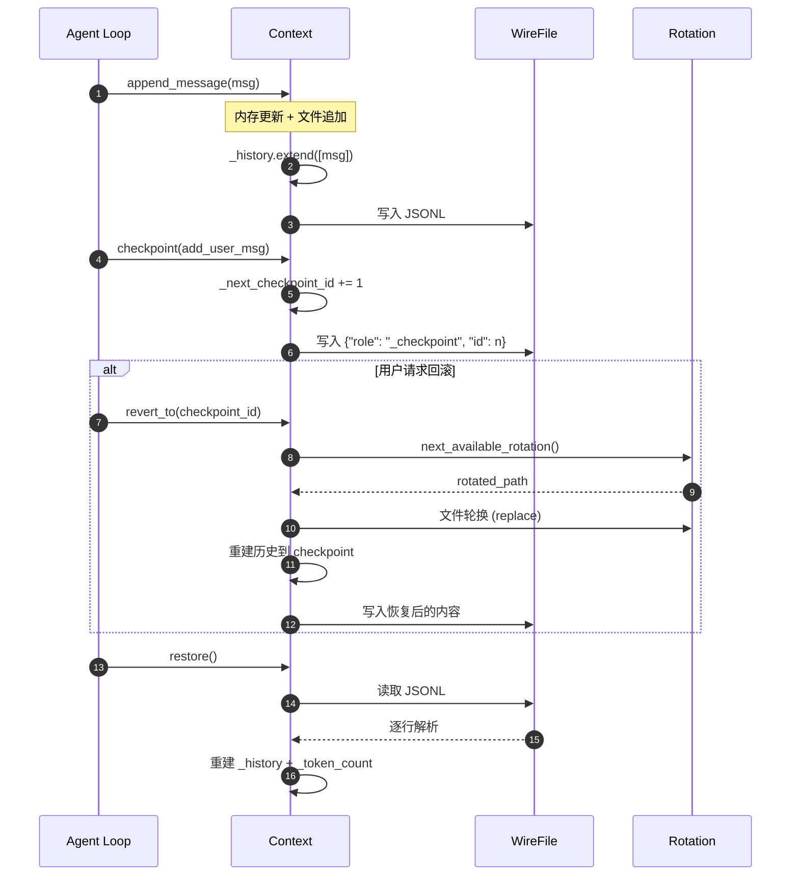
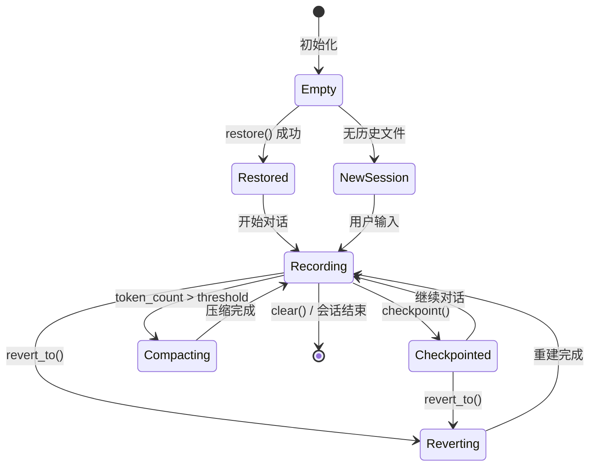
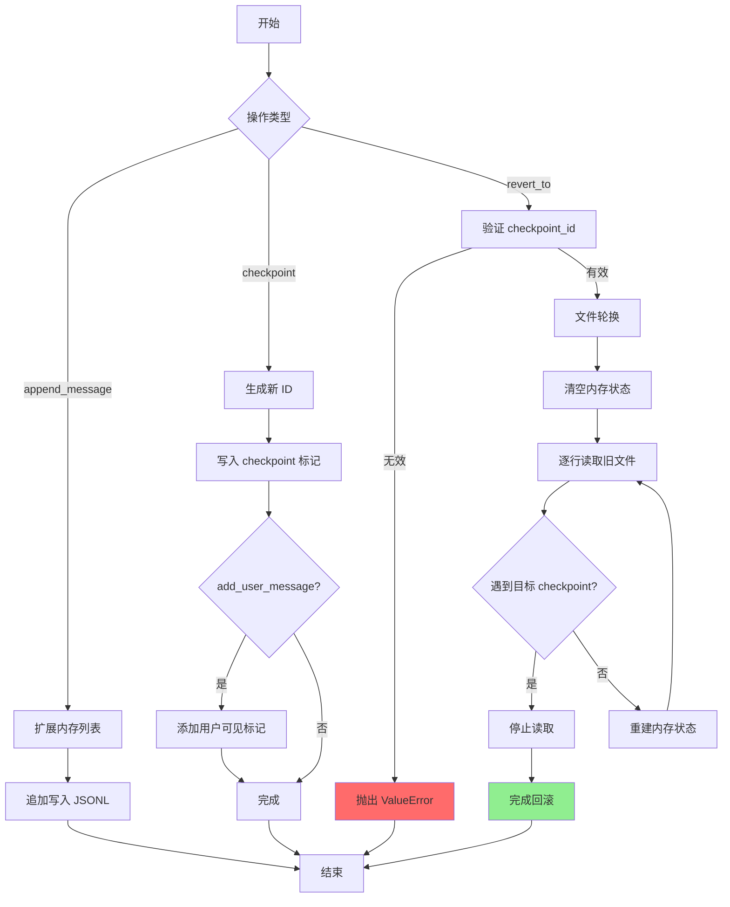
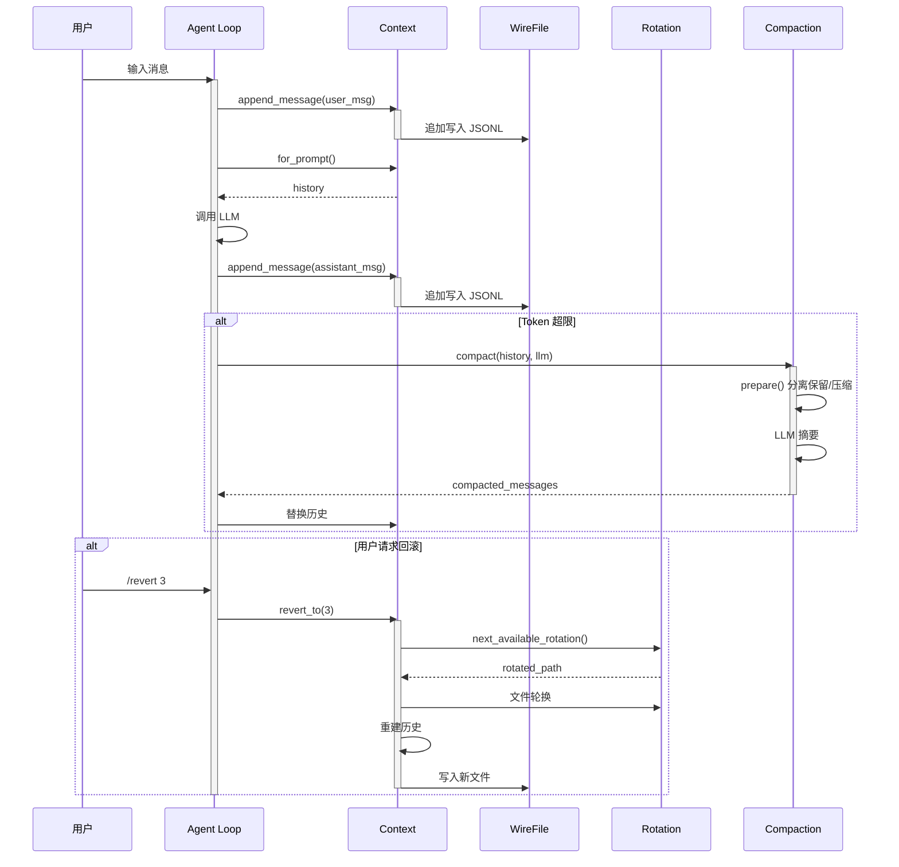
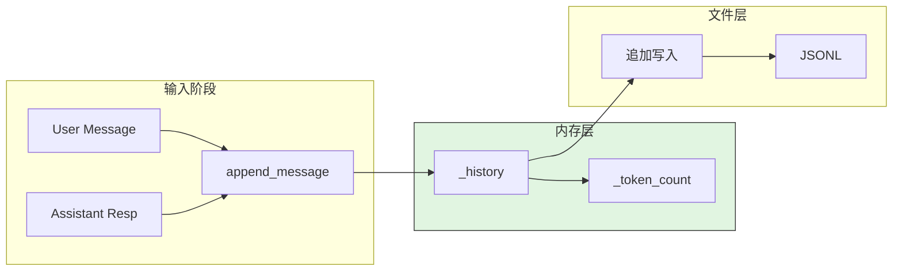
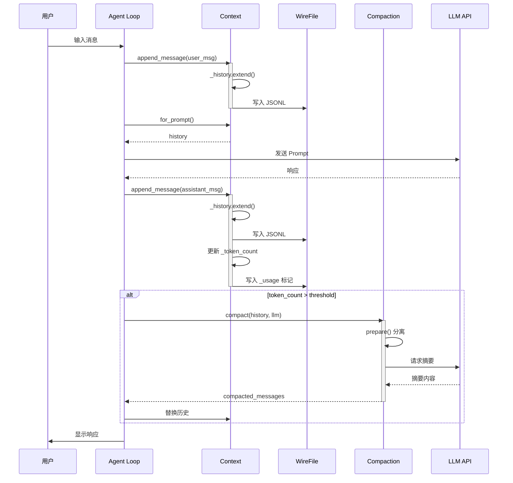
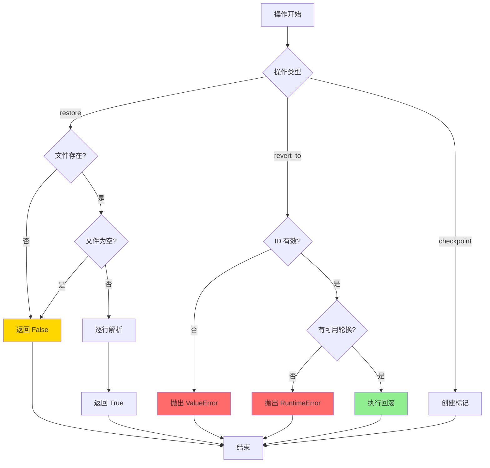
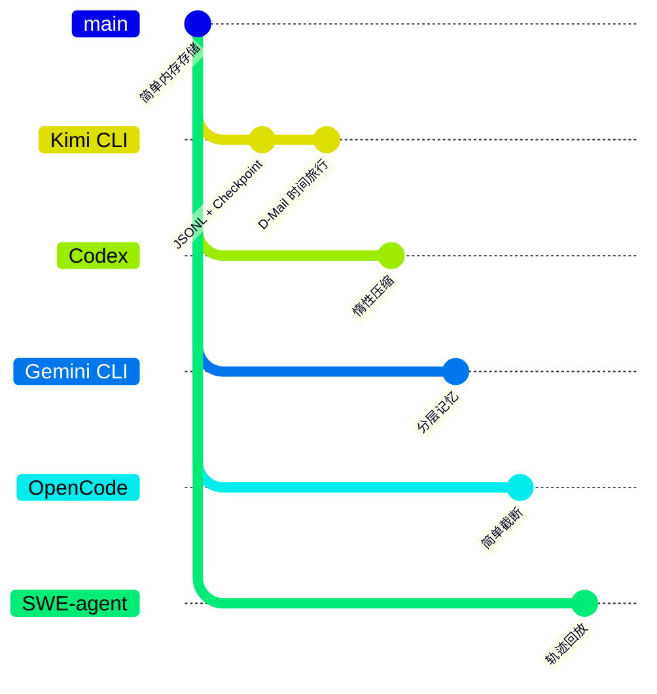

> 📋 **阅读指南**
>
> | 属性 | 说明 |
> |-----|------|
> | 预计阅读 | 20-25 分钟 |
> | 前置文档 | `01-kimi-cli-overview.md`、`04-kimi-cli-agent-loop.md` |
> | 文档结构 | 速览 → 架构 → 机制 → 实现 → 对比 |
> | 代码呈现 | 关键代码直接展示，完整代码可折叠查看 |

---

# Memory Context 管理（kimi-cli）

## TL;DR（结论先行）

一句话定义：Kimi CLI 的 Memory Context 采用"**JSONL 持久化 + Checkpoint 回滚 + D-Mail 时间旅行**"的设计，使用 JSON Lines 格式追加写入对话历史，通过 Checkpoint 标记实现任意点回滚，并提供 D-Mail 机制向历史检查点发送消息创建新的时间线。

Kimi CLI 的核心取舍：**文件持久化 + 显式 Checkpoint 标记**（对比 Gemini CLI 的分层记忆、Codex 的惰性压缩）

### 核心要点速览

| 维度 | 关键决策 | 代码位置 |
|-----|---------|---------|
| 持久化格式 | JSON Lines 追加写入，人类可读 | `src/kimi_cli/soul/context.py:169` |
| Checkpoint 机制 | 轻量级标记，递增 ID | `src/kimi_cli/soul/context.py:68` |
| 回滚实现 | 文件轮换 + 历史重建 | `src/kimi_cli/soul/context.py:80` |
| 上下文压缩 | 保留 N 条 + LLM 摘要 | `src/kimi_cli/soul/compaction.py:46` |
| D-Mail 支持 | 向历史检查点发送消息 | `src/kimi_cli/soul/kimisoul.py:290` |

---

## 1. 为什么需要这个机制？（解决什么问题）

### 1.1 问题场景

没有 Memory Context 管理：
```
长对话 → 程序崩溃 → 历史丢失 → 从头开始
用户想修改之前的决定 → 无法回退 → 只能重新开始对话
```

有 Memory Context 管理：
```
长对话 → 自动持久化到 JSONL → 程序重启后恢复 → 对话继续
用户想修改之前的决定 → /revert 到 Checkpoint → 从该点继续 → 创建新时间线
```

### 1.2 核心挑战

| 挑战 | 不解决的后果 |
|-----|-------------|
| 对话持久化 | 程序崩溃或重启后丢失所有上下文 |
| 状态回滚 | 用户无法撤销错误或尝试不同方案 |
| Token 超限 | 长对话导致上下文窗口溢出 |
| 文件管理 | 历史文件无限增长，需要轮换机制 |
| 并发安全 | 异步写入可能导致数据损坏 |

---

## 2. 整体架构（ASCII 图）

### 2.1 在系统中的位置

```text
┌─────────────────────────────────────────────────────────────┐
│ Agent Loop / KimiSoul                                        │
│ src/kimi_cli/soul/kimisoul.py                                │
└───────────────────────┬─────────────────────────────────────┘
                        │
        ┌───────────────┼───────────────┐
        ▼               ▼               ▼
┌──────────────┐ ┌──────────────┐ ┌──────────────┐
│ D-Mail       │ │ Compaction   │ │ Checkpoint   │
│ 时间旅行     │ │ 上下文压缩   │ │ 回滚机制     │
└──────┬───────┘ └──────┬───────┘ └──────┬───────┘
       │                │                │
       ▼                ▼                ▼
┌─────────────────────────────────────────────────────────────┐
│ ▓▓▓ Memory Context ▓▓▓                                      │
│ src/kimi_cli/soul/context.py                                 │
│ - Context         : 内存历史管理 + 文件持久化               │
│ - checkpoint()    : 创建检查点标记                          │
│ - revert_to()     : 回滚到指定检查点                        │
│ - append_message(): 追加消息到 JSONL                        │
└───────────────────────┬─────────────────────────────────────┘
                        │ 依赖
        ┌───────────────┼───────────────┐
        ▼               ▼               ▼
┌──────────────┐ ┌──────────────┐ ┌──────────────┐
│ WireFile     │ │ File Rotation│ │ kosong       │
│ context.jsonl│ │ 文件轮换     │ │ Message      │
└──────────────┘ └──────────────┘ └──────────────┘
```

### 2.2 核心组件职责

| 组件 | 职责 | 代码位置 |
|-----|------|---------|
| `Context` | 对话历史的内存存储与文件持久化 | `src/kimi_cli/soul/context.py:16` |
| `checkpoint()` | 创建检查点标记 | `src/kimi_cli/soul/context.py:68` |
| `revert_to()` | 回滚到指定检查点，执行文件轮换 | `src/kimi_cli/soul/context.py:80` |
| `restore()` | 从 JSONL 文件恢复上下文 | `src/kimi_cli/soul/context.py:24` |
| `SimpleCompaction` | 上下文压缩实现 | `src/kimi_cli/soul/compaction.py:42` |
| `next_available_rotation()` | 生成轮换文件路径 | `src/kimi_cli/utils/path.py:30` |

### 2.3 核心组件交互关系



**关键交互说明**：

| 步骤 | 交互内容 | 设计意图 |
|-----|---------|---------|
| 1-3 | 追加消息 | 内存与文件同步更新，保证持久化 |
| 4-5 | 创建 Checkpoint | 轻量级标记，不复制数据 |
| 6-10 | 回滚操作 | 文件轮换保留历史，重建到指定点 |
| 11-14 | 恢复操作 | 程序重启后从文件恢复状态 |

---

## 3. 核心组件详细分析

### 3.1 Context 内部结构

#### 职责定位

Context 是 Kimi CLI 内存管理的核心，负责对话历史的内存存储、文件持久化和 Checkpoint 管理。

#### 状态机图



**状态说明**：

| 状态 | 说明 | 进入条件 | 退出条件 |
|-----|------|---------|---------|
| Empty | 初始状态 | Context 创建 | 调用 restore() 或首次写入 |
| Restored | 从文件恢复 | restore() 成功 | 开始新对话 |
| NewSession | 全新会话 | 无历史文件 | 用户输入 |
| Recording | 记录中 | 开始对话 | checkpoint/revert/compact |
| Checkpointed | 已标记检查点 | checkpoint() 成功 | 继续对话 |
| Reverting | 回滚中 | revert_to() 调用 | 重建完成 |
| Compacting | 压缩中 | Token 超限 | 压缩完成 |

#### 内部数据流

```text
┌─────────────────────────────────────────────────────────────┐
│  输入层                                                      │
│  ├── User Message    ──► append_message()                   │
│  ├── Assistant Resp  ──► append_message()                   │
│  ├── Tool Output     ──► append_message()                   │
│  └── Token Count     ──► update_token_count()               │
└──────────────────────────┬──────────────────────────────────┘
                           ▼
┌─────────────────────────────────────────────────────────────┐
│  内存层                                                      │
│  ├── _history: list[Message]                                │
│  ├── _token_count: int                                      │
│  └── _next_checkpoint_id: int                               │
└──────────────────────────┬──────────────────────────────────┘
                           ▼
┌─────────────────────────────────────────────────────────────┐
│  持久化层                                                    │
│  ├── context.jsonl (JSON Lines)                             │
│  │   ├── {"role": "user", ...}                              │
│  │   ├── {"role": "assistant", ...}                         │
│  │   ├── {"role": "_usage", "token_count": n}               │
│  │   └── {"role": "_checkpoint", "id": n}                   │
│  └── context.jsonl.1 (轮换备份)                             │
└─────────────────────────────────────────────────────────────┘
```

#### 关键算法逻辑



**算法要点**：

1. **追加写入**：所有消息和标记都追加到 JSONL，保证写入效率
2. **轻量级 Checkpoint**：仅写入标记，不复制数据，回滚时重建
3. **文件轮换**：回滚时先轮换原文件，保留完整历史备份
4. **逐行重建**：恢复时逐行解析，根据 role 重建不同状态

#### 关键接口

| 接口 | 输入 | 输出 | 说明 | 代码位置 |
|-----|------|------|------|---------|
| `__init__()` | file_backend: Path | Context | 初始化空上下文 | `context.py:17` |
| `restore()` | - | bool | 从文件恢复 | `context.py:24` |
| `checkpoint()` | add_user_message: bool | - | 创建检查点 | `context.py:68` |
| `revert_to()` | checkpoint_id: int | - | 回滚到检查点 | `context.py:80` |
| `clear()` | - | - | 清空上下文 | `context.py:134` |
| `append_message()` | Message | - | 追加消息 | `context.py:162` |
| `update_token_count()` | token_count: int | - | 更新 Token 计数 | `context.py:171` |

---

### 3.2 Checkpoint 机制内部结构

#### 职责定位

Checkpoint 机制允许用户在对话的任意点创建标记，并在需要时回滚到该点，实现对话状态的时间旅行。

#### 关键算法逻辑

```python
# src/kimi_cli/soul/context.py:68-78
async def checkpoint(self, add_user_message: bool):
    checkpoint_id = self._next_checkpoint_id
    self._next_checkpoint_id += 1
    logger.debug("Checkpointing, ID: {id}", id=checkpoint_id)

    async with aiofiles.open(self._file_backend, "a", encoding="utf-8") as f:
        await f.write(json.dumps({"role": "_checkpoint", "id": checkpoint_id}) + "\n")

    if add_user_message:
        await self.append_message(
            Message(role="user", content=[system(f"CHECKPOINT {checkpoint_id}")])
        )
```

**算法要点**：

1. **递增 ID**：从 0 开始递增，保证唯一性和顺序
2. **轻量级标记**：仅写入 JSON 标记，不复制历史数据
3. **可选用户消息**：可添加用户可见的 CHECKPOINT 提示

#### 回滚算法

```python
# src/kimi_cli/soul/context.py:80-132 (简化)
async def revert_to(self, checkpoint_id: int):
    # 1. 验证 checkpoint 存在
    if checkpoint_id >= self._next_checkpoint_id:
        raise ValueError(f"Checkpoint {checkpoint_id} does not exist")

    # 2. 文件轮换
    rotated_file_path = await next_available_rotation(self._file_backend)
    await aiofiles.os.replace(self._file_backend, rotated_file_path)

    # 3. 重建历史
    self._history.clear()
    self._token_count = 0
    self._next_checkpoint_id = 0

    async with (
        aiofiles.open(rotated_file_path, encoding="utf-8") as old_file,
        aiofiles.open(self._file_backend, "w", encoding="utf-8") as new_file,
    ):
        async for line in old_file:
            line_json = json.loads(line)
            # 在目标 checkpoint 处停止
            if line_json["role"] == "_checkpoint" and line_json["id"] == checkpoint_id:
                break
            await new_file.write(line)
            # 重建内存状态...
```

**算法要点**：

1. **前置验证**：确保 checkpoint_id 有效
2. **原子轮换**：使用 replace 原子操作轮换文件
3. **流式重建**：逐行读取，内存效率高
4. **状态同步**：内存状态与文件保持一致

---

### 3.3 SimpleCompaction 内部结构

#### 职责定位

当 Token 接近上下文窗口限制时，使用 LLM 将旧历史压缩为摘要，保留最近 N 条消息。

#### 关键算法逻辑

```python
# src/kimi_cli/soul/compaction.py:42-76
class SimpleCompaction:
    def __init__(self, max_preserved_messages: int = 2) -> None:
        self.max_preserved_messages = max_preserved_messages

    async def compact(self, messages: Sequence[Message], llm: LLM) -> Sequence[Message]:
        compact_message, to_preserve = self.prepare(messages)
        if compact_message is None:
            return to_preserve

        # 调用 LLM 进行压缩
        result = await kosong.step(
            chat_provider=llm.chat_provider,
            system_prompt="You are a helpful assistant that compacts conversation context.",
            toolset=EmptyToolset(),
            history=[compact_message],
        )

        # 构建压缩后的消息
        content = [system("Previous context has been compacted...")]
        content.extend(part for part in result.message.content if not isinstance(part, ThinkPart))

        compacted_messages: list[Message] = [Message(role="user", content=content)]
        compacted_messages.extend(to_preserve)
        return compacted_messages
```

**算法要点**：

1. **保留策略**：保留最近 N 条用户/助手消息
2. **LLM 摘要**：使用独立 LLM 调用生成摘要
3. **过滤思考**：移除 ThinkPart，减少噪音

#### 准备阶段

```python
# src/kimi_cli/soul/compaction.py:82-116
def prepare(self, messages: Sequence[Message]) -> PrepareResult:
    # 从后向前遍历，保留最近的用户/助手消息
    for index in range(len(history) - 1, -1, -1):
        if history[index].role in {"user", "assistant"}:
            n_preserved += 1
            if n_preserved == self.max_preserved_messages:
                preserve_start_index = index
                break

    to_compact = history[:preserve_start_index]
    to_preserve = history[preserve_start_index:]

    # 构建压缩输入消息
    compact_message = Message(role="user", content=[])
    for i, msg in enumerate(to_compact):
        compact_message.content.append(
            TextPart(text=f"## Message {i + 1}\nRole: {msg.role}\nContent:\n")
        )
        compact_message.content.extend(
            part for part in msg.content if not isinstance(part, ThinkPart)
        )
    compact_message.content.append(TextPart(text="\n" + prompts.COMPACT))
```

---

### 3.4 组件间协作时序



**协作要点**：

1. **消息追加**：每次交互后同步内存和文件
2. **Token 检查**：超限触发 Compaction
3. **回滚流程**：文件轮换 + 历史重建
4. **异步安全**：所有文件操作使用 aiofiles

---

### 3.4 关键数据路径

#### 主路径（正常流程）



#### 异常路径（回滚流程）

```mermaid
flowchart TD
    A[revert_to(checkpoint_id)] --> B{验证 ID}
    B -->|无效| C[抛出 ValueError]
    B -->|有效| D[文件轮换]

    D --> E[清空内存]
    E --> F[逐行读取旧文件]
    F --> G{遇到 checkpoint?}
    G -->|是| H[停止读取]
    G -->|否| I[重建状态]
    I --> F

    H --> J[完成回滚]
    C --> End[结束]
    J --> End

    style C fill:#FF6B6B
    style J fill:#90EE90
```

#### 压缩路径

```mermaid
flowchart TD
    Start[Token 超限] --> Prep[prepare()]
    Prep --> Split{分离消息}
    Split -->|to_compact| Compact[LLM 摘要]
    Split -->|to_preserve| Preserve[保留]

    Compact --> Merge[合并结果]
    Preserve --> Merge
    Merge --> Replace[替换历史]
    Replace --> End[继续对话]

    style Compact fill:#87CEEB
    style Preserve fill:#90EE90
```

---

## 4. 端到端数据流转

### 4.1 正常流程（详细版）



**数据变换详情**：

| 阶段 | 输入 | 处理 | 输出 | 代码位置 |
|-----|------|------|------|---------|
| 追加 | Message | _history.extend() | 更新内存 | `context.py:164` |
| 持久化 | Message | model_dump_json() | JSONL 行 | `context.py:169` |
| 读取 | - | 逐行解析 | history 列表 | `context.py:36` |
| 压缩 | 完整历史 | LLM 摘要 | 压缩后消息 | `compaction.py:46` |
| Token 更新 | token_count | 更新 _token_count | _usage 标记 | `context.py:171` |

### 4.2 数据流向图

```mermaid
flowchart LR
    subgraph Input["输入"]
        I1[User Message]
        I2[Tool Output]
        I3[Assistant Response]
    end

    subgraph Context["Context Manager"]
        C1[_history: list[Message]]
        C2[_token_count: int]
        C3[_next_checkpoint_id: int]
    end

    subgraph File["WireFile"]
        F1[context.jsonl]
        F2[Checkpoint 标记]
        F3[_usage 标记]
    end

    subgraph Output["输出"]
        O1[Prompt 构建]
        O2[历史回滚]
    end

    I1 --> C1
    I2 --> C1
    I3 --> C1
    C1 --> F1
    C2 --> F3
    C3 --> F2
    C1 --> O1
    C1 --> O2
```

### 4.3 异常/边界流程



---

## 5. 关键代码实现

### 5.1 核心数据结构

```python
# src/kimi_cli/soul/context.py:16-22
class Context:
    def __init__(self, file_backend: Path):
        self._file_backend = file_backend
        self._history: list[Message] = []
        self._token_count: int = 0
        self._next_checkpoint_id: int = 0
        """The ID of the next checkpoint, starting from 0, incremented after each checkpoint."""
```

**字段说明**：

| 字段 | 类型 | 用途 |
|-----|------|------|
| `_file_backend` | `Path` | JSONL 文件路径 |
| `_history` | `list[Message]` | 内存中的对话历史 |
| `_token_count` | `int` | 当前 Token 计数 |
| `_next_checkpoint_id` | `int` | 下一个 Checkpoint ID |

### 5.2 主链路代码

```python
# src/kimi_cli/soul/context.py:24-50
async def restore(self) -> bool:
    """从文件恢复上下文"""
    if self._history:
        raise RuntimeError("The context storage is already modified")
    if not self._file_backend.exists():
        return False
    if self._file_backend.stat().st_size == 0:
        return False

    async with aiofiles.open(self._file_backend, encoding="utf-8") as f:
        async for line in f:
            if not line.strip():
                continue
            line_json = json.loads(line)
            if line_json["role"] == "_usage":
                self._token_count = line_json["token_count"]
            elif line_json["role"] == "_checkpoint":
                self._next_checkpoint_id = line_json["id"] + 1
            else:
                message = Message.model_validate(line_json)
                self._history.append(message)
    return True
```

**代码要点**：

1. **前置检查**：防止重复恢复，检查文件存在性和大小
2. **逐行解析**：流式读取，内存效率高
3. **角色分发**：根据 role 字段分发到不同处理逻辑
4. **状态重建**：完整重建内存状态

### 5.3 关键调用链

```text
Agent Loop
  -> Context.append_message()       [context.py:162]
    -> _history.extend()             [context.py:165]
    -> 写入 JSONL                    [context.py:169]

  -> Context.checkpoint()            [context.py:68]
    -> _next_checkpoint_id += 1      [context.py:70]
    -> 写入 checkpoint 标记          [context.py:74]

  -> Context.revert_to()             [context.py:80]
    -> 验证 checkpoint_id            [context.py:95]
    -> next_available_rotation()     [path.py:30]
    -> 文件轮换                      [context.py:104]
    -> 重建历史                      [context.py:110-132]

  -> Context.restore()               [context.py:24]
    -> 逐行解析 JSONL                [context.py:36]
    -> 重建 _history/_token_count    [context.py:41-48]

  -> SimpleCompaction.compact()      [compaction.py:46]
    -> prepare() 分离消息            [compaction.py:47]
    -> kosong.step() LLM 摘要        [compaction.py:54]
    -> 构建压缩后消息                [compaction.py:67-76]
```

---

## 6. 设计意图与 Trade-off

### 6.1 Kimi CLI 的选择

| 维度 | Kimi CLI 的选择 | 替代方案 | 取舍分析 |
|-----|----------------|---------|---------|
| 持久化格式 | JSON Lines | SQLite / 二进制 | 可读性好，便于调试；但体积较大 |
| 存储策略 | 内存 + 文件双写 | 纯内存 / 纯文件 | 访问快且持久化，但需同步维护 |
| Checkpoint | 轻量级标记 | 完整快照 | 创建快、体积小；回滚时需重建 |
| 回滚机制 | 文件轮换 + 重建 | 内存快照 / 无回滚 | 支持时间旅行；但回滚有 IO 开销 |
| 压缩策略 | 保留 N 条 + LLM 摘要 | 截断 / 滑动窗口 | 保留关键信息；但需额外 LLM 调用 |
| 并发安全 | aiofiles 异步写入 | 同步写入 / 锁机制 | 非阻塞；但需处理并发边界 |

### 6.2 为什么这样设计？

**核心问题**：如何在保证对话持久化的同时，支持灵活的状态回滚？

**Kimi CLI 的解决方案**：
- 代码依据：`context.py:68-78` 的轻量级 Checkpoint 标记
- 设计意图：通过显式标记实现任意点回滚，而非自动快照
- 带来的好处：
  - 用户可以精确控制何时创建检查点
  - 支持 D-Mail 时间旅行，向历史发送消息
  - 文件轮换保留完整历史，便于审计
  - JSONL 格式人类可读，便于调试
- 付出的代价：
  - 回滚需要重建历史，有 IO 开销
  - Checkpoint 标记占用存储空间
  - 需要管理轮换文件，防止无限增长

### 6.3 与其他项目的对比



| 项目 | 内存层次 | 持久化方式 | 回滚能力 | 压缩策略 | 适用场景 |
|-----|---------|-----------|---------|---------|---------|
| **Kimi CLI** | 单层 JSONL | 文件追加 + Checkpoint | Checkpoint + D-Mail | 保留 N 条 + LLM 摘要 | 需要精确状态恢复、时间旅行 |
| **Codex** | 单层内存 | JSON Lines Rollout | 无 | 惰性压缩 + Compaction 替换 | 通用场景、平衡性能与精度 |
| **Gemini CLI** | 三层分层 | 无（每次重新发现） | 无 | 两阶段验证压缩 | 多项目、需要精细记忆管理 |
| **OpenCode** | 简单列表 | 内存 | 无 | Token 截断 | 简单场景、资源受限 |
| **SWE-agent** | 轨迹记录 | 文件 | 状态回放 | 无 | 自动化任务、可重现 |

**核心差异分析**：

| 对比维度 | Kimi CLI | Codex | Gemini CLI | OpenCode | SWE-agent |
|---------|---------|-------|-----------|----------|-----------|
| **持久化** | JSONL 文件 | JSON Lines | 无持久化 | 内存 | 轨迹文件 |
| **回滚能力** | Checkpoint + D-Mail | 无 | 无 | 无 | 状态回放 |
| **压缩策略** | 保留 N 条 + LLM 摘要 | 惰性 Compaction | 两阶段验证 | 简单截断 | 无 |
| **发现机制** | 固定路径加载 | 内存管理 | 双向文件发现 | 简单列表 | 轨迹解析 |
| **并发处理** | aiofiles 异步 | 同步 | 异步 | 同步 | 同步 |
| **时间旅行** | D-Mail 支持 | 不支持 | 不支持 | 不支持 | 支持 |

**选择建议**：

- **Kimi CLI**：适合需要精确控制对话历史、经常需要回滚或尝试不同方案的用户
- **Codex**：适合追求简单高效，不需要复杂记忆管理的通用场景
- **Gemini CLI**：适合在多个项目间切换，且每个项目有复杂目录结构的用户
- **OpenCode**：适合简单场景，对资源占用敏感的应用
- **SWE-agent**：适合自动化任务，需要可重现和审计的场景

---

## 7. 边界情况与错误处理

### 7.1 终止条件

| 终止原因 | 触发条件 | 代码位置 |
|---------|---------|---------|
| 历史已修改 | restore() 时 _history 非空 | `context.py:26` |
| 文件不存在 | restore() 时文件不存在 | `context.py:29` |
| 文件为空 | restore() 时文件大小为 0 | `context.py:32` |
| Checkpoint 不存在 | revert_to() 时 ID >= _next_checkpoint_id | `context.py:95` |
| 无可用轮换 | next_available_rotation() 失败 | `context.py:101` |
| 消息为空 | prepare() 时 messages 为空 | `compaction.py:83` |

### 7.2 文件轮换限制

```python
# src/kimi_cli/utils/path.py:30-54
async def next_available_rotation(path: Path) -> Path | None:
    if not path.parent.exists():
        return None

    base_name = path.stem
    suffix = path.suffix
    pattern = re.compile(rf"^{re.escape(base_name)}_(\d+){re.escape(suffix)}$")
    max_num = 0
    for entry in await aiofiles.os.listdir(path.parent):
        if match := pattern.match(entry):
            max_num = max(max_num, int(match.group(1)))

    next_num = max_num + 1
    while True:
        next_path = path.parent / f"{base_name}_{next_num}{suffix}"
        if await _reserve_rotation_path(next_path):
            return next_path
        next_num += 1
```

### 7.3 错误恢复策略

| 错误类型 | 处理策略 | 代码位置 |
|---------|---------|---------|
| 历史已修改 | 抛出 RuntimeError | `context.py:27` |
| 文件不存在 | 返回 False，视为新会话 | `context.py:30` |
| 文件为空 | 返回 False，视为新会话 | `context.py:33` |
| Checkpoint 无效 | 抛出 ValueError | `context.py:97` |
| 轮换失败 | 抛出 RuntimeError | `context.py:103` |
| 压缩无需执行 | 返回原消息 | `compaction.py:49` |

---

## 8. 关键代码索引

| 功能 | 文件 | 行号 | 说明 |
|-----|------|------|------|
| Context 类定义 | `src/kimi_cli/soul/context.py` | 16 | 核心上下文管理类 |
| 恢复上下文 | `src/kimi_cli/soul/context.py` | 24 | restore() 方法 |
| 创建 Checkpoint | `src/kimi_cli/soul/context.py` | 68 | checkpoint() 方法 |
| 回滚操作 | `src/kimi_cli/soul/context.py` | 80 | revert_to() 方法 |
| 清空上下文 | `src/kimi_cli/soul/context.py` | 134 | clear() 方法 |
| 追加消息 | `src/kimi_cli/soul/context.py` | 162 | append_message() 方法 |
| 更新 Token | `src/kimi_cli/soul/context.py` | 171 | update_token_count() 方法 |
| Compaction 协议 | `src/kimi_cli/soul/compaction.py` | 17 | Compaction Protocol |
| SimpleCompaction | `src/kimi_cli/soul/compaction.py` | 42 | 简单压缩实现 |
| 压缩准备 | `src/kimi_cli/soul/compaction.py` | 82 | prepare() 方法 |
| 文件轮换 | `src/kimi_cli/utils/path.py` | 30 | next_available_rotation() |
| 路径预留 | `src/kimi_cli/utils/path.py` | 16 | _reserve_rotation_path() |

---

## 9. 延伸阅读

- 前置知识：`04-kimi-cli-agent-loop.md`（Agent Loop 如何使用 Context）
- 相关机制：`docs/kimi-cli/questions/kimi-cli-checkpoint-implementation.md`（Checkpoint 深度分析）
- 跨项目对比：`docs/comm/comm-memory-context.md`（多项目 Memory 对比）
- 相关项目：
  - `docs/codex/07-codex-memory-context.md`（Codex 的惰性压缩）
  - `docs/gemini-cli/07-gemini-cli-memory-context.md`（Gemini CLI 的分层记忆）

---

*✅ Verified: 基于 kimi-cli/src/kimi_cli/soul/context.py、compaction.py、utils/path.py 源码分析*
*基于版本：2026-02-08 | 最后更新：2026-02-24*
