# UI Interaction（Kimi CLI）

## TL;DR（结论先行）

一句话定义：Kimi CLI 的 UI Interaction 是**基于 Wire 协议的双通道消息系统**，通过 Soul（核心执行器）与 UI（可替换外壳）的解耦设计，实现交互式 Shell、批处理 Print 和 JSON-RPC Wire Server 三种形态的统一支持。

Kimi CLI 的核心取舍：**Wire 协议解耦 + 双通道消息（raw/merged）**（对比 Codex 的 Ratatui、Gemini CLI 的 Ink.js 组件化）

---

## 1. 为什么需要这个机制？（解决什么问题）

### 1.1 问题场景

没有 UI Interaction 系统：
```
Soul 直接输出到终端 → 无法支持多种交互形态 → 批处理/远程控制难以实现
同步阻塞式交互 → 审批/工具调用卡住 UI → 并发子代理无法并行显示
消息无结构化 → 无法回放/记录 → 调试困难
```

有 UI Interaction 系统：
```
Soul ──► Wire 协议 ──► Shell UI（交互式）
                 ├─► Print UI（批处理）
                 └─► Wire Server（JSON-RPC 远程控制）

异步消息通道 → 审批/工具请求不阻塞 Soul → 支持并发子代理
双通道设计（raw/merged）→ 精确语义 + 平滑体验 → 可回放可阅读
```

### 1.2 核心挑战

| 挑战 | 不解决的后果 |
|-----|-------------|
| 多 UI 形态支持 | 代码重复，维护困难 |
| 异步审批/工具调用 | 阻塞主循环，并发子代理卡死 |
| 消息合并与精确性 | UI 闪烁频繁或语义丢失 |
| 取消信号传递 | Ctrl-C 无法及时终止任务 |
| Wire 消息持久化 | 无法回放历史会话 |

---

## 2. 整体架构（ASCII 图）

### 2.1 在系统中的位置

```text
┌─────────────────────────────────────────────────────────────┐
│ CLI Entry / Session Runtime                                  │
│ kimi-cli/src/kimi_cli/cli/__init__.py                        │
└───────────────────────┬─────────────────────────────────────┘
                        │ 启动 UI
                        ▼
┌─────────────────────────────────────────────────────────────┐
│ ▓▓▓ UI 形态层 ▓▓▓                                           │
│ kimi-cli/src/kimi_cli/ui/                                    │
│ - shell/__init__.py  : 交互式 Shell（主界面）                │
│ - print/__init__.py  : 批处理/管道模式                       │
│ - wire/server.py     : JSON-RPC 远程服务                   │
└───────────────────────┬─────────────────────────────────────┘
                        │ 调用 run_soul()
                        ▼
┌─────────────────────────────────────────────────────────────┐
│ ▓▓▓ Wire 协议层 ▓▓▓                                         │
│ kimi-cli/src/kimi_cli/wire/__init__.py                       │
│ - Wire               : 双通道消息总线                        │
│ - WireSoulSide       : Soul 侧发送端                         │
│ - WireUISide         : UI 侧接收端                           │
└───────────────────────┬─────────────────────────────────────┘
                        │ 消息传递
                        ▼
┌─────────────────────────────────────────────────────────────┐
│ ▓▓▓ Soul 核心层 ▓▓▓                                         │
│ kimi-cli/src/kimi_cli/soul/                                  │
│ - kimisoul.py        : Agent Loop 实现                       │
│ - __init__.py        : run_soul() 统一入口                   │
└─────────────────────────────────────────────────────────────┘
```

### 2.2 核心组件职责

| 组件 | 职责 | 代码位置 |
|-----|------|---------|
| `Shell` | 交互式主界面，处理用户输入和 slash 命令 | `kimi-cli/src/kimi_cli/ui/shell/__init__.py:35` |
| `Print` | 批处理模式，支持管道和文件输入 | `kimi-cli/src/kimi_cli/ui/print/__init__.py:28` |
| `WireServer` | JSON-RPC 远程服务，支持外部客户端 | `kimi-cli/src/kimi_cli/wire/server.py:60` |
| `Wire` | 双通道消息总线，连接 Soul 和 UI | `kimi-cli/src/kimi_cli/wire/__init__.py:18` |
| `WireSoulSide` | Soul 侧发送端，支持消息合并 | `kimi-cli/src/kimi_cli/wire/__init__.py:66` |
| `WireUISide` | UI 侧接收端，消费 Wire 消息 | `kimi-cli/src/kimi_cli/wire/__init__.py:115` |
| `run_soul()` | 统一运行入口，处理并发和取消 | `kimi-cli/src/kimi_cli/soul/__init__.py:121` |

### 2.3 核心组件交互关系

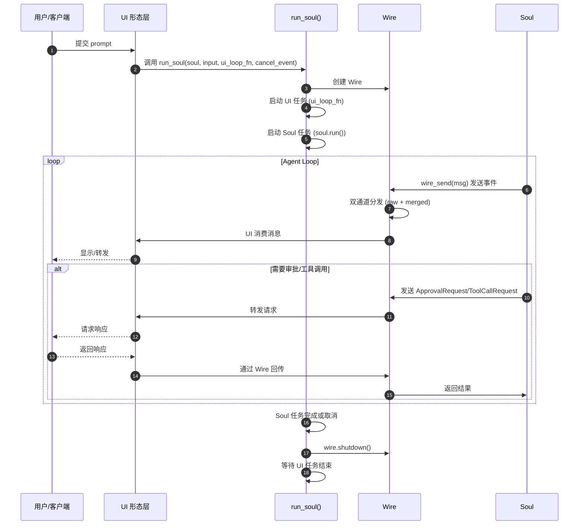

**关键交互说明**：

| 步骤 | 交互内容 | 设计意图 |
|-----|---------|---------|
| 1-2 | UI 调用 run_soul | 统一入口，不同 UI 形态行为一致 |
| 3-5 | 创建 Wire + 双任务 | Soul 和 UI 并发运行，通过 Wire 通信 |
| 6-9 | 消息双通道分发 | raw 用于精确语义，merged 用于平滑体验 |
| 10-14 | 请求/响应异步处理 | 不阻塞 Soul 主循环，支持并发子代理 |
| 15-17 | 优雅关闭 | 确保消息全部消费，资源正确释放 |

---

## 3. 核心组件详细分析

### 3.1 Wire 内部结构

#### 职责定位

Wire 是 Soul 与 UI 之间的通信桥梁，提供双通道（raw/merged）消息分发和可选的持久化记录。

#### 状态机图

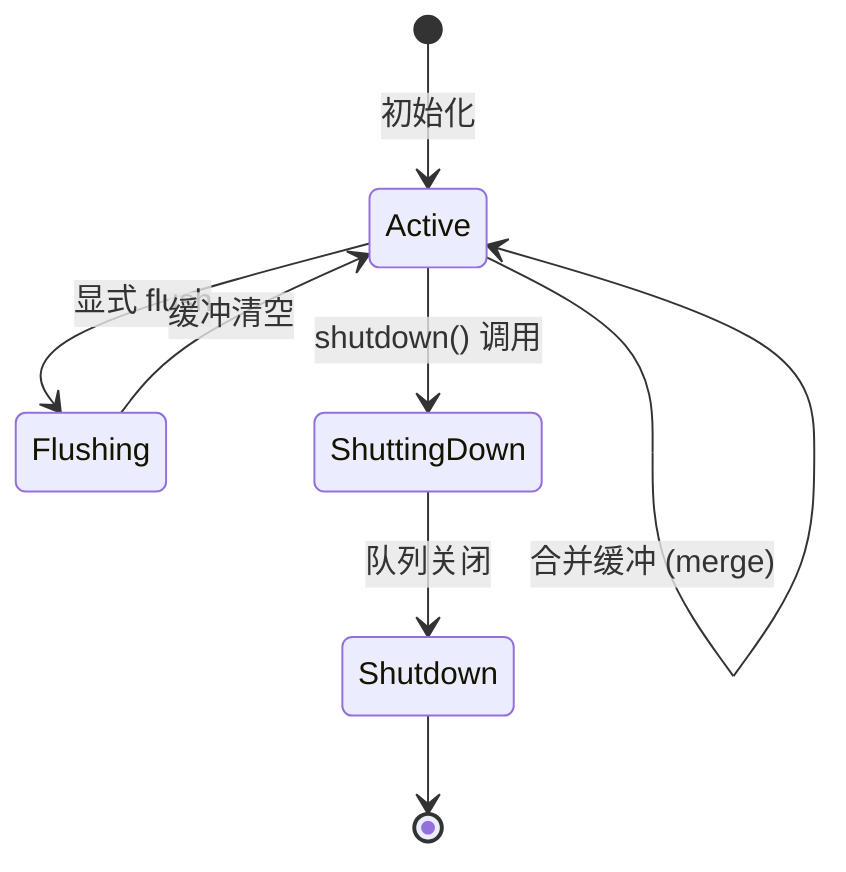

**状态说明**：

| 状态 | 说明 | 进入条件 | 退出条件 |
|-----|------|---------|---------|
| Active | 正常运行 | Wire 初始化完成 | 调用 shutdown |
| Flushing | 刷新合并缓冲 | 非合并消息到达或显式 flush | 缓冲发送完成 |
| ShuttingDown | 正在关闭 | 调用 shutdown() | 队列关闭完成 |
| Shutdown | 已关闭 | 队列关闭 | 销毁 |

#### 内部数据流

```text
┌─────────────────────────────────────────────────────────────┐
│  Soul 侧发送层                                               │
│  ├── wire_send(msg)                                         │
│  │   └── 获取当前 Wire (ContextVar)                         │
│  └── WireSoulSide.send(msg)                                 │
│      ├── 发送到 raw_queue (精确语义)                        │
│      └── 合并后发送到 merged_queue (平滑体验)               │
└──────────────────────────┬──────────────────────────────────┘
                           ▼
┌─────────────────────────────────────────────────────────────┐
│  双通道分发层                                                │
│  ├── raw_queue ──► BroadcastQueue ──► UI (merge=False)     │
│  ├── merged_queue ──► BroadcastQueue ──► UI (merge=True)   │
│  └── recorder ──► 持久化到 wire.jsonl (可选)               │
└──────────────────────────┬──────────────────────────────────┘
                           ▼
┌─────────────────────────────────────────────────────────────┐
│  UI 侧消费层                                                 │
│  ├── WireUISide.receive()                                   │
│  │   └── 异步等待消息                                       │
│  └── 不同类型消息处理                                       │
│      ├── 事件消息 (TurnBegin, StepBegin, ...)              │
│      ├── 内容消息 (ContentPart, ToolCallPart)              │
│      └── 请求消息 (ApprovalRequest, ToolCallRequest)       │
└─────────────────────────────────────────────────────────────┘
```

#### 关键算法逻辑

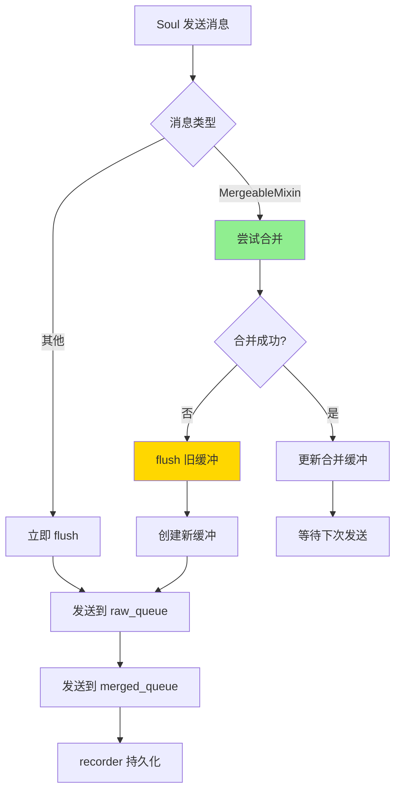

**算法要点**：

1. **合并策略**：`MergeableMixin` 消息（如文本片段）可合并，减少 UI 刷新次数
2. **自动 flush**：非合并消息到达时自动 flush 缓冲，确保时序正确
3. **双队列广播**：使用 `BroadcastQueue` 支持多 UI 端同时消费

#### 关键接口

| 接口 | 输入 | 输出 | 说明 | 代码位置 |
|-----|------|------|------|---------|
| `WireSoulSide.send()` | `WireMessage` | - | 发送消息到双通道 | `kimi-cli/src/kimi_cli/wire/__init__.py:76` |
| `WireSoulSide.flush()` | - | - | 强制刷新合并缓冲 | `kimi-cli/src/kimi_cli/wire/__init__.py:100` |
| `WireUISide.receive()` | - | `WireMessage` | 异步接收消息 | `kimi-cli/src/kimi_cli/wire/__init__.py:123` |
| `Wire.shutdown()` | - | - | 关闭 Wire | `kimi-cli/src/kimi_cli/wire/__init__.py:51` |

---

### 3.2 run_soul() 统一运行器

#### 职责定位

`run_soul()` 是所有 UI 形态的统一入口，负责协调 Soul 执行、UI 渲染和取消信号处理。

#### 内部数据流

```text
┌─────────────────────────────────────────────────────────────┐
│  初始化阶段                                                  │
│  ├── 创建 Wire (可选 file_backend)                          │
│  ├── 设置 ContextVar (_current_wire)                        │
│  └── 准备取消事件 (asyncio.Event)                           │
└──────────────────────────┬──────────────────────────────────┘
                           ▼
┌─────────────────────────────────────────────────────────────┐
│  并发执行阶段                                                │
│  ├── UI 任务: ui_loop_fn(wire)                              │
│  ├── Soul 任务: soul.run(user_input)                        │
│  └── 取消监听: cancel_event.wait()                          │
└──────────────────────────┬──────────────────────────────────┘
                           ▼
┌─────────────────────────────────────────────────────────────┐
│  结束处理阶段                                                │
│  ├── 判断完成原因 (正常结束/取消)                           │
│  ├── 取消 Soul 任务 (如需要)                                │
│  ├── 关闭 Wire (shutdown + join)                            │
│  └── 等待 UI 任务结束 (0.5s 超时)                           │
└─────────────────────────────────────────────────────────────┘
```

#### 关键代码

```python
# kimi-cli/src/kimi_cli/soul/__init__.py:121-184
async def run_soul(
    soul: Soul,
    user_input: str | list[ContentPart],
    ui_loop_fn: UILoopFn,
    cancel_event: asyncio.Event,
    wire_file: WireFile | None = None,
) -> None:
    wire = Wire(file_backend=wire_file)
    wire_token = _current_wire.set(wire)

    # 并发启动 UI 和 Soul 任务
    ui_task = asyncio.create_task(ui_loop_fn(wire))
    soul_task = asyncio.create_task(soul.run(user_input))
    cancel_event_task = asyncio.create_task(cancel_event.wait())

    await asyncio.wait(
        [soul_task, cancel_event_task],
        return_when=asyncio.FIRST_COMPLETED,
    )

    try:
        if cancel_event.is_set():
            soul_task.cancel()
            try:
                await soul_task
            except asyncio.CancelledError:
                raise RunCancelled from None
        else:
            # 正常完成，清理取消监听任务
            cancel_event_task.cancel()
            soul_task.result()
    finally:
        # 优雅关闭
        wire.shutdown()
        await wire.join()
        try:
            await asyncio.wait_for(ui_task, timeout=0.5)
        except TimeoutError:
            logger.warning("UI loop timed out")
        _current_wire.reset(wire_token)
```

**代码要点**：

1. **并发模型**：UI 和 Soul 并行运行，通过 Wire 异步通信
2. **取消处理**：监听外部取消事件，优雅终止 Soul 任务
3. **超时保护**：UI 任务关闭超时 0.5s，防止无限等待

---

### 3.3 WireServer 远程服务

#### 职责定位

WireServer 提供 JSON-RPC 接口，允许外部客户端（如 IDE 插件）通过 stdio 与 Soul 交互。

#### 状态机图

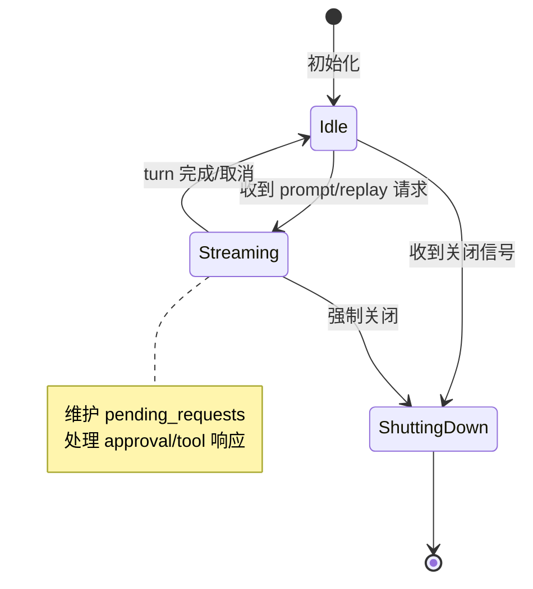

#### 请求处理流程

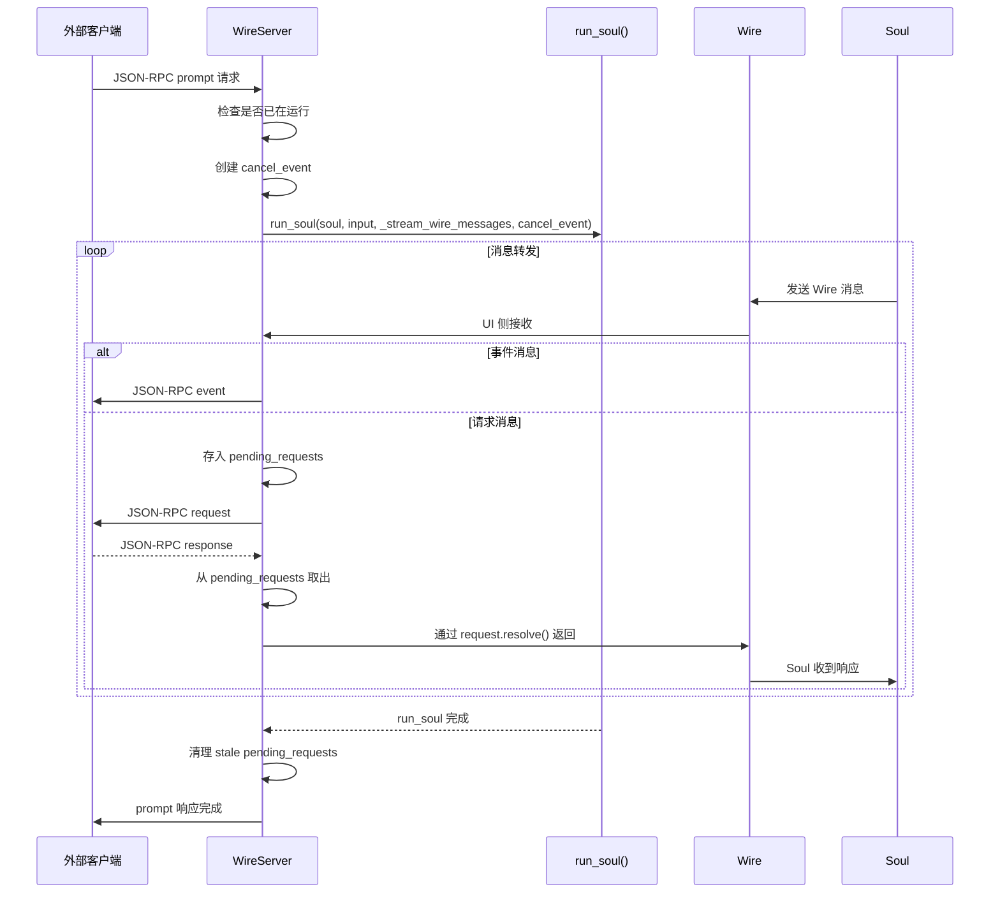

**关键设计**：

1. **非阻塞请求**：Approval/Tool 请求发送后不等待，让出事件循环处理其他消息
2. **Pending 管理**：使用 `dict[str, Request]` 跟踪未完成的请求
3. **Stale 清理**：Turn 结束时自动清理未解决的请求，防止内存泄漏

---

### 3.4 组件间协作时序

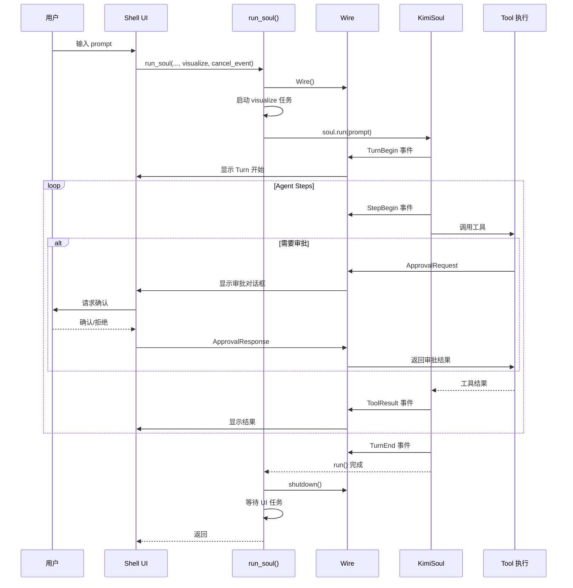

---

### 3.5 关键数据路径

#### 主路径（正常消息流）

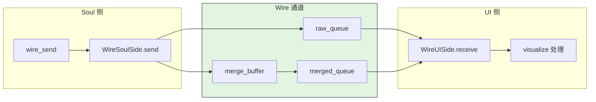

#### 异常路径（取消处理）

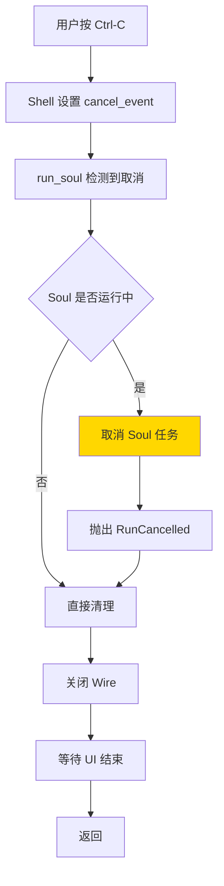

---

## 4. 端到端数据流转

### 4.1 正常流程（详细版）

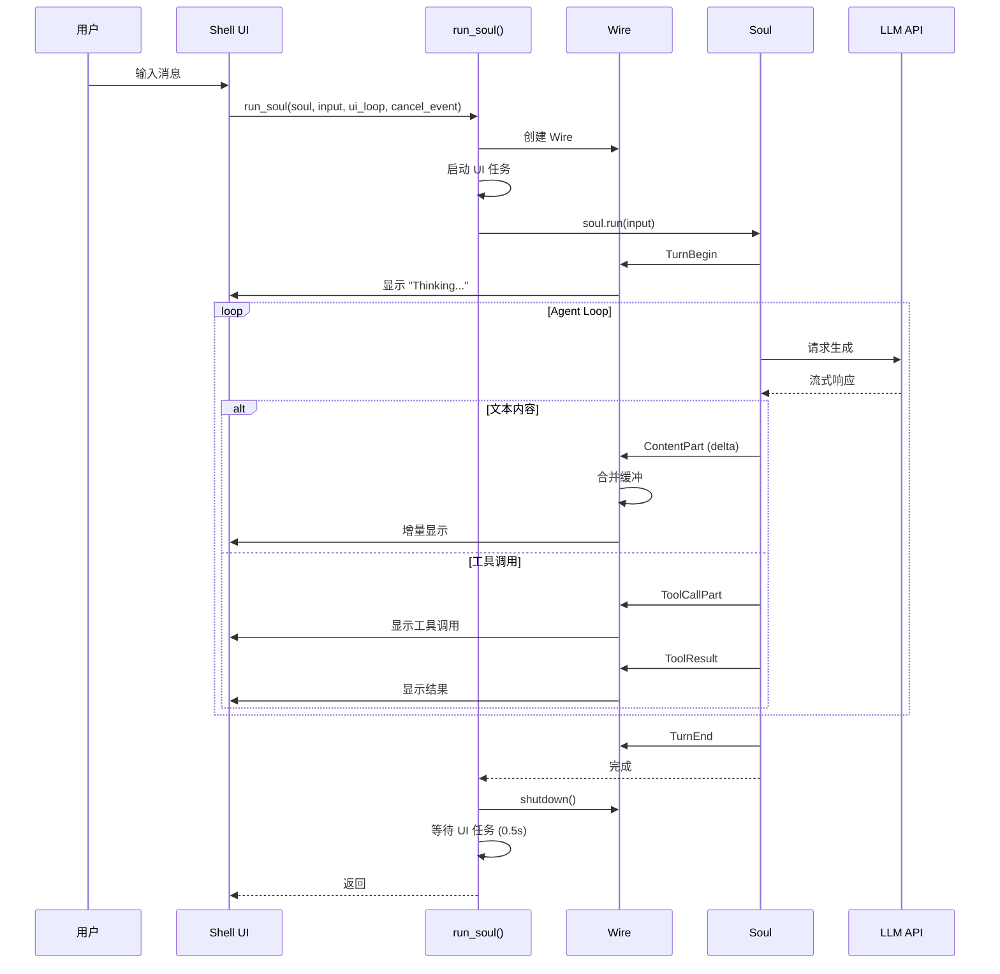

**数据变换详情**：

| 阶段 | 输入 | 处理 | 输出 | 代码位置 |
|-----|------|------|------|---------|
| 输入 | 用户消息 | Shell 解析 | `str \| list[ContentPart]` | `kimi-cli/src/kimi_cli/ui/shell/__init__.py:84` |
| Wire 创建 | file_backend | 初始化双队列 | `Wire` 对象 | `kimi-cli/src/kimi_cli/soul/__init__.py:141` |
| 消息发送 | `WireMessage` | 合并 + 双通道分发 | raw/merged 队列 | `kimi-cli/src/kimi_cli/wire/__init__.py:76` |
| UI 消费 | `WireMessage` | 渲染处理 | 终端显示 | `kimi-cli/src/kimi_cli/ui/shell/visualize.py` |
| 关闭 | - | shutdown + join | 资源释放 | `kimi-cli/src/kimi_cli/soul/__init__.py:173` |

### 4.2 数据流向图

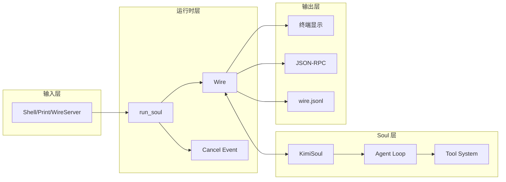

### 4.3 异常/边界流程

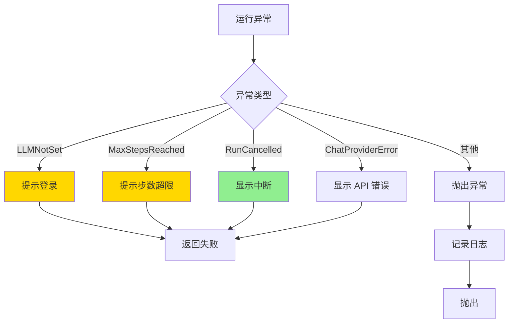

---

## 5. 关键代码实现

### 5.1 核心数据结构

```python
# kimi-cli/src/kimi_cli/wire/types.py
# Wire 消息类型层次
class WireMessage(BaseModel): ...

class Event(WireMessage):
    """事件消息，单向通知"""
    ...

class Request(WireMessage):
    """请求消息，需要响应"""
    id: str
    _future: asyncio.Future

class ContentPart(Event, MergeableMixin):
    """可合并的文本内容"""
    content: str

class ToolCallPart(Event):
    """工具调用"""
    tool_call_id: str
    tool_name: str
    arguments: dict

class ApprovalRequest(Request):
    """审批请求"""
    tool_name: str
    arguments: dict

class ToolCallRequest(Request):
    """外部工具调用请求"""
    tool_name: str
    arguments: dict
```

**字段说明**：

| 字段 | 类型 | 用途 |
|-----|------|------|
| `id` | `str` | 请求唯一标识，用于响应匹配 |
| `_future` | `asyncio.Future` | 异步等待响应 |
| `content` | `str` | 文本内容，支持合并 |
| `tool_call_id` | `str` | 工具调用唯一标识 |

### 5.2 主链路代码

```python
# kimi-cli/src/kimi_cli/wire/__init__.py:76-98
class WireSoulSide:
    def send(self, msg: WireMessage) -> None:
        # 1. 发送到 raw_queue（精确语义）
        try:
            self._raw_queue.publish_nowait(msg)
        except QueueShutDown:
            logger.info("Failed to send raw wire message...")

        # 2. 合并并发送到 merged_queue（平滑体验）
        match msg:
            case MergeableMixin():
                if self._merge_buffer is None:
                    self._merge_buffer = copy.deepcopy(msg)
                elif self._merge_buffer.merge_in_place(msg):
                    pass  # 合并成功，不发送
                else:
                    self.flush()  # 合并失败，先 flush
                    self._merge_buffer = copy.deepcopy(msg)
            case _:
                self.flush()  # 非合并消息，先 flush
                self._send_merged(msg)
```

**代码要点**：

1. **双通道并行**：raw 队列保证精确语义，merged 队列提供平滑体验
2. **就地合并**：`merge_in_place` 减少内存分配
3. **自动 flush**：非合并消息触发缓冲 flush，确保时序

### 5.3 关键调用链

```text
Shell.run()
  -> Shell.run_soul_command()          [kimi-cli/src/kimi_cli/ui/shell/__init__.py:214]
    -> run_soul()                       [kimi-cli/src/kimi_cli/soul/__init__.py:121]
      -> Wire()                         [kimi-cli/src/kimi_cli/wire/__init__.py:23]
      -> ui_task = asyncio.create_task(ui_loop_fn(wire))
      -> soul_task = asyncio.create_task(soul.run(user_input))
      -> asyncio.wait([soul_task, cancel_event_task], FIRST_COMPLETED)
      -> wire.shutdown()                [kimi-cli/src/kimi_cli/wire/__init__.py:51]
      -> wire.join()

Soul 消息发送链:
  wire_send(msg)                        [kimi-cli/src/kimi_cli/soul/__init__.py:197]
    -> get_wire_or_none()               [kimi-cli/src/kimi_cli/soul/__init__.py:189]
    -> wire.soul_side.send(msg)         [kimi-cli/src/kimi_cli/wire/__init__.py:76]
      -> _raw_queue.publish_nowait(msg)
      -> _send_merged(msg) / merge

WireServer 请求处理链:
  _stream_wire_messages()               [kimi-cli/src/kimi_cli/wire/server.py:631]
    -> wire.ui_side(merge=False).receive()
    -> match msg:
         ApprovalRequest -> _request_approval()
           -> _pending_requests[msg_id] = request
           -> _send_msg(JSONRPCRequestMessage)
         ToolCallRequest -> _request_external_tool()
           -> _pending_requests[msg_id] = request
           -> _send_msg(JSONRPCRequestMessage)
    -> _handle_response()
      -> request = _pending_requests.pop(msg.id)
      -> request.resolve(result)
```

---

## 6. 设计意图与 Trade-off

### 6.1 Kimi CLI 的选择

| 维度 | Kimi CLI 的选择 | 替代方案 | 取舍分析 |
|-----|----------------|---------|---------|
| UI 架构 | Wire 协议解耦 | 内置 TUI（Ratatui/Ink.js） | 支持多种 UI 形态，但增加协议复杂度 |
| 消息通道 | 双通道（raw/merged） | 单通道 | 同时满足精确性和体验，但维护成本高 |
| 并发模型 | asyncio 协程 | 多线程 | 适合 IO 密集型，但需要处理取消 |
| 远程协议 | JSON-RPC over stdio | HTTP/WebSocket | 简单可靠，但仅限本地进程 |
| 消息合并 | 运行时合并 | 发送前合并 | 灵活，但需要缓冲管理 |

### 6.2 为什么这样设计？

**核心问题**：如何在单一代码库支持交互式 Shell、批处理管道和远程控制三种场景？

**Kimi CLI 的解决方案**：
- 代码依据：`kimi-cli/src/kimi_cli/soul/__init__.py:121` 的 `run_soul()` 统一入口
- 设计意图：Soul 作为纯执行内核，通过 Wire 协议与 UI 解耦
- 带来的好处：
  - 同一 Soul 逻辑支持 Shell/Print/WireServer 三种形态
  - UI 可独立演进，甚至由外部实现（如 IDE 插件）
  - 消息可持久化，支持会话回放
- 付出的代价：
  - Wire 协议需要维护前后兼容
  - 双通道增加内存和 CPU 开销
  - 异步编程模型增加调试难度

### 6.3 与其他项目的对比

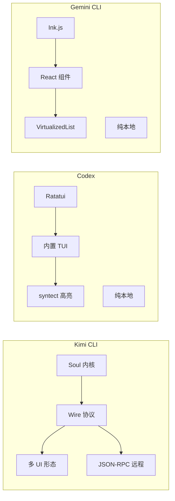

| 项目 | UI 框架 | 核心差异 | 适用场景 |
|-----|---------|---------|---------|
| **Kimi CLI** | Wire 协议 | 解耦 Soul 与 UI，支持远程控制 | 需要多种交互形态、IDE 集成 |
| **Codex** | Ratatui (Rust) | 高性能 TUI，专业语法高亮 | 代码阅读密集型、本地使用 |
| **Gemini CLI** | Ink.js (React) | 组件化开发，调试抽屉 | 复杂交互、多对话框 |
| **OpenCode** | Ink.js (React) | 可配置渲染，流式 Markdown | 类似 Gemini，可自定义样式 |
| **SWE-agent** | 自定义 | 研究导向，日志为主 | 自动化任务、学术研究 |

**核心差异分析**：

1. **架构模式**：
   - Kimi CLI：协议解耦，Soul 与 UI 分离
   - Codex/Gemini：内置 TUI，UI 与核心紧耦合

2. **远程支持**：
   - Kimi CLI：原生支持 JSON-RPC 远程控制
   - 其他项目：仅限本地终端交互

3. **消息处理**：
   - Kimi CLI：双通道（raw/merged）兼顾精确与体验
   - 其他项目：单通道直接渲染

---

## 7. 边界情况与错误处理

### 7.1 终止条件

| 终止原因 | 触发条件 | 代码位置 |
|---------|---------|---------|
| 正常完成 | Agent Loop 无更多工具调用 | `kimi-cli/src/kimi_cli/soul/kimisoul.py` |
| 用户取消 | Ctrl-C 触发 cancel_event | `kimi-cli/src/kimi_cli/ui/shell/__init__.py:223-227` |
| 步数超限 | step_count >= max_steps | `kimi-cli/src/kimi_cli/soul/kimisoul.py` |
| LLM 未设置 | 未登录或配置 | `kimi-cli/src/kimi_cli/soul/__init__.py:245-247` |
| Wire 关闭 | 队列 shutdown | `kimi-cli/src/kimi_cli/wire/__init__.py:51` |

### 7.2 超时/资源限制

```python
# kimi-cli/src/kimi_cli/soul/__init__.py:176
await asyncio.wait_for(ui_task, timeout=0.5)  # UI 关闭超时 0.5s

# kimi-cli/src/kimi_cli/wire/server.py:57
STDIO_BUFFER_LIMIT = 100 * 1024 * 1024  # 100MB 缓冲区上限
```

### 7.3 错误恢复策略

| 错误类型 | 处理策略 | 代码位置 |
|---------|---------|---------|
| Soul 异常 | 捕获并显示错误信息，返回失败 | `kimi-cli/src/kimi_cli/ui/shell/__init__.py:245-270` |
| Wire 队列关闭 | 忽略后续消息，记录日志 | `kimi-cli/src/kimi_cli/wire/__init__.py:84` |
| 响应 ID 不匹配 | 记录警告，继续处理 | `kimi-cli/src/kimi_cli/wire/server.py:589-595` |
| Stale pending | Turn 结束时自动清理 | `kimi-cli/src/kimi_cli/wire/server.py:449-461` |

---

## 8. 关键代码索引

| 功能 | 文件 | 行号 | 说明 |
|-----|------|------|------|
| 统一运行入口 | `kimi-cli/src/kimi_cli/soul/__init__.py` | 121 | `run_soul()` 函数 |
| 消息发送 | `kimi-cli/src/kimi_cli/soul/__init__.py` | 197 | `wire_send()` 函数 |
| Wire 实现 | `kimi-cli/src/kimi_cli/wire/__init__.py` | 18 | `Wire` 类 |
| Soul 侧发送 | `kimi-cli/src/kimi_cli/wire/__init__.py` | 76 | `WireSoulSide.send()` |
| UI 侧接收 | `kimi-cli/src/kimi_cli/wire/__init__.py` | 123 | `WireUISide.receive()` |
| Shell UI | `kimi-cli/src/kimi_cli/ui/shell/__init__.py` | 35 | `Shell` 类 |
| Print UI | `kimi-cli/src/kimi_cli/ui/print/__init__.py` | 28 | `Print` 类 |
| Wire Server | `kimi-cli/src/kimi_cli/wire/server.py` | 60 | `WireServer` 类 |
| 请求转发 | `kimi-cli/src/kimi_cli/wire/server.py` | 631 | `_stream_wire_messages()` |
| 响应处理 | `kimi-cli/src/kimi_cli/wire/server.py` | 566 | `_handle_response()` |
| Pending 清理 | `kimi-cli/src/kimi_cli/wire/server.py` | 449 | Turn 结束清理 stale requests |

---

## 9. 延伸阅读

- 前置知识：`02-kimi-cli-cli-entry.md`、`04-kimi-cli-agent-loop.md`
- 相关机制：`06-kimi-cli-mcp-integration.md`、`07-kimi-cli-memory-context.md`
- 对比文档：
  - `docs/codex/08-codex-ui-interaction.md` - Ratatui TUI 方案
  - `docs/gemini-cli/08-gemini-cli-ui-interaction.md` - Ink.js 组件化方案
  - `docs/comm/08-comm-ui-interaction.md` - 跨项目对比总结

---

*✅ Verified: 基于 kimi-cli/src/kimi_cli/{soul,wire,ui}/ 源码分析*
*基于版本：2026-02-08 | 最后更新：2026-02-24*
