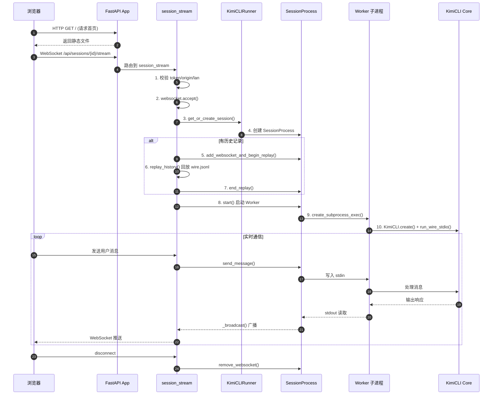
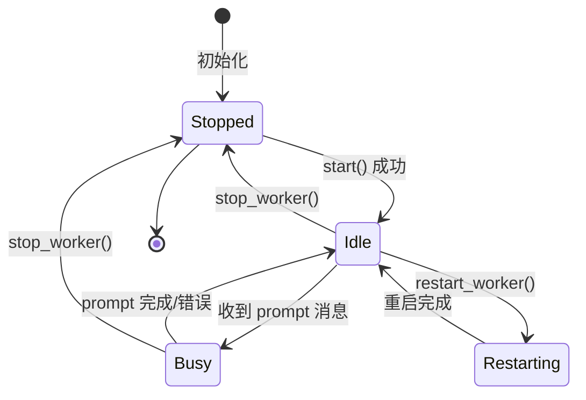
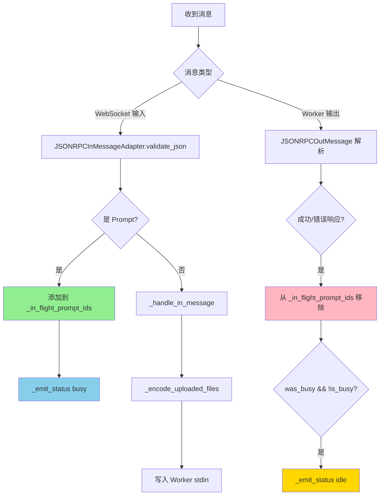
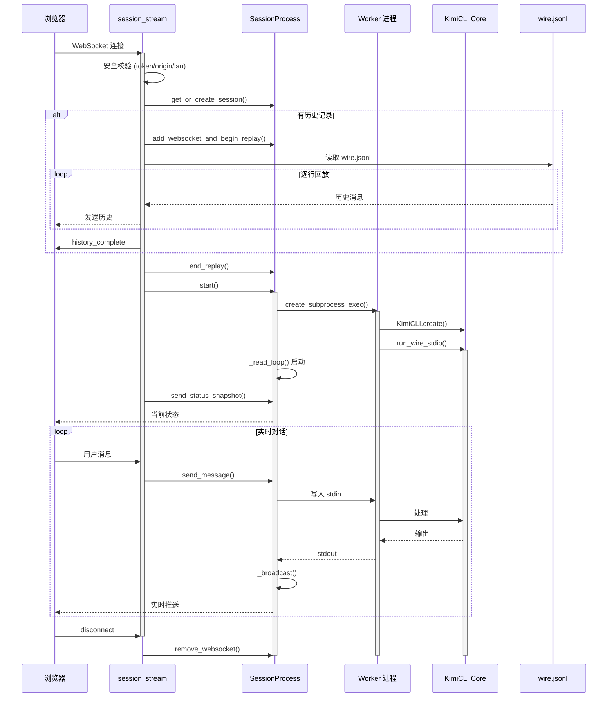
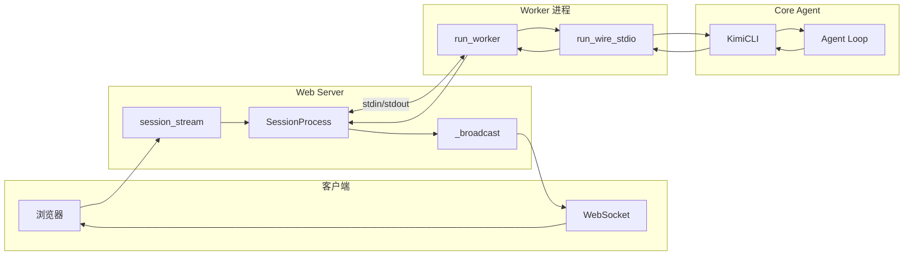
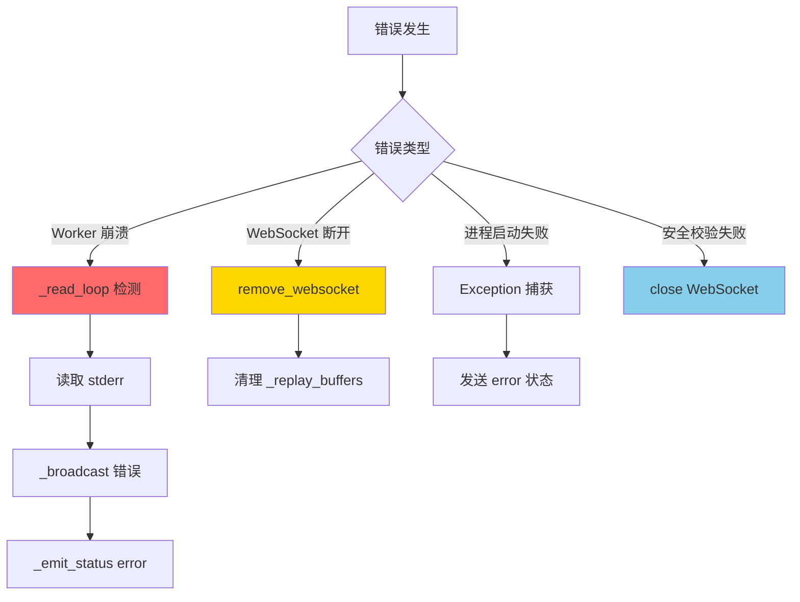
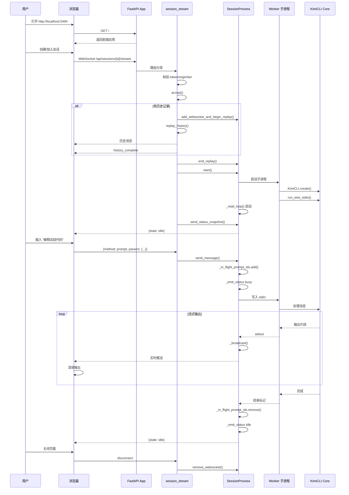
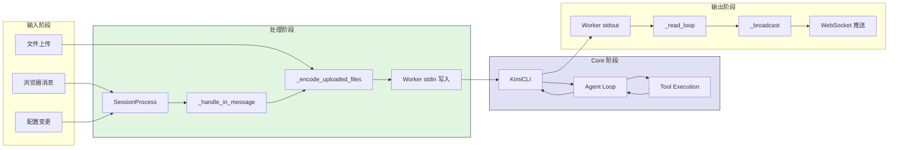
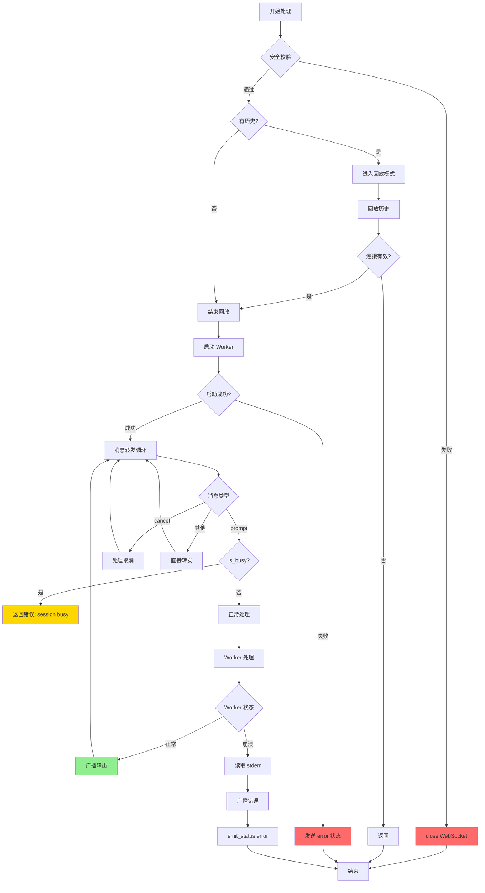
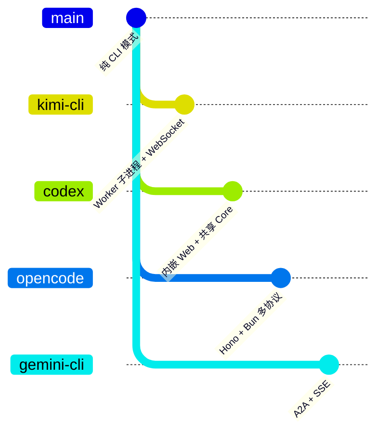

# Web Server（kimi-cli）

## TL;DR（结论先行）

一句话定义：Kimi CLI 的 Web Server 是**基于 FastAPI 的分层执行架构**，采用"API 网关 + Session Runner + Worker 子进程"模型，通过 WebSocket 实现实时通信和历史回放。

Kimi CLI 的核心取舍：**Worker 子进程隔离 + 历史回放机制**（对比 Codex 的内嵌共享模式、OpenCode 的 Hono+Bun 多协议架构、Gemini CLI 的 A2A+SSE 协议）

---

## 1. 为什么需要这个机制？（解决什么问题）

### 1.1 问题场景

没有 Web Server：
```
仅支持终端交互 → 需要熟悉命令行 → 非技术用户门槛高
终端限制 → 无法展示复杂 UI → 体验受限
单会话阻塞 → 无法同时处理多个任务
```

有 Web Server：
```
浏览器访问 → 图形化界面 → 降低使用门槛
WebSocket 实时通信 + 历史回放 → 流式输出 + 会话恢复 → 类 ChatGPT 体验
多 Session 并发 → Worker 子进程隔离 → 任务互不干扰
```

### 1.2 核心挑战

| 挑战 | 不解决的后果 |
|-----|-------------|
| HTTP 生命周期与 Agent 执行生命周期隔离 | 单进程崩溃影响所有会话 |
| 会话状态持久化 | 页面刷新后丢失对话历史 |
| 新客户端加入时的历史同步 | 后进入的用户看不到之前的对话 |
| 并发安全 | 多 WebSocket 连接同时写入导致数据混乱 |
| 进程间通信 | Worker 与主进程消息转发复杂 |

---

## 2. 整体架构（ASCII 图）

### 2.1 在系统中的位置

```text
┌─────────────────────────────────────────────────────────────┐
│ CLI Entry                                                    │
│ kimi-cli/src/kimi_cli/cli/web.py                             │
│ kimi web 命令入口                                            │
└───────────────────────┬─────────────────────────────────────┘
                        │ 调用 run_web_server()
                        ▼
┌─────────────────────────────────────────────────────────────┐
│ ▓▓▓ Web Server (FastAPI) ▓▓▓                                │
│ kimi-cli/src/kimi_cli/web/app.py                             │
│ - run_web_server(): 服务器启动入口                           │
│ - create_app(): FastAPI 应用创建                             │
│ - lifespan: 启动 KimiCLIRunner                              │
└───────────────────────┬─────────────────────────────────────┘
                        │ 管理
                        ▼
┌─────────────────────────────────────────────────────────────┐
│ Session Runner                                               │
│ kimi-cli/src/kimi_cli/web/runner/process.py                  │
│ - KimiCLIRunner: 多会话管理器                                │
│ - SessionProcess: 单会话 Worker 管理                         │
└───────────────────────┬─────────────────────────────────────┘
                        │ 启动子进程
                        ▼
┌─────────────────────────────────────────────────────────────┐
│ Worker Subprocess                                            │
│ kimi-cli/src/kimi_cli/web/runner/worker.py                   │
│ - run_worker(): 加载会话并执行 KimiCLI                       │
│ - run_wire_stdio(): 核心 Agent 执行                         │
└───────────────────────┬─────────────────────────────────────┘
                        │ 调用
                        ▼
┌─────────────────────────────────────────────────────────────┐
│ Core Agent Logic                                             │
│ kimi-cli/src/kimi_cli/app.py                                 │
│ - KimiCLI: 核心应用类                                        │
│ - run_wire_stdio(): Wire 协议 stdio 模式                    │
└─────────────────────────────────────────────────────────────┘
```

### 2.2 核心组件职责

| 组件 | 职责 | 代码位置 |
|-----|------|---------|
| `run_web_server()` | Web 服务器启动入口，配置安全参数 | `kimi-cli/src/kimi_cli/web/app.py:286` |
| `create_app()` | FastAPI 应用创建，注册路由和中间件 | `kimi-cli/src/kimi_cli/web/app.py:137` |
| `KimiCLIRunner` | 多会话进程管理，会话生命周期控制 | `kimi-cli/src/kimi_cli/web/runner/process.py:659` |
| `SessionProcess` | 单会话 Worker 子进程管理，WebSocket 广播 | `kimi-cli/src/kimi_cli/web/runner/process.py:54` |
| `session_stream()` | WebSocket 连接处理，历史回放 | `kimi-cli/src/kimi_cli/web/api/sessions.py:1044` |
| `run_worker()` | Worker 子进程入口，加载会话 | `kimi-cli/src/kimi_cli/web/runner/worker.py:26` |

### 2.3 核心组件交互关系



**关键交互说明**：

| 步骤 | 交互内容 | 设计意图 |
|-----|---------|---------|
| 1-2 | 多层安全校验 | 不仅依赖中间件，WS 入口显式校验 |
| 5-7 | 历史回放机制 | 新客户端先回放历史，再接收实时消息 |
| 8-10 | Worker 子进程隔离 | HTTP 生命周期与 Agent 执行生命周期分离 |
| loop | 双向转发 | 浏览器消息写入 Worker stdin，Worker 输出广播到所有 WS |

---

## 3. 核心组件详细分析

### 3.1 SessionProcess 内部结构

#### 职责定位

SessionProcess 是单会话的核心管理器，负责 Worker 子进程的生命周期管理、WebSocket 广播、历史回放缓冲。

#### 状态机图



**状态说明**：

| 状态 | 说明 | 进入条件 | 退出条件 |
|-----|------|---------|---------|
| Stopped | Worker 未运行 | 初始化或停止后 | 调用 start() |
| Idle | Worker 运行中，空闲 | start() 成功 | 收到新 prompt 或停止 |
| Busy | 正在处理 prompt | 收到 prompt 消息 | 处理完成或出错 |
| Restarting | 正在重启 Worker | 调用 restart_worker() | 重启完成 |

#### 内部数据流

```text
┌─────────────────────────────────────────────────────────────┐
│  输入层                                                      │
│  ├── WebSocket 消息 ──► JSONRPCInMessageAdapter 验证        │
│  └── Worker stdout ──► JSONRPCOutMessage 解析               │
└──────────────────────────┬──────────────────────────────────┘
                           ▼
┌─────────────────────────────────────────────────────────────┐
│  处理层                                                      │
│  ├── _in_flight_prompt_ids: 跟踪进行中的 prompt             │
│  ├── _handle_in_message(): 处理输入（文件编码等）           │
│  ├── _handle_out_message(): 处理输出（状态更新）            │
│  └── _read_loop(): 持续读取 Worker stdout                   │
└──────────────────────────┬──────────────────────────────────┘
                           ▼
┌─────────────────────────────────────────────────────────────┐
│  输出层                                                      │
│  ├── _broadcast(): 广播到所有 WebSocket                     │
│  ├── _replay_buffers: 回放模式缓冲                          │
│  └── _emit_status(): 状态变更通知                           │
└─────────────────────────────────────────────────────────────┘
```

#### 关键算法逻辑



**算法要点**：

1. **_in_flight_prompt_ids 跟踪**：使用 Set 跟踪进行中的 prompt，支持并发检测
2. **文件编码处理**：_encode_uploaded_files() 自动处理图片、视频、文本文件上传
3. **回放缓冲机制**：新 WebSocket 连接先进入回放模式，缓冲实时消息
4. **状态自动流转**：基于 _in_flight_prompt_ids 自动判断 busy/idle 状态

#### 关键接口

| 接口 | 输入 | 输出 | 说明 | 代码位置 |
|-----|------|------|------|---------|
| `start()` | reason, detail | None | 启动 Worker 子进程 | `process.py:174` |
| `stop_worker()` | reason | None | 停止 Worker，保持 WebSocket | `process.py:228` |
| `restart_worker()` | reason | None | 重启 Worker 子进程 | `process.py:259` |
| `send_message()` | message | None | 发送消息到 Worker | `process.py:626` |
| `_broadcast()` | message | None | 广播到所有 WebSocket | `process.py:526` |
| `add_websocket_and_begin_replay()` | WebSocket | None | 添加 WS 并进入回放模式 | `process.py:561` |

---

### 3.2 WebSocket 会话流内部结构

#### 职责定位

session_stream 处理 WebSocket 连接的完整生命周期，包括安全校验、历史回放、Worker 启动、消息转发。

#### 关键算法逻辑

```python
# kimi-cli/src/kimi_cli/web/api/sessions.py:1044-1205
async def session_stream(session_id, websocket, runner):
    # 1. 安全校验
    if lan_only and not is_private_ip(client_ip):
        await websocket.close(code=4403)
        return
    if enforce_origin and not is_origin_allowed(origin):
        await websocket.close(code=4403)
        return
    if expected_token and not verify_token(token, expected_token):
        await websocket.close(code=4401)
        return

    await websocket.accept()

    # 2. 检查会话和历史
    session = load_session_by_id(session_id)
    has_history = wire_file.exists()

    session_process = await runner.get_or_create_session(session_id)

    # 3. 历史回放（如果有）
    if has_history:
        await session_process.add_websocket_and_begin_replay(websocket)
        await replay_history(websocket, session_dir)

    # 4. 检查连接是否仍然有效
    if not await send_history_complete(websocket):
        return

    # 5. 启动 Worker
    await session_process.end_replay(websocket)
    await session_process.start()
    await session_process.send_status_snapshot(websocket)

    # 6. 消息转发循环
    while True:
        message = await websocket.receive_text()
        # 拒绝新 prompt 当 session busy
        if session_process.is_busy and is_prompt_message(message):
            await websocket.send_text(error_response)
            continue
        await session_process.send_message(message)
```

**算法要点**：

1. **多层安全校验**：LAN-only、Origin、Token 三层校验
2. **回放模式切换**：先回放历史，再切换到实时模式
3. **Busy 状态拒绝**：防止并发 prompt 导致状态混乱
4. **优雅断开处理**：finally 块确保 WebSocket 被正确移除

---

### 3.3 组件间协作时序



**协作要点**：

1. **浏览器与 session_stream**：WebSocket 长连接，支持历史回放和实时通信
2. **session_stream 与 SessionProcess**：通过 Runner 获取或创建会话进程
3. **SessionProcess 与 Worker**：子进程隔离，通过 stdin/stdout 通信
4. **Worker 与 Core**：加载会话配置，执行核心 Agent 逻辑

---

### 3.4 关键数据路径

#### 主路径（正常流程）



#### 异常路径（错误处理）



---

## 4. 端到端数据流转

### 4.1 正常流程（详细版）



**数据变换详情**：

| 阶段 | 输入 | 处理 | 输出 | 代码位置 |
|-----|------|------|------|---------|
| HTTP 加载 | GET / | 静态文件服务 | index.html | `app.py:242` |
| WebSocket 握手 | WS upgrade | 多层安全校验 | WebSocket 连接 | `sessions.py:1044` |
| 历史回放 | wire.jsonl | 逐行读取发送 | 历史消息 | `sessions.py:1108` |
| Worker 启动 | session_id | create_subprocess_exec | Worker 进程 | `process.py:205` |
| 消息转发 | JSONRPC 消息 | stdin 写入 | Worker 处理 | `process.py:655` |
| 广播分发 | Worker stdout | _broadcast() | WebSocket 推送 | `process.py:526` |

### 4.2 数据流向图



### 4.3 异常/边界流程



---

## 5. 关键代码实现

### 5.1 核心数据结构

```python
# kimi-cli/src/kimi_cli/web/runner/process.py:54-102
class SessionProcess:
    """Manages a single session's KimiCLI subprocess.

    Handles:
    - Starting/stopping the subprocess
    - Reading from stdout (wire messages from KimiCLI)
    - Writing to stdin (user input to KimiCLI)
    - Broadcasting messages to connected WebSockets
    """

    def __init__(self, session_id: UUID) -> None:
        self.session_id = session_id
        self._in_flight_prompt_ids: set[str] = set()  # 跟踪进行中的 prompt
        self._status_seq = 0
        self._worker_id: str | None = None
        self._status = SessionStatus(
            session_id=self.session_id,
            state="stopped",
            seq=self._status_seq,
            worker_id=self._worker_id,
            reason=None,
            detail=None,
            updated_at=datetime.now(UTC),
        )
        self._process: asyncio.subprocess.Process | None = None
        self._websockets: set[WebSocket] = set()
        self._websocket_count = 0
        self._replay_buffers: dict[WebSocket, list[str]] = {}  # 回放缓冲
        self._read_task: asyncio.Task[None] | None = None
        self._expecting_exit = False
        self._lock = asyncio.Lock()
        self._ws_lock = asyncio.Lock()
        self._sent_files: set[str] = set()
```

**字段说明**：

| 字段 | 类型 | 用途 |
|-----|------|------|
| `_in_flight_prompt_ids` | `set[str]` | 跟踪进行中的 prompt ID，用于 busy 状态判断 |
| `_replay_buffers` | `dict[WebSocket, list[str]]` | 回放模式缓冲，存储实时消息 |
| `_websockets` | `set[WebSocket]` | 连接的 WebSocket 集合 |
| `_lock` | `asyncio.Lock` | Worker 生命周期和 busy 状态锁 |
| `_ws_lock` | `asyncio.Lock` | WebSocket 状态锁 |

### 5.2 主链路代码

```python
# kimi-cli/src/kimi_cli/web/runner/process.py:174-222
async def start(
    self,
    *,
    reason: str | None = None,
    detail: str | None = None,
    restart_started_at: float | None = None,
) -> None:
    """Start the KimiCLI subprocess."""
    async with self._lock:
        if self.is_alive:
            if self._read_task is None or self._read_task.done():
                self._read_task = asyncio.create_task(self._read_loop())
            return

        self._in_flight_prompt_ids.clear()
        self._expecting_exit = False
        self._worker_id = str(uuid4())

        # 16MB buffer for large messages (e.g., base64-encoded images)
        STREAM_LIMIT = 16 * 1024 * 1024

        if getattr(sys, "frozen", False):
            worker_cmd = [sys.executable, "__web-worker", str(self.session_id)]
        else:
            worker_cmd = [
                sys.executable,
                "-m",
                "kimi_cli.web.runner.worker",
                str(self.session_id),
            ]

        self._process = await asyncio.create_subprocess_exec(
            *worker_cmd,
            stdin=asyncio.subprocess.PIPE,
            stdout=asyncio.subprocess.PIPE,
            stderr=asyncio.subprocess.PIPE,
            limit=STREAM_LIMIT,
            env=get_clean_env(),
        )

        self._read_task = asyncio.create_task(self._read_loop())
        if restart_started_at is not None:
            elapsed_ms = int((time.perf_counter() - restart_started_at) * 1000)
            detail = f"restart_ms={elapsed_ms}"
            await self._emit_status("idle", reason=reason or "start", detail=detail)
            await self._emit_restart_notice(reason=reason, restart_ms=elapsed_ms)
        else:
            await self._emit_status("idle", reason=reason or "start", detail=None)
```

**代码要点**：

1. **Worker 子进程隔离**：通过 `create_subprocess_exec` 启动独立 Python 进程
2. **大消息支持**：16MB 缓冲区支持 base64 编码的图片等大消息
3. **干净环境**：`get_clean_env()` 确保子进程环境隔离
4. **重启优化**：记录重启耗时，便于性能分析

### 5.3 关键调用链

```text
kimi web (CLI)
  -> run_web_server()                    [kimi_cli/web/app.py:286]
    -> find_available_port()              [kimi_cli/web/app.py:248]
    -> create_app()                       [kimi_cli/web/app.py:137]
      -> lifespan()                       [kimi_cli/web/app.py:168]
        -> KimiCLIRunner()                [kimi_cli/web/runner/process.py:659]
        -> runner.start()
    -> uvicorn.run()

WebSocket 连接
  -> session_stream()                     [kimi_cli/web/api/sessions.py:1044]
    -> 安全校验 (token/origin/lan)        [sessions.py:1066-1083]
    -> runner.get_or_create_session()     [sessions.py:1098]
    -> session_process.add_websocket_and_begin_replay()  [sessions.py:1103]
    -> replay_history()                   [sessions.py:1108]
    -> session_process.end_replay()       [sessions.py:1132]
    -> session_process.start()            [sessions.py:1133]
      -> create_subprocess_exec()         [process.py:205]
        -> python -m kimi_cli.web.runner.worker <session_id>
          -> run_worker()                 [worker.py:26]
            -> KimiCLI.create()           [worker.py:51]
            -> run_wire_stdio()           [worker.py:61]
```

---

## 6. 设计意图与 Trade-off

### 6.1 Kimi CLI 的选择

| 维度 | Kimi CLI 的选择 | 替代方案 | 取舍分析 |
|-----|----------------|---------|---------|
| 进程模型 | Worker 子进程隔离 | 单进程/线程池 | 崩溃隔离性好，但 IPC 复杂 |
| 通信协议 | WebSocket + JSON-RPC | SSE/gRPC | 双向实时通信，但连接管理复杂 |
| 历史同步 | wire.jsonl 文件回放 | 内存缓冲/数据库 | 简单可靠，但磁盘 IO |
| 并发控制 | _in_flight_prompt_ids Set | 队列/锁 | 简单有效，但功能有限 |
| Web 框架 | FastAPI | Flask/Tornado | 现代异步支持，但依赖较重 |
| 安全策略 | 多层校验 (middleware + WS) | 仅 middleware | 更安全，但代码冗余 |

### 6.2 为什么这样设计？

**核心问题**：如何在 Web 模式下保证 Agent 执行的稳定性和安全性？

**Kimi CLI 的解决方案**：

- **代码依据**：`kimi-cli/src/kimi_cli/web/runner/process.py:54-102`
- **设计意图**：
  - Worker 子进程隔离确保单个会话崩溃不影响其他会话
  - 历史回放机制让新客户端可以完整恢复会话状态
  - 多层安全校验防止未授权访问
  - 文件上传自动编码简化前端实现
- **带来的好处**：
  - 单会话崩溃不影响整体服务
  - 页面刷新后可恢复完整对话
  - 新加入用户可以看到历史消息
  - 安全控制更严格
- **付出的代价**：
  - 进程间通信增加复杂度
  - 历史回放增加磁盘 IO
  - 多 WebSocket 广播增加内存使用

### 6.3 与其他项目的对比



| 项目 | 核心差异 | 适用场景 |
|-----|---------|---------|
| Kimi CLI | Worker 子进程隔离 + 历史回放 | 需要高稳定性、会话恢复 |
| Codex | 内嵌 Web + 共享 Core | 需要同时支持 CLI 和 Web |
| OpenCode | Hono + Bun 多协议 (REST/WebSocket/SSE/MCP/ACP) | 需要多协议支持、高性能 |
| Gemini CLI | A2A 协议 + SSE 流式 | Google 生态集成、Agent 间协作 |

**详细对比**：

| 维度 | Kimi CLI | Codex | OpenCode | Gemini CLI |
|-----|----------|-------|----------|------------|
| **进程模型** | Worker 子进程 | 共享进程 | Bun 运行时 | Node.js 进程 |
| **Web 框架** | FastAPI | Axum | Hono | Express.js |
| **实时通信** | WebSocket | WebSocket | WebSocket + SSE | SSE |
| **历史同步** | wire.jsonl 回放 | Session 恢复 | 内存状态 | GCS 持久化 |
| **协议格式** | JSON-RPC 2.0 | JSON | REST/OpenAPI | A2A (JSON-RPC) |
| **并发控制** | _in_flight_prompt_ids | Channel 缓冲 | 异步队列 | executingTasks Set |
| **文件上传** | 自动编码 (图片/视频/文本) | 前端处理 | 前端处理 | 前端处理 |
| **安全机制** | Token + Origin + LAN-only | CORS | Basic Auth | 内网部署 |

**设计选择分析**：

1. **Kimi CLI 选择 Worker 子进程**：将 HTTP 生命周期与 Agent 执行生命周期隔离，降低单进程崩溃半径，支持多会话并发管理
2. **Codex 选择共享 Core**：Web 层只做协议转换，业务逻辑复用 core，维护成本低
3. **OpenCode 选择多协议**：支持 REST、WebSocket、SSE、MCP、ACP 多种协议，扩展性强
4. **Gemini CLI 选择 A2A**：遵循 Google 主导的 A2A 协议标准，支持 Agent Card 服务发现

---

## 7. 边界情况与错误处理

### 7.1 终止条件

| 终止原因 | 触发条件 | 代码位置 |
|---------|---------|---------|
| Worker 正常退出 | run_wire_stdio() 完成 | `process.py:301` |
| Worker 异常退出 | 进程崩溃/错误 | `process.py:302-323` |
| WebSocket 断开 | 浏览器关闭/网络异常 | `sessions.py:1196-1201` |
| 会话停止 | 调用 stop() | `process.py:223-226` |
| Worker 重启 | 调用 restart_worker() | `process.py:259-264` |
| 安全校验失败 | token/origin/lan 校验失败 | `sessions.py:1067-1083` |

### 7.2 超时/资源限制

```python
# kimi-cli/src/kimi_cli/web/runner/process.py:192-212
# 16MB buffer for large messages (e.g., base64-encoded images)
STREAM_LIMIT = 16 * 1024 * 1024

# Worker 停止超时
await asyncio.wait_for(self._process.wait(), timeout=10.0)  # process.py:241

# Runner 停止超时
await asyncio.wait(tasks, timeout=5.0)  # process.py:678
```

**资源限制说明**：
- 消息缓冲区：16MB（支持 base64 编码的大图片）
- Worker 停止超时：10 秒
- Runner 停止超时：5 秒
- 无全局消息历史限制（依赖磁盘空间）

### 7.3 错误恢复策略

| 错误类型 | 处理策略 | 代码位置 |
|---------|---------|---------|
| Worker 崩溃 | 读取 stderr，广播错误，emit_status error | `process.py:302-323` |
| WebSocket 发送失败 | 标记断开，清理 _replay_buffers | `process.py:540-555` |
| 会话不存在 | 返回 4004 错误码关闭连接 | `sessions.py:1089-1091` |
| 安全校验失败 | 返回 4401/4403 错误码关闭连接 | `sessions.py:1067-1083` |
| 进程启动失败 | 发送 error 状态，记录 detail | `sessions.py:1135-1152` |
| 文件编码失败 | 跳过失败文件，不阻塞上传 | `process.py:474-492` |

---

## 8. 关键代码索引

| 功能 | 文件 | 行号 | 说明 |
|-----|------|------|------|
| Web 服务器入口 | `kimi-cli/src/kimi_cli/web/app.py` | 286 | run_web_server() |
| FastAPI 应用创建 | `kimi-cli/src/kimi_cli/web/app.py` | 137 | create_app() |
| 安全中间件 | `kimi-cli/src/kimi_cli/web/app.py` | 201 | AuthMiddleware |
| WebSocket 处理 | `kimi-cli/src/kimi_cli/web/api/sessions.py` | 1044 | session_stream() |
| Session Runner | `kimi-cli/src/kimi_cli/web/runner/process.py` | 659 | KimiCLIRunner |
| Session Process | `kimi-cli/src/kimi_cli/web/runner/process.py` | 54 | SessionProcess |
| Worker 启动 | `kimi-cli/src/kimi_cli/web/runner/process.py` | 174 | start() |
| Worker 子进程 | `kimi-cli/src/kimi_cli/web/runner/worker.py` | 26 | run_worker() |
| 广播机制 | `kimi-cli/src/kimi_cli/web/runner/process.py` | 526 | _broadcast() |
| 历史回放 | `kimi-cli/src/kimi_cli/web/api/sessions.py` | 1108 | replay_history() |
| 文件编码 | `kimi-cli/src/kimi_cli/web/runner/process.py` | 377 | _encode_uploaded_files() |
| 状态管理 | `kimi-cli/src/kimi_cli/web/runner/process.py` | 133 | _build_status() |
| 安全配置 | `kimi-cli/src/kimi_cli/web/app.py` | 52 | DEFAULT_PORT 等常量 |

---

## 9. 延伸阅读

- 前置知识：[04-kimi-cli-agent-loop.md](./04-kimi-cli-agent-loop.md)
- 相关机制：[07-kimi-cli-memory-context.md](./07-kimi-cli-memory-context.md)
- 对比文档：[09-comm-web-server.md](../comm/09-comm-web-server.md)
- 其他项目：
  - [09-codex-web-server.md](../codex/09-codex-web-server.md)
  - [09-opencode-web-server.md](../opencode/09-opencode-web-server.md)
  - [09-gemini-cli-web-server.md](../gemini-cli/09-gemini-cli-web-server.md)

---

*✅ Verified: 基于 kimi-cli/src/kimi_cli/web/app.py、runner/process.py、runner/worker.py、api/sessions.py 等源码分析*
*基于版本：2026-02 | 最后更新：2026-02-24*
