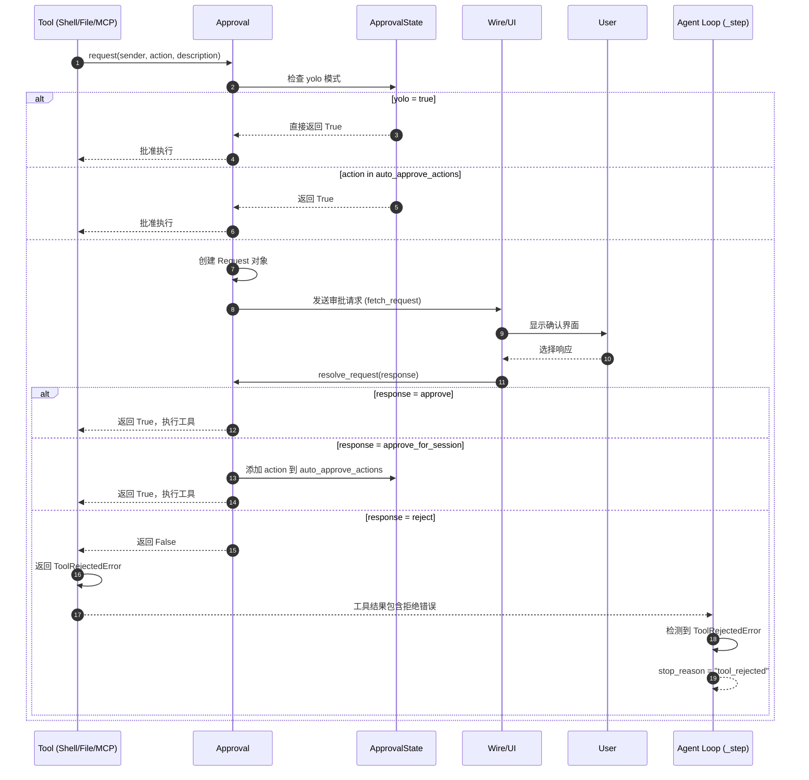
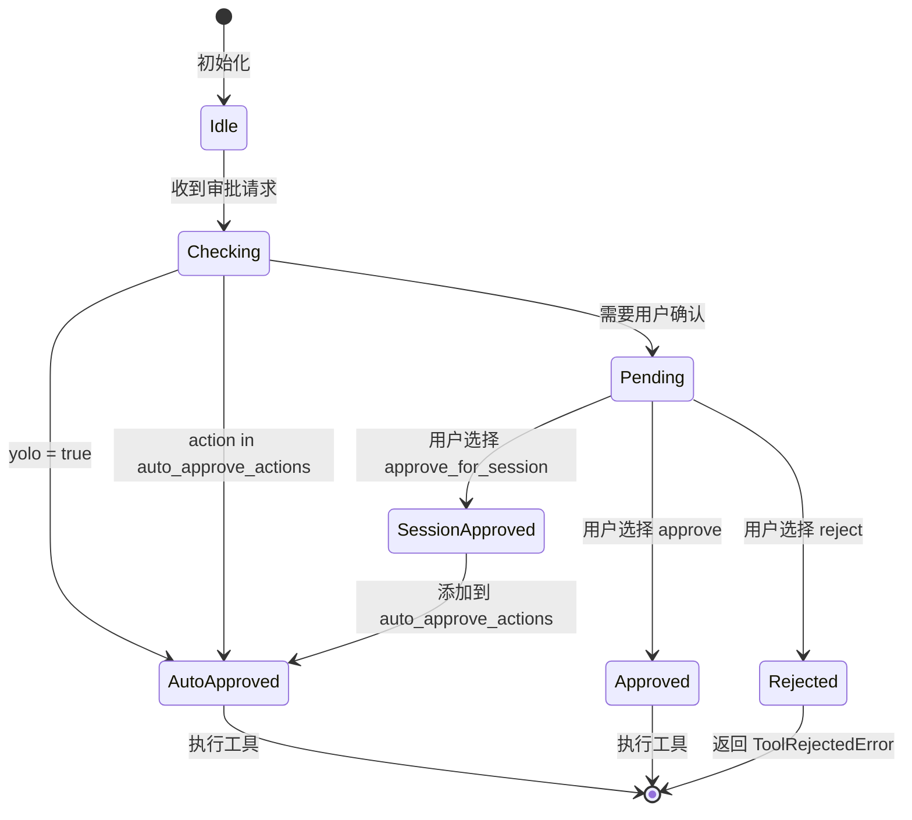
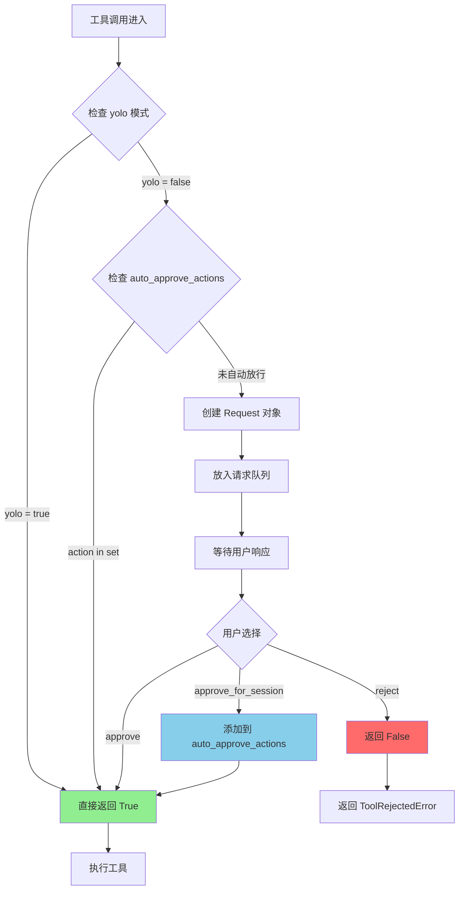
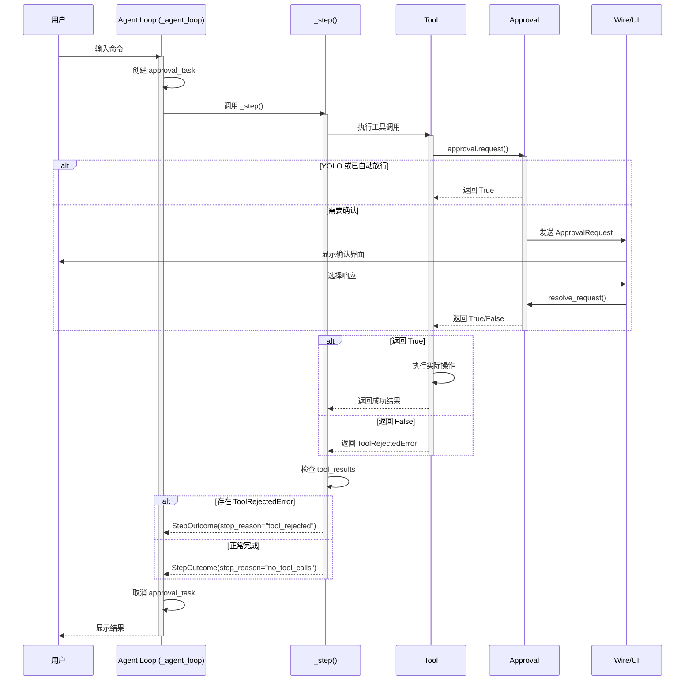
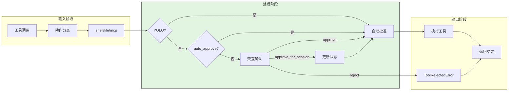
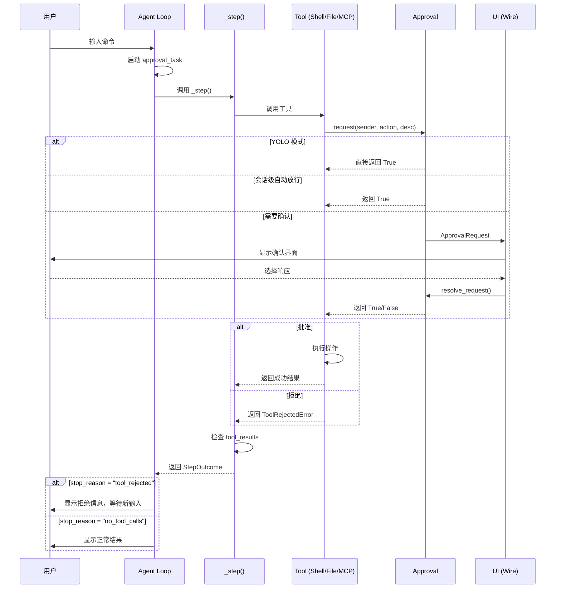
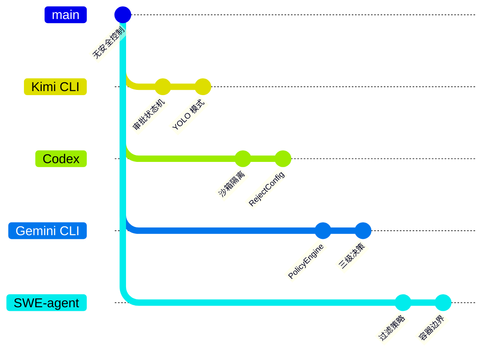

> 📋 **阅读指南**
>
> | 属性 | 说明 |
> |-----|------|
> | 预计阅读 | 15-20 分钟 |
> | 前置文档 | `01-kimi-cli-overview.md`、`04-kimi-cli-agent-loop.md` |
> | 文档结构 | 速览 → 架构 → 机制 → 实现 → 对比 |
> | 代码呈现 | 关键代码直接展示，完整代码可折叠查看 |

---

# Safety Control（kimi-cli）

## TL;DR（结论先行）

一句话定义：Kimi CLI 的 Safety Control 是**审批状态机驱动的执行门控机制**，通过 `approve / approve_for_session / reject` 三态决策控制工具执行，并在 Agent Loop 中将拒绝结果显式收敛为步骤终止。

Kimi CLI 的核心取舍：**交互式审批状态机 + YOLO 自动放行模式**（对比 Codex 的沙箱隔离 + RejectConfig、Gemini CLI 的规则引擎 + 三级决策、SWE-agent 的过滤策略 + 容器边界）

### 核心要点速览

| 维度 | 关键决策 | 代码位置 |
|-----|---------|---------|
| 审批模式 | 三态状态机（approve/approve_for_session/reject） | `src/kimi_cli/soul/approval.py:24` |
| 自动放行 | YOLO 模式 + 会话级 auto_approve | `src/kimi_cli/soul/approval.py:27` |
| 拒绝处理 | ToolRejectedError 终止步骤 | `src/kimi_cli/soul/kimisoul.py:422` |
| 状态共享 | Approval.share() 子 Agent 继承 | `src/kimi_cli/soul/approval.py:40` |
| 工具接入 | 统一 request() 接口 | `src/kimi_cli/soul/approval.py:50` |

---

## 1. 为什么需要这个机制？（解决什么问题）

### 1.1 问题场景

没有 Safety Control：
```
模型生成 rm -rf / 命令 → 无检查直接执行 → 系统损坏
MCP 工具调用删除数据库 → 无审批直接执行 → 数据丢失
AI 修改核心配置文件 → 无确认直接写入 → 服务不可用
```

有 Safety Control：
```
危险命令 → 动作分类 → 审批请求 → 用户确认 → 执行或拒绝
MCP 调用 → 权限检查 → 审批门控 → 受控执行 → 返回结果
文件写入 → 路径边界检查 → diff 展示 → 用户确认 → 写入或取消
```

### 1.2 核心挑战

| 挑战 | 不解决的后果 |
|-----|-------------|
| 过度自动化风险 | AI 执行危险操作无拦截，造成不可逆损失 |
| 审批用户体验 | 每条命令都确认导致用户疲劳，降低效率 |
| 会话状态管理 | 重复审批相同类型操作，体验差 |
| 多模式支持 | 纯自动化场景（CI/CD）无法绕过审批 |
| 边界控制 | 工作目录外操作无特殊保护 |

---

## 2. 整体架构（ASCII 图）

### 2.1 在系统中的位置

```text
┌─────────────────────────────────────────────────────────────┐
│ CLI 入口 / Session Runtime                                   │
│ src/kimi_cli/cli/__init__.py:54                              │
│ --yolo 参数、运行模式配置                                     │
└───────────────────────┬─────────────────────────────────────┘
                        │ 初始化
                        ▼
┌─────────────────────────────────────────────────────────────┐
│ ▓▓▓ Safety Control ▓▓▓                                      │
│ src/kimi_cli/soul/approval.py                                │
│ - ApprovalState   : yolo 模式 + auto_approve_actions         │
│ - Approval        : 审批请求队列 + 状态机                     │
│   - request()     : 工具调用前请求审批                        │
│   - resolve_request() : approve/approve_for_session/reject   │
│   - share()       : 子 agent 状态共享                         │
└───────────────────────┬─────────────────────────────────────┘
                        │ 审批决策
        ┌───────────────┼───────────────┐
        ▼               ▼               ▼
┌──────────────┐ ┌──────────────┐ ┌──────────────┐
│ Shell Tool   │ │ File Tools   │ │ MCP Tools    │
│ 执行前审批    │ │ 写入前审批    │ │ 调用前审批    │
│ src/kimi_cli │ │ src/kimi_cli │ │ src/kimi_cli │
│ /tools/shell │ │ /tools/file  │ │ /soul/toolset│
└──────────────┘ └──────────────┘ └──────────────┘
```

### 2.2 核心组件职责

| 组件 | 职责 | 代码位置 |
|-----|------|---------|
| `ApprovalState` | 保存 yolo 模式和会话级自动放行集合 | `src/kimi_cli/soul/approval.py:27` |
| `Approval` | 审批状态机，管理请求队列和决策 | `src/kimi_cli/soul/approval.py:34` |
| `Request` | 审批请求数据结构 | `src/kimi_cli/soul/approval.py:14` |
| `Response` | 三态响应类型：approve/approve_for_session/reject | `src/kimi_cli/soul/approval.py:24` |
| `ToolRejectedError` | 拒绝错误类型，传递给模型 | `src/kimi_cli/tools/utils.py:182` |
| `_ApprovalRequestPanel` | 终端 UI 审批交互面板 | `src/kimi_cli/ui/shell/visualize.py:263` |

### 2.3 核心组件交互关系



**关键交互说明**：

| 步骤 | 交互内容 | 设计意图 |
|-----|---------|---------|
| 1-2 | 工具调用前请求审批 | 统一入口，所有危险操作必须经过审批 |
| 3-4 | YOLO 模式检查 | 自动化场景绕过审批，提升效率 |
| 5-6 | 会话级自动放行检查 | 避免重复审批相同类型操作 |
| 7-10 | 交互式确认流程 | 用户明确决策，支持三种响应 |
| 11-13 | approve_for_session 持久化 | 用户选择"总是允许"后自动放行 |
| 14-17 | reject 处理流程 | 拒绝后返回错误，终止当前步骤 |

---

## 3. 核心组件详细分析

### 3.1 Approval 审批状态机内部结构

#### 职责定位

Approval 是 Kimi CLI 安全控制的核心组件，负责管理所有工具执行前的审批流程，支持 YOLO 自动模式、会话级自动放行和交互式确认。

#### 状态机图



**状态说明**：

| 状态 | 说明 | 进入条件 | 退出条件 |
|-----|------|---------|---------|
| Idle | 空闲等待 | 初始化完成 | 收到审批请求 |
| Checking | 检查自动放行条件 | 收到审批请求 | 检查完成 |
| AutoApproved | 自动批准 | yolo 模式或已自动放行 | 执行工具 |
| Pending | 等待用户确认 | 需要交互式审批 | 用户响应 |
| Approved | 单次批准 | 用户选择 approve | 执行工具 |
| SessionApproved | 会话级批准 | 用户选择 approve_for_session | 更新 auto_approve_actions |
| Rejected | 拒绝 | 用户选择 reject | 返回错误 |

#### 内部数据流

```text
┌─────────────────────────────────────────────────────────────┐
│  输入层                                                      │
│  ├── 工具调用 ──► Approval.request()                         │
│  │   └── 参数: sender, action, description, display          │
│  └── 用户响应 ──► Approval.resolve_request()                 │
│      └── 参数: request_id, response                          │
└──────────────────────────┬──────────────────────────────────┘
                           ▼
┌─────────────────────────────────────────────────────────────┐
│  处理层                                                      │
│  ├── 自动放行检查                                            │
│  │   ├── yolo 模式检查 ──► ApprovalState.yolo               │
│  │   └── auto_approve 检查 ──► ApprovalState.auto_approve_actions │
│  ├── 请求队列管理                                            │
│  │   ├── _request_queue: Queue[Request]                     │
│  │   └── _requests: dict[str, (Request, Future)]            │
│  └── 状态更新                                                │
│      └── approve_for_session ──► auto_approve_actions.add() │
└──────────────────────────┬──────────────────────────────────┘
                           ▼
┌─────────────────────────────────────────────────────────────┐
│  输出层                                                      │
│  ├── 批准 ──► 返回 True ──► 执行工具                         │
│  ├── 拒绝 ──► 返回 False ──► ToolRejectedError              │
│  └── 事件通知                                                │
│      └── ApprovalRequest/ApprovalResponse (Wire 协议)        │
└─────────────────────────────────────────────────────────────┘
```

#### 关键算法逻辑



**算法要点**：

1. **分层自动放行**：YOLO 模式 > 会话级自动放行 > 交互式确认
2. **异步请求处理**：使用 asyncio.Future 等待用户响应，不阻塞事件循环
3. **状态共享**：`share()` 方法支持子 agent 继承父 agent 的审批状态

#### 关键接口

| 接口 | 输入 | 输出 | 说明 | 代码位置 |
|-----|------|------|------|---------|
| `request()` | sender, action, description, display | bool | 请求审批 | `approval.py:50` |
| `resolve_request()` | request_id, response | None | 解析审批请求 | `approval.py:118` |
| `fetch_request()` | - | Request | 获取待处理请求 | `approval.py:102` |
| `share()` | - | Approval | 共享状态创建新实例 | `approval.py:40` |
| `set_yolo()` | bool | None | 设置 YOLO 模式 | `approval.py:44` |

---

### 3.2 工具层审批接入

#### 职责定位

各工具在执行前统一调用 `Approval.request()` 进行审批，根据返回结果决定是否执行或返回拒绝错误。

#### Shell 工具审批

```python
# src/kimi_cli/tools/shell/__init__.py:56-67
if not await self._approval.request(
    self.name,
    "run command",
    f"Run command `{params.command}`",
    display=[
        ShellDisplayBlock(
            language="powershell" if self._is_powershell else "bash",
            command=params.command,
        )
    ],
):
    return ToolRejectedError()
```

#### 文件写入审批

```python
# src/kimi_cli/tools/file/write.py:109-122
action = (
    FileActions.EDIT
    if is_within_directory(p, self._work_dir)
    else FileActions.EDIT_OUTSIDE
)

if not await self._approval.request(
    self.name,
    action,
    f"Write file `{p}`",
    display=diff_blocks,
):
    return ToolRejectedError()
```

#### MCP 工具审批

```python
# src/kimi_cli/soul/toolset.py:380-383
description = f"Call MCP tool `{self._mcp_tool.name}`."
if not await self._runtime.approval.request(self.name, self._action_name, description):
    return ToolRejectedError()
```

---

### 3.3 组件间协作时序



**协作要点**：

1. **Agent Loop 与 _step()**：外层循环管理审批任务生命周期，内层执行具体步骤
2. **工具与 Approval**：统一审批接口，工具无需关心具体审批实现
3. **拒绝结果处理**：`_step()` 检测 `ToolRejectedError` 并转换为 `stop_reason`

---

### 3.4 关键数据路径

#### 主路径（正常审批）



#### 异常路径（拒绝处理）

```mermaid
flowchart TD
    E[用户选择 reject] --> E1[Approval 返回 False]
    E1 --> E2[工具返回 ToolRejectedError]
    E2 --> E3[_step 检测 rejected]
    E3 --> E4[StepOutcome stop_reason="tool_rejected"]
    E4 --> E5[Agent Loop 终止当前步骤]
    E5 --> E6[等待用户新输入]

    style E fill:#FF6B6B
    style E4 fill:#FFD700
```

---

## 4. 端到端数据流转

### 4.1 正常流程（详细版）



**数据变换详情**：

| 阶段 | 输入 | 处理 | 输出 | 代码位置 |
|-----|------|------|------|---------|
| 审批请求 | 工具调用信息 | 检查 yolo/auto_approve | Future[bool] | `approval.py:50` |
| 用户确认 | ApprovalRequest | 交互式确认 | ApprovalResponse | `ui/shell/visualize.py:263` |
| 工具执行 | 批准/拒绝 | 执行或返回错误 | ToolResult | `tools/shell/__init__.py:50` |
| 步骤收敛 | ToolResults | 检测 ToolRejectedError | StepOutcome | `kimisoul.py:382` |

### 4.2 数据流向图

```mermaid
flowchart LR
    subgraph Config["配置层"]
        C1[--yolo CLI 参数]
        C2[default_yolo 配置]
        C3[/yolo slash 命令]
    end

    subgraph Control["控制层"]
        P1[ApprovalState]
        P2[Approval]
        P3[YOLO 检查]
        P4[auto_approve 检查]
    end

    subgraph Execution["执行层"]
        E1[Shell Tool]
        E2[WriteFile Tool]
        E3[StrReplaceFile Tool]
        E4[MCP Tool]
    end

    C1 --> P1
    C2 --> P1
    C3 --> P1
    P1 --> P3
    P1 --> P4
    P3 --> P2
    P4 --> P2
    P2 --> E1
    P2 --> E2
    P2 --> E3
    P2 --> E4
```

### 4.3 异常/边界流程

```mermaid
flowchart TD
    A[工具调用] --> B{审批检查}
    B -->|YOLO| C[自动执行]
    B -->|auto_approve| C
    B -->|需要确认| D[交互确认]

    D -->|approve| C
    D -->|approve_for_session| E[更新 auto_approve]
    E --> C
    D -->|reject| F[ToolRejectedError]

    C --> G[正常完成]
    F --> H[步骤终止]
    H --> I[返回 stop_reason="tool_rejected"]
    I --> J[等待用户新输入]

    style C fill:#90EE90
    style F fill:#FF6B6B
    style H fill:#FFD700
```

---

## 5. 关键代码实现

### 5.1 核心数据结构

```python
# src/kimi_cli/soul/approval.py:14-24
@dataclass(frozen=True, slots=True, kw_only=True)
class Request:
    id: str
    tool_call_id: str
    sender: str
    action: str
    description: str
    display: list[DisplayBlock]

type Response = Literal["approve", "approve_for_session", "reject"]
```

```python
# src/kimi_cli/soul/approval.py:27-31
class ApprovalState:
    def __init__(self, yolo: bool = False):
        self.yolo = yolo
        self.auto_approve_actions: set[str] = set()
        """Set of action names that should automatically be approved."""
```

**字段说明**：

| 字段 | 类型 | 用途 |
|-----|------|------|
| `yolo` | `bool` | YOLO 模式开关，开启后自动批准所有请求 |
| `auto_approve_actions` | `set[str]` | 本会话已自动放行的动作集合 |
| `action` | `str` | 动作类型标识，如 "run command", "edit", "mcp:tool_name" |
| `Response` | `Literal` | 三态响应：approve / approve_for_session / reject |

### 5.2 主链路代码

```python
# src/kimi_cli/soul/approval.py:50-101
async def request(
    self,
    sender: str,
    action: str,
    description: str,
    display: list[DisplayBlock] | None = None,
) -> bool:
    """Request approval for the given action."""
    tool_call = get_current_tool_call_or_none()
    if tool_call is None:
        raise RuntimeError("Approval must be requested from a tool call.")

    # 1. YOLO 模式直接批准
    if self._state.yolo:
        return True

    # 2. 检查会话级自动放行
    if action in self._state.auto_approve_actions:
        return True

    # 3. 创建审批请求
    request = Request(
        id=str(uuid.uuid4()),
        tool_call_id=tool_call.id,
        sender=sender,
        action=action,
        description=description,
        display=display or [],
    )

    # 4. 放入队列，等待响应
    approved_future = asyncio.Future[bool]()
    self._request_queue.put_nowait(request)
    self._requests[request.id] = (request, approved_future)
    return await approved_future
```

```python
# src/kimi_cli/soul/approval.py:118-147
def resolve_request(self, request_id: str, response: Response) -> None:
    """Resolve an approval request with the given response."""
    request_tuple = self._requests.pop(request_id, None)
    if request_tuple is None:
        raise KeyError(f"No pending request with ID {request_id}")
    request, future = request_tuple

    match response:
        case "approve":
            future.set_result(True)
        case "approve_for_session":
            self._state.auto_approve_actions.add(request.action)
            future.set_result(True)
        case "reject":
            future.set_result(False)
```

```python
# src/kimi_cli/soul/kimisoul.py:422-425
# 检测拒绝并终止步骤
rejected = any(isinstance(result.return_value, ToolRejectedError) for result in results)
if rejected:
    _ = self._denwa_renji.fetch_pending_dmail()
    return StepOutcome(stop_reason="tool_rejected", assistant_message=result.message)
```

**代码要点**：

1. **分层检查**：YOLO > auto_approve > 交互确认，优先级清晰
2. **异步等待**：使用 `asyncio.Future` 实现非阻塞等待用户响应
3. **状态持久化**：`approve_for_session` 将动作添加到集合，后续自动放行
4. **拒绝收敛**：Agent Loop 统一处理 `ToolRejectedError`，终止当前步骤

### 5.3 关键调用链

```text
Agent Loop (_agent_loop)
  -> _step()                     [src/kimi_cli/soul/kimisoul.py:382]
    -> kosong.step()             [kosong 库]
      -> 工具调用
        -> Approval.request()    [src/kimi_cli/soul/approval.py:50]
          - 检查 yolo 模式
          - 检查 auto_approve_actions
          - 创建 Request，放入队列
          - 等待 Future 结果
        -> 执行工具 或 返回 ToolRejectedError
    -> 检查 tool_results
      - 检测 ToolRejectedError
      -> StepOutcome             [src/kimi_cli/soul/kimisoul.py:422]
```

---

## 6. 设计意图与 Trade-off

### 6.1 Kimi CLI 的选择

| 维度 | Kimi CLI 的选择 | 替代方案 | 取舍分析 |
|-----|----------------|---------|---------|
| 审批模式 | 三态状态机 (approve/approve_for_session/reject) | 布尔通过/拒绝 | 支持会话级自动放行，减少重复确认 |
| 自动化支持 | YOLO 模式 | 无自动模式 | CI/CD 场景可完全自动，但增加误操作风险 |
| 策略配置 | CLI 参数 + 配置 + slash 命令 | 集中式规则引擎 (TOML) | 配置简单直观，但无法支持复杂规则 |
| 动作识别 | 动作类型级别 (shell/file/mcp) | 命令语义级别 | 实现简单，但无法识别命令级风险 |
| 状态共享 | Approval.share() 继承 | 独立状态 | 子 agent 继承父 agent 审批状态，体验一致 |
| 沙箱机制 | 无原生沙箱 | Linux 容器/Seccomp | 轻量级，但依赖外部隔离 |

### 6.2 为什么这样设计？

**核心问题**：如何在保证安全的前提下，提供流畅的人机协作体验？

**Kimi CLI 的解决方案**：
- 代码依据：`src/kimi_cli/soul/approval.py` 的 Approval 状态机设计
- 设计意图：通过分层自动放行（YOLO > 会话级 > 交互确认）减少不必要的确认
- 带来的好处：
  - 开发场景可开启 YOLO 模式，效率最高
  - 敏感操作首次确认后，同类型操作自动放行
  - 明确的拒绝语义，模型可理解并调整行为
- 付出的代价：
  - 无法识别命令级风险（如 `rm -rf /` 和 `ls` 同等对待）
  - 无原生沙箱，依赖操作系统权限

### 6.3 与其他项目的对比



| 项目 | 核心机制 | 安全策略 | 审批机制 | 边界控制 | 适用场景 |
|-----|---------|---------|---------|---------|---------|
| **Kimi CLI** | 审批状态机 | YOLO + 动作分类 | 三态决策 | 路径边界 | 开发效率优先的场景 |
| **Codex** | 沙箱 + 策略配置 | RejectConfig 分级 | AskForApproval 五级 | Linux Proxy-Only + Seccomp | 需要强隔离的企业环境 |
| **Gemini CLI** | PolicyEngine 规则引擎 | 多源配置 + 动态规则 | ALLOW/ASK/DENY 三级 | 路径验证 + 命令解析 | 需要灵活策略配置的场景 |
| **OpenCode** | 规则评估 | 权限配置 | allow/ask/deny | 项目边界 | 规则明确的场景 |
| **SWE-agent** | 过滤策略 + 容器 | Blocklist/Regex | 自动循环 + 人工接管 | Docker 容器 | 自动化任务场景 |

**详细对比分析**：

| 对比维度 | Kimi CLI | Codex | Gemini CLI | SWE-agent |
|---------|----------|-------|------------|-----------|
| **安全策略核心** | 审批状态机 | 沙箱隔离 + 策略配置 | 规则引擎（PolicyEngine） | 过滤策略 + 容器 |
| **自动化支持** | YOLO 模式 | RejectConfig | 可配置降级 | 默认自动 |
| **审批粒度** | 动作分类级 | 五级策略 | 工具级三级决策 | 预设过滤 |
| **动态规则** | 支持（会话级 auto_approve） | 不支持 | 支持（auto-saved.toml） | 不支持 |
| **沙箱机制** | 无原生沙箱 | Linux Proxy-Only + Seccomp | 无原生沙箱 | Docker 容器 |
| **非交互处理** | YOLO 模式绕过 | RejectConfig 自动拒绝 | 可配置降级 | 默认自动 |
| **人工控制** | 逐命令确认 | 策略驱动 | 逐命令确认 | step-in/out |

---

## 7. 边界情况与错误处理

### 7.1 终止条件

| 终止原因 | 触发条件 | 代码位置 |
|---------|---------|---------|
| 用户拒绝 | 确认界面选择 reject | `approval.py:146` |
| YOLO 自动批准 | yolo = true | `approval.py:83` |
| 会话级自动批准 | action in auto_approve_actions | `approval.py:86` |
| 步骤终止 | 检测到 ToolRejectedError | `kimisoul.py:422` |
| 流程结束 | stop_reason = "tool_rejected" | `kimisoul.py:365` |

### 7.2 超时/资源限制

```python
# src/kimi_cli/tools/shell/__init__.py:22-30
timeout: int = Field(
    description=(
        "The timeout in seconds for the command to execute. "
        "If the command takes longer than this, it will be killed."
    ),
    default=60,
    ge=1,
    le=MAX_TIMEOUT,  # 5 * 60 = 300 秒
)
```

### 7.3 错误恢复策略

| 错误类型 | 处理策略 | 代码位置 |
|---------|---------|---------|
| `ToolRejectedError` | 返回给模型，终止当前步骤 | `kimisoul.py:422` |
| 审批队列残留 | Turn 结束清理 pending requests | `kimisoul.py:358` |
| 工具执行超时 | 杀死进程，返回超时错误 | `shell/__init__.py:121` |
| 路径越界 | 返回 ToolError，不执行 | `file/write.py:49` |

---

## 8. 关键代码索引

| 功能 | 文件 | 行号 | 说明 |
|-----|------|------|------|
| 审批状态机 | `src/kimi_cli/soul/approval.py` | 27-147 | ApprovalState + Approval 类 |
| 请求审批 | `src/kimi_cli/soul/approval.py` | 50 | request() 方法 |
| 解析审批 | `src/kimi_cli/soul/approval.py` | 118 | resolve_request() 方法 |
| 拒绝错误 | `src/kimi_cli/tools/utils.py` | 182 | ToolRejectedError 类 |
| Shell 审批 | `src/kimi_cli/tools/shell/__init__.py` | 56 | 执行前审批 |
| 文件写入审批 | `src/kimi_cli/tools/file/write.py` | 116 | 写入前审批 |
| 文件替换审批 | `src/kimi_cli/tools/file/replace.py` | 123 | 替换前审批 |
| MCP 审批 | `src/kimi_cli/soul/toolset.py` | 380 | MCP 工具调用审批 |
| 拒绝检测 | `src/kimi_cli/soul/kimisoul.py` | 422 | _step() 中检测拒绝 |
| UI 审批面板 | `src/kimi_cli/ui/shell/visualize.py` | 263 | _ApprovalRequestPanel 类 |
| YOLO 配置 | `src/kimi_cli/config.py` | 154 | default_yolo 配置项 |
| CLI YOLO 参数 | `src/kimi_cli/cli/__init__.py` | 146 | --yolo 参数定义 |

---

## 9. 延伸阅读

- 前置知识：`04-kimi-cli-agent-loop.md`
- 相关机制：`06-kimi-cli-mcp-integration.md`
- 跨项目对比：
  - Codex Safety Control: `docs/codex/10-codex-safety-control.md`
  - Gemini CLI Safety Control: `docs/gemini-cli/10-gemini-cli-safety-control.md`
  - OpenCode Safety Control: `docs/opencode/10-opencode-safety-control.md`
  - SWE-agent Safety Control: `docs/swe-agent/10-swe-agent-safety-control.md`
- 通用安全控制流程: `docs/comm/10-comm-safety-control.md`

---

*✅ Verified: 基于 kimi-cli/src/kimi_cli/soul/approval.py、kimisoul.py、tools/utils.py 等源码分析*
*基于版本：2026-02-08 | 最后更新：2026-02-24*
