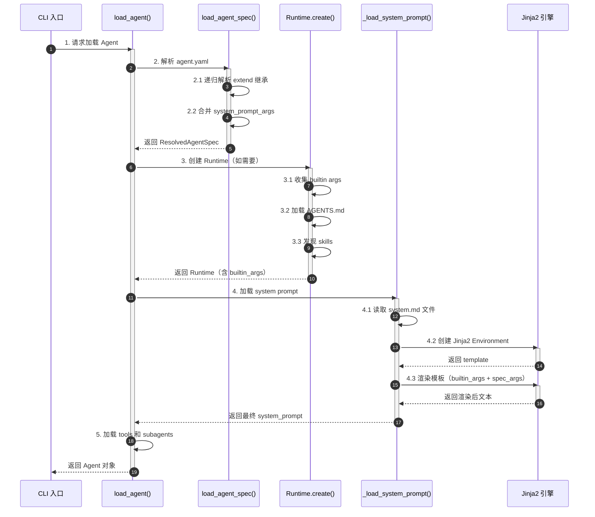
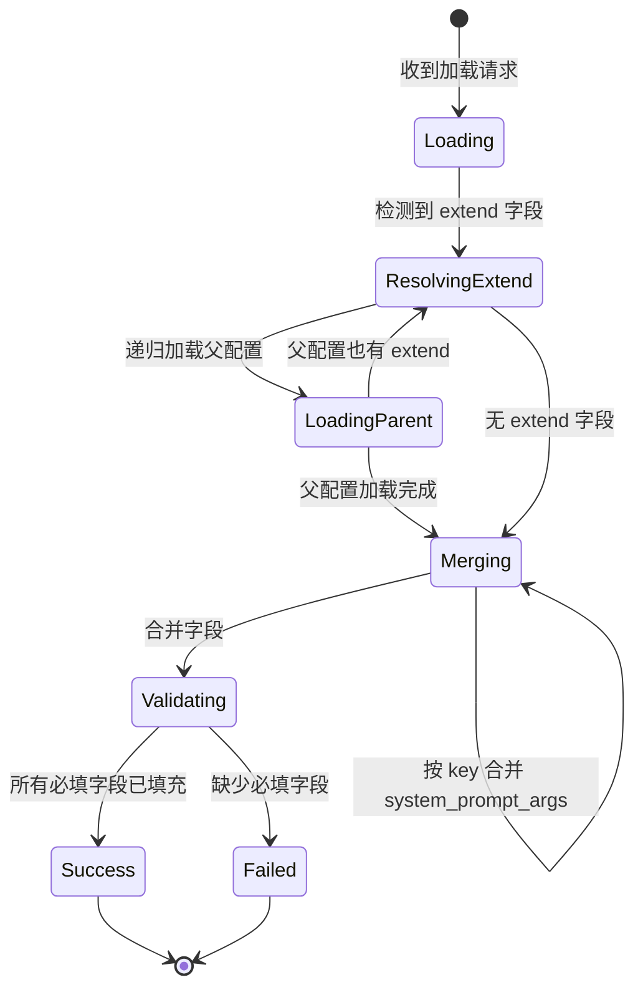
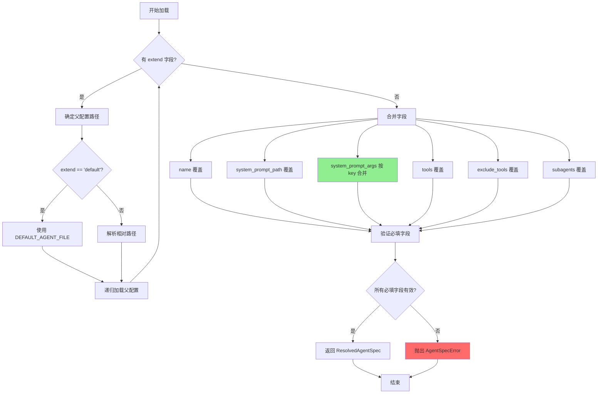
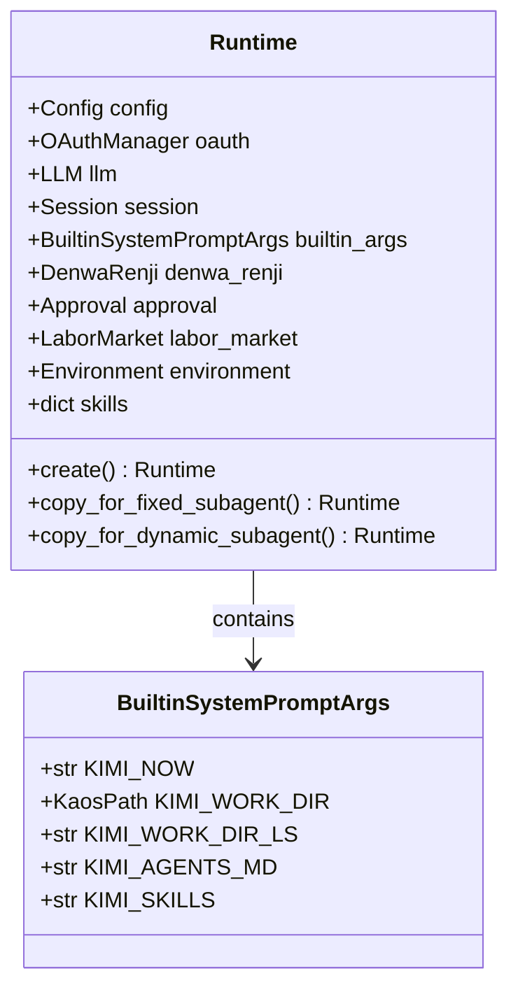
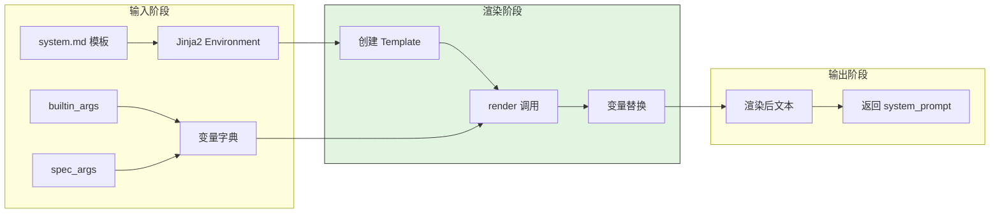
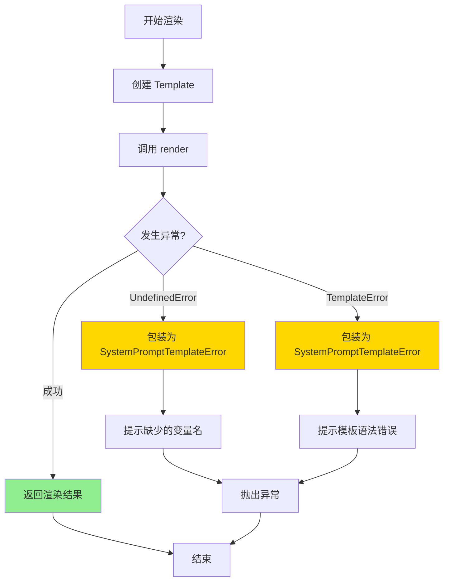
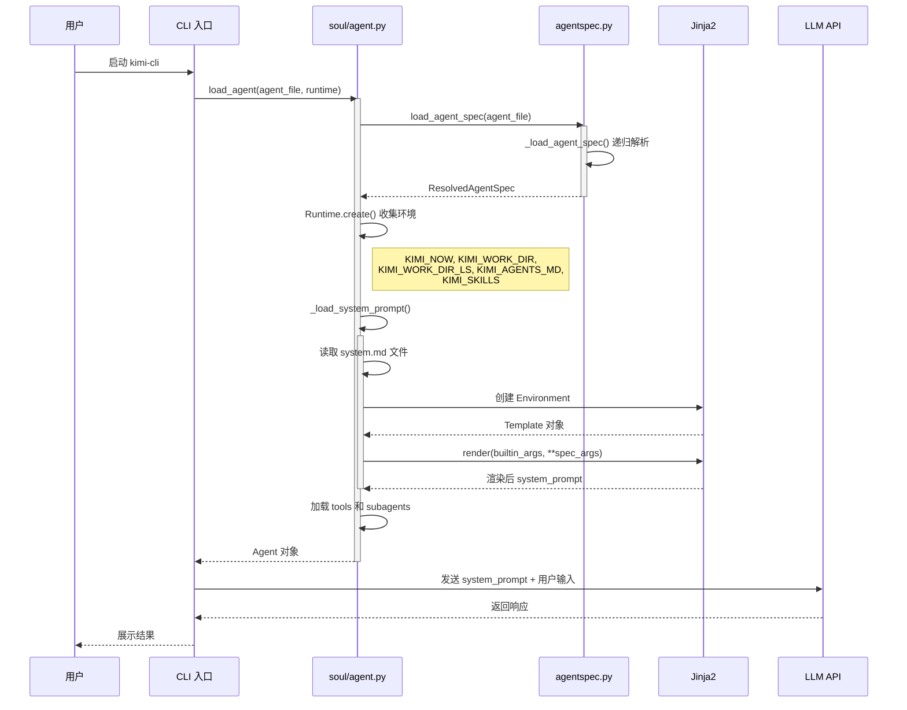
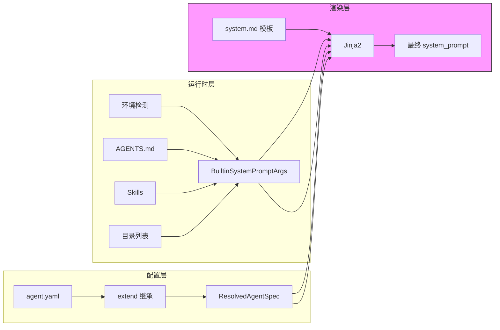
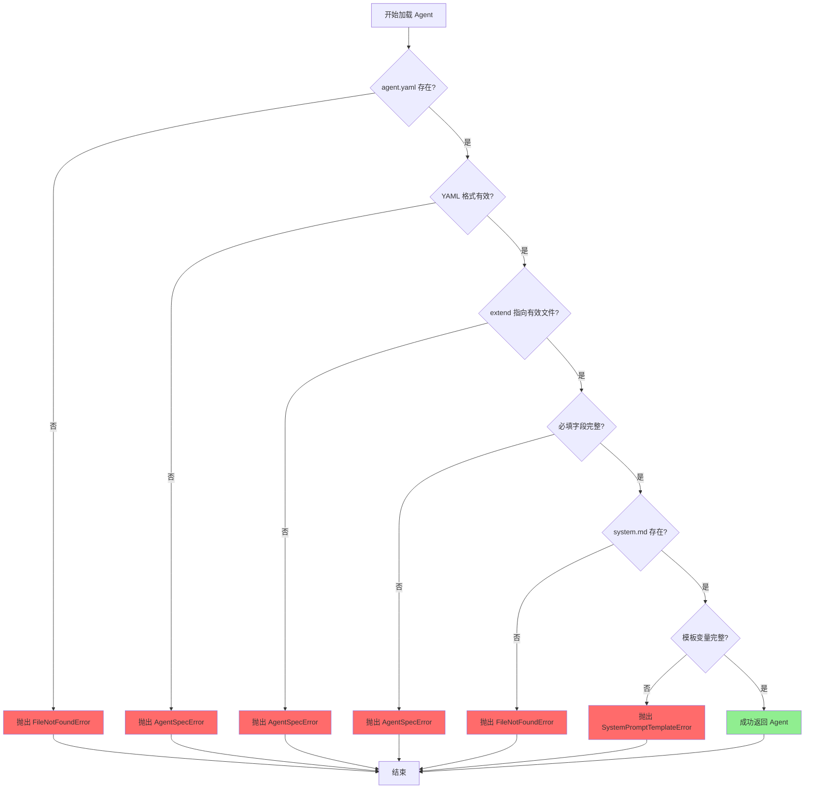
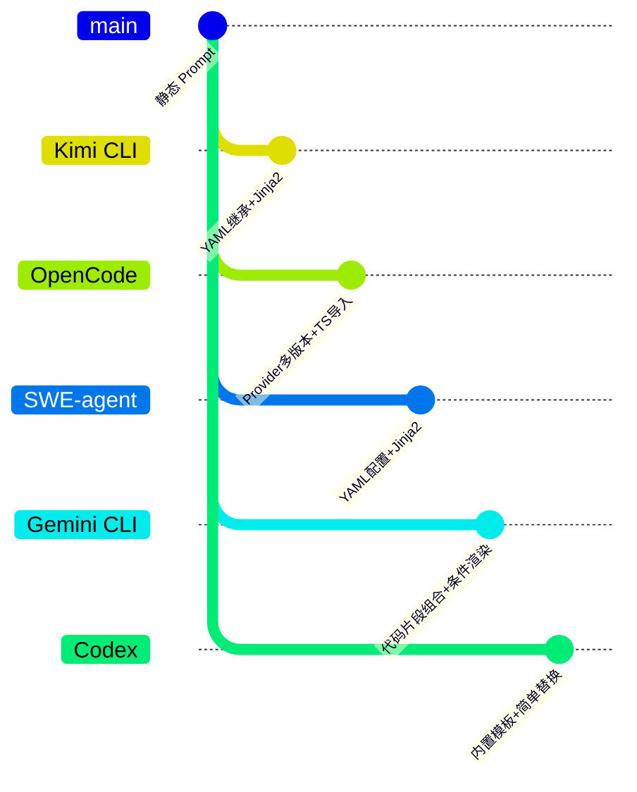

# Prompt Organization（Kimi CLI）

## TL;DR（结论先行）

一句话定义：Prompt Organization 是 AI Coding Agent 中负责管理系统提示词（System Prompt）的获取、组装和渲染的机制，确保 LLM 在不同场景下接收到恰当的指令和上下文。

Kimi CLI 的核心取舍：**YAML 配置继承 + Jinja2 模板渲染 + 运行时内置变量注入**（对比 OpenCode 的 Provider-specific 多版本、SWE-agent 的 YAML 配置驱动、Gemini CLI 的代码片段组合）

---

## 1. 为什么需要这个机制？（解决什么问题）

### 1.1 问题场景

没有 Prompt Organization 机制时，开发者会面临以下问题：

```
场景：团队需要为不同项目配置不同的 Agent 行为

没有该机制：
  -> 每个项目都要复制粘贴完整的 system prompt
  -> 修改基线行为需要逐个文件修改
  -> 运行时信息（当前目录、时间等）硬编码在 prompt 中
  -> 不同环境（开发/测试/生产）难以切换

有该机制（Kimi CLI）：
  -> 定义基础 agent.yaml（default）
  -> 子项目通过 extend: default 继承并局部覆盖
  -> 运行时变量（KIMI_WORK_DIR、KIMI_NOW 等）自动注入
  -> 同一套 prompt 模板跨项目复用
```

### 1.2 核心挑战

| 挑战 | 不解决的后果 |
|-----|-------------|
| Prompt 版本管理 | 团队无法统一基线行为，每次更新需要手动同步多个项目 |
| 运行时上下文注入 | 静态 prompt 无法感知当前环境（目录、文件列表、技能等） |
| 多场景适配 | 不同任务（编码、审查、调试）需要不同的系统指令 |
| 模板变量安全 | 变量缺失或类型错误导致运行时渲染失败 |

---

## 2. 整体架构（ASCII 图）

### 2.1 在系统中的位置

```text
┌─────────────────────────────────────────────────────────────┐
│ CLI 入口 / Session Runtime                                   │
│ kimi-cli/src/kimi_cli/cli/__init__.py                        │
└───────────────────────┬─────────────────────────────────────┘
                        │ 调用 load_agent()
                        ▼
┌─────────────────────────────────────────────────────────────┐
│ ▓▓▓ Prompt Organization ▓▓▓                                │
│ kimi-cli/src/kimi_cli/soul/agent.py                          │
│ - Runtime.create(): 构建内置变量                              │
│ - load_agent(): 加载并渲染 system prompt                     │
│ - _load_system_prompt(): Jinja2 渲染核心                     │
└───────────────────────┬─────────────────────────────────────┘
                        │ 依赖/调用
        ┌───────────────┼───────────────┐
        ▼               ▼               ▼
┌──────────────┐ ┌──────────────┐ ┌──────────────┐
│ Agent Spec   │ │ Jinja2 引擎  │ │ 流程模板     │
│ 解析与继承   │ │ 模板渲染     │ │ (/init 等)   │
│ agentspec.py │ │ agent.py:269 │ │ prompts/*.md │
└──────────────┘ └──────────────┘ └──────────────┘
```

### 2.2 核心组件职责

| 组件 | 职责 | 代码位置 |
|-----|------|---------|
| `AgentSpec` | 定义 agent 配置结构，支持继承扩展 | `kimi-cli/src/kimi_cli/agentspec.py:31` |
| `load_agent_spec()` | 递归解析 agent.yaml，合并父配置 | `kimi-cli/src/kimi_cli/agentspec.py:70` |
| `Runtime` | 管理运行时状态，收集内置变量 | `kimi-cli/src/kimi_cli/soul/agent.py:63` |
| `BuiltinSystemPromptArgs` | 定义内置模板变量结构 | `kimi-cli/src/kimi_cli/soul/agent.py:34` |
| `_load_system_prompt()` | Jinja2 模板渲染核心 | `kimi-cli/src/kimi_cli/soul/agent.py:269` |
| `prompts` 模块 | 流程模板（init/compact） | `kimi-cli/src/kimi_cli/prompts/__init__.py:5` |

### 2.3 核心组件交互关系



**关键交互说明**：

| 步骤 | 交互内容 | 设计意图 |
|-----|---------|---------|
| 1 | CLI 请求加载 Agent | 解耦配置加载与业务逻辑 |
| 2 | 递归解析 agent spec | 支持配置继承，避免重复定义 |
| 3 | Runtime 收集环境信息 | 将环境事实与 prompt 模板分离 |
| 4 | Jinja2 渲染模板 | 使用成熟模板引擎，支持复杂逻辑 |
| 5 | 组装完整 Agent | 统一入口，便于管理和扩展 |

---

## 3. 核心组件详细分析

### 3.1 AgentSpec 与配置继承机制

#### 职责定位

AgentSpec 是 Kimi CLI 中定义 Agent 行为的配置模型，通过 `extend` 机制支持配置继承和局部覆盖。

#### 状态机图



**状态说明**：

| 状态 | 说明 | 进入条件 | 退出条件 |
|-----|------|---------|---------|
| Loading | 加载 YAML 文件 | 收到加载请求 | 解析完成 |
| ResolvingExtend | 检查继承 | 发现 extend 字段 | 确定父配置路径 |
| LoadingParent | 加载父配置 | 需要继承 | 父配置解析完成 |
| Merging | 合并配置 | 父子配置均可用 | 所有字段合并完成 |
| Validating | 验证完整性 | 合并完成 | 验证通过/失败 |
| Success | 成功 | 所有必填字段有效 | 返回 ResolvedAgentSpec |
| Failed | 失败 | 缺少必填字段 | 抛出 AgentSpecError |

#### 内部数据流

```text
┌─────────────────────────────────────────────────────────────┐
│  输入层                                                      │
│  ├── agent.yaml 文件路径                                     │
│  └── YAML 解析为 dict                                        │
└──────────────────────────┬──────────────────────────────────┘
                           ▼
┌─────────────────────────────────────────────────────────────┐
│  处理层                                                      │
│  ├── Pydantic 验证（AgentSpec 模型）                         │
│  ├── extend 递归解析                                         │
│  │   └── _load_agent_spec() 递归调用                         │
│  ├── 字段合并策略                                            │
│  │   ├── name/system_prompt_path/tools: 直接覆盖             │
│  │   └── system_prompt_args: 按 key 合并                     │
│  └── 路径解析为绝对路径                                      │
└──────────────────────────┬──────────────────────────────────┘
                           ▼
┌─────────────────────────────────────────────────────────────┐
│  输出层                                                      │
│  ├── ResolvedAgentSpec（冻结的不可变对象）                   │
│  └── 包含渲染所需的所有信息                                  │
└─────────────────────────────────────────────────────────────┘
```

#### 关键算法逻辑



**算法要点**：

1. **递归继承**：支持多层继承，通过递归调用 `_load_agent_spec()` 实现
2. **system_prompt_args 合并策略**：按 key 合并而非整体替换，允许子配置增量添加变量
3. **路径解析**：相对路径基于 agent.yaml 所在目录解析为绝对路径

#### 关键接口

| 接口 | 输入 | 输出 | 说明 | 代码位置 |
|-----|------|------|------|---------|
| `load_agent_spec()` | `Path`（agent.yaml 路径） | `ResolvedAgentSpec` | 公开 API，加载并验证配置 | `agentspec.py:70` |
| `_load_agent_spec()` | `Path` | `AgentSpec` | 内部递归函数 | `agentspec.py:100` |
| `AgentSpec` 模型 | YAML dict | 验证后的模型 | Pydantic 模型定义 | `agentspec.py:31` |

---

### 3.2 Runtime 与内置变量系统

#### 职责定位

Runtime 负责收集运行时环境信息，构建内置模板变量（BuiltinSystemPromptArgs），使 prompt 能够感知当前执行环境。

#### 内置变量结构



**变量说明**：

| 变量 | 类型 | 用途 | 收集方式 |
|-----|------|------|---------|
| `KIMI_NOW` | `str` | 当前时间（ISO 格式） | `datetime.now().astimezone().isoformat()` |
| `KIMI_WORK_DIR` | `KaosPath` | 当前工作目录绝对路径 | `session.work_dir` |
| `KIMI_WORK_DIR_LS` | `str` | 工作目录文件列表 | `list_directory()` 异步收集 |
| `KIMI_AGENTS_MD` | `str` | AGENTS.md 文件内容 | `load_agents_md()` 异步读取 |
| `KIMI_SKILLS` | `str` | 可用技能列表 | `discover_skills_from_roots()` 发现 |

#### 关键调用链

```text
Runtime.create()                           [agent.py:79]
  -> list_directory()                      [agent.py:88]
     - 异步收集工作目录文件列表
  -> load_agents_md()                      [agent.py:89]
     - 尝试读取 AGENTS.md / agents.md
  -> Environment.detect()                  [agent.py:90]
     - 检测当前环境信息
  -> resolve_skills_roots()                [agent.py:94]
     - 解析技能根目录
  -> discover_skills_from_roots()          [agent.py:95]
     - 发现并索引技能
  -> index_skills()                        [agent.py:96]
     - 按名称索引技能
  -> BuiltinSystemPromptArgs(...)          [agent.py:112]
     - 组装所有内置变量
```

---

### 3.3 Jinja2 模板渲染系统

#### 职责定位

负责将 system.md 模板与运行时变量结合，生成最终的 system prompt。

#### 渲染流程



#### Jinja2 配置

```python
# kimi-cli/src/kimi_cli/soul/agent.py:279-286
env = JinjaEnvironment(
    keep_trailing_newline=True,      # 保留末尾换行
    lstrip_blocks=True,              # 移除块前空白
    trim_blocks=True,                # 移除块后换行
    variable_start_string="${",      # 变量起始标记 ${...}
    variable_end_string="}",         # 变量结束标记
    undefined=StrictUndefined,       # 严格模式：变量缺失报错
)
```

**关键设计**：

1. **自定义变量分隔符**：使用 `${...}` 而非默认的 `{{...}}`，避免与 shell/JSON 冲突
2. **StrictUndefined**：变量缺失时立即抛出 `UndefinedError`，而非静默忽略
3. **空白控制**：`lstrip_blocks` 和 `trim_blocks` 减少模板中的空白噪音

#### 异常处理



---

### 3.4 流程模板（/init、compact）

#### 职责定位

`prompts/*.md` 文件不是主 system prompt，而是特定流程的临时模板。

#### 使用场景

```mermaid
flowchart TD
    subgraph InitFlow["/init 流程"]
        I1[/init 命令] --> I2[创建临时 Soul]
        I2 --> I3[使用 prompts.INIT]
        I3 --> I4[执行分析任务]
        I4 --> I5[生成 AGENTS.md]
    end

    subgraph CompactFlow["Context Compaction"]
        C1[Token 超限] --> C2[准备压缩消息]
        C2 --> C3[附加 prompts.COMPACT]
        C3 --> C4[调用 LLM 摘要]
        C4 --> C5[替换历史消息]
    end

    style InitFlow fill:#e1f5fe
    style CompactFlow fill:#f3e5f5
```

---

## 4. 端到端数据流转

### 4.1 正常流程（详细版）



**数据变换详情**：

| 阶段 | 输入 | 处理 | 输出 | 代码位置 |
|-----|------|------|------|---------|
| 配置加载 | `agent.yaml` 路径 | YAML 解析 + 继承合并 | `ResolvedAgentSpec` | `agentspec.py:70` |
| 环境收集 | `session.work_dir` | 异步 IO 收集 | `BuiltinSystemPromptArgs` | `agent.py:79` |
| 模板渲染 | `system.md` + 变量 | Jinja2 渲染 | `system_prompt` 字符串 | `agent.py:269` |
| Agent 组装 | Spec + Prompt + Tools | 依赖注入 | `Agent` 对象 | `agent.py:189` |

### 4.2 数据流向图



### 4.3 异常/边界流程



---

## 5. 关键代码实现

### 5.1 核心数据结构

```python
# kimi-cli/src/kimi_cli/agentspec.py:31-48
class AgentSpec(BaseModel):
    """Agent specification."""

    extend: str | None = Field(default=None, description="Agent file to extend")
    name: str | Inherit = Field(default=inherit, description="Agent name")
    system_prompt_path: Path | Inherit = Field(
        default=inherit, description="System prompt path"
    )
    system_prompt_args: dict[str, str] = Field(
        default_factory=dict, description="System prompt arguments"
    )
    tools: list[str] | None | Inherit = Field(default=inherit, description="Tools")
    exclude_tools: list[str] | None | Inherit = Field(
        default=inherit, description="Tools to exclude"
    )
    subagents: dict[str, SubagentSpec] | None | Inherit = Field(
        default=inherit, description="Subagents"
    )
```

**字段说明**：

| 字段 | 类型 | 用途 |
|-----|------|------|
| `extend` | `str \| None` | 继承的父配置，None 表示根配置 |
| `name` | `str \| Inherit` | Agent 名称，Inherit 表示继承父值 |
| `system_prompt_path` | `Path \| Inherit` | system.md 文件路径 |
| `system_prompt_args` | `dict[str, str]` | 模板变量，按 key 合并 |
| `tools` | `list[str] \| Inherit` | 启用的工具列表 |
| `exclude_tools` | `list[str] \| Inherit` | 排除的工具列表 |
| `subagents` | `dict[str, SubagentSpec] \| Inherit` | 子 Agent 配置 |

### 5.2 主链路代码

```python
# kimi-cli/src/kimi_cli/agentspec.py:123-142
if agent_spec.extend:
    if agent_spec.extend == "default":
        base_agent_file = DEFAULT_AGENT_FILE
    else:
        base_agent_file = (agent_file.parent / agent_spec.extend).absolute()
    base_agent_spec = _load_agent_spec(base_agent_file)
    if not isinstance(agent_spec.name, Inherit):
        base_agent_spec.name = agent_spec.name
    if not isinstance(agent_spec.system_prompt_path, Inherit):
        base_agent_spec.system_prompt_path = agent_spec.system_prompt_path
    for k, v in agent_spec.system_prompt_args.items():
        # system prompt args should be merged instead of overwritten
        base_agent_spec.system_prompt_args[k] = v
    if not isinstance(agent_spec.tools, Inherit):
        base_agent_spec.tools = agent_spec.tools
    if not isinstance(agent_spec.exclude_tools, Inherit):
        base_agent_spec.exclude_tools = agent_spec.exclude_tools
    if not isinstance(agent_spec.subagents, Inherit):
        base_agent_spec.subagents = agent_spec.subagents
    agent_spec = base_agent_spec
```

**代码要点**：

1. **递归继承**：通过递归调用 `_load_agent_spec()` 支持多层继承
2. **system_prompt_args 合并**：使用 `for` 循环按 key 合并，而非整体替换
3. **Inherit 标记**：使用特殊标记类区分"继承"和"显式设置空值"

```python
# kimi-cli/src/kimi_cli/soul/agent.py:269-293
def _load_system_prompt(
    path: Path, args: dict[str, str], builtin_args: BuiltinSystemPromptArgs
) -> str:
    logger.info("Loading system prompt: {path}", path=path)
    system_prompt = path.read_text(encoding="utf-8").strip()
    env = JinjaEnvironment(
        keep_trailing_newline=True,
        lstrip_blocks=True,
        trim_blocks=True,
        variable_start_string="${",
        variable_end_string="}",
        undefined=StrictUndefined,
    )
    try:
        template = env.from_string(system_prompt)
        return template.render(asdict(builtin_args), **args)
    except UndefinedError as exc:
        raise SystemPromptTemplateError(f"Missing system prompt arg in {path}: {exc}") from exc
    except TemplateError as exc:
        raise SystemPromptTemplateError(f"Invalid system prompt template: {path}: {exc}") from exc
```

**代码要点**：

1. **自定义分隔符**：`${...}` 避免与 shell/JSON 语法冲突
2. **StrictUndefined**：变量缺失时立即报错，便于调试
3. **双重变量来源**：`builtin_args`（运行时）和 `args`（配置）合并注入

### 5.3 关键调用链

```text
load_agent()                             [agent.py:189]
  -> load_agent_spec()                     [agentspec.py:70]
     -> _load_agent_spec()                  [agentspec.py:100]
        - 递归解析 extend
        - 合并 system_prompt_args
  -> Runtime.create()                      [agent.py:79]
     - 收集 builtin_args
  -> _load_system_prompt()                 [agent.py:269]
     - 读取 system.md
     - Jinja2 渲染
  -> load_tools()                          [agent.py:226]
     - 加载工具集
```

---

## 6. 设计意图与 Trade-off

### 6.1 Kimi CLI 的选择

| 维度 | Kimi CLI 的选择 | 替代方案 | 取舍分析 |
|-----|----------------|---------|---------|
| 配置格式 | YAML + Pydantic 模型 | TOML/JSON/代码配置 | YAML 可读性好，Pydantic 提供强类型验证；但解析速度略慢 |
| 继承机制 | extend 字段递归继承 | 无继承/混入（mixin） | 支持层级复用，但深层继承增加理解成本 |
| 模板引擎 | Jinja2 | 字符串替换/Handlebars/Mustache | 功能强大，社区成熟；但引入额外依赖 |
| 变量分隔符 | `${...}` | `{{...}}`（默认） | 避免与 shell/JSON 冲突，但需要自定义配置 |
| 变量缺失处理 | StrictUndefined（报错） | 静默忽略/默认值 | 提前发现问题，但要求模板变量完整 |
| 运行时注入 | BuiltinSystemPromptArgs 结构体 | 字典/动态属性 | 类型安全，IDE 支持好；但新增变量需改结构体 |

### 6.2 为什么这样设计？

**核心问题**：如何在支持灵活配置的同时保证类型安全和可维护性？

**Kimi CLI 的解决方案**：

- **代码依据**：`kimi-cli/src/kimi_cli/agentspec.py:31`、`kimi-cli/src/kimi_cli/soul/agent.py:34`
- **设计意图**：
  - 使用 Pydantic 模型定义配置结构，获得运行时验证和 IDE 支持
  - 通过 `Inherit` 标记类区分"继承"和"显式设置"，避免 `None` 歧义
  - 使用 dataclass 定义 `BuiltinSystemPromptArgs`，确保内置变量类型安全
- **带来的好处**：
  - 配置错误在启动时立即发现，而非运行时
  - 模板变量有自动补全和类型检查
  - 继承机制支持团队统一基线配置
- **付出的代价**：
  - 新增配置字段需要修改 Pydantic 模型
  - 模板变量缺失会导致启动失败（需要完整测试覆盖）

### 6.3 与其他项目的对比



| 项目 | 核心差异 | 适用场景 |
|-----|---------|---------|
| **Kimi CLI** | YAML 配置继承 + Jinja2 模板 + 运行时变量注入；使用 `${...}` 分隔符避免冲突 | 需要灵活配置继承和强类型验证的团队环境 |
| **OpenCode** | Provider-specific 多版本（Anthropic/Gemini/Beast）；TypeScript 模块导入 `.txt` 文件；简单字符串替换 `{{...}}` | 需要针对不同模型优化 prompt 的多提供商场景 |
| **SWE-agent** | YAML 配置驱动 + Jinja2 模板；四层模板类型（system/instance/next_step/strategy）；支持配置继承 | 复杂的软件工程任务，需要分阶段指导的场景 |
| **Gemini CLI** | 代码片段（snippets）组合 + 条件渲染；支持 `GEMINI_SYSTEM_MD` 环境变量覆盖；分层内存（HierarchicalMemory）注入 | 需要动态组合 prompt 章节和内存管理的交互式场景 |
| **Codex** | 内置模板文件 + 简单变量替换；Rust 宏编译时包含； Memories 系统用于上下文压缩 | 追求启动速度和简单部署的场景 |

**详细对比分析**：

| 对比维度 | Kimi CLI | OpenCode | SWE-agent | Gemini CLI |
|---------|----------|----------|-----------|------------|
| **配置格式** | YAML + Pydantic | TypeScript 模块 | YAML | TypeScript 代码 |
| **模板引擎** | Jinja2 | 简单字符串替换 | Jinja2 | 代码片段组合 |
| **继承机制** | extend 递归继承 | 无 | extends 继承 | 无 |
| **变量分隔符** | `${...}` | `{{...}}` | `{{...}}` | 代码逻辑 |
| **运行时注入** | BuiltinSystemPromptArgs | 简单变量对象 | 上下文字典 | Config + Memory |
| **Provider 适配** | 单一模板 | 多版本目录 | 单一模板 | snippets 条件选择 |
| **类型安全** | 强（Pydantic/dataclass） | 弱 | 中等 | 中等（TypeScript） |

---

## 7. 边界情况与错误处理

### 7.1 终止条件

| 终止原因 | 触发条件 | 代码位置 |
|---------|---------|---------|
| agent.yaml 不存在 | 指定路径无文件 | `agentspec.py:101` |
| YAML 解析失败 | 语法错误 | `agentspec.py:108` |
| 不支持的版本 | version 字段不在支持列表 | `agentspec.py:112` |
| 缺少必填字段 | name/system_prompt_path/tools 为 Inherit | `agentspec.py:80-84` |
| system.md 不存在 | 解析后的路径无文件 | `agent.py:273`（隐式抛出） |
| 模板变量缺失 | StrictUndefined 检测到未定义变量 | `agent.py:290` |
| 模板语法错误 | Jinja2 解析失败 | `agent.py:292` |

### 7.2 超时/资源限制

Prompt Organization 本身不涉及网络 IO 超时，但环境收集阶段有异步操作：

```python
# kimi-cli/src/kimi_cli/soul/agent.py:87-91
ls_output, agents_md, environment = await asyncio.gather(
    list_directory(session.work_dir),    # 目录列表
    load_agents_md(session.work_dir),    # 读取 AGENTS.md
    Environment.detect(),                # 环境检测
)
```

**⚠️ Inferred**：这些操作的超时由调用方控制，未在代码中显式设置超时时间。

### 7.3 错误恢复策略

| 错误类型 | 处理策略 | 代码位置 |
|---------|---------|---------|
| AgentSpecError | 向上传播，终止启动 | `agentspec.py:76` |
| FileNotFoundError | 向上传播，提示文件缺失 | `agentspec.py:101` |
| SystemPromptTemplateError | 包装原始异常，提供上下文 | `agent.py:290-293` |
| UndefinedError | 转换为 SystemPromptTemplateError，提示变量名 | `agent.py:290` |
| TemplateError | 转换为 SystemPromptTemplateError，提示模板错误 | `agent.py:292` |

---

## 8. 关键代码索引

| 功能 | 文件 | 行号 | 说明 |
|-----|------|------|------|
| 入口 | `kimi-cli/src/kimi_cli/soul/agent.py` | 189 | `load_agent()` 主入口 |
| 配置解析 | `kimi-cli/src/kimi_cli/agentspec.py` | 70 | `load_agent_spec()` 公开 API |
| 配置解析（内部） | `kimi-cli/src/kimi_cli/agentspec.py` | 100 | `_load_agent_spec()` 递归实现 |
| 配置模型 | `kimi-cli/src/kimi_cli/agentspec.py` | 31 | `AgentSpec` Pydantic 模型 |
| 已解析配置 | `kimi-cli/src/kimi_cli/agentspec.py` | 58 | `ResolvedAgentSpec` dataclass |
| Runtime 创建 | `kimi-cli/src/kimi_cli/soul/agent.py` | 79 | `Runtime.create()` 静态方法 |
| 内置变量定义 | `kimi-cli/src/kimi_cli/soul/agent.py` | 34 | `BuiltinSystemPromptArgs` dataclass |
| 模板渲染 | `kimi-cli/src/kimi_cli/soul/agent.py` | 269 | `_load_system_prompt()` 核心函数 |
| AGENTS.md 加载 | `kimi-cli/src/kimi_cli/soul/agent.py` | 50 | `load_agents_md()` 函数 |
| 流程模板 | `kimi-cli/src/kimi_cli/prompts/__init__.py` | 5 | `INIT` 和 `COMPACT` 模板 |
| /init 命令 | `kimi-cli/src/kimi_cli/soul/slash.py` | 34 | `init()` slash 命令 |
| compaction | `kimi-cli/src/kimi_cli/soul/compaction.py` | 115 | 使用 `prompts.COMPACT` |

---

## 9. 延伸阅读

- **前置知识**：
  - `docs/kimi-cli/01-kimi-cli-overview.md` - Kimi CLI 整体架构
  - `docs/kimi-cli/02-kimi-cli-cli-entry.md` - CLI 入口分析

- **相关机制**：
  - `docs/kimi-cli/04-kimi-cli-agent-loop.md` - Agent Loop 中的 prompt 使用
  - `docs/kimi-cli/07-kimi-cli-memory-context.md` - 上下文管理与 compaction
  - `docs/comm/07-comm-memory-context.md` - 跨项目上下文管理对比

- **深度分析**：
  - `docs/kimi-cli/questions/kimi-cli-context-compaction.md` - 上下文压缩机制
  - `docs/opencode/11-opencode-prompt-organization.md` - OpenCode 的 prompt 组织
  - `docs/swe-agent/11-swe-agent-prompt-organization.md` - SWE-agent 的 prompt 组织

---

*✅ Verified: 基于 kimi-cli/src/kimi_cli/agentspec.py:70、kimicli/src/kimi_cli/soul/agent.py:189 等源码分析*

*基于版本：kimi-cli (2026-02-08) | 最后更新：2026-02-24*
