# Logging（kimi-cli）

## TL;DR（结论先行）

一句话定义：Logging 是 Kimi CLI 的日志记录机制，采用 **"库默认静默、入口显式启用"** 策略，通过 loguru 实现文件日志与 stderr 重定向的分层管理。

Kimi CLI 的核心取舍：**CLI 文件日志 + 延迟 stderr 重定向，Web 直接输出 stderr**（对比 Codex 的 SQLite 结构化存储、Gemini CLI 的事件驱动日志）

---

## 1. 为什么需要这个机制？（解决什么问题）

### 1.1 问题场景

没有统一日志机制时：

```
用户运行 kimi 命令
  -> 启动报错直接打印到终端（混乱）
  -> 运行时第三方库 stderr 输出混杂（污染）
  -> 问题排查时找不到历史记录（无法追溯）
  -> Web 部署时日志无法集中采集（运维困难）
```

有 Logging 机制后：

```
CLI 启动
  -> 启动期错误直接可见（不丢失）
  -> 初始化成功后 stderr 重定向到文件（统一）
  -> 运行时日志按轮转保留（可追溯）

Web 启动
  -> 日志直接输出到 stderr（云原生友好）
  -> 由进程管理器/容器采集（可集中化）
```

### 1.2 核心挑战

| 挑战 | 不解决的后果 |
|-----|-------------|
| 库模式与应用的区分 | 作为库被导入时产生不必要的日志输出，干扰宿主应用 |
| 启动期错误可见性 | stderr 重定向过早会吞掉 Click/Typer 的启动错误 |
| 运行时噪声隔离 | 第三方库的 stderr 输出污染用户终端 |
| 部署环境差异 | CLI 需要本地文件日志，Web 需要 stderr 输出以便容器采集 |
| 日志轮转与保留 | 长期运行导致日志文件无限增长，占用磁盘空间 |

---

## 2. 整体架构（ASCII 图）

### 2.1 在系统中的位置

```text
┌─────────────────────────────────────────────────────────────┐
│ CLI 入口 / Web 入口                                          │
│ kimi-cli/src/kimi_cli/cli/__init__.py:318                    │
│ kimi-cli/src/kimi_cli/web/app.py:37                          │
└───────────────────────┬─────────────────────────────────────┘
                        │ 调用 enable_logging()
                        ▼
┌─────────────────────────────────────────────────────────────┐
│ ▓▓▓ Logging 核心 ▓▓▓                                         │
│ kimi-cli/src/kimi_cli/app.py:35                              │
│ - enable_logging(): 初始化日志配置                           │
│ - 文件日志: ~/.kimi/logs/kimi.log                            │
│ - stderr 重定向: 运行期接管 fd=2                             │
└───────────────────────┬─────────────────────────────────────┘
                        │
        ┌───────────────┼───────────────┐
        ▼               ▼               ▼
┌──────────────┐ ┌──────────────┐ ┌──────────────┐
│ loguru       │ │ Stderr       │ │ 文件系统     │
│ logger       │ │ Redirector   │ │ 日志目录     │
│              │ │              │ │              │
│ remove()     │ │ os.pipe()    │ │ ~/.kimi/logs/│
│ enable()     │ │ os.dup2()    │ │ rotation     │
│ add()        │ │ drain thread │ │ retention    │
└──────────────┘ └──────────────┘ └──────────────┘
```

### 2.2 核心组件职责

| 组件 | 职责 | 代码位置 |
|-----|------|---------|
| `logger` (loguru) | 日志记录器实例，提供结构化日志 API | `kimi-cli/src/kimi_cli/__init__.py:1` |
| `enable_logging()` | 初始化日志配置，设置文件日志和级别 | `kimi-cli/src/kimi_cli/app.py:35` |
| `StderrRedirector` | 将 stderr (fd=2) 重定向到日志 | `kimi-cli/src/kimi_cli/utils/logging.py:15` |
| `redirect_stderr_to_logger()` | 安装 stderr 重定向器 | `kimi-cli/src/kimi_cli/utils/logging.py:101` |
| `open_original_stderr()` | 获取原始 stderr 用于致命错误输出 | `kimi-cli/src/kimi_cli/utils/logging.py:114` |

### 2.3 核心组件交互关系

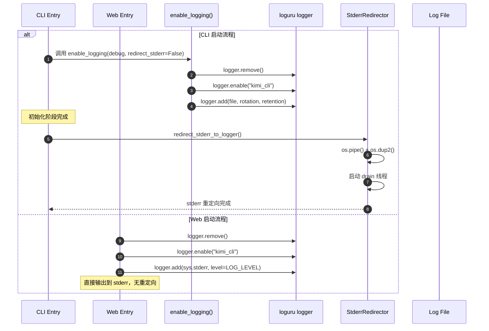

**关键交互说明**：

| 步骤 | 交互内容 | 设计意图 |
|-----|---------|---------|
| 1 | CLI 调用 enable_logging() 时延迟 stderr 重定向 | 确保启动期错误可见，不被重定向吞掉 |
| 2 | logger.remove() 清除默认 handler | 避免重复输出，完全控制日志流向 |
| 3 | logger.enable("kimi_cli") 启用命名空间 | 库模式默认静默，应用入口显式启用 |
| 4 | logger.add() 配置文件日志参数 | 支持轮转(rotation)和保留(retention) |
| 5 | 初始化成功后安装 stderr 重定向 | 运行时噪声统一进日志文件 |
| 6 | Web 直接配置 stderr 输出 | 云原生部署友好，便于容器日志采集 |

---

## 3. 核心组件详细分析

### 3.1 StderrRedirector 内部结构

#### 职责定位

StderrRedirector 负责将进程级别的 stderr（文件描述符 2）重定向到 loguru 日志系统，实现运行时 stderr 输出的统一捕获和管理。

#### 状态机图

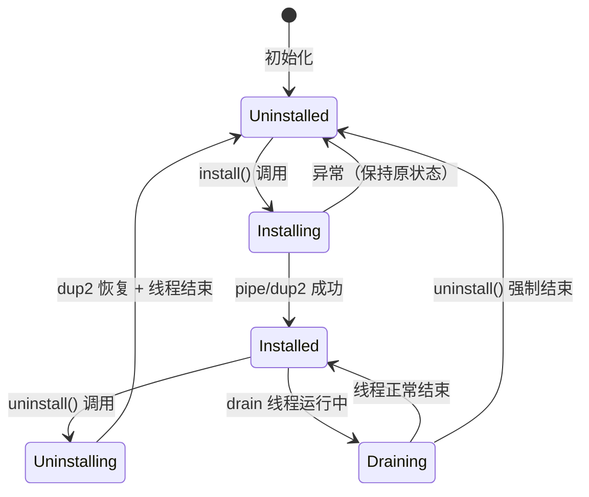

**状态说明**：

| 状态 | 说明 | 进入条件 | 退出条件 |
|-----|------|---------|---------|
| Uninstalled | 未安装，stderr 保持原始输出 | 初始化完成或卸载结束 | install() 被调用 |
| Installing | 安装中，正在设置 pipe 和 dup2 | install() 开始执行 | pipe/dup2 完成或失败 |
| Installed | 已安装，stderr 重定向到 pipe | pipe/dup2 成功 | uninstall() 被调用 |
| Draining | drain 线程正在读取 pipe 数据 | install() 启动线程 | 线程结束或 uninstall() |
| Uninstalling | 卸载中，恢复原始 stderr | uninstall() 开始执行 | 恢复完成 |

#### 内部数据流

```text
┌─────────────────────────────────────────────────────────────┐
│  输入层（系统 stderr）                                        │
│  ├── 第三方库输出 ──► fd=2 (原 stderr)                       │
│  └── 子进程输出   ──► fd=2                                   │
└──────────────────────────┬──────────────────────────────────┘
                           ▼ os.dup2(write_fd, 2)
┌─────────────────────────────────────────────────────────────┐
│  管道层                                                      │
│  ├── write_fd (fd=2) 接收数据                                │
│  └── read_fd         供 drain 线程读取                       │
└──────────────────────────┬──────────────────────────────────┘
                           ▼ os.read(read_fd, 4096)
┌─────────────────────────────────────────────────────────────┐
│  处理层（drain 线程）                                         │
│  ├── 增量解码: codecs.getincrementaldecoder()                │
│  ├── 按行分割: buffer.split("\n", 1)                         │
│  └── 逐行记录: logger.opt(depth=2).log()                     │
└──────────────────────────┬──────────────────────────────────┘
                           ▼
┌─────────────────────────────────────────────────────────────┐
│  输出层（loguru）                                            │
│  ├── 文件日志: ~/.kimi/logs/kimi.log                         │
│  └── 级别: ERROR (可配置)                                    │
└─────────────────────────────────────────────────────────────┘
```

#### 关键算法逻辑

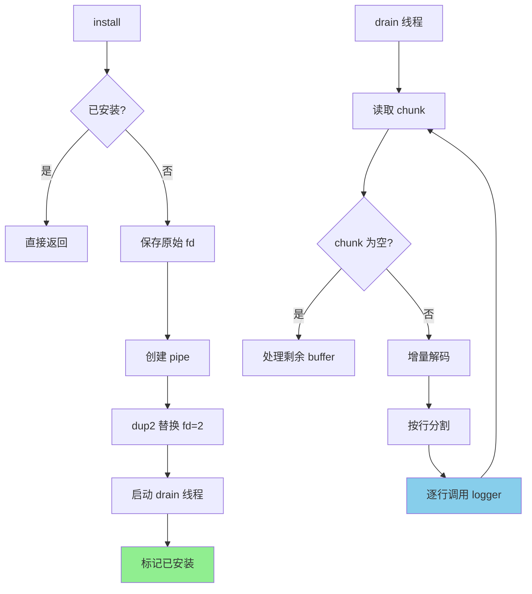

**算法要点**：

1. **线程安全**：使用 `threading.Lock()` 保护安装/卸载状态
2. **增量解码**：使用 `codecs.getincrementaldecoder()` 处理多字节字符边界
3. **深度调整**：`logger.opt(depth=2)` 确保日志显示正确的调用位置
4. **优雅恢复**：保存原始 fd，卸载时可完全恢复

#### 关键接口

| 接口 | 输入 | 输出 | 说明 | 代码位置 |
|-----|------|------|------|---------|
| `install()` | - | None | 安装 stderr 重定向 | `kimi-cli/src/kimi_cli/utils/logging.py:25` |
| `uninstall()` | - | None | 卸载并恢复原始 stderr | `kimi-cli/src/kimi_cli/utils/logging.py:48` |
| `_drain()` | - | None | 后台线程读取 pipe | `kimi-cli/src/kimi_cli/utils/logging.py:59` |
| `_log_line()` | line: str | None | 单行日志记录 | `kimi-cli/src/kimi_cli/utils/logging.py:84` |
| `open_original_stderr_handle()` | - | IO[bytes] | 获取原始 stderr | `kimi-cli/src/kimi_cli/utils/logging.py:90` |

---

### 3.2 enable_logging() 配置逻辑

#### 职责定位

`enable_logging()` 是日志系统的初始化入口，负责配置 loguru 的文件日志、级别控制和 stderr 重定向。

#### 配置参数

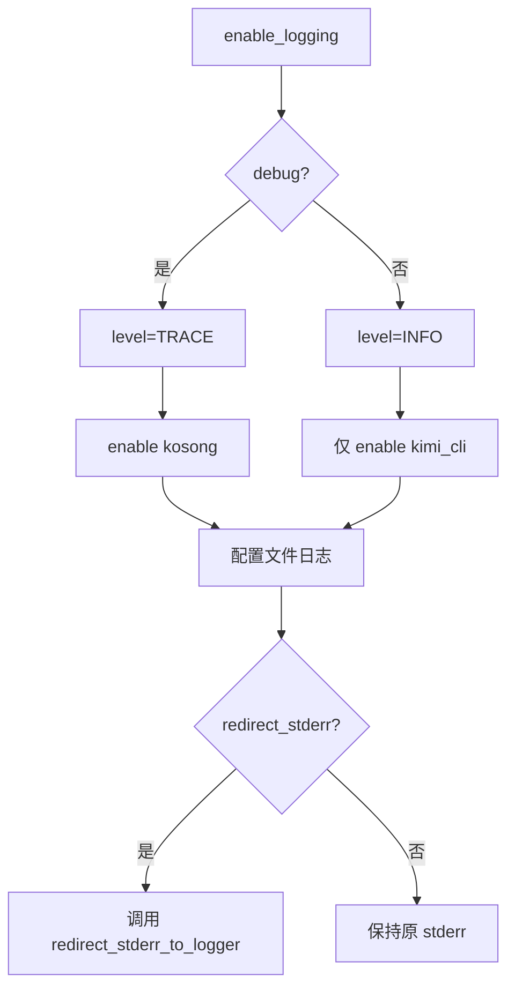

#### 文件日志配置

| 参数 | 值 | 说明 | 代码位置 |
|-----|-----|------|---------|
| 路径 | `~/.kimi/logs/kimi.log` | 用户级日志目录 | `kimi-cli/src/kimi_cli/app.py:44` |
| 级别 | TRACE (debug) / INFO (正常) | 动态调整详细程度 | `kimi-cli/src/kimi_cli/app.py:46` |
| 轮转 | `06:00` | 每天凌晨 6 点轮转 | `kimi-cli/src/kimi_cli/app.py:47` |
| 保留 | `10 days` | 保留最近 10 天 | `kimi-cli/src/kimi_cli/app.py:48` |

---

### 3.3 组件间协作时序

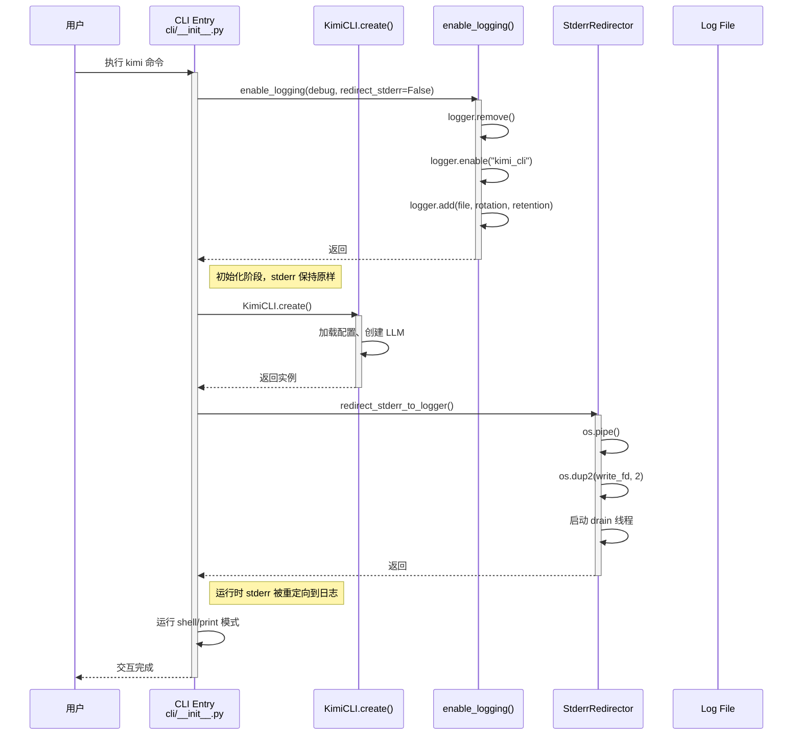

**协作要点**：

1. **调用方与 enable_logging()**：CLI Entry 在启动时调用，显式延迟 stderr 重定向
2. **enable_logging() 与 loguru**：完全控制 loguru 配置，清除默认 handler
3. **StderrRedirector 与文件系统**：通过 loguru 的文件 handler 最终写入磁盘
4. **延迟重定向策略**：确保 KimiCLI.create() 的启动错误能被用户看到

---

### 3.4 关键数据路径

#### 主路径（正常流程）

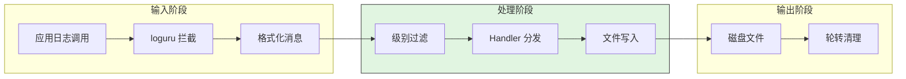

#### 异常路径（stderr 重定向）

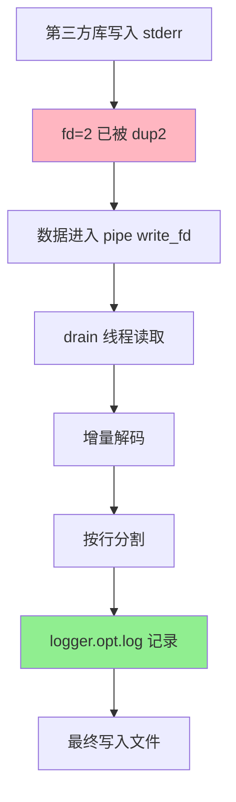

#### 致命错误路径（绕过重定向）

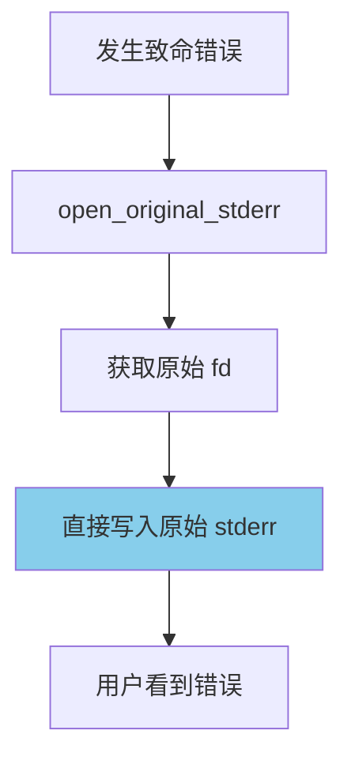

---

## 4. 端到端数据流转

### 4.1 正常流程（详细版）

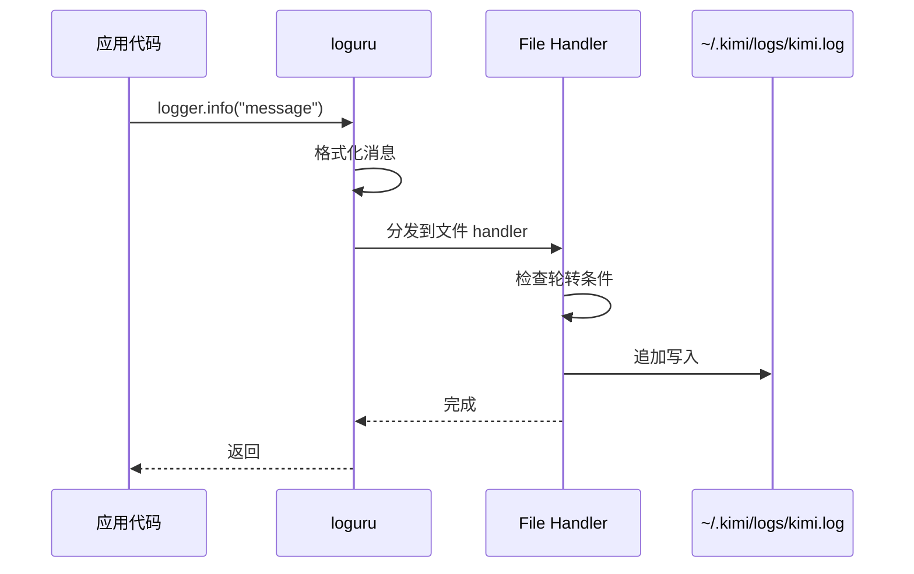

**数据变换详情**：

| 阶段 | 输入 | 处理 | 输出 | 代码位置 |
|-----|------|------|------|---------|
| 记录 | 日志消息 + 级别 | 格式化模板 | 结构化字符串 | `loguru` 内部 |
| 过滤 | 日志级别 | 级别比较 | 是否继续处理 | `kimi-cli/src/kimi_cli/app.py:46` |
| 写入 | 格式化字符串 | 文件 IO | 磁盘文件 | `loguru` 内部 |
| 轮转 | 时间/大小 | 重命名旧文件 | 新日志文件 | `loguru` 内部 (rotation) |
| 清理 | 保留策略 | 删除过期文件 | 仅保留近期 | `loguru` 内部 (retention) |

### 4.2 stderr 重定向数据流

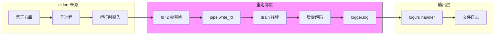

### 4.3 异常/边界流程

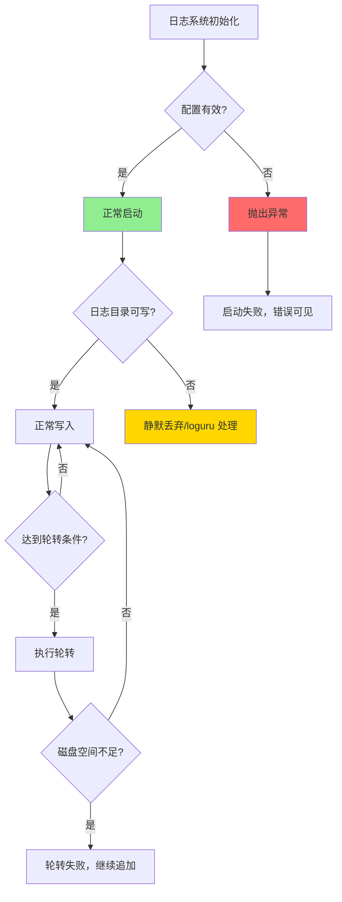

---

## 5. 关键代码实现

### 5.1 核心数据结构

```python
# kimi-cli/src/kimi_cli/utils/logging.py:15-24
class StderrRedirector:
    def __init__(self, level: str = "ERROR") -> None:
        self._level = level
        self._encoding: str | None = None
        self._installed = False
        self._lock = threading.Lock()
        self._original_fd: int | None = None
        self._read_fd: int | None = None
        self._thread: threading.Thread | None = None
```

**字段说明**：
| 字段 | 类型 | 用途 |
|-----|------|------|
| `_level` | `str` | 重定向日志的级别，默认 ERROR |
| `_installed` | `bool` | 安装状态标志，线程安全保护 |
| `_original_fd` | `int | None` | 原始 stderr 的文件描述符 |
| `_read_fd` | `int | None` | pipe 的读取端 |
| `_thread` | `Thread | None` | drain 后台线程 |

### 5.2 主链路代码

```python
# kimi-cli/src/kimi_cli/app.py:35-51
def enable_logging(debug: bool = False, *, redirect_stderr: bool = True) -> None:
    # NOTE: stderr redirection is implemented by swapping the process-level fd=2 (dup2).
    # That can hide Click/Typer error output during CLI startup, so some entrypoints delay
    # installing it until after critical initialization succeeds.
    logger.remove()  # Remove default stderr handler
    logger.enable("kimi_cli")
    if debug:
        logger.enable("kosong")
    logger.add(
        get_share_dir() / "logs" / "kimi.log",
        # FIXME: configure level for different modules
        level="TRACE" if debug else "INFO",
        rotation="06:00",
        retention="10 days",
    )
    if redirect_stderr:
        redirect_stderr_to_logger()
```

**代码要点**：
1. **延迟重定向注释**：明确说明为什么需要 `redirect_stderr=False` 选项
2. **完全控制**：`logger.remove()` 清除所有默认 handler，避免重复输出
3. **命名空间启用**：`logger.enable("kimi_cli")` 仅启用本库的日志
4. **动态级别**：debug 模式启用 TRACE 级别和 kosong 库的日志

### 5.3 stderr 重定向核心实现

```python
# kimi-cli/src/kimi_cli/utils/logging.py:25-46
def install(self) -> None:
    with self._lock:
        if self._installed:
            return
        with contextlib.suppress(Exception):
            sys.stderr.flush()
        if self._original_fd is None:
            with contextlib.suppress(OSError):
                self._original_fd = os.dup(2)
        if self._encoding is None:
            self._encoding = (
                sys.stderr.encoding or locale.getpreferredencoding(False) or "utf-8"
            )
        read_fd, write_fd = os.pipe()
        os.dup2(write_fd, 2)
        os.close(write_fd)
        self._read_fd = read_fd
        self._thread = threading.Thread(
            target=self._drain, name="kimi-stderr-redirect", daemon=True
        )
        self._thread.start()
        self._installed = True
```

**代码要点**：
1. **线程安全**：使用 Lock 保护安装状态检查
2. **fd 保存**：首次安装时保存原始 stderr fd
3. **原子替换**：`os.dup2()` 原子替换 fd=2
4. **守护线程**：drain 线程设为 daemon，主线程退出时自动结束

### 5.4 关键调用链

```text
CLI 启动流程:
  kimi_cli.cli.__init__.kimi()          [kimi-cli/src/kimi_cli/cli/__init__.py:325]
    -> enable_logging(debug, redirect_stderr=False)
       [kimi-cli/src/kimi_cli/app.py:35]
       - logger.remove()
       - logger.enable("kimi_cli")
       - logger.add(file, rotation, retention)
    -> KimiCLI.create()                 [kimi-cli/src/kimi_cli/cli/__init__.py:484]
    -> redirect_stderr_to_logger()      [kimi-cli/src/kimi_cli/cli/__init__.py:499]
       [kimi-cli/src/kimi_cli/utils/logging.py:101]
       -> StderrRedirector.install()
          [kimi-cli/src/kimi_cli/utils/logging.py:25]
          - os.pipe()
          - os.dup2(write_fd, 2)
          - threading.Thread(target=_drain).start()

Web 启动流程:
  kimi_cli.web.app (模块导入)           [kimi-cli/src/kimi_cli/web/app.py:37]
    -> logger.remove()
    -> logger.enable("kimi_cli")
    -> logger.add(sys.stderr, level=LOG_LEVEL)
```

---

## 6. 设计意图与 Trade-off

### 6.1 Kimi CLI 的选择

| 维度 | Kimi CLI 的选择 | 替代方案 | 取舍分析 |
|-----|----------------|---------|---------|
| 日志库 | loguru | 标准库 logging | loguru 更简洁，支持结构化日志和自动轮转，但增加外部依赖 |
| 库/应用区分 | 默认 disable，入口 enable | 始终启用或环境变量控制 | 作为库时静默，应用时显式控制，但需每个入口调用 enable |
| stderr 重定向 | 延迟安装（两阶段） | 立即安装或不安装 | 启动错误可见，但增加复杂度 |
| CLI 日志落地 | 本地文件 | 数据库/远程 | 简单可靠，但不便于集中分析 |
| Web 日志落地 | 标准 stderr | 文件/数据库 | 云原生友好，但本地排查需外部系统 |
| 轮转策略 | 时间轮转 (06:00) | 大小轮转 | 日志按天组织，但单文件可能过大 |
| 保留策略 | 10 天固定 | 可配置/无限 | 简单可控，但可能不符合所有合规要求 |

### 6.2 为什么这样设计？

**核心问题**：如何在 CLI 和 Web 两种部署形态下，既保证启动期错误可见，又实现运行时日志的统一管理？

**Kimi CLI 的解决方案**：
- 代码依据：`kimi-cli/src/kimi_cli/app.py:36-38`
- 设计意图：通过 `redirect_stderr=False` 参数支持延迟重定向，CLI Entry 在初始化完成后再启用
- 带来的好处：
  - 启动期配置错误（如参数解析失败）直接显示给用户
  - 运行时第三方库的 stderr 输出被捕获到日志文件
  - Web 模式直接输出到 stderr，便于容器化部署
- 付出的代价：
  - 日志初始化分为两阶段，理解成本增加
  - 需要显式调用 redirect_stderr_to_logger()

### 6.3 与其他项目的对比

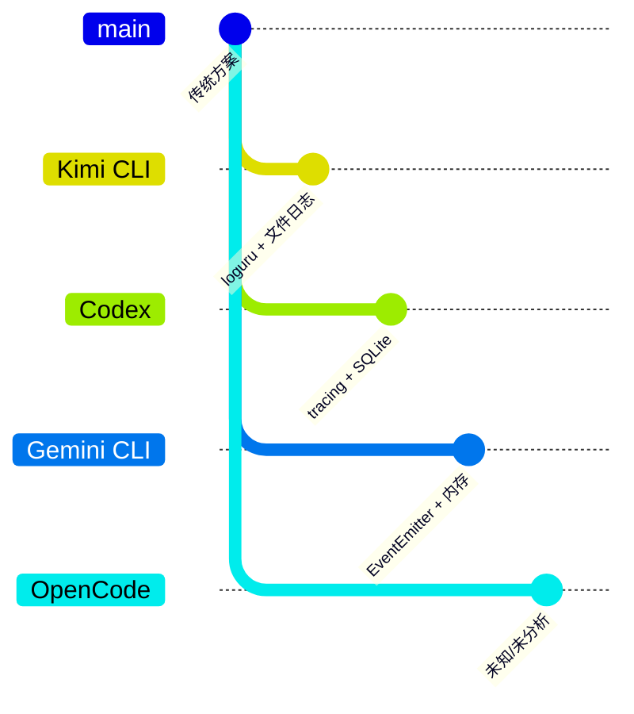

| 项目 | 核心差异 | 日志存储 | 适用场景 |
|-----|---------|---------|---------|
| Kimi CLI | loguru 驱动，文件日志 + stderr 重定向 | 本地文件 (~/.kimi/logs/) | 个人 CLI 工具，本地优先 |
| Codex | tracing 框架，SQLite 结构化存储 | SQLite 数据库 | 企业级，需要结构化查询 |
| Gemini CLI | EventEmitter 事件驱动，内存缓冲 | 内存 + 可选导出 | IDE 集成，实时性要求高 |
| OpenCode | 待分析 | - | - |
| SWE-agent | 待分析 | - | - |

**详细对比分析**：

| 特性 | Kimi CLI | Codex | Gemini CLI |
|-----|----------|-------|------------|
| 日志框架 | loguru | tracing (Rust) | EventEmitter |
| 存储介质 | 文本文件 | SQLite | 内存 |
| 结构化 | 半结构化 | 完全结构化 | 事件对象 |
| 查询能力 | grep/文本搜索 | SQL 查询 | 内存过滤 |
| 持久化 | 本地文件 | 数据库文件 | 依赖外部订阅 |
| 轮转策略 | 时间 + 保留天数 | 90 天自动清理 | 10000 条缓冲 |
| 部署友好 | CLI 文件/Web stderr | 统一数据库存储 | 事件订阅模式 |

---

## 7. 边界情况与错误处理

### 7.1 终止条件

| 终止原因 | 触发条件 | 代码位置 |
|---------|---------|---------|
| drain 线程正常结束 | pipe 读取端关闭 (chunk 为空) | `kimi-cli/src/kimi_cli/utils/logging.py:69` |
| drain 线程强制结束 | uninstall() 调用，join 超时 2 秒 | `kimi-cli/src/kimi_cli/utils/logging.py:56` |
| 日志级别过滤 | 消息级别低于配置级别 | `kimi-cli/src/kimi_cli/app.py:46` |
| 日志文件不可写 | 目录权限不足 | loguru 内部处理 |

### 7.2 超时/资源限制

```python
# kimi-cli/src/kimi_cli/utils/logging.py:56
# uninstall 时等待 drain 线程结束，超时 2 秒
self._thread.join(timeout=2.0)

# kimi-cli/src/kimi_cli/app.py:47-48
# 日志轮转和保留配置
rotation="06:00"        # 每天凌晨 6 点轮转
retention="10 days"     # 保留 10 天
```

### 7.3 错误恢复策略

| 错误类型 | 处理策略 | 代码位置 |
|---------|---------|---------|
| pipe 创建失败 | 异常抛出，保持未安装状态 | `kimi-cli/src/kimi_cli/utils/logging.py:38` |
| dup2 失败 | 异常抛出，保持未安装状态 | `kimi-cli/src/kimi_cli/utils/logging.py:39` |
| 解码错误 | 使用 errors="replace" 替换 | `kimi-cli/src/kimi_cli/utils/logging.py:65` |
| drain 异常 | 记录异常日志，继续运行 | `kimi-cli/src/kimi_cli/utils/logging.py:75-76` |
| 致命错误输出 | 使用原始 stderr 绕过重定向 | `kimi-cli/src/kimi_cli/cli/__init__.py:327-335` |

---

## 8. 关键代码索引

| 功能 | 文件 | 行号 | 说明 |
|-----|------|------|------|
| 默认禁用 | `kimi-cli/src/kimi_cli/__init__.py` | 6 | 库导入时默认禁用日志 |
| CLI 入口 | `kimi-cli/src/kimi_cli/cli/__init__.py` | 318 | 导入 logging 工具函数 |
| 日志启用 | `kimi-cli/src/kimi_cli/cli/__init__.py` | 325 | 调用 enable_logging，延迟重定向 |
| 延迟重定向 | `kimi-cli/src/kimi_cli/cli/__init__.py` | 499 | 初始化成功后重定向 stderr |
| 致命错误 | `kimi-cli/src/kimi_cli/cli/__init__.py` | 327-335 | _emit_fatal_error 使用原始 stderr |
| 核心配置 | `kimi-cli/src/kimi_cli/app.py` | 35 | enable_logging() 主函数 |
| 文件日志 | `kimi-cli/src/kimi_cli/app.py` | 43-48 | 日志路径、级别、轮转、保留 |
| Web 配置 | `kimi-cli/src/kimi_cli/web/app.py` | 37-40 | Web 模式的 stderr 日志配置 |
| 重定向入口 | `kimi-cli/src/kimi_cli/utils/logging.py` | 101 | redirect_stderr_to_logger() |
| StderrRedirector | `kimi-cli/src/kimi_cli/utils/logging.py` | 15 | 重定向器类定义 |
| install | `kimi-cli/src/kimi_cli/utils/logging.py` | 25 | 安装重定向 |
| uninstall | `kimi-cli/src/kimi_cli/utils/logging.py` | 48 | 卸载恢复 |
| drain | `kimi-cli/src/kimi_cli/utils/logging.py` | 59 | 后台读取线程 |
| log_line | `kimi-cli/src/kimi_cli/utils/logging.py` | 84 | 单行日志记录 |
| 原始 stderr | `kimi-cli/src/kimi_cli/utils/logging.py` | 114 | open_original_stderr() |

---

## 9. 延伸阅读

- 前置知识：[loguru 官方文档](https://loguru.readthedocs.io/)
- 相关机制：`docs/kimi-cli/04-kimi-cli-agent-loop.md`
- 相关机制：`docs/kimi-cli/07-kimi-cli-memory-context.md`
- 对比分析：`docs/comm/comm-logging-comparison.md`（待创建）
- Codex 日志：`codex/codex-rs/state/src/log_db.rs`
- Gemini CLI 事件：`gemini-cli/packages/core/src/utils/events.ts`

---

*✅ Verified: 基于 kimi-cli/src/kimi_cli/app.py:35、kimi-cli/src/kimi_cli/utils/logging.py:15 等源码分析*
*⚠️ Inferred: Codex 和 Gemini CLI 的对比分析基于部分源码，可能存在不完整*
*基于版本：kimi-cli (2026-02-08) | 最后更新：2026-02-24*
