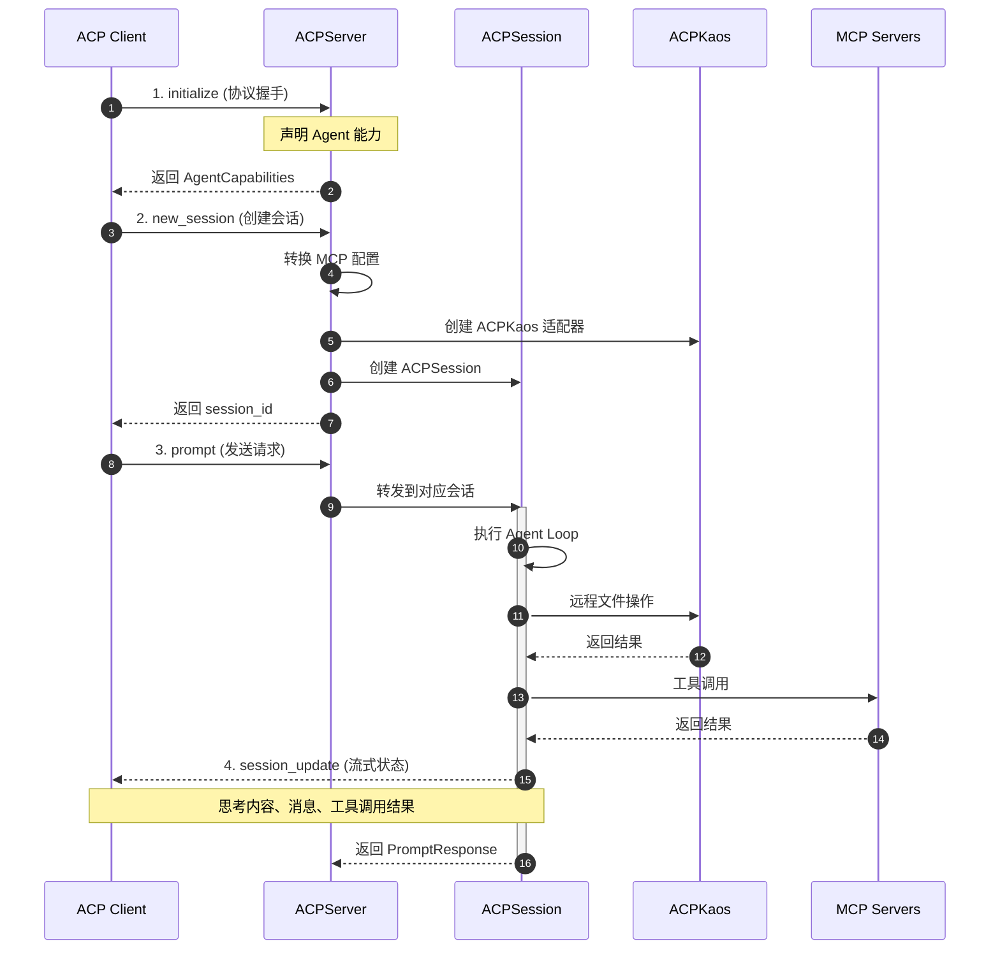
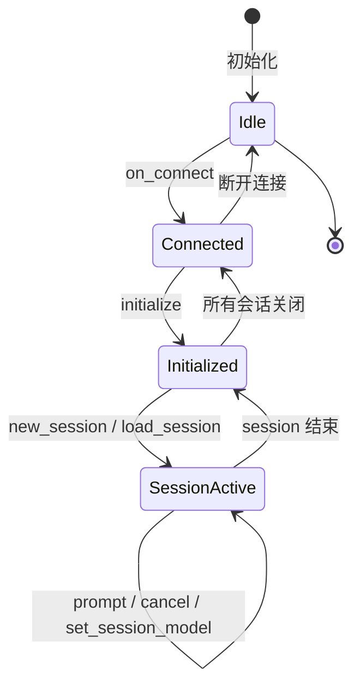
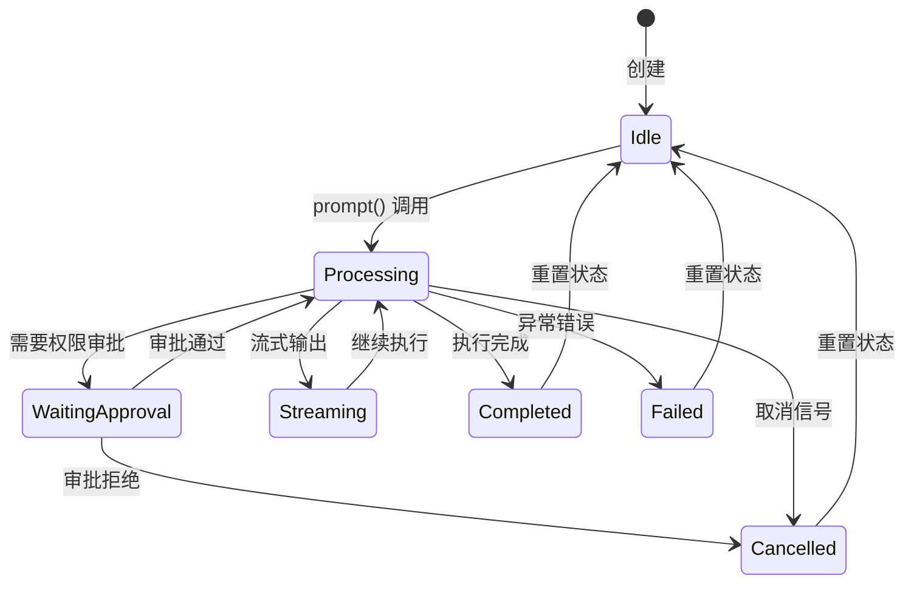
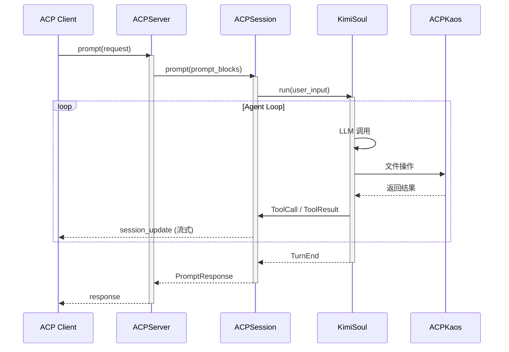
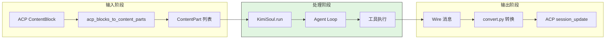
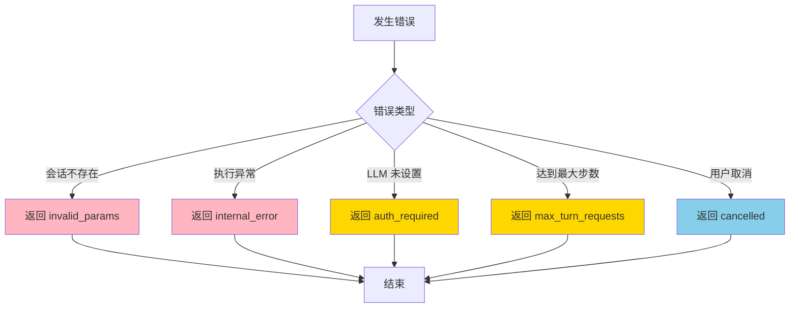
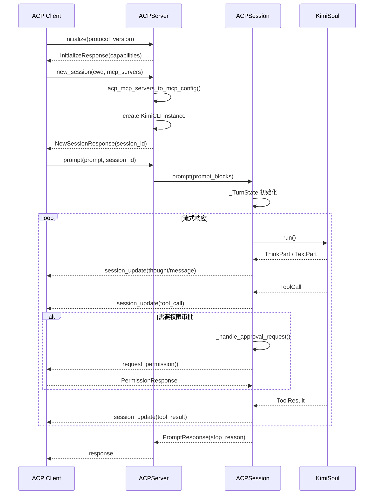
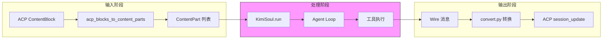
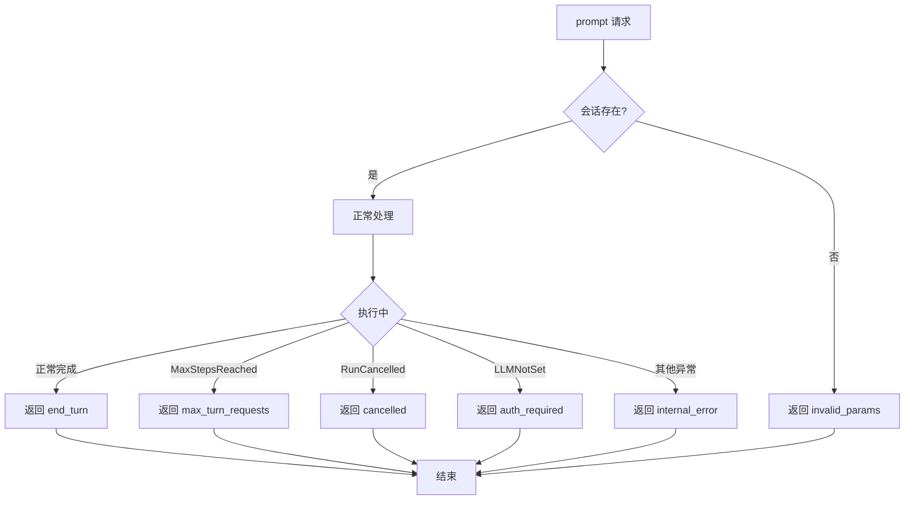
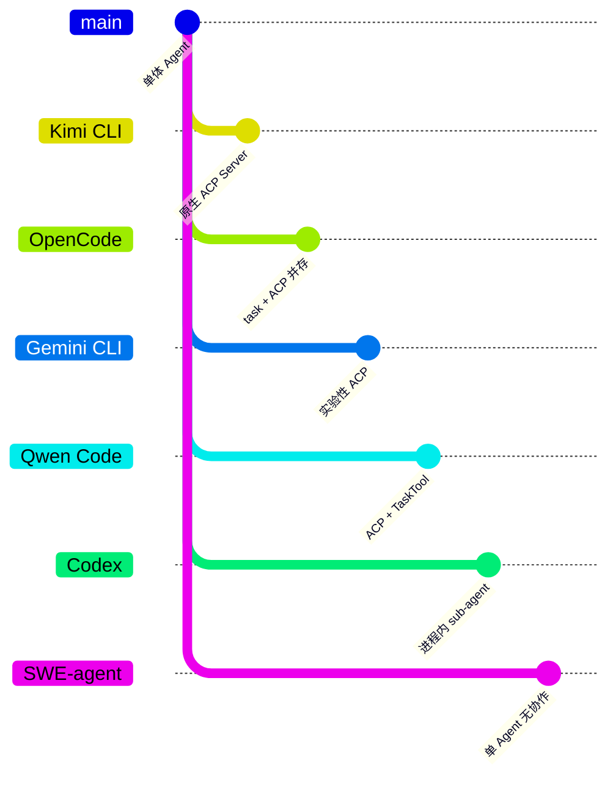

# Kimi CLI ACP 集成实现

> 📋 **阅读指南**
>
> | 属性 | 说明 |
> |-----|------|
> | 预计阅读 | 25-35 分钟 |
> | 前置文档 | `01-kimi-cli-overview.md`、`06-kimi-cli-mcp-integration.md` |
> | 文档结构 | 速览 → 架构 → 机制 → 实现 → 对比 |
> | 代码呈现 | 关键代码直接展示，完整代码可折叠查看 |

---

## TL;DR（结论先行）

一句话定义：Kimi CLI 实现了 ACP（Agent Client Protocol）协议，通过 ACP Server 模式将 Agent 能力服务化，支持外部系统调用、多会话管理、MCP 配置桥接和流式状态传输。

Kimi CLI 的核心取舍：**协议分层架构 + 能力协商机制**（对比 Codex/SWE-agent 等非 ACP 架构，OpenCode 的 task 工具 + ACP 并存，Gemini CLI 的实验性 ACP 支持）

### 核心要点速览

| 维度 | 关键决策 | 代码位置 |
|-----|---------|---------|
| 协议实现 | 原生 ACP Server 实现 | `kimi-cli/src/kimi_cli/acp/server.py:27` |
| 会话管理 | 多会话 dict 管理 | `kimi-cli/src/kimi_cli/acp/server.py:31` |
| 能力协商 | 运行时协商 + fallback 机制 | `kimi-cli/src/kimi_cli/acp/kaos.py:149` |
| MCP 桥接 | acp_mcp_servers_to_mcp_config | `kimi-cli/src/kimi_cli/acp/mcp.py:13` |
| 流式传输 | 实时 session_update 推送 | `kimi-cli/src/kimi_cli/acp/session.py:139` |

---

## 1. 为什么需要这个机制？（解决什么问题）

### 1.1 问题场景

没有 ACP：Agent 只能作为本地 CLI 工具运行，无法被外部系统（IDE、其他 Agent）调用

有 ACP：
  → IDE (Cursor) 通过 ACP 协议调用 Kimi CLI 执行代码分析
  → 父 Agent 通过 ACP 协议委派任务给子 Agent
  → 流式获取执行状态、工具调用结果、权限审批请求

### 1.2 核心挑战

| 挑战 | 不解决的后果 |
|-----|-------------|
| 协议标准化 | 每个集成方都需要自定义适配，无法复用 |
| 多会话管理 | 无法同时服务多个客户端请求 |
| 能力协商 | 客户端不支持的功能无法优雅降级 |
| MCP 配置桥接 | ACP 客户端的 MCP 配置无法传递给 Agent |
| 流式状态传输 | 用户无法实时看到 Agent 执行进度 |

---

## 2. 整体架构（ASCII 图）

### 2.1 在系统中的位置

```text
┌─────────────────────────────────────────────────────────────┐
│ ACP Client (IDE / 父 Agent / Toad TUI)                      │
│ Cursor / Claude Desktop / kim term                          │
└───────────────────────┬─────────────────────────────────────┘
                        │ ACP Protocol (stdio)
                        ▼
┌─────────────────────────────────────────────────────────────┐
│ ▓▓▓ ACP Server ▓▓▓                                          │
│ kimi-cli/src/kimi_cli/acp/                                  │
│ - ACPServer    : 多会话管理、协议握手                        │
│ - ACPSession   : 单会话处理、流式响应                        │
│ - ACPKaos      : 远程操作适配                                │
│ - acp_mcp_servers_to_mcp_config: MCP 配置桥接              │
└───────────────────────┬─────────────────────────────────────┘
                        │
        ┌───────────────┼───────────────┐
        ▼               ▼               ▼
┌──────────────┐ ┌──────────────┐ ┌──────────────┐
│ KimiSoul     │ │ MCP Servers  │ │ KimiCLI      │
│ Agent Loop   │ │ 工具层       │ │ 应用层       │
└──────────────┘ └──────────────┘ └──────────────┘
```

### 2.2 核心组件职责

| 组件 | 职责 | 代码位置 |
|-----|------|---------|
| `ACPServer` | 多会话管理、协议握手、模型切换 | `kimi-cli/src/kimi_cli/acp/server.py:27` |
| `ACPSession` | 单会话处理、流式响应、权限审批 | `kimi-cli/src/kimi_cli/acp/session.py:115` |
| `ACPKaos` | 远程文件操作、能力协商、fallback 机制 | `kimi-cli/src/kimi_cli/acp/kaos.py:144` |
| `acp_mcp_servers_to_mcp_config` | ACP MCP 配置转换为内部格式 | `kimi-cli/src/kimi_cli/acp/mcp.py:13` |
| `replace_tools` | 本地 Shell 工具替换为 ACP Terminal | `kimi-cli/src/kimi_cli/acp/tools.py:18` |
| `acp_main` | ACP Server 入口点 | `kimi-cli/src/kimi_cli/acp/__init__.py:1` |

### 2.3 核心组件交互关系



**关键交互说明**：

| 步骤 | 交互内容 | 设计意图 |
|-----|---------|---------|
| 1 | 协议握手与能力声明 | 协商支持的特性，便于后续能力降级 |
| 2 | 创建会话并初始化 | 每个会话独立，支持多客户端并发 |
| 3 | 发送用户请求 | 通过 session_id 路由到对应会话 |
| 4 | 流式状态推送 | 实时反馈执行进度，提升用户体验 |

---

## 3. 核心组件详细分析

### 3.1 ACPServer 内部结构

#### 职责定位

ACPServer 是 ACP 协议的服务端实现，负责管理多个会话的生命周期，处理协议握手和会话路由。

#### 状态机图



**状态说明**：

| 状态 | 说明 | 进入条件 | 退出条件 |
|-----|------|---------|---------|
| Idle | 初始状态 | 实例化完成 | 客户端连接 |
| Connected | 已连接 | 收到 on_connect | 协议初始化完成 |
| Initialized | 协议已握手 | initialize 成功 | 创建或加载会话 |
| SessionActive | 会话运行中 | 有活跃会话 | 所有会话结束 |

#### 内部数据流

```text
┌─────────────────────────────────────────────────────────────┐
│  输入层 (ACP Protocol)                                       │
│  ├── initialize ──► 能力协商 ──► AgentCapabilities           │
│  ├── new_session ──► 会话创建 ──► session_id                 │
│  ├── prompt ──► 请求路由 ──► ACPSession                      │
│  └── cancel ──► 取消信号 ──► cancel_event                    │
└──────────────────────────┬──────────────────────────────────┘
                           ▼
┌─────────────────────────────────────────────────────────────┐
│  处理层 (会话管理)                                            │
│  ├── sessions: dict[str, tuple[ACPSession, _ModelIDConv]]   │
│  ├── session 查找与路由                                       │
│  └── 模型切换 (set_session_model)                           │
└──────────────────────────┬──────────────────────────────────┘
                           ▼
┌─────────────────────────────────────────────────────────────┐
│  输出层 (响应)                                               │
│  ├── InitializeResponse (能力声明)                           │
│  ├── NewSessionResponse (会话信息)                           │
│  └── PromptResponse (执行结果)                               │
└─────────────────────────────────────────────────────────────┘
```

#### 关键接口

| 接口 | 输入 | 输出 | 说明 | 代码位置 |
|-----|------|------|------|---------|
| `initialize()` | protocol_version, client_capabilities | InitializeResponse | 协议握手 | `server.py:37` |
| `new_session()` | cwd, mcp_servers | NewSessionResponse | 创建会话 | `server.py:108` |
| `prompt()` | prompt, session_id | PromptResponse | 发送请求 | `server.py:283` |
| `cancel()` | session_id | None | 取消操作 | `server.py:293` |

---

### 3.2 ACPSession 内部结构

#### 职责定位

ACPSession 封装单个会话的所有状态，是 ACP 协议与 KimiSoul 之间的桥梁，负责流式响应和权限审批。

#### 状态机图



#### 关键数据结构

```python
# kimi-cli/src/kimi_cli/acp/session.py:71-112
class _ToolCallState:
    """Manages the state of a single tool call for streaming updates."""
    def __init__(self, tool_call: ToolCall):
        self.tool_call = tool_call
        self.args = tool_call.function.arguments or ""
        self.lexer = streamingjson.Lexer()

    @property
    def acp_tool_call_id(self) -> str:
        # 复合 ID 避免冲突: {turn_id}/{tool_call_id}
        turn_id = _current_turn_id.get()
        return f"{turn_id}/{self.tool_call.id}"

class _TurnState:
    def __init__(self):
        self.id = str(uuid.uuid4())  # 唯一 turn ID
        self.tool_calls: dict[str, _ToolCallState] = {}
        self.cancel_event = asyncio.Event()
```

#### 关键接口

| 接口 | 输入 | 输出 | 说明 | 代码位置 |
|-----|------|------|------|---------|
| `prompt()` | ACPContentBlock 列表 | PromptResponse | 处理用户请求 | `session.py:139` |
| `cancel()` | - | None | 设置取消信号 | `session.py:209` |
| `_handle_approval_request()` | ApprovalRequest | None | 处理权限审批 | `session.py:337` |
| `_send_tool_call()` | ToolCall | None | 发送工具调用 | `session.py:242` |

---

### 3.3 ACPKaos 内部结构

#### 职责定位

ACPKaos 实现 KAOS（Kimi Abstract Operating System）接口，将本地文件操作代理到 ACP Client，支持能力协商和渐进式降级。

#### 能力协商机制

```python
# kimi-cli/src/kimi_cli/acp/kaos.py:149-168
class ACPKaos:
    def __init__(self, client, session_id, client_capabilities, fallback=None):
        self._fallback = fallback or local_kaos
        fs = client_capabilities.fs if client_capabilities else None
        self._supports_read = bool(fs and fs.read_text_file)
        self._supports_write = bool(fs and fs.write_text_file)
        self._supports_terminal = bool(client_capabilities and client_capabilities.terminal)
```

| 操作 | ACP 支持时 | ACP 不支持时 |
|-----|-----------|-------------|
| read_text | 通过 ACP 读取远程文件 | fallback 到 local_kaos |
| write_text | 通过 ACP 写入远程文件 | fallback 到 local_kaos |
| exec | 通过 ACP Terminal 执行 | fallback 到 local_kaos |
| 其他文件操作 | 总是 fallback 到 local_kaos | local_kaos |

---

### 3.4 组件间协作时序



**协作要点**：

1. **ACPServer 与会话管理**：通过 sessions dict 管理多会话，支持并发
2. **ACPSession 与 KimiSoul**：调用 KimiSoul.run() 执行 Agent Loop
3. **ACPKaos 能力协商**：运行时检测客户端能力，动态选择本地或远程执行
4. **流式状态推送**：通过 session_update 实时推送执行状态到客户端

---

### 3.5 关键数据路径

#### 主路径（正常流程）



#### 异常路径（错误恢复）



---

## 4. 端到端数据流转

### 4.1 正常流程（详细版）



**数据变换详情**：

| 阶段 | 输入 | 处理 | 输出 | 代码位置 |
|-----|------|------|------|---------|
| 协议握手 | protocol_version | 版本协商 | InitializeResponse | `server.py:37` |
| 会话创建 | cwd, mcp_servers | 配置转换 | NewSessionResponse | `server.py:108` |
| 内容转换 | ACPContentBlock | acp_blocks_to_content_parts | ContentPart | `convert.py:17` |
| 流式推送 | Agent Loop 消息 | 类型映射 | session_update | `session.py:216-301` |
| 权限审批 | ApprovalRequest | 用户交互 | PermissionResponse | `session.py:337` |

### 4.2 数据流向图



### 4.3 异常/边界流程



---

## 5. 关键代码实现

### 5.1 核心数据结构

#### 5.1.1 ACPServer 内部数据结构

```python
# kimi-cli/src/kimi_cli/acp/server.py:27-31
class ACPServer:
    def __init__(self) -> None:
        self.client_capabilities: acp.schema.ClientCapabilities | None = None
        self.conn: acp.Client | None = None
        self.sessions: dict[str, tuple[ACPSession, _ModelIDConv]] = {}
```

**字段说明**：

| 字段 | 类型 | 用途 |
|-----|------|------|
| `client_capabilities` | `ClientCapabilities \| None` | 客户端能力声明，用于能力协商 |
| `conn` | `acp.Client \| None` | ACP 连接对象，用于发送响应 |
| `sessions` | `dict[str, tuple[ACPSession, _ModelIDConv]]` | 会话映射表，支持多会话管理 |

#### 5.1.2 ACPSession 内部数据结构

```python
# kimi-cli/src/kimi_cli/acp/session.py:71-112
class _ToolCallState:
    """Manages the state of a single tool call for streaming updates."""
    def __init__(self, tool_call: ToolCall):
        self.tool_call = tool_call
        self.args = tool_call.function.arguments or ""
        self.lexer = streamingjson.Lexer()

    @property
    def acp_tool_call_id(self) -> str:
        # 复合 ID 避免冲突: {turn_id}/{tool_call_id}
        turn_id = _current_turn_id.get()
        assert turn_id is not None
        return f"{turn_id}/{self.tool_call.id}"

    def append_args_part(self, args_part: str) -> None:
        """Append a new arguments part to the accumulated args and lexer."""
        self.args += args_part
        self.lexer.append_string(args_part)

    def get_title(self) -> str:
        """Get the current title with subtitle if available."""
        tool_name = self.tool_call.function.name
        subtitle = extract_key_argument(self.lexer, tool_name)
        if subtitle:
            return f"{tool_name}: {subtitle}"
        return tool_name


class _TurnState:
    def __init__(self):
        self.id = str(uuid.uuid4())
        """Unique ID for the turn."""
        self.tool_calls: dict[str, _ToolCallState] = {}
        """Map of tool call ID (LLM-side ID) to tool call state."""
        self.last_tool_call: _ToolCallState | None = None
        self.cancel_event = asyncio.Event()
```

**关键设计说明**：

| 设计点 | 说明 |
|-------|------|
| `_ToolCallState.acp_tool_call_id` | 使用 `{turn_id}/{tool_call_id}` 复合 ID 避免不同 turn 间工具调用 ID 冲突 |
| `streamingjson.Lexer` | 用于实时解析流式 JSON 参数，提取关键参数显示在标题中 |
| `_TurnState.cancel_event` | asyncio.Event 用于异步取消信号传递 |

#### 5.1.3 ACPKaos 能力协商机制

```python
# kimi-cli/src/kimi_cli/acp/kaos.py:144-168
class ACPKaos:
    def __init__(
        self,
        client: acp.Client,
        session_id: str,
        client_capabilities: acp.schema.ClientCapabilities | None,
        fallback: Kaos | None = None,
        *,
        output_byte_limit: int | None = _DEFAULT_TERMINAL_OUTPUT_LIMIT,
        poll_interval: float = _DEFAULT_POLL_INTERVAL,
    ) -> None:
        self._client = client
        self._session_id = session_id
        self._fallback = fallback or local_kaos
        fs = client_capabilities.fs if client_capabilities else None
        self._supports_read = bool(fs and fs.read_text_file)
        self._supports_write = bool(fs and fs.write_text_file)
        self._supports_terminal = bool(client_capabilities and client_capabilities.terminal)
        self._output_byte_limit = output_byte_limit
        self._poll_interval = poll_interval
```

**能力协商逻辑**：

| 操作 | ACP 支持时 | ACP 不支持时 | 代码位置 |
|-----|-----------|-------------|---------|
| `read_text` | 通过 ACP 读取远程文件 | fallback 到 local_kaos | `kaos.py:198-209` |
| `write_text` | 通过 ACP 写入远程文件 | fallback 到 local_kaos | `kaos.py:225-258` |
| `exec` | 通过 ACP Terminal 执行 | fallback 到 local_kaos | `kaos.py:265-266` |
| 其他文件操作 | 总是 fallback 到 local_kaos | local_kaos | - |

### 5.2 MCP 配置桥接实现

#### 5.2.1 桥接函数实现

**关键代码**（核心逻辑）：

```python
# kimi-cli/src/kimi_cli/acp/mcp.py:13-46
def acp_mcp_servers_to_mcp_config(mcp_servers: list[MCPServer]) -> MCPConfig:
    """将 ACP 协议传来的 MCP Server 配置转换为内部格式。"""
    if not mcp_servers:
        return MCPConfig()

    try:
        return MCPConfig.model_validate(
            {"mcpServers": {server.name: _convert_acp_mcp_server(server) for server in mcp_servers}}
        )
    except ValidationError as exc:
        raise MCPConfigError(f"Invalid MCP config from ACP client: {exc}") from exc


def _convert_acp_mcp_server(server: MCPServer) -> dict[str, Any]:
    """转换单个 MCP Server 配置。"""
    match server:
        case acp.schema.HttpMcpServer():
            return {
                "url": server.url,
                "transport": "http",
                "headers": {header.name: header.value for header in server.headers},
            }
        case acp.schema.SseMcpServer():
            return {
                "url": server.url,
                "transport": "sse",
                "headers": {header.name: header.value for header in server.headers},
            }
        case acp.schema.McpServerStdio():
            return {
                "command": server.command,
                "args": server.args,
                "env": {item.name: item.value for item in server.env},
                "transport": "stdio",
            }
```

**设计意图**：
1. **类型安全转换**：使用 Python 3.10+ match-case 进行类型分发，利用 `acp.schema` 的类型定义
2. **统一配置格式**：转换为内部 `MCPConfig`，与现有 MCP 系统无缝集成
3. **错误处理**：`ValidationError` 转换为 `MCPConfigError`，提供清晰错误信息
4. **调用时机**：在 `ACPServer.new_session()` 和 `ACPServer.load_session()` 中调用，将会话级别的 MCP 配置注入到 KimiCLI 实例

#### 5.2.2 转换映射表

| ACP 类型 | 字段映射 | 内部格式 |
|---------|---------|---------|
| `HttpMcpServer` | `url` → `url`<br>`headers[]` → `headers{}` | `{"url": ..., "transport": "http", "headers": {...}}` |
| `SseMcpServer` | `url` → `url`<br>`headers[]` → `headers{}` | `{"url": ..., "transport": "sse", "headers": {...}}` |
| `McpServerStdio` | `command` → `command`<br>`args[]` → `args`<br>`env[]` → `env{}` | `{"command": ..., "args": [...], "env": {...}, "transport": "stdio"}` |

### 5.3 权限审批实现

**关键代码**（核心逻辑）：

```python
# kimi-cli/src/kimi_cli/acp/session.py:337-422
async def _handle_approval_request(self, request: ApprovalRequest):
    """处理权限审批请求。"""
    state = self._turn_state.tool_calls.get(request.tool_call_id, None)
    if state is None:
        request.resolve("reject")
        return

    # 构建权限选项
    permission_options = [
        acp.schema.PermissionOption(option_id="approve", name="Approve once", kind="allow_once"),
        acp.schema.PermissionOption(option_id="approve_for_session", name="Approve for this session", kind="allow_always"),
        acp.schema.PermissionOption(option_id="reject", name="Reject", kind="reject_once"),
    ]

    # 发送权限请求并等待响应
    response = await self._conn.request_permission(
        permission_options,
        self._id,
        acp.schema.ToolCallUpdate(...),
    )

    # 解析响应结果
    if isinstance(response.outcome, acp.schema.AllowedOutcome):
        if response.outcome.option_id == "approve":
            request.resolve("approve")
        elif response.outcome.option_id == "approve_for_session":
            request.resolve("approve_for_session")
        else:
            request.resolve("reject")
```

**设计意图**：
1. **三种审批选项**：单次批准、会话级批准、拒绝
2. **异步等待**：通过 ACP 连接异步等待客户端响应
3. **错误处理**：工具调用不存在时直接拒绝

### 5.4 流式响应实现细节

ACPSession 通过 `_send_*` 系列方法将 Agent Loop 的内部消息转换为 ACP 协议的 `session_update` 通知。

#### 5.4.1 思考内容流式发送

```python
# kimi-cli/src/kimi_cli/acp/session.py:216-227
async def _send_thinking(self, think: str):
    """Send thinking content to client."""
    if not self._id or not self._conn:
        return

    await self._conn.session_update(
        self._id,
        acp.schema.AgentThoughtChunk(
            content=acp.schema.TextContentBlock(type="text", text=think),
            session_update="agent_thought_chunk",
        ),
    )
```

#### 5.4.2 消息内容流式发送

```python
# kimi-cli/src/kimi_cli/acp/session.py:229-240
async def _send_text(self, text: str):
    """Send text chunk to client."""
    if not self._id or not self._conn:
        return

    await self._conn.session_update(
        session_id=self._id,
        update=acp.schema.AgentMessageChunk(
            content=acp.schema.TextContentBlock(type="text", text=text),
            session_update="agent_message_chunk",
        ),
    )
```

#### 5.4.3 工具调用流式发送

```python
# kimi-cli/src/kimi_cli/acp/session.py:242-268
async def _send_tool_call(self, tool_call: ToolCall):
    """Send tool call to client."""
    assert self._turn_state is not None
    if not self._id or not self._conn:
        return

    # Create and store tool call state
    state = _ToolCallState(tool_call)
    self._turn_state.tool_calls[tool_call.id] = state
    self._turn_state.last_tool_call = state

    await self._conn.session_update(
        session_id=self._id,
        update=acp.schema.ToolCallStart(
            session_update="tool_call",
            tool_call_id=state.acp_tool_call_id,
            title=state.get_title(),
            status="in_progress",
            content=[
                acp.schema.ContentToolCallContent(
                    type="content",
                    content=acp.schema.TextContentBlock(type="text", text=state.args),
                )
            ],
        ),
    )
```

#### 5.4.4 工具调用参数流式更新

```python
# kimi-cli/src/kimi_cli/acp/session.py:270-301
async def _send_tool_call_part(self, part: ToolCallPart):
    """Send tool call part (streaming arguments)."""
    assert self._turn_state is not None
    if (
        not self._id
        or not self._conn
        or not part.arguments_part
        or self._turn_state.last_tool_call is None
    ):
        return

    # Append new arguments part to the last tool call
    self._turn_state.last_tool_call.append_args_part(part.arguments_part)

    # Update the tool call with new content and title
    update = acp.schema.ToolCallProgress(
        session_update="tool_call_update",
        tool_call_id=self._turn_state.last_tool_call.acp_tool_call_id,
        title=self._turn_state.last_tool_call.get_title(),
        status="in_progress",
        content=[
            acp.schema.ContentToolCallContent(
                type="content",
                content=acp.schema.TextContentBlock(
                    type="text", text=self._turn_state.last_tool_call.args
                ),
            )
        ],
    )

    await self._conn.session_update(session_id=self._id, update=update)
```

#### 5.4.5 流式响应类型映射

| Agent Loop 消息类型 | ACP 更新类型 | 发送方法 |
|-------------------|-------------|---------|
| `ThinkPart` | `AgentThoughtChunk` | `_send_thinking()` |
| `TextPart` | `AgentMessageChunk` | `_send_text()` |
| `ToolCall` | `ToolCallStart` | `_send_tool_call()` |
| `ToolCallPart` | `ToolCallProgress` | `_send_tool_call_part()` |
| `ToolResult` | `ToolCallProgress` (status=completed/failed) | `_send_tool_result()` |
| `TodoDisplayBlock` | `AgentPlanUpdate` | `_send_plan_update()` |

### 5.5 关键调用链

```text
acp_main()                    [kimi-cli/src/kimi_cli/acp/__init__.py:1]
  -> acp.run_agent()          [acp SDK]
    -> ACPServer.initialize() [kimi-cli/src/kimi_cli/acp/server.py:37]
      - 协议版本协商
      - 能力声明
    -> ACPServer.new_session() [kimi-cli/src/kimi_cli/acp/server.py:108]
      - acp_mcp_servers_to_mcp_config() [kimi-cli/src/kimi_cli/acp/mcp.py:13]
      - 创建 KimiCLI 实例
      - 创建 ACPKaos 适配器
    -> ACPServer.prompt()     [kimi-cli/src/kimi_cli/acp/server.py:283]
      -> ACPSession.prompt()  [kimi-cli/src/kimi_cli/acp/session.py:139]
        - _TurnState 初始化
        - KimiSoul.run()
        - _handle_approval_request() [kimi-cli/src/kimi_cli/acp/session.py:337]
```

---

## 6. 设计意图与 Trade-off

### 6.1 Kimi CLI 的选择

| 维度 | Kimi CLI 的选择 | 替代方案 | 取舍分析 |
|-----|----------------|---------|---------|
| 协议实现 | 原生 ACP Server | 非 ACP 实现 | 支持服务化调用，但增加协议复杂度 |
| 会话管理 | 多会话 dict 管理 | 单会话 | 支持并发，但增加状态管理复杂度 |
| 能力协商 | 运行时协商 + fallback | 固定能力假设 | 灵活适配不同客户端，但代码更复杂 |
| 工具替换 | 动态替换 Shell -> Terminal | 固定工具集 | 支持远程终端，但需要维护两套工具 |
| 流式传输 | 实时 session_update | 批量返回 | 用户体验好，但网络开销增加 |

### 6.2 为什么这样设计？

**核心问题**：如何让本地 Agent 变成可远程调用的服务？

**Kimi CLI 的解决方案**：
- 代码依据：`kimi-cli/src/kimi_cli/acp/server.py:27`
- 设计意图：通过分层架构（协议层/会话层/适配层）实现关注点分离
- 带来的好处：
  - 协议层专注于 ACP 协议处理
  - 会话层管理多会话生命周期
  - 适配层处理远程操作代理
- 付出的代价：
  - 架构复杂度增加
  - 需要维护 ACP 相关代码

### 6.3 与其他项目的对比



| 项目 | ACP 支持 | 实现方式 | 多 Agent 协作 |
|-----|---------|---------|--------------|
| **Kimi CLI** | **✅** | 原生 ACP Server 实现 | ACP 会话内协作能力 |
| OpenCode | ✅ | `opencode acp` + 内置多 Agent | `task` 工具 + ACP 并存 |
| Gemini CLI | ✅（实验性） | `--experimental-acp` + IDE 集成 | SubAgent + A2A |
| Qwen Code | ✅ | `--acp` + acp-integration 模块 | TaskTool + SubAgentTracker |
| Codex | ❌ | 无 ACP，实现进程内 collab | 实验性进程内 sub-agent |
| SWE-agent | ❌ | 无 ACP | 单 Agent |

**详细对比分析**：

| 对比维度 | Kimi CLI | OpenCode | Gemini CLI | Codex | SWE-agent |
|---------|----------|----------|------------|-------|-----------|
| **协议支持** | ACP 原生 | ACP + 内置 task | ACP 实验性 | 无 | 无 |
| **架构模式** | Server 模式 | Hybrid 混合 | Server 模式 | 进程内 | 单进程 |
| **会话管理** | 多会话 dict | 多会话 + task | 单会话 | 单会话 | 单会话 |
| **能力协商** | 运行时协商 | 配置化 | 部分协商 | 无 | 无 |
| **流式传输** | 实时推送 | 实时推送 | 实时推送 | 无 | 无 |
| **MCP 桥接** | 配置转换 | 配置继承 | 配置继承 | 独立配置 | 独立配置 |
| **远程执行** | ACPKaos fallback | task 委派 | SubAgent | 无 | 无 |
| **适用场景** | IDE 集成 | 多 Agent 协作 | IDE 集成 | 单用户 | 学术研究 |

**选择建议**：

- 需要**完整的 ACP 协议支持** → Kimi CLI 的原生实现
- 需要**多 Agent 协作** → OpenCode 的 task + ACP 混合
- **IDE 集成** + 实验性 → Gemini CLI 的实验性 ACP
- **简单直接**无协作需求 → Codex 或 SWE-agent

---

## 7. 边界情况与错误处理

### 7.1 终止条件

| 终止原因 | 触发条件 | 代码位置 |
|---------|---------|---------|
| end_turn | Agent 正常完成回复 | `kimi-cli/src/kimi_cli/acp/session.py:207` |
| max_turn_requests | 达到最大步骤数 (MaxStepsReached) | `kimi-cli/src/kimi_cli/acp/session.py:194` |
| cancelled | 用户取消 (RunCancelled) | `kimi-cli/src/kimi_cli/acp/session.py:197` |
| auth_required | LLM 未设置 (LLMNotSet) | `kimi-cli/src/kimi_cli/acp/session.py:185` |
| internal_error | LLM 不支持或其他异常 | `kimi-cli/src/kimi_cli/acp/session.py:188-200` |

### 7.2 超时/资源限制

```python
# kimi-cli/src/kimi_cli/acp/kaos.py:13
_DEFAULT_TERMINAL_OUTPUT_LIMIT = 50_000  # 终端输出字节限制
_DEFAULT_POLL_INTERVAL = 0.2             # 轮询间隔（秒）

# kimi-cli/src/kimi_cli/acp/tools.py:93
output_byte_limit=builder.max_chars      # 工具输出字符限制
```

### 7.3 错误恢复策略

| 错误类型 | 处理策略 | 代码位置 |
|---------|---------|---------|
| 会话不存在 | 返回 invalid_params 错误 | `kimi-cli/src/kimi_cli/acp/server.py:287-289` |
| 工具调用不存在 | 记录警告并拒绝审批 | `kimi-cli/src/kimi_cli/acp/session.py:346-349` |
| 权限请求异常 | 记录异常并拒绝 | `kimi-cli/src/kimi_cli/acp/session.py:419-422` |
| MCP 配置无效 | 抛出 MCPConfigError | `kimi-cli/src/kimi_cli/acp/mcp.py:21-22` |
| 终端超时 | 终止终端并返回超时错误 | `kimi-cli/src/kimi_cli/acp/tools.py:119-123` |
| ACP 不支持的操作 | fallback 到 local_kaos | `kimi-cli/src/kimi_cli/acp/kaos.py:206-209` |

---

## 8. 关键代码索引

| 功能 | 文件 | 行号 | 说明 |
|-----|------|------|------|
| 入口 | `kimi-cli/src/kimi_cli/acp/__init__.py` | 1 | ACP Server 入口点 acp_main() |
| 核心 | `kimi-cli/src/kimi_cli/acp/server.py` | 27 | ACPServer 类定义 |
| 核心 | `kimi-cli/src/kimi_cli/acp/session.py` | 115 | ACPSession 类定义 |
| 核心 | `kimi-cli/src/kimi_cli/acp/kaos.py` | 144 | ACPKaos 类定义 |
| 配置 | `kimi-cli/src/kimi_cli/acp/mcp.py` | 13 | MCP 配置桥接函数 |
| 工具 | `kimi-cli/src/kimi_cli/acp/tools.py` | 18 | 工具替换函数 replace_tools() |
| 转换 | `kimi-cli/src/kimi_cli/acp/convert.py` | 17 | ACP Content Block 转换 |
| 协议握手 | `kimi-cli/src/kimi_cli/acp/server.py` | 37 | initialize() 方法 |
| 会话创建 | `kimi-cli/src/kimi_cli/acp/server.py` | 108 | new_session() 方法 |
| 权限审批 | `kimi-cli/src/kimi_cli/acp/session.py` | 337 | _handle_approval_request() |
| 流式响应 | `kimi-cli/src/kimi_cli/acp/session.py` | 139 | prompt() 方法 |
| 终端工具 | `kimi-cli/src/kimi_cli/acp/tools.py` | 48 | Terminal 类定义 |

---

## 9. 延伸阅读

- 前置知识：`docs/comm/comm-what-is-acp.md`
- 相关机制：`docs/kimi-cli/06-kimi-cli-mcp-integration.md`
- 相关机制：`docs/kimi-cli/04-kimi-cli-agent-loop.md`
- 深度分析：`docs/kimi-cli/questions/kimi-cli-acp-vs-mcp.md`（如有）

---

*✅ Verified: 基于 kimi-cli/src/kimi_cli/acp/*.py 源码分析*
*基于版本：kimi-cli (2026-02-08) | 最后更新：2026-03-03*
