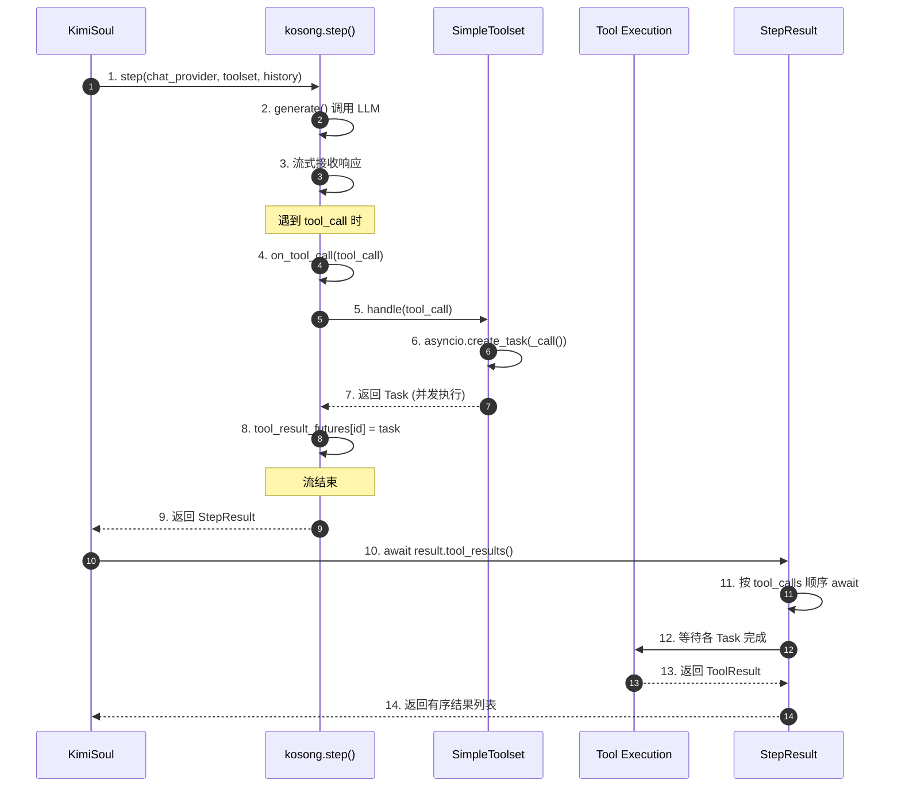
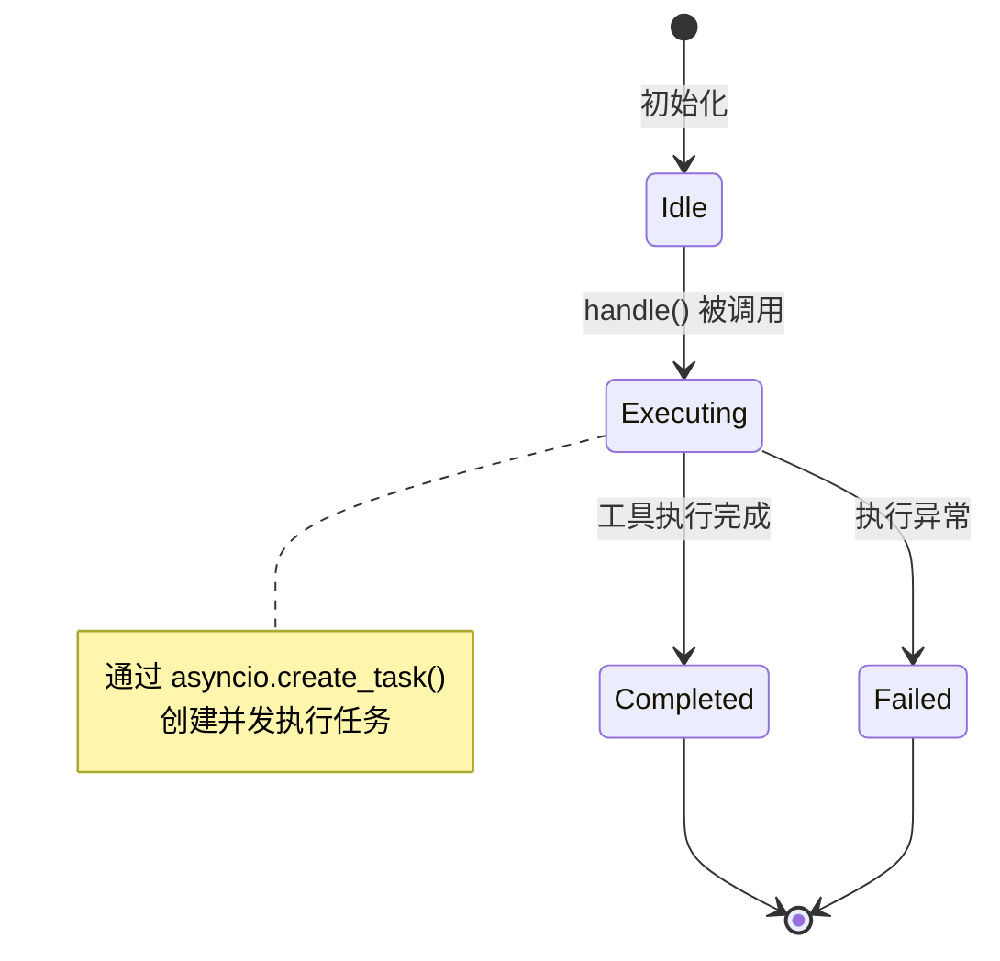
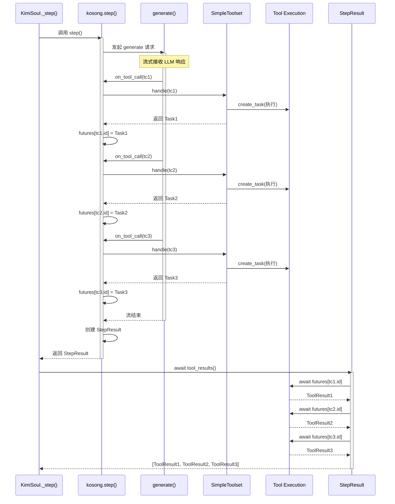
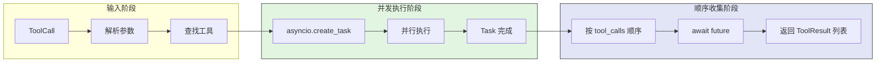
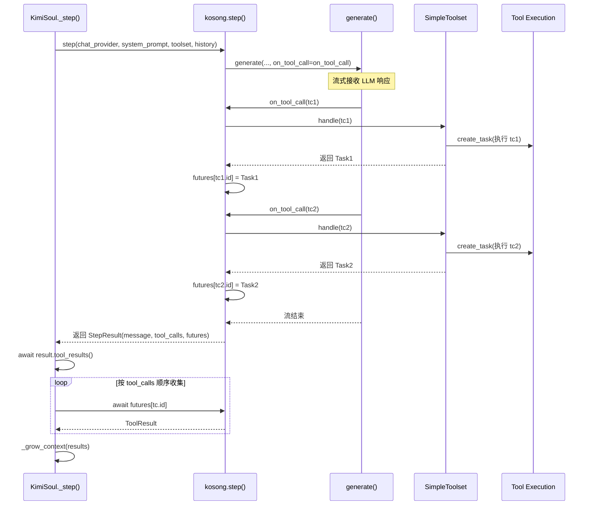
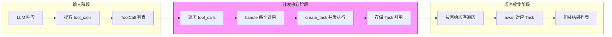
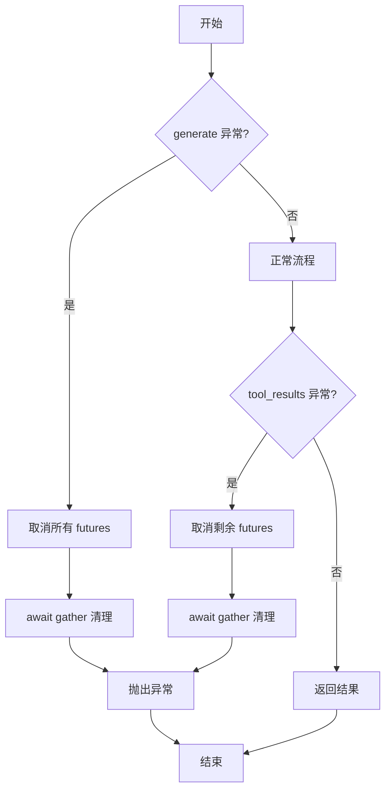
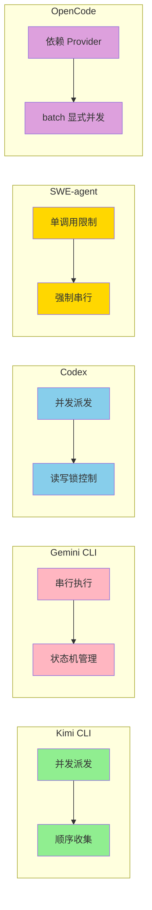

# Kimi CLI Tool Call 并发机制

## TL;DR（结论先行）

**Kimi CLI 采用"并发派发 + 顺序收集"的并发策略**，通过 `asyncio.create_task` 实现多工具并行执行，同时保证结果按请求顺序返回给 LLM。

Kimi CLI 的核心取舍：**执行并发 + 结果顺序化回收**（对比 Gemini CLI 的串行执行、Codex 的读写锁控制并发、SWE-agent 的单调用限制）

---

## 1. 为什么需要这个机制？（解决什么问题）

### 1.1 问题场景

在 AI Coding Agent 中，LLM 一次响应可能请求执行多个工具（如同时读取多个文件、并行执行多个命令）。如何处理这些工具调用直接影响：

```
示例场景：
LLM 请求：1) 读取 package.json  2) 读取 src/index.ts  3) 执行 npm test

串行策略：按顺序执行，总耗时 = t1 + t2 + t3
并行策略：同时发起多个调用，总耗时 ≈ max(t1, t2, t3)
```

没有并发机制：用户请求"分析项目结构"→ LLM 需要依次读取多个文件 → 每个文件等待前一个完成 → 响应缓慢

有并发机制：LLM 可以同时请求读取 package.json、tsconfig.json、README.md → 三个读取操作并行执行 → 大幅缩短等待时间

### 1.2 核心挑战

| 挑战 | 不解决的后果 |
|-----|-------------|
| 并发执行 | 多个 I/O 操作串行执行，响应延迟累积 |
| 结果排序 | 并行结果返回顺序不确定，LLM 无法匹配请求与结果 |
| 错误隔离 | 一个工具失败不应影响其他工具的执行 |
| 资源管理 | 并发任务需要有效的生命周期管理 |

---

## 2. 整体架构（ASCII 图）

### 2.1 在系统中的位置

```text
┌─────────────────────────────────────────────────────────────┐
│ Agent Loop / KimiSoul                                       │
│ kimi-cli/src/kimi_cli/soul/kimisoul.py:382                  │
└───────────────────────┬─────────────────────────────────────┘
                        │ 调用 kosong.step()
                        ▼
┌─────────────────────────────────────────────────────────────┐
│ ▓▓▓ Kosong Step Layer ▓▓▓                                   │
│ kimi-cli/packages/kosong/src/kosong/__init__.py:104         │
│ - step()              : 核心 step 函数                      │
│ - on_tool_call()      : 工具调用回调                        │
│ - StepResult          : 封装工具调用结果                    │
└───────────────────────┬─────────────────────────────────────┘
                        │ 派发工具调用
        ┌───────────────┼───────────────┐
        ▼               ▼               ▼
┌──────────────┐ ┌──────────────┐ ┌──────────────┐
│ LLM Provider │ │ Toolset      │ │ Context      │
│ 生成响应     │ │ 并发执行工具  │ │ 状态管理     │
└──────────────┘ └──────────────┘ └──────────────┘
```

### 2.2 核心组件职责

| 组件 | 职责 | 代码位置 |
|-----|------|---------|
| `kosong.step()` | 核心 step 函数，协调 LLM 调用与工具执行 | `kimi-cli/packages/kosong/src/kosong/__init__.py:104` |
| `SimpleToolset.handle()` | 将工具调用包装为 `asyncio.Task` 并发执行 | `kimi-cli/packages/kosong/src/kosong/tooling/simple.py:112` |
| `StepResult` | 封装工具调用结果，提供 `tool_results()` 顺序收集 | `kimi-cli/packages/kosong/src/kosong/__init__.py:183` |
| `KimiSoul._step()` | Agent 层 step 实现，调用 kosong 并处理结果 | `kimi-cli/src/kimi_cli/soul/kimisoul.py:382` |

### 2.3 核心组件交互关系



**关键交互说明**：

| 步骤 | 交互内容 | 设计意图 |
|-----|---------|---------|
| 1-3 | KimiSoul 调用 kosong.step 生成 LLM 响应 | 解耦 Agent 层与工具执行层 |
| 4-5 | 流式回调处理 tool_call | 实时响应，无需等待完整响应 |
| 6-7 | `asyncio.create_task` 创建并发任务 | 立即返回不阻塞，实现并发执行 |
| 8 | futures 字典存储任务引用 | 保持对并发任务的追踪 |
| 10-14 | 按原始顺序 await 收集结果 | 保证结果顺序与请求顺序一致 |

---

## 3. 核心组件详细分析

### 3.1 SimpleToolset 内部结构

#### 职责定位

SimpleToolset 是 Kimi CLI 的工具执行层，负责将同步或异步的工具调用包装为 `asyncio.Task`，实现并发执行能力。

#### 状态机图



**状态说明**：

| 状态 | 说明 | 进入条件 | 退出条件 |
|-----|------|---------|---------|
| Idle | 工具集就绪 | 初始化完成 | 收到 handle 调用 |
| Executing | 工具执行中 | handle() 返回 Task | Task 完成或异常 |
| Completed | 执行成功 | Task 正常返回 | 自动结束 |
| Failed | 执行失败 | Task 抛出异常 | 自动结束 |

#### 内部数据流

```text
┌─────────────────────────────────────────────────────────────┐
│  输入层                                                      │
│  ├── ToolCall (id, name, arguments)                         │
│  └── 参数解析: json.loads(arguments)                        │
└──────────────────────────┬──────────────────────────────────┘
                           ▼
┌─────────────────────────────────────────────────────────────┐
│  处理层                                                      │
│  ├── 工具查找: _tool_dict[name]                             │
│  ├── 参数验证: 检查工具签名                                  │
│  ├── 并发包装: asyncio.create_task(_call())                 │
│  │   └── _call() 执行实际工具调用                           │
│  └── 异常捕获: ToolRuntimeError 包装                         │
└──────────────────────────┬──────────────────────────────────┘
                           ▼
┌─────────────────────────────────────────────────────────────┐
│  输出层                                                      │
│  ├── 返回 asyncio.Task (并发执行)                           │
│  └── Task 完成时返回 ToolResult                             │
└─────────────────────────────────────────────────────────────┘
```

#### 关键算法逻辑

```mermaid
flowchart TD
    A[handle(tool_call)] --> B{工具存在?}
    B -->|不存在| C[返回 ToolNotFoundError]
    B -->|存在| D[解析 arguments]
    D --> E{解析成功?}
    E -->|失败| F[返回 ToolParseError]
    E -->|成功| G[定义 async _call()]
    G --> H[调用 tool.call(arguments)]
    H --> I{执行结果?}
    I -->|正常| J[返回 ToolResult]
    I -->|异常| K[返回 ToolRuntimeError]
    J --> L[asyncio.create_task(_call)]
    K --> L
    C --> M[立即返回结果]
    F --> M
    L --> N[返回 Task]

    style L fill:#90EE90
    style M fill:#FFB6C1
```

**算法要点**：

1. **分支选择逻辑**：根据工具是否存在、参数是否可解析分流处理
2. **并发路径**：正常工具调用包装为 Task，实现并发执行
3. **错误路径**：工具不存在、参数解析错误立即返回，不创建 Task

#### 关键接口

| 接口 | 输入 | 输出 | 说明 | 代码位置 |
|-----|------|------|------|---------|
| `handle()` | `ToolCall` | `HandleResult` (Task 或 ToolResult) | 核心处理方法 | `simple.py:112` |
| `_call()` | - | `ToolResult` | 内部异步执行包装 | `simple.py:126` |
| `__iadd__()` | `CallableTool` | `Self` | 添加工具到工具集 | `simple.py:48` |

---

### 3.2 kosong.step() 内部结构

#### 职责定位

kosong.step() 是 LLM 调用与工具执行的协调层，负责流式接收 LLM 响应、并发派发工具调用、并最终聚合结果。

#### 内部数据流

```text
┌─────────────────────────────────────────────────────────────┐
│  输入层                                                      │
│  ├── chat_provider: LLM 服务提供者                          │
│  ├── system_prompt: 系统提示词                              │
│  ├── toolset: 工具集                                        │
│  └── history: 对话历史                                      │
└──────────────────────────┬──────────────────────────────────┘
                           ▼
┌─────────────────────────────────────────────────────────────┐
│  流式处理层                                                  │
│  ├── generate() 发起流式请求                                │
│  ├── on_message_part: 处理内容片段                          │
│  └── on_tool_call: 处理工具调用                             │
│      ├── tool_calls.append(tool_call)                       │
│      ├── toolset.handle(tool_call) -> Task/Result           │
│      └── tool_result_futures[id] = future                   │
└──────────────────────────┬──────────────────────────────────┘
                           ▼
┌─────────────────────────────────────────────────────────────┐
│  输出层                                                      │
│  ├── StepResult 封装                                        │
│  │   ├── message: LLM 生成的消息                            │
│  │   ├── tool_calls: 工具调用列表                           │
│  │   └── _tool_result_futures: 任务 future 字典             │
│  └── tool_results() 顺序收集方法                            │
└─────────────────────────────────────────────────────────────┘
```

#### 关键算法逻辑

```mermaid
flowchart TD
    A[step()] --> B[初始化 tool_calls, futures]
    B --> C[定义 on_tool_call 回调]
    C --> D[调用 generate()]
    D --> E{流式事件}
    E -->|tool_call| F[handle(tool_call)]
    F --> G{返回类型}
    G -->|ToolResult| H[包装为 completed future]
    G -->|Task| I[直接使用]
    H --> J[存储到 futures[id]]
    I --> J
    E -->|其他事件| K[继续处理]
    K --> E
    E -->|流结束| L[返回 StepResult]

    style F fill:#90EE90
    style J fill:#87CEEB
```

---

### 3.3 组件间协作时序

展示多个组件如何协作完成一个完整的 tool call 并发执行流程。



**协作要点**：

1. **KimiSoul 与 kosong.step**：调用关系，传递 chat_provider、toolset、history
2. **kosong.step 与 SimpleToolset**：工具调用派发，返回 Task 或立即结果
3. **StepResult 与 Tool Execution**：按序 await 收集并发执行结果

---

### 3.4 关键数据路径

#### 主路径（正常流程）



#### 异常路径（错误恢复）

```mermaid
flowchart TD
    E[发生错误] --> E1{错误类型}
    E1 -->|工具不存在| R1[返回 ToolNotFoundError]
    E1 -->|参数解析失败| R2[返回 ToolParseError]
    E1 -->|执行异常| R3[返回 ToolRuntimeError]
    E1 -->|取消| R4[取消所有 futures]

    R1 --> End[结束]
    R2 --> End
    R3 --> End
    R4 --> R4A[future.cancel()]
    R4A --> R4B[await gather 清理]
    R4B --> End

    style R1 fill:#FFD700
    style R2 fill:#FFD700
    style R3 fill:#FFD700
    style R4 fill:#FF6B6B
```

---

## 4. 端到端数据流转

### 4.1 正常流程（详细版）



**数据变换详情**：

| 阶段 | 输入 | 处理 | 输出 | 代码位置 |
|-----|------|------|------|---------|
| 接收 | `ToolCall` (id, name, args) | 参数解析、工具查找 | `ToolCall` + 解析后的参数 | `simple.py:112-124` |
| 派发 | 解析后的调用 | `asyncio.create_task(_call())` | `asyncio.Task` | `simple.py:133` |
| 收集 | `dict[id, Task]` | 按 `tool_calls` 顺序 `await` | `list[ToolResult]` | `__init__.py:200-216` |
| 注入 | `list[ToolResult]` | 转换为 message 追加到 context | 更新后的 context | `kimisoul.py:457-477` |

### 4.2 数据流向图



### 4.3 异常/边界流程



---

## 5. 关键代码实现

### 5.1 核心数据结构

```python
# kimi-cli/packages/kosong/src/kosong/message.py:45-55
class ToolCall(BaseModel):
    id: str
    type: Literal["function"] = "function"
    function: FunctionCall

class FunctionCall(BaseModel):
    name: str
    arguments: str | None = None
```

```python
# kimi-cli/packages/kosong/src/kosong/__init__.py:183-198
@dataclass(frozen=True, slots=True)
class StepResult:
    id: str | None
    message: Message
    usage: TokenUsage | None
    tool_calls: list[ToolCall]
    _tool_result_futures: dict[str, ToolResultFuture]

    async def tool_results(self) -> list[ToolResult]:
        """All the tool results returned by corresponding tool calls."""
        if not self._tool_result_futures:
            return []
        try:
            results: list[ToolResult] = []
            for tool_call in self.tool_calls:
                future = self._tool_result_futures[tool_call.id]
                result = await future
                results.append(result)
            return results
        finally:
            # one exception should cancel all the futures to avoid hanging tasks
            for future in self._tool_result_futures.values():
                future.cancel()
            await asyncio.gather(*self._tool_result_futures.values(), return_exceptions=True)
```

**字段说明**：

| 字段 | 类型 | 用途 |
|-----|------|------|
| `tool_calls` | `list[ToolCall]` | 记录本次 step 的所有工具调用，保持请求顺序 |
| `_tool_result_futures` | `dict[str, ToolResultFuture]` | 存储每个 tool_call 对应的 future，用于后续收集 |
| `tool_results()` | `async method` | 按 `tool_calls` 顺序 await 收集结果 |

### 5.2 主链路代码

```python
# kimi-cli/packages/kosong/src/kosong/tooling/simple.py:112-133
async def handle(self, tool_call: ToolCall) -> HandleResult:
    if tool_call.function.name not in self._tool_dict:
        return ToolResult(
            tool_call_id=tool_call.id,
            return_value=ToolNotFoundError(tool_call.function.name),
        )

    tool = self._tool_dict[tool_call.function.name]

    try:
        arguments: JsonType = json.loads(tool_call.function.arguments or "{}")
    except json.JSONDecodeError as e:
        return ToolResult(tool_call_id=tool_call.id, return_value=ToolParseError(str(e)))

    async def _call():
        try:
            ret = await tool.call(arguments)
            return ToolResult(tool_call_id=tool_call.id, return_value=ret)
        except Exception as e:
            return ToolResult(tool_call_id=tool_call.id, return_value=ToolRuntimeError(str(e)))

    return asyncio.create_task(_call())
```

```python
# kimi-cli/packages/kosong/src/kosong/__init__.py:144-155
async def on_tool_call(tool_call: ToolCall):
    tool_calls.append(tool_call)
    result = toolset.handle(tool_call)

    if isinstance(result, ToolResult):
        future = ToolResultFuture()
        future.add_done_callback(future_done_callback)
        future.set_result(result)
        tool_result_futures[tool_call.id] = future
    else:
        result.add_done_callback(future_done_callback)
        tool_result_futures[tool_call.id] = result
```

```python
# kimi-cli/src/kimi_cli/soul/kimisoul.py:406-420
result = await _kosong_step_with_retry()
logger.debug("Got step result: {result}", result=result)

# wait for all tool results (may be interrupted)
results = await result.tool_results()
logger.debug("Got tool results: {results}")

# shield the context manipulation from interruption
await asyncio.shield(self._grow_context(result, results))
```

**代码要点**：

1. **并发派发**：`asyncio.create_task(_call())` 立即返回不阻塞，实现并发执行
2. **统一接口**：无论同步还是异步工具，都返回统一的 `HandleResult` 类型（Task 或 ToolResult）
3. **顺序收集**：`tool_results()` 按 `tool_calls` 顺序 await，保证结果顺序与请求顺序一致
4. **异常清理**：`finally` 块中取消所有 futures，避免悬挂任务

### 5.3 关键调用链

```text
KimiSoul._step()                    [kimisoul.py:382]
  -> kosong.step()                  [__init__.py:104]
    -> generate()                   [__init__.py:158]
      -> on_tool_call()             [__init__.py:144]
        -> SimpleToolset.handle()   [simple.py:112]
          - 检查工具存在性
          - 解析参数
          - asyncio.create_task(_call())  [simple.py:133]
    -> StepResult()                 [__init__.py:174]
  -> result.tool_results()          [__init__.py:200]
    - 按 tool_calls 顺序 await
  -> _grow_context()                [kimisoul.py:457]
```

---

## 6. 设计意图与 Trade-off

### 6.1 Kimi CLI 的选择

| 维度 | Kimi CLI 的选择 | 替代方案 | 取舍分析 |
|-----|----------------|---------|---------|
| 并发模型 | `asyncio.create_task` 并发派发 | 线程池、进程池 | 轻量级、适合 I/O 密集型，但受 GIL 限制不适合 CPU 密集型 |
| 结果收集 | 按请求顺序 await 收集 | 按完成顺序收集、批量等待 | 保证结果顺序可预测，但可能等待较慢的工具 |
| 异常处理 | 立即包装为错误结果 | 抛出异常中断整个 step | 单个工具失败不影响其他工具，但需要额外错误检查 |
| 取消机制 | future.cancel() + gather 清理 | 不清理、强制终止 | 避免悬挂任务，但需要额外清理逻辑 |

### 6.2 为什么这样设计？

**核心问题**：为什么 Kimi CLI 选择"并发派发 + 顺序收集"策略？

**Kimi CLI 的解决方案**：

- **代码依据**：`kimi-cli/packages/kosong/src/kosong/__init__.py:200-216`
- **设计意图**：在提高 I/O 并发效率的同时，保证 LLM 能正确匹配请求与结果
- **带来的好处**：
  - 并行 I/O：多个文件读取、网络请求可以同时进行，减少总等待时间
  - 顺序保证：结果按请求顺序返回，LLM 可以正确理解执行结果
  - 错误隔离：单个工具失败不影响其他工具的并发执行
- **付出的代价**：
  - 收集延迟：必须等待所有工具完成才能继续，最慢的工具决定总时间
  - 内存占用：并发执行期间需要保持所有 Task 的引用

### 6.3 与其他项目的对比



| 项目 | 并发策略 | 核心差异 | 适用场景 |
|-----|---------|---------|---------|
| **Kimi CLI** | 并发派发 + 顺序收集 | `asyncio.Task` 并发，按请求顺序收集结果 | Python 异步生态，I/O 密集型任务 |
| **Gemini CLI** | 串行执行 + 状态机 | 单 active call，队列缓冲 | 需要严格顺序保证、资源安全 |
| **Codex** | 并发 + 读写锁控制 | 根据工具是否支持并发决定读锁/写锁 | Rust 异步，需要细粒度并发控制 |
| **SWE-agent** | 单调用限制 | 强制每次响应只能有一个 tool call | 简单可控，适合确定性调试 |
| **OpenCode** | Provider 依赖 + batch 显式并发 | 常规调用依赖 AI SDK，batch 工具显式 Promise.all | TypeScript 生态，灵活可控 |

**对比分析**：

- **Kimi CLI 的并发策略**更适合 Python 异步生态，利用 `asyncio` 实现轻量级并发
- **Gemini CLI 的串行策略**牺牲了性能换取确定性和简单性
- **Codex 的读写锁策略**提供了更细粒度的并发控制，适合需要区分读写操作的场景
- **SWE-agent 的单调用限制**最简单，适合需要严格顺序控制的调试场景
- **OpenCode 的混合策略**依赖底层 SDK，同时提供显式并发工具

---

## 7. 边界情况与错误处理

### 7.1 终止条件

| 终止原因 | 触发条件 | 代码位置 |
|---------|---------|---------|
| 所有工具完成 | `tool_results()` 收集完所有结果 | `__init__.py:207-210` |
| generate 异常 | LLM 调用失败 | `__init__.py:166-172` |
| 工具执行异常 | 单个工具抛出异常 | `simple.py:130-131` |
| 用户取消 | `asyncio.CancelledError` | `__init__.py:166-172` |

### 7.2 超时/资源限制

```python
# kimi-cli/packages/kosong/src/kosong/__init__.py:166-172
except (ChatProviderError, asyncio.CancelledError):
    # cancel all the futures to avoid hanging tasks
    for future in tool_result_futures.values():
        future.remove_done_callback(future_done_callback)
        future.cancel()
    await asyncio.gather(*tool_result_futures.values(), return_exceptions=True)
    raise
```

```python
# kimi-cli/packages/kosong/src/kosong/__init__.py:212-216
finally:
    # one exception should cancel all the futures to avoid hanging tasks
    for future in self._tool_result_futures.values():
        future.cancel()
    await asyncio.gather(*self._tool_result_futures.values(), return_exceptions=True)
```

### 7.3 错误恢复策略

| 错误类型 | 处理策略 | 代码位置 |
|---------|---------|---------|
| 工具不存在 | 返回 `ToolNotFoundError` | `simple.py:113-117` |
| 参数解析失败 | 返回 `ToolParseError` | `simple.py:123-124` |
| 执行异常 | 返回 `ToolRuntimeError` | `simple.py:130-131` |
| 取消 | 取消所有 futures，清理资源 | `__init__.py:168-171` |

---

## 8. 关键代码索引

| 功能 | 文件 | 行号 | 说明 |
|-----|------|------|------|
| 入口 | `kimi-cli/packages/kosong/src/kosong/__init__.py` | 104 | `step()` 函数，协调 LLM 与工具 |
| 工具派发 | `kimi-cli/packages/kosong/src/kosong/tooling/simple.py` | 112 | `handle()` 方法，创建并发 Task |
| 结果收集 | `kimi-cli/packages/kosong/src/kosong/__init__.py` | 200 | `tool_results()` 顺序收集 |
| Agent 层调用 | `kimi-cli/src/kimi_cli/soul/kimisoul.py` | 382 | `_step()` 调用 kosong 并处理结果 |
| 上下文更新 | `kimi-cli/src/kimi_cli/soul/kimisoul.py` | 457 | `_grow_context()` 注入工具结果 |
| 异常清理 | `kimi-cli/packages/kosong/src/kosong/__init__.py` | 166 | generate 异常时取消 futures |
| 取消清理 | `kimi-cli/packages/kosong/src/kosong/__init__.py` | 214 | tool_results 异常时清理 |

---

## 9. 延伸阅读

- 前置知识：`docs/kimi-cli/04-kimi-cli-agent-loop.md` - Agent Loop 整体架构
- 相关机制：`docs/kimi-cli/06-kimi-cli-mcp-integration.md` - MCP 工具集成
- 对比分析：`docs/gemini-cli/questions/gemini-cli-tool-call-concurrency.md` - Gemini CLI 串行策略
- 对比分析：`docs/codex/questions/codex-tool-call-concurrency.md` - Codex 读写锁策略
- 对比分析：`docs/opencode/questions/opencode-tool-call-concurrency.md` - OpenCode 混合策略
- 对比分析：`docs/swe-agent/questions/swe-agent-tool-call-concurrency.md` - SWE-agent 单调用限制

---

*✅ Verified: 基于 kimi-cli/packages/kosong/src/kosong/__init__.py:104、kimi-cli/packages/kosong/src/kosong/tooling/simple.py:112、kimi-cli/src/kimi_cli/soul/kimisoul.py:382 等源码分析*
*⚠️ Inferred: 部分设计意图基于代码结构推断*
*基于版本：2026-02-08 | 最后更新：2026-02-24*
