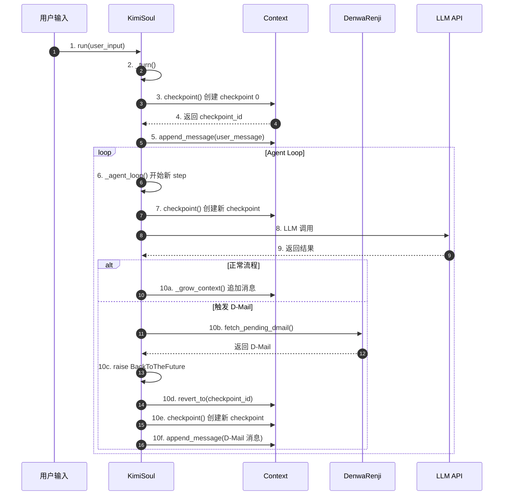
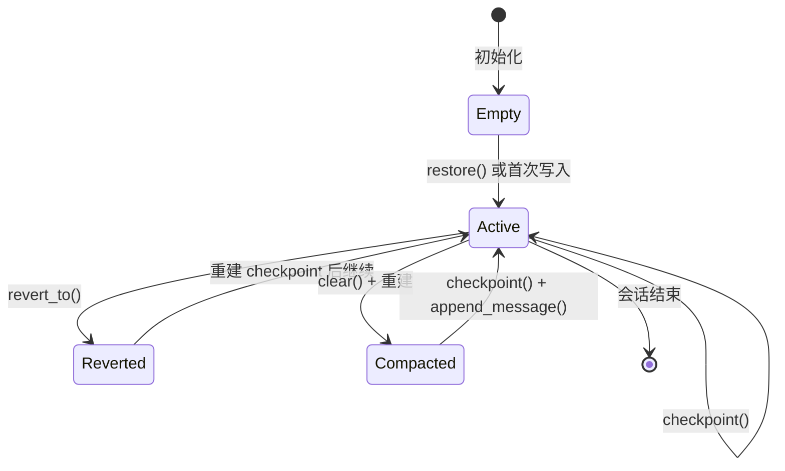
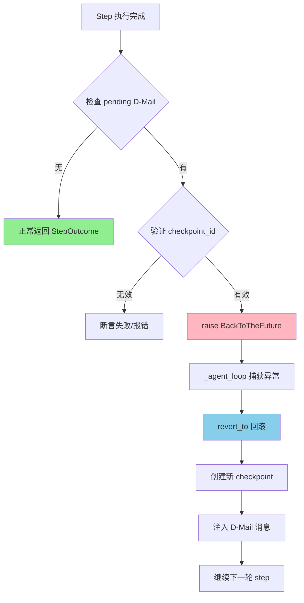
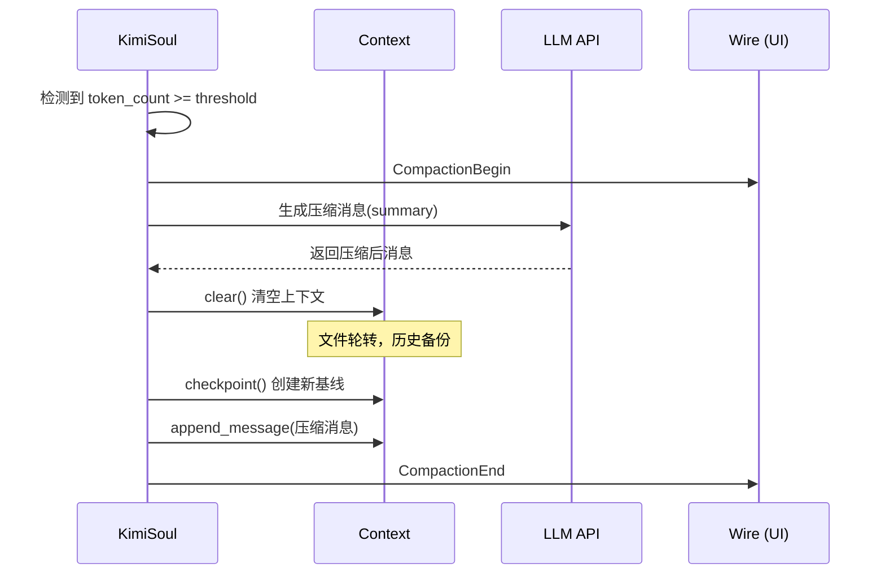
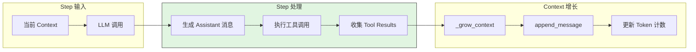
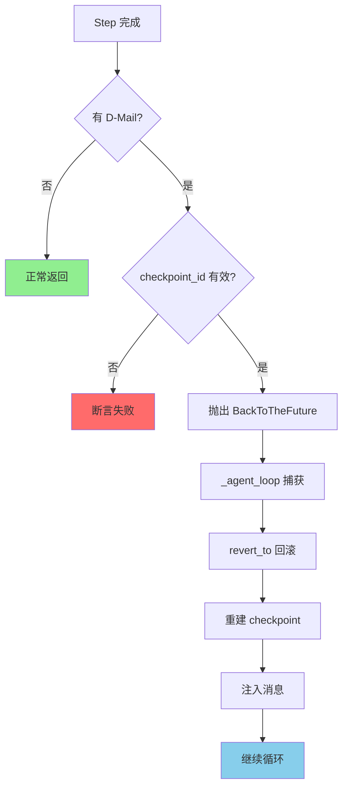
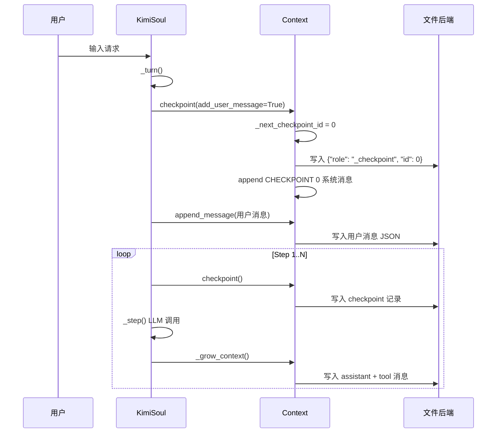
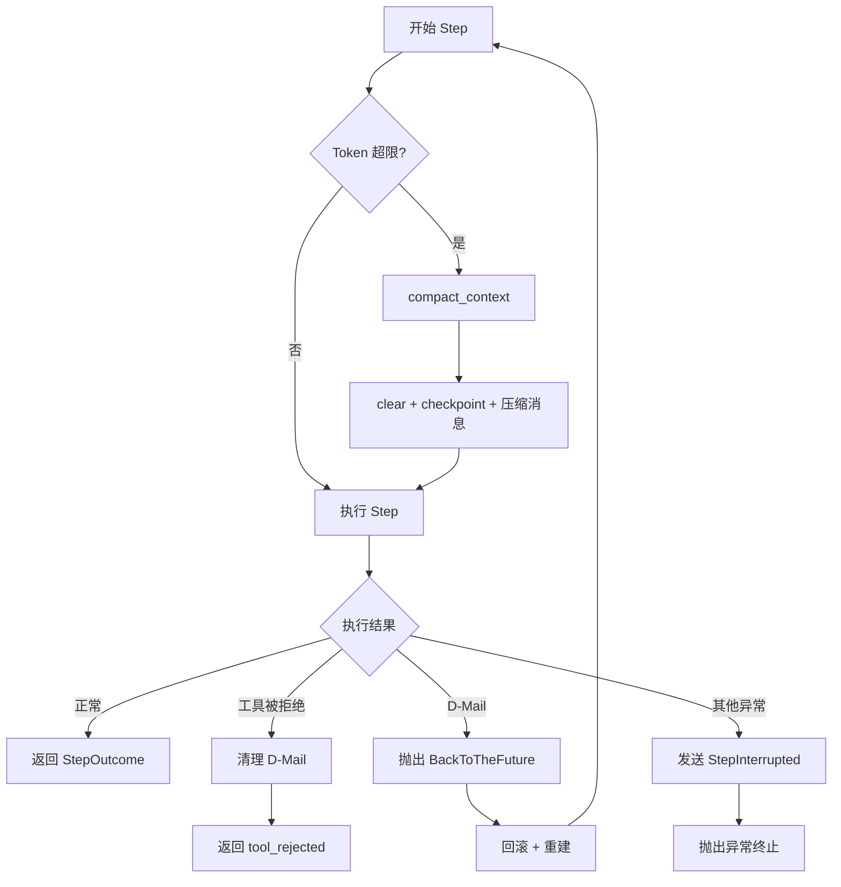
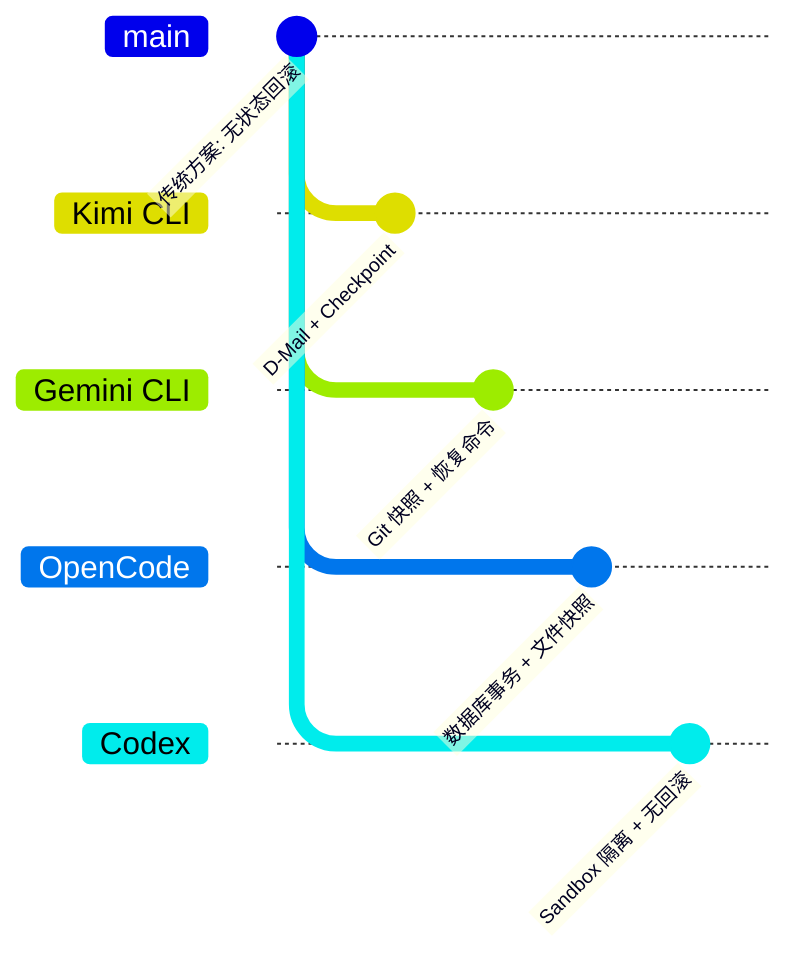

# Kimi CLI：Checkpoint 机制实现

> **阅读指南**
>
> | 属性 | 说明 |
> |-----|------|
> | 预计阅读 | 25-35 分钟 |
> | 前置文档 | `docs/kimi-cli/04-kimi-cli-agent-loop.md`、`docs/kimi-cli/07-kimi-cli-memory-context.md` |
> | 文档结构 | 速览 → 架构 → 机制 → 实现 → 对比 |
> | 代码呈现 | 关键代码直接展示，完整代码可折叠查看 |

---

## TL;DR（结论先行）

**一句话定义**：Checkpoint 是 Kimi CLI 在单个 Turn 内为对话上下文创建的"可回退锚点"，通过文件持久化实现状态快照，支持通过 D-Mail 机制进行时间旅行式回滚。

Kimi CLI 的核心取舍：**内存状态 + 文件持久化的轻量级 Checkpoint**（对比 Gemini CLI 的 Git 快照、OpenCode 的数据库事务回滚），在 Turn 级别提供上下文回滚能力，但不自动回滚文件系统副作用。

### 核心要点速览

| 维度 | 关键决策 | 代码位置 |
|-----|---------|---------|
| 核心机制 | 内存状态 + JSON Lines 文件持久化，支持细粒度回滚 | `kimi-cli/src/kimi_cli/soul/context.py:68` |
| 状态管理 | `_next_checkpoint_id` 单调递增，文件记录 checkpoint 标记 | `kimi-cli/src/kimi_cli/soul/context.py:72-73` |
| 回滚触发 | D-Mail + `BackToTheFuture` 异常机制 | `kimi-cli/src/kimi_cli/soul/kimisoul.py:531` |
| 文件操作 | 文件轮转（rotate）备份，截断重建 | `kimi-cli/src/kimi_cli/soul/context.py:101-132` |
| 触发时机 | 每个 step 前创建，支持细粒度回滚 | `kimi-cli/src/kimi_cli/soul/kimisoul.py:347` |

---

## 1. 为什么需要这个机制？

### 1.1 问题场景

想象一个没有 Checkpoint 的 Agent Loop：

```
用户: "修复这个 bug"
  -> LLM: "先读文件" -> 读文件 -> 结果写入上下文
  -> LLM: "再跑测试" -> 执行测试 -> 结果写入上下文
  -> LLM: "修改第 42 行" -> 写文件 -> 结果写入上下文
  -> (测试失败，想回退到"读文件"之前重新开始)
  -> 无法回退，只能重新开始整个 Turn
```

**有 Checkpoint**：
```
  -> 在"读文件"前创建 checkpoint 0
  -> 在"跑测试"前创建 checkpoint 1
  -> 在"修改文件"前创建 checkpoint 2
  -> 测试失败，回滚到 checkpoint 1
  -> 从 checkpoint 1 继续，保留之前读取的文件内容
```

### 1.2 核心挑战

| 挑战 | 不解决的后果 |
|-----|-------------|
| 上下文无限增长 | Token 超限导致 LLM 调用失败 |
| 策略错误无法回退 | Agent 走入死胡同，浪费计算资源 |
| 外部信号介入 | 用户或工具需要改变 Agent 执行方向 |
| 状态恢复一致性 | 中断后无法准确恢复到之前状态 |

---

## 2. 整体架构

### 2.1 在系统中的位置

```text
┌─────────────────────────────────────────────────────────────┐
│ CLI 入口 / Session Runtime                                   │
│ kimi-cli/src/kimi_cli/cli/__init__.py                        │
└───────────────────────┬─────────────────────────────────────┘
                        │ 调用 run(user_input)
                        ▼
┌─────────────────────────────────────────────────────────────┐
│ ▓▓▓ Agent Loop (KimiSoul) ▓▓▓                               │
│ kimi-cli/src/kimi_cli/soul/kimisoul.py                       │
│ - run()       : 单次 Turn 入口                              │
│ - _turn()     : Checkpoint 创建 + 用户消息处理              │
│ - _agent_loop(): 核心循环（step 计数、BackToTheFuture）     │
│ - _step()     : 单次 LLM 调用 + 工具执行                    │
└───────────────────────┬─────────────────────────────────────┘
                        │ 依赖
        ┌───────────────┼───────────────┐
        ▼               ▼               ▼
┌──────────────┐ ┌──────────────┐ ┌──────────────┐
│ Context      │ │ DenwaRenji   │ │ Compaction   │
│ 状态管理     │ │ D-Mail 管理  │ │ 上下文压缩   │
│ context.py   │ │ denwarenji.py│ │ compaction.py│
└──────────────┘ └──────────────┘ └──────────────┘
```

### 2.2 核心组件职责

| 组件 | 职责 | 代码位置 |
|-----|------|---------|
| `Context` | 管理消息历史、Token 计数、Checkpoint 创建与回滚 | `kimi-cli/src/kimi_cli/soul/context.py:16` |
| `KimiSoul._checkpoint()` | 封装 Checkpoint 创建逻辑，控制是否添加用户消息 | `kimi-cli/src/kimi_cli/soul/kimisoul.py:175` |
| `BackToTheFuture` | 异常类，携带回滚目标 checkpoint_id 和注入消息 | `kimi-cli/src/kimi_cli/soul/kimisoul.py:531` |
| `DenwaRenji` | 管理 D-Mail（跨时间消息），支持向过去发送指令 | `kimi-cli/src/kimi_cli/soul/denwarenji.py:16` |
| `SendDMail` | 工具实现，允许 Agent 发送 D-Mail 到指定 Checkpoint | `kimi-cli/src/kimi_cli/tools/dmail/__init__.py:12` |

### 2.3 核心组件交互关系



**关键交互说明**：

| 步骤 | 交互内容 | 设计意图 |
|-----|---------|---------|
| 3 | 在 _turn() 开始时创建 checkpoint | 确保每个 turn 有基线回退点 |
| 7 | 每个 step 前创建 checkpoint | 支持细粒度回滚 |
| 10b-10f | D-Mail 触发回滚流程 | 允许 Agent 或工具主动改变执行方向 |

---

## 3. 核心组件详细分析

### 3.1 Context 内部结构

#### 职责定位

Context 是 Checkpoint 机制的数据底座，负责消息历史的内存管理和文件持久化。

#### 状态机图



**状态说明**：

| 状态 | 说明 | 进入条件 | 退出条件 |
|-----|------|---------|---------|
| Empty | 空状态，无历史记录 | Context 初始化 | 首次写入消息 |
| Active | 正常运行状态 | 有消息历史 | 回滚或压缩 |
| Reverted | 回滚后状态 | revert_to() 调用 | 重建 checkpoint |
| Compacted | 压缩后状态 | compact_context() | 重新填充消息 |

#### 内部数据流

```text
┌─────────────────────────────────────────────────────────────┐
│  输入层                                                      │
│  ├── 用户消息 ──► append_message() ──► _history[]            │
│  ├── Token 计数 ──► update_token_count() ──► _token_count    │
│  └── Checkpoint ──► checkpoint() ──► _next_checkpoint_id++   │
└──────────────────────────┬──────────────────────────────────┘
                           ▼
┌─────────────────────────────────────────────────────────────┐
│  持久化层（文件后端）                                         │
│  ├── 消息: JSON Lines 格式，每行一条消息                      │
│  ├── _usage: {"role": "_usage", "token_count": N}            │
│  └── _checkpoint: {"role": "_checkpoint", "id": N}           │
└──────────────────────────┬──────────────────────────────────┘
                           ▼
┌─────────────────────────────────────────────────────────────┐
│  回滚操作                                                    │
│  ├── 文件轮转: 当前文件 → .backup.N                          │
│  ├── 重新读取: 从轮转文件恢复到指定 checkpoint                │
│  └── 状态重建: _history, _token_count, _next_checkpoint_id   │
└─────────────────────────────────────────────────────────────┘
```

#### 关键接口

| 接口 | 输入 | 输出 | 说明 | 代码位置 |
|-----|------|------|------|---------|
| `checkpoint()` | `add_user_message: bool` | `None` | 创建新 checkpoint，可选添加系统消息 | `context.py:68` |
| `revert_to()` | `checkpoint_id: int` | `None` | 回滚到指定 checkpoint | `context.py:80` |
| `clear()` | - | `None` | 清空上下文（用于 compaction） | `context.py:134` |
| `append_message()` | `Message \| Sequence[Message]` | `None` | 追加消息到历史 | `context.py:162` |

---

### 3.2 BackToTheFuture 异常机制

#### 职责定位

BackToTheFuture 是 D-Mail 驱动的回滚触发器，通过异常机制跳出正常执行流，在 _agent_loop 中捕获并处理。

#### 关键算法逻辑



**算法要点**：

1. **延迟回滚**：在 `_step()` 中检测 D-Mail 但不立即回滚，通过异常将控制权交还 `_agent_loop`
2. **状态验证**：DenwaRenji 保证 `0 <= checkpoint_id < n_checkpoints`
3. **消息注入**：回滚后注入系统消息，告知 Agent "收到来自未来的 D-Mail"

---

### 3.3 组件间协作时序

#### Compaction 场景



#### D-Mail 回滚场景

```mermaid
sequenceDiagram
    participant Tool as SendDMail Tool
    participant D as DenwaRenji
    participant K as KimiSoul._step
    participant Loop as KimiSoul._agent_loop
    participant C as Context

    Tool->>D: send_dmail(DMail)
    Note over D: 存储 pending_dmail
    K->>D: fetch_pending_dmail()
    D-->>K: 返回 D-Mail
    K->>K: raise BackToTheFuture
    activate Loop
    Loop->>Loop: 捕获 BackToTheFuture
    Loop->>C: revert_to(checkpoint_id)
    Note over C: 截断历史到 checkpoint
    Loop->>C: checkpoint() 创建新锚点
    Loop->>C: append_message(D-Mail 消息)
    deactivate Loop
```

---

### 3.4 关键数据路径

#### 主路径（正常 Step）



#### 异常路径（BackToTheFuture）



---

## 4. 端到端数据流转

### 4.1 正常流程（详细版）



**数据变换详情**：

| 阶段 | 输入 | 处理 | 输出 | 代码位置 |
|-----|------|------|------|---------|
| 创建 Checkpoint | 当前状态 | 递增 ID，写入标记 | checkpoint_id | `context.py:68-78` |
| 追加消息 | Message 对象 | 序列化为 JSON | JSON Lines | `context.py:162-169` |
| 回滚 | checkpoint_id | 文件轮转 + 重新读取 | 截断后的状态 | `context.py:80-132` |

### 4.2 文件持久化格式

```text
# Context 文件示例（JSON Lines 格式）

{"role": "_checkpoint", "id": 0}
{"role": "user", "content": [{"type": "text", "text": "CHECKPOINT 0"}]}
{"role": "user", "content": [{"type": "text", "text": "修复这个 bug"}]}
{"role": "_checkpoint", "id": 1}
{"role": "assistant", "content": [...], "tool_calls": [...]}
{"role": "tool", "content": [...]}
{"role": "_usage", "token_count": 1500}
```

### 4.3 异常/边界流程



---

## 5. 关键代码实现

### 5.1 核心数据结构

```python
# kimi-cli/src/kimi_cli/soul/context.py:16-23
class Context:
    def __init__(self, file_backend: Path):
        self._file_backend = file_backend
        self._history: list[Message] = []
        self._token_count: int = 0
        self._next_checkpoint_id: int = 0
```

```python
# kimi-cli/src/kimi_cli/soul/kimisoul.py:531-540
class BackToTheFuture(Exception):
    """
    Raise when we need to revert the context to a previous checkpoint.
    The main agent loop should catch this exception and handle it.
    """
    def __init__(self, checkpoint_id: int, messages: Sequence[Message]):
        self.checkpoint_id = checkpoint_id
        self.messages = messages
```

```python
# kimi-cli/src/kimi_cli/soul/denwarenji.py:6-10
class DMail(BaseModel):
    message: str = Field(description="The message to send.")
    checkpoint_id: int = Field(description="The checkpoint to send the message back to.", ge=0)
```

**字段说明**：

| 字段 | 类型 | 用途 |
|-----|------|------|
| `_history` | `list[Message]` | 内存中的消息历史 |
| `_token_count` | `int` | 当前 token 使用量 |
| `_next_checkpoint_id` | `int` | 下一个 checkpoint ID，单调递增 |
| `checkpoint_id` | `int` | BackToTheFuture/DMail 的目标回滚点 |
| `messages` | `Sequence[Message]` | 回滚后注入的消息 |

### 5.2 主链路代码

#### Checkpoint 创建

```python
# kimi-cli/src/kimi_cli/soul/context.py:68-78
async def checkpoint(self, add_user_message: bool):
    checkpoint_id = self._next_checkpoint_id
    self._next_checkpoint_id += 1
    logger.debug("Checkpointing, ID: {id}", id=checkpoint_id)

    async with aiofiles.open(self._file_backend, "a", encoding="utf-8") as f:
        await f.write(json.dumps({"role": "_checkpoint", "id": checkpoint_id}) + "\n")
    if add_user_message:
        await self.append_message(
            Message(role="user", content=[system(f"CHECKPOINT {checkpoint_id}")])
        )
```

#### 回滚实现

```python
# kimi-cli/src/kimi_cli/soul/context.py:80-132
async def revert_to(self, checkpoint_id: int):
    logger.debug("Reverting checkpoint, ID: {id}", id=checkpoint_id)
    if checkpoint_id >= self._next_checkpoint_id:
        raise ValueError(f"Checkpoint {checkpoint_id} does not exist")

    # rotate the context file
    rotated_file_path = await next_available_rotation(self._file_backend)
    await aiofiles.os.replace(self._file_backend, rotated_file_path)

    # restore the context until the specified checkpoint
    self._history.clear()
    self._token_count = 0
    self._next_checkpoint_id = 0

    async with (
        aiofiles.open(rotated_file_path, encoding="utf-8") as old_file,
        aiofiles.open(self._file_backend, "w", encoding="utf-8") as new_file,
    ):
        async for line in old_file:
            if not line.strip():
                continue
            line_json = json.loads(line)
            if line_json["role"] == "_checkpoint" and line_json["id"] == checkpoint_id:
                break
            await new_file.write(line)
            # 重建内存状态...
```

#### Agent Loop 中的回滚处理

```python
# kimi-cli/src/kimi_cli/soul/kimisoul.py:377-380
if back_to_the_future is not None:
    await self._context.revert_to(back_to_the_future.checkpoint_id)
    await self._checkpoint()
    await self._context.append_message(back_to_the_future.messages)
```

**代码要点**：

1. **文件轮转机制**：回滚时先将当前文件重命名为备份，再重建新文件，确保数据安全
2. **截断逻辑**：读取旧文件时遇到目标 checkpoint 即停止，实现"时间旅行"
3. **状态重建**：从文件重新加载时同步重建内存状态（history、token_count、checkpoint_id）

### 5.3 关键调用链

```text
KimiSoul.run()                    [kimisoul.py:182]
  -> _turn()                      [kimisoul.py:210]
    -> _checkpoint()              [kimisoul.py:217]
      -> Context.checkpoint()     [context.py:68]
    -> _agent_loop()              [kimisoul.py:302]
      -> checkpoint()             [kimisoul.py:347]
      -> _step()                  [kimisoul.py:382]
        -> fetch_pending_dmail()  [denwarenji.py:35]
        -> raise BackToTheFuture  [kimisoul.py:434]
      -> revert_to()              [context.py:80]
```

---

## 6. 设计意图与 Trade-off

### 6.1 Kimi CLI 的选择

| 维度 | Kimi CLI 的选择 | 替代方案 | 取舍分析 |
|-----|----------------|---------|---------|
| 存储介质 | 本地 JSON Lines 文件 | 数据库（SQLite）、Git 快照 | 简单轻量，无外部依赖，但查询能力弱 |
| 回滚粒度 | Turn 级别（单轮回话） | 整个 Session | 细粒度控制，但跨 Turn 状态需重新建立 |
| 副作用回滚 | 不支持（仅上下文） | Git 快照回滚文件 | 轻量快速，但文件修改需单独处理 |
| 触发方式 | D-Mail + BackToTheFuture 异常 | 回调函数、状态机 | 解耦工具与 Loop，但异常控制流较复杂 |
| 持久化策略 | 实时追加写入 | 批量写入、内存缓存 | 崩溃安全，但 IO 开销略高 |

### 6.2 为什么这样设计？

**核心问题**：如何在保持 Agent Loop 简单的同时，支持策略回滚和外部信号介入？

**Kimi CLI 的解决方案**：

- **代码依据**：`kimi-cli/src/kimi_cli/soul/kimisoul.py:377-380`
- **设计意图**：通过异常机制（BackToTheFuture）将回滚决策与执行分离，工具只需"发送 D-Mail"，Loop 负责"时间旅行"
- **带来的好处**：
  - 工具代码无需了解 Checkpoint 内部实现
  - 回滚时机由 Loop 统一控制，避免状态混乱
  - D-Mail 语义清晰："向过去的自己发送消息"
- **付出的代价**：
  - 异常控制流增加理解成本
  - 需要维护 DenwaRenji 状态机

### 6.3 与其他项目的对比



| 项目 | Checkpoint 机制 | 回滚能力 | 适用场景 |
|-----|----------------|---------|---------|
| **Kimi CLI** | 内存状态 + JSON Lines 文件持久化，D-Mail 触发 | Turn 内上下文回滚 | 快速迭代、策略实验 |
| **Gemini CLI** | Git 快照（checkpointUtils.ts），保存 tool call 数据 | 文件 + 上下文恢复到某次工具调用 | 代码修改安全、可恢复 |
| **OpenCode** | 数据库存储 + Git 快照（snapshot/index.ts），支持 revert/unrevert | 完整文件系统 + 消息历史回滚 | 企业级安全、审计需求 |
| **Codex** | 无 Checkpoint 机制 | 不支持回滚 | 简单场景、Sandbox 隔离保证安全 |

**关键差异分析**：

1. **Kimi CLI vs Gemini CLI**：
   - Kimi 专注于上下文回滚，文件副作用不处理
   - Gemini 通过 Git 快照实现文件级恢复，但粒度是工具调用级别

2. **Kimi CLI vs OpenCode**：
   - Kimi 使用简单文件，OpenCode 使用数据库存储消息
   - OpenCode 支持 unrevert（撤销回滚），Kimi 是单向时间旅行

3. **Kimi CLI vs Codex**：
   - Codex 完全依赖 Sandbox 隔离，不保存中间状态
   - Kimi 提供显式状态管理，适合长对话场景

---

## 7. 边界情况与错误处理

### 7.1 终止条件

| 终止原因 | 触发条件 | 代码位置 |
|---------|---------|---------|
| MaxStepsReached | step_no > max_steps_per_turn | `kimisoul.py:332-333` |
| 无 Tool Calls | result.tool_calls 为空 | `kimisoul.py:453-455` |
| 工具被拒绝 | 任意 tool result 为 ToolRejectedError | `kimisoul.py:422-425` |
| 其他异常 | LLM 调用失败、网络错误等 | `kimisoul.py:352-356` |

### 7.2 超时/资源限制

```python
# kimi-cli/src/kimi_cli/soul/kimisoul.py:341-344
reserved = self._loop_control.reserved_context_size
if self._context.token_count + reserved >= self._runtime.llm.max_context_size:
    logger.info("Context too long, compacting...")
    await self.compact_context()
```

### 7.3 错误恢复策略

| 错误类型 | 处理策略 | 代码位置 |
|---------|---------|---------|
| 无效 checkpoint_id | 抛出 ValueError | `context.py:95-97` |
| D-Mail checkpoint 越界 | 断言失败（DenwaRenji 保证） | `kimisoul.py:429-432` |
| 文件轮转失败 | 抛出 RuntimeError | `context.py:101-103` |
| 网络错误（LLM） | 指数退避重试 | `kimisoul.py:388-394` |

---

## 8. 关键代码索引

| 功能 | 文件 | 行号 | 说明 |
|-----|------|------|------|
| Context 类定义 | `kimi-cli/src/kimi_cli/soul/context.py` | 16-177 | 核心状态管理 |
| Checkpoint 创建 | `kimi-cli/src/kimi_cli/soul/context.py` | 68-78 | checkpoint() 方法 |
| 回滚实现 | `kimi-cli/src/kimi_cli/soul/context.py` | 80-132 | revert_to() 方法 |
| BackToTheFuture 异常 | `kimi-cli/src/kimi_cli/soul/kimisoul.py` | 531-540 | 回滚触发器 |
| Agent Loop | `kimi-cli/src/kimi_cli/soul/kimisoul.py` | 302-381 | _agent_loop() 方法 |
| Step 执行 | `kimi-cli/src/kimi_cli/soul/kimisoul.py` | 382-455 | _step() 方法 |
| D-Mail 检测 | `kimi-cli/src/kimi_cli/soul/kimisoul.py` | 428-451 | D-Mail 处理逻辑 |
| DenwaRenji | `kimi-cli/src/kimi_cli/soul/denwarenji.py` | 16-39 | D-Mail 管理器 |
| SendDMail 工具 | `kimi-cli/src/kimi_cli/tools/dmail/__init__.py` | 12-38 | D-Mail 发送工具 |
| 上下文压缩 | `kimi-cli/src/kimi_cli/soul/kimisoul.py` | 480-506 | compact_context() |

---

## 9. 延伸阅读

- **前置知识**：`docs/kimi-cli/04-kimi-cli-agent-loop.md` - Agent Loop 整体架构
- **相关机制**：`docs/kimi-cli/07-kimi-cli-memory-context.md` - 内存与上下文管理
- **对比分析**：`docs/comm/comm-checkpoint-comparison.md` - 跨项目 Checkpoint 机制对比
- **D-Mail 设计**：本文档第 3.2 节及 `kimi-cli/src/kimi_cli/soul/denwarenji.py`

---

*✅ Verified: 基于 kimi-cli/src/kimi_cli/soul/context.py:68, kimi-cli/src/kimi_cli/soul/kimisoul.py:377, kimi-cli/src/kimi_cli/soul/denwarenji.py:16 等源码分析*

*基于版本：kimi-cli (baseline 2026-02-08) | 最后更新：2026-03-03*
