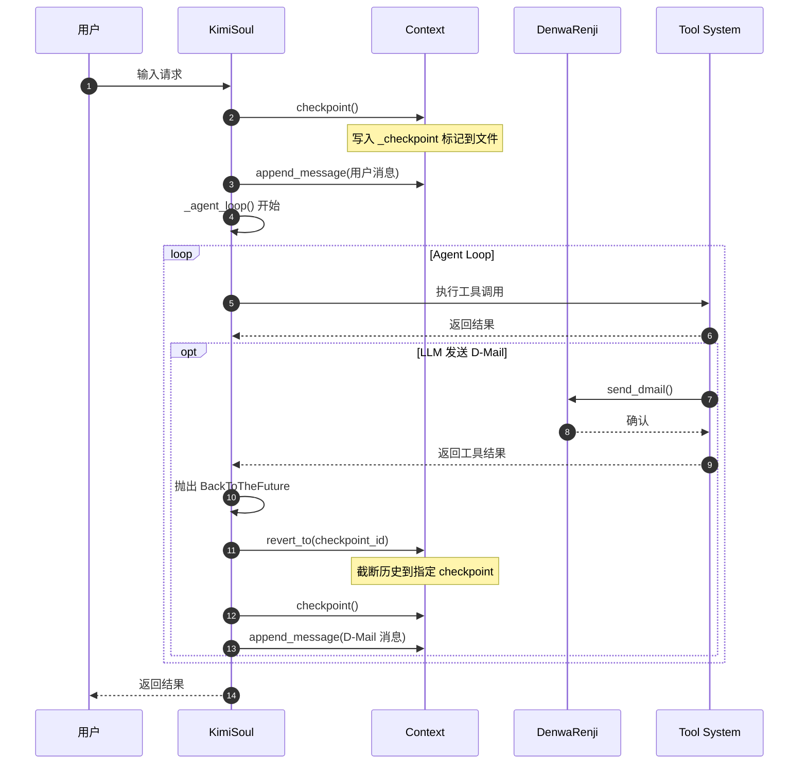
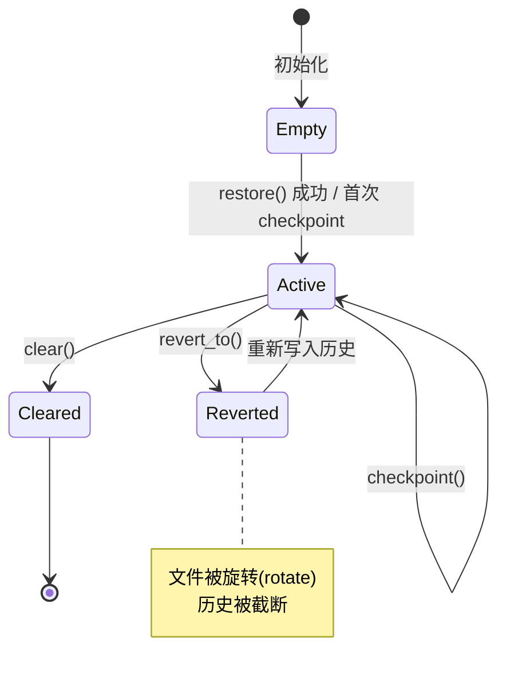
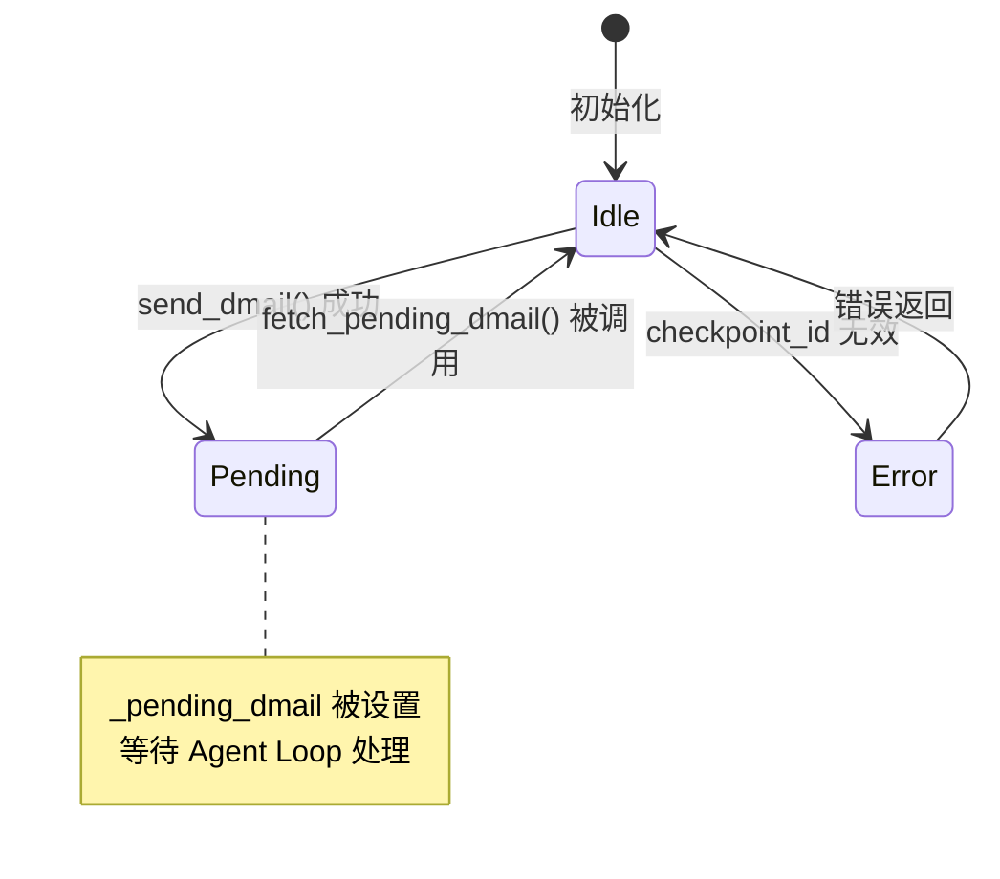
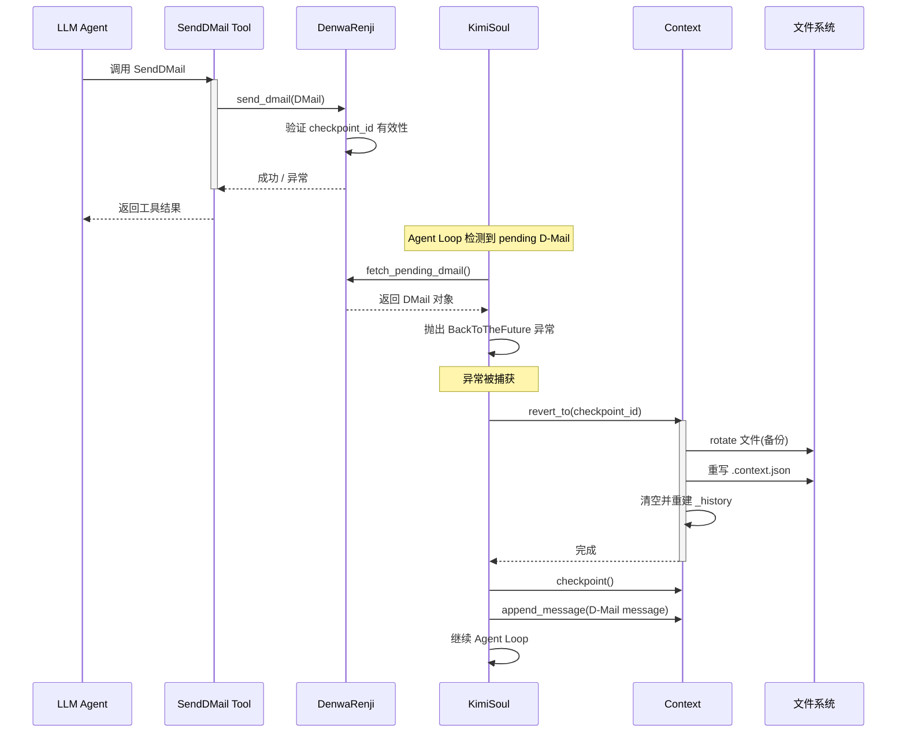
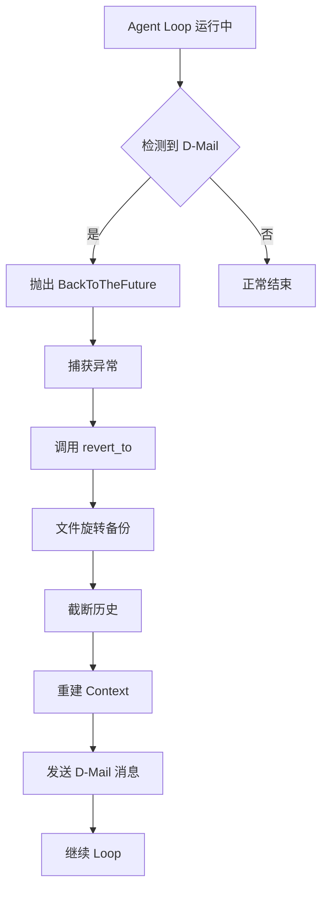
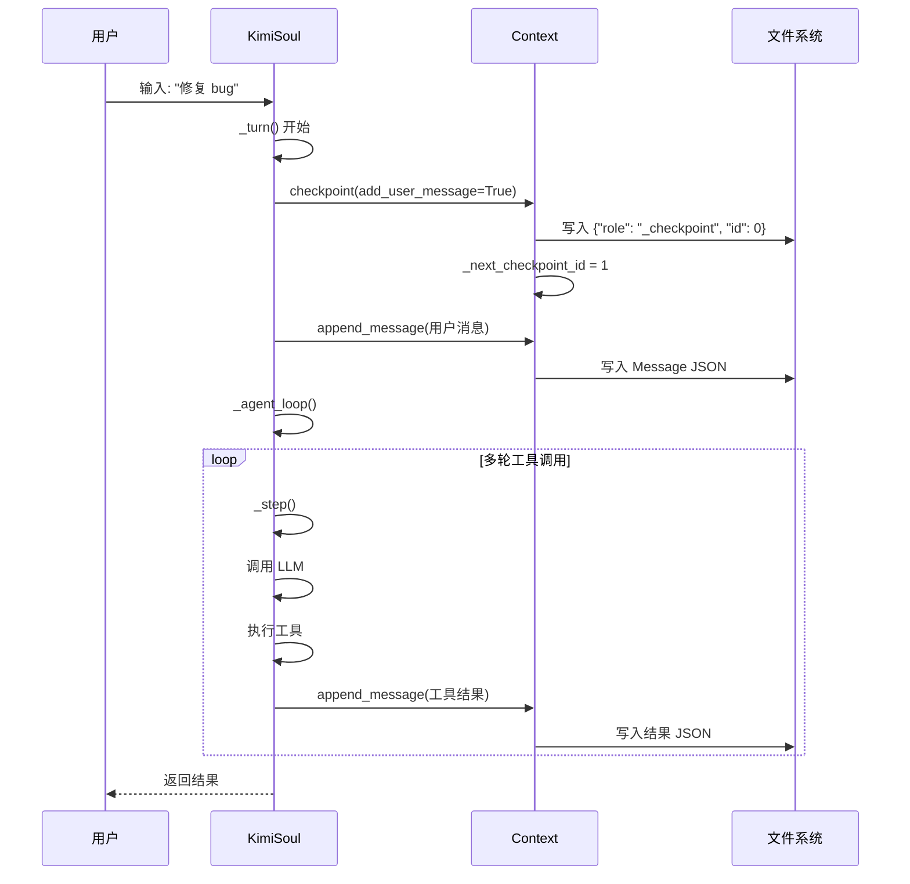
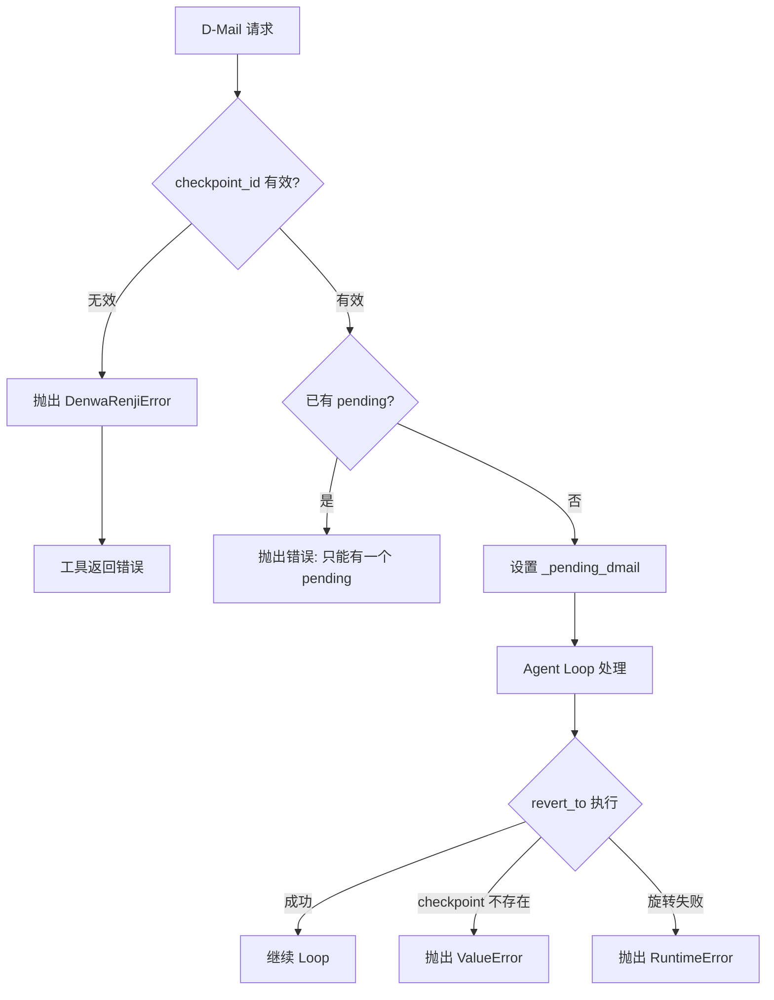
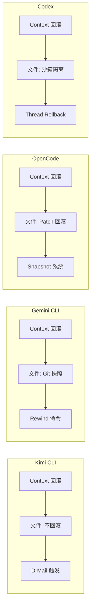

# Kimi CLI：Checkpoint 不做文件回滚的权衡

## TL;DR（结论先行）

**一句话定义**：Checkpoint 是 Kimi CLI 中用于回滚对话/推理状态的机制，而非外部世界状态的事务机制。

Kimi CLI 的核心取舍：**仅回滚上下文状态（Context），不回滚文件系统副作用**（对比 Gemini CLI 的 Git 集成快照、OpenCode 的 Snapshot 补丁回滚）。

---

## 1. 为什么需要这个机制？（解决什么问题）

### 1.1 问题场景

在 AI Coding Agent 的多轮对话中，经常出现以下场景：

```
用户：帮我修复这个 bug
Agent：→ 读取文件 A
     → 读取文件 B
     → 修改文件 A（写入错误代码）
     → 尝试运行测试（失败）
     → 继续修改文件 A（越改越糟）
```

此时用户希望"回到修改前的状态"，但面临两个层面的问题：

1. **对话层面**：上下文已被错误修改和失败结果污染，需要清理
2. **文件层面**：本地文件已被错误修改，需要恢复

### 1.2 核心挑战

| 挑战 | 不解决的后果 |
|-----|-------------|
| 上下文污染 | 错误推理路径和失败结果持续占用 token，影响后续判断 |
| 状态不一致 | 对话状态与文件系统状态脱节，导致 Agent 产生幻觉 |
| 副作用不可控 | 文件、网络、数据库等外部操作难以统一回滚 |

---

## 2. 整体架构（ASCII 图）

### 2.1 在系统中的位置

```text
┌─────────────────────────────────────────────────────────────┐
│ CLI 入口 / Session Runtime                                   │
│ kimi-cli/src/kimi_cli/cli/__init__.py                        │
└───────────────────────┬─────────────────────────────────────┘
                        │ 用户输入
                        ▼
┌─────────────────────────────────────────────────────────────┐
│ ▓▓▓ Agent Loop (KimiSoul) ▓▓▓                               │
│ kimi-cli/src/kimi_cli/soul/kimisoul.py                       │
│ - run(): 单次 Turn 入口                                     │
│ - _turn(): Checkpoint + 用户消息处理                         │
│ - _agent_loop(): 核心循环                                    │
└───────────────────────┬─────────────────────────────────────┘
                        │
        ┌───────────────┼───────────────┐
        ▼               ▼               ▼
┌──────────────┐ ┌──────────────┐ ┌──────────────┐
│ Context      │ │ Tool System  │ │ D-Mail       │
│ 状态管理     │ │ 工具执行     │ │ 回滚触发器   │
│ context.py   │ │ 含文件写入   │ │ denwarenji.py│
└──────────────┘ └──────────────┘ └──────────────┘
        │               │               │
        ▼               ▼               ▼
┌──────────────┐ ┌──────────────┐ ┌──────────────┐
│ 消息历史文件 │ │ 文件系统     │ │ 待处理队列   │
│ .context.json│ │ 被修改的文件 │ │ pending_dmail│
└──────────────┘ └──────────────┘ └──────────────┘
```

### 2.2 核心组件职责

| 组件 | 职责 | 代码位置 |
|-----|------|---------|
| `Context` | 管理消息历史、token 计数、checkpoint 序列化 | `kimi-cli/src/kimi_cli/soul/context.py:16` |
| `DenwaRenji` | 处理 D-Mail 请求，管理 pending 状态 | `kimi-cli/src/kimi_cli/soul/denwarenji.py:16` |
| `SendDMail` | D-Mail 工具实现，供 LLM 调用 | `kimi-cli/src/kimi_cli/tools/dmail/__init__.py:12` |
| `BackToTheFuture` | 回滚异常，携带目标 checkpoint_id | `kimi-cli/src/kimi_cli/soul/kimisoul.py:531` |

### 2.3 核心组件交互关系



**关键交互说明**：

| 步骤 | 交互内容 | 设计意图 |
|-----|---------|---------|
| 1 | 用户发起请求 | 触发新的 Turn |
| 2 | 创建 checkpoint | 在文件系统记录可回滚点 |
| 3 | 进入 Agent Loop | 开始多轮工具调用 |
| 4 | D-Mail 触发回滚 | LLM 主动请求状态回退 |
| 5 | revert_to 执行 | 仅截断消息历史，不涉及文件 |

---

## 3. 核心组件详细分析

### 3.1 Context 内部结构

#### 职责定位

Context 是 Kimi CLI 中负责**对话状态持久化**的核心组件，提供 checkpoint 创建和回滚能力。

#### 状态机图



**状态说明**：

| 状态 | 说明 | 进入条件 | 退出条件 |
|-----|------|---------|---------|
| Empty | 空状态，无历史 | 初始化 | restore() 或首次 checkpoint |
| Active | 正常运作状态 | 恢复成功 | revert_to() 或 clear() |
| Reverted | 已回滚状态 | revert_to() 调用 | 重新写入历史 |
| Cleared | 已清空状态 | clear() 调用 | 销毁 |

#### 内部数据流

```text
┌─────────────────────────────────────────────────────────────┐
│  输入层                                                      │
│  ├── 用户消息 ──► append_message() ──► _history[]            │
│  └── token 计数 ──► update_token_count() ──► _token_count    │
└──────────────────────────┬──────────────────────────────────┘
                           ▼
┌─────────────────────────────────────────────────────────────┐
│  持久化层                                                    │
│  ├── checkpoint() ──► 写入 {"role": "_checkpoint", "id": n}   │
│  ├── append_message() ──► 写入 Message JSON                  │
│  └── update_token_count() ──► 写入 {"role": "_usage", ...}    │
└──────────────────────────┬──────────────────────────────────┘
                           ▼
┌─────────────────────────────────────────────────────────────┐
│  回滚层                                                      │
│  ├── revert_to(id):                                          │
│  │   1. rotate 文件 (备份到 .context.json.x)                 │
│  │   2. 读取旧文件直到指定 checkpoint                         │
│  │   3. 写入新文件                                           │
│  │   4. 恢复内存状态                                         │
│  └── clear(): 类似 revert_to(0) 但更安全                     │
└─────────────────────────────────────────────────────────────┘
```

#### 关键接口

| 接口 | 输入 | 输出 | 说明 | 代码位置 |
|-----|------|------|------|---------|
| `checkpoint()` | `add_user_message: bool` | None | 创建新 checkpoint | `context.py:68` |
| `revert_to()` | `checkpoint_id: int` | None | 回滚到指定 checkpoint | `context.py:80` |
| `restore()` | - | `bool` | 从文件恢复状态 | `context.py:24` |

---

### 3.2 DenwaRenji（D-Mail 系统）内部结构

#### 职责定位

DenwaRenji（电话微波炉）是 D-Mail 的协调器，负责接收、验证和暂存 LLM 发送的回滚请求。



#### 关键数据结构

```python
# kimi-cli/src/kimi_cli/soul/denwarenji.py:6-10
class DMail(BaseModel):
    message: str = Field(description="The message to send.")
    checkpoint_id: int = Field(description="The checkpoint to send the message back to.", ge=0)
    # TODO: allow restoring filesystem state to the checkpoint
```

**字段说明**：
| 字段 | 类型 | 用途 |
|-----|------|------|
| `message` | `str` | 回滚后发送给 LLM 的新消息 |
| `checkpoint_id` | `int` | 目标 checkpoint ID（>=0） |

**注意第 9 行的 TODO 注释**：明确说明当前**不支持**文件系统状态恢复。

---

### 3.3 组件间协作时序

展示一次完整的 D-Mail 回滚流程：



---

### 3.4 关键数据路径

#### 主路径（正常流程）

```mermaid
flowchart LR
    subgraph Input["输入阶段"]
        I1[用户输入] --> I2[_turn() 处理]
        I2 --> I3[创建 checkpoint]
    end

    subgraph Process["处理阶段"]
        P1[Agent Loop] --> P2[工具执行]
        P2 --> P3[结果收集]
    end

    subgraph Output["输出阶段"]
        O1[生成回复] --> O2[更新 Context]
    end

    I3 --> P1
    P3 --> O1

    style Process fill:#e1f5e1,stroke:#333
```

#### 回滚路径（D-Mail 触发）



---

## 4. 端到端数据流转

### 4.1 正常流程（详细版）



**数据变换详情**：

| 阶段 | 输入 | 处理 | 输出 | 代码位置 |
|-----|------|------|------|---------|
| 接收 | 用户输入 | 解析 slash command | 结构化消息 | `kimisoul.py:182` |
| Checkpoint | 无 | 生成 checkpoint 标记 | `_checkpoint` JSON | `context.py:68` |
| 处理 | 消息历史 | LLM 推理 + 工具执行 | 新消息 + 结果 | `kimisoul.py:382` |
| 持久化 | 消息对象 | JSON 序列化 | 文件追加 | `context.py:167` |

### 4.2 数据流向图

```mermaid
flowchart LR
    subgraph Input["输入层"]
        I1[用户输入 / D-Mail] --> I2[KimiSoul._turn()]
    end

    subgraph Core["核心层"]
        C1[Context.checkpoint] --> C2[Context.revert_to]
        C2 --> C3[文件旋转]
        C3 --> C4[历史重建]
    end

    subgraph Storage["存储层"]
        S1[.context.json] --> S2[.context.json.1]
        S1 --> S3[Message 1..N]
    end

    I2 --> C1
    C4 --> S1
    S1 -.->|rotate| S2

    style Core fill:#f9f,stroke:#333
```

### 4.3 异常/边界流程



---

## 5. 关键代码实现

### 5.1 核心数据结构

```python
# kimi-cli/src/kimi_cli/soul/context.py:16-22
class Context:
    def __init__(self, file_backend: Path):
        self._file_backend = file_backend
        self._history: list[Message] = []
        self._token_count: int = 0
        self._next_checkpoint_id: int = 0
        """The ID of the next checkpoint, starting from 0, incremented after each checkpoint."""
```

**字段说明**：
| 字段 | 类型 | 用途 |
|-----|------|------|
| `_file_backend` | `Path` | 持久化文件路径 |
| `_history` | `list[Message]` | 内存中的消息历史 |
| `_token_count` | `int` | 当前 token 计数 |
| `_next_checkpoint_id` | `int` | 下一个 checkpoint ID |

### 5.2 主链路代码

**Checkpoint 创建**：

```python
# kimi-cli/src/kimi_cli/soul/context.py:68-78
async def checkpoint(self, add_user_message: bool):
    checkpoint_id = self._next_checkpoint_id
    self._next_checkpoint_id += 1
    logger.debug("Checkpointing, ID: {id}", id=checkpoint_id)

    async with aiofiles.open(self._file_backend, "a", encoding="utf-8") as f:
        await f.write(json.dumps({"role": "_checkpoint", "id": checkpoint_id}) + "\n")
    if add_user_message:
        await self.append_message(
            Message(role="user", content=[system(f"CHECKPOINT {checkpoint_id}")])
        )
```

**Revert 实现**：

```python
# kimi-cli/src/kimi_cli/soul/context.py:80-107
async def revert_to(self, checkpoint_id: int):
    logger.debug("Reverting checkpoint, ID: {id}", id=checkpoint_id)
    if checkpoint_id >= self._next_checkpoint_id:
        raise ValueError(f"Checkpoint {checkpoint_id} does not exist")

    # rotate the context file
    rotated_file_path = await next_available_rotation(self._file_backend)
    if rotated_file_path is None:
        raise RuntimeError("No available rotation path found")
    await aiofiles.os.replace(self._file_backend, rotated_file_path)

    # restore the context until the specified checkpoint
    self._history.clear()
    self._token_count = 0
    self._next_checkpoint_id = 0
    # ... 读取旧文件，重建状态
```

**代码要点**：
1. **文件旋转机制**：回滚前先备份原文件，防止数据丢失
2. **内存状态重建**：清空后重新读取，确保一致性
3. **仅处理 Context**：代码中没有任何文件系统操作

### 5.3 关键调用链

```text
KimiSoul._turn()                    [kimisoul.py:210]
  -> _checkpoint()                  [kimisoul.py:175]
    -> Context.checkpoint()         [context.py:68]
  -> _agent_loop()                  [kimisoul.py:220]
    -> _step()                      [kimisoul.py:382]
      -> 工具执行 (含 SendDMail)
        -> DenwaRenji.send_dmail()  [denwarenji.py:21]
  -> 检测 BackToTheFuture           [kimisoul.py:377]
    -> Context.revert_to()          [context.py:80]
      - 文件旋转 (backup)
      - 历史截断
      - 状态重建
```

---

## 6. 设计意图与 Trade-off

### 6.1 Kimi CLI 的选择

| 维度 | Kimi CLI 的选择 | 替代方案 | 取舍分析 |
|-----|----------------|---------|---------|
| 回滚范围 | 仅 Context（消息历史） | 包含文件系统 | 轻量高效，但文件副作用需额外处理 |
| 持久化方式 | JSON Lines 文件 | 数据库/SQLite | 简单可调试，但查询能力弱 |
| 触发方式 | LLM 主动发送 D-Mail | 用户手动 / 自动 | 灵活但依赖 LLM 判断 |
| 文件备份 | 旋转机制 (.json.x) | Git 集成 | 简单可靠，但无版本控制 |

### 6.2 为什么这样设计？

**核心问题**：为什么 checkpoint 不回滚文件？

**Kimi CLI 的解决方案**：
- 代码依据：`kimi-cli/src/kimi_cli/soul/denwarenji.py:9`
- 设计意图：明确区分"内生状态"与"外生状态"

```python
class DMail(BaseModel):
    message: str = Field(description="The message to send.")
    checkpoint_id: int = Field(description="The checkpoint to send the message back to.", ge=0)
    # TODO: allow restoring filesystem state to the checkpoint
```

**带来的好处**：
1. **边界清晰**：Context 只负责对话状态，不承担外部系统补偿
2. **行为可预测**：`revert_to` 语义简单，不受工具类型影响
3. **故障隔离**：即使工具不可逆，也不会污染 checkpoint 正确性
4. **成本可控**：避免为所有用户承担文件快照的存储/IO 成本

**付出的代价**：
1. **文件副作用残留**：回滚后文件修改仍存在，可能导致状态不一致
2. **LLM 需要理解限制**：工具描述中必须明确说明不回滚文件
3. **用户需自行处理**：重要文件修改需依赖外部版本控制（如 Git）

### 6.3 与其他项目的对比



| 项目 | 核心差异 | 适用场景 |
|-----|---------|---------|
| **Kimi CLI** | 仅回滚 Context，文件副作用不处理 | 轻量级对话，文件修改少 |
| **Gemini CLI** | Git 集成，支持文件级回滚 | 代码编辑场景，已有 Git 仓库 |
| **OpenCode** | Snapshot + Patch 系统，可回滚文件 | 复杂项目，需要精确文件控制 |
| **Codex** | 沙箱隔离，文件在隔离环境 | 高安全性要求，企业场景 |

**详细对比**：

| 特性 | Kimi CLI | Gemini CLI | OpenCode | Codex |
|-----|----------|------------|----------|-------|
| 上下文回滚 | ✅ D-Mail | ✅ Rewind | ✅ Revert | ✅ Thread Rollback |
| 文件回滚 | ❌ 不支持 | ✅ Git stash | ✅ Patch 反向应用 | ✅ 沙箱重建 |
| 实现复杂度 | 低 | 中 | 中 | 高 |
| 存储开销 | 低（仅 JSON） | 中（Git 对象） | 中（Patch 历史） | 高（沙箱快照） |
| 用户干预 | 需理解限制 | 自动/手动 | 自动 | 自动 |

---

## 7. 边界情况与错误处理

### 7.1 终止条件

| 终止原因 | 触发条件 | 代码位置 |
|---------|---------|---------|
| Checkpoint 不存在 | `checkpoint_id >= _next_checkpoint_id` | `context.py:95` |
| 旋转路径不可用 | `next_available_rotation()` 返回 None | `context.py:101` |
| D-Mail checkpoint 无效 | `checkpoint_id >= _n_checkpoints` | `denwarenji.py:27` |
| 重复 D-Mail | `_pending_dmail is not None` | `denwarenji.py:23` |

### 7.2 资源限制

```python
# kimi-cli/src/kimi_cli/soul/context.py:99-104
rotated_file_path = await next_available_rotation(self._file_backend)
if rotated_file_path is None:
    logger.error("No available rotation path found")
    raise RuntimeError("No available rotation path found")
```

旋转文件命名规则：`.context.json.1`, `.context.json.2`, ... 直到找到可用名称。

### 7.3 错误恢复策略

| 错误类型 | 处理策略 | 代码位置 |
|---------|---------|---------|
| Checkpoint ID 无效 | 抛出 ValueError，终止回滚 | `context.py:96` |
| 旋转失败 | 抛出 RuntimeError，保留原文件 | `context.py:102` |
| D-Mail 无效 | 返回 ToolError，继续执行 | `dmail/__init__.py:26` |

---

## 8. 关键代码索引

| 功能 | 文件 | 行号 | 说明 |
|-----|------|------|------|
| Context 类定义 | `kimi-cli/src/kimi_cli/soul/context.py` | 16 | 核心状态管理 |
| checkpoint() | `kimi-cli/src/kimi_cli/soul/context.py` | 68 | 创建 checkpoint |
| revert_to() | `kimi-cli/src/kimi_cli/soul/context.py` | 80 | 回滚到指定 checkpoint |
| DMail 数据结构 | `kimi-cli/src/kimi_cli/soul/denwarenji.py` | 6 | D-Mail 参数定义 |
| DenwaRenji 类 | `kimi-cli/src/kimi_cli/soul/denwarenji.py` | 16 | D-Mail 协调器 |
| SendDMail 工具 | `kimi-cli/src/kimi_cli/tools/dmail/__init__.py` | 12 | 工具实现 |
| BackToTheFuture | `kimi-cli/src/kimi_cli/soul/kimisoul.py` | 531 | 回滚异常 |
| _turn() | `kimi-cli/src/kimi_cli/soul/kimisoul.py` | 210 | Turn 入口 |
| _agent_loop() | `kimi-cli/src/kimi_cli/soul/kimisoul.py` | 302 | 核心循环 |

---

## 9. 延伸阅读

- 前置知识：`docs/kimi-cli/04-kimi-cli-agent-loop.md`
- 相关机制：`docs/kimi-cli/07-kimi-cli-memory-context.md`
- 深度分析：`docs/comm/comm-checkpoint-comparison.md`（跨项目对比）
- Gemini CLI 对比：`docs/gemini-cli/04-gemini-cli-agent-loop.md`
- OpenCode 对比：`docs/opencode/04-opencode-agent-loop.md`

---

## 10. 分层增强建议（如何补齐文件回滚）

如果你的场景需要文件回滚能力，推荐以下分层增强方案：

### 层 1：最小可用（低成本）

在每个 turn 前记录 git 工作区状态：

```python
# 伪代码示例
async def _turn(self, user_message):
    # 创建 checkpoint 前保存 git 状态
    git_stash_id = await git_stash_push(f"checkpoint-{checkpoint_id}")
    await self._checkpoint()
    # ... 正常流程

# 回滚时恢复 git 状态
async def revert_with_git(checkpoint_id, git_stash_id):
    await context.revert_to(checkpoint_id)
    await git_stash_pop(git_stash_id)
```

### 层 2：工具级可逆（中成本）

为写文件工具实现 before/after ledger：

```python
class FileToolLedger:
    def before_write(self, path: str, content: str) -> str:
        # 保存原文件内容或 hash
        pass

    def undo(self, operation_id: str):
        # 恢复到之前的状态
        pass
```

### 层 3：工作流级保护（高可靠）

- 高风险工具强制审批
- 幂等 key、防重放、审计日志
- 失败时走人工确认或半自动补偿

---

*✅ Verified: 基于 kimi-cli/src/kimi_cli/soul/context.py:68, kimi-cli/src/kimi_cli/soul/denwarenji.py:6, kimi-cli/src/kimi_cli/soul/kimisoul.py:531 等源码分析*

*基于版本：kimi-cli 2026-02-08 | 最后更新：2026-02-24*
