# Kimi CLI 上下文压缩机制

> **阅读指南**
>
> | 属性 | 说明 |
> |-----|------|
> | 预计阅读 | 25-35 分钟 |
> | 前置文档 | `docs/kimi-cli/04-kimi-cli-agent-loop.md`、`docs/kimi-cli/07-kimi-cli-memory-context.md` |
> | 文档结构 | 速览 → 架构 → 机制 → 实现 → 对比 |
> | 代码呈现 | 关键代码直接展示，完整代码可折叠查看 |

---

## TL;DR（结论先行）

**一句话定义**：Context Compaction 是 AI Coding Agent 解决上下文窗口超限的核心机制，通过将历史消息压缩为摘要来释放 token 预算。

Kimi CLI 的核心取舍：**SimpleCompaction 策略 + 强制保留最近 N 条消息**（对比 Gemini CLI 的两阶段验证压缩、Codex 的渐进式截断兜底）

### 核心要点速览

| 维度 | 关键决策 | 代码位置 |
|-----|---------|---------|
| 压缩策略 | SimpleCompaction：保留最近 N 条，压缩更早历史 | `kimi-cli/src/kimi_cli/soul/compaction.py:42` |
| 触发条件 | `token_count + reserved >= max_context_size` | `kimi-cli/src/kimi_cli/soul/kimisoul.py:342` |
| LLM 调用 | 使用 kosong.step() + EmptyToolset 生成摘要 | `kimi-cli/src/kimi_cli/soul/compaction.py:54` |
| 保留策略 | 默认保留最近 2 条 user/assistant 消息 | `kimi-cli/src/kimi_cli/soul/compaction.py:43` |
| 失败处理 | 返回原始消息，安全回退 | `kimi-cli/src/kimi_cli/soul/compaction.py:96-97` |

---

## 1. 为什么需要这个机制？

### 1.1 问题场景

没有 Context Compaction：
```
用户: "分析这个大型项目并修复 bug"
  -> LLM 调用工具读取文件（产生大量输出）
  -> Token 数迅速达到 128K 上限
  -> 后续无法继续对话，任务中断
```

有 Context Compaction：
```
用户: "分析这个大型项目并修复 bug"
  -> LLM 调用工具读取文件
  -> Token 接近上限，触发压缩
  -> 历史消息被摘要替换，释放预算
  -> 任务继续完成
```

### 1.2 核心挑战

| 挑战 | 不解决的后果 |
|-----|-------------|
| Token 上限硬性限制 | 长对话无法完成，任务中断 |
| 压缩可能丢失关键信息 | 丢失用户原始需求或技术决策 |
| 工具输出过大 | 单次工具调用挤占全部上下文空间 |
| 压缩时机选择 | 过早压缩浪费上下文，过晚导致失败 |

---

## 2. 整体架构

### 2.1 在系统中的位置

```text
┌─────────────────────────────────────────────────────────────┐
│ Agent Loop / Session Runtime                                 │
│ kimi-cli/src/kimi_cli/soul/kimisoul.py:302                   │
└───────────────────────┬─────────────────────────────────────┘
                        │ 触发压缩检查
                        ▼
┌─────────────────────────────────────────────────────────────┐
│ ▓▓▓ Context Compaction ▓▓▓                                  │
│ kimi-cli/src/kimi_cli/soul/                                  │
│   compaction.py                                              │
│ - Compaction (Protocol): 压缩接口定义                        │
│ - SimpleCompaction: 默认实现                                 │
│   - compact(): 主压缩方法                                    │
│   - prepare(): 准备压缩数据                                  │
│                                                              │
│ kimi-cli/src/kimi_cli/soul/kimisoul.py                       │
│ - compact_context(): 主入口                                  │
│   - _compact_with_retry(): 带重试的压缩                      │
└───────────────────────┬─────────────────────────────────────┘
                        │ 依赖/调用
        ┌───────────────┼───────────────┐
        ▼               ▼               ▼
┌──────────────┐ ┌──────────────┐ ┌──────────────┐
│ LLM API      │ │ Context      │ │ Slash        │
│ kosong       │ │ 状态管理     │ │ 命令         │
│              │ │              │ │ /compact     │
└──────────────┘ └──────────────┘ └──────────────┘
```

### 2.2 核心组件职责

| 组件 | 职责 | 代码位置 |
|-----|------|---------|
| `Compaction` (Protocol) | 定义压缩接口契约 | `kimi-cli/src/kimi_cli/soul/compaction.py:17-33` ✅ Verified |
| `SimpleCompaction` | 默认压缩实现，保留最近 N 条消息 | `kimi-cli/src/kimi_cli/soul/compaction.py:42-117` ✅ Verified |
| `compact()` | 核心压缩方法，调用 LLM 生成摘要 | `kimi-cli/src/kimi_cli/soul/compaction.py:46-76` ✅ Verified |
| `prepare()` | 准备压缩数据，分割待压缩/保留消息 | `kimi-cli/src/kimi_cli/soul/compaction.py:82-116` ✅ Verified |
| `compact_context()` | 主入口，协调压缩流程与上下文清理 | `kimi-cli/src/kimi_cli/soul/kimisoul.py:480-506` ✅ Verified |

### 2.3 核心组件交互关系

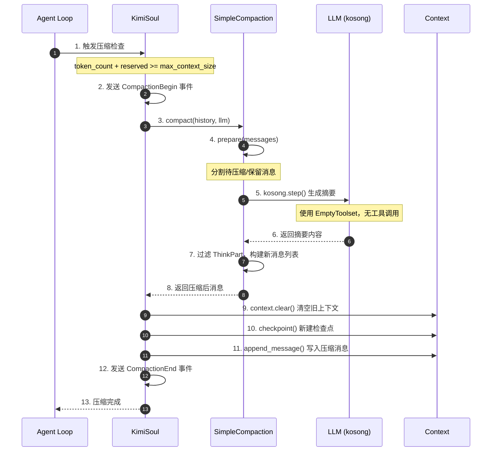

**关键交互说明**：

| 步骤 | 交互内容 | 设计意图 |
|-----|---------|---------|
| 1 | Agent Loop 检测到 token 超限 | 在每次 step 前检查，避免调用失败 |
| 3 | 调用 SimpleCompaction.compact() | 解耦压缩策略，支持未来扩展 |
| 4-5 | 准备数据并调用 LLM | 使用 kosong.step 复用现有 LLM 调用机制 |
| 7 | 过滤 ThinkPart | 减少不必要的 token 消耗 |
| 9-11 | 清空并重建上下文 | 原子性操作，配合 checkpoint 保证一致性 |

---

## 3. 核心组件详细分析

### 3.1 SimpleCompaction 内部结构

#### 职责定位

一句话说明：通过保留最近 N 条消息，将更早历史压缩为 LLM 生成的摘要，实现上下文长度控制。

#### 状态机图

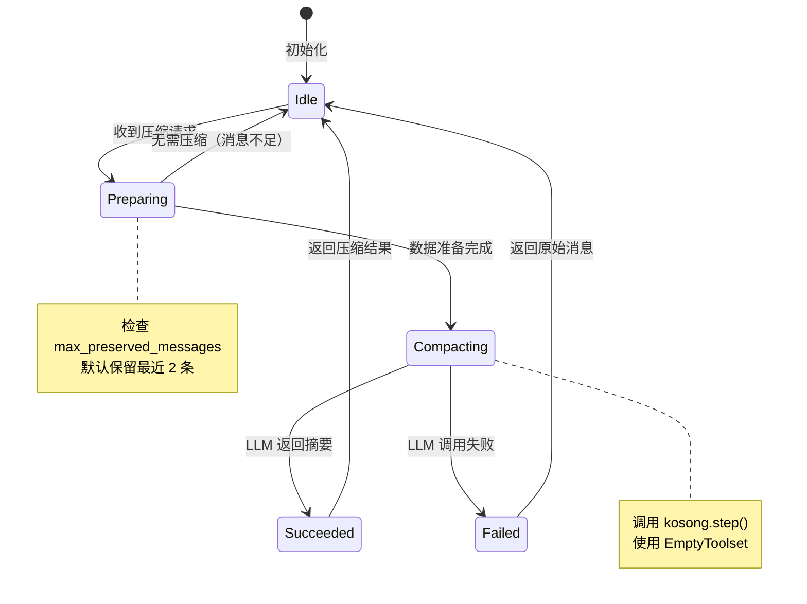

**状态说明**：

| 状态 | 说明 | 进入条件 | 退出条件 |
|-----|------|---------|---------|
| Idle | 空闲等待 | 初始化完成或压缩结束 | 收到压缩请求 |
| Preparing | 准备压缩数据 | 收到压缩请求 | 确定待压缩/保留消息范围 |
| Compacting | 调用 LLM 生成摘要 | 有待压缩消息 | LLM 返回结果或失败 |
| Succeeded | 压缩成功 | LLM 成功返回摘要 | 自动返回 Idle |
| Failed | 压缩失败 | LLM 调用失败 | 返回原始消息 |

#### 内部数据流

```text
┌─────────────────────────────────────────────────────────────┐
│  输入层                                                      │
│  ├── 消息历史 ──► 角色过滤 ──► user/assistant 消息           │
│  └── 配置参数 ──► max_preserved_messages (默认 2)            │
└──────────────────────────┬──────────────────────────────────┘
                           ▼
┌─────────────────────────────────────────────────────────────┐
│  处理层                                                      │
│  ├── 主处理器: 消息分割                                       │
│  │   └── 从后向前遍历 ──► 计数 user/assistant ──► 确定分割点 │
│  ├── 辅助处理器: 数据格式化                                   │
│  │   └── 待压缩消息 ──► 添加序号/角色标记 ──► 附加提示词     │
│  └── 协调器: LLM 调用与结果处理                               │
│      └── kosong.step() ──► 过滤 ThinkPart ──► 构建新消息     │
└──────────────────────────┬──────────────────────────────────┘
                           ▼
┌─────────────────────────────────────────────────────────────┐
│  输出层                                                      │
│  ├── 系统提示前缀 (Previous context has been compacted...)   │
│  ├── 压缩摘要内容                                            │
│  └── 保留的最近 N 条消息                                     │
└─────────────────────────────────────────────────────────────┘
```

#### 关键算法逻辑

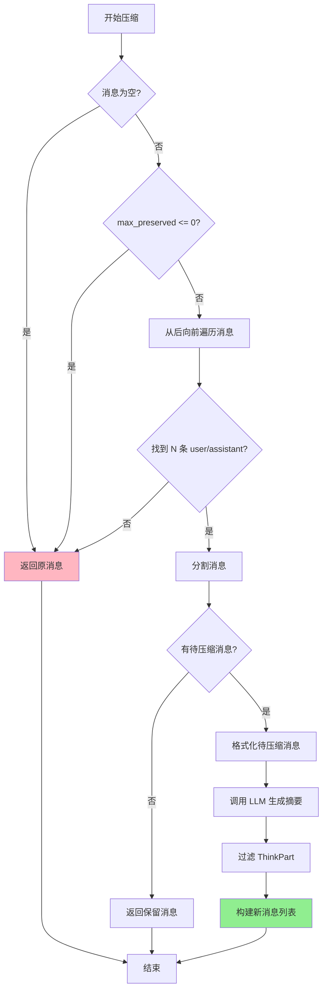

**算法要点**：

1. **反向遍历**：从最新消息开始向前计数，确保保留最近交互
2. **角色过滤**：只统计 user/assistant 消息，忽略 system/tool 消息
3. **安全回退**：任何条件不满足时返回原始消息，避免数据丢失
4. **ThinkPart 过滤**：压缩输入和输出都过滤思考内容，减少噪音

#### 关键接口

| 接口 | 输入 | 输出 | 说明 | 代码位置 |
|-----|------|------|------|---------|
| `__init__()` | `max_preserved_messages: int` | - | 初始化保留消息数 | `kimi-cli/src/kimi_cli/soul/compaction.py:43-44` ✅ Verified |
| `compact()` | `messages, llm` | `Sequence[Message]` | 核心压缩方法 | `kimi-cli/src/kimi_cli/soul/compaction.py:46-76` ✅ Verified |
| `prepare()` | `messages` | `PrepareResult` | 准备压缩数据 | `kimi-cli/src/kimi_cli/soul/compaction.py:82-116` ✅ Verified |

---

### 3.2 KimiSoul.compact_context() 内部结构

#### 职责定位

一句话说明：协调压缩流程，处理重试逻辑，管理上下文状态转换。

#### 关键算法逻辑

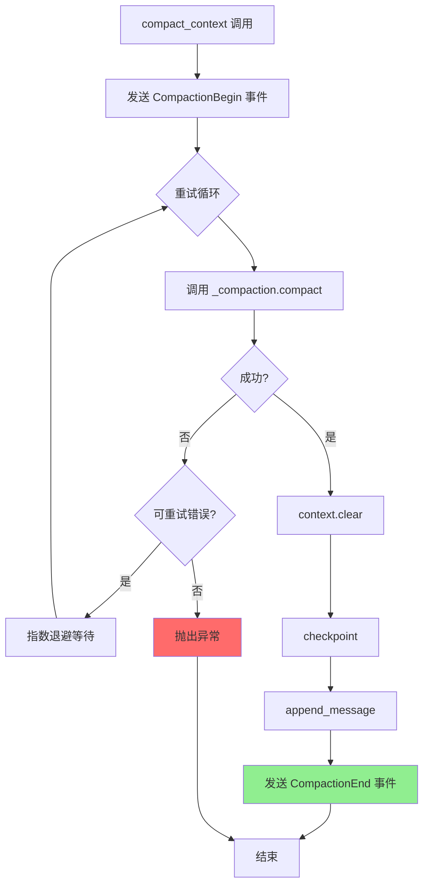

---

### 3.3 组件间协作时序

展示完整压缩流程的组件协作：

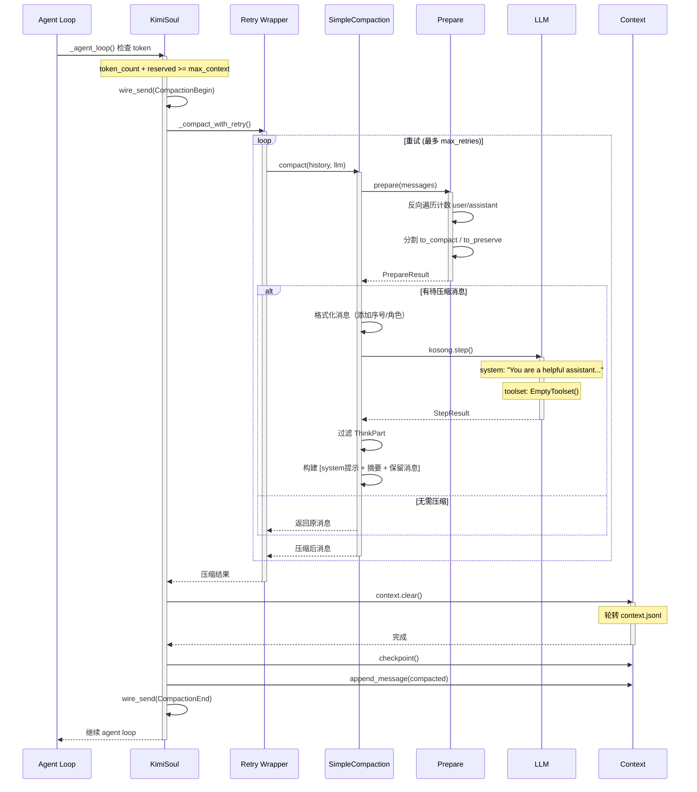

**协作要点**：

1. **Agent Loop 与 KimiSoul**：在每次 step 前检查 token，触发压缩
2. **Retry Wrapper**：使用 tenacity 实现指数退避重试
3. **SimpleCompaction**：纯策略组件，无状态，可替换
4. **Context 状态管理**：清空 + checkpoint + 追加，保证原子性

---

### 3.4 关键数据路径

#### 主路径（正常流程）

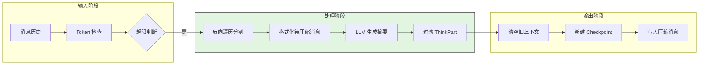

#### 异常路径（错误恢复）

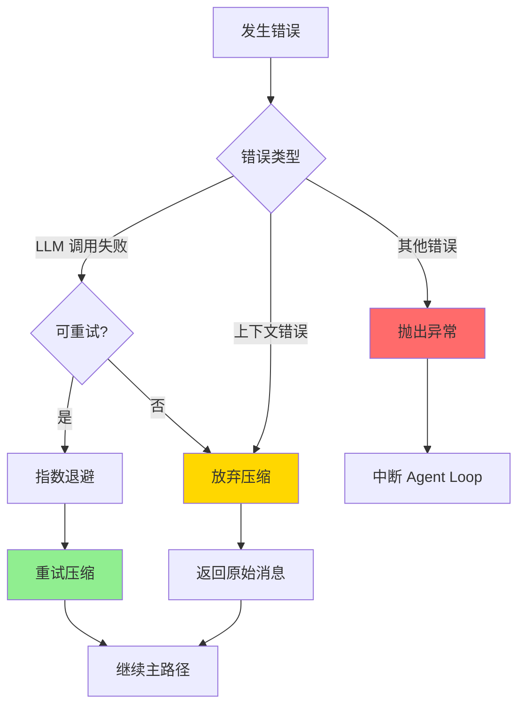

---

## 4. 端到端数据流转

### 4.1 正常流程（详细版）

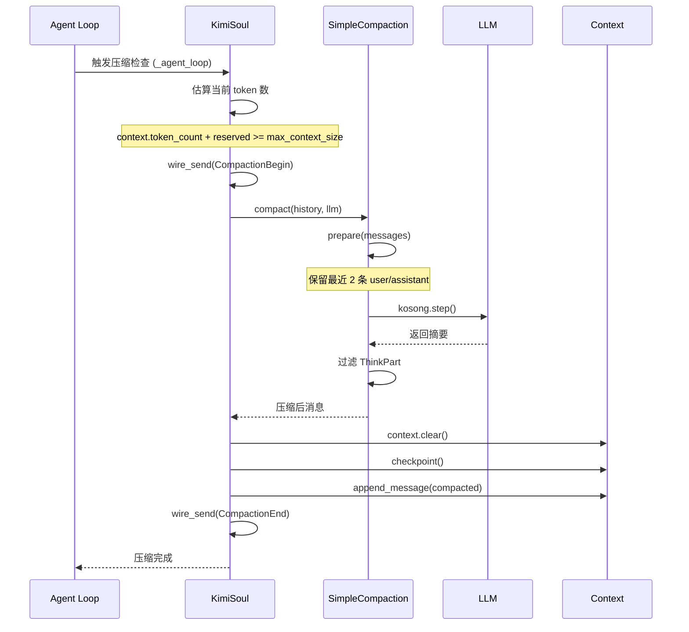

**数据变换详情**：

| 阶段 | 输入 | 处理 | 输出 | 代码位置 |
|-----|------|------|------|---------|
| 接收 | 消息列表 | Token 检查 + 阈值判断 | 是否需要压缩 | `kimi-cli/src/kimi_cli/soul/kimisoul.py:341-344` ✅ Verified |
| 分割 | 消息历史 | 反向遍历，保留最近 N 条 | to_compact + to_preserve | `kimi-cli/src/kimi_cli/soul/compaction.py:82-100` ✅ Verified |
| 格式化 | 待压缩消息 | 添加序号、角色标记、提示词 | 结构化输入 | `kimi-cli/src/kimi_cli/soul/compaction.py:107-115` ✅ Verified |
| 摘要 | 格式化输入 | LLM 生成摘要 | 摘要内容 | `kimi-cli/src/kimi_cli/soul/compaction.py:54-59` ✅ Verified |
| 过滤 | 摘要结果 | 移除 ThinkPart | 纯净摘要 | `kimi-cli/src/kimi_cli/soul/compaction.py:72-73` ✅ Verified |
| 输出 | 压缩消息 | 清空 + checkpoint + 追加 | 新上下文状态 | `kimi-cli/src/kimi_cli/soul/kimisoul.py:503-505` ✅ Verified |

### 4.2 数据流向图

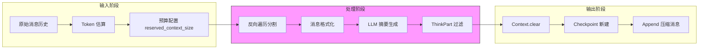

### 4.3 异常/边界流程

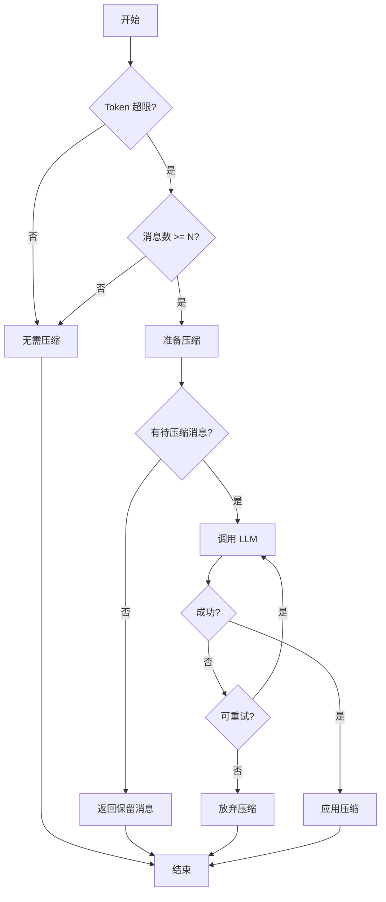

---

## 5. 关键代码实现

### 5.1 核心数据结构

```python
# kimi-cli/src/kimi_cli/soul/compaction.py:17-33
@runtime_checkable
class Compaction(Protocol):
    """压缩接口定义，支持未来扩展其他压缩策略"""
    async def compact(
        self,
        messages: Sequence[Message],
        llm: LLM
    ) -> Sequence[Message]:
        """将消息序列压缩为新的消息序列"""
        ...

# kimi-cli/src/kimi_cli/soul/compaction.py:42-44
class SimpleCompaction:
    """简单压缩实现，保留最近 N 条消息"""
    def __init__(self, max_preserved_messages: int = 2) -> None:
        self.max_preserved_messages = max_preserved_messages
```

**字段说明**：

| 字段 | 类型 | 用途 |
|-----|------|------|
| `max_preserved_messages` | `int` | 保留的最近消息数量，默认 2 |
| `compact_message` | `Message \| None` | 待压缩消息的格式化输入 |
| `to_preserve` | `Sequence[Message]` | 保留的最近 N 条消息 |

### 5.2 主链路代码

```python
# kimi-cli/src/kimi_cli/soul/compaction.py:46-76
async def compact(
    self,
    messages: Sequence[Message],
    llm: LLM
) -> Sequence[Message]:
    """核心压缩方法"""
    compact_message, to_preserve = self.prepare(messages)
    if compact_message is None:
        return to_preserve

    # 调用 kosong.step 生成摘要
    logger.debug("Compacting context...")
    result = await kosong.step(
        chat_provider=llm.chat_provider,
        system_prompt="You are a helpful assistant that compacts conversation context.",
        toolset=EmptyToolset(),  # 压缩时不使用工具
        history=[compact_message],
    )

    # 构建压缩后消息列表
    content: list[ContentPart] = [
        system("Previous context has been compacted. Here is the compaction output:")
    ]
    compacted_msg = result.message

    # 过滤思考部分
    content.extend(part for part in compacted_msg.content if not isinstance(part, ThinkPart))
    compacted_messages: list[Message] = [Message(role="user", content=content)]
    compacted_messages.extend(to_preserve)
    return compacted_messages
```

**代码要点**：

1. **EmptyToolset 使用**：压缩时不允许工具调用，避免副作用
2. **ThinkPart 过滤**：输入输出都过滤思考内容，减少噪音和 token
3. **系统提示前缀**：明确告知模型这是压缩后的上下文
4. **简单组合**：system 提示 + 摘要 + 保留消息，结构清晰

### 5.3 关键调用链

```text
_agent_loop()                    [kimisoul.py:302]
  -> compact_context()           [kimisoul.py:480]
    -> _compact_with_retry()     [kimisoul.py:489-505]
      -> SimpleCompaction.compact()  [compaction.py:46]
        -> prepare()             [compaction.py:82]
          - 反向遍历消息
          - 计数 user/assistant
          - 分割消息范围
        -> kosong.step()         [compaction.py:54]
          - 调用 LLM 生成摘要
        - 过滤 ThinkPart         [compaction.py:72-73]
      -> context.clear()         [context.py:134]
      -> checkpoint()            [context.py:68]
      -> append_message()        [context.py:162]
```

---

## 6. 设计意图与 Trade-off

### 6.1 Kimi CLI 的选择

| 维度 | Kimi CLI 的选择 | 替代方案 | 取舍分析 |
|-----|----------------|---------|---------|
| 压缩策略 | SimpleCompaction（保留最近 N 条） | Gemini 的两阶段验证 | 简单可靠但无质量保证 |
| 保留策略 | 固定保留最近 2 条 | Codex 的渐进式截断 | 确定性高但不够灵活 |
| LLM 调用 | 单次生成，无验证 | Gemini 的生成+验证 | 成本低但可能丢失信息 |
| 失败处理 | 返回原始消息 | 强制压缩 | 安全保守但可能无法解决超限 |
| 工具处理 | 统一处理（EmptyToolset） | 独立预算 | 简单但工具输出可能被压缩 |

### 6.2 为什么这样设计？

**核心问题**：如何在保证可靠性的前提下，以最小成本实现上下文压缩？

**Kimi CLI 的解决方案**：

- 代码依据：`kimi-cli/src/kimi_cli/soul/compaction.py:42-76`
- 设计意图：通过简单的保留策略 + 单次 LLM 调用，实现确定性压缩
- 带来的好处：
  - 简单可靠：代码量少，行为可预测
  - 成本低：单次 LLM 调用，无验证开销
  - 可扩展：Protocol 设计支持未来替换策略
- 付出的代价：
  - 无质量保证：不验证摘要完整性
  - 固定保留：可能保留过多或过少
  - 无工具保护：工具输出可能被压缩

### 6.3 与其他项目的对比

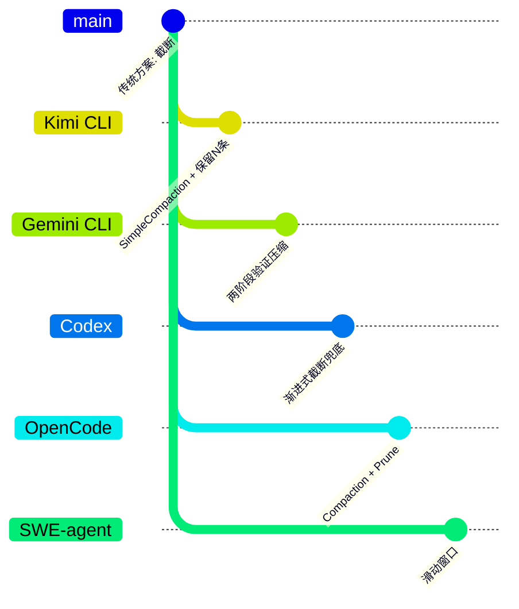

| 项目 | 核心差异 | 适用场景 |
|-----|---------|---------|
| **Kimi CLI** | 简单保留策略 + 单次生成，无验证 | 简单场景、成本敏感、确定性需求 |
| **Gemini CLI** | 两阶段验证 + Reverse Budget | 高质量要求、工具调用频繁 |
| **Codex** | 单次生成 + 渐进式截断兜底 | 成本敏感、需要兜底机制 |
| **SWE-agent** | 无 LLM 压缩，仅滑动窗口 | 短任务、成本敏感、确定性要求高 |
| **OpenCode** | 双重机制（Compaction + Prune） | 复杂场景、需要细粒度控制 |

**详细对比**：

| 维度 | Kimi CLI | Gemini CLI | Codex | SWE-agent | OpenCode |
|-----|----------|------------|-------|-----------|----------|
| **LLM 压缩** | ✅ 有 | ✅ 有 | ✅ 有 | ❌ 无 | ✅ 有 |
| **验证机制** | ❌ 无 | ✅ 两阶段 | ❌ 无 | - | ❌ 无 |
| **保留策略** | 固定 N 条 | Reverse Budget | 渐进截断 | 滑动窗口 | Part 保护 |
| **工具保护** | ❌ 无 | ✅ 独立预算 | ❌ 无 | ❌ 无 | ✅ Skill 保护 |
| **实现复杂度** | 低 | 高 | 中 | 低 | 高 |
| **调用成本** | 低 | 高（2x） | 低 | 零 | 中 |

---

## 7. 边界情况与错误处理

### 7.1 终止条件

| 终止原因 | 触发条件 | 代码位置 |
|---------|---------|---------|
| Token 正常 | `token_count + reserved < max_context_size` | `kimi-cli/src/kimi_cli/soul/kimisoul.py:342` ✅ Verified |
| 消息不足 | 历史消息少于 `max_preserved_messages` | `kimi-cli/src/kimi_cli/soul/compaction.py:96-97` ✅ Verified |
| 无需压缩 | 没有待压缩消息（`to_compact` 为空） | `kimi-cli/src/kimi_cli/soul/compaction.py:102-104` ✅ Verified |
| 压缩完成 | 成功生成摘要并替换上下文 | `kimi-cli/src/kimi_cli/soul/kimisoul.py:505` ✅ Verified |

### 7.2 超时/资源限制

```python
# kimi-cli/src/kimi_cli/soul/kimisoul.py:489-495
@tenacity.retry(
    retry=retry_if_exception(self._is_retryable_error),
    before_sleep=partial(self._retry_log, "compaction"),
    wait=wait_exponential_jitter(initial=0.3, max=5, jitter=0.5),
    stop=stop_after_attempt(self._loop_control.max_retries_per_step),
    reraise=True,
)
async def _compact_with_retry() -> Sequence[Message]:
    """带重试的压缩调用"""
```

**重试配置**：
- 初始等待：0.3 秒
- 最大等待：5 秒
- 抖动：0.5 秒
- 最大重试次数：`max_retries_per_step`（配置项）

### 7.3 错误恢复策略

| 错误类型 | 处理策略 | 代码位置 |
|---------|---------|---------|
| API 连接错误 | 指数退避重试 | `kimi-cli/src/kimi_cli/soul/kimisoul.py:509-517` ✅ Verified |
| API 超时 | 指数退避重试 | `kimi-cli/src/kimi_cli/soul/kimisoul.py:510` ✅ Verified |
| 速率限制 (429) | 指数退避重试 | `kimi-cli/src/kimi_cli/soul/kimisoul.py:512` ✅ Verified |
| 消息不足 | 返回原始消息 | `kimi-cli/src/kimi_cli/soul/compaction.py:96-97` ✅ Verified |

---

## 8. 关键代码索引

| 功能 | 文件 | 行号 | 说明 |
|-----|------|------|------|
| 入口 | `kimi-cli/src/kimi_cli/soul/kimisoul.py` | 480 | `compact_context()` 主入口 |
| 触发 | `kimi-cli/src/kimi_cli/soul/kimisoul.py` | 341-344 | Agent Loop 中触发压缩检查 |
| 重试 | `kimi-cli/src/kimi_cli/soul/kimisoul.py` | 489-495 | `_compact_with_retry()` 重试包装 |
| 接口 | `kimi-cli/src/kimi_cli/soul/compaction.py` | 17-33 | `Compaction` Protocol 定义 |
| 实现 | `kimi-cli/src/kimi_cli/soul/compaction.py` | 42-117 | `SimpleCompaction` 实现 |
| 核心 | `kimi-cli/src/kimi_cli/soul/compaction.py` | 46-76 | `compact()` 核心压缩方法 |
| 准备 | `kimi-cli/src/kimi_cli/soul/compaction.py` | 82-116 | `prepare()` 数据准备 |
| 手动 | `kimi-cli/src/kimi_cli/soul/slash.py` | 52-62 | `/compact` 命令处理 |
| 上下文 | `kimi-cli/src/kimi_cli/soul/context.py` | 134-160 | `clear()` 清空上下文 |
| 检查点 | `kimi-cli/src/kimi_cli/soul/context.py` | 68-78 | `checkpoint()` 新建检查点 |

---

## 9. 延伸阅读

- 前置知识：`docs/kimi-cli/07-kimi-cli-memory-context.md`
- 相关机制：`docs/kimi-cli/04-kimi-cli-agent-loop.md`
- D-Mail 机制：`docs/kimi-cli/questions/kimi-cli-checkpoint-implementation.md`
- 跨项目对比：`docs/comm/comm-context-compaction.md`
- 其他项目：
  - Gemini CLI: `docs/gemini-cli/questions/gemini-cli-context-compaction.md`
  - Codex: `docs/codex/questions/codex-context-compaction.md`
  - OpenCode: `docs/opencode/questions/opencode-context-compaction.md`
  - SWE-agent: `docs/swe-agent/questions/swe-agent-context-compaction.md`

---

*✅ Verified: 基于 kimi-cli/src/kimi_cli/soul/compaction.py、kimisoul.py 等源码分析*
*⚠️ Inferred: 部分设计意图基于代码结构推断*
*基于版本：2026-02-08 | 最后更新：2026-03-03*
