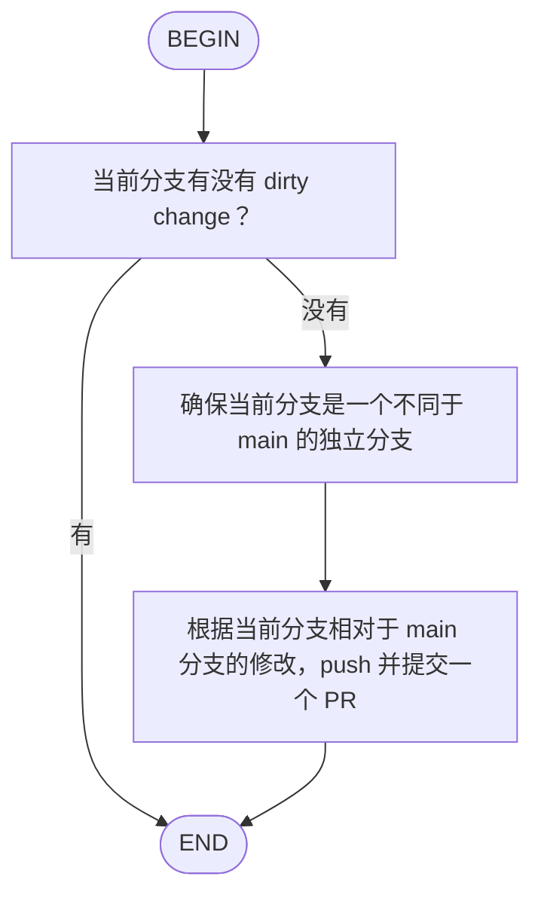

# Kimi CLI 的 Flow 架构设计详解

## 引言：为什么选择 Flow 而非 Plan/Execute

Kimi CLI 采用了与其他主流 AI Coding Agent 截然不同的架构设计。当 Codex、Gemini CLI 和 OpenCode 都在探索"Plan and Execute"模式时，Kimi CLI 选择了一条独特的路径：**基于可视化流程图（Flow）的工作流编排**。

这种设计不是简单的技术选型差异，而是源于对"Agent 如何工作"这一根本问题的不同理解。

---

## 一、设计哲学：声明式 vs 命令式

### 1.1 核心设计目标

Kimi CLI 的设计者在 KLIP-10 文档中明确阐述了 Flow 架构的初衷：

> "当前 Kimi CLI 只能通过交互式输入或 `--command` 单次输入驱动对话。**希望支持一种 'agent flow'，让用户用 Mermaid 或 D2 flowchart 描述流程**，每个节点对应一次对话轮次，并能根据分支节点的选择继续走向不同的下一节点。"

这一设计目标揭示了 Flow 架构的三个核心哲学：

| 哲学 | 说明 |
|-----|------|
| **可视化优先** | 用流程图而非代码定义工作流，降低使用门槛 |
| **声明式定义** | 描述"是什么"而非"怎么做"，让 Agent 决定具体执行 |
| **会话连续性** | 在同一 session 中自动推进，保持上下文状态 |

### 1.2 与 Plan/Execute 的本质区别

```
Plan/Execute 模式 (Codex/Gemini CLI/OpenCode):
┌──────────┐     ┌──────────┐     ┌──────────┐
│  用户输入  │ ──▶ │  Plan    │ ──▶ │ Execute  │
└──────────┘     │  Phase   │     │  Phase   │
                 └──────────┘     └──────────┘
                      │                 │
                      ▼                 ▼
                 只读探索            修改执行
                 制定方案            按计划实施

Flow 模式 (Kimi CLI):
┌──────────┐     ┌──────────┐     ┌──────────┐     ┌──────────┐
│  BEGIN   │ ──▶ │  task    │ ──▶ │ decision │ ──▶ │   END    │
└──────────┘     └──────────┘     └──────────┘     └──────────┘
                      │                 │
                      ▼                 ▼
                 执行节点提示词      根据条件分支
                 获取 observation    选择下一节点
```

**关键差异**：
- **Plan/Execute** 强调"阶段分离"——先想清楚，再动手做
- **Flow** 强调"流程编排"——按预定义步骤自动执行，支持条件分支

---

## 二、Flow 架构核心设计

### 2.1 节点类型系统

Flow 架构定义了四种核心节点类型，每种都有明确的语义和执行行为：

```python
FlowNodeKind = Literal["begin", "end", "task", "decision"]

@dataclass(frozen=True, slots=True)
class FlowNode:
    id: str
    label: str | list[ContentPart]  # 支持富文本
    kind: FlowNodeKind
```

| 节点类型 | 视觉形态 | 出边数量 | 执行行为 |
|---------|---------|---------|---------|
| **BEGIN** | `([BEGIN])` | 恰好 1 条 | 入口点，自动转移到下一节点 |
| **END** | `([END])` | 0 条 | 终止 Flow，退出执行 |
| **TASK** | `[description]` | 恰好 1 条 | 将 label 作为 prompt 执行，获取 observation |
| **DECISION** | `{condition}` | 2+ 条 | 要求 Agent 选择分支，每条边必须有唯一 label |

### 2.2 决策节点的设计巧思

Decision 节点是 Flow 架构中最独特的设计。它通过**显式选择标签**实现确定性分支：

```python
@staticmethod
def _build_flow_prompt(node: FlowNode, edges: list[FlowEdge]) -> str | list[ContentPart]:
    if node.kind != "decision":
        return node.label

    choices = [edge.label for edge in edges if edge.label]
    lines = [
        label_text,
        "",
        "Available branches:",
        *(f"- {choice}" for choice in choices),
        "",
        "Reply with a choice using <choice>...</choice>.",
    ]
    return "\n".join(lines)
```

Agent 的回复必须包含 `<choice>分支名</choice>`，系统通过正则表达式提取：

```python
_CHOICE_RE = re.compile(r"<choice>([^<]*)</choice>")

def parse_choice(text: str) -> str | None:
    matches = _CHOICE_RE.findall(text or "")
    if not matches:
        return None
    return matches[-1].strip()  # 使用最后一个匹配，避免解释性内容干扰
```

**设计亮点**：
- **确定性**：通过标签匹配而非意图理解，确保执行路径可预测
- **容错性**：选择无效时自动重试，附加纠正性提示词
- **可解释性**：Agent 可以在 choice 标签外解释选择原因

### 2.3 执行引擎：FlowRunner

FlowRunner 是 Flow 架构的执行核心，采用**遍历解释器**模式：

```python
async def run(self, soul: KimiSoul, args: str) -> None:
    current_id = self._flow.begin_id
    moves = 0
    total_steps = 0

    while True:
        node = self._flow.nodes[current_id]
        edges = self._flow.outgoing.get(current_id, [])

        if node.kind == "end":
            return  # 正常终止

        if node.kind == "begin":
            current_id = edges[0].dst
            continue

        if moves >= self._max_moves:
            raise MaxStepsReached(total_steps)  # 防死循环

        next_id, steps_used = await self._execute_flow_node(soul, node, edges)
        moves += 1
        current_id = next_id
```

**关键设计决策**：
- **单 session 连续执行**：所有节点共享同一个 KimiSoul 上下文
- **步数限制**：默认 `max_moves=1000`，防止无限循环
- **状态外化**：不维护复杂的内部状态，通过节点遍历实现控制流

---

## 三、Ralph 模式：自动迭代的创新设计

### 3.1 什么是 Ralph 模式

Ralph 模式是 Kimi CLI 最具创新性的特性之一。它通过 `--max-ralph-iterations` 参数启用，让 Agent **自动持续工作**，直到任务完成。

```
用户输入: "修复这个 bug"
    │
    ▼
┌──────────┐
│  BEGIN   │
└────┬─────┘
     │
     ▼
┌──────────┐     ┌──────────┐
│    R1    │────▶│    R2    │
│ 执行用户   │     │ 决策节点 │
│  prompt  │     │ CONTINUE?│
└──────────┘     │  / STOP? │
     ▲           └────┬─────┘
     │                │
     └────────────────┘
          (循环直到 STOP)
```

### 3.2 实现机制

Ralph 模式本质上是一个**动态生成的 Flow**：

```python
@staticmethod
def ralph_loop(
    user_message: Message,
    max_ralph_iterations: int,
) -> FlowRunner:
    prompt_text = Message(role="user", content=prompt_content).extract_text(" ").strip()
    total_runs = max_ralph_iterations + 1
    if max_ralph_iterations < 0:
        total_runs = 1000000000000000  # 实际上无限

    nodes: dict[str, FlowNode] = {
        "BEGIN": FlowNode(id="BEGIN", label="BEGIN", kind="begin"),
        "END": FlowNode(id="END", label="END", kind="end"),
        "R1": FlowNode(id="R1", label=prompt_content, kind="task"),
        "R2": FlowNode(
            id="R2",
            label=(
                f"{prompt_text}. (You are running in an automated loop... "
                "Only choose STOP when the task is fully complete. "
                "If you are not 100% sure, choose CONTINUE.)"
            ).strip(),
            kind="decision",
        ),
    }

    outgoing = {
        "BEGIN": [FlowEdge(src="BEGIN", dst="R1", label=None)],
        "R1": [FlowEdge(src="R1", dst="R2", label=None)],
        "R2": [
            FlowEdge(src="R2", dst="R2", label="CONTINUE"),  # 自循环
            FlowEdge(src="R2", dst="END", label="STOP"),
        ],
    }

    return FlowRunner(flow, max_moves=total_runs)
```

### 3.3 设计意义

Ralph 模式解决了 Agent 工作流中的一个经典问题：**如何知道任务已经完成？**

传统做法是让 Agent 执行固定步数，或者依赖外部信号。Ralph 模式让 Agent **自己判断完成状态**，通过 CONTINUE/STOP 决策实现自我评估。

**与 OpenCode 的 resetTimeoutOnProgress 对比**：
- OpenCode：被动重置超时计时器，适合长时间运行任务
- Kimi Ralph：主动自我评估，适合需要多轮迭代的任务

---

## 四、Flow 与标准 Skill 的对比

Kimi CLI 的 Skill 系统分为两个层次：

| 特性 | 标准 Skill | Flow Skill |
|-----|-----------|-----------|
| **类型声明** | `type: standard` (默认) | `type: flow` (必须显式声明) |
| **调用方式** | `/skill:<name>` | `/flow:<name>` |
| **执行模式** | 单次 prompt 注入 | 多轮自动执行 |
| **结构** | Markdown 文档 | Markdown + Mermaid/D2 流程图 |
| **交互方式** | Agent 自动判断使用时机 | 用户显式启动 |
| **终止条件** | 无 (被动技能) | 到达 END 节点 (主动执行) |

### 4.1 Flow Skill 示例

以 PR 创建 Skill 为例：

```markdown
---
name: pull-request
description: Create and submit a GitHub Pull Request.
type: flow
---


```

**执行流程**：
1. 用户输入 `/flow:pull-request`
2. FlowRunner 从 BEGIN 开始遍历
3. 执行 task 节点，获取 observation
4. 到达 decision 节点，Agent 选择"有"或"没有"
5. 根据选择跳转到对应分支
6. 到达 END，Flow 终止

---

## 五、与其他 Agent 的深度对比

### 5.1 架构模式对比

```
┌─────────────────────────────────────────────────────────────────────┐
│                        Agent 工作流架构对比                           │
├─────────────────────────────────────────────────────────────────────┤
│                                                                      │
│  Kimi CLI (Flow 编排)                                              │
│  ┌─────────────────────────────────────────────────────────────┐   │
│  │  声明式: Mermaid/D2 流程图                                   │   │
│  │  ┌─────┐    ┌─────┐    ┌─────────┐    ┌─────┐              │   │
│  │  │BEGIN│───▶│task │───▶│decision │───▶│END  │              │   │
│  │  └─────┘    └─────┘    └────┬────┘    └─────┘              │   │
│  │                            │                                │   │
│  │                       ┌────┴────┐                          │   │
│  │                       ▼         ▼                          │   │
│  │                    分支A      分支B                         │   │
│  └─────────────────────────────────────────────────────────────┘   │
│                              │                                       │
│                              ▼                                       │
│  特点: 预定义流程、支持分支、自动执行、可视化定义                          │
│                                                                      │
├─────────────────────────────────────────────────────────────────────┤
│                                                                      │
│  Codex/Gemini CLI (Plan/Execute)                                   │
│  ┌─────────────────────────────────────────────────────────────┐   │
│  │  命令式: 配置切换                                            │   │
│  │                                                             │   │
│  │   ┌──────────────┐          ┌──────────────┐               │   │
│  │   │   PLAN MODE  │ ────────▶│ EXECUTE MODE │               │   │
│  │   │  • 只读探索   │  显式    │  • 修改执行   │               │   │
│  │   │  • 制定方案   │  切换    │  • 按方案实施  │               │   │
│  │   └──────────────┘          └──────────────┘               │   │
│  └─────────────────────────────────────────────────────────────┘   │
│                              │                                       │
│                              ▼                                       │
│  特点: 阶段分离、权限隔离、用户确认、安全第一                            │
│                                                                      │
├─────────────────────────────────────────────────────────────────────┤
│                                                                      │
│  SWE-agent (Thought-Action)                                        │
│  ┌─────────────────────────────────────────────────────────────┐   │
│  │  反应式: 每步重新思考                                         │   │
│  │                                                             │   │
│  │   Step 1        Step 2        Step 3                        │   │
│  │  ┌─────┐      ┌─────┐      ┌─────┐                         │   │
│  │  │think│─────▶│act  │─────▶│obs  │─────▶ ...                │   │
│  │  └─────┘      └─────┘      └─────┘                         │   │
│  │                                                             │   │
│  │  (无显式阶段，thought 中隐式包含规划)                         │   │
│  └─────────────────────────────────────────────────────────────┘   │
│                              │                                       │
│                              ▼                                       │
│  特点: 灵活探索、边想边做、适应变化、适合未知领域                        │
│                                                                      │
└─────────────────────────────────────────────────────────────────────┘
```

### 5.2 特性矩阵对比

| 特性 | Kimi CLI | Codex | Gemini CLI | OpenCode | SWE-agent |
|-----|----------|-------|-----------|----------|-----------|
| **工作流定义** | Mermaid/D2 图 | 模式枚举 | TOML 策略 | Agent 切换 | 模板引导 |
| **分支支持** | ✅ 原生支持 | ❌ 不支持 | ❌ 不支持 | ❌ 不支持 | ❌ 不支持 |
| **自动迭代** | ✅ Ralph 模式 | ❌ 不支持 | ❌ 不支持 | ⚠️ 超时重置 | ⚠️ 重试机制 |
| **可视化** | ✅ 流程图 | ❌ 无 | ❌ 无 | ❌ 无 | ❌ 无 |
| **用户干预点** | 每个决策节点 | 模式切换时 | 策略触发时 | Agent 切换时 | 每步执行前 |
| **状态管理** | 节点遍历 | 配置切换 | Config + 文件 | Agent 切换 | Trajectory 累积 |
| **多轮自动执行** | ✅ 是 | ❌ 否 | ❌ 否 | ❌ 否 | ⚠️ 是 |

### 5.3 适用场景对比

| Agent | 最佳适用 | 核心优势 |
|-------|---------|---------|
| **Kimi CLI** | 标准化流程自动化 | 流程可视化、自动迭代、分支决策 |
| **Codex** | 严格预规划的大型任务 | 安全隔离、用户确认 |
| **Gemini CLI** | 需要灵活策略配置的场景 | 细粒度权限控制、策略可配置 |
| **OpenCode** | 需要并行探索的复杂任务 | Agent 类型分离、权限清晰 |
| **SWE-agent** | Bug 修复等探索性任务 | 灵活适应、轻量级 |

---

## 六、Kimi CLI Flow 架构的独特优势

### 6.1 可视化即代码

与其他 Agent 使用 YAML/JSON 定义工作流不同，Kimi CLI 使用 Mermaid/D2 流程图：

**优势**：
- **可读性**：非技术人员也能理解流程
- **可维护性**：修改流程图比修改代码更简单
- **文档化**：流程图本身就是文档

### 6.2 渐进式技能披露

Flow Skill 继承了三层披露系统：

```
第一层: 元数据 (metadata)
   └── name, description, type

第二层: SKILL.md 正文
   └── 流程图定义 + 说明文字

第三层: 打包资源 (bundled resources)
   └── 示例代码、模板文件等
```

这种设计确保即使复杂的 Flow 也不会占用过多上下文窗口。

### 6.3 双重解析器支持

Kimi CLI 同时支持 Mermaid 和 D2 两种语法：

- **Mermaid**：Markdown 生态中最流行的流程图语法
- **D2**：更强大的文本图表工具，支持更复杂的布局

这种灵活性让用户可以根据喜好选择。

### 6.4 内置安全机制

| 机制 | 实现 | 作用 |
|-----|------|------|
| **结构验证** | `validate_flow()` | 确保只有一个 BEGIN/END，END 可达 |
| **边标签唯一性** | 运行时检查 | 防止决策节点分支歧义 |
| **最大步数限制** | `max_moves=1000` | 防止死循环 |
| **无效选择重试** | 纠正性提示词 | 容错执行 |

---

## 七、设计启示

### 7.1 不同问题的不同解法

Kimi CLI 的 Flow 架构揭示了一个重要观点：**不是所有任务都需要 Plan/Execute**。

- **Plan/Execute** 适合"探索-确认-执行"类任务（如实现新功能）
- **Flow 编排** 适合"标准化流程自动化"类任务（如发布流程、代码审查）
- **Thought-Action** 适合"探索性"任务（如 Bug 修复）

### 7.2 用户体验优先

Kimi CLI 选择 Mermaid/D2 作为工作流定义语言，体现了**用户体验优先**的设计理念：

> 与其让开发者学习新的 DSL，不如复用他们已经熟悉的工具。

### 7.3 灵活与结构的平衡

Flow 架构在灵活性和结构之间找到了平衡点：

- **结构**：预定义的节点类型和验证规则确保执行可靠性
- **灵活**：决策节点的分支逻辑由 Agent 动态决定

---

## 八、总结

Kimi CLI 的 Flow 架构是一种**独特且深思熟虑的设计选择**。它不是 Plan/Execute 的替代品，而是面向不同问题域的解决方案。

**核心设计亮点**：
1. **可视化流程图**降低工作流定义门槛
2. **决策节点**实现确定性分支选择
3. **Ralph 模式**创新性地解决自动迭代问题
4. **双重解析器**提供语法灵活性
5. **渐进式披露**优化上下文使用效率

**与其他 Agent 的本质差异**：
- Codex/Gemini CLI/OpenCode 关注"**如何安全地执行**"
- Kimi CLI 关注"**如何优雅地编排**"
- SWE-agent 关注"**如何灵活地探索**"

理解这些差异，能帮助开发者在设计自己的 Agent 系统时做出正确选择。

---

*文档版本: 2026-02-22*
*参考源码: kimi-cli (commit: 2026-02-08 baseline)*
