# Kimi CLI Flow 架构设计详解

> **阅读指南**
>
> | 属性 | 说明 |
> |-----|------|
> | 预计阅读 | 25-35 分钟 |
> | 前置文档 | `docs/kimi-cli/04-kimi-cli-agent-loop.md`、`docs/kimi-cli/07-kimi-cli-memory-context.md` |
> | 文档结构 | 速览 → 架构 → 机制 → 实现 → 对比 |
> | 代码呈现 | 关键代码直接展示，完整代码可折叠查看 |

---

## TL;DR（结论先行）

**一句话定义**：Flow 架构是 Kimi CLI 基于可视化流程图（Mermaid/D2）的工作流编排系统，让 Agent 能够按预定义步骤自动执行并支持条件分支决策。

Kimi CLI 的核心取舍：**声明式 Flow 编排**（对比 Codex/Gemini CLI/OpenCode 的 Plan/Execute 模式、SWE-agent 的 Thought-Action 模式）

### 核心要点速览

| 维度 | 关键决策 | 代码位置 |
|-----|---------|---------|
| 流程定义 | Mermaid/D2 语法，声明式流程图 | `kimi-cli/src/kimi_cli/skill/flow/mermaid.py:41` |
| 节点类型 | BEGIN/END/TASK/DECISION 四种 | `kimi-cli/src/kimi_cli/skill/flow/__init__.py:9` |
| 执行模式 | 遍历解释器模式，状态外化 | `kimi-cli/src/kimi_cli/soul/kimisoul.py:594` |
| 分支决策 | 标签匹配（非意图理解） | `kimi-cli/src/kimi_cli/soul/kimisoul.py:698` |
| 安全限制 | max_moves=1000 防止死循环 | `kimi-cli/src/kimi_cli/soul/kimisoul.py:66-67` |

---

## 1. 为什么需要这个机制？（解决什么问题）

### 1.1 问题场景

没有 Flow 架构时，用户驱动 Agent 工作流的方式有限：

```
传统方式：
  用户: "帮我创建 PR" → LLM 单次回答 → 结束（可能需要多轮手动引导）

Flow 方式：
  用户: "/flow:pull-request" → FlowRunner 自动执行：
    → 检查 dirty changes → 决策分支
    → 创建分支 → 推送代码
    → 提交 PR → 到达 END
```

### 1.2 核心挑战

| 挑战 | 不解决的后果 |
|-----|-------------|
| 标准化流程难以自动化 | 每次执行相同流程都需要人工逐步引导 |
| 分支决策缺乏结构化 | Agent 自由度过高，执行路径不可预测 |
| 多轮任务需要持续交互 | 用户必须始终在线等待每一步完成 |
| 流程定义门槛高 | 非技术人员难以理解和修改工作流 |

---

## 2. 整体架构

### 2.1 在系统中的位置

```text
┌─────────────────────────────────────────────────────────────┐
│ CLI 入口 / Session Runtime                                   │
│ kimi-cli/src/kimi_cli/soul/kimisoul.py:457                  │
└───────────────────────┬─────────────────────────────────────┘
                        │ 调用 /flow:<skill> 或 /ralph
                        ▼
┌─────────────────────────────────────────────────────────────┐
│ ▓▓▓ Flow 架构 ▓▓▓                                           │
│ kimi-cli/src/kimi_cli/soul/kimisoul.py:542                  │
│ - FlowRunner.run()      : 遍历执行入口                      │
│ - FlowRunner.ralph_loop(): 动态生成 Ralph Flow              │
│ - _execute_flow_node()  : 单节点执行                        │
│ - _build_flow_prompt()  : 决策节点提示词构建                 │
└───────────────────────┬─────────────────────────────────────┘
                        │
        ┌───────────────┼───────────────┐
        ▼               ▼               ▼
┌──────────────┐ ┌──────────────┐ ┌──────────────┐
│ Flow Parser  │ │ KimiSoul     │ │ Skill System │
│ Mermaid/D2   │ │ Agent Loop   │ │ Skill 加载   │
└──────────────┘ └──────────────┘ └──────────────┘
```

### 2.2 核心组件职责

| 组件 | 职责 | 代码位置 |
|-----|------|---------|
| `FlowNode` | 定义流程节点（BEGIN/END/TASK/DECISION） | `kimi-cli/src/kimi_cli/skill/flow/__init__.py:24` |
| `FlowEdge` | 定义节点间有向边，支持标签 | `kimi-cli/src/kimi_cli/skill/flow/__init__.py:31` |
| `Flow` | 流程图数据结构，包含节点和边 | `kimi-cli/src/kimi_cli/skill/flow/__init__.py:38` |
| `FlowRunner` | 流程执行引擎，遍历解释器模式 | `kimi-cli/src/kimi_cli/soul/kimisoul.py:542` |
| `validate_flow()` | 流程图结构验证（BEGIN/END 唯一性、可达性） | `kimi-cli/src/kimi_cli/skill/flow/__init__.py:56` |
| `parse_mermaid_flowchart()` | Mermaid 语法解析器 | `kimi-cli/src/kimi_cli/skill/flow/mermaid.py:41` |
| `parse_d2_flowchart()` | D2 语法解析器 | `kimi-cli/src/kimi_cli/skill/flow/d2.py:54` |

### 2.3 核心组件交互关系

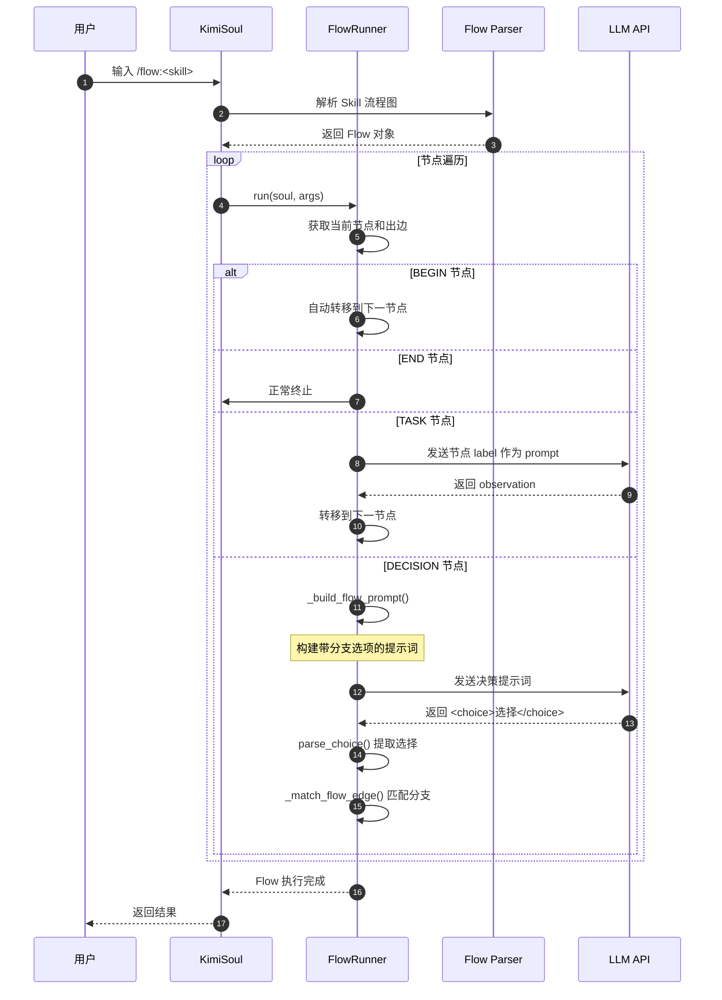

**关键交互说明**：

| 步骤 | 交互内容 | 设计意图 |
|-----|---------|---------|
| 1 | 用户触发 Flow Skill | 通过 `/flow:` 前缀显式启动，区别于标准 Skill |
| 2-3 | 解析流程图定义 | 支持 Mermaid/D2 两种语法，灵活适配用户习惯 |
| 4-5 | 遍历执行节点 | 状态外化，通过节点遍历实现控制流，无需复杂状态机 |
| 6-9 | 决策节点交互 | Agent 主动选择分支，通过标签匹配确保确定性 |

---

## 3. 核心组件详细分析

### 3.1 FlowRunner 内部结构

#### 职责定位

FlowRunner 是 Flow 架构的执行核心，采用**遍历解释器**模式，负责按顺序执行流程节点并处理分支决策。

#### 状态机图

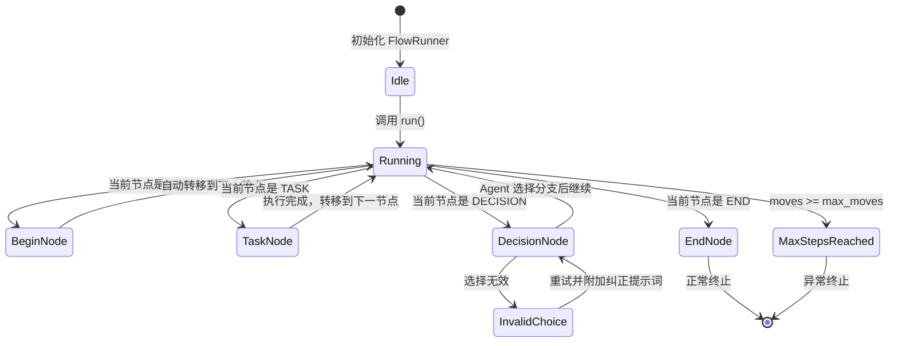

**状态说明**：

| 状态 | 说明 | 进入条件 | 退出条件 |
|-----|------|---------|---------|
| Idle | 初始化完成 | FlowRunner 创建 | 调用 run() |
| Running | 遍历执行中 | 开始执行或完成一个节点 | 到达 END 或异常 |
| BeginNode | 处理入口节点 | 当前节点 kind="begin" | 自动转移 |
| TaskNode | 执行任务节点 | 当前节点 kind="task" | 获得 observation |
| DecisionNode | 处理决策节点 | 当前节点 kind="decision" | 获得有效选择 |
| InvalidChoice | 选择无效 | Agent 返回无效 choice | 重试 |
| EndNode | 到达终止节点 | 当前节点 kind="end" | 正常结束 |
| MaxStepsReached | 超过步数限制 | moves >= max_moves | 抛出异常 |

#### 内部数据流

```text
┌─────────────────────────────────────────────────────────────┐
│  输入层                                                      │
│  ├── Flow 对象 (nodes, outgoing, begin_id, end_id)           │
│  └── max_moves (默认 1000)                                   │
└──────────────────────────┬──────────────────────────────────┘
                           ▼
┌─────────────────────────────────────────────────────────────┐
│  遍历执行层                                                  │
│  ├── 主循环: while True 遍历节点                              │
│  │   ├── BEGIN: 自动转移 edges[0].dst                        │
│  │   ├── END: 正常返回                                       │
│  │   ├── TASK: _execute_flow_node() -> 单步执行              │
│  │   └── DECISION: _execute_flow_node() -> 分支选择          │
│  ├── 步数计数: moves++, total_steps += steps_used            │
│  └── 安全限制: if moves >= max_moves 抛出异常                │
└──────────────────────────┬──────────────────────────────────┘
                           ▼
┌─────────────────────────────────────────────────────────────┐
│  节点执行层 (_execute_flow_node)                              │
│  ├── 构建 prompt: _build_flow_prompt()                       │
│  ├── 调用 LLM: _flow_turn() -> soul._turn()                  │
│  ├── 决策处理: parse_choice() + _match_flow_edge()           │
│  └── 无效选择重试: 附加纠正性提示词                          │
└─────────────────────────────────────────────────────────────┘
```

#### 关键算法逻辑

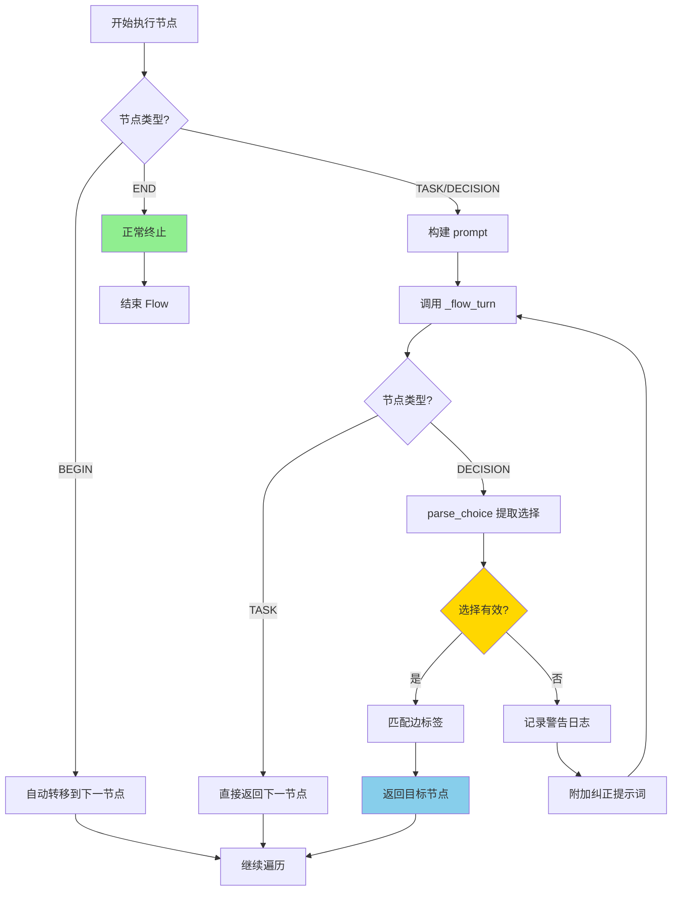

**算法要点**：

1. **分支选择逻辑**：DECISION 节点通过标签匹配而非意图理解，确保执行路径可预测
2. **容错机制**：无效选择时自动重试，附加纠正性提示词引导 Agent 正确回复
3. **步数限制**：默认 max_moves=1000，防止死循环

#### 关键接口

| 接口 | 输入 | 输出 | 说明 | 代码位置 |
|-----|------|------|------|---------|
| `run()` | soul, args | None | 遍历执行入口 | `kimi-cli/src/kimi_cli/soul/kimisoul.py:594` |
| `ralph_loop()` | user_message, max_ralph_iterations | FlowRunner | 动态生成 Ralph Flow | `kimi-cli/src/kimi_cli/soul/kimisoul.py:555` |
| `_execute_flow_node()` | soul, node, edges | (next_id, steps_used) | 单节点执行 | `kimi-cli/src/kimi_cli/soul/kimisoul.py:630` |
| `_build_flow_prompt()` | node, edges | str | 构建决策提示词 | `kimi-cli/src/kimi_cli/soul/kimisoul.py:677` |
| `_flow_turn()` | soul, prompt | TurnOutcome | 调用 KimiSoul 执行 | `kimi-cli/src/kimi_cli/soul/kimisoul.py:707` |

---

### 3.2 Flow 数据结构内部结构

#### 职责定位

定义流程图的静态数据结构，支持四种节点类型和带标签的有向边。

#### 节点类型系统

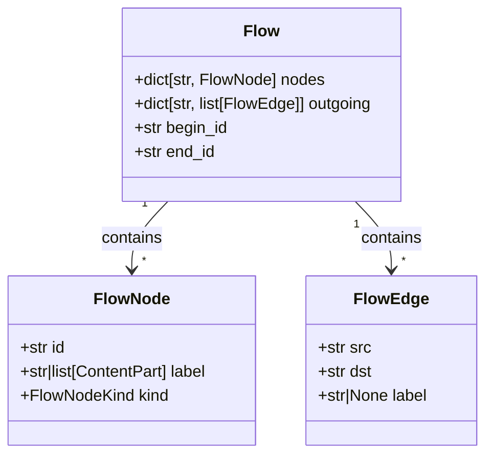

**节点类型定义**：

```python
# kimi-cli/src/kimi_cli/skill/flow/__init__.py:9
FlowNodeKind = Literal["begin", "end", "task", "decision"]
```

| 节点类型 | 视觉形态 | 出边数量 | 执行行为 |
|---------|---------|---------|---------|
| **BEGIN** | `([BEGIN])` | 恰好 1 条 | 入口点，自动转移到下一节点 |
| **END** | `([END])` | 0 条 | 终止 Flow，退出执行 |
| **TASK** | `[description]` | 恰好 1 条 | 将 label 作为 prompt 执行，获取 observation |
| **DECISION** | `{condition}` | 2+ 条 | 要求 Agent 选择分支，每条边必须有唯一 label |

#### 决策节点提示词构建

```python
# kimi-cli/src/kimi_cli/soul/kimisoul.py:677-695
@staticmethod
def _build_flow_prompt(node: FlowNode, edges: list[FlowEdge]) -> str | list[ContentPart]:
    if node.kind != "decision":
        return node.label

    if not isinstance(node.label, str):
        label_text = Message(role="user", content=node.label).extract_text(" ")
    else:
        label_text = node.label
    choices = [edge.label for edge in edges if edge.label]
    lines = [
        label_text,
        "",
        "Available branches:",
        *(f"- {choice}" for choice in choices),
        "",
        "Reply with a choice using <choice>...</choice>.",
    ]
    return "\n".join(lines)
```

#### 选择解析与匹配

```python
# kimi-cli/src/kimi_cli/skill/flow/__init__.py:46-53
_CHOICE_RE = re.compile(r"<choice>([^<]*)</choice>")

def parse_choice(text: str) -> str | None:
    matches = _CHOICE_RE.findall(text or "")
    if not matches:
        return None
    return matches[-1].strip()  # 使用最后一个匹配，避免解释性内容干扰
```

**设计亮点**：
- **确定性**：通过标签匹配而非意图理解，确保执行路径可预测
- **容错性**：选择无效时自动重试，附加纠正性提示词
- **可解释性**：Agent 可以在 choice 标签外解释选择原因

---

### 3.3 组件间协作时序

展示 Flow 解析到执行的完整流程。

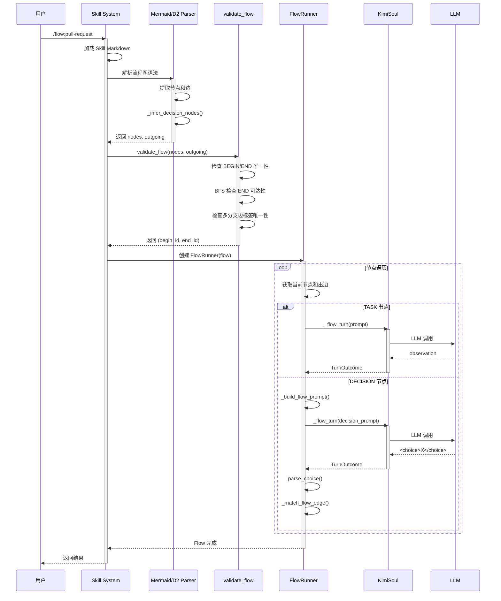

**协作要点**：

1. **Skill System 与 Parser**：Skill System 负责加载 Markdown，Parser 负责提取流程图语法
2. **Parser 与 validate_flow**：解析后必须验证流程图结构合法性
3. **FlowRunner 与 KimiSoul**：FlowRunner 通过 `_flow_turn()` 调用 KimiSoul，保持与标准对话相同的执行路径

---

### 3.4 关键数据路径

#### 主路径（正常流程）

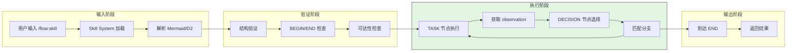

#### 异常路径（错误恢复）

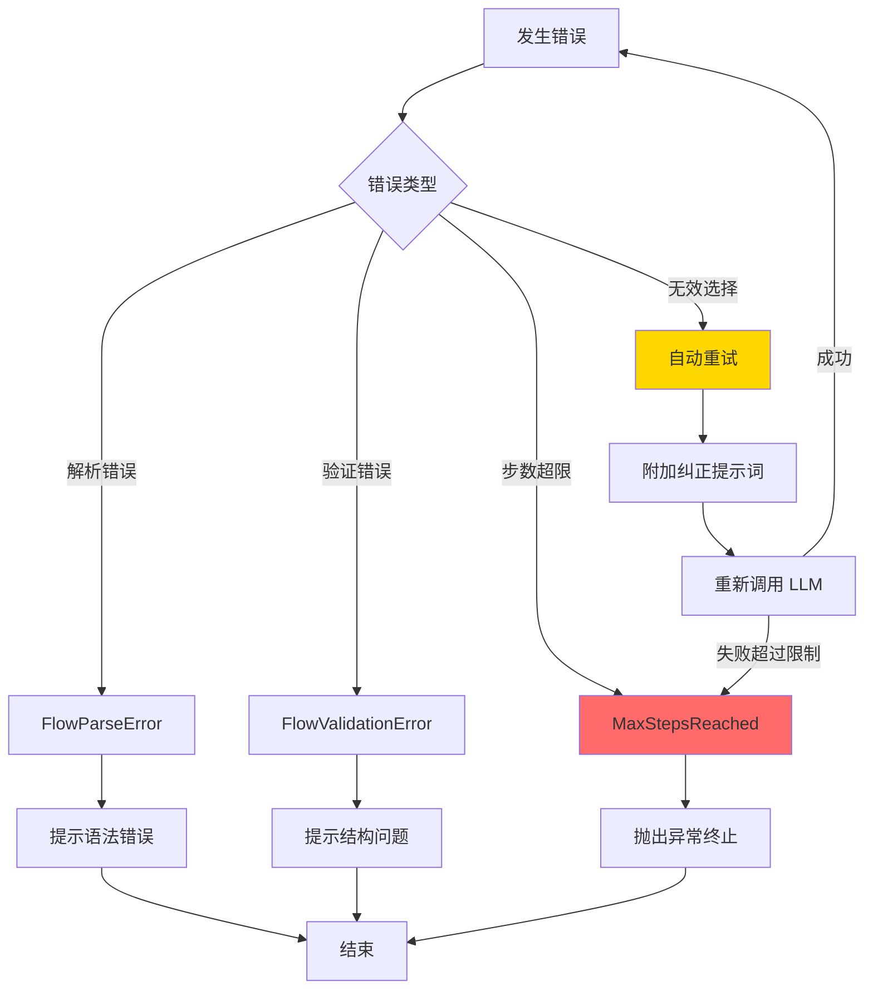

---

## 4. 端到端数据流转

### 4.1 正常流程（详细版）

展示数据从用户输入到 Flow 执行完成的完整变换过程。

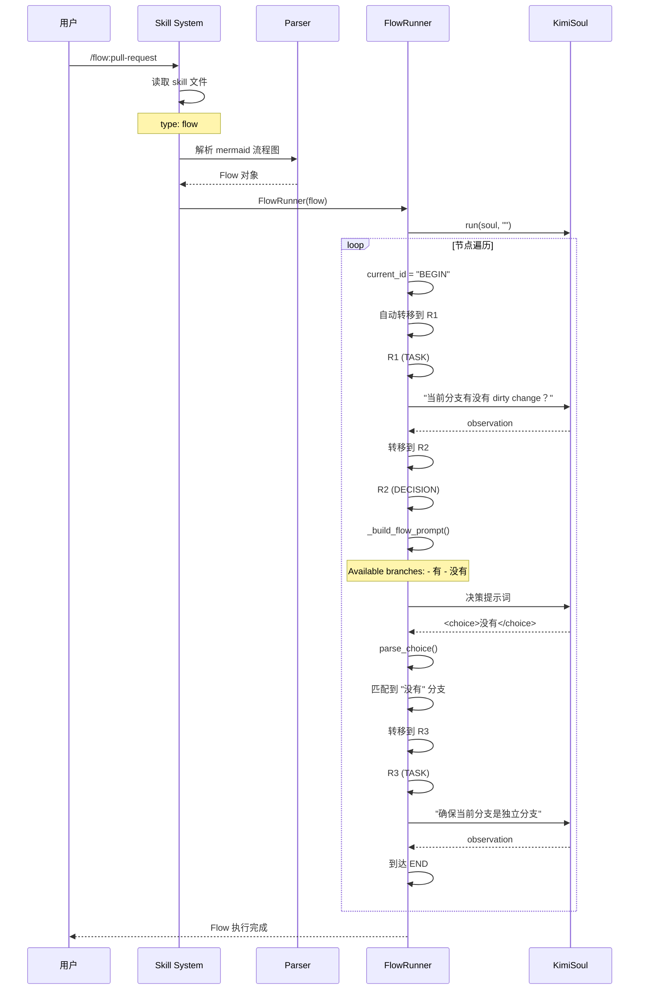

**数据变换详情**：

| 阶段 | 输入 | 处理 | 输出 | 代码位置 |
|-----|------|------|------|---------|
| 接收 | `/flow:skill` | 解析命令，加载 Skill | Skill 对象 | `kimi-cli/src/kimi_cli/soul/kimisoul.py:252` |
| 解析 | Mermaid/D2 文本 | 提取节点和边 | Flow 对象 | `kimi-cli/src/kimi_cli/skill/flow/mermaid.py:41` |
| 验证 | nodes, outgoing | 结构检查 | (begin_id, end_id) | `kimi-cli/src/kimi_cli/skill/flow/__init__.py:56` |
| 执行 | Flow 对象 | 遍历执行 | 多轮对话结果 | `kimi-cli/src/kimi_cli/soul/kimisoul.py:594` |

### 4.2 数据流向图

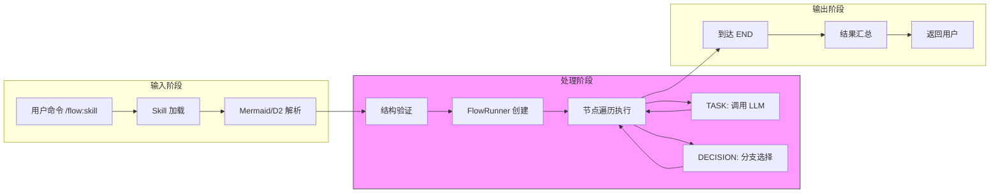

### 4.3 异常/边界流程

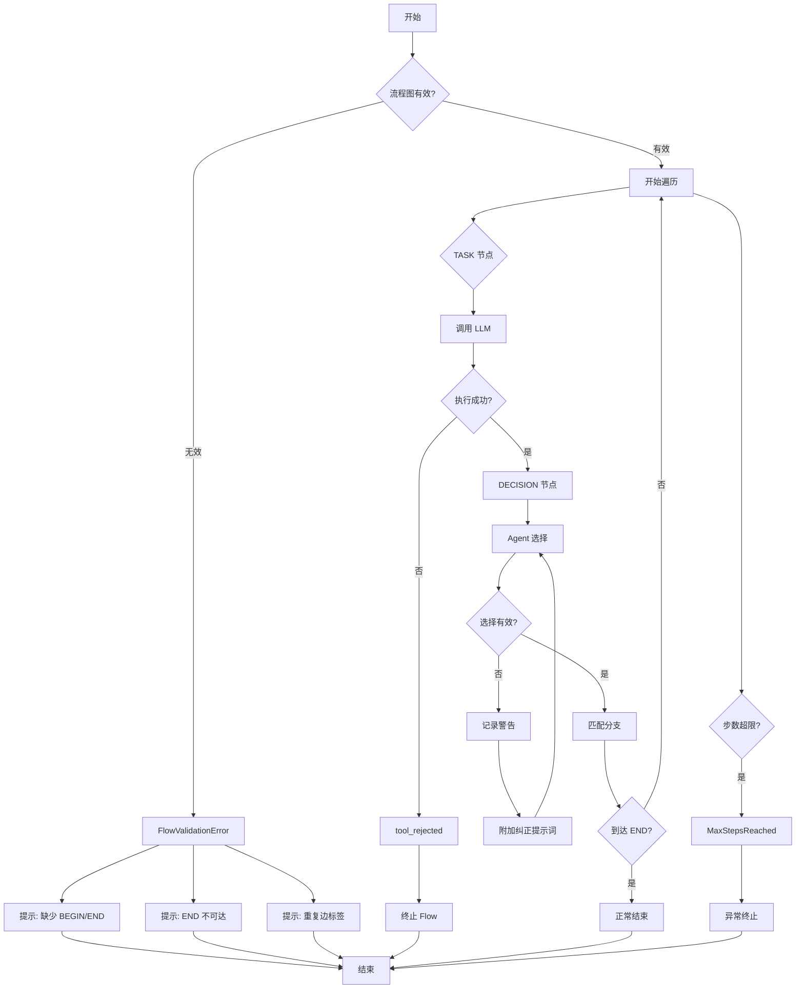

---

## 5. 关键代码实现

### 5.1 核心数据结构

```python
# kimi-cli/src/kimi_cli/skill/flow/__init__.py:9-44
FlowNodeKind = Literal["begin", "end", "task", "decision"]

@dataclass(frozen=True, slots=True)
class FlowNode:
    id: str
    label: str | list[ContentPart]
    kind: FlowNodeKind

@dataclass(frozen=True, slots=True)
class FlowEdge:
    src: str
    dst: str
    label: str | None

@dataclass(slots=True)
class Flow:
    nodes: dict[str, FlowNode]
    outgoing: dict[str, list[FlowEdge]]
    begin_id: str
    end_id: str
```

**字段说明**：

| 字段 | 类型 | 用途 |
|-----|------|------|
| `FlowNode.id` | `str` | 节点唯一标识 |
| `FlowNode.label` | `str \| list[ContentPart]` | 节点显示文本或富文本内容 |
| `FlowNode.kind` | `FlowNodeKind` | 节点类型：begin/end/task/decision |
| `FlowEdge.src` | `str` | 边的起始节点 ID |
| `FlowEdge.dst` | `str` | 边的目标节点 ID |
| `FlowEdge.label` | `str \| None` | 边标签，用于决策节点分支选择 |

### 5.2 主链路代码

```python
# kimi-cli/src/kimi_cli/soul/kimisoul.py:594-628
async def run(self, soul: KimiSoul, args: str) -> None:
    current_id = self._flow.begin_id
    moves = 0
    total_steps = 0

    while True:
        node = self._flow.nodes[current_id]
        edges = self._flow.outgoing.get(current_id, [])

        if node.kind == "end":
            logger.info("Agent flow reached END node {node_id}", node_id=current_id)
            return

        if node.kind == "begin":
            if not edges:
                logger.error('Agent flow BEGIN node has no outgoing edges')
                return
            current_id = edges[0].dst
            continue

        if moves >= self._max_moves:
            raise MaxStepsReached(total_steps)

        next_id, steps_used = await self._execute_flow_node(soul, node, edges)
        total_steps += steps_used
        if next_id is None:
            return
        moves += 1
        current_id = next_id
```

**代码要点**：

1. **遍历解释器模式**：通过 `current_id` 遍历节点，无需复杂状态机
2. **节点类型分发**：BEGIN 自动转移，END 正常终止，TASK/DECISION 执行处理
3. **安全限制**：`max_moves` 防止死循环，默认 1000 步

### 5.3 Ralph 模式动态 Flow 生成

```python
# kimi-cli/src/kimi_cli/soul/kimisoul.py:555-592
@staticmethod
def ralph_loop(
    user_message: Message,
    max_ralph_iterations: int,
) -> FlowRunner:
    prompt_content = list(user_message.content)
    prompt_text = Message(role="user", content=prompt_content).extract_text(" ").strip()
    total_runs = max_ralph_iterations + 1
    if max_ralph_iterations < 0:
        total_runs = 1000000000000000  # effectively infinite

    nodes: dict[str, FlowNode] = {
        "BEGIN": FlowNode(id="BEGIN", label="BEGIN", kind="begin"),
        "END": FlowNode(id="END", label="END", kind="end"),
        "R1": FlowNode(id="R1", label=prompt_content, kind="task"),
        "R2": FlowNode(
            id="R2",
            label=f"{prompt_text}. (You are running in an automated loop...)",
            kind="decision",
        ),
    }
    outgoing = {
        "BEGIN": [FlowEdge(src="BEGIN", dst="R1", label=None)],
        "R1": [FlowEdge(src="R1", dst="R2", label=None)],
        "R2": [
            FlowEdge(src="R2", dst="R2", label="CONTINUE"),  # 自循环
            FlowEdge(src="R2", dst="END", label="STOP"),
        ],
    }

    flow = Flow(nodes=nodes, outgoing=outgoing, begin_id="BEGIN", end_id="END")
    return FlowRunner(flow, max_moves=total_runs)
```

**代码要点**：

1. **动态 Flow 生成**：Ralph 模式本质上是动态生成的两节点 Flow
2. **自循环设计**：R2 的 CONTINUE 分支指向自身，实现自动迭代
3. **自我评估**：Agent 通过 CONTINUE/STOP 决策判断任务完成状态

### 5.4 关键调用链

```text
KimiSoul._handle_slash_command()    [kimi-cli/src/kimi_cli/soul/kimisoul.py:457]
  -> _execute_flow_skill()           [kimi-cli/src/kimi_cli/soul/kimisoul.py:520]
    -> parse_mermaid_flowchart()     [kimi-cli/src/kimi_cli/skill/flow/mermaid.py:41]
      -> validate_flow()             [kimi-cli/src/kimi_cli/skill/flow/__init__.py:56]
    -> FlowRunner.run()              [kimi-cli/src/kimi_cli/soul/kimisoul.py:594]
      -> _execute_flow_node()        [kimi-cli/src/kimi_cli/soul/kimisoul.py:630]
        - _build_flow_prompt()       [kimi-cli/src/kimi_cli/soul/kimisoul.py:677]
        - _flow_turn()               [kimi-cli/src/kimi_cli/soul/kimisoul.py:707]
          - soul._turn()             [kimi-cli/src/kimi_cli/soul/kimisoul.py:712]
        - parse_choice()             [kimi-cli/src/kimi_cli/skill/flow/__init__.py:49]
        - _match_flow_edge()         [kimi-cli/src/kimi_cli/soul/kimisoul.py:698]
```

---

## 6. 设计意图与 Trade-off

### 6.1 Kimi CLI 的选择

| 维度 | Kimi CLI 的选择 | 替代方案 | 取舍分析 |
|-----|----------------|---------|---------|
| 工作流定义 | 声明式 Mermaid/D2 流程图 | YAML/JSON 配置 | 可视化、易理解，但解析复杂度高 |
| 分支决策 | 显式标签匹配 | 意图理解/自然语言 | 确定性高、可预测，但灵活性降低 |
| 执行模式 | 遍历解释器 | 状态机/递归 | 简单直观，但复杂流程支持有限 |
| 自动迭代 | Ralph 模式（动态 Flow） | 固定步数/超时 | Agent 自我评估，但需要额外提示词引导 |
| 多语法支持 | Mermaid + D2 双解析器 | 单一语法 | 灵活性高，但维护成本增加 |

### 6.2 为什么这样设计？

**核心问题**：如何让非技术人员也能定义和修改 Agent 工作流？

**Kimi CLI 的解决方案**：
- 代码依据：`kimi-cli/src/kimi_cli/skill/flow/mermaid.py:41`
- 设计意图：复用用户已熟悉的 Mermaid 流程图语法，降低学习成本
- 带来的好处：
  - 可视化：流程图即文档，直观易懂
  - 可维护：修改流程图比修改代码更简单
  - 生态：复用 Markdown/Mermaid 现有工具链
- 付出的代价：
  - 解析复杂：需要处理多种语法边界情况
  - 功能受限：流程图表达能力不如代码灵活

### 6.3 与其他项目的对比

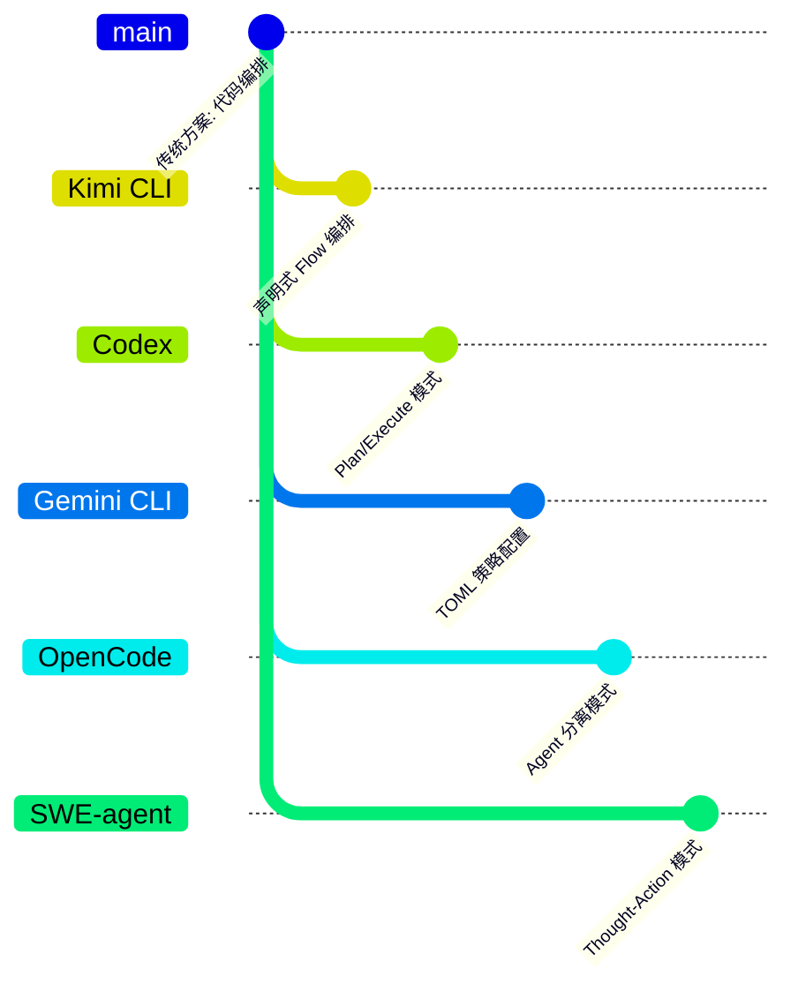

| 项目 | 核心差异 | 适用场景 |
|-----|---------|---------|
| **Kimi CLI** | 声明式 Flow 编排，支持分支决策 | 标准化流程自动化（PR 创建、发布流程） |
| **Codex** | Plan/Execute 阶段分离，用户确认 | 严格预规划的大型任务（安全敏感） |
| **Gemini CLI** | TOML 策略配置，细粒度权限 | 需要灵活策略配置的场景 |
| **OpenCode** | Agent 类型分离，超时重置 | 需要并行探索的复杂任务 |
| **SWE-agent** | Thought-Action 循环，灵活适应 | Bug 修复等探索性任务 |

**特性矩阵对比**：

| 特性 | Kimi CLI | Codex | Gemini CLI | OpenCode | SWE-agent |
|-----|----------|-------|-----------|----------|-----------|
| **工作流定义** | Mermaid/D2 图 | 模式枚举 | TOML 策略 | Agent 切换 | 模板引导 |
| **分支支持** | ✅ 原生支持 | ❌ 不支持 | ❌ 不支持 | ❌ 不支持 | ❌ 不支持 |
| **自动迭代** | ✅ Ralph 模式 | ❌ 不支持 | ❌ 不支持 | ✅ 超时重置 | ✅ 重试机制 |
| **可视化** | ✅ 流程图 | ❌ 无 | ❌ 无 | ❌ 无 | ❌ 无 |
| **用户干预点** | 每个决策节点 | 模式切换时 | 策略触发时 | Agent 切换时 | 每步执行前 |
| **状态管理** | 节点遍历 | 配置切换 | Config + 文件 | Agent 切换 | Trajectory 累积 |
| **多轮自动执行** | ✅ 是 | ❌ 否 | ❌ 否 | ❌ 否 | ✅ 是 |

---

## 7. 边界情况与错误处理

### 7.1 终止条件

| 终止原因 | 触发条件 | 代码位置 |
|---------|---------|---------|
| 正常完成 | 到达 END 节点 | `kimi-cli/src/kimi_cli/soul/kimisoul.py:607-609` |
| 步数超限 | moves >= max_moves (默认 1000) | `kimi-cli/src/kimi_cli/soul/kimisoul.py:621-622` |
| 工具被拒绝 | result.stop_reason == "tool_rejected" | `kimi-cli/src/kimi_cli/soul/kimisoul.py:649-651` |
| 节点无出边 | edges 为空 | `kimi-cli/src/kimi_cli/soul/kimisoul.py:636-641` |
| BEGIN 无出边 | BEGIN 节点 edges 为空 | `kimi-cli/src/kimi_cli/soul/kimisoul.py:612-618` |

### 7.2 超时/资源限制

```python
# kimi-cli/src/kimi_cli/soul/kimisoul.py:66-67
FLOW_COMMAND_PREFIX = "flow:"
DEFAULT_MAX_FLOW_MOVES = 1000

# kimi-cli/src/kimi_cli/soul/kimisoul.py:548
max_moves: int = DEFAULT_MAX_FLOW_MOVES
```

### 7.3 错误恢复策略

| 错误类型 | 处理策略 | 代码位置 |
|---------|---------|---------|
| 解析错误 (FlowParseError) | 抛出异常，提示语法错误 | `kimi-cli/src/kimi_cli/skill/flow/mermaid.py:41` |
| 验证错误 (FlowValidationError) | 抛出异常，提示结构问题 | `kimi-cli/src/kimi_cli/skill/flow/__init__.py:56` |
| 无效选择 | 记录警告，附加纠正提示词重试 | `kimi-cli/src/kimi_cli/soul/kimisoul.py:665-675` |
| 工具拒绝 | 终止 Flow，记录错误 | `kimi-cli/src/kimi_cli/soul/kimisoul.py:649-651` |

---

## 8. 关键代码索引

| 功能 | 文件 | 行号 | 说明 |
|-----|------|------|------|
| 入口 | `kimi-cli/src/kimi_cli/soul/kimisoul.py` | 457 | _handle_slash_command 处理 /flow: 命令 |
| 核心 | `kimi-cli/src/kimi_cli/soul/kimisoul.py` | 542 | FlowRunner 类定义 |
| 核心 | `kimi-cli/src/kimi_cli/soul/kimisoul.py` | 594 | run() 遍历执行入口 |
| 核心 | `kimi-cli/src/kimi_cli/soul/kimisoul.py` | 555 | ralph_loop() 动态 Flow 生成 |
| 核心 | `kimi-cli/src/kimi_cli/soul/kimisoul.py` | 630 | _execute_flow_node() 单节点执行 |
| 核心 | `kimi-cli/src/kimi_cli/soul/kimisoul.py` | 677 | _build_flow_prompt() 决策提示词构建 |
| 核心 | `kimi-cli/src/kimi_cli/soul/kimisoul.py` | 707 | _flow_turn() 调用 KimiSoul |
| 数据结构 | `kimi-cli/src/kimi_cli/skill/flow/__init__.py` | 24 | FlowNode 定义 |
| 数据结构 | `kimi-cli/src/kimi_cli/skill/flow/__init__.py` | 31 | FlowEdge 定义 |
| 数据结构 | `kimi-cli/src/kimi_cli/skill/flow/__init__.py` | 38 | Flow 定义 |
| 解析 | `kimi-cli/src/kimi_cli/skill/flow/__init__.py` | 49 | parse_choice() 选择解析 |
| 验证 | `kimi-cli/src/kimi_cli/skill/flow/__init__.py` | 56 | validate_flow() 结构验证 |
| Mermaid | `kimi-cli/src/kimi_cli/skill/flow/mermaid.py` | 41 | parse_mermaid_flowchart() |
| D2 | `kimi-cli/src/kimi_cli/skill/flow/d2.py` | 54 | parse_d2_flowchart() |
| 常量 | `kimi-cli/src/kimi_cli/soul/kimisoul.py` | 66-67 | FLOW_COMMAND_PREFIX, DEFAULT_MAX_FLOW_MOVES |

---

## 9. 延伸阅读

- 前置知识：`docs/kimi-cli/04-kimi-cli-agent-loop.md` - Kimi CLI Agent Loop 详解
- 相关机制：`docs/kimi-cli/07-kimi-cli-memory-context.md` - 内存与上下文管理
- 深度分析：`docs/kimi-cli/questions/kimi-cli-checkpoint-implementation.md` - Checkpoint 实现分析
- 跨项目对比：`docs/comm/comm-agent-loop.md` - 多项目 Agent Loop 对比

---

*✅ Verified: 基于 kimi-cli/src/kimi_cli/soul/kimisoul.py:542-715、kimi-cli/src/kimi_cli/skill/flow/__init__.py 等源码分析*
*基于版本：kimi-cli (commit: 2026-02-08 baseline) | 最后更新：2026-03-03*
