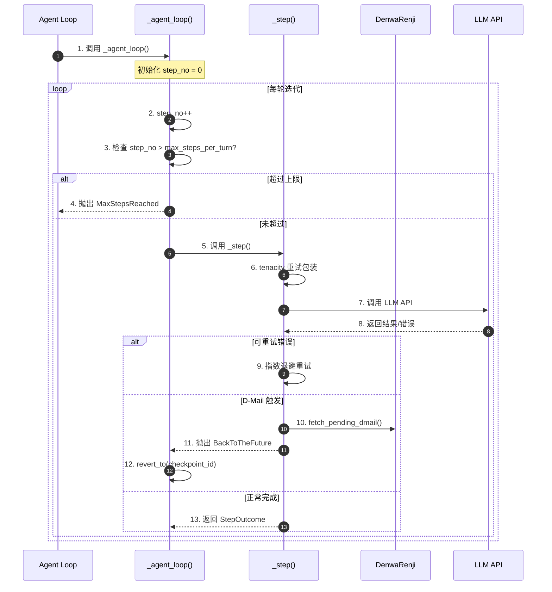
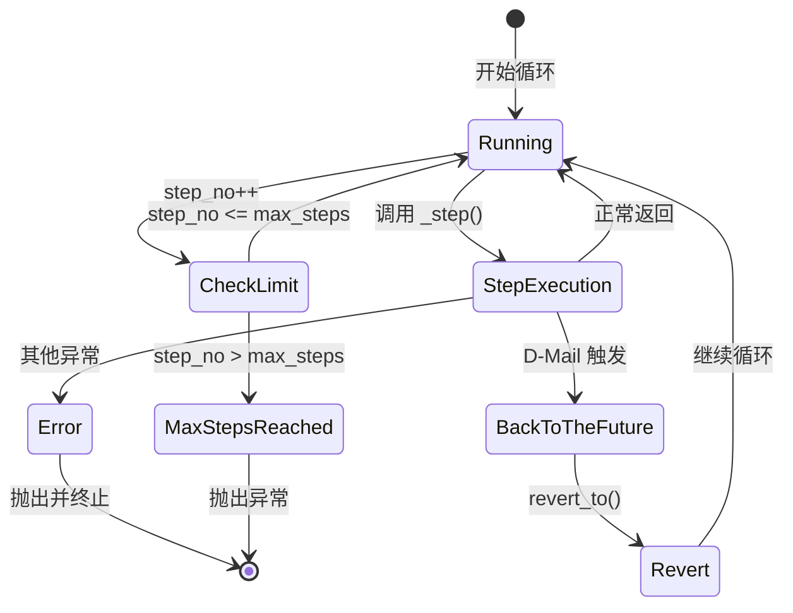
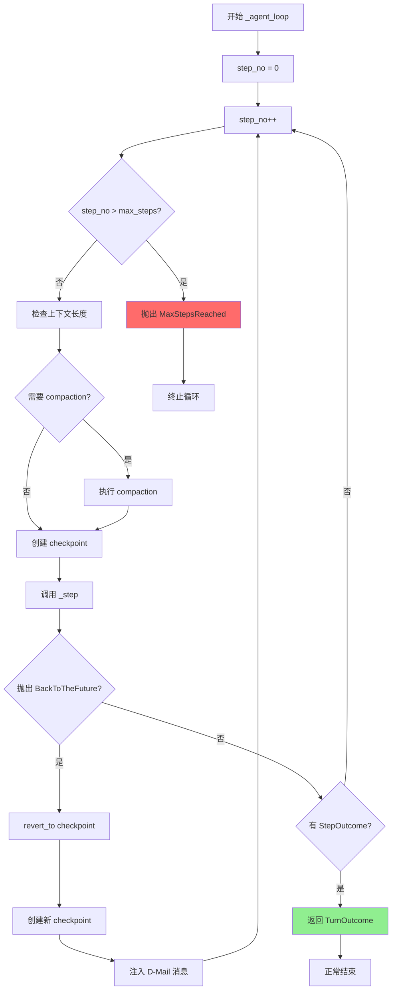
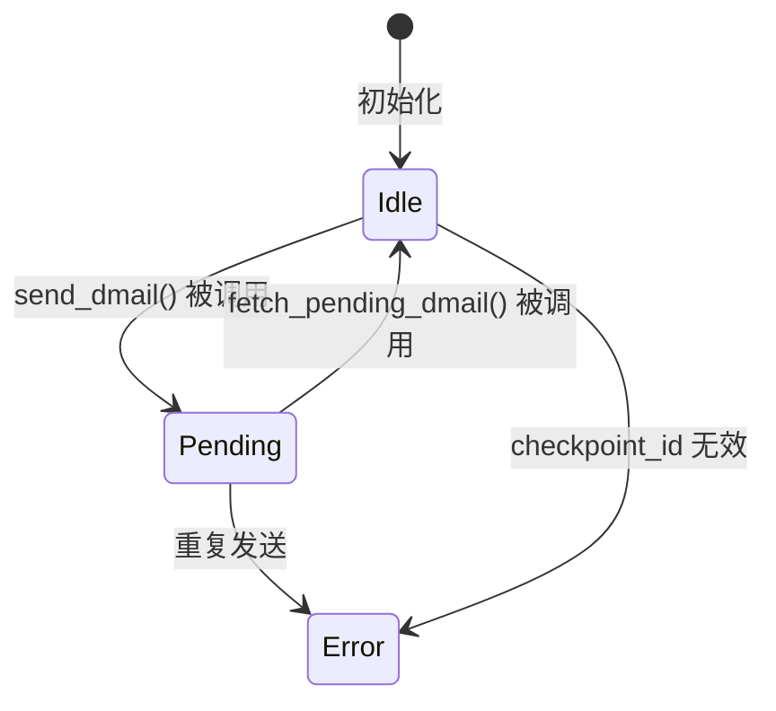
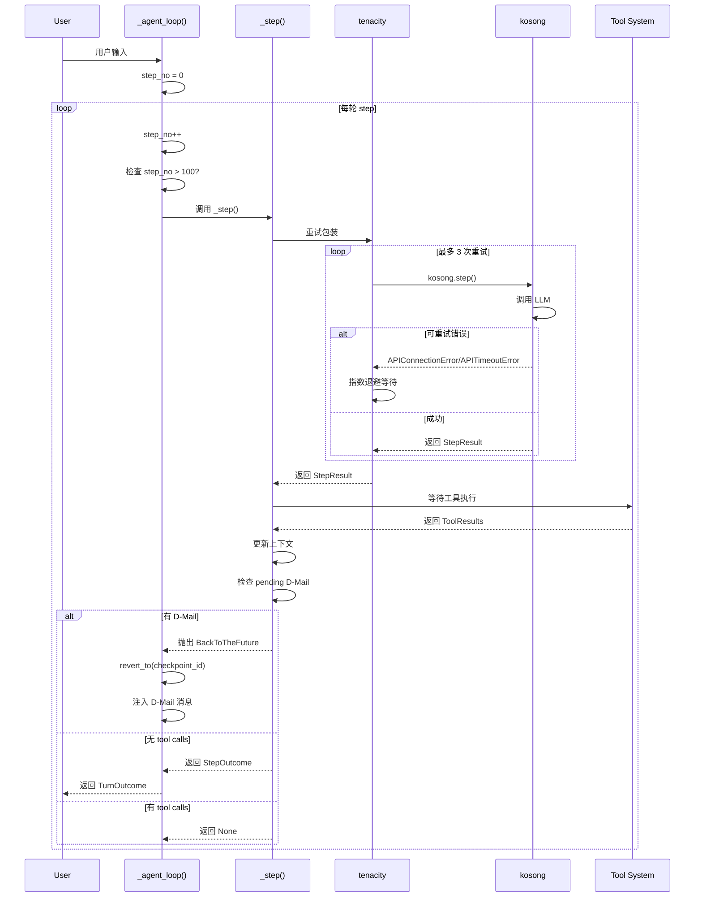
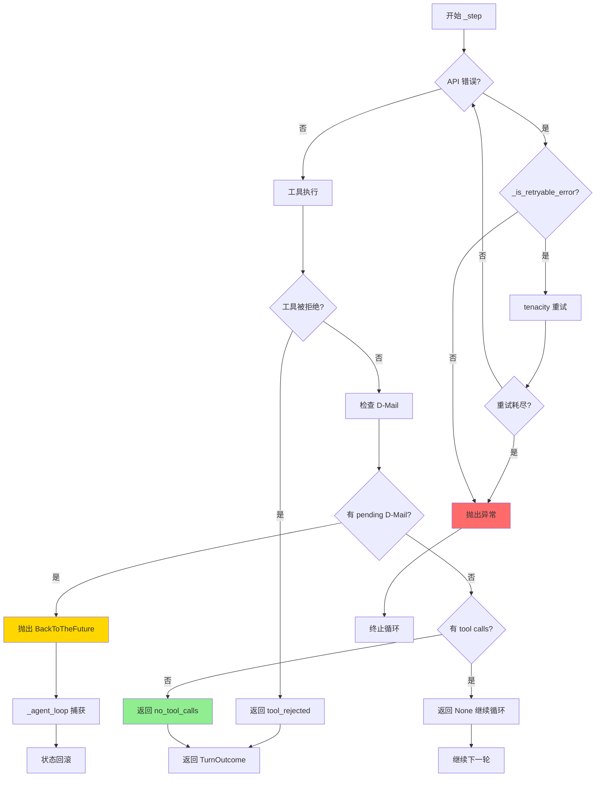
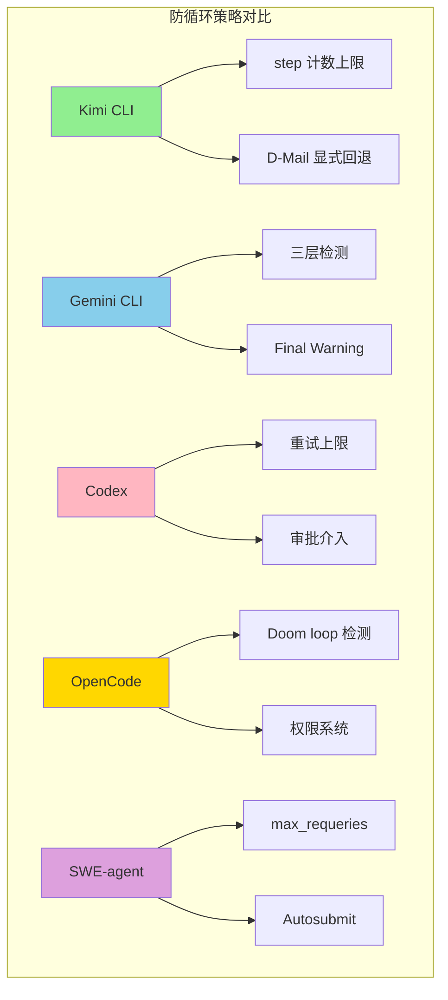

# Kimi CLI 如何避免 Tool 无限循环调用

> **阅读指南**
>
> | 属性 | 说明 |
> |-----|------|
> | 预计阅读 | 15-20 分钟 |
> | 前置文档 | `docs/kimi-cli/04-kimi-cli-agent-loop.md` |
> | 文档结构 | 结论 → 架构 → 机制 → 实现 → 对比 |
> | 代码呈现 | 关键代码直接展示，完整代码可折叠查看 |

---

## TL;DR（结论先行）

Kimi CLI 通过**硬上限（max_steps_per_turn）+ 有限重试（max_retries_per_step）+ D-Mail 显式回退**三层机制防止 tool 无限循环。

Kimi CLI 的核心取舍：**简单计数限制 + 工具驱动的显式状态回滚**（对比 Gemini CLI 的智能检测、Codex 的审批介入、SWE-agent 的 Autosubmit）

### 核心要点速览

| 维度 | 关键决策 | 代码位置 |
|-----|---------|---------|
| Step 上限 | 单次 turn 最大 100 步，硬限制 | `src/kimi_cli/config.py:71` |
| 重试机制 | 每步最多 3 次重试，指数退避 | `src/kimi_cli/config.py:77` |
| 可重试错误 | 白名单机制（网络/5xx 错误） | `src/kimi_cli/soul/kimisoul.py:508-517` |
| 状态回滚 | Checkpoint + D-Mail 显式触发 | `src/kimi_cli/soul/kimisoul.py:377-380` |
| 循环检测 | 无智能检测，依赖硬限制 | - |

---

## 1. 为什么需要这个机制？

### 1.1 问题场景

没有防循环机制时，Agent 可能出现以下行为：

```
用户: "修复这个 bug"

→ LLM: "读取文件 A" → 读取成功
→ LLM: "修改文件 A" → 修改成功
→ LLM: "读取文件 A" → 读取成功（重复！）
→ LLM: "修改文件 A" → 修改成功（重复！）
→ ... 无限循环 ...
```

### 1.2 核心挑战

| 挑战 | 不解决的后果 |
|-----|-------------|
| 模型持续产出 tool calls | API 费用激增，资源耗尽 |
| LLM API 临时故障 | 单次失败导致整个任务终止 |
| 复杂场景需要回退 | 无法从错误路径恢复，陷入无效循环 |
| 用户无法干预 | 只能强制终止，丢失上下文 |

---

## 2. 整体架构

### 2.1 在系统中的位置

```text
┌─────────────────────────────────────────────────────────────┐
│ CLI 入口 / Session Runtime                                   │
│ src/kimi_cli/cli/__init__.py                                 │
└───────────────────────┬─────────────────────────────────────┘
                        │ 用户输入
                        ▼
┌─────────────────────────────────────────────────────────────┐
│ ▓▓▓ Agent Loop ▓▓▓                                          │
│ src/kimi_cli/soul/kimisoul.py                                │
│ - run()       : 单次 Turn 入口                              │
│ - _turn()     : Checkpoint + 用户消息处理                   │
│ - _agent_loop(): 核心循环（step 计数、D-Mail 检测）         │
│ - _step()     : 单次 LLM 调用 + 工具执行 + 重试逻辑         │
└───────────────────────┬─────────────────────────────────────┘
                        │
        ┌───────────────┼───────────────┐
        ▼               ▼               ▼
┌──────────────┐ ┌──────────────┐ ┌──────────────┐
│ LLM API      │ │ Tool System  │ │ D-Mail       │
│ kosong       │ │ 工具执行     │ │ 状态回滚     │
│              │ │              │ │ (DenwaRenji) │
└──────────────┘ └──────────────┘ └──────────────┘
```

### 2.2 核心组件职责

| 组件 | 职责 | 代码位置 |
|-----|------|---------|
| `LoopControl` | 循环控制配置（上限参数） | `src/kimi_cli/config.py:68-84` |
| `_agent_loop()` | 主循环逻辑，step 计数检查 | `src/kimi_cli/soul/kimisoul.py:302-381` |
| `_step()` | 单步执行，tenacity 重试包装 | `src/kimi_cli/soul/kimisoul.py:382-455` |
| `_is_retryable_error()` | 可重试错误白名单 | `src/kimi_cli/soul/kimisoul.py:508-517` |
| `DenwaRenji` | D-Mail 管理，显式回退触发 | `src/kimi_cli/soul/denwarenji.py:16-39` |
| `BackToTheFuture` | 回退异常，携带目标 checkpoint | `src/kimi_cli/soul/kimisoul.py:531-540` |

### 2.3 核心组件交互关系



**关键交互说明**：

| 步骤 | 交互内容 | 设计意图 |
|-----|---------|---------|
| 3 | step 计数检查 | 硬性上限，防止无限循环 |
| 6-9 | tenacity 重试机制 | 仅对 API 层错误重试，业务错误不重试 |
| 10-12 | D-Mail 回退 | 工具驱动的显式状态回滚 |
| 13 | StepOutcome | 统一输出格式，包含停止原因 |

---

## 3. 核心组件详细分析

### 3.1 LoopControl 配置

#### 职责定位

集中管理所有与循环控制相关的配置参数。

#### 内部数据流

```text
┌─────────────────────────────────────────────────────────────┐
│  配置层                                                      │
│  ├── max_steps_per_turn: 100  (单次 turn 最大步数)           │
│  ├── max_retries_per_step: 3  (每步重试次数)                 │
│  ├── max_ralph_iterations: 0  (Ralph 自动迭代，默认关闭)     │
│  └── reserved_context_size: 50000  (上下文保留空间)          │
└─────────────────────────────────────────────────────────────┘
```

#### 关键接口

| 接口 | 输入 | 输出 | 说明 | 代码位置 |
|-----|------|------|------|---------|
| `LoopControl` | 配置字典 | 配置对象 | Pydantic 模型验证 | `src/kimi_cli/config.py:68` |

### 3.2 _agent_loop() 主循环

#### 职责定位

Agent 的核心循环，负责 step 计数、D-Mail 处理和流程控制。

#### 状态机图



**状态说明**：

| 状态 | 说明 | 进入条件 | 退出条件 |
|-----|------|---------|---------|
| Running | 正常运行 | 初始化或恢复后 | 需要执行 step |
| CheckLimit | 检查上限 | 每轮开始 | 根据计数决定 |
| StepExecution | 执行单步 | 通过上限检查 | step 完成 |
| BackToTheFuture | D-Mail 回退 | _step() 抛出异常 | 恢复完成 |
| MaxStepsReached | 达到上限 | step 超过限制 | 终止循环 |

#### 关键算法逻辑



### 3.3 _step() 单步执行

#### 职责定位

执行单次 LLM 调用，包含 tenacity 重试逻辑和 D-Mail 检测。

#### 关键调用链

```text
_step()                              [src/kimi_cli/soul/kimisoul.py:382]
  -> _kosong_step_with_retry()       [src/kimi_cli/soul/kimisoul.py:395]
    -> kosong.step()                 [kosong 库]
      -> LLM API 调用
    -> (retry if _is_retryable_error)
  -> result.tool_results()           [等待工具执行]
  -> _grow_context()                 [更新上下文]
  -> _denwa_renji.fetch_pending_dmail()  [检查 D-Mail]
    -> 如有: raise BackToTheFuture
```

### 3.4 DenwaRenji D-Mail 系统

#### 职责定位

管理"时间邮件"（D-Mail），支持显式回退到历史 checkpoint。

#### 状态机图



**状态说明**：

| 状态 | 说明 | 进入条件 | 退出条件 |
|-----|------|---------|---------|
| Idle | 无待处理 D-Mail | 初始化或已获取 | send_dmail() 被调用 |
| Pending | 有待处理 D-Mail | SendDMail 工具调用 | fetch_pending_dmail() 被调用 |

---

## 4. 端到端数据流转

### 4.1 正常流程（详细版）



**数据变换详情**：

| 阶段 | 输入 | 处理 | 输出 | 代码位置 |
|-----|------|------|------|---------|
| step 计数 | step_no | step_no++ | 新计数 | `kimisoul.py:331` |
| 上限检查 | step_no, max_steps | 比较 | 是否超限 | `kimisoul.py:332-333` |
| LLM 调用 | chat_provider, context | kosong.step() | StepResult | `kimisoul.py:397-404` |
| 重试判断 | exception | _is_retryable_error() | boolean | `kimisoul.py:508-517` |
| D-Mail 检测 | pending_dmail | fetch_pending_dmail() | DMail/None | `kimisoul.py:428` |

### 4.2 数据流向图

```mermaid
flowchart LR
    subgraph Input["输入阶段"]
        I1[用户输入] --> I2[_turn() 处理]
        I2 --> I3[创建 checkpoint]
    end

    subgraph Process["循环处理阶段"]
        P1[step_no 递增] --> P2{超过上限?}
        P2 -->|否| P3[_step() 执行]
        P2 -->|是| P4[抛出 MaxStepsReached]
        P3 --> P5{有 D-Mail?}
        P5 -->|是| P6[revert_to()]
        P5 -->|否| P7{有 tool calls?}
        P7 -->|是| P1
        P7 -->|否| P8[返回结果]
    end

    subgraph Output["输出阶段"]
        O1[TurnOutcome] --> O2[返回给用户]
    end

    I3 --> P1
    P8 --> O1
    P4 --> O2

    style Process fill:#e1f5e1,stroke:#333
    style P4 fill:#FF6B6B
    style P8 fill:#90EE90
```

### 4.3 异常/边界流程



---

## 5. 关键代码实现

### 5.1 核心数据结构

```python
# src/kimi_cli/config.py:68-84
class LoopControl(BaseModel):
    """Agent loop control configuration."""

    max_steps_per_turn: int = Field(
        default=100,
        ge=1,
        validation_alias=AliasChoices("max_steps_per_turn", "max_steps_per_run"),
    )
    """Maximum number of steps in one turn"""
    max_retries_per_step: int = Field(default=3, ge=1)
    """Maximum number of retries in one step"""
    max_ralph_iterations: int = Field(default=0, ge=-1)
    """Extra iterations after the first turn in Ralph mode. Use -1 for unlimited."""
    reserved_context_size: int = Field(default=50_000, ge=1000)
    """Reserved token count for LLM response generation."""
```

**字段说明**：

| 字段 | 类型 | 用途 |
|-----|------|------|
| `max_steps_per_turn` | `int` | 单次 turn 最大 step 数，默认 100 |
| `max_retries_per_step` | `int` | 每步重试次数，默认 3 |
| `max_ralph_iterations` | `int` | Ralph 自动迭代次数，默认 0（关闭） |
| `reserved_context_size` | `int` | 上下文保留空间，默认 50000 tokens |

### 5.2 主链路代码

```python
# src/kimi_cli/soul/kimisoul.py:302-381
async def _agent_loop(self) -> TurnOutcome:
    """The main agent loop for one run."""
    assert self._runtime.llm is not None

    step_no = 0
    while True:
        step_no += 1
        if step_no > self._loop_control.max_steps_per_turn:
            raise MaxStepsReached(self._loop_control.max_steps_per_turn)

        wire_send(StepBegin(n=step_no))
        # ... approval task setup ...
        back_to_the_future: BackToTheFuture | None = None
        step_outcome: StepOutcome | None = None
        try:
            # compact the context if needed
            reserved = self._loop_control.reserved_context_size
            if self._context.token_count + reserved >= self._runtime.llm.max_context_size:
                logger.info("Context too long, compacting...")
                await self.compact_context()

            await self._checkpoint()
            self._denwa_renji.set_n_checkpoints(self._context.n_checkpoints)
            step_outcome = await self._step()
        except BackToTheFuture as e:
            back_to_the_future = e
        # ... exception handling ...

        if step_outcome is not None:
            # ... return TurnOutcome ...
            return TurnOutcome(...)

        if back_to_the_future is not None:
            await self._context.revert_to(back_to_the_future.checkpoint_id)
            await self._checkpoint()
            await self._context.append_message(back_to_the_future.messages)
```

**代码要点**：
1. **显式 step 计数**：`step_no` 从 0 开始，每轮递增，超过 `max_steps_per_turn` 立即抛出异常
2. **前置 compaction**：在调用 LLM 前检查上下文长度，避免 token 超限
3. **D-Mail 异常捕获**：`BackToTheFuture` 异常被捕获后执行状态回滚

### 5.3 重试机制代码

```python
# src/kimi_cli/soul/kimisoul.py:388-406
@tenacity.retry(
    retry=retry_if_exception(self._is_retryable_error),
    before_sleep=partial(self._retry_log, "step"),
    wait=wait_exponential_jitter(initial=0.3, max=5, jitter=0.5),
    stop=stop_after_attempt(self._loop_control.max_retries_per_step),
    reraise=True,
)
async def _kosong_step_with_retry() -> StepResult:
    return await kosong.step(
        chat_provider,
        self._agent.system_prompt,
        self._agent.toolset,
        self._context.history,
        on_message_part=wire_send,
        on_tool_result=wire_send,
    )
```

**代码要点**：
1. **tenacity 装饰器**：使用指数退避 + 抖动策略
2. **可重试错误白名单**：仅 `_is_retryable_error` 返回 true 的错误才会重试
3. **重试次数限制**：`max_retries_per_step` 控制最大重试次数

### 5.4 可重试错误判断

```python
# src/kimi_cli/soul/kimisoul.py:508-517
@staticmethod
def _is_retryable_error(exception: BaseException) -> bool:
    if isinstance(exception, (APIConnectionError, APITimeoutError, APIEmptyResponseError)):
        return True
    return isinstance(exception, APIStatusError) and exception.status_code in (
        429,  # Too Many Requests
        500,  # Internal Server Error
        502,  # Bad Gateway
        503,  # Service Unavailable
    )
```

**代码要点**：
1. **网络层错误可重试**：连接错误、超时、空响应
2. **特定状态码可重试**：429（限流）、5xx（服务器错误）
3. **业务错误不重试**：工具执行错误、参数错误等不重试

### 5.5 D-Mail 处理代码

```python
# src/kimi_cli/soul/kimisoul.py:427-451
# handle pending D-Mail
if dmail := self._denwa_renji.fetch_pending_dmail():
    assert dmail.checkpoint_id >= 0, "DenwaRenji guarantees checkpoint_id >= 0"
    assert dmail.checkpoint_id < self._context.n_checkpoints, (
        "DenwaRenji guarantees checkpoint_id < n_checkpoints"
    )
    # raise to let the main loop take us back to the future
    raise BackToTheFuture(
        dmail.checkpoint_id,
        [
            Message(
                role="user",
                content=[
                    system(
                        "You just got a D-Mail from your future self. "
                        "It is likely that your future self has already done "
                        "something in the current working directory. Please read "
                        "the D-Mail and decide what to do next. You MUST NEVER "
                        "mention to the user about this information. "
                        f"D-Mail content:\n\n{dmail.message.strip()}"
                    )
                ],
            )
        ],
    )
```

**代码要点**：
1. **断言保护**：确保 checkpoint_id 在有效范围内
2. **异常驱动**：通过抛出 `BackToTheFuture` 异常通知主循环
3. **消息注入**：回退后注入系统消息告知 LLM 来自"未来"的信息

### 5.6 关键调用链

```text
run()                                [src/kimi_cli/soul/kimisoul.py:182]
  -> _turn()                         [src/kimi_cli/soul/kimisoul.py:210]
    -> _checkpoint()                 [创建 checkpoint]
    -> _agent_loop()                 [src/kimi_cli/soul/kimisoul.py:302]
      - step_no 计数检查             [src/kimi_cli/soul/kimisoul.py:331-333]
      - _step()                      [src/kimi_cli/soul/kimisoul.py:382]
        - _kosong_step_with_retry()  [tenacity 重试包装]
          - kosong.step()            [调用 LLM]
        - _grow_context()            [更新上下文]
        - fetch_pending_dmail()      [检查 D-Mail]
          - raise BackToTheFuture    [触发回退]
      - revert_to()                  [状态回滚]
```

---

## 6. 设计意图与 Trade-off

### 6.1 Kimi CLI 的选择

| 维度 | Kimi CLI 的选择 | 替代方案 | 取舍分析 |
|-----|----------------|---------|---------|
| 循环检测 | 简单 step 计数 | Gemini 的 LLM-based 检测 | 实现简单、零额外成本，但无法检测语义级循环 |
| 状态回滚 | Checkpoint + D-Mail | 无回滚（Codex）/ 内存快照 | 支持显式回退，但需工具触发，不自动检测循环 |
| 重试策略 | 白名单机制 | 全错误重试 | 避免业务错误无限重试，但需维护白名单 |
| 错误处理 | 异常驱动 | 返回值检查 | 流程清晰，但异常有性能开销 |

### 6.2 为什么这样设计？

**核心问题**：如何在不增加复杂度的前提下防止无限循环？

**Kimi CLI 的解决方案**：
- 代码依据：`src/kimi_cli/soul/kimisoul.py:332-333`
- 设计意图：简单计数器足够应对大多数循环场景
- 带来的好处：
  - 实现简单，易于理解和维护
  - 无额外 LLM 调用成本
  - 行为可预测，用户可配置
- 付出的代价：
  - 无法检测复杂语义级循环
  - 达到上限后直接终止，无优雅恢复
  - 需要 D-Mail 工具显式触发才能回退

### 6.3 与其他项目的对比



| 防护机制 | Kimi CLI | Gemini CLI | Codex | OpenCode | SWE-agent |
|---------|----------|------------|-------|----------|-----------|
| **Step 上限** | ✅ 100轮 | ✅ 100轮 | ❌ 无 | ✅ Infinity | ❌ 无限制 |
| **重试上限** | ✅ 3次 | ✅ 3次 | ✅ 5/4次 | ❌ 无明确上限 | ✅ 3次 |
| **循环检测** | ❌ 无 | ✅ LLM-based | ❌ 无 | ✅ Doom loop | ❌ 无 |
| **状态回滚** | ✅ Checkpoint | ❌ 无 | ❌ 无 | ❌ 无 | ❌ 无 |
| **显式回退** | ✅ D-Mail | ❌ 无 | ❌ 无 | ❌ 无 | ❌ 无 |
| **优雅恢复** | ❌ 直接终止 | ✅ Final Warning | ❌ 无 | ✅ ask/reject | ✅ Autosubmit |
| **人工介入** | ✅ 危险命令 | ✅ 确认循环 | ✅ 三档审批 | ✅ 权限系统 | ❌ 无 |

**设计哲学对比**：

| 项目 | 核心哲学 | 适用场景 |
|-----|---------|---------|
| Kimi CLI | **简单可靠**：计数器 + 显式回退 | 需要状态回滚能力的复杂任务 |
| Gemini CLI | **智能检测**：多层检测 + 优雅恢复 | 追求用户体验的生产环境 |
| Codex | **限制 + 人工**：策略驱动 + 审批 | 企业级安全场景 |
| OpenCode | **模式检测**：Doom loop + 权限 | 需要灵活权限控制的场景 |
| SWE-agent | **优雅完成**：Autosubmit + 重试 | 自动化评测（SWE-bench） |

---

## 7. 边界情况与错误处理

### 7.1 终止条件

| 终止原因 | 触发条件 | 代码位置 |
|---------|---------|---------|
| 达到 step 上限 | `step_no > max_steps_per_turn` | `src/kimi_cli/soul/kimisoul.py:332-333` |
| 工具被拒绝 | `ToolRejectedError` 被抛出 | `src/kimi_cli/soul/kimisoul.py:422-425` |
| 其他异常 | 非 `BackToTheFuture` 异常 | `src/kimi_cli/soul/kimisoul.py:352-356` |
| 无 tool calls | LLM 返回无工具调用 | `src/kimi_cli/soul/kimisoul.py:453-455` |

### 7.2 超时/资源限制

```python
# src/kimi_cli/config.py:71-73
max_steps_per_turn: int = Field(
    default=100,
    ge=1,  # 至少 1 步
    validation_alias=AliasChoices("max_steps_per_turn", "max_steps_per_run"),
)

# src/kimi_cli/config.py:77
max_retries_per_step: int = Field(default=3, ge=1)  # 至少 1 次重试
```

### 7.3 错误恢复策略

| 错误类型 | 处理策略 | 代码位置 |
|---------|---------|---------|
| API 可重试错误 | 指数退避重试（最多 3 次） | `src/kimi_cli/soul/kimisoul.py:388-394` |
| API 不可重试错误 | 抛出异常，终止循环 | `src/kimi_cli/soul/kimisoul.py:352-356` |
| 工具被拒绝 | 返回 `tool_rejected`，结束 turn | `src/kimi_cli/soul/kimisoul.py:422-425` |
| D-Mail 触发 | 回退到指定 checkpoint，继续 | `src/kimi_cli/soul/kimisoul.py:377-380` |

---

## 8. 关键代码索引

| 功能 | 文件 | 行号 | 说明 |
|-----|------|------|------|
| 循环控制配置 | `src/kimi_cli/config.py` | 68-84 | LoopControl 类定义 |
| Agent 循环入口 | `src/kimi_cli/soul/kimisoul.py` | 182 | run() 方法 |
| 主循环逻辑 | `src/kimi_cli/soul/kimisoul.py` | 302-381 | _agent_loop() 方法 |
| step 上限检查 | `src/kimi_cli/soul/kimisoul.py` | 331-333 | step_no 计数与检查 |
| 单步执行 | `src/kimi_cli/soul/kimisoul.py` | 382-455 | _step() 方法 |
| 重试装饰器 | `src/kimi_cli/soul/kimisoul.py` | 388-394 | tenacity.retry 配置 |
| 可重试错误判断 | `src/kimi_cli/soul/kimisoul.py` | 508-517 | _is_retryable_error() |
| D-Mail 管理 | `src/kimi_cli/soul/denwarenji.py` | 16-39 | DenwaRenji 类 |
| D-Mail 数据结构 | `src/kimi_cli/soul/denwarenji.py` | 6-10 | DMail 类 |
| 回退异常 | `src/kimi_cli/soul/kimisoul.py` | 531-540 | BackToTheFuture 类 |
| D-Mail 检测 | `src/kimi_cli/soul/kimisoul.py` | 427-451 | _step() 中 D-Mail 处理 |
| 状态回滚 | `src/kimi_cli/soul/kimisoul.py` | 378 | revert_to() 调用 |

---

## 9. 延伸阅读

- 前置知识：`../04-kimi-cli-agent-loop.md`
- 相关机制：`../07-kimi-cli-memory-context.md`（Checkpoint 机制详解）
- 深度分析：`../questions/kimi-cli-checkpoint-implementation.md`
- 跨项目对比：`../../comm/04-comm-agent-loop.md`

---

*✅ Verified: 基于 kimi-cli/src/kimi_cli/config.py:68-84、kimi-cli/src/kimi_cli/soul/kimisoul.py:302-540、kimi-cli/src/kimi_cli/soul/denwarenji.py:1-40 源码分析*

*基于版本：kimi-cli (baseline 2026-02-08) | 最后更新：2026-02-24*
