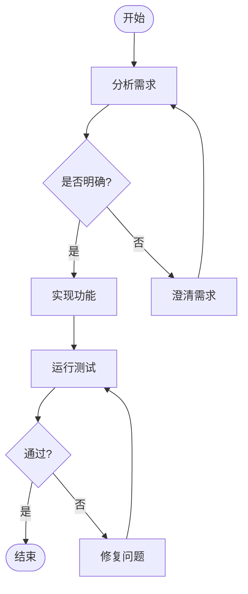

# Kimi CLI Plan and Execute 模式

**结论先行**: Kimi CLI **没有传统意义上的 "plan and execute" 模式**（即没有明确的 plan mode 和 execute mode 切换）。取而代之的是，Kimi CLI 实现了更灵活的 **"Agent Flow"（代理流程）** 机制，允许用户通过流程图定义多步骤工作流，以及 **Ralph 模式** 支持自动迭代执行。

---

## 1. 传统 Plan/Execute 模式的缺失

### 1.1 未发现传统模式切换

经过对 Kimi CLI 代码的深入探索：

- **未发现** `--plan` 或 `--execute` 命令行参数
- **未发现** plan phase 和 execute phase 的显式区分
- **未发现** "先制定计划，再执行计划"的传统 plan-and-execute 模式

### 1.2 与 Codex/Gemini CLI 的对比

| 特性 | Codex/Gemini CLI | Kimi CLI |
|------|-----------------|----------|
| Plan Mode | 明确的 ModeKind/ApprovalMode | ❌ 无 |
| Execute Mode | 明确的 Default/AUTO_EDIT 模式 | ❌ 无 |
| 模式切换工具 | enter_plan_mode / exit_plan_mode | ❌ 无 |
| 权限隔离 | Plan 模式下禁止编辑操作 | ❌ 无 |

---

## 2. Agent Flow 机制

### 2.1 FlowRunner 核心类

位于 `kimi-cli/src/kimi_cli/soul/kimisoul.py`:

```python
class FlowRunner:
    def __init__(
        self,
        flow: Flow,
        *,
        name: str | None = None,
        max_moves: int = DEFAULT_MAX_FLOW_MOVES,
    ) -> None:
        self._flow = flow
        self._name = name
        self._max_moves = max_moves
```

### 2.2 流程节点类型

位于 `kimi-cli/src/kimi_cli/skill/flow/__init__.py`:

```python
FlowNodeKind = Literal["begin", "end", "task", "decision"]

@dataclass(frozen=True, slots=True)
class FlowNode:
    id: str
    label: str | list[ContentPart]
    kind: FlowNodeKind  # begin: 开始, end: 结束, task: 任务, decision: 决策
```

**四种节点类型**:
- `begin`: 流程开始节点
- `end`: 流程结束节点
- `task`: 任务执行节点
- `decision`: 决策分支节点

### 2.3 流程执行机制

位于 `kimi-cli/src/kimi_cli/soul/kimisoul.py`:

```python
async def run(self, soul: KimiSoul, args: str) -> None:
    """执行 flow 遍历，通过 /flow:<name> 触发"""
    current_id = self._flow.begin_id
    moves = 0
    total_steps = 0
    while True:
        node = self._flow.nodes[current_id]
        edges = self._flow.outgoing.get(current_id, [])

        if node.kind == "end":
            # 到达结束节点
            return

        if node.kind == "begin":
            # 开始节点，直接跳到下一个
            current_id = edges[0].dst
            continue

        # 执行任务节点或决策节点
        next_id, steps_used = await self._execute_flow_node(soul, node, edges)
        if next_id is None:
            return
        moves += 1
        current_id = next_id
```

---

## 3. Ralph 模式（自动迭代模式）

### 3.1 Ralph Loop 定义

位于 `kimi-cli/src/kimi_cli/soul/kimisoul.py`:

```python
@staticmethod
def ralph_loop(
    user_message: Message,
    max_ralph_iterations: int,
) -> FlowRunner:
    """创建 Ralph 模式的循环流程：
    BEGIN → R1(执行用户 prompt) → R2(决策节点) → CONTINUE(回到 R2) / STOP → END
    """
    # 实现自动迭代循环
```

### 3.2 命令行参数

位于 `kimi-cli/src/kimi_cli/cli/__init__.py`:

```python
max_ralph_iterations: Annotated[
    int | None,
    typer.Option(
        "--max-ralph-iterations",
        min=-1,
        help=(
            "Extra iterations after the first turn in Ralph mode. Use -1 for unlimited. "
            "Default: from config."
        ),
    ),
] = None,
```

**Ralph 模式特点**:
- 支持自动重复执行直到任务完成
- 可通过 `--max-ralph-iterations` 设置最大迭代次数
- 使用 `-1` 表示无限迭代

---

## 4. 技能系统（Skill System）

### 4.1 技能类型定义

位于 `kimi-cli/src/kimi_cli/skill/__init__.py`:

```python
SkillType = Literal["standard", "flow"]

class Skill(BaseModel):
    """Information about a single skill."""
    name: str
    description: str
    dir: KaosPath
    type: SkillType = "standard"  # 可以是 standard 或 flow
    flow: Flow | None = None  # flow 类型技能包含流程图
```

### 4.2 技能调用方式

| 技能类型 | 调用方式 | 用途 |
|---------|---------|------|
| `standard` | `/skill:<name>` | 执行预定义的标准技能 |
| `flow` | `/flow:<name>` | 执行流程图定义的工作流 |

---

## 5. 流程图语法

Kimi CLI 支持使用 **Mermaid** 或 **D2** 语法定义工作流程：

### 5.1 Mermaid 示例



### 5.2 分支选择语法

```xml
<choice>分支名</choice>
```

用于在决策节点进行分支选择。

---

## 6. 设计特点对比

### 6.1 与传统 Plan-and-Execute 的对比

| 特性 | 传统 Plan-and-Execute | Kimi CLI Agent Flow |
|------|----------------------|---------------------|
| 计划制定 | 显式 plan mode | 通过 flow 图预定义 |
| 执行方式 | 显式 execute mode | `/flow:<name>` 触发 |
| 灵活性 | 一次性计划 | 支持循环、分支、决策 |
| 用户交互 | 计划完成后执行 | 每轮对话可决策是否继续 |
| 配置方式 | 命令行参数 | SKILL.md + 流程图 |
| 最大步数 | N/A | 默认 1000 步 |

### 6.2 与 Codex/Gemini CLI 的核心差异

```
┌─────────────────────────────────────────────────────────────────┐
│                  传统 Plan and Execute                           │
├─────────────────────────────────────────────────────────────────┤
│                                                                 │
│   Plan Mode → 制定计划 → 用户确认 → Execute Mode → 执行计划      │
│                                                                 │
│   特点：                                                         │
│   • 严格的阶段分离                                               │
│   • Plan 模式下禁止所有编辑操作                                   │
│   • 计划是一次性的                                               │
│                                                                 │
└─────────────────────────────────────────────────────────────────┘

┌─────────────────────────────────────────────────────────────────┐
│                    Kimi CLI Agent Flow                           │
├─────────────────────────────────────────────────────────────────┤
│                                                                 │
│   SKILL.md + 流程图 → /flow:<name> → FlowRunner 遍历执行          │
│                                                                 │
│   特点：                                                         │
│   • 工作流编排而非简单的计划-执行分离                              │
│   • 支持循环、分支、决策节点                                      │
│   • Ralph 模式支持自动迭代直到任务完成                            │
│   • 更强的表达能力和灵活性                                        │
│                                                                 │
└─────────────────────────────────────────────────────────────────┘
```

---

## 7. Ralph 模式工作流程

```
┌─────────────────────────────────────────────────────────────────┐
│                    Ralph Mode 工作流程                           │
├─────────────────────────────────────────────────────────────────┤
│                                                                 │
│   BEGIN([开始])                                                 │
│      │                                                          │
│      ▼                                                          │
│   ┌─────────────┐                                              │
│   │     R1      │ 执行用户 prompt                               │
│   │ 执行任务    │                                              │
│   └──────┬──────┘                                              │
│          ▼                                                      │
│   ┌─────────────┐                                              │
│   │     R2      │ 决策节点                                      │
│   │  是否继续?  │                                              │
│   └──────┬──────┘                                              │
│          │                                                      │
│    ┌─────┴─────┐                                               │
│    ▼           ▼                                                │
│ CONTINUE      STOP                                              │
│    │           │                                                │
│    └─────┬─────┘                                                │
│          ▼                                                      │
│   ┌─────────────┐                                              │
│   │ END([结束]) │                                              │
│   └─────────────┘                                              │
│                                                                 │
│   循环控制：                                                     │
│   • max_ralph_iterations 控制最大迭代次数                         │
│   • -1 表示无限迭代                                              │
│   • 每轮对话可在 R2 决策是否继续                                  │
│                                                                 │
└─────────────────────────────────────────────────────────────────┘
```

---

## 8. 关键源码文件索引

| 文件路径 | 核心职责 |
|---------|---------|
| `kimi-cli/src/kimi_cli/soul/kimisoul.py` | `FlowRunner` 类，Ralph Loop 实现 |
| `kimi-cli/src/kimi_cli/skill/flow/__init__.py` | `FlowNode`, `FlowNodeKind` 定义 |
| `kimi-cli/src/kimi_cli/skill/__init__.py` | `Skill`, `SkillType` 定义 |
| `kimi-cli/src/kimi_cli/cli/__init__.py` | `--max-ralph-iterations` 命令行参数 |

---

## 9. 总结

Kimi CLI 采用了一种不同于传统 "plan and execute" 的设计哲学：

1. **工作流编排**: 通过流程图（Mermaid/D2）预定义工作流，而非简单的计划-执行分离
2. **节点多样性**: 支持任务节点、决策节点、循环结构
3. **自动迭代**: Ralph 模式提供"持续执行直到任务完成"的能力
4. **灵活性**: 每轮对话都可以在决策节点选择分支

这种设计更接近**工作流编排引擎**，而非简单的两阶段计划-执行模式。对于需要复杂决策逻辑和循环处理的场景，Agent Flow 提供了更强的表达能力。

---

*文档版本: 2026-02-22*
*基于代码版本: kimi-cli (baseline 2026-02-08)*
