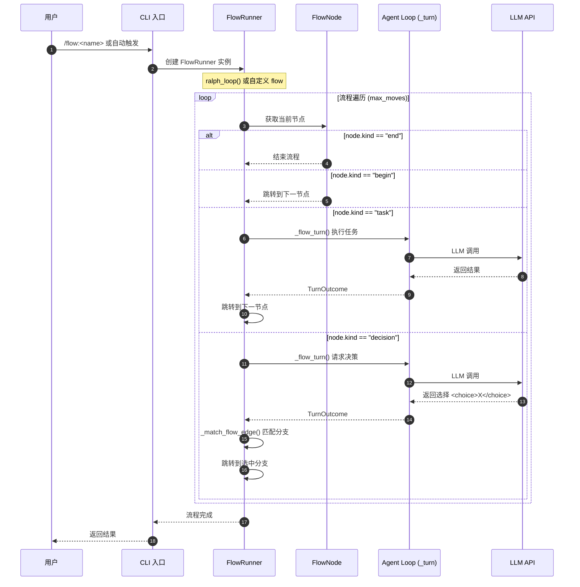
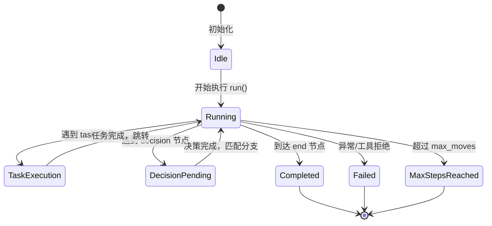
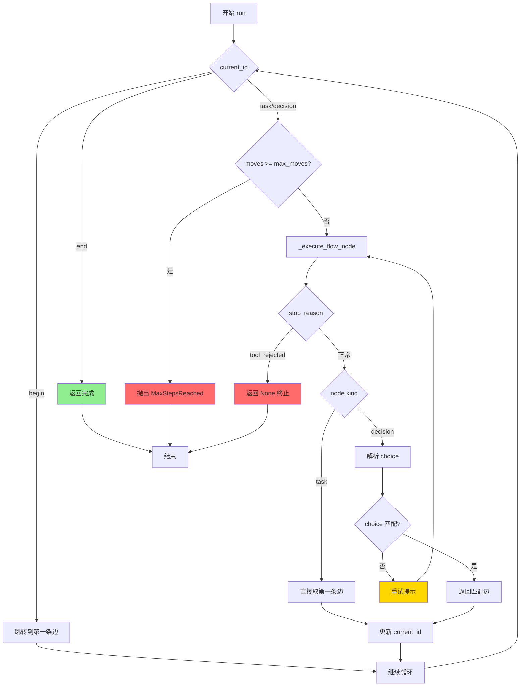
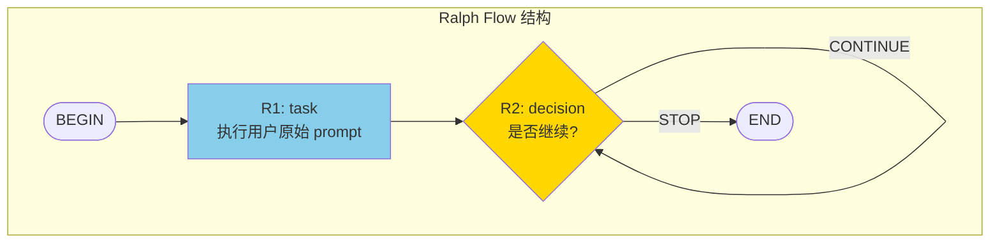
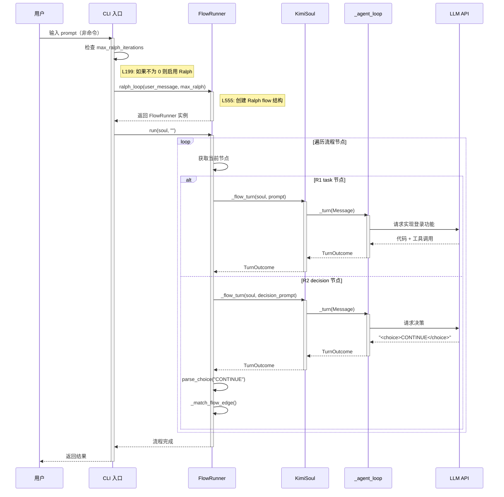
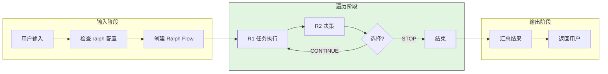
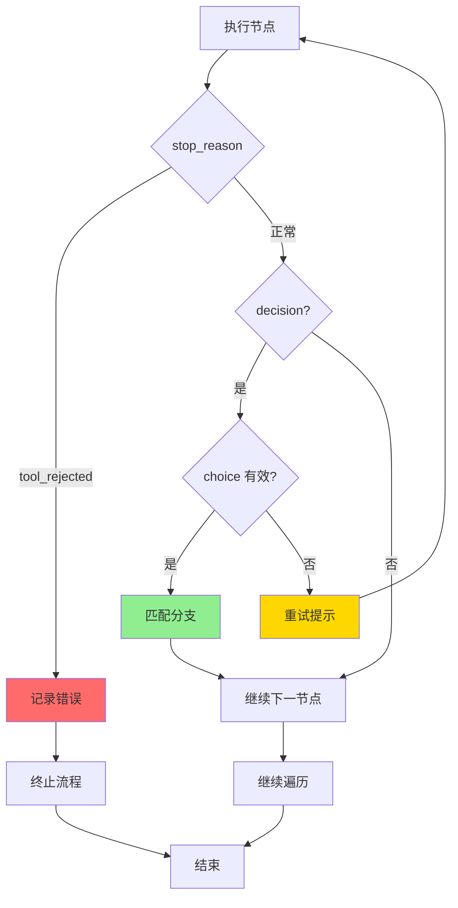
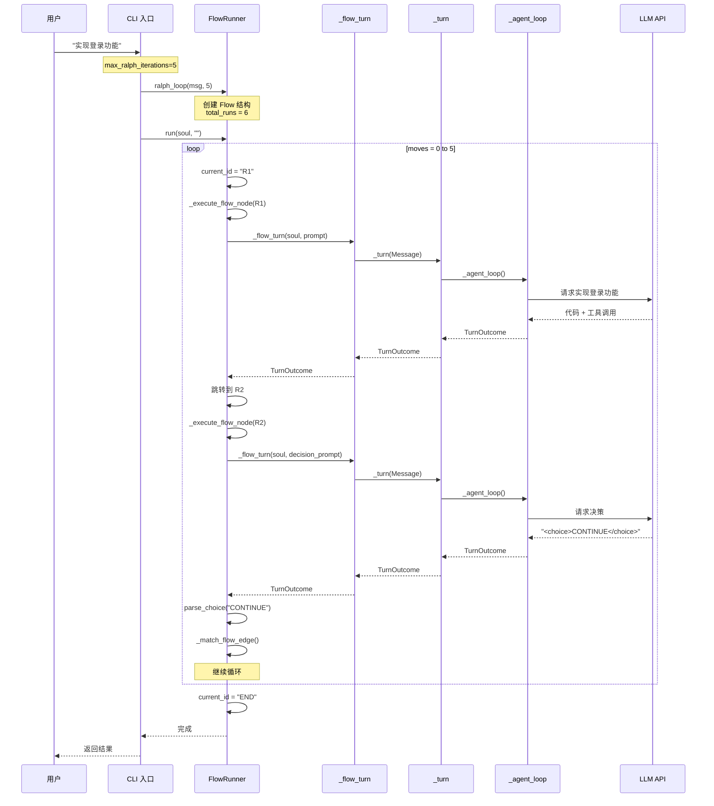
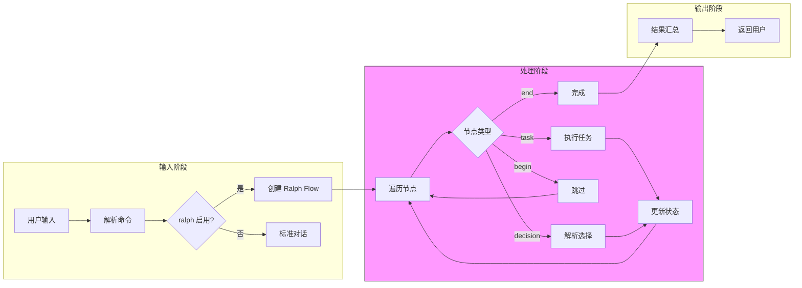
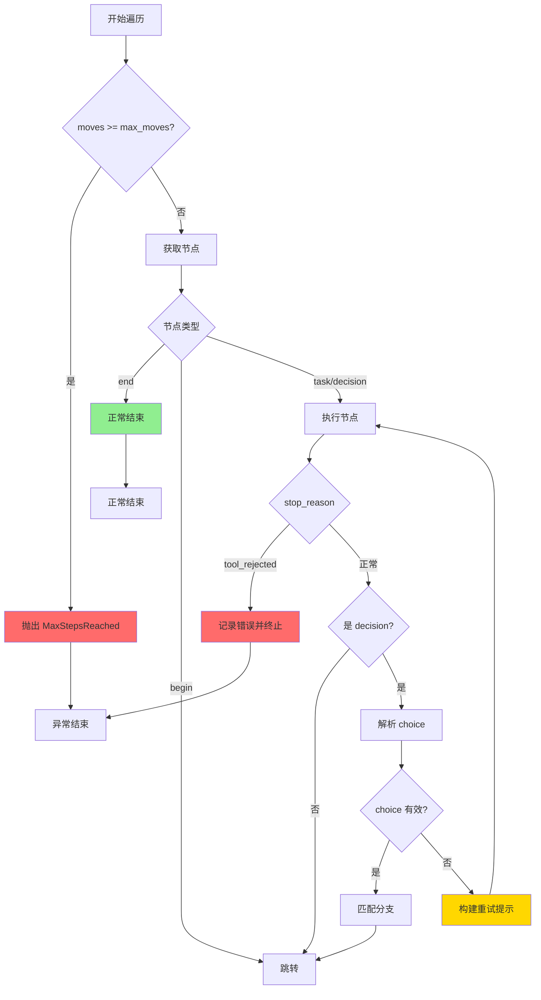

# Kimi CLI Plan and Execute 模式

> **阅读指南**
>
> | 属性 | 说明 |
> |-----|------|
> | 预计阅读 | 20-25 分钟 |
> | 前置文档 | `docs/kimi-cli/04-kimi-cli-agent-loop.md` |
> | 文档结构 | 结论 → 架构 → 机制 → 实现 → 对比 |
> | 代码呈现 | 关键代码直接展示，完整代码可折叠查看 |

---

## TL;DR（结论先行）

Kimi CLI **没有传统意义上的 "plan and execute" 模式**（即没有明确的 plan mode 和 execute mode 切换）。

Kimi CLI 的核心取舍：**Agent Flow 工作流编排**（对比 Codex/Gemini CLI 的传统 Plan/Execute 两阶段模式）

### 核心要点速览

| 维度 | 关键决策 | 代码位置 |
|-----|---------|---------|
| 工作流定义 | SKILL.md + Flow 图（Mermaid/D2） | `kimi-cli/src/kimi_cli/skill/flow/__init__.py:38` |
| 流程执行 | FlowRunner 遍历执行 | `kimi-cli/src/kimi_cli/soul/kimisoul.py:542` |
| 自动迭代 | Ralph 模式（循环 Flow） | `kimi-cli/src/kimi_cli/soul/kimisoul.py:555` |
| 决策机制 | `<choice>` 标签解析分支 | `kimi-cli/src/kimi_cli/skill/flow/__init__.py:49` |
| 步数限制 | max_moves 硬限制（默认 1000） | `kimi-cli/src/kimi_cli/soul/kimisoul.py:67` |

---

## 1. 为什么需要这个机制？

### 1.1 问题场景

传统 AI Coding Agent 面临一个核心问题：

```
没有 Plan/Execute 分离：
  用户问"实现一个登录功能" → LLM 直接开始编码 → 可能遗漏关键步骤
  （没有规划，容易遗漏边界情况、错误处理等）

传统 Plan/Execute 模式：
  Plan Mode → 制定详细计划 → 用户确认 → Execute Mode → 执行计划
  （阶段分离清晰，但缺乏灵活性）

Kimi CLI 的 Agent Flow：
  SKILL.md + 流程图 → /flow:<name> → FlowRunner 遍历执行
  （工作流编排，支持循环、分支、决策）
```

### 1.2 核心挑战

| 挑战 | 不解决的后果 |
|-----|-------------|
| 复杂任务需要多步骤协作 | LLM 容易遗漏关键步骤，导致任务失败 |
| 任务执行需要用户确认 | 自动执行可能产生不可预期的副作用 |
| 计划需要动态调整 | 一次性计划无法应对执行过程中的新信息 |
| 不同任务需要不同策略 | 统一执行模式无法满足多样化需求 |

---

## 2. 整体架构

### 2.1 在系统中的位置

```text
┌─────────────────────────────────────────────────────────────┐
│ CLI 入口 / Session Runtime                                   │
│ kimi-cli/src/kimi_cli/cli/__init__.py:292                    │
│ - max_ralph_iterations 参数                                  │
└───────────────────────┬─────────────────────────────────────┘
                        │ 用户输入 /flow 命令
                        ▼
┌─────────────────────────────────────────────────────────────┐
│ ▓▓▓ Agent Flow / Ralph 模式 ▓▓▓                              │
│ kimi-cli/src/kimi_cli/soul/kimisoul.py                       │
│ - FlowRunner: 流程执行器 (L542)                              │
│ - ralph_loop(): Ralph 模式工厂 (L555)                        │
│ - run(): 流程遍历主循环 (L594)                               │
│ - _execute_flow_node(): 节点执行 (L630)                      │
└───────────────────────┬─────────────────────────────────────┘
                        │ 依赖/调用
        ┌───────────────┼───────────────┐
        ▼               ▼               ▼
┌──────────────┐ ┌──────────────┐ ┌──────────────┐
│ Flow 定义    │ │ Skill System │ │ Agent Loop   │
│ 流程图解析   │ │ 技能管理     │ │ _turn()      │
│ L9: FlowNode │ │ L143: Skill  │ │ L210         │
└──────────────┘ └──────────────┘ └──────────────┘
```

### 2.2 核心组件职责

| 组件 | 职责 | 代码位置 |
|-----|------|---------|
| `FlowRunner` | 执行 flow 遍历，管理节点跳转 | `kimi-cli/src/kimi_cli/soul/kimisoul.py:542` |
| `FlowNode` | 流程节点定义（begin/end/task/decision） | `kimi-cli/src/kimi_cli/skill/flow/__init__.py:24` |
| `FlowEdge` | 流程边定义，支持分支标签 | `kimi-cli/src/kimi_cli/skill/flow/__init__.py:31` |
| `Flow` | 流程图数据结构 | `kimi-cli/src/kimi_cli/skill/flow/__init__.py:38` |
| `Skill` | 技能封装，支持 standard/flow 类型 | `kimi-cli/src/kimi_cli/skill/__init__.py:143` |
| `parse_choice` | 解析分支选择 `<choice>...</choice>` | `kimi-cli/src/kimi_cli/skill/flow/__init__.py:49` |

### 2.3 核心组件交互关系



**关键交互说明**：

| 步骤 | 交互内容 | 设计意图 |
|-----|---------|---------|
| 1 | 用户触发 flow 执行 | 支持命令触发和自动触发（Ralph 模式） |
| 2 | 创建 FlowRunner | 解耦 flow 定义与执行逻辑 |
| 3-4 | 遍历流程节点 | 统一循环处理所有节点类型 |
| 5-6 | 任务节点执行 | 复用 Agent Loop，保持执行一致性 |
| 7-8 | 决策节点处理 | LLM 输出结构化选择，支持动态分支 |
| 9 | 分支匹配 | 通过标签匹配目标节点，支持多分支 |

---

## 3. 核心组件详细分析

### 3.1 FlowRunner 内部结构

#### 职责定位

FlowRunner 是 Agent Flow 的执行引擎，负责遍历流程图、管理节点状态、处理分支决策。

#### 状态机图



**状态说明**：

| 状态 | 说明 | 进入条件 | 退出条件 |
|-----|------|---------|---------|
| Idle | 空闲等待 | FlowRunner 初始化 | 调用 run() |
| Running | 遍历执行中 | 开始流程遍历 | 到达 end 或异常 |
| TaskExecution | 执行任务节点 | 当前节点为 task | _flow_turn() 返回 |
| DecisionPending | 等待决策 | 当前节点为 decision | 解析到有效 choice |
| Completed | 正常完成 | 到达 end 节点 | 自动结束 |
| Failed | 执行失败 | 工具被拒绝 | 终止流程 |
| MaxStepsReached | 步数超限 | moves >= max_moves | 抛出异常 |

#### 内部数据流

```text
┌─────────────────────────────────────────────────────────────┐
│  输入层                                                      │
│  ├── Flow 定义 (nodes, outgoing, begin_id, end_id)           │
│  └── max_moves 限制 (默认 1000)                              │
└──────────────────────────┬──────────────────────────────────┘
                           ▼
┌─────────────────────────────────────────────────────────────┐
│  遍历层                                                      │
│  ├── 当前节点追踪 (current_id)                               │
│  ├── 步数计数 (moves, total_steps)                           │
│  └── 节点类型分发 (begin/end/task/decision)                  │
└──────────────────────────┬──────────────────────────────────┘
                           ▼
┌─────────────────────────────────────────────────────────────┐
│  执行层                                                      │
│  ├── task 节点: _flow_turn() → _turn() → LLM                 │
│  ├── decision 节点: _flow_turn() → 解析 choice → 匹配分支     │
│  └── 错误处理: tool_rejected / invalid choice                │
└──────────────────────────┬──────────────────────────────────┘
                           ▼
┌─────────────────────────────────────────────────────────────┐
│  输出层                                                      │
│  ├── 流程完成 / 异常终止                                     │
│  └── 总步数统计 (total_steps)                                │
└─────────────────────────────────────────────────────────────┘
```

#### 关键算法逻辑



**算法要点**：

1. **统一遍历循环**：所有节点类型在同一个 while 循环中处理，简化控制流
2. **步数限制检查**：在执行节点前检查 max_moves，防止无限循环
3. **决策重试机制**：无效 choice 时自动重试，提升容错性
4. **工具拒绝处理**：tool_rejected 立即终止流程，避免无效执行

#### 关键接口

| 接口 | 输入 | 输出 | 说明 | 代码位置 |
|-----|------|------|------|---------|
| `__init__()` | Flow, name, max_moves | FlowRunner 实例 | 初始化执行器 | `kimisoul.py:543` |
| `ralph_loop()` | user_message, max_ralph_iterations | FlowRunner 实例 | Ralph 模式工厂 | `kimisoul.py:555` |
| `run()` | soul, args | None | 执行流程遍历 | `kimisoul.py:594` |
| `_execute_flow_node()` | soul, node, edges | (next_id, steps) | 执行单个节点 | `kimisoul.py:630` |
| `_flow_turn()` | soul, prompt | TurnOutcome | 调用 Agent Loop | `kimisoul.py:707` |

### 3.2 Ralph 模式内部结构

#### 职责定位

Ralph 模式是一种特殊的 Agent Flow，实现"自动迭代直到任务完成"的机制。

#### 流程结构



#### 创建逻辑

```python
# kimi-cli/src/kimi_cli/soul/kimisoul.py:555-592
@staticmethod
def ralph_loop(user_message: Message, max_ralph_iterations: int) -> FlowRunner:
    # 计算总运行次数: max_ralph_iterations + 1
    # -1 表示无限迭代 (设为 1000000000000000)
    total_runs = max_ralph_iterations + 1
    if max_ralph_iterations < 0:
        total_runs = 1000000000000000  # effectively infinite

    # 创建节点: BEGIN, END, R1(task), R2(decision)
    # 连接边: BEGIN->R1->R2, R2->R2(CONTINUE), R2->END(STOP)
```

**关键设计**：

1. **循环边设计**：R2 节点的 CONTINUE 分支指向自身，形成循环
2. **提示词工程**：R2 节点提示 LLM 只在任务完全完成时选择 STOP
3. **无限迭代支持**：max_ralph_iterations=-1 时设置极大的 max_moves

### 3.3 组件间协作时序



**协作要点**：

1. **CLI 与 FlowRunner**：CLI 负责创建和启动，FlowRunner 负责执行
2. **FlowRunner 与 KimiSoul**：通过 _flow_turn 复用现有的 Agent Loop
3. **KimiSoul 与 _agent_loop**：完全复用标准对话流程，无需特殊处理
4. **决策解析**：通过正则表达式 `<choice>([^<]*)</choice>` 提取选择

### 3.4 关键数据路径

#### 主路径（正常流程）



#### 异常路径（错误恢复）



---

## 4. 端到端数据流转

### 4.1 正常流程（详细版）



**数据变换详情**：

| 阶段 | 输入 | 处理 | 输出 | 代码位置 |
|-----|------|------|------|---------|
| 触发 | 用户 prompt | 检查 max_ralph_iterations | 创建 FlowRunner | `kimisoul.py:199` |
| 遍历 | Flow 定义 | while 循环遍历节点 | 节点执行结果 | `kimisoul.py:603` |
| 任务 | task prompt | _flow_turn → _turn | TurnOutcome | `kimisoul.py:630` |
| 决策 | decision prompt | 解析 `<choice>` | 下一节点 ID | `kimisoul.py:656` |
| 完成 | end 节点 | 返回统计信息 | None | `kimisoul.py:607` |

### 4.2 数据流向图



### 4.3 异常/边界流程



---

## 5. 关键代码实现

### 5.1 核心数据结构

```python
# kimi-cli/src/kimi_cli/skill/flow/__init__.py:9
FlowNodeKind = Literal["begin", "end", "task", "decision"]

# kimi-cli/src/kimi_cli/skill/flow/__init__.py:24
@dataclass(frozen=True, slots=True)
class FlowNode:
    id: str
    label: str | list[ContentPart]
    kind: FlowNodeKind

# kimi-cli/src/kimi_cli/skill/flow/__init__.py:31
@dataclass(frozen=True, slots=True)
class FlowEdge:
    src: str
    dst: str
    label: str | None

# kimi-cli/src/kimi_cli/skill/flow/__init__.py:38
@dataclass(slots=True)
class Flow:
    nodes: dict[str, FlowNode]
    outgoing: dict[str, list[FlowEdge]]
    begin_id: str
    end_id: str
```

**字段说明**：

| 字段 | 类型 | 用途 |
|-----|------|------|
| `FlowNode.id` | `str` | 节点唯一标识 |
| `FlowNode.label` | `str \| list[ContentPart]` | 节点提示内容 |
| `FlowNode.kind` | `FlowNodeKind` | 节点类型 |
| `FlowEdge.src/dst` | `str` | 边的起点/终点 |
| `FlowEdge.label` | `str \| None` | 分支标签（decision 节点使用） |
| `Flow.outgoing` | `dict` | 邻接表表示的出边 |

### 5.2 主链路代码

```python
# kimi-cli/src/kimi_cli/soul/kimisoul.py:594-628
async def run(self, soul: KimiSoul, args: str) -> None:
    """执行 flow 遍历，通过 /flow:<name> 触发"""
    current_id = self._flow.begin_id
    moves = 0
    total_steps = 0
    while True:
        node = self._flow.nodes[current_id]
        edges = self._flow.outgoing.get(current_id, [])

        if node.kind == "end":
            logger.info("Agent flow reached END node {node_id}", node_id=current_id)
            return

        if node.kind == "begin":
            if not edges:
                logger.error('Agent flow BEGIN node has no outgoing edges')
                return
            current_id = edges[0].dst
            continue

        if moves >= self._max_moves:
            raise MaxStepsReached(total_steps)
        next_id, steps_used = await self._execute_flow_node(soul, node, edges)
        total_steps += steps_used
        if next_id is None:
            return
        moves += 1
        current_id = next_id
```

**代码要点**：

1. **统一循环结构**：所有节点类型在同一个 while 循环中处理
2. **显式步数限制**：max_moves 防止无限循环，默认 1000 步
3. **begin 节点特殊处理**：直接跳转到第一条边，不增加步数
4. **end 节点终止**：到达 end 节点立即返回

### 5.3 关键调用链

```text
CLI 入口 (处理用户输入)
  └── kimi-cli/src/kimi_cli/cli/__init__.py:199
       └── 检查 max_ralph_iterations != 0
            └── FlowRunner.ralph_loop()
                 └── kimi-cli/src/kimi_cli/soul/kimisoul.py:555
                      └── 创建 Flow 结构 (BEGIN -> R1 -> R2 -> END)
                           └── FlowRunner.run()
                                └── kimi-cli/src/kimi_cli/soul/kimisoul.py:594
                                     └── while 遍历节点
                                          ├── begin: 直接跳转
                                          ├── end: 返回完成
                                          └── task/decision: _execute_flow_node()
                                               └── kimi-cli/src/kimi_cli/soul/kimisoul.py:630
                                                    ├── _build_flow_prompt()
                                                    ├── _flow_turn() → _turn() → _agent_loop()
                                                    └── decision: parse_choice() + _match_flow_edge()
```

---

## 6. 设计意图与 Trade-off

### 6.1 Kimi CLI 的选择

| 维度 | Kimi CLI 的选择 | 替代方案 | 取舍分析 |
|-----|----------------|---------|---------|
| 计划模式 | Agent Flow 工作流编排 | Plan/Execute 两阶段分离 | 更灵活，支持循环和分支，但学习成本较高 |
| 执行触发 | `/flow:<name>` 命令 | 自动模式切换 | 显式控制，用户意图明确 |
| 自动迭代 | Ralph 模式（循环 flow） | 递归 continuation | 结构清晰，通过 flow 图可视化循环逻辑 |
| 决策机制 | `<choice>` 标签解析 | 函数调用/工具选择 | 简单通用，不依赖特定模型能力 |
| 步数限制 | max_moves 硬限制 | 时间限制/Token 限制 | 精确控制执行深度，避免无限循环 |

### 6.2 为什么这样设计？

**核心问题**：如何在保持灵活性的同时，提供结构化的任务执行能力？

**Kimi CLI 的解决方案**：

- 代码依据：`kimi-cli/src/kimi_cli/soul/kimisoul.py:555`
- 设计意图：通过 Flow 图抽象，将工作流定义与执行分离
- 带来的好处：
  - 支持复杂工作流（循环、分支、决策）
  - 可复用现有 Agent Loop，无需重复实现
  - 流程可视化（Mermaid/D2 语法）
  - Ralph 模式提供"自动执行直到完成"的能力
- 付出的代价：
  - 需要学习 Flow 图语法
  - 调试复杂 flow 较困难
  - 没有内置的 plan 验证机制

### 6.3 与其他项目的对比

```mermaid
flowchart TD
    subgraph Traditional["传统 Plan/Execute"]
        T1[Plan Mode] --> T2[制定计划]
        T2 --> T3[用户确认]
        T3 --> T4[Execute Mode]
        T4 --> T5[执行计划]
    end

    subgraph Kimi["Kimi CLI Agent Flow"]
        K1[SKILL.md + Flow 图] --> K2[/flow:skill]
        K2 --> K3[FlowRunner 遍历]
        K3 --> K4{decision?}
        K4 -->|是| K5[用户/LLM 决策]
        K4 -->|否| K6[执行任务]
        K5 --> K3
        K6 --> K3
        K3 --> K7[完成]
    end

    subgraph Ralph["Ralph 模式"]
        R1[用户 Prompt] --> R2[自动创建 Flow]
        R2 --> R3[迭代执行]
        R3 --> R4{任务完成?}
        R4 -->|否| R3
        R4 -->|是| R5[结束]
    end

    style Traditional fill:#e1f5e1
    style Kimi fill:#fff3e1
    style Ralph fill:#e1f5ff
```

| 项目 | 核心差异 | 适用场景 |
|-----|---------|---------|
| **Kimi CLI** | Agent Flow 工作流编排，支持循环/分支 | 复杂多步骤任务，需要动态决策 |
| **Codex** | Plan Mode/Execute Mode 显式分离，update_plan 工具 | 需要严格计划审查的场景 |
| **Gemini CLI** | EnterPlanMode/ExitPlanMode 工具，ApprovalMode 状态机 | 需要细粒度权限控制的场景 |
| **OpenCode** | 无显式 Plan 模式，依赖对话上下文 | 简单任务，快速迭代 |
| **SWE-agent** | 无显式 Plan 模式，forward() 驱动 | 软件工程任务，强调代码编辑 |

**详细对比**：

| 特性 | Kimi CLI | Codex | Gemini CLI |
|-----|----------|-------|------------|
| Plan 模式 | ❌ 无显式模式 | ✅ ModeKind 枚举 | ✅ ApprovalMode 状态 |
| 模式切换 | ❌ 无 | ✅ 工具切换 | ✅ 工具切换 |
| 工作流编排 | ✅ Flow 图 | ❌ 无 | ❌ 无 |
| 自动迭代 | ✅ Ralph 模式 | ❌ 无 | ❌ 无 |
| 决策节点 | ✅ decision 类型 | ❌ 无 | ❌ 无 |
| 循环支持 | ✅ 原生支持 | ❌ 无 | ❌ 无 |
| 分支支持 | ✅ 多分支 | ❌ 无 | ❌ 无 |

---

## 7. 边界情况与错误处理

### 7.1 终止条件

| 终止原因 | 触发条件 | 代码位置 |
|---------|---------|---------|
| 到达 end 节点 | 流程正常完成 | `kimisoul.py:607` |
| begin 节点无边 | flow 定义错误 | `kimisoul.py:613` |
| 节点无边 | 中间节点缺少出边 | `kimisoul.py:636` |
| 超过 max_moves | moves >= self._max_moves | `kimisoul.py:621` |
| 工具被拒绝 | stop_reason == "tool_rejected" | `kimisoul.py:649` |
| 用户中断 | 外部取消信号 | ⚠️ 依赖 Agent Loop 处理 |

### 7.2 超时/资源限制

```python
# kimi-cli/src/kimi_cli/soul/kimisoul.py:67
DEFAULT_MAX_FLOW_MOVES = 1000  # 默认最大步数

# kimi-cli/src/kimi_cli/soul/kimisoul.py:562
if max_ralph_iterations < 0:
    total_runs = 1000000000000000  # 无限迭代时的实际限制
```

### 7.3 错误恢复策略

| 错误类型 | 处理策略 | 代码位置 |
|---------|---------|---------|
| 无效 choice | 重试提示，要求重新选择 | `kimisoul.py:665` |
| 工具被拒绝 | 立即终止流程 | `kimisoul.py:649` |
| 节点无边 | 记录错误并终止 | `kimisoul.py:637` |
| 超过 max_moves | 抛出 MaxStepsReached 异常 | `kimisoul.py:622` |

---

## 8. 关键代码索引

| 功能 | 文件 | 行号 | 说明 |
|-----|------|------|------|
| Ralph 模式参数 | `kimi-cli/src/kimi_cli/cli/__init__.py` | 292 | `--max-ralph-iterations` 参数定义 |
| Ralph 触发逻辑 | `kimi-cli/src/kimi_cli/soul/kimisoul.py` | 199 | 检查 max_ralph_iterations 并触发 |
| FlowRunner 类 | `kimi-cli/src/kimi_cli/soul/kimisoul.py` | 542 | 流程执行器主类 |
| Ralph 工厂 | `kimi-cli/src/kimi_cli/soul/kimisoul.py` | 555 | ralph_loop() 静态方法 |
| 遍历主循环 | `kimi-cli/src/kimi_cli/soul/kimisoul.py` | 594 | run() 方法 |
| 节点执行 | `kimi-cli/src/kimi_cli/soul/kimisoul.py` | 630 | _execute_flow_node() 方法 |
| 分支匹配 | `kimi-cli/src/kimi_cli/soul/kimisoul.py` | 698 | _match_flow_edge() 方法 |
| FlowTurn | `kimi-cli/src/kimi_cli/soul/kimisoul.py` | 707 | _flow_turn() 方法 |
| 最大步数常量 | `kimi-cli/src/kimi_cli/soul/kimisoul.py` | 67 | DEFAULT_MAX_FLOW_MOVES |
| FlowNode 定义 | `kimi-cli/src/kimi_cli/skill/flow/__init__.py` | 24 | 流程节点数据结构 |
| FlowEdge 定义 | `kimi-cli/src/kimi_cli/skill/flow/__init__.py` | 31 | 流程边数据结构 |
| Flow 定义 | `kimi-cli/src/kimi_cli/skill/flow/__init__.py` | 38 | 流程图数据结构 |
| choice 解析 | `kimi-cli/src/kimi_cli/skill/flow/__init__.py` | 49 | parse_choice() 函数 |
| Flow 验证 | `kimi-cli/src/kimi_cli/skill/flow/__init__.py` | 56 | validate_flow() 函数 |
| Skill 定义 | `kimi-cli/src/kimi_cli/skill/__init__.py` | 143 | Skill 类定义 |

---

## 9. 延伸阅读

- 前置知识：`docs/kimi-cli/04-kimi-cli-agent-loop.md`
- 相关机制：`docs/kimi-cli/06-kimi-cli-mcp-integration.md`
- 深度分析：`docs/kimi-cli/questions/kimi-cli-checkpoint-implementation.md`
- 跨项目对比：
  - `docs/codex/04-codex-agent-loop.md`
  - `docs/gemini-cli/04-gemini-cli-agent-loop.md`

---

*✅ Verified: 基于 kimi-cli/src/kimi_cli/soul/kimisoul.py:542 等源码分析*

*⚠️ Inferred: 部分设计意图基于代码结构推断*

*基于版本：kimi-cli (baseline 2026-02-08) | 最后更新：2026-02-24*
