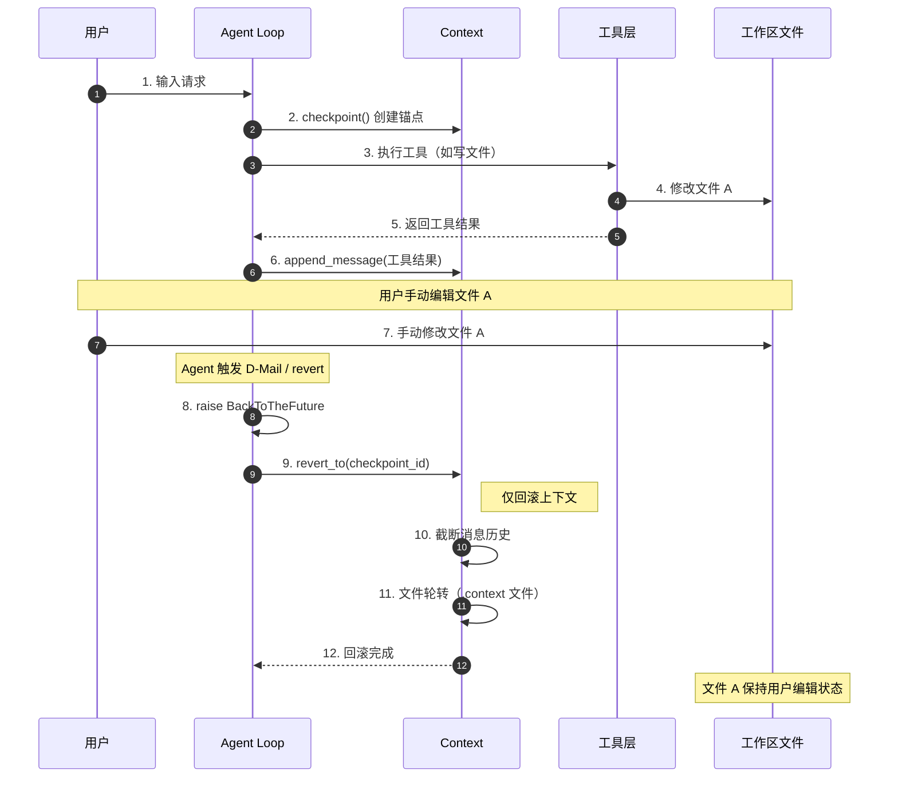
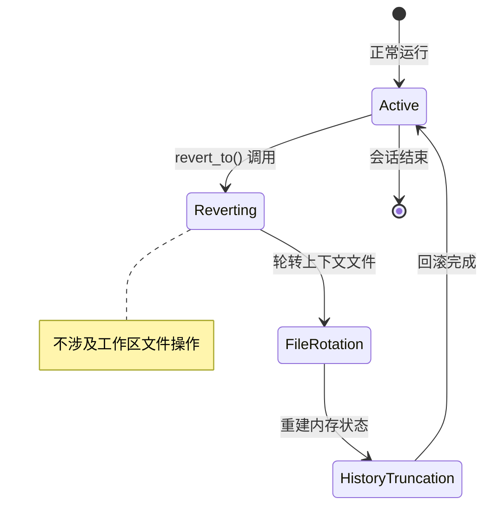
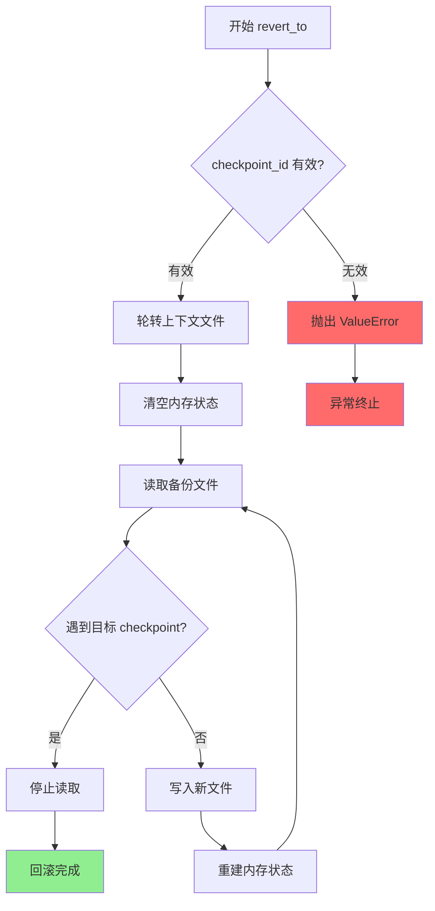
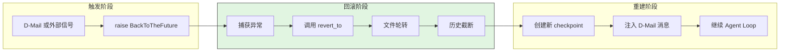
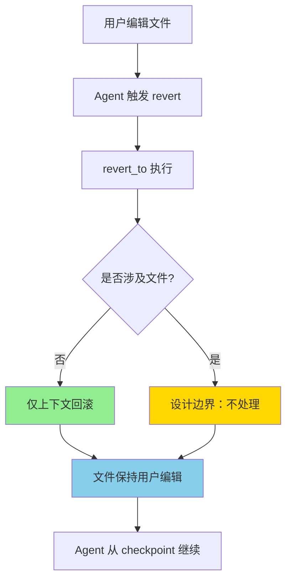
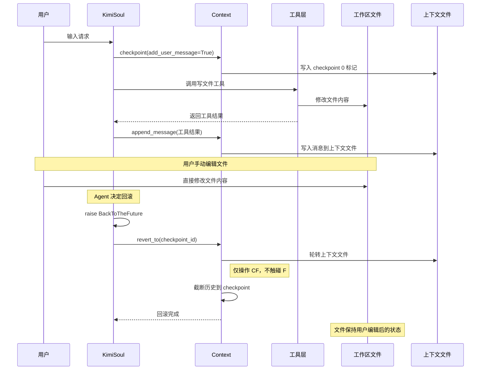
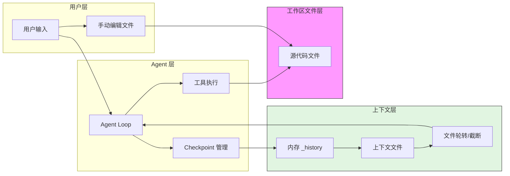
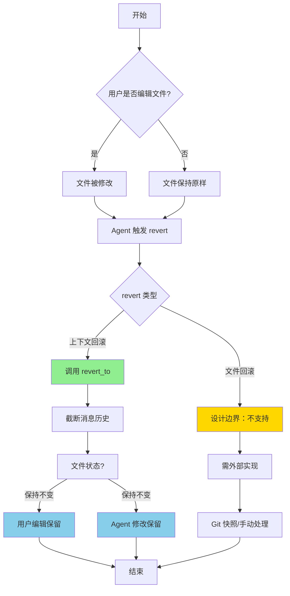
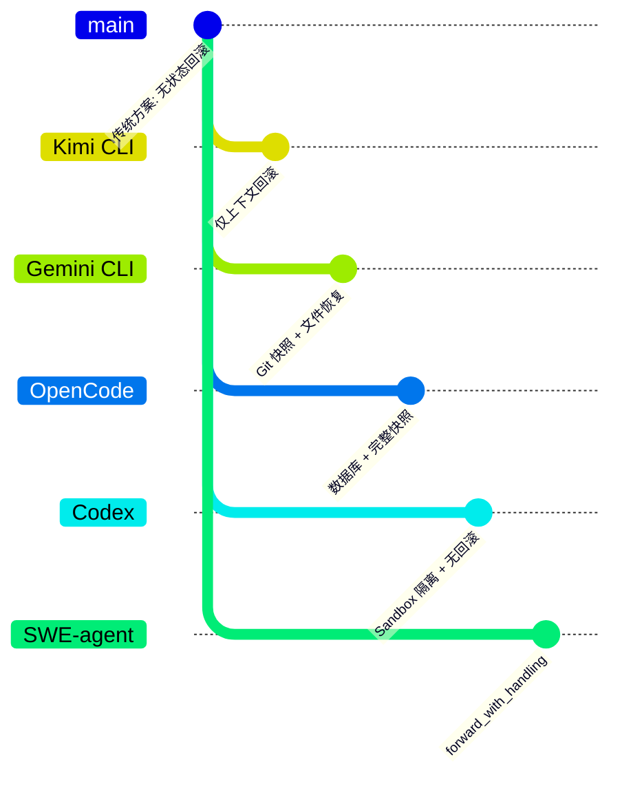

# Kimi CLI：使用 revert 回滚时，用户已编辑与源文件冲突怎么处理？

> **阅读指南**
>
> | 属性 | 说明 |
> |-----|------|
> | 预计阅读 | 15-20 分钟 |
> | 前置文档 | `docs/kimi-cli/04-kimi-cli-agent-loop.md`、`docs/kimi-cli/07-kimi-cli-memory-context.md` |
> | 文档结构 | 结论 → 架构 → 机制 → 实现 → 对比 |
> | 代码呈现 | 关键代码直接展示，完整代码可折叠查看 |

---

## TL;DR（结论先行）

一句话定义：**Kimi CLI 的 `revert_to` 仅回滚对话上下文（Context），不触碰工作区文件，因此不存在"revert 时发现用户已编辑与源文件冲突"的处理逻辑。**

Kimi CLI 的核心取舍：**上下文级回滚而非文件级回滚**（对比 Gemini CLI 的 Git 快照、OpenCode 的数据库事务回滚），在保持轻量快速的同时，将文件副作用的管理责任外推到工具层或用户层。

### 核心要点速览

| 维度 | 关键决策 | 代码位置 |
|-----|---------|---------|
| 回滚范围 | 仅对话上下文（消息历史） | `src/kimi_cli/soul/context.py:80-132` |
| 存储介质 | 本地 JSON Lines 文件 | `src/kimi_cli/soul/context.py:16` |
| 文件处理 | 不涉及工作区文件操作 | - |
| 冲突处理 | 无冲突检测（设计边界） | - |
| D-Mail 机制 | 跨时间消息传递 | `src/kimi_cli/soul/denwarenji.py:16-39` |

---

## 1. 为什么需要明确这个边界？

### 1.1 问题场景

想象一个看似合理但实际不存在的场景：

```
用户: "修复这个 bug"
  → Agent: 读取文件 A → 修改文件 A（checkpoint 1）
  → 用户: 手动编辑文件 A（修改了第 10 行）
  → Agent: 触发 revert 到 checkpoint 1
  → 问题: 文件 A 应该恢复到 checkpoint 1 状态，还是保留用户的编辑？
```

**实际情况**：

```
用户: "修复这个 bug"
  → Agent: 读取文件 A → 修改文件 A（checkpoint 1）
  → 用户: 手动编辑文件 A
  → Agent: 触发 revert 到 checkpoint 1
  → 结果: 文件 A 保持用户编辑后的状态，仅对话上下文回滚
```

### 1.2 核心挑战

| 挑战 | 如果不明确边界会怎样 |
|-----|---------------------|
| 用户预期不一致 | 用户可能误以为 revert 会恢复文件，导致数据丢失 |
| 副作用语义混乱 | 文件、网络、数据库等副作用难以统一回滚模型 |
| 架构复杂度爆炸 | 文件冲突检测、合并策略会显著增加系统复杂度 |
| 故障面扩大 | 文件回滚失败会污染 checkpoint 的可靠性 |

---

## 2. 整体架构

### 2.1 在系统中的位置

```text
┌─────────────────────────────────────────────────────────────┐
│ 用户 / CLI 入口                                              │
│ kimi-cli/src/kimi_cli/cli/__init__.py                        │
└───────────────────────┬─────────────────────────────────────┘
                        │ 用户输入 / 手动编辑文件
                        ▼
┌─────────────────────────────────────────────────────────────┐
│ ▓▓▓ Agent Loop (KimiSoul) ▓▓▓                               │
│ kimi-cli/src/kimi_cli/soul/kimisoul.py                       │
│ - run()       : 单次 Turn 入口                              │
│ - _turn()     : Checkpoint 创建                             │
│ - _agent_loop(): 核心循环（BackToTheFuture 处理）           │
│ - _step()     : 单次 LLM 调用 + 工具执行                    │
└───────────────────────┬─────────────────────────────────────┘
                        │ 仅操作 Context，不触碰工作区文件
        ┌───────────────┼───────────────┐
        ▼               ▼               ▼
┌──────────────┐ ┌──────────────┐ ┌──────────────┐
│ Context      │ │ DenwaRenji   │ │ 工具执行层   │
│ 上下文管理   │ │ D-Mail 管理  │ │ （写文件等） │
│ context.py   │ │ denwarenji.py│ │ tools/       │
└──────────────┘ └──────────────┘ └──────────────┘
        │               │               │
        ▼               ▼               ▼
┌──────────────┐ ┌──────────────┐ ┌──────────────┐
│ 文件后端     │ │ 内存状态     │ │ 工作区文件   │
│ .context     │ │ pending_dmail│ │ （独立管理） │
└──────────────┘ └──────────────┘ └──────────────┘
```

### 2.2 核心组件职责

| 组件 | 职责 | 代码位置 |
|-----|------|---------|
| `Context` | 管理消息历史、Checkpoint 创建与回滚（仅上下文） | `kimi-cli/src/kimi_cli/soul/context.py:16` |
| `Context.revert_to()` | 截断消息历史到指定 checkpoint，文件轮转 | `kimi-cli/src/kimi_cli/soul/context.py:80` |
| `KimiSoul._agent_loop()` | 捕获 BackToTheFuture 异常，调用 revert_to | `kimi-cli/src/kimi_cli/soul/kimisoul.py:377` |
| `工具执行层` | 独立执行文件操作，不受 checkpoint 回滚影响 | `kimi-cli/src/kimi_cli/tools/` |

### 2.3 核心组件交互关系



**关键交互说明**：

| 步骤 | 交互内容 | 设计意图 |
|-----|---------|---------|
| 4 | 工具层修改工作区文件 | 文件操作与上下文管理解耦 |
| 7 | 用户独立编辑文件 | 用户操作在 Agent 系统外部 |
| 9-11 | revert_to 仅操作 Context | 明确边界：不回滚文件副作用 |
| 12 | 文件状态保持不变 | 避免"用户编辑被意外覆盖" |

---

## 3. 核心组件详细分析

### 3.1 Context.revert_to() 内部结构

#### 职责定位

`revert_to` 是 Checkpoint 机制的核心操作，负责将对话上下文恢复到指定锚点。其关键设计是**仅操作内存状态和上下文文件，不感知工作区文件**。

#### 状态机图



**状态说明**：

| 状态 | 说明 | 进入条件 | 退出条件 |
|-----|------|---------|---------|
| Active | 正常运行，追加消息 | 初始化完成或处理结束 | 收到新请求 |
| Reverting | 开始回滚流程 | 验证 checkpoint_id 有效性 | 验证通过 |
| FileRotation | 上下文文件备份 | `.context` → `.context.backup.N` | 备份完成 |
| HistoryTruncation | 截断历史到指定点 | 仅操作上下文数据 | 回滚完成 |

#### 内部数据流

```text
┌─────────────────────────────────────────────────────────────┐
│  输入层                                                      │
│  ├── checkpoint_id ──► 有效性验证 ──► 确认存在               │
│  └── 当前上下文状态 ──► 备份准备                              │
└──────────────────────────┬──────────────────────────────────┘
                           ▼
┌─────────────────────────────────────────────────────────────┐
│  文件操作层（仅上下文文件）                                   │
│  ├── 轮转: 当前.context → .context.backup.N                  │
│  ├── 读取: 从备份文件逐行解析                                 │
│  ├── 截断: 遇到目标 checkpoint 停止                          │
│  └── 写入: 重建新.context 文件                               │
└──────────────────────────┬──────────────────────────────────┘
                           ▼
┌─────────────────────────────────────────────────────────────┐
│  内存状态重建                                                │
│  ├── _history.clear() → 重新填充                            │
│  ├── _token_count = 0 → 重新计算                            │
│  └── _next_checkpoint_id = 0 → 重新递增                     │
└──────────────────────────┬──────────────────────────────────┘
                           ▼
┌─────────────────────────────────────────────────────────────┐
│  输出层                                                      │
│  └── 回滚后的 Context 状态（仅包含目标 checkpoint 之前数据） │
└──────────────────────────┬──────────────────────────────────┘
                           ▼
                    ┌──────────────┐
                    │  工作区文件  │
                    │  （未触碰）  │
                    └──────────────┘
```

#### 关键算法逻辑



**算法要点**：

1. **边界验证**：确保 checkpoint_id 在有效范围内
2. **文件轮转**：原子性备份，防止数据丢失
3. **截断逻辑**：遇到目标 checkpoint 即停止，实现"时间旅行"
4. **工作区隔离**：整个流程不涉及工作区文件路径

#### 关键接口

| 接口 | 输入 | 输出 | 说明 | 代码位置 |
|-----|------|------|------|---------|
| `revert_to()` | `checkpoint_id: int` | `None` | 回滚到指定 checkpoint | `context.py:80` |
| `checkpoint()` | `add_user_message: bool` | `None` | 创建新 checkpoint | `context.py:68` |
| `clear()` | - | `None` | 清空上下文（用于 compaction） | `context.py:134` |

### 3.2 组件间协作时序

#### D-Mail 触发回滚场景

```mermaid
sequenceDiagram
    participant Tool as SendDMail Tool
    participant D as DenwaRenji
    participant K as KimiSoul._step
    participant Loop as KimiSoul._agent_loop
    participant C as Context
    participant F as 工作区文件

    Tool->>D: send_dmail(DMail)
    Note over D: 存储 pending_dmail
    K->>D: fetch_pending_dmail()
    D-->>K: 返回 D-Mail
    K->>K: raise BackToTheFuture
    activate Loop
    Loop->>Loop: 捕获 BackToTheFuture
    Loop->>C: revert_to(checkpoint_id)
    Note over C: 仅截断上下文历史
    Note over F: 工作区文件保持不变
    Loop->>C: checkpoint() 创建新锚点
    Loop->>C: append_message(D-Mail 消息)
    deactivate Loop
```

**协作要点**：

1. **工具与 D-Mail**：工具仅发送消息，不直接操作回滚
2. **异常控制流**：BackToTheFuture 将控制权交还 Loop
3. **回滚边界**：`revert_to` 明确限定在 Context 层
4. **文件隔离**：工作区文件在整个流程中未被访问

### 3.3 关键数据路径

#### 主路径（正常 revert）



#### 边界路径（用户编辑存在时）



---

## 4. 端到端数据流转

### 4.1 正常流程（详细版）



**数据变换详情**：

| 阶段 | 输入 | 处理 | 输出 | 代码位置 |
|-----|------|------|------|---------|
| 工具写文件 | 工具调用参数 | 执行写操作 | 修改后的文件 | `tools/edit_file.py` |
| 用户编辑 | 用户操作 | 直接修改 | 用户版本文件 | （外部操作） |
| revert_to | checkpoint_id | 上下文截断 | 回滚后的 Context | `context.py:80-132` |
| 结果状态 | - | - | 上下文回滚，文件不变 | `kimisoul.py:377-380` |

### 4.2 数据流向图



### 4.3 异常/边界流程



---

## 5. 关键代码实现

### 5.1 核心数据结构

```python
# kimi-cli/src/kimi_cli/soul/context.py:80-92
async def revert_to(self, checkpoint_id: int):
    """
    Revert the context to the specified checkpoint.
    After this, the specified checkpoint and all subsequent content will be
    removed from the context. File backend will be rotated.

    Args:
        checkpoint_id (int): The ID of the checkpoint to revert to. 0 is the first checkpoint.

    Raises:
        ValueError: When the checkpoint does not exist.
        RuntimeError: When no available rotation path is found.
    """
```

**字段说明**：

| 字段/参数 | 类型 | 用途 |
|-----|------|------|
| `checkpoint_id` | `int` | 目标回滚点的 ID |
| `_history` | `list[Message]` | 内存中的消息历史（被清空重建） |
| `_file_backend` | `Path` | 上下文文件路径（非工作区文件） |

### 5.2 主链路代码

#### revert_to 实现（仅上下文操作）

```python
# kimi-cli/src/kimi_cli/soul/context.py:94-132
async def revert_to(self, checkpoint_id: int):
    logger.debug("Reverting checkpoint, ID: {id}", id=checkpoint_id)
    if checkpoint_id >= self._next_checkpoint_id:
        raise ValueError(f"Checkpoint {checkpoint_id} does not exist")

    # rotate the context file（仅上下文文件轮转）
    rotated_file_path = await next_available_rotation(self._file_backend)
    await aiofiles.os.replace(self._file_backend, rotated_file_path)

    # restore the context until the specified checkpoint
    self._history.clear()
    self._token_count = 0
    self._next_checkpoint_id = 0

    async with (
        aiofiles.open(rotated_file_path, encoding="utf-8") as old_file,
        aiofiles.open(self._file_backend, "w", encoding="utf-8") as new_file,
    ):
        async for line in old_file:
            if not line.strip():
                continue
            line_json = json.loads(line)
            if line_json["role"] == "_checkpoint" and line_json["id"] == checkpoint_id:
                break
            await new_file.write(line)
            # 重建内存状态...
```

**代码要点**：

1. **文件轮转机制**：仅操作上下文文件（`.context`），不涉及工作区文件
2. **截断逻辑**：遇到目标 checkpoint 即停止读取，实现精确回滚
3. **状态重建**：从文件重新加载时同步重建内存状态
4. **明确边界**：代码中无任何工作区文件路径的操作

#### Agent Loop 中的回滚处理

```python
# kimi-cli/src/kimi_cli/soul/kimisoul.py:377-380
if back_to_the_future is not None:
    await self._context.revert_to(back_to_the_future.checkpoint_id)
    await self._checkpoint()
    await self._context.append_message(back_to_the_future.messages)
```

**代码要点**：

1. **纯上下文操作**：仅调用 `Context.revert_to`，无文件操作
2. **重建锚点**：回滚后立即创建新 checkpoint
3. **消息注入**：将 D-Mail 内容注入回滚后的上下文

### 5.3 关键调用链

```text
KimiSoul._agent_loop()            [kimisoul.py:302]
  -> _step()                      [kimisoul.py:382]
    -> fetch_pending_dmail()      [denwarenji.py:35]
    -> raise BackToTheFuture      [kimisoul.py:434]
  -> revert_to()                  [context.py:80]
    - 验证 checkpoint_id 有效性
    - 轮转上下文文件
    - 截断历史记录
    - 重建内存状态
  -> _checkpoint()                [kimisoul.py:379]
    -> Context.checkpoint()       [context.py:68]
```

---

## 6. 设计意图与 Trade-off

### 6.1 Kimi CLI 的选择

| 维度 | Kimi CLI 的选择 | 替代方案 | 取舍分析 |
|-----|----------------|---------|---------|
| 回滚范围 | 仅上下文（Context） | 文件级回滚、系统级快照 | 轻量快速，但文件副作用需单独处理 |
| 存储介质 | 本地 JSON Lines 文件 | 数据库、Git 快照 | 简单无依赖，但查询能力弱 |
| 冲突处理 | 不涉及（无文件回滚） | 冲突检测、自动合并、用户确认 | 避免复杂度，但用户需自行管理文件 |
| 职责边界 | Context 只管对话状态 | 统一事务管理 | 边界清晰，但需外部协调 |

### 6.2 为什么这样设计？

**核心问题**：如何处理"用户编辑与 Agent 修改可能冲突"的场景？

**Kimi CLI 的解决方案**：

- **代码依据**：`kimi-cli/src/kimi_cli/soul/context.py:80-132`
- **设计意图**：通过明确边界将问题"推出"系统——Context 只管理对话状态，文件状态由用户和工具层自行协调
- **带来的好处**：
  - 系统复杂度可控，避免事务管理噩梦
  - 用户编辑不会被 Agent 意外覆盖
  - 工具层可以灵活选择自己的文件管理策略
- **付出的代价**：
  - 用户需要理解"上下文回滚不等于文件回滚"
  - 文件级撤销需依赖外部工具（如 Git）
  - Agent 无法自动恢复到之前的工作区状态

### 6.3 与其他项目的对比



| 项目 | 回滚机制 | 文件冲突处理 | 适用场景 |
|-----|---------|-------------|---------|
| **Kimi CLI** | 仅上下文回滚（Context.revert_to） | 不涉及（无文件回滚） | 快速迭代、策略实验、用户主导文件管理 |
| **Gemini CLI** | Git 快照（checkpointUtils.ts） | 通过 Git 恢复工作区 | 代码修改安全、可恢复到任意工具调用点 |
| **OpenCode** | 数据库 + Git 快照（snapshot/index.ts） | 支持 revert/unrevert 文件 | 企业级安全、完整审计需求 |
| **Codex** | 无 Checkpoint 机制 | 无回滚能力 | 简单场景、Sandbox 隔离保证安全 |
| **SWE-agent** | 无自动回滚 | 通过 `forward_with_handling` 手动恢复 | 研究/实验场景、细粒度控制 |

**关键差异分析**：

1. **Kimi CLI vs Gemini CLI**：
   - Kimi 专注于上下文回滚，文件副作用不处理，用户编辑始终保留
   - Gemini 通过 Git 快照实现文件级恢复，可以回滚到之前的工作区状态

2. **Kimi CLI vs OpenCode**：
   - Kimi 使用简单文件，OpenCode 使用数据库存储消息并支持 Git 快照
   - OpenCode 支持 `unrevert`（撤销回滚），Kimi 是单向时间旅行
   - OpenCode 可以处理"用户编辑与回滚冲突"的场景

3. **Kimi CLI vs Codex**：
   - Codex 完全依赖 Sandbox 隔离，不保存中间状态
   - Kimi 提供显式状态管理，适合长对话场景
   - 两者都不处理文件级回滚，但 Kimi 有上下文回滚能力

4. **Kimi CLI vs SWE-agent**：
   - SWE-agent 没有自动回滚机制，依赖 `forward_with_handling` 进行错误恢复
   - Kimi 提供结构化的 checkpoint 和 revert 机制
   - 两者都将文件管理责任外推给用户或外部工具

---

## 7. 边界情况与错误处理

### 7.1 终止条件

| 终止原因 | 触发条件 | 代码位置 |
|---------|---------|---------|
| 无效 checkpoint_id | checkpoint_id >= _next_checkpoint_id | `context.py:95-97` |
| 文件轮转失败 | 无可用备份路径 | `context.py:101-103` |
| 上下文文件损坏 | JSON 解析失败 | `context.py:121` |

### 7.2 用户编辑场景

```
场景 1: 用户编辑后 Agent revert
- 结果: 文件保持用户编辑，仅上下文回滚
- 用户体验: Agent 可能基于过时的文件状态继续

场景 2: 用户编辑与 Agent 修改同一文件
- 结果: 两者修改都保留（无冲突检测）
- 用户体验: 可能出现意外的合并结果

场景 3: 用户期望 revert 恢复文件
- 结果: 文件未恢复，与预期不符
- 建议: 使用 Git 等外部工具管理文件版本
```

### 7.3 错误恢复策略

| 错误类型 | 处理策略 | 说明 |
|---------|---------|------|
| 无效 checkpoint_id | 抛出 ValueError | 前置校验，防止越界 |
| 文件轮转失败 | 抛出 RuntimeError | 磁盘空间或权限问题 |
| 用户编辑冲突 | 不涉及处理 | 设计边界，需外部协调 |

---

## 8. 关键代码索引

| 功能 | 文件 | 行号 | 说明 |
|-----|------|------|------|
| revert_to 实现 | `kimi-cli/src/kimi_cli/soul/context.py` | 80-132 | 核心回滚逻辑（仅上下文） |
| BackToTheFuture 异常 | `kimi-cli/src/kimi_cli/soul/kimisoul.py` | 531-540 | 回滚触发器 |
| Agent Loop 回滚处理 | `kimi-cli/src/kimi_cli/soul/kimisoul.py` | 377-380 | 捕获异常并调用 revert |
| checkpoint 创建 | `kimi-cli/src/kimi_cli/soul/context.py` | 68-78 | 创建新锚点 |
| D-Mail 管理 | `kimi-cli/src/kimi_cli/soul/denwarenji.py` | 16-39 | 跨时间消息机制 |
| SendDMail 工具 | `kimi-cli/src/kimi_cli/tools/dmail/__init__.py` | 12-38 | Agent 发送 D-Mail |

---

## 9. 延伸阅读

- **前置知识**：`docs/kimi-cli/questions/kimi-cli-checkpoint-implementation.md` - Checkpoint 机制完整实现
- **设计权衡**：`docs/kimi-cli/questions/kimi-cli-checkpoint-no-file-rollback-tradeoffs.md` - 为什么不做文件回滚
- **Agent Loop**：`docs/kimi-cli/04-kimi-cli-agent-loop.md` - Agent Loop 整体架构
- **跨项目对比**：`docs/comm/comm-checkpoint-comparison.md` - 跨项目 Checkpoint 机制对比

---

*✅ Verified: 基于 kimi-cli/src/kimi_cli/soul/context.py:80, kimi-cli/src/kimi_cli/soul/kimisoul.py:377 等源码分析*

*⚠️ Inferred: 用户编辑场景的行为基于设计边界推断，未在源码中找到显式处理逻辑*

*基于版本：kimi-cli (baseline 2026-02-08) | 最后更新：2026-02-24*
