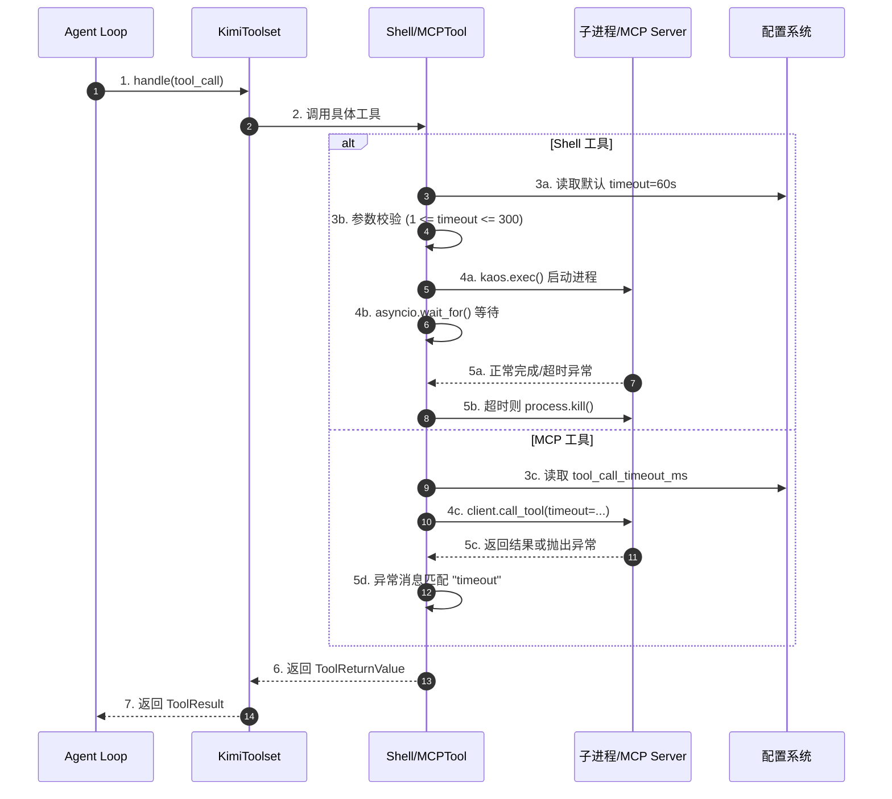
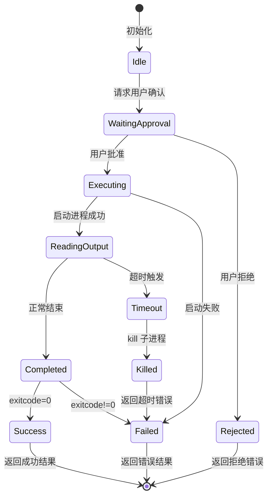
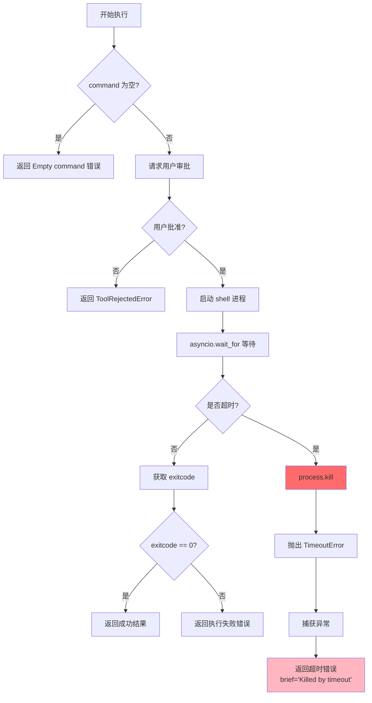
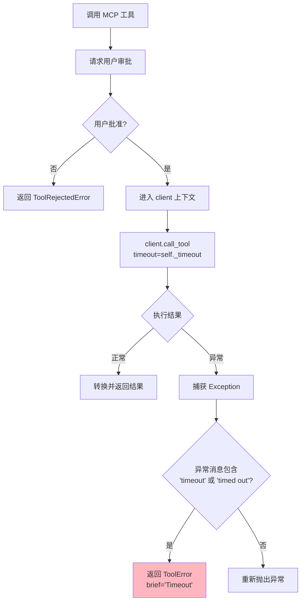
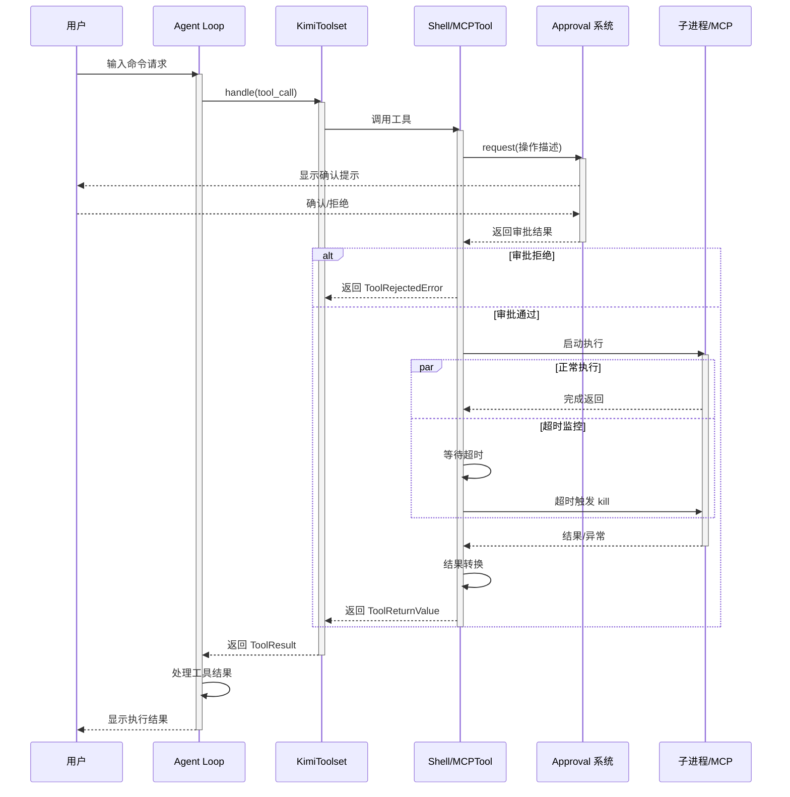
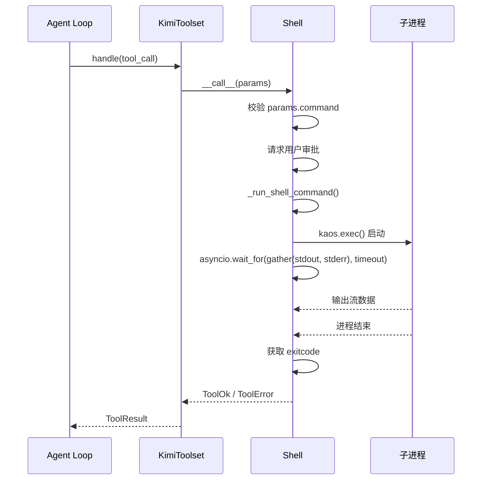
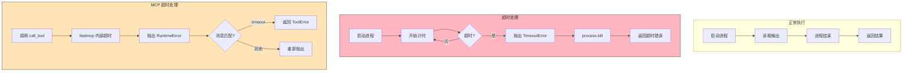
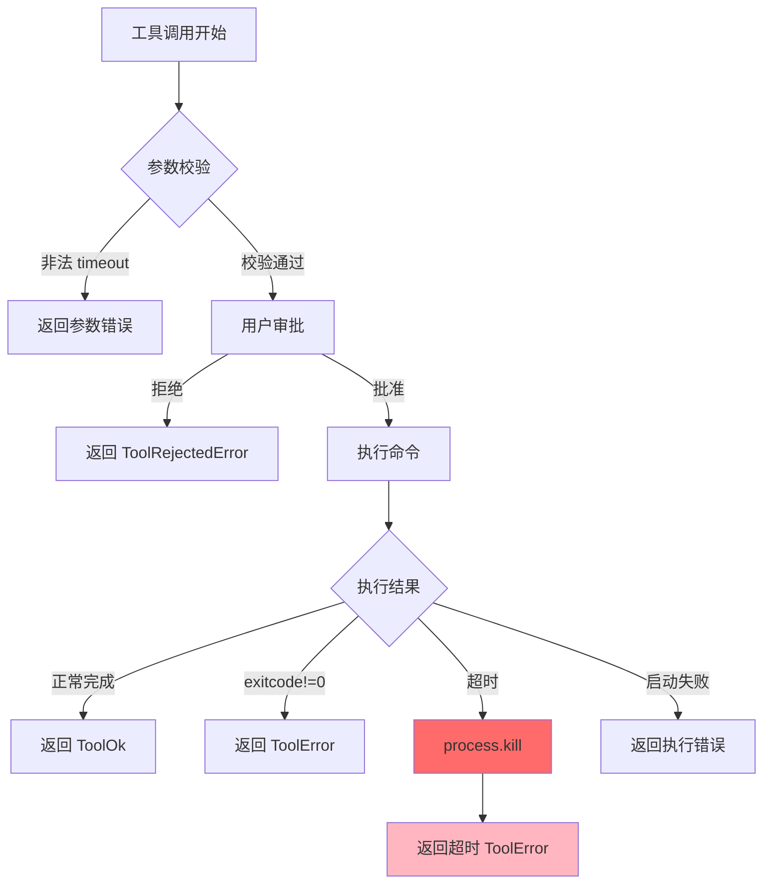
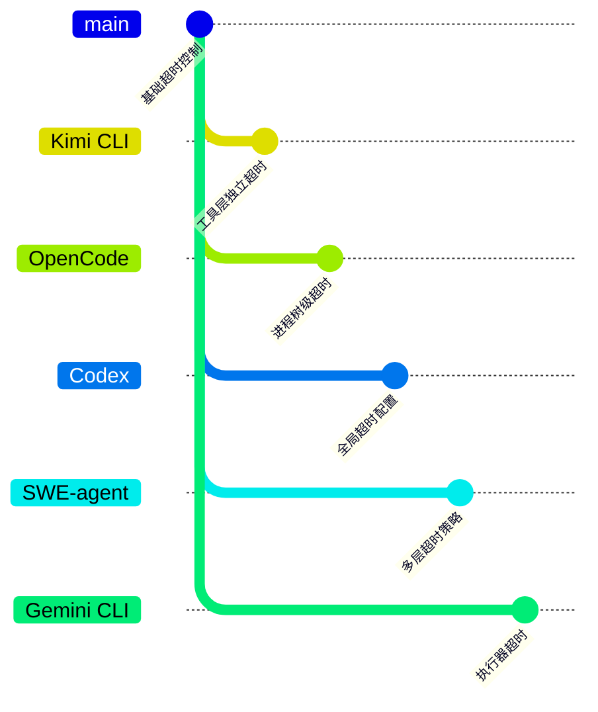

# Kimi CLI 工具执行超时机制

> **阅读指南**
>
> | 属性 | 说明 |
> |-----|------|
> | 预计阅读 | 15-20 分钟 |
> | 前置文档 | `docs/kimi-cli/04-kimi-cli-agent-loop.md` |
> | 文档结构 | 结论 → 架构 → 机制 → 实现 → 对比 |
> | 代码呈现 | 关键代码直接展示，完整代码可折叠查看 |

---

## TL;DR（结论先行）

Kimi CLI 采用**分层超时控制策略**：Shell 工具默认 60s（上限 300s），MCP 工具默认 60s（可配置），超时后强制终止子进程并返回结构化错误，由 LLM 决定后续处理而非自动回滚。

Kimi CLI 的核心取舍：**工具层独立超时 + 错误上报**（对比 Codex 的全局超时控制、OpenCode 的进程树级超时清理）

### 核心要点速览

| 维度 | 关键决策 | 代码位置 |
|-----|---------|---------|
| Shell 超时 | 默认 60s，硬上限 300s | `src/kimi_cli/tools/shell/__init__.py:17,447` |
| MCP 超时 | 默认 60s，可配置 | `src/kimi_cli/config.py:129` |
| 超时实现 | `asyncio.wait_for` + `process.kill()` | `src/kimi_cli/tools/shell/__init__.py:113` |
| 错误处理 | 返回 ToolError，由 LLM 决策 | `src/kimi_cli/tools/shell/__init__.py:89-93` |
| 用户审批 | 所有危险操作前置确认 | `src/kimi_cli/tools/shell/__init__.py:67` |

---

## 1. 为什么需要这个机制？

### 1.1 问题场景

没有超时控制的场景：

```
用户请求: "运行一个长时间的数据处理脚本"
  → LLM: 生成 bash 命令
  → 执行: python train_model.py
  → 问题: 脚本陷入死循环或等待用户输入
  → 结果: Agent 永久挂起，无法响应后续指令
```

有超时控制的场景：

```
用户请求: "运行一个长时间的数据处理脚本"
  → LLM: 生成 bash 命令
  → 执行: python train_model.py (带 60s 超时)
  → 超时: 强制终止进程，返回 ToolError
  → LLM: "命令超时，建议分批处理或使用 nohup"
  → 用户: 获得明确反馈，可调整策略
```

### 1.2 核心挑战

| 挑战 | 不解决的后果 |
|-----|-------------|
| 命令无限期挂起 | Agent 失去响应，用户体验极差 |
| 超时后僵尸进程 | 系统资源泄漏，影响后续操作 |
| 超时信息丢失 | LLM 无法判断失败原因，无法给出合理建议 |
| 不同工具类型差异 | Shell/MCP/内部工具需要不同的超时策略 |

---

## 2. 整体架构

### 2.1 在系统中的位置

```text
┌─────────────────────────────────────────────────────────────┐
│ Agent Loop / KimiSoul                                        │
│ src/kimi_cli/soul/kimisoul.py                                │
│ - _step(): 调用工具                                          │
│ - _handle_tool_result(): 处理工具返回                        │
└───────────────────────┬─────────────────────────────────────┘
                        │ 调用工具
                        ▼
┌─────────────────────────────────────────────────────────────┐
│ ▓▓▓ 工具执行层 ▓▓▓                                           │
│ src/kimi_cli/soul/toolset.py                                 │
│ - KimiToolset.handle(): 工具分发                            │
│ - MCPTool.__call__(): MCP 工具执行                          │
│                                                              │
│ src/kimi_cli/tools/shell/__init__.py                         │
│ - Shell.__call__(): Shell 工具执行                          │
│ - _run_shell_command(): 超时控制核心                        │
└───────────────────────┬─────────────────────────────────────┘
                        │ 依赖
        ┌───────────────┼───────────────┐
        ▼               ▼               ▼
┌──────────────┐ ┌──────────────┐ ┌──────────────┐
│ asyncio      │ │ kaos (exec)  │ │ fastmcp      │
│ 超时等待      │ │ 进程管理      │ │ MCP 客户端   │
└──────────────┘ └──────────────┘ └──────────────┘
```

### 2.2 核心组件职责

| 组件 | 职责 | 代码位置 |
|-----|------|---------|
| `Shell` | Shell 工具封装，处理超时参数校验和执行 | `src/kimi_cli/tools/shell/__init__.py:33` |
| `MCPTool` | MCP 工具封装，从配置读取超时并执行 | `src/kimi_cli/soul/toolset.py:355` |
| `MCPClientConfig` | MCP 客户端配置，定义默认超时 60s | `src/kimi_cli/config.py:129` |
| `Params.timeout` | Shell 命令超时参数，默认 60s，上限 300s | `src/kimi_cli/tools/shell/__init__.py:22` |

### 2.3 核心组件交互关系



**关键交互说明**：

| 步骤 | 交互内容 | 设计意图 |
|-----|---------|---------|
| 1 | Agent Loop 向工具集发起调用 | 统一工具调用入口，支持内置和外部工具 |
| 2 | 工具集分发到具体工具类 | 根据工具类型选择不同的执行策略 |
| 3 | 读取超时配置并校验 | Shell 工具参数级控制，MCP 工具配置级控制 |
| 4 | 启动进程/调用 MCP 并设置超时 | 防止无限期等待 |
| 5 | 超时后强制终止 | 确保资源释放，避免僵尸进程 |
| 6-7 | 返回结构化错误 | LLM 可基于错误类型决定后续策略 |

---

## 3. 核心组件详细分析

### 3.1 Shell 工具超时机制

#### 职责定位

Shell 工具负责执行本地 shell 命令，提供命令级超时控制（默认 60s，可配置 1-300s）。

#### 状态机图



**状态说明**：

| 状态 | 说明 | 进入条件 | 退出条件 |
|-----|------|---------|---------|
| Idle | 等待调用 | 工具初始化 | 收到执行请求 |
| WaitingApproval | 等待审批 | 需要用户确认 | 用户响应 |
| Executing | 启动进程 | 获得审批 | 进程启动成功/失败 |
| ReadingOutput | 读取输出 | 进程启动 | 进程结束/超时 |
| Timeout | 超时触发 | 超过 timeout 时间 | 执行 kill |
| Killed | 终止进程 | 超时处理 | 进程被杀死 |

#### 关键算法逻辑



**算法要点**：

1. **前置校验**：空命令直接返回错误，避免无效执行
2. **用户审批**：所有 shell 命令需用户确认，安全优先
3. **超时处理**：使用 `asyncio.wait_for` 包装整个输出读取流程
4. **强制终止**：超时后调用 `process.kill()` 确保子进程被清理
5. **错误映射**：`TimeoutError` 转换为结构化 `ToolError`

#### 关键接口

| 接口 | 输入 | 输出 | 说明 | 代码位置 |
|-----|------|------|------|---------|
| `__call__()` | `Params` | `ToolReturnValue` | 工具入口 | `shell/__init__.py:50` |
| `_run_shell_command()` | command, callbacks, timeout | exitcode | 核心执行方法 | `shell/__init__.py:95` |
| `Params.timeout` | - | int (1-300) | 超时参数定义 | `shell/__init__.py:22` |

### 3.2 MCP 工具超时机制

#### 职责定位

MCP 工具负责调用外部 MCP Server 提供的工具，超时由全局配置控制（默认 60s）。

#### 内部数据流

```text
┌─────────────────────────────────────────────────────────────┐
│  配置层                                                      │
│  ├── config.toml: mcp.client.tool_call_timeout_ms            │
│  └── 默认: 60000ms (60s)                                     │
└──────────────────────────┬──────────────────────────────────┘
                           ▼
┌─────────────────────────────────────────────────────────────┐
│  初始化层                                                    │
│  ├── MCPTool.__init__():                                     │
│  │   self._timeout = timedelta(milliseconds=...)            │
│  └── 运行时从 runtime.config 读取                           │
└──────────────────────────┬──────────────────────────────────┘
                           ▼
┌─────────────────────────────────────────────────────────────┐
│  执行层                                                      │
│  ├── 用户审批                                                │
│  ├── client.call_tool(timeout=self._timeout)                │
│  └── 异常处理: 消息匹配 "timeout" 或 "timed out"             │
└──────────────────────────┬──────────────────────────────────┘
                           ▼
┌─────────────────────────────────────────────────────────────┐
│  错误处理层                                                  │
│  ├── 超时 → ToolError(brief="Timeout")                      │
│  └── 其他异常 → 重新抛出                                     │
└─────────────────────────────────────────────────────────────┘
```

#### 关键算法逻辑



**算法要点**：

1. **配置驱动**：超时从配置文件读取，非硬编码
2. **消息匹配**：fastmcp 超时抛出 `RuntimeError`，需通过消息内容识别
3. **用户提示**：超时错误包含配置调整建议，引导用户自助解决

### 3.3 组件间协作时序



**协作要点**：

1. **用户审批前置**：所有危险操作（shell/mcp）必须经过用户确认
2. **超时与正常流程并行**：使用 `asyncio.wait_for` 或 `setTimeout` 实现
3. **结果统一封装**：无论成功/失败/超时，都返回 `ToolReturnValue` 统一格式

---

## 4. 端到端数据流转

### 4.1 正常流程（详细版）



**数据变换详情**：

| 阶段 | 输入 | 处理 | 输出 | 代码位置 |
|-----|------|------|------|---------|
| 接收 | `ToolCall` | 查找工具、解析参数 | 工具实例 + 结构化参数 | `toolset.py:97` |
| 校验 | `Params` | Pydantic 校验 timeout 范围 | 校验后的参数对象 | `shell/__init__.py:20` |
| 执行 | command, timeout | `asyncio.wait_for` 包装 | exitcode 或 TimeoutError | `shell/__init__.py:113` |
| 结果 | exitcode/异常 | 转换为 ToolReturnValue | `ToolOk` 或 `ToolError` | `shell/__init__.py:82` |

### 4.2 超时异常流程



### 4.3 异常/边界流程



---

## 5. 关键代码实现

### 5.1 核心数据结构

**Shell 工具参数定义**：

```python
# src/kimi_cli/tools/shell/__init__.py:17
MAX_TIMEOUT = 5 * 60  # 300s 上限

class Params(BaseModel):
    command: str = Field(description="The bash command to execute.")
    timeout: int = Field(
        description=(
            "The timeout in seconds for the command to execute. "
            "If the command takes longer than this, it will be killed."
        ),
        default=60,  # 默认 60s
        ge=1,        # 最小 1s
        le=MAX_TIMEOUT,  # 最大 300s
    )
```

**MCP 客户端配置**：

```python
# src/kimi_cli/config.py:129
class MCPClientConfig(BaseModel):
    tool_call_timeout_ms: int = 60000  # 默认 60s
    """Timeout for tool calls in milliseconds."""
```

**字段说明**：

| 字段 | 类型 | 用途 |
|-----|------|------|
| `timeout` | `int` | Shell 命令超时时间（秒） |
| `tool_call_timeout_ms` | `int` | MCP 工具调用超时（毫秒） |
| `MAX_TIMEOUT` | `int` | Shell 超时硬上限（300s） |

### 5.2 主链路代码

**Shell 工具超时控制核心**：

```python
# src/kimi_cli/tools/shell/__init__.py:95-123
async def _run_shell_command(
    self,
    command: str,
    stdout_cb: Callable[[bytes], None],
    stderr_cb: Callable[[bytes], None],
    timeout: int,
) -> int:
    async def _read_stream(stream: AsyncReadable, cb: Callable[[bytes], None]):
        while True:
            line = await stream.readline()
            if line:
                cb(line)
            else:
                break

    process = await kaos.exec(*self._shell_args(command), env=get_clean_env())

    try:
        await asyncio.wait_for(
            asyncio.gather(
                _read_stream(process.stdout, stdout_cb),
                _read_stream(process.stderr, stderr_cb),
            ),
            timeout,
        )
        return await process.wait()
    except TimeoutError:
        await process.kill()
        raise
```

**MCP 工具超时处理**：

```python
# src/kimi_cli/soul/toolset.py:377-405
class MCPTool(CallableTool):
    def __init__(self, ..., runtime: Runtime, **kwargs):
        super().__init__(...)
        self._timeout = timedelta(
            milliseconds=runtime.config.mcp.client.tool_call_timeout_ms
        )

    async def __call__(self, *args, **kwargs) -> ToolReturnValue:
        # ... 审批逻辑 ...
        try:
            async with self._client as client:
                result = await client.call_tool(
                    self._mcp_tool.name,
                    kwargs,
                    timeout=self._timeout,
                    raise_on_error=False,
                )
                return convert_mcp_tool_result(result)
        except Exception as e:
            # fastmcp raises `RuntimeError` on timeout
            exc_msg = str(e).lower()
            if "timeout" in exc_msg or "timed out" in exc_msg:
                return ToolError(
                    message=(
                        f"Timeout while calling MCP tool `{self._mcp_tool.name}`. "
                        "You may explain to the user that the timeout config is set too low."
                    ),
                    brief="Timeout",
                )
            raise
```

**代码要点**：

1. **Shell 超时使用 `asyncio.wait_for`**：包装整个输出读取流程，超时后 kill 进程
2. **MCP 超时通过 client 参数传递**：由 fastmcp 内部处理，异常后通过消息匹配识别
3. **强制资源清理**：Shell 超时后显式调用 `process.kill()`，避免僵尸进程
4. **结构化错误返回**：超时错误包含 `brief="Timeout"`，便于 LLM 识别和处理

### 5.3 关键调用链

```text
KimiToolset.handle()          [src/kimi_cli/soul/toolset.py:97]
  -> tool.call()              [toolset.py:115]
    -> Shell.__call__()       [src/kimi_cli/tools/shell/__init__.py:50]
      - 参数校验 (timeout 范围)
      - 用户审批
      -> _run_shell_command() [shell/__init__.py:95]
        - kaos.exec() 启动进程
        - asyncio.wait_for() 等待输出
        - 超时则 process.kill()
      - 捕获 TimeoutError
      - 返回 ToolError(brief="Killed by timeout")

    -> MCPTool.__call__()     [src/kimi_cli/soul/toolset.py:380]
      - 从 config 读取 timeout
      - 用户审批
      -> client.call_tool(timeout=self._timeout)
        - fastmcp 内部超时处理
      - 异常消息匹配 "timeout"
      - 返回 ToolError(brief="Timeout")
```

---

## 6. 设计意图与 Trade-off

### 6.1 Kimi CLI 的选择

| 维度 | Kimi CLI 的选择 | 替代方案 | 取舍分析 |
|-----|----------------|---------|---------|
| 超时控制层级 | 工具层独立控制 | Agent 层统一控制 | 灵活性高，不同工具可配置不同超时，但缺乏全局协调 |
| Shell 超时实现 | `asyncio.wait_for` + `process.kill()` | 信号处理 (SIGALRM) | 跨平台兼容（Windows 支持），但依赖 asyncio 事件循环 |
| MCP 超时识别 | 异常消息字符串匹配 | 特定异常类型 | 兼容现有 fastmcp 实现，但依赖消息内容稳定性 |
| 超时后行为 | 返回错误，由 LLM 决策 | 自动重试/回滚 | 保持简单，不隐式改变状态，但需要 LLM 理解超时含义 |
| 用户审批 | 所有危险操作前置确认 | 仅首次确认/完全自动 | 安全性高，但增加交互成本 |

### 6.2 为什么这样设计？

**核心问题**：如何在保证安全的前提下，为不同类型的工具提供合理的超时控制？

**Kimi CLI 的解决方案**：

- **代码依据**：`src/kimi_cli/tools/shell/__init__.py:89-93`
- **设计意图**：工具层负责资源生命周期管理（启动、监控、终止），Agent 层负责决策
- **带来的好处**：
  - 职责清晰：工具管执行，Agent 管决策
  - 可预测：超时后资源被清理，不会泄漏
  - 可扩展：新增工具类型只需实现相同接口
- **付出的代价**：
  - 缺乏自动恢复：超时后需要 LLM 重新决策
  - 配置分散：不同工具超时配置位置不同

### 6.3 与其他项目的对比



| 项目 | 核心差异 | 适用场景 |
|-----|---------|---------|
| **Kimi CLI** | 工具层独立超时，超时后返回错误由 LLM 决策 | 需要细粒度控制、强调用户确认的场景 |
| **OpenCode** | `setTimeout` + 进程树清理 (`Shell.killTree`)，默认 2min | 需要确保超时后完全清理进程树的场景 |
| **Codex** | 全局 `timeout_secs` 配置，MCP 支持 `startup_timeout_sec` 和 `tool_timeout_sec` | 需要统一配置入口的企业环境 |
| **SWE-agent** | 三层超时：`execution_timeout` (30s) + `install_timeout` (300s) + `total_execution_timeout` (1800s)，支持连续超时计数退出 | 长时间运行的自动化任务，需要防止无限挂起 |
| **Gemini CLI** | 执行器级别超时控制，结合流式输出处理 | 需要精细控制流式执行的场景 |

**详细对比分析**：

| 特性 | Kimi CLI | OpenCode | Codex | SWE-agent |
|-----|----------|----------|-------|-----------|
| Shell 默认超时 | 60s | 120s | 可配置 | 30s |
| Shell 最大超时 | 300s (硬限制) | 无限制 | 无限制 | 可配置 |
| MCP 超时 | 60s (可配置) | - | 可配置 | - |
| 超时后行为 | kill 进程，返回错误 | kill 进程树，返回元数据 | 依赖具体实现 | 计数，连续超时退出 |
| 用户确认 | 每次执行前 | 权限系统控制 | 可配置 | 自动化模式无确认 |
| 跨平台 | asyncio (全平台) | Node.js spawn (全平台) | Rust (全平台) | Python (全平台) |

---

## 7. 边界情况与错误处理

### 7.1 终止条件

| 终止原因 | 触发条件 | 代码位置 |
|---------|---------|---------|
| 正常完成 | 进程在 timeout 内结束 | `shell/__init__.py:120` |
| 超时终止 | 超过 `params.timeout` | `shell/__init__.py:121-123` |
| 用户拒绝 | 审批未通过 | `shell/__init__.py:67` |
| 启动失败 | `kaos.exec` 抛出异常 | `shell/__init__.py:77` |
| MCP 超时 | fastmcp 调用超时 | `toolset.py:397-404` |

### 7.2 超时/资源限制

```python
# src/kimi_cli/tools/shell/__init__.py:17
MAX_TIMEOUT = 5 * 60  # 300s 硬上限

# src/kimi_cli/config.py:132
class MCPClientConfig(BaseModel):
    tool_call_timeout_ms: int = 60000  # 60s 默认
```

### 7.3 错误恢复策略

| 错误类型 | 处理策略 | 代码位置 |
|---------|---------|---------|
| TimeoutError (Shell) | kill 进程，返回 `ToolError(brief="Killed by timeout")` | `shell/__init__.py:89-93` |
| RuntimeError 含 timeout (MCP) | 返回 `ToolError(brief="Timeout")` | `toolset.py:397-404` |
| 进程启动失败 | 异常向上传播，由调用方处理 | `shell/__init__.py:77` |
| 用户拒绝 | 返回 `ToolRejectedError` | `shell/__init__.py:67` |

---

## 8. 关键代码索引

| 功能 | 文件 | 行号 | 说明 |
|-----|------|------|------|
| Shell 工具入口 | `src/kimi_cli/tools/shell/__init__.py` | 50 | `Shell.__call__()` 方法 |
| Shell 参数定义 | `src/kimi_cli/tools/shell/__init__.py` | 20 | `Params` 类，含 timeout 字段 |
| Shell 超时上限 | `src/kimi_cli/tools/shell/__init__.py` | 17 | `MAX_TIMEOUT = 300` |
| Shell 执行核心 | `src/kimi_cli/tools/shell/__init__.py` | 95 | `_run_shell_command()` 方法 |
| Shell 超时处理 | `src/kimi_cli/tools/shell/__init__.py` | 89 | TimeoutError 捕获与处理 |
| MCP 工具定义 | `src/kimi_cli/soul/toolset.py` | 355 | `MCPTool` 类 |
| MCP 超时配置 | `src/kimi_cli/soul/toolset.py` | 377 | `_timeout` 初始化 |
| MCP 超时处理 | `src/kimi_cli/soul/toolset.py` | 394 | 异常消息匹配 timeout |
| MCP 配置定义 | `src/kimi_cli/config.py` | 129 | `MCPClientConfig` 类 |
| 工具集管理 | `src/kimi_cli/soul/toolset.py` | 71 | `KimiToolset` 类 |

---

## 9. 延伸阅读

- 前置知识：`docs/kimi-cli/04-kimi-cli-agent-loop.md`
- 相关机制：`docs/kimi-cli/questions/kimi-cli-checkpoint-implementation.md`
- 对比分析：`docs/codex/04-codex-agent-loop.md`
- MCP 协议：`docs/comm/comm-mcp-integration.md`

---

*✅ Verified: 基于 kimi-cli/src/kimi_cli/tools/shell/__init__.py:17-129、kimi-cli/src/kimi_cli/soul/toolset.py:355-405、kimi-cli/src/kimi_cli/config.py:129-133 等源码分析*

*基于版本：kimi-cli (baseline 2026-02-08) | 最后更新：2026-02-24*
