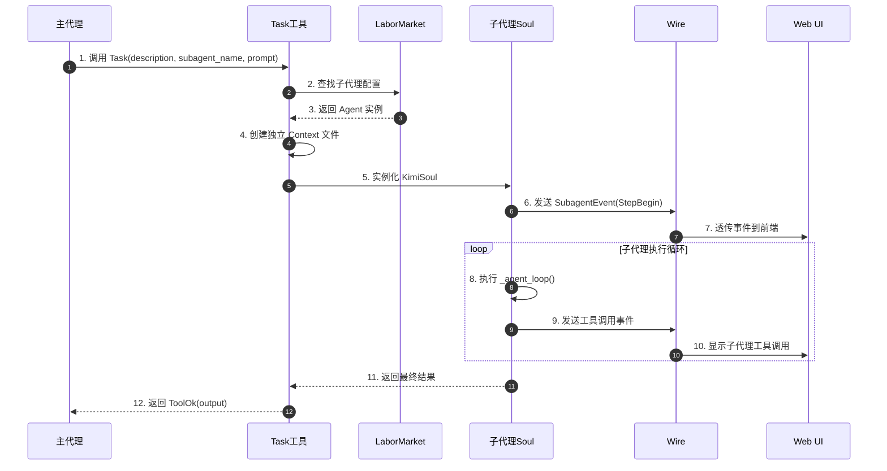
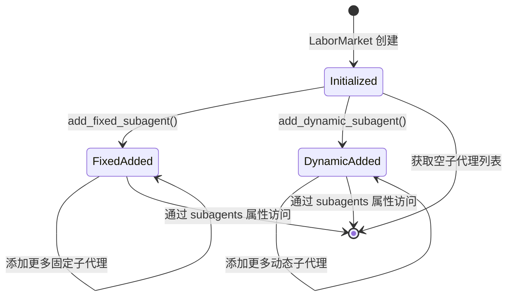
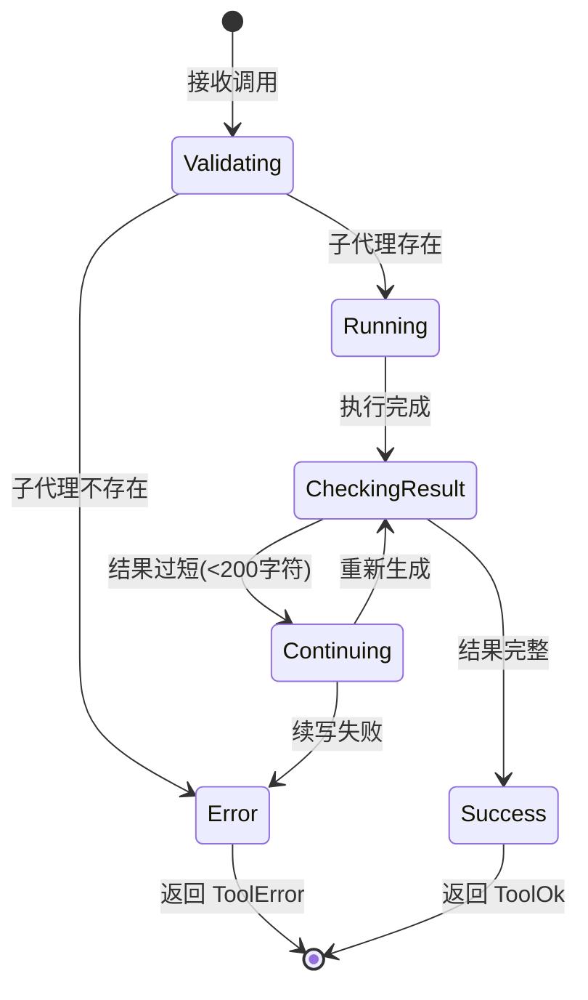
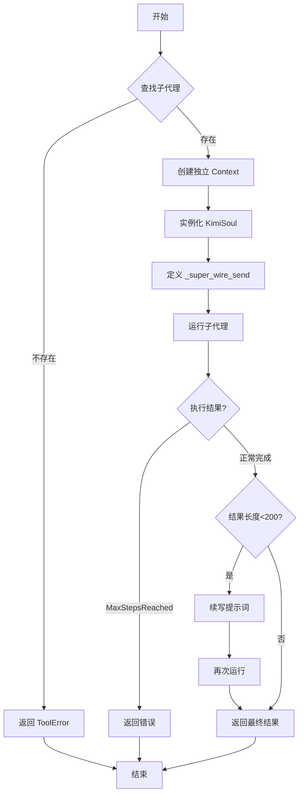
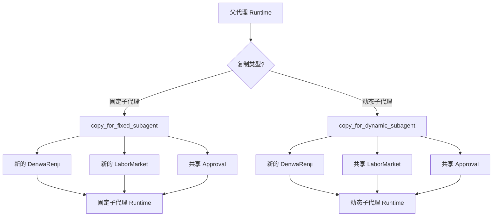
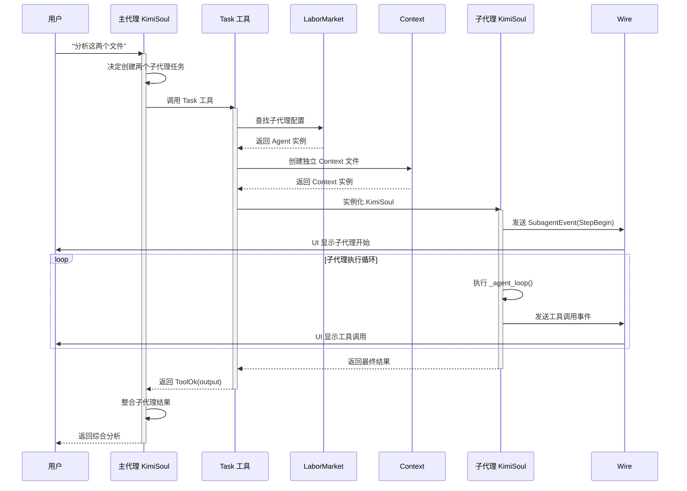
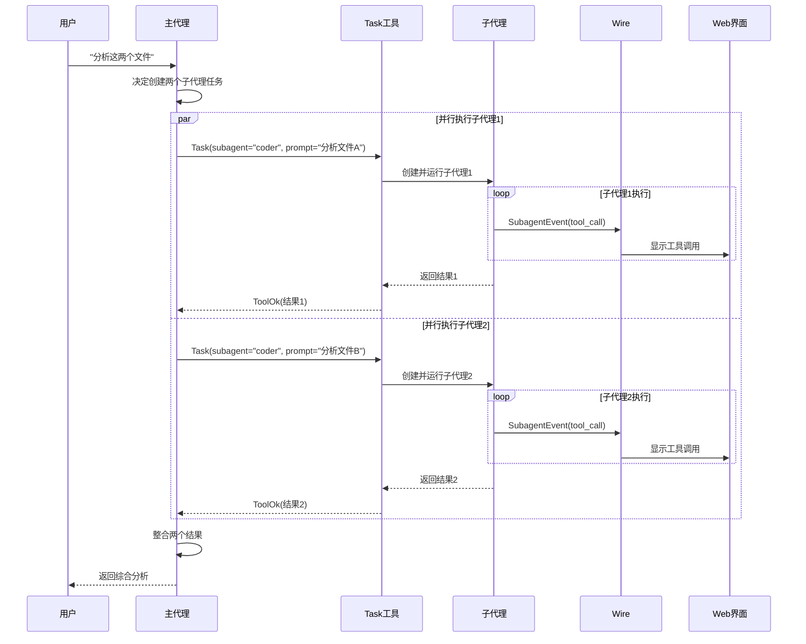
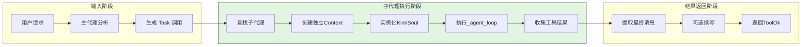
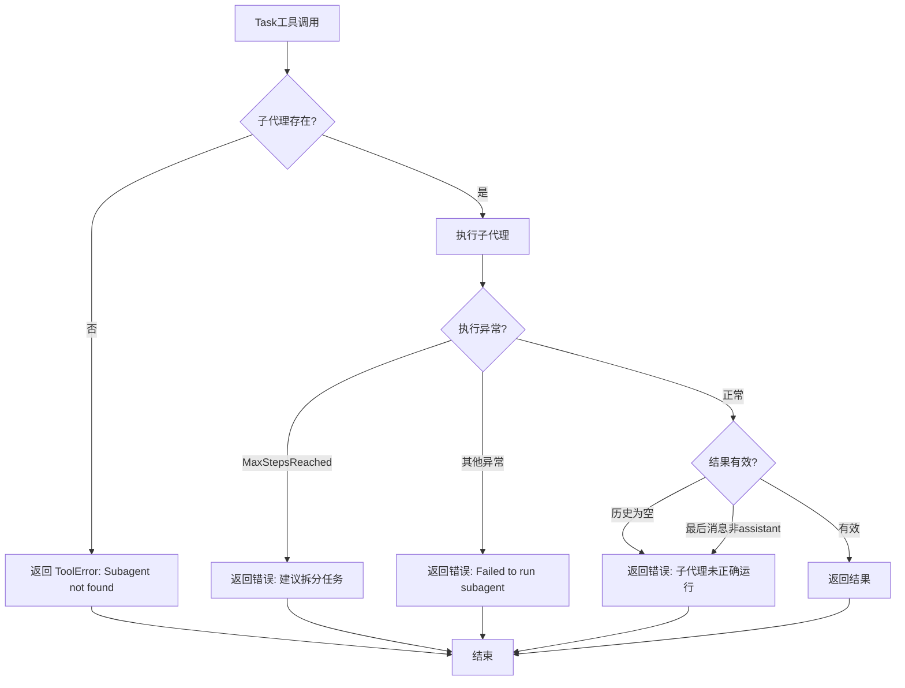
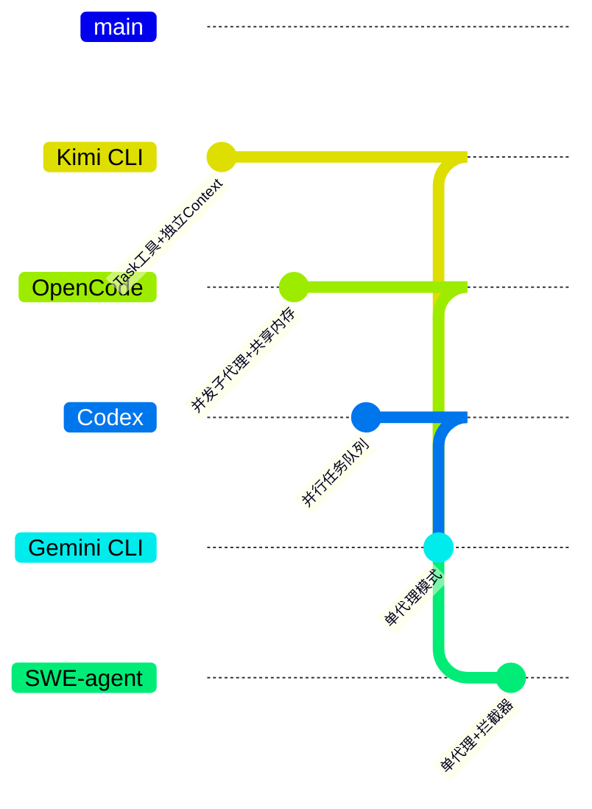

# Kimi CLI Subagent 实现分析

> **阅读指南**
>
> | 属性 | 说明 |
> |-----|------|
> | 预计阅读 | 20-25 分钟 |
> | 前置文档 | `docs/kimi-cli/04-kimi-cli-agent-loop.md`、`docs/kimi-cli/07-kimi-cli-memory-context.md` |
> | 文档结构 | 速览 → 架构 → 组件分析 → 数据流转 → 实现细节 → 对比 |
> | 代码呈现 | 关键代码直接展示，完整代码可折叠查看 |

---

## TL;DR（结论先行）

一句话定义：Kimi CLI 的 Subagent 是一种**基于 Task 工具的上下文隔离型子代理机制**，允许主代理通过 `Task` 工具动态创建和调用子代理，实现任务并行化和上下文隔离。

Kimi CLI 的核心取舍：**同步顺序执行 + 独立上下文隔离**（对比 OpenCode 的并发子代理、Codex 的并行任务队列）

### 核心要点速览

| 维度 | 关键决策 | 代码位置 |
|-----|---------|---------|
| 子代理管理 | LaborMarket 统一管理固定和动态子代理 | `kimi-cli/src/kimi_cli/soul/agent.py:168` |
| 上下文隔离 | 独立 Context 文件，完全隔离主代理上下文 | `kimi-cli/src/kimi_cli/tools/multiagent/task.py:256` |
| 事件透传 | SubagentEvent 包装子代理事件，保持 UI 可见性 | `kimi-cli/src/kimi_cli/wire/types.py:105` |
| 动态创建 | CreateSubagent 工具支持运行时创建子代理 | `kimi-cli/src/kimi_cli/tools/multiagent/create.py:23` |
| 执行模式 | 同步顺序执行，单次响应可包含多个 Task 调用 | `kimi-cli/src/kimi_cli/tools/multiagent/task.py:83` |

---

## 1. 为什么需要这个机制？（解决什么问题）

### 1.1 问题场景

没有 Subagent 机制时：
- 主代理处理复杂任务时，上下文会被中间步骤（如搜索、调试、代码修复）污染
- 用户无法看到子任务的执行过程，只能看到最终结果
- 多个独立子任务只能串行执行，效率低下

有 Subagent 机制时：
- 主代理可以委托子任务给子代理，保持主上下文干净
- 子代理在独立上下文中执行，失败不影响主代理
- 多个子代理可以并行启动（通过单次响应中的多个 Task 工具调用）

```
示例场景：
用户请求："分析这两个文件的依赖关系"

没有 Subagent：
  → 主代理读取文件A → 上下文增加文件A内容
  → 主代理读取文件B → 上下文增加文件B内容
  → 主代理分析依赖 → 上下文被污染，token 累积

有 Subagent：
  → 主代理创建子代理1分析文件A → 独立上下文
  → 主代理创建子代理2分析文件B → 独立上下文
  → 子代理并行执行 → 主上下文只保留最终结果
```

### 1.2 核心挑战

| 挑战 | 不解决的后果 |
|-----|-------------|
| 上下文隔离 | 子任务的历史记录污染主上下文，导致 token 超限或注意力分散 |
| 状态同步 | 子代理的状态变化无法正确反映到主代理的 UI 上 |
| 生命周期管理 | 子代理创建后无法正确清理，导致资源泄漏 |
| 并行执行 | 多个子任务只能串行执行，效率低下 |

---

## 2. 整体架构（ASCII 图）

### 2.1 在系统中的位置

```text
┌─────────────────────────────────────────────────────────────┐
│ CLI 入口 / Session Runtime                                   │
│ kimi-cli/src/kimi_cli/cli/__init__.py                        │
└───────────────────────┬─────────────────────────────────────┘
                        │ 加载 Agent
                        ▼
┌─────────────────────────────────────────────────────────────┐
│ Agent 加载器                                                 │
│ kimi-cli/src/kimi_cli/soul/agent.py:load_agent()            │
│ - 解析 agent.yaml 中的 subagents 配置                        │
│ - 创建 LaborMarket 管理子代理                                │
└───────────────────────┬─────────────────────────────────────┘
                        │
        ┌───────────────┼───────────────┐
        ▼               ▼               ▼
┌──────────────┐ ┌──────────────┐ ┌──────────────┐
│ 主代理 (Main) │ │ 固定子代理    │ │ 动态子代理    │
│              │ │ (Fixed)       │ │ (Dynamic)    │
│ - Task 工具   │ │ - coder      │ │ - 运行时创建  │
│ - CreateSub  │ │ - 预定义配置  │ │ - 用户自定义  │
└──────┬───────┘ └──────────────┘ └──────────────┘
       │
       │ 调用 Task 工具
       ▼
┌─────────────────────────────────────────────────────────────┐
│ ▓▓▓ Task 工具执行 ▓▓▓                                        │
│ kimi-cli/src/kimi_cli/tools/multiagent/task.py              │
│ - 查找子代理                                                 │
│ - 创建独立 Context                                          │
│ - 运行 KimiSoul                                             │
│ - 收集结果                                                   │
└───────────────────────┬─────────────────────────────────────┘
                        │ SubagentEvent
                        ▼
┌─────────────────────────────────────────────────────────────┐
│ Wire 协议层                                                  │
│ kimi-cli/src/kimi_cli/wire/types.py:SubagentEvent           │
│ - 包装子代理事件                                             │
│ - 透传到 UI 层                                               │
└───────────────────────┬─────────────────────────────────────┘
                        │
                        ▼
┌─────────────────────────────────────────────────────────────┐
│ Web UI (React)                                              │
│ web/src/components/ai-elements/subagent-steps.tsx           │
│ - 渲染子代理执行步骤                                         │
│ - 显示工具调用状态                                           │
└─────────────────────────────────────────────────────────────┘
```

### 2.2 核心组件职责

| 组件 | 职责 | 代码位置 |
|-----|------|---------|
| `LaborMarket` | 管理所有子代理的注册和查找 | `kimi-cli/src/kimi_cli/soul/agent.py:168` |
| `Task` | 工具类，负责执行子代理任务 | `kimi-cli/src/kimi_cli/tools/multiagent/task.py:52` |
| `CreateSubagent` | 工具类，动态创建子代理 | `kimi-cli/src/kimi_cli/tools/multiagent/create.py:23` |
| `SubagentEvent` | Wire 事件类型，包装子代理事件 | `kimi-cli/src/kimi_cli/wire/types.py:105` |
| `KimiSoul` | 子代理的执行引擎 | `kimi-cli/src/kimi_cli/soul/kimisoul.py:89` |

### 2.3 核心组件交互关系



**关键交互说明**：

| 步骤 | 交互内容 | 设计意图 |
|-----|---------|---------|
| 1 | 主代理通过 Task 工具发起调用 | 将子代理调用统一为工具调用语义 |
| 4 | 创建独立 Context 文件 | 实现上下文隔离，子代理无法访问主上下文 |
| 6-7 | 通过 SubagentEvent 透传事件 | 保持用户体验一致性，子代理执行可见 |
| 11-12 | 仅返回最终文本结果 | 子代理的中间步骤不污染主上下文 |

---

## 3. 核心组件详细分析

### 3.1 LaborMarket 子代理管理器

#### 职责定位

`LaborMarket` 是子代理的注册中心，管理两种类型的子代理：
- **固定子代理 (Fixed)**：通过 `agent.yaml` 配置预定义
- **动态子代理 (Dynamic)**：运行时通过 `CreateSubagent` 工具创建

#### 状态机图



**状态说明**：

| 状态 | 说明 | 进入条件 | 退出条件 |
|-----|------|---------|---------|
| Initialized | 初始状态 | LaborMarket 实例化 | 添加子代理 |
| FixedAdded | 已添加固定子代理 | add_fixed_subagent() 调用 | 访问 subagents |
| DynamicAdded | 已添加动态子代理 | add_dynamic_subagent() 调用 | 访问 subagents |

#### 内部数据流

```text
┌─────────────────────────────────────────────────────────────┐
│  LaborMarket                                                │
│  kimi-cli/src/kimi_cli/soul/agent.py:168                   │
├─────────────────────────────────────────────────────────────┤
│                                                             │
│  ┌─────────────────┐    ┌─────────────────┐                │
│  │ fixed_subagents │    │ dynamic_subagents│               │
│  │  (预定义配置)    │    │  (运行时创建)    │               │
│  ├─────────────────┤    ├─────────────────┤                │
│  │ coder: Agent    │    │ custom_1: Agent │                │
│  │ ...             │    │ custom_2: Agent │                │
│  └────────┬────────┘    └────────┬────────┘                │
│           │                      │                          │
│           └──────────┬───────────┘                          │
│                      ▼                                      │
│              ┌───────────────┐                              │
│              │ subagents()   │                              │
│              │ (合并视图)     │                              │
│              └───────────────┘                              │
│                                                             │
└─────────────────────────────────────────────────────────────┘
```

#### 关键接口

| 接口 | 输入 | 输出 | 说明 | 代码位置 |
|-----|------|------|------|---------|
| `add_fixed_subagent()` | name, agent, description | - | 注册固定子代理 | `agent.py:179` |
| `add_dynamic_subagent()` | name, agent | - | 注册动态子代理 | `agent.py:184` |
| `subagents` | - | Mapping[str, Agent] | 获取所有子代理 | `agent.py:175` |

---

### 3.2 Task 工具执行器

#### 职责定位

`Task` 是调用子代理的入口工具，负责：
1. 查找指定的子代理
2. 创建隔离的执行上下文
3. 运行子代理并收集结果
4. 将子代理事件透传给主 Wire

#### 状态机图



**状态说明**：

| 状态 | 说明 | 进入条件 | 退出条件 |
|-----|------|---------|---------|
| Validating | 验证子代理 | 收到 Task 调用 | 子代理存在/不存在 |
| Running | 执行子代理 | 子代理存在 | 执行完成 |
| CheckingResult | 检查结果 | 执行完成 | 结果有效/过短 |
| Continuing | 续写结果 | 结果过短 | 续写完成/失败 |
| Success | 成功返回 | 结果完整 | 返回 ToolOk |
| Error | 错误返回 | 各种失败情况 | 返回 ToolError |

#### 内部数据流

```text
┌─────────────────────────────────────────────────────────────┐
│  输入层                                                      │
│  ├── Task 调用参数: description, subagent_name, prompt      │
│  └── LaborMarket 查找子代理                                  │
└──────────────────────────┬──────────────────────────────────┘
                           ▼
┌─────────────────────────────────────────────────────────────┐
│  处理层                                                      │
│  ├── 创建独立 Context 文件 (_get_subagent_context_file)     │
│  ├── 实例化 KimiSoul                                        │
│  ├── 定义 _super_wire_send 回调函数                          │
│  │   └── 包装 SubagentEvent 透传到主 Wire                   │
│  └── 运行子代理 (run_soul)                                  │
│      └── 执行 _agent_loop                                   │
└──────────────────────────┬──────────────────────────────────┘
                           ▼
┌─────────────────────────────────────────────────────────────┐
│  输出层                                                      │
│  ├── 提取最终响应 (context.history[-1])                     │
│  ├── 自动续写 (结果<200字符时)                              │
│  └── 返回 ToolOk(output=final_response)                     │
└─────────────────────────────────────────────────────────────┘
```

#### 关键算法逻辑



**算法要点**：

1. **分支选择逻辑**：根据子代理是否存在分流处理
2. **上下文隔离路径**：创建独立 Context 文件实现完全隔离
3. **事件透传路径**：通过 _super_wire_send 包装 SubagentEvent
4. **自动续写机制**：结果过短触发续写，确保返回完整信息

#### 关键代码实现

**关键代码**（核心逻辑）：

```python
# kimi-cli/src/kimi_cli/tools/multiagent/task.py:101-162
async def _run_subagent(self, agent: Agent, prompt: str) -> ToolReturnValue:
    """Run subagent with optional continuation for task summary."""
    super_wire = get_wire_or_none()
    current_tool_call = get_current_tool_call_or_none()
    current_tool_call_id = current_tool_call.id

    def _super_wire_send(msg: WireMessage) -> None:
        # 关键：将子代理事件包装为 SubagentEvent
        if isinstance(msg, ApprovalRequest | ApprovalResponse | ToolCallRequest):
            super_wire.soul_side.send(msg)  # 审批请求直接透传
            return
        event = SubagentEvent(
            task_tool_call_id=current_tool_call_id,
            event=msg,
        )
        super_wire.soul_side.send(event)

    # 创建独立的 Context 文件
    subagent_context_file = await self._get_subagent_context_file()
    context = Context(file_backend=subagent_context_file)
    soul = KimiSoul(agent, context=context)

    # 运行子代理
    await run_soul(soul, prompt, _ui_loop_fn, asyncio.Event())

    # 检查结果并可能续写
    final_response = context.history[-1].extract_text(sep="\n")
    if len(final_response) < 200:
        await run_soul(soul, CONTINUE_PROMPT, _ui_loop_fn, asyncio.Event())

    return ToolOk(output=final_response)
```

**设计意图**：
1. **事件包装机制**：通过 `SubagentEvent` 包装子代理事件，前端可区分来源
2. **审批透传优化**：审批请求直接透传，避免嵌套审批复杂度
3. **上下文隔离策略**：独立 Context 文件确保子代理无法访问主上下文
4. **自动续写设计**：结果过短触发续写，确保返回信息完整

<details>
<summary>查看完整实现</summary>

```python
# kimi-cli/src/kimi_cli/tools/multiagent/task.py:52-162
class Task(CallableTool):
    """Task tool for invoking subagents."""

    def __init__(self, runtime: Runtime):
        self._runtime = runtime

    @property
    def name(self) -> str:
        return "task"

    @property
    def description(self) -> str:
        return "Invoke a subagent to perform a task."

    @property
    def schema(self) -> dict[str, Any]:
        return {
            "type": "object",
            "properties": {
                "description": {
                    "type": "string",
                    "description": "A brief description of the task.",
                },
                "subagent_name": {
                    "type": "string",
                    "description": "The name of the subagent to invoke.",
                    "enum": list(self._runtime.labor_market.subagents.keys()),
                },
                "prompt": {
                    "type": "string",
                    "description": "The prompt to send to the subagent.",
                },
            },
            "required": ["description", "subagent_name", "prompt"],
        }

    async def __call__(self, params: dict[str, Any]) -> ToolReturnValue:
        subagent_name = params["subagent_name"]
        if subagent_name not in self._runtime.labor_market.subagents:
            return ToolError(
                message=f"Subagent '{subagent_name}' not found.",
                brief=f"Available subagents: {', '.join(self._runtime.labor_market.subagents.keys())}",
            )

        agent = self._runtime.labor_market.subagents[subagent_name]
        return await self._run_subagent(agent, params["prompt"])

    async def _run_subagent(self, agent: Agent, prompt: str) -> ToolReturnValue:
        """Run subagent with optional continuation for task summary."""
        super_wire = get_wire_or_none()
        current_tool_call = get_current_tool_call_or_none()
        current_tool_call_id = current_tool_call.id

        def _super_wire_send(msg: WireMessage) -> None:
            # 关键：将子代理事件包装为 SubagentEvent
            if isinstance(msg, ApprovalRequest | ApprovalResponse | ToolCallRequest):
                super_wire.soul_side.send(msg)  # 审批请求直接透传
                return
            event = SubagentEvent(
                task_tool_call_id=current_tool_call_id,
                event=msg,
            )
            super_wire.soul_side.send(event)

        # 创建独立的 Context 文件
        subagent_context_file = await self._get_subagent_context_file()
        context = Context(file_backend=subagent_context_file)
        soul = KimiSoul(agent, context=context)

        # 运行子代理
        await run_soul(soul, prompt, _ui_loop_fn, asyncio.Event())

        # 检查结果并可能续写
        final_response = context.history[-1].extract_text(sep="\n")
        if len(final_response) < 200:
            await run_soul(soul, CONTINUE_PROMPT, _ui_loop_fn, asyncio.Event())

        return ToolOk(output=final_response)
```

</details>

---

### 3.3 CreateSubagent 动态子代理创建器

#### 职责定位

允许主代理在运行时动态创建自定义子代理，用于：
- 定义特定角色的代理（如 "code_reviewer", "test_writer"）
- 复用相同的工具集但使用不同的 system prompt

#### 关键代码实现

**关键代码**（核心逻辑）：

```python
# kimi-cli/src/kimi_cli/tools/multiagent/create.py:33-50
async def __call__(self, params: Params) -> ToolReturnValue:
    if params.name in self._runtime.labor_market.subagents:
        return ToolError(message=f"Subagent with name '{params.name}' already exists.")

    subagent = Agent(
        name=params.name,
        system_prompt=params.system_prompt,
        toolset=self._toolset,  # 共享父代理的工具集
        runtime=self._runtime.copy_for_dynamic_subagent(),
    )
    self._runtime.labor_market.add_dynamic_subagent(params.name, subagent)
    return ToolOk(output="Available subagents: " + ", ".join(...))
```

**设计意图**：
1. **工具集共享**：动态子代理共享父代理的 `toolset`，确保工具一致性
2. **Runtime 复制**：使用 `copy_for_dynamic_subagent()` 创建独立的 Runtime 实例
3. **LaborMarket 共享**：动态子代理共享父代理的 LaborMarket，可以访问其他动态子代理

---

### 3.4 Runtime 复制策略



**设计意图**：
- **固定子代理**：完全隔离，有自己的 LaborMarket（不能访问其他子代理）
- **动态子代理**：可以访问其他动态子代理（因为共享 LaborMarket）
- **Approval 共享**：所有子代理共享父代理的审批状态（YOLO 模式等）

---

### 3.5 组件间协作时序

展示多个组件如何协作完成一个完整的子代理调用流程。



**协作要点**：

1. **主代理与 Task 工具**：通过工具调用语义发起子代理调用
2. **Task 工具与 LaborMarket**：查找子代理配置
3. **Task 工具与 Context**：创建完全隔离的上下文
4. **子代理与 Wire**：通过 SubagentEvent 透传事件到 UI

---

## 4. 端到端数据流转

### 4.1 正常流程（详细版）



**数据变换详情**：

| 阶段 | 输入 | 处理 | 输出 | 代码位置 |
|-----|------|------|------|---------|
| 接收 | Task 调用参数 | 查找子代理 | Agent 实例 | `task.py:83-90` |
| 隔离 | Agent 实例 | 创建独立 Context | Context + KimiSoul | `task.py:256-258` |
| 执行 | prompt | 运行子代理 | 执行事件流 | `task.py:261` |
| 收集 | 执行结果 | 提取最终响应 | final_response | `task.py:264` |
| 续写 | 短结果(<200) | 触发续写 | 完整结果 | `task.py:265-266` |
| 返回 | 最终结果 | 包装为 ToolOk | ToolReturnValue | `task.py:268` |

### 4.2 数据流向图



### 4.3 异常/边界流程



---

## 5. 关键代码实现

### 5.1 核心数据结构

```python
# kimi-cli/src/kimi_cli/soul/agent.py:168-186
class LaborMarket:
    def __init__(self):
        self.fixed_subagents: dict[str, Agent] = {}
        self.fixed_subagent_descs: dict[str, str] = {}
        self.dynamic_subagents: dict[str, Agent] = {}

    @property
    def subagents(self) -> Mapping[str, Agent]:
        """Get all subagents in the labor market."""
        return {**self.fixed_subagents, **self.dynamic_subagents}
```

**字段说明**：

| 字段 | 类型 | 用途 |
|-----|------|------|
| `fixed_subagents` | `dict[str, Agent]` | 预定义的固定子代理（如 coder） |
| `fixed_subagent_descs` | `dict[str, str]` | 固定子代理的描述信息，用于 Task 工具提示 |
| `dynamic_subagents` | `dict[str, Agent]` | 运行时动态创建的子代理 |

### 5.2 SubagentEvent 定义

```python
# kimi-cli/src/kimi_cli/wire/types.py:105-139
class SubagentEvent(BaseModel):
    """
    An event from a subagent.
    """
    task_tool_call_id: str
    """The ID of the task tool call associated with this subagent."""
    event: Event
    """The event from the subagent."""
```

### 5.3 关键调用链

```text
Task.__call__()                    [kimi-cli/src/kimi_cli/tools/multiagent/task.py:83]
  -> _run_subagent()               [task.py:101]
    -> get_wire_or_none()          [kimi-cli/src/kimi_cli/soul/__init__.py:189]
    -> _get_subagent_context_file() [task.py:71]
      -> next_available_rotation() [kimi-cli/src/kimi_cli/utils/path.py]
    -> Context()                   [kimi-cli/src/kimi_cli/soul/context.py]
    -> KimiSoul()                  [kimi-cli/src/kimi_cli/soul/kimisoul.py:89]
    -> run_soul()                  [kimi-cli/src/kimi_cli/soul/__init__.py:121]
      - 创建 Wire
      - 启动 UI loop
      - 执行 soul.run()
```

---

## 6. 设计意图与 Trade-off

### 6.1 Kimi CLI 的选择

| 维度 | Kimi CLI 的选择 | 替代方案 | 取舍分析 |
|-----|----------------|---------|---------|
| 执行模式 | 同步顺序执行 | 完全并行异步 | 简单可控，避免并发冲突；但无法利用真正的并行计算 |
| 上下文隔离 | 独立 Context 文件 | 共享上下文 | 彻底隔离，子代理失败不影响主代理；但无法自动共享上下文 |
| 子代理类型 | 固定 + 动态 | 仅预定义 | 灵活性高，可运行时创建；但需要管理生命周期 |
| 事件传递 | SubagentEvent 包装 | 直接透传 | 前端可区分来源，支持嵌套；但增加一层包装开销 |
| 结果处理 | 仅返回最终文本 | 返回完整历史 | 主上下文干净；但丢失中间思考过程 |

### 6.2 为什么这样设计？

**核心问题**：如何在保持主代理上下文干净的同时，让用户看到子代理的执行过程？

**Kimi CLI 的解决方案**：
- **代码依据**：`kimi-cli/src/kimi_cli/tools/multiagent/task.py:109-119`
- **设计意图**：通过 `_super_wire_send` 函数将子代理事件包装为 `SubagentEvent`，既保持了上下文隔离（主代理只收到最终结果），又通过 Wire 协议让用户看到执行过程
- **带来的好处**：
  - 主代理上下文不会被污染
  - 用户可以在 UI 上看到子代理的执行步骤
  - 支持嵌套子代理（子代理可以再调用 Task）
- **付出的代价**：
  - 子代理的中间思考过程不会传递给主代理
  - 需要额外的 Context 文件管理

### 6.3 与其他项目的对比



| 项目 | 核心差异 | 适用场景 |
|-----|---------|---------|
| **Kimi CLI** | Task 工具 + 独立 Context 文件，同步顺序执行 | 需要上下文隔离的复杂任务分解，子代理执行过程可见 |
| **OpenCode** | 并发子代理 + 共享内存，真正的并行执行 | 需要真正并行执行的高性能场景，如同时分析多个文件 |
| **Codex** | 并行任务队列，但无内置子代理机制 | 简单任务，不需要任务分解，依赖外部工具扩展 |
| **Gemini CLI** | 单代理模式，依赖大上下文窗口 | 单代理模式，依赖大上下文窗口处理复杂任务 |
| **SWE-agent** | 单代理模式，通过 forward_with_handling 实现错误恢复 | 专注软件工程任务，通过工具调用而非子代理实现功能分解 |

**详细对比分析**：

| 对比维度 | Kimi CLI | OpenCode | Codex | Gemini CLI | SWE-agent |
|---------|----------|----------|-------|-----------|-----------|
| **子代理实现方式** | Task 工具调用 | 内置并发子代理 | 无内置机制 | 无 | 无 |
| **上下文隔离级别** | 文件级完全隔离 | 进程级隔离 | - | - | - |
| **并行能力** | 伪并行（LLM 单次生成多个 Task） | 真并行（多进程） | 任务级并行 | 无 | 无 |
| **动态创建** | 支持（CreateSubagent 工具） | 支持 | - | - | - |
| **生命周期管理** | LaborMarket 统一管理 | 进程管理 | - | - | - |
| **事件可见性** | SubagentEvent 透传 | 独立输出流 | - | - | - |

---

## 7. 边界情况与错误处理

### 7.1 终止条件

| 终止原因 | 触发条件 | 代码位置 |
|---------|---------|---------|
| 子代理不存在 | `params.subagent_name not in subagents` | `task.py:86-90` |
| 执行异常 | `run_soul()` 抛出异常 | `task.py:95-99` |
| 步骤超限 | `MaxStepsReached` 异常 | `task.py:133-140` |
| 结果无效 | 历史为空或最后消息非 assistant | `task.py:147-148` |
| 结果过短 | 长度 < 200 字符，触发续写 | `task.py:153-159` |

### 7.2 超时/资源限制

```python
# kimi-cli/src/kimi_cli/tools/multiagent/task.py:25
MAX_CONTINUE_ATTEMPTS = 1  # 最大续写尝试次数
```

### 7.3 错误恢复策略

| 错误类型 | 处理策略 | 代码位置 |
|---------|---------|---------|
| 子代理不存在 | 返回 ToolError，提示可用子代理 | `task.py:87-90` |
| MaxStepsReached | 返回详细错误，建议拆分任务 | `task.py:134-140` |
| 执行异常 | 包装为 ToolError 返回 | `task.py:95-99` |
| 结果无效 | 返回通用错误提示 | `task.py:142-148` |

---

## 8. 关键代码索引

| 功能 | 文件 | 行号 | 说明 |
|-----|------|------|------|
| LaborMarket 定义 | `kimi-cli/src/kimi_cli/soul/agent.py` | 168-186 | 子代理注册中心 |
| Task 工具 | `kimi-cli/src/kimi_cli/tools/multiagent/task.py` | 52-162 | 子代理执行入口 |
| CreateSubagent 工具 | `kimi-cli/src/kimi_cli/tools/multiagent/create.py` | 23-50 | 动态子代理创建 |
| SubagentEvent 定义 | `kimi-cli/src/kimi_cli/wire/types.py` | 105-139 | 子代理事件包装 |
| Runtime 复制 | `kimi-cli/src/kimi_cli/soul/agent.py` | 126-154 | 固定/动态子代理 Runtime 创建 |
| 子代理加载 | `kimi-cli/src/kimi_cli/soul/agent.py` | 217-224 | agent.yaml 中子代理解析 |
| SubagentSpec 定义 | `kimi-cli/src/kimi_cli/agentspec.py` | 51-55 | 子代理配置规范 |
| Web UI 渲染 | `kimi-cli/web/src/components/ai-elements/subagent-steps.tsx` | 1-223 | 子代理步骤可视化 |

---

## 9. 延伸阅读

- 前置知识：`docs/kimi-cli/04-kimi-cli-agent-loop.md` - Agent Loop 详细分析
- 相关机制：`docs/kimi-cli/07-kimi-cli-memory-context.md` - Context 和 Checkpoint 机制
- 深度分析：`docs/kimi-cli/questions/kimi-cli-wire-protocol.md` - Wire 协议详解
- 跨项目对比：`docs/comm/comm-subagent-mechanism.md` - 跨项目子代理机制对比（如存在）

---

*✅ Verified: 基于 kimi-cli/src/kimi_cli/soul/agent.py:168、kimi-cli/src/kimi_cli/tools/multiagent/task.py:52、kimi-cli/src/kimi_cli/tools/multiagent/create.py:23 等源码分析*

*基于版本：kimi-cli (baseline 2026-02-08) | 最后更新：2026-03-03*
