# Kimi CLI 工具调用错误处理机制

> **阅读指南**
>
> | 属性 | 说明 |
> |-----|------|
> | 预计阅读 | 20-25 分钟 |
> | 前置文档 | `docs/kimi-cli/04-kimi-cli-agent-loop.md`、`docs/kimi-cli/06-kimi-cli-mcp-integration.md` |
> | 文档结构 | 速览 → 架构 → 组件分析 → 数据流转 → 实现细节 → 对比 |
> | 代码呈现 | 关键代码直接展示，完整代码可折叠查看 |

---

## TL;DR（结论先行）

一句话定义：Kimi CLI 采用 **四层 ToolError 继承体系** 与 **Checkpoint + D-Mail 时间旅行** 机制，通过 `ToolReturnValue` 统一封装成功与失败结果，实现了工具调用错误的优雅降级与状态回滚。

Kimi CLI 的核心取舍：**统一返回值封装 + 显式状态回滚**（对比 Codex 的异常抛出、Gemini CLI 的 Promise 链、OpenCode 的重试包装器、SWE-agent 的 forward_with_handling 拦截器）

### 核心要点速览

| 维度 | 关键决策 | 代码位置 |
|-----|---------|---------|
| 错误封装 | `ToolReturnValue` 统一封装成功/失败 | `kimi-cli/packages/kosong/src/kosong/tooling/__init__.py:112` |
| 错误分类 | 四层继承体系：NotFound/Parse/Validate/Runtime | `kimi-cli/packages/kosong/src/kosong/tooling/error.py:4-34` |
| 状态回滚 | Checkpoint + D-Mail 时间旅行机制 | `kimi-cli/src/kimi_cli/soul/kimisoul.py:428-451` |
| 用户审批 | `ToolRejectedError` 触发回滚 | `kimi-cli/src/kimi_cli/tools/utils.py:182` |
| API 重试 | tenacity 指数退避重试 | `kimi-cli/src/kimi_cli/soul/kimisoul.py:388` |

---

## 1. 为什么需要这个机制？（解决什么问题）

### 1.1 问题场景

没有统一错误处理：LLM 调用工具失败后，程序崩溃或陷入死循环，用户无法继续对话。

有统一错误处理：
- 工具参数错误 → 返回 `ToolValidateError` → LLM 自纠正并重试
- 工具未找到 → 返回 `ToolNotFoundError` → LLM 选择可用工具
- 用户拒绝执行 → 返回 `ToolRejectedError` → 触发 D-Mail 回滚到安全状态
- MCP 超时 → 返回 `ToolError` → LLM 向用户解释并建议调整配置

```
示例场景：
用户请求："删除所有日志文件"

没有错误处理：
  → LLM 调用 delete_file("*.log")
  → 工具抛出异常
  → 程序崩溃，用户无法继续

有错误处理：
  → LLM 调用 delete_file("*.log")
  → 触发用户审批
  → 用户拒绝
  → 返回 ToolRejectedError
  → 触发 D-Mail 回滚
  → LLM 收到提示，询问用户具体需求
```

### 1.2 核心挑战

| 挑战 | 不解决的后果 |
|-----|-------------|
| 错误类型多样 | 无法区分"参数错误"和"运行时错误"，导致错误的恢复策略 |
| 状态污染 | 工具部分执行后失败，上下文被污染，后续对话基于错误状态 |
| 用户干预 | 危险操作无法让用户确认，自动执行可能造成损失 |
| 外部工具超时 | MCP 工具无响应导致整个 Agent 卡住 |
| Token 溢出 | 长对话导致上下文超限，需要压缩但可能丢失关键信息 |

---

## 2. 整体架构（ASCII 图）

### 2.1 在系统中的位置

```text
┌─────────────────────────────────────────────────────────────────┐
│ Agent Loop / KimiSoul                                           │
│ kimi-cli/src/kimi_cli/soul/kimisoul.py:330                      │
│ - _agent_loop(): 捕获 BackToTheFuture 异常                      │
│ - _step(): 工具调用重试逻辑                                      │
└─────────────────────────┬───────────────────────────────────────┘
                          │ 调用/异常
                          ▼
┌─────────────────────────────────────────────────────────────────┐
│ ▓▓▓ Tool Error Handling ▓▓▓                                     │
│                                                                 │
│ ┌─────────────────────────────────────────────────────────────┐ │
│ │ ToolReturnValue (统一返回封装)                               │ │
│ │ kosong/tooling/__init__.py:112                              │ │
│ │ ├─ is_error: bool                                           │ │
│ │ ├─ output/message: 给模型看的                               │ │
│ │ └─ display: 给用户看的                                      │ │
│ └─────────────────────────────────────────────────────────────┘ │
│                              │                                  │
│        ┌─────────────────────┼─────────────────────┐            │
│        ▼                     ▼                     ▼            │
│ ┌──────────────┐    ┌──────────────┐    ┌──────────────┐       │
│ │   ToolOk     │    │  ToolError   │    │ ToolRejected │       │
│ │   (成功)     │    │   (错误基类) │    │   (用户拒绝) │       │
│ └──────────────┘    └──────┬───────┘    └──────────────┘       │
│                            │                                    │
│              ┌─────────────┼─────────────┐                     │
│              ▼             ▼             ▼                      │
│       ┌──────────┐ ┌──────────┐ ┌──────────┐                   │
│       │NotFound  │ │ ParseErr │ │ValidateErr│  RuntimeError    │
│       └──────────┘ └──────────┘ └──────────┘                   │
│                                                                 │
└─────────────────────────┬───────────────────────────────────────┘
                          │ 依赖/调用
        ┌─────────────────┼─────────────────┐
        ▼                 ▼                 ▼
┌──────────────┐ ┌──────────────┐ ┌──────────────┐
│ KimiToolset  │ │ Checkpoint   │ │  Approval    │
│ 工具路由     │ │ 状态回滚     │ │  用户审批    │
│ toolset.py   │ │ context.py   │ │ approval.py  │
└──────────────┘ └──────────────┘ └──────────────┘
```

### 2.2 核心组件职责

| 组件 | 职责 | 代码位置 |
|-----|------|---------|
| `ToolReturnValue` | 统一封装工具返回结果，区分成功/失败 | `kimi-cli/packages/kosong/src/kosong/tooling/__init__.py:112` |
| `ToolError` | 错误基类，定义错误消息和展示格式 | `kimi-cli/packages/kosong/src/kosong/tooling/__init__.py:158` |
| `ToolNotFoundError` | 工具路由失败时返回 | `kimi-cli/packages/kosong/src/kosong/tooling/error.py:4` |
| `ToolParseError` | JSON 参数解析失败时返回 | `kimi-cli/packages/kosong/src/kosong/tooling/error.py:14` |
| `ToolValidateError` | Schema 校验失败时返回 | `kimi-cli/packages/kosong/src/kosong/tooling/error.py:24` |
| `ToolRuntimeError` | 工具执行异常时返回 | `kimi-cli/packages/kosong/src/kosong/tooling/error.py:34` |
| `ToolRejectedError` | 用户拒绝审批时返回 | `kimi-cli/src/kimi_cli/tools/utils.py:182` |
| `KimiToolset.handle()` | 工具调用路由与错误封装 | `kimi-cli/src/kimi_cli/soul/toolset.py:97` |
| `BackToTheFuture` | 触发状态回滚的异常 | `kimi-cli/src/kimi_cli/soul/kimisoul.py:531` |
| `Approval` | 用户审批管理 | `kimi-cli/src/kimi_cli/soul/approval.py:34` |

### 2.3 核心组件交互关系

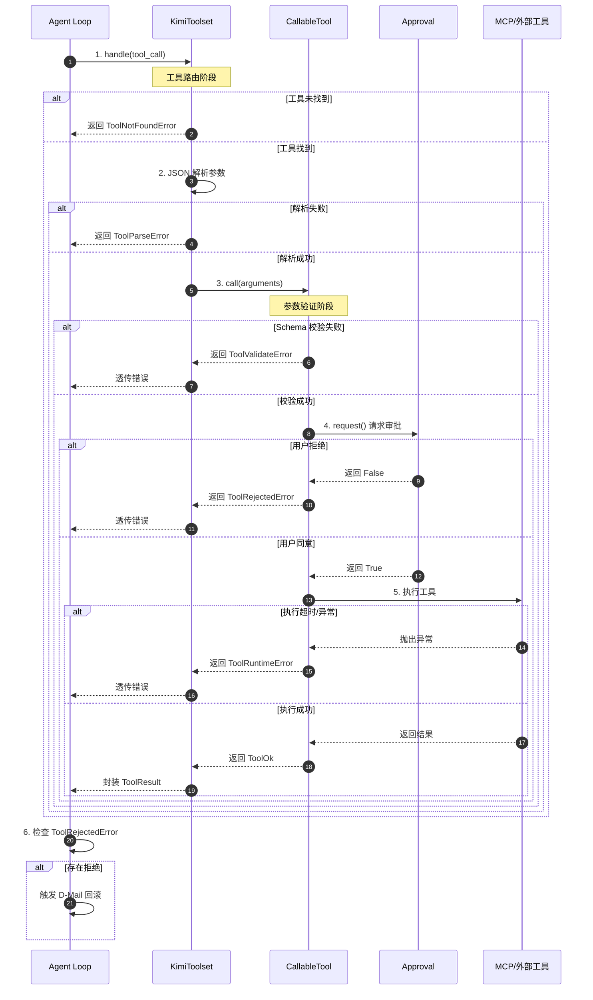

**关键交互说明**：

| 步骤 | 交互内容 | 设计意图 |
|-----|---------|---------|
| 1 | Agent Loop 调用 KimiToolset 路由工具 | 统一入口，集中处理错误 |
| 2 | JSON 解析在路由层完成 | 提前捕获格式错误，避免污染工具逻辑 |
| 3 | 参数验证在 CallableTool 层 | 职责分离，支持 JSONSchema 和 Pydantic 两种验证方式 |
| 4 | 审批请求内嵌在工具调用中 | 危险操作必须用户确认，yolo 模式可跳过 |
| 5 | 外部工具执行带超时控制 | MCP 工具默认 60 秒超时，防止无限等待 |
| 6 | 拒绝后触发状态回滚 | 通过 D-Mail 机制恢复到审批前的安全状态 |

---

## 3. 核心组件详细分析

### 3.1 ToolReturnValue 统一返回封装

#### 职责定位

作为工具调用的统一返回类型，封装成功和失败两种状态，分别提供面向模型和面向用户的信息。

#### 状态机图

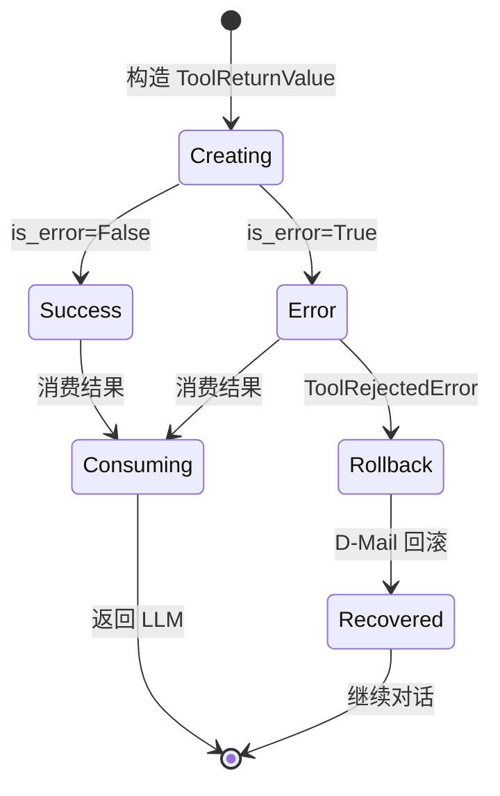

**状态说明**：

| 状态 | 说明 | 进入条件 | 退出条件 |
|-----|------|---------|---------|
| Creating | 创建结果 | 工具执行完成 | 设置 is_error |
| Success | 成功状态 | is_error=False | 消费结果 |
| Error | 错误状态 | is_error=True | 消费结果或回滚 |
| Rollback | 回滚中 | ToolRejectedError | 完成回滚 |
| Recovered | 已恢复 | 回滚完成 | 继续对话 |

#### 内部数据流

```text
┌─────────────────────────────────────────────────────────────┐
│  输入层：工具执行结果                                          │
│  ├── 成功结果 ──► ToolOk                                      │
│  │   ├── output: 工具输出内容                                  │
│  │   ├── message: 给模型的解释                                 │
│  │   └── display: 用户展示内容                                 │
│  │                                                           │
│  └── 错误结果 ──► ToolError 及其子类                           │
│      ├── message: 错误详情（给模型）                           │
│      ├── brief: 简短错误描述（给用户）                         │
│      └── output: 可选的错误输出                                │
└──────────────────────────┬──────────────────────────────────┘
                           ▼
┌─────────────────────────────────────────────────────────────┐
│  处理层：结果分类                                              │
│  ├── is_error: bool ──► 区分成功/失败                         │
│  ├── 模型消息组装 ──► 注入 LLM 上下文                          │
│  └── 用户展示组装 ──► UI 渲染                                  │
└──────────────────────────┬──────────────────────────────────┘
                           ▼
┌─────────────────────────────────────────────────────────────┐
│  输出层：消费结果                                              │
│  ├── Agent Loop ──► 决定是否继续/回滚                         │
│  ├── Context ──► 追加到对话历史                                │
│  └── UI ──► 展示给用户                                         │
└─────────────────────────────────────────────────────────────┘
```

#### 关键接口

| 接口 | 输入 | 输出 | 说明 | 代码位置 |
|-----|------|------|------|---------|
| `ToolOk.__init__()` | output, message, brief | ToolOk 实例 | 构造成功结果 | `kosong/tooling/__init__.py:143` |
| `ToolError.__init__()` | message, brief, output | ToolError 实例 | 构造错误结果 | `kosong/tooling/__init__.py:161` |
| `ToolReturnValue.brief` | - | str | 获取简短描述 | `kosong/tooling/__init__.py:131` |

---

### 3.2 KimiToolset 工具路由与错误处理

#### 职责定位

工具调用的统一入口，负责工具查找、参数解析、错误封装和 MCP 工具管理。

#### 状态机图

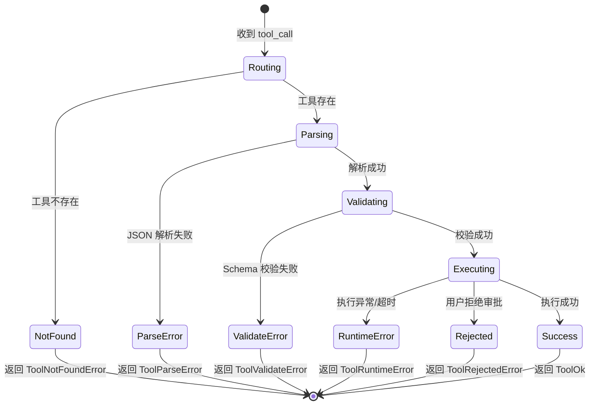

**状态说明**：

| 状态 | 说明 | 进入条件 | 退出条件 |
|-----|------|---------|---------|
| Routing | 工具路由 | 收到 tool_call | 找到/未找到工具 |
| Parsing | JSON 解析 | 找到工具 | 解析成功/失败 |
| Validating | 参数校验 | JSON 解析成功 | 校验通过/失败 |
| Executing | 工具执行 | 校验通过 | 成功/失败/拒绝 |
| NotFound | 工具未找到 | 路由失败 | 直接返回错误 |
| ParseError | 解析错误 | JSON 格式错误 | 直接返回错误 |
| ValidateError | 校验错误 | 参数不符合 Schema | 直接返回错误 |
| RuntimeError | 运行时错误 | 执行异常 | 直接返回错误 |
| Rejected | 用户拒绝 | 审批被拒绝 | 直接返回错误 |
| Success | 执行成功 | 工具正常完成 | 返回成功结果 |

#### 内部数据流

```text
┌─────────────────────────────────────────────────────────────┐
│  输入层                                                      │
│  ├── ToolCall (id, name, arguments)                         │
│  └── KimiToolset._tool_dict 路由表                          │
└──────────────────────────┬──────────────────────────────────┘
                           ▼
┌─────────────────────────────────────────────────────────────┐
│  处理层                                                      │
│  ├── 路由阶段                                                │
│  │   └── 检查工具存在性 ──► ToolNotFoundError               │
│  ├── 解析阶段                                                │
│  │   └── json.loads() ──► ToolParseError                    │
│  ├── 验证阶段                                                │
│  │   └── jsonschema.validate() ──► ToolValidateError        │
│  ├── 审批阶段                                                │
│  │   └── Approval.request() ──► ToolRejectedError           │
│  └── 执行阶段                                                │
│      └── 工具调用 ──► ToolRuntimeError / ToolOk             │
└──────────────────────────┬──────────────────────────────────┘
                           ▼
┌─────────────────────────────────────────────────────────────┐
│  输出层                                                      │
│  ├── 包装为 ToolResult                                      │
│  └── 返回给 Agent Loop                                      │
└─────────────────────────────────────────────────────────────┘
```

#### 关键算法逻辑

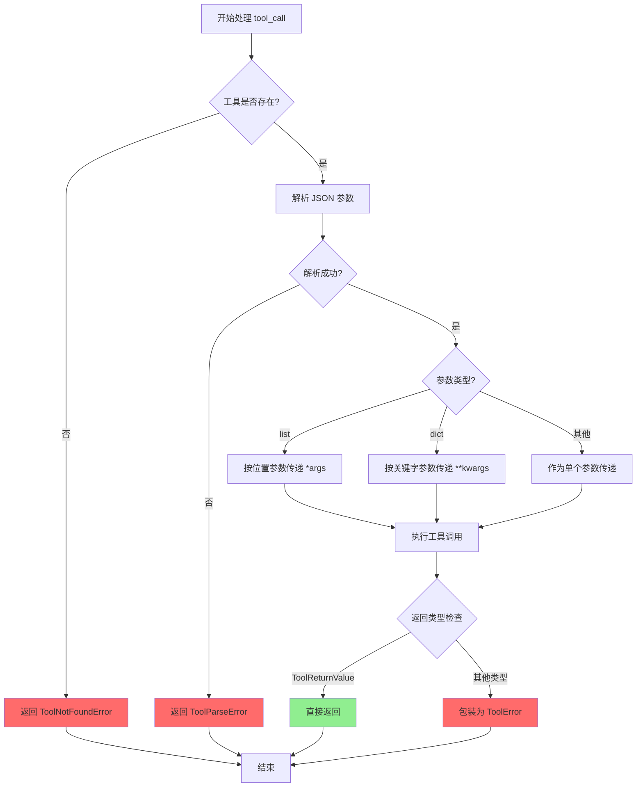

**算法要点**：

1. **分层错误处理**：路由层处理"找不到"，解析层处理"格式错"，工具层处理"执行错"
2. **参数类型分发**：支持 list/dict/其他三种参数形式，兼容不同工具定义风格
3. **返回类型兜底**：不信任工具的返回类型声明，强制检查并包装

---

### 3.3 组件间协作时序

展示工具错误处理与 Checkpoint、D-Mail、Approval 的协作。

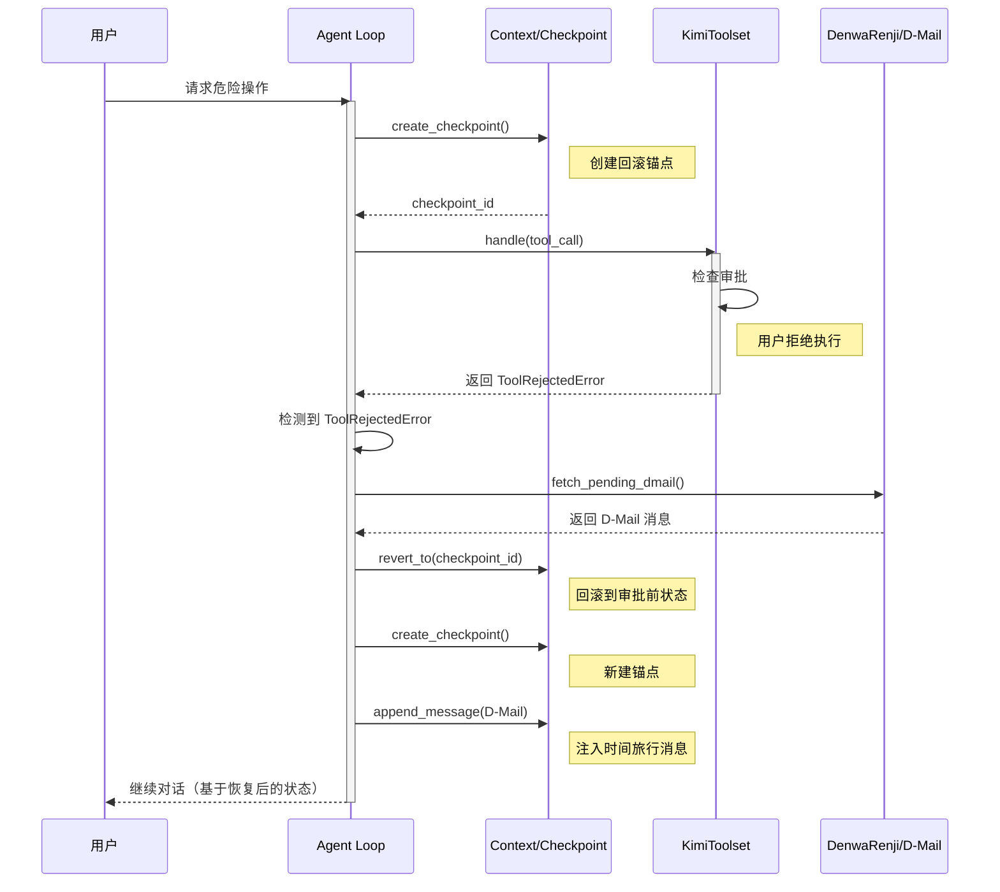

**协作要点**：

1. **Checkpoint 前置**：在执行可能失败的操作前创建回滚点
2. **错误检测**：通过 `isinstance(result.return_value, ToolRejectedError)` 识别拒绝
3. **状态回滚**：`revert_to()` 恢复到指定 checkpoint，丢弃后续消息
4. **D-Mail 注入**：回滚后注入来自"未来"的消息，引导 LLM 继续

---

### 3.4 关键数据路径

#### 主路径（正常流程）

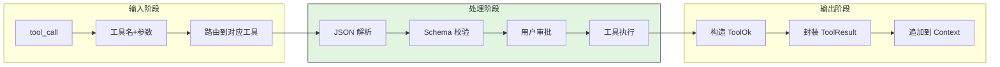

#### 异常路径（错误恢复）

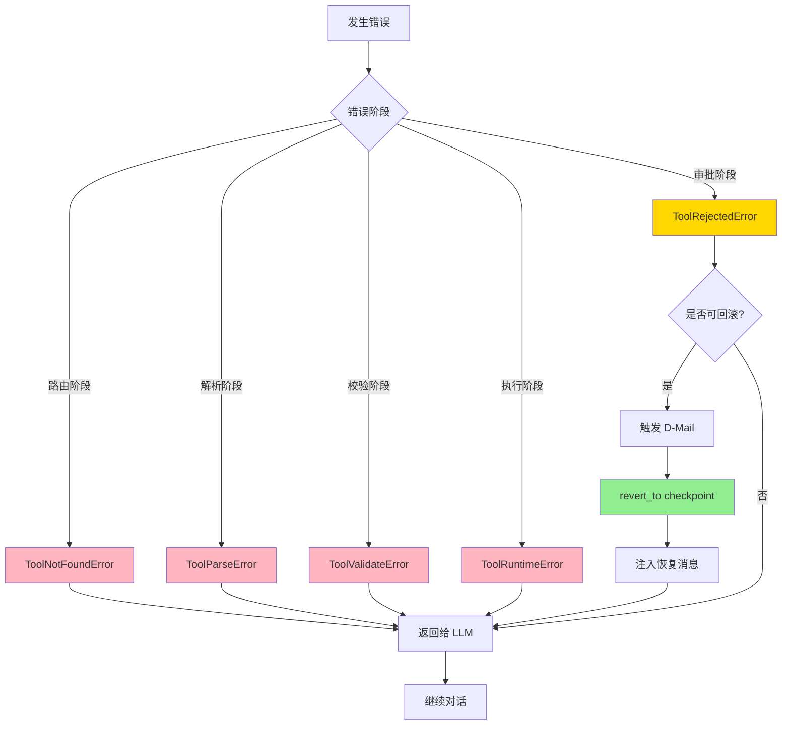

---

## 4. 端到端数据流转

### 4.1 正常流程（详细版）

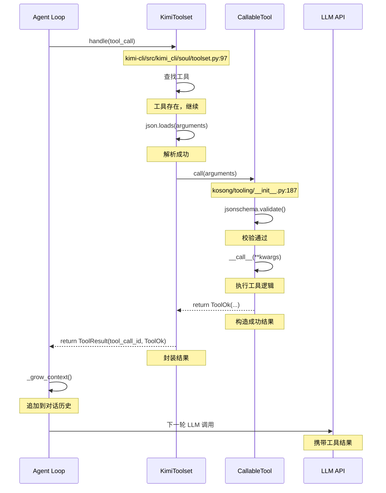

**数据变换详情**：

| 阶段 | 输入 | 处理 | 输出 | 代码位置 |
|-----|------|------|------|---------|
| 接收 | `ToolCall` | 工具名查找 | `ToolType` 或 `None` | `toolset.py:100` |
| 解析 | JSON 字符串 | `json.loads()` | Python 对象 | `toolset.py:109` |
| 校验 | Python 对象 | `jsonschema.validate()` | 校验通过/异常 | `__init__.py:191` |
| 执行 | 校验后的参数 | 工具业务逻辑 | 原始返回值 | 工具具体实现 |
| 封装 | 原始返回值 | 类型检查+包装 | `ToolReturnValue` | `__init__.py:201` |
| 聚合 | `ToolReturnValue` | 构造 `ToolResult` | 带 ID 的结果 | `toolset.py:116` |

### 4.2 数据流向图

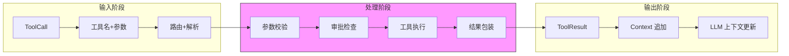

### 4.3 异常/边界流程

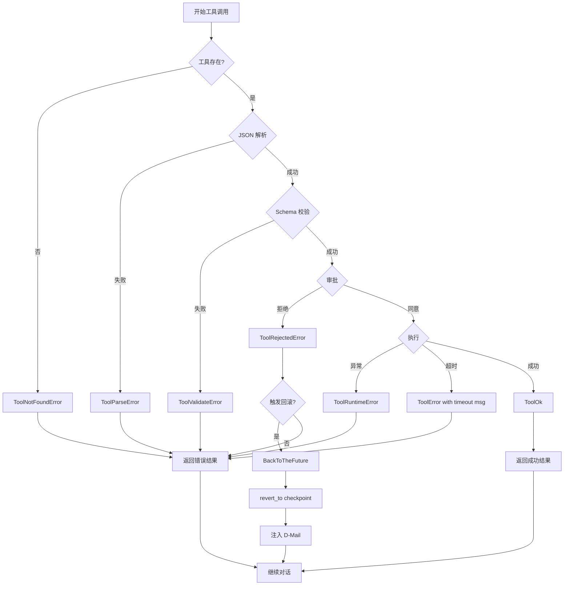

---

## 5. 关键代码实现

### 5.1 核心数据结构

```python
# kimi-cli/packages/kosong/src/kosong/tooling/__init__.py:112-169
class ToolReturnValue(BaseModel):
    """The return type of a callable tool."""

    is_error: bool
    """Whether the tool call resulted in an error."""

    # For model
    output: str | list[ContentPart]
    """The output content returned by the tool."""
    message: str
    """An explanatory message to be given to the model."""

    # For user
    display: list[DisplayBlock]
    """The content blocks to be displayed to the user."""

    # For debugging/testing
    extras: dict[str, JsonType] | None = None


class ToolOk(ToolReturnValue):
    """Subclass of `ToolReturnValue` representing a successful tool call."""

    def __init__(self, *, output: str | ContentPart | list[ContentPart], message: str = "", brief: str = ""):
        super().__init__(
            is_error=False,
            output=([output] if isinstance(output, ContentPart) else output),
            message=message,
            display=[BriefDisplayBlock(text=brief)] if brief else [],
        )


class ToolError(ToolReturnValue):
    """Subclass of `ToolReturnValue` representing a failed tool call."""

    def __init__(self, *, message: str, brief: str, output: str | ContentPart | list[ContentPart] = ""):
        super().__init__(
            is_error=True,
            output=([output] if isinstance(output, ContentPart) else output),
            message=message,
            display=[BriefDisplayBlock(text=brief)] if brief else [],
        )
```

**字段说明**：

| 字段 | 类型 | 用途 |
|-----|------|------|
| `is_error` | `bool` | 区分成功/失败状态 |
| `output` | `str \| list[ContentPart]` | 工具输出内容，给模型消费 |
| `message` | `str` | 解释性消息，帮助模型理解结果 |
| `display` | `list[DisplayBlock]` | 用户界面展示内容 |
| `extras` | `dict[str, JsonType] \| None` | 调试/测试用的额外数据 |

### 5.2 主链路代码

**关键代码**（核心逻辑）：

```python
# kimi-cli/src/kimi_cli/soul/toolset.py:97-124
class KimiToolset:
    def handle(self, tool_call: ToolCall) -> HandleResult:
        token = current_tool_call.set(tool_call)
        try:
            # 1. 工具路由
            if tool_call.function.name not in self._tool_dict:
                return ToolResult(
                    tool_call_id=tool_call.id,
                    return_value=ToolNotFoundError(tool_call.function.name),
                )

            tool = self._tool_dict[tool_call.function.name]

            # 2. JSON 解析
            try:
                arguments: JsonType = json.loads(tool_call.function.arguments or "{}")
            except json.JSONDecodeError as e:
                return ToolResult(tool_call_id=tool_call.id, return_value=ToolParseError(str(e)))

            # 3. 工具调用（含验证+执行）
            async def _call():
                try:
                    ret = await tool.call(arguments)
                    return ToolResult(tool_call_id=tool_call.id, return_value=ret)
                except Exception as e:
                    return ToolResult(
                        tool_call_id=tool_call.id, return_value=ToolRuntimeError(str(e))
                    )

            return asyncio.create_task(_call())
        finally:
            current_tool_call.reset(token)
```

**设计意图**：

1. **ContextVar 管理当前工具调用**：通过 `current_tool_call` 让工具内部能获取调用上下文，支持审批等功能
2. **分层错误处理**：路由错误、解析错误、运行时错误分别在不同层级处理
3. **异步任务封装**：工具调用包装为 `asyncio.Task`，支持并发执行和结果收集

<details>
<summary>查看完整实现</summary>

```python
# kimi-cli/src/kimi_cli/soul/toolset.py:97-145
class KimiToolset:
    """Kimi CLI toolset with error handling and MCP support."""

    def handle(self, tool_call: ToolCall) -> HandleResult:
        """Handle a tool call with comprehensive error handling."""
        token = current_tool_call.set(tool_call)
        try:
            # 1. 工具路由
            if tool_call.function.name not in self._tool_dict:
                return ToolResult(
                    tool_call_id=tool_call.id,
                    return_value=ToolNotFoundError(tool_call.function.name),
                )

            tool = self._tool_dict[tool_call.function.name]

            # 2. JSON 解析
            try:
                arguments: JsonType = json.loads(tool_call.function.arguments or "{}")
            except json.JSONDecodeError as e:
                return ToolResult(tool_call_id=tool_call.id, return_value=ToolParseError(str(e)))

            # 3. 工具调用（含验证+执行）
            async def _call():
                try:
                    ret = await tool.call(arguments)
                    return ToolResult(tool_call_id=tool_call.id, return_value=ret)
                except Exception as e:
                    return ToolResult(
                        tool_call_id=tool_call.id, return_value=ToolRuntimeError(str(e))
                    )

            return asyncio.create_task(_call())
        finally:
            current_tool_call.reset(token)
```

</details>

### 5.3 关键调用链

```text
KimiSoul._agent_loop()          [kimisoul.py:330]
  -> KimiSoul._step()           [kimisoul.py:382]
    -> kosong.step()            [kosong/__init__.py]
      -> toolset.handle()       [toolset.py:97]
        - 工具路由              [toolset.py:100]
        - JSON 解析             [toolset.py:109]
        - tool.call()           [__init__.py:187]
          - jsonschema 验证     [__init__.py:191]
          - 参数分发            [__init__.py:195]
          - __call__() 执行     [工具具体实现]
          - 返回类型检查        [__init__.py:201]
```

---

## 6. 设计意图与 Trade-off

### 6.1 Kimi CLI 的选择

| 维度 | Kimi CLI 的选择 | 替代方案 | 取舍分析 |
|-----|----------------|---------|---------|
| 错误表示 | 统一返回值封装 (`ToolReturnValue`) | 异常抛出 (Codex) | 避免异常打断控制流，但需要显式检查 `is_error` |
| 错误分类 | 四层继承体系 (`ToolNotFound/Parse/Validate/Runtime`) | 单一错误类型 | 精确错误定位，但增加了类型数量 |
| 状态恢复 | Checkpoint + D-Mail 回滚 | 无回滚 (Codex) / 内存快照 | 支持对话级回滚，但文件副作用不自动回滚 |
| 用户审批 | 内嵌在工具调用中 | 前置拦截器 (SWE-agent) | 与工具逻辑紧密集成，但需要每个工具显式调用 |
| 超时处理 | 配置化超时 + 错误返回 | 无限等待 / 强制终止 | 优雅降级，但需要 LLM 能理解超时错误 |
| 重试策略 | tenacity 指数退避 | 固定间隔 / 不重试 | 自动恢复临时故障，但增加了调用延迟 |

### 6.2 为什么这样设计？

**核心问题**：如何让 LLM 在工具调用失败后能够自纠正并继续对话？

**Kimi CLI 的解决方案**：

- **代码依据**：`kimi-cli/packages/kosong/src/kosong/tooling/__init__.py:112`
- **设计意图**：通过 `ToolReturnValue` 统一封装，让错误成为"正常"的返回结果，LLM 可以像处理成功结果一样处理错误
- **带来的好处**：
  - 控制流清晰：不需要 try-catch 打断 Agent Loop
  - LLM 可自纠正：错误信息直接注入上下文，LLM 看到后可以调整策略
  - 用户可见：`display` 字段确保用户知道发生了什么
- **付出的代价**：
  - 需要显式检查 `is_error`
  - 错误信息需要精心设计，否则 LLM 可能误解

### 6.3 与其他项目的对比

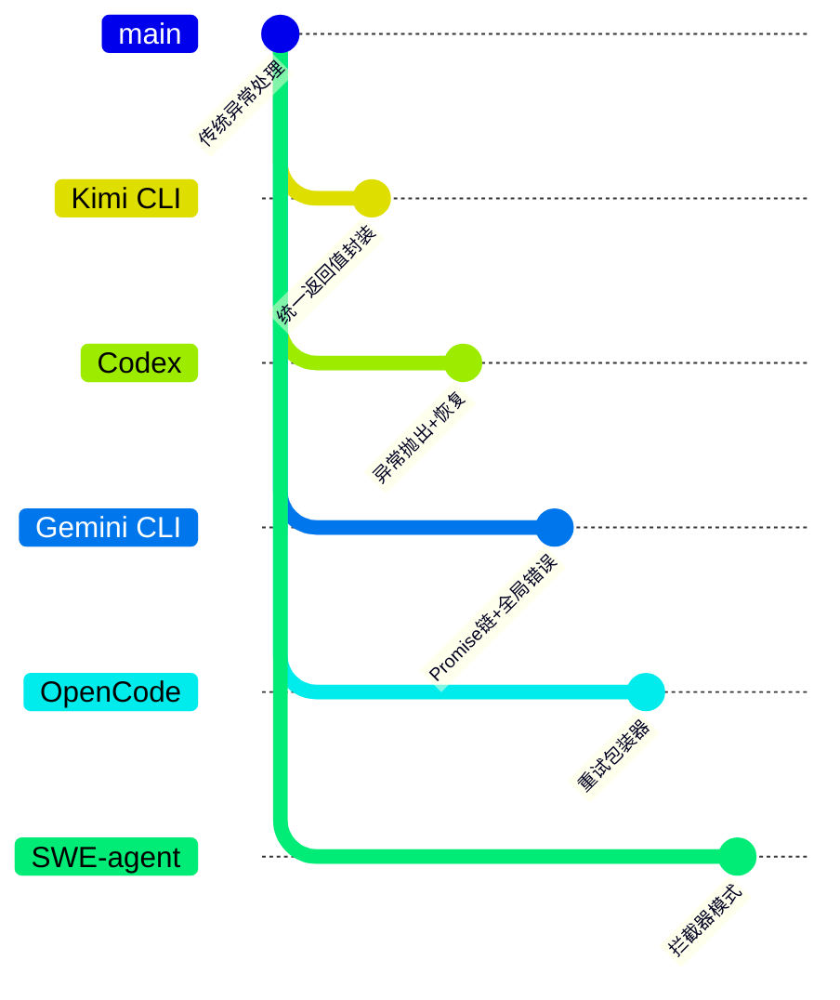

| 项目 | 核心差异 | 适用场景 |
|-----|---------|---------|
| **Kimi CLI** | 统一返回值封装 + Checkpoint 回滚 | 需要对话级状态恢复的场景 |
| **Codex** | 异常抛出 + 沙箱隔离恢复 | 强调安全隔离，错误即终止当前操作 |
| **Gemini CLI** | Promise 链 + 全局错误边界 | TypeScript 生态，异步流程清晰 |
| **OpenCode** | 重试包装器 + 超时重置 | 长任务场景，强调超时控制 |
| **SWE-agent** | `forward_with_handling()` 拦截器 | 学术研究场景，细粒度错误拦截 |

**详细对比分析**：

| 对比维度 | Kimi CLI | Codex | Gemini CLI | OpenCode | SWE-agent |
|---------|----------|-------|------------|----------|-----------|
| **错误传递** | 返回值封装 | 异常抛出 | Promise reject | 回调错误 | 拦截器捕获 |
| **状态恢复** | Checkpoint 回滚 | 沙箱重置 | 无 | 无 | 手动回滚 |
| **用户审批** | 工具内嵌 | 前置策略 | 配置化 | 配置化 | 配置文件 |
| **超时处理** | 配置化 | 内置 | 内置 | resetTimeoutOnProgress | 内置 |
| **重试机制** | tenacity | 内置 | 内置 | 包装器 | 手动 |
| **LLM 自纠正** | 直接注入错误 | 异常捕获后提示 | 错误回调 | 重试提示 | 拦截后提示 |

**选择建议**：

- 需要**对话级状态恢复** → Kimi CLI 的 Checkpoint + D-Mail
- 强调**安全隔离** → Codex 的异常 + 沙箱
- **TypeScript 生态** + 异步流程 → Gemini CLI 的 Promise 链
- **长任务** + 超时敏感 → OpenCode 的重试包装器
- **学术研究** + 细粒度控制 → SWE-agent 的拦截器

---

## 7. 边界情况与错误处理

### 7.1 终止条件

| 终止原因 | 触发条件 | 代码位置 |
|---------|---------|---------|
| 达到最大步数 | `step_no > max_steps_per_turn` | `kimisoul.py:332` |
| 用户取消 | 捕获 `CancelledError` | `kimisoul.py:356` |
| 工具被拒绝 | 检测到 `ToolRejectedError` | `kimisoul.py:422` |
| LLM 不支持 | `LLMNotSupported` 异常 | `kimisoul.py:468` |
| 无工具调用 | `result.tool_calls` 为空 | `kimisoul.py:453` |

### 7.2 超时/资源限制

```python
# kimi-cli/src/kimi_cli/config.py:129-133
class MCPClientConfig(BaseModel):
    """MCP client configuration."""

    tool_call_timeout_ms: int = 60000
    """Timeout for tool calls in milliseconds."""
```

```python
# kimi-cli/src/kimi_cli/soul/toolset.py:377
self._timeout = timedelta(milliseconds=runtime.config.mcp.client.tool_call_timeout_ms)

# kimi-cli/src/kimi_cli/soul/toolset.py:387-391
result = await client.call_tool(
    self._mcp_tool.name,
    kwargs,
    timeout=self._timeout,
    raise_on_error=False,
)
```

### 7.3 错误恢复策略

| 错误类型 | 处理策略 | 代码位置 |
|---------|---------|---------|
| `ToolNotFoundError` | 返回错误，让 LLM 选择其他工具 | `toolset.py:101` |
| `ToolParseError` | 返回错误，让 LLM 修正 JSON 格式 | `toolset.py:111` |
| `ToolValidateError` | 返回错误，让 LLM 修正参数 | `__init__.py:193` |
| `ToolRuntimeError` | 返回错误，让 LLM 决定下一步 | `toolset.py:119` |
| `ToolRejectedError` | 触发 D-Mail 回滚 | `kimisoul.py:422` |
| MCP 超时 | 返回 `ToolError`，提示用户调整配置 | `toolset.py:398` |
| API 错误 (429/500/502/503) | tenacity 指数退避重试 | `kimisoul.py:388` |

---

## 8. 关键代码索引

| 功能 | 文件 | 行号 | 说明 |
|-----|------|------|------|
| 入口 | `kimi-cli/src/kimi_cli/soul/toolset.py` | 97 | `KimiToolset.handle()` 工具调用入口 |
| 核心 | `kimi-cli/packages/kosong/src/kosong/tooling/__init__.py` | 112 | `ToolReturnValue` 统一返回封装 |
| 核心 | `kimi-cli/packages/kosong/src/kosong/tooling/__init__.py` | 158 | `ToolError` 错误基类 |
| 核心 | `kimi-cli/packages/kosong/src/kosong/tooling/error.py` | 4 | 四层错误类型定义 |
| 核心 | `kimi-cli/src/kimi_cli/soul/kimisoul.py` | 531 | `BackToTheFuture` 回滚异常 |
| 配置 | `kimi-cli/src/kimi_cli/config.py` | 68 | `LoopControl` 循环控制配置 |
| 配置 | `kimi-cli/src/kimi_cli/config.py` | 129 | `MCPClientConfig` MCP 超时配置 |
| 审批 | `kimi-cli/src/kimi_cli/soul/approval.py` | 34 | `Approval` 审批管理器 |
| 拒绝错误 | `kimi-cli/src/kimi_cli/tools/utils.py` | 182 | `ToolRejectedError` 用户拒绝错误 |
| 重试 | `kimi-cli/src/kimi_cli/soul/kimisoul.py` | 388 | tenacity 重试装饰器 |
| MCP 工具 | `kimi-cli/src/kimi_cli/soul/toolset.py` | 355 | `MCPTool` MCP 工具封装 |

---

## 9. 延伸阅读

- 前置知识：`docs/kimi-cli/04-kimi-cli-agent-loop.md` - Agent Loop 整体架构
- 相关机制：`docs/kimi-cli/06-kimi-cli-mcp-integration.md` - MCP 工具集成
- 相关机制：`docs/kimi-cli/07-kimi-cli-memory-context.md` - Checkpoint 和 D-Mail 机制
- 深度分析：`docs/kimi-cli/questions/kimi-cli-dmail-mechanism.md` - D-Mail 时间旅行机制详解
- 跨项目对比：`docs/comm/comm-tool-error-handling.md` - 跨项目工具错误处理对比（如存在）

---

*✅ Verified: 基于 kimi-cli/packages/kosong/src/kosong/tooling/__init__.py:112、kimi-cli/packages/kosong/src/kosong/tooling/error.py:4、kimi-cli/src/kimi_cli/soul/toolset.py:97、kimi-cli/src/kimi_cli/soul/kimisoul.py:531 等源码分析*

*基于版本：kimi-cli (baseline 2026-02-08) | 最后更新：2026-03-03*
