# Kimi CLI：WebSearch 实现机制

> **阅读指南**
>
> | 属性 | 说明 |
> |-----|------|
> | 预计阅读 | 20-30 分钟 |
> | 前置文档 | `docs/kimi-cli/04-kimi-cli-agent-loop.md`、`docs/kimi-cli/06-kimi-cli-mcp-integration.md` |
> | 文档结构 | 速览 → 架构 → 机制 → 实现 → 对比 |
> | 代码版本 | kimi-cli (2025-02-15) |

---

## TL;DR（结论先行）

**一句话定义**：WebSearch 是 Kimi CLI 的网络信息获取机制，通过 `SearchWeb` 和 `FetchURL` 两个独立工具实现搜索与抓取功能，采用 Moonshot 官方搜索服务与本地 HTTP 抓取的双层架构。

Kimi CLI 的核心取舍：**服务优先 + 本地降级** 的混合架构（属于"自助接入 WebSearch"类型，对比 Codex 的"自助接入 WebSearch"纯本地实现、Gemini CLI 的"厂商提供 WebSearch 接口"原生集成），通过配置化的服务接入方式，在保持灵活性的同时确保功能可用性。

### 核心要点速览

| 维度 | 关键决策 | 代码位置 |
|-----|---------|---------|
| 搜索工具 | `SearchWeb` - 调用 Moonshot 搜索服务 | `kimi-cli/src/kimi_cli/tools/web/search.py:39` |
| 抓取工具 | `FetchURL` - 服务优先，本地 HTTP 降级 | `kimi-cli/src/kimi_cli/tools/web/fetch.py:22` |
| 服务配置 | `MoonshotSearchConfig` / `MoonshotFetchConfig` | `kimi-cli/src/kimi_cli/config.py:86-118` |
| 工具注册 | 通过 `agent.yaml` 显式配置 + 动态加载 | `kimi-cli/src/kimi_cli/agents/default/agent.yaml:20-21` |
| 参数验证 | Pydantic `BaseModel` 类型安全 | `kimi-cli/src/kimi_cli/tools/web/search.py:16-36` |

---

## 1. 为什么需要这个机制？（解决什么问题）

### 1.1 问题场景

没有 WebSearch 机制时，Agent 只能基于训练数据回答问题，无法获取实时信息：

```
用户问："Python 3.13 的新特性是什么？"

没有 WebSearch：
  → LLM: "我的知识截止于 2024 年，无法回答关于 Python 3.13 的问题"

有 WebSearch：
  → LLM: "让我搜索一下 Python 3.13 的新特性"
  → 调用 SearchWeb("Python 3.13 new features")
  → 获取搜索结果：PEP 文档、官方博客、技术文章
  → LLM: "根据搜索结果，Python 3.13 的主要新特性包括..."
```

### 1.2 核心挑战

| 挑战 | 不解决的后果 |
|-----|-------------|
| 实时信息获取 | Agent 只能回答训练数据范围内的问题，无法处理时效性内容 |
| 搜索结果质量 | 低质量搜索结果会导致 LLM 生成错误或不相关信息 |
| 页面内容抓取 | 仅获取搜索摘要无法满足深度分析需求 |
| Token 消耗控制 | 抓取大量页面内容可能导致上下文溢出 |
| 服务可用性 | 依赖外部搜索服务时，服务不可用会导致功能完全失效 |

---

## 2. 整体架构

### 2.1 在系统中的位置

```text
┌─────────────────────────────────────────────────────────────────┐
│  Agent Loop (KimiSoul)                                          │
│  kimi-cli/src/kimi_cli/soul/kimisoul.py                         │
└─────────────────────────┬───────────────────────────────────────┘
                          │ 1. Tool Call Request
                          ▼
┌─────────────────────────────────────────────────────────────────┐
│  ▓▓▓ KimiToolset ▓▓▓                                            │
│  kimi-cli/src/kimi_cli/soul/toolset.py:71                       │
│  ┌─────────────────┐  ┌─────────────────┐                       │
│  │   SearchWeb     │  │    FetchURL     │                       │
│  │   (搜索工具)     │  │   (抓取工具)     │                       │
│  └────────┬────────┘  └────────┬────────┘                       │
└───────────┼────────────────────┼────────────────────────────────┘
            │                    │
            ▼                    ▼
┌────────────────────┐  ┌────────────────────┐
│ Moonshot Search    │  │ Moonshot Fetch     │
│ Service (API)      │  │ Service (API)      │
│ - text_query       │  │ - url              │
│ - limit            │  │ - markdown output  │
│ - enable_page_     │  │                    │
│   crawling         │  │                    │
└────────────────────┘  └─────────┬──────────┘
                                  │
                    ┌─────────────┘
                    │ 2. Fallback
                    ▼
        ┌─────────────────────┐
        │  Local HTTP Fetch   │
        │  - aiohttp          │
        │  - trafilatura      │
        │  - HTML extraction  │
        └─────────────────────┘
```

### 2.2 核心组件职责

| 组件 | 职责 | 代码位置 |
|-----|------|---------|
| `SearchWeb` | 调用 Moonshot 搜索服务，获取搜索结果 | `kimi-cli/src/kimi_cli/tools/web/search.py:39` |
| `FetchURL` | 网页内容抓取，支持服务优先和本地降级 | `kimi-cli/src/kimi_cli/tools/web/fetch.py:22` |
| `KimiToolset` | 工具动态加载和管理 | `kimi-cli/src/kimi_cli/soul/toolset.py:71` |
| `MoonshotSearchConfig` | 搜索服务配置结构 | `kimi-cli/src/kimi_cli/config.py:86-95` |
| `MoonshotFetchConfig` | 抓取服务配置结构 | `kimi-cli/src/kimi_cli/config.py:98-107` |
| `ToolResultBuilder` | 工具结果格式化构建 | `kimi-cli/src/kimi_cli/tools/utils.py:54` |

### 2.3 核心组件交互关系

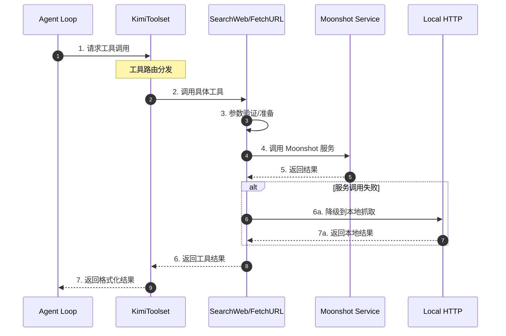

**关键交互说明**：

| 步骤 | 交互内容 | 设计意图 |
|-----|---------|---------|
| 1 | Agent Loop 向工具集发起调用请求 | 解耦工具实现与调用方 |
| 2 | 工具集路由到具体工具实例 | 支持动态工具加载和扩展 |
| 3 | 工具内部进行参数验证和准备 | Pydantic 保证类型安全 |
| 4 | 优先调用 Moonshot 官方服务 | 获取更高质量的搜索结果 |
| 5 | 同步返回服务响应 | 简化调用流程，便于错误处理 |
| 6 | FetchURL 在服务失败时降级到本地 | 确保功能可用性 |
| 7 | 统一格式返回结果 | 便于上层处理和展示 |

---

## 3. 核心组件详细分析

### 3.1 SearchWeb 内部结构

#### 职责定位

SearchWeb 是网络搜索的入口工具，负责将用户的查询请求转发到 Moonshot 搜索服务，并格式化返回结果供 LLM 使用。

#### 状态机图

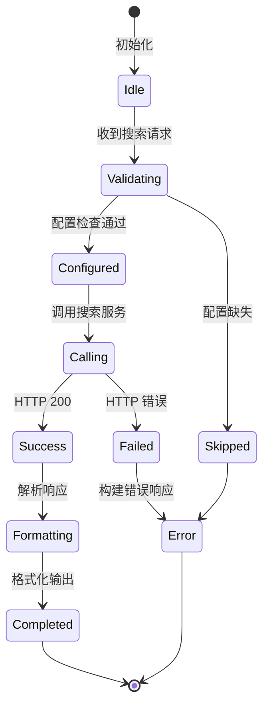

**状态说明**：

| 状态 | 说明 | 进入条件 | 退出条件 |
|-----|------|---------|---------|
| Idle | 空闲等待 | 工具初始化完成 | 收到搜索请求 |
| Validating | 验证配置 | 收到搜索请求 | 配置检查完成 |
| Configured | 配置就绪 | API Key 和 URL 验证通过 | 开始调用服务 |
| Calling | 调用服务 | 配置验证通过 | 收到 HTTP 响应 |
| Success | 调用成功 | HTTP 状态码 200 | 开始解析响应 |
| Failed | 调用失败 | HTTP 状态码非 200 | 构建错误响应 |
| Formatting | 格式化结果 | 成功解析响应数据 | 格式化完成 |
| Completed | 完成 | 结果格式化完成 | 自动返回 Idle |
| Error | 错误 | 配置缺失或调用失败 | 返回错误信息 |
| Skipped | 跳过 | 配置缺失时抛出 SkipThisTool | 工具被跳过 |

#### 内部数据流

```text
┌────────────────────────────────────────────┐
│  输入层                                     │
│   原始查询 → Pydantic 验证 → 结构化参数     │
│   (query, limit, include_content)          │
└──────────────────┬─────────────────────────┘
                   ▼
┌────────────────────────────────────────────┐
│  处理层                                     │
│   配置解析 → API Key 获取 → HTTP POST      │
│   → 响应解析 → 结果提取                     │
└──────────────────┬─────────────────────────┘
                   ▼
┌────────────────────────────────────────────┐
│  输出层                                     │
│   结果格式化 → ToolResultBuilder 构建      │
│   → 返回标准化结果                          │
└────────────────────────────────────────────┘
```

#### 关键接口

| 接口 | 输入 | 输出 | 说明 | 代码位置 |
|-----|------|------|------|---------|
| `__init__()` | Config, Runtime | 工具实例 | 依赖注入初始化 | `search.py:44-52` |
| `__call__()` | Params | ToolReturnValue | 执行搜索 | `search.py:54-117` |
| `Params` | query, limit, include_content | 验证后参数 | Pydantic 参数模型 | `search.py:16-36` |

---

### 3.2 FetchURL 内部结构

#### 职责定位

FetchURL 负责获取指定 URL 的网页内容，采用"服务优先 + 本地降级"的双层架构，确保在 Moonshot 抓取服务不可用时仍能获取网页内容。

#### 状态机图

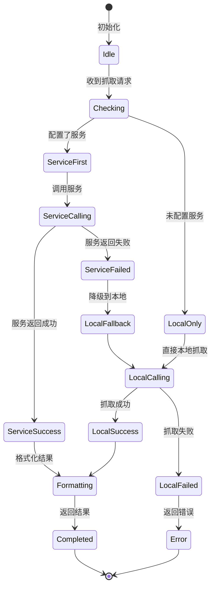

#### 关键接口

| 接口 | 输入 | 输出 | 说明 | 代码位置 |
|-----|------|------|------|---------|
| `__init__()` | Config, Runtime | 工具实例 | 依赖注入初始化 | `fetch.py:24-40` |
| `__call__()` | Params | ToolReturnValue | 执行抓取 | `fetch.py:42-108` |
| `_fetch_with_service()` | Params | ToolReturnValue | 服务层抓取 | `fetch.py:110-148` |
| `fetch_with_http_get()` | Params | ToolReturnValue | 本地 HTTP 抓取 | `fetch.py:150-200` |

---

### 3.3 组件间协作时序

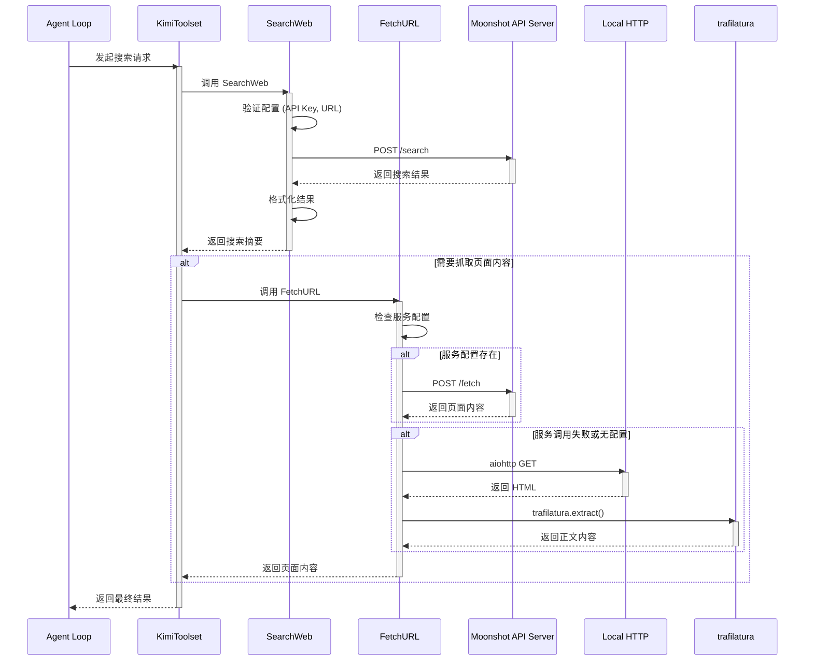

**协作要点**：

1. **Agent Loop 与 KimiToolset**：通过工具名称路由调用，解耦工具实现
2. **SearchWeb 与 Moonshot API**：同步 HTTP 调用，30 秒超时
3. **FetchURL 与本地抓取**：服务失败时自动降级，使用 trafilatura 提取正文

---

### 3.4 关键数据路径

#### 主路径（正常流程）

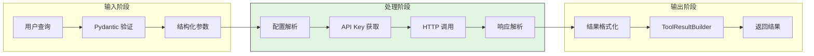

#### 异常路径（错误恢复）

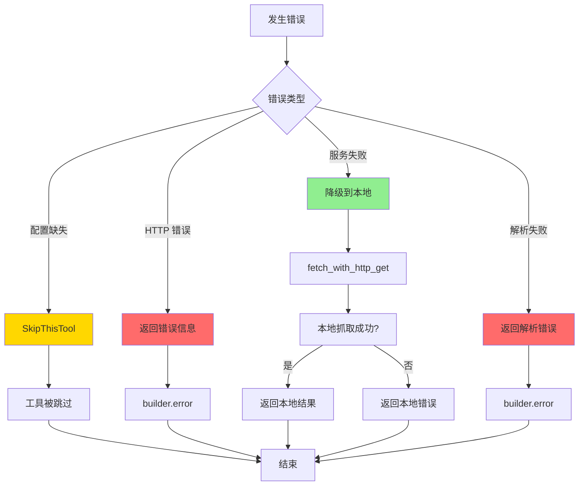

#### 降级路径（FetchURL）

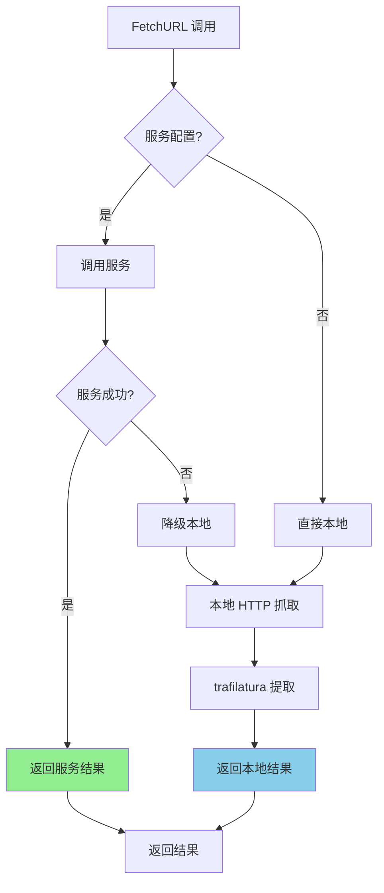

---

## 4. 端到端数据流转

### 4.1 正常流程（详细版）

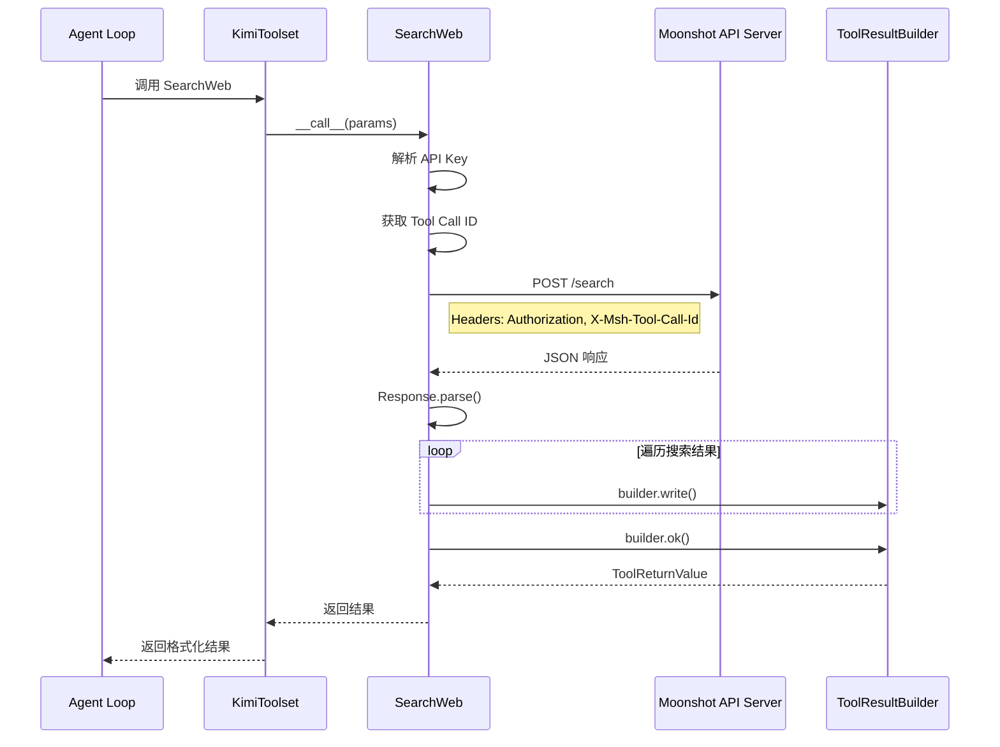

**数据变换详情**：

| 阶段 | 输入 | 处理 | 输出 | 代码位置 |
|-----|------|------|------|---------|
| 接收 | 用户查询字符串 | Pydantic 验证 | Params 对象 | `search.py:16-36` |
| 认证 | Config, Runtime | OAuth 解析 | API Key | `search.py:48` |
| 调用 | Params, API Key | HTTP POST | JSON 响应 | `search.py:57-77` |
| 解析 | JSON 响应 | Pydantic 解析 | Response 对象 | `search.py:79` |
| 格式化 | SearchResult 列表 | 字符串拼接 | 格式化文本 | `search.py:81-92` |
| 输出 | 格式化文本 | ToolResultBuilder | ToolReturnValue | `search.py:94` |

### 4.2 数据流向图

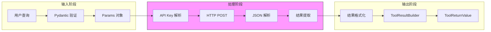

### 4.3 异常/边界流程

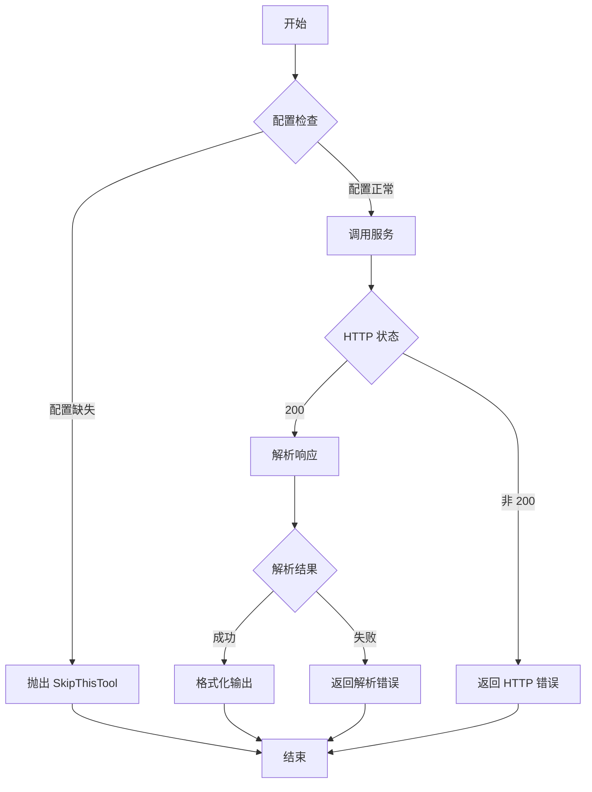

---

## 5. 关键代码实现

### 5.1 核心数据结构

```python
# kimi-cli/src/kimi_cli/tools/web/search.py:16-36
class Params(BaseModel):
    """SearchWeb 工具参数定义"""
    query: str = Field(description="The query text to search for.")
    limit: int = Field(
        description=(
            "The number of results to return. "
            "Typically you do not need to set this value. "
            "When the results do not contain what you need, "
            "you probably want to give a more concrete query."
        ),
        default=5,
        ge=1,
        le=20,  # 限制最大结果数，防止 Token 溢出
    )
    include_content: bool = Field(
        description=(
            "Whether to include the content of the web pages in the results. "
            "It can consume a large amount of tokens when this is set to True. "
            "You should avoid enabling this when `limit` is set to a large value."
        ),
        default=False,  # 默认关闭，保护 Token
    )
```

**字段说明**：

| 字段 | 类型 | 用途 |
|-----|------|------|
| `query` | `str` | 搜索查询文本 |
| `limit` | `int` | 返回结果数量，限制 1-20 |
| `include_content` | `bool` | 是否抓取页面内容 |

```python
# kimi-cli/src/kimi_cli/config.py:86-107
class MoonshotSearchConfig(BaseModel):
    """Moonshot Search configuration."""
    base_url: str
    api_key: SecretStr  # 安全存储，避免明文泄露
    custom_headers: dict[str, str] | None = None
    oauth: OAuthRef | None = None  # 支持 OAuth 认证

class MoonshotFetchConfig(BaseModel):
    """Moonshot Fetch configuration."""
    base_url: str
    api_key: SecretStr
    custom_headers: dict[str, str] | None = None
    oauth: OAuthRef | None = None
```

### 5.2 主链路代码

**关键代码**（SearchWeb 核心逻辑）：

```python
# kimi-cli/src/kimi_cli/tools/web/search.py:54-94
async def __call__(self, params: Params) -> ToolReturnValue:
    builder = ToolResultBuilder(max_line_length=None)

    # 1. 解析 API Key（支持 OAuth 和普通 Key）
    api_key = self._runtime.oauth.resolve_api_key(self._api_key, self._oauth_ref)
    if not self._base_url or not api_key:
        return builder.error("Search service is not configured...")

    # 2. 获取当前 Tool Call ID（用于链路追踪）
    tool_call = get_current_tool_call_or_none()
    assert tool_call is not None, "Tool call is expected to be set"

    # 3. 调用 Moonshot 搜索服务
    async with new_client_session() as session,
        session.post(
            self._base_url,
            headers={
                "User-Agent": USER_AGENT,
                "Authorization": f"Bearer {api_key}",
                "X-Msh-Tool-Call-Id": tool_call.id,  # 链路追踪
                **self._runtime.oauth.common_headers(),
                **self._custom_headers,
            },
            json={
                "text_query": params.query,
                "limit": params.limit,
                "enable_page_crawling": params.include_content,
                "timeout_seconds": 30,
            },
        ) as response,
    ):
        # 4. 处理响应
        if response.status != 200:
            return builder.error(f"Failed to search. Status: {response.status}...")

        results = Response(**await response.json()).search_results

    # 5. 格式化输出
    for i, result in enumerate(results):
        if i > 0:
            builder.write("---\n\n")
        builder.write(
            f"Title: {result.title}\nDate: {result.date}\n"
            f"URL: {result.url}\nSummary: {result.snippet}\n\n"
        )
        if result.content:
            builder.write(f"{result.content}\n\n")

    return builder.ok()
```

**设计意图**：
1. **双层认证支持**：同时支持普通 API Key 和 OAuth，通过 `resolve_api_key` 统一处理
2. **链路追踪**：`X-Msh-Tool-Call-Id` 头部支持服务端全链路追踪
3. **Token 保护**：`include_content` 默认关闭，避免抓取大量内容导致上下文溢出
4. **结果格式化**：使用 `ToolResultBuilder` 统一处理截断和格式化

**关键代码**（FetchURL 降级逻辑）：

```python
# kimi-cli/src/kimi_cli/tools/web/fetch.py:42-65
async def __call__(self, params: Params) -> ToolReturnValue:
    # 1. 优先尝试服务调用（如果配置了）
    if self._service_config:
        ret = await self._fetch_with_service(params)
        if not ret.is_error:
            return ret
        logger.warning("Failed to fetch URL via service: {error}", error=ret.message)
        # fallback to local fetch if service fetch fails

    # 2. 服务调用失败或没有配置，降级到本地抓取
    return await self.fetch_with_http_get(params)

# 本地抓取实现
@staticmethod
async def fetch_with_http_get(params: Params) -> ToolReturnValue:
    builder = ToolResultBuilder(max_line_length=None)
    try:
        async with new_client_session() as session,
            session.get(
                params.url,
                headers={
                    "User-Agent": (
                        "Mozilla/5.0 (Windows NT 10.0; Win64; x64) AppleWebKit/537.36 "
                        "(KHTML, like Gecko) Chrome/91.0.4472.124 Safari/537.36"
                    ),
                },
            ) as response,
        ):
            if response.status >= 400:
                return builder.error(f"Failed to fetch URL. Status: {response.status}...")

            resp_text = await response.text()

            # 纯文本直接返回
            content_type = response.headers.get(aiohttp.hdrs.CONTENT_TYPE, "").lower()
            if content_type.startswith(("text/plain", "text/markdown")):
                builder.write(resp_text)
                return builder.ok("The returned content is the full content of the page.")
    except aiohttp.ClientError as e:
        return builder.error(f"Failed to fetch URL due to network error: {str(e)}...")

    # HTML 内容提取
    extracted_text = trafilatura.extract(
        resp_text,
        include_comments=True,
        include_tables=True,
        include_formatting=False,
        output_format="txt",
        with_metadata=True,
    )

    if not extracted_text:
        return builder.error(
            "Failed to extract meaningful content from the page. "
            "This may indicate the page requires JavaScript to render..."
        )

    builder.write(extracted_text)
    return builder.ok("The returned content is the main text content extracted from the page.")
```

**设计意图**：
1. **服务优先**：优先使用 Moonshot 服务，可能获得更好的渲染质量
2. **自动降级**：服务失败时无缝切换到本地实现，确保功能可用
3. **User-Agent 伪装**：使用 Chrome 标识绕过简单反爬
4. **trafilatura 提取**：专业的 HTML 正文提取，过滤导航、广告等噪音

<details>
<summary>查看完整 SearchWeb 实现</summary>

```python
# kimi-cli/src/kimi_cli/tools/web/search.py
from pathlib import Path
from typing import override

from kosong.tooling import CallableTool2, ToolReturnValue
from pydantic import BaseModel, Field, ValidationError

from kimi_cli.config import Config
from kimi_cli.constant import USER_AGENT
from kimi_cli.soul.agent import Runtime
from kimi_cli.soul.toolset import get_current_tool_call_or_none
from kimi_cli.tools import SkipThisTool
from kimi_cli.tools.utils import ToolResultBuilder, load_desc
from kimi_cli.utils.aiohttp import new_client_session


class Params(BaseModel):
    query: str = Field(description="The query text to search for.")
    limit: int = Field(default=5, ge=1, le=20)
    include_content: bool = Field(default=False)


class SearchWeb(CallableTool2[Params]):
    name: str = "SearchWeb"
    description: str = load_desc(Path(__file__).parent / "search.md", {})
    params: type[Params] = Params

    def __init__(self, config: Config, runtime: Runtime):
        super().__init__()
        if config.services.moonshot_search is None:
            raise SkipThisTool()
        self._runtime = runtime
        self._base_url = config.services.moonshot_search.base_url
        self._api_key = config.services.moonshot_search.api_key
        self._oauth_ref = config.services.moonshot_search.oauth
        self._custom_headers = config.services.moonshot_search.custom_headers or {}

    @override
    async def __call__(self, params: Params) -> ToolReturnValue:
        builder = ToolResultBuilder(max_line_length=None)

        api_key = self._runtime.oauth.resolve_api_key(self._api_key, self._oauth_ref)
        if not self._base_url or not api_key:
            return builder.error(
                "Search service is not configured. You may want to try other methods to search.",
                brief="Search service not configured",
            )

        tool_call = get_current_tool_call_or_none()
        assert tool_call is not None, "Tool call is expected to be set"

        async with (
            new_client_session() as session,
            session.post(
                self._base_url,
                headers={
                    "User-Agent": USER_AGENT,
                    "Authorization": f"Bearer {api_key}",
                    "X-Msh-Tool-Call-Id": tool_call.id,
                    **self._runtime.oauth.common_headers(),
                    **self._custom_headers,
                },
                json={
                    "text_query": params.query,
                    "limit": params.limit,
                    "enable_page_crawling": params.include_content,
                    "timeout_seconds": 30,
                },
            ) as response,
        ):
            if response.status != 200:
                return builder.error(
                    f"Failed to search. Status: {response.status}.",
                    brief="Failed to search",
                )

            try:
                results = Response(**await response.json()).search_results
            except ValidationError as e:
                return builder.error(
                    f"Failed to parse search results. Error: {e}.",
                    brief="Failed to parse search results",
                )

        for i, result in enumerate(results):
            if i > 0:
                builder.write("---\n\n")
            builder.write(
                f"Title: {result.title}\nDate: {result.date}\n"
                f"URL: {result.url}\nSummary: {result.snippet}\n\n"
            )
            if result.content:
                builder.write(f"{result.content}\n\n")

        return builder.ok()


class SearchResult(BaseModel):
    site_name: str
    title: str
    url: str
    snippet: str
    content: str = ""
    date: str = ""
    icon: str = ""
    mime: str = ""


class Response(BaseModel):
    search_results: list[SearchResult]
```

</details>

### 5.3 关键调用链

```text
Agent Loop
  -> KimiToolset.execute()     [toolset.py:71]
    -> SearchWeb.__call__()     [search.py:54]
      -> OAuth.resolve_api_key() [oauth.py:XX]
      -> get_current_tool_call_or_none() [toolset.py:XX]
      -> new_client_session()   [aiohttp.py:XX]
      -> session.post()         [aiohttp ClientSession]
        - 构建 Headers (Authorization, X-Msh-Tool-Call-Id)
        - 发送 JSON 请求体
      -> Response.parse()       [search.py:120-132]
      -> ToolResultBuilder.ok() [utils.py:54]

FetchURL 降级路径:
FetchURL.__call__()             [fetch.py:42]
  -> _fetch_with_service()      [fetch.py:110]
    - 失败或不存在配置
  -> fetch_with_http_get()      [fetch.py:150]
    -> aiohttp.get()            [aiohttp]
    -> trafilatura.extract()    [trafilatura]
```

---

## 6. 设计意图与 Trade-off

### 6.1 Kimi CLI 的选择

| 维度 | Kimi CLI 的选择 | 替代方案 | 取舍分析 |
|-----|----------------|---------|---------|
| 搜索实现 | Moonshot 官方服务 | 本地搜索引擎（如 whoosh）| 服务质量高但依赖外部服务；本地方案无依赖但质量受限 |
| 抓取实现 | 服务优先 + 本地降级 | 纯本地或纯服务 | 双层架构保证可用性，但增加了代码复杂度 |
| 工具启用 | 配置驱动（SkipThisTool） | 强制启用或静态编译 | 灵活按需启用，但未配置时功能缺失 |
| 认证方式 | OAuth + API Key 双支持 | 仅 API Key | 支持企业场景，但增加了认证复杂度 |
| 内容提取 | trafilatura | BeautifulSoup/readability | trafilatura 提取质量更高，但增加依赖 |

### 6.2 为什么这样设计？

**核心问题**：如何在保证搜索/抓取质量的同时，确保功能的可用性和灵活性？

**Kimi CLI 的解决方案**：
- 代码依据：`fetch.py:42-65`
- 设计意图：采用"服务优先 + 本地降级"的双层架构，在 Moonshot 服务可用时获得最佳质量，服务不可用时自动降级到本地实现保证功能可用
- 带来的好处：
  - 服务质量：Moonshot 服务可能使用更高级的渲染和提取技术
  - 可用性保证：本地降级确保服务故障时功能不中断
  - 灵活性：用户可选择完全本地模式（不配置服务）
- 付出的代价：
  - 代码复杂度增加（需要维护两套实现）
  - 本地抓取质量可能不如服务版
  - 本地抓取需要处理更多边界情况（反爬、JavaScript 渲染等）

### 6.3 与其他项目的对比

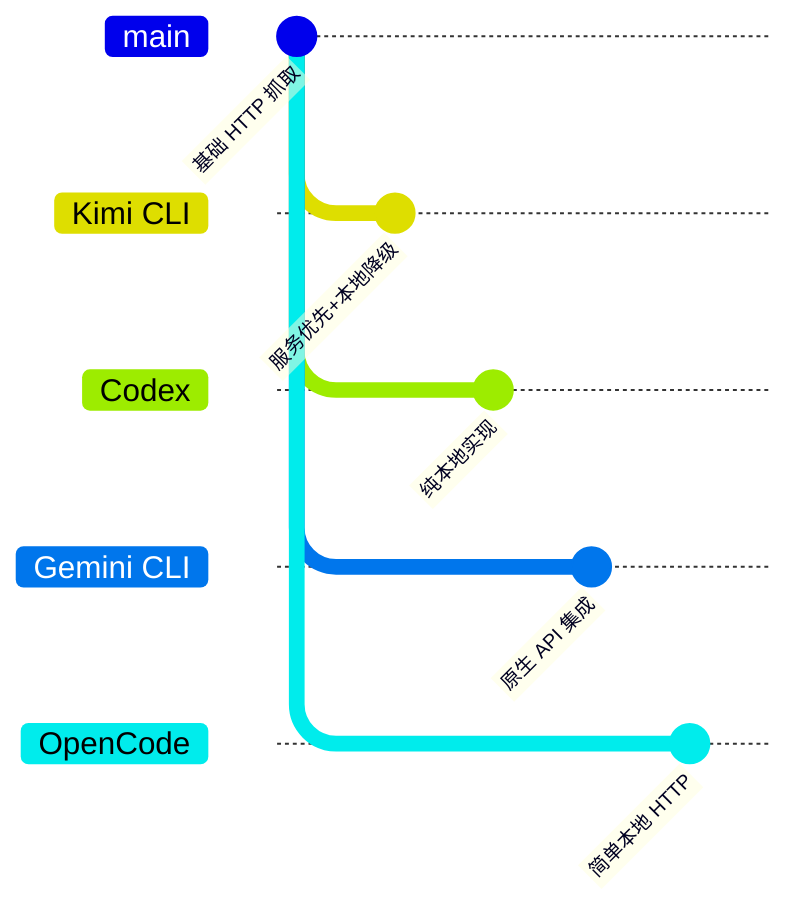

| 项目 | WebSearch 类型 | 核心差异 | 适用场景 |
|-----|---------------|---------|---------|
| **Kimi CLI** | 自助接入 WebSearch | 服务优先 + 本地降级双层架构（Moonshot 搜索服务 + 本地 HTTP 抓取） | 需要高质量搜索且要求可用性保障的场景 |
| **Codex** | 自助接入 WebSearch | 纯本地 HTTP + readability-lxml | 完全离线环境或对外部服务有安全顾虑的场景 |
| **Gemini CLI** | 厂商提供 WebSearch 接口 | Gemini API 原生搜索集成 | 已使用 Gemini API 且不需要额外配置的场景 |
| **OpenCode** | 自助接入 WebSearch | 简单本地 HTTP 实现 | 轻量级需求，对搜索质量要求不高的场景 |
| **SWE-agent** | 无 Web 搜索能力 | 未内置搜索，仅简单 HTTP | 专注于代码编辑，不依赖网络搜索的场景 |

**Kimi CLI 的独特设计**：

1. **链路追踪（X-Msh-Tool-Call-Id）**：便于服务端进行调用链分析和问题定位
2. **Token 保护机制**：`include_content` 默认关闭，避免抓取大量内容导致上下文溢出
3. **依赖注入**：工具通过构造函数声明依赖，框架自动注入，便于测试和扩展

---

## 7. 边界情况与错误处理

### 7.1 终止条件

| 终止原因 | 触发条件 | 代码位置 |
|---------|---------|---------|
| 配置缺失 | `config.services.moonshot_search is None` | `search.py:47-48` |
| API Key 无效 | `resolve_api_key()` 返回空 | `search.py:49-51` |
| HTTP 错误 | 响应状态码非 200 | `search.py:78-82` |
| 解析失败 | Pydantic ValidationError | `search.py:84-89` |
| 超时 | 服务调用超过 30 秒 | `search.py:73` |

### 7.2 超时/资源限制

```python
# kimi-cli/src/kimi_cli/tools/web/search.py:73
"timeout_seconds": 30,  # 搜索服务调用超时

# kimi-cli/src/kimi_cli/tools/web/search.py:22-23
limit: int = Field(default=5, ge=1, le=20)  # 结果数量限制

# kimi-cli/src/kimi_cli/tools/web/search.py:31
include_content: bool = Field(default=False)  # 默认不抓取内容
```

### 7.3 错误恢复策略

| 错误类型 | 处理策略 | 代码位置 |
|---------|---------|---------|
| 配置缺失 | 抛出 `SkipThisTool`，工具被跳过 | `search.py:47-48` |
| API Key 无效 | 返回错误信息，提示用户配置 | `search.py:49-54` |
| HTTP 错误 | 返回包含状态码的错误信息 | `search.py:78-82` |
| 解析失败 | 返回解析错误详情 | `search.py:84-89` |
| 服务调用失败（FetchURL） | 自动降级到本地抓取 | `fetch.py:57-65` |
| 本地抓取失败 | 返回网络错误或提取失败信息 | `fetch.py:170-179` |
| 内容提取失败 | 提示可能需要 JavaScript 渲染 | `fetch.py:181-186` |

---

## 8. 关键代码索引

| 功能 | 文件 | 行号 | 说明 |
|-----|------|------|------|
| 搜索工具入口 | `kimi-cli/src/kimi_cli/tools/web/search.py` | 39 | SearchWeb 类定义 |
| 搜索参数定义 | `kimi-cli/src/kimi_cli/tools/web/search.py` | 16-36 | Params Pydantic 模型 |
| 搜索核心逻辑 | `kimi-cli/src/kimi_cli/tools/web/search.py` | 54-94 | `__call__` 方法 |
| 响应数据结构 | `kimi-cli/src/kimi_cli/tools/web/search.py` | 120-132 | SearchResult/Response 模型 |
| 抓取工具入口 | `kimi-cli/src/kimi_cli/tools/web/fetch.py` | 22 | FetchURL 类定义 |
| 抓取核心逻辑 | `kimi-cli/src/kimi_cli/tools/web/fetch.py` | 42-108 | `__call__` 方法 |
| 本地抓取实现 | `kimi-cli/src/kimi_cli/tools/web/fetch.py` | 150-200 | `fetch_with_http_get` |
| 搜索服务配置 | `kimi-cli/src/kimi_cli/config.py` | 86-95 | MoonshotSearchConfig |
| 抓取服务配置 | `kimi-cli/src/kimi_cli/config.py` | 98-107 | MoonshotFetchConfig |
| 工具动态加载 | `kimi-cli/src/kimi_cli/soul/toolset.py` | 152-200 | `load_tools` 方法 |
| 工具注册配置 | `kimi-cli/src/kimi_cli/agents/default/agent.yaml` | 20-21 | YAML 工具列表 |
| 结果构建器 | `kimi-cli/src/kimi_cli/tools/utils.py` | 54-179 | ToolResultBuilder |
| 工具基类 | `kimi-cli/packages/kosong/src/kosong/tooling/__init__.py` | 232-316 | CallableTool2 |

---

## 9. 延伸阅读

- 前置知识：`docs/kimi-cli/04-kimi-cli-agent-loop.md` - Agent Loop 整体架构
- 相关机制：`docs/kimi-cli/06-kimi-cli-mcp-integration.md` - MCP 工具集成
- 深度分析：`docs/comm/comm-tool-system.md` - 跨项目工具系统对比
- 配置文件：`kimi-cli/src/kimi_cli/agents/default/agent.yaml` - 默认 Agent 配置
- 工具文档：`kimi-cli/src/kimi_cli/tools/web/search.md` - SearchWeb 工具描述
- 工具文档：`kimi-cli/src/kimi_cli/tools/web/fetch.md` - FetchURL 工具描述

---

*基于版本：kimi-cli (2025-02-15) | 最后更新：2025-04-12*
