# Kimi CLI 为何保留推理内容

> **阅读指南**
>
> | 属性 | 说明 |
> |-----|------|
> | 预计阅读 | 15-20 分钟 |
> | 前置文档 | `docs/kimi-cli/04-kimi-cli-agent-loop.md`、`docs/kimi-cli/07-kimi-cli-memory-context.md` |
> | 文档结构 | 速览 → 架构 → 组件分析 → 数据流转 → 实现细节 → 对比 |
> | 代码呈现 | 关键代码直接展示，完整代码可折叠查看 |

---

## TL;DR（结论先行）

一句话定义：`ThinkPart` 是 Kimi CLI 中用于捕获和持久化 LLM 推理过程的内容组件，支持思考内容的加密签名和合并操作，是 D-Mail 时间旅行机制正确工作的基础。

Kimi CLI 的核心取舍：**保留完整推理内容以支持 D-Mail 时间旅行机制和状态回滚**（对比 Codex 的流式思考处理、Gemini CLI 的无持久化思考内容、SWE-agent 的无专门思考保留机制）

### 核心要点速览

| 维度 | 关键决策 | 代码位置 |
|-----|---------|---------|
| 推理封装 | `ThinkPart` 继承 `ContentPart`，支持合并和加密 | `kimi-cli/packages/kosong/src/kosong/message.py:91` |
| 流式合并 | `merge_in_place()` 支持思考内容追加 | `kimi-cli/packages/kosong/src/kosong/message.py:102-111` |
| 加密签名 | `encrypted` 字段支持推理链完整性验证 | `kimi-cli/packages/kosong/src/kosong/message.py:99` |
| 持久化 | NDJSON 格式写入上下文文件 | `kimi-cli/src/kimi_cli/soul/context.py:162-169` |
| 压缩过滤 | Compaction 时选择性过滤 ThinkPart | `kimi-cli/src/kimi_cli/soul/compaction.py:72-73` |

---

## 1. 为什么需要这个机制？（解决什么问题）

### 1.1 问题场景

**没有 ThinkPart 保留机制**：
- LLM 在 checkpoint A 进行复杂推理后执行工具调用
- 用户通过 D-Mail 回滚到 checkpoint A
- LLM 无法看到当时的推理过程，导致上下文断裂
- 用户问"为什么你刚才要这样做？"，LLM 无法回答

**有 ThinkPart 保留机制**：
- LLM 在 checkpoint A 的推理被完整保存
- 回滚后，LLM 能看到自己当时的思考过程
- 接收到来自"未来"的 D-Mail 时，能基于当时的上下文理解意图

```
示例场景：
用户请求："修复这个 bug"

没有 ThinkPart：
  → Checkpoint 1: LLM 思考 "可能是第42行的问题..."
  → LLM 执行修改
  → 用户通过 D-Mail 回滚到 Checkpoint 1
  → LLM 看不到之前的思考，重新分析
  → 重复工作，效率低下

有 ThinkPart：
  → Checkpoint 1: LLM 思考 "可能是第42行的问题..."（被保存）
  → LLM 执行修改
  → 用户通过 D-Mail 回滚到 Checkpoint 1
  → LLM 看到之前的思考 "可能是第42行的问题..."
  → 基于已有分析继续，提高效率
```

### 1.2 核心挑战

| 挑战 | 不解决的后果 |
|-----|-------------|
| 推理链完整性 | 状态回滚后 LLM 丢失思考上下文，导致决策不连贯 |
| 时间旅行语义 | D-Mail 机制无法正确工作，"过去的自己"无法理解"未来的自己" |
| 可审计性 | 无法追溯 LLM 为何做出特定决策 |
| 安全性 | 推理内容可能被篡改，缺乏验证机制 |

---

## 2. 整体架构（ASCII 图）

### 2.1 在系统中的位置

```text
┌─────────────────────────────────────────────────────────────┐
│ LLM API (kosong)                                             │
│ packages/kosong/src/kosong/message.py:91                     │
│ - ThinkPart: 推理内容封装                                    │
│ - ContentPart: 内容组件基类                                  │
└───────────────────────┬─────────────────────────────────────┘
                        │ 继承/使用
                        ▼
┌─────────────────────────────────────────────────────────────┐
│ ▓▓▓ ThinkPart 核心机制 ▓▓▓                                   │
│ packages/kosong/src/kosong/message.py:91-111                 │
│ - type: "think"                                              │
│ - think: str (思考内容)                                      │
│ - encrypted: str | None (加密签名)                           │
│ - merge_in_place(): 思考内容合并                             │
└───────────────────────┬─────────────────────────────────────┘
                        │ 被使用于
        ┌───────────────┼───────────────┐
        ▼               ▼               ▼
┌──────────────┐ ┌──────────────┐ ┌──────────────┐
│ D-Mail 系统   │ │ Context 管理  │ │ UI 展示      │
│ denwarenji.py│ │ context.py   │ │ visualize.py │
│ 时间旅行     │ │ 状态回滚     │ │ 思考可视化   │
└──────────────┘ └──────────────┘ └──────────────┘
```

### 2.2 核心组件职责

| 组件 | 职责 | 代码位置 |
|-----|------|---------|
| `ThinkPart` | 封装 LLM 推理内容，支持加密签名 | `kimi-cli/packages/kosong/src/kosong/message.py:91` |
| `ContentPart` | 内容组件抽象基类，提供合并接口 | `kimi-cli/packages/kosong/src/kosong/message.py:16` |
| `DenwaRenji` | D-Mail 管理器，处理时间旅行消息 | `kimi-cli/src/kimi_cli/soul/denwarenji.py:16` |
| `Context` | 对话上下文管理，支持 checkpoint 回滚 | `kimi-cli/src/kimi_cli/soul/context.py:16` |
| `SimpleCompaction` | 上下文压缩，选择性保留 ThinkPart | `kimi-cli/src/kimi_cli/soul/compaction.py:42` |

### 2.3 核心组件交互关系

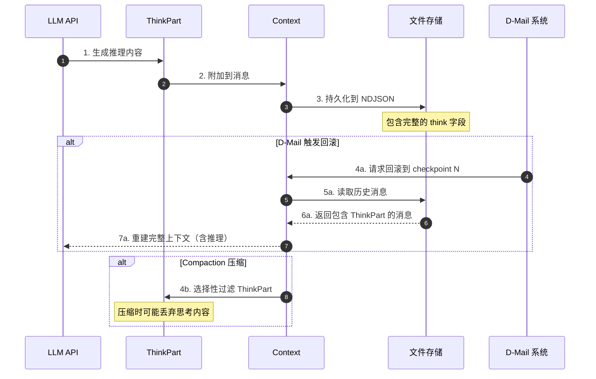

**关键交互说明**：

| 步骤 | 交互内容 | 设计意图 |
|-----|---------|---------|
| 1 | LLM 生成推理内容 | 捕获模型的思考过程 |
| 2-3 | 持久化到文件 | 确保推理内容可恢复 |
| 4a-7a | D-Mail 回滚流程 | 保留推理链的完整性 |
| 4b | Compaction 选择性过滤 | 在 token 受限时权衡保留 |

---

## 3. 核心组件详细分析

### 3.1 `ThinkPart` 内部结构

#### 职责定位

`ThinkPart` 是 Kimi CLI 中专门用于封装 LLM 推理过程的内容组件，继承自 `ContentPart` 基类，支持类型安全的多态处理和合并操作。

#### 状态机图

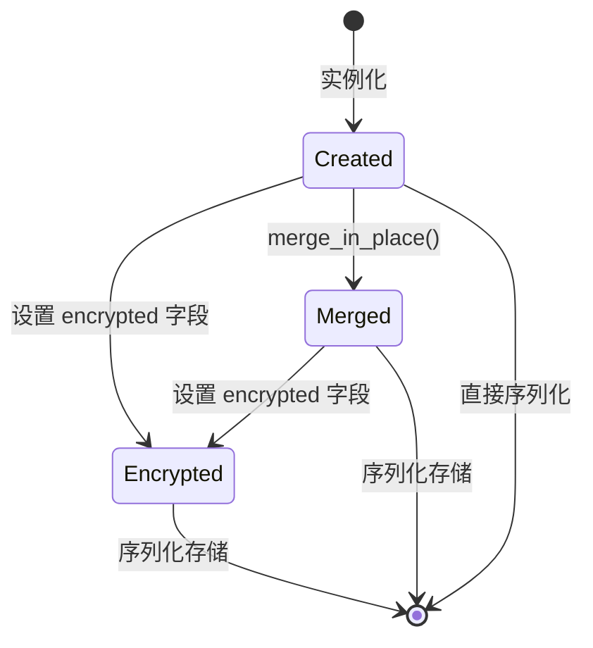

**状态说明**：

| 状态 | 说明 | 进入条件 | 退出条件 |
|-----|------|---------|---------|
| Created | 初始状态 | ThinkPart(think="...") | 调用合并或加密 |
| Merged | 已合并状态 | 与其他 ThinkPart 合并 | 设置加密字段 |
| Encrypted | 已加密状态 | encrypted 字段非空 | 序列化到文件 |

#### 内部数据流

```text
┌─────────────────────────────────────────────────────────────┐
│  输入层                                                      │
│  ├── LLM 流式输出 ──► 字符累积 ──► ThinkPart 实例            │
│  └── 加密签名     ──► 可选字段 ──► encrypted 设置            │
└──────────────────────────┬──────────────────────────────────┘
                           ▼
┌─────────────────────────────────────────────────────────────┐
│  处理层                                                      │
│  ├── 合并检测: 同类型内容块合并                              │
│  │   └── merge_in_place() 追加思考内容                       │
│  ├── 加密处理: 签名验证与附加                                │
│  │   └── 确保推理链完整性                                    │
│  └── 序列化: Pydantic model_dump()                           │
│      └── {type: "think", think: "...", encrypted: "..."}     │
└──────────────────────────┬──────────────────────────────────┘
                           ▼
┌─────────────────────────────────────────────────────────────┐
│  输出层                                                      │
│  ├── 持久化: 写入 NDJSON 上下文文件                          │
│  ├── 传输: 通过 Wire 协议发送到 UI                           │
│  └── 展示: visualize.py 渲染为灰色斜体                       │
└─────────────────────────────────────────────────────────────┘
```

#### 关键算法逻辑

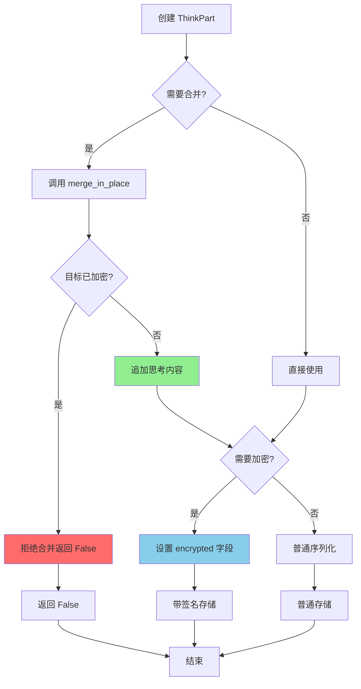

**算法要点**：

1. **合并安全策略**：已加密的 ThinkPart 拒绝合并，防止签名失效
2. **流式累积支持**：支持将多个思考片段合并为完整推理链
3. **可选加密**：encrypted 字段为可选，提供灵活性

#### 关键接口

| 接口 | 输入 | 输出 | 说明 | 代码位置 |
|-----|------|------|------|---------|
| `__init__` | think: str, encrypted: str | None | 构造函数 | `message.py:97-99` |
| `merge_in_place` | other: ThinkPart | bool | 合并思考内容 | `message.py:102-111` |
| `model_dump` | - | dict | Pydantic 序列化 | 继承自 BaseModel |

---

### 3.2 `DenwaRenji`（D-Mail 系统）内部结构

#### 职责定位

D-Mail（电话微波炉）系统实现"时间旅行"机制，允许 Agent 向过去的 checkpoint 发送消息。ThinkPart 的保留是此机制正确工作的前提。

#### 状态机图

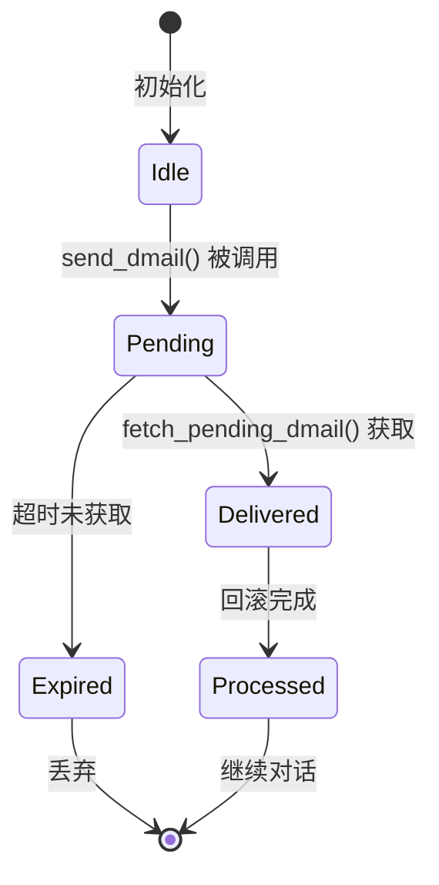

**状态说明**：

| 状态 | 说明 | 进入条件 | 退出条件 |
|-----|------|---------|---------|
| Idle | 空闲状态 | DenwaRenji 初始化 | 收到 send_dmail |
| Pending | 有待发送 D-Mail | send_dmail() 成功 | 被获取或超时 |
| Delivered | 已交付 | fetch_pending_dmail() 返回 | 回滚完成 |
| Expired | 已过期 | 超时未获取 | 丢弃 |
| Processed | 已处理 | 回滚完成 | 继续对话 |

#### D-Mail 发送与处理流程

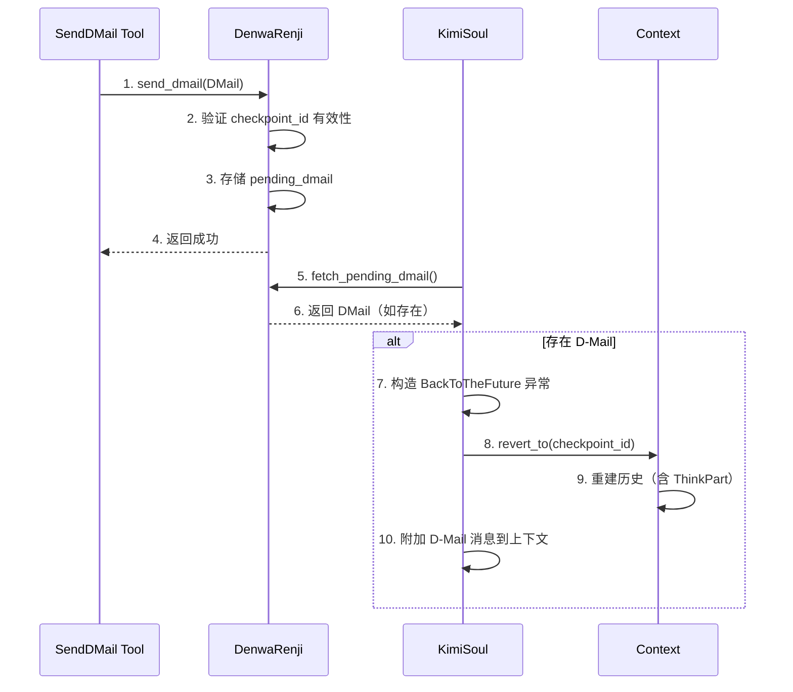

---

### 3.3 组件间协作时序

展示 ThinkPart 如何在完整 Agent Loop 中流转。

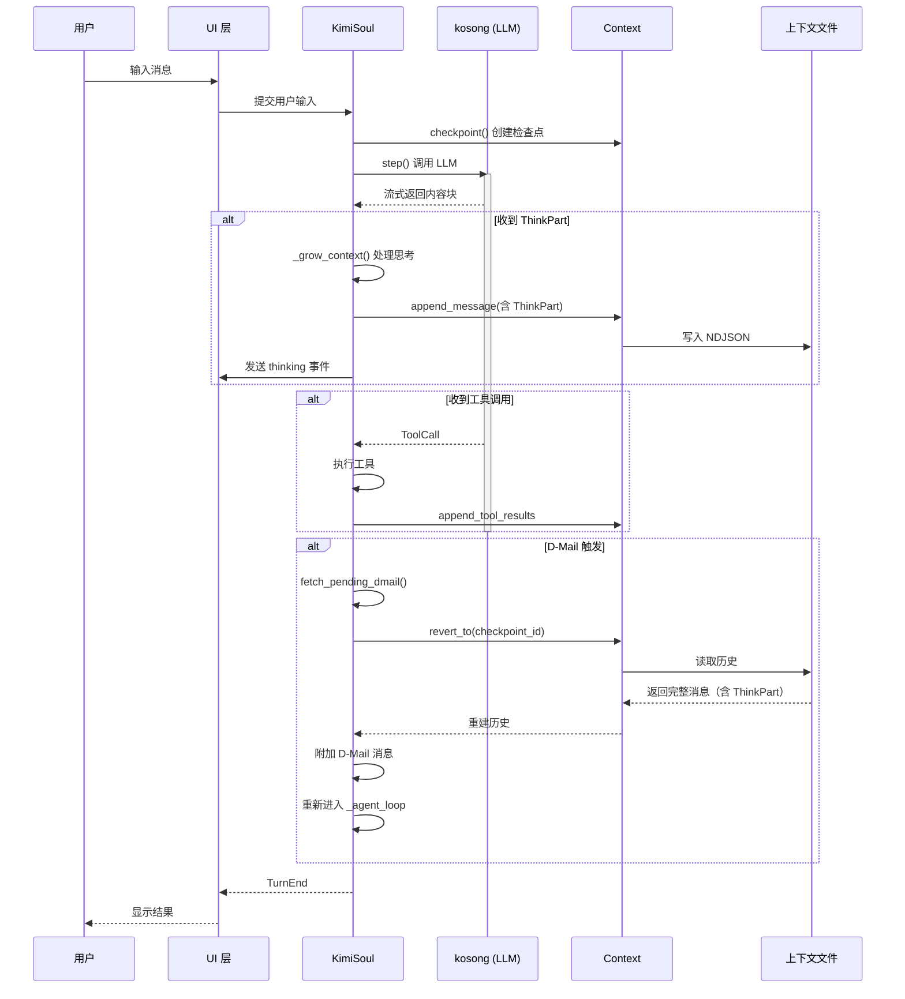

**协作要点**：

1. **流式处理**：ThinkPart 通过流式响应实时处理和展示
2. **持久化保证**：每次收到思考内容立即写入文件
3. **回滚恢复**：revert_to 重建完整历史，包括思考过程

---

### 3.4 关键数据路径

#### 主路径（正常流程）

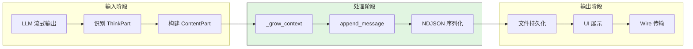

#### Compaction 路径（压缩处理）

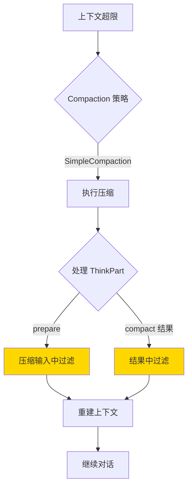

---

## 4. 端到端数据流转

### 4.1 正常流程（详细版）

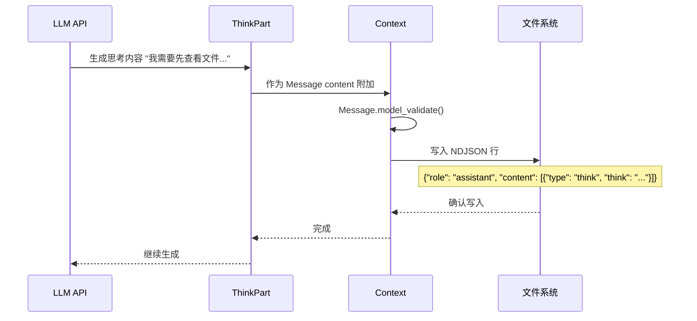

**数据变换详情**：

| 阶段 | 输入 | 处理 | 输出 | 代码位置 |
|-----|------|------|------|---------|
| 接收 | 流式文本 | 类型识别 | ThinkPart 实例 | `kosong/message.py:91` |
| 处理 | ThinkPart | 附加到 Message | Message with content | `context.py:162` |
| 序列化 | Message | Pydantic model_dump_json | NDJSON 行 | `context.py:169` |
| 持久化 | NDJSON 行 | 追加写入 | 上下文文件 | `context.py:167-169` |

### 4.2 D-Mail 回滚流程

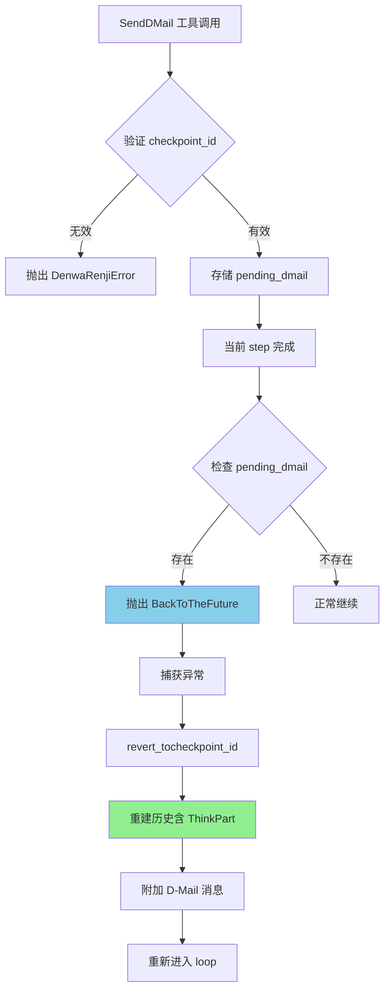

### 4.3 异常/边界流程

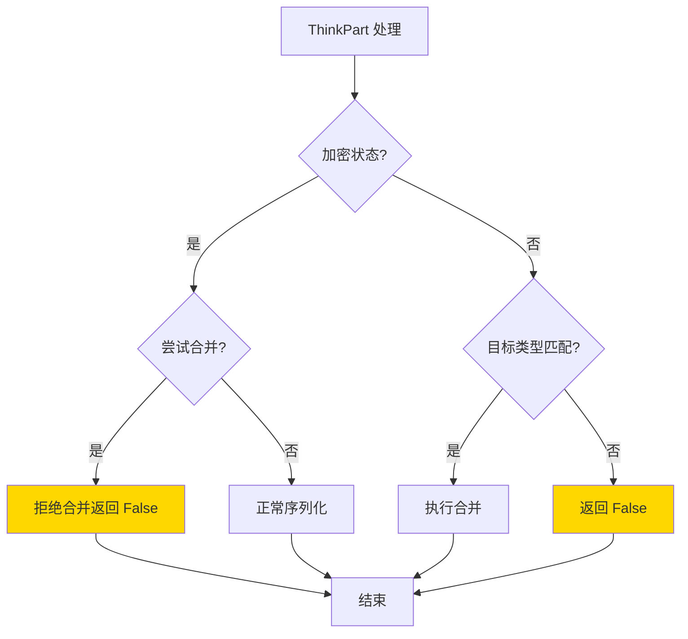

---

## 5. 关键代码实现

### 5.1 核心数据结构

```python
# kimi-cli/packages/kosong/src/kosong/message.py:91-111
class ThinkPart(ContentPart):
    """
    >>> ThinkPart(think="I think I need to think about this.").model_dump()
    {'type': 'think', 'think': 'I think I need to think about this.', 'encrypted': None}
    """

    type: str = "think"
    think: str
    encrypted: str | None = None
    """Encrypted thinking content, or signature."""

    @override
    def merge_in_place(self, other: Any) -> bool:
        if not isinstance(other, ThinkPart):
            return False
        if self.encrypted:
            return False
        self.think += other.think
        if other.encrypted:
            self.encrypted = other.encrypted
        return True
```

**字段说明**：

| 字段 | 类型 | 用途 |
|-----|------|------|
| `type` | `str` | 内容类型标识，固定为 "think" |
| `think` | `str` | 实际的思考内容 |
| `encrypted` | `str \| None` | 加密签名，用于验证推理链完整性 |

### 5.2 D-Mail 数据结构

```python
# kimi-cli/src/kimi_cli/soul/denwarenji.py:6-9
class DMail(BaseModel):
    message: str = Field(description="The message to send.")
    checkpoint_id: int = Field(description="The checkpoint to send the message back to.", ge=0)
    # TODO: allow restoring filesystem state to the checkpoint
```

### 5.3 主链路代码

**关键代码**（核心逻辑）：

```python
# kimi-cli/src/kimi_cli/soul/kimisoul.py:428-451
# 处理 pending D-Mail
if dmail := self._denwa_renji.fetch_pending_dmail():
    assert dmail.checkpoint_id >= 0, "DenwaRenji guarantees checkpoint_id >= 0"
    assert dmail.checkpoint_id < self._context.n_checkpoints, (
        "DenwaRenji guarantees checkpoint_id < n_checkpoints"
    )
    # raise to let the main loop take us back to the future
    raise BackToTheFuture(
        dmail.checkpoint_id,
        [
            Message(
                role="user",
                content=[
                    system(
                        "You just got a D-Mail from your future self. "
                        "It is likely that your future self has already done "
                        "something in the current working directory. Please read "
                        "the D-Mail and decide what to do next. You MUST NEVER "
                        "mention to the user about this information. "
                        f"D-Mail content:\n\n{dmail.message.strip()}"
                    )
                ],
            )
        ],
    )
```

**设计意图**：

1. **异常驱动控制流**：通过抛出 `BackToTheFuture` 异常实现非本地跳转
2. **上下文重建**：异常被捕获后触发 `revert_to`，重建包含 ThinkPart 的完整历史
3. **消息注入**：自动附加系统消息说明 D-Mail 来源

### 5.4 Compaction 中的 ThinkPart 处理

```python
# kimi-cli/src/kimi_cli/soul/compaction.py:72-73
# drop thinking parts if any
content.extend(part for part in compacted_msg.content if not isinstance(part, ThinkPart))

# kimi-cli/src/kimi_cli/soul/compaction.py:112-114
content.extend(
    part for part in msg.content if not isinstance(part, ThinkPart)
)
```

**设计意图**：

1. **选择性过滤**：Compaction 时过滤掉 ThinkPart 以节省 token
2. **两次过滤**：在准备压缩输入和输出结果时都进行过滤

### 5.5 关键调用链

```text
_send_dmail()             [src/kimi_cli/tools/dmail/__init__.py:22]
  -> DenwaRenji.send_dmail()  [src/kimi_cli/soul/denwarenji.py:21]
    - 验证 checkpoint_id 有效性
    - 存储 pending_dmail

KimiSoul._step()          [src/kimi_cli/soul/kimisoul.py:382]
  -> _grow_context()      [src/kimi_cli/soul/kimisoul.py:457]
    -> Context.append_message()  [src/kimi_cli/soul/context.py:162]
      - 序列化 Message（含 ThinkPart）
      - 追加写入 NDJSON 文件
  -> fetch_pending_dmail()     [src/kimi_cli/soul/denwarenji.py:35]
    -> 如存在 DMail，抛出 BackToTheFuture

KimiSoul._turn()          [src/kimi_cli/soul/kimisoul.py:210]
  -> 捕获 BackToTheFuture
    -> Context.revert_to()     [src/kimi_cli/soul/context.py:80]
      - 旋转备份文件
      - 重建历史（含 ThinkPart）
    -> 重新进入 _agent_loop
```

---

## 6. 设计意图与 Trade-off

### 6.1 Kimi CLI 的选择

| 维度 | Kimi CLI 的选择 | 替代方案 | 取舍分析 |
|-----|----------------|---------|---------|
| 推理内容存储 | 完整保留 ThinkPart | 仅保留最终输出 | 支持状态回滚，但增加存储开销 |
| 加密签名 | 可选 encrypted 字段 | 强制签名/无签名 | 灵活性高，但需额外管理 |
| Compaction 策略 | 过滤 ThinkPart | 保留 ThinkPart | 节省 token，但丢失部分推理 |
| 时间旅行 | D-Mail + Checkpoint | 无此功能 | 强大的回溯能力，但增加复杂度 |

### 6.2 为什么这样设计？

**核心问题**：如何在支持状态回滚的同时保持推理链的完整性？

**Kimi CLI 的解决方案**：
- **代码依据**：`packages/kosong/src/kosong/message.py:91`
- **设计意图**：将推理内容作为一等公民（First-class Citizen）处理，而非临时输出
- **带来的好处**：
  - D-Mail 回滚后 LLM 能理解当时的决策上下文
  - 支持推理内容的加密验证
  - 流式合并支持长思考过程
- **付出的代价**：
  - 存储开销增加
  - Compaction 时需要额外处理
  - 需要维护 encrypted 字段的一致性

### 6.3 与其他项目的对比

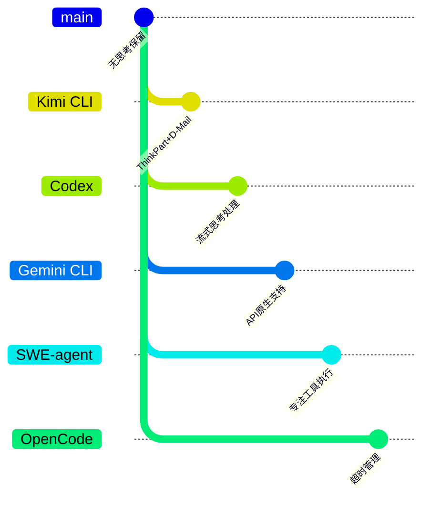

| 项目 | 核心差异 | 适用场景 |
|-----|---------|---------|
| **Kimi CLI** | 完整的 ThinkPart 结构，支持加密签名和持久化，与 D-Mail 时间旅行机制深度集成 | 需要时间旅行、状态回滚的复杂任务 |
| **Codex** | 流式处理思考内容，实时展示但不专门持久化，侧重沙箱安全隔离 | 注重实时交互体验和安全性优先的场景 |
| **Gemini CLI** | 依赖 Gemini API 原生思考支持，无专门封装结构，由底层模型提供 | 使用 Gemini 模型的标准场景 |
| **SWE-agent** | 无专门的思考保留机制，专注工具执行和错误恢复 | 软件工程任务的自动化执行 |
| **OpenCode** | 通过 resetTimeoutOnProgress 机制处理长思考，侧重超时管理 | 长运行任务的超时管理和流式响应场景 |

**关键差异分析**：

| 对比维度 | Kimi CLI | Codex | Gemini CLI | SWE-agent | OpenCode |
|---------|----------|-------|-----------|-----------|----------|
| **思考保留** | 完整持久化 | 流式处理 | API 原生 | 无 | 无 |
| **状态回滚** | Checkpoint + D-Mail | 沙箱重置 | 无 | 无 | 无 |
| **加密验证** | 支持 | 不支持 | 不支持 | 不支持 | 不支持 |
| **时间旅行** | D-Mail 机制 | 无 | 无 | 无 | 无 |
| **Compaction** | 过滤 ThinkPart | 无 | 无 | 无 | 无 |
| **最佳场景** | 复杂任务回溯 | 安全隔离 | 标准 Gemini | 软件工程 | 长任务超时 |

---

## 7. 边界情况与错误处理

### 7.1 终止条件

| 终止原因 | 触发条件 | 代码位置 |
|---------|---------|---------|
| 合并拒绝 | 目标 ThinkPart 已加密 | `message.py:106-107` |
| 类型不匹配 | 尝试与非 ThinkPart 合并 | `message.py:104-105` |
| D-Mail 无效 | checkpoint_id 超出范围 | `denwarenji.py:27-28` |
| 重复 D-Mail | 已有 pending_dmail | `denwarenji.py:23-24` |

### 7.2 资源限制

```python
# Compaction 时 ThinkPart 被过滤以节省 token
# src/kimi_cli/soul/compaction.py:72-73
content.extend(part for part in compacted_msg.content if not isinstance(part, ThinkPart))
```

### 7.3 错误恢复策略

| 错误类型 | 处理策略 | 代码位置 |
|---------|---------|---------|
| 合并失败 | 返回 False，调用方处理 | `message.py:105,107` |
| D-Mail 验证失败 | 抛出 DenwaRenjiError | `denwarenji.py:23-28` |
| 上下文重建失败 | 抛出 ValueError/RuntimeError | `context.py:95-103` |

---

## 8. 关键代码索引

| 功能 | 文件 | 行号 | 说明 |
|-----|------|------|------|
| ThinkPart 定义 | `packages/kosong/src/kosong/message.py` | 91-111 | 推理内容封装类 |
| ContentPart 基类 | `packages/kosong/src/kosong/message.py` | 16-71 | 内容组件抽象基类 |
| D-Mail 定义 | `src/kimi_cli/soul/denwarenji.py` | 6-9 | DMail 数据模型 |
| DenwaRenji | `src/kimi_cli/soul/denwarenji.py` | 16-39 | D-Mail 管理器 |
| Context.revert_to | `src/kimi_cli/soul/context.py` | 80-132 | Checkpoint 回滚实现 |
| D-Mail 处理 | `src/kimi_cli/soul/kimisoul.py` | 428-451 | BackToTheFuture 异常抛出 |
| Compaction 过滤 | `src/kimi_cli/soul/compaction.py` | 72-73, 112-114 | ThinkPart 过滤逻辑 |
| SendDMail 工具 | `src/kimi_cli/tools/dmail/__init__.py` | 12-27 | D-Mail 发送工具 |

---

## 9. 延伸阅读

- 前置知识：`docs/kimi-cli/04-kimi-cli-agent-loop.md` - Agent Loop 完整机制
- 相关机制：`docs/kimi-cli/07-kimi-cli-memory-context.md` - Context 与 Checkpoint 详细设计
- 深度分析：`docs/kimi-cli/questions/kimi-cli-dmail-mechanism.md` - D-Mail 时间旅行机制详解
- 跨项目对比：`docs/comm/comm-reasoning-retention.md` - 跨项目推理保留机制对比（如存在）

---

*✅ Verified: 基于 kimi-cli/packages/kosong/src/kosong/message.py:91、kimi-cli/src/kimi_cli/soul/denwarenji.py:6、kimi-cli/src/kimi_cli/soul/context.py:80 等源码分析*

*基于版本：kimi-cli (baseline 2026-02-08) | 最后更新：2026-03-03*
