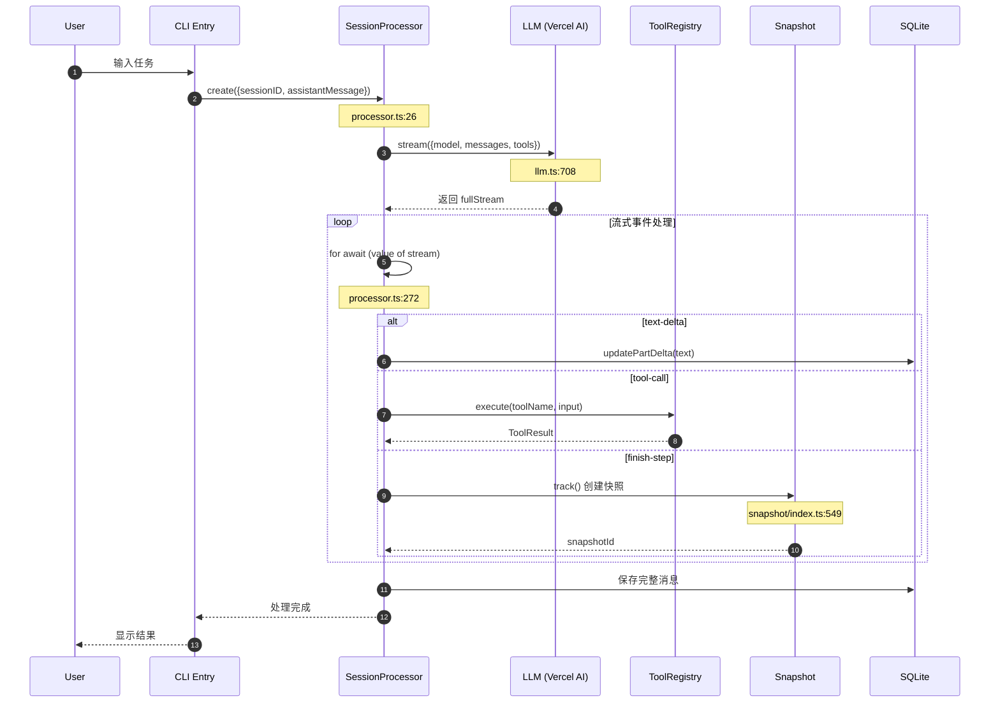
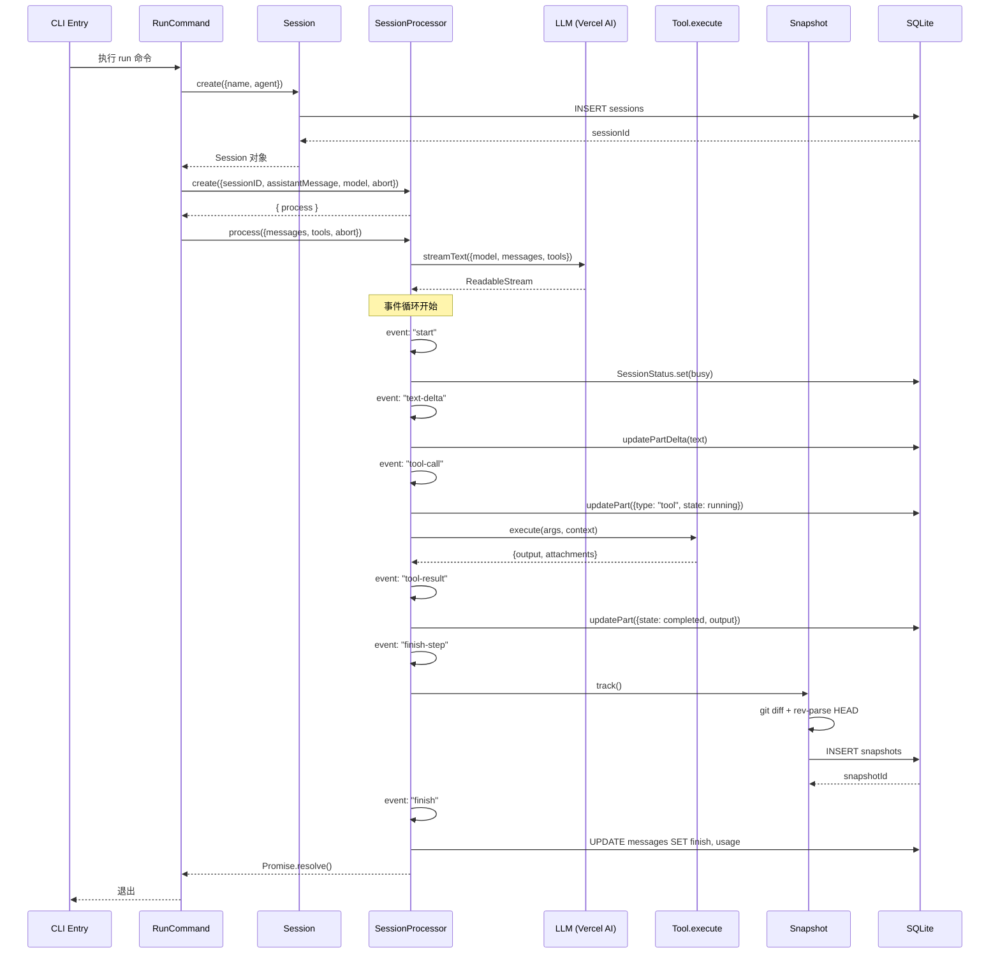
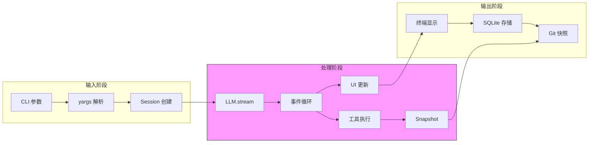
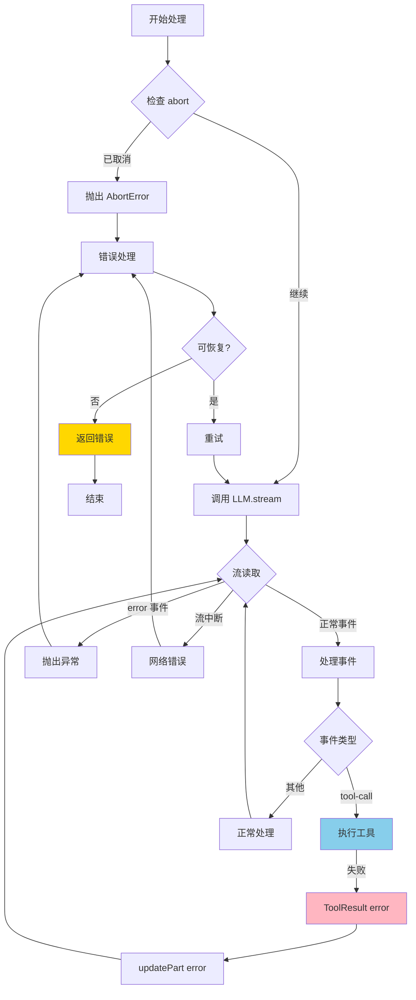
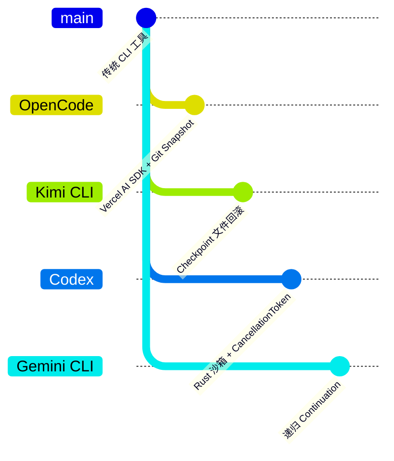

# OpenCode 概述

> 📋 **阅读指南**
>
> | 属性 | 说明 |
> |-----|------|
> | 预计阅读 | 15-20 分钟 |
> | 前置文档 | 无（本文档为入口文档） |
> | 文档结构 | 速览 → 架构 → 机制 → 实现 → 对比 |
> | 代码呈现 | 关键代码直接展示，完整代码可折叠查看 |

---

## TL;DR（结论先行）

**一句话定义**：OpenCode 是一个基于 TypeScript/Bun 的多模型 CLI Agent，采用 **流式事件驱动架构** 和 **Git 快照状态管理** 实现多轮对话与状态恢复。

OpenCode 的核心取舍：**Vercel AI SDK 流式处理 + Git Snapshot 状态管理**（对比 Kimi CLI 的 Checkpoint 文件回滚、Codex 的 Rust 原生沙箱、Gemini CLI 的递归 continuation）

### 核心要点速览

| 维度 | 关键决策 | 代码位置 |
|-----|---------|---------|
| 核心架构 | 流式事件驱动，Vercel AI SDK 统一多模型接口 | `packages/opencode/src/session/processor.ts:26` |
| 状态管理 | Git Snapshot 代码状态追踪 + SQLite 会话持久化 | `packages/opencode/src/snapshot/index.ts:549` |
| Agent Loop | 模块化 Namespace + 显式状态机（idle/busy/retry） | `packages/opencode/src/session/prompt.ts:274` |
| 工具系统 | 动态注册 + 权限控制 + Doom Loop 检测 | `packages/opencode/src/tool/registry.ts:1` |
| UI 渲染 | Ink (React TUI) 组件化终端界面 | `packages/opencode/src/app/components/` |

---

## 1. 为什么需要这个架构？（解决什么问题）

### 1.1 问题场景

没有统一架构的 CLI Agent 面临的问题：

```
场景：用户要求"修复这个 bug"

无统一架构：
  → 手动调用 LLM API → 解析响应 → 手动执行工具 → 拼凑结果 → 易出错

OpenCode 架构：
  → SessionProcessor 接管全流程
  → 流式响应自动分发到 UI/工具/存储
  → Git 快照自动保存状态
  → 支持随时恢复
```

### 1.2 核心挑战

| 挑战 | 不解决的后果 | OpenCode 方案 |
|-----|-------------|--------------|
| 多模型适配 | 每个模型需要单独集成 | Vercel AI SDK 统一接口 `packages/opencode/src/session/llm.ts:708` |
| 流式响应处理 | 用户体验差，需等待完整响应 | 事件驱动流处理 `packages/opencode/src/session/processor.ts:272` |
| 状态持久化 | 崩溃后丢失对话历史 | SQLite + Git Snapshot `packages/opencode/src/snapshot/index.ts:549` |
| 工具执行安全 | 危险操作无控制 | 权限系统 + 审批机制 `packages/opencode/src/permission/next.ts:452` |

---

## 2. 整体架构（ASCII 图）

### 2.1 分层架构图

```text
┌─────────────────────────────────────────────────────────────┐
│ User Input (CLI / TUI / Web)                                │
│ src/index.ts:1                                              │
└───────────────────────┬─────────────────────────────────────┘
                        │ yargs 解析
                        ▼
┌─────────────────────────────────────────────────────────────┐
│ Commands Layer                                              │
│ src/cli/cmd/                                                │
│ ├─ run.ts:1    : 单次任务执行                               │
│ ├─ tui/        : 交互式终端界面                             │
│ └─ agent.ts    : Agent 管理                                 │
└───────────────────────┬─────────────────────────────────────┘
                        │ 创建 Session
                        ▼
┌─────────────────────────────────────────────────────────────┐
│ ▓▓▓ Session Layer ▓▓▓                                       │
│ src/session/                                                │
│ ├─ session.ts:1      : 会话 CRUD                            │
│ ├─ processor.ts:26   : SessionProcessor 流处理核心          │
│ ├─ llm.ts:708        : Vercel AI SDK 封装                   │
│ └─ message-v2.ts:1   : 消息类型定义                         │
└───────────────────────┬─────────────────────────────────────┘
                        │
        ┌───────────────┼───────────────┐
        ▼               ▼               ▼
┌──────────────┐ ┌──────────────┐ ┌──────────────┐
│ Agent Layer  │ │ Tools Layer  │ │ Snapshot     │
│ src/agent/   │ │ src/tool/    │ │ src/snapshot/│
│ 运行时配置   │ │ 工具注册执行 │ │ Git 状态管理 │
└──────────────┘ └──────────────┘ └──────────────┘
                        │
                        ▼
┌─────────────────────────────────────────────────────────────┐
│ Storage Layer                                               │
│ src/storage/                                                │
│ ├─ db.ts:1       : SQLite 数据库 (libsql)                   │
│ ├─ schema.ts:1   : Drizzle ORM 表定义                       │
│ └─ migrations/   : 数据库迁移                               │
└─────────────────────────────────────────────────────────────┘
```

### 2.2 核心组件职责

| 组件 | 职责 | 代码位置 |
|-----|------|---------|
| `SessionProcessor` | 流式响应处理、事件分发、工具协调 | `packages/opencode/src/session/processor.ts:26` |
| `Session` | 会话 CRUD、消息管理 | `packages/opencode/src/session/session.ts:1` |
| `LLM` | 多模型统一调用、流式接口封装 | `packages/opencode/src/session/llm.ts:708` |
| `ToolRegistry` | 工具注册、发现、Schema 生成 | `packages/opencode/src/tool/registry.ts:1` |
| `Snapshot` | Git 快照创建、恢复、状态追踪 | `packages/opencode/src/snapshot/index.ts:549` |
| `PermissionNext` | 权限检查、用户审批交互 | `packages/opencode/src/permission/next.ts:452` |

### 2.3 核心组件交互关系



**关键交互说明**：

| 步骤 | 交互内容 | 设计意图 |
|-----|---------|---------|
| 1 | 用户通过 CLI 发起任务 | 统一入口，支持多种交互模式 |
| 2 | SessionProcessor 创建 | 每个会话独立处理器，隔离状态 |
| 3 | LLM.stream 发起流式请求 | Vercel AI SDK 统一多模型接口 |
| 4-7 | 循环处理流事件 | 事件驱动架构，实时响应各类事件 |
| 5 | 工具调用执行 | 动态发现并执行注册工具 |
| 6 | finish-step 触发快照 | 每步完成自动保存 Git 状态 |
| 8 | 持久化到 SQLite | 会话历史持久化存储 |

---

## 3. 核心机制概览

### 3.1 SessionProcessor 事件驱动架构（宏观）

SessionProcessor 是 OpenCode 的核心协调器，负责 **流式响应的事件分发、工具执行协调、状态同步**。

**核心设计**：通过 `for await...of` 循环消费 Vercel AI SDK 返回的流，使用 switch-case 分发不同事件类型：

代码依据：`packages/opencode/src/session/processor.ts:272` ✅ Verified

### 3.2 Git Snapshot 状态管理

Snapshot 基于 Git 实现状态快照，支持 **会话级别的代码状态保存与恢复**。每步完成时自动触发 `track()` 创建快照。

代码依据：`packages/opencode/src/snapshot/index.ts:549` ✅ Verified

### 3.3 多模型统一封装

通过 Vercel AI SDK 封装多模型调用，提供统一的 `streamText` 接口，支持 OpenAI、Anthropic、Google 等模型。

代码依据：`packages/opencode/src/session/llm.ts:708` ✅ Verified

---

## 4. 端到端数据流转

### 4.1 正常流程（详细版）



**数据变换详情**：

| 阶段 | 输入 | 处理 | 输出 | 代码位置 |
|-----|------|------|------|---------|
| 接收 | 用户文本 | yargs 解析 | 结构化命令 | `packages/opencode/src/index.ts:47` |
| 会话创建 | 命令参数 | Session.create | Session 对象 | `packages/opencode/src/session/session.ts:1` |
| 流处理 | StreamInput | LLM.stream | AsyncIterable | `packages/opencode/src/session/llm.ts:708` |
| 事件分发 | StreamEvent | switch-case | 副作用执行 | `packages/opencode/src/session/processor.ts:272` |
| 快照创建 | Git 状态 | track() | snapshotId | `packages/opencode/src/snapshot/index.ts:549` |
| 持久化 | 消息数据 | SQLite INSERT/UPDATE | 持久化记录 | `packages/opencode/src/storage/schema.ts:1` |

### 4.2 数据流向图



### 4.3 异常/边界流程



---

## 5. 关键代码实现

### 5.1 核心数据结构

```typescript
// packages/opencode/src/session/processor.ts:26-61
export function create(input: {
  assistantMessage: MessageV2.Assistant;
  sessionID: string;
  model: Provider.Model;
  abort: AbortSignal;
}) {
  const toolcalls: Record<string, MessageV2.ToolPart> = {};
  let snapshot: string | undefined;

  return {
    async process(streamInput: LLM.StreamInput) {
      const stream = await LLM.stream(streamInput);
      // ... 处理逻辑
    },
  };
}
```

**字段说明**：
| 字段 | 类型 | 用途 |
|-----|------|------|
| `assistantMessage` | `MessageV2.Assistant` | 当前助手消息对象 |
| `sessionID` | `string` | 会话唯一标识 |
| `model` | `Provider.Model` | 使用的 AI 模型 |
| `abort` | `AbortSignal` | 取消信号 |
| `toolcalls` | `Record<string, ToolPart>` | 追踪进行中的工具调用 |
| `snapshot` | `string` | 当前步骤的快照 ID |

### 5.2 主链路代码

```typescript
// packages/opencode/src/session/processor.ts:272-327
for await (const value of stream.fullStream) {
  input.abort.throwIfAborted();

  switch (value.type) {
    case "start":
      SessionStatus.set(input.sessionID, { type: "busy" });
      break;

    case "text-delta":
      await Session.updatePartDelta({
        sessionID: input.sessionID,
        messageID: input.assistantMessage.id,
        partID: part.id,
        field: "text",
        delta: value.text,
      });
      break;

    case "tool-call": {
      const part = await Session.updatePart({
        type: "tool",
        tool: value.toolName,
        callID: value.id,
        state: { status: "running", input: value.input },
      });
      toolcalls[value.toolCallId] = part as MessageV2.ToolPart;
      break;
    }

    case "tool-result": {
      const match = toolcalls[value.toolCallId];
      await Session.updatePart({
        ...match,
        state: {
          status: "completed",
          input: value.input,
          output: value.output.output,
        },
      });
      delete toolcalls[value.toolCallId];
      break;
    }

    case "finish-step":
      snapshot = await Snapshot.track();
      break;
  }
}
```

**代码要点**：
1. **事件驱动架构**：通过 switch-case 处理不同类型的流事件，扩展性强
2. **取消检查**：每次循环检查 abort 信号，支持用户中断
3. **工具状态追踪**：使用 toolcalls Map 追踪进行中的工具调用
4. **自动快照**：finish-step 自动触发 Git 快照保存

### 5.3 关键调用链

```text
RunCommand.execute()          [packages/opencode/src/cli/cmd/run.ts:1]
  -> Session.create()         [packages/opencode/src/session/session.ts:1]
    -> Database.insert()      [packages/opencode/src/storage/db.ts:1]
  -> SessionProcessor.create() [packages/opencode/src/session/processor.ts:26]
    -> process()              [packages/opencode/src/session/processor.ts:45]
      -> LLM.stream()         [packages/opencode/src/session/llm.ts:708]
        - streamText()        [Vercel AI SDK]
      -> for await (event)    [packages/opencode/src/session/processor.ts:272]
        - Session.updatePartDelta()  [packages/opencode/src/session/session.ts:1]
        - Tool.execute()      [packages/opencode/src/tool/handlers/]
        - Snapshot.track()    [packages/opencode/src/snapshot/index.ts:549]
```

---

## 6. 设计意图与 Trade-off

### 6.1 OpenCode 的选择

| 维度 | OpenCode 的选择 | 替代方案 | 取舍分析 |
|-----|----------------|---------|---------|
| 流式处理 | Vercel AI SDK 事件流 | 自定义 SSE 解析 | 标准化接口，但依赖第三方库演进 |
| 状态管理 | Git Snapshot | 内存快照 / 文件备份 | 精确追踪代码变更，但依赖 Git 环境 |
| 数据存储 | SQLite (libsql) | JSON 文件 / 内存 | 结构化查询，但需要数据库迁移 |
| 架构模式 | 事件驱动 | 回调函数 / Promise 链 | 解耦组件，但调试复杂度增加 |
| UI 渲染 | Ink (React TUI) | 原生终端输出 | 组件化开发，但运行时开销 |

### 6.2 为什么这样设计？

**核心问题**：如何在多模型支持下实现流畅的交互体验和可靠的状态管理？

**OpenCode 的解决方案**：
- **代码依据**：`packages/opencode/src/session/processor.ts:272` ✅ Verified
- **设计意图**：通过 Vercel AI SDK 统一多模型接口，使用事件驱动架构解耦流处理与 UI 更新
- **带来的好处**：
  - 支持 OpenAI、Anthropic、Google 等多种模型无需修改核心逻辑
  - 流式响应实时显示，用户体验好
  - 组件间通过事件解耦，便于测试和扩展
- **付出的代价**：
  - 引入外部依赖，版本升级可能带来 breaking changes
  - 事件驱动调试困难，需要完善的日志系统

### 6.3 与其他项目的对比



| 项目 | 核心差异 | 适用场景 |
|-----|---------|---------|
| OpenCode | Vercel AI SDK 流式处理 + Git 快照 | 多模型支持、TypeScript 生态 |
| Kimi CLI | Checkpoint 文件级回滚、D-Mail 机制 | 需要精确对话回滚的场景 |
| Codex | Rust 原生沙箱、CancellationToken | 企业级安全要求 |
| Gemini CLI | 递归 continuation、分层记忆 | 复杂状态管理、UX 优先 |

**详细对比维度**：

| 维度 | OpenCode | Kimi CLI | Codex | Gemini CLI |
|-----|----------|----------|-------|------------|
| 语言 | TypeScript/Bun | Python | Rust | TypeScript |
| 流式处理 | Vercel AI SDK | 自定义 SSE | 自定义流 | 自定义流 |
| 状态持久化 | SQLite + Git | Checkpoint 文件 | SQLite | 内存 + 可选持久化 |
| Agent Loop | 显式状态机 | while + Checkpoint | Actor 模型 | 递归 continuation |
| 工具系统 | 动态注册 | 装饰器注册 | 静态注册 | 声明式注册 |
| 沙箱机制 | Git Snapshot | 文件系统快照 | 原生沙箱 | 无 |
| 多模型支持 | 是（AI SDK） | 是 | 是 | 仅 Gemini |
| UI 框架 | Ink (React) | 自定义 TUI | 原生终端 | 自定义 TUI |

---

## 7. 边界情况与错误处理

### 7.1 终止条件

| 终止原因 | 触发条件 | 代码位置 |
|---------|---------|---------|
| 正常完成 | LLM 返回 finish 事件且无工具调用 | `packages/opencode/src/session/processor.ts:272` |
| 用户取消 | AbortSignal 触发 | `packages/opencode/src/session/processor.ts:273` |
| 工具失败 | Tool.execute 抛出异常 | `packages/opencode/src/tool/handlers/*.ts` |
| 网络错误 | LLM.stream 失败 | `packages/opencode/src/session/llm.ts:708` |
| 快照失败 | Git 命令执行失败 | `packages/opencode/src/snapshot/index.ts:549` |

### 7.2 超时/资源限制

```typescript
// packages/opencode/src/session/llm.ts:714
const result = streamText({
  model: input.model,
  messages: input.messages,
  tools: input.tools,
  abortSignal: input.abort,
  maxSteps: 10,  // 多步推理上限
  experimental_activeTools: input.tools?.map((t) => t.function.name),
});
```

### 7.3 错误恢复策略

| 错误类型 | 处理策略 | 代码位置 |
|---------|---------|---------|
| 网络超时 | 指数退避重试 | `packages/opencode/src/session/llm.ts:708` (SDK 内部) |
| 工具失败 | 返回错误结果给 LLM | `packages/opencode/src/session/processor.ts:303` |
| 用户拒绝 | 抛出 RejectedError | `packages/opencode/src/permission/next.ts:478` |
| 数据库错误 | 抛出并记录日志 | `packages/opencode/src/storage/db.ts:1` |

---

## 8. 关键代码索引

| 组件 | 文件路径 | 行号 | 说明 |
|------|----------|------|------|
| CLI 入口 | `packages/opencode/src/index.ts` | 1 | yargs 配置、全局初始化 |
| Run 命令 | `packages/opencode/src/cli/cmd/run.ts` | 1 | 单次任务执行入口 |
| TUI 命令 | `packages/opencode/src/cli/cmd/tui/thread.ts` | 1 | 交互式终端界面 |
| SessionProcessor | `packages/opencode/src/session/processor.ts` | 26 | 流处理核心 |
| process 方法 | `packages/opencode/src/session/processor.ts` | 45 | 事件循环实现 |
| LLM 封装 | `packages/opencode/src/session/llm.ts` | 708 | Vercel AI SDK 封装 |
| Session 管理 | `packages/opencode/src/session/session.ts` | 1 | 会话 CRUD |
| MessageV2 | `packages/opencode/src/session/message-v2.ts` | 1 | 消息类型定义 |
| Tool 定义 | `packages/opencode/src/tool/tool.ts` | 1 | 工具接口定义 |
| ToolRegistry | `packages/opencode/src/tool/registry.ts` | 1 | 工具注册表 |
| Snapshot | `packages/opencode/src/snapshot/index.ts` | 549 | Git 快照实现 |
| 权限系统 | `packages/opencode/src/permission/next.ts` | 452 | 审批机制 |
| 数据库 | `packages/opencode/src/storage/db.ts` | 1 | SQLite 连接 |
| Schema | `packages/opencode/src/storage/schema.ts` | 1 | Drizzle ORM 定义 |
| 事件总线 | `packages/opencode/src/bus.ts` | 1 | 组件间通信 |

---

## 9. 延伸阅读

- 前置知识：[Vercel AI SDK 文档](https://sdk.vercel.ai/docs)
- 相关机制：[04-opencode-agent-loop.md](./04-opencode-agent-loop.md)
- 相关机制：[06-opencode-mcp-integration.md](./06-opencode-mcp-integration.md)
- 深度分析：[questions/opencode-snapshot-mechanism.md](./questions/opencode-snapshot-mechanism.md)

---

*✅ Verified: 基于 opencode/packages/opencode/src/session/processor.ts:272、opencode/packages/opencode/src/snapshot/index.ts:549、opencode/packages/opencode/src/session/llm.ts:708 等源码分析*
*基于版本：2026-02-08 | 最后更新：2026-03-03*
