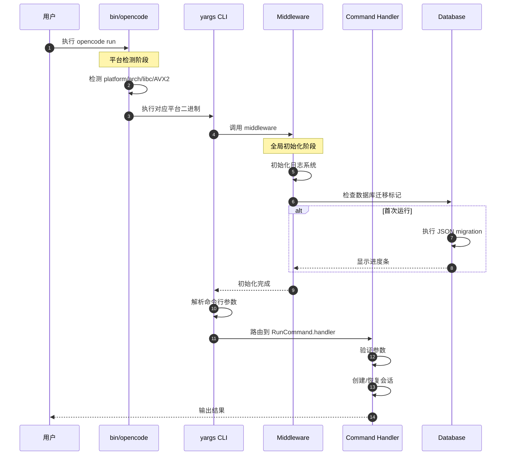
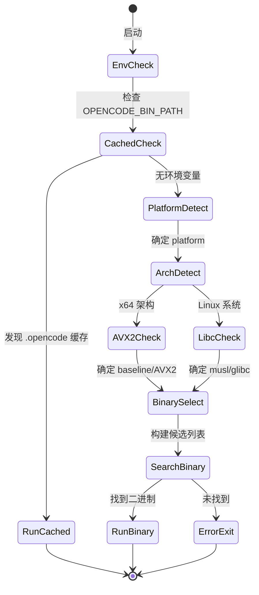
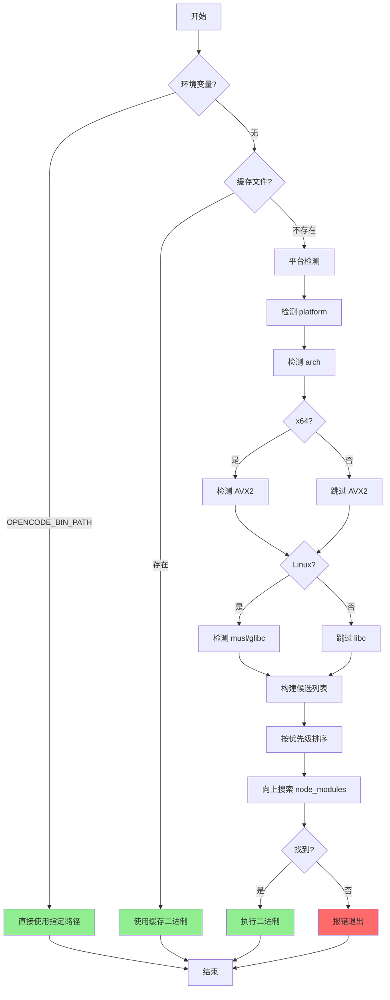
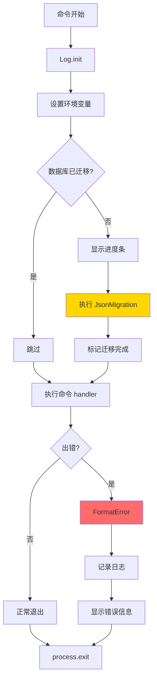
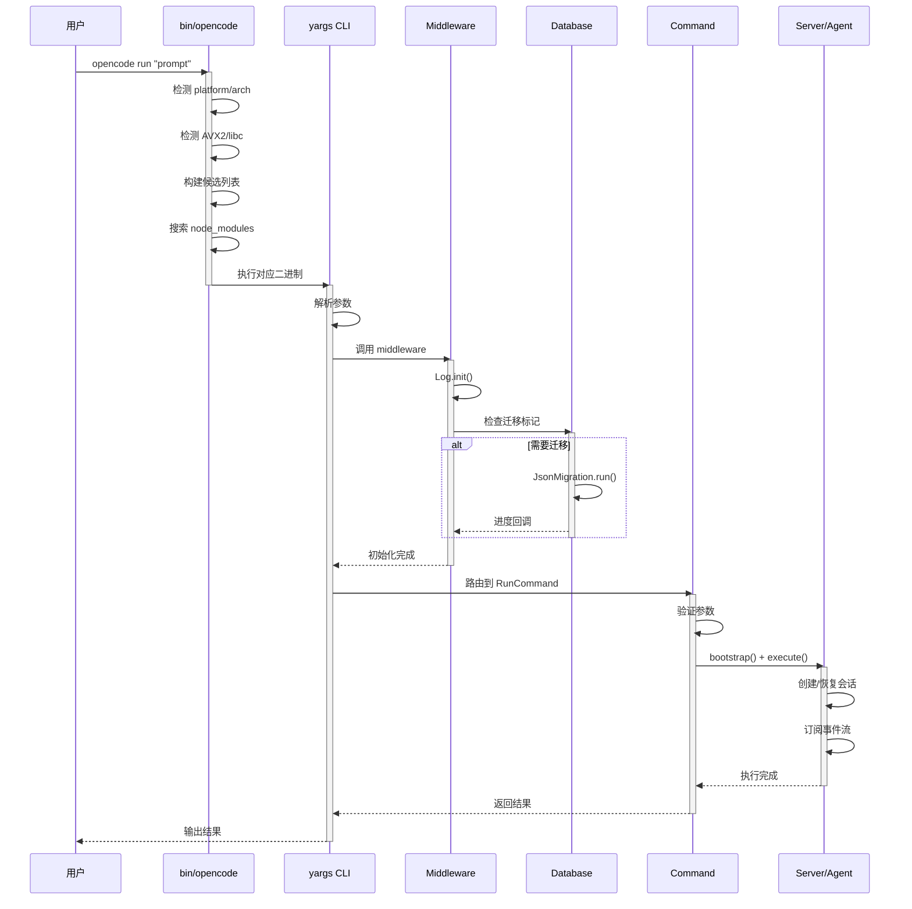
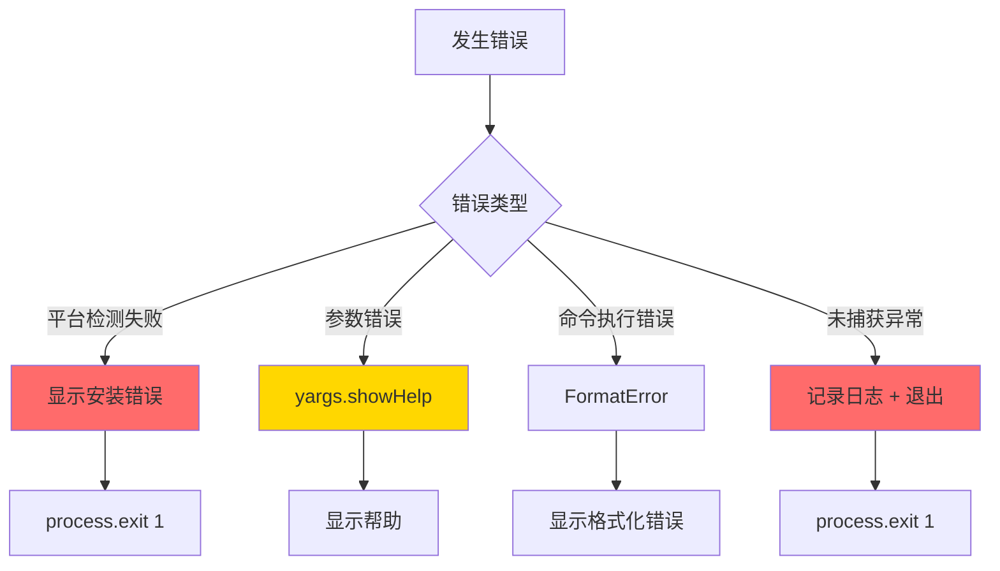
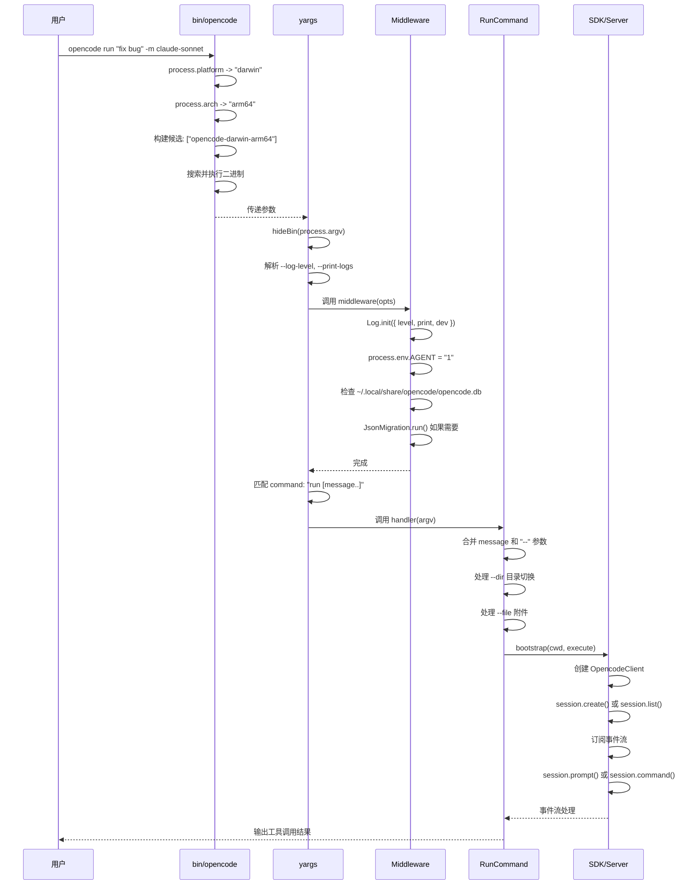
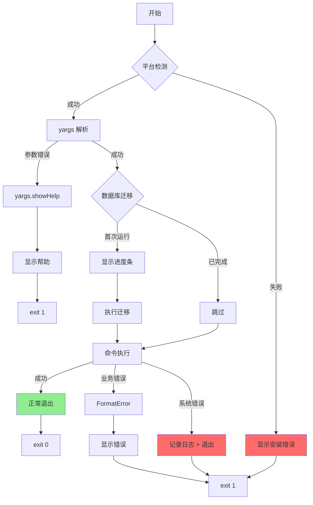
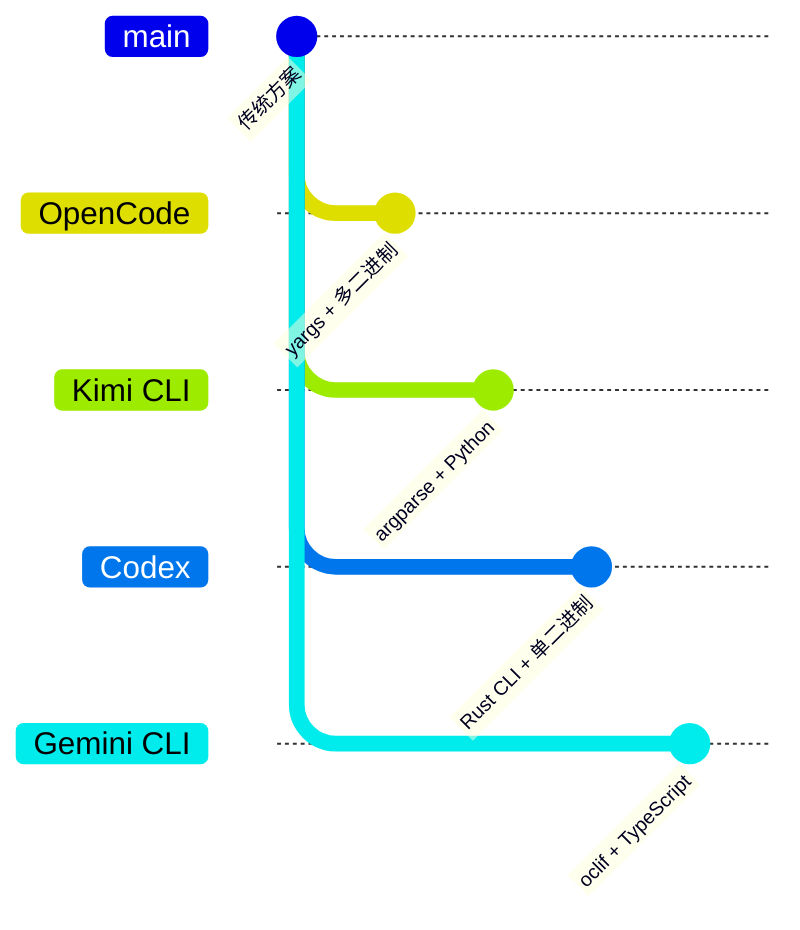

# CLI Entry（opencode）

## TL;DR（结论先行）

一句话定义：OpenCode CLI Entry 是命令行接口的入口层，负责平台检测、参数解析、命令路由和全局初始化。

OpenCode 的核心取舍：**yargs Command Module + 平台二进制分发**（对比 Kimi CLI 的 argparse、Codex 的 Rust CLI）

---

## 1. 为什么需要这个机制？（解决什么问题）

### 1.1 问题场景

没有 CLI Entry 层时，开发者需要手动处理：
- 跨平台差异（Windows/macOS/Linux 路径、二进制格式不同）
- 参数解析（`--help`、`--version`、子命令、位置参数）
- 全局初始化（日志、数据库、配置）
- 命令发现（如何组织 20+ 个子命令）

有了 CLI Entry 层：
- 用户输入 `opencode run "fix bug"` → 平台包装器检测系统架构 → 分发对应二进制 → yargs 解析参数 → 路由到 RunCommand → 执行 Agent 逻辑

### 1.2 核心挑战

| 挑战 | 不解决的后果 |
|-----|-------------|
| 跨平台兼容性 | 用户在不同系统上需要手动安装不同版本 |
| 参数解析复杂性 | 子命令、选项、位置参数混合时解析错误 |
| 全局状态初始化 | 日志未初始化导致调试困难，数据库未迁移导致数据损坏 |
| 命令扩展性 | 新增命令需要修改核心代码，耦合度高 |

---

## 2. 整体架构（ASCII 图）

### 2.1 在系统中的位置

```text
┌─────────────────────────────────────────────────────────────┐
│ 用户输入层                                                   │
│ opencode [command] [options]                                │
└───────────────────────┬─────────────────────────────────────┘
                        │ 调用
                        ▼
┌─────────────────────────────────────────────────────────────┐
│ ▓▓▓ CLI Entry Layer ▓▓▓                                     │
│ packages/opencode/bin/opencode                               │
│ - 平台检测 (platform/arch/libc/AVX2)                        │
│ - 二进制分发                                                 │
└───────────────────────┬─────────────────────────────────────┘
                        │ 执行对应二进制
                        ▼
┌─────────────────────────────────────────────────────────────┐
│ yargs 命令路由层                                             │
│ packages/opencode/src/index.ts:48-203                        │
│ - parserConfiguration(): "populate--" 支持                  │
│ - middleware(): 日志 + 数据库迁移                            │
│ - 命令注册 (Run/MCP/TUI/...)                                │
└───────────────────────┬─────────────────────────────────────┘
                        │ 路由到具体命令
        ┌───────────────┼───────────────┐
        ▼               ▼               ▼
┌──────────────┐ ┌──────────────┐ ┌──────────────┐
│ RunCommand   │ │ McpCommand   │ │ TuiThreadCmd │
│ 默认命令     │ │ MCP 管理     │ │ TUI 模式     │
└──────────────┘ └──────────────┘ └──────────────┘
```

### 2.2 核心组件职责

| 组件 | 职责 | 代码位置 |
|-----|------|---------|
| `bin/opencode` | 平台检测 + 二进制分发 | `packages/opencode/bin/opencode:1-180` |
| `yargs CLI` | 参数解析 + 命令路由 | `packages/opencode/src/index.ts:48-156` |
| `cmd()` | Command Module 包装器 | `packages/opencode/src/cli/cmd/cmd.ts:1-7` |
| `middleware` | 全局初始化（日志、数据库） | `packages/opencode/src/index.ts:65-120` |
| `RunCommand` | 默认命令执行 | `packages/opencode/src/cli/cmd/run.ts:221-625` |

### 2.3 核心组件交互关系



**关键交互说明**：

| 步骤 | 交互内容 | 设计意图 |
|-----|---------|---------|
| 1 | 用户调用 bin/opencode | Node wrapper 统一入口，屏蔽平台差异 |
| 2-3 | 平台检测与二进制分发 | 自动选择最优二进制（AVX2/baseline/musl） |
| 4-6 | Middleware 全局初始化 | 确保日志、数据库在命令执行前就绪 |
| 7 | yargs 参数解析 | 统一解析 --option、positional、-- 语法 |
| 8 | 命令路由 | 解耦命令定义与执行逻辑 |

---

## 3. 核心组件详细分析

### 3.1 平台二进制分发器（bin/opencode）

#### 职责定位

一句话说明：检测当前平台的操作系统、架构、libc 类型和 CPU 特性，分发执行最优的二进制文件。

#### 状态机图



**状态说明**：

| 状态 | 说明 | 进入条件 | 退出条件 |
|-----|------|---------|---------|
| EnvCheck | 检查环境变量 | 启动 | OPENCODE_BIN_PATH 存在/不存在 |
| PlatformDetect | 平台检测 | 无缓存 | process.platform 映射完成 |
| AVX2Check | CPU 特性检测 | x64 架构 | /proc/cpuinfo 或 sysctl 检查完成 |
| BinarySelect | 构建候选列表 | 所有检测完成 | 优先级排序完成 |
| SearchBinary | 搜索二进制 | 有候选列表 | 找到或耗尽候选 |

#### 关键算法逻辑



**算法要点**：

1. **优先级排序**：AVX2 > baseline，musl 和 glibc 分别优先于对方（取决于检测结果）
2. **向上搜索**：从脚本所在目录向上遍历，查找 node_modules 中的二进制包
3. **容错设计**：提供多个候选，确保在复杂环境中找到可用二进制

#### 关键接口

| 接口 | 输入 | 输出 | 说明 | 代码位置 |
|-----|------|------|------|---------|
| `run()` | 二进制路径 | 进程退出码 | 执行二进制并继承 stdio | `bin/opencode:8-18` |
| `supportsAvx2()` | - | boolean | 跨平台 AVX2 检测 | `bin/opencode:56-104` |
| `findBinary()` | 起始目录 | 二进制路径 | 向上搜索 node_modules | `bin/opencode:151-167` |

---

### 3.2 yargs 命令路由器（index.ts）

#### 职责定位

一句话说明：配置 yargs 实例，注册所有子命令，提供全局 middleware 进行初始化。

#### 内部数据流

```text
┌─────────────────────────────────────────────────────────────┐
│  输入层                                                      │
│  ├── process.argv ──► hideBin() ──► 纯参数列表               │
│  └── 环境变量 ──► OPENCODE_BIN_PATH 等                       │
└──────────────────────────┬──────────────────────────────────┘
                           ▼
┌─────────────────────────────────────────────────────────────┐
│  配置层                                                      │
│  ├── parserConfiguration({ "populate--": true })            │
│  ├── 全局选项 (--print-logs, --log-level)                   │
│  ├── middleware() ──► 日志初始化 + 数据库迁移                │
│  └── 命令注册 (.command())                                  │
└──────────────────────────┬──────────────────────────────────┘
                           ▼
┌─────────────────────────────────────────────────────────────┐
│  路由层                                                      │
│  ├── yargs.parse() ──► 匹配命令                             │
│  ├── 调用对应 handler                                       │
│  └── fail() 处理错误                                        │
└─────────────────────────────────────────────────────────────┘
```

#### 关键算法逻辑

**Middleware 执行流程**：



**算法要点**：

1. **一次性迁移**：通过文件标记避免重复迁移
2. **TTY 检测**：根据是否交互式终端调整输出格式
3. **错误处理**：区分 NamedError 和普通 Error，格式化输出

---

### 3.3 组件间协作时序

展示从用户输入到命令执行的完整协作流程。



**协作要点**：

1. **bin/opencode 与 yargs**：前者是 Node wrapper，后者是实际 CLI 实现
2. **Middleware 与 Database**：通过文件标记实现幂等性，避免重复迁移
3. **Command 与 Server**：RunCommand 通过 bootstrap 启动服务器实例

---

### 3.4 关键数据路径

#### 主路径（正常流程）


#### 异常路径（错误恢复）



---

## 4. 端到端数据流转

### 4.1 正常流程（详细版）

展示从用户输入到命令执行的完整数据变换过程。



**数据变换详情**：

| 阶段 | 输入 | 处理 | 输出 | 代码位置 |
|-----|------|------|------|---------|
| 平台检测 | `process.argv` | 检测 platform/arch/AVX2/libc | 二进制路径 | `bin/opencode:45-149` |
| 参数解析 | 命令行参数 | yargs 解析 + 验证 | 结构化 argv | `src/index.ts:48-64` |
| 全局初始化 | argv | 日志初始化 + 数据库迁移 | 初始化状态 | `src/index.ts:65-120` |
| 命令执行 | argv | 验证 + 会话管理 + Agent 调用 | 执行结果 | `src/cli/cmd/run.ts:301-624` |

### 4.2 数据流向图


### 4.3 异常/边界流程



---

## 5. 关键代码实现

### 5.1 核心数据结构

**平台检测配置**：

```typescript
// packages/opencode/bin/opencode:34-53
const platformMap = {
  darwin: "darwin",
  linux: "linux",
  win32: "windows",
}
const archMap = {
  x64: "x64",
  arm64: "arm64",
  arm: "arm",
}
```

**yargs 配置选项**：

```typescript
// packages/opencode/src/index.ts:56-64
.option("print-logs", {
  describe: "print logs to stderr",
  type: "boolean",
})
.option("log-level", {
  describe: "log level",
  type: "string",
  choices: ["DEBUG", "INFO", "WARN", "ERROR"],
})
```

**Command Module 结构**：

```typescript
// packages/opencode/src/cli/cmd/cmd.ts:1-7
import type { CommandModule } from "yargs"

type WithDoubleDash<T> = T & { "--"?: string[] }

export function cmd<T, U>(input: CommandModule<T, WithDoubleDash<U>>) {
  return input
}
```

**字段说明**：

| 字段 | 类型 | 用途 |
|-----|------|------|
| `platformMap` | Record<string, string> | 映射 Node 平台标识到二进制命名 |
| `archMap` | Record<string, string> | 映射 Node 架构标识到二进制命名 |
| `WithDoubleDash` | 类型工具 | 支持 `--` 语法传递额外参数 |
| `populate--` | boolean | yargs 配置，将 `--` 后的参数存入 argv["--"] |

### 5.2 主链路代码

**平台检测与二进制分发**：

```javascript
// packages/opencode/bin/opencode:106-149
const names = (() => {
  const avx2 = supportsAvx2()
  const baseline = arch === "x64" && !avx2

  if (platform === "linux") {
    const musl = (() => {
      try {
        if (fs.existsSync("/etc/alpine-release")) return true
      } catch { }
      try {
        const result = childProcess.spawnSync("ldd", ["--version"], { encoding: "utf8" })
        const text = ((result.stdout || "") + (result.stderr || "")).toLowerCase()
        if (text.includes("musl")) return true
      } catch { }
      return false
    })()

    if (musl) {
      if (arch === "x64") {
        if (baseline) return [`${base}-baseline-musl`, `${base}-musl`, `${base}-baseline`, base]
        return [`${base}-musl`, `${base}-baseline-musl`, base, `${base}-baseline`]
      }
      return [`${base}-musl`, base]
    }
    // ...
  }
  // ...
})()
```

**代码要点**：

1. **动态候选构建**：根据检测结果动态构建优先级排序的候选列表
2. **多维度检测**：结合 Alpine 检测、ldd 输出分析确定 musl/glibc
3. **容错设计**：提供 fallback 候选，确保复杂环境可用性

**Middleware 数据库迁移**：

```typescript
// packages/opencode/src/index.ts:84-119
const marker = path.join(Global.Path.data, "opencode.db")
if (!(await Filesystem.exists(marker))) {
  const tty = process.stderr.isTTY
  process.stderr.write("Performing one time database migration..." + EOL)
  // ...
  await JsonMigration.run(Database.Client().$client, {
    progress: (event) => {
      const percent = Math.floor((event.current / event.total) * 100)
      // TTY 进度条渲染
      if (tty) {
        const fill = Math.round((percent / 100) * width)
        const bar = `${"■".repeat(fill)}${"･".repeat(width - fill)}`
        process.stderr.write(`\r${orange}${bar} ${percent}%${reset}...`)
      }
    },
  })
  // ...
}
```

**代码要点**：

1. **文件标记**：通过 `opencode.db` 文件存在性判断是否需要迁移
2. **TTY 感知**：交互式终端显示彩色进度条，非 TTY 输出简单文本
3. **一次性执行**：迁移完成后自动创建标记文件

### 5.3 关键调用链

```text
bin/opencode                          [bin/opencode:1]
  -> run()                            [bin/opencode:8]
    -> supportsAvx2()                 [bin/opencode:56]
    -> findBinary()                   [bin/opencode:151]
      -> 向上搜索 node_modules        [bin/opencode:153-166]

src/index.ts                          [src/index.ts:1]
  -> yargs(hideBin(process.argv))     [src/index.ts:48]
    -> .middleware()                  [src/index.ts:65]
      -> Log.init()                   [src/index.ts:66-74]
      -> JsonMigration.run()          [src/index.ts:95-111]
    -> .command(RunCommand)           [src/index.ts:127]
      -> RunCommand.handler           [src/cli/cmd/run.ts:301]
        -> bootstrap()                [src/cli/cmd/run.ts:616]
          -> Instance.provide()       [src/cli/bootstrap.ts:4]
```

---

## 6. 设计意图与 Trade-off

### 6.1 OpenCode 的选择

| 维度 | OpenCode 的选择 | 替代方案 | 取舍分析 |
|-----|----------------|---------|---------|
| 参数解析 | yargs | commander.js / minimist | yargs 内置 middleware、completion、严格模式，但包体积较大 |
| 平台分发 | Node wrapper + 多二进制 | 单 JS 包 / napi-rs | 性能最优但发布复杂，需维护 10+ 个平台包 |
| 命令组织 | Command Module 模式 | 函数映射 / 类继承 | 标准化结构，支持类型推导，但需额外 cmd() 包装 |
| 全局初始化 | Middleware 统一处理 | 每个命令自行初始化 | 确保一致性，但增加启动开销 |

### 6.2 为什么这样设计？

**核心问题**：如何在跨平台环境中提供一致的 CLI 体验，同时保持高性能？

**OpenCode 的解决方案**：
- 代码依据：`packages/opencode/bin/opencode:1-180`
- 设计意图：Node wrapper 负责平台检测和二进制分发，实际逻辑在编译后的二进制中执行
- 带来的好处：
  - 性能：核心逻辑使用 Bun 编译，启动速度快
  - 兼容性：自动检测 AVX2、musl/glibc，选择最优二进制
  - 用户体验：用户无感知，统一使用 `opencode` 命令
- 付出的代价：
  - 发布复杂度：需构建 10+ 个平台包
  - 包体积：每个平台包独立，总发布体积大

### 6.3 与其他项目的对比



| 项目 | 核心差异 | 适用场景 |
|-----|---------|---------|
| OpenCode | yargs + Bun 编译多二进制 | 追求启动性能，接受发布复杂度 |
| Kimi CLI | argparse + Python 单包 | 快速迭代，跨平台简单 |
| Codex | Rust 原生 CLI | 极致性能，单二进制分发 |
| Gemini CLI | oclif 框架 | 丰富插件生态，标准化命令结构 |

**关键差异分析**：

1. **OpenCode vs Kimi CLI**：OpenCode 使用编译后的二进制获得更好的启动性能，Kimi CLI 使用 Python 解释器便于快速迭代
2. **OpenCode vs Codex**：两者都追求性能，但 OpenCode 使用 Bun 编译 TypeScript，Codex 使用原生 Rust
3. **OpenCode vs Gemini CLI**：OpenCode 使用轻量级的 yargs，Gemini CLI 使用功能更重的 oclif 框架

---

## 7. 边界情况与错误处理

### 7.1 终止条件

| 终止原因 | 触发条件 | 代码位置 |
|---------|---------|---------|
| 平台检测失败 | 未找到匹配的二进制 | `bin/opencode:170-177` |
| 参数解析错误 | 未知参数或必填参数缺失 | `src/index.ts:144-155` |
| 命令执行错误 | handler 抛出异常 | `src/index.ts:158-196` |
| 数据库迁移失败 | JsonMigration 抛出异常 | `src/index.ts:94-118` |

### 7.2 超时/资源限制

```typescript
// packages/opencode/bin/opencode:69-72
const result = childProcess.spawnSync("sysctl", ["-n", "hw.optional.avx2_0"], {
  encoding: "utf8",
  timeout: 1500,  // AVX2 检测超时 1.5s
})

// packages/opencode/bin/opencode:86-88
const result = childProcess.spawnSync(exe, ["-NoProfile", "-NonInteractive", "-Command", cmd], {
  encoding: "utf8",
  timeout: 3000,  // Windows AVX2 检测超时 3s
})
```

### 7.3 错误恢复策略

| 错误类型 | 处理策略 | 代码位置 |
|---------|---------|---------|
| 平台检测失败 | 显示安装建议，exit 1 | `bin/opencode:171-176` |
| 参数错误 | 显示帮助信息 | `src/index.ts:149-152` |
| 未捕获异常 | 记录日志 + 格式化输出 | `src/index.ts:189-195` |
| 数据库迁移错误 | 抛出异常，由外层捕获 | `src/index.ts:94-118` |

---

## 8. 关键代码索引

| 功能 | 文件 | 行号 | 说明 |
|-----|------|------|------|
| 平台检测 | `packages/opencode/bin/opencode` | 1-180 | Node wrapper，检测 platform/arch/AVX2/libc |
| 二进制分发 | `packages/opencode/bin/opencode` | 151-179 | 向上搜索 node_modules，执行对应二进制 |
| yargs 配置 | `packages/opencode/src/index.ts` | 48-156 | CLI 入口，命令注册，全局配置 |
| 全局中间件 | `packages/opencode/src/index.ts` | 65-120 | 日志初始化，数据库迁移 |
| Command Module | `packages/opencode/src/cli/cmd/cmd.ts` | 1-7 | yargs CommandModule 包装器 |
| Run 命令 | `packages/opencode/src/cli/cmd/run.ts` | 221-625 | 默认命令，Agent 执行入口 |
| MCP 命令 | `packages/opencode/src/cli/cmd/mcp.ts` | 53-755 | MCP 服务器管理 |
| TUI 命令 | `packages/opencode/src/cli/cmd/tui/thread.ts` | 46-191 | TUI 模式入口 |
| 全局路径 | `packages/opencode/src/global/index.ts` | 1-55 | XDG 规范路径管理 |
| 安装信息 | `packages/opencode/src/installation/index.ts` | 1-262 | 版本、升级、安装方式检测 |

---

## 9. 延伸阅读

- 前置知识：[yargs 文档](https://yargs.js.org/)、[XDG Base Directory 规范](https://specifications.freedesktop.org/basedir-spec/basedir-spec-latest.html)
- 相关机制：[04-opencode-agent-loop.md](./04-opencode-agent-loop.md)、[06-opencode-mcp-integration.md](./06-opencode-mcp-integration.md)
- 深度分析：[opencode 架构总览](./01-opencode-overview.md)

---

*✅ Verified: 基于 opencode/packages/opencode/src/ 源码分析*
*基于版本：2026-02-08 | 最后更新：2026-02-24*
