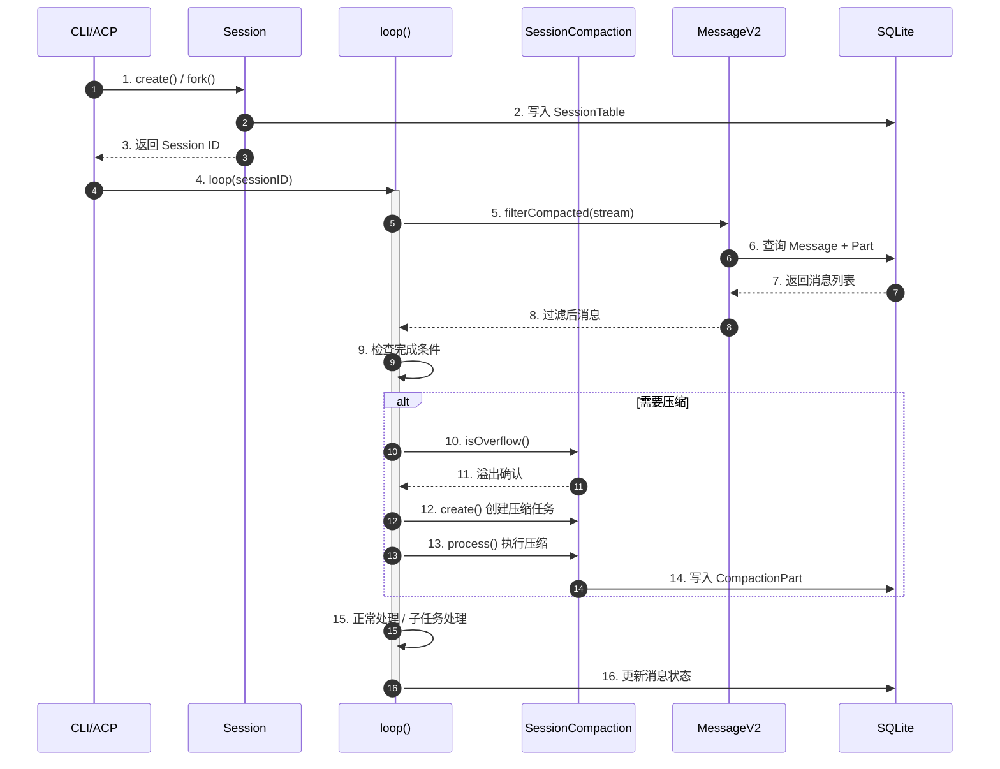
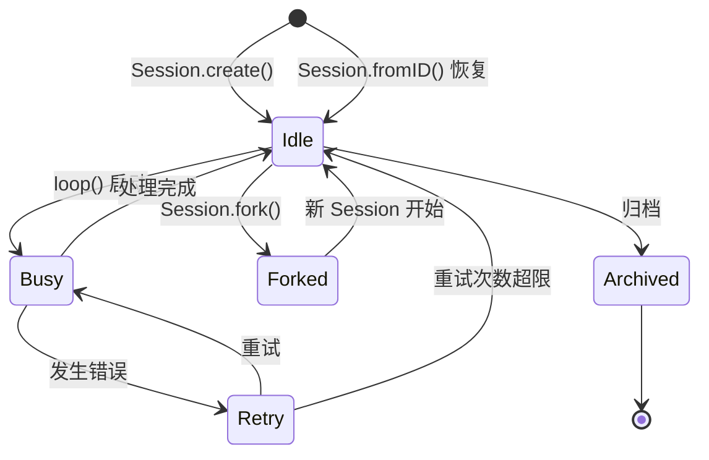
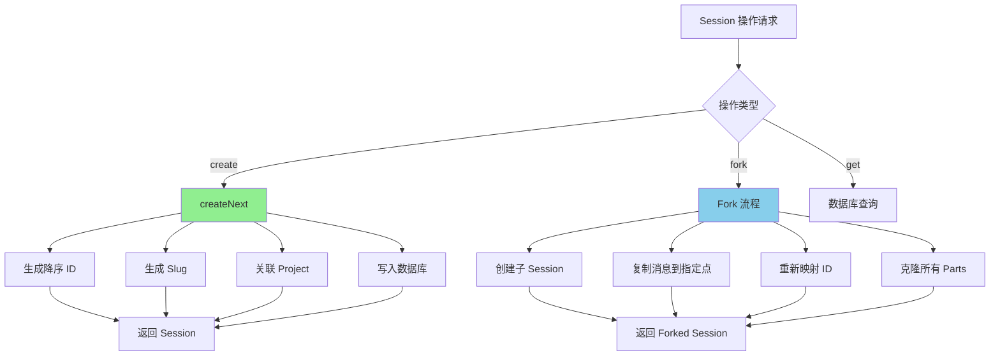
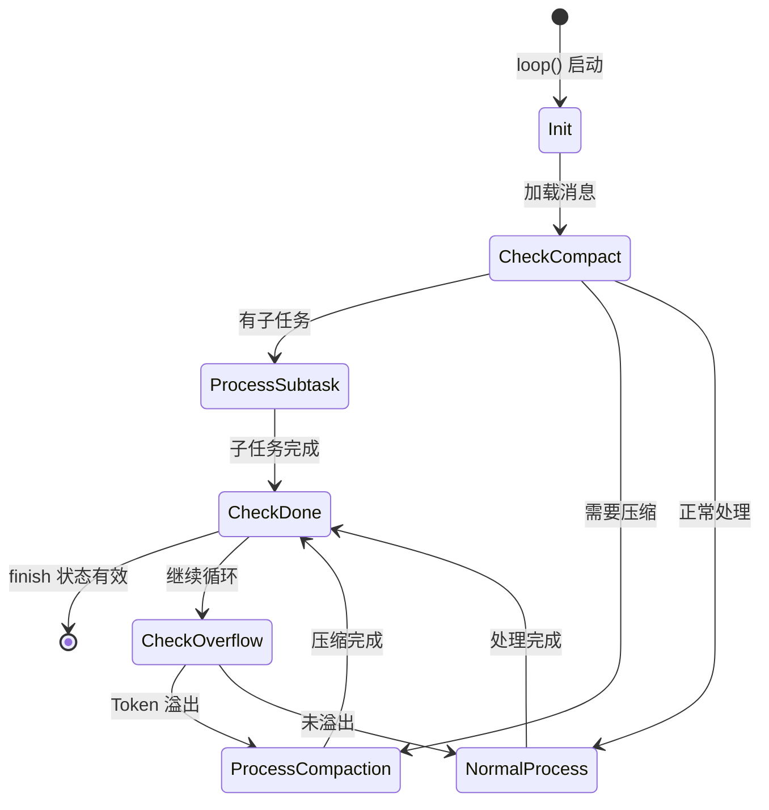
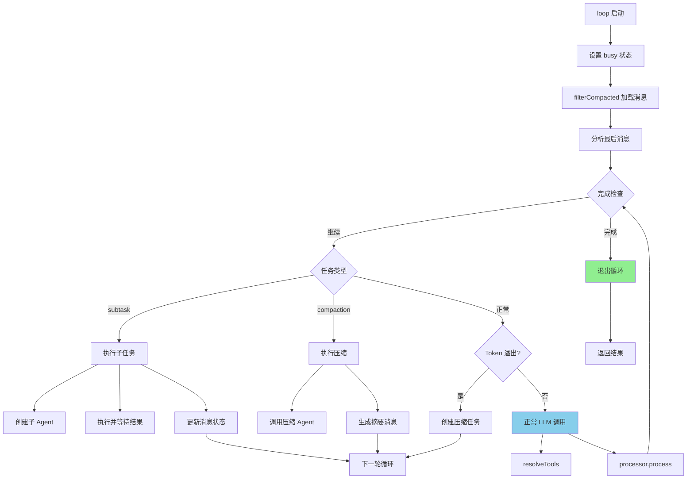
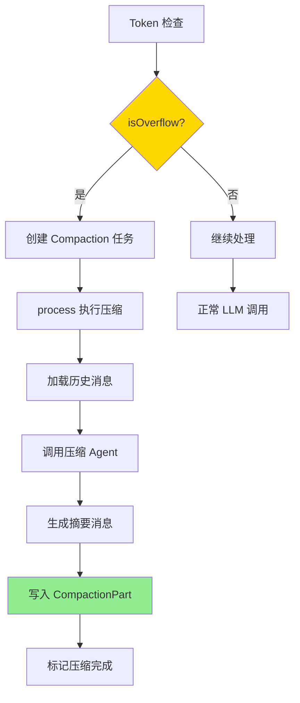
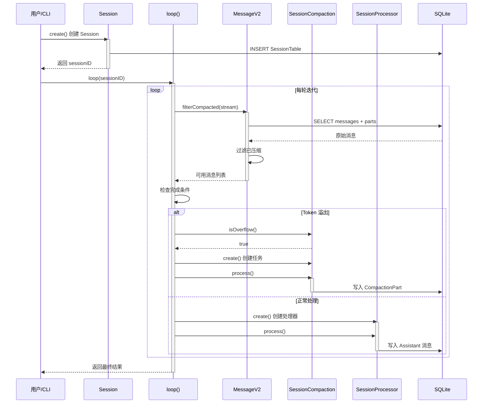
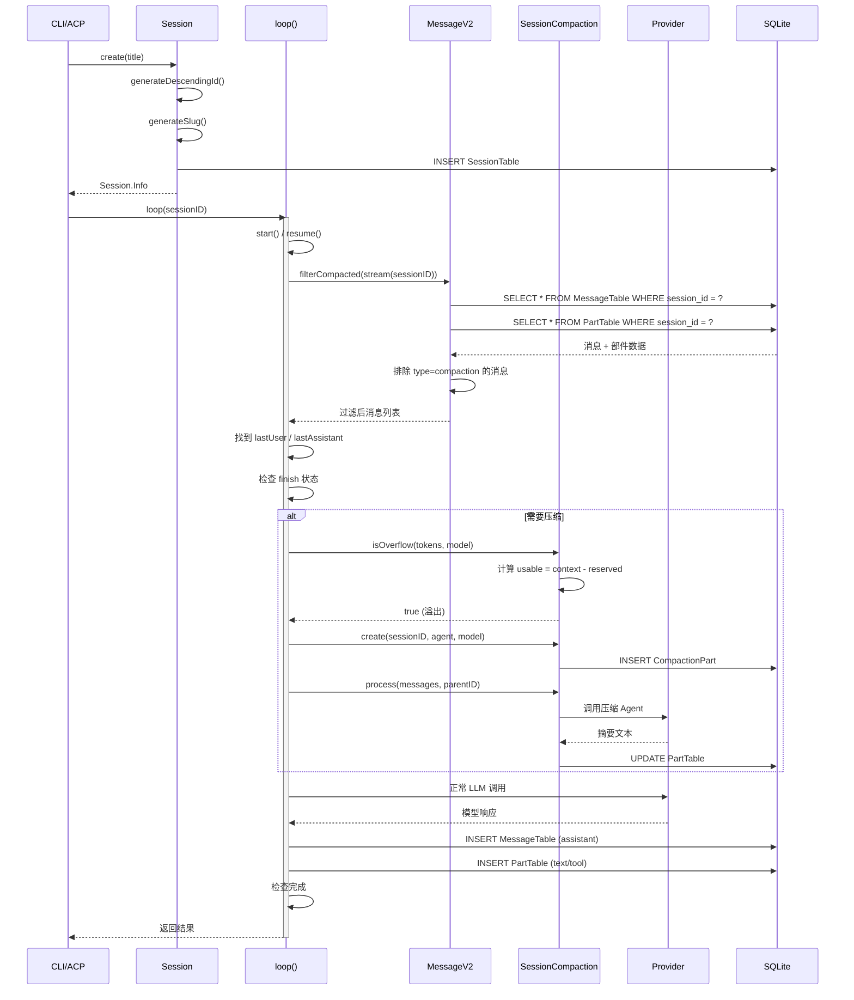
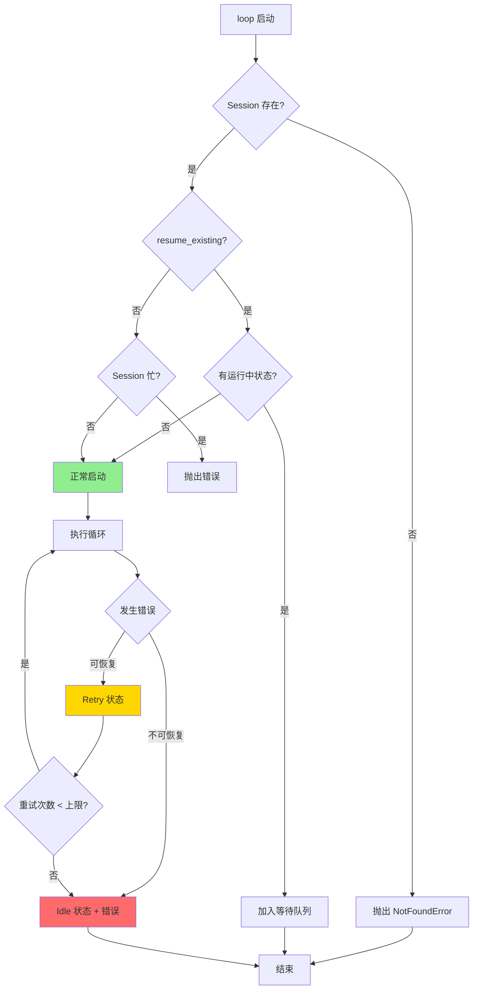
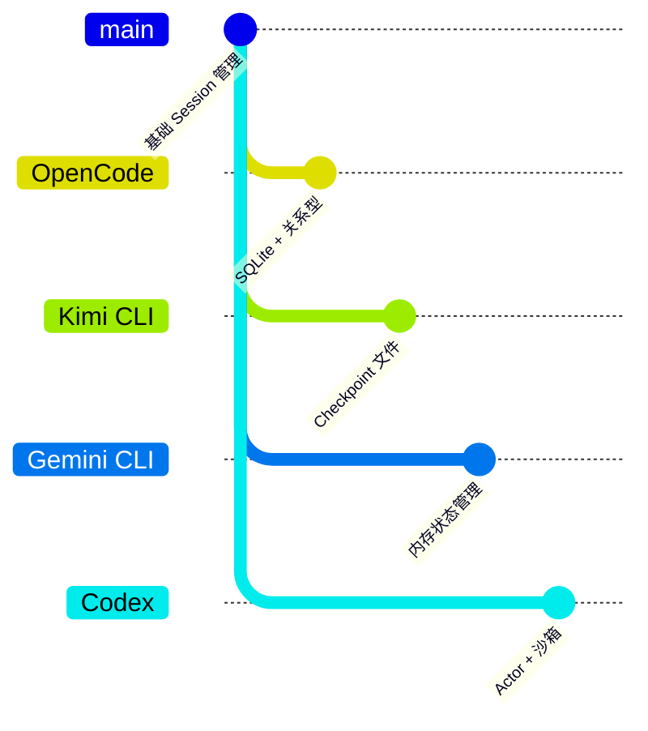

# Session 管理（OpenCode）

## TL;DR（结论先行）

一句话定义：OpenCode 的 Session 管理是**"基于 SQLite 的多层状态管理单元"**，使用消息-部件分离架构存储对话，支持 fork/revert 操作，内置 compaction 管理上下文窗口。

OpenCode 的核心取舍：**SQLite 关系型存储 + 消息-部件分离架构**（对比 Kimi CLI 的 Checkpoint 文件回滚、Gemini CLI 的内存状态管理）

---

## 1. 为什么需要这个机制？（解决什么问题）

### 1.1 问题场景

没有 Session 管理：
- 用户与 Agent 的对话状态无法持久化，重启后丢失
- 无法支持对话分支（Fork）和回退（Revert）
- 长对话导致上下文窗口溢出，无法继续

有 Session 管理：
- 对话状态持久化到 SQLite，支持跨会话恢复
- 支持从任意消息点 Fork 新会话
- 自动 Compaction 管理上下文窗口，保护关键信息

### 1.2 核心挑战

| 挑战 | 不解决的后果 |
|-----|-------------|
| 状态持久化 | 进程重启后对话历史丢失 |
| 上下文窗口管理 | 长对话导致 Token 超限，API 调用失败 |
| 分支与回退 | 无法尝试不同方案或撤销错误操作 |
| 多模态内容存储 | 文本、工具调用、文件等混合内容难以统一管理 |

---

## 2. 整体架构（ASCII 图）

### 2.1 在系统中的位置

```text
┌─────────────────────────────────────────────────────────────┐
│ ACP Layer (Agent Client Protocol)                           │
│ packages/opencode/src/acp/session.ts                        │
│ - ACPSessionManager: 对外暴露 Session 服务                   │
└─────────────────────────┬───────────────────────────────────┘
                          │ 调用
                          ▼
┌─────────────────────────────────────────────────────────────┐
│ ▓▓▓ Session Layer ▓▓▓                                       │
│ packages/opencode/src/session/index.ts                      │
│ - create(): 创建新 Session                                  │
│ - fork(): 分支 Session                                      │
│ - loop(): Agent Loop 入口                                   │
│ - SessionStatus: 状态管理                                   │
│ - SessionCompaction: 上下文压缩                             │
└─────────────────────────┬───────────────────────────────────┘
                          │
          ┌───────────────┼───────────────┐
          ▼               ▼               ▼
┌──────────────┐ ┌──────────────┐ ┌──────────────┐
│ MessageV2    │ │ Part System  │ │ Storage      │
│ 消息元数据   │ │ 内容部件     │ │ SQLite       │
│ message-v2.ts│ │ message-v2.ts│ │ session.sql.ts│
└──────────────┘ └──────────────┘ └──────────────┘
```

### 2.2 核心组件职责

| 组件 | 职责 | 代码位置 |
|-----|------|---------|
| `Session` | Session CRUD、Fork、生命周期管理 | `packages/opencode/src/session/index.ts:32` |
| `SessionStatus` | Session 状态追踪（idle/busy/retry） | `packages/opencode/src/session/status.ts:6` |
| `SessionCompaction` | 上下文压缩、溢出检测 | `packages/opencode/src/session/compaction.ts:18` |
| `MessageV2` | 消息类型定义、流式加载 | `packages/opencode/src/session/message-v2.ts:19` |
| `loop` | Agent Loop 主循环 | `packages/opencode/src/session/prompt.ts:274` |

### 2.3 核心组件交互关系



**关键交互说明**：

| 步骤 | 交互内容 | 设计意图 |
|-----|---------|---------|
| 1-3 | Session 创建 | 支持从父 Session Fork，建立父子关系 |
| 4 | 启动 Agent Loop | 单入口设计，统一处理新会话和恢复会话 |
| 5-8 | 消息加载与过滤 | 自动过滤已压缩内容，减少 Token 消耗 |
| 9 | 完成条件检查 | 基于 Assistant 消息的 finish 状态判断 |
| 10-14 | 上下文压缩 | 溢出时自动触发，保护最近 40K Token |
| 15-16 | 处理与持久化 | 每轮结果立即写入数据库 |

---

## 3. 核心组件详细分析

### 3.1 Session 生命周期管理

#### 职责定位

Session 是 OpenCode 的核心状态单元，负责管理对话的生命周期、持久化和分支。

#### 状态机图



**状态说明**：

| 状态 | 说明 | 进入条件 | 退出条件 |
|-----|------|---------|---------|
| Idle | 空闲等待 | 创建完成或处理结束 | loop() 启动 |
| Busy | 处理中 | loop() 开始执行 | 处理完成或出错 |
| Retry | 重试等待 | 发生可恢复错误 | 重试时间到达 |
| Forked | 已分支 | 用户触发 Fork | 新 Session 独立运行 |
| Archived | 已归档 | 手动归档 | 永久存储 |

#### 内部数据流

```text
┌─────────────────────────────────────────────────────────────┐
│  输入层                                                      │
│  ├── 用户输入 ──► create()/fork() ──► Session 对象           │
│  └── 恢复请求 ──► fromID() ──► 数据库查询                    │
└──────────────────────────┬──────────────────────────────────┘
                           ▼
┌─────────────────────────────────────────────────────────────┐
│  处理层                                                      │
│  ├── ID 生成: generateDescendingId() 降序时间戳              │
│  ├── Slug 生成: URL-friendly 标识符                          │
│  ├── 父子关联: parent_id 建立 Fork 关系                      │
│  └── 数据库写入: Drizzle ORM                                 │
└──────────────────────────┬──────────────────────────────────┘
                           ▼
┌─────────────────────────────────────────────────────────────┐
│  输出层                                                      │
│  ├── 事件发布: Bus.publish(Event.Created)                    │
│  └── 状态返回: Session.Info 对象                             │
└─────────────────────────────────────────────────────────────┘
```

#### 关键算法逻辑



**算法要点**：

1. **降序 ID 生成**：使用时间戳相关算法，新 Session ID 总是小于旧 ID，便于按时间排序
2. **Fork ID 映射**：使用 Map 维护旧 ID 到新 ID 的映射，保持消息父子关系
3. **原子性写入**：Session、Message、Part 分层写入，通过外键保证一致性

#### 关键接口

| 接口 | 输入 | 输出 | 说明 | 代码位置 |
|-----|------|------|------|---------|
| `create()` | parentID?, title?, permission? | Session.Info | 创建新 Session | `index.ts:212` |
| `fork()` | sessionID, messageID? | Session.Info | 从指定点分支 | `index.ts:230` |
| `get()` | sessionID | Session.Info | 获取 Session | `index.ts:335` |
| `loop()` | sessionID, resume_existing? | MessageV2.WithParts | Agent Loop 入口 | `prompt.ts:274` |

---

### 3.2 Agent Loop 核心机制

#### 职责定位

Agent Loop 是 Session 的执行引擎，驱动多轮 LLM 调用直到任务完成。

#### 状态机图



#### 内部数据流

```text
┌─────────────────────────────────────────────────────────────┐
│  输入层                                                      │
│  ├── Session ID ──► 恢复/启动 Session                        │
│  └── resume_existing ──► 决定是否恢复状态                    │
└──────────────────────────┬──────────────────────────────────┘
                           ▼
┌─────────────────────────────────────────────────────────────┐
│  循环处理层                                                  │
│  ├── 消息过滤: filterCompacted() 排除已压缩                  │
│  ├── 消息分析: 找到最后 user/assistant                       │
│  ├── 完成检查: 基于 finish 状态                              │
│  ├── 子任务处理: TaskTool 执行                               │
│  ├── 压缩处理: SessionCompaction                             │
│  └── 正常处理: SessionProcessor                              │
└──────────────────────────┬──────────────────────────────────┘
                           ▼
┌─────────────────────────────────────────────────────────────┐
│  输出层                                                      │
│  ├── 消息持久化: 写入 MessageTable + PartTable               │
│  ├── 状态更新: SessionStatus.set()                           │
│  └── 事件发布: Bus.publish()                                 │
└─────────────────────────────────────────────────────────────┘
```

#### 关键算法逻辑



**算法要点**：

1. **双层循环设计**：外层管理 Session 生命周期，内层 `_agent_loop` 管单次任务
2. **消息过滤**：`filterCompacted()` 自动排除已压缩的旧消息，减少 Token
3. **任务优先级**：subtask > compaction > 正常处理
4. **溢出前置检查**：在调用 LLM 前检查 Token，避免 API 失败

---

### 3.3 Compaction 机制

#### 职责定位

Compaction 负责管理上下文窗口，在 Token 溢出时自动压缩历史消息。

#### 关键算法逻辑



**压缩策略**（`compaction.ts:50-99`）：

1. 保护最近 40K Token 的工具调用（`PRUNE_PROTECT = 40_000`）
2. 移除旧工具调用输出（但保留 skill 工具输出）
3. 压缩超过 2 轮的消息
4. 使用专门的 compaction Agent 生成摘要

#### 关键接口

| 接口 | 输入 | 输出 | 说明 | 代码位置 |
|-----|------|------|------|---------|
| `isOverflow()` | tokens, model | boolean | 检查是否溢出 | `compaction.ts:32` |
| `prune()` | sessionID | void | 清理旧工具输出 | `compaction.ts:58` |
| `process()` | messages, parentID | "stop"\|void | 执行压缩 | `compaction.ts:101` |
| `create()` | sessionID, agent, model | void | 创建压缩任务 | `compaction.ts:231` |

---

### 3.4 组件间协作时序



**协作要点**：

1. **Session 与 Loop**：Session 负责生命周期，Loop 负责执行逻辑，职责分离
2. **MessageV2 过滤**：在加载时过滤已压缩内容，对 Loop 透明
3. **Compaction 触发**：Loop 检测到溢出时主动触发，而非被动等待
4. **数据库访问**：所有组件通过 Drizzle ORM 统一访问 SQLite

---

## 4. 端到端数据流转

### 4.1 正常流程（详细版）



**数据变换详情**：

| 阶段 | 输入 | 处理 | 输出 | 代码位置 |
|-----|------|------|------|---------|
| 创建 | title, directory | ID 生成、Slug 生成 | Session.Info | `index.ts:287-326` |
| 加载 | sessionID | 流式查询、过滤 | MessageV2.WithParts[] | `prompt.ts:298` |
| 溢出检查 | tokens, model | usable = context - reserved | boolean | `compaction.ts:32-48` |
| 压缩 | messages | Agent 摘要 | CompactionPart | `compaction.ts:101-230` |
| 处理 | messages, tools | LLM 调用 | Assistant 消息 | `prompt.ts:566-640` |

### 4.2 数据流向图

```mermaid
flowchart LR
    subgraph Input["输入阶段"]
        I1[用户输入] --> I2[Session.create/fork]
        I2 --> I3[Session.Info]
    end

    subgraph Process["处理阶段"]
        P1[loop() 启动] --> P2[消息加载]
        P2 --> P3[filterCompacted]
        P3 --> P4[溢出检查]
        P4 --> P5[LLM 调用]
        P5 --> P6[工具执行]
    end

    subgraph Output["输出阶段"]
        O1[消息持久化] --> O2[事件发布]
        O2 --> O3[状态更新]
    end

    I3 --> P1
    P6 --> O1

    style Process fill:#e1f5e1,stroke:#333
```

### 4.3 异常/边界流程



---

## 5. 关键代码实现

### 5.1 核心数据结构

**Session.Info**（`packages/opencode/src/session/index.ts:140-180`）：

```typescript
export const Info = z.object({
  id: Identifier.schema("session"),
  slug: z.string(),
  projectID: z.string(),
  directory: z.string(),
  parentID: Identifier.schema("session").optional(),  // fork 源
  summary: z.object({
    additions: z.number(),
    deletions: z.number(),
    files: z.number(),
    diffs: Snapshot.FileDiff.array().optional(),
  }).optional(),
  title: z.string(),
  version: z.string(),
  time: z.object({
    created: z.number(),
    updated: z.number(),
    compacting: z.number().optional(),
    archived: z.number().optional(),
  }),
  permission: PermissionNext.Ruleset.optional(),
  revert: z.object({
    messageID: z.string(),
    partID: z.string().optional(),
    snapshot: z.string().optional(),
    diff: z.string().optional(),
  }).optional(),
})
```

**字段说明**：

| 字段 | 类型 | 用途 |
|-----|------|------|
| `id` | string | 降序生成的唯一标识 |
| `parentID` | string? | Fork 时的父 Session ID |
| `slug` | string | URL-friendly 标识 |
| `summary` | object? | 代码变更统计 |
| `revert` | object? | 回退点信息 |
| `time.compacting` | number? | 最后压缩时间 |

### 5.2 主链路代码

**Session 创建**（`packages/opencode/src/session/index.ts:287-326`）：

```typescript
export async function createNext(input: {
  id?: string
  title?: string
  parentID?: string
  directory: string
  permission?: PermissionNext.Ruleset
}) {
  const result: Info = {
    id: Identifier.descending("session", input.id),
    slug: Slug.create(),
    version: Installation.VERSION,
    projectID: Instance.project.id,
    directory: input.directory,
    parentID: input.parentID,
    title: input.title ?? createDefaultTitle(!!input.parentID),
    permission: input.permission,
    time: {
      created: Date.now(),
      updated: Date.now(),
    },
  }

  Database.use((db) => {
    db.insert(SessionTable).values(toRow(result)).run()
    Database.effect(() =>
      Bus.publish(Event.Created, { info: result })
    )
  })

  return result
}
```

**代码要点**：

1. **降序 ID**：`Identifier.descending()` 确保新 Session ID 小于旧 ID，便于时间排序
2. **事件驱动**：通过 `Bus.publish` 发布创建事件，解耦各模块
3. **事务包装**：`Database.use` 确保原子性操作

**Agent Loop 核心**（`packages/opencode/src/session/prompt.ts:274-330`）：

```typescript
export const loop = fn(LoopInput, async (input) => {
  const { sessionID, resume_existing } = input
  const abort = resume_existing ? resume(sessionID) : start(sessionID)

  let step = 0
  const session = await Session.get(sessionID)

  while (true) {
    SessionStatus.set(sessionID, { type: "busy" })
    if (abort.aborted) break

    let msgs = await MessageV2.filterCompacted(MessageV2.stream(sessionID))

    // 找到最后 user/assistant
    let lastUser: MessageV2.User | undefined
    let lastAssistant: MessageV2.Assistant | undefined
    for (let i = msgs.length - 1; i >= 0; i--) {
      const msg = msgs[i]
      if (!lastUser && msg.info.role === "user") lastUser = msg.info as MessageV2.User
      if (!lastAssistant && msg.info.role === "assistant")
        lastAssistant = msg.info as MessageV2.Assistant
      if (lastUser && lastAssistant) break
    }

    // 检查完成
    if (lastAssistant?.finish && !["tool-calls", "unknown"].includes(lastAssistant.finish)) {
      break
    }

    step++
    // ... 处理逻辑
  }
})
```

**代码要点**：

1. **恢复支持**：`resume_existing` 支持从断点恢复
2. **消息过滤**：`filterCompacted` 自动排除已压缩内容
3. **完成检测**：基于 Assistant 的 `finish` 状态判断

### 5.3 关键调用链

```text
Session.loop()                  [prompt.ts:274]
  -> start()/resume()           [prompt.ts:277]
    -> Session.get()            [index.ts:335]
  -> MessageV2.filterCompacted() [message-v2.ts:???]
    -> MessageV2.stream()       [message-v2.ts:???]
      -> Database SELECT        [session.sql.ts]
  -> SessionCompaction.isOverflow() [compaction.ts:32]
    -> Config.get()             [config/config.ts]
  -> SessionProcessor.create()  [processor.ts:???]
    -> processor.process()      [processor.ts:???]
      -> Provider 调用          [provider/provider.ts]
```

---

## 6. 设计意图与 Trade-off

### 6.1 OpenCode 的选择

| 维度 | OpenCode 的选择 | 替代方案 | 取舍分析 |
|-----|----------------|---------|---------|
| 存储方案 | SQLite 关系型 | 文件存储（Kimi CLI） | 支持复杂查询和事务，但需要管理 Schema 迁移 |
| 消息架构 | Message + Part 分离 | 单一消息（Gemini CLI） | 支持富媒体和细粒度更新，但增加查询复杂度 |
| ID 生成 | 降序时间戳 | UUID | 天然时间排序，但依赖时钟 |
| 状态管理 | 事件驱动（Bus） | 直接调用 | 松耦合，但调试复杂度增加 |
| 压缩策略 | 自动 + 手动 | 仅手动（Codex） | 防止溢出，但可能丢失细节 |

### 6.2 为什么这样设计？

**核心问题**：如何在支持复杂对话功能（Fork、Revert、Compaction）的同时保持数据一致性？

**OpenCode 的解决方案**：

- **代码依据**：`packages/opencode/src/session/session.sql.ts:11-35`
- **设计意图**：使用关系型数据库的外键和事务保证 Session-Message-Part 三层数据的一致性
- **带来的好处**：
  - 支持 Fork 时的级联复制
  - 支持按 Session 快速查询所有消息
  - 支持原子性更新
- **付出的代价**：
  - 需要管理数据库 Schema 迁移
  - 需要处理 SQLite 并发访问

### 6.3 与其他项目的对比



| 项目 | 核心差异 | 适用场景 |
|-----|---------|---------|
| OpenCode | SQLite 关系型存储，Message-Part 分离，支持 Fork/Revert | 需要复杂查询和事务保证的场景 |
| Kimi CLI | Checkpoint 文件回滚，D-Mail 机制 | 需要完整状态回滚的场景 |
| Gemini CLI | 内存状态管理，Scheduler 状态机 | 轻量级、高性能场景 |
| Codex | Actor 消息驱动，原生沙箱 | 企业级安全隔离场景 |

**详细对比**：

| 特性 | OpenCode | Kimi CLI | Gemini CLI | Codex |
|-----|----------|----------|------------|-------|
| 持久化 | SQLite | 文件 | 内存 + 可选持久化 | SQLite |
| Fork 支持 | 是 | 是 | 否 | 否 |
| Compaction | 自动 + 手动 | 手动 | 自动 | 手动 |
| 消息结构 | Message + Part | 单一消息 | 单一消息 | 单一消息 |
| 状态恢复 | 从数据库加载 | Checkpoint 回滚 | 重新初始化 | 重新连接 |

---

## 7. 边界情况与错误处理

### 7.1 终止条件

| 终止原因 | 触发条件 | 代码位置 |
|---------|---------|---------|
| 正常完成 | Assistant.finish 为非 tool-calls | `prompt.ts:318-325` |
| 用户中断 | abort.aborted = true | `prompt.ts:297` |
| 子任务完成 | TaskTool 执行完成 | `prompt.ts:352-526` |
| 压缩完成 | CompactionPart 处理完成 | `prompt.ts:528-539` |
| 模型未找到 | Provider.ModelNotFoundError | `prompt.ts:336-347` |

### 7.2 超时/资源限制

**Token 溢出检查**（`packages/opencode/src/session/compaction.ts:32-48`）：

```typescript
export async function isOverflow(input: { tokens: MessageV2.Assistant["tokens"]; model: Provider.Model }) {
  const config = await Config.get()
  if (config.compaction?.auto === false) return false

  const context = input.model.limit.context
  if (context === 0) return false

  const count = input.tokens.total ||
    input.tokens.input + input.tokens.output + input.tokens.cache.read + input.tokens.cache.write

  const reserved = config.compaction?.reserved ?? Math.min(COMPACTION_BUFFER, ProviderTransform.maxOutputTokens(input.model))
  const usable = input.model.limit.input
    ? input.model.limit.input - reserved
    : context - ProviderTransform.maxOutputTokens(input.model)

  return count >= usable
}
```

### 7.3 错误恢复策略

| 错误类型 | 处理策略 | 代码位置 |
|---------|---------|---------|
| Session 不存在 | 抛出 NotFoundError | `index.ts:336-337` |
| Token 溢出 | 自动触发 Compaction | `prompt.ts:542-554` |
| 模型未找到 | 提示建议模型并抛出 | `prompt.ts:336-347` |
| 子任务失败 | 标记错误状态，继续 | `prompt.ts:443-498` |

---

## 8. 关键代码索引

| 功能 | 文件 | 行号 | 说明 |
|-----|------|------|------|
| Session 创建 | `packages/opencode/src/session/index.ts` | 212-228 | create() 函数 |
| Session Fork | `packages/opencode/src/session/index.ts` | 230-270 | fork() 函数 |
| Session 获取 | `packages/opencode/src/session/index.ts` | 335-339 | get() 函数 |
| createNext | `packages/opencode/src/session/index.ts` | 287-326 | 核心创建逻辑 |
| Agent Loop | `packages/opencode/src/session/prompt.ts` | 274-726 | loop() 函数 |
| 状态管理 | `packages/opencode/src/session/status.ts` | 6-76 | SessionStatus 命名空间 |
| 溢出检查 | `packages/opencode/src/session/compaction.ts` | 32-48 | isOverflow() |
| 压缩处理 | `packages/opencode/src/session/compaction.ts` | 101-230 | process() |
| 压缩创建 | `packages/opencode/src/session/compaction.ts` | 231-250 | create() |
| 消息过滤 | `packages/opencode/src/session/message-v2.ts` | ??? | filterCompacted() |
| 数据库 Schema | `packages/opencode/src/session/session.sql.ts` | 11-62 | 表定义 |

---

## 9. 延伸阅读

- 前置知识：`docs/opencode/01-opencode-overview.md`
- 相关机制：`docs/opencode/04-opencode-agent-loop.md`
- 深度分析：`docs/opencode/questions/opencode-compaction-strategy.md`
- 对比文档：`docs/comm/comm-session-management.md`

---

*✅ Verified: 基于 opencode/packages/opencode/src/session/*.ts 源码分析*
*基于版本：2026-02-08 | 最后更新：2026-02-24*
