# OpenCode Session Runtime

## TL;DR（结论先行）

一句话定义：Session Runtime 是 OpenCode 的核心运行时引擎，负责管理会话生命周期、协调 LLM 调用、处理工具执行和上下文压缩。

OpenCode 的核心取舍：**基于事件总线的模块化架构 + 显式状态机管理**（对比 Gemini CLI 的递归 continuation、Kimi CLI 的 Checkpoint 回滚）

---

## 1. 为什么需要这个机制？（解决什么问题）

### 1.1 问题场景

没有 Session Runtime：用户发送消息 → 直接调用 LLM → 返回结果 → 结束（无法处理多轮交互、工具调用、上下文管理）

有 Session Runtime：
  - 接收用户消息 → 构建上下文 → 调用 LLM
  - LLM 请求工具 → 执行工具 → 返回结果 → 继续 LLM 调用
  - 上下文超限 → 触发压缩 → 继续对话
  - 错误发生 → 重试机制 → 恢复或终止

### 1.2 核心挑战

| 挑战 | 不解决的后果 |
|-----|-------------|
| 多轮对话状态管理 | 对话历史丢失，无法保持上下文连贯性 |
| 工具调用与执行 | LLM 无法与外部环境交互，功能受限 |
| 上下文长度限制 | Token 超限导致请求失败或成本激增 |
| 错误恢复与重试 | 临时故障导致对话中断，用户体验差 |
| 并发与取消控制 | 用户无法中断正在进行的操作 |

---

## 2. 整体架构（ASCII 图）

### 2.1 在系统中的位置

```text
┌─────────────────────────────────────────────────────────────┐
│ CLI / Web / Desktop UI                                      │
│ packages/app/src/components/session/index.ts                │
└───────────────────────┬─────────────────────────────────────┘
                        │ HTTP API / Event Bus
                        ▼
┌─────────────────────────────────────────────────────────────┐
│ ▓▓▓ Session Runtime ▓▓▓                                     │
│ packages/opencode/src/session/                              │
│ - index.ts      : Session CRUD 与核心管理                   │
│ - prompt.ts     : 消息处理与 Agent Loop 入口                │
│ - processor.ts  : LLM 流处理与工具执行协调                   │
│ - llm.ts        : LLM 调用与参数组装                        │
│ - status.ts     : 会话状态机管理                            │
│ - compaction.ts : 上下文压缩与摘要生成                      │
└───────────────────────┬─────────────────────────────────────┘
                        │
        ┌───────────────┼───────────────┐
        ▼               ▼               ▼
┌──────────────┐ ┌──────────────┐ ┌──────────────┐
│ Provider SDK │ │ Tool System  │ │ Storage      │
│ AI SDK       │ │ Registry     │ │ SQLite       │
└──────────────┘ └──────────────┘ └──────────────┘
```

### 2.2 核心组件职责

| 组件 | 职责 | 代码位置 |
|-----|------|---------|
| `Session` | 会话 CRUD、消息管理、元数据维护 | `packages/opencode/src/session/index.ts:32` |
| `SessionPrompt` | 处理用户输入、初始化 Agent Loop | `packages/opencode/src/session/prompt.ts:1` |
| `SessionProcessor` | LLM 流处理、工具调用协调、状态更新 | `packages/opencode/src/session/processor.ts:19` |
| `LLM` | 组装参数、调用 AI SDK、处理响应 | `packages/opencode/src/session/llm.ts:26` |
| `SessionStatus` | 会话状态机（idle/busy/retry） | `packages/opencode/src/session/status.ts:6` |
| `SessionCompaction` | 上下文压缩、摘要生成、Token 管理 | `packages/opencode/src/session/compaction.ts:18` |
| `MessageV2` | 消息模型定义、转换、存储 | `packages/opencode/src/session/message-v2.ts:19` |

### 2.3 核心组件交互关系

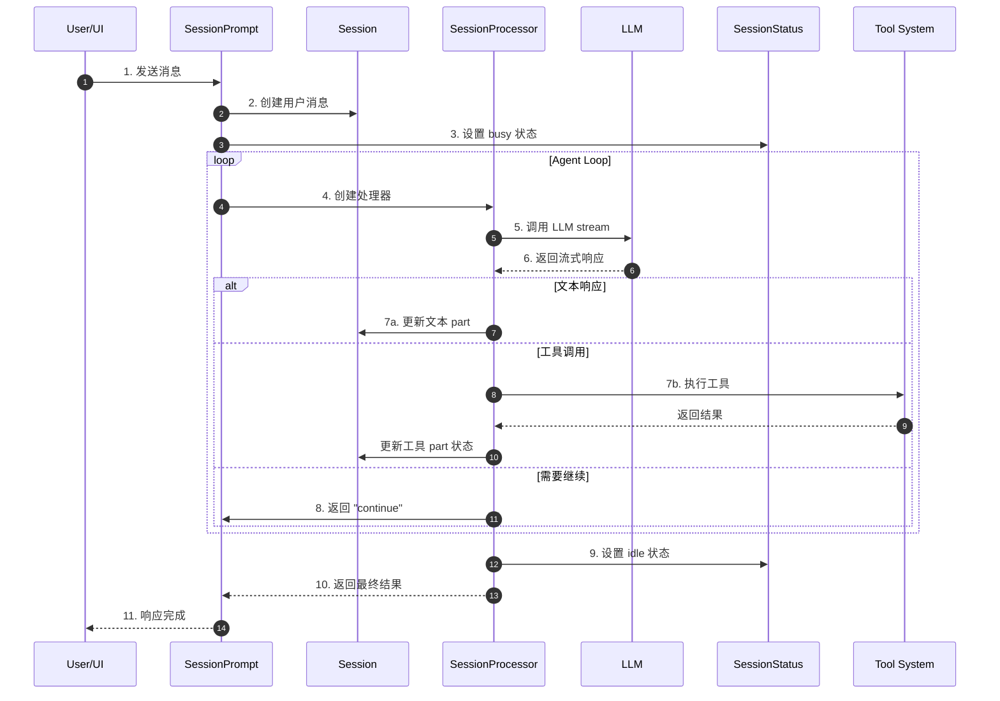

**关键交互说明**：

| 步骤 | 交互内容 | 设计意图 |
|-----|---------|---------|
| 1 | 用户通过 UI 发送消息 | 统一入口，支持多种客户端 |
| 2-3 | 消息持久化 + 状态变更 | 确保状态可追溯，支持恢复 |
| 4-6 | 创建处理器并调用 LLM | 隔离单次请求的处理逻辑 |
| 7a/b | 根据响应类型分别处理 | 支持文本、工具、推理等多种响应 |
| 8 | 循环控制 | Agent Loop 核心，支持多轮工具调用 |
| 9-11 | 状态清理与结果返回 | 确保资源释放，通知客户端 |

---

## 3. 核心组件详细分析

### 3.1 SessionProcessor 内部结构

#### 职责定位

SessionProcessor 是 Session Runtime 的核心处理引擎，负责协调 LLM 流式响应、工具执行和状态管理。

#### 状态机图

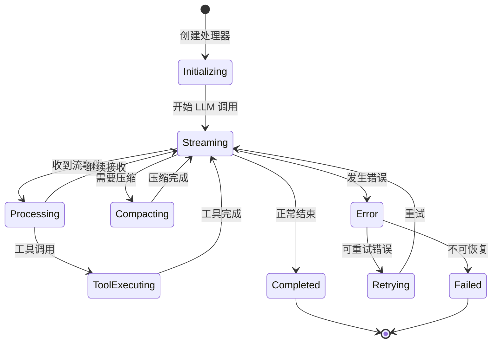

**状态说明**：

| 状态 | 说明 | 进入条件 | 退出条件 |
|-----|------|---------|---------|
| Initializing | 初始化处理器 | `SessionProcessor.create()` | 开始处理 |
| Streaming | 接收 LLM 流 | 调用 `LLM.stream()` | 流结束或错误 |
| Processing | 处理流事件 | 收到 `text-delta`/`tool-call` 等 | 事件处理完成 |
| ToolExecuting | 执行工具 | 收到 `tool-call` 事件 | 工具返回结果 |
| Compacting | 上下文压缩 | Token 超限检测 | 压缩完成 |
| Retrying | 重试等待 | 可重试错误 | 延迟结束 |
| Completed | 完成 | 正常结束 | 自动清理 |
| Failed | 失败 | 不可恢复错误 | 状态持久化 |

#### 内部数据流

```text
┌─────────────────────────────────────────────────────────────┐
│  输入层                                                      │
│  ├── 用户消息 (MessageV2.User)                               │
│  ├── Agent 配置 (Agent.Info)                                 │
│  ├── 模型配置 (Provider.Model)                               │
│  └── 历史消息 (MessageV2.WithParts[])                        │
└──────────────────────────┬──────────────────────────────────┘
                           ▼
┌─────────────────────────────────────────────────────────────┐
│  处理层                                                      │
│  ├── 流事件解析器                                            │
│  │   ├── text-start/delta/end                               │
│  │   ├── reasoning-start/delta/end                          │
│  │   ├── tool-input-start/call/result/error                  │
│  │   └── start-step/finish-step/finish                       │
│  ├── 工具执行器                                              │
│  │   └── 调用 Tool Registry 执行工具                         │
│  ├── 状态更新器                                              │
│  │   └── 更新 MessagePart 到数据库                           │
│  └── 压缩检测器                                              │
│      └── 检测 Token 超限触发压缩                             │
└──────────────────────────┬──────────────────────────────────┘
                           ▼
┌─────────────────────────────────────────────────────────────┐
│  输出层                                                      │
│  ├── 更新后的 Assistant 消息                                 │
│  ├── 工具执行结果                                            │
│  ├── 状态变更事件 (BusEvent)                                 │
│  └── 循环控制信号 (continue/stop/compact)                    │
└─────────────────────────────────────────────────────────────┘
```

#### 关键算法逻辑

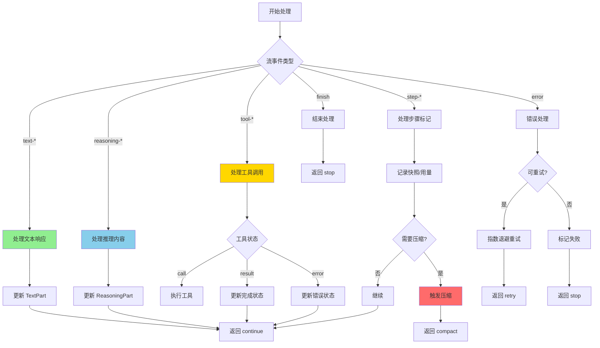

**算法要点**：

1. **流事件分流**：根据事件类型路由到不同处理器，保持单一职责
2. **工具状态机**：pending → running → completed/error，支持并发执行
3. **压缩触发**：基于 Token 用量和模型限制动态决策
4. **错误恢复**：区分可重试错误（网络）和不可重试错误（权限）

#### 关键接口

| 接口 | 输入 | 输出 | 说明 | 代码位置 |
|-----|------|------|------|---------|
| `create()` | assistantMessage, sessionID, model, abort | Processor 实例 | 创建处理器 | `processor.ts:26` |
| `process()` | StreamInput | "continue" | "stop" | "compact" | 核心处理方法 | `processor.ts:45` |
| `partFromToolCall()` | toolCallID | ToolPart | 查找工具调用对应的 part | `processor.ts:42` |

---

### 3.2 SessionStatus 状态机

#### 职责定位

管理会话的运行时状态，支持 idle、busy、retry 三种核心状态，通过事件总线实现状态同步。

#### 状态定义

```typescript
// packages/opencode/src/session/status.ts:7
type Info =
  | { type: "idle" }
  | { type: "busy" }
  | { type: "retry"; attempt: number; message: string; next: number }
```

#### 状态转换

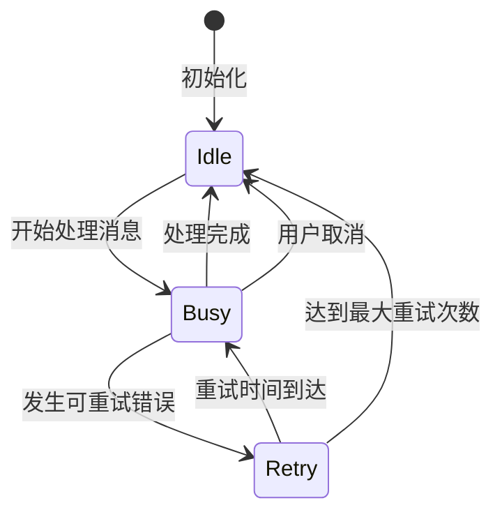

---

### 3.3 组件间协作时序

展示 Session Runtime 如何完成一次完整的用户请求处理。

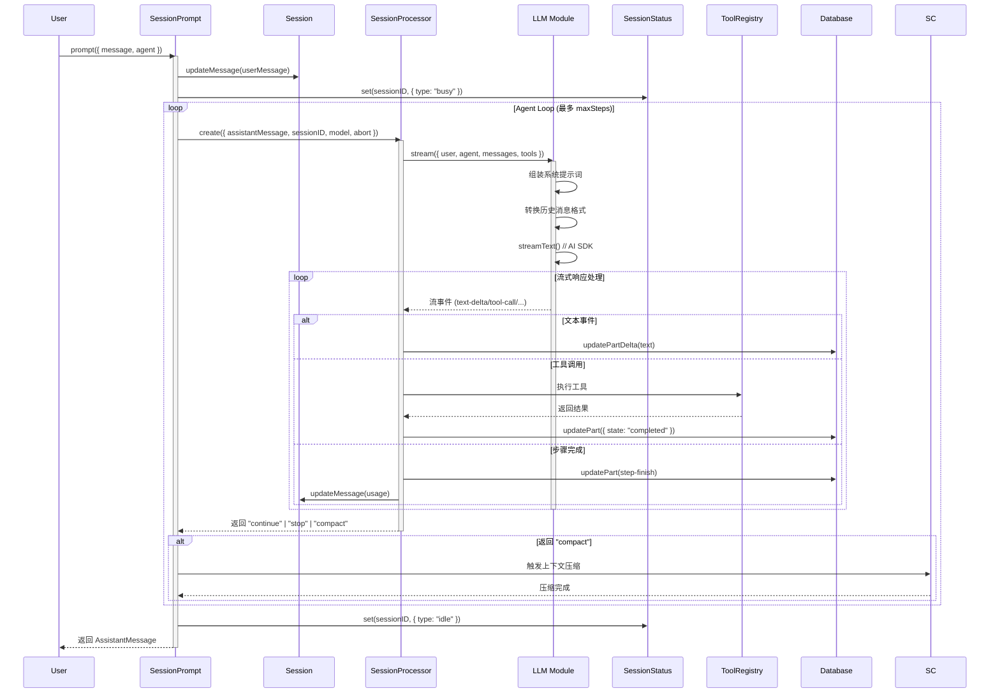

**协作要点**：

1. **SessionPrompt 与 SessionProcessor**：SessionPrompt 负责循环控制，SessionProcessor 负责单次 LLM 调用的完整处理
2. **流式处理**：通过 `for await...of` 消费 LLM 流，实时更新 UI
3. **工具执行**：异步执行工具，不阻塞流处理
4. **状态持久化**：每个重要步骤都同步到数据库，支持恢复

---

### 3.4 关键数据路径

#### 主路径（正常流程）

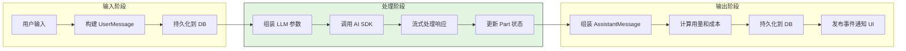

#### 异常路径（错误恢复）

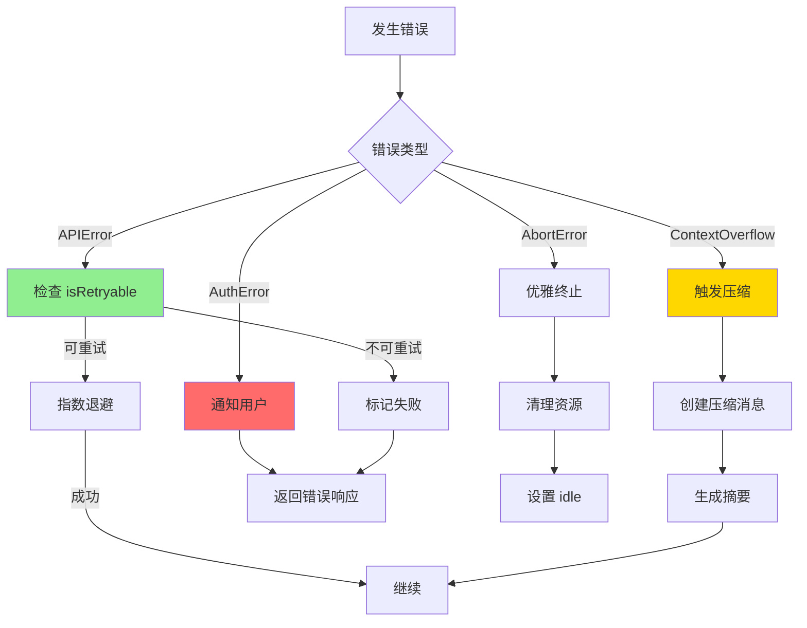

---

## 4. 端到端数据流转

### 4.1 正常流程（详细版）

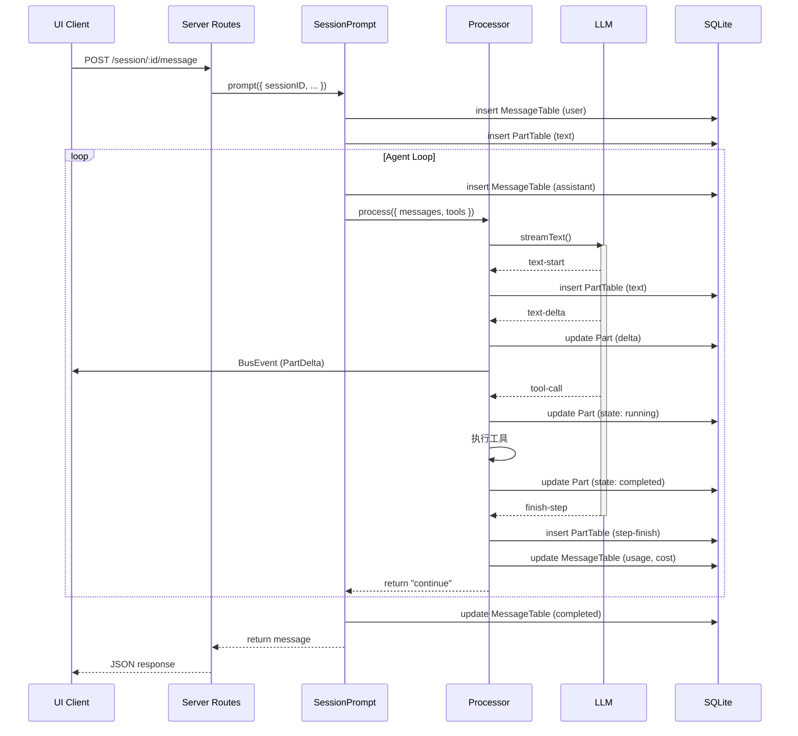

**数据变换详情**：

| 阶段 | 输入 | 处理 | 输出 | 代码位置 |
|-----|------|------|------|---------|
| 接收 | 用户文本 | Zod 验证 | UserMessage | `session/index.ts:212` |
| 处理 | 历史消息 | 转换为 ModelMessage | AI SDK 格式 | `message-v2.ts:491` |
| 流处理 | LLM 流事件 | 解析并路由 | Part 更新 | `processor.ts:55` |
| 完成 | 用量数据 | 计算成本 | AssistantMessage | `session/index.ts:771` |

### 4.2 数据流向图

```mermaid
flowchart LR
    subgraph Input["输入层"]
        I1[用户输入] --> I2[Zod 验证]
        I2 --> I3[UserMessage]
    end

    subgraph Transform["转换层"]
        T1[toModelMessages] --> T2[组装系统提示]
        T2 --> T3[工具注册表查询]
    end

    subgraph Stream["流处理层"]
        S1[AI SDK stream] --> S2[事件分发]
        S2 --> S3[Part 更新]
    end

    subgraph Persist["持久化层"]
        P1[MessageTable] --> P2[PartTable]
        P2 --> P3[事件发布]
    end

    I3 --> T1
    T3 --> S1
    S3 --> P1
    P3 --> UI[UI 更新]

    style Stream fill:#f9f,stroke:#333
```

### 4.3 异常/边界流程

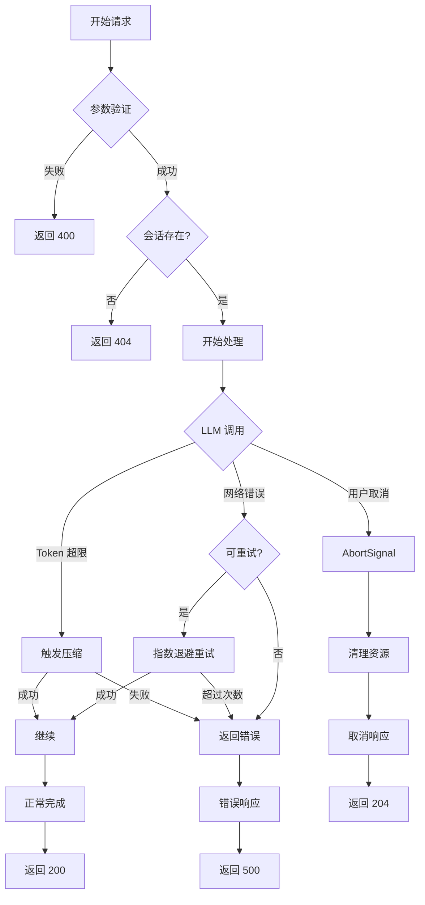

---

## 5. 关键代码实现

### 5.1 核心数据结构

```typescript
// packages/opencode/src/session/message-v2.ts:76
const PartBase = z.object({
  id: z.string(),
  sessionID: z.string(),
  messageID: z.string(),
})

// 文本 Part
export const TextPart = PartBase.extend({
  type: z.literal("text"),
  text: z.string(),
  time: z.object({ start: z.number(), end: z.number().optional() }),
})

// 工具 Part（状态机）
export const ToolPart = PartBase.extend({
  type: z.literal("tool"),
  callID: z.string(),
  tool: z.string(),
  state: ToolState, // pending | running | completed | error
})

// Assistant 消息
export const Assistant = Base.extend({
  role: z.literal("assistant"),
  time: z.object({ created: z.number(), completed: z.number().optional() }),
  cost: z.number(),
  tokens: z.object({
    total: z.number().optional(),
    input: z.number(),
    output: z.number(),
    reasoning: z.number(),
    cache: z.object({ read: z.number(), write: z.number() }),
  }),
})
```

**字段说明**：

| 字段 | 类型 | 用途 |
|-----|------|------|
| `state` | `ToolState` | 工具执行状态机（pending/running/completed/error） |
| `cost` | `number` | 本次请求的成本（USD） |
| `tokens.cache` | `{read, write}` | 缓存命中统计，用于成本优化 |
| `time.completed` | `number` | 完成时间戳，用于计算耗时 |

### 5.2 主链路代码

```typescript
// packages/opencode/src/session/processor.ts:45-120
async process(streamInput: LLM.StreamInput) {
  while (true) {
    const stream = await LLM.stream(streamInput)

    for await (const value of stream.fullStream) {
      switch (value.type) {
        case "start":
          SessionStatus.set(input.sessionID, { type: "busy" })
          break

        case "tool-call": {
          const part = await Session.updatePart({
            ...match,
            state: { status: "running", input: value.input, time: { start: Date.now() } }
          })
          // Doom loop 检测
          if (lastThree.every(p => p.tool === value.toolName &&
              JSON.stringify(p.state.input) === JSON.stringify(value.input))) {
            await PermissionNext.ask({ permission: "doom_loop", ... })
          }
          break
        }

        case "tool-result": {
          await Session.updatePart({
            ...match,
            state: { status: "completed", output: value.output, time: { end: Date.now() } }
          })
          break
        }

        case "finish-step": {
          const usage = Session.getUsage({ model: input.model, usage: value.usage })
          if (await SessionCompaction.isOverflow({ tokens: usage.tokens, model: input.model })) {
            needsCompaction = true
          }
          break
        }
      }
    }

    if (needsCompaction) return "compact"
    if (blocked) return "stop"
    return "continue"
  }
}
```

**代码要点**：

1. **无限循环 + 状态控制**：通过返回值控制循环，支持多轮工具调用
2. **Doom Loop 检测**：检测连续相同工具调用，防止无限循环
3. **Token 超限处理**：在 finish-step 时检测，触发压缩
4. **错误分类处理**：区分可重试和不可重试错误

### 5.3 关键调用链

```text
SessionPrompt.prompt()     [packages/opencode/src/session/prompt.ts:1]
  -> SessionPrompt.loop()   [packages/opencode/src/session/prompt.ts:200]
    -> SessionProcessor.create()  [packages/opencode/src/session/processor.ts:26]
      -> SessionProcessor.process()  [packages/opencode/src/session/processor.ts:45]
        -> LLM.stream()       [packages/opencode/src/session/llm.ts:46]
          - streamText()      // AI SDK
          - 处理流事件
        - 更新 Part 状态     [packages/opencode/src/session/index.ts:735]
        - 工具执行           [packages/opencode/src/tool/registry.ts]
        - 返回控制信号       "continue" | "stop" | "compact"
```

---

## 6. 设计意图与 Trade-off

### 6.1 OpenCode 的选择

| 维度 | OpenCode 的选择 | 替代方案 | 取舍分析 |
|-----|-----------------|---------|---------|
| 架构模式 | 模块化 Namespace + 事件总线 | 面向对象类继承 | 模块间解耦，便于测试和扩展，但调用链不够直观 |
| 状态管理 | 显式状态机（idle/busy/retry） | 隐式状态推导 | 状态清晰可追踪，但需要手动维护 |
| 流处理 | 拉模式（for await...of） | 推模式（回调） | 代码可读性好，错误处理自然，但背压控制复杂 |
| 上下文压缩 | 自动检测 + 手动触发 | 完全自动 | 用户可控，避免意外中断，但需要用户理解机制 |
| 工具执行 | 同步执行，结果注入 | 异步队列 | 实现简单，但长时间工具会阻塞 LLM 响应 |
| 错误恢复 | 指数退避重试 | 立即失败/无限重试 | 平衡可靠性和响应速度 |

### 6.2 为什么这样设计？

**核心问题**：如何构建一个可靠、可扩展的 Session Runtime，支持复杂的 Agent 交互场景？

**OpenCode 的解决方案**：

- 代码依据：`packages/opencode/src/session/processor.ts:19`
- 设计意图：通过模块化和事件驱动，实现关注点分离
- 带来的好处：
  - 每个模块职责单一，易于测试和维护
  - 事件总线解耦组件，支持插件扩展
  - 显式状态机便于调试和监控
- 付出的代价：
  - 调用链较长，需要理解整体架构
  - 事件顺序依赖，需要小心处理竞态条件

### 6.3 与其他项目的对比

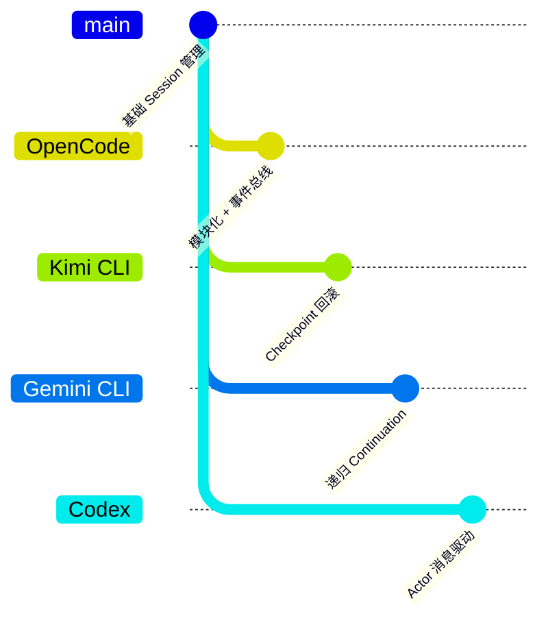

| 项目 | 核心差异 | 适用场景 |
|-----|---------|---------|
| OpenCode | 模块化 Namespace + 显式状态机 + 事件总线 | 需要高度可扩展和可定制的场景 |
| Kimi CLI | Checkpoint 文件回滚 + D-Mail 机制 | 需要对话状态回滚的场景 |
| Gemini CLI | 递归 continuation + 分层内存 | 复杂多步骤任务，需要精细控制 |
| Codex | Rust Actor 模型 + 原生沙箱 | 企业级安全要求高的场景 |

**关键差异分析**：

1. **状态管理**：OpenCode 使用显式状态机（idle/busy/retry），Kimi CLI 使用 Checkpoint 文件，Gemini CLI 使用递归状态
2. **错误恢复**：OpenCode 使用指数退避重试，Kimi CLI 支持完整回滚，Codex 使用监督者模式
3. **扩展性**：OpenCode 的事件总线架构最便于插件扩展

---

## 7. 边界情况与错误处理

### 7.1 终止条件

| 终止原因 | 触发条件 | 代码位置 |
|---------|---------|---------|
| 正常完成 | LLM 返回 finish 且无工具调用 | `processor.ts:339` |
| 用户取消 | AbortSignal 触发 | `processor.ts:56` |
| 最大步数 | stepCount >= maxSteps | `prompt.ts:200` |
| 权限拒绝 | PermissionNext.RejectedError | `processor.ts:221` |
| 上下文溢出 | Token 超过模型限制 | `processor.ts:356` |
| 不可恢复错误 | APIError.isRetryable = false | `processor.ts:359` |

### 7.2 超时/资源限制

```typescript
// packages/opencode/src/session/processor.ts:20
const DOOM_LOOP_THRESHOLD = 3  // 相同工具调用检测阈值

// packages/opencode/src/session/compaction.ts:30
const COMPACTION_BUFFER = 20_000  // 压缩保留 Token 数
const PRUNE_MINIMUM = 20_000      // 剪枝最小 Token 数
const PRUNE_PROTECT = 40_000      // 剪枝保护 Token 数
```

### 7.3 错误恢复策略

| 错误类型 | 处理策略 | 代码位置 |
|---------|---------|---------|
| APIError (可重试) | 指数退避重试（最多 3 次） | `processor.ts:360` |
| ContextOverflowError | 触发上下文压缩 | `processor.ts:356` |
| AuthError | 立即失败，提示用户检查凭证 | `message-v2.ts:811` |
| AbortError | 优雅终止，清理资源 | `message-v2.ts:813` |
| ECONNRESET | 标记为可重试，延迟重试 | `message-v2.ts:830` |

---

## 8. 关键代码索引

| 功能 | 文件 | 行号 | 说明 |
|-----|------|------|------|
| 入口 | `packages/opencode/src/server/routes/session.ts` | 694 | HTTP API 入口 |
| 核心 | `packages/opencode/src/session/prompt.ts` | 1 | Agent Loop 主入口 |
| 核心 | `packages/opencode/src/session/processor.ts` | 19 | LLM 流处理器 |
| 核心 | `packages/opencode/src/session/llm.ts` | 26 | LLM 调用封装 |
| 状态 | `packages/opencode/src/session/status.ts` | 6 | 会话状态机 |
| 压缩 | `packages/opencode/src/session/compaction.ts` | 18 | 上下文压缩 |
| 消息 | `packages/opencode/src/session/message-v2.ts` | 19 | 消息模型定义 |
| 数据 | `packages/opencode/src/session/session.sql.ts` | 1 | 数据库 Schema |
| 重试 | `packages/opencode/src/session/retry.ts` | 1 | 重试策略 |
| 回退 | `packages/opencode/src/session/revert.ts` | 1 | 消息回退 |

---

## 9. 延伸阅读

- 前置知识：`docs/opencode/01-opencode-overview.md`
- 相关机制：`docs/opencode/04-opencode-agent-loop.md`
- 相关机制：`docs/opencode/06-opencode-mcp-integration.md`
- 深度分析：`docs/opencode/questions/opencode-context-compaction.md`

---

*✅ Verified: 基于 opencode/packages/opencode/src/session/*.ts 源码分析*
*基于版本：2026-02-08 | 最后更新：2026-02-24*
