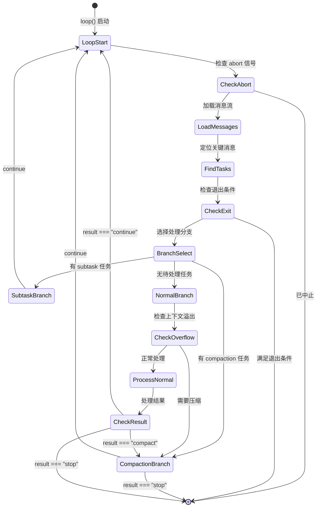
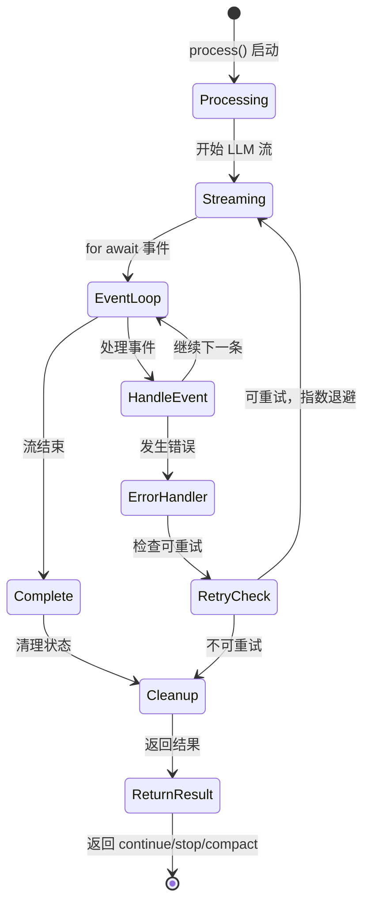
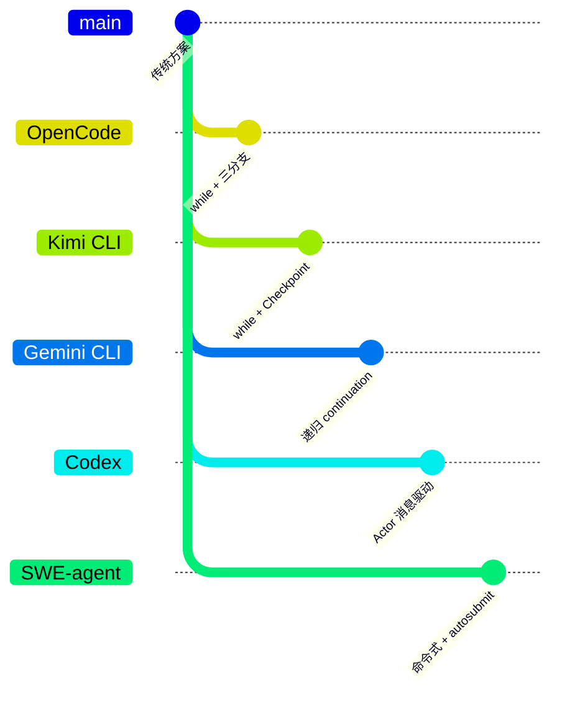

# Agent Loop（OpenCode）

> **阅读指南**
>
> | 属性 | 说明 |
> |-----|------|
> | 预计阅读 | 25-35 分钟 |
> | 前置文档 | `01-opencode-overview.md`、`03-opencode-session-runtime.md` |
> | 文档结构 | 速览 → 架构 → 机制 → 实现 → 对比 |
> | 代码呈现 | 关键代码直接展示，完整代码可折叠查看 |

---

## TL;DR（结论先行）

一句话定义：Agent Loop 是驱动多轮 LLM 调用与工具执行的循环控制机制，让模型从"一次性回答"变成"多轮迭代执行"。

OpenCode 的核心取舍：**任务驱动的多分支 while 循环 + 流式事件处理**（对比 Kimi CLI 的 Checkpoint 回滚、Gemini CLI 的递归 continuation、Codex 的 Actor 消息驱动）

### 核心要点速览

| 维度 | 关键决策 | 代码位置 |
|-----|---------|---------|
| 核心机制 | while(true) 循环 + 三分支任务调度 | `packages/opencode/src/session/prompt.ts:274` |
| 状态管理 | DB 实时持久化 + Event Bus 响应式 | `packages/opencode/src/session/processor.ts:26` |
| 错误处理 | 指数退避重试 + ContextOverflow 压缩 | `packages/opencode/src/session/processor.ts:350-370` |
| 循环检测 | Doom Loop 检测（最近 3 个 tool 对比） | `packages/opencode/src/session/processor.ts:151-176` |
| 流式处理 | AI SDK 事件驱动 (for await) | `packages/opencode/src/session/processor.ts:55-348` |

---

## 1. 为什么需要这个机制？（解决什么问题）

### 1.1 问题场景

没有 Agent Loop：用户问"修复这个 bug" → LLM 一次回答 → 结束（可能根本没看文件）

有 Agent Loop：
- LLM: "先读文件" → 执行 `read_file` → 得到文件内容
- LLM: "再跑测试" → 执行 `run_test` → 得到测试结果
- LLM: "修改第 42 行" → 执行 `write_file` → 成功

### 1.2 核心挑战

| 挑战 | 不解决的后果 |
|-----|-------------|
| 循环驱动 | 无法自动继续下一轮推理 |
| 工具执行编排 | 多个工具并发/串行执行混乱 |
| 状态管理 | 工具执行状态丢失或冲突 |
| 终止条件 | 无限循环导致资源耗尽 |
| 上下文溢出 | 长对话导致 token 超限 |
| 子 Agent 协作 | 复杂任务无法分解执行 |

---

## 2. 整体架构

### 2.1 在系统中的位置

```text
┌─────────────────────────────────────────────────────────────┐
│ UI 层 / CLI 入口                                             │
│ packages/app/src/components/session/index.ts                │
│ - 用户输入处理                                               │
│ - 消息创建与广播                                             │
└───────────────────────┬─────────────────────────────────────┘
                        │ 调用
                        ▼
┌─────────────────────────────────────────────────────────────┐
│ ▓▓▓ Agent Loop ▓▓▓                                          │
│ packages/opencode/src/session/prompt.ts                      │
│ - prompt()     : 用户消息入口                                │
│ - loop()       : 核心 while 循环（任务分支处理）             │
│                                                              │
│ packages/opencode/src/session/processor.ts                   │
│ - create()     : 单轮处理器创建                              │
│ - process()    : 流式事件解析与工具执行                      │
│                                                              │
│ packages/opencode/src/session/llm.ts                         │
│ - stream()     : LLM 流式调用封装                            │
└───────────────────────┬─────────────────────────────────────┘
                        │
        ┌───────────────┼───────────────┐
        ▼               ▼               ▼
┌──────────────┐ ┌──────────────┐ ┌──────────────┐
│ LLM Provider │ │ Tool System  │ │ Context      │
│ 统一封装     │ │ 工具执行     │ │ 压缩/管理    │
│ (AI SDK)     │ │              │ │              │
└──────────────┘ └──────────────┘ └──────────────┘
```

### 2.2 核心组件职责

| 组件 | 职责 | 代码位置 |
|-----|------|---------|
| `SessionPrompt` | Agent Loop 主控器，管理会话生命周期 | `packages/opencode/src/session/prompt.ts:62` |
| `prompt()` | 用户输入入口，创建消息并启动 loop | `packages/opencode/src/session/prompt.ts:155` |
| `loop()` | 核心 while 循环，处理任务分支 | `packages/opencode/src/session/prompt.ts:274` |
| `SessionProcessor` | 单轮处理器，解析流式事件 | `packages/opencode/src/session/processor.ts:26` |
| `create()` | 创建带状态的处理器实例 | `packages/opencode/src/session/processor.ts:26` |
| `process()` | 处理 LLM 流事件，执行工具 | `packages/opencode/src/session/processor.ts:45` |
| `LLM` | LLM 流封装，统一 Provider 调用 | `packages/opencode/src/session/llm.ts:26` |
| `stream()` | 调用 AI SDK streamText | `packages/opencode/src/session/llm.ts:46` |

### 2.3 核心组件交互关系

```mermaid
sequenceDiagram
    autonumber
    participant UI as UI 层
    participant Prompt as SessionPrompt
    participant Loop as loop()
    participant Proc as SessionProcessor
    participant LLM as LLM.stream
    participant Tool as Tool System

    UI->>Prompt: 1. prompt(userInput)
    Note over Prompt: 创建用户消息<br/>写入 DB

    Prompt->>Loop: 2. loop({ sessionID })
    Note over Loop: while(true) 循环开始

    Loop->>Loop: 3. 读取消息流
    Note right of Loop: MessageV2.stream()<br/>filterCompacted()

    Loop->>Loop: 4. 定位关键消息
    Note right of Loop: lastUser / lastAssistant<br/>lastFinished / tasks

    Loop->>Loop: 5. 检查退出条件
    Note right of Loop: finish reason 检查

    alt 有 subtask 任务
        Loop->>Tool: 6a. 执行子 Agent 任务
        Note right of Tool: TaskTool.execute()
    else 有 compaction 任务
        Loop->>Loop: 6b. 执行上下文压缩
        Note right of Loop: SessionCompaction.process()
    else 正常处理
        Loop->>Proc: 6c. 创建处理器
        Note right of Proc: SessionProcessor.create()

        Loop->>Proc: 7. processor.process()
        Proc->>LLM: 8. LLM.stream()
        LLM-->>Proc: 9. 流式事件

        loop 事件处理
            Proc->>Proc: 10. 解析事件类型
            alt tool-call 事件
                Proc->>Tool: 11. 执行工具
                Tool-->>Proc: 12. 工具结果
            else text-delta 事件
                Proc->>Proc: 13. 更新文本 Part
            end
        end

        Proc-->>Loop: 14. 返回结果
    end

    Loop->>Loop: 15. 决策继续/停止
    Note right of Loop: continue/stop/compact
```

**关键交互说明**：

| 步骤 | 交互内容 | 设计意图 |
|-----|---------|---------|
| 1 | UI 向 SessionPrompt 发起请求 | 解耦 UI 与核心逻辑 |
| 3-4 | 从 DB 流式读取并过滤消息 | 支持超长对话，已压缩历史自动跳过 |
| 5 | 迭代开头检查退出条件 | 确保模型自然停止时立即退出 |
| 6a-6c | 三分支任务处理 | Subtask/Compaction/Normal 优先级处理 |
| 8-9 | 流式 LLM 调用 | 实时响应，降低首 token 延迟 |
| 10-13 | 事件驱动处理 | 统一处理文本/工具/推理事件 |
| 15 | 基于返回值决策 | 支持 continue/stop/compact 三种结果 |

---

## 3. 核心组件详细分析

### 3.1 SessionPrompt.loop() 内部结构

#### 职责定位

`loop()` 是 OpenCode Agent Loop 的核心编排器，负责：消息流读取、任务分支调度、终止条件判断、上下文压缩触发。

#### 内部数据流

```text
┌─────────────────────────────────────────────────────────────┐
│  输入层                                                      │
│  ├── 用户消息流 ──► MessageV2.stream()                       │
│  └── 中止信号   ──► AbortController.signal                  │
└──────────────────────────┬──────────────────────────────────┘
                           ▼
┌─────────────────────────────────────────────────────────────┐
│  处理层                                                      │
│  ├── 消息过滤: filterCompacted()                            │
│  ├── 消息定位: lastUser / lastAssistant / lastFinished      │
│  ├── 任务提取: tasks (subtask/compaction)                   │
│  ├── 退出检查: finish reason 判断                           │
│  ├── 分支处理:                                              │
│  │   ├── Subtask  ──► TaskTool.execute()                    │
│  │   ├── Compaction ──► SessionCompaction.process()         │
│  │   └── Normal    ──► SessionProcessor.process()           │
│  └── 结果决策: continue / stop / compact                    │
└──────────────────────────┬──────────────────────────────────┘
                           ▼
┌─────────────────────────────────────────────────────────────┐
│  输出层                                                      │
│  ├── 更新消息状态 (DB)                                       │
│  ├── 广播 Bus 事件                                           │
│  └── 返回最终结果                                            │
└─────────────────────────────────────────────────────────────┘
```

#### 状态机图



**状态说明**：

| 状态 | 说明 | 进入条件 | 退出条件 |
|-----|------|---------|---------|
| LoopStart | 循环开始 | 每次迭代开始 | 检查 abort |
| LoadMessages | 加载消息 | 通过 abort 检查 | 消息加载完成 |
| FindTasks | 定位任务 | 消息加载完成 | 找到关键消息 |
| CheckExit | 检查退出 | 定位完成 | 满足/不满足条件 |
| BranchSelect | 分支选择 | 不满足退出条件 | 根据任务类型 |
| SubtaskBranch | 子任务处理 | 有 subtask | 执行完成 |
| CompactionBranch | 压缩处理 | 有 compaction 或溢出 | 处理完成 |
| NormalBranch | 正常处理 | 无待处理任务 | 处理完成 |

#### 内部数据流

```text
┌─────────────────────────────────────────────────────────────┐
│  输入层                                                      │
│  ├── 用户消息流 ──► MessageV2.stream()                       │
│  └── 中止信号   ──► AbortController.signal                  │
└──────────────────────────┬──────────────────────────────────┘
                           ▼
┌─────────────────────────────────────────────────────────────┐
│  处理层                                                      │
│  ├── 消息过滤: filterCompacted()                            │
│  ├── 消息定位: lastUser / lastAssistant / lastFinished      │
│  ├── 任务提取: tasks (subtask/compaction)                   │
│  ├── 退出检查: finish reason 判断                           │
│  ├── 分支处理:                                              │
│  │   ├── Subtask  ──► TaskTool.execute()                    │
│  │   ├── Compaction ──► SessionCompaction.process()         │
│  │   └── Normal    ──► SessionProcessor.process()           │
│  └── 结果决策: continue / stop / compact                    │
└──────────────────────────┬──────────────────────────────────┘
                           ▼
┌─────────────────────────────────────────────────────────────┐
│  输出层                                                      │
│  ├── 更新消息状态 (DB)                                       │
│  ├── 广播 Bus 事件                                           │
│  └── 返回最终结果                                            │
└─────────────────────────────────────────────────────────────┘
```

#### 关键算法逻辑

```mermaid
flowchart TD
    A[loop() 开始] --> B{abort.aborted?}
    B -->|Yes| C[退出循环]
    B -->|No| D[加载消息流]

    D --> E[定位关键消息]
    E --> F{退出条件满足?}
    F -->|Yes| C
    F -->|No| G{有 subtask?}

    G -->|Yes| H[执行子任务]
    H --> I[continue]
    G -->|No| J{有 compaction?}

    J -->|Yes| K[执行压缩]
    K --> L{result === stop?}
    L -->|Yes| C
    L -->|No| I

    J -->|No| M{上下文溢出?}
    M -->|Yes| N[创建 compaction 任务]
    N --> I
    M -->|No| O[正常处理]

    O --> P[SessionProcessor.process]
    P --> Q{result?}
    Q -->|continue| I
    Q -->|compact| N
    Q -->|stop| C

    I --> B
    C --> R[清理与返回]

    style H fill:#90EE90
    style K fill:#FFD700
    style O fill:#87CEEB
```

**算法要点**：

1. **三分支优先级**：subtask > compaction > normal，确保任务按优先级处理
2. **退出条件前置**：每次迭代开头检查，避免不必要的处理
3. **溢出检测**：在正常处理前检查，提前触发压缩
4. **结果驱动**：processor 返回三种结果，loop 据此决策

---

### 3.2 SessionProcessor.process() 内部结构

#### 职责定位

`process()` 是单轮 LLM 调用的核心处理器，负责：流式事件解析、工具执行协调、状态管理、错误处理。

#### 状态机图



#### 事件处理映射

| 事件类型 | 动作 | 代码位置 |
|---------|------|---------|
| `start` | 设置 Session 状态为 busy | `processor.ts:59` |
| `reasoning-start/delta/end` | 创建/更新/关闭 reasoning Part | `processor.ts:62-109` |
| `tool-input-start` | 创建 tool Part，状态 pending | `processor.ts:111-126` |
| `tool-call` | 更新状态为 running，执行工具，Doom Loop 检测 | `processor.ts:134-178` |
| `tool-result` | 更新状态为 completed | `processor.ts:180-201` |
| `tool-error` | 更新状态为 error，检查权限拒绝 | `processor.ts:204-228` |
| `start-step` | 打快照，写入 step-start Part | `processor.ts:233-242` |
| `finish-step` | 记录 token 用量，检测 overflow | `processor.ts:244-285` |
| `text-start/delta/end` | 维护 text Part，实时广播 | `processor.ts:287-337` |
| `error` | 抛出异常进入 catch 分支 | `processor.ts:230-231` |

#### 关键接口

| 接口 | 输入 | 输出 | 说明 | 代码位置 |
|-----|------|------|------|---------|
| `create()` | assistantMessage, sessionID, model, abort | Info 对象 | 创建处理器实例 | `processor.ts:26` |
| `process()` | StreamInput | "continue"/"stop"/"compact" | 核心处理方法 | `processor.ts:45` |
| `partFromToolCall()` | toolCallID | ToolPart | 获取工具调用对应的 Part | `processor.ts:42` |

---

### 3.3 组件间协作时序

展示 `loop()` 与 `processor.process()` 如何协作完成一次正常推理：

```mermaid
sequenceDiagram
    participant Loop as SessionPrompt.loop()
    participant Proc as SessionProcessor
    participant LLM as LLM.stream()
    participant Tool as Tool System
    participant DB as Database

    Loop->>Loop: step++
    Loop->>Loop: insertReminders()
    Loop->>Loop: resolveTools()

    Loop->>Proc: create({ assistantMessage, ... })
    Proc-->>Loop: processor

    Loop->>Proc: process({ user, agent, tools, ... })
    activate Proc
    Proc->>LLM: stream()
    activate LLM

    LLM-->>Proc: text-start
    Proc->>DB: 创建 TextPart

    LLM-->>Proc: tool-input-start (read_file)
    Proc->>DB: 创建 ToolPart (pending)

    LLM-->>Proc: tool-call
    Proc->>Proc: Doom Loop 检测
    Note right of Proc: 检查最近 3 个 tool<br/>名和 input 是否相同

    Proc->>DB: 更新 ToolPart (running)
    Proc->>Tool: 执行 read_file
    activate Tool
    Tool-->>Proc: 文件内容
    deactivate Tool
    Proc->>DB: 更新 ToolPart (completed)

    LLM-->>Proc: finish-step
    Proc->>DB: 写入 step-finish Part
    deactivate LLM

    Proc-->>Loop: 返回 "continue"
    deactivate Proc

    Loop->>Loop: 决策继续/停止
```

**协作要点**：

1. **Loop 与 Processor**：Loop 负责编排，Processor 负责执行，通过返回值通信
2. **Processor 与 LLM**：流式调用，事件驱动处理，支持实时响应
3. **Processor 与 Tool**：工具执行在事件回调中完成，结果回注到 Part
4. **所有组件与 DB**：状态持久化到 DB，支持会话恢复和实时同步

---

### 3.4 关键数据路径

#### 主路径（正常流程）

```mermaid
flowchart LR
    subgraph Input["输入阶段"]
        I1[用户输入] --> I2[创建 UserMessage]
        I2 --> I3[写入 DB]
        I3 --> I4[广播 Bus 事件]
    end

    subgraph Loop["Loop 阶段"]
        L1[加载消息流] --> L2[filterCompacted]
        L2 --> L3[定位关键消息]
        L3 --> L4[检查退出条件]
    end

    subgraph Process["处理阶段"]
        P1[resolveTools] --> P2[创建 AssistantMessage]
        P2 --> P3[SessionProcessor.process]
        P3 --> P4[LLM.stream]
        P4 --> P5[事件处理]
        P5 --> P6[工具执行]
        P6 --> P7[更新 Part 状态]
    end

    subgraph Output["输出阶段"]
        O1[检测 finish] --> O2[决策结果]
        O2 --> O3[更新 Message]
        O3 --> O4[返回 UI]
    end

    I4 --> L1
    L4 --> P1
    P7 --> O1

    style Process fill:#e1f5e1,stroke:#333
```



#### 异常路径（错误恢复）

```mermaid
flowchart TD
    E[发生错误] --> E1{错误类型}
    E1 -->|APIError + 可重试| R1[指数退避重试]
    E1 -->|ContextOverflow| R2[触发 compaction]
    E1 -->|Permission Rejected| R3[设置 blocked]
    E1 -->|其他错误| R4[记录错误并停止]

    R1 --> R1A[SessionRetry.delay]
    R1A -->|成功| R1B[继续流处理]
    R1A -->|超过最大重试| R4

    R2 --> R2A[返回 "compact"]
    R2A --> R2B[loop 创建 compaction 任务]

    R3 --> R3A[blocked = true]
    R3A --> R3B[返回 "stop"]

    R4 --> R4A[记录 error 到 message]
    R4A --> R4B[广播 Error 事件]

    R1B --> End[结束]
    R2B --> End
    R3B --> End
    R4B --> End

    style R1 fill:#90EE90
    style R2 fill:#FFD700
    style R3 fill:#FFB6C1
    style R4 fill:#FF6B6B
```

---

## 4. 端到端数据流转

### 4.1 正常流程（详细版）

展示一次典型"会调用多个工具"的请求完整路径：

```mermaid
sequenceDiagram
    participant User as 用户
    participant UI as UI 层
    participant Prompt as SessionPrompt
    participant Loop as loop()
    participant Proc as SessionProcessor
    participant LLM as LLM Provider
    participant Tool as Tool System
    participant DB as Database

    User->>UI: 输入请求
    UI->>Prompt: prompt({ sessionID, messageID })

    Prompt->>DB: createUserMessage()
    Prompt->>UI: 广播消息创建事件
    Prompt->>Loop: loop({ sessionID })

    activate Loop

    Note over Loop: === Step 1 ===
    Loop->>DB: MessageV2.stream()
    Loop->>Loop: filterCompacted()
    Loop->>Loop: 定位 lastUser, lastAssistant

    Loop->>Loop: resolveTools()
    Loop->>DB: 创建 AssistantMessage
    Loop->>Proc: create()

    Loop->>Proc: process()
    activate Proc
    Proc->>LLM: stream()
    activate LLM

    LLM-->>Proc: text-start
    Proc->>DB: 创建 TextPart

    LLM-->>Proc: tool-input-start (read_file)
    Proc->>DB: 创建 ToolPart (pending)

    LLM-->>Proc: tool-call
    Proc->>Proc: Doom Loop 检测
    Proc->>DB: 更新 ToolPart (running)
    Proc->>Tool: 执行 read_file
    Tool-->>Proc: 文件内容
    Proc->>DB: 更新 ToolPart (completed)

    LLM-->>Proc: finish-step
    Proc->>DB: 写入 step-finish Part
    deactivate LLM

    Proc-->>Loop: 返回 "continue"
    deactivate Proc

    Note over Loop: === Step 2 ===
    Loop->>DB: 重新加载消息流
    Loop->>Proc: process() [再次调用]
    activate Proc
    Proc->>LLM: stream()
    activate LLM

    LLM-->>Proc: tool-call (write_file)
    Proc->>Tool: 执行 write_file
    Tool-->>Proc: 成功
    Proc->>DB: 更新 ToolPart

    LLM-->>Proc: finish (reason: stop)
    deactivate LLM
    Proc-->>Loop: 返回 "continue"
    deactivate Proc

    Loop->>Loop: 检查退出条件
    Note right of Loop: finish === "stop"<br/>满足退出条件

    Loop->>DB: SessionCompaction.prune()
    Loop->>UI: 返回最终结果
    deactivate Loop
```

**数据变换详情**：

| 阶段 | 输入 | 处理 | 输出 | 代码位置 |
|-----|------|------|------|---------|
| 接收 | 用户输入文本 | 创建 UserMessage | 消息对象 | `prompt.ts:155` |
| 加载 | sessionID | 流式读取消息 | 消息数组 | `prompt.ts:298` |
| 过滤 | 原始消息 | filterCompacted | 过滤后消息 | `prompt.ts:298` |
| 定位 | 消息数组 | 反向遍历 | 关键消息引用 | `prompt.ts:304-315` |
| 工具解析 | Agent + Session | 合并 Registry + MCP | 工具映射 | `prompt.ts:602-610` |
| 流处理 | LLM 流 | 事件解析 | Part 更新 | `processor.ts:55-348` |
| 决策 | finish reason | 条件判断 | continue/stop | `prompt.ts:688-712` |

### 4.2 数据流向图

```mermaid
flowchart LR
    subgraph InputPhase["输入阶段"]
        I1[用户输入] --> I2[SessionPrompt.prompt]
        I2 --> I3[创建 UserMessage]
        I3 --> I4[写入 Database]
        I4 --> I5[广播 Bus 事件]
    end

    subgraph LoopPhase["Loop 阶段"]
        L1[loop() 启动] --> L2[MessageV2.stream]
        L2 --> L3[filterCompacted]
        L3 --> L4[定位关键消息]
        L4 --> L5[分支选择]
    end

    subgraph ProcessPhase["处理阶段"]
        P1[resolveTools] --> P2[创建 AssistantMessage]
        P2 --> P3[SessionProcessor.process]
        P3 --> P4[LLM.stream]
        P4 --> P5[事件循环]
        P5 --> P6[工具执行]
        P6 --> P7[Part 状态更新]
    end

    subgraph OutputPhase["输出阶段"]
        O1[检测 finish] --> O2[决策结果]
        O2 --> O3[更新 Message]
        O3 --> O4[返回 UI]
    end

    I5 --> L1
    L5 --> P1
    P7 --> O1

    style ProcessPhase fill:#f9f,stroke:#333
```

### 4.3 异常/边界流程

```mermaid
flowchart TD
    A[loop() 迭代开始] --> B{abort.aborted?}
    B -->|Yes| C[立即退出]

    B -->|No| D[加载消息]
    D --> E{有 lastUser?}
    E -->|No| F[抛出错误]

    E -->|Yes| G{退出条件满足?}
    G -->|Yes| C

    G -->|No| H{有 subtask?}
    H -->|Yes| I[执行 TaskTool]
    I --> J{执行成功?}
    J -->|Yes| K[记录结果]
    J -->|No| L[记录错误]
    K --> M[continue]
    L --> M

    H -->|No| N{有 compaction?}
    N -->|Yes| O[SessionCompaction.process]
    O --> P{result?}
    P -->|stop| C
    P -->|continue| M

    N -->|No| Q{上下文溢出?}
    Q -->|Yes| R[创建 compaction]
    R --> M

    Q -->|No| S[正常处理]
    S --> T[SessionProcessor.process]
    T --> U{发生错误?}
    U -->|Yes| V{可重试?}
    V -->|Yes| W[指数退避]
    W --> T
    V -->|No| X[记录错误]
    X --> C

    U -->|No| Y{result?}
    Y -->|continue| M
    Y -->|compact| R
    Y -->|stop| C

    M --> B
    C --> Z[清理与返回]

    style I fill:#90EE90
    style O fill:#FFD700
    style S fill:#87CEEB
    style C fill:#FFB6C1
```

---

## 5. 关键代码实现

### 5.1 核心数据结构

```typescript
// packages/opencode/src/session/prompt.ts:270-273
export const LoopInput = z.object({
  sessionID: Identifier.schema("session"),
  resume_existing: z.boolean().optional(),
})
```

**字段说明**：
| 字段 | 类型 | 用途 |
|-----|------|------|
| `sessionID` | string | 会话唯一标识 |
| `resume_existing` | boolean | 是否恢复已有会话 |

```typescript
// packages/opencode/src/session/processor.ts:30-42
export function create(input: {
  assistantMessage: MessageV2.Assistant
  sessionID: string
  model: Provider.Model
  abort: AbortSignal
}) {
  const toolcalls: Record<string, MessageV2.ToolPart> = {}
  let snapshot: string | undefined
  let blocked = false
  let attempt = 0
  let needsCompaction = false
  // ...
}
```

**字段说明**：
| 字段 | 类型 | 用途 |
|-----|------|------|
| `toolcalls` | Record | 跟踪进行中的工具调用 |
| `snapshot` | string | 步骤开始时的文件快照 |
| `blocked` | boolean | 是否被权限系统阻止 |
| `attempt` | number | 重试次数 |
| `needsCompaction` | boolean | 是否需要上下文压缩 |

### 5.2 主链路代码

```typescript
// packages/opencode/src/session/prompt.ts:294-325
export const loop = fn(LoopInput, async (input) => {
  const { sessionID, resume_existing } = input
  const abort = resume_existing ? resume(sessionID) : start(sessionID)
  // ...
  let step = 0
  const session = await Session.get(sessionID)
  while (true) {
    SessionStatus.set(sessionID, { type: "busy" })
    log.info("loop", { step, sessionID })
    if (abort.aborted) break
    let msgs = await MessageV2.filterCompacted(MessageV2.stream(sessionID))

    let lastUser: MessageV2.User | undefined
    let lastAssistant: MessageV2.Assistant | undefined
    let lastFinished: MessageV2.Assistant | undefined
    let tasks: (MessageV2.CompactionPart | MessageV2.SubtaskPart)[] = []
    for (let i = msgs.length - 1; i >= 0; i--) {
      const msg = msgs[i]
      if (!lastUser && msg.info.role === "user") lastUser = msg.info as MessageV2.User
      if (!lastAssistant && msg.info.role === "assistant") lastAssistant = msg.info as MessageV2.Assistant
      if (!lastFinished && msg.info.role === "assistant" && msg.info.finish)
        lastFinished = msg.info as MessageV2.Assistant
      if (lastUser && lastFinished) break
      const task = msg.parts.filter((part) => part.type === "compaction" || part.type === "subtask")
      if (task && !lastFinished) {
        tasks.push(...task)
      }
    }

    if (!lastUser) throw new Error("No user message found in stream.")
    if (
      lastAssistant?.finish &&
      !["tool-calls", "unknown"].includes(lastAssistant.finish) &&
      lastUser.id < lastAssistant.id
    ) {
      log.info("exiting loop", { sessionID })
      break
    }
    // ... 分支处理
  }
})
```

**代码要点**：
1. **while(true) 无限循环**：通过内部条件控制退出，确保模型持续推理直到自然停止
2. **消息定位逻辑**：反向遍历消息数组，高效定位关键消息
3. **退出条件检查**：finish reason 不为 tool-calls/unknown 且 lastAssistant 在 lastUser 之后
4. **任务提取**：从消息 Part 中提取 subtask 和 compaction 任务

```typescript
// packages/opencode/src/session/processor.ts:45-180
async process(streamInput: LLM.StreamInput) {
  log.info("process")
  needsCompaction = false
  const shouldBreak = (await Config.get()).experimental?.continue_loop_on_deny !== true
  while (true) {
    try {
      let currentText: MessageV2.TextPart | undefined
      let reasoningMap: Record<string, MessageV2.ReasoningPart> = {}
      const stream = await LLM.stream(streamInput)

      for await (const value of stream.fullStream) {
        input.abort.throwIfAborted()
        switch (value.type) {
          case "start":
            SessionStatus.set(input.sessionID, { type: "busy" })
            break
          case "tool-call": {
            // ... Doom Loop 检测
            const parts = await MessageV2.parts(input.assistantMessage.id)
            const lastThree = parts.slice(-DOOM_LOOP_THRESHOLD)
            if (
              lastThree.length === DOOM_LOOP_THRESHOLD &&
              lastThree.every(
                (p) =>
                  p.type === "tool" &&
                  p.tool === value.toolName &&
                  p.state.status !== "pending" &&
                  JSON.stringify(p.state.input) === JSON.stringify(value.input),
              )
            ) {
              // 触发 Doom Loop 权限询问
              await PermissionNext.ask({ permission: "doom_loop", ... })
            }
            // ... 执行工具
          }
          // ... 其他事件处理
        }
        if (needsCompaction) break
      }
    } catch (e: any) {
      // ... 错误处理与重试
    }
    // ... 返回结果
  }
}
```

**代码要点**：
1. **内层 while 循环**：支持流中断后的重试
2. **事件驱动处理**：switch-case 处理不同类型的流事件
3. **Doom Loop 检测**：检查最近 3 个 tool 调用是否重复
4. **abort 信号检查**：每次事件处理前检查，支持用户中断

### 5.3 关键调用链

```text
SessionPrompt.prompt()          [prompt.ts:155]
  -> loop()                     [prompt.ts:274]
    -> MessageV2.stream()       [message-v2.ts]
    -> filterCompacted()        [message-v2.ts]
    -> 分支判断
      -> Subtask 分支
        -> TaskTool.execute()   [tool/task.ts]
      -> Compaction 分支
        -> SessionCompaction.process()  [compaction.ts]
      -> Normal 分支
        -> resolveTools()       [prompt.ts:734]
        -> SessionProcessor.create()    [processor.ts:26]
          -> process()          [processor.ts:45]
            -> LLM.stream()     [llm.ts:46]
              -> streamText()   [ai SDK]
            -> 事件处理循环     [processor.ts:55-348]
              -> 工具执行       [tool/*.ts]
            -> 返回 continue/stop/compact
    -> 决策继续/停止
```

---

## 6. 设计意图与 Trade-off

### 6.1 OpenCode 的选择

| 维度 | OpenCode 的选择 | 替代方案 | 取舍分析 |
|-----|-----------------|---------|---------|
| 循环结构 | while(true) 迭代 | 递归 continuation (Gemini) | 简单直观，状态管理在循环内完成；递归可能有栈深度限制 |
| 流式处理 | 事件驱动 (for await) | 全量等待后处理 | 实时响应，降低首 token 延迟；代码复杂度略高 |
| 任务调度 | 三分支优先级队列 | 单一队列 (Kimi) | 支持子 Agent 和压缩任务；需要维护任务提取逻辑 |
| 状态持久化 | DB 实时写入 | 内存缓存 (Codex) | 支持会话恢复和跨端同步；DB 操作有性能开销 |
| 上下文压缩 | Compaction + Prune | 仅 Compaction (Kimi) | 双重机制应对长对话；压缩逻辑较复杂 |
| 工具执行 | 流内同步执行 | 异步队列 (Gemini Scheduler) | 实现简单；无法并行执行多个工具 |

### 6.2 为什么这样设计？

**核心问题**：如何在支持复杂任务编排（子 Agent、上下文压缩）的同时保持代码可读性和实时响应？

**OpenCode 的解决方案**：
- 代码依据：`packages/opencode/src/session/prompt.ts:274`
- 设计意图：通过显式的 while 循环和分支判断，让控制流清晰可见
- 带来的好处：
  - 开发者能快速理解循环逻辑
  - 任务优先级明确（subtask > compaction > normal）
  - 流式处理保证用户体验
- 付出的代价：
  - 循环体较长，需要仔细维护
  - 工具执行是同步的，无法并行

**核心问题**：如何检测和防止重复工具调用（Doom Loop）？

**OpenCode 的解决方案**：
- 代码依据：`packages/opencode/src/session/processor.ts:151-176`
- 设计意图：在工具调用时检查最近 3 个 tool Part，如果工具名和 input 完全相同则触发权限询问
- 带来的好处：
  - 及时发现模型陷入循环
  - 给用户选择权（继续或终止）
- 付出的代价：
  - 需要遍历 Part 历史
  - JSON stringify 对比有一定开销

### 6.3 与其他项目的对比



| 项目 | 核心差异 | 适用场景 |
|-----|---------|---------|
| OpenCode | 任务驱动三分支 + 流式事件处理 | 需要子 Agent 协作、复杂任务编排 |
| Kimi CLI | Checkpoint 回滚机制 | 需要对话状态回滚、错误恢复 |
| Gemini CLI | 递归 continuation + Scheduler 状态机 | 需要精细的工具调度、并行执行 |
| Codex | Actor 消息驱动 + 原生沙箱 | 需要高安全性、企业级部署 |
| SWE-agent | 命令式循环 + 自动提交 | 需要自动化代码修复 |

**详细对比**：

| 特性 | OpenCode | Kimi CLI | Gemini CLI | Codex | SWE-agent |
|-----|----------|----------|------------|-------|-----------|
| 循环模式 | while 迭代 | while 迭代 | 递归 continuation | Actor 消息 | while 迭代 |
| 子 Agent | TaskTool 派发 | 不支持 | 支持 | 不支持 | 不支持 |
| 上下文压缩 | Compaction + Prune | Checkpoint 回滚 | 上下文保护 | 窗口滑动 | 截断 |
| 流式处理 | 是 | 是 | 是 | 是 | 否 |
| Doom Loop 检测 | 是 | 否 | 是 | 否 | 否 |
| 工具并行 | 否 | 是 | 是 | 是 | 否 |
| 状态持久化 | DB 实时 | Checkpoint 文件 | 内存 | 内存 | 内存 |
| 错误恢复 | 指数退避重试 | Checkpoint 回滚 | InvalidStream 恢复 | 错误传播 | forward_with_handling |
| 最大步数 | 可配置 | 50/turn | 无显式限制 | 可配置 | 无显式限制 |

---

## 7. 边界情况与错误处理

### 7.1 终止条件

| 终止原因 | 触发条件 | 代码位置 |
|---------|---------|---------|
| 模型自然停止 | finish reason 为 stop/length/content-filter | `prompt.ts:318-325` |
| 用户中断 | AbortController.abort() 被调用 | `prompt.ts:297` |
| 权限拒绝 | PermissionNext.RejectedError 且未配置 continue_loop_on_deny | `processor.ts:220-225` |
| 结构化输出完成 | StructuredOutput 工具被成功调用 | `prompt.ts:681-686` |
| 达到最大步数 | step >= agent.steps | `prompt.ts:558-559` |
| 会话错误 | 不可重试的 API 错误 | `processor.ts:350-378` |

### 7.2 超时/资源限制

```typescript
// packages/opencode/src/session/processor.ts:359-370
const retry = SessionRetry.retryable(error)
if (retry !== undefined) {
  attempt++
  const delay = SessionRetry.delay(attempt, error.name === "APIError" ? error : undefined)
  SessionStatus.set(input.sessionID, {
    type: "retry",
    attempt,
    message: retry,
    next: Date.now() + delay,
  })
  await SessionRetry.sleep(delay, input.abort).catch(() => {})
  continue
}
```

**重试策略**：
- 可重试错误：rate_limit、overload、exhausted 类型的 APIError
- 退避计算：优先读取 retry-after 头，否则指数退避（初始 2s，上限 30s）
- 上下文溢出：不重试，直接触发 compaction

### 7.3 错误恢复策略

| 错误类型 | 处理策略 | 代码位置 |
|---------|---------|---------|
| APIError (可重试) | 指数退避重试 | `processor.ts:359-370` |
| ContextOverflowError | 触发 compaction | `processor.ts:356-358` |
| PermissionNext.RejectedError | 设置 blocked，返回 stop | `processor.ts:220-225` |
| 其他错误 | 记录到 message.error，返回 stop | `processor.ts:372-378` |

---

## 8. 关键代码索引

| 功能 | 文件 | 行号 | 说明 |
|-----|------|------|------|
| 入口 | `packages/opencode/src/session/prompt.ts` | 155 | `prompt()` 用户输入入口 |
| 核心循环 | `packages/opencode/src/session/prompt.ts` | 274 | `loop()` 主循环 |
| 退出条件 | `packages/opencode/src/session/prompt.ts` | 318-325 | 检查 finish reason |
| Subtask 分支 | `packages/opencode/src/session/prompt.ts` | 352-526 | 子 Agent 任务处理 |
| Compaction 分支 | `packages/opencode/src/session/prompt.ts` | 528-539 | 上下文压缩处理 |
| 正常分支 | `packages/opencode/src/session/prompt.ts` | 556-712 | 标准模型推理 |
| 工具解析 | `packages/opencode/src/session/prompt.ts` | 734-830 | `resolveTools()` |
| 处理器创建 | `packages/opencode/src/session/processor.ts` | 26 | `create()` |
| 流处理 | `packages/opencode/src/session/processor.ts` | 45 | `process()` |
| Doom Loop 检测 | `packages/opencode/src/session/processor.ts` | 151-176 | 重复工具调用检测 |
| 事件处理 | `packages/opencode/src/session/processor.ts` | 55-348 | switch-case 事件分发 |
| 重试逻辑 | `packages/opencode/src/session/processor.ts` | 350-370 | 错误恢复与重试 |
| LLM 流封装 | `packages/opencode/src/session/llm.ts` | 46 | `stream()` |
| 系统提示 | `packages/opencode/src/session/llm.ts` | 67-93 | 系统提示组合 |
| 工具过滤 | `packages/opencode/src/session/llm.ts` | 150 | `resolveTools()` |

---

## 9. 延伸阅读

- 前置知识：`docs/opencode/01-opencode-overview.md`
- 相关机制：
  - `docs/opencode/06-opencode-mcp-integration.md` - MCP 工具集成
  - `docs/opencode/07-opencode-memory-context.md` - 上下文管理
- 对比分析：
  - `docs/kimi-cli/04-kimi-cli-agent-loop.md` - Kimi CLI Agent Loop
  - `docs/gemini-cli/04-gemini-cli-agent-loop.md` - Gemini CLI Agent Loop
  - `docs/codex/04-codex-agent-loop.md` - Codex Agent Loop

---

*✅ Verified: 基于 opencode/packages/opencode/src/session/prompt.ts、processor.ts、llm.ts 源码分析*
*基于版本：2026-02-08 | 最后更新：2026-02-24*
