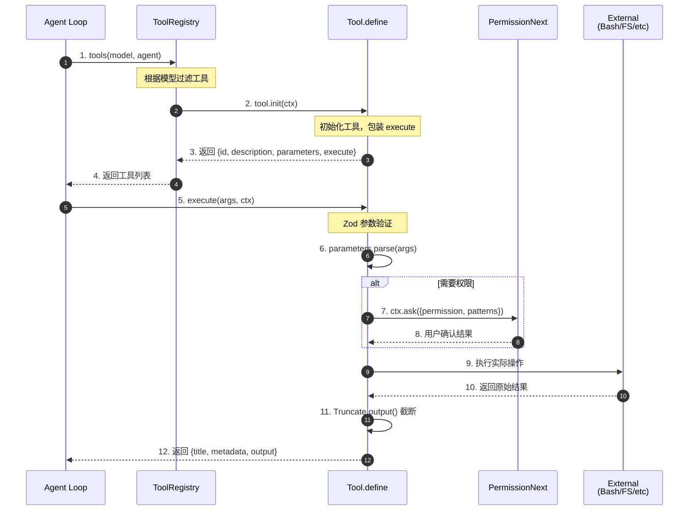
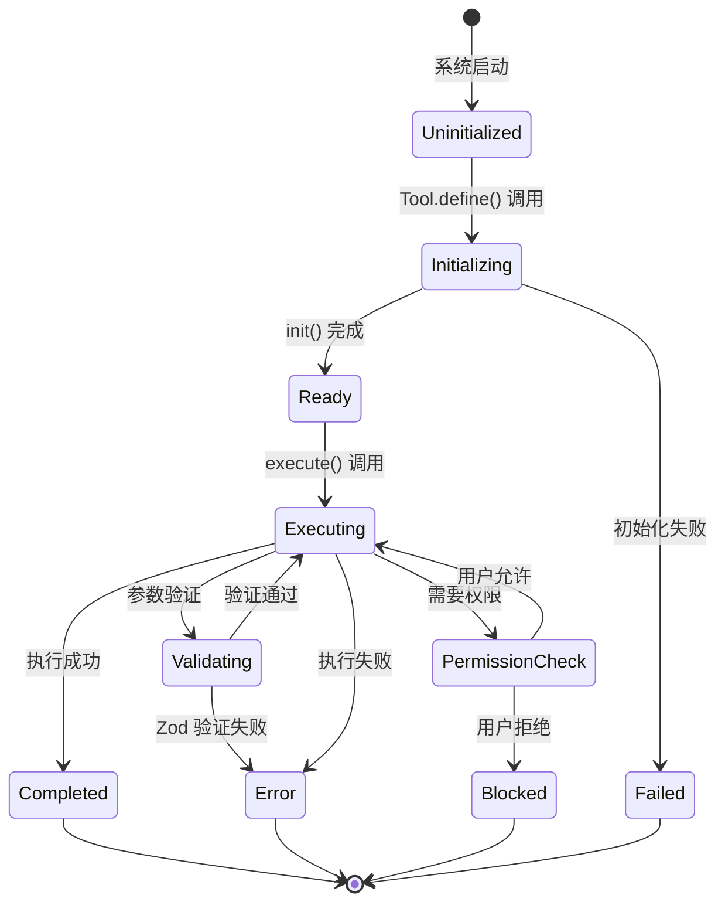
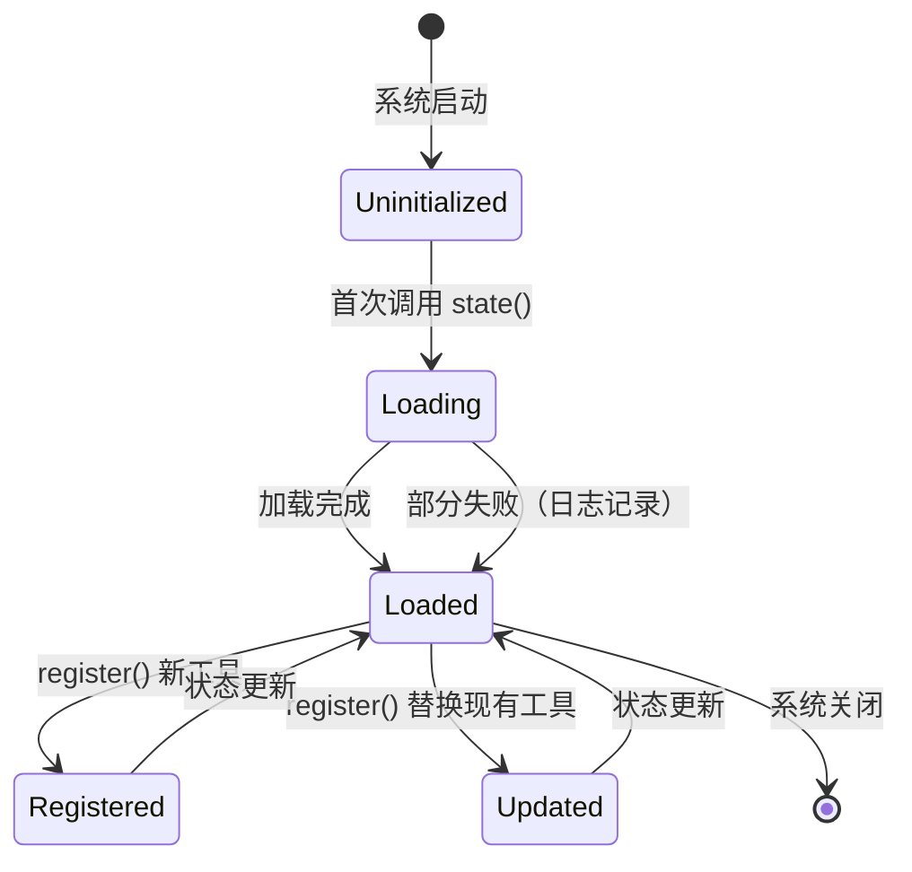
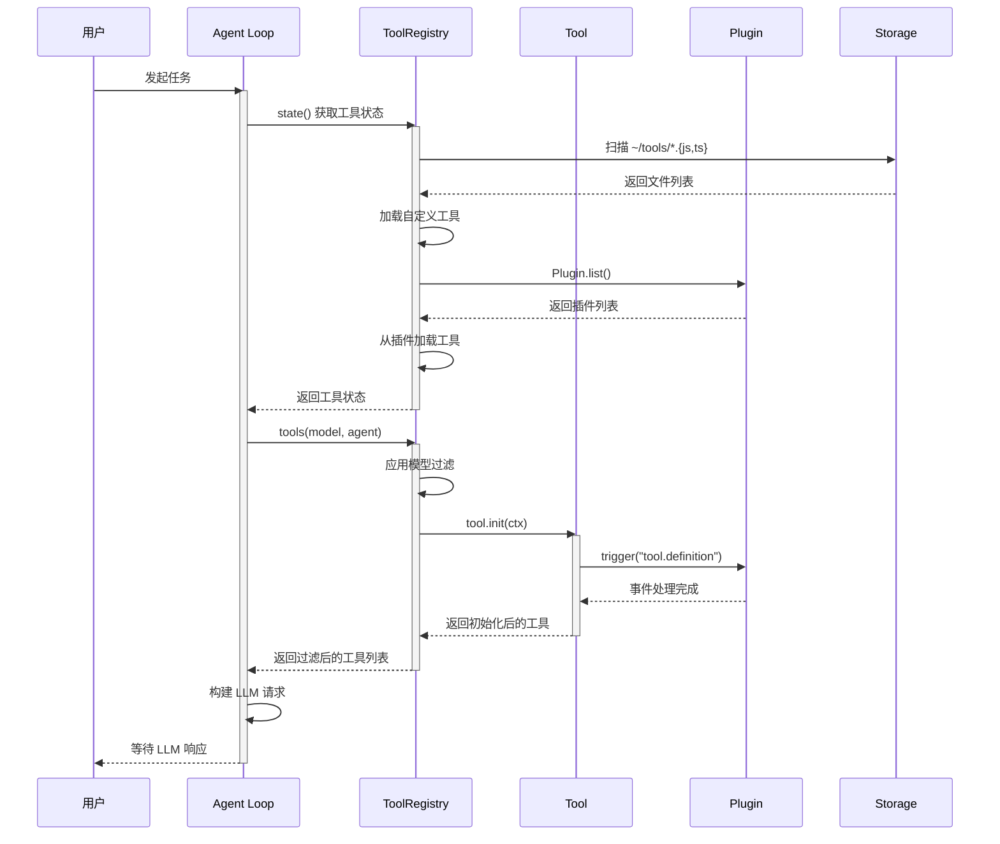
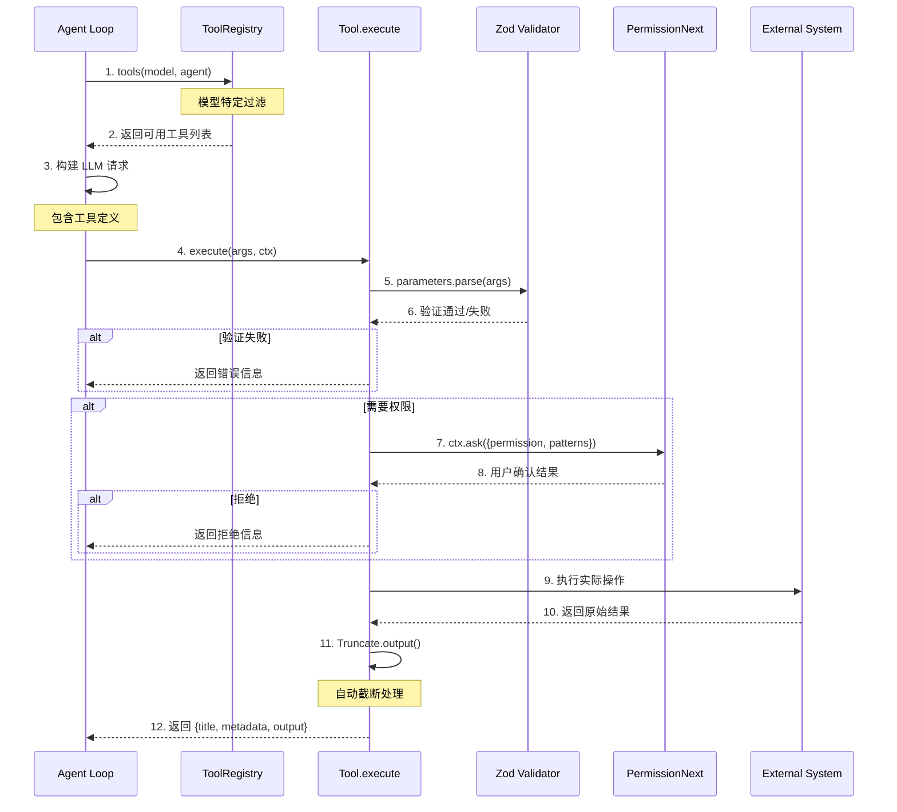
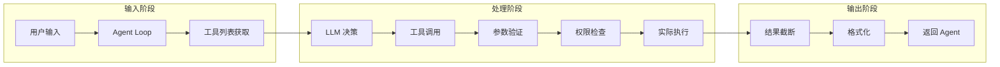
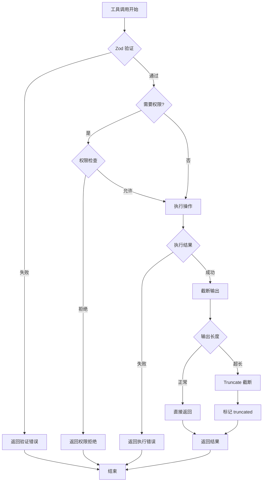
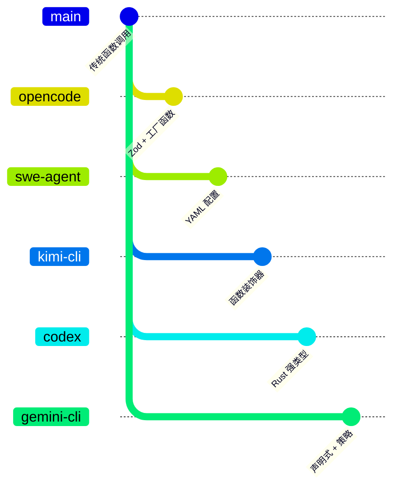

# Tool System（opencode）

> **阅读指南**
>
> | 属性 | 说明 |
> |-----|------|
> | 预计阅读 | 20-30 分钟 |
> | 前置文档 | `01-opencode-overview.md`、`04-opencode-agent-loop.md` |
> | 文档结构 | 速览 → 架构 → 机制 → 实现 → 对比 |
> | 代码呈现 | 关键代码直接展示，完整代码可折叠查看 |

---

## TL;DR（结论先行）

一句话定义：OpenCode 的工具系统是「**Zod Schema 类型安全 + 动态注册扩展 + 权限驱动执行**」的架构。

OpenCode 的核心取舍：**Zod Schema 运行时验证 + 工厂函数定义 + 细粒度权限控制**（对比 SWE-agent 的 YAML 配置、Kimi CLI 的函数装饰器）

### 核心要点速览

| 维度 | 关键决策 | 代码位置 |
|-----|---------|---------|
| 工具定义 | Zod Schema + 工厂函数封装 | `packages/opencode/src/tool/tool.ts:109` |
| 动态注册 | 文件系统扫描 + 插件系统 | `packages/opencode/src/tool/registry.ts:223` |
| 权限控制 | 细粒度 ctx.ask() 接口 | `packages/opencode/src/tool/tool.ts:101` |
| 输出管理 | Truncate.output 自动截断 | `packages/opencode/src/tool/tool.ts:137` |
| 模型适配 | 运行时过滤（GPT/usePatch） | `packages/opencode/src/tool/registry.ts:305` |

---

## 1. 为什么需要这个机制？（解决什么问题）

### 1.1 问题场景

没有 Tool System：Agent 只能进行对话，无法与外部环境交互（读文件、执行命令、搜索网络），无法完成实际编程任务。

有 Tool System：
- Agent: "需要读取配置文件" → 调用 read 工具 → 获取文件内容
- Agent: "执行测试" → 调用 bash 工具 → 获得测试结果
- Agent: "搜索相关代码" → 调用 grep 工具 → 获得匹配位置
- Agent: "修改第 42 行" → 调用 edit 工具 → 成功写入

### 1.2 核心挑战

| 挑战 | 不解决的后果 |
|-----|-------------|
| 参数类型安全 | LLM 生成的工具调用参数格式错误，导致执行失败或不可预期行为 |
| 工具动态扩展 | 无法支持用户自定义工具或第三方插件，功能受限 |
| 权限控制 | 危险操作（如 `rm -rf /`）未经确认直接执行，造成安全事故 |
| 输出管理 | 工具输出过长导致上下文溢出，影响后续对话质量 |
| 模型适配 | 不同模型对工具的理解能力不同，需要针对性调整 |

---

## 2. 整体架构（ASCII 图）

### 2.1 在系统中的位置

```text
┌─────────────────────────────────────────────────────────────────────┐
│  Agent Loop / Session Runtime                                        │
│  packages/opencode/src/session/session.ts                            │
└─────────────────────────────────┬───────────────────────────────────┘
                                  │ 调用
                                  ▼
┌─────────────────────────────────────────────────────────────────────┐
│ ▓▓▓ Tool System ▓▓▓                                                 │
│ packages/opencode/src/tool/                                          │
│ - tool.ts        : Tool.define() 工厂函数                           │
│ - registry.ts    : ToolRegistry 动态注册                            │
│ - bash.ts        : BashTool 示例实现                                │
└─────────────────────────────────┬───────────────────────────────────┘
                                  │ 依赖/调用
                    ┌─────────────┼─────────────┐
                    ▼             ▼             ▼
┌───────────────────────┐ ┌──────────────┐ ┌──────────────┐
│ Zod Schema            │ │ Permission   │ │ Plugin       │
│ 参数验证              │ │ Next 权限系统 │ │ 插件系统      │
│ packages/opencode/    │ │ packages/    │ │ packages/    │
│ src/tool/tool.ts      │ │ opencode/    │ │ opencode/    │
│                       │ │ src/permission│ │ src/plugin/  │
└───────────────────────┘ └──────────────┘ └──────────────┘
```

### 2.2 核心组件职责

| 组件 | 职责 | 代码位置 |
|-----|------|---------|
| `Tool.define()` | 工厂函数，创建工具定义，包装参数验证和输出截断 | `packages/opencode/src/tool/tool.ts:109` |
| `ToolRegistry` | 管理工具生命周期，支持动态注册和自定义工具加载 | `packages/opencode/src/tool/registry.ts:14` |
| `ToolRegistry.state()` | 初始化状态，从文件系统和插件加载自定义工具 | `packages/opencode/src/tool/registry.ts:223` |
| `ToolRegistry.tools()` | 根据模型过滤并初始化工具列表 | `packages/opencode/src/tool/registry.ts:300` |
| `Tool.Context.ask()` | 细粒度权限请求接口 | `packages/opencode/src/tool/tool.ts:101` |

### 2.3 核心组件交互关系



**关键交互说明**：

| 步骤 | 交互内容 | 设计意图 |
|-----|---------|---------|
| 1-4 | Agent Loop 获取工具列表 | 解耦工具管理与执行，支持模型特定过滤 |
| 5-6 | 执行前参数验证 | Zod Schema 保证运行时类型安全 |
| 7-8 | 权限请求流程 | 细粒度控制，操作前用户确认 |
| 9-10 | 实际执行 | 职责分离，工具专注业务逻辑 |
| 11-12 | 输出截断 | 防止上下文溢出，自动管理输出长度 |

---

## 3. 核心组件详细分析

### 3.1 Tool.define 工厂函数

#### 职责定位

`Tool.define` 是工具定义的入口，提供统一的工厂函数封装，内置参数验证和输出截断能力。

#### 状态机图



**状态说明**：

| 状态 | 说明 | 进入条件 | 退出条件 |
|-----|------|---------|---------|
| Uninitialized | 未初始化 | 系统启动 | 调用 Tool.define() |
| Initializing | 初始化中 | 开始执行 init 函数 | init 完成或失败 |
| Ready | 就绪状态 | init 成功返回 | execute 被调用 |
| Executing | 执行中 | execute 被调用 | 验证/权限/完成/错误 |
| Validating | 参数验证 | 执行前自动验证 | 验证通过或失败 |
| PermissionCheck | 权限检查 | 需要用户确认 | 用户允许或拒绝 |
| Completed | 完成 | 执行成功 | 自动终止 |
| Error | 错误 | 验证或执行失败 | 自动终止 |
| Blocked | 被阻止 | 用户拒绝权限 | 自动终止 |

#### 内部数据流

```text
┌─────────────────────────────────────────────────────────────┐
│  输入层                                                      │
│  ├── 工具 ID (string)                                       │
│  ├── init 函数/对象 (定义 description, parameters, execute) │
│  └── 用户调用参数 (args)                                     │
└──────────────────────────┬──────────────────────────────────┘
                           ▼
┌─────────────────────────────────────────────────────────────┐
│  处理层                                                      │
│  ├── 参数验证: Zod Schema parse                             │
│  │   └── 失败时调用 formatValidationError 或抛出异常         │
│  ├── 执行逻辑: 调用原始 execute 函数                         │
│  └── 输出处理: Truncate.output 自动截断                      │
│      └── 支持工具自定义截断 (truncated !== undefined)        │
└──────────────────────────┬──────────────────────────────────┘
                           ▼
┌─────────────────────────────────────────────────────────────┐
│  输出层                                                      │
│  ├── title: 操作标题                                         │
│  ├── metadata: 包含 truncated 等元数据                       │
│  ├── output: 截断后的输出内容                                │
│  └── attachments: 可选附件                                   │
└─────────────────────────────────────────────────────────────┘
```

#### 关键接口

| 接口 | 输入 | 输出 | 说明 | 代码位置 |
|-----|------|------|------|---------|
| `define(id, init)` | 工具ID, 初始化函数 | Tool.Info 对象 | 工厂函数，创建工具定义 | `packages/opencode/src/tool/tool.ts:109` |
| `init(ctx)` | InitContext | 工具配置对象 | 初始化时调用，返回工具元数据 | `packages/opencode/src/tool/tool.ts:78` |
| `execute(args, ctx)` | 参数, Context | 执行结果 | 实际执行逻辑，包装后自动验证 | `packages/opencode/src/tool/tool.ts:81` |

---

### 3.2 ToolRegistry 注册中心

#### 职责定位

ToolRegistry 负责工具的生命周期管理，包括自定义工具加载、动态注册和模型特定过滤。

#### 状态机图



**状态说明**：

| 状态 | 说明 | 进入条件 | 退出条件 |
|-----|------|---------|---------|
| Uninitialized | 未初始化 | 系统启动 | 首次调用 state() |
| Loading | 加载中 | 开始加载自定义工具和插件 | 加载完成或失败 |
| Loaded | 已加载 | 工具列表可用 | 系统关闭或重新加载 |
| Registered | 新工具注册 | 调用 register() 新增 | 状态更新完成 |
| Updated | 工具更新 | 调用 register() 替换 | 状态更新完成 |

#### 关键算法逻辑

```mermaid
flowchart TD
    A[tools(model, agent)] --> B{模型过滤}

    B -->|codesearch/websearch| C{opencode provider?}
    C -->|是| D[保留工具]
    C -->|否| E{ENABLE_EXA flag?}
    E -->|是| D
    E -->|否| F[过滤掉]

    B -->|GPT 模型| G{usePatch?}
    G -->|是| H[保留 apply_patch]
    G -->|是| I[过滤 edit/write]
    G -->|否| J[过滤 apply_patch]
    G -->|否| K[保留 edit/write]

    B -->|其他工具| L[保留]

    D --> M[初始化工具]
    F --> M
    H --> M
    I --> M
    J --> M
    K --> M
    L --> M

    M --> N[触发 tool.definition 事件]
    N --> O[返回工具列表]
```

**算法要点**：

1. **特殊工具权限控制**：codesearch/websearch 需要特定 provider 或 flag
2. **GPT 模型适配**：GPT 系列（除 GPT-4）使用 apply_patch 替代 edit/write
3. **插件事件钩子**：工具初始化后触发事件，支持扩展修改

---

### 3.3 组件间协作时序



**协作要点**：

1. **Agent Loop 与 ToolRegistry**：通过 state() 和 tools() 两个接口协作，分离状态管理和工具获取
2. **ToolRegistry 与 Plugin**：插件系统提供额外的工具来源，支持第三方扩展
3. **Tool 初始化事件**：tool.definition 事件允许插件修改工具定义，增强可扩展性

---

## 4. 端到端数据流转

### 4.1 正常流程（详细版）



**数据变换详情**：

| 阶段 | 输入 | 处理 | 输出 | 代码位置 |
|-----|------|------|------|---------|
| 工具获取 | model, agent | 模型过滤 + 初始化 | Tool 列表 | `packages/opencode/src/tool/registry.ts:300` |
| 参数验证 | 原始 args | Zod Schema parse | 验证后的数据 | `packages/opencode/src/tool/tool.ts:122` |
| 权限请求 | permission, patterns | 用户确认 | 允许/拒绝 | `packages/opencode/src/tool/tool.ts:101` |
| 输出截断 | 原始输出 | Truncate.output | 截断后的内容 | `packages/opencode/src/tool/tool.ts:137` |

### 4.2 数据流向图



### 4.3 异常/边界流程



---

## 5. 关键代码实现

### 5.1 核心数据结构

```typescript
// packages/opencode/src/tool/tool.ts:76-103
namespace Tool {
  export interface Info<Parameters extends z.ZodType = z.ZodType, M extends Metadata = Metadata> {
    id: string;
    init: (ctx?: InitContext) => Promise<{
      description: string;
      parameters: Parameters;
      execute(
        args: z.infer<Parameters>,
        ctx: Context,
      ): Promise<{
        title: string;
        metadata: M;
        output: string;
        attachments?: ...;
      }>;
    }>;
  }

  export type Context<M extends Metadata = Metadata> = {
    sessionID: string;
    messageID: string;
    agent: string;
    abort: AbortSignal;
    callID?: string;
    messages: MessageV2.WithParts[];
    metadata(input: { title?: string; metadata?: M }): void;
    ask(input: Omit<PermissionNext.Request, "id" | "sessionID" | "tool">): Promise<void>;
  };
}
```

**字段说明**：

| 字段 | 类型 | 用途 |
|-----|------|------|
| `id` | `string` | 工具唯一标识 |
| `init` | `function` | 初始化函数，返回工具元数据和执行函数 |
| `description` | `string` | 工具功能描述，传递给 LLM |
| `parameters` | `z.ZodType` | Zod Schema，定义参数结构 |
| `execute` | `function` | 实际执行逻辑 |
| `ctx.ask` | `function` | 权限请求接口 |
| `ctx.abort` | `AbortSignal` | 取消信号，支持中断执行 |

### 5.2 主链路代码

```typescript
// packages/opencode/src/tool/tool.ts:109-147
export function define<Parameters extends z.ZodType, Result extends Metadata>(
  id: string,
  init: Info<Parameters, Result>["init"] | Awaited<ReturnType<Info<Parameters, Result>["init"]>>,
): Info<Parameters, Result> {
  return {
    id,
    init: async (initCtx) => {
      const toolInfo = init instanceof Function ? await init(initCtx) : init;

      // 包装 execute 函数，添加参数验证和截断
      const originalExecute = toolInfo.execute;
      toolInfo.execute = async (args, ctx) => {
        // 1. Zod 参数验证
        try {
          toolInfo.parameters.parse(args);
        } catch (error) {
          if (error instanceof z.ZodError && toolInfo.formatValidationError) {
            throw new Error(toolInfo.formatValidationError(error), { cause: error });
          }
          throw new Error(`The ${id} tool was called with invalid arguments: ${error}`);
        }

        // 2. 执行工具
        const result = await originalExecute(args, ctx);

        // 3. 自动截断输出
        if (result.metadata.truncated !== undefined) {
          return result;  // 工具自己处理截断
        }
        const truncated = await Truncate.output(result.output, {}, initCtx?.agent);
        return {
          ...result,
          output: truncated.content,
          metadata: { ...result.metadata, truncated: truncated.truncated },
        };
      };
      return toolInfo;
    },
  };
}
```

**代码要点**：

1. **工厂函数封装**：`Tool.define` 提供统一的工具定义 API，隐藏内部复杂性
2. **自动参数验证**：使用 Zod Schema 在运行时验证 LLM 生成的参数
3. **透明输出截断**：自动处理输出长度，防止上下文溢出，同时允许工具自定义截断逻辑

### 5.3 关键调用链

```text
Agent Loop
  -> ToolRegistry.tools(model, agent)     [packages/opencode/src/tool/registry.ts:300]
    -> all()                               [packages/opencode/src/tool/registry.ts:267]
      -> state()                           [packages/opencode/src/tool/registry.ts:223]
        -> 加载 ~/tools/*.{js,ts}          [packages/opencode/src/tool/registry.ts:227]
        -> Plugin.list()                   [packages/opencode/src/tool/registry.ts:241]
    -> 模型过滤逻辑                        [packages/opencode/src/tool/registry.ts:305]
    -> tool.init({ agent })                [packages/opencode/src/tool/registry.ts:322]
      -> Plugin.trigger("tool.definition") [packages/opencode/src/tool/registry.ts:323]

Tool Execution
  -> Tool.execute(args, ctx)               [packages/opencode/src/tool/tool.ts:119]
    -> parameters.parse(args)              [packages/opencode/src/tool/tool.ts:122]
    -> ctx.ask({ permission })             [packages/opencode/src/tool/tool.ts:101]
    -> 实际业务逻辑                        [具体工具实现]
    -> Truncate.output()                   [packages/opencode/src/tool/tool.ts:137]
```

---

## 6. 设计意图与 Trade-off

### 6.1 OpenCode 的选择

| 维度 | OpenCode 的选择 | 替代方案 | 取舍分析 |
|-----|-----------------|---------|---------|
| 工具定义方式 | Zod Schema + 工厂函数 | YAML 配置 (SWE-agent) | 类型安全，IDE 支持好，但需要学习 Zod API |
| 动态扩展 | 文件系统扫描 + 插件系统 | 纯代码注册 (Codex) | 用户可自定义，灵活度高，但启动时需要扫描文件 |
| 权限控制 | 细粒度 ctx.ask() | 预定义权限级别 (Kimi) | 精确控制每个操作，但实现复杂度高 |
| 输出管理 | 自动截断 | 手动截断或无截断 | 防止上下文溢出，但可能丢失信息 |
| 模型适配 | 运行时过滤 | 静态配置 | 灵活适配不同模型，但增加运行时开销 |

### 6.2 为什么这样设计？

**核心问题**：如何在保证类型安全的同时，支持灵活的工具扩展和细粒度的权限控制？

**OpenCode 的解决方案**：

- 代码依据：`packages/opencode/src/tool/tool.ts:109`
- 设计意图：通过 Zod Schema 实现运行时类型验证，工厂函数封装通用逻辑（验证、截断），同时保留工具自定义能力
- 带来的好处：
  - 类型安全：LLM 生成的参数在执行前经过验证
  - 开发体验：TypeScript + Zod 提供良好的 IDE 支持
  - 可扩展性：文件系统扫描和插件系统支持动态扩展
  - 安全性：细粒度权限控制，操作前用户确认
- 付出的代价：
  - 学习成本：需要了解 Zod Schema 语法
  - 启动开销：每次启动需要扫描文件系统加载自定义工具
  - 复杂度：细粒度权限系统实现复杂

### 6.3 与其他项目的对比



| 项目 | 核心差异 | 适用场景 |
|-----|---------|---------|
| OpenCode | Zod Schema 运行时验证 + TypeScript 类型 | 需要类型安全和动态扩展的场景 |
| SWE-agent | YAML 配置 + 代码生成 | 快速定义工具，无需编写代码 |
| Kimi CLI | Python 函数装饰器 + 运行时反射 | Python 生态，简洁定义 |
| Codex | Rust 强类型 + 编译时检查 | 最高性能和安全要求 |
| Gemini CLI | 声明式工具 + 权限策略 | 需要细粒度权限控制的场景 |

**详细对比**：

| 特性 | OpenCode | SWE-agent | Kimi CLI | Codex | Gemini CLI |
|-----|----------|-----------|----------|-------|------------|
| 定义方式 | Zod Schema + 工厂函数 | YAML 配置 | Python 装饰器 | Rust 类型 | 声明式定义 |
| 类型安全 | 运行时验证 | 配置解析 | 运行时反射 | 编译时检查 | 运行时验证 |
| 动态扩展 | 文件扫描 + 插件 | 配置文件热加载 | 不支持 | 不支持 | MCP 集成 |
| 权限控制 | 细粒度 ctx.ask() | 预定义级别 | 预定义级别 | 沙箱隔离 | 策略引擎 |
| 输出截断 | 自动 Truncate | 手动控制 | 手动控制 | 自动截断 | 自动截断 |
| 模型适配 | 运行时过滤 | 静态配置 | 静态配置 | 静态配置 | 运行时过滤 |

---

## 7. 边界情况与错误处理

### 7.1 终止条件

| 终止原因 | 触发条件 | 代码位置 |
|---------|---------|---------|
| 参数验证失败 | Zod Schema parse 抛出异常 | `packages/opencode/src/tool/tool.ts:122` |
| 权限被拒绝 | 用户拒绝权限请求 | `packages/opencode/src/tool/tool.ts:101` |
| 执行超时 | 工具执行超过 timeout 设置 | 具体工具实现（如 bash.ts） |
| 取消信号 | 用户主动取消（Ctrl+C） | `packages/opencode/src/tool/tool.ts:97` |
| 输出截断 | 输出超过长度限制 | `packages/opencode/src/tool/tool.ts:137` |

### 7.2 超时/资源限制

```typescript
// packages/opencode/src/tool/bash.ts:166
async execute(params, ctx) {
  const timeout = params.timeout ?? DEFAULT_TIMEOUT;  // 默认 60s

  const proc = spawn(params.command, {
    shell,
    cwd,
    timeout,  // 超时控制
    signal: ctx.abort,  // 取消信号
    // ...
  });
  // ...
}
```

### 7.3 错误恢复策略

| 错误类型 | 处理策略 | 代码位置 |
|---------|---------|---------|
| Zod 验证错误 | 返回格式化错误信息，提示参数问题 | `packages/opencode/src/tool/tool.ts:124` |
| 权限拒绝 | 返回拒绝信息，Agent 可尝试其他方案 | `packages/opencode/src/tool/tool.ts:101` |
| 执行超时 | 返回超时错误，可重试或调整参数 | 具体工具实现 |
| 文件不存在 | 返回文件错误，Agent 可创建文件 | 具体工具实现 |
| 截断标记 | 在 metadata 中标记 truncated | `packages/opencode/src/tool/tool.ts:141` |

---

## 8. 关键代码索引

| 功能 | 文件 | 行号 | 说明 |
|-----|------|------|------|
| 入口 | `packages/opencode/src/tool/tool.ts` | 109 | Tool.define 工厂函数 |
| 核心 | `packages/opencode/src/tool/tool.ts` | 76 | Tool.Info 接口定义 |
| 核心 | `packages/opencode/src/tool/tool.ts` | 93 | Tool.Context 接口定义 |
| 注册 | `packages/opencode/src/tool/registry.ts` | 14 | ToolRegistry 命名空间 |
| 注册 | `packages/opencode/src/tool/registry.ts` | 223 | state() 初始化状态 |
| 注册 | `packages/opencode/src/tool/registry.ts` | 252 | register() 动态注册 |
| 注册 | `packages/opencode/src/tool/registry.ts` | 300 | tools() 获取过滤后的工具列表 |
| 示例 | `packages/opencode/src/tool/bash.ts` | 154 | BashTool 工具定义示例 |
| 权限 | `packages/opencode/src/tool/tool.ts` | 101 | ctx.ask() 权限请求接口 |
| 截断 | `packages/opencode/src/tool/tool.ts` | 137 | Truncate.output 自动截断 |
| 插件 | `packages/opencode/src/tool/registry.ts` | 241 | 从插件加载工具 |
| 插件 | `packages/opencode/src/tool/registry.ts` | 323 | tool.definition 事件触发 |

---

## 9. 延伸阅读

- 前置知识：`docs/opencode/04-opencode-agent-loop.md` - Agent Loop 如何驱动工具调用
- 相关机制：`docs/opencode/06-opencode-mcp-integration.md` - MCP 集成扩展工具能力
- 相关机制：`docs/opencode/10-opencode-safety-control.md` - 权限与安全控制详解
- 深度分析：`docs/comm/comm-tools-system.md` - 跨项目工具系统对比
- 对比项目：`docs/swe-agent/05-swe-agent-tools-system.md` - SWE-agent YAML 配置方案
- 对比项目：`docs/kimi-cli/05-kimi-cli-tools-system.md` - Kimi CLI 函数装饰器方案

---

*✅ Verified: 基于 opencode/packages/opencode/src/tool/*.ts 源码分析*
*基于版本：2026-02-08 | 最后更新：2026-02-25*
