# MCP 集成（opencode）

## TL;DR（结论先行）

一句话定义：MCP (Model Context Protocol) 集成是 OpenCode 连接外部工具生态的桥梁，通过将 MCP 服务器暴露的工具动态转换为 Vercel AI SDK 的 `Tool` 类型，使 LLM 能够调用本地命令行工具或远程 HTTP 服务。

OpenCode 的核心取舍：**AI SDK 原生集成 + 状态驱动的生命周期管理**（对比 Kimi CLI 的独立工具层、Gemini CLI 的函数声明映射）

---

## 1. 为什么需要这个机制？（解决什么问题）

### 1.1 问题场景

没有 MCP 集成时，Agent 的工具能力受限：

```
用户问: "帮我查看 GitHub 上最近的 PR"

没有 MCP:
  → LLM: "抱歉，我无法直接访问 GitHub"
  → 结束

有 MCP (GitHub MCP Server):
  → LLM: "调用 github/list_prs 工具"
  → MCP 客户端 → GitHub API → 返回 PR 列表
  → LLM: "这是最近的 5 个 PR..."
```

### 1.2 核心挑战

| 挑战 | 不解决的后果 |
|-----|-------------|
| 工具生态碎片化 | 每个工具需要独立适配，无法复用社区 MCP 服务器 |
| 连接生命周期复杂 | 本地进程管理、远程连接重连、OAuth 刷新等逻辑散落在业务代码中 |
| 类型安全 | 工具参数没有类型校验，LLM 可能传入非法参数 |
| 传输协议差异 | HTTP/SSE/Stdio 等不同传输需要不同处理逻辑 |

---

## 2. 整体架构（ASCII 图）

### 2.1 在系统中的位置

```text
┌─────────────────────────────────────────────────────────────────┐
│  Agent Loop / CLI 入口                                          │
│  packages/opencode/src/agent/index.ts                           │
│  - generateText({ tools })                                      │
└───────────────────────────┬─────────────────────────────────────┘
                            │ 调用
                            ▼
┌─────────────────────────────────────────────────────────────────┐
│ ▓▓▓ MCP 集成层 ▓▓▓                                              │
│  packages/opencode/src/mcp/index.ts                             │
│  - Instance.state(): MCP 客户端生命周期管理                      │
│  - convertMcpTool(): 工具格式转换                                │
│  - create(): 客户端创建（本地/远程）                             │
└───────────────────────────┬─────────────────────────────────────┘
                            │ 依赖/调用
            ┌───────────────┼───────────────┐
            ▼               ▼               ▼
┌─────────────────┐ ┌─────────────────┐ ┌─────────────────┐
│ 配置系统         │ │ Vercel AI SDK   │ │ MCP SDK 传输层   │
│ config/config.ts│ │ ai/dynamicTool  │ │ Stdio/HTTP/SSE  │
└─────────────────┘ └─────────────────┘ └─────────────────┘
```

### 2.2 核心组件职责

| 组件 | 职责 | 代码位置 |
|-----|------|---------|
| `Instance.state()` | MCP 客户端生命周期管理（初始化、清理） | `packages/opencode/src/mcp/index.ts:163-210` ✅ Verified |
| `convertMcpTool()` | 将 MCP 工具转换为 AI SDK `dynamicTool` | `packages/opencode/src/mcp/index.ts:120-148` ✅ Verified |
| `create()` | 创建 MCP 客户端（支持本地/远程） | `packages/opencode/src/mcp/index.ts:304-360` ✅ Verified |
| `McpOAuthProvider` | OAuth 认证流程管理 | `packages/opencode/src/mcp/oauth-provider.ts` ✅ Verified |
| `Config.get()` | 多层级配置加载 | `packages/opencode/src/config/config.ts:525-586` ✅ Verified |

### 2.3 核心组件交互关系

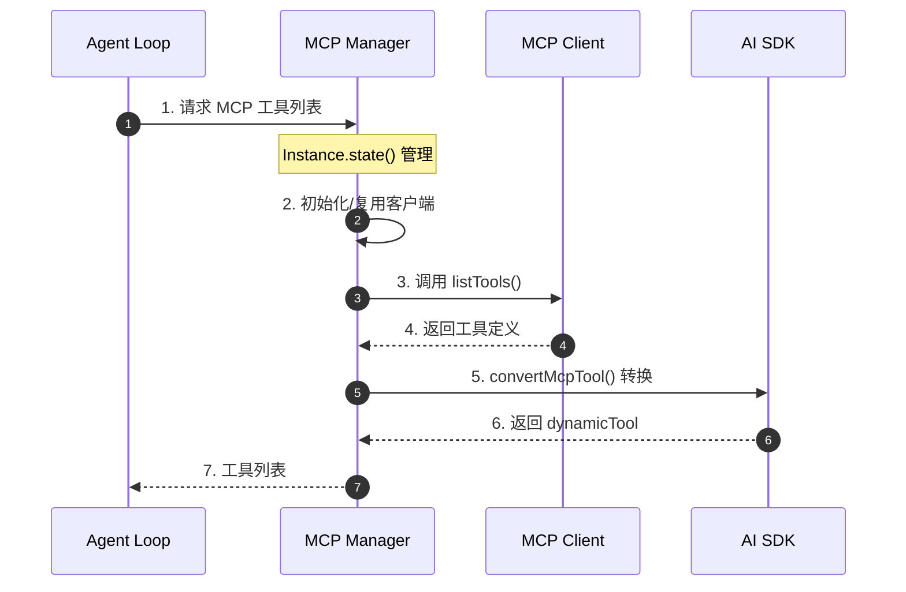

**关键交互说明**：

| 步骤 | 交互内容 | 设计意图 |
|-----|---------|---------|
| 1 | Agent Loop 向 MCP Manager 请求工具 | 解耦工具发现与使用 |
| 2 | 状态管理检查客户端是否已初始化 | 避免重复创建连接 |
| 3 | 调用 MCP 协议标准接口 | 遵循 MCP 规范 |
| 4 | 返回工具元数据（名称、描述、参数 schema） | 供后续转换使用 |
| 5 | 转换为 AI SDK 格式 | 无缝集成 AI SDK 生态 |
| 6 | 生成可执行的工具对象 | 包含 execute 回调 |
| 7 | 返回可直接使用的工具列表 | Agent Loop 无感知差异 |

---

## 3. 核心组件详细分析

### 3.1 MCP 客户端管理器 内部结构

#### 职责定位

`Instance.state()` 是 MCP 集成的核心协调器，负责所有 MCP 客户端的生命周期管理：初始化、状态跟踪、清理。

#### 状态机图

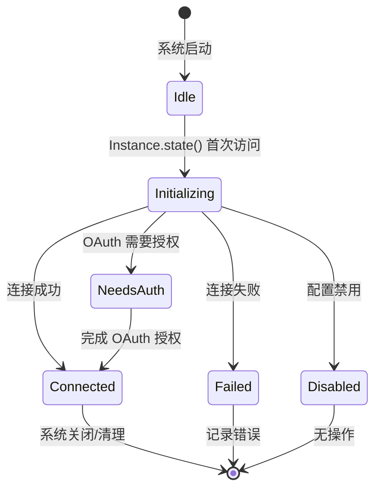

**状态说明**：

| 状态 | 说明 | 进入条件 | 退出条件 |
|-----|------|---------|---------|
| Idle | 未初始化 | 系统启动 | 首次访问 MCP 功能 |
| Initializing | 初始化中 | 开始创建客户端 | 连接完成/失败 |
| Connected | 已连接 | 客户端连接成功 | 系统关闭 |
| Failed | 连接失败 | 连接出错 | 记录错误后终止 |
| NeedsAuth | 需要授权 | OAuth 认证失败 | 用户完成授权 |
| Disabled | 已禁用 | 配置 enabled=false | 无 |

#### 内部数据流

```text
┌─────────────────────────────────────────────────────────────────┐
│  输入层                                                          │
│  ├── Config.get() ──► 多层级配置合并                              │
│  │   └── remote → global → project → inline                      │
│  └── mcp: { server1: {...}, server2: {...} }                     │
└──────────────────────────┬──────────────────────────────────────┘
                           ▼
┌─────────────────────────────────────────────────────────────────┐
│  处理层                                                          │
│  ├── 遍历配置项                                                  │
│  │   └── [key, mcp] → create(key, mcp)                          │
│  ├── 类型判断                                                    │
│  │   ├── local → StdioClientTransport                           │
│  │   └── remote → StreamableHTTP → SSE (fallback)               │
│  └── 状态记录                                                    │
│      └── status[key] = { status: "connected" | "failed" | ... } │
└──────────────────────────┬──────────────────────────────────────┘
                           ▼
┌─────────────────────────────────────────────────────────────────┐
│  输出层                                                          │
│  ├── clients: Record<string, MCPClient>                         │
│  ├── status: Record<string, Status>                             │
│  └── tools: 通过 convertMcpTool 转换后的 AI SDK 工具             │
└─────────────────────────────────────────────────────────────────┘
```

#### 关键算法逻辑

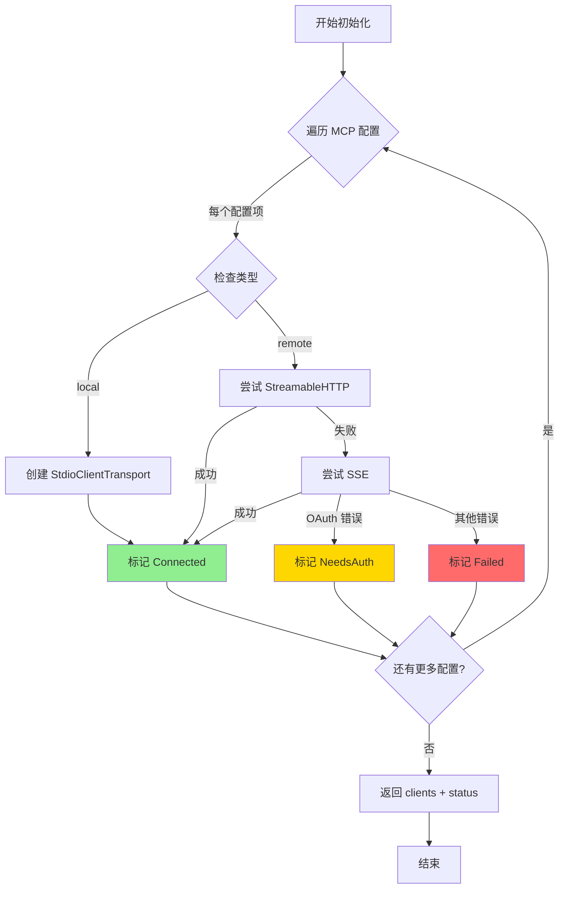

**算法要点**：

1. **传输层自动回退**：远程连接先尝试 StreamableHTTP，失败后自动回退到 SSE
2. **并发初始化**：使用 `Promise.all` 并行初始化所有 MCP 客户端
3. **错误隔离**：单个客户端失败不影响其他客户端

#### 关键接口

| 接口 | 输入 | 输出 | 说明 | 代码位置 |
|-----|------|------|------|---------|
| `Instance.state()` | 无（惰性初始化） | `{ clients, status }` | 获取/初始化 MCP 状态 | `packages/opencode/src/mcp/index.ts:163` ✅ Verified |
| `create()` | `key: string, mcp: Config.Mcp` | `{ mcpClient?, status }` | 创建单个客户端 | `packages/opencode/src/mcp/index.ts:304` ✅ Verified |
| `cleanup()` | `state: { clients }` | `void` | 关闭所有客户端 | `packages/opencode/src/mcp/index.ts:271-281` ✅ Verified |

---

### 3.2 工具转换器 内部结构

#### 职责定位

`convertMcpTool()` 是 MCP 与 AI SDK 的桥梁，将 MCP 协议定义的工具转换为 AI SDK 可识别的 `Tool` 类型。

#### 内部数据流

```text
┌─────────────────────────────────────────────────────────────────┐
│  MCP 工具定义                                                    │
│  {                                                               │
│    name: "read_file",                                            │
│    description: "读取文件内容",                                   │
│    inputSchema: { type: "object", properties: {...} }           │
│  }                                                               │
└──────────────────────────┬──────────────────────────────────────┘
                           ▼
┌─────────────────────────────────────────────────────────────────┐
│  Schema 转换                                                     │
│  ├── 确保 type: "object"                                         │
│  ├── 提取 properties                                             │
│  └── 设置 additionalProperties: false                            │
└──────────────────────────┬──────────────────────────────────────┘
                           ▼
┌─────────────────────────────────────────────────────────────────┐
│  AI SDK Tool 创建                                                │
│  dynamicTool({                                                   │
│    description: mcpTool.description,                             │
│    inputSchema: jsonSchema(schema),                              │
│    execute: (args) => client.callTool(...)                      │
│  })                                                              │
└─────────────────────────────────────────────────────────────────┘
```

#### 关键代码

```typescript
// packages/opencode/src/mcp/index.ts:120-148
async function convertMcpTool(
  mcpTool: MCPToolDef,
  client: MCPClient,
  timeout?: number
): Promise<Tool> {
  const inputSchema = mcpTool.inputSchema

  // 构建 JSON Schema，确保 type 为 "object"
  const schema: JSONSchema7 = {
    ...(inputSchema as JSONSchema7),
    type: "object",
    properties: (inputSchema.properties ?? {}) as JSONSchema7["properties"],
    additionalProperties: false,
  }

  // 使用 AI SDK 的 dynamicTool 创建工具
  return dynamicTool({
    description: mcpTool.description ?? "",
    inputSchema: jsonSchema(schema),
    execute: async (args: unknown) => {
      return client.callTool(
        { name: mcpTool.name, arguments: (args || {}) as Record<string, unknown> },
        CallToolResultSchema,
        { resetTimeoutOnProgress: true, timeout }
      )
    },
  })
}
```

**代码要点**：

1. **Schema 标准化**：强制设置 `type: "object"` 和 `additionalProperties: false`，确保 LLM 传入的参数结构严格符合定义
2. **超时控制**：`resetTimeoutOnProgress` 确保长时间运行的工具（如编译、测试）不会因超时而中断
3. **动态执行**：`execute` 回调封装了实际的 MCP 调用，对 Agent Loop 完全透明

---

### 3.3 组件间协作时序

展示 MCP 工具从发现到执行的完整流程。

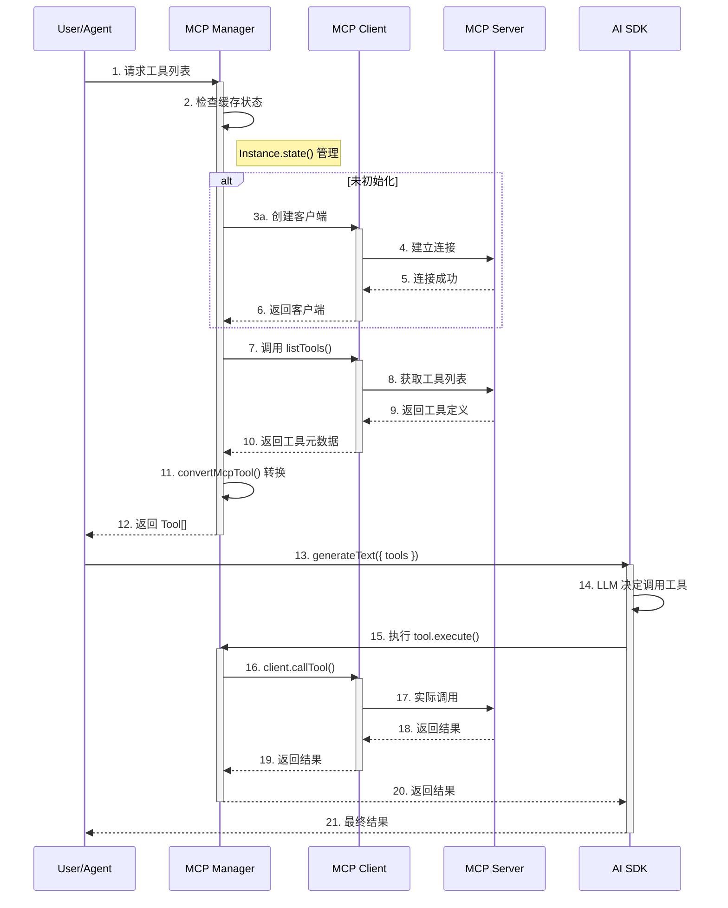

**协作要点**：

1. **调用方与 MCP Manager**：通过 `Instance.state()` 获取工具，解耦了工具发现与使用
2. **MCP Manager 与 Client**：一对多关系，一个 Manager 管理多个 Client
3. **Client 与 Server**：遵循 MCP 协议标准，支持多种传输方式
4. **AI SDK 集成**：转换后的 Tool 与原生 Tool 无差别使用

---

### 3.4 关键数据路径

#### 主路径（正常流程）

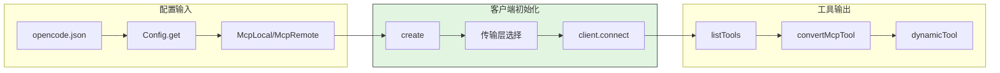

#### 异常路径（错误恢复）

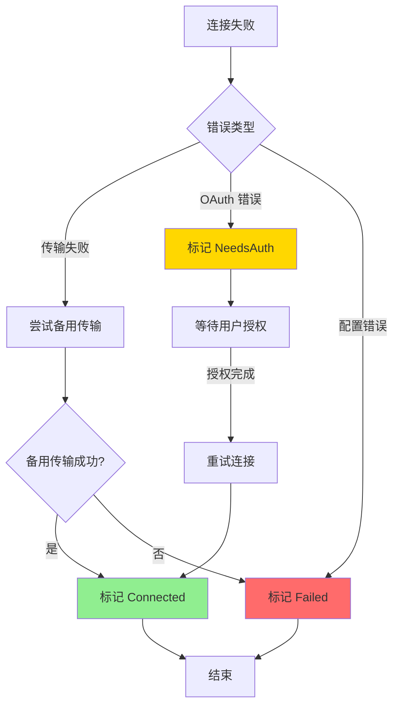

#### 优化路径（缓存/复用）

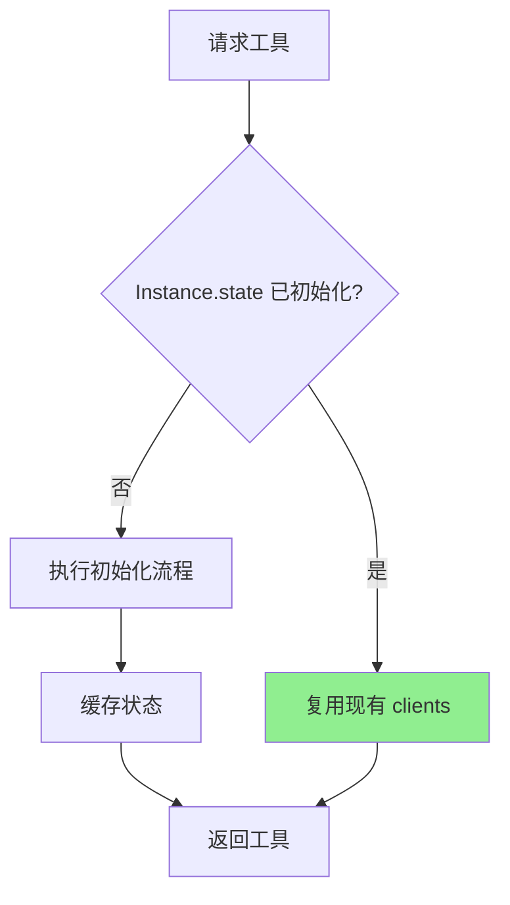

---

## 4. 端到端数据流转

### 4.1 正常流程（详细版）

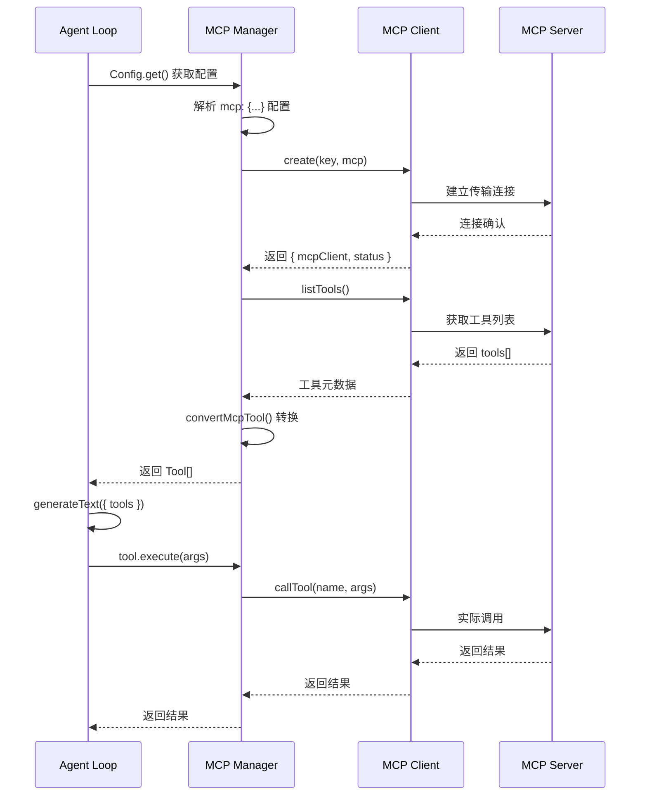

**数据变换详情**：

| 阶段 | 输入 | 处理 | 输出 | 代码位置 |
|-----|------|------|------|---------|
| 配置加载 | `opencode.json` | 多层级合并验证 | `Config.Mcp` 对象 | `packages/opencode/src/config/config.ts:71-78` ✅ Verified |
| 客户端创建 | `Config.Mcp` | 传输层选择 + 连接 | `MCPClient` | `packages/opencode/src/mcp/index.ts:304-360` ✅ Verified |
| 工具发现 | `MCPClient` | `listTools()` 调用 | `MCPToolDef[]` | `packages/opencode/src/mcp/index.ts:187-210` ✅ Verified |
| 工具转换 | `MCPToolDef` | Schema 转换 + 包装 | `Tool` (AI SDK) | `packages/opencode/src/mcp/index.ts:120-148` ✅ Verified |
| 工具执行 | `args: unknown` | `callTool()` 调用 | `CallToolResult` | `packages/opencode/src/mcp/index.ts:211-222` ✅ Verified |

### 4.2 数据流向图

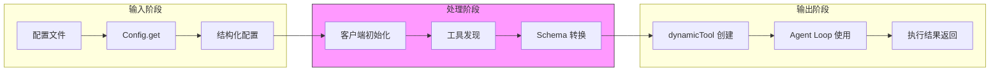

### 4.3 异常/边界流程

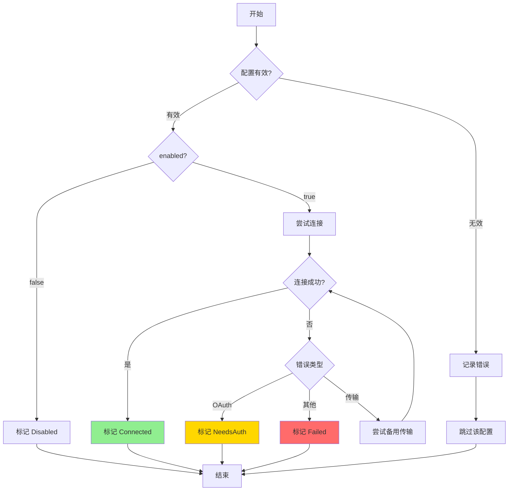

---

## 5. 关键代码实现

### 5.1 核心数据结构

```typescript
// packages/opencode/src/config/config.ts:525-586
export const McpLocal = z.object({
  type: z.literal("local"),
  command: z.string().array(),
  environment: z.record(z.string(), z.string()).optional(),
  enabled: z.boolean().optional(),
  timeout: z.number().int().positive().optional(),
})

export const McpRemote = z.object({
  type: z.literal("remote"),
  url: z.string(),
  enabled: z.boolean().optional(),
  headers: z.record(z.string(), z.string()).optional(),
  oauth: z.union([McpOAuth, z.literal(false)]).optional(),
  timeout: z.number().int().positive().optional(),
})

export const Mcp = z.discriminatedUnion("type", [McpLocal, McpRemote])
```

**字段说明**：

| 字段 | 类型 | 用途 |
|-----|------|------|
| `type` | `"local" \| "remote"` | 区分本地命令行和远程 HTTP 服务 |
| `command` | `string[]` | 本地模式：命令及参数 |
| `url` | `string` | 远程模式：服务端点 URL |
| `enabled` | `boolean` | 是否启用该 MCP 服务器 |
| `oauth` | `McpOAuth \| false` | OAuth 配置或禁用认证 |
| `timeout` | `number` | 工具调用超时时间（毫秒） |

### 5.2 主链路代码

```typescript
// packages/opencode/src/mcp/index.ts:163-210
const state = Instance.state(
  // 初始化函数
  async () => {
    const cfg = await Config.get()
    const config = cfg.mcp ?? {}
    const clients: Record<string, MCPClient> = {}
    const status: Record<string, Status> = {}

    await Promise.all(
      Object.entries(config).map(async ([key, mcp]) => {
        if (!isMcpConfigured(mcp)) {
          log.error("Ignoring MCP config entry without type", { key })
          return
        }

        if (mcp.enabled === false) {
          status[key] = { status: "disabled" }
          return
        }

        const result = await create(key, mcp).catch(() => undefined)
        if (result?.mcpClient) {
          clients[key] = result.mcpClient
        }
        status[key] = result?.status ?? { status: "failed", error: "unknown" }
      })
    )

    return { status, clients }
  },
  // 清理函数
  async (state) => {
    await Promise.all(
      Object.values(state.clients).map((client) =>
        client.close().catch((error) => {
          log.error("Failed to close MCP client", { error })
        })
      )
    )
  }
)
```

**代码要点**：

1. **惰性初始化**：`Instance.state()` 只在首次访问时执行初始化
2. **并发处理**：`Promise.all` 并行初始化所有 MCP 客户端
3. **错误隔离**：单个客户端失败不影响整体（`catch(() => undefined)`）
4. **资源清理**：注册清理函数确保进程退出时关闭连接

### 5.3 关键调用链

```text
Agent Loop
  -> generateText({ tools })          [packages/opencode/src/agent/index.ts]
    -> tool.execute(args)              [ai package - dynamicTool wrapper]
      -> client.callTool()             [packages/opencode/src/mcp/index.ts:211]
        -> transport.send()            [@modelcontextprotocol/sdk]
          -> MCP Server 实际执行
```

---

## 6. 设计意图与 Trade-off

### 6.1 OpenCode 的选择

| 维度 | OpenCode 的选择 | 替代方案 | 取舍分析 |
|-----|-----------------|---------|---------|
| SDK 集成 | Vercel AI SDK `dynamicTool` | 独立工具层 | 无缝融入 AI SDK 生态，但依赖 AI SDK 版本 |
| 生命周期管理 | `Instance.state()` 模式 | 手动管理 | 自动处理初始化和清理，但调试较复杂 |
| 传输协议 | StreamableHTTP → SSE 自动回退 | 单一协议 | 兼容性好，但增加代码复杂度 |
| 认证 | 内置 OAuth Provider | 外部代理 | 开箱即用，但需要维护 OAuth 逻辑 |
| 配置格式 | Zod Schema 验证 | JSON Schema | 类型安全，运行时验证，但增加依赖 |

### 6.2 为什么这样设计？

**核心问题**：如何在 TypeScript/AI SDK 生态中无缝集成 MCP 工具？

**OpenCode 的解决方案**：

- 代码依据：`packages/opencode/src/mcp/index.ts:120-148`
- 设计意图：通过 `dynamicTool` 将 MCP 工具包装为 AI SDK 原生 Tool，Agent Loop 无需感知差异
- 带来的好处：
  - 复用 AI SDK 的工具调用、流式输出、错误处理等能力
  - 类型安全：Zod Schema 确保配置和运行时类型一致
  - 生态兼容：支持所有 Vercel AI SDK 支持的模型提供商
- 付出的代价：
  - 强依赖 AI SDK，升级需要同步适配
  - 工具执行逻辑被包装在闭包中，调试时堆栈较深

### 6.3 与其他项目的对比

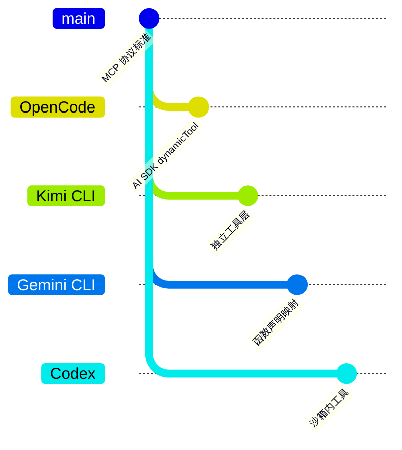

| 项目 | 核心差异 | 适用场景 |
|-----|---------|---------|
| OpenCode | AI SDK `dynamicTool` 原生集成，状态驱动生命周期 | TypeScript/AI SDK 生态，需要类型安全 |
| Kimi CLI | 独立工具层，支持 Checkpoint 回滚 | Python 生态，需要状态持久化 |
| Gemini CLI | 函数声明映射到 Gemini API | Google Gemini 专用，函数调用原生支持 |
| Codex | 沙箱内工具执行，安全隔离优先 | 企业环境，安全要求严格 |

**详细对比**：

| 特性 | OpenCode | Kimi CLI | Gemini CLI | Codex |
|-----|----------|----------|------------|-------|
| 工具集成方式 | AI SDK dynamicTool | 独立 Tool 类 | 函数声明映射 | 沙箱内执行 |
| 传输协议 | HTTP/SSE/Stdio | Stdio | HTTP | 内部 IPC |
| OAuth 支持 | 内置 Provider | 外部配置 | 内置 | 无 |
| 配置验证 | Zod Schema | Pydantic | TypeScript | Rust 类型 |
| 状态管理 | Instance.state() | Checkpoint 文件 | 内存状态 | Actor 消息 |

---

## 7. 边界情况与错误处理

### 7.1 终止条件

| 终止原因 | 触发条件 | 代码位置 |
|---------|---------|---------|
| 配置禁用 | `enabled: false` | `packages/opencode/src/mcp/index.ts:255-258` ✅ Verified |
| 连接失败 | 所有传输方式尝试失败 | `packages/opencode/src/mcp/index.ts:347-352` ✅ Verified |
| OAuth 需要授权 | `UnauthorizedError` | `packages/opencode/src/mcp/index.ts:348-349` ✅ Verified |
| 配置格式错误 | 缺少 `type` 字段 | `packages/opencode/src/mcp/index.ts:249-252` ✅ Verified |
| 系统关闭 | 进程退出信号 | `packages/opencode/src/mcp/index.ts:271-281` ✅ Verified |

### 7.2 超时/资源限制

```typescript
// packages/opencode/src/mcp/index.ts:217-222
{
  resetTimeoutOnProgress: true,  // 有进度时重置超时
  timeout,                       // 配置指定的超时时间
}
```

**资源限制策略**：

| 限制类型 | 处理方式 | 说明 |
|---------|---------|------|
| 连接超时 | `withTimeout(client.connect(transport), connectTimeout)` | 默认 10 秒 |
| 工具执行超时 | `timeout` 配置项 | 可针对每个 MCP 服务器配置 |
| 进度重置 | `resetTimeoutOnProgress: true` | 长时间任务不会中途超时 |

### 7.3 错误恢复策略

| 错误类型 | 处理策略 | 代码位置 |
|---------|---------|---------|
| 传输层失败 | 自动回退到备用传输 | `packages/opencode/src/mcp/index.ts:337-352` ✅ Verified |
| OAuth 未授权 | 标记 NeedsAuth，等待用户授权 | `packages/opencode/src/mcp/index.ts:348-349` ✅ Verified |
| 单个客户端失败 | 隔离错误，其他客户端继续 | `packages/opencode/src/mcp/index.ts:260` ✅ Verified |
| 清理失败 | 记录日志，不阻断进程 | `packages/opencode/src/mcp/index.ts:273-276` ✅ Verified |

---

## 8. 关键代码索引

| 功能 | 文件 | 行号 | 说明 |
|-----|------|------|------|
| 配置定义 | `packages/opencode/src/config/config.ts` | 525-586 | Zod Schema 定义 |
| 配置加载 | `packages/opencode/src/config/config.ts` | 71-78 | 多层级配置合并 |
| 状态管理 | `packages/opencode/src/mcp/index.ts` | 163-210 | Instance.state() 实现 |
| 工具转换 | `packages/opencode/src/mcp/index.ts` | 120-148 | convertMcpTool 函数 |
| 客户端创建 | `packages/opencode/src/mcp/index.ts` | 304-360 | create 函数 |
| OAuth Provider | `packages/opencode/src/mcp/oauth-provider.ts` | 1-200 | OAuth 认证流程 |
| Prompt 获取 | `packages/opencode/src/mcp/index.ts` | 213-233 | fetchPromptsForClient |
| Resource 获取 | `packages/opencode/src/mcp/index.ts` | 235-255 | fetchResourcesForClient |

---

## 9. 延伸阅读

- 前置知识：[MCP 协议规范](https://modelcontextprotocol.io/)
- 相关机制：[04-opencode-agent-loop.md](./04-opencode-agent-loop.md) - Agent Loop 如何调用工具
- 深度分析：[MCP vs 传统工具系统](../comm/comm-mcp-comparison.md) - 跨项目对比
- 配置文件：[opencode.json 配置指南](https://opencode.ai/docs/config)

---

*✅ Verified: 基于 opencode/packages/opencode/src/mcp/index.ts 等源码分析*
*基于版本：2026-02-08 | 最后更新：2026-02-24*
