# Memory Context 管理（opencode）

> **阅读指南**
>
> | 属性 | 说明 |
> |-----|------|
> | 预计阅读 | 25-35 分钟 |
> | 前置文档 | `01-opencode-overview.md`、`04-opencode-agent-loop.md` |
> | 文档结构 | 速览 → 架构 → 机制 → 实现 → 对比 |
> | 代码呈现 | 关键代码直接展示，完整代码可折叠查看 |

---

## TL;DR（结论先行）

一句话定义：OpenCode 的 Memory Context 采用"**三层层级 + SQLite 持久化 + Event Bus 响应式架构 + WorkspaceContext 多工作空间**"的设计，通过 Session → Message → Part 的三级结构组织对话数据，使用 SQLite + Drizzle ORM 进行类型安全的持久化，基于 Event Bus 实现响应式的流式处理，并通过 **WorkspaceContext** 实现多工作空间隔离。

OpenCode 的核心取舍：**关系型数据库 + 反范化设计 + Prune 压缩 + AsyncLocalStorage 上下文传播**（对比 Kimi CLI 的 JSONL + Checkpoint、Gemini CLI 的分层 GEMINI.md、Codex 的惰性压缩）

### 核心要点速览

| 维度 | 关键决策 | 代码位置 |
|-----|---------|---------|
| 存储引擎 | SQLite + Drizzle ORM | `packages/opencode/src/session/session.sql.ts:11` |
| 数据建模 | Session → Message → Part 三层层级 | `packages/opencode/src/session/session.sql.ts:11-67` |
| 上下文压缩 | Prune + Compaction 双重机制 | `packages/opencode/src/session/compaction.ts:18` |
| 响应式更新 | Event Bus 事件驱动 | `packages/opencode/src/bus/index.ts:41` |
| 多工作空间 | AsyncLocalStorage 上下文传播 | `packages/opencode/src/control-plane/workspace-context.ts:9` |

---

## 1. 为什么需要这个机制？（解决什么问题）

### 1.1 问题场景

没有 Memory Context 管理：
```
用户提问 → LLM 缺乏对话历史 → 每次都要重复背景 → 效率低下
长对话 → Token 超限 → 请求失败 → 对话中断
```

有 Memory Context 管理：
```
用户提问 → 自动加载 Session 历史 → LLM 了解上下文 → 精准回答
长对话 → 自动触发 Compaction → 压缩历史 → 对话继续
```

### 1.2 核心挑战

| 挑战 | 不解决的后果 |
|-----|-------------|
| 对话持久化 | 程序重启后丢失所有上下文 |
| Token 超限 | 长对话导致上下文窗口溢出 |
| 类型安全 | 数据结构不一致导致运行时错误 |
| 响应式更新 | UI 无法实时同步消息变化 |
| 会话分支 | 无法从任意点创建新的对话分支 |

---

## 2. 整体架构（ASCII 图）

### 2.1 在系统中的位置

```text
┌─────────────────────────────────────────────────────────────┐
│ Agent Loop / Session Processor                               │
│ packages/opencode/src/session/processor.ts                   │
└───────────────────────┬─────────────────────────────────────┘
                        │
        ┌───────────────┼───────────────┐
        ▼               ▼               ▼
┌──────────────┐ ┌──────────────┐ ┌──────────────┐
│ MessageV2    │ │ Compaction   │ │ Session      │
│ 消息管理     │ │ 上下文压缩   │ │ 会话管理     │
└──────┬───────┘ └──────┬───────┘ └──────┬───────┘
       │                │                │
       ▼                ▼                ▼
┌─────────────────────────────────────────────────────────────┐
│ ▓▓▓ Memory Context ▓▓▓                                      │
│ packages/opencode/src/session/                               │
│ - session.sql.ts      : Session/Message/Part 表定义         │
│ - message-v2.ts       : Part 类型系统 + 流式读取            │
│ - index.ts            : Session CRUD 操作                   │
│ - compaction.ts       : 自动压缩实现                        │
└───────────────────────┬─────────────────────────────────────┘
                        │ 依赖
        ┌───────────────┼───────────────┐
        ▼               ▼               ▼
┌──────────────┐ ┌──────────────┐ ┌──────────────┐
│ Drizzle ORM  │ │ Event Bus    │ │ AsyncLocal   │
│ SQLite       │ │ 事件总线     │ │ Storage      │
└──────────────┘ └──────────────┘ └──────┬───────┘
                                         │
                                         ▼
                              ┌──────────────────────┐
                              │ **WorkspaceContext** │
                              │ 多工作空间上下文传播 │
                              └──────────────────────┘
```

### 2.2 核心组件职责

| 组件 | 职责 | 代码位置 |
|-----|------|---------|
| `SessionTable` | 会话表定义，支持分支结构 | `packages/opencode/src/session/session.sql.ts:11` |
| `MessageTable` | 消息表定义，存储角色和元数据 | `packages/opencode/src/session/session.sql.ts:42` |
| `PartTable` | 内容片段表，反范化存储 session_id | `packages/opencode/src/session/session.sql.ts:55` |
| `MessageV2.Part` | Part 类型系统（Zod Schema） | `packages/opencode/src/session/message-v2.ts:76` |
| `MessageV2.stream` | 流式读取消息 | `packages/opencode/src/session/message-v2.ts:716` |
| `Session.create` | 创建会话 | `packages/opencode/src/session/index.ts:212` |
| `Session.fork` | 创建会话分支 | `packages/opencode/src/session/index.ts:230` |
| `SessionCompaction` | 上下文压缩 | `packages/opencode/src/session/compaction.ts:18` |
| `Bus.publish` | 发布事件 | `packages/opencode/src/bus/index.ts:41` |
| **`WorkspaceContext`** | **多工作空间上下文传播** | **`packages/opencode/src/control-plane/workspace-context.ts:9`** |

### 2.3 核心组件交互关系

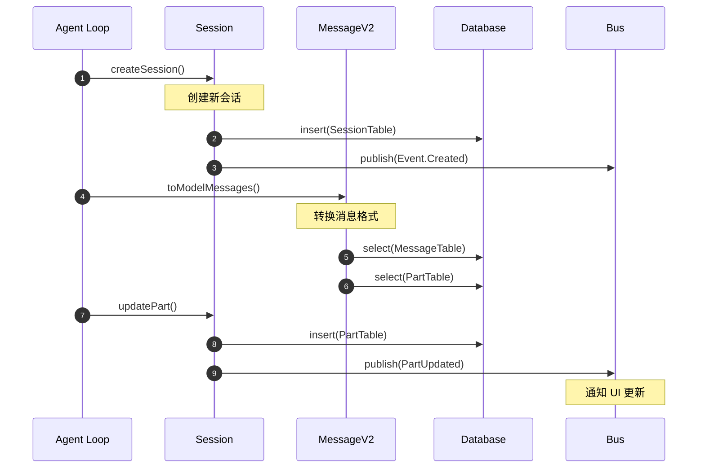

**关键交互说明**：

| 步骤 | 交互内容 | 设计意图 |
|-----|---------|---------|
| 1 | Agent Loop 创建会话 | 解耦业务逻辑与存储 |
| 2 | 写入 SQLite | 持久化会话数据 |
| 3 | 发布创建事件 | 响应式通知 UI 更新 |
| 4 | 转换消息格式 | 适配不同 Provider 的模型消息格式 |
| 5-6 | 查询消息和片段 | 分层读取，优化性能 |
| 7-9 | 更新 Part 并发布事件 | 实时同步到 UI |

---

## 3. 核心组件详细分析

### 3.1 Session 生命周期管理

#### 职责定位

Session 是 OpenCode 对话管理的核心实体，负责会话的创建、分支、归档和生命周期管理。

#### 状态机图

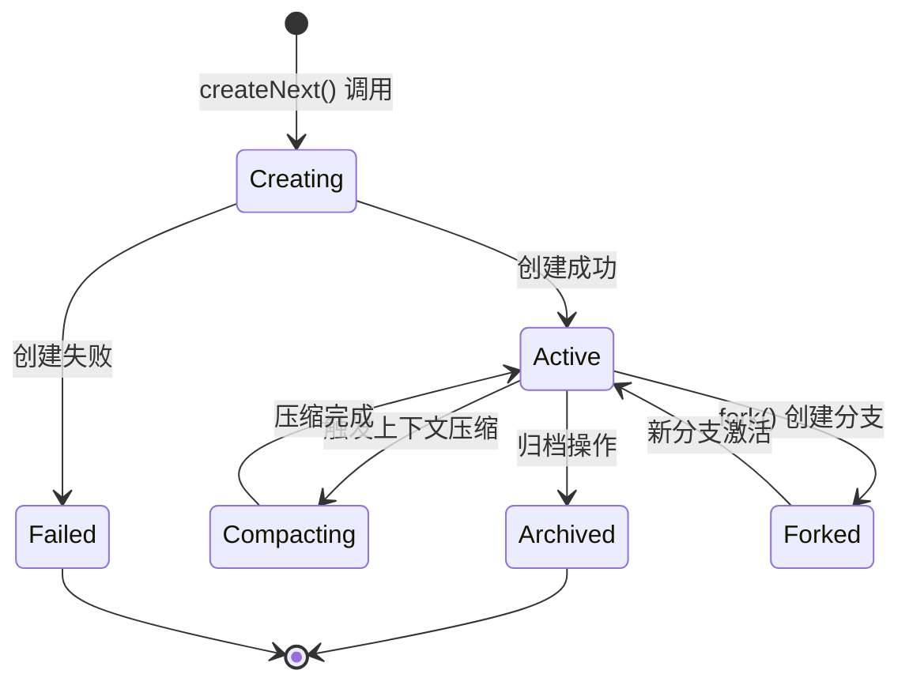

**状态说明**：

| 状态 | 说明 | 进入条件 | 退出条件 |
|-----|------|---------|---------|
| Creating | 创建中 | 调用 createNext() | 创建完成或失败 |
| Active | 活跃状态 | 创建成功 | 归档或创建分支 |
| Compacting | 压缩中 | Token 超限触发压缩 | 压缩完成 |
| Archived | 已归档 | 用户归档或自动归档 | 无 |
| Forked | 已分支 | 调用 fork() 创建分支 | 新分支激活 |
| Failed | 失败 | 创建或操作失败 | 无 |

#### 内部数据流

```text
┌─────────────────────────────────────────────────────────────┐
│  输入层                                                      │
│  ├── 用户输入 ──► Session.createNext()                      │
│  ├── 分支请求 ──► Session.fork()                            │
│  └── 上下文 ──► WorkspaceContext.workspaceID                │
└──────────────────────────┬──────────────────────────────────┘
                           ▼
┌─────────────────────────────────────────────────────────────┐
│  处理层                                                      │
│  ├── 会话创建: 生成 ID, 设置 workspace_id                    │
│  ├── 消息管理: updateMessage() + updatePart()               │
│  ├── 流式读取: stream() Generator                           │
│  └── 上下文压缩: isOverflow() + prune()                     │
└──────────────────────────┬──────────────────────────────────┘
                           ▼
┌─────────────────────────────────────────────────────────────┐
│  输出层                                                      │
│  ├── 持久化: SQLite INSERT/UPDATE                           │
│  ├── 事件: Bus.publish(Message/Part Updated)                │
│  └── 查询: list() 自动过滤 workspace                        │
└─────────────────────────────────────────────────────────────┘
```

---

### 3.2 数据库 Schema 设计

#### 职责定位

数据库层负责 Session、Message、Part 三层层级结构的持久化，使用 Drizzle ORM 实现类型安全的数据库操作。

#### 表结构关系

```text
┌─────────────────────────────────────────────────────────────┐
│  Session 表                                                  │
│  ├── id (PK)                                                │
│  ├── project_id (FK)                                        │
│  ├── workspace_id (FK, 多工作空间支持)                       │
│  ├── parent_id (自引用，支持分支)                            │
│  ├── title, version, directory                              │
│  ├── summary_additions/deletions/files (统计信息)            │
│  ├── summary_diffs (JSON)                                    │
│  ├── revert (回滚信息 JSON)                                  │
│  ├── permission (权限规则 JSON)                              │
│  └── time_created/updated/compacting/archived               │
└───────────────────────┬─────────────────────────────────────┘
                        │ 1:N
                        ▼
┌─────────────────────────────────────────────────────────────┐
│  Message 表                                                  │
│  ├── id (PK)                                                │
│  ├── session_id (FK)                                        │
│  ├── data (JSON: role, time, model, etc.)                   │
│  └── time_created                                           │
└───────────────────────┬─────────────────────────────────────┘
                        │ 1:N
                        ▼
┌─────────────────────────────────────────────────────────────┐
│  Part 表                                                     │
│  ├── id (PK)                                                │
│  ├── message_id (FK)                                        │
│  ├── session_id (反范化，便于查询)                           │
│  ├── data (JSON: type-specific content)                     │
│  └── time_created                                           │
└─────────────────────────────────────────────────────────────┘
```

#### 关键代码

```typescript
// packages/opencode/src/session/session.sql.ts:11-40
export const SessionTable = sqliteTable(
  "session",
  {
    id: text().primaryKey(),
    project_id: text()
      .notNull()
      .references(() => ProjectTable.id, { onDelete: "cascade" }),
    workspace_id: text(),  // 多工作空间支持
    parent_id: text(),  // 支持会话分支
    // ... 其他字段
    revert: text({ mode: "json" }).$type<{ messageID: string; partID?: string; snapshot?: string; diff?: string }>(),
    permission: text({ mode: "json" }).$type<PermissionNext.Ruleset>(),
    time_compacting: integer(),
    time_archived: integer(),
  },
  (table) => [
    index("session_project_idx").on(table.project_id),
    index("session_workspace_idx").on(table.workspace_id),  // 工作空间索引
    index("session_parent_idx").on(table.parent_id),
  ],
)
```

**设计要点**：
1. **反范化设计**：Part 表冗余存储 `session_id`，避免 JOIN 查询
2. **JSON 字段**：灵活存储结构化数据（revert、permission、diffs）
3. **索引优化**：project_id、parent_id、session_id 均有索引
4. **多工作空间**：`workspace_id` 支持多工作空间隔离，配合 `session_workspace_idx` 索引优化查询

---

### 3.2 Part 类型系统

#### 职责定位

Part 是 OpenCode 的最小内容单元，支持多种类型（text、tool、reasoning、file 等），使用 Zod 实现运行时类型安全。

#### 类型层次结构

```mermaid
flowchart TD
    PartBase["PartBase<br/>id, sessionID, messageID"] --> TextPart["TextPart<br/>text, synthetic, ignored"]
    PartBase --> SnapshotPart["SnapshotPart<br/>snapshot ID"]
    PartBase --> PatchPart["PatchPart<br/>hash, files[]"]
    PartBase --> FilePart["FilePart<br/>mime, filename, url, source"]
    PartBase --> ReasoningPart["ReasoningPart<br/>text, metadata"]
    PartBase --> ToolPart["ToolPart<br/>tool, callID, state"]
    PartBase --> StepStartPart["StepStartPart<br/>snapshot"]
    PartBase --> StepFinishPart["StepFinishPart<br/>reason, cost, tokens"]
    PartBase --> CompactionPart["CompactionPart<br/>auto"]
    PartBase --> SubtaskPart["SubtaskPart<br/>prompt, description, agent"]
    PartBase --> RetryPart["RetryPart<br/>attempt, error"]
    PartBase --> AgentPart["AgentPart<br/>name, source"]

    style ToolPart fill:#90EE90
    style TextPart fill:#87CEEB
    style ReasoningPart fill:#FFB6C1
```

#### Tool State 状态机

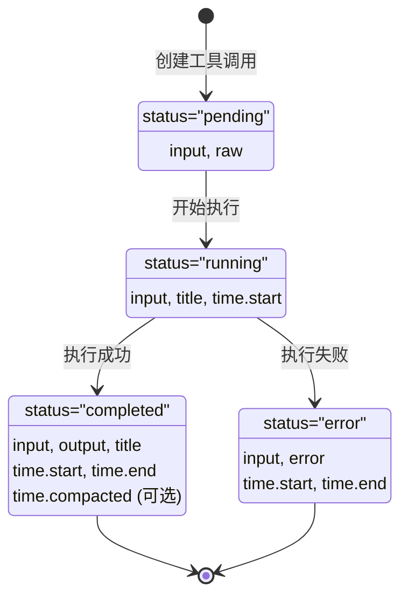

#### 关键代码

```typescript
// packages/opencode/src/session/message-v2.ts:76-114
const PartBase = z.object({
  id: z.string(),
  sessionID: z.string(),
  messageID: z.string(),
})

export const TextPart = PartBase.extend({
  type: z.literal("text"),
  text: z.string(),
  synthetic: z.boolean().optional(),  // 是否由系统生成
  ignored: z.boolean().optional(),    // 是否被忽略
  time: z.object({ start: z.number(), end: z.number().optional() }),
})

// Tool State 联合类型
export const ToolState = z.discriminatedUnion("status", [
  ToolStatePending,   // pending
  ToolStateRunning,   // running
  ToolStateCompleted, // completed
  ToolStateError,     // error
])
```

---

### 3.3 WorkspaceContext 多工作空间支持

#### 职责定位

WorkspaceContext 提供异步上下文传播机制，使 workspaceID 能够在异步调用链中自动传递，无需手动透传参数。这是实现多工作空间隔离的核心基础设施。

#### 架构设计

```text
┌─────────────────────────────────────────────────────────────┐
│  WorkspaceContext                                            │
│  基于 AsyncLocalStorage 实现                                 │
├─────────────────────────────────────────────────────────────┤
│  ┌─────────────────────────────────────────────────────┐   │
│  │  provide({ workspaceID, fn })                        │   │
│  │  └── 在指定上下文中执行函数                          │   │
│  └─────────────────────────────────────────────────────┘   │
│  ┌─────────────────────────────────────────────────────┐   │
│  │  workspaceID (getter)                                │   │
│  │  └── 获取当前上下文的 workspaceID                    │   │
│  └─────────────────────────────────────────────────────┘   │
└─────────────────────────────────────────────────────────────┘
                              │
                              ▼
┌─────────────────────────────────────────────────────────────┐
│  Session.createNext()                                       │
│  └── workspaceID: WorkspaceContext.workspaceID  // 自动捕获 │
└─────────────────────────────────────────────────────────────┘
                              │
                              ▼
┌─────────────────────────────────────────────────────────────┐
│  Session.list()                                             │
│  └── 自动过滤当前 workspaceID 的会话                        │
└─────────────────────────────────────────────────────────────┘
```

#### 关键代码

```typescript
// packages/opencode/src/control-plane/workspace-context.ts:1-23
import { Context } from "../util/context"

interface Context {
  workspaceID?: string
}

const context = Context.create<Context>("workspace")

export const WorkspaceContext = {
  async provide<R>(input: { workspaceID?: string; fn: () => R }): Promise<R> {
    return context.provide({ workspaceID: input.workspaceID }, async () => {
      return input.fn()
    })
  },

  get workspaceID() {
    try {
      return context.use().workspaceID
    } catch (e) {
      return undefined
    }
  },
}
```

#### 使用模式

```typescript
// packages/opencode/src/session/index.ts:304
export async function createNext(input: { ... }) {
  const result: Info = {
    ...
    workspaceID: WorkspaceContext.workspaceID,  // 自动从上下文获取
    ...
  }
  ...
}

// packages/opencode/src/session/index.ts:544-546
export function* list(input?: { ... }) {
  ...
  if (WorkspaceContext.workspaceID) {
    conditions.push(eq(SessionTable.workspace_id, WorkspaceContext.workspaceID))
  }
  ...
}
```

**设计要点**：
1. **隐式传播**：利用 AsyncLocalStorage 实现上下文自动透传，避免层层传递参数
2. **容错设计**：`workspaceID` getter 在上下文不存在时返回 `undefined` 而非抛出错误
3. **会话隔离**：创建会话时自动捕获当前 workspaceID，查询时自动过滤
4. **向后兼容**：未设置 workspaceID 时行为与之前一致

---

### 3.4 组件间协作时序

展示 Session、Message、Part 如何协作完成一次完整的消息创建流程。

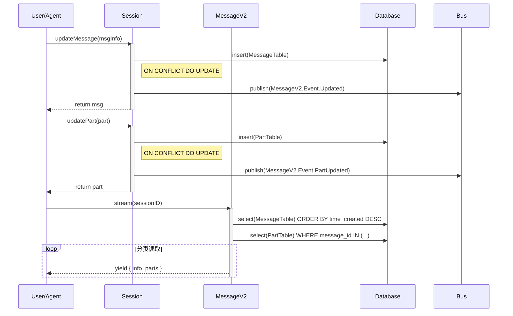

**协作要点**：

1. **消息创建**：使用 `INSERT ... ON CONFLICT DO UPDATE` 实现 upsert 语义
2. **事件通知**：每次更新后立即发布事件，确保 UI 实时同步
3. **流式读取**：使用 Generator 函数实现分页加载，避免内存溢出

---

### 3.5 关键数据路径

#### 主路径（正常流程）

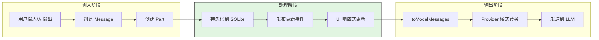

#### 压缩路径（Token 超限）

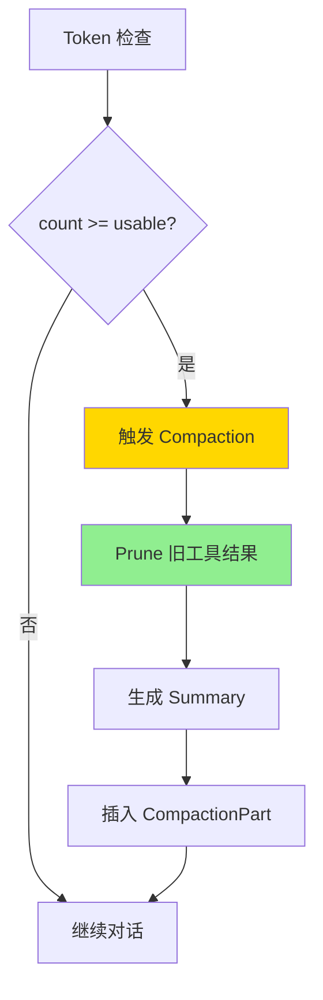

---

## 4. 端到端数据流转

### 4.1 正常流程（详细版）

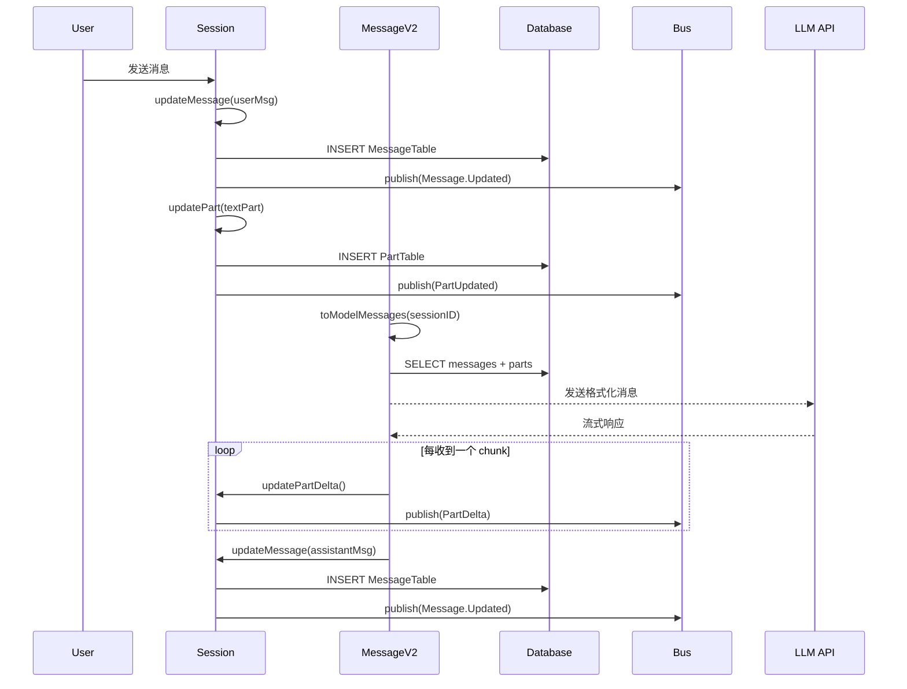

**数据变换详情**：

| 阶段 | 输入 | 处理 | 输出 | 代码位置 |
|-----|------|------|------|---------|
| 接收 | 用户输入 | 创建 User Message | MessageV2.User | `packages/opencode/src/session/index.ts:670` |
| 处理 | 历史消息 | toModelMessages 转换 | ModelMessage[] | `packages/opencode/src/session/message-v2.ts:491` |
| 流式 | LLM 响应 | 增量更新 Part | PartDelta 事件 | `packages/opencode/src/session/index.ts:758` |
| 完成 | Assistant 消息 | 创建 Assistant Message | MessageV2.Assistant | `packages/opencode/src/session/index.ts:670` |

### 4.2 数据流向图

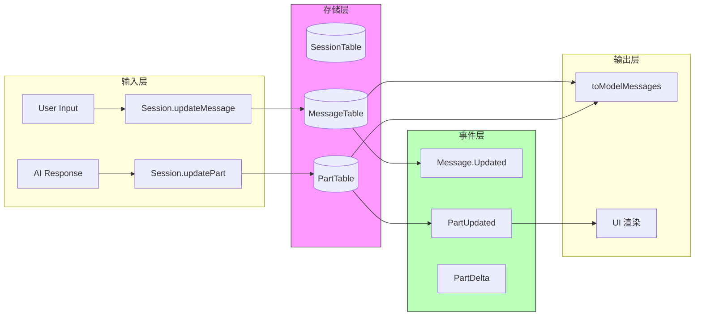

### 4.3 异常/边界流程

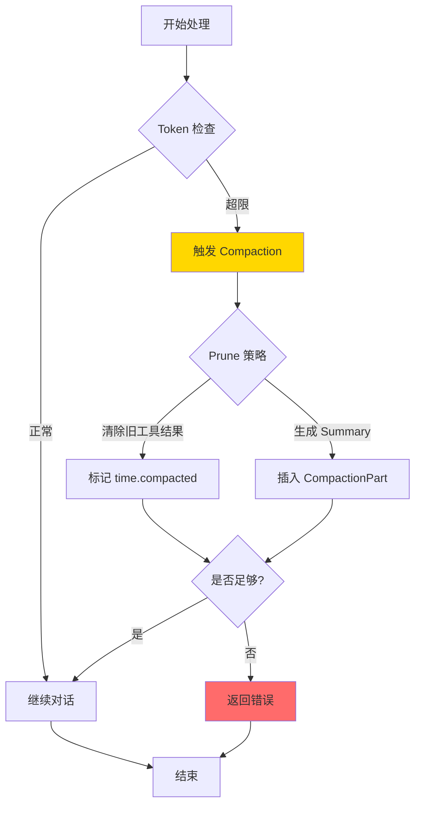

---

## 5. 关键代码实现

### 5.1 核心数据结构

```typescript
// packages/opencode/src/session/session.sql.ts:11-40
export const SessionTable = sqliteTable(
  "session",
  {
    id: text().primaryKey(),
    project_id: text().notNull().references(() => ProjectTable.id, { onDelete: "cascade" }),
    workspace_id: text(),  // 多工作空间支持
    parent_id: text(),  // 支持分支
    slug: text().notNull(),
    directory: text().notNull(),
    title: text().notNull(),
    version: text().notNull(),
    summary_additions: integer(),
    summary_deletions: integer(),
    summary_files: integer(),
    summary_diffs: text({ mode: "json" }).$type<Snapshot.FileDiff[]>(),
    revert: text({ mode: "json" }).$type<{ messageID: string; partID?: string; snapshot?: string; diff?: string }>(),
    permission: text({ mode: "json" }).$type<PermissionNext.Ruleset>(),
    ...Timestamps,
    time_compacting: integer(),
    time_archived: integer(),
  },
  (table) => [
    index("session_project_idx").on(table.project_id),
    index("session_workspace_idx").on(table.workspace_id),  // 工作空间索引
    index("session_parent_idx").on(table.parent_id),
  ],
)
```

**字段说明**：
| 字段 | 类型 | 用途 |
|-----|------|------|
| `workspace_id` | `string?` | 多工作空间隔离标识 |
| `parent_id` | `string?` | 支持会话分支，指向父会话 |
| `revert` | `JSON` | 存储回滚点信息（messageID, snapshot, diff） |
| `permission` | `JSON` | 存储权限规则 |
| `time_compacting` | `integer` | 上次压缩时间戳 |
| `summary_*` | `integer` | 代码变更统计 |

### 5.2 流式消息读取

```typescript
// packages/opencode/src/session/message-v2.ts:716-767
export const stream = fn(Identifier.schema("session"), async function* (sessionID) {
  const size = 50
  let offset = 0
  while (true) {
    const rows = Database.use((db) =>
      db
        .select()
        .from(MessageTable)
        .where(eq(MessageTable.session_id, sessionID))
        .orderBy(desc(MessageTable.time_created))
        .limit(size)
        .offset(offset)
        .all(),
    )
    if (rows.length === 0) break

    const ids = rows.map((row) => row.id)
    const partsByMessage = new Map<string, MessageV2.Part[]>()
    if (ids.length > 0) {
      const partRows = Database.use((db) =>
        db
          .select()
          .from(PartTable)
          .where(inArray(PartTable.message_id, ids))
          .orderBy(PartTable.message_id, PartTable.id)
          .all(),
      )
      for (const row of partRows) {
        const part = { ...row.data, id: row.id, sessionID: row.session_id, messageID: row.message_id } as MessageV2.Part
        const list = partsByMessage.get(row.message_id)
        if (list) list.push(part)
        else partsByMessage.set(row.message_id, [part])
      }
    }

    for (const row of rows) {
      const info = { ...row.data, id: row.id, sessionID: row.session_id } as MessageV2.Info
      yield { info, parts: partsByMessage.get(row.id) ?? [] }
    }

    offset += rows.length
    if (rows.length < size) break
  }
})
```

**代码要点**：
1. **分页读取**：每页 50 条消息，避免内存溢出
2. **批量查询 Part**：先收集所有 message_id，再一次性查询 Parts
3. **Generator 函数**：使用 `async function*` 实现流式输出

### 5.3 关键调用链

```text
Session.updateMessage()     [packages/opencode/src/session/index.ts:670]
  -> Database.use()         [packages/opencode/src/storage/db.ts]
    -> db.insert(MessageTable)
    -> Database.effect()    [packages/opencode/src/storage/db.ts]
      -> Bus.publish(MessageV2.Event.Updated)

Session.updatePart()        [packages/opencode/src/session/index.ts:735]
  -> Database.use()
    -> db.insert(PartTable).onConflictDoUpdate()
    -> Database.effect()
      -> Bus.publish(MessageV2.Event.PartUpdated)

MessageV2.stream()          [packages/opencode/src/session/message-v2.ts:716]
  -> Database.use()
    -> select(MessageTable) ORDER BY time_created DESC
    -> select(PartTable) WHERE message_id IN (...)
  -> yield { info, parts }
```

---

## 6. 设计意图与 Trade-off

### 6.1 OpenCode 的选择

| 维度 | OpenCode 的选择 | 替代方案 | 取舍分析 |
|-----|----------------|---------|---------|
| 存储引擎 | SQLite + Drizzle ORM | JSONL (Kimi)、内存 (Codex) | 类型安全、关系查询能力强，但依赖文件系统 |
| 数据建模 | 三层层级 (Session→Message→Part) | 扁平结构 | 灵活支持多种内容类型，但查询需要 JOIN |
| 反范化 | Part 表冗余 session_id | 完全范化 | 优化查询性能，但增加存储冗余 |
| 压缩策略 | Prune + Compaction | 截断 (Codex)、摘要 (Kimi) | 保留关键信息，但实现复杂 |
| 响应式 | Event Bus | 轮询、回调 | 实时同步，但增加系统复杂度 |
| **多工作空间** | **WorkspaceContext + AsyncLocalStorage** | **手动透传参数** | **隐式上下文传播简化 API，但增加理解成本** |

### 6.2 为什么这样设计？

**核心问题**：如何在保证类型安全的同时，支持灵活的对话内容建模和实时 UI 同步？

**OpenCode 的解决方案**：
- 代码依据：`packages/opencode/src/session/session.sql.ts:11`
- 设计意图：使用关系型数据库 + ORM 实现类型安全的持久化，通过反范化优化查询性能
- 带来的好处：
  - 类型安全：Drizzle ORM 提供端到端类型安全
  - 灵活建模：Part 类型系统支持 12 种内容类型
  - 实时同步：Event Bus 实现响应式更新
  - 查询优化：反范化设计减少 JOIN 操作
- 付出的代价：
  - 复杂度：需要维护 Schema 和类型定义
  - 存储：反范化增加存储空间
  - 依赖：需要 SQLite 运行时

### 6.3 与其他项目的对比

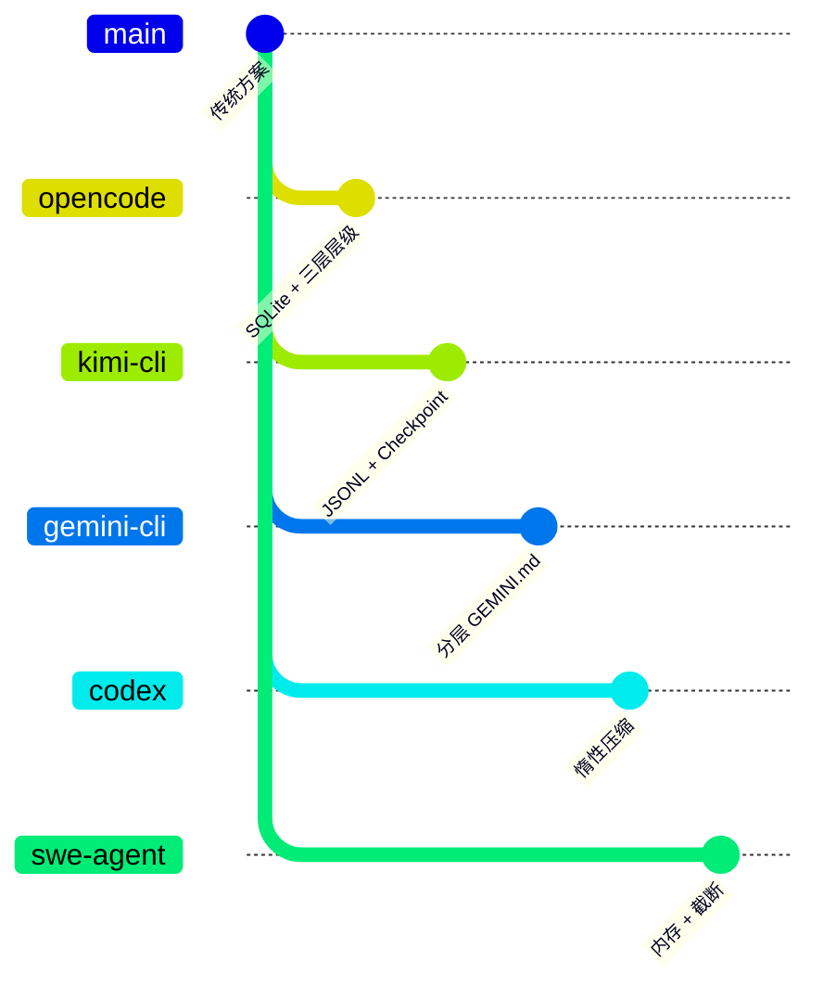

| 项目 | 核心差异 | 适用场景 |
|-----|---------|---------|
| OpenCode | SQLite + 三层层级 + Event Bus | 需要强类型和实时同步的桌面应用 |
| Kimi CLI | JSONL + Checkpoint 回滚 | 需要状态回滚的 CLI 工具 |
| Gemini CLI | 分层 GEMINI.md + JIT 加载 | 需要项目级记忆发现的场景 |
| Codex | 惰性压缩 + 沙箱 | 企业级安全要求 |
| SWE-agent | 内存存储 + 截断 | 自动化代码修复场景 |

**详细对比**：

| 特性 | OpenCode | Kimi CLI | Gemini CLI | Codex | SWE-agent |
|-----|----------|----------|------------|-------|-----------|
| 存储引擎 | SQLite | JSONL 文件 | 内存 + 文件 | 内存 | 内存 |
| 数据建模 | 三层 (Session/Message/Part) | 扁平消息 | 分层 GEMINI.md | 消息列表 | 消息列表 |
| 持久化 | 实时 DB 写入 | Checkpoint 文件 | 按需保存 | 惰性压缩 | 无 |
| 上下文压缩 | Prune + Compaction | Checkpoint 回滚 | 上下文保护 | 窗口滑动 | 截断 |
| 响应式更新 | Event Bus | 轮询 | 回调 | 轮询 | 无 |
| 多工作空间 | AsyncLocalStorage | 不支持 | 不支持 | 不支持 | 不支持 |
| 类型安全 | Drizzle ORM | Pydantic | TypeScript | Rust 类型 | Python 类型 |
| 分支支持 | 是 (parent_id) | 是 (Checkpoint) | 否 | 否 | 否 |

---

## 7. 边界情况与错误处理

### 7.1 终止条件

| 终止原因 | 触发条件 | 代码位置 |
|---------|---------|---------|
| Token 超限 | `count >= usable` | `packages/opencode/src/session/compaction.ts:32` |
| 会话归档 | `time_archived` 被设置 | `packages/opencode/src/session/index.ts:390` |
| 消息错误 | `message.error` 存在 | `packages/opencode/src/session/message-v2.ts:398` |

### 7.2 超时/资源限制

```typescript
// packages/opencode/src/session/compaction.ts:30-48
const COMPACTION_BUFFER = 20_000
const PRUNE_MINIMUM = 20_000
const PRUNE_PROTECT = 40_000

export async function isOverflow(input: { tokens: MessageV2.Assistant["tokens"]; model: Provider.Model }) {
  const config = await Config.get()
  if (config.compaction?.auto === false) return false
  const context = input.model.limit.context
  if (context === 0) return false

  const count = input.tokens.total || input.tokens.input + input.tokens.output + input.tokens.cache.read + input.tokens.cache.write

  const reserved = config.compaction?.reserved ?? Math.min(COMPACTION_BUFFER, ProviderTransform.maxOutputTokens(input.model))
  const usable = input.model.limit.input
    ? input.model.limit.input - reserved
    : context - ProviderTransform.maxOutputTokens(input.model)
  return count >= usable
}
```

### 7.3 错误恢复策略

| 错误类型 | 处理策略 | 代码位置 |
|---------|---------|---------|
| ContextOverflow | 触发 Compaction | `packages/opencode/src/session/compaction.ts:32` |
| APIError | 重试或标记失败 | `packages/opencode/src/session/message-v2.ts:811` |
| AuthError | 提示用户重新认证 | `packages/opencode/src/session/message-v2.ts:822` |
| 连接重置 | 标记为可重试 | `packages/opencode/src/session/message-v2.ts:830` |

---

## 8. 关键代码索引

| 功能 | 文件 | 行号 | 说明 |
|-----|------|------|------|
| Session 表定义 | `packages/opencode/src/session/session.sql.ts` | 11-40 | SessionTable Schema (含 workspace_id) |
| Message 表定义 | `packages/opencode/src/session/session.sql.ts` | 42-53 | MessageTable Schema |
| Part 表定义 | `packages/opencode/src/session/session.sql.ts` | 55-67 | PartTable Schema |
| Part 类型系统 | `packages/opencode/src/session/message-v2.ts` | 76-389 | Zod Schema 定义 |
| 流式读取 | `packages/opencode/src/session/message-v2.ts` | 716-767 | stream() Generator |
| 消息转换 | `packages/opencode/src/session/message-v2.ts` | 491-714 | toModelMessages() |
| 创建会话 | `packages/opencode/src/session/index.ts` | 291-331 | Session.createNext() |
| Fork 会话 | `packages/opencode/src/session/index.ts` | 230-270 | Session.fork() |
| 更新消息 | `packages/opencode/src/session/index.ts` | 670-690 | Session.updateMessage() |
| 更新 Part | `packages/opencode/src/session/index.ts` | 735-756 | Session.updatePart() |
| 会话列表 | `packages/opencode/src/session/index.ts` | 533-575 | Session.list() (含 workspace 过滤) |
| 压缩检查 | `packages/opencode/src/session/compaction.ts` | 32-48 | isOverflow() |
| Prune 实现 | `packages/opencode/src/session/compaction.ts` | 58-99 | prune() |
| 压缩处理 | `packages/opencode/src/session/compaction.ts` | 101-229 | process() |
| **WorkspaceContext** | **`packages/opencode/src/control-plane/workspace-context.ts`** | **1-23** | **多工作空间上下文** |
| 事件发布 | `packages/opencode/src/bus/index.ts` | 41-64 | Bus.publish() |
| 事件定义 | `packages/opencode/src/bus/bus-event.ts` | 12-19 | BusEvent.define() |
| AsyncLocalStorage | `packages/opencode/src/util/context.ts` | 10-25 | Context.create() |

---

## 9. 延伸阅读

- 前置知识：`docs/comm/07-comm-memory-context.md`
- 相关机制：`docs/opencode/04-opencode-agent-loop.md`
- 深度分析：`docs/opencode/questions/opencode-compaction-strategy.md`（待创建）

---

*✅ Verified: 基于 opencode/packages/opencode/src/session/*.ts 源码分析*
*基于版本：2026-02-08 | 最后更新：2026-03-02*

**更新记录**：
- 2026-03-02: 新增 WorkspaceContext 多工作空间支持文档 (commit cec16df, 3ee1653)
