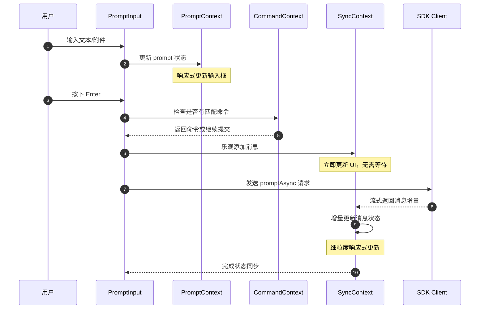
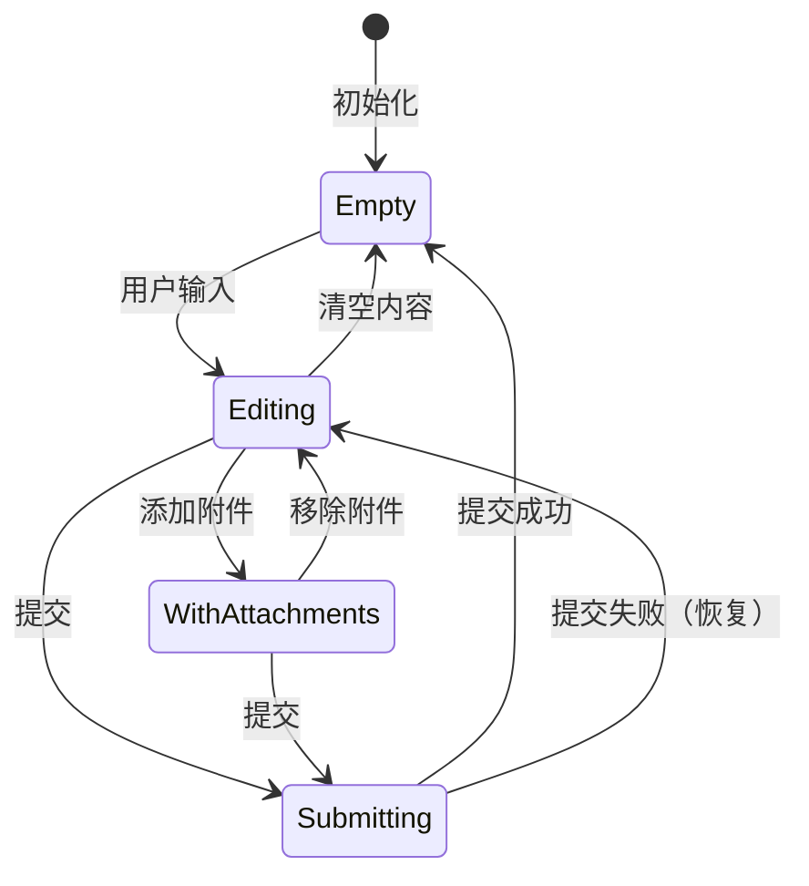
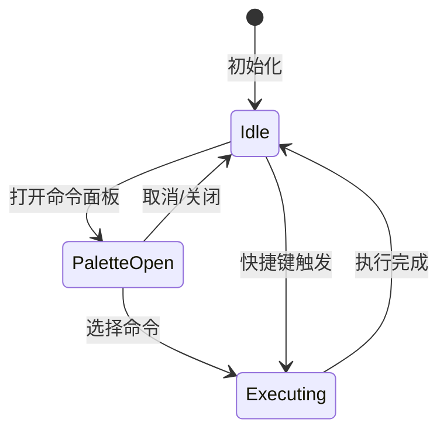
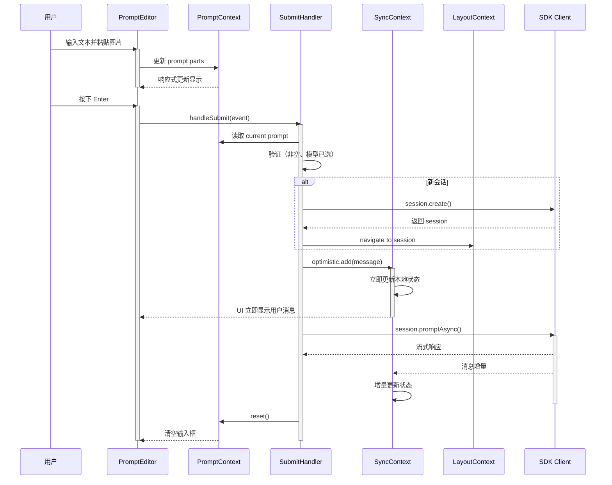
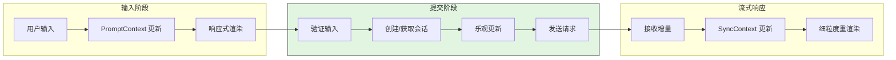
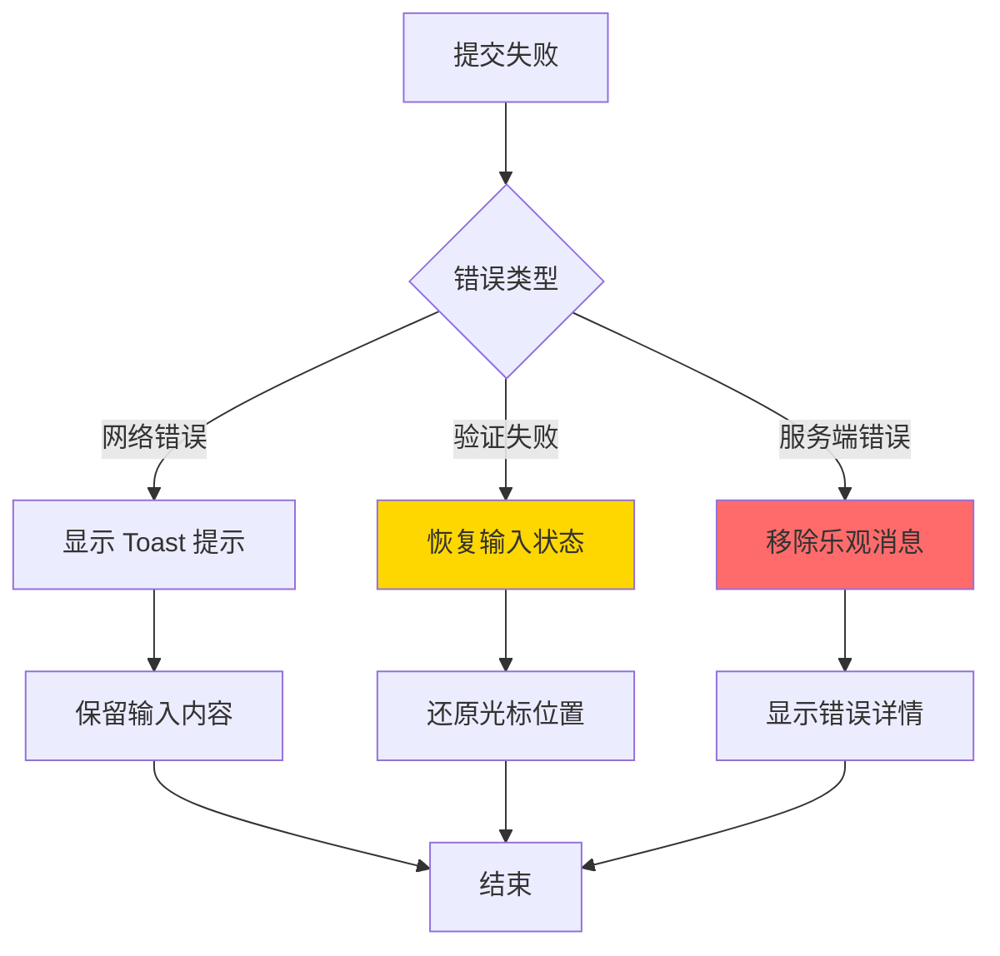
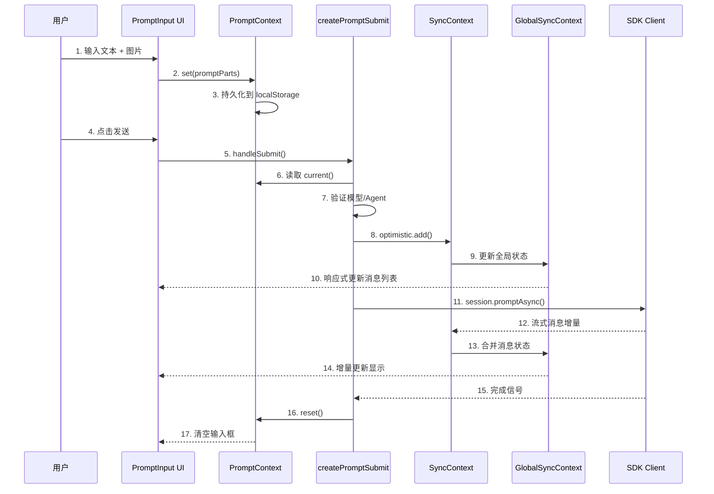
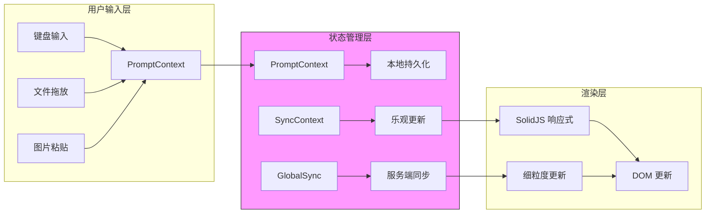
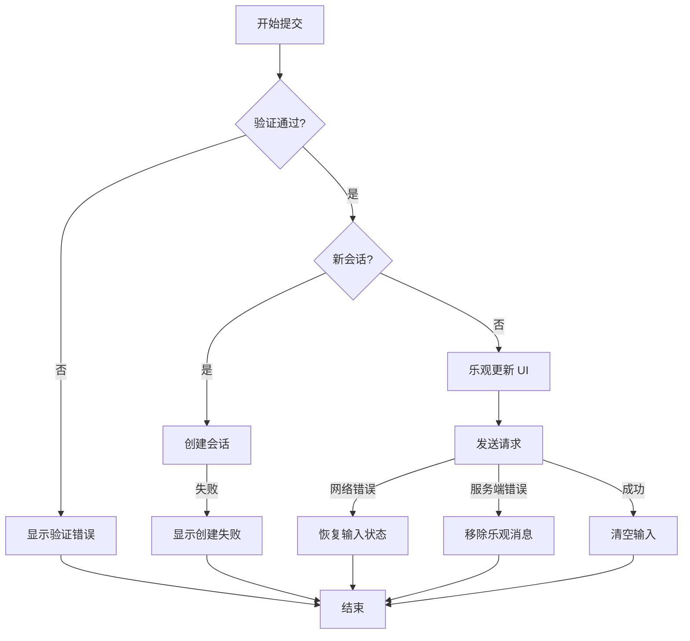
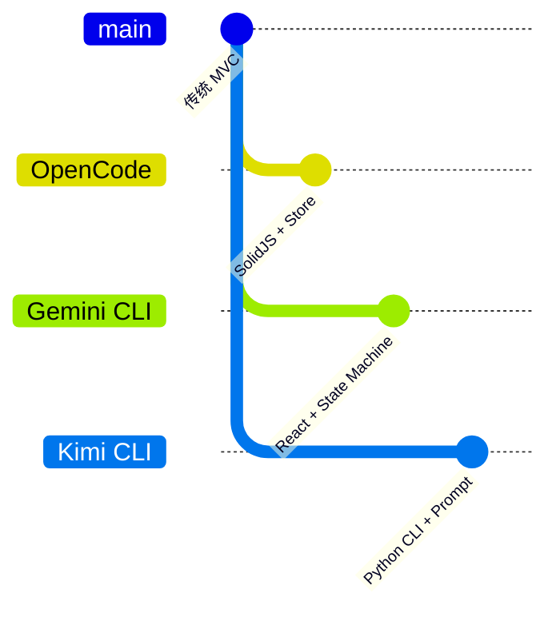

# OpenCode UI 交互系统

## TL;DR（结论先行）

一句话定义：OpenCode 的 UI 交互系统是一套基于 **SolidJS 响应式状态管理** 的现代化界面架构，通过分层状态容器（Context）实现用户输入、会话管理和界面布局的松耦合协作。

OpenCode 的核心取舍：**SolidJS Store + 细粒度响应式更新**（对比其他项目的 React/Vue 方案）

---

## 1. 为什么需要这个机制？（解决什么问题）

### 1.1 问题场景

没有良好的 UI 交互系统：
- 用户输入与后端请求耦合，导致界面卡顿
- 状态更新无法预测，出现界面不一致
- 跨组件通信混乱，难以维护

有 UI 交互系统：
- 用户输入 → 乐观更新 UI → 异步发送请求 → 同步实际状态
- 细粒度响应式更新，只重渲染必要组件
- 分层状态管理，职责清晰

### 1.2 核心挑战

| 挑战 | 不解决的后果 |
|-----|-------------|
| 实时响应 | 用户输入延迟，体验差 |
| 状态一致性 | 乐观更新与实际状态冲突 |
| 跨平台适配 | Web/Desktop 行为不一致 |
| 性能优化 | 大量消息时界面卡顿 |

---

## 2. 整体架构（ASCII 图）

### 2.1 在系统中的位置

```text
┌─────────────────────────────────────────────────────────────┐
│ 用户界面层                                                   │
│ packages/app/src/components/prompt-input.tsx                 │
│ packages/app/src/pages/session/*.tsx                         │
└───────────────────────┬─────────────────────────────────────┘
                        │ 用户交互事件
                        ▼
┌─────────────────────────────────────────────────────────────┐
│ ▓▓▓ UI 交互核心 ▓▓▓                                          │
│ packages/app/src/context/                                    │
│ - prompt.tsx    : 输入状态管理                               │
│ - command.tsx   : 命令系统                                   │
│ - layout.tsx    : 布局状态                                   │
│ - sync.tsx      : 数据同步                                   │
└───────────────────────┬─────────────────────────────────────┘
                        │ 状态变更/数据流
                        ▼
┌─────────────────────────────────────────────────────────────┐
│ 全局状态层          │ 平台适配层          │ 服务端通信       │
│ global-sync.tsx     │ platform.tsx        │ sdk/client       │
│ local.tsx           │                     │                  │
└─────────────────────┴─────────────────────┴──────────────────┘
```

### 2.2 核心组件职责

| 组件 | 职责 | 代码位置 |
|-----|------|---------|
| `PromptContext` | 管理用户输入状态（文本、附件、上下文） | `packages/app/src/context/prompt.tsx:198` |
| `CommandContext` | 命令注册、快捷键绑定、命令面板 | `packages/app/src/context/command.tsx:188` |
| `LayoutContext` | 侧边栏、终端、会话标签布局状态 | `packages/app/src/context/layout.tsx:99` |
| `SyncContext` | 会话数据同步、乐观更新 | `packages/app/src/context/sync.tsx:93` |
| `PlatformContext` | 平台能力抽象（Web/Desktop） | `packages/app/src/context/platform.tsx:93` |

### 2.3 核心组件交互关系



**关键交互说明**：

| 步骤 | 交互内容 | 设计意图 |
|-----|---------|---------|
| 1 | 用户输入触发 PromptContext 更新 | 实时响应，零延迟反馈 |
| 2 | 命令系统拦截特殊输入（如 /command） | 支持快捷命令，无需额外 UI |
| 3 | 乐观更新立即显示用户消息 | 提升感知性能 |
| 4 | 异步请求与流式响应 | 非阻塞 UI，支持长回复 |
| 5 | 增量状态更新 | 只更新变化部分，优化性能 |

---

## 3. 核心组件详细分析

### 3.1 PromptContext 内部结构

#### 职责定位

PromptContext 是用户输入的核心状态容器，管理多段式输入（文本、文件、图片、Agent 引用）和上下文附件。

#### 状态机图



**状态说明**：

| 状态 | 说明 | 进入条件 | 退出条件 |
|-----|------|---------|---------|
| Empty | 空输入状态 | 初始化或提交成功 | 用户开始输入 |
| Editing | 编辑中 | 有文本内容 | 提交或清空 |
| WithAttachments | 带附件 | 添加文件/图片 | 移除所有附件 |
| Submitting | 提交中 | 用户确认提交 | 收到响应或失败 |

#### 内部数据流

```text
┌─────────────────────────────────────────────────────────────┐
│  输入层                                                      │
│  ├── 键盘输入 ──► PromptPart 解析 ──► Store 更新             │
│  ├── 文件拖放 ──► FileAttachmentPart 创建                    │
│  └── 图片粘贴 ──► ImageAttachmentPart 创建                   │
└──────────────────────────┬──────────────────────────────────┘
                           ▼
┌─────────────────────────────────────────────────────────────┐
│  处理层                                                      │
│  ├── 内容验证: 检查文件存在性、图片格式                        │
│  ├── 上下文管理: 添加/移除文件引用                             │
│  └── 历史记录: 保存到本地存储                                 │
└──────────────────────────┬──────────────────────────────────┘
                           ▼
┌─────────────────────────────────────────────────────────────┐
│  输出层                                                      │
│  ├── 渲染: 生成 DOM 结构（文本节点 + Pill 组件）              │
│  ├── 序列化: 转换为 API 请求格式                              │
│  └── 持久化: 保存到 localStorage                              │
└─────────────────────────────────────────────────────────────┘
```

#### 关键算法逻辑

**多段式输入解析**（`packages/app/src/context/prompt.tsx:63-82`）：

```typescript
function isPartEqual(partA: ContentPart, partB: ContentPart) {
  switch (partA.type) {
    case "text":
      return partB.type === "text" && partA.content === partB.content
    case "file":
      return partB.type === "file" && partA.path === partB.path && isSelectionEqual(partA.selection, partB.selection)
    case "agent":
      return partB.type === "agent" && partA.name === partB.name
    case "image":
      return partB.type === "image" && partA.id === partB.id
  }
}
```

**算法要点**：

1. **类型安全**：每个 Part 有明确的类型标签，支持 TypeScript 类型收窄
2. **选择区比较**：文件引用包含可选的代码选择区，需要深度比较
3. **不可变更新**：所有操作返回新对象，配合 SolidJS Store 的响应式追踪

#### 关键接口

| 接口 | 输入 | 输出 | 说明 | 代码位置 |
|-----|------|------|------|---------|
| `current()` | - | `Prompt` | 获取当前输入内容 | `prompt.tsx:247` |
| `set()` | `Prompt`, `cursorPosition?` | void | 设置输入内容 | `prompt.tsx:255` |
| `context.add()` | `ContextItem` | void | 添加上下文附件 | `prompt.tsx:252` |
| `reset()` | - | void | 清空输入 | `prompt.tsx:256` |

---

### 3.2 CommandContext 内部结构

#### 职责定位

CommandContext 提供统一的命令注册、快捷键绑定和命令面板管理，支持声明式命令定义和动态快捷键配置。

#### 状态机图



#### 关键算法逻辑

**快捷键匹配**（`packages/app/src/context/command.tsx:130-146`）：

```typescript
export function matchKeybind(keybinds: Keybind[], event: KeyboardEvent): boolean {
  const eventKey = normalizeKey(event.key)
  for (const kb of keybinds) {
    const keyMatch = kb.key === eventKey
    const ctrlMatch = kb.ctrl === (event.ctrlKey || false)
    const metaMatch = kb.meta === (event.metaKey || false)
    const shiftMatch = kb.shift === (event.shiftKey || false)
    const altMatch = kb.alt === (event.altKey || false)

    if (keyMatch && ctrlMatch && metaMatch && shiftMatch && altMatch) {
      return true
    }
  }
  return false
}
```

**设计要点**：

1. **跨平台兼容**：`mod` 键在 Mac 映射为 Meta，其他平台映射为 Ctrl
2. **可编辑区域保护**：输入框内快捷键默认不触发（除白名单命令）
3. **动态绑定**：支持用户自定义快捷键，覆盖默认配置

---

### 3.3 组件间协作时序

展示一次完整的用户输入提交流程：



**协作要点**：

1. **Editor 与 PromptContext**：双向绑定，输入变化实时同步
2. **乐观更新策略**：先更新 UI 再发送请求，失败时回滚
3. **流式响应处理**：SDK 返回流，SyncContext 负责增量更新状态

---

### 3.4 关键数据路径

#### 主路径（正常提交流程）



#### 异常路径（错误恢复）



---

## 4. 端到端数据流转

### 4.1 正常流程（详细版）



**数据变换详情**：

| 阶段 | 输入 | 处理 | 输出 | 代码位置 |
|-----|------|------|------|---------|
| 输入 | 键盘/粘贴事件 | 解析为 PromptPart | `Prompt` 数组 | `prompt-input.tsx:1` |
| 验证 | `Prompt`, `model`, `agent` | 检查非空、有效性 | 布尔值 | `submit.ts:123-136` |
| 乐观更新 | `message`, `parts` | 插入本地状态 | UI 立即显示 | `sync.tsx:195-203` |
| 流式响应 | SSE 数据流 | 解析并合并 | 完整消息 | `global-sync.tsx:159-200` |

### 4.2 数据流向图



### 4.3 异常/边界流程



---

## 5. 关键代码实现

### 5.1 核心数据结构

**Prompt Part 类型定义**（`packages/app/src/context/prompt.tsx:9-39`）：

```typescript
export interface TextPart extends PartBase {
  type: "text"
}

export interface FileAttachmentPart extends PartBase {
  type: "file"
  path: string
  selection?: FileSelection
}

export interface AgentPart extends PartBase {
  type: "agent"
  name: string
}

export interface ImageAttachmentPart {
  type: "image"
  id: string
  filename: string
  mime: string
  dataUrl: string
}

export type ContentPart = TextPart | FileAttachmentPart | AgentPart | ImageAttachmentPart
export type Prompt = ContentPart[]
```

**字段说明**：

| 字段 | 类型 | 用途 |
|-----|------|------|
| `type` | 联合类型 | 区分不同 Part 类型 |
| `content` | `string` | 文本内容或显示文本 |
| `path` | `string` | 文件引用路径 |
| `selection` | `FileSelection` | 代码选择区（行号范围） |
| `dataUrl` | `string` | 图片 Base64 数据 |

### 5.2 主链路代码

**乐观更新实现**（`packages/app/src/context/sync.tsx:44-63`）：

```typescript
export function applyOptimisticAdd(draft: OptimisticStore, input: OptimisticAddInput) {
  const messages = draft.message[input.sessionID]
  if (!messages) {
    draft.message[input.sessionID] = [input.message]
  }
  if (messages) {
    const result = Binary.search(messages, input.message.id, (m) => m.id)
    messages.splice(result.index, 0, input.message)
  }
  draft.part[input.message.id] = sortParts(input.parts)
}

export function applyOptimisticRemove(draft: OptimisticStore, input: OptimisticRemoveInput) {
  const messages = draft.message[input.sessionID]
  if (messages) {
    const result = Binary.search(messages, input.messageID, (m) => m.id)
    if (result.found) messages.splice(result.index, 1)
  }
  delete draft.part[input.messageID]
}
```

**代码要点**：

1. **不可变更新**：使用 Immer 的 `produce` 进行草稿修改
2. **二分查找**：使用 `Binary.search` 快速定位消息位置
3. **乐观回滚**：`applyOptimisticRemove` 用于请求失败时撤销更新

### 5.3 关键调用链

```text
handleSubmit()            [submit.ts:115]
  -> buildRequestParts()  [build-request-parts.ts:1]
    -> 构造请求 parts
  -> optimistic.add()     [sync.tsx:196]
    -> applyOptimisticAdd [sync.tsx:44]
  -> promptAsync()        [SDK client]
    -> 流式响应处理
```

---

## 6. 设计意图与 Trade-off

### 6.1 OpenCode 的选择

| 维度 | OpenCode 的选择 | 替代方案 | 取舍分析 |
|-----|-----------------|---------|---------|
| 前端框架 | SolidJS | React/Vue | 更细粒度响应式，性能更好，但生态较小 |
| 状态管理 | SolidJS Store | Redux/MobX | 内置响应式，无需额外库，学习成本低 |
| 乐观更新 | 立即更新 + 失败回滚 | 等待确认后更新 | 感知性能好，但需处理回滚复杂性 |
| 跨平台 | Web 优先 + Tauri | Electron | 包体积小，但功能受限 |

### 6.2 为什么这样设计？

**核心问题**：如何在保持高性能的同时，实现复杂的交互状态管理？

**OpenCode 的解决方案**：

- **代码依据**：`packages/app/src/context/prompt.tsx:198-259`
- **设计意图**：利用 SolidJS 的细粒度响应式，只重渲染变化的组件
- **带来的好处**：
  - 输入框响应无延迟
  - 大消息列表不卡顿
  - 状态变更可预测
- **付出的代价**：
  - 需要理解响应式原语
  - 调试相对复杂

### 6.3 与其他项目的对比



| 项目 | 核心差异 | 适用场景 |
|-----|---------|---------|
| OpenCode | SolidJS 细粒度响应式、乐观更新 | 高性能 Web/Desktop 应用 |
| Gemini CLI | React + 状态机、递归 continuation | 复杂状态流转场景 |
| Kimi CLI | Python 命令行、Checkpoint 回滚 | 简单 CLI 交互、需要状态持久化 |
| Codex | Rust + TypeScript、Actor 模型 | 企业级安全、高并发 |

---

## 7. 边界情况与错误处理

### 7.1 终止条件

| 终止原因 | 触发条件 | 代码位置 |
|---------|---------|---------|
| 用户取消 | 提交过程中按 Escape | `submit.ts:73-93` |
| 会话过期 | 服务端返回 401 | `sync.tsx:131-145` |
| 网络断开 | fetch 抛出异常 | `submit.ts:402-414` |

### 7.2 超时/资源限制

**Worktree 准备超时**（`packages/app/src/components/prompt-input/submit.ts:368-377`）：

```typescript
const timeoutMs = 5 * 60 * 1000
const timeout = new Promise<Awaited<ReturnType<typeof WorktreeState.wait>>>((resolve) => {
  timer.id = window.setTimeout(() => {
    resolve({
      status: "failed",
      message: language.t("workspace.error.stillPreparing"),
    })
  }, timeoutMs)
})
```

### 7.3 错误恢复策略

| 错误类型 | 处理策略 | 代码位置 |
|---------|---------|---------|
| 网络错误 | 重试 3 次后提示用户 | `sync.tsx:131` |
| 验证失败 | 恢复输入状态，保留光标位置 | `submit.ts:227-238` |
| 服务端错误 | 移除乐观消息，显示 Toast | `submit.ts:402-414` |

---

## 8. 关键代码索引

| 功能 | 文件 | 行号 | 说明 |
|-----|------|------|------|
| 输入状态管理 | `packages/app/src/context/prompt.tsx` | 198 | PromptContext 定义 |
| 命令系统 | `packages/app/src/context/command.tsx` | 188 | CommandContext 定义 |
| 布局状态 | `packages/app/src/context/layout.tsx` | 99 | LayoutContext 定义 |
| 数据同步 | `packages/app/src/context/sync.tsx` | 93 | SyncContext 定义 |
| 提交处理 | `packages/app/src/components/prompt-input/submit.ts` | 53 | createPromptSubmit |
| 历史导航 | `packages/app/src/components/prompt-input/history.ts` | 95 | navigatePromptHistory |
| 编辑器 DOM | `packages/app/src/components/prompt-input/editor-dom.ts` | 1 | 光标位置管理 |
| 平台适配 | `packages/app/src/context/platform.tsx` | 93 | PlatformContext 定义 |

---

## 9. 延伸阅读

- 前置知识：`docs/opencode/01-opencode-overview.md`
- 相关机制：`docs/opencode/04-opencode-agent-loop.md`
- 深度分析：`docs/opencode/07-opencode-memory-context.md`
- 跨项目对比：`docs/comm/comm-ui-interaction.md`（待创建）

---

*✅ Verified: 基于 opencode/packages/app/src/context/*.tsx 等源码分析*
*基于版本：2026-02-08 | 最后更新：2026-02-24*
