# Web Server（opencode）

> 📋 **阅读指南**
>
> | 属性 | 说明 |
> |-----|------|
> | 预计阅读 | 25-35 分钟 |
> | 前置文档 | `01-opencode-overview.md`、`04-opencode-agent-loop.md` |
> | 文档结构 | 速览 → 架构 → 机制 → 实现 → 对比 |
> | 代码呈现 | 关键代码直接展示，完整代码可折叠查看 |

---

## TL;DR（结论先行）

一句话定义：OpenCode Web Server 是一个**基于 Hono 框架和 Bun 运行时的全功能服务器**，支持**HTTP REST API**、**WebSocket PTY**、**SSE 事件流**和**MCP 协议**的多协议统一架构。

OpenCode 的核心取舍：**Hono + Bun 原生运行时**（对比其他项目的 Node.js + Express/Fastify）

### 核心要点速览

| 维度 | 关键决策 | 代码位置 |
|-----|---------|---------|
| Web 框架 | Hono 轻量级路由 | `src/server/server.ts:57` |
| 运行时 | Bun 原生高性能 | `src/server/server.ts:576-622` |
| 协议支持 | HTTP + WebSocket + SSE + MCP | `src/server/routes/*.ts` |
| 事件系统 | 自定义 Bus + GlobalBus | `src/bus/index.ts:7-105` |
| PTY 实现 | bun-pty 原生支持 | `src/pty/index.ts:12-390` |

---

## 1. 为什么需要这个机制？（解决什么问题）

### 1.1 问题场景

没有 Web Server：OpenCode 只能作为 CLI 工具在终端中使用，无法与 IDE、Web UI 或其他 Agent 协作。

有 Web Server：
- IDE 插件可以通过 HTTP API 创建 session 和发送消息
- Web UI 可以通过 WebSocket 连接 PTY 实现终端功能
- 外部系统可以通过 SSE 订阅实时事件
- 其他 Agent 可以通过 MCP 协议调用工具

### 1.2 核心挑战

| 挑战 | 不解决的后果 |
|-----|-------------|
| 多协议支持 | 不同客户端需要不同的接入方式，增加集成复杂度 |
| 实时通信 | 无法支持终端、文件监控等需要实时推送的场景 |
| 模块化路由 | 代码耦合严重，难以维护和扩展 |
| 事件分发 | 各模块状态变更无法及时通知到客户端 |

---

## 2. 整体架构（ASCII 图）

### 2.1 在系统中的位置

```text
┌─────────────────────────────────────────────────────────────┐
│ CLI 入口 / TUI / IDE 插件                                    │
│ src/cli/cmd/serve.ts                                        │
└───────────────────────┬─────────────────────────────────────┘
                        │ 调用 Server.listen()
                        ▼
┌─────────────────────────────────────────────────────────────┐
│ ▓▓▓ Web Server ▓▓▓                                          │
│ src/server/server.ts:57-622                                 │
│ - App: Hono 应用实例（延迟初始化）                           │
│ - listen(): Bun.serve 启动                                  │
│ - 全局中间件: 错误处理、认证、CORS、日志                     │
└───────────────────────┬─────────────────────────────────────┘
                        │ 依赖/调用
        ┌───────────────┼───────────────┐
        ▼               ▼               ▼
┌──────────────┐ ┌──────────────┐ ┌──────────────┐
│ 路由模块      │ │ 事件总线      │ │ PTY 管理      │
│ routes/*     │ │ bus/index.ts │ │ pty/index.ts │
│ - session    │ │ - publish    │ │ - create     │
│ - pty        │ │ - subscribe  │ │ - connect    │
│ - mcp        │ │ - subscribeAll│ │ - write      │
│ - global     │ │              │ │              │
└──────────────┘ └──────────────┘ └──────────────┘
```

### 2.2 核心组件职责

| 组件 | 职责 | 代码位置 |
|-----|------|---------|
| `Server` | Hono 应用创建、Bun.serve 启动、全局中间件配置 | `src/server/server.ts:47-622` |
| `SessionRoutes` | Session CRUD、消息发送、fork/revert | `src/server/routes/session.ts:22-936` |
| `PtyRoutes` | PTY 会话管理、WebSocket 升级 | `src/server/routes/pty.ts:10-200` |
| `McpRoutes` | MCP 服务器管理、OAuth 认证 | `src/server/routes/mcp.ts:9-225` |
| `GlobalRoutes` | 健康检查、全局配置、SSE 事件流 | `src/server/routes/global.ts:18-185` |
| `Bus` | 事件发布订阅、跨实例事件分发 | `src/bus/index.ts:7-105` |
| `Pty` | 伪终端创建、数据缓冲、WebSocket 转发 | `src/pty/index.ts:12-390` |

### 2.3 核心组件交互关系

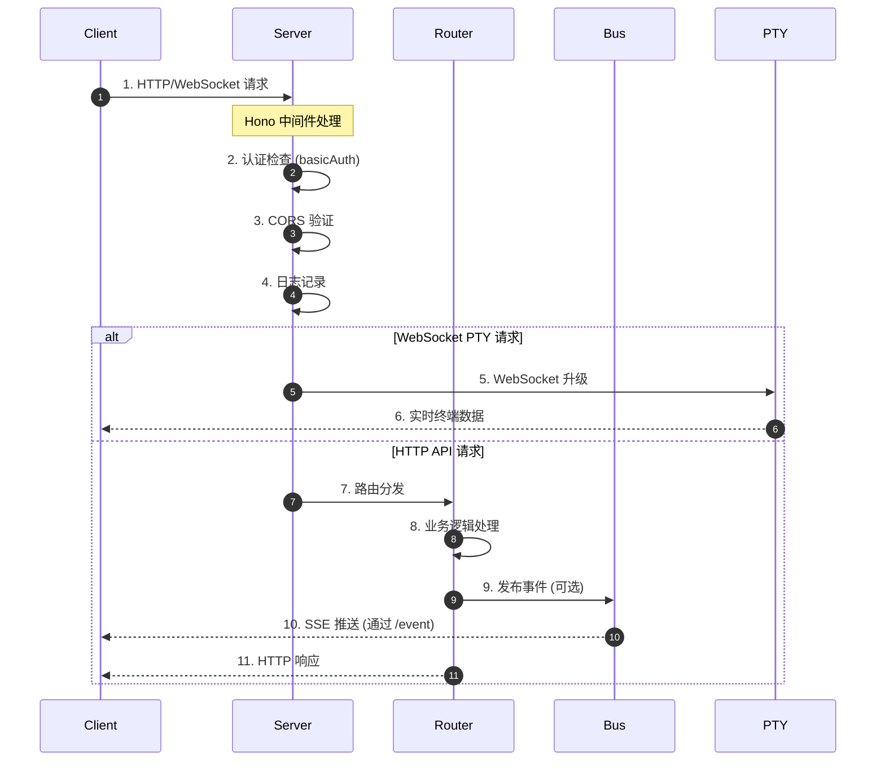

**关键交互说明**：

| 步骤 | 交互内容 | 设计意图 |
|-----|---------|---------|
| 1 | 客户端发起请求 | 支持 HTTP 和 WebSocket 两种协议 |
| 2-4 | 全局中间件处理 | 统一认证、跨域、日志，避免重复代码 |
| 5-6 | WebSocket PTY 连接 | 长连接支持实时终端交互 |
| 7-11 | HTTP 请求处理流程 | 标准 REST API 生命周期 |
| 9-10 | 事件发布与推送 | 状态变更通过 SSE 实时通知客户端 |

---

## 3. 核心组件详细分析

### 3.1 Server 模块内部结构

#### 职责定位

Server 模块是 Web Server 的入口，负责 Hono 应用创建、全局中间件配置和 Bun.serve 启动。

#### 状态机图

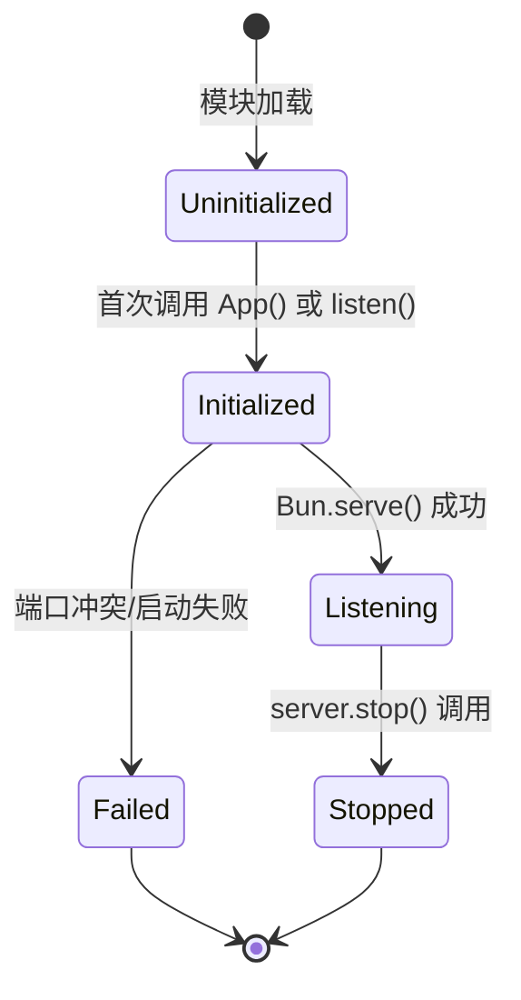

**状态说明**：

| 状态 | 说明 | 进入条件 | 退出条件 |
|-----|------|---------|---------|
| Uninitialized | 未初始化 | 模块加载完成 | 调用 App() 或 listen() |
| Initialized | Hono 应用已创建 | lazy 初始化完成 | 调用 Bun.serve 或失败 |
| Listening | 服务器运行中 | Bun.serve 成功 | 调用 stop() |
| Failed | 启动失败 | Bun.serve 抛出异常 | 无 |
| Stopped | 已停止 | stop() 调用完成 | 无 |

#### 内部数据流

```text
┌─────────────────────────────────────────────────────────────┐
│  输入层                                                      │
│  ├── HTTP 请求 ──► Hono Router ──► 路由匹配                 │
│  └── WebSocket ──► upgrade 检查 ──► PTY 连接                │
└──────────────────────────┬──────────────────────────────────┘
                           ▼
┌─────────────────────────────────────────────────────────────┐
│  处理层                                                      │
│  ├── 中间件链: 错误处理 ──► 认证 ──► CORS ──► 日志          │
│  ├── 路由分发: 匹配路径前缀 ──► 子路由处理                    │
│  └── Instance 注入: 目录上下文初始化                         │
└──────────────────────────┬──────────────────────────────────┘
                           ▼
┌─────────────────────────────────────────────────────────────┐
│  输出层                                                      │
│  ├── HTTP 响应: JSON / Stream / SSE                         │
│  ├── WebSocket: 双向数据帧                                  │
│  └── 事件发布: Bus.publish ──► GlobalBus.emit               │
└─────────────────────────────────────────────────────────────┘
```

#### 关键算法逻辑

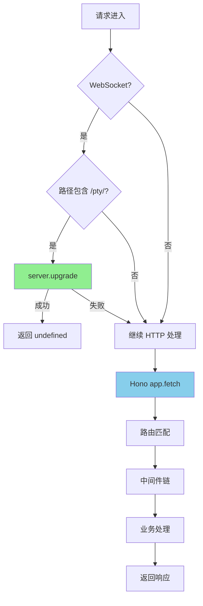

**算法要点**：

1. **WebSocket 升级检测**：在 Bun.serve 的 fetch 回调中优先检查 PTY 路径，确保 WebSocket 连接能正确升级
2. **延迟初始化**：Hono 应用通过 `lazy()` 包装，首次访问时才初始化，避免启动时加载开销
3. **端口回退**：默认尝试 4096 端口，被占用时自动回退到随机端口

#### 关键接口

| 接口 | 输入 | 输出 | 说明 | 代码位置 |
|-----|------|------|------|---------|
| `App()` | - | `Hono` | 获取/创建 Hono 实例 | `server.ts:58` |
| `listen()` | `{ port, hostname, mdns?, cors? }` | `Server` | 启动服务器 | `server.ts:576-622` |
| `openapi()` | - | `OpenAPISpecs` | 生成 OpenAPI 文档 | `server.ts:561-574` |

---

### 3.2 路由系统内部结构

#### 职责定位

路由系统基于 Hono 的模块化路由设计，将不同功能域拆分到独立文件，通过 `app.route()` 组合。

#### 路由注册流程

```mermaid
flowchart LR
    subgraph Global["全局路由"]
        G1[/health] --> G2[/event]
        G2 --> G3[/config]
    end

    subgraph Session["Session 路由"]
        S1[/] --> S2[/:id]
        S2 --> S3[/:id/message]
    end

    subgraph PTY["PTY 路由"]
        P1[/] --> P2[/:ptyID]
        P2 --> P3[/:ptyID/connect]
    end

    subgraph MCP["MCP 路由"]
        M1[/] --> M2[/:name/auth]
        M2 --> M3[/:name/connect]
    end

    App --> Global
    App --> Session
    App --> PTY
    App --> MCP

    style App fill:#f9f,stroke:#333
```

#### 路由中间件链

```text
请求进入
    │
    ▼
┌─────────────────────────────────────────┐
│ 1. 错误处理 (onError)                   │ 捕获所有未处理异常
│    - NamedError → 对应状态码           │
│    - HTTPException → 原样返回          │
│    - 其他 → 500 + 堆栈                  │
└─────────────────────────────────────────┘
    │
    ▼
┌─────────────────────────────────────────┐
│ 2. 认证中间件                           │ 可选 basicAuth
│    - OPTIONS 请求跳过                   │
│    - 检查 OPENCODE_SERVER_PASSWORD      │
└─────────────────────────────────────────┘
    │
    ▼
┌─────────────────────────────────────────┐
│ 3. 日志中间件                           │ 记录请求耗时
│    - 跳过 /log 端点                     │
└─────────────────────────────────────────┘
    │
    ▼
┌─────────────────────────────────────────┐
│ 4. CORS 中间件                          │ 跨域配置
│    - localhost:* 自动允许               │
│    - tauri://localhost 允许             │
│    - *.opencode.ai 允许                 │
└─────────────────────────────────────────┘
    │
    ▼
┌─────────────────────────────────────────┐
│ 5. Instance 注入                        │ 项目上下文
│    - 从 query/header/cwd 获取目录      │
│    - 初始化 Instance 状态               │
└─────────────────────────────────────────┘
    │
    ▼
路由匹配与处理
```

---

### 3.3 事件总线 (Bus) 内部结构

#### 职责定位

Bus 是 OpenCode 的事件发布订阅系统，支持实例内事件和全局事件广播，是 SSE 实时推送的基础。

#### 状态机图

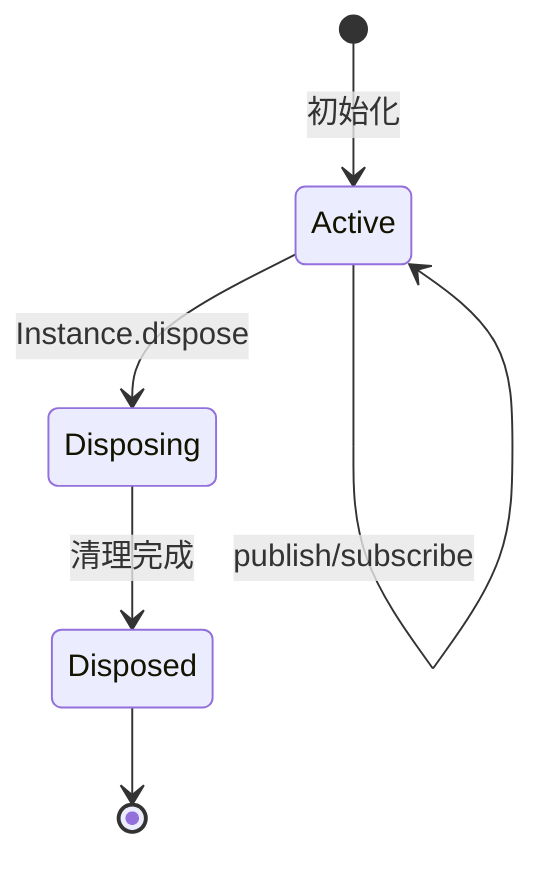

#### 内部数据流

```text
┌─────────────────────────────────────────────────────────────┐
│  发布者                                                      │
│  Bus.publish(Event, data)                                   │
│     │                                                       │
│     ▼                                                       │
│  ┌─────────────────────────────────────────┐                │
│  │ 1. 构造 payload { type, properties }    │                │
│  │ 2. 匹配 subscriptions[type] 和 ["*"]    │                │
│  │ 3. 调用所有订阅者回调                    │                │
│  │ 4. GlobalBus.emit("event", {directory,  │                │
│  │    payload})  // 跨实例广播             │                │
│  └─────────────────────────────────────────┘                │
│     │                                                       │
│     ▼                                                       │
│  订阅者                                                      │
│  - Bus.subscribe(Event, callback)  // 类型过滤              │
│  - Bus.subscribeAll(callback)      // 通配订阅              │
└─────────────────────────────────────────────────────────────┘
```

#### 关键接口

| 接口 | 输入 | 输出 | 说明 | 代码位置 |
|-----|------|------|------|---------|
| `publish()` | `BusEvent.Definition`, `properties` | `Promise<void>` | 发布事件 | `bus/index.ts:41-64` |
| `subscribe()` | `BusEvent.Definition`, `callback` | `() => void` | 订阅特定事件 | `bus/index.ts:66-71` |
| `subscribeAll()` | `callback` | `() => void` | 订阅所有事件 | `bus/index.ts:85-87` |

---

### 3.4 PTY 模块内部结构

#### 职责定位

PTY 模块管理伪终端会话，通过 WebSocket 提供实时终端功能，支持多客户端连接和数据缓冲。

#### 状态机图

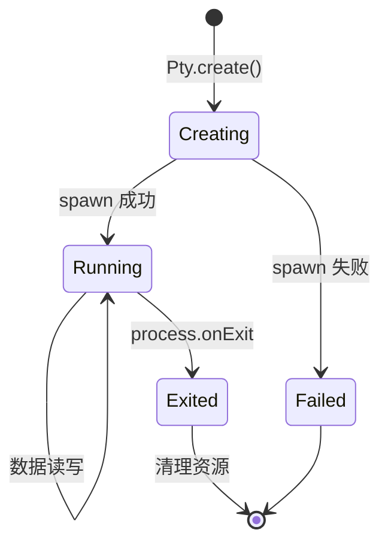

**状态说明**：

| 状态 | 说明 | 进入条件 | 退出条件 |
|-----|------|---------|---------|
| Creating | 创建中 | 调用 create() | spawn 完成 |
| Running | 运行中 | spawn 成功 | 进程退出 |
| Exited | 已退出 | onExit 回调 | 自动清理 |
| Failed | 创建失败 | spawn 抛出异常 | 无 |

#### 内部数据流

```text
┌─────────────────────────────────────────────────────────────┐
│  输入: WebSocket 消息                                        │
│  ├── 文本数据 ──► pty.process.write()                       │
│  └── 控制命令 ──► resize / kill                             │
└──────────────────────────┬──────────────────────────────────┘
                           ▼
┌─────────────────────────────────────────────────────────────┐
│  PTY 进程 (bun-pty)                                          │
│  ├── onData: 输出数据                                       │
│  │   ├── 转发到所有 subscribers (WebSocket)                 │
│  │   └── 写入 buffer (2MB 限制)                             │
│  └── onExit: 进程退出                                       │
│      ├── 关闭所有 WebSocket 连接                            │
│      ├── 发布 pty.exited 事件                               │
│      └── 清理 state                                         │
└─────────────────────────────────────────────────────────────┘
```

#### 关键算法：数据缓冲与重放

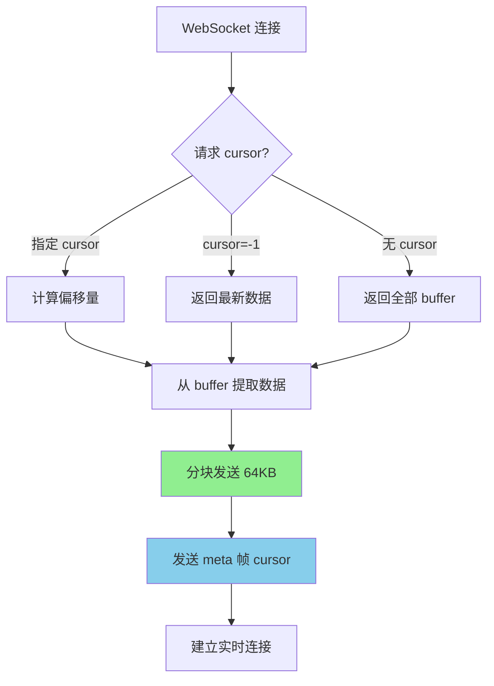

**算法要点**：

1. **环形缓冲区**：2MB 限制，超出时丢弃旧数据
2. **游标机制**：每个数据字节有唯一 cursor，支持断线重连后恢复
3. **分块发送**：大数据分 64KB 块发送，避免阻塞
4. **元数据帧**：WebSocket 控制帧 (0x00) 携带当前 cursor 位置

---

### 3.5 组件间协作时序

#### Session 创建与消息发送

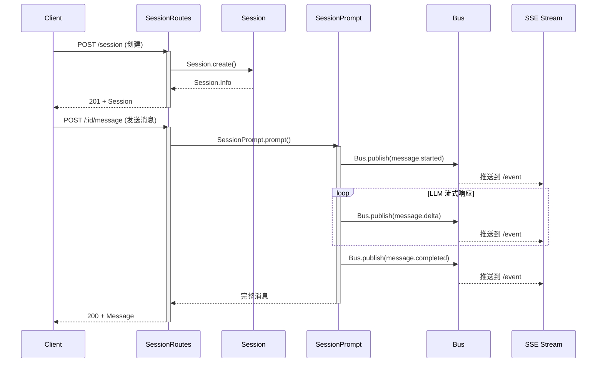

**协作要点**：

1. **异步事件通知**：业务处理与事件推送解耦，客户端通过 SSE 获取实时进度
2. **流式响应**：SessionPrompt 在处理过程中持续发布事件，不等待完成
3. **状态隔离**：每个请求在独立的 Instance 上下文中执行

---

### 3.6 关键数据路径

#### 主路径（HTTP API 请求）

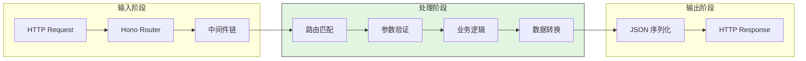

#### 异常路径（错误处理）

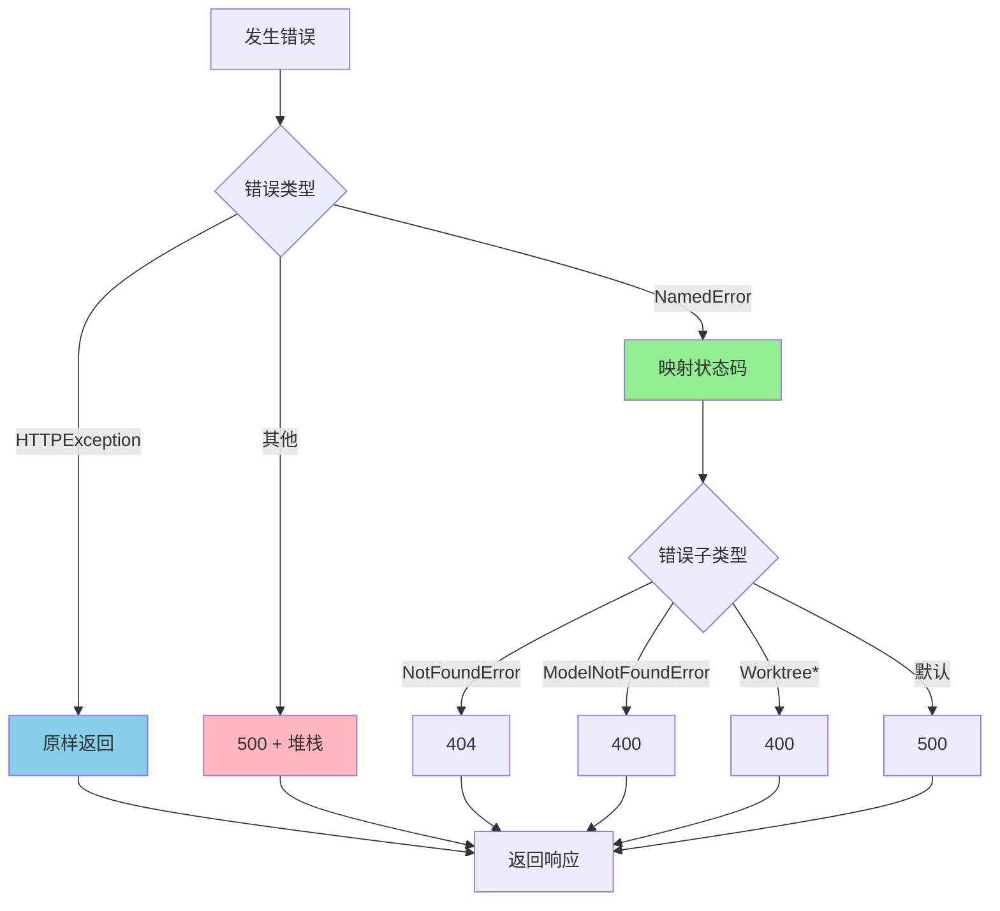

---

## 4. 端到端数据流转

### 4.1 正常流程（详细版）

#### SSE 事件订阅流程

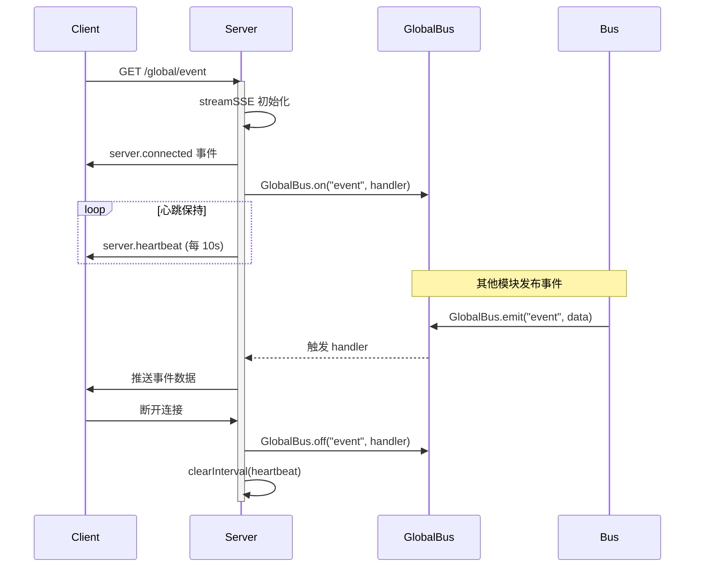

**数据变换详情**：

| 阶段 | 输入 | 处理 | 输出 | 代码位置 |
|-----|------|------|------|---------|
| 连接建立 | HTTP Request | 设置 SSE 响应头 | ReadableStream | `server.ts:486-506` |
| 事件序列化 | BusEvent | JSON.stringify | SSE data 帧 | `server.ts:513-516` |
| 心跳生成 | Timer | 固定格式 JSON | SSE data 帧 | `server.ts:523-530` |
| 连接终止 | AbortSignal | 清理订阅和定时器 | - | `server.ts:532-539` |

### 4.2 WebSocket PTY 连接流程

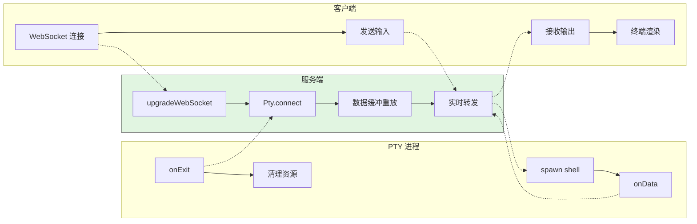

### 4.3 异常/边界流程

#### 端口冲突处理

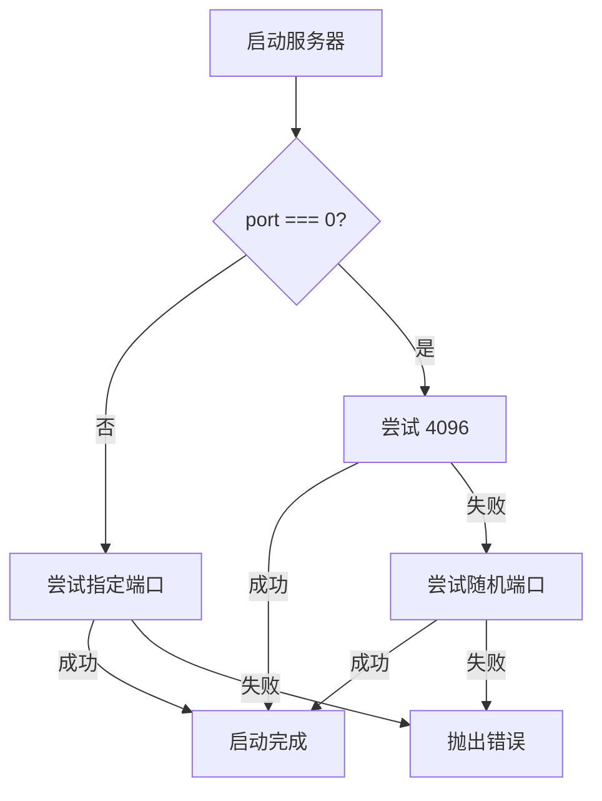

#### WebSocket 连接异常

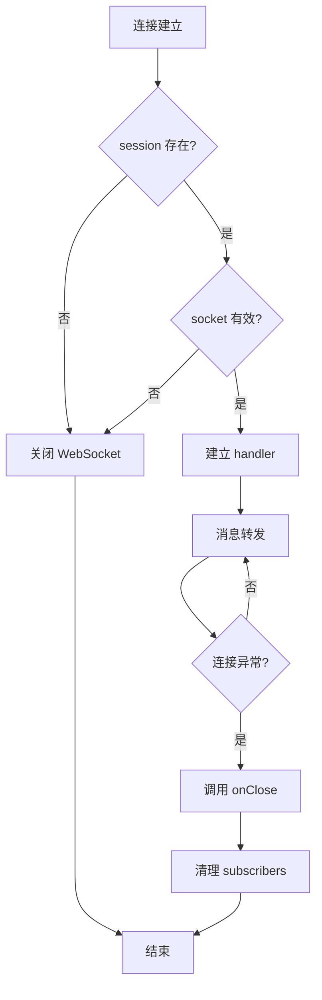

---

## 5. 关键代码实现

### 5.1 核心数据结构

```typescript
// src/server/server.ts:57
const app = new Hono()

// src/pty/index.ts:95-106
export const Info = z
  .object({
    id: Identifier.schema("pty"),
    title: z.string(),
    command: z.string(),
    args: z.array(z.string()),
    cwd: z.string(),
    status: z.enum(["running", "exited"]),
    pid: z.number(),
  })
  .meta({ ref: "Pty" })

// src/bus/index.ts:11-16
export const InstanceDisposed = BusEvent.define(
  "server.instance.disposed",
  z.object({
    directory: z.string(),
  }),
)
```

**字段说明**：

| 字段 | 类型 | 用途 |
|-----|------|------|
| `app` | `Hono` | Hono 应用实例，延迟初始化 |
| `Info` | `z.object` | PTY 会话信息 Schema |
| `InstanceDisposed` | `BusEvent` | 实例释放事件定义 |

### 5.2 主链路代码

#### Bun.serve 启动

```typescript
// src/server/server.ts:576-622
export function listen(opts: {
  port: number
  hostname: string
  mdns?: boolean
  mdnsDomain?: string
  cors?: string[]
}) {
  _corsWhitelist = opts.cors ?? []

  const args = {
    hostname: opts.hostname,
    idleTimeout: 0,
    fetch: App().fetch,
    websocket: websocket,
  } as const
  const tryServe = (port: number) => {
    try {
      return Bun.serve({ ...args, port })
    } catch {
      return undefined
    }
  }
  const server = opts.port === 0 ? (tryServe(4096) ?? tryServe(0)) : tryServe(opts.port)
  if (!server) throw new Error(`Failed to start server on port ${opts.port}`)

  _url = server.url
  // ... mDNS 发布
  return server
}
```

**代码要点**：

1. **端口回退策略**：默认 4096，被占用时自动尝试随机端口
2. **idleTimeout: 0**：禁用连接超时，支持长连接
3. **websocket 处理器**：使用 Hono 的 `hono/bun` 提供的 WebSocket 支持

#### SSE 事件流实现

```typescript
// src/server/server.ts:486-541
.get(
  "/event",
  // ... OpenAPI 描述
  async (c) => {
    log.info("event connected")
    c.header("X-Accel-Buffering", "no")
    c.header("X-Content-Type-Options", "nosniff")
    return streamSSE(c, async (stream) => {
      stream.writeSSE({
        data: JSON.stringify({
          type: "server.connected",
          properties: {},
        }),
      })
      const unsub = Bus.subscribeAll(async (event) => {
        await stream.writeSSE({
          data: JSON.stringify(event),
        })
        if (event.type === Bus.InstanceDisposed.type) {
          stream.close()
        }
      })

      // Send heartbeat every 10s to prevent stalled proxy streams.
      const heartbeat = setInterval(() => {
        stream.writeSSE({
          data: JSON.stringify({
            type: "server.heartbeat",
            properties: {},
          }),
        })
      }, 10_000)

      await new Promise<void>((resolve) => {
        stream.onAbort(() => {
          clearInterval(heartbeat)
          unsub()
          resolve()
          log.info("event disconnected")
        })
      })
    })
  },
)
```

**代码要点**：

1. **防代理缓冲**：`X-Accel-Buffering: no` 确保 Nginx 等代理不缓冲 SSE
2. **心跳机制**：每 10 秒发送心跳，防止连接被中间件断开
3. **自动清理**：`stream.onAbort` 确保连接断开时释放资源

### 5.3 关键调用链

```text
Server.listen()                    [src/server/server.ts:576]
  -> Bun.serve({ fetch, websocket }) [src/server/server.ts:593]
    -> App().fetch()                 [src/server/server.ts:588]
      -> Hono Router                 [src/server/server.ts:57]
        -> 中间件链                   [src/server/server.ts:62-131]
          -> 路由匹配                 [src/server/server.ts:132-237]
            - SessionRoutes           [src/server/routes/session.ts:22]
            - PtyRoutes               [src/server/routes/pty.ts:10]
            - McpRoutes               [src/server/routes/mcp.ts:9]
            - GlobalRoutes            [src/server/routes/global.ts:18]
```

---

## 6. 设计意图与 Trade-off

### 6.1 OpenCode 的选择

| 维度 | OpenCode 的选择 | 替代方案 | 取舍分析 |
|-----|----------------|---------|---------|
| Web 框架 | Hono | Express / Fastify | 轻量、Edge 运行时友好，但生态相对较小 |
| 运行时 | Bun | Node.js | 原生 WebSocket、更高性能，但兼容性风险 |
| 路由组织 | 模块化 Hono Router | 单一文件 / 装饰器 | 清晰分离，但路由链式调用导致类型推断困难 |
| 事件系统 | 自定义 Bus + EventEmitter | RxJS / EventEmitter2 | 简单够用，但功能有限 |
| PTY 实现 | bun-pty | node-pty | Bun 原生支持，但功能可能不如 node-pty 完善 |
| 协议支持 | HTTP + WebSocket + SSE | gRPC / WebRTC | 简单通用，但实时性不如 WebRTC |

### 6.2 为什么这样设计？

**核心问题**：如何构建一个支持多协议、高性能、易扩展的 Web Server？

**OpenCode 的解决方案**：

- **代码依据**：`src/server/server.ts:57-622`
- **设计意图**：
  1. **Hono + Bun 组合**：利用 Bun 的高性能 HTTP 和原生 WebSocket，Hono 提供轻量级路由
  2. **模块化路由**：每个功能域独立文件，通过 `app.route()` 组合，便于维护
  3. **统一事件总线**：Bus 模块统一处理实例内事件，GlobalBus 处理跨实例广播
  4. **延迟初始化**：Hono 应用和路由通过 `lazy()` 包装，减少启动开销

- **带来的好处**：
  - 高性能：Bun 的 HTTP 性能优于 Node.js
  - 原生 WebSocket：无需额外依赖
  - 类型安全：Zod Schema 验证请求参数
  - 自动文档：hono-openapi 自动生成 OpenAPI 规范

- **付出的代价**：
  - Bun 兼容性：部分 npm 包可能不兼容 Bun
  - 类型推断：长路由链导致 TypeScript 类型推断困难（代码中显式注释）
  - 生态限制：Hono 中间件生态不如 Express 丰富

### 6.3 与其他项目的对比

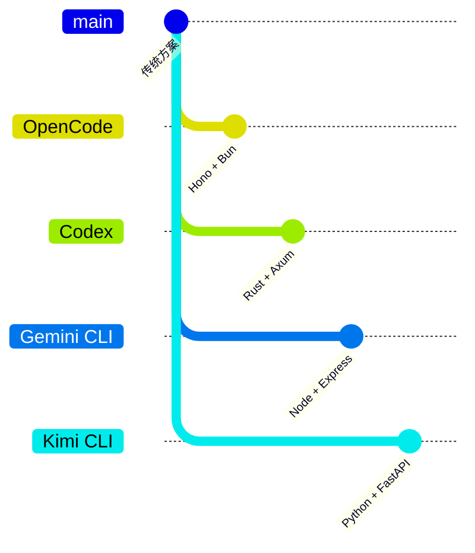

| 项目 | 核心差异 | 适用场景 |
|-----|---------|---------|
| OpenCode | Hono + Bun，原生 WebSocket，模块化路由 | 追求性能、Bun 生态 |
| Codex | Rust + Axum，原生沙箱，CancellationToken | 企业级安全、Rust 生态 |
| Gemini CLI | Node + Express，Scheduler 状态机 | 成熟生态、复杂状态管理 |
| Kimi CLI | Python + FastAPI，Checkpoint 回滚 | Python 生态、状态持久化 |

**关键差异分析**：

1. **运行时选择**：
   - OpenCode: Bun（高性能，但较新）
   - Codex: Rust（安全、性能）
   - Gemini CLI / Kimi CLI: Node.js / Python（成熟生态）

2. **WebSocket 支持**：
   - OpenCode: Bun 原生支持，无需额外库
   - 其他项目: 通常需要 ws 库或框架内置支持

3. **协议丰富度**：
   - OpenCode: HTTP + WebSocket + SSE + MCP
   - Codex: HTTP + gRPC（内部通信）
   - Gemini CLI: HTTP + WebSocket

---

## 7. 边界情况与错误处理

### 7.1 终止条件

| 终止原因 | 触发条件 | 代码位置 |
|---------|---------|---------|
| 端口冲突 | Bun.serve 抛出异常 | `server.ts:593-596` |
| 实例释放 | 调用 /instance/dispose | `server.ts:239-258` |
| 全局释放 | 调用 /global/dispose | `global.ts:156-184` |
| PTY 退出 | 进程 exit | `pty/index.ts:256-268` |
| SSE 断开 | 客户端关闭连接 | `server.ts:532-539` |

### 7.2 超时/资源限制

```typescript
// src/pty/index.ts:15-16
const BUFFER_LIMIT = 1024 * 1024 * 2  // 2MB 缓冲区限制
const BUFFER_CHUNK = 64 * 1024        // 64KB 分块发送

// src/server/server.ts:587
idleTimeout: 0  // 禁用连接超时
```

### 7.3 错误恢复策略

| 错误类型 | 处理策略 | 代码位置 |
|---------|---------|---------|
| NamedError | 映射到对应 HTTP 状态码 | `server.ts:66-72` |
| HTTPException | 原样返回响应 | `server.ts:74` |
| 未知错误 | 500 + 堆栈信息 | `server.ts:75-78` |
| WebSocket 无效 | 关闭连接 | `pty.ts:181-184` |
| PTY 不存在 | 关闭 WebSocket | `pty/index.ts:321-324` |

---

## 8. 关键代码索引

| 功能 | 文件 | 行号 | 说明 |
|-----|------|------|------|
| 入口 | `src/server/server.ts` | 576 | `listen()` 启动服务器 |
| Hono 应用 | `src/server/server.ts` | 57 | Hono 实例创建 |
| 错误处理 | `src/server/server.ts` | 62-78 | 全局错误处理器 |
| 认证 | `src/server/server.ts` | 80-88 | basicAuth 中间件 |
| CORS | `src/server/server.ts` | 106-131 | 跨域配置 |
| Instance 注入 | `src/server/server.ts` | 195-212 | 目录上下文初始化 |
| 路由注册 | `src/server/server.ts` | 132-237 | 模块化路由挂载 |
| SSE 事件流 | `src/server/server.ts` | 486-541 | `/event` 端点 |
| OpenAPI 文档 | `src/server/server.ts` | 213-225 | `/doc` 端点 |
| Session 路由 | `src/server/routes/session.ts` | 22-936 | Session CRUD |
| PTY 路由 | `src/server/routes/pty.ts` | 10-200 | WebSocket PTY |
| MCP 路由 | `src/server/routes/mcp.ts` | 9-225 | MCP 管理 |
| Global 路由 | `src/server/routes/global.ts` | 18-185 | 健康检查、SSE |
| 事件发布 | `src/bus/index.ts` | 41-64 | `Bus.publish()` |
| 事件订阅 | `src/bus/index.ts` | 66-87 | `Bus.subscribe()` |
| PTY 创建 | `src/pty/index.ts` | 174-272 | `Pty.create()` |
| PTY 连接 | `src/pty/index.ts` | 320-389 | `Pty.connect()` |

---

## 9. 延伸阅读

- 前置知识：[Hono 框架文档](https://hono.dev/)、[Bun 文档](https://bun.sh/)
- 相关机制：[04-opencode-agent-loop.md](./04-opencode-agent-loop.md)、[06-opencode-mcp-integration.md](./06-opencode-mcp-integration.md)
- 深度分析：[opencode-session-management.md](./questions/opencode-session-management.md)

---

*✅ Verified: 基于 opencode/packages/opencode/src/server/server.ts:57-622 等源码分析*
*基于版本：2026-02-08 | 最后更新：2026-03-03*
