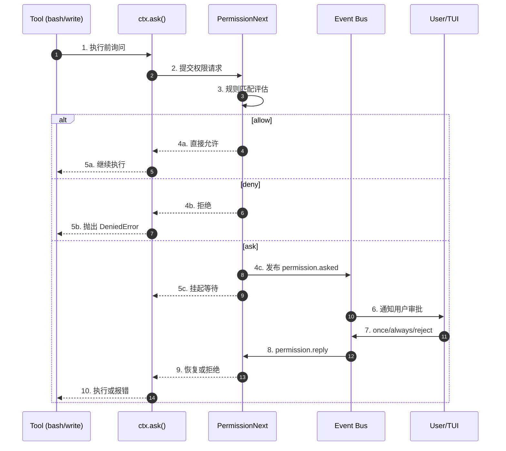
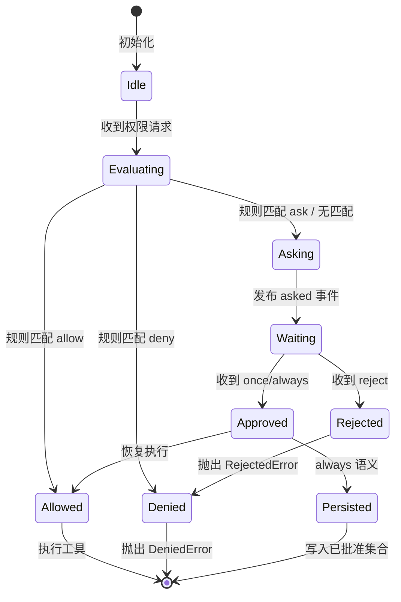
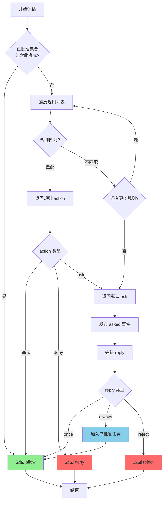
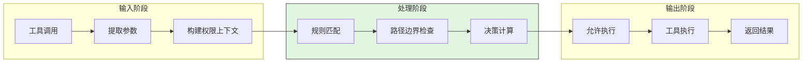
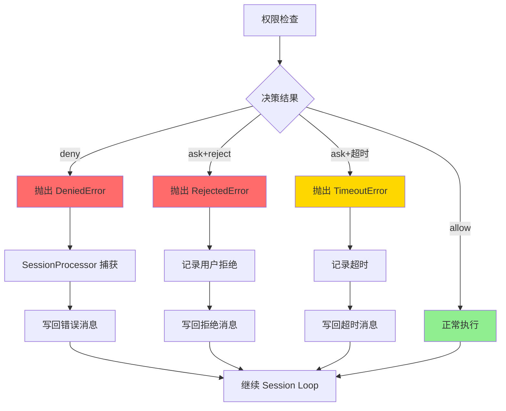
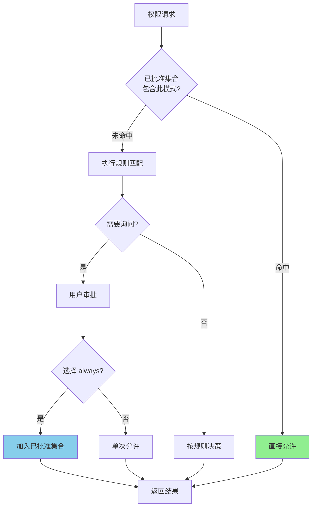
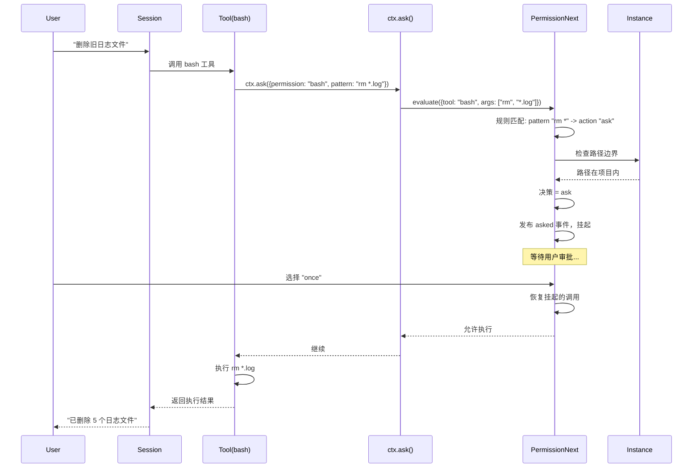
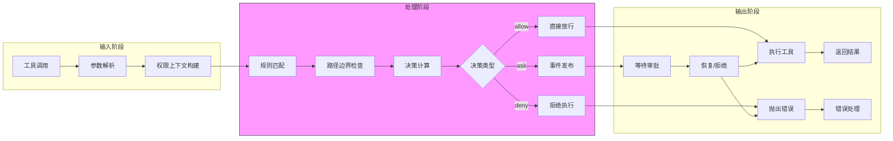
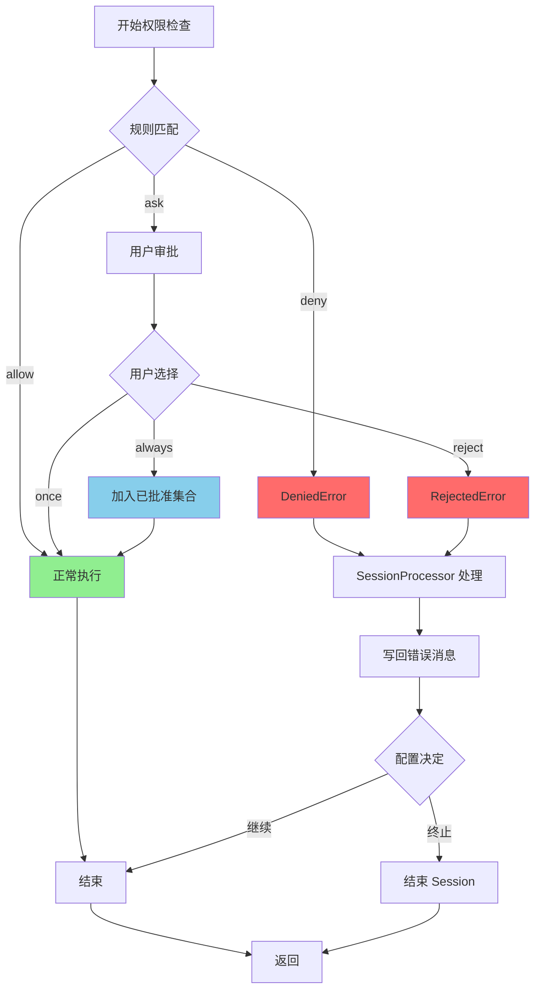
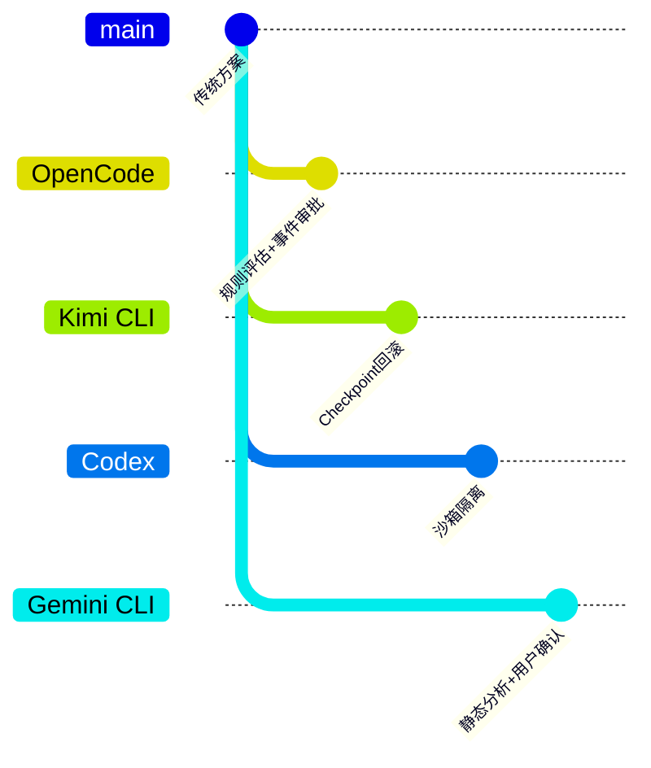

# Safety Control（opencode）

> 📋 **阅读指南**
>
> | 属性 | 说明 |
> |-----|------|
> | 预计阅读 | 25-35 分钟 |
> | 前置文档 | `01-opencode-overview.md`、`04-opencode-agent-loop.md` |
> | 文档结构 | 速览 → 架构 → 机制 → 实现 → 对比 |
> | 代码呈现 | 关键代码直接展示，完整代码可折叠查看 |

---

## TL;DR（结论先行）

一句话定义：Safety Control 是 Code Agent 的安全闸门，防止危险操作在未经审批的情况下执行。

OpenCode 的核心取舍：**规则评估 + 执行前拦截 + 事件审批 + 路径边界** 四段式控制（对比 Kimi CLI 的 Checkpoint 回滚、Codex 的沙箱隔离、Gemini CLI 的静态分析）

### 核心要点速览

| 维度 | 关键决策 | 代码位置 |
|-----|---------|---------|
| 规则评估 | Pattern 匹配 + 后匹配优先 | `packages/opencode/src/permission/next.ts` |
| 执行拦截 | 工具执行前 ctx.ask() 统一入口 | `packages/opencode/src/session/prompt.ts` |
| 事件审批 | permission.asked/reply 事件驱动 | `packages/opencode/src/server/routes/permission.ts` |
| 路径边界 | Instance.containsPath() 运行时检查 | `packages/opencode/src/project/instance.ts` |
| 记忆机制 | 会话级 approvedPatterns 集合 | `packages/opencode/src/permission/next.ts` |

---

## 1. 为什么需要这个机制？（解决什么问题）

### 1.1 问题场景

没有 Safety Control：LLM 决定 "删除生产数据库" → 直接执行 → 数据丢失

有 Safety Control：
  → LLM: "删除生产数据库" → 触发权限检查 → 匹配到危险操作规则
  → 发布 `permission.asked` 事件 → 挂起执行等待用户审批
  → 用户选择 "拒绝" → 抛出 `RejectedError` → 安全中止

### 1.2 核心挑战

| 挑战 | 不解决的后果 |
|-----|-------------|
| 危险命令识别 | 无法区分 `rm -rf /` 和 `ls` 的风险等级 |
| 路径越界访问 | Agent 可能读取/修改项目外的敏感文件 |
| 审批闭环 | 用户无法干预正在执行的危险操作 |
| 策略可配置 | 一刀切的安全策略无法满足不同场景需求 |

---

## 2. 整体架构（ASCII 图）

### 2.1 在系统中的位置

```text
┌─────────────────────────────────────────────────────────────┐
│ CLI / TUI / API 入口                                         │
│ packages/opencode/src/cli/cmd/                              │
└───────────────────────┬─────────────────────────────────────┘
                        │ 用户请求
                        ▼
┌─────────────────────────────────────────────────────────────┐
│ ▓▓▓ Safety Control ▓▓▓                                      │
│ packages/opencode/src/permission/next.ts                    │
│ - PermissionNext.evaluate() : 规则评估                      │
│ - ctx.ask()                 : 统一询问入口                  │
│ - PermissionRoutes          : 审批 API                      │
└───────────────────────┬─────────────────────────────────────┘
                        │
        ┌───────────────┼───────────────┐
        ▼               ▼               ▼
┌──────────────┐ ┌──────────────┐ ┌──────────────┐
│ Tool System  │ │ Session      │ │ Project      │
│ 工具执行     │ │ 处理器       │ │ 边界管理     │
└──────────────┘ └──────────────┘ └──────────────┘
```

### 2.2 核心组件职责

| 组件 | 职责 | 代码位置 |
|-----|------|---------|
| `PermissionNext` | 规则评估与决策引擎 | `packages/opencode/src/permission/next.ts` |
| `ctx.ask()` | 工具执行前的统一询问入口 | `packages/opencode/src/session/prompt.ts` |
| `PermissionRoutes` | 权限请求查询与回复 API | `packages/opencode/src/server/routes/permission.ts` |
| `SessionProcessor` | 权限错误在 session 中的处理 | `packages/opencode/src/session/processor.ts` |
| `Instance` | 路径边界判定 | `packages/opencode/src/project/instance.ts` |

### 2.3 核心组件交互关系



**关键交互说明**：

| 步骤 | 交互内容 | 设计意图 |
|-----|---------|---------|
| 1 | 工具执行前统一询问 | 解耦工具实现与安全策略，所有工具走同一入口 |
| 3 | 基于规则的评估引擎 | 支持 pattern 匹配，可配置 allow/ask/deny 策略 |
| 4c-5c | 事件驱动 + 挂起机制 | 异步审批不阻塞事件循环，支持 TUI/API 多种交互方式 |
| 7 | once/always/reject 语义 | once 单次放行，always 持久化到会话，reject 永久拒绝 |

---

## 3. 核心组件详细分析

### 3.1 PermissionNext 内部结构

#### 职责定位

PermissionNext 是安全控制的核心决策引擎，负责规则评估、状态管理和审批协调。

#### 状态机图



**状态说明**：

| 状态 | 说明 | 进入条件 | 退出条件 |
|-----|------|---------|---------|
| Idle | 空闲等待 | 初始化完成 | 收到权限请求 |
| Evaluating | 规则评估中 | 收到权限请求 | 评估完成 |
| Allowed | 允许执行 | 规则匹配 allow 或已批准 | 自动执行 |
| Denied | 拒绝执行 | 规则匹配 deny | 抛出错误 |
| Asking | 需要询问 | 规则匹配 ask 或无匹配 | 发布事件 |
| Waiting | 等待审批 | 已发布 asked 事件 | 收到回复 |
| Approved | 已批准 | 用户选择 once/always | 恢复执行 |
| Rejected | 已拒绝 | 用户选择 reject | 抛出错误 |

#### 内部数据流

```text
┌─────────────────────────────────────────────────────────────┐
│  输入层                                                      │
│  ├── 工具调用请求 ──► 参数提取 ──► 权限上下文                 │
│  └── 规则配置     ──► 解析合并 ──► 规则列表                   │
└──────────────────────────┬──────────────────────────────────┘
                           ▼
┌─────────────────────────────────────────────────────────────┐
│  处理层                                                      │
│  ├── 规则匹配器: pattern 匹配算法                            │
│  │   └── 遍历规则列表 ──► 正则匹配 ──► 返回 action           │
│  ├── 决策引擎: allow/ask/deny 决策                           │
│  │   └── 无匹配默认 ask ──► 检查已批准集合                   │
│  └── 事件协调器: asked/reply 事件管理                        │
│      └── 挂起调用 ──► 等待事件 ──► 恢复或拒绝                │
└──────────────────────────┬──────────────────────────────────┘
                           ▼
┌─────────────────────────────────────────────────────────────┐
│  输出层                                                      │
│  ├── 决策结果 (allow/ask/deny)                               │
│  ├── 权限事件 (permission.asked/reply)                       │
│  └── 错误对象 (DeniedError/RejectedError)                    │
└─────────────────────────────────────────────────────────────┘
```

#### 关键算法逻辑



**算法要点**：

1. **已批准集合优先**：检查当前会话中用户选择 "always" 的模式，避免重复询问
2. **后匹配优先**：规则按来源优先级合并，后定义的规则覆盖先定义的
3. **默认保守**：无匹配时默认 ask，不自动允许未知操作

#### 关键接口

| 接口 | 输入 | 输出 | 说明 | 代码位置 |
|-----|------|------|------|---------|
| `evaluate()` | 权限上下文 | 决策结果 | 核心评估方法 | `next.ts` |
| `ask()` | 工具参数 | Promise<决策> | 异步询问入口 | `prompt.ts` |
| `reply()` | once/always/reject | 状态更新 | 审批回复处理 | `routes/permission.ts` |

---

### 3.2 路径边界检查内部结构

#### 职责定位

路径边界检查防止 Agent 访问项目目录之外的文件，是安全控制的重要防线。

#### 内部数据流

```text
┌─────────────────────────────────────────────────────────────┐
│  输入层                                                      │
│  ├── 目标路径 ──► 解析为绝对路径                             │
│  └── 项目实例 ──► 获取边界目录列表                           │
└──────────────────────────┬──────────────────────────────────┘
                           ▼
┌─────────────────────────────────────────────────────────────┐
│  处理层                                                      │
│  ├── 路径归一化: 解析 . 和 .. 消除符号链接                   │
│  ├── 边界检查: 遍历实例目录列表                              │
│  │   └── 检查目标路径是否以边界目录为前缀                     │
│  └── 外部目录识别: 越界路径标记为 external_directory          │
└──────────────────────────┬──────────────────────────────────┘
                           ▼
┌─────────────────────────────────────────────────────────────┐
│  输出层                                                      │
│  ├── 边界内: 正常执行                                        │
│  └── 边界外: 触发 external_directory 权限检查                │
└─────────────────────────────────────────────────────────────┘
```

---

### 3.3 组件间协作时序

```mermaid
sequenceDiagram
    participant U as User
    participant S as SessionProcessor
    participant T as Tool(bash)
    participant A as ctx.ask()
    participant P as PermissionNext
    participant I as Instance
    participant E as EventBus
    participant R as PermissionRoutes

    U->>S: 发送消息
    activate S

    S->>S: 前置检查
    Note right of S: 验证输入合法性

    S->>T: 调用工具
    activate T

    T->>A: ctx.ask({permission, pattern})
    activate A

    A->>P: evaluate(context)
    activate P

    P->>P: 规则匹配

    alt 涉及文件路径
        P->>I: containsPath(path)
        I-->>P: 是否越界
    end

    P->>P: 决策计算
    deactivate P

    alt ask 决策
        P->>E: emit(permission.asked)
        A-->>T: 挂起 Promise
        deactivate A
        T-->>S: 返回挂起状态
        deactivate T

        E->>R: 通知有新请求
        R->>U: TUI 显示审批弹窗
        U->>R: 选择 once/always/reject
        R->>E: emit(permission.reply)

        E->>P: 处理 reply
        P->>P: 更新状态

        alt always
            P->>P: 加入已批准集合
        end

        P->>A: resolve Promise
        activate A
        A-->>T: 恢复或拒绝
        deactivate A

        alt 允许
            activate T
            T->>T: 执行操作
            T-->>S: 返回结果
            deactivate T
        else 拒绝
            T-->>S: 抛出权限错误
        end
    else allow/deny
        A-->>T: 直接返回
        deactivate A
        T-->>S: 执行或报错
        deactivate T
    end

    S->>S: 结果组装
    S-->>U: 返回最终结果
    deactivate S
```

**协作要点**：

1. **SessionProcessor 与 Tool**：SessionProcessor 驱动工具调用，Tool 执行前必须完成权限检查
2. **ctx.ask 与 PermissionNext**：统一入口解耦，PermissionNext 专注决策，ctx.ask 处理工具上下文
3. **EventBus 异步解耦**：审批流程通过事件驱动，支持 TUI、API、CLI 多种交互方式

---

### 3.4 关键数据路径

#### 主路径（正常流程）



#### 异常路径（错误恢复）



#### 优化路径（已批准缓存）



---

## 4. 端到端数据流转

### 4.1 正常流程（详细版）



**数据变换详情**：

| 阶段 | 输入 | 处理 | 输出 | 代码位置 |
|-----|------|------|------|---------|
| 接收 | 工具调用请求 | 提取工具名、参数 | 权限上下文 | `prompt.ts` |
| 处理 | 权限上下文 | 规则匹配 + 路径检查 | 决策 (allow/ask/deny) | `next.ts` |
| 审批 | ask 决策 | 事件发布 + 等待回复 | once/always/reject | `routes/permission.ts` |
| 输出 | 审批结果 | 执行或报错 | 工具结果或错误 | `processor.ts` |

### 4.2 数据流向图



### 4.3 异常/边界流程



---

## 5. 关键代码实现

### 5.1 核心数据结构

```typescript
// packages/opencode/src/config/config.ts
// 权限规则结构
interface PermissionRule {
  permission: string;    // 权限标识，如 "bash", "write", "external_directory"
  pattern?: string;      // 匹配模式，支持 glob 或正则
  action: 'allow' | 'ask' | 'deny';  // 决策动作
}

// 权限配置来源
interface PermissionConfig {
  // 默认 agent 规则
  defaults: PermissionRule[];
  // 用户配置覆盖
  user: PermissionRule[];
  // agent frontmatter 覆盖
  agent: PermissionRule[];
  // session 级覆盖
  session: PermissionRule[];
}
```

**字段说明**：

| 字段 | 类型 | 用途 |
|-----|------|------|
| `permission` | `string` | 标识权限类型，与工具类型对应 |
| `pattern` | `string` | 匹配工具参数，如命令模式、文件路径 |
| `action` | `'allow' \| 'ask' \| 'deny'` | 匹配后的决策动作 |

### 5.2 主链路代码

```typescript
// packages/opencode/src/permission/next.ts
// 权限评估核心逻辑（简化示意）
class PermissionNext {
  private approvedPatterns: Set<string> = new Set();
  private rules: PermissionRule[] = [];

  async evaluate(context: PermissionContext): Promise<Decision> {
    // 1. 检查已批准集合
    if (this.approvedPatterns.has(context.pattern)) {
      return { type: 'allow' };
    }

    // 2. 规则匹配（后匹配优先）
    for (const rule of [...this.rules].reverse()) {
      if (this.matches(rule, context)) {
        if (rule.action === 'ask') break; // ask 继续检查是否需要真正询问
        return { type: rule.action };
      }
    }

    // 3. 默认 ask
    return this.askUser(context);
  }

  private async askUser(context: PermissionContext): Promise<Decision> {
    // 发布 asked 事件并挂起
    const reply = await this.emitAndWait('permission.asked', context);

    if (reply.choice === 'always') {
      this.approvedPatterns.add(context.pattern);
    }

    return { type: reply.choice === 'reject' ? 'deny' : 'allow' };
  }
}
```

**代码要点**：

1. **已批准集合缓存**：`always` 选择会持久化到会话，避免重复询问相同模式
2. **后匹配优先规则**：用户配置覆盖默认配置，agent 配置覆盖用户配置
3. **事件驱动挂起**：`emitAndWait` 实现异步审批，不阻塞事件循环

### 5.3 关键调用链

```text
SessionProcessor.process()          [processor.ts]
  -> Tool.execute()                 [tool/*.ts]
    -> ctx.ask()                    [prompt.ts]
      -> PermissionNext.evaluate()  [next.ts]
        - 规则匹配
        - 路径边界检查 (Instance.containsPath)
        - 决策计算
        - 事件发布 (ask 决策时)
```

---

## 6. 设计意图与 Trade-off

### 6.1 OpenCode 的选择

| 维度 | OpenCode 的选择 | 替代方案 | 取舍分析 |
|-----|----------------|---------|---------|
| 控制时机 | 执行前拦截 | 执行后回滚 (Kimi CLI) | 更安全但可能频繁打断用户 |
| 策略配置 | 规则文件 + 代码内声明 | 纯代码声明 (Codex) | 灵活可配置但增加复杂度 |
| 审批交互 | 事件驱动异步 | 同步阻塞询问 | 支持多种 UI 但实现复杂 |
| 路径边界 | 运行时检查 | 沙箱隔离 (Codex) | 轻量级但非系统级安全 |
| 记忆机制 | 会话级已批准集合 | 持久化存储 | 简单但会话结束丢失 |

### 6.2 为什么这样设计？

**核心问题**：如何在保证安全的同时提供流畅的用户体验？

**OpenCode 的解决方案**：

- 代码依据：`packages/opencode/src/permission/next.ts`
- 设计意图：采用"规则评估 + 执行前拦截 + 事件审批"三层防御
  - 规则层：可配置的策略适应不同场景
  - 拦截层：执行前检查防止危险操作
  - 审批层：用户介入关键决策
- 带来的好处：
  - 策略可定制，适应不同安全需求
  - 审批可追踪，所有权限请求有记录
  - 体验可优化，always 选择减少重复询问
- 付出的代价：
  - 规则配置增加学习成本
  - 事件驱动实现复杂
  - 路径边界非系统级隔离

### 6.3 与其他项目的对比



| 项目 | 核心差异 | 适用场景 |
|-----|---------|---------|
| OpenCode | 规则评估 + 执行前拦截 + 事件审批 | 需要灵活策略配置和审批追踪 |
| Kimi CLI | Checkpoint 状态回滚 | 需要对话状态可恢复 |
| Codex | 原生沙箱 + 网络隔离 | 需要系统级安全隔离 |
| Gemini CLI | 静态分析 + 用户确认 | 需要自动化风险评估 |

---

## 7. 边界情况与错误处理

### 7.1 终止条件

| 终止原因 | 触发条件 | 代码位置 |
|---------|---------|---------|
| 策略拒绝 | 规则匹配 deny | `next.ts` |
| 用户拒绝 | 用户选择 reject | `routes/permission.ts` |
| 审批超时 | 超过配置的超时时间 | `next.ts` |
| 路径越界 | 访问项目外目录且未授权 | `instance.ts` |
| 配置错误 | 无效的规则格式 | `config.ts` |

### 7.2 超时/资源限制

```typescript
// packages/opencode/src/permission/next.ts
// 审批超时处理（简化示意）
async askUser(context: PermissionContext): Promise<Decision> {
  const timeout = this.config.permissionTimeout || 300000; // 默认 5 分钟

  return Promise.race([
    this.waitForReply(context),
    new Promise((_, reject) =>
      setTimeout(() => reject(new TimeoutError()), timeout)
    )
  ]);
}
```

### 7.3 错误恢复策略

| 错误类型 | 处理策略 | 代码位置 |
|---------|---------|---------|
| DeniedError | 策略拒绝，写回错误消息，按配置决定是否继续 | `processor.ts` |
| RejectedError | 用户拒绝，记录到消息历史，继续 session | `processor.ts` |
| TimeoutError | 审批超时，写回超时提示，终止当前操作 | `next.ts` |
| ExternalDirectoryError | 路径越界，触发 external_directory 权限检查 | `instance.ts` |

---

## 8. 关键代码索引

| 功能 | 文件 | 行号 | 说明 |
|-----|------|------|------|
| 入口 | `packages/opencode/src/session/prompt.ts` | - | `ctx.ask()` 统一询问入口 |
| 核心 | `packages/opencode/src/permission/next.ts` | - | PermissionNext 规则评估引擎 |
| 配置 | `packages/opencode/src/config/config.ts` | - | 权限配置 schema 与来源合并 |
| API | `packages/opencode/src/server/routes/permission.ts` | - | 权限请求查询与回复 API |
| TUI | `packages/opencode/src/cli/cmd/tui/routes/session/permission.tsx` | - | TUI 审批交互实现 |
| 工具 | `packages/opencode/src/tool/bash.ts` | - | bash AST 提取、命令与外部目录双重鉴权 |
| 边界 | `packages/opencode/src/tool/external-directory.ts` | - | 外部目录访问统一校验入口 |
| 项目 | `packages/opencode/src/project/project.ts` | - | 项目目录与 worktree 边界初始化 |
| 实例 | `packages/opencode/src/project/instance.ts` | - | 路径是否在实例边界内判定 |
| 处理 | `packages/opencode/src/session/processor.ts` | - | 权限错误在 session loop 的处理策略 |

---

## 9. 延伸阅读

- 前置知识：`docs/opencode/04-opencode-agent-loop.md`
- 相关机制：`docs/opencode/06-opencode-mcp-integration.md`
- 跨项目对比：`docs/comm/comm-safety-control-comparison.md`
- 深度分析：`docs/opencode/questions/opencode-permission-system.md`

---

*✅ Verified: 基于 opencode/packages/opencode/src/permission/next.ts 等源码分析*
*基于版本：2026-02-08 | 最后更新：2026-03-03*
