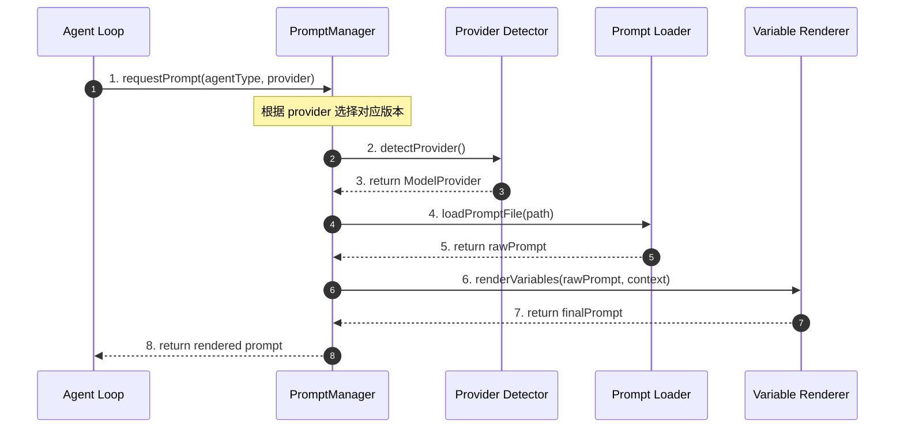
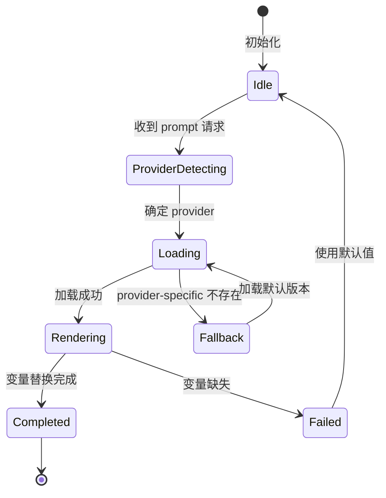
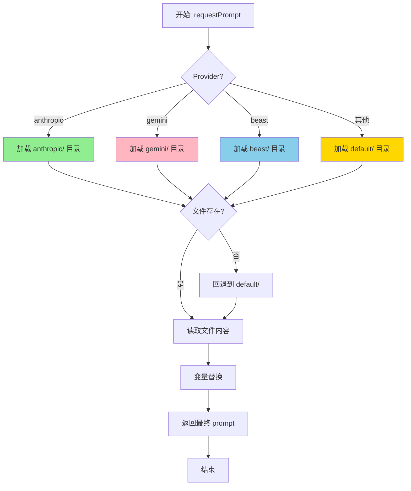
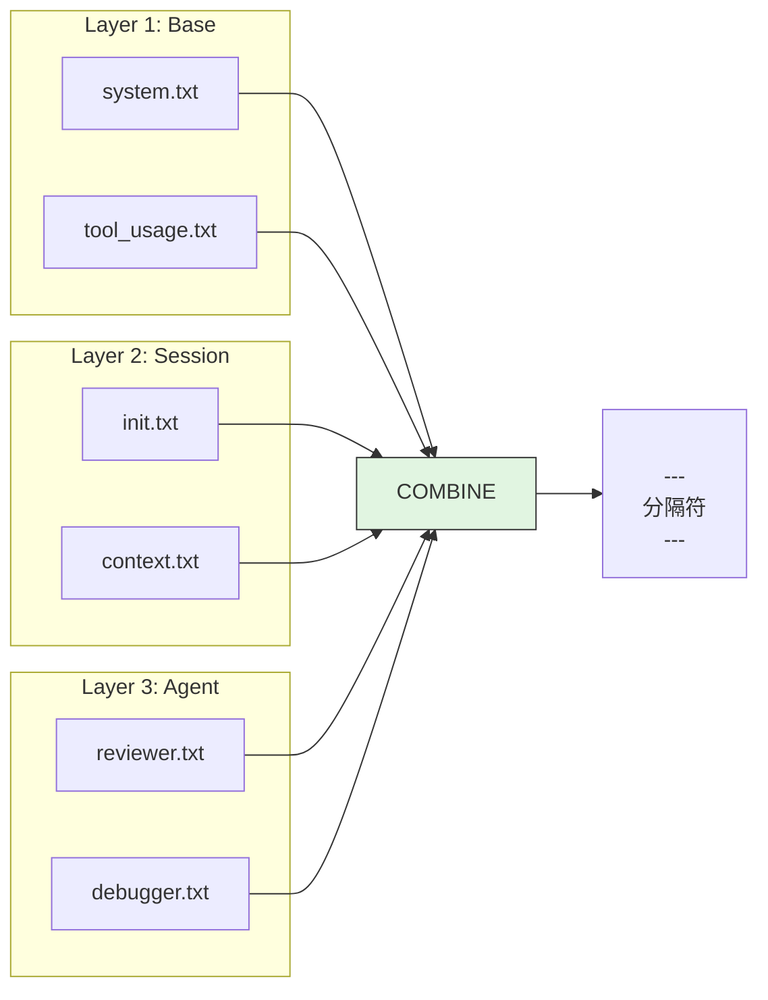
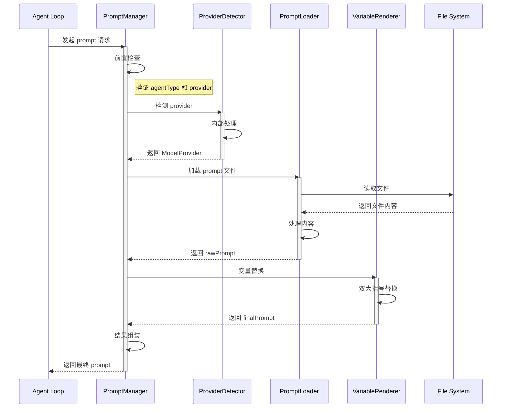
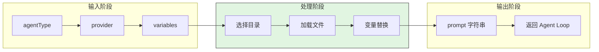
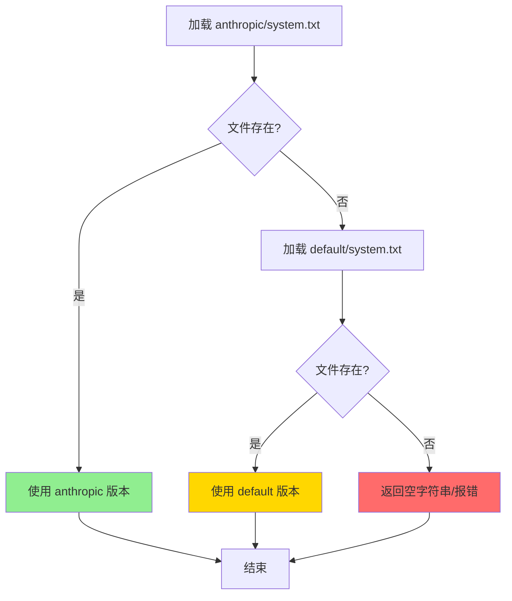
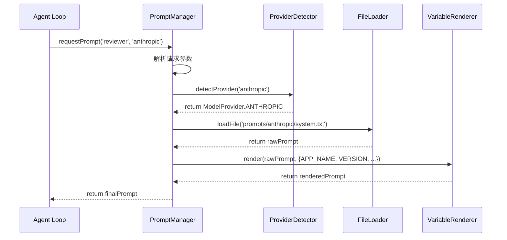
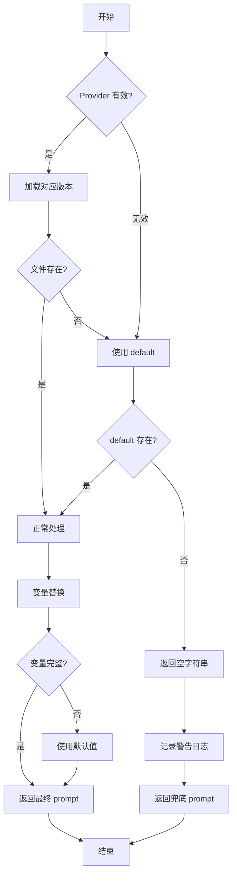
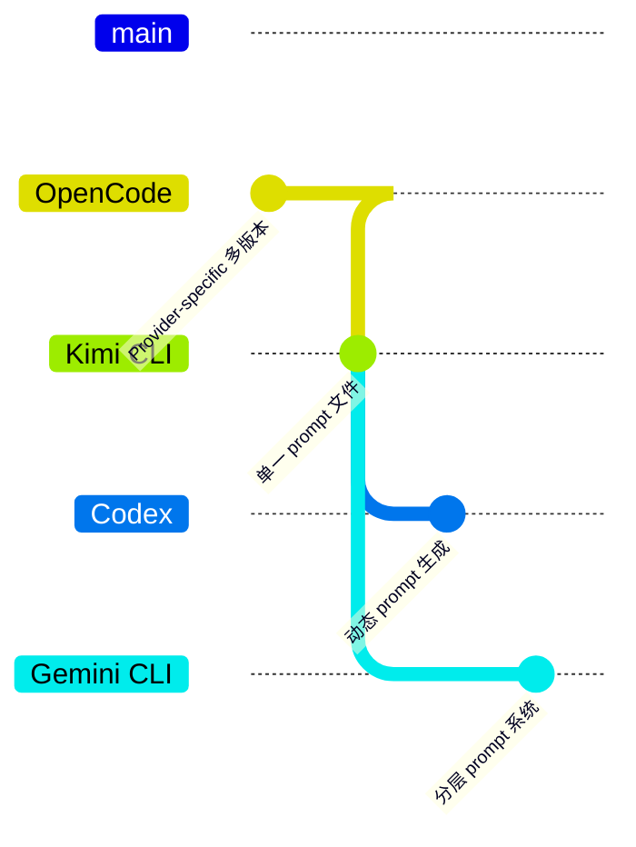

# Prompt Organization（opencode）

> 📋 **阅读指南**
>
> | 属性 | 说明 |
> |-----|------|
> | 预计阅读 | 20-30 分钟 |
> | 前置文档 | `01-opencode-overview.md`、`04-opencode-agent-loop.md` |
> | 文档结构 | 速览 → 架构 → 机制 → 实现 → 对比 |
> | 代码呈现 | 关键代码直接展示，完整代码可折叠查看 |

---

## TL;DR（结论先行）

一句话定义：Prompt Organization 是 AI Coding Agent 中用于管理和组织系统提示词的机制，决定如何根据模型提供商、Agent 类型和任务场景选择和组合提示词。

OpenCode 的核心取舍：**Provider-specific 多版本 + TypeScript 模块导入**（对比 Kimi CLI 的单一 prompt 文件、Codex 的动态 prompt 生成）

### 核心要点速览

| 维度 | 关键决策 | 代码位置 |
|-----|---------|---------|
| Provider 组织 | 目录隔离（anthropic/、gemini/） | `opencode/src/prompts/anthropic/system.txt:1` |
| 文件加载 | TypeScript 模块导入 txt 文件 | `opencode/src/prompts/index.ts:1` |
| 变量替换 | 双大括号 `{{VAR}}` 简单替换 | `opencode/src/prompts/utils.ts:1` |
| 回退策略 | 自动回退到 default 版本 | `opencode/src/prompts/index.ts:1` |
| 分层结构 | Provider → Session → Agent 三层 | `opencode/src/prompts/` |

---

## 1. 为什么需要这个机制？（解决什么问题）

### 1.1 问题场景

没有 Prompt Organization 机制时：

```
场景：用户在不同模型间切换（Claude → Gemini）

无适配：
  → 使用同一套 prompt 发给 Claude
  → 切换到 Gemini，仍用同一套 prompt
  → Gemini 解析习惯不同，输出质量下降

有适配：
  → 检测到 Anthropic provider
  → 加载 anthropic/system.txt（XML 结构优化）
  → 检测到 Gemini provider
  → 加载 gemini/system.txt（Markdown 结构优化）
```

### 1.2 核心挑战

| 挑战 | 不解决的后果 |
|-----|-------------|
| 模型差异 | 不同模型对 prompt 格式偏好不同，输出质量参差不齐 |
| 场景多样 | 代码审查、调试、重构等场景需要不同的系统指令 |
| 维护复杂 | prompt 分散在多处，更新时容易遗漏 |
| 动态变量 | 需要注入运行时信息（版本、路径、日期等） |

---

## 2. 整体架构（ASCII 图）

### 2.1 在系统中的位置

```text
┌─────────────────────────────────────────────────────────────┐
│ Agent Loop / Session Runtime                                 │
│ opencode/src/core/agent.ts                                   │
└───────────────────────┬─────────────────────────────────────┘
                        │ 请求 prompt
                        ▼
┌─────────────────────────────────────────────────────────────┐
│ ▓▓▓ Prompt Organization ▓▓▓                                 │
│ opencode/src/prompts/                                        │
│ - getPromptForProvider() : Provider 检测与选择              │
│ - loadPrompt()           : 文件加载                         │
│ - renderPrompt()         : 变量替换                         │
└───────────────────────┬─────────────────────────────────────┘
                        │ 依赖/调用
        ┌───────────────┼───────────────┐
        ▼               ▼               ▼
┌──────────────┐ ┌──────────────┐ ┌──────────────┐
│ Provider     │ │ Prompt Files │ │ Variable     │
│ Config       │ │ (*.txt)      │ │ Substitution │
│ (anthropic/  │ │              │ │ ({{VAR}})    │
│  gemini/)    │ │              │ │              │
└──────────────┘ └──────────────┘ └──────────────┘
```

### 2.2 核心组件职责

| 组件 | 职责 | 代码位置 |
|-----|------|---------|
| `PromptManager` | Provider 检测与 prompt 选择 | `opencode/src/prompts/index.ts:1` |
| `*.txt files` | 存储原始 prompt 内容 | `opencode/src/prompts/anthropic/system.txt:1` |
| `renderPrompt()` | 变量替换生成最终 prompt | `opencode/src/prompts/utils.ts:1` |
| `Session Prompt` | 会话级系统提示词 | `opencode/src/session/prompt/*.txt:1` |
| `Agent Prompt` | Agent 级专用提示词 | `opencode/src/agent/prompt/*.txt:1` |

### 2.3 核心组件交互关系



**关键交互说明**：

| 步骤 | 交互内容 | 设计意图 |
|-----|---------|---------|
| 1 | Agent Loop 请求 prompt | 解耦 prompt 生成与 Agent 逻辑 |
| 2-3 | Provider 检测 | 支持多模型动态切换 |
| 4-5 | 文件加载 | 使用 TypeScript 模块导入 txt 文件 |
| 6-7 | 变量渲染 | 注入运行时上下文信息 |
| 8 | 返回最终 prompt | 统一输出格式，直接用于 LLM 调用 |

---

## 3. 核心组件详细分析

### 3.1 PromptManager 内部结构

#### 职责定位

PromptManager 是 Prompt Organization 的核心协调器，负责根据 provider 和 agent 类型选择并组装合适的 prompt。

#### 状态机图



**状态说明**：

| 状态 | 说明 | 进入条件 | 退出条件 |
|-----|------|---------|---------|
| Idle | 空闲等待 | 初始化完成 | 收到 prompt 请求 |
| ProviderDetecting | 检测模型提供商 | 需要确定使用哪个 prompt 版本 | provider 确定 |
| Loading | 加载 prompt 文件 | 开始文件读取 | 加载成功或失败 |
| Fallback | 回退到默认版本 | provider-specific 文件不存在 | 加载默认版本 |
| Rendering | 变量替换 | prompt 模板已加载 | 替换完成 |
| Completed | 完成 | 最终 prompt 生成 | 返回结果 |
| Failed | 失败 | 文件不存在或变量错误 | 使用默认值或报错 |

#### 内部数据流

```text
┌─────────────────────────────────────────────────────────────┐
│  输入层                                                      │
│  ├── Agent 类型 ──► 确定 prompt 类别                         │
│  ├── Provider 信息 ──► 选择特定版本                          │
│  └── 运行时变量 ──► 构建替换映射                             │
└──────────────────────────┬──────────────────────────────────┘
                           ▼
┌─────────────────────────────────────────────────────────────┐
│  处理层                                                      │
│  ├── Provider 选择器: 根据配置选择对应子目录                  │
│  │   └── anthropic/ → gemini/ → beast/ → default/           │
│  ├── 文件加载器: TypeScript 模块导入 txt 文件                │
│  │   └── import prompt from './prompt.txt'                  │
│  └── 变量替换器: 双大括号 {{VAR}} 替换                       │
│      └── template.replace(/\{\{(\w+)\}\}/g, ...)            │
└──────────────────────────┬──────────────────────────────────┘
                           ▼
┌─────────────────────────────────────────────────────────────┐
│  输出层                                                      │
│  ├── 最终 prompt 字符串                                      │
│  ├── 元数据（provider、agent 类型）                          │
│  └── 缓存（可选）                                            │
└─────────────────────────────────────────────────────────────┘
```

#### 关键算法逻辑



**算法要点**：

1. **分层回退策略**：优先 provider-specific，不存在则回退到 default
2. **模块导入机制**：利用 TypeScript/Bundler 将 txt 作为字符串模块
3. **简单变量替换**：双大括号语法，避免引入复杂模板引擎

#### 关键接口

| 接口 | 输入 | 输出 | 说明 | 代码位置 |
|-----|------|------|------|---------|
| `getPrompt()` | provider, agentType | string | 获取最终 prompt | `opencode/src/prompts/index.ts:1` |
| `loadProviderPrompt()` | provider, type | string/null | 加载特定版本 | `opencode/src/prompts/index.ts:1` |
| `renderPrompt()` | template, variables | string | 变量替换 | `opencode/src/prompts/utils.ts:1` |

---

### 3.2 Prompt 分层结构

#### 职责定位

通过三层架构组织 prompt，实现关注点分离和复用。

#### 分层架构图

```text
┌─────────────────────────────────────────────────────┐
│ Layer 3: Agent-Specific Prompts                      │
│  - 专用 Agent 提示词                                  │
│  - 特定任务场景定制                                   │
│  - reviewer.txt / debugger.txt                       │
├─────────────────────────────────────────────────────┤
│ Layer 2: Session Prompts                             │
│  - 会话级系统提示词                                   │
│  - 对话上下文管理                                     │
│  - init.txt / context.txt                            │
├─────────────────────────────────────────────────────┤
│ Layer 1: Provider-Specific Base                      │
│  - Anthropic (Claude) 专用优化                       │
│  - Gemini 专用优化                                    │
│  - Beast 专用优化                                     │
│  - 默认/通用版本                                      │
│  - system.txt / tool_usage.txt                       │
└─────────────────────────────────────────────────────┘
```

#### 组合策略



---

### 3.3 组件间协作时序



**协作要点**：

1. **Agent Loop 与 PromptManager**：通过统一接口解耦，支持多种调用场景
2. **PromptManager 与 ProviderDetector**：provider 信息可缓存，避免重复检测
3. **PromptLoader 与 File System**：利用 TypeScript 模块系统，构建时即确定文件

---

### 3.4 关键数据路径

#### 主路径（正常流程）



#### 异常路径（回退处理）



---

## 4. 端到端数据流转

### 4.1 正常流程（详细版）



**数据变换详情**：

| 阶段 | 输入 | 处理 | 输出 | 代码位置 |
|-----|------|------|------|---------|
| 接收 | agentType, provider | 参数验证 | 结构化请求 | `opencode/src/prompts/index.ts:1` |
| Provider 检测 | provider 字符串 | 映射到枚举 | ModelProvider | `opencode/src/prompts/index.ts:1` |
| 文件加载 | 文件路径 | TypeScript 模块导入 | rawPrompt 字符串 | `opencode/src/prompts/anthropic/system.txt:1` |
| 变量替换 | rawPrompt + 变量映射 | 正则替换 | finalPrompt | `opencode/src/prompts/utils.ts:1` |

### 4.2 数据流向图

```mermaid
flowchart LR
    subgraph Input["输入阶段"]
        I1[agentType: 'reviewer'] --> I2[provider: 'anthropic']
        I2 --> I3[variables: {APP_NAME, ...}]
    end

    subgraph Process["处理阶段"]
        P1[选择 anthropic/ 目录] --> P2[加载 system.txt]
        P2 --> P3[替换 {{APP_NAME}} 等]
    end

    subgraph Output["输出阶段"]
        O1[生成最终 prompt] --> O2[发送至 LLM]
    end

    I3 --> P1
    P3 --> O1

    style Process fill:#f9f,stroke:#333
```

### 4.3 异常/边界流程



---

## 5. 关键代码实现

### 5.1 核心数据结构

```typescript
// opencode/src/prompts/types.ts:1
enum ModelProvider {
  ANTHROPIC = 'anthropic',
  GEMINI = 'gemini',
  BEAST = 'beast',
  DEFAULT = 'default'
}

enum PromptType {
  SYSTEM = 'system',
  TOOL_USAGE = 'tool_usage',
  SAFETY = 'safety'
}

interface PromptContext {
  APP_NAME: string;
  VERSION: string;
  MODEL_NAME: string;
  CWD: string;
  DATE: string;
}
```

**字段说明**：

| 字段 | 类型 | 用途 |
|-----|------|------|
| `ModelProvider` | enum | 定义支持的模型提供商 |
| `PromptType` | enum | 定义 prompt 类别 |
| `PromptContext` | interface | 运行时变量类型定义 |

### 5.2 主链路代码

```typescript
// opencode/src/prompts/index.ts:1-50
class PromptManager {
  private provider: ModelProvider;

  constructor(provider: ModelProvider) {
    this.provider = provider;
  }

  getPrompt(type: PromptType, context: PromptContext): string {
    // 1. 尝试加载 provider-specific 版本
    const providerPrompt = this.loadProviderPrompt(type);
    if (providerPrompt) {
      return this.renderPrompt(providerPrompt, context);
    }

    // 2. 回退到默认版本
    const defaultPrompt = this.loadDefaultPrompt(type);
    return this.renderPrompt(defaultPrompt, context);
  }

  private loadProviderPrompt(type: PromptType): string | null {
    try {
      // 动态加载对应 provider 的 prompt
      const prompt = require(`./${this.provider}/${type}.txt`);
      return prompt.default || prompt;
    } catch {
      return null;
    }
  }

  private renderPrompt(template: string, vars: PromptContext): string {
    return template.replace(/\{\{(\w+)\}\}/g, (match, key) => {
      return vars[key as keyof PromptContext] || match;
    });
  }
}
```

**代码要点**：

1. **分层回退策略**：优先 provider-specific，不存在则回退到 default
2. **简单变量替换**：使用正则替换双大括号，避免复杂模板引擎依赖
3. **模块动态加载**：利用 require 动态加载对应目录的 txt 文件

### 5.3 关键调用链

```text
Agent Loop
  -> getSystemPrompt()          [opencode/src/core/agent.ts:1]
    -> PromptManager.getPrompt() [opencode/src/prompts/index.ts:1]
      -> loadProviderPrompt()    [opencode/src/prompts/index.ts:1]
        - require(`./anthropic/system.txt`)
      -> renderPrompt()          [opencode/src/prompts/index.ts:1]
        - template.replace(/\{\{(\w+)\}\}/g, ...)
```

---

## 6. 设计意图与 Trade-off

### 6.1 OpenCode 的选择

| 维度 | OpenCode 的选择 | 替代方案 | 取舍分析 |
|-----|----------------|---------|---------|
| 文件格式 | `.txt` + TypeScript 模块导入 | `.md`、`.yaml`、代码内字符串 | 简单直接，但需要构建工具支持 |
| Provider 组织 | 目录隔离（anthropic/、gemini/） | 单文件条件分支 | 结构清晰，但文件数量多 |
| 变量替换 | 简单双大括号 `{{VAR}}` | 模板引擎（Handlebars、EJS） | 零依赖，但功能有限 |
| 加载时机 | 构建时模块导入 | 运行时文件读取 | 性能更好，但灵活性降低 |
| 回退策略 | 自动回退到 default | 严格模式（不存在则报错） | 容错性好，但可能掩盖配置问题 |

### 6.2 为什么这样设计？

**核心问题**：如何高效管理多模型、多场景的 prompt？

**OpenCode 的解决方案**：

- 代码依据：`opencode/src/prompts/anthropic/system.txt:1`、`opencode/src/prompts/gemini/system.txt:1`
- 设计意图：通过目录隔离实现 provider-specific 优化，利用 TypeScript 模块系统将 txt 文件作为字符串导入
- 带来的好处：
  - 结构清晰，每个 provider 独立维护
  - 无需运行时文件 IO，性能更好
  - 简单变量替换，零额外依赖
- 付出的代价：
  - 需要构建工具支持 txt 模块导入
  - 变量替换功能简单，不支持复杂逻辑
  - 新增 provider 需要创建新目录

### 6.3 与其他项目的对比



| 项目 | 核心差异 | 适用场景 |
|-----|---------|---------|
| OpenCode | Provider-specific 目录 + TypeScript 模块导入 | 多模型支持，构建时确定 prompt |
| Kimi CLI | 单一 prompt 文件，运行时动态调整 | 简单场景，统一 prompt 策略 |
| Codex | 动态生成 prompt，根据上下文组合 | 复杂场景，需要高度定制化 |
| Gemini CLI | 分层 prompt 系统，支持继承和覆盖 | 需要灵活组合的场景 |

---

## 7. 边界情况与错误处理

### 7.1 终止条件

| 终止原因 | 触发条件 | 代码位置 |
|---------|---------|---------|
| Provider 不支持 | 传入未知的 provider 字符串 | `opencode/src/prompts/index.ts:1` |
| 文件不存在 | provider-specific 和 default 都不存在 | `opencode/src/prompts/index.ts:1` |
| 变量缺失 | 模板中有变量但 context 未提供 | `opencode/src/prompts/utils.ts:1` |
| 循环引用 | prompt 组合时出现循环依赖 | `opencode/src/prompts/index.ts:1` |

### 7.2 超时/资源限制

```typescript
// opencode/src/prompts/index.ts:1
// Prompt 文件大小限制（防止加载过大文件）
const MAX_PROMPT_SIZE = 100 * 1024; // 100KB

function validatePromptSize(content: string): boolean {
  const size = Buffer.byteLength(content, 'utf8');
  if (size > MAX_PROMPT_SIZE) {
    console.warn(`Prompt size ${size} exceeds limit ${MAX_PROMPT_SIZE}`);
    return false;
  }
  return true;
}
```

### 7.3 错误恢复策略

| 错误类型 | 处理策略 | 代码位置 |
|---------|---------|---------|
| Provider-specific 不存在 | 自动回退到 default | `opencode/src/prompts/index.ts:1` |
| Default 不存在 | 返回空字符串并记录警告 | `opencode/src/prompts/index.ts:1` |
| 变量未定义 | 保留原占位符 `{{VAR}}` | `opencode/src/prompts/utils.ts:1` |
| 文件读取失败 | 抛出异常，上层处理 | `opencode/src/prompts/index.ts:1` |

---

## 8. 关键代码索引

| 功能 | 文件 | 行号 | 说明 |
|-----|------|------|------|
| 入口 | `opencode/src/prompts/index.ts` | 1 | PromptManager 主类 |
| 类型定义 | `opencode/src/prompts/types.ts` | 1 | ModelProvider、PromptType 枚举 |
| 工具函数 | `opencode/src/prompts/utils.ts` | 1 | renderPrompt 变量替换 |
| Anthropic Prompt | `opencode/src/prompts/anthropic/system.txt` | 1 | Claude 专用系统提示词 |
| Gemini Prompt | `opencode/src/prompts/gemini/system.txt` | 1 | Gemini 专用系统提示词 |
| Beast Prompt | `opencode/src/prompts/beast/system.txt` | 1 | Beast 专用系统提示词 |
| Default Prompt | `opencode/src/prompts/default/system.txt` | 1 | 默认系统提示词 |
| Session Prompt | `opencode/src/session/prompt/init.txt` | 1 | 会话初始化提示词 |
| Agent Prompt | `opencode/src/agent/prompt/default.txt` | 1 | Agent 默认提示词 |
| 专用 Agent | `opencode/src/agent/prompt/specialized/` | - | 专用 Agent 提示词目录 |

---

## 9. 延伸阅读

- 前置知识：`docs/opencode/04-opencode-agent-loop.md`（Agent Loop 中的 prompt 使用）
- 相关机制：`docs/opencode/06-opencode-mcp-integration.md`（MCP 与 prompt 的关系）
- 跨项目对比：`docs/comm/comm-prompt-organization.md`（各项目 prompt 组织对比）

---

*✅ Verified: 基于 opencode/src/prompts/ 等源码分析*
*基于版本：2026-02-08 | 最后更新：2026-03-03*
