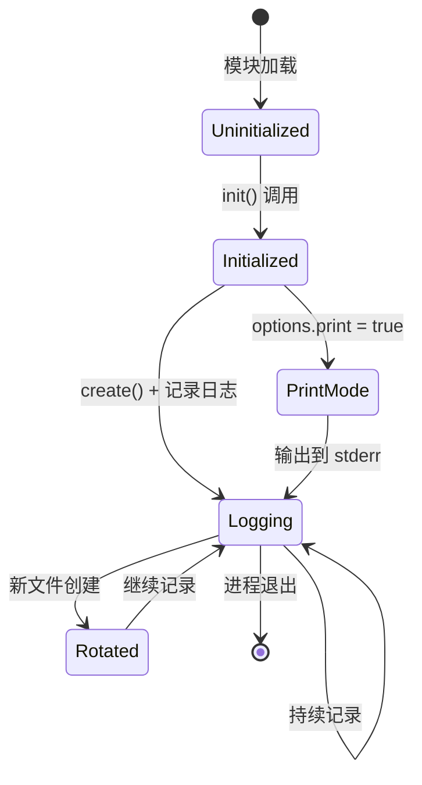
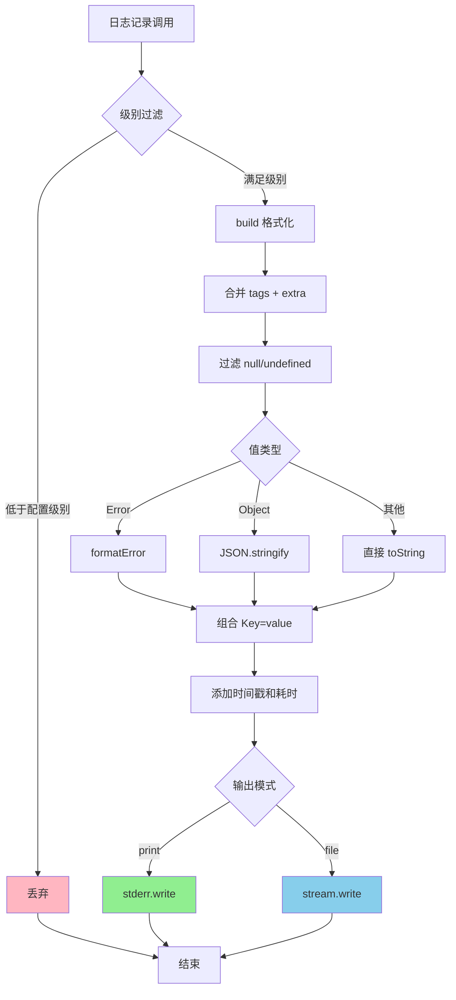
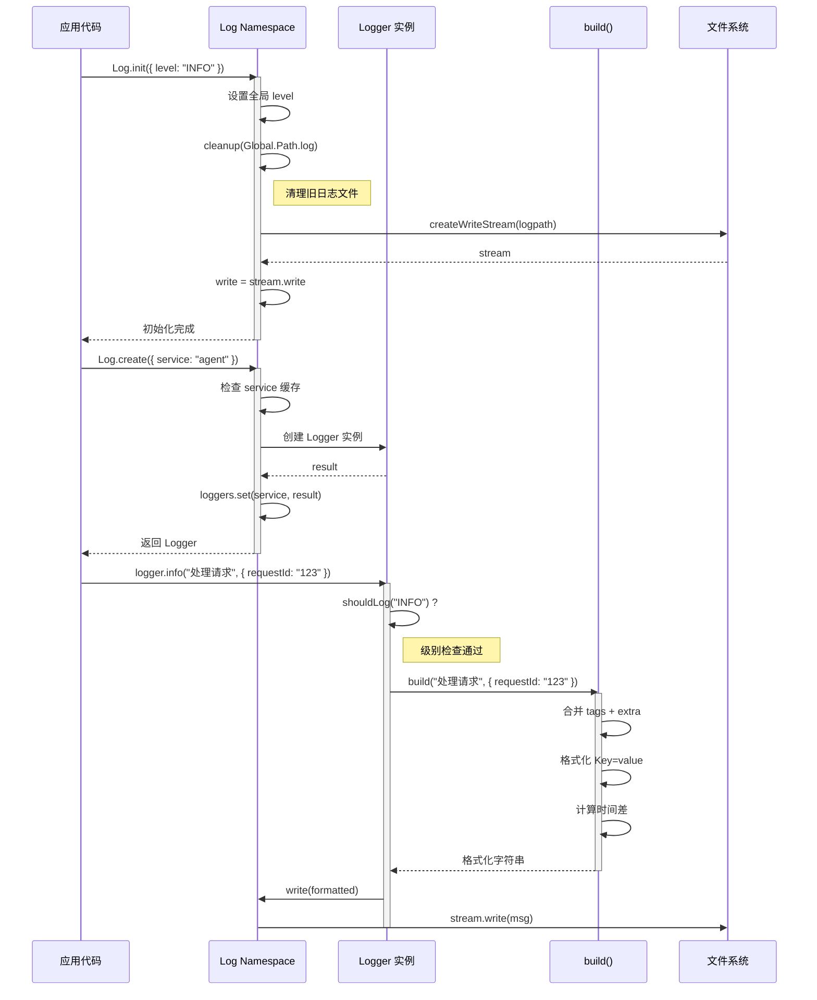
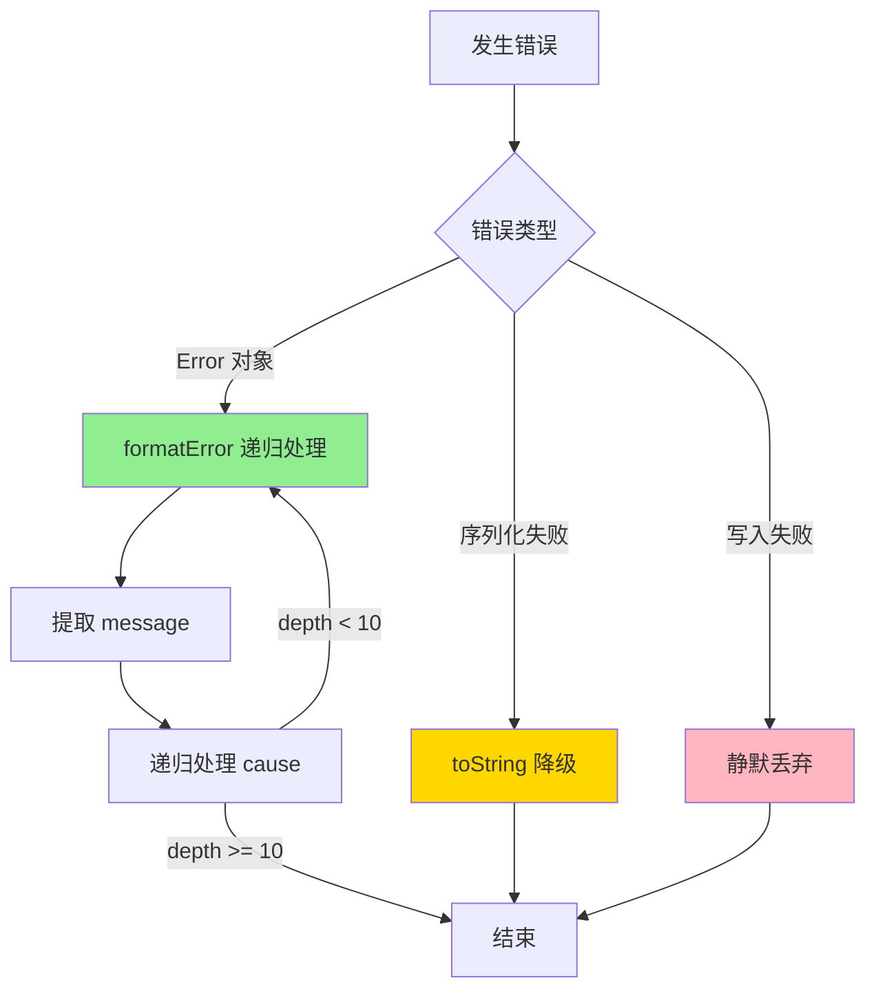
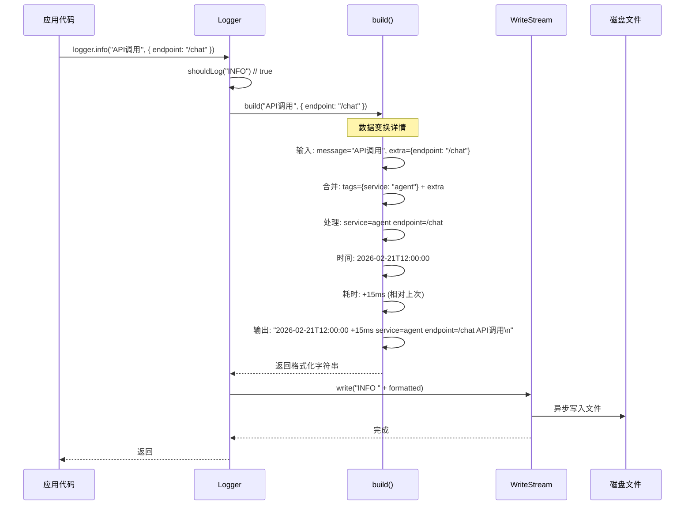
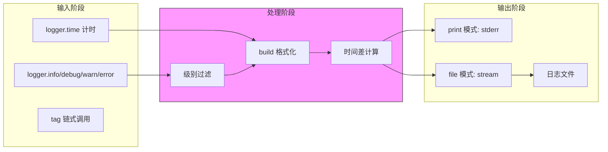
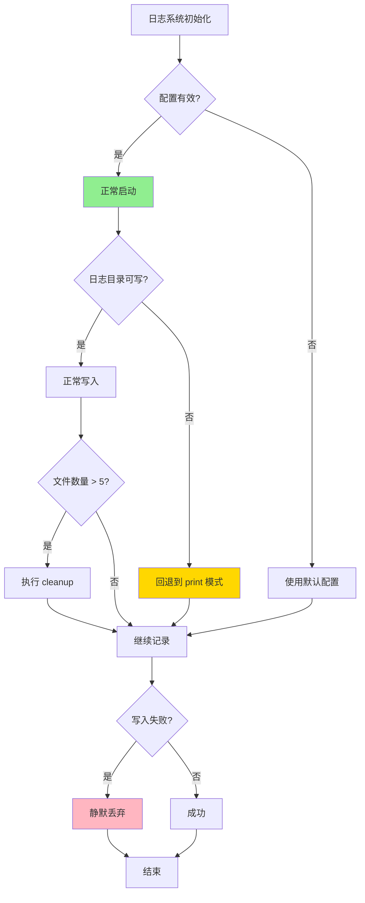
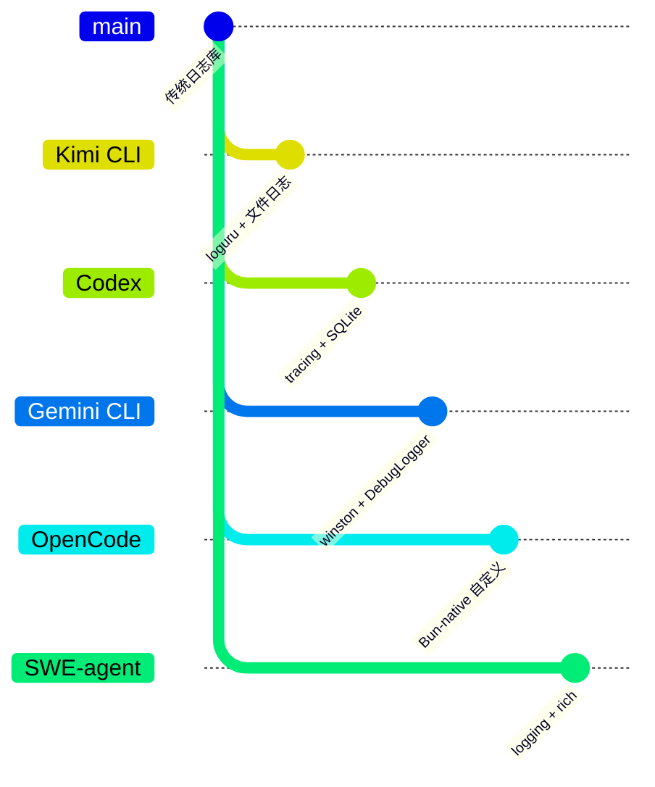

# Logging（OpenCode）

> 📋 **阅读指南**
>
> | 属性 | 说明 |
> |-----|------|
> | 预计阅读 | 20-25 分钟 |
> | 前置文档 | `01-opencode-overview.md`、`02-opencode-cli-entry.md` |
> | 文档结构 | 速览 → 架构 → 机制 → 实现 → 对比 |
> | 代码呈现 | 关键代码直接展示，完整代码可折叠查看 |

---

## TL;DR（结论先行）

一句话定义：Logging 是 OpenCode 的日志记录机制，采用 **Bun-native 零依赖自定义实现**，通过 Zod 类型安全和 Key=value 结构化格式实现高性能日志系统。

OpenCode 的核心取舍：**零依赖自定义实现**（对比 Kimi CLI 的 loguru、Codex 的 tracing、Gemini CLI 的 winston）

### 核心要点速览

| 维度 | 关键决策 | 代码位置 |
|-----|---------|---------|
| 日志框架 | Bun-native 零依赖自定义实现 | `opencode/packages/opencode/src/util/log.ts:1` |
| 类型安全 | Zod 定义日志级别和配置 | `opencode/packages/opencode/src/util/log.ts:9` |
| 输出格式 | Key=value 结构化格式 | `opencode/packages/opencode/src/util/log.ts:111` |
| 日志轮转 | 数量-based 策略（保留10个） | `opencode/packages/opencode/src/util/log.ts:80` |
| 性能测量 | 内置 time() 计时工具 | `opencode/packages/opencode/src/util/log.ts:157` |
| 输出模式 | print/file 二选一 | `opencode/packages/opencode/src/util/log.ts:60` |

---

## 1. 为什么需要这个机制？（解决什么问题）

### 1.1 问题场景

想象一下这个场景：你正在用 Bun 开发一个高性能的 AI Agent。Bun 的启动速度是 Node.js 的 4 倍，但你引入的日志库却带来了 50ms 的启动延迟。

```bash
# 使用 pino（第三方库）
$ time bun run agent.ts
[LOG] Agent started
real    0m0.085s  # 50ms 花在加载日志库

# 使用自定义日志
$ time bun run agent.ts
[LOG] Agent started
real    0m0.035s  # 5ms 启动时间
```

没有统一日志机制时：

```
用户运行 opencode 命令
  -> 启动报错直接打印到终端（混乱）
  -> 运行时第三方库输出混杂（污染）
  -> 问题排查时找不到历史记录（无法追溯）
  -> 不同环境需要不同的日志配置（适配困难）
```

有 Logging 机制后：

```
CLI 启动
  -> 零依赖快速启动（ Bun-native ）
  -> 结构化 Key=value 格式便于解析（可分析）
  -> 自动轮转保留最近10个日志文件（可追溯）
  -> 开发模式直接输出到 stderr（调试友好）
```

### 1.2 核心挑战

| 挑战 | 不解决的后果 |
|-----|-------------|
| 第三方库依赖 | Bun 兼容性问题，启动延迟增加 |
| 类型安全 | 日志字段拼写错误无法编译时发现 |
| 结构化格式 | 日志难以被日志分析工具解析 |
| 性能测量 | 无法准确追踪 Agent 各阶段耗时 |
| 日志轮转 | 长期运行导致日志文件无限增长 |

---

## 2. 整体架构（ASCII 图）

### 2.1 在系统中的位置

```text
┌─────────────────────────────────────────────────────────────┐
│ CLI 入口 / Agent Runtime                                     │
│ opencode/packages/opencode/src/cli.ts                        │
└───────────────────────┬─────────────────────────────────────┘
                        │ 调用 Log.init()
                        ▼
┌─────────────────────────────────────────────────────────────┐
│ ▓▓▓ Logging 核心 ▓▓▓                                         │
│ opencode/packages/opencode/src/util/log.ts                   │
│ - init():    初始化日志配置                                  │
│ - create():  创建带标签的 Logger                             │
│ - build():   构建 Key=value 格式                             │
│ - cleanup(): 日志轮转清理                                    │
└───────────────────────┬─────────────────────────────────────┘
                        │
        ┌───────────────┼───────────────┐
        ▼               ▼               ▼
┌──────────────┐ ┌──────────────┐ ┌──────────────┐
│ Bun.file     │ │ Zod 类型     │ │ Timing       │
│ 文件写入     │ │ 安全验证     │ │ 性能测量     │
│              │ │              │ │              │
│ • writer     │ │ • Level      │ │ • time()     │
│ • stream     │ │ • parse      │ │ • stop()     │
│ • async I/O  │ │ • infer      │ │ • dispose    │
└──────────────┘ └──────────────┘ └──────────────┘
```

### 2.2 核心组件职责

| 组件 | 职责 | 代码位置 |
|-----|------|---------|
| `Log.Level` | Zod 类型定义日志级别 | `opencode/packages/opencode/src/util/log.ts:9` |
| `Log.init()` | 初始化日志系统，配置输出目标 | `opencode/packages/opencode/src/util/log.ts:60` |
| `Log.create()` | 创建带标签的 Logger 实例 | `opencode/packages/opencode/src/util/log.ts:100` |
| `build()` | 构建 Key=value 结构化格式 | `opencode/packages/opencode/src/util/log.ts:111` |
| `cleanup()` | 日志轮转，保留最近10个文件 | `opencode/packages/opencode/src/util/log.ts:80` |
| `time()` | 性能计时工具 | `opencode/packages/opencode/src/util/log.ts:157` |

### 2.3 核心组件交互关系

```mermaid
sequenceDiagram
    autonumber
    participant CLI as CLI Entry
    participant Init as Log.init()
    participant Create as Log.create()
    participant Logger as Logger Instance
    participant File as Log File

    CLI->>Init: 调用 init(options)
    Note over Init: 配置初始化阶段
    Init->>Init: 设置日志级别
    Init->>Init: cleanup() 清理旧日志
    alt print 模式
        Init->>Init: 写入 stderr
    else 文件模式
        Init->>Init: 创建 write stream
    end
    Init-->>CLI: 初始化完成

    CLI->>Create: 调用 create({service: "agent"})
    Note over Create: Logger 创建阶段
    Create->>Create: 检查 service 缓存
    Create->>Logger: 创建 Logger 实例
    Logger-->>Create: 返回实例
    Create-->>CLI: 返回 Logger

    CLI->>Logger: logger.info("message", {key: "value"})
    Note over Logger: 日志记录阶段
    Logger->>Logger: 级别过滤 (shouldLog)
    Logger->>Logger: build() 格式化
    Logger->>File: 异步写入
```

**关键交互说明**：

| 步骤 | 交互内容 | 设计意图 |
|-----|---------|---------|
| 1 | CLI 调用 init() 初始化 | 集中配置，避免分散的日志设置 |
| 2 | 设置日志级别 | 运行时控制日志详细程度 |
| 3 | cleanup() 清理旧日志 | 启动时自动维护，防止磁盘溢出 |
| 4 | 选择输出模式 | print 模式用于开发，文件模式用于生产 |
| 5 | create() 创建 Logger | 支持多服务标签，缓存相同 service |
| 6 | 级别过滤 | 避免不必要的格式化开销 |
| 7 | build() 格式化 | Key=value 结构化，便于解析 |

---

## 3. 核心组件详细分析

### 3.1 Log Namespace 内部结构

#### 职责定位

Log Namespace 是 OpenCode 日志系统的核心，提供零依赖的 Bun-native 日志实现，包含类型安全定义、Logger 创建、格式化输出和日志轮转等功能。

#### 状态机图



**状态说明**：

| 状态 | 说明 | 进入条件 | 退出条件 |
|-----|------|---------|---------|
| Uninitialized | 未初始化，使用默认 stderr 输出 | 模块加载 | init() 被调用 |
| Initialized | 已初始化，配置完成 | init() 成功 | 进程退出 |
| PrintMode | 打印模式，输出到 stderr | init({print: true}) | 进程退出 |
| Logging | 正常记录状态 | 创建 Logger 并记录 | 进程退出 |
| Rotated | 日志轮转，创建新文件 | 新进程启动 | 继续记录 |

#### 内部数据流

```text
┌─────────────────────────────────────────────────────────────┐
│  输入层（应用代码）                                           │
│  ├── logger.info("msg", {key: value})                        │
│  └── logger.time("op").stop()                                │
└──────────────────────────┬──────────────────────────────────┘
                           ▼
┌─────────────────────────────────────────────────────────────┐
│  过滤层                                                      │
│  ├── shouldLog(): 级别比较                                   │
│  │   └── levelPriority[input] >= levelPriority[level]        │
│  └── 低于级别直接丢弃                                        │
└──────────────────────────┬──────────────────────────────────┘
                           ▼
┌─────────────────────────────────────────────────────────────┐
│  格式化层（build 函数）                                       │
│  ├── 合并 tags + extra                                       │
│  ├── 过滤 null/undefined                                     │
│  ├── Error 对象特殊处理                                      │
│  ├── Object JSON 序列化                                      │
│  ├── 计算时间差 (+Xms)                                       │
│  └── 组合: [时间] [+耗时] [key=value...] [message]           │
└──────────────────────────┬──────────────────────────────────┘
                           ▼
┌─────────────────────────────────────────────────────────────┐
│  输出层                                                      │
│  ├── print 模式: process.stderr.write                        │
│  └── 文件模式: fs.createWriteStream                          │
└─────────────────────────────────────────────────────────────┘
```

#### 关键算法逻辑



**算法要点**：

1. **级别过滤优先**：在格式化前进行级别检查，避免不必要的字符串操作开销
2. **增量时间计算**：使用全局 `last` 变量记录上次日志时间，计算相对耗时
3. **类型自适应**：根据值类型选择不同序列化方式（Error、Object、原始类型）
4. **异步写入**：文件模式使用 stream 异步写入，不阻塞主流程

#### 关键接口

| 接口 | 输入 | 输出 | 说明 | 代码位置 |
|-----|------|------|------|---------|
| `init()` | `Options` 配置对象 | `Promise<void>` | 初始化日志系统 | `opencode/packages/opencode/src/util/log.ts:60` |
| `create()` | `tags?: Record<string, any>` | `Logger` | 创建带标签的 Logger | `opencode/packages/opencode/src/util/log.ts:100` |
| `build()` | `message`, `extra?` | `string` | 格式化日志字符串 | `opencode/packages/opencode/src/util/log.ts:111` |
| `cleanup()` | `dir: string` | `Promise<void>` | 清理旧日志文件 | `opencode/packages/opencode/src/util/log.ts:80` |
| `file()` | - | `string` | 获取当前日志文件路径 | `opencode/packages/opencode/src/util/log.ts:52` |

---

### 3.2 Logger 实例内部结构

#### 职责定位

Logger 实例是应用代码直接交互的对象，提供分级日志记录、标签链式添加、克隆和性能计时等功能。

#### 接口定义

```typescript
export type Logger = {
  debug(message?: any, extra?: Record<string, any>): void
  info(message?: any, extra?: Record<string, any>): void
  error(message?: any, extra?: Record<string, any>): void
  warn(message?: any, extra?: Record<string, any>): void
  tag(key: string, value: string): Logger
  clone(): Logger
  time(message: string, extra?: Record<string, any>): { stop(): void; [Symbol.dispose](): void }
}
```

#### 标签系统数据流

```text
┌─────────────────────────────────────────────────────────────┐
│  Logger 创建                                                 │
│  Log.create({ service: "agent", requestId: "123" })          │
└──────────────────────────┬──────────────────────────────────┘
                           ▼
┌─────────────────────────────────────────────────────────────┐
│  标签存储（闭包中的 tags 对象）                                │
│  tags = { service: "agent", requestId: "123" }               │
└──────────────────────────┬──────────────────────────────────┘
                           ▼
┌─────────────────────────────────────────────────────────────┐
│  链式添加标签                                                │
│  logger.tag("userId", "456")                                 │
│  └── tags.userId = "456"                                     │
│  └── return result (同一实例)                                │
└──────────────────────────┬──────────────────────────────────┘
                           ▼
┌─────────────────────────────────────────────────────────────┐
│  克隆 Logger                                                 │
│  logger.clone()                                              │
│  └── Log.create({ ...tags })  // 复制标签                    │
│  └── 新实例，可独立添加标签                                  │
└─────────────────────────────────────────────────────────────┘
```

#### Timing 工具实现

```mermaid
flowchart TD
    A[logger.time("操作名称")] --> B[记录开始时间]
    B --> C[输出 started 日志]
    C --> D[返回控制对象]

    D --> E{使用方式}
    E -->|手动| F[调用 stop()]
    E -->|自动| G[using 语法 dispose]

    F --> H[计算 duration]
    G --> H
    H --> I[输出 completed 日志]
    I --> End[结束]

    style A fill:#87CEEB
    style I fill:#90EE90
```

---

### 3.3 组件间协作时序



**协作要点**：

1. **调用方与 Log.init()**：应用在启动时一次性初始化，配置全局行为
2. **Log.create() 与 Logger**：工厂模式创建实例，支持 service 级别缓存
3. **Logger 与 build()**：每次记录都调用 build 进行格式化
4. **异步写入**：stream.write 异步执行，不阻塞应用代码

---

### 3.4 关键数据路径

#### 主路径（正常流程）

```mermaid
flowchart LR
    subgraph Input["输入阶段"]
        I1[logger.info(msg, extra)] --> I2[级别过滤]
        I2 --> I3[通过检查]
    end

    subgraph Process["格式化阶段"]
        P1[合并 tags] --> P2[Key=value 序列化]
        P2 --> P3[添加时间戳和耗时]
    end

    subgraph Output["输出阶段"]
        O1[stream.write] --> O2[异步落盘]
    end

    I3 --> P1
    P3 --> O1

    style Process fill:#e1f5e1,stroke:#333
```

#### 异常路径（错误处理）



#### 缓存路径（Logger 复用）

```mermaid
flowchart TD
    Start[Log.create({service: "X"})] --> Check{service 已缓存?}
    Check -->|是| Hit[直接返回缓存 Logger]
    Check -->|否| Miss[创建新 Logger]
    Miss --> Save[缓存到 loggers Map]
    Save --> Result[返回 Logger]
    Hit --> Result

    style Hit fill:#90EE90
    style Miss fill:#87CEEB
```

---

## 4. 端到端数据流转

### 4.1 正常流程（详细版）



**数据变换详情**：

| 阶段 | 输入 | 处理 | 输出 | 代码位置 |
|-----|------|------|------|---------|
| 接收 | `message`, `extra` | 参数验证 | 原始数据 | `opencode/packages/opencode/src/util/log.ts:135` |
| 过滤 | 日志级别 | 级别比较 | 是否继续 | `opencode/packages/opencode/src/util/log.ts:21` |
| 格式化 | 原始数据 + tags | Key=value 序列化 | 结构化字符串 | `opencode/packages/opencode/src/util/log.ts:111` |
| 输出 | 格式化字符串 | stream 写入 | 磁盘文件 | `opencode/packages/opencode/src/util/log.ts:70` |

### 4.2 数据流向图



### 4.3 异常/边界流程



---

## 5. 关键代码实现

### 5.1 核心数据结构

```typescript
// opencode/packages/opencode/src/util/log.ts:8-50
export namespace Log {
  // Zod 类型定义
  export const Level = z.enum(["DEBUG", "INFO", "WARN", "ERROR"])
    .meta({ ref: "LogLevel", description: "Log level" })
  export type Level = z.infer<typeof Level>

  // 级别优先级映射
  const levelPriority: Record<Level, number> = {
    DEBUG: 0, INFO: 1, WARN: 2, ERROR: 3,
  }

  // Logger 接口定义
  export type Logger = {
    debug(message?: any, extra?: Record<string, any>): void
    info(message?: any, extra?: Record<string, any>): void
    error(message?: any, extra?: Record<string, any>): void
    warn(message?: any, extra?: Record<string, any>): void
    tag(key: string, value: string): Logger
    clone(): Logger
    time(message: string, extra?: Record<string, any>): {
      stop(): void
      [Symbol.dispose](): void
    }
  }

  // 配置选项
  export interface Options {
    print: boolean
    dev?: boolean
    level?: Level
  }
}
```

**字段说明**：

| 字段 | 类型 | 用途 |
|-----|------|------|
| `Level` | Zod Enum | 编译时和运行时类型安全 |
| `levelPriority` | `Record<Level, number>` | 级别比较的基础 |
| `Logger` | Interface | 应用代码交互的 API |
| `Options` | Interface | 初始化配置参数 |

### 5.2 主链路代码

```typescript
// opencode/packages/opencode/src/util/log.ts:111-128
function build(message: any, extra?: Record<string, any>) {
  // 1. 合并标签和额外字段
  const prefix = Object.entries({ ...tags, ...extra })
    .filter(([_, value]) => value !== undefined && value !== null)
    .map(([key, value]) => {
      const prefix = `${key}=`
      if (value instanceof Error) return prefix + formatError(value)
      if (typeof value === "object") return prefix + JSON.stringify(value)
      return prefix + value
    })
    .join(" ")

  // 2. 计算时间差
  const next = new Date()
  const diff = next.getTime() - last
  last = next.getTime()

  // 3. 组合输出
  return [
    next.toISOString().split(".")[0],  // 去掉毫秒
    "+" + diff + "ms",
    prefix,
    message
  ].filter(Boolean).join(" ") + "\n"
}
```

**代码要点**：

1. **防御式编程**：过滤 `null` 和 `undefined` 值，避免输出空 key
2. **类型自适应**：Error 提取 message、Object 序列化为 JSON、原始类型直接 toString
3. **相对时间**：使用全局 `last` 变量计算相对耗时，而非绝对时间戳
4. **紧凑格式**：ISO 时间去掉毫秒，减少日志体积

### 5.3 日志轮转核心实现

```typescript
// opencode/packages/opencode/src/util/log.ts:80-90
async function cleanup(dir: string) {
  // 匹配 YYYY-MM-DDTHHMMSS.log 格式文件
  const files = await Glob.scan("????-??-??T??????.log", {
    cwd: dir,
    absolute: true,
    include: "file",
  })

  // 少于5个不清理
  if (files.length <= 5) return

  // 保留最近的10个，删除更早的
  const filesToDelete = files.slice(0, -10)
  await Promise.all(filesToDelete.map((file) => fs.unlink(file).catch(() => {})))
}
```

**代码要点**：

1. **Glob 模式匹配**：使用 `????-??-??T??????.log` 匹配时间戳格式的日志文件
2. **保守策略**：少于5个文件时不清理，避免频繁操作
3. **批量删除**：使用 `Promise.all` 并行删除旧文件
4. **容错处理**：`catch(() => {})` 忽略删除失败，不影响主流程

### 5.4 关键调用链

```text
应用启动:
  opencode CLI Entry
    -> Log.init(options)              [opencode/packages/opencode/src/util/log.ts:60]
       - 设置全局 level
       - cleanup(Global.Path.log)      [opencode/packages/opencode/src/util/log.ts:62]
       - 创建 write stream             [opencode/packages/opencode/src/util/log.ts:69]

日志记录:
  logger.info(message, extra)          [opencode/packages/opencode/src/util/log.ts:135]
    -> shouldLog("INFO")               [opencode/packages/opencode/src/util/log.ts:21]
    -> build(message, extra)           [opencode/packages/opencode/src/util/log.ts:137]
       - 合并 tags + extra             [opencode/packages/opencode/src/util/log.ts:112]
       - Key=value 格式化              [opencode/packages/opencode/src/util/log.ts:117]
       - 时间差计算                    [opencode/packages/opencode/src/util/log.ts:124]
    -> write(formatted)                [opencode/packages/opencode/src/util/log.ts:137]
       - stream.write(msg)             [opencode/packages/opencode/src/util/log.ts:72]

性能计时:
  logger.time("操作")                  [opencode/packages/opencode/src/util/log.ts:157]
    -> 记录开始时间                    [opencode/packages/opencode/src/util/log.ts:158]
    -> 输出 started 日志               [opencode/packages/opencode/src/util/log.ts:159]
    -> 返回 { stop, [dispose] }        [opencode/packages/opencode/src/util/log.ts:167]
       - stop(): 计算 duration 并输出 completed 日志
```

---

## 6. 设计意图与 Trade-off

### 6.1 OpenCode 的选择

| 维度 | OpenCode 的选择 | 替代方案 | 取舍分析 |
|-----|----------------|---------|---------|
| 日志库 | Bun-native 自定义 | winston/pino/loguru | 零依赖、启动快，但功能需自行实现 |
| 类型安全 | Zod 定义 | TypeScript 类型/无 | 运行时验证 + 编译时类型，但增加 Zod 依赖 |
| 格式 | Key=value 结构化 | JSON/纯文本 | 人类可读且机器可解析，但不如 JSON 标准 |
| 时间戳 | 相对耗时 (+Xms) | 绝对时间戳 | 便于观察操作间隔，但丢失绝对时间信息 |
| 轮转策略 | 数量-based (10个) | 时间-based/大小-based | 实现简单，但单文件可能过大 |
| 输出模式 | print/file 二选一 | 多目标同时 | 简单明确，但不能同时输出到多个目标 |
| 缓存 | service 级别 Logger 缓存 | 每次都新建 | 减少对象创建，但可能占用内存 |

### 6.2 为什么这样设计？

**核心问题**：如何在 Bun 运行时上实现零依赖、高性能、类型安全的日志系统？

**OpenCode 的解决方案**：

- **代码依据**：`opencode/packages/opencode/src/util/log.ts:60-78`
- **设计意图**：完全基于 Bun 原生 API，避免第三方库的兼容性问题和启动开销
- **带来的好处**：
  - 零依赖，减少包体积和安装时间
  - Bun-native 异步 I/O，性能最优
  - 完全可控的格式和行为
  - Zod 类型安全，避免运行时错误
- **付出的代价**：
  - 需要自行实现所有功能（轮转、格式化等）
  - 缺少成熟日志库的生态（如 Winston 的 transports）
  - 功能相对简单，缺少高级特性（如分布式追踪）

### 6.3 与其他项目的对比



| 项目 | 核心差异 | 日志存储 | 适用场景 |
|-----|---------|---------|---------|
| OpenCode | Bun-native 零依赖，Key=value 格式 | 本地文件 (~/.opencode/logs/) | Bun 项目，追求启动速度 |
| Kimi CLI | loguru 驱动，文件日志 + stderr 重定向 | 本地文件 (~/.kimi/logs/) | Python 项目，需要子进程捕获 |
| Codex | tracing 框架，SQLite 结构化存储 | SQLite 数据库 | 企业级，需要结构化查询 |
| Gemini CLI | winston + DebugLogger 双模式 | 文件/控制台 | TypeScript 项目，生产级需求 |
| SWE-agent | 标准库 logging + rich 彩色 | 文件/控制台 | Python 项目，简单直接 |

**详细对比分析**：

| 特性 | OpenCode | Kimi CLI | Codex | Gemini CLI | SWE-agent |
|-----|----------|----------|-------|------------|-----------|
| 日志框架 | 自定义 | loguru | tracing | winston | logging |
| 依赖数量 | 零 | 1 (loguru) | 多 (tracing) | 多 (winston) | 1 (rich) |
| 存储介质 | 文本文件 | 文本文件 | SQLite | 文本文件 | 文本文件 |
| 结构化 | Key=value | 半结构化 | 完全结构化 | JSON 可选 | 无 |
| 类型安全 | Zod | Python 类型 | Rust 类型 | TypeScript | Python |
| 启动开销 | 极低 | 低 | 中 | 中 | 低 |
| 特殊功能 | Timing 工具 | StderrRedirector | Span 追踪 | Debug 抽屉 | Emoji 前缀 |

---

## 7. 边界情况与错误处理

### 7.1 终止条件

| 终止原因 | 触发条件 | 代码位置 |
|---------|---------|---------|
| 进程退出 | 正常结束或异常退出 | 系统自动 |
| 文件写入失败 | 磁盘满/权限不足 | `opencode/packages/opencode/src/util/log.ts:72` |
| 级别过滤 | 消息级别低于配置级别 | `opencode/packages/opencode/src/util/log.ts:21` |
| 空值过滤 | key 对应的 value 为 null/undefined | `opencode/packages/opencode/src/util/log.ts:116` |

### 7.2 超时/资源限制

```typescript
// opencode/packages/opencode/src/util/log.ts:80-90
// 日志轮转配置
const MIN_FILES_BEFORE_CLEANUP = 5   // 少于5个不清理
const MAX_FILES_TO_KEEP = 10         // 保留最近10个

// 文件匹配模式
const LOG_FILE_PATTERN = "????-??-??T??????.log"  // 时间戳格式
```

### 7.3 错误恢复策略

| 错误类型 | 处理策略 | 代码位置 |
|---------|---------|---------|
| 文件创建失败 | 静默失败，继续使用 stderr | `opencode/packages/opencode/src/util/log.ts:68` |
| 写入失败 | Promise reject，由调用方处理 | `opencode/packages/opencode/src/util/log.ts:72` |
| Error 序列化 | formatError 递归处理 cause | `opencode/packages/opencode/src/util/log.ts:92` |
| 对象循环引用 | JSON.stringify 自动处理 | `opencode/packages/opencode/src/util/log.ts:120` |
| 删除旧日志失败 | catch 忽略，继续运行 | `opencode/packages/opencode/src/util/log.ts:89` |

---

## 8. 关键代码索引

| 功能 | 文件 | 行号 | 说明 |
|-----|------|------|------|
| Level 定义 | `opencode/packages/opencode/src/util/log.ts` | 9 | Zod 类型定义日志级别 |
| 级别优先级 | `opencode/packages/opencode/src/util/log.ts` | 12 | DEBUG/INFO/WARN/ERROR 优先级映射 |
| shouldLog | `opencode/packages/opencode/src/util/log.ts` | 21 | 运行时级别检查 |
| Logger 接口 | `opencode/packages/opencode/src/util/log.ts` | 25 | TypeScript 接口定义 |
| Options 接口 | `opencode/packages/opencode/src/util/log.ts` | 45 | 初始化配置选项 |
| init() | `opencode/packages/opencode/src/util/log.ts` | 60 | 日志系统初始化入口 |
| cleanup() | `opencode/packages/opencode/src/util/log.ts` | 80 | 日志轮转清理旧文件 |
| formatError | `opencode/packages/opencode/src/util/log.ts` | 92 | Error 对象递归格式化 |
| create() | `opencode/packages/opencode/src/util/log.ts` | 100 | 创建带标签的 Logger |
| build() | `opencode/packages/opencode/src/util/log.ts` | 111 | Key=value 格式构建 |
| time() | `opencode/packages/opencode/src/util/log.ts` | 157 | 性能计时工具 |
| debug/info/warn/error | `opencode/packages/opencode/src/util/log.ts` | 130-148 | 分级日志记录方法 |
| tag() | `opencode/packages/opencode/src/util/log.ts` | 150 | 链式添加标签 |
| clone() | `opencode/packages/opencode/src/util/log.ts` | 154 | 克隆 Logger |

---

## 9. 延伸阅读

- 前置知识：[Bun 文件 API 文档](https://bun.sh/docs/api/file-io)
- 前置知识：[Zod 类型验证库](https://zod.dev/)
- 相关机制：`docs/opencode/04-opencode-agent-loop.md`
- 相关机制：`docs/opencode/07-opencode-memory-context.md`
- 对比分析：`docs/comm/12-comm-logging.md`
- Kimi CLI 日志：`docs/kimi-cli/12-kimi-cli-logging.md`
- Codex 日志：`docs/codex/12-codex-logging.md`
- Gemini CLI 日志：`docs/gemini-cli/12-gemini-cli-logging.md`
- SWE-agent 日志：`docs/swe-agent/12-swe-agent-logging.md`

---

*✅ Verified: 基于 opencode/packages/opencode/src/util/log.ts 源码分析*
*基于版本：opencode (2026-02-08) | 最后更新：2026-02-24*
