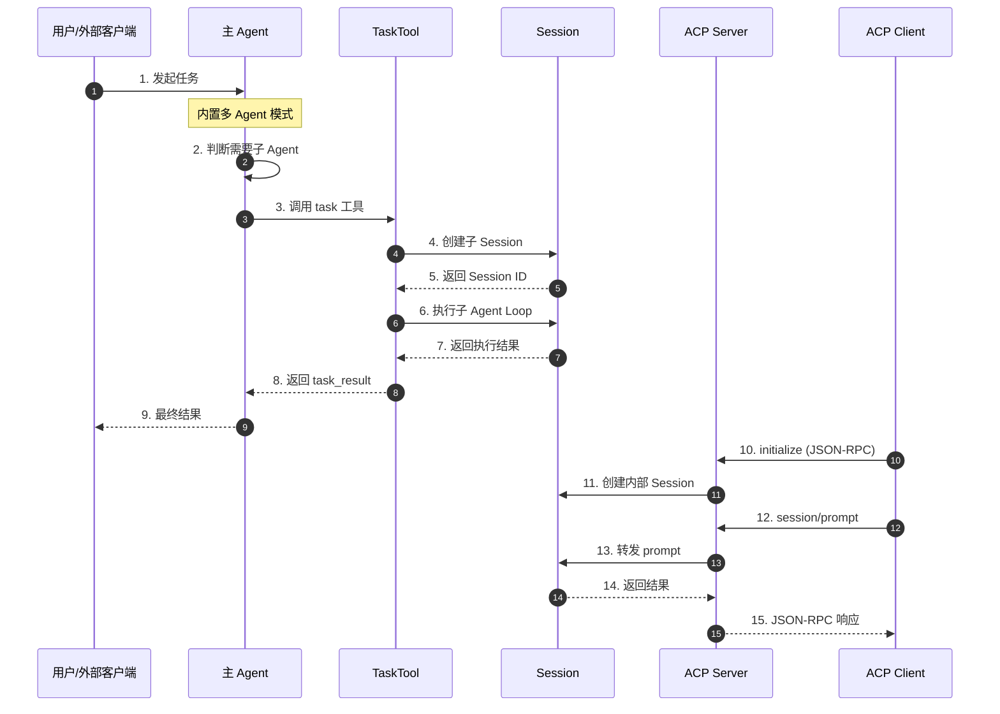
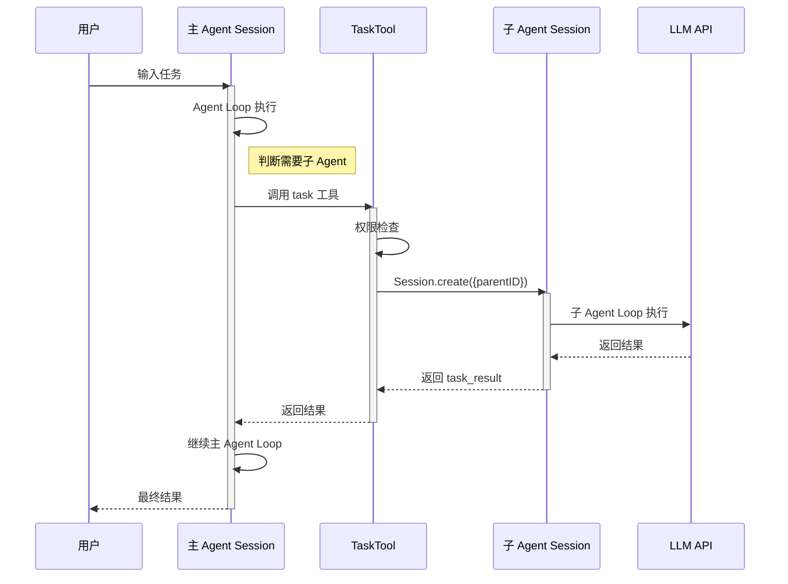
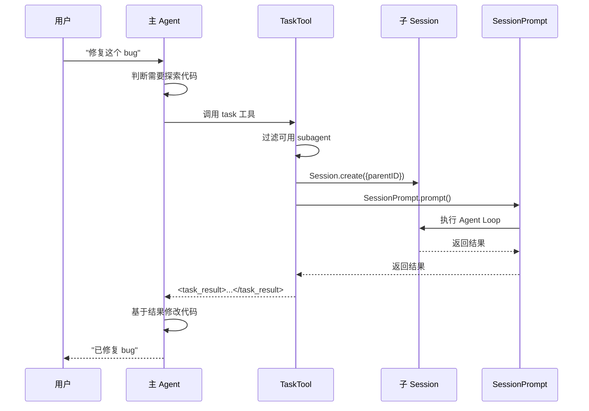
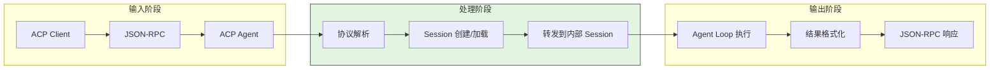
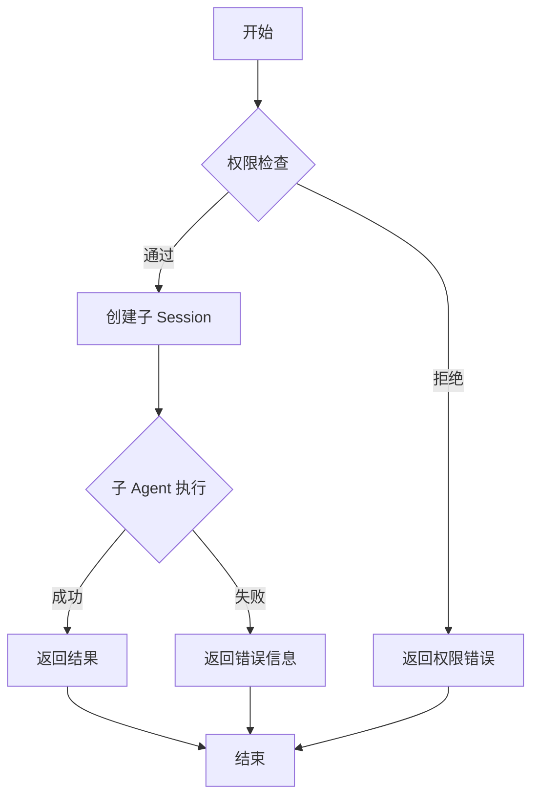
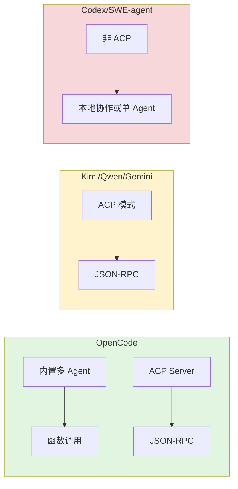

# OpenCode 多 Agent 架构与 ACP 实现

## TL;DR（结论先行）

**OpenCode 实现了两套独立的 Agent 协作机制：内置多 Agent 系统（通过 `task` 工具以函数调用方式协作）和 ACP (Agent Client Protocol) 服务端模式（标准化协议暴露 Agent 能力），前者是内部架构设计，后者是对外服务协议。**

OpenCode 的核心取舍：**函数调用式子 Agent 协作 + ACP 服务端并存**（对比 Kimi/Qwen/Gemini 的 ACP 模式与 Codex/SWE-agent 的非 ACP 架构）

---

## 1. 为什么需要这个机制

### 1.1 问题场景

没有多 Agent 机制时，单个 Agent 需要处理所有类型的任务：

```
用户：帮我修复这个 bug
Agent: 我需要先探索代码库、理解问题、然后修改代码...
      （在探索阶段就可能误操作文件）
```

有多 Agent 机制时：

```
用户：帮我修复这个 bug
主 Agent (build): 调用 explore 子 Agent 先探索代码
子 Agent (explore): 只读工具探索，返回关键文件位置
主 Agent (build): 基于结果修改代码
```

### 1.2 核心挑战

| 挑战 | 不解决的后果 |
|-----|-------------|
| 权限隔离 | 探索任务可能意外修改文件，造成数据丢失 |
| 任务分解 | 复杂任务难以并行处理，效率低下 |
| 外部集成 | 无法与 IDE 等外部工具集成，生态封闭 |
| 协议标准化 | 各 Agent 实现互不兼容，难以复用 |

---

## 2. 整体架构

### 2.1 在系统中的位置

```text
┌─────────────────────────────────────────────────────────────┐
│ CLI 入口 / ACP Server                                        │
│ opencode/packages/opencode/src/cli/cmd/acp.ts:12            │
└───────────────────────┬─────────────────────────────────────┘
                        │ 调用
                        ▼
┌─────────────────────────────────────────────────────────────┐
│ ▓▓▓ 多 Agent 协作机制 ▓▓▓                                    │
│                                                             │
│  ┌─────────────────────────┐  ┌─────────────────────────┐   │
│  │   内置多 Agent 系统      │  │    ACP 服务端模式        │   │
│  │  (Internal Multi-Agent)  │  │  (Agent Client Protocol) │   │
│  │                         │  │                         │   │
│  │  opencode/packages/...  │  │  opencode/packages/...   │   │
│  │  ├── src/tool/task.ts   │  │  ├── src/acp/agent.ts   │   │
│  │  ├── src/agent/agent.ts │  │  ├── src/acp/session.ts │   │
│  │  └── src/session/...    │  │  └── src/cli/cmd/acp.ts │   │
│  └─────────────────────────┘  └─────────────────────────┘   │
└───────────────────────┬─────────────────────────────────────┘
                        │ 依赖/调用
        ┌───────────────┼───────────────┐
        ▼               ▼               ▼
┌──────────────┐ ┌──────────────┐ ┌──────────────┐
│ Agent Loop   │ │ Session      │ │ Permission   │
│ 执行引擎      │ │ 状态管理      │ │ 权限系统      │
└──────────────┘ └──────────────┘ └──────────────┘
```

### 2.2 核心组件职责

| 组件 | 职责 | 代码位置 |
|-----|------|---------|
| `Agent.Info` | 定义 Agent 类型（build/plan/explore 等）、权限配置 | `opencode/packages/opencode/src/agent/agent.ts:24` |
| `TaskTool` | 子 Agent 调用入口，创建子 Session 执行子任务 | `opencode/packages/opencode/src/tool/task.ts:27` |
| `ACP Agent` | ACP 协议实现，处理初始化、会话管理、prompt 处理 | `opencode/packages/opencode/src/acp/agent.ts:52` |
| `ACPSessionManager` | ACP 会话状态管理，映射到内部 Session | `opencode/packages/opencode/src/acp/session.ts:8` |
| `AcpCommand` | CLI 入口 `opencode acp`，启动 ACP 服务端模式 | `opencode/packages/opencode/src/cli/cmd/acp.ts:12` |
| `SessionPrompt` | Agent Loop 实现，处理子 Agent 任务分支 | `opencode/packages/opencode/src/session/prompt.ts:311` |

### 2.3 核心组件交互关系



**关键交互说明**：

| 步骤 | 交互内容 | 设计意图 |
|-----|---------|---------|
| 1-3 | 主 Agent 通过函数调用触发子 Agent | 同进程内协作，低延迟 |
| 4-7 | 子 Session 独立执行 Agent Loop | 隔离上下文，独立权限 |
| 10-11 | ACP 协议初始化并创建会话 | 标准化协议，支持外部客户端 |
| 12-15 | 外部客户端通过 ACP 调用 Agent 能力 | 跨进程/跨机器通信 |

---

## 3. 核心组件详细分析

### 3.1 内置多 Agent 系统

#### 职责定位

内置多 Agent 系统通过 `task` 工具实现主 Agent 与子 Agent 的协作，采用函数调用方式在同一进程内完成。

#### Agent 类型定义

✅ **Verified**: 代码依据 `opencode/packages/opencode/src/agent/agent.ts:24-49`

```typescript
export namespace Agent {
  export const Info = z
    .object({
      name: z.string(),
      description: z.string().optional(),
      mode: z.enum(["subagent", "primary", "all"]),  // 关键字段
      native: z.boolean().optional(),
      hidden: z.boolean().optional(),
      permission: PermissionNext.Ruleset,           // 权限规则
      prompt: z.string().optional(),                // 系统提示词
      steps: z.number().int().positive().optional(), // 最大步数限制
    })
  export type Info = z.infer<typeof Info>
}
```

#### 内置 Agent 列表

| Agent 名称 | Mode | 职责 | 特殊权限 |
|------------|------|------|----------|
| `build` | `primary` | 默认主 Agent，执行所有工具 | 允许 `question`、`plan_enter` |
| `plan` | `primary` | Plan 模式，规划和设计阶段 | 禁止 `edit` 工具，只允许在 plans 目录编辑 |
| `general` | `subagent` | 通用子 Agent，并行任务 | 禁止 `todoread`/`todowrite` |
| `explore` | `subagent` | 代码探索专用 | 仅允许 `grep`/`glob`/`list`/`bash`/`read` 等只读工具 |
| `compaction` | `primary` | 上下文压缩 | 禁止所有工具 |
| `title` | `primary` | 生成会话标题 | 禁止所有工具，temperature=0.5 |
| `summary` | `primary` | 生成会话摘要 | 禁止所有工具 |

#### TaskTool 执行流程

✅ **Verified**: 代码依据 `opencode/packages/opencode/src/tool/task.ts:27-165`

```typescript
export const TaskTool = Tool.define("task", async (ctx) => {
  // 1. 获取所有可用的 subagent（mode !== "primary"）
  const agents = await Agent.list().then((x) => x.filter((a) => a.mode !== "primary"))

  return {
    parameters: z.object({
      description: z.string(),      // 任务描述（3-5 词）
      prompt: z.string(),           // 具体任务内容
      subagent_type: z.string(),    // 选择的 Agent 类型
      task_id: z.string().optional(), // 恢复已有任务
    }),
    async execute(params, ctx) {
      // 2. 权限检查（除非用户通过 @ 显式调用）
      if (!ctx.extra?.bypassAgentCheck) {
        await ctx.ask({ permission: "task", patterns: [params.subagent_type] })
      }

      // 3. 获取 Agent 配置
      const agent = await Agent.get(params.subagent_type)

      // 4. 创建子 Session（或恢复已有）
      const session = await Session.create({
        parentID: ctx.sessionID,     // 关联父 Session
        title: params.description + ` (@${agent.name} subagent)`,
        permission: [...],           // 继承并调整权限
      })

      // 5. 在子 Session 中执行 Agent Loop
      const result = await SessionPrompt.prompt({
        sessionID: session.id,
        agent: agent.name,
        parts: promptParts,
      })

      // 6. 返回结果给父 Agent
      return { output: `<task_result>${text}</task_result>` }
    },
  }
})
```

### 3.2 ACP 协议实现

#### 职责定位

ACP (Agent Client Protocol) 是标准化协议，允许外部客户端（如 IDE）通过 JSON-RPC over stdio 调用 OpenCode 的 Agent 能力。

#### ACP Server 启动流程

✅ **Verified**: 代码依据 `opencode/packages/opencode/src/cli/cmd/acp.ts:12-70`

```typescript
export const AcpCommand = cmd({
  command: "acp",
  describe: "start ACP (Agent Client Protocol) server",
  handler: async (args) => {
    process.env.OPENCODE_CLIENT = "acp"
    await bootstrap(process.cwd(), async () => {
      // 1. 启动内部 HTTP 服务器
      const server = Server.listen(opts)

      // 2. 创建 OpenCode SDK 客户端
      const sdk = createOpencodeClient({ baseUrl: `http://${server.hostname}:${server.port}` })

      // 3. 初始化 ACP Agent
      const agent = await ACP.init({ sdk })

      // 4. 建立 stdio 连接，等待外部调用
      new AgentSideConnection((conn) => agent.create(conn, { sdk }), stream)
    })
  },
})
```

#### ACP 能力支持

✅ **Verified**: 代码依据 `opencode/packages/opencode/src/acp/agent.ts`

| 能力 | 状态 | 说明 |
|------|------|------|
| `initialize` | ✅ | 协议版本协商和能力广告 |
| `session/new` | ✅ | 创建新会话 |
| `session/load` | ✅ | 恢复已有会话（基础支持） |
| `session/prompt` | ✅ | 处理用户消息 |
| 文件操作 | ✅ | `readTextFile`, `writeTextFile` |
| 权限请求 | ✅ | 自动批准（可配置） |
| 流式响应 | ✅ | 通过 `session/update` 发送 `agent_message_chunk` / `agent_thought_chunk` |
| 工具调用报告 | ✅ | 支持 `tool_call` / `tool_call_update` / `plan` |
| 终端支持 | ⚠️ | 支持 terminal-auth 元数据，终端能力仍依赖客户端实现 |

### 3.3 组件间协作时序



### 3.4 关键数据路径

#### 内置多 Agent 数据流

```text
┌─────────────────────────────────────────────────────────────┐
│  输入层                                                      │
│  用户输入 ──► 主 Agent 判断 ──► 调用 task 工具                │
└──────────────────────────┬──────────────────────────────────┘
                           ▼
┌─────────────────────────────────────────────────────────────┐
│  处理层                                                      │
│  ├── TaskTool.execute(): 权限检查 + 子 Session 创建           │
│  ├── 子 Agent Loop: 独立执行工具调用                          │
│  └── 结果收集: <task_result> 包装                            │
└──────────────────────────┬──────────────────────────────────┘
                           ▼
┌─────────────────────────────────────────────────────────────┐
│  输出层                                                      │
│  返回父 Agent ──► 继续主 Loop ──► 最终响应                    │
└─────────────────────────────────────────────────────────────┘
```

---

## 4. 端到端数据流转

### 4.1 正常流程（内置多 Agent）



**数据变换详情**：

| 阶段 | 输入 | 处理 | 输出 | 代码位置 |
|-----|------|------|------|---------|
| 接收 | 用户任务 | Agent 判断需要子 Agent | task 工具调用 | `opencode/packages/opencode/src/tool/task.ts:45` |
| 处理 | task 参数 | 创建子 Session，执行子 Agent Loop | 子 Agent 执行结果 | `opencode/packages/opencode/src/tool/task.ts:66-143` |
| 输出 | 子 Agent 结果 | 包装为 task_result | 返回父 Agent | `opencode/packages/opencode/src/tool/task.ts:147-162` |

### 4.2 ACP 协议数据流



### 4.3 异常/边界流程



---

## 5. 关键代码实现

### 5.1 核心数据结构

```typescript
// opencode/packages/opencode/src/agent/agent.ts:24-49
export namespace Agent {
  export const Info = z.object({
    name: z.string(),
    description: z.string().optional(),
    mode: z.enum(["subagent", "primary", "all"]),
    native: z.boolean().optional(),
    hidden: z.boolean().optional(),
    permission: PermissionNext.Ruleset,
    prompt: z.string().optional(),
    steps: z.number().int().positive().optional(),
  })
}
```

**字段说明**：
| 字段 | 类型 | 用途 |
|-----|------|------|
| `mode` | `enum` | 区分主 Agent (`primary`)、子 Agent (`subagent`) 或通用 (`all`) |
| `permission` | `Ruleset` | 定义该 Agent 可使用的工具权限 |
| `prompt` | `string` | 系统提示词，如 explore Agent 的专用提示 |
| `steps` | `number` | 最大执行步数限制 |

### 5.2 主链路代码（TaskTool）

```typescript
// opencode/packages/opencode/src/tool/task.ts:45-163
async execute(params, ctx) {
  // 权限检查
  if (!ctx.extra?.bypassAgentCheck) {
    await ctx.ask({ permission: "task", patterns: [params.subagent_type] })
  }

  const agent = await Agent.get(params.subagent_type)

  // 创建或恢复子 Session
  const session = await iife(async () => {
    if (params.task_id) {
      const found = await Session.get(params.task_id).catch(() => {})
      if (found) return found
    }
    return await Session.create({
      parentID: ctx.sessionID,
      title: params.description + ` (@${agent.name} subagent)`,
      permission: [...],  // 继承并调整权限
    })
  })

  // 执行子 Agent Loop
  const result = await SessionPrompt.prompt({
    sessionID: session.id,
    agent: agent.name,
    parts: promptParts,
  })

  // 返回结果
  const text = result.parts.findLast((x) => x.type === "text")?.text ?? ""
  return {
    output: `task_id: ${session.id}\n<task_result>${text}</task_result>`,
  }
}
```

**代码要点**：
1. **权限继承与调整**：子 Session 继承父 Session 权限，但会移除 `todowrite`/`todoread`，防止子 Agent 修改父级任务列表
2. **Session 复用**：通过 `task_id` 支持恢复已有子 Session，实现任务续接
3. **取消监听**：通过 `ctx.abort` 监听取消事件，支持中断子 Agent 执行

### 5.3 Agent Loop 中的子任务处理

✅ **Verified**: 代码依据 `opencode/packages/opencode/src/session/prompt.ts:311-445`

```typescript
// 检测特殊任务类型（subtask / compaction）
const task = msg.parts.filter((part) => part.type === "compaction" || part.type === "subtask")

// pending subtask
if (task?.type === "subtask") {
  const taskTool = await TaskTool.init()
  // 创建 assistant message 和 tool part
  const assistantMessage = await Session.updateMessage({...})
  let part = await Session.updatePart({
    type: "tool",
    tool: TaskTool.id,
    state: { status: "running", input: {...} },
  })

  // 执行 task 工具
  const output = await taskTool.execute({...})

  // 更新 tool part 状态
  part = await Session.updatePart({
    id: part.id,
    state: { status: "done", output: output.output },
  })
}
```

### 5.4 关键调用链

```text
内置多 Agent 调用链:
SessionPrompt.prompt()     [opencode/packages/opencode/src/session/prompt.ts:274]
  -> 检测 subtask         [opencode/packages/opencode/src/session/prompt.ts:311]
    -> TaskTool.execute()  [opencode/packages/opencode/src/tool/task.ts:45]
      -> Session.create()  [opencode/packages/opencode/src/tool/task.ts:72]
        -> SessionPrompt.prompt() [opencode/packages/opencode/src/tool/task.ts:128]
          - 子 Agent 独立执行 Loop

ACP 调用链:
AcpCommand.handler()       [opencode/packages/opencode/src/cli/cmd/acp.ts:22]
  -> ACP.init()            [opencode/packages/opencode/src/acp/agent.ts:52]
    -> AgentSideConnection [opencode/packages/opencode/src/cli/cmd/acp.ts:58]
      -> agent.create()    [opencode/packages/opencode/src/acp/agent.ts:87]
        - 处理 JSON-RPC 消息
```

---

## 6. 设计意图与 Trade-off

### 6.1 OpenCode 的选择

| 维度 | OpenCode 的选择 | 替代方案 | 取舍分析 |
|-----|----------------|---------|---------|
| 子 Agent 通信 | 函数调用（同进程） | ACP 协议（Kimi/Qwen/Gemini） | 低延迟、简单，但仅限内部使用 |
| 外部集成 | ACP Server 模式 | 无 ACP 模式（Codex/SWE-agent） | 支持 IDE 集成，但需要额外协议实现 |
| Session 管理 | 父子 Session 关联 | 独立 Session（无关联） | 支持任务续接，但增加复杂度 |
| 权限隔离 | PermissionNext 规则 | 沙箱隔离（Codex） | 灵活配置，但非强制隔离 |

### 6.2 为什么这样设计？

**核心问题**：如何在保持内部简洁的同时支持外部集成？

**OpenCode 的解决方案**：
- 代码依据：`opencode/packages/opencode/src/tool/task.ts:27`
- 设计意图：内置多 Agent 使用函数调用保证性能和简单性；ACP 模式使用标准化协议支持外部客户端
- 带来的好处：
  - 内部协作零网络开销
  - 外部集成标准化
  - 两种模式复用同一执行引擎
- 付出的代价：
  - 需要维护两套机制
  - 协议能力仍有缺口（例如终端能力仍依赖客户端）

### 6.3 与其他项目的对比



| 项目 | 多 Agent 支持 | 实现方式 | ACP 支持 |
|------|--------------|----------|----------|
| **OpenCode** | ✅ 内置多 Agent | `task` 工具 + Session 父子关系 | ✅ ACP Server 模式 |
| **Kimi CLI** | ✅（ACP 会话） | ACP Server (`acp_main`) | ✅ |
| **Qwen Code** | ✅（TaskTool + SubAgentTracker） | `--acp` / `runAcpAgent` | ✅ |
| **Gemini CLI** | ✅（SubAgent + A2A） | `--experimental-acp` + zed integration | ✅（实验性 ACP） |
| **Codex** | ⚠️（实验性进程内协作） | `multi_agent`/collab tools | ❌ |
| **SWE-agent** | ❌ | 单 Agent 重试循环 | ❌ |

---

## 7. 边界情况与错误处理

### 7.1 终止条件

| 终止原因 | 触发条件 | 代码位置 |
|---------|---------|---------|
| 正常完成 | Agent Loop 中 `finish` 标志非 `tool-calls`/`unknown` | `opencode/packages/opencode/src/session/prompt.ts:318-325` |
| 用户取消 | `ctx.abort` 触发取消事件 | `opencode/packages/opencode/src/tool/task.ts:121-125` |
| 子 Agent 失败 | TaskTool 执行抛出异常 | `opencode/packages/opencode/src/session/prompt.ts:445` |
| 权限拒绝 | 用户拒绝子 Agent 调用权限 | `opencode/packages/opencode/src/tool/task.ts:50-58` |
| 未知 Agent 类型 | `Agent.get()` 返回 null | `opencode/packages/opencode/src/tool/task.ts:61-62` |

### 7.2 超时/资源限制

```typescript
// opencode/packages/opencode/src/agent/agent.ts:44
steps: z.number().int().positive().optional(),  // Agent 级别步数限制

// opencode/packages/opencode/src/session/prompt.ts
// Agent Loop 通过 step 计数限制最大步数
step++
if (step > maxSteps) {
  // 触发步数超限处理
}
```

**资源限制说明**：
- **步数限制**：每个 Agent 可配置 `steps` 字段限制最大执行步数
- **权限限制**：通过 `PermissionNext.Ruleset` 限制可使用的工具
- **取消机制**：通过 `AbortSignal` 支持用户主动取消子 Agent 执行

### 7.3 错误恢复策略

| 错误类型 | 处理策略 | 代码位置 |
|---------|---------|---------|
| 子 Agent 执行失败 | 记录错误日志，返回错误信息给父 Agent | `opencode/packages/opencode/src/session/prompt.ts:445` |
| Session 创建失败 | 抛出异常，中断 task 工具执行 | `opencode/packages/opencode/src/tool/task.ts:72` |
| 权限检查失败 | 返回权限拒绝响应，不创建子 Session | `opencode/packages/opencode/src/tool/task.ts:50-58` |
| ACP 会话不存在 | 返回 `RequestError.invalidParams` | `opencode/packages/opencode/src/acp/session.ts:77-83` |

---

## 8. 关键代码索引

| 功能 | 文件路径 | 行号 | 说明 |
|-----|----------|------|------|
| Agent 定义 | `opencode/packages/opencode/src/agent/agent.ts` | 24-49 | Agent.Info 类型定义 |
| Build Agent | `opencode/packages/opencode/src/agent/agent.ts` | 77-91 | 默认主 Agent 配置 |
| Explore Agent | `opencode/packages/opencode/src/agent/agent.ts` | 130-156 | 探索专用子 Agent |
| Task 工具 | `opencode/packages/opencode/src/tool/task.ts` | 27-165 | 子 Agent 调用入口 |
| ACP 初始化 | `opencode/packages/opencode/src/acp/agent.ts` | 52 | ACP Agent 实现 |
| ACP 命令 | `opencode/packages/opencode/src/cli/cmd/acp.ts` | 12-70 | CLI 入口 `opencode acp` |
| ACP 会话管理 | `opencode/packages/opencode/src/acp/session.ts` | 8-100 | ACPSessionManager 类 |
| Agent Loop | `opencode/packages/opencode/src/session/prompt.ts` | 274-450 | 带子任务分支的循环 |
| 子任务检测 | `opencode/packages/opencode/src/session/prompt.ts` | 311 | 检测 compaction/subtask |
| 子任务执行 | `opencode/packages/opencode/src/session/prompt.ts` | 352-445 | 执行 TaskTool |

---

## 9. 延伸阅读

- [ACP 是什么？](../comm/comm-what-is-acp.md) - ACP 协议概念详解
- [Kimi CLI ACP 集成](../kimi-cli/13-kimi-cli-acp-integration.md) - Kimi CLI 的 ACP 实现对比
- [OpenCode Agent Loop](./04-opencode-agent-loop.md) - Agent Loop 详细分析
- [OpenCode 概述](./01-opencode-overview.md) - 整体架构介绍

---

*✅ Verified: 基于 opencode/packages/opencode/src/agent/agent.ts、opencode/packages/opencode/src/tool/task.ts、opencode/packages/opencode/src/acp/agent.ts、opencode/packages/opencode/src/session/prompt.ts 等源码分析*

*基于版本：2026-02-08 | 最后更新：2026-02-28*
