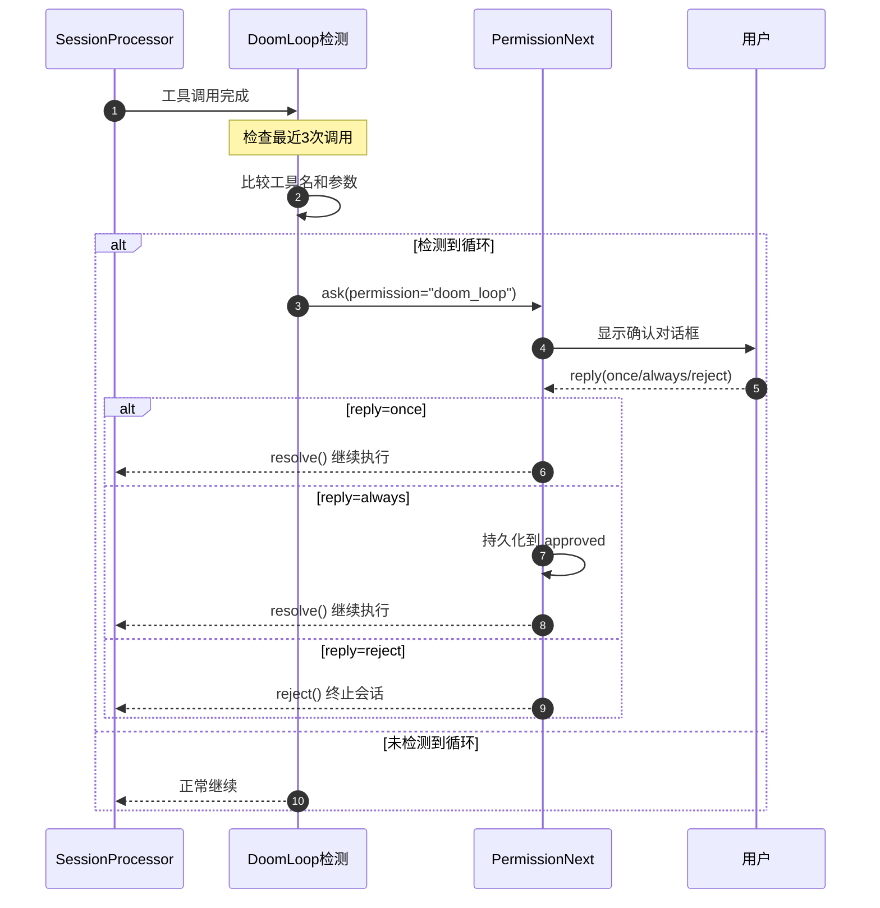
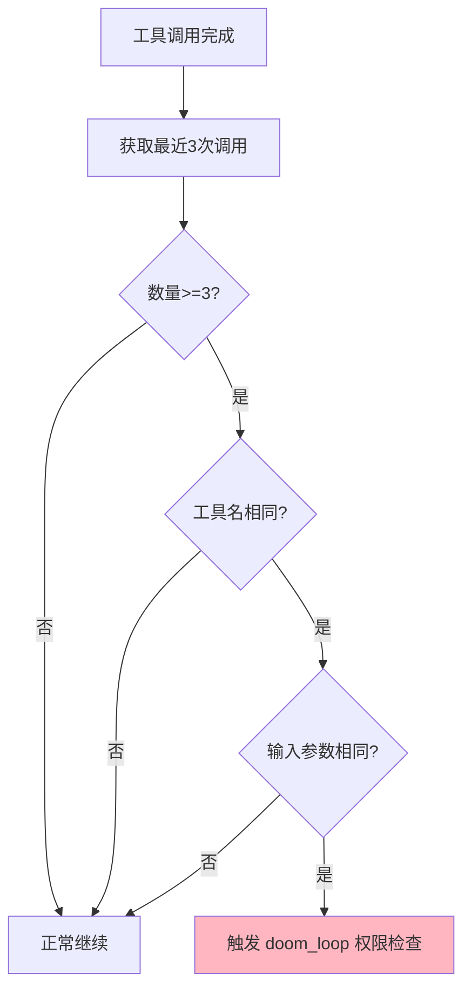
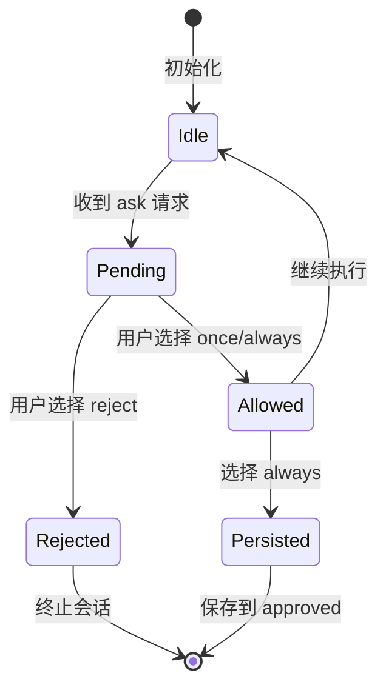
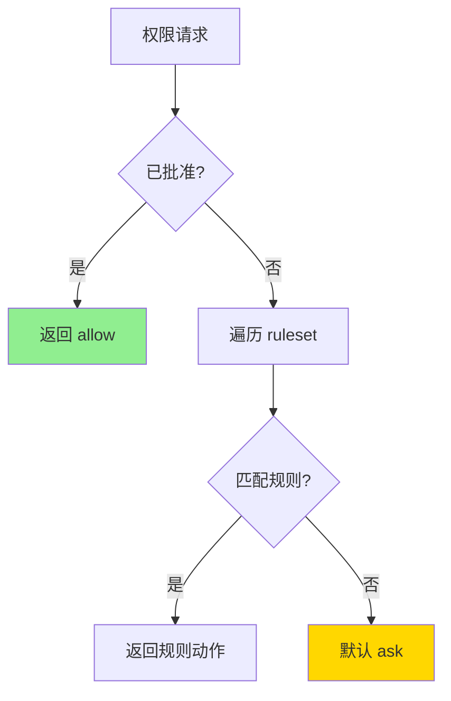
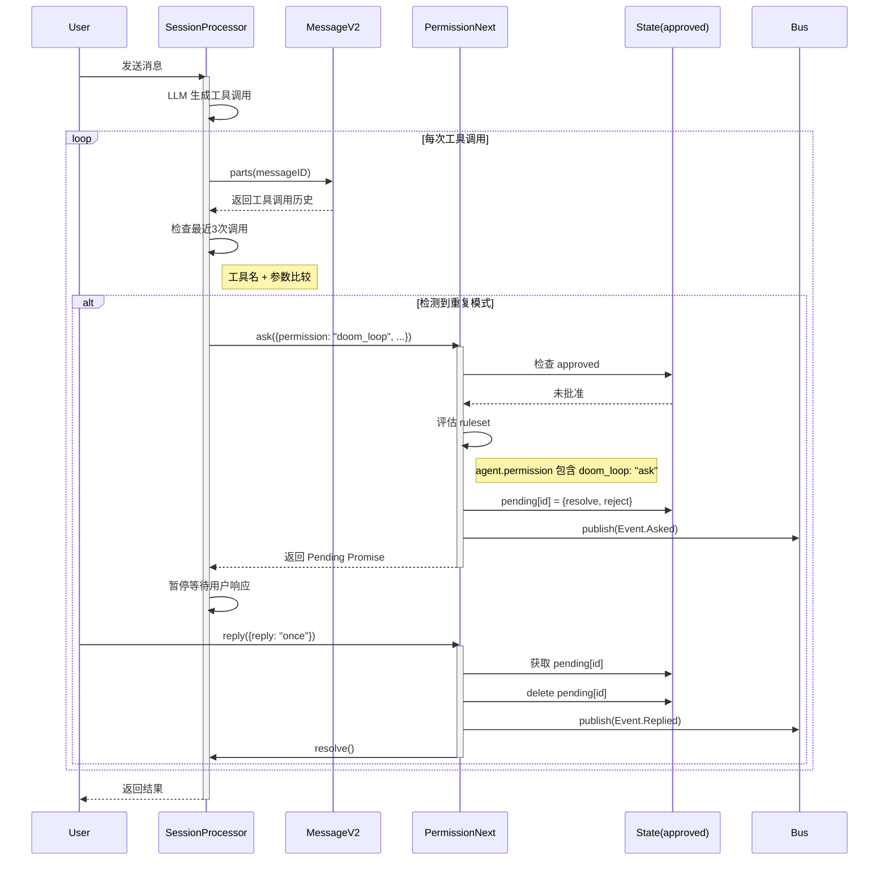
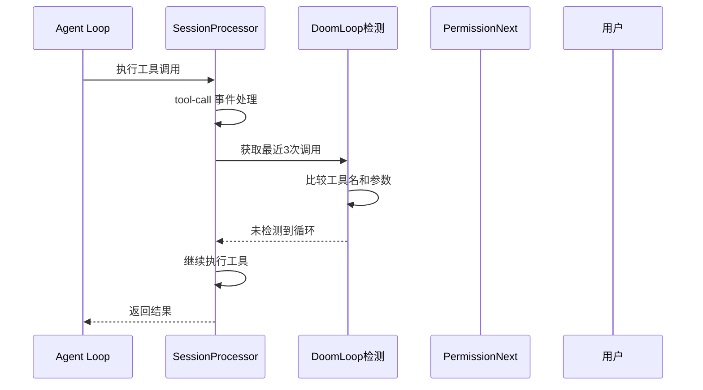
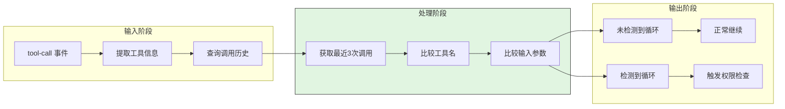
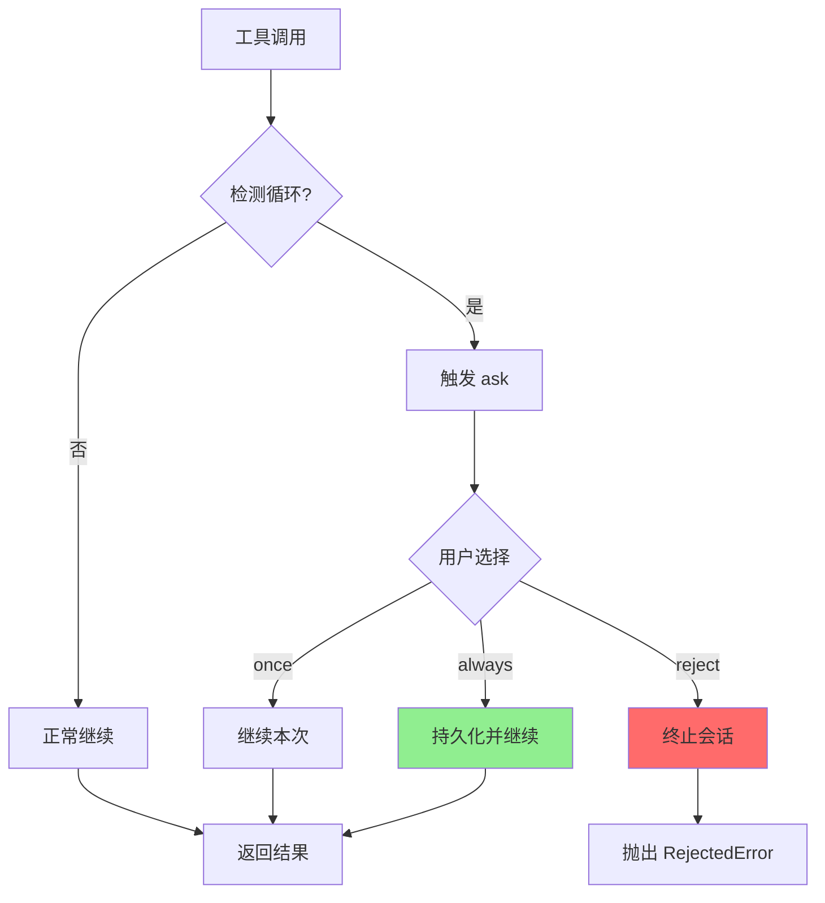
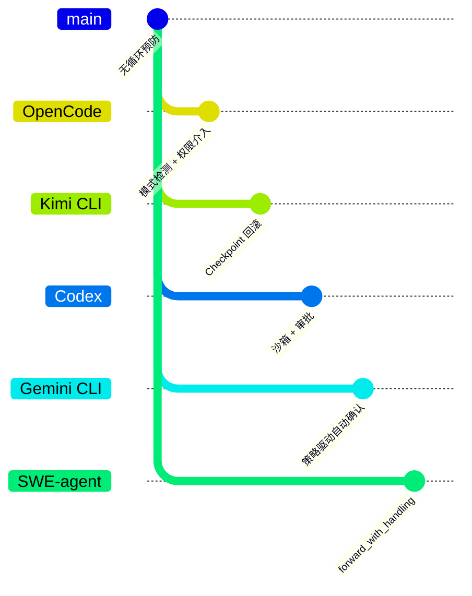

# OpenCode 无限循环预防机制

> 📋 **阅读指南**
>
> | 属性 | 说明 |
> |-----|------|
> | 预计阅读 | 15-20 分钟 |
> | 前置文档 | `04-opencode-agent-loop.md`、`10-opencode-safety-control.md` |
> | 文档结构 | 速览 → 架构 → 机制 → 实现 → 对比 |
> | 代码呈现 | 关键代码直接展示，完整代码可折叠查看 |

---

## TL;DR（结论先行）

一句话定义：无限循环预防是 Code Agent 的安全机制，防止 LLM 在工具调用中陷入重复调用相同工具的无效循环。

OpenCode 的核心取舍：**行为模式检测 + PermissionNext 权限介入**（对比 Kimi CLI 的 Checkpoint 回滚、Codex 的沙箱隔离）

### 核心要点速览

| 维度 | 关键决策 | 代码位置 |
|-----|---------|---------|
| 检测方式 | 最近 3 次工具调用精确匹配 | `opencode/packages/opencode/src/session/processor.ts:151` |
| 检测阈值 | `DOOM_LOOP_THRESHOLD = 3` | `opencode/packages/opencode/src/session/processor.ts:20` |
| 匹配逻辑 | 工具名 + 输入参数 JSON 序列化比较 | `opencode/packages/opencode/src/session/processor.ts:154-166` |
| 权限系统 | PermissionNext.ask() 用户确认 | `opencode/packages/opencode/src/session/processor.ts:169` |
| 用户选项 | once / always / reject | `opencode/packages/opencode/src/permission/next.ts:163` |
| 默认规则 | `doom_loop: "ask"` | `opencode/packages/opencode/src/agent/agent.ts:58` |

---

## 1. 为什么需要这个机制？（解决什么问题）

### 1.1 问题场景

没有防循环机制时，Agent 可能出现以下情况：

```
场景1: 重复读取同一文件
  → LLM: "读取 config.json" → 读取成功 → 返回内容
  → LLM: "读取 config.json" → 读取成功 → 返回内容（重复！）
  → LLM: "读取 config.json" → 读取成功 → 返回内容（又重复！）
  → ...无限循环

场景2: 无效编辑循环
  → LLM: "修改第 10 行" → 修改成功
  → LLM: "修改第 10 行" → 修改成功（相同操作！）
  → LLM: "修改第 10 行" → 修改成功（再次重复！）
  → ...无限循环
```

### 1.2 核心挑战

| 挑战 | 不解决的后果 |
|-----|-------------|
| 重复工具调用检测 | Agent 陷入无效循环，浪费 token 和计算资源 |
| 人工介入时机 | 无法及时停止错误行为，导致问题扩大 |
| 长任务误杀 | 正常的长时任务（如编译）被错误终止 |
| 用户偏好记忆 | 每次都需要重新确认，用户体验差 |

---

## 2. 整体架构（ASCII 图）

### 2.1 在系统中的位置

```text
┌─────────────────────────────────────────────────────────────┐
│ Session Processor                                            │
│ opencode/packages/opencode/src/session/processor.ts          │
│ - process(): 消息处理主循环                                  │
└───────────────────────┬─────────────────────────────────────┘
                        │ 工具调用事件
                        ▼
┌─────────────────────────────────────────────────────────────┐
│ ▓▓▓ Doom Loop 检测 ▓▓▓                                       │
│ opencode/packages/opencode/src/session/processor.ts:151-176  │
│ - DOOM_LOOP_THRESHOLD = 3                                    │
│ - 检测最近 3 次工具调用                                       │
└───────────────────────┬─────────────────────────────────────┘
                        │ 检测到循环
                        ▼
┌─────────────────────────────────────────────────────────────┐
│ PermissionNext 权限系统                                      │
│ opencode/packages/opencode/src/permission/next.ts            │
│ - ask(): 请求用户确认                                        │
│ - reply(): 处理用户响应                                      │
└───────────────────────┬─────────────────────────────────────┘
                        │ 用户确认
                        ▼
┌─────────────────────────────────────────────────────────────┐
│ 工具执行层                                                   │
│ - 继续执行 / 终止会话                                        │
└─────────────────────────────────────────────────────────────┘
```

### 2.2 核心组件职责

| 组件 | 职责 | 代码位置 |
|-----|------|---------|
| `SessionProcessor` | 处理消息流，检测 doom loop 模式 | `opencode/packages/opencode/src/session/processor.ts:20` |
| `PermissionNext` | 权限评估和用户交互 | `opencode/packages/opencode/src/permission/next.ts:14` |
| `Agent` | 配置默认权限规则 | `opencode/packages/opencode/src/agent/agent.ts:56-73` |

### 2.3 核心组件交互关系



**关键交互说明**：

| 步骤 | 交互内容 | 设计意图 |
|-----|---------|---------|
| 1 | SessionProcessor 触发检测 | 在每次工具调用后自动检测 |
| 2-3 | 内部比较逻辑 | 基于工具名和输入参数的精确匹配 |
| 4 | 触发权限询问 | 解耦检测与处理，支持配置化策略 |
| 5-6 | 用户交互 | 提供灵活的选择（一次/始终/拒绝）|
| 7 | 根据选择处理 | 支持持久化用户偏好 |

---

## 3. 核心组件详细分析

### 3.1 Doom Loop 检测器 内部结构

#### 职责定位

在 SessionProcessor 中实时检测最近 3 次工具调用是否形成重复模式。

#### 内部数据流

```text
┌─────────────────────────────────────────────────────────────┐
│  输入层                                                      │
│  ├── tool-call 事件触发                                      │
│  ├── 提取 value.toolName（工具名）                           │
│  └── 提取 value.input（输入参数）                            │
└──────────────────────────┬──────────────────────────────────┘
                           ▼
┌─────────────────────────────────────────────────────────────┐
│  历史查询层                                                  │
│  ├── MessageV2.parts(messageID)                              │
│  ├── 获取所有工具调用 parts                                  │
│  └── slice(-DOOM_LOOP_THRESHOLD) 取最近3次                   │
└──────────────────────────┬──────────────────────────────────┘
                           ▼
┌─────────────────────────────────────────────────────────────┐
│  检测层                                                      │
│  ├── 检查数量 >= 3                                           │
│  ├── 比较工具名：p.tool === value.toolName                   │
│  ├── 比较参数：JSON.stringify(p.state.input) === JSON.stringify(value.input) │
│  └── 检查状态：p.state.status !== "pending"                  │
└──────────────────────────┬──────────────────────────────────┘
                           ▼
┌─────────────────────────────────────────────────────────────┐
│  处理层                                                      │
│  ├── 未检测到循环 → 正常继续                                 │
│  └── 检测到循环 → PermissionNext.ask()                       │
│       ├── 用户选择 once → 继续本次                           │
│       ├── 用户选择 always → 持久化并继续                     │
│       └── 用户选择 reject → 终止会话                         │
└─────────────────────────────────────────────────────────────┘
```

#### 检测逻辑流程



#### 关键算法逻辑

```typescript
// opencode/packages/opencode/src/session/processor.ts:151-176
const parts = await MessageV2.parts(input.assistantMessage.id)
const lastThree = parts.slice(-DOOM_LOOP_THRESHOLD)

if (
  lastThree.length === DOOM_LOOP_THRESHOLD &&
  lastThree.every(
    (p) =>
      p.type === "tool" &&
      p.tool === value.toolName &&
      p.state.status !== "pending" &&
      JSON.stringify(p.state.input) === JSON.stringify(value.input),
  )
) {
  const agent = await Agent.get(input.assistantMessage.agent)
  await PermissionNext.ask({
    permission: "doom_loop",
    patterns: [value.toolName],
    sessionID: input.assistantMessage.sessionID,
    metadata: {
      tool: value.toolName,
      input: value.input,
    },
    always: [value.toolName],
    ruleset: agent.permission,
  })
}
```

**算法要点**：

1. **滑动窗口检测**：取最近 3 次工具调用（`DOOM_LOOP_THRESHOLD = 3`）
2. **精确匹配**：比较工具名和输入参数的 JSON 序列化结果
3. **状态检查**：确保工具已完成（`status !== "pending"`）
4. **权限委托**：检测到循环后委托 PermissionNext 处理用户交互

---

### 3.2 PermissionNext 权限系统 内部结构

#### 职责定位

提供统一的权限评估和用户交互机制，支持 `allow`/`deny`/`ask` 三种动作。

#### 状态机图



#### 权限评估逻辑



#### 关键接口

| 接口 | 输入 | 输出 | 说明 | 代码位置 |
|-----|------|------|------|---------|
| `ask()` | Request + Ruleset | Promise<void> | 请求用户确认 | `next.ts:131-161` |
| `reply()` | requestID + Reply | void | 处理用户响应 | `next.ts:163-234` |
| `evaluate()` | permission + pattern + rulesets | Rule | 评估权限规则 | `next.ts:236-243` |

---

### 3.3 组件间协作时序



**协作要点**：

1. **调用方与 SessionProcessor**：通过 Promise 暂停/恢复机制实现异步等待
2. **SessionProcessor 与 PermissionNext**：解耦检测逻辑与权限策略
3. **PermissionNext 与 State**：使用内存状态管理 pending 和 approved
4. **Bus 事件通知**：通过事件总线通知 UI 层显示确认对话框

---

## 4. 端到端数据流转

### 4.1 正常流程（详细版）



**数据变换详情**：

| 阶段 | 输入 | 处理 | 输出 | 代码位置 |
|-----|------|------|------|---------|
| 接收 | `tool-call` 事件 | 提取工具名和参数 | `value.toolName`, `value.input` | `processor.ts:134` |
| 检测 | 消息 ID | 查询最近 3 次工具调用 | `lastThree` 数组 | `processor.ts:151-152` |
| 比较 | `lastThree` | 比较类型、工具名、参数 | boolean | `processor.ts:154-162` |
| 响应 | 检测结果 | 正常继续或触发权限检查 | Promise/void | `processor.ts:163-176` |

### 4.2 数据流向图



### 4.3 异常/边界流程



---

## 5. 关键代码实现

### 5.1 核心数据结构

```typescript
// opencode/packages/opencode/src/permission/next.ts:25-44
export const Action = z.enum(["allow", "deny", "ask"])

export const Rule = z.object({
  permission: z.string(),  // 权限名称（如 "doom_loop", "bash", "edit"）
  pattern: z.string(),     // 匹配模式
  action: Action,          // allow / deny / ask
})

export const Ruleset = Rule.array()
```

**字段说明**：

| 字段 | 类型 | 用途 |
|-----|------|------|
| `permission` | `string` | 权限标识符，如 "doom_loop" |
| `pattern` | `string` | 通配符匹配模式，如 "*" 或具体工具名 |
| `action` | `Action` | 三种动作：allow/deny/ask |

### 5.2 主链路代码

```typescript
// opencode/packages/opencode/src/session/processor.ts:151-176
const parts = await MessageV2.parts(input.assistantMessage.id)
const lastThree = parts.slice(-DOOM_LOOP_THRESHOLD)

if (
  lastThree.length === DOOM_LOOP_THRESHOLD &&
  lastThree.every(
    (p) =>
      p.type === "tool" &&
      p.tool === value.toolName &&
      p.state.status !== "pending" &&
      JSON.stringify(p.state.input) === JSON.stringify(value.input),
  )
) {
  const agent = await Agent.get(input.assistantMessage.agent)
  await PermissionNext.ask({
    permission: "doom_loop",
    patterns: [value.toolName],
    sessionID: input.assistantMessage.sessionID,
    metadata: {
      tool: value.toolName,
      input: value.input,
    },
    always: [value.toolName],
    ruleset: agent.permission,
  })
}
```

**代码要点**：

1. **滑动窗口**：`slice(-3)` 获取最近 3 次调用，平衡检测灵敏度与误报
2. **精确匹配**：使用 `JSON.stringify` 比较参数，确保完全相同的调用
3. **状态过滤**：排除 pending 状态的工具调用，避免误检测
4. **权限委托**：将处理逻辑委托给 PermissionNext，支持配置化策略

### 5.3 权限评估代码

```typescript
// opencode/packages/opencode/src/permission/next.ts:236-243
export function evaluate(permission: string, pattern: string, ...rulesets: Ruleset[]): Rule {
  const merged = merge(...rulesets)
  const match = merged.findLast(
    (rule) => Wildcard.match(permission, rule.permission) && Wildcard.match(pattern, rule.pattern),
  )
  return match ?? { action: "ask", permission, pattern: "*" }
}
```

**代码要点**：

1. **规则合并**：支持多个 ruleset 合并，优先级后覆盖前
2. **通配符匹配**：使用 Wildcard 模块支持灵活的模式匹配
3. **默认策略**：无匹配时默认 ask，确保安全性

### 5.4 关键调用链

```text
SessionProcessor.process()    [processor.ts:45]
  -> tool-call 事件处理        [processor.ts:134]
    -> MessageV2.parts()       [processor.ts:151]
    -> 循环检测逻辑            [processor.ts:154-162]
      -> PermissionNext.ask()  [processor.ts:165]
        - evaluate()           [next.ts:236]
        - 检查 approved        [next.ts:139]
        - 创建 pending Promise [next.ts:145-156]
```

---

## 6. 设计意图与 Trade-off

### 6.1 OpenCode 的选择

| 维度 | OpenCode 的选择 | 替代方案 | 取舍分析 |
|-----|----------------|---------|---------|
| 检测方式 | 最近 3 次调用精确匹配 | 模糊匹配/相似度算法 | 简单可靠，但可能漏检参数微变的循环 |
| 介入时机 | 检测到循环时 ask | 每次工具调用都确认 | 减少干扰，但可能延迟发现问题 |
| 用户选择 | once/always/reject | 仅 allow/deny | 灵活但增加复杂度 |
| 持久化 | 内存 approved 列表 | 数据库存储 | 快速但重启后丢失（TODO 注释）|

### 6.2 为什么这样设计？

**核心问题**：如何在防止无限循环的同时，不过度干扰正常操作？

**OpenCode 的解决方案**：

- 代码依据：`opencode/packages/opencode/src/session/processor.ts:20`, `opencode/packages/opencode/src/agent/agent.ts:58`
- 设计意图：通过配置化的权限规则，让循环检测与处理策略解耦
- 带来的好处：
  - 可配置：用户可自定义 doom_loop 的处理方式（ask/deny/allow）
  - 可扩展：统一的 PermissionNext 系统支持各种权限场景
  - 用户体验：支持 "always" 选项减少重复确认
- 付出的代价：
  - 检测逻辑简单，可能漏检参数微变的循环
  - 持久化尚未完全实现（有 TODO 注释）

### 6.3 与其他项目的对比



| 项目 | 核心差异 | 适用场景 |
|-----|---------|---------|
| OpenCode | 行为模式检测 + 权限介入 | 需要灵活配置的场景 |
| Kimi CLI | Checkpoint 文件级回滚 | 需要精确状态恢复的场景 |
| Codex | 沙箱 + 审批流程 | 高安全要求的企业环境 |
| Gemini CLI | 策略驱动的自动确认 | 追求流畅体验的场景 |
| SWE-agent | 错误处理包装器 | 研究/实验环境 |

**详细对比分析**：

| 特性 | OpenCode | Kimi CLI | Codex | Gemini CLI | SWE-agent |
|-----|----------|----------|-------|------------|-----------|
| 检测机制 | 最近3次调用精确匹配 | Checkpoint 状态对比 | 沙箱资源监控 | 策略规则匹配 | 异常捕获 |
| 介入时机 | 检测到循环时 | 任意时刻可回滚 | 实时审批 | 自动/策略驱动 | 异常发生时 |
| 用户交互 | 确认对话框 (once/always/reject) | D-Mail 时间旅行 | 审批流程 | 自动确认/策略 | 重试/终止 |
| 回滚能力 | 无（仅阻止继续） | ✅ 完整状态回滚 | ❌ | ✅ Git 快照 | ❌ |
| 配置方式 | PermissionNext 规则 | 配置文件 | 环境变量 | 策略文件 | 代码配置 |
| 持久化 | 内存 approved 列表 | Checkpoint 文件 | 无 | 策略存储 | 无 |
| 粒度 | 工具调用级别 | Turn 级别 | 操作级别 | 工具级别 | 任务级别 |

---

## 7. 边界情况与错误处理

### 7.1 终止条件

| 终止原因 | 触发条件 | 代码位置 |
|---------|---------|---------|
| 用户拒绝 | reply = "reject" | `next.ts:179-194` |
| 权限拒绝 | rule.action = "deny" | `next.ts:141-142` |
| 会话错误 | 工具执行异常 | `processor.ts:220-228` |

### 7.2 超时/资源限制

OpenCode 的无限循环预防机制本身没有显式超时，但依赖底层工具执行的超时机制。

### 7.3 错误恢复策略

| 错误类型 | 处理策略 | 代码位置 |
|---------|---------|---------|
| RejectedError | 终止会话，抛出异常 | `processor.ts:220-225` |
| DeniedError | 根据配置决定是否继续 | `processor.ts:48` |
| CorrectedError | 携带用户反馈继续执行 | `next.ts:180` |

---

## 8. 关键代码索引

| 功能 | 文件 | 行号 | 说明 |
|-----|------|------|------|
| 阈值定义 | `opencode/packages/opencode/src/session/processor.ts` | 20 | `DOOM_LOOP_THRESHOLD = 3` |
| 循环检测 | `opencode/packages/opencode/src/session/processor.ts` | 151-162 | 检测最近 3 次工具调用 |
| 权限询问 | `opencode/packages/opencode/src/session/processor.ts` | 165-176 | 触发 doom_loop 权限检查 |
| 默认配置 | `opencode/packages/opencode/src/agent/agent.ts` | 56-73 | `doom_loop: "ask"` 默认规则 |
| Action 定义 | `opencode/packages/opencode/src/permission/next.ts` | 25-28 | allow/deny/ask 枚举 |
| Rule 定义 | `opencode/packages/opencode/src/permission/next.ts` | 30-44 | 权限规则结构 |
| ask 实现 | `opencode/packages/opencode/src/permission/next.ts` | 131-161 | 请求用户确认 |
| reply 实现 | `opencode/packages/opencode/src/permission/next.ts` | 163-234 | 处理用户响应 |
| evaluate 实现 | `opencode/packages/opencode/src/permission/next.ts` | 236-243 | 权限评估逻辑 |

---

## 9. 延伸阅读

- 前置知识：`docs/opencode/04-opencode-agent-loop.md`
- 相关机制：`docs/opencode/10-opencode-safety-control.md`
- 深度分析：`docs/comm/comm-loop-prevention-comparison.md`

---

*✅ Verified: 基于 opencode/packages/opencode/src/session/processor.ts:151-176、opencode/packages/opencode/src/permission/next.ts:131-243、opencode/packages/opencode/src/agent/agent.ts:56-73 等源码分析*

*基于版本：opencode (baseline 2026-02-08) | 最后更新：2026-02-25*
